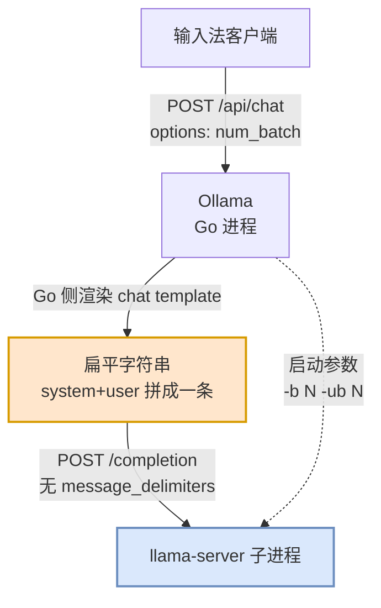

# 我的语音输入法，和 Hybrid 模型不肯给我的前缀缓存

昨天晚上我把本地语音输入法里负责润色的模型从 Qwen3.6 换成了 Qwen3.8，然后每说一句话就要等三秒半。

先把结论亮出来。同一份 system prompt、同一台机器、同样的短请求，只改一个 `num_batch`：

| num_batch | 短请求重算 token | 短请求总耗时 | 冷启动灌 system |
|---|---|---|---|
| 32 | 32–37 | 0.88s | 51.9s |
| 64 | 63–69 | **0.91s** | 28.4s |
| 128 | 127–133 | 1.01s | 17.7s |
| 256 | 255–261 | 1.40s | 16.7s |
| 512 | 511–517 | 2.19s | 16.2s |
| 1024（默认） | 1019–1029 | **3.95s** | 16.9s |

三秒。一个参数，一天付一次冷启动的代价，换回来每句话三秒。

坦诚说，这篇东西我写得有点心虚。我一直在 SGLang 这边混，KV cache、prefix cache、RadixAttention 这些词我张口就来，但**线性注意力的 cache 语义我此前基本没概念**——不是"了解得不深"，是压根没想过它和全注意力有什么不一样。这次是被自己每天要用几百次的东西按着头现学的。文章里那两次白跑的尝试我也原样保留了，因为它们比最后那个正确答案更有信息量：我两次都在拿正确的直觉去解一个前提已经变了的问题。

本文大致分四段：

1. 我的语音输入法是怎么搭的，以及它为什么会长出一个 5500 : 40 的病态负载；
2. 全注意力的前缀缓存为什么一直很便宜，而 Gated DeltaNet 的 recurrent state 为什么把这份便宜彻底收回去了；
3. 顺着 Ollama 一路读到 llama.cpp 的源码，找出"回退 1020 个 token"里那个 1020 是从哪来的；
4. 三次尝试的复盘，以及回头看 SGLang 的 MambaRadixCache 是怎么解同一道题的。

---

## 我的语音输入法是怎么搭的

我在 macOS 上用的语音输入不是某个现成产品，是自己拼的一条本地流水线：Qwen3-ASR 负责把声音转成字，后面接一个 LLM 负责把字变成人话。


橙色那一段是这篇文章的全部战场。为什么是这个形状，值得逐条说清楚，因为**负载的病态形状完全是被这些设计选择逼出来的**。

**为什么是两段，不是一个端到端的语音模型。** 现在能直接吃音频出文本、甚至端到端做改写的 omni 模型不少，我自己也在 SGLang 这边写过 [SGLang Omni 的推理框架设计](../../sglang/sglang-omni/why-sglang-omni.md)。但端到端把"听清"和"听懂我"耦合成了一件事，代价是我没法单独换掉其中一段。两段式多了一跳延迟，换来的是 ASR 和润色可以各自迭代——昨晚我只动了润色那一段，ASR 一个字没改，也不需要重新评测转写准确率。对一个自己维护的私人工具来说，这种可拆性比那一跳延迟值钱。

**为什么润色这一段非要一个强模型。** 这条是整套设计的核心，不能一句"LLM 效果好"带过。ASR 输出的是**声学上最可能的字**，而不是**语义上最可能的字**。而中文的同音字密度高得可怕，我这条流水线上最常见的错误就是这么来的：技术术语被写成同音的日常词，同事的姓被换成另一个同音姓，英文缩写被按发音转写成汉字。这类错误有一个共同特点——**它在声学上完全没错**。你换一个更大的 ASR 模型、更好的声学前端，一点用都没有，因为区分它们所需要的信息本身就不在声音里。

要纠正它，需要的是**先验**：知道我嘴里那个音对应的是哪位同事，知道我最近天天挂在嘴边的是哪个技术名词，知道我提到某个框架时习惯用哪个简称。这份先验没有别的载体可以放，只能塞进 system prompt。

**于是 system prompt 长到了 5500 token。** 它现在是一份私人词表加纠错规则的集合：人名、项目代号、术语表、我的口癖、以及一批"我知道这么写不规范但请你别改"的写法。这里有一个很要命的性质——**它只会越长不会越短**。每次我发现一个新的误识别，唯一的修法就是往里面再加一条。所以"把 system 写短一点"这个选项，从第一天起就不在桌面上。

**为什么必须在本地。** 那 5500 token 里几乎全是个人信息。同事的名字、还没公开的项目、我说话的习惯。这不是一个性能决策，是前提。

**为什么并发度是 1，而且不能攒批。** 语音输入是一个人类串行行为：我说完一句才有下一句，中间隔着我思考和喘气的时间。而输入法要边说边出字，攒几句一起发就等于让我干等。这条推出来的结论很硬：

> **所有吞吐向的优化对我一文不值。我只关心单条请求的延迟。**

这句话后面会兑现两次，先记住它。

**最后，对外端口前面挂了一层只打日志的代理**，不改写 model 名，纯粹是为了能看到每条请求真实的耗时构成——prefill 多久、decode 多久、命中了多少 token。它不参与任何优化，但**没有它这次 debug 根本无从下手**：我最开始的体感只有"变慢了"三个字，是日志把它拆成了"prefill 3.5s、decode 0.48s"，才让问题第一次变得可以被追。

把这几条摆在一起，我这条流水线的负载画像就出来了：**system 5500 token，user 几十到一百多 token，一条一条串行发，每次都是完整的 `[system, user]`，前缀重复率接近 100%。**

5500 比 40。这个比例意味着一件事：

> **我整个语音输入法的可用性，建立在"长 system 能被 cache 住"这一个假设上。** 如果每条请求都要老老实实把 5500 个 token 重算一遍，这套方案在第一天就不成立。

在此之前，这个假设从来没让我操过心。所以现在得回头看看，它凭什么一直成立。

---

## 前缀缓存为什么一直很便宜

我们平时说"前缀缓存命中了"，其实是把两件独立的事说成了一件。把它们拆开，是理解后面所有事情的前提。

第一件是**内容能匹配**。新请求和缓存里的旧序列做一次最长公共前缀（LCP），得出"前 5514 个 token 完全一样"。这一步纯粹是 token 序列的比对，和模型架构没有半点关系。

第二件是**状态能裁剪**。匹配出 5514 之后，你得能把 KV cache 真的截到第 5514 个位置，把后面属于旧 user 的部分丢掉，然后从 5514 接着往下算。

这两件事，我们习惯性地认为只要第一件成立第二件就自动成立。但第二件之所以成立，靠的是全注意力 KV cache 一个非常具体的物理性质：**可寻址性**。

展开来说，全注意力的 KV cache 长这样：

1. **per-token**。序列里第 `i` 个 token 算出来的 K 和 V，被独立地存在第 `i` 个槽位里。它是一份**流水账**，每一笔都单独记着。
2. **append-only**。第 `i` 个 token 的 K/V 一旦写进去就再也不会被后面的 token 修改。第 5600 个 token 的到来，不会动第 5514 个 token 的 K/V 一根汗毛。
3. **位置可索引**。既然是流水账而且每笔不可变，那"退回到第 5514 笔之后的状态"就是一个纯粹的记账操作——把 `n_past` 这个游标改成 5514，后面的槽位标记成空闲。**不需要重算任何东西**，代价是 O(1) 的元数据更新。

用我的数字过一遍：system 5500 token，user 40 token。第一条请求老老实实算 5540 个 token。第二条请求来了，LCP 匹配出 5500，游标退到 5500，只 prefill 新的那 40 个 token。**第二条请求的代价就是 40，不是 5540。**

所以"把稳定的长 system 拼在最前面"之所以在过去是一个近乎万能的技巧，不是因为这个技巧本身有多聪明，而是因为**匹配和裁剪这两个能力恰好都成立，而且裁剪成立得几乎免费**。我以前从来没觉得这是两件事，因为在全注意力的世界里，它们从来没分开过。

---

## Recurrent State 不能被裁开

上一节把前缀缓存拆成了匹配和裁剪，并指出裁剪之所以免费，是因为 KV cache 是一本可以翻到任意一页的流水账。那么很自然的一个问题是：**如果一个注意力机制根本不记流水账呢？**

Qwen3.8 用的 Gated DeltaNet 就是这样。

先把它的状态更新展开。最朴素的线性注意力，状态更新是这样一条递推：

$$S_t = S_{t-1} + v_t k_t^\top$$

`S` 是一个固定形状的矩阵，和序列长度无关。每来一个 token，就把它的 `v k^T` 加进去。DeltaNet 在这个基础上引入了 delta rule——**先擦后写**：写入新信息之前，先把状态里和当前 key 相关的旧内容读出来减掉，避免同一个 key 被反复叠加。Gated DeltaNet 再往上加一层 Mamba 式的 gating，给状态一个**自适应的遗忘率**，让模型自己决定这一步该忘掉多少历史。

三层加起来，细节很丰富，但对我们只有一个性质要紧：

> **状态是被一路加、擦、衰减上去的，不是被一个个存下来的。**

这里有个我觉得挺贴切的类比。**KV cache 是一本流水账，recurrent state 是一个只有余额的账户。** 余额是对的——它准确反映了前面 5500 笔交易的净结果。但你没法把它"退回到第 4536 笔之后的样子"，因为流水根本没记。想知道第 4536 笔之后的余额，只有一个办法：从某个你确实抄下过余额的时刻开始，把后面的交易重新过一遍。

线性注意力最著名的卖点是显存 O(1)、复杂度 O(N)。这次我算是从背面理解了这笔交易：

> **O(1) 的显存，代价恰好是 O(1) 的可寻址性。** 你把整段历史压进一个定长张量，换来的是常数显存；同时失去的，是"位置"这个维度本身。

这不是我的推测。llama.cpp 在实现 recurrent 内存的时候，把这句话直接写进了注释里。看 [`llama_memory_recurrent::seq_rm`](https://github.com/ggml-org/llama.cpp/blob/7e4c0a96880dae4fc4268ad441f8a6446bd5460a/src/llama-memory-recurrent.cpp#L170-L172)：

```cpp
    // models like Mamba or RWKV can't have a state partially erased at the end
    // of the sequence because their state isn't preserved for previous tokens
```

更明确的是能力枚举。llama.cpp 用 [`common_context_seq_rm_type`](https://github.com/ggml-org/llama.cpp/blob/7e4c0a96880dae4fc4268ad441f8a6446bd5460a/common/common.h#L970-L975) 来描述一个 context 到底能怎么删序列：

```cpp
enum common_context_seq_rm_type {
    COMMON_CONTEXT_SEQ_RM_TYPE_NO           = 0, // seq_rm not supported (e.g. no memory module)
    COMMON_CONTEXT_SEQ_RM_TYPE_PART         = 1, // can seq_rm partial sequences
    COMMON_CONTEXT_SEQ_RM_TYPE_FULL         = 2, // can seq_rm full sequences only
    COMMON_CONTEXT_SEQ_RM_TYPE_RS = 3, // can seq_rm partial sequences, bounded by n_rs_seq
};
```

全注意力模型是 `PART`——想删哪段删哪段，这正是上一节说的"裁到 LCP"。而 recurrent 那一侧是 `FULL`：**要么整条序列留着，要么整条序列扔掉，没有中间选项。**

注意，这一节动摇的**只是裁剪**。匹配那一半完全没受影响：LCP 照样能算出 5514/5558，引擎照样知道 system 一字未变。这个分裂后面会变得非常刺眼。

---

## Checkpoint：把连续问题变成离散问题

既然不能裁，那还剩什么办法？

只剩一个：**在若干个离散位置，把整份状态原样存一份快照；下次请求来了，恢复到某个快照，再从那里往后把剩下的 token 重新算一遍。** llama.cpp 管这个叫 context checkpoint。

回到账户的类比：既然没有流水，那我就时不时把当前余额抄在纸上。下次要回退，就找一张抄得最晚、又确实早于我要回退的位置的纸，从那儿重新记账。

这个方案能用，但它把代价模型**换掉了**。原来是：

$$\text{cost} \approx \text{prompt\_end} - \text{LCP}$$

现在变成：

$$\text{cost} \approx \text{prompt\_end} - \text{nearest\_valid\_checkpoint}$$

这一行是整篇文章的枢纽。**LCP 从代价公式里消失了。** 你的 system 有多稳定、前缀重合率是 99% 还是 99.99%，不再直接决定你付多少钱；决定你付多少钱的，是最近那张可用的纸抄在什么位置。

而"抄在什么位置"这件事，一下子引入了三个原来根本不存在的自由度：

- **打在哪里**——按消息边界？按固定间隔？按离结尾多远？
- **能存几个**——每份快照都是一整个 recurrent state，llama.cpp 的日志里会直接打出它占多少 MiB，所以"到处都打"不是可选项。
- **多近算太近**——两张纸抄得太密就是纯浪费，得有个最小间距。

这三个自由度请记住。后面我会挨个去撞它们——而真正要命的是第一个，"打在哪里"恰恰是三个里唯一**没有**直接开关的那个。

> 总的来说，checkpoint 是把一个**连续问题**（裁到任意位置）近似成了一个**离散问题**（跳到最近的点）。近似的质量，完全取决于点打得准不准——而不取决于你的前缀有多稳定。

---

## Qwen3.8

### 全貌

上一节的代价模型是模型无关的。要知道它在我这台机器上具体有多贵，得先看看跑的是什么。

[Qwen3.8-27B](https://huggingface.co/Qwen/Qwen3.8-27B) 是 Qwen 团队 2026 年 8 月放出来的 27B dense 模型，原生 262,144 的 context，可以靠 RoPE scaling 扩到 1M，训练时就带了 MTP。它其实是个多模态模型，语言主干外面还挂着一个视觉编码器，原生支持图像和视频——不过我这套流水线只喂纯文本进去，视觉那一半全程闲置，下面也就不提它了。真正要紧的是：**它从架构上就是一个 hybrid 模型**，不是事后改的，是设计如此。

我本地跑的是 Q4_K_M 量化的 GGUF，Ollama 里的 tag 是 `qwen3.8` / `qwen3.8:latest`，和 `qwen3.8:27b-mtp-q4_K_M` 是同一份权重。

### 计算与 cache 特征

抛开模型能力上的设计，从 cache 的角度看，这 64 层是怎么分的？

model card 里写得很清楚，层布局是：

$$16 \times \big(3 \times (\text{Gated DeltaNet} \to \text{FFN}) \to 1 \times (\text{Gated Attention} \to \text{FFN})\big)$$

也就是 **48 层线性注意力 + 16 层全注意力**，3:1。Gated DeltaNet 那一侧 48 个 V head、16 个 QK head，head dim 128；Gated Attention 那一侧 24 个 Q head、4 个 KV head，head dim 256。hidden 5120。

这两类层的 cache 行为是完全不同的两件事，而且各自的"为什么"都很直接：

- **那 16 层全注意力**：常规 KV cache，每个 token 的 K/V 独立保存，所以跨请求可复用、可截断。它是「前缀缓存为什么一直很便宜」那一节里的流水账。
- **那 48 层 Gated DeltaNet**：每个序列只有一份定长 state，不按 token 保存，因为它的定义就是把历史压进一个固定张量。它是「Recurrent State 不能被裁开」那一节里只有余额的账户。

于是就有了一个我一开始完全没预料到的结果。引擎不可能让一条序列的两半停在不同的位置上——全注意力那 16 层退到 5514、recurrent 那 48 层停在 4536，这样的状态是自相矛盾的。位置指针必须统一，而统一只能往保守的那一侧靠：

> **恢复位置由两者中更弱的那一侧决定。四分之三的层说了算。**

那 16 层全注意力**明明**可以裁到 5514，但它的这份能力在这条序列上完全用不出来。

---

## 一条 3.5 秒的短请求

现在读者手上有三样东西了：一个 5500 : 40 的负载，一个"代价 = 到最近快照的距离"的模型，和一个"48 层说了算"的架构事实。可以看日志了。

一条典型的旧请求（`num_batch` 是默认的 1024，runner 起来是 `-b 1024 -ub 1024`）：

- 共同前缀 **5514 / 5558**，99.2%，system 被完整认出来了
- restore 的 checkpoint 落在 **4536**
- 重算约 **1020** 个 token，耗时约 **3.5 秒**
- decode 14 个 token，只用了 **0.48 秒**

先把 decode 那一侧的嫌疑排掉。我这个 tag 是带 MTP 的（`draft-mtp`），日志里接受率接近 1.0，也就是说投机采样几乎每一步都被接受，decode 已经跑在很好的状态了。14 个 token 0.48 秒，占整条请求的零头。我在 [Power Up Speculative Decoding In Reinforcement Learning](../../rlhf/slime/spec/readme.md) 里写过 MTP 怎么把 decode 提上去，但这次它帮不上任何忙——**慢的是 prefill，而 MTP 从定义上就只作用于 decode**。

那么问题就干净了。引擎认出了 system，LCP 显示 99.2% 相同，可它把恢复位置退到了 4536，重算了 1020 个 token。

> **内容对上了，为什么边界对不上？1020 这个数字，到底是从哪来的？**

这是这篇文章要回答的问题。注意它**不是**"怎么让 Ollama 变快"——那是结果。真正要问的是**恢复粒度由什么决定**，因为只有知道了这个，才知道该去拧哪个旋钮。

一个不太直观的观察，先放在这里：5558 − 4536 = 1022，而我的 `-ub` 恰好是 1024。

---

## Ollama 到底在跑什么

要回答"点打在哪里"，得先知道**是谁在打点**。我原以为这是 Ollama 的事，读了源码才发现自己一直搞错了对象。

Ollama 现在的做法是：用一个 `LLAMA_CPP_VERSION` 文件钉死上游 llama.cpp 的版本（我看的这个 commit 上是 tag `b10434`），配置阶段把源码拉下来、打上 `llama/compat/` 里的补丁、编译出 `llama-server`，然后**作为子进程拉起来**，自己只当一层 HTTP 前端。



这个结构立刻解释了一件我之前觉得很奇怪的事：我曾经把 `LLAMA_ARG_CHECKPOINT_MIN_SPACING_NT` 写进启动脚本，在进程环境里确认它生效了——**当然会生效，因为跑着的就是原汁原味的 llama-server**，llama.cpp 的 CLI 参数、环境变量、日志格式在这条链路上全部有效。

顺着这条链路读下去，有三处实现细节直接决定了后面所有事情。

**第一处：`num_batch` 同时设了 `-b` 和 `-ub`。** 在 [`appendBatchArgs`](https://github.com/ollama/ollama/blob/e5a81899d014a847a08d47393351908b53d74008/llm/llama_server.go#L581-L594) 里：

```go
	if opts.NumBatch > 0 {
		params = append(params, "-b", strconv.Itoa(opts.NumBatch), "-ub", strconv.Itoa(opts.NumBatch))
	}
```

一个 Ollama 参数，绑死了 llama.cpp 里两个概念上不同的东西——`n_batch`（一次调度多少 token）和 `n_ubatch`（一次真正喂进 GPU 的微批大小）。**这一行是后面"改 `num_batch` 有效"的唯一原因**，但为什么有效，得等到下一节才揭晓。

**第二处：prompt 是在 Go 侧渲染好的，走 `/completion`。** 看 [`appendJinjaArgs`](https://github.com/ollama/ollama/blob/e5a81899d014a847a08d47393351908b53d74008/llm/llama_server.go#L776-L787)：

```go
func appendJinjaArgs(params []string, config LlamaServerConfig) []string {
	if config.DisableJinja {
		// Go-rendered chat paths send already-rendered prompts through completion
		// endpoints. Override any GGUF chat template so llama-server startup
		// does not parse an unused model template. llama-server still requires a
		// template name, so chatml is a startup-only placeholder and must not be
		// used for request routing.
		return append(params, "--no-jinja", "--chat-template", "chatml")
	}

	return params
}
```

注释写得很老实：Go 渲染好的 prompt 从 completion 端点进去，所以干脆让 llama-server 别去解析模型自带的模板，塞一个 `chatml` 当占位符。请求最终打到的是 [`/completion`](https://github.com/ollama/ollama/blob/e5a81899d014a847a08d47393351908b53d74008/llm/llama_server.go#L1628)。

这意味着——**llama-server 收到的是一条扁平字符串，不是 `[system, user]`。** 我之前写过 [一文理解 special tokens 和 chat template](../../transformers/special_tokens/special_tokens.md)，讲的是 chat template 怎么把结构化消息压成一条 token 序列。那时候我只把它当成一个正确性问题（模板对不对、special token 会不会被吃掉），这次它第一次变成了一个**性能问题**：压扁这个动作，把消息边界信息丢掉了。

**第三处：请求体里没有 `message_delimiters`。** 这是[请求结构体](https://github.com/ollama/ollama/blob/e5a81899d014a847a08d47393351908b53d74008/llm/llama_server.go#L1393-L1415)：

```go
// llamaServerCompletionRequest is the request format for llama-server's POST /completion endpoint.
type llamaServerCompletionRequest struct {
	Prompt          any             `json:"prompt"`
	Stream          bool            `json:"stream"`
	CachePrompt     bool            `json:"cache_prompt"`
	NPredict        int             `json:"n_predict,omitempty"`
	NKeep           int             `json:"n_keep,omitempty"`
	Temperature     float32         `json:"temperature"`
	TopK            int             `json:"top_k"`
	TopP            float32         `json:"top_p"`
	MinP            float32         `json:"min_p"`
	Stop            []string        `json:"stop,omitempty"`
	RepeatPenalty   float32         `json:"repeat_penalty"`
	RepeatLastN     int             `json:"repeat_last_n"`
	FreqPenalty     float32         `json:"frequency_penalty"`
	PresPenalty     float32         `json:"presence_penalty"`
	TypicalP        float32         `json:"typical_p,omitempty"`
	Seed            int             `json:"seed"`
	Grammar         string          `json:"grammar,omitempty"`
	JsonSchema      json.RawMessage `json:"json_schema,omitempty"`
	NProbs          int             `json:"n_probs,omitempty"`
	PreservedTokens []string        `json:"preserved_tokens,omitempty"`
}
```

采样参数一应俱全，`cache_prompt` 也老老实实带上了。**唯独没有 `message_delimiters` 这个字段**——为什么这个缺席要紧，下一节就知道了。

> 总的来说：不是 llama.cpp 不肯在消息边界打点，而是在这条链路上，**它压根不知道消息边界在哪。**

---

## 点打在哪里：llama.cpp 的三条打点路径

上一节确认了 llama-server 收到的是一条没有边界信息的扁平 prompt。那就进源码看看，在这种输入下它还剩哪些打点路径。

### 路径一：消息边界（在这条链路上整条哑火）

llama.cpp 其实**是**会在消息边界打点的。在往 batch 里填 prompt token 的循环里有[这么一段](https://github.com/ggml-org/llama.cpp/blob/7e4c0a96880dae4fc4268ad441f8a6446bd5460a/tools/server/server-context.cpp#L3452-L3460)：

```cpp
                        // break at the last user message, or at user messages at least min step past the last checkpoint
                        if (do_checkpoint && spans.is_user_start(slot.prompt.n_tokens())) {
                            const auto pos = slot.prompt.n_tokens();
                            const auto & checkpoints = slot.prompt.checkpoints;

                            if (pos == last_user_pos || checkpoints.empty() || pos > checkpoints.back().n_tokens + params_base.checkpoint_min_step) {
                                break;
                            }
                        }
```

`break` 出来就意味着当前 batch 到此为止，随后会在这个位置创建一个 checkpoint。而且它对**最后一条 user 消息**是特别关照的：`pos == last_user_pos` 这个条件绕过了所有间距限制——不管离上一个点多近，最后一条 user 消息前面**一定**给你留一个点。

这正是我想要的行为。长 system 后面跟一句短 user，点打在 user 的起点，那不就等于打在 system 的结尾么？那样短请求的代价就真的只剩短 user 本身了。

问题出在 `spans` 从哪来。往上追到[任务创建的地方](https://github.com/ggml-org/llama.cpp/blob/7e4c0a96880dae4fc4268ad441f8a6446bd5460a/tools/server/server-context.cpp#L4194-L4210)：

```cpp
        // message delimiters for checkpointing
        auto delimiters = common_chat_msg_delimiters_parse(json_value(data, "message_delimiters", json::array()));
        delimiters.tokenize(ctx_server.vocab);
        // ...
            task.params.message_spans = task.tokens.find_message_spans(delimiters);
```

`message_delimiters` 是**请求体里的一个 JSON 字段**，缺省值是 `json::array()`——一个空数组。空数组进去，空 spans 出来，`is_user_start(...)` 永远返回 false。

于是上一节那个"唯独没有 `message_delimiters`"就接上了。**这条路径不是坏了，是从来没被通电过。**

### 路径二：prompt 尾部的两个固定偏移（实际生效的那条）

紧挨着上面那段，是[真正在我这条链路上生效的逻辑](https://github.com/ggml-org/llama.cpp/blob/7e4c0a96880dae4fc4268ad441f8a6446bd5460a/tools/server/server-context.cpp#L3462-L3481)：

```cpp
                        // process the last few tokens of the prompt separately in order to allow for a checkpoint to be created.
                        // create checkpoints that many tokens before the end of the prompt:
                        //  - 4 + n_ubatch
                        //  - 4
                        // ref: https://github.com/ggml-org/llama.cpp/pull/20288
                        if (do_checkpoint) {
                            static const int checkpoint_offsets[] = {4 + n_ubatch, 4};

                            bool should_break = false;
                            for (int offset : checkpoint_offsets) {
                                const int n_last = std::min(n_batch, offset);
                                if (slot.task->n_tokens() == slot.prompt.n_tokens() + n_last) {
                                    should_break = true;
                                    break;
                                }
                            }
                            if (should_break) {
                                break;
                            }
                        }
```

看见 `4 + n_ubatch` 的一瞬间我就知道 1020 是从哪来的了。

逐步拆开：

1. 这里打的两个点，位置是**相对 prompt 结尾**算的：一个在 `end − (4 + n_ubatch)`，一个在 `end − 4`。
2. `const int n_last = std::min(n_batch, offset);` 又把偏移量夹在了 `n_batch` 以内。
3. 而上一节我们知道，Ollama 令 `n_batch == n_ubatch == num_batch`。所以 `4 + n_ubatch` 必然大于 `n_batch`，被 `min` 夹回去——**深点实际落在 `end − num_batch`，浅点落在 `end − 4`**。

设计意图在 [PR #20288](https://github.com/ggml-org/llama.cpp/pull/20288) 里说得很清楚：深点是给"会话转向、需要大幅回退"准备的，浅点是给"最后一条 user 消息被小改一下"准备的。对多轮对话，这两个点很合理。对我这种**每条请求都换一个全新 user** 的负载，浅点每次都作废，深点就是唯一的救命稻草。

### 恢复的时候，为什么浅点必然作废

[恢复路径](https://github.com/ggml-org/llama.cpp/blob/7e4c0a96880dae4fc4268ad441f8a6446bd5460a/tools/server/server-context.cpp#L3253-L3288)是这样找点的：

```cpp
                                if (pos_min >= pos_min_thold) {
                                    // search for a context checkpoint
                                    const auto it = std::find_if(
                                        slot.prompt.checkpoints.rbegin(),
                                        slot.prompt.checkpoints.rend(),
                                        [&](const auto & cur) {
                                            // workaround for [TAG_CHECKPOINTS_FIX_POS_MIN]
                                            if (cur.pos_max > pos_next) {
                                                return false;
                                            }
                                            return cur.pos_min < pos_min_thold || cur.pos_min == 0;
                                        }
                                    );

                                    bool do_reset = it == slot.prompt.checkpoints.rend();
                                    // ...
                                    if (do_reset) {
                                        SLT_TRC(slot, "forcing full prompt re-processing due to lack of cache data (likely due to SWA or hybrid/recurrent memory, see %s)\n",
```

关键是 `cur.pos_max > pos_next` 这个否决条件。`pos_next` 大致就是 LCP 匹配到的位置（我这里是 5514 附近）。上一条请求留下的浅点在 `prev_end − 4`，它身上带着**上一条的 user token**，位置远在 5514 之后，`pos_max > pos_next` 成立，直接被否决。

所以每来一条新请求，尾部那个最有价值的点必然作废，能用的只剩深点。

把一条稳态请求上的位置关系摆开，是这样的（`L` 是 system 结尾也就是 LCP 匹配到的位置，`p` 是上一条 user 的长度）：

| 位置（从前往后） | 这里有什么 |
|---|---|
| `0 … L` | system，5514 个 token，每条请求一字不变 |
| `L + p − num_batch` | 上一条请求留下的**深点**——落在 `L` 之前，**可用** |
| `L` | LCP 匹配到的位置。**理想的恢复点，但这里没有点** |
| `L … L + p` | 上一条请求的 user |
| `L + p − 4` | 上一条请求留下的**浅点**——带着旧 user，`pos_max > pos_next`，**被否决** |

于是有了一条**可以直接拿去用的经验规律**，而且它是量出来的，不依赖任何推断：

> **稳态下，一条短请求的重算量 ≈ `num_batch`。**

后面 ablation 表的六行就是这条规律本身：32 → 32~37，64 → 63~69，1024 → 1019~1029。最初那条日志也一样，`5558 − 4536 = 1022`，而 `-ub` 恰好是 1024。

至于**为什么恰好是一个 `num_batch`**，我可以给一个和源码、数据都对得上的解释，但得先说清成色——**这是我读代码重建出来的机制，不是我验证过的**。设这一条 user 长 `c`：上一条请求的 prompt 结尾在 `L + p`，深点大致在 `L + p − num_batch`；这一条的结尾在 `L + c`，于是

$$\text{重算量} \approx (L + c) - (L + p - \text{num\_batch}) = \text{num\_batch} - p + c$$

ablation 的每个条件里我发的都是同一批短句，`p` 和 `c` 量级相同，`−p + c` 基本抵消，剩下的正好是 `num_batch`。

但这个重建有两个窟窿，我没堵上。

**一是我把"checkpoint 在 decode 之前创建"这件事吞掉了。** 源码里那句注释写得明明白白：

```cpp
                    // note: we create the checkpoint before calling llama_decode(), so the current batch is not
                    //       yet processed and therefore it is not part of the checkpoint.
```

也就是说快照的 `pos_max` 停在**上一个 batch 的结尾**，而不是 `end − n_last`，中间差着整整一个 batch。我在上面的算式里当它不存在。

**二是小 `num_batch` 那两行讲不通。** 一句几十个 token 的短句，`p` 很可能大于 32。按上面的算式，深点会落到 `L` 之后，被 `cur.pos_max > pos_next` 一票否决，然后老老实实 full reprocess 5500 个 token。可实测是 32~37。**所以这个重建至少在小 batch 区间是不完整的。**

要钉死它其实不难，跑一轮 `--log-verbosity 4`，把这两行 trace 抓出来就够了：

```
created  context checkpoint (pos_min = %d, pos_max = %d, n_tokens = %lld, size = %.3f MiB)
restored context checkpoint (pos_min = %d, pos_max = %d, n_tokens = %lld, n_past = %d, size = %.3f MiB)
```

它们直接给出每个点的 `pos_min` / `pos_max`，一眼就能看清点到底打在哪。这个坑我先留着。

**不过对"该拧哪个旋钮"这件事来说，机制清不清楚并不影响结论**：重算量随 `num_batch` 线性变化，这是六个数据点直接量出来的。**一句 44 个 token 的 user，让我付了 1022 个 token 的账**——而这笔账和我的 system 有多长、有多稳定，一点关系都没有。

### 路径三：最小间距 `-cms`，以及它管不着的地方

llama-server 有 [`-cms` / `--checkpoint-min-step`](https://github.com/ggml-org/llama.cpp/blob/7e4c0a96880dae4fc4268ad441f8a6446bd5460a/common/arg.cpp#L1695-L1704) 这个参数，[默认 8192](https://github.com/ggml-org/llama.cpp/blob/7e4c0a96880dae4fc4268ad441f8a6446bd5460a/common/common.h#L613-L614)。名字听起来就很像"点之间隔太远了，调小一点就能多打几个"。

但它实际只管两件事。一是在 [`create_checkpoint`](https://github.com/ggml-org/llama.cpp/blob/7e4c0a96880dae4fc4268ad441f8a6446bd5460a/tools/server/server-context.cpp#L2242-L2259) 里驱逐**别的任务**留下的、离前一个点太近的旧点。二是创建时的这个[判据](https://github.com/ggml-org/llama.cpp/blob/7e4c0a96880dae4fc4268ad441f8a6446bd5460a/tools/server/server-context.cpp#L3526-L3531)：

```cpp
                    // no need to create checkpoints that are too close together, unless it's the last user message
                    do_checkpoint = do_checkpoint && (
                            slot.prompt.checkpoints.empty() ||
                            is_last_user_message || near_prompt_end ||
                            n_tokens_start > slot.prompt.checkpoints.back().n_tokens + params_base.checkpoint_min_step);
```

注意 `near_prompt_end` 在这个或运算里的位置。它的[定义](https://github.com/ggml-org/llama.cpp/blob/7e4c0a96880dae4fc4268ad441f8a6446bd5460a/tools/server/server-context.cpp#L3489)是：

```cpp
                    const bool near_prompt_end = slot.task->n_tokens() < slot.prompt.n_tokens() + n_ubatch;
```

也就是"离 prompt 结尾不到一个 ubatch"。而路径二打的那两个点，**按定义就全都在这个范围里**。所以它们走 `near_prompt_end` 这一路短路，`checkpoint_min_step` 那一项**根本不参与求值**。

> `-cms` 管的是"点会不会因为太密而被丢掉"。而我的问题是"点太少了"。这两件事没有交集。

### 一个存在但用不上的机制：`n_rs_seq`

读 `seq_rm` 的时候我还撞见一个挺意外的东西。在那句"Mamba 不能部分擦除"的注释下面几行，[藏着一条精确回滚的路径](https://github.com/ggml-org/llama.cpp/blob/7e4c0a96880dae4fc4268ad441f8a6446bd5460a/src/llama-memory-recurrent.cpp#L181-L189)：

```cpp
            // partial rollback via per-token snapshot index (bounded by n_rs_seq)
            if (0 < p0 && p0 <= cell.pos && p1 > cell.pos) {
                const llama_pos rollback = cell.pos - (p0 - 1);
                if (rollback >= 1 && rollback <= (llama_pos) n_rs_seq) {
                    set_rs_idx(seq_id, (uint32_t) rollback);
                    cell.pos = p0 - 1;
                    return true;
                }
                return false;
            }
```

这是一个**逐 token 的 recurrent state 快照环**。只要要回退的距离不超过 `n_rs_seq`，就可以精确退回去——不用重放，不用近似。这不正是我要的东西吗？

然后我去找 `n_rs_seq` 从哪来，[答案有点扫兴](https://github.com/ggml-org/llama.cpp/blob/7e4c0a96880dae4fc4268ad441f8a6446bd5460a/common/common.h#L386-L392)：

```cpp
    uint32_t need_n_rs_seq() const {
        bool needs_rs_seq = std::any_of(types.begin(), types.end(), [&](auto t) {
            return t == COMMON_SPECULATIVE_TYPE_DRAFT_MTP || t == COMMON_SPECULATIVE_TYPE_DRAFT_EAGLE3 || t == COMMON_SPECULATIVE_TYPE_DRAFT_DFLASH || t == COMMON_SPECULATIVE_TYPE_DRAFT_DSPARK;
        });

        return needs_rs_seq ? draft.n_max : 0u;
    }
```

它完全由投机采样的配置驱动，深度等于 `draft.n_max`。换句话说：

> **我开着的 MTP 顺手送了我一个精确回滚环，但它只有几个 token 深——刚好够 draft 被拒时退回去，兜不住一句 user。**

这个巧合有点好笑：能救我的机制就在那儿，而且因为我开了 MTP，它甚至是启用状态的，只是深度差了一两个数量级。

---

## 三次尝试

回到「Checkpoint：把连续问题变成离散问题」列出的那三个自由度。"能存几个"可以先划掉——`-ctxcp` 默认允许 32 个点，而我这条链路上统共就打了 2 个，上限根本没碰到。剩下"打在哪里"和"多近算太近"，我按真实的时间顺序各撞了一次，**两次都撞空**；最后管用的那个旋钮，是从 `min(n_batch, offset)` 这个夹子的侧面绕进去的。

两次白跑其实比最后那个正确答案更值得写——它们暴露的是我的心智模型还停在全注意力时代。

### baseline：什么都不做

每条短请求约 3.95 秒，重算约 1020 个 token。不可用。

### 尝试一：加固定垫文（失败）

我最开始的假设是：**两个 checkpoint 贴得太近所以留不住，那就想办法把它们撑开。** 具体做法是在 user 前面塞一段固定不变的垫文，把 system 结尾和 prompt 结尾之间的距离拉开。

这里还多绕了一层。我当时纠结垫文该放进 system 还是放进 user，理由是"checkpoint 大概是按消息边界打的，角色分界会影响结果"。这个判断被实验干脆利落地否掉了——现在回头看，「Ollama 到底在跑什么」那一节的第二处细节早就把答案写在那儿了：llama-server 收到的本来就是一条扁平字符串，**根本没有角色这回事**。

对照实验做得还算干净，同一份真实 system prompt，一个 baseline 加五种垫法：

| 条件 | 共同前缀 | restore 位置 | prefill |
|---|---|---|---|
| 不垫 | 99%+ | 结尾 − 约 1020 | 约 3.6s |
| 垫进 user（800 字） | 99%+ | 结尾 − 约 1020 | 约 3.6s |
| 垫进 user（1600 字） | 99%+ | 结尾 − 约 1020 | 约 3.6s |
| 垫进 user（3200 字） | 99%+ | 结尾 − 约 1020 | 约 3.6s |
| 垫进 system（1600 字） | 99%+ | 结尾 − 约 1020 | 约 3.6s |
| 垫进 system（3200 字） | 99%+ | 结尾 − 约 1020 | 约 3.6s |

一模一样。现在用上一章那条「重算量 ≈ num_batch」的规律一秒就能解释：**偏移量是相对 prompt 结尾算的，和稳定前缀有多长毫无关系。** 垫文只是把那一对点整体往后平移，间距纹丝不动。

而且这里藏着一个和我旧直觉完全相反的推论：

> 在这套机制下，**把 system 写得更长，只会让"从旧点重算到新结尾"更贵**。过去"system 尽管拼、反正只付 user 的钱"的经验，在这里是反的。

### 尝试二：调 `-cms`（失败）

第二个假设是：**最小间距 8192 太大了，把本该存在的点挤掉了。** 我把 `-cms` 设成 32，写进启动脚本，还专门在进程里确认了 `LLAMA_ARG_CHECKPOINT_MIN_SPACING_NT` 确实生效。

日志纹丝不动：restore 4536，重算 1017 个 token，3.46 秒。

原因上一章已经拆过了——尾部那两个点走的是 `near_prompt_end` 短路，压根不看 `cms`；何况它们本来就隔了 1020，把下限从 8192 调到 32，也不会凭空多出第三个点来。后来我把这一行从启动脚本里删掉了。

两次失败有个共同点值得说一句：**我一直在试图让引擎多打几个点，或者把点打得更靠前。而这两件事在这条链路上都不是我能控制的。**

### 尝试三：减小 `num_batch`（成功）

前两次失败逼出来的正确认识是：既然**回退距离 ≈ 一个 ubatch**，而请求形态改不了、打点位置也改不了，那就换个方向——**让"回退一个 batch"这件事本身变便宜**。

实验方法这里得交代清楚，否则数据没有意义。每个 `num_batch` 条件都是：先 `ollama stop` 把模型和 KV 全部卸掉，再单独冷启动，预热 1 次，然后发 3 次短 user。**条件之间不共用任何 cache**；而**条件内部的 cache 复用是故意保留的**，因为那就是线上的真实形态。

| num_batch | 短请求重算 token | 短请求总耗时 | decode | 冷启动灌 system |
|---|---|---|---|---|
| 32 | 32–37 | 0.88s | ~273ms | 51.9s |
| 64 | 63–69 | 0.91s | ~273ms | 28.4s |
| 128 | 127–133 | 1.01s | ~273ms | 17.7s |
| 256 | 255–261 | 1.40s | ~273ms | 16.7s |
| 512 | 511–517 | 2.19s | ~273ms | 16.2s |
| 1024 | 1019–1029 | 3.95s | ~273ms | 16.9s |

decode 那一列恒定在约 273ms，和 batch 完全无关——**再一次确认瓶颈只在 prefill**。

同时也能看到代价：`num_batch` 越小，冷启动灌那 5500 个 token 越亏，128 往下开始明显劣化，到 32 已经要 52 秒。小 batch 意味着更多轮次、更差的并行度，这在 prefill 这种计算密集的阶段是实打实的损失。

那到底选哪个？这就要回到开头讲流水线时那句话了：

> **所有吞吐向的优化对我一文不值。我只关心单条请求的延迟。**

我的日常形态是"开机 preload 一次，然后一整天几百条短请求"。冷启动我一天只付一次，短请求延迟我一天付几百次。这个不对称让选择变得非常容易——下面按**一天 200 条**这个量级算一笔总账（200 是个方便计算的整数，换成 300 或 500 结论完全不变，只会让冷启动那一项更不重要）：

| num_batch | 短请求延迟 | 冷启动 | 一天 200 条请求的总等待 | 判断 |
|---|---|---|---|---|
| 32 | 0.88s | 51.9s | 176s + 52s ≈ 228s | 冷启动多付 24s，只换回 6s，不值 |
| **64** | **0.91s** | **28.4s** | **182s + 28s ≈ 210s** | **最优** |
| 128 | 1.01s | 17.7s | 202s + 18s ≈ 220s | 冷启动省 11s，短请求多付 20s |
| 256 | 1.40s | 16.7s | 280s + 17s ≈ 297s | 明显变差 |
| 1024 | 3.95s | 16.9s | 790s + 17s ≈ 807s | 默认值，不可用 |

选 **64**。短请求比默认的 1024 快约 3 秒，冷启动 28 秒一天付一次。32 还能再省约 30ms，但冷启动要 52 秒——为了每条快 3% 而让开机多等 24 秒，我个人觉得不划算。

**一个落地上的坑**：`num_batch` 要写在**每一条请求**的 `options` 里，不能只在起服务的时候设一次。漏掉一条就可能触发按 1024 重新加载，然后你会莫名其妙地看到某一句又变慢了。

### 线上验证，以及那个"对不上"的 146

改完之后拿一条真实请求（比实验用的测试短句长一些）验证：

- restore 从 4536 变成 **5492**
- 重算 **146** 个 token / 1.17s（这句 user 本身约 125 个新 token）
- 整条请求 2.75s，其中 decode 44 个 token 占 1.44s
- MTP 接受率仍然是 1.0

有效。但 146 不是 64，这个数字第一眼看着像是哪里出了错。

先看不依赖任何猜想的那一半：这句 user 本身就带了约 125 个新 token，它们无论如何都得算。**所以真正"多付"的只有 21 个 token**；而改之前那条请求，在 44 个新 token 之外多付了将近 980 个。这个对比本身就够了。

至于 21 是怎么来的——套用上一章那个尚未验证的重建，`重算量 ≈ num_batch − p + c = 64 − p + 125`，反解出 `p ≈ 43`，也就是上一条 user 大约 43 个 token。这个量级和我平时随口一句话是对得上的。但我得把话说明白：**`p` 是我从 146 反解出来的，不是从日志里读出来的**，再拿它回头去"验证"公式就是循环论证。真正的验证还是得看 `created / restored context checkpoint` 那两行 trace。

不管机制最终长什么样，可测的事实不变：固定开销从 `num_batch = 1024` 降到了 64，短请求从 3.95s 降到 0.91s。这就是我要的结果。

值得注意的是，这里 decode 反而成了大头：44 个 token 花了 1.44 秒。整条链路的瓶颈已经从 prefill 转移走了，这是另一个故事了。

---

## 换一种打点方式：SGLang 的 MambaRadixCache

上一节的结论是"在 llama.cpp 这条链路上，最优解是把回退距离调小"。但这只是**位置寻址**这条路线的局部最优。一个真正为 hybrid 模型设计的生产级引擎，会怎么解这道题？

巧的是我们自己就在做这件事。SGLang 从 Qwen3-Next 那一代开始支持 hybrid linear 模型，[PyTorch 官方博客上那篇 Hybrid Models Meet SGLang](https://pytorch.org/blog/hybrid-models-meet-sglang-more-than-full-attention/) 里对 Mamba state 的判断，和我这篇前几节的推导几乎逐条对应：

1. SSM state 是 in-place 更新的，一个请求的 state 没法回滚成它自己前缀的 state——这正是「Recurrent State 不能被裁开」里那条 `COMMON_CONTEXT_SEQ_RM_TYPE_FULL`；
2. SSM state 比单个 token 的 KV 大好几个数量级——这正是「Checkpoint：把连续问题变成离散问题」里说的"快照不是免费的"；
3. 大多数 SSM forward kernel 的可复用性是 "all or nothing" 的。

同一组约束，SGLang 给出的答案叫 `MambaRadixCache`——一棵混合 radix 树。它和 llama.cpp 那两个尾部偏移的差别，在源码里看得比在博客里清楚得多。

### match：找的是"还留着 state 的最深节点"

[`_match_prefix_helper`](https://github.com/sgl-project/sglang/blob/385903b0acd69455cb688b5cb5e3afcc0fd91598/python/sglang/srt/mem_cache/mamba_radix_cache.py#L1086-L1125) 一路沿着 radix 树往下走：

```python
        node = self.root_node
        child_key = key.child_key(self.page_size)

        value: List[torch.Tensor] = []
        best_value_len = 0
        best_last_node = node
        while len(key) > 0 and child_key in node.children.keys():
            child = node.children[child_key]
            # update best_value_len and best_last_node if needed
            if node.mamba_value is not None:
                best_value_len = len(value)
                best_last_node = node
            ...
```

注意 `best_last_node` 的更新条件——**只有当 `node.mamba_value is not None` 时才更新**。也就是说它返回的不是"匹配最长的节点"，而是"匹配路径上最后一个还留着 Mamba state 的节点"。这两件事在 llama.cpp 那边是揉在一起的（能不能匹配、有没有点可恢复），在这里被拆成了树的结构（匹配）和节点上的 `mamba_value`（有没有 state）两个正交的维度。

关键在于**这个位置是 prompt 内容决定的**。我那 5500 个 token 的 system 每条请求一字不变，radix 树必然会在 system 结束的地方形成一个节点——因为那正是所有请求开始分叉的位置。

### evict：Mamba state 可以从树中间挖掉

两条淘汰路径放在一起看，差别一目了然。[`evict_full`](https://github.com/sgl-project/sglang/blob/385903b0acd69455cb688b5cb5e3afcc0fd91598/python/sglang/srt/mem_cache/mamba_radix_cache.py#L896-L919) 拿的是叶子：

```python
        # get the least recently used leaf node that is not locked
        x = self.full_lru_list.get_leaf_lru_no_lock()
```

而 [`evict_mamba`](https://github.com/sgl-project/sglang/blob/385903b0acd69455cb688b5cb5e3afcc0fd91598/python/sglang/srt/mem_cache/mamba_radix_cache.py#L861-L893) 拿的是任意节点，注释写得很直白：

```python
        # get the least recently used node that is not locked, doesn't have to be a leaf
        x = self.mamba_lru_list.get_lru_no_lock()
        ...
            if len(x.children) > 0:
                # 1. an internal node, free mamba tokens.
                self._free_mamba_value(x.mamba_value)
                mamba_num_evicted += len(x.mamba_value)
                ...
                # 3. tombstone the node
                self._tombstone_internal_node(x)
```

为什么能这样？因为 KV 是前缀关系——父节点的 KV 是子节点 KV 的前缀，删了父就等于毁了所有子，所以只能从叶往根删。而每个节点的 Mamba state 是**自足的**：它是"走到这个位置时的完整状态"，不构成前缀链，删掉一个不影响任何别的节点。

被挖掉的内部节点走的是 [`_tombstone_internal_node`](https://github.com/sgl-project/sglang/blob/385903b0acd69455cb688b5cb5e3afcc0fd91598/python/sglang/srt/mem_cache/mamba_radix_cache.py#L1354-L1357)：

```python
    def _tombstone_internal_node(self, node: TreeNode) -> None:
        assert len(node.children) != 0, f"Cannot tombstone a leaf node, {node.id=}"
        self.mamba_evictable_size_ -= len(node.mamba_value)
        node.mamba_value = None
```

节点本身留在树上，只是 `mamba_value` 被置空——它的 KV 和所有子节点毫发无损，只是不能再从这里恢复 Mamba state 了。这就接回了上面 `_match_prefix_helper` 里那个 `is not None` 判断：**墓碑节点仍然参与前缀匹配，但不再是候选恢复点。**

这是我读这份源码最大的收获，博客里没提。它把"这段前缀我认得"和"这段前缀我能恢复"彻底解耦成了两件可以独立淘汰的事——而在 llama.cpp 那边，这两件事的分裂恰恰是我这篇文章开头那个 3.5 秒的全部来源。

### 所以差别在哪

把 match 和 evict 这两段放在一起，和前面 llama.cpp 那三条打点路径一对照，最根本的那一条差别就露出来了：

> **llama.cpp 的 checkpoint 是按位置打的**——"离结尾 N 个 token"，和 prompt 的内容毫无关系。**SGLang 是按内容打的**——radix 树的节点边界，天然就是共享前缀的边界。

在我这种"长 system + 短 user、前缀重合 99%"的负载上，这个差别是决定性的。radix 树会自然而然地在 system 结束的地方形成一个节点，因为那正是所有请求开始分叉的位置。而 llama.cpp 只能把点打在离结尾一个 ubatch 的地方，管你前面 5500 个 token 是不是一模一样。

**同样是"不能裁只能快照"，快照放在哪儿，决定了一切。**

顺带说一句什么变了、什么没变，因为这个容易产生错误的心理模型。SGLang 把内存池拆成了两个——Mamba pool 按 **request 级**分配（用 `HybridReqToTokenPool` 把 state 和请求的生命周期绑定），KV cache pool 仍然按 **token 级**分配（用 `HybridLinearKVPool` 做逻辑层号到物理层号的映射，好让线性层不白占 KV 空间）。变的是分配粒度和淘汰策略；**没变的是全注意力那些层的 KV 语义**——它们还是那本可以翻到任意一页的流水账，radix 树对它们的处理和纯 attention 模型没有区别。（这两个池子怎么瓜分显存、`--mamba-full-memory-ratio` 那笔账怎么算，可以接着看 [当 SGLang OOM 的时候，究竟在 OOM 什么？](../../sglang/kvcache-code-walk-through/mem-fraction-static.md)。）

投机采样那边的处理也很有意思：每个 draft token 分一个独立的 Mamba cache slot，接受之后把最后一个被接受的 slot 提升成主 state。这和「点打在哪里」那一章里的 `n_rs_seq` 快照环是同一类思路的两种实现——**都是拿显存换回滚能力**，只是一个做在 kernel 之外的调度层，一个做在 memory 模块内部。

最后我想克制一句，别把这写成"SGLang 完胜"。llama.cpp 面对的约束完全不同：单机、单并发、要在 Metal 上跑、还要能被 Ollama 静态编译进去、不能引入一棵需要精细内存管理的树。在那组约束下，"尾部打两个点"是一个便宜、无状态、几乎不会出错的工程折衷。它在我这个负载上表现糟糕，是因为我的负载恰好踩在它的假设之外——它假设你在做多轮对话，而我每一条都是全新的单轮。

---

## 还没走的路

`num_batch=64` 是一个够用的答案，但它治的是症状。真正根本的解法是把「点打在哪里」那一章里哑火的消息边界路径**接通**。有三条路，我都还没走，诚实地摆在这里。

**路子一：让请求带上 `message_delimiters`。** llama-server 的 `/completion` **已经接受**这个字段了，代码就在「路径一：消息边界」里引的那几行。只要 Ollama 在 `llamaServerCompletionRequest` 里加上它，`is_user_start` 那条路径立刻通电，点会直接打在最后一条 user 消息的起点——也就是 system 的结尾。那样短请求的代价就真的只剩这句 user 本身，**而且和 `num_batch` 完全解耦**，冷启动也不用付小 batch 的税。这是一个边界清晰、改动很小的 PR，我觉得值得给 Ollama 提。

**路子二：绕过 Ollama，直接打 llama-server 的 `/v1/chat/completions`。** Ollama 自己也有走这条路的分支。结构化的 messages 进去，delimiters 由 llama-server 自己算。代价是模型加载、显存管理、进程生命周期全得自己接管——对一个每天要用几百次的输入法来说，这个可靠性代价不小。

**路子三：把 `n_rs_seq` 调深（大概率不划算）。** 「一个存在但用不上的机制」里那个精确回滚环看着很诱人，如果它能覆盖一句 user 的长度，短请求就是精确回滚而非重放，连重算都不用。但它的显存代价是线性的——`llama_memory_recurrent` 里分配的行数是 `mem_size * (1 + n_rs_seq)`，要覆盖一句 100 token 的 user 就得存 100 份完整的 recurrent state。对一个 27B 的模型，这个账我不用算就知道不划算。**这条路我写在这里，是为了说明它为什么看起来像出路但其实不是。**

顺带一提，hybrid/recurrent 的 checkpoint 恢复在 llama.cpp 上目前仍是个活跃问题（[#22384](https://github.com/ggml-org/llama.cpp/issues/22384)、[#24055](https://github.com/ggml-org/llama.cpp/issues/24055) 都还开着），这套机制本身还在演进。我上面读的这份逻辑，很可能过几个月就不长这样了——所以文中所有行号我都钉在了 Ollama 当前 pin 的那个 tag 上。

---

写到这里，我想把开头那句被推翻的经验重新写一遍。

**以前**：稳定的 system 拼在最前面，前缀缓存只付短 user 的钱。这条经验背后是 KV cache 的可寻址性，而我从来没意识到自己在依赖它。

**Qwen3.8 上**：稳定的 system 仍然对得上，LCP 照样 99.2%，但**恢复粒度是一个 batch**。要让一条条短请求变快，改的是 `num_batch`，不是把 system 写得更长——甚至恰恰相反，system 越长，从旧点重算到新结尾越贵。

知易行难。我花了一晚上，前两个小时都在用旧世界的直觉解新世界的题。

---

## 致谢

这一篇是我自己在家对着日志抠出来的，所以要谢的是几段代码和它们的作者。llama.cpp 那边，PR #20288 里 `checkpoint_offsets` 上面那四行注释把设计意图写得清清楚楚，`seq_rm` 里那句"Mamba 不能部分擦除"更是直接省了我半天推理——**肯在代码里写清楚"为什么"的人，是在给素不相识的人省时间**。SGLang 那边要谢 hybrid 模型支持的一众同事，`evict_mamba` 里那个 tombstone 的写法我是真觉得漂亮。

这里也留个话：如果你在自己的机器上复现过类似的现象，尤其是手上有 `created / restored context checkpoint` 那两行 trace 的，欢迎来聊——上面那个回退距离的机制我还没钉死。

---

## 参考

- [从 KV Cache 到 Zero Overhead Scheduling，一文读懂 SGLang 的调度巧思](../../sglang/scheduler/readme.md)
- [Power Up Speculative Decoding In Reinforcement Learning](../../rlhf/slime/spec/readme.md)
- [一文理解 special tokens 和 chat template](../../transformers/special_tokens/special_tokens.md)
- [SGLang Omni：从 decode 计算特性出发，重新设计多 stage 生成模型的推理框架](../../sglang/sglang-omni/why-sglang-omni.md)
- [当 SGLang OOM 的时候，究竟在 OOM 什么？](../../sglang/kvcache-code-walk-through/mem-fraction-static.md)
- [Qwen3.8-27B model card](https://huggingface.co/Qwen/Qwen3.8-27B)
- [Gated Delta Networks: Improving Mamba2 with Delta Rule](https://arxiv.org/abs/2412.06464)
- [Hybrid Models Meet SGLang: More than Full Attention](https://pytorch.org/blog/hybrid-models-meet-sglang-more-than-full-attention/)
- [llama.cpp PR #20288: 尾部双 checkpoint 的设计讨论](https://github.com/ggml-org/llama.cpp/pull/20288)
- [llama.cpp Discussion #19264: Enable Partial Prompt Cache Reuse for Recurrent Models via State Checkpointing](https://github.com/ggml-org/llama.cpp/discussions/19264)
- [SGLang Issue #12867: Hybrid Linear LLMs support](https://github.com/sgl-project/sglang/issues/12867)

<!-- /learn-review 检查报告（自查后已修订）

本文经过一轮 /learn-review 自查并逐项修订。八维度结果：

风格合规：PASS。开篇非模板化，benchmark 首屏亮出，路线图 4 条，无"本文基于 commit xxx"式声明。
  致谢已从"没什么人可谢"改写为对上游代码作者的具体致谢，并留了征集 trace 的钩子。
  仍缺个人化知识来源引用（style-guide §9.6）——这次 debug 确实是独自完成的，若有讨论过的人请补。

大纲完成度：100%。learn-plan 的 12 步全部落地。

引用检查：PASS。24 个 GitHub blob 链接全部带 40 位 commit hash，行号逐条核对。
  llama.cpp pin 在 tag b10434 = 7e4c0a96880dae4fc4268ad441f8a6446bd5460a（Ollama 当前 LLAMA_CPP_VERSION）
  Ollama pin 在 e5a81899d014a847a08d47393351908b53d74008
  SGLang pin 在 385903b0acd69455cb688b5cb5e3afcc0fd91598
  5 个 repo 内相对链接全部指向存在且 published 的文章，未引用任何 [Pending Review] 文章。

深度校准：PASS。llama.cpp/Ollama 目标"理解复现"，实际做到源码级——合理超出，因为"1020 从哪来"只有源码能答。
  Gated DeltaNet 保持"建立直觉"级。
  SGLang 一节已从复述 PyTorch 博客改为真实源码分析（_match_prefix_helper / evict_full vs evict_mamba /
  _tombstone_internal_node），补齐 config 要求的"修改扩展"级深度，并写出了博客未提的 tombstone 机制。

交叉引用：5 篇，均 published。已补 mem-fraction-static（SGLang 双内存池段落）。

递进推导：PASS。驱动问题位于「一条 3.5 秒的短请求」，在负载画像 + 概念框架 + 模型特征之后。
  原先 14 处「第 N 节」序号引用存在两套互相矛盾的编号，已全部改为命名引用。
  「三个自由度」与「三次尝试」原本对不上（第三个自由度"能存几个"从未被尝试），已改为显式排除
  -ctxcp 并说明真正管用的旋钮是从 min(n_batch, offset) 侧面绕进去的。

结构与格式：PASS。概念 → 模型 → 代码顺序严格。无 ASCII 字符画，两张 mermaid + 位置关系表。

设计分析：PASS。演进路径 baseline → 垫文 → cms → num_batch 完整；替代方案对比表 3 张
  （垫文六条件、num_batch 摊销、位置关系）；「什么变了什么没变」澄清在 SGLang 一节。

=== 尚未闭合的一项（等日志）===

回退距离的机制（「点打在哪里」章末）已从"推导"降级为"实测规律 + 明确标注的猜想"：
  硬事实：重算量 ≈ num_batch，六行 ablation 直接量出，5558 − 4536 = 1022 对 -ub 1024。
  软推断：num_batch − p + c 这条式子有两个已知窟窿，正文已写明——
    (1) 忽略了 checkpoint 在 llama_decode 之前创建（pos_max 停在上一个 batch 结尾，差一个 batch）；
    (2) 小 num_batch 区间讲不通（p 很可能 > 32，按式子该被 pos_max > pos_next 否决而 full reprocess，
        但实测只重算 32~37）。
  「146」一段中反解出的 p ≈ 43 已明确标注为反解值、不可用作验证（原文有循环论证之嫌，已修正）。
  验证路径：--log-verbosity 4 抓 created / restored context checkpoint 两行 trace。
  日志到手后应回填此处，并视结果决定是恢复公式还是改写机制解释。

=== 发布前待办 ===

1. 文中同音词错误的举例已改为"类型描述"而非具体词例（原先三个例子系虚构）。若要更有说服力，
   建议替换为真实误识别案例。
2. README.md / README-cn.md 尚未收录本文索引条目。
3. knowledge-graph.json 尚未收录（按 .learn/config.md，图谱更新由用户在正式发布后主动触发）。
4. 英文版未翻译。
-->
