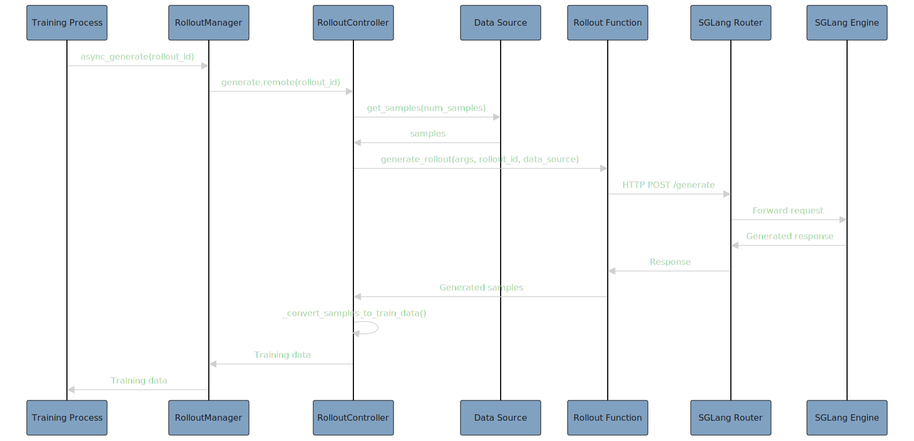

# A Brief Code Walkthrough of slime

在我心中，如果 openrlhf 是第一代 RLHF 框架的话，那么 slime 毫无疑问已经是第三代框架了，在易用性和性能上都做出了巨大的优化。slime 选择了以 SGLang 和 Megatron LM 作为唯一后端，强力支持了 MOE 模型的训练和极为自由的采样逻辑。

正值 slime 发布 0.1.0 版本之际，我们在这篇文档中快速学习以 partial rollout 为代表的 slime 核心代码，具体基于 commit [261ecee](https://github.com/THUDM/slime/tree/261ecee700b30429ba2cf4d4c27e3fc7ae0a12c7)。

## 核心架构

slime 采用分离式架构，将 RLHF 训练流程分解为三个独立协作的模块：

- Training (Megatron): 负责主训练流程，支持多种并行策略；具体实现在[`slime/backends/megatron_utils/`](https://github.com/THUDM/slime/tree/261ecee700b30429ba2cf4d4c27e3fc7ae0a12c7/slime/backends/megatron_utils/)。
  
- Rollout (SGLang): 生成新数据（含 reward/verifier），基于 SGLang 的采样逻辑；具体实现在[`slime/ray/rollout.py`](https://github.com/THUDM/slime/tree/261ecee700b30429ba2cf4d4c27e3fc7ae0a12c7/slime/ray/rollout.py)。
  
- Data Buffer: 管理数据流和自定义生成逻辑，可以说是 slime 最匠心独运的模块；具体实现在[`slime/ray/buffer.py`](https://github.com/THUDM/slime/tree/261ecee700b30429ba2cf4d4c27e3fc7ae0a12c7/slime/ray/buffer.py)。


基于前卫的设计，slime 的自由灵活让人非常清爽：

1. 资源调度自由：支持 co-locate 与 dis-aggregate 两种部署策略；在 rollout 和 training 上各自支持 DP/TP/PP/EP；具体实现见 [`slime/ray/placement_group.py`](https://github.com/THUDM/slime/tree/261ecee700b30429ba2cf4d4c27e3fc7ae0a12c7/slime/ray/placement_group.py)

2. 训练方式自由：支持同步训练和异步训练两种模式；具体实现见 [`slime/train.py`](https://github.com/THUDM/slime/tree/261ecee700b30429ba2cf4d4c27e3fc7ae0a12c7/slime/train.py) 和 [`slime/train_async.py`](https://github.com/THUDM/slime/tree/261ecee700b30429ba2cf4d4c27e3fc7ae0a12c7/slime/train_async.py)；注意，后者需要在 dis-aggregate 架构下，使用 `rollout_manager.async_generate` 和 `actor_model.async_train` 进行训推分离的异步训练，rollout 始终领先 train 一个 step，也即 one-step off-policy；

3. 采样方式自由：支持用户自定义复杂的采样流程，包括[多轮工具调用](https://github.com/THUDM/slime/tree/main/examples/search-r1)、奖励模型集成、自定义验证器等；具体实现见 [`slime_plugins/rollout_buffer/`](https://github.com/THUDM/slime/tree/261ecee700b30429ba2cf4d4c27e3fc7ae0a12c7/slime_plugins/rollout_buffer/)。

4. 模型支持自由：支持 Dense 和 MoE 模型；具体脚本可参考 [`slime/scripts/run-qwen3-4B.sh`](https://github.com/THUDM/slime/tree/261ecee700b30429ba2cf4d4c27e3fc7ae0a12c7/slime/scripts/run-qwen3-4B.sh) 和 [`slime/scripts/run-deepseek-r1.sh`](https://github.com/THUDM/slime/tree/261ecee700b30429ba2cf4d4c27e3fc7ae0a12c7/slime/scripts/run-deepseek-r1.sh)。


## 代码结构

```bash
slime/
├── slime/                          # 核心框架代码
│   ├── ray/                        # Ray 分布式组件
│   │   ├── actor_group.py          # 训练 Actor 管理
│   │   ├── rollout.py              # 推理 Actor 管理
│   │   ├── buffer.py               # 数据缓冲区
│   │   └── placement_group.py      # 资源分配
│   ├── backends/                   # 后端引擎集成
│   │   ├── megatron_utils/         # Megatron 训练后端
│   │   └── sglang_utils/           # SGLang 推理后端
│   └── utils/                      # 工具函数
├── slime_plugins/                  # 插件和扩展
│   ├── rollout_buffer/             # 自定义生成插件
│   └── models/                     # 模型适配
├── scripts/                        # 参考启动脚本
│   └── models/                     # 各模型配置
├── examples/                       # 参考使用示例
├── docs/                           # 详细文档
├── train.py                        # 同步训练入口
└── train_async.py                  # 异步训练入口
```

具体来说：

- `scripts/`：用于启动 Ray 集群与提交训练作业；示例脚本会选择 `train.py` 或 `train_async.py`，比如：`slime/scripts/run-qwen3-4B.sh`、`slime/scripts/run-deepseek-r1.sh`。
- `train.py` / `train_async.py`：训练入口，创建 `PlacementGroup` 分配 GPU → 创建 `actor_group`（训练）与 `rollout_manager`（推理）→ 进入训练循环，同步模式逐步执行；异步模式通过 `rollout_manager.async_generate()` 与 `ray.get()` 交错以并行化。
- `slime/ray/`：分布式编排与资源管理，具体包括：`placement_group.py`：基于 Ray Placement Group 的 GPU 资源分配与打包，`actor_group.py`：训练 Actor 组管理，暴露 `async_init/async_train/async_update_weights` 等接口，`rollout.py`：Rollout Actor（SGLang 引擎容器）、推理服务路由、权重接收，`buffer.py`：数据缓冲、样本批次组织、与 Rollout/Training 的中间桥梁。
- `slime/backends/`：后端引擎适配，具体包括：`megatron_utils/`：训练后端（优化器、权重更新、与分布式通信集成），`sglang_utils/`：推理后端（包装 SGLang、批处理生成、引擎生命周期管理）。
- `slime_plugins/`：可插拔扩展，具体包括：`rollout_buffer/`：通过 HTTP/OpenAI 接口等外部联动的自定义轨迹生成器体系；`models/`：不同模型族的小适配层。
- `examples/`：一些复现其他工作的例子，比如 `examples/search-r1/` 展示多轮对话 + 工具调用的生成与训练串联方式。
- `docs/`：说明文档与用法指南，包含模型使用、SFT、AMD 等平台适配与调优手册。

### 串联关系

1. 脚本层（`scripts/`）：启动 Ray → 提交job → 选择 `train.py` 或 `train_async.py` 并传入参数

2. 入口层（`train*.py`）：`create_placement_groups(args)` 分配/映射 GPU；`create_actor_group(args, pgs["actor"])` 构建训练 Actor 组；`create_rollout_manager(args, pgs["rollout"])` 构建推理与数据生成管理器

3. 执行层（`ray/` + `backends/`）：训练：`actor_group.async_train(...)` → Megatron 优化/梯度计算；生成：`rollout_manager.async_generate(...)` → SGLang 批量推理；同步：`actor_group.async_update_weights()` → 将训练权重推送到推理引擎

4. 数据流（`buffer.py` + 插件）：`Buffer` 负责抽样/拼批/调用自定义生成（`slime_plugins/rollout_buffer/`）→ 返回训练可用样本

注意，虽然执行层的函数都带有 `async` 修饰，但是同步训练和异步训练都使用了同一套 `async_train, async_generate` 和 `async_update_weights` 接口。同步和异步训练的区别在于 `ray.get()` 的调用时机。通过以上链路，slime 将脚本 → 入口 → 分布式执行 → 数据/权重流自然地串起来，实现高效可扩展的 RL 后训练。

接下来，我们进入每部分的具体代码，对于架构图中的重要函数进行逐一解析。

## Ray Placement Group

本节详细说明 slime 在 Ray 上如何进行 GPU 资源编排：如何创建并重排 Placement Group（PG）以实现稳定的 GPU 排序，训练 Actor 与 Rollout Engine 如何在 PG 上调度，以及两种部署形态：colocate 与 dis-aggregate。为了方便叙述，介绍一些核心概念：

1. [`Ray Placement Group`](https://github.com/THUDM/slime/blob/261ecee700b30429ba2cf4d4c27e3fc7ae0a12c7/slime/ray/placement_group.py)：在集群中预留一组 bundle（每个包含 1 GPU + 1 CPU），并将后续 actor 固定绑定到这些 bundle 上，实现可控、稳定的资源放置。

2. [`RayTrainGroup`](https://github.com/THUDM/slime/tree/261ecee700b30429ba2cf4d4c27e3fc7ae0a12c7/slime/ray/actor_group.py)：训练侧 actor 的管理器；通过 [`_allocate_gpus_for_actor`](https://github.com/THUDM/slime/blob/261ecee700b30429ba2cf4d4c27e3fc7ae0a12c7/slime/ray/actor_group.py#L50) 来为每个 rank 创建训练 actor handler，得到 `self._actor_handlers`，随后并发在每个 rank 上进行 init / train / eval / save / update / offload。

3. [`RolloutManager`](https://github.com/THUDM/slime/tree/261ecee700b30429ba2cf4d4c27e3fc7ae0a12c7/slime/ray/rollout.py)：推理/数据编排器，负责创建 Rollout Engine, Data Buffer、Lock and Router；这部分内容见后续解析；


### 入口函数

入口位于 [`Ray Placement Group`](https://github.com/THUDM/slime/blob/261ecee700b30429ba2cf4d4c27e3fc7ae0a12c7/slime/ray/placement_group.py) 的 [`create_placement_groups`](https://github.com/THUDM/slime/blob/261ecee700b30429ba2cf4d4c27e3fc7ae0a12c7/slime/ray/placement_group.py#L71)：


- 计算本次训练所需的总 GPU 数 `num_gpus`。
- 创建一个包含 `num_gpus` 个 bundle 的 PG，每个 bundle 需要 `{"GPU": 1, "CPU": 1}`。
- 获得重排后的 bundle 索引列表，用于确保稳定的跨节点 / GPU 顺序。
- 根据 `rollout_offset` 将 PG 的索引划分给训练 Actor 与 Rollout。

<details> <summary> create_placement_groups 具体实现 </summary>

```python
def create_placement_groups(args):
    """Create placement groups for actor and rollout engines."""

    num_gpus = 0
    if args.debug_train_only:
        num_gpus = args.actor_num_nodes * args.actor_num_gpus_per_node
        rollout_offset = 0
    elif args.debug_rollout_only:
        num_gpus = args.rollout_num_gpus
        rollout_offset = 0
    elif args.colocate:
        num_gpus = args.actor_num_nodes * args.actor_num_gpus_per_node
        rollout_offset = 0
    else:
        num_gpus = args.actor_num_nodes * args.actor_num_gpus_per_node + args.rollout_num_gpus
        rollout_offset = args.actor_num_nodes * args.actor_num_gpus_per_node

    print(f"Creating placement group with {num_gpus} GPUs...")
    pg, actor_pg_reordered_bundle_indices = _create_placement_group(num_gpus)

    rollout_pg_reordered_bundle_indices = actor_pg_reordered_bundle_indices[rollout_offset:]

    return {
        "actor": (pg, actor_pg_reordered_bundle_indices),
        "rollout": (pg, rollout_pg_reordered_bundle_indices),
    }
```
</details>

### Bundle 重排

创建 PG 后，slime 用一个临时 `InfoActor` 在每个 bundle 上获取该 bundle 实际分配到的 `(Node IP, GPU ID)`，随后按 node IP 与 GPU ID 进行重排：

1. 优先尝试将 `node_identifier` 解析成 IPv4 地址，转成 4 个整型并据此排序；
2. 若不是 IP，则尝试 DNS 解析；还不行则退化为按主机名字符的 ASCII 序列排序；
3. 同节点内再按 `gpu_id` 升序排序。

这样可以获得跨多机的稳定 bundle 顺序，避免由于映射不稳定造成的调度错配。

<details> <summary> `InfoActor` and `sort_key` 具体实现</summary>

```python
@ray.remote(num_gpus=1)
class InfoActor:
    def get_ip_and_gpu_id(self):
        return ray.util.get_node_ip_address(), ray.get_gpu_ids()[0]

def sort_key(x):
    index, node_identifier, gpu_id = x
    # Sort by node IP number and then by GPU ID
    try:
        # try to parse it as an IP address.
        ip_address = node_identifier
        node_ip_parts = list(map(int, ip_address.split(".")))
    except ValueError:
        # Try to resolve the hostname to an IP address.
        try:
            ip_address = socket.gethostbyname(node_identifier)
            node_ip_parts = list(map(int, ip_address.split(".")))
        except (socket.gaierror, TypeError):
            # Instead, we convert each character of the original identifier string
            # to its ASCII value. This provides a stable and consistent numerical
            # representation that allows for sorting.
            node_ip_parts = [ord(c) for c in node_identifier]

    return (node_ip_parts, gpu_id)
```
</details>

### Colocate vs Dis-aggregate

再熟悉不过的内容了。

colocate 下，训练 Actor 与 Rollout 引擎交替共用同一批 GPU 资源，此时 `num_gpus = actor_num_nodes * actor_num_gpus_per_node`，`rollout_offset = 0`。Rollout 和 Actor 完全共用 bundle；适用于小规模训练。

dis-aggregate 下，训练 Actor 与 Rollout 引擎使用各自独立的 GPU 池（例如训练占 6 卡，rollout 占 2 卡），此时 `num_gpus = actor_num_nodes * actor_num_gpus_per_node + rollout_num_gpus`，`rollout_offset = actor_num_nodes * actor_num_gpus_per_node`。Rollout 和 Actor 使用不同的 bundle；适用于大规模训练；在这种情况下可以进行 async-train。

### 端口分配与多机一致性

在多节点/多卡下，`create_rollout_engines` 会通过 `RayActor._get_current_node_ip_and_free_port` 在目标节点上寻找一段连续可用端口，并将 Node 0 的 `dist_init_addr` 扩散到同一引擎的其他节点，以保证跨机的进程组一致性。

<details> <summary> `RayActor._get_current_node_ip_and_free_port` 具体实现</summary>

```python
def _get_current_node_ip_and_free_port(start_port=10000, consecutive=1):
    address = ray._private.services.get_node_ip_address()
    address = address.strip("[]")
    port = start_port
    while not all(is_port_available(port + i) for i in range(consecutive)):
        port += 1
    return address, port
```
</details>

## Data Source with/without Buffer

这一部分应该是最喜闻乐见的，因为大多数算法从业者理应改好 data buffer，就可以自由使用 slime。[`slime/ray/rollout_data_source.py`](https://github.com/THUDM/slime/tree/261ecee700b30429ba2cf4d4c27e3fc7ae0a12c7/slime/ray/rollout_data_source.py) 是 rollout 系统的数据源管理模块，负责为 rollout engine 提供训练数据。该文件定义了两个核心类：`RolloutDataSource` 和 `RolloutDataSourceWithBuffer`。

下图做的无比清晰，介绍了整个数据的获取流程，Data Source 可以是 `RolloutDataSource` 或 `RolloutDataSourceWithBuffer`。



### RolloutDataSource

1. 初始化：

```python
class RolloutDataSource:
    def __init__(self, args):
        self.args = args
        self.epoch_id = 0          # 当前epoch ID
        self.sample_index = 0      # 全局样本索引
        self.sample_offset = 0     # 在当前 epoch 中的偏移量
        self.metadata = {}         # 元数据存储
        self.dataset = None        # 数据集对象
```

我们来看看具体的初始化逻辑，注意到，默认情况下，`rollout_global_dataset=True`，此时基于启动参数中的 `--prompt-data` 加载真实数据集，否则 `dataset=None`，可以自行维护 dataset。

<details>
<summary>初始化逻辑</summary>

```python
class RolloutDataSource:
    def __init__(self, args):
        self.args = args

        self.epoch_id = 0
        self.sample_index = 0
        self.sample_offset = 0
        self.metadata = {}

        if args.rollout_global_dataset:
            tokenizer = AutoTokenizer.from_pretrained(args.hf_checkpoint, trust_remote_code=True)

            if (d := args.dump_details) is not None:
                tokenizer.save_pretrained(Path(d) / "tokenizer")

            self.dataset = Dataset(
                args.prompt_data,
                tokenizer=tokenizer,
                max_length=args.rollout_max_prompt_len,
                prompt_key=args.input_key,
                label_key=args.label_key,
                metadata_key=args.metadata_key,
                tool_key=args.tool_key,
                apply_chat_template=args.apply_chat_template,
                seed=args.rollout_seed,
            )
            if self.args.rollout_shuffle:
                self.dataset.shuffle(self.epoch_id)
        else:
            self.dataset = None
```
</details>

2. [`get_samples()`](https://github.com/THUDM/slime/blob/261ecee700b30429ba2cf4d4c27e3fc7ae0a12c7/slime/ray/rollout_data_source.py#L46) 与 [`Sample`](https://github.com/THUDM/slime/blob/261ecee700b30429ba2cf4d4c27e3fc7ae0a12c7/slime/utils/types.py#L9)：

从数据集中获取指定数量的样本：

1. 自动处理 epoch 边界，支持数据集 shuffle；
2. 每个 prompt 生成 `n_samples_per_prompt` 个样本，用于 GRPO；
3. 维护 `sample_offset, epoch_id, sample_index`；
4. 使用深拷贝避免数据污染；
5. 取出的 samples 格式为 `list[list[Sample]]`；

<details>
<summary>Sample 类实现与 get_samples 方法</summary>

```python
class Sample:
    """The sample generated"""

    index: Optional[int] = None
    # prompt
    prompt: Union[str, list[dict[str, str]]] = ""
    tokens: list[int] = field(default_factory=list)
    # response
    response: str = ""
    response_length: int = 0
    label: Optional[str] = None
    reward: Optional[Union[float, dict[str, Any]]] = None
    loss_mask: Optional[list[int]] = None

    class Status(Enum):
        PENDING = "pending"
        COMPLETED = "completed"
        TRUNCATED = "truncated"
        ABORTED = "aborted"

    status: Status = Status.PENDING
    metadata: dict = field(default_factory=dict)

    def to_dict(self):
        value = self.__dict__.copy()
        value["status"] = self.status.value
        return value

    @staticmethod
    def from_dict(data: dict):
        data["status"] = Sample.Status(data["status"])
        return Sample(**data)

    def get_reward_value(self, args) -> float:
        return self.reward if not args.reward_key else self.reward[args.reward_key]
```

```python
def get_samples(self, num_samples):
    samples = []
    
    if self.dataset is not None:
        # 分支1：使用真实数据集
        if self.sample_offset + num_samples <= len(self.dataset):
            # 情况 1：当前 epoch 还有足够数据
            prompt_samples = self.dataset.samples[self.sample_offset : self.sample_offset + num_samples]
            self.sample_offset += num_samples
        else:
            # 情况 2：当前 epoch 数据不足，需要进入下一个 epoch
            prompt_samples = self.dataset.samples[self.sample_offset :]  # 取完当前 epoch 剩余数据
            num_samples -= len(prompt_samples)
            self.epoch_id += 1  # 进入下一个 epoch
            
            # 重新 shuffle 数据集
            if self.args.rollout_shuffle:
                self.dataset.shuffle(self.epoch_id)
            
            # 从新 epoch 取剩余所需数据
            prompt_samples += self.dataset.samples[:num_samples]
            self.sample_offset = num_samples
        
        # 为每个 prompt 创建多个样本（n_samples_per_prompt）
        for prompt_sample in prompt_samples:
            group = []
            for _ in range(self.args.n_samples_per_prompt):
                sample = copy.deepcopy(prompt_sample)  # 深拷贝避免修改原始数据，并维护 index
                sample.index = self.sample_index
                self.sample_index += 1
                group.append(sample)
            samples.append(group)
    else:
        # 分支2：不使用真实数据集，创建空样本
        for _ in range(num_samples):
            group = []
            for _ in range(self.args.n_samples_per_prompt):
                sample = Sample(index=self.sample_index)
                self.sample_index += 1
                group.append(sample)
            samples.append(group)
    
    return samples
```
</details>

3. [`save()`](https://github.com/THUDM/slime/blob/261ecee700b30429ba2cf4d4c27e3fc7ae0a12c7/slime/ray/rollout_data_source.py#L86) 和 [`load()`](https://github.com/THUDM/slime/blob/261ecee700b30429ba2cf4d4c27e3fc7ae0a12c7/slime/ray/rollout_data_source.py#L100)：

保存 `RolloutDataSource` 状态到文件；load 则用于训练中断后，从文件加载状态，确保数据顺序一致性。

<details>
<summary>save 和 load 方法</summary>

```python
def save(self, rollout_id):
    if not self.args.rollout_global_dataset:
        return  # 不使用真实数据集时不需要保存
    
    state_dict = {
        "sample_offset": self.sample_offset,  # 当前 epoch 中的偏移量
        "epoch_id": self.epoch_id,            # 当前 epoch ID
        "sample_index": self.sample_index,    # 全局样本索引
        "metadata": self.metadata,            # 元数据
    }
    
    # 保存到指定路径
    path = os.path.join(self.args.save, f"rollout/global_dataset_state_dict_{rollout_id}.pt")
    os.makedirs(os.path.dirname(path), exist_ok=True)
    torch.save(state_dict, path)
```

```python
def load(self, rollout_id=None):
    if not self.args.rollout_global_dataset:
        return  # 不使用真实数据集时不需要加载
    
    if self.args.load is None:
        return  # 没有指定加载路径时不需要加载
    
    path = os.path.join(self.args.load, f"rollout/global_dataset_state_dict_{rollout_id}.pt")
    if not os.path.exists(path):
        print(f"Checkpoint {path} does not exist.")
        return
    
    # 加载状态
    state_dict = torch.load(path)
    self.sample_offset = state_dict.get("sample_offset", 0)
    self.epoch_id = state_dict.get("epoch_id", 0)
    self.sample_index = state_dict.get("sample_index", 0)
    self.metadata = state_dict.get("metadata", {})
    
    # 重新 shuffle 数据集
    if self.args.rollout_global_dataset and self.args.rollout_shuffle:
        self.dataset.shuffle(self.epoch_id)
```
</details>


### [`RolloutDataSourceWithBuffer`](https://github.com/THUDM/slime/blob/261ecee700b30429ba2cf4d4c27e3fc7ae0a12c7/slime/ray/rollout_data_source.py#L124)

带缓冲的数据类，继承自 `RolloutDataSource`，增加了数据缓冲功能，支持为了 partial rollout 而设计的数据重用策略。

1. 初始化：完全继承了 `RolloutDataSource` 的初始化逻辑，并额外初始化了 `buffer_filter` 方法和空的 `buffer` 列表。

<details>
<summary>RolloutDataSourceWithBuffer初始化</summary>

```python
class RolloutDataSourceWithBuffer(RolloutDataSource):
    def __init__(self, args):
        super().__init__(args)
        self.buffer = []  # 数据缓冲区
        
        # 设置 buffer 过滤器
        if self.args.buffer_filter_path is None:
            self.buffer_filter = pop_first  # 默认：先进先出
        else:
            self.buffer_filter = load_function(self.args.buffer_filter_path)  # 自定义过滤器
```
</details>

2. [`get_samples()`](https://github.com/THUDM/slime/blob/261ecee700b30429ba2cf4d4c27e3fc7ae0a12c7/slime/ray/rollout_data_source.py#L133C9-L133C20)

写的实在太清楚了，优先从 buffer 获取数据，buffer 不足时从原始数据集补充。

<details>
<summary>get_samples 方法</summary>

```python
def get_samples(self, num_samples: int) -> list[list[Sample]]:
    # 1. 首先从 buffer 中获取样本组
    samples = self._get_samples_from_buffer(num_samples)
    num_samples -= len(samples)
    
    # 2. 如果 buffer 不够，从原始数据集获取剩余样本组
    if num_samples > 0:
        samples += super().get_samples(num_samples=num_samples)
    
    return samples
```

```python
def _get_samples_from_buffer(self, num_samples: int) -> list[list[Sample]]:
    if len(self.buffer) == 0 or num_samples == 0:
        return []  # buffer 为空或不需要样本
    
    # 使用 buffer 过滤器获取样本组
    samples = self.buffer_filter(self.args, None, self.buffer, num_samples)
    return samples
```

</details>

3. [`add_samples()`](https://github.com/THUDM/slime/blob/261ecee700b30429ba2cf4d4c27e3fc7ae0a12c7/slime/ray/rollout_data_source.py#L154C9-L154C20)

向 buffer 添加样本组。注意，`RolloutDataSource` 是不支持添加样本的；此处添加的是样本组，也即 partial rollout 是一整个 prompt 的所有 requests 同时写入 buffer，不会出现 prompt 的不同 requests 在不同的 step 被用于训练的情况。

<details>
<summary>add_samples 方法</summary>

```python
def add_samples(self, samples: list[list[Sample]]):
    if not samples:
        return
    
    # 验证输入格式，确保输入是 list[list[Sample]] 格式
    assert isinstance(samples, list), f"samples must be a list, got {type(samples)}"
    assert isinstance(samples[0], list), f"the elements of samples must be list, got {type(samples[0])}"
    
    # 验证每个 group 的大小
    for i in range(0, len(samples)):
        assert (
            len(samples[i]) == self.args.n_samples_per_prompt
        ), f"the length of the elements of samples must be equal to n_samples_per_prompt, got {len(samples[i])} != {self.args.n_samples_per_prompt}"
        group = samples[i]
        self.buffer.append(group)  # 添加到 buffer
```
</details>

3. [`pop_first()`](https://github.com/THUDM/slime/blob/261ecee700b30429ba2cf4d4c27e3fc7ae0a12c7/slime/ray/rollout_data_source.py#L181)

默认的 buffer 过滤器，实现先进先出（FIFO）的数据获取策略。

<details>
<summary>pop_first 方法</summary>

```python
def pop_first(args, rollout_id, buffer: list[list[Sample]], num_samples: int) -> list[list[Sample]]:
    num_to_pop = min(len(buffer), num_samples)  # 取 buffer 长度和需求量的较小值
    samples = buffer[:num_to_pop]               # 获取前 num_to_pop 个样本
    del buffer[:num_to_pop]                     # 从 buffer 中删除这些样本
    return samples
```
</details>

4. 最终的数据调用链：

```bash
RolloutController.generate()
    ↓
RolloutDataSourceWithBuffer.get_samples()
    ↓
_get_samples_from_buffer() + super().get_samples()
    ↓
返回 list[list[Sample]]
```

5. 自定义 Buffer 过滤器：

<details>
<summary>自定义 Buffer 过滤器示例</summary>

```python
# 定义自定义过滤器
def custom_buffer_filter(args, rollout_id, buffer, num_samples):
    # 按reward排序，取reward最高的样本
    sorted_buffer = sorted(buffer, key=lambda x: x[0].reward, reverse=True)
    return sorted_buffer[:num_samples]

# 在args中设置
args.buffer_filter_path = "path.to.custom_buffer_filter"
```
</details>

写的真清楚，不明白为什么有的公司写个 partial rollout 得写 2k 行代码。