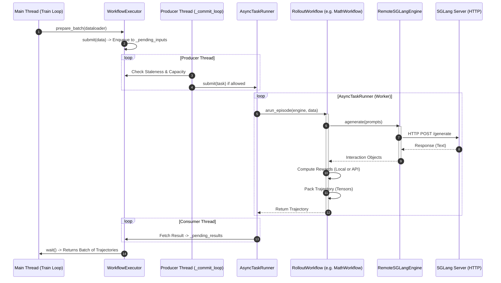

# Code Walkthrough of AReaL

[English](code-walk-through_EN.md) | [中文](code-walk-through_CN.md)

早在 25 年年初，就有某位 infra 圈资深大佬盛赞 AReaL 的代码写的是整个圈子里最有艺术性的。趁着 AReaL 在 25 年经过了几个重大版本的发布，以及 [asystem-amem](https://github.com/inclusionAI/asystem-amem) 等框架相关工作的发布，我们 SGLang RL 小组向大家分享这份 AReaL 的学习笔记。

值得注意的是，吴翼老师是 RL 领域经验丰富又年轻的领军科学家（对吴老师而言，年轻和经验丰富并不矛盾 😂），AReaL 在异步训练上的设计可谓是业界顶流，这也会是我们着重学习的部分。

# Start from Example

我们从一个简单的例子（`examples/math/gsm8k_grpo.py`）开始学习 AReaL 的工作流程：


<details>
<summary>gsm8k_grpo.py 中 main() 代码</summary>

```python
def main(args):
    config, _ = load_expr_config(args, GRPOConfig)

    rank = int(os.getenv("RANK"))
    tokenizer = load_hf_tokenizer(config.tokenizer_path)

    seeding.set_random_seed(config.seed, key=f"trainer{rank}")
    allocation_mode = AllocationMode.from_str(config.allocation_mode)
    parallel_strategy = allocation_mode.train
    assert parallel_strategy is not None

    # Initialize train engine
    actor = FSDPPPOActor(config=config.actor)
    actor.create_process_group(parallel_strategy=parallel_strategy)

    # Create dataset and dataloaders
    train_dataset = get_custom_dataset(
        split="train", dataset_config=config.train_dataset, tokenizer=tokenizer
    )
    valid_dataset = get_custom_dataset(
        split="test", dataset_config=config.valid_dataset, tokenizer=tokenizer
    )

    train_dataloader = create_dataloader(
        train_dataset,
        rank=actor.data_parallel_rank,
        world_size=actor.data_parallel_world_size,
        dataset_config=config.train_dataset,
    )
    valid_dataloader = create_dataloader(
        valid_dataset,
        rank=actor.data_parallel_rank,
        world_size=actor.data_parallel_world_size,
        dataset_config=config.valid_dataset,
    )
    ft_spec = FinetuneSpec(
        total_train_epochs=config.total_train_epochs,
        dataset_size=len(train_dataloader) * config.train_dataset.batch_size,
        train_batch_size=config.train_dataset.batch_size,
    )

    # Initialize inference engine
    rollout = RemoteSGLangEngine(config.rollout)
    rollout.initialize(train_data_parallel_size=parallel_strategy.dp_size)
    eval_rollout = RemoteSGLangEngine(deepcopy(config.rollout))
    # NOTE: eval does not have any offpolicyness control
    eval_rollout.config.max_head_offpolicyness = int(1e12)
    eval_rollout.initialize()

    weight_update_meta = WeightUpdateMeta.from_fsdp_xccl(allocation_mode)

    actor.initialize(None, ft_spec)
    actor.connect_engine(rollout, weight_update_meta)

    ref = None
    if config.actor.kl_ctl > 0 and config.ref is not None:
        ref = FSDPPPOActor(config=config.ref)
        ref.create_process_group(parallel_strategy=parallel_strategy)
        ref.initialize(None, ft_spec)

    # Create rollout workflow
    if tokenizer.pad_token_id not in config.gconfig.stop_token_ids:
        config.gconfig.stop_token_ids.append(tokenizer.pad_token_id)
    if tokenizer.eos_token_id not in config.gconfig.stop_token_ids:
        config.gconfig.stop_token_ids.append(tokenizer.eos_token_id)
    workflow = RLVRWorkflow(
        reward_fn=gsm8k_reward_fn,
        gconfig=config.gconfig,
        tokenizer=tokenizer,
        enable_thinking=False,
        dump_dir=os.path.join(
            StatsLogger.get_log_path(config.stats_logger), "generated"
        ),
    )
    eval_workflow = RLVRWorkflow(
        reward_fn=gsm8k_reward_fn,
        gconfig=config.gconfig.new(temperature=0.6),
        tokenizer=tokenizer,
        enable_thinking=False,
        rollout_stat_scope="eval-rollout",
        dump_dir=os.path.join(
            StatsLogger.get_log_path(config.stats_logger), "generated-eval"
        ),
    )

    # Run training.
    saver = Saver(config.saver, ft_spec)
    stats_logger = StatsLogger(config, ft_spec)
    evaluator = Evaluator(config.evaluator, ft_spec)

    recover_handler = RecoverHandler(config.recover, ft_spec)
    recover_info = recover_handler.load(
        actor,
        saver,
        evaluator,
        stats_logger,
        train_dataloader,
        inference_engine=rollout,
        weight_update_meta=weight_update_meta,
    )
    start_step = (
        recover_info.last_step_info.next().global_step
        if recover_info is not None
        else 0
    )

    total_epochs = config.total_train_epochs
    steps_per_epoch = len(train_dataloader)
    max_steps = total_epochs * steps_per_epoch

    for global_step in range(start_step, max_steps):
        epoch = global_step // steps_per_epoch
        step = global_step % steps_per_epoch
        step_info = StepInfo(
            global_step=global_step,
            epoch=epoch,
            epoch_step=step,
            steps_per_epoch=steps_per_epoch,
        )

        with stats_tracker.record_timing("rollout"):
            batch = actor.prepare_batch(
                train_dataloader,
                granularity=actor.config.group_size,
                workflow=workflow,
                should_accept_fn=lambda sample: True,
            )

        if config.actor.recompute_logprob or config.actor.use_decoupled_loss:
            with stats_tracker.record_timing("recompute_logp"):
                logp = actor.compute_logp(batch)
                batch["prox_logp"] = logp
                log_gpu_stats("recompute logp")

        if ref is not None:
            with stats_tracker.record_timing("ref_logp"):
                batch["ref_logp"] = ref.compute_logp(batch)
                log_gpu_stats("ref logp")

        with stats_tracker.record_timing("compute_advantage"):
            actor.compute_advantages(batch)
            log_gpu_stats("compute advantages")

        with stats_tracker.record_timing("train_step"):
            actor.ppo_update(batch)
            actor.step_lr_scheduler()
            log_gpu_stats("ppo update")

        # pause inference for updating weights, save, and evaluation
        rollout.pause()

        with stats_tracker.record_timing("update_weights"):
            actor.update_weights(weight_update_meta)

            actor.set_version(global_step + 1)
            rollout.set_version(global_step + 1)
            eval_rollout.set_version(global_step + 1)

        with stats_tracker.record_timing("save"):
            saver.save(actor, epoch, step, global_step, tokenizer=tokenizer)

        with stats_tracker.record_timing("checkpoint_for_recover"):
            recover_handler.dump(
                actor,
                step_info,
                saver,
                evaluator,
                stats_logger,
                train_dataloader,
                tokenizer=tokenizer,
            )

        current_platform.synchronize()
        dist.barrier(group=actor.cpu_group)

        with stats_tracker.record_timing("eval"):

            def evaluate_fn():
                if actor.is_data_parallel_head():
                    cnt = 0
                    for data in valid_dataloader:
                        for item in data:
                            eval_rollout.submit(item, eval_workflow)
                            cnt += 1
                    eval_rollout.wait(cnt, timeout=None)
                current_platform.synchronize()
                dist.barrier(group=actor.cpu_group)

            evaluator.evaluate(
                evaluate_fn,
                epoch,
                step,
                global_step,
            )

        current_platform.synchronize()
        dist.barrier(group=actor.cpu_group)

        # Upload statistics to the logger (e.g., wandb)
        stats = stats_tracker.export_all(reduce_group=actor.data_parallel_group)
        stats_logger.commit(epoch, step, global_step, stats)

        current_platform.synchronize()
        dist.barrier(group=actor.cpu_group)

        # Resume rollout
        rollout.resume()

    stats_logger.close()
    eval_rollout.destroy()
    rollout.destroy()
    if ref is not None:
        ref.destroy()
    actor.destroy()
```
</details>


## Init

初始化 Train Engine (如 `FSDPPPOActor`)、Inference Engine (如 `RemoteSGLangEngine`) 和可选的 Reference Engine，加载数据集 (`DataLoader`)，通过 `weight_update_meta` 建立起 Actor 向 Rollout Engine 传输权重的通道。

创建 Rollout Workflow。上图使用的是最基础的 `RLVRWorkflow`。AReaL 还提供了 `MultiTurnWorkflow`，支持复杂的多轮对话 RL 任务，他们都是抽象类`RolloutWorkflow`（`AReaL/areal/api/workflow_api.py`）的实现。这些 `RolloutWorkflow` 的实现统一了生成接口，在调用 workflow 生成时无需关心具体的交互细节，只需要调用 `workflow.arun_episode()`，就可以拿到一批包含标准训练字段的 Trajectory。

## Rollout

Actor 调用  `prepare_batch` 请求得到 rollout 部分生成的 trajectory。这部分的调用路径为 `FSDPPPOACTOR.prepare_batch` → `DistRolloutCoordinator.prepare_batch` → `RemoteInfEngine.prepare_batch` → `WorkflowExecutor.prepare_batch`。这里`WorkflowExecutor` 的`prepare_batch` 触发了异步 Productor-Consumer 流水线。

> [!TIP]
> **Producer-Consumer**
>
> 生产者-消费者模式 （Producer-Consumer Pattern） 是一种经典的并发设计模式，用于解决两个处理速率不一致的组件之间的数据传输问题。
>
> - **核心思想**：生产者 （Producer） 和消费者 （Consumer）并不直接通信，而是通过一个 缓冲区 （Buffer/Queue）进行解耦。
> - **Producer**：负责生成数据，并将其放入缓冲区。如果缓冲区满了，生产者必须等待或丢弃数据。
> - **Consumer**：负责从缓冲区取出数据进行处理。如果缓冲区空了，消费者必须等待。
> - **Buffer**：平滑了生产和消费的速率波动，允许两者并行工作，互不阻塞。

下图展示了 rollout 过程中的交互与数据流转过程。




我们进一步深入理解上图提到的关键类。

### RolloutWorkflow

`RolloutWorkflow` 位于 `areal/api/workflow_api.py` ，是 AReaL 中定义 Agent 行为的核心抽象（定义于 `areal/api/workflow_api.py`）。

<details>
<summary>抽象类 RolloutWorkflow 代码 （AReaL/areal/api/workflow_api.py）</summary>

```python
class RolloutWorkflow(ABC):
    @abstractmethod
    async def arun_episode(
        self, engine: InferenceEngine, data: dict[str, Any]
    ) -> dict[str, Any] | None | dict[str, InteractionWithTokenLogpReward]:
        raise NotImplementedError()

```

</details>

从这段代码中我们可以看到，`RolloutWorkflow`的所有具体实现（如 `RLVRWorkflow`, `MultiTurnWorkflow`，位于 `areal/workflow/`）都必须实现`arun_episode()`这一核心异步函数。接下来我们以`RLVRWorkflow` 为例，分析一下`RolloutWorkflow`的具体实现是什么样的。

init 中除了 rollout 必要参数之外，`reward_fn` 也作为 input 输入，reward 计算也包含在 workflow 中。

<details>
<summary>RLVRWorkflow.init</summary>

```python
class RLVRWorkflow(RolloutWorkflow):
    """Single-turn reward learning workflow supporting optional thinking tokens."""

    def __init__(
        self,
        reward_fn: Callable[..., Any],
        gconfig: GenerationHyperparameters,
        tokenizer: PreTrainedTokenizerFast,
        enable_thinking: bool = False,
        rollout_stat_scope: str = "rollout",
        dump_dir: str | None = None,
        get_input_ids_fn: Callable[
            [Any, PreTrainedTokenizerFast, bool], list[int]
        ] = default_get_input_ids_fn,
        data_extract_prompt_fn: Callable[
            [dict[str, Any]], Any
        ] = default_data_extract_prompt_fn,
    ):
        self.reward_fn = reward_fn
        self.gconfig = gconfig
        self.tokenizer = tokenizer
        self.enable_thinking = enable_thinking
        self.dump_dir = dump_dir
        self.rollout_stat_scope = rollout_stat_scope
        self.async_reward_fn = AsyncRewardWrapper(reward_fn)
        self.get_input_ids_fn = get_input_ids_fn
        self.data_extract_prompt_fn = data_extract_prompt_fn
        if self.dump_dir is not None and not os.path.exists(self.dump_dir):
            os.makedirs(self.dump_dir, exist_ok=True)
```
</details>


`arun_episode()`作为对外的统一入口，接收 InferenceEngine 和输入数据 data，负责执行一次完整的 rollout 流程，包括：

Prompt 构造与预处理、并发采样、reward 计算，以及最终 Trajectory 的组装与返回。

<details>
<summary>RLVRWorkflow.arun_episode()</summary>

```python
RLVRWorkflow._collect_samples()
```
</details>


`arun_episode()` 内部通过调用 `_collect_samples()` 进行采样与 reward 计算，而 `_collect_samples()` 则进一步调用 inference engine 的 `agenerate()`，这是实际触发模型推理的接口。

<details>
<summary>RLVRWorkflow._collect_samples()</summary>

```python
prepare_batch()
```
</details>


### **WorkflowExecutor**

`WorkflowExecutor` 位于`areal/core/workflow_executor.py`，是 AReaL 框架中负责协调训练进程与远程推理服务之间的异步调度与并发控制组件。它通过封装 Producer-Consumer 线程模型，其内部结构如下：

`prepare_batch()`：封装了 `submit()` 和 `wait()` ，将 input data / prompts 作为输入，output 作为输出。

<details>
<summary>prepare_batch() 代码</summary>

```python
def prepare_batch(
        self,
        dataloader: StatefulDataLoader,
        workflow: RolloutWorkflow | type[RolloutWorkflow] | str,
        workflow_kwargs: dict[str, Any] | None = None,
        should_accept_fn: Callable[[dict[str, Any]], bool] | str | None = None,
    ):

        manager = self.staleness_manager
        if not hasattr(self, "data_generator"):
            self.data_generator = cycle_dataloader(dataloader)
        assert dataloader.batch_size is not None
        cnt = 0
        results = []
        while True:
            # Submit at least two batches to allow maximum overlap
            if (
                len(self._pending_inputs) < manager.get_pending_limit()
                and self.runner.get_input_queue_size() + dataloader.batch_size
                < self.runner.max_queue_size
            ):
                data = next(self.data_generator)
                perf_tracer.instant(
                    "workflow_executor.prepare_batch",
                    category="scheduler",
                    args={"data": len(data)},
                )
                for item in data:
                    self.submit(
                        item,
                        workflow=workflow,
                        should_accept_fn=should_accept_fn,
                        workflow_kwargs=workflow_kwargs,
                    )
            try:
                res = self.wait(count=1, timeout=1)
                if not res:
                    continue
                cnt += 1
                results.append(res)
                if cnt >= dataloader.batch_size:
                    break
            except (TimeoutError, queue.Full):
                pass
        return concat_padded_tensors(results)
```
</details>


Main thread： main thread 不涉及生成或者控制，只是单纯的将 tasks 加入队列和将 output 输出。`submit()`将 tasks 加入`_pending_inputs`队列，`wait()` 轮询`_pending_results`队列：

<details>
<summary>submit() 和 wait() 代码</summary>

```python
def submit(
        self,
        data: dict[str, Any],
        workflow: RolloutWorkflow | type[RolloutWorkflow] | str,
        workflow_kwargs: dict[str, Any] | None = None,
        should_accept_fn: Callable[[dict[str, Any]], bool] | str | None = None,
    ) -> None:
        ...

        # Resolve workflow and should_accept to their concrete forms
        resolved_workflow = self._resolve_workflow(workflow, workflow_kwargs)
        resolved_should_accept_fn = self._resolve_should_accept_fn(should_accept_fn)

        task_id = perf_tracer.register_task()
        task_input = _RolloutTaskInput(
            data=data,
            workflow=resolved_workflow,
            should_accept_fn=resolved_should_accept_fn,
            task_id=task_id,
        )

        # Enqueue to thread-safe queue (may block if queue is full)
        self._pending_inputs.append(task_input)

        # Notify staleness manager of enqueued rollout tasks
        self.staleness_manager.on_rollout_enqueued()
        
        ...

    def wait(
        self, count: int, timeout: float | None = None, raise_timeout: bool = True
    ) -> dict[str, Any]:
        
        ...

        # Drain all available requests and sort them by time of creation
        # This prioritizes data submitted earlier.
        results: list[TimedResult[_RolloutResult]] = []
        while True:
            try:
                results.append(self._pending_results.popleft())
            except IndexError:
                break
        # Sort results be create time
        results.sort(key=lambda x: x.create_time)
        results, pending = results[:count], results[count:]
        self._pending_results.extendleft(reversed(pending))

        # Shuffle for randomness (helps with data diversity)
        random.shuffle(results)

        # Concatenate into batch tensor format
        trajectories = [r.data.trajectory for r in results if r.data is not None]
        return concat_padded_tensors(trajectories)
```
</details>


Producer thread（`_commit_loop`）：根据 `StalenessManager.get_capacity()` 返回的可用容量确定本轮可提交的任务数量，并从 `_pending_inputs` 中取出相应数量的任务，将其交付给 `AsyncTaskRunner` 执行生成流程。

<details>
<summary>_commit_loop() 代码</summary>

```python
def _commit_loop(self) -> None:

  while not self._shutdown_event.is_set():
      try:
            ...

          # Get capacity from staleness manager
          version = self.inference_engine.get_version()
          capacity = self.staleness_manager.get_capacity(version)

          if capacity <= 0:
              time.sleep(_POLL_INTERVAL_SECONDS)
              continue

          # Try to submit up to 'capacity' tasks
          for _ in range(capacity):
              try:
                  task = self._pending_inputs.popleft()
              except IndexError:
                  break

              # Submit to runner (may raise TaskQueueFullError)
              workflow_fn = self._create_workflow_task(task)
              try:
                  self.runner.submit(workflow_fn)

                  self.staleness_manager.on_rollout_submitted()
                  if self.config.enable_rollout_tracing:
                      self.logger.info(f"Submit rollout. {self._rollout_stats()}")
              except TaskQueueFullError:
                  # Put back and retry later
                  self._pending_inputs.appendleft(task)
                  break

          ...
```
</details>


Consumer thread（`_fetch_loop`）：从`AsyncTaskRunner`收集结果并存入`_pending_results`

<details>
<summary>_fetch_loop() 代码</summary>

```python
def _fetch_loop(self) -> None:
        """Consumer thread main loop - continuously collects results from runner.

        This method runs in a background thread and continuously:
        1. Checks for errors from other threads (fail-fast)
        2. Polls AsyncTaskRunner for available results (non-blocking)
        3. Collects results in batches up to 100 with short timeout (0.05s)
        4. Filters out None (rejected) results
        5. Appends accepted TimedResult objects to _pending_results deque

        The loop exits when _shutdown_event is set. Polling interval: 0.5s.
        """
        while not self._shutdown_event.is_set():
            try:
                # Check for errors from other threads (fail-fast)
                self._check_thread_exception()

                # Poll runner for available results (non-blocking)
                output_queue_size = self.runner.get_output_queue_size()

                if output_queue_size == 0:
                    time.sleep(_POLL_INTERVAL_SECONDS)
                    continue

                # Collect all available results at once (batch for efficiency)
                # Limit batch size to avoid blocking too long
                count = min(output_queue_size, _MAX_FETCH_BATCH_SIZE)

                try:
                    # Use short timeout for responsiveness (latency-optimized)
                    results = self.runner.wait(
                        count=count, timeout=0.05, with_timing=True
                    )

                    # Enqueue all results. Filtering will be delayed to
                    # `rollout_batch` or `prepare_batch`.
                    for result in results:
                        self._pending_results.append(result)

                except TimeoutError:
                    # No results ready yet
                    pass

                # Small sleep to avoid busy-waiting (latency-optimized)
                time.sleep(_POLL_INTERVAL_SECONDS)

            except Exception as e:
                self.logger.error("Consumer thread failed", exc_info=True)
                self._set_thread_exception(e)
                break
```
</details>


`AsyncTaskRunner`：`WorkflowExecutor` 内部的通用异步执行器，负责在后台线程中管理事件循环 (Event Loop)，并发执行高密度的网络 I/O 任务（即调用 Inference Engine 的 `agenerate`）

<details>
<summary>AsyncTaskRunner 代码</summary>

```python
async def _run_async_loop(self):
    """Main async event loop that processes tasks.

    This loop:
    1. Pulls tasks from input_queue when not paused
    2. Creates asyncio.Task instances for each
    3. Waits for task completion
    4. Places results in output_queue
    5. Continues until exiting signal is set
    """
    running_tasks: dict[str, _Task[T]] = {}
    task_id = 0

    try:
        while not self.exiting.is_set():
            # 1. Pull new tasks from input queue
            while not self.paused.is_set() and self.input_queue.qsize() > 0:
                try:
                    task_input = self.input_queue.get_nowait()

                    # 2. Create asyncio task (This is where execution starts)
                    async_task = asyncio.create_task(
                        task_input.async_fn(*task_input.args, **task_input.kwargs),
                        name=str(task_id),
                    )

                    # Store task with metadata
                    running_tasks[str(task_id)] = _Task(
                        create_time=time.monotonic_ns(),
                        task=async_task,
                        task_input=task_input,
                    )
                    task_id += 1
                except queue.Empty:
                    break

            # 3. Wait for any task to complete
            done = []
            if running_tasks:
                tasks = [t.task for t in running_tasks.values()]
                done, _ = await asyncio.wait(
                    tasks,
                    timeout=self.poll_wait_time,
                    return_when=asyncio.FIRST_COMPLETED,
                )

            # 4. Process completed tasks and output results
            for async_task in done:
                tid = async_task.get_name()
                task_obj = running_tasks.pop(tid)
                try:
                    result = await async_task
                    # Place result in output queue
                    self.output_queue.put_nowait(
                        TimedResult(create_time=task_obj.create_time, data=result)
                    )
                except Exception as e:
                    # Error handling...
                    pass

            # Sleep to avoid busy-waiting
            await asyncio.sleep(self.poll_sleep_time)

```
</details>


### StalenessManager

`StalenessManager` 位于 `areal/core/staleness_manager.py`，它用两个限制（并发限制 + staleness 限制）来计算现在还能再接收多少个新 rollout。通过三个参数来控制，分别是：

- `max_concurrent_rollouts`：限制并发上限，即正在运行的生成任务的最大数量
- `consumer_batch_size`：consumer 批次大小，即 trainer 训练的批次大小
- `max_staleness`：样本和当前模型版本之间最多允许相差多少版本

<details>
<summary>init 代码</summary>

```python
class StalenessManager:
   
    def __init__(
        self,
        max_concurrent_rollouts: int,
        consumer_batch_size: int,
        max_staleness: int,
    ):
        self.max_concurrent_rollouts = max_concurrent_rollouts
        self.consumer_batch_size = consumer_batch_size
        self.max_staleness = max_staleness

        # Thread-safe access to rollout statistics
        self.lock = Lock()
        self.rollout_stat = RolloutStat()
```
</details>


其中的核心算法位于 `get_capacity()`，公式如下。

```python
max_samples = (max_staleness + current_version + 1) * consumer_batch_size
capacity = min(concurrency_limit, max_samples - current_samples)
```

这里说一下我对这个公式的理解：在当前权重版本为 `current_version` 时，我们不仅要服务现在的 trainer，还要为未来最多前进 `max_staleness` 个版本的 trainer（即版本从 `current_version` 到 `current_version + max_staleness`）提前准备数据。而 trainer 每个版本会消耗 `consumer_batch_size` 个样本，那么从版本 0 一直到 `current_version + max_staleness`，理论上最多可以安全消费的样本总数就是：

```python
max_samples = (max_staleness + current_version + 1) * consumer_batch_size
```

当前系统里已经累积的样本数记为 `current_samples`（包括已接受的和正在运行的 rollout），那么在不让未来的样本“过期”的前提下，现在还能再生成的样本数量就是：

```python
staleness_capacity = max_samples - current_samples
```

也就是说，`max_staleness` 控制的是“从现在起往前走最多 `max_staleness` 个版本时，这些样本仍然不过期”，公式通过限制样本总量来间接保证这一点。

理解 staleness 算法之后看代码就非常清晰了。首先计算在并发限制下的容量余量，再计算staleness 限制下的容量余量，两者取最小值，就是真正的容量余量。

<details>
<summary>get_capacity() 代码</summary>

```python
def get_capacity(self, current_version: int) -> int:

    with self.lock:
        # Calculate concurrency-based capacity
        max_concurrent_rollouts = max(1, self.max_concurrent_rollouts)
        concurrency_capacity = max_concurrent_rollouts - self.rollout_stat.running

        # Calculate staleness-based capacity
        ofp = self.max_staleness
        sample_cnt = self.rollout_stat.accepted + self.rollout_stat.running
        consumer_bs = max(1, self.consumer_batch_size)
        staleness_capacity = (ofp + current_version + 1) * consumer_bs - sample_cnt

        # Return the minimum of both constraints
        capacity = min(concurrency_capacity, staleness_capacity)
        return capacity

```
</details>


### DistRolloutCoordinator

`DistRolloutCoordinator`实现了一个分布式训练中的数据协调器（Coordinator）它的核心作用是，在分布式环境下，确保每个 Data Parallel Rank (GPU) 拿到的 Token 总数尽可能一致，解决生成的序列长度不一导致的负载不均衡问题。如果直接平均分配数据，有的 GPU 可能分到很多长文本（计算量大），有的分到短文本，导致训练时出现等待（Straggler problem）。

而 AReal 通过 FFD（First-Fit Decreasing）算法重新分配数据，实现 Token 级别的负载均衡。

<aside>
💡

FFD（First-Fit Decreasing）算法：

FFD 是一种经典的**贪心算法**，常用于解决装箱问题或多机调度问题。其核心策略是“降序排列，优先填坑“：

1. **Decreasing (降序)**：首先将所有任务（Sequence）按照计算量（Token 长度）从大到小排序。
2. **First-Fit (首次适应)**：依次取出任务，将其分配给当前负载最小（或剩余空间最大）的节点。

通过这种“先处理大石块，再用沙子填缝隙”的方式，FFD 能最大程度地确保所有 GPU 的总计算量趋于一致，消除木桶效应。

</aside>

该功能的核心函数为`redistribute()` ，位于 `areal/core/dist_rollout.py` 。该函数首先通过`all_gather_tensor_container` 将所有 GPU 上生成的数据收集起来，让每个 rank 都拥有全局的全量数据。然后把大 batch 中的数据按照 granularity（通常为 GRPO 中同一个 prompt 产生数据的数量）切分，确定最小单元。切分完之后，拿到每个sequence 的 token 数，为 FFD 算法作准备。

接下来把 sequence 中的 padding 都去掉，将 sequence 在进程组内通过 FFD 均匀分配工作量，最后返回结果。

```python
return RedistributedData(
    all_data=all_data,            # 原始切分后的所有小块（备份用）
    data=data,                    # 当前 GPU 最终要用的拼好的数据
    rank=dist.get_rank(group=group),
    group_indices=group_indices,  # 全局的分配方案
    )
```

<details>
<summary>redistribute() 代码</summary>

```python
def redistribute(
    data: dict[str, Any], granularity: int = 1, group=None
) -> RedistributedData:
    """Redistribute a batch across a process group.

    This function only accepts padded data which must have an "attention_mask" field,
    Each tensor should have shape [bs, seqlen, *] or [bs].

    This function will divide the global batch into segments each with consecutive
    `granularity` sequences, and then redistribute the segments (e.g., for GRPO).
    """
    all_gathered = all_gather_tensor_container(data, group=group)

    all_data = []
    for d in all_gathered:
        bs = get_batch_size(d)
        assert bs % granularity == 0
        all_data += [
            _slice_tensor_dict(d, i, i + granularity) for i in range(0, bs, granularity)
        ]

    seqlens = [d["attention_mask"].sum().item() for d in all_data]

    # Remove pad positions
    for d in all_data:
        max_sequence_length = d["attention_mask"].sum(-1).max().item()
        attn_mask_shape = d["attention_mask"].shape
        for k, v in d.items():
            if (
                torch.is_tensor(v)
                and len(v.shape) >= 2
                and v.shape[:2] == attn_mask_shape[:2]
            ):
                d[k] = v[:, :max_sequence_length]

    # No capacity limit leads to balanced partition across this group
    group_indices = ffd_allocate(
        seqlens, capacity=int(1e12), min_groups=dist.get_world_size(group)
    )
    local_indices = group_indices[dist.get_rank(group=group)]

    data = concat_padded_tensors([all_data[i] for i in local_indices])
    return RedistributedData(
        all_data=all_data,
        data=data,
        rank=dist.get_rank(group=group),
        group_indices=group_indices,
    )

```
</details>

除此之外，`DistRolloutCoordinator` 类中最核心的逻辑其实是分布式通信模式，实现了一个非常经典的 Head-Worker 同步模式，这点在 `prepare_batch` 函数以及它调用的 `_broadcast_and_redistribute_batch` 中得以体现。在`prepare_batch` 中，函数会判断该 rank 是否为 head，只有 head rank 才能调用 `prepare_batch` 进行生成。

生成后的数据首先会被移动到当前计算设备（GPU）上，随后进入核心的通信管道 `_broadcast_and_redistribute_batch`。

在这个管道中，持有数据的 Head 节点首先会在数据并行组内调用 `redistribute`，利用前述的 FFD 算法对 Batch 进行切分和重新打包，完成负载均衡的计算。

接着，代码设置了严格的同步屏障 (`dist.barrier`)。所有 Worker 节点（包括非 Head 节点）都会在此等待，直到 Head 节点完成上述的数据准备与重分配工作，确保集群状态的一致性。

同步解除后，进入广播阶段。Head 节点作为源头 (`src_rank`)，通过 `broadcast_tensor_container` 将处理完毕、负载均衡后的数据分发给 `context_and_model_parallel_group` 中的所有 Worker。最后再次进行同步，确保所有 rank 都完整收到了数据。这种设计既避免了所有节点重复进行 Rollout 生成的算力浪费，又保证了数据能够高效、均衡地同步到整个分布式集群中。

<details>
<summary>prepare_batch() 代码</summary>

```python
def prepare_batch(
        self,
        dataloader: StatefulDataLoader,
        workflow: RolloutWorkflow | type[RolloutWorkflow] | str,
        granularity: int = 1,
        workflow_kwargs: dict[str, Any] | None = None,
        should_accept_fn: Callable[[dict[str, Any]], bool] | str | None = None,
    ) -> dict[str, Any]:

        batch = None
        if self.train_engine.is_data_parallel_head():
            batch = self.rollout_engine.prepare_batch(
                dataloader,
                workflow=workflow,
                workflow_kwargs=workflow_kwargs,
                should_accept_fn=should_accept_fn,
            )
            batch = tensor_container_to(batch, current_platform.current_device())

        return self._broadcast_and_redistribute_batch(batch, granularity=granularity)

```
</details>

<details>
<summary>_broadcast_and_redistribute_batch() 代码</summary>

```python
def _broadcast_and_redistribute_batch(
        self,
        batch: dict[str, Any] | None,
        granularity: int = 1,
    ) -> dict[str, Any]:
        
        if batch is not None:
            redist = redistribute(
                batch,
                granularity=granularity,
                group=self.train_engine.data_parallel_group,
            )
            batch = redist.data

        current_platform.synchronize()
        dist.barrier(group=self.train_engine.cpu_group)

        batch = broadcast_tensor_container(
            batch,
            src_rank=self.train_engine.current_data_parallel_head(),
            group=self.train_engine.context_and_model_parallel_group,
            )

        current_platform.synchronize()
        dist.barrier(group=self.train_engine.cpu_group)

        return batch
```
</details>


## Training

Actor 得到 trajectories 后，进入核心训练逻辑：

- Micro-Batching（切分）: 为了处理超大 Batch (如 GRPO 需要的大量采样)，Actor 首先调用 `split_padded_tensor_dict_into_mb_list` (见 `areal/utils/data.py`，在 `Actor.train_batch` 中使用) 根据 Token 数量，使用 Dynamic Batching 将大 Batch 切分为多个 Micro-Batch ，方法的详细分析可以见后续 Dynamic Batching 部分。
- Gradient Accumulation（梯度累积）: 针对每个 Micro-Batch，Actor 调用底层的 `TrainEngine`（FSDP / Megatron）的 `train_batch` 接口 (`areal/engine/fsdp_engine.py`)：
    - 执行 Forward 计算；
    - 计算 log probs、KL diverge 以及 advantage；
    - 执行 Backward 并累积梯度；
- Parameter Update（参数更新）: 所有 Micro-Batch 处理完毕后，执行 `optimizer.step()` 更新模型参数。

### Micro-Batching

Micro-Batching 的逻辑主要分散在 `areal/utils/data.py` 中的 `split_padded_tensor_dict_into_mb_list` 函数。这里将一个大 Batch 切分成多个小 Micro-Batch，把不同长度的 Sequence 分组，使得每个 Micro-Batch 的总 Token 数不超过 `max_tokens_per_mb`，以此来避免 OOM (Out of Memory)。这里的逻辑与 `DistRolloutCoordinator` 通过 FFD 算法实现的 coordinator 相同，不再做详细分析。

<details>
<summary>核心代码实现</summary>

```python
def split_padded_tensor_dict_into_mb_list(
    data: dict[str, Any],
    mb_spec: MicroBatchSpec,
    group: dist.ProcessGroup | None = None,
) -> MicroBatchList:
    # 1. 长度统计：基于 attention_mask 计算每条数据的有效长度
    seq_lens = data["attention_mask"].sum(1).long().cpu().numpy().tolist()
    
    # 2. 分组聚合：若存在 granularity（如 GRPO），先聚合组内 Token 总数
    granularity = mb_spec.granularity
    bs = data["attention_mask"].shape[0]
    input_lens = (
        data["attention_mask"]
        .view(bs // granularity, granularity, -1)
        .sum(dim=(1, 2))
        .long()
        .cpu()
        .numpy()
    )

    # 3. 负载均衡分配：使用 FFD (First-Fit Decreasing) 算法进行装箱规划
    # 使每个 Micro-batch 的 Token 总数不超过 max_tokens_per_mb
    group_indices = allocate_balanced_mbs_synced(mb_spec, input_lens, group=group)
    
    # 4. 索引映射：将分配结果映射回原始数据索引
    group_indices = [
        datapack.flat2d(
            [list(range(i * granularity, (i + 1) * granularity)) for i in group_index]
        )
        for group_index in group_indices
    ]

    # 5. 物理重排与切分：根据计算好的索引重组 Tensor
    def _split(tensor):
        unpacked = [tensor[i] for i in range(bs)]
        reordered = reorder_list(unpacked, forward_indices)
        reordered = torch.stack(reordered)
        
        splitted = []
        offset = 0
        for _n_seqs in group_n_seqs:
            splitted.append(reordered[offset : offset + _n_seqs])
            offset += _n_seqs
        return splitted

    to_split = dict_map(to_split, lambda x: _split(x))

    return MicroBatchList(...)
```
</details>


## Update weights

Training 过后，rollout 端需要进行相应的更新。 这一过程由 `WeightUpdateMeta` 配置控制，定义了 Actor（发起端）如何将参数传输给 Rollout Engine（接收端）

1. 配置驱动：
    - `WeightUpdateMeta` 定义了传输方式（基于 nccl 的 `_update_weights_from_distributed` 或者基于直接写入文件的 `_update_weights_from_disk`）和目标地址。Actor 依据此元数据决定走哪条更新路径。
2. Actor 发起更新：
    - Actor 调用 `update_weights`（见  `fsdp_engine.py`）。
    - 若为 nccl 模式，执行 `_update_weights_from_distributed`，通过 NCCL 广播参数；若为 disk 模式，执行 `_update_weights_from_disk`，保存 Checkpoint。
3. Rollout Engine 响应：
    - Actor 调用 rollout_engine 的对应接口（如 `update_weights_from_distributed`，见 sglang_remote.py）。
    - Rollout Engine 向远程 SGLang Server 发送携带 Meta 信息的 HTTP 请求，指示 Server 执行权重同步或加载。

## **Ray Placement Group & Launch**

ray 相关的代码集中在 `areal/launcher/ray.py` 中，其中最重要的类是 `RayLauncher`。

### AllocationMode

`AllocationMode` 本质上是一个 配置类（Configuration Class）和解析器（Parser）的封装。

- 它包含了 `_LLMParallelParser`，负责将用户输入的 DSL 字符串（如 `"sglang:d2+fsdp:d4"`）解析成结构化的数据。
- 它还存储了解析后的结果（ModelAllocation 对象列表）。程序后续所有关于“我有几个模型”、“每个模型用几张卡”、“谁和谁共用资源”的查询，都通过直接访问 AllocationMode 实例的属性来获取的。

对于 colocate 和 disaggregate，AReal 通过以下参数控制 ：

```python
# disaggregation / separation（各部分使用“+”连接）
allocation_mode="sglang[rollout]:d2+fsdp[actor]:d4+fsdp[critic]:d2"
```

这里排布的意思是， Rollout: 2 GPUs (SGLang，2DP)，Actor: 4 GPUs (FSDP，4DP)，Critic: 2 GPUs (FSDP，4DP)，总共加起来需要 8 GPUs (2+4+2)：

```python
# Colocation （colocation部分使用“|”连接）
allocation_mode="sglang[rollout]:d4+fsdp[actor]:d4|fsdp[critic]:d4"
```

这里排布的意思是， **Rollout**: 4 GPUs (SGLang，4DP)， **Actor & Critic**: 共用另外 4 GPUs (FSDP，4DP)，总共加起来需要 8 GPUs (4+4)

### RayLauncher / ray_main()

ray_main() 是 AReaL 整个 RL 流程的 entrypoint，它的核心职责是：根据 AllocationMode 的内的参数设置，申请 Ray 资源，并按顺序启动 Rollout Engine 和 Training Actor。以下代码展示了 Launcher 启动 SGLang 推理服务的过程。从代码上可以很清楚的看到，首先从 `AllocationMode` 中提取 Rollout 侧的并行度参数（如 dp_size, world_size），据此计算出对应的 Ray Placement Group 规格，最后通过 `launcher.submit_array()` 将具体的启动指令提交给 Ray 集群执行。

Trainer 的 launcher 也是类似的，这里不再赘述。

<details>
<summary>Launch SGLang 代码</summary>

```python
if allocation_mode.gen_backend == "sglang":
    # Launcher should launch SGLang servers according to allocation mode.
    config.sglang = to_structured_cfg(config.sglang, SGLangConfig)
    n_sglang_servers = allocation_mode.gen.dp_size
    n_sglang_nodes = max(1, allocation_mode.gen.world_size // n_gpus_per_node)
    node_group_size = max(1, allocation_mode.gen_instance_size // n_gpus_per_node)
    n_servers_per_node = max(n_sglang_servers // n_sglang_nodes, 1)
    cross_nodes = allocation_mode.gen_instance_size > n_gpus_per_node

    base_seed = config.sglang.random_seed
    sglang_args_list = [
        [
            sys.argv[1:]
            + [f"sglang.random_seed={base_seed + i * n_servers_per_node}"]
        ]
        for i in range(n_sglang_nodes)
    ]
    sglang_entry_point = str(
        pathlib.Path(__file__).resolve().parent.joinpath("sglang_server.py")
    )

    def sglang_env_hook(
        n_tasks: int, task_group_size: int, placement_group: PlacementGroup
    ) -> list[dict]:
        master_addrs = []
        master_ports = []
        for i in range(0, n_tasks, task_group_size):
            host_ip, port = get_placement_group_master_ip_and_port(
                placement_group, i
            )
            master_addrs.append(host_ip)
            master_ports.append(port)

        env_vars = []
        for i in range(n_tasks):
            env_vars.append(
                dict(
                    AREAL_SGLANG_MULTI_NODE_RANK=str(i % task_group_size),
                    AREAL_SGLANG_MULTI_NODE_MASTER_ADDR=master_addrs[
                        i // task_group_size
                    ],
                    AREAL_SGLANG_MULTI_NODE_MASTER_PORT=str(
                        master_ports[i // task_group_size]
                    ),
                )
            )

        return env_vars

    # launch a task to start all sglang servers in one node
    launcher.submit_array(
        job_name="llm_server",
        file_path=sglang_entry_point,
        func_name=DEFAULT_MAIN_FUNC_NAME,
        count=n_sglang_nodes,
        nodes=n_sglang_nodes,
        list_args=sglang_args_list,
        gpus_per_task=n_gpus_per_node,
        cpus_per_task=config.launcher.inference_server_cpus_per_gpu
        * n_gpus_per_node,
        mem_per_task=config.launcher.inference_server_mem_per_gpu * n_gpus_per_node,
        env_vars=get_env_vars(
            config.cluster.cluster_name,
            config.launcher.inference_server_env_vars,
        ),
        env_hook=(
            partial(sglang_env_hook, n_sglang_nodes, node_group_size)
            if cross_nodes
            else None
        ),
    )
    # Get SGLang server addresses via name_resolve
    try:
        sglang_addrs = wait_llm_server_addrs(
            config.experiment_name,
            config.trial_name,
            n_sglang_servers,
        )
    except (TimeoutError, KeyboardInterrupt) as e:
        launcher.stop_all(
            force=False
        )  # force=False will send KeyboardInterrupt to sglang_server.main() to further clean all sglang-related processes
        raise e
```
</details>


### Bundle & **Ray Placement Group**

在`RayLauncher.submit_array` 中有出现 Areal 中 bundles 的定义。根据代码来看，AReal 的 bundle 并不固定大小，不固定每个 bundle 几个 GPU 几个 CPU，而是直接以node为单位进行分配。

```python
tasks_per_node = count // nodes
gpus_per_node = gpus_per_task * tasks_per_node
cpus_per_node = cpus_per_task * tasks_per_node
mem_per_node = mem_per_task * tasks_per_node

device_bundles = [
    {
        "CPU": cpus_per_node,
        "GPU": gpus_per_node,
        "memory": mem_per_node * 1024 * 1024,  # Convert MB to bytes
    }
] * nodes

placement_group = ray.util.placement_group(
		bundles=device_bundles, strategy="PACK"
)
```

典型的调用方式（比如 Trainer 那边）是：

```python
count = trainer_n_nodes * n_gpus_per_node
nodes = trainer_n_nodes
gpus_per_task = 1

# 带入上面的公式，即
tasks_per_node = n_gpus_per_node
gpus_per_node = 1 * n_gpus_per_node = n_gpus_per_node
```

也就是说，每个 bundle 都对应一个node的所有 GPU + 对应的 CPU/memory。
这种 node 级 bundle 的粒度，从源头上避免了资源碎片，也最大程度保证了像 FSDP / Megatron 这类通信密集型并行方案的拓扑可控和性能稳定。
