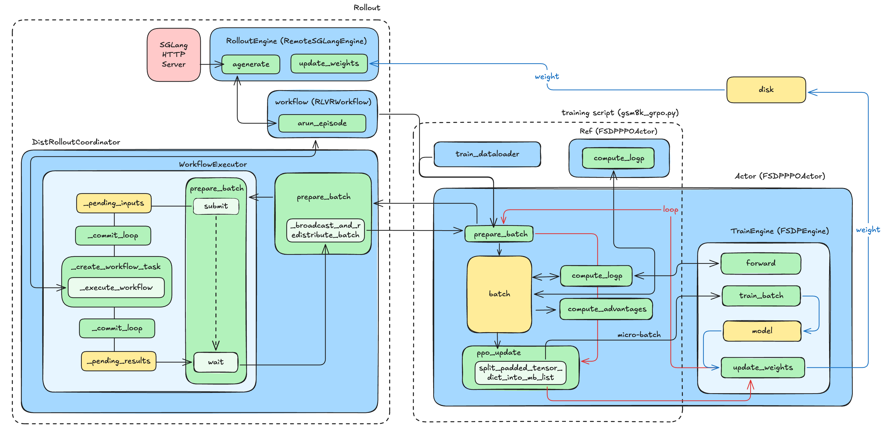
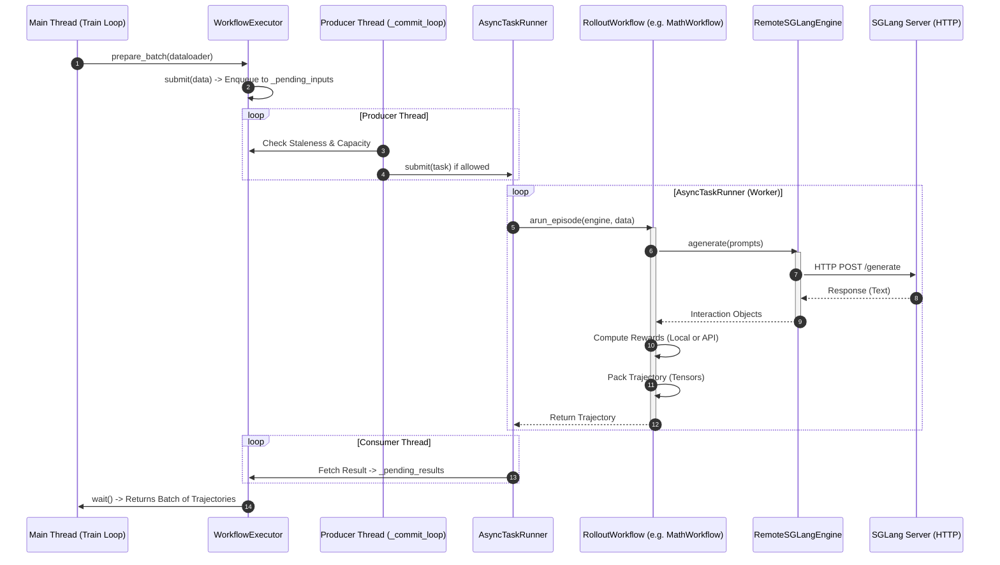

# Code Walkthrough of AReaL

[English](code-walk-through_EN.md) | [中文](code-walk-through_CN.md)

As early as the beginning of 2025, a senior expert in the infrastructure circle praised AReaL's code as the most artistic in the entire community. Taking advantage of AReaL's several major version releases in 2025, as well as the release of related framework works such as [asystem-amem](https://github.com/inclusionAI/asystem-amem), our SGLang RL team would like to share these study notes on AReaL with everyone.

It is worth noting that Professor Yi Wu is an experienced yet young leading scientist in the RL field (for Professor Wu, being young and experienced is not contradictory 😂). AReaL's design in asynchronous training can be considered top-tier in the industry, and this will also be the part we focus on learning.

# Start from Example

Let's start learning AReaL's workflow with a simple example (`examples/math/gsm8k_grpo.py`):



<details>
<summary>Code of main() in gsm8k_grpo.py</summary>

```python
def main(args):
    config, _ = load_expr_config(args, GRPOConfig)

    rank = int(os.getenv("RANK"))
    tokenizer = load_hf_tokenizer(config.tokenizer_path)

    seeding.set_random_seed(config.seed, key=f"trainer{rank}")
    allocation_mode = AllocationMode.from_str(config.allocation_mode)
    parallel_strategy = allocation_mode.train
    assert parallel_strategy is not None

    # Initialize train engine
    actor = FSDPPPOActor(config=config.actor)
    actor.create_process_group(parallel_strategy=parallel_strategy)

    # Create dataset and dataloaders
    train_dataset = get_custom_dataset(
        split="train", dataset_config=config.train_dataset, tokenizer=tokenizer
    )
    valid_dataset = get_custom_dataset(
        split="test", dataset_config=config.valid_dataset, tokenizer=tokenizer
    )

    train_dataloader = create_dataloader(
        train_dataset,
        rank=actor.data_parallel_rank,
        world_size=actor.data_parallel_world_size,
        dataset_config=config.train_dataset,
    )
    valid_dataloader = create_dataloader(
        valid_dataset,
        rank=actor.data_parallel_rank,
        world_size=actor.data_parallel_world_size,
        dataset_config=config.valid_dataset,
    )
    ft_spec = FinetuneSpec(
        total_train_epochs=config.total_train_epochs,
        dataset_size=len(train_dataloader) * config.train_dataset.batch_size,
        train_batch_size=config.train_dataset.batch_size,
    )

    # Initialize inference engine
    rollout = RemoteSGLangEngine(config.rollout)
    rollout.initialize(train_data_parallel_size=parallel_strategy.dp_size)
    eval_rollout = RemoteSGLangEngine(deepcopy(config.rollout))
    # NOTE: eval does not have any offpolicyness control
    eval_rollout.config.max_head_offpolicyness = int(1e12)
    eval_rollout.initialize()

    weight_update_meta = WeightUpdateMeta.from_fsdp_xccl(allocation_mode)

    actor.initialize(None, ft_spec)
    actor.connect_engine(rollout, weight_update_meta)

    ref = None
    if config.actor.kl_ctl > 0 and config.ref is not None:
        ref = FSDPPPOActor(config=config.ref)
        ref.create_process_group(parallel_strategy=parallel_strategy)
        ref.initialize(None, ft_spec)

    # Create rollout workflow
    if tokenizer.pad_token_id not in config.gconfig.stop_token_ids:
        config.gconfig.stop_token_ids.append(tokenizer.pad_token_id)
    if tokenizer.eos_token_id not in config.gconfig.stop_token_ids:
        config.gconfig.stop_token_ids.append(tokenizer.eos_token_id)
    workflow = RLVRWorkflow(
        reward_fn=gsm8k_reward_fn,
        gconfig=config.gconfig,
        tokenizer=tokenizer,
        enable_thinking=False,
        dump_dir=os.path.join(
            StatsLogger.get_log_path(config.stats_logger), "generated"
        ),
    )
    eval_workflow = RLVRWorkflow(
        reward_fn=gsm8k_reward_fn,
        gconfig=config.gconfig.new(temperature=0.6),
        tokenizer=tokenizer,
        enable_thinking=False,
        rollout_stat_scope="eval-rollout",
        dump_dir=os.path.join(
            StatsLogger.get_log_path(config.stats_logger), "generated-eval"
        ),
    )

    # Run training.
    saver = Saver(config.saver, ft_spec)
    stats_logger = StatsLogger(config, ft_spec)
    evaluator = Evaluator(config.evaluator, ft_spec)

    recover_handler = RecoverHandler(config.recover, ft_spec)
    recover_info = recover_handler.load(
        actor,
        saver,
        evaluator,
        stats_logger,
        train_dataloader,
        inference_engine=rollout,
        weight_update_meta=weight_update_meta,
    )
    start_step = (
        recover_info.last_step_info.next().global_step
        if recover_info is not None
        else 0
    )

    total_epochs = config.total_train_epochs
    steps_per_epoch = len(train_dataloader)
    max_steps = total_epochs * steps_per_epoch

    for global_step in range(start_step, max_steps):
        epoch = global_step // steps_per_epoch
        step = global_step % steps_per_epoch
        step_info = StepInfo(
            global_step=global_step,
            epoch=epoch,
            epoch_step=step,
            steps_per_epoch=steps_per_epoch,
        )

        with stats_tracker.record_timing("rollout"):
            batch = actor.prepare_batch(
                train_dataloader,
                granularity=actor.config.group_size,
                workflow=workflow,
                should_accept_fn=lambda sample: True,
            )

        if config.actor.recompute_logprob or config.actor.use_decoupled_loss:
            with stats_tracker.record_timing("recompute_logp"):
                logp = actor.compute_logp(batch)
                batch["prox_logp"] = logp
                log_gpu_stats("recompute logp")

        if ref is not None:
            with stats_tracker.record_timing("ref_logp"):
                batch["ref_logp"] = ref.compute_logp(batch)
                log_gpu_stats("ref logp")

        with stats_tracker.record_timing("compute_advantage"):
            actor.compute_advantages(batch)
            log_gpu_stats("compute advantages")

        with stats_tracker.record_timing("train_step"):
            actor.ppo_update(batch)
            actor.step_lr_scheduler()
            log_gpu_stats("ppo update")

        # pause inference for updating weights, save, and evaluation
        rollout.pause()

        with stats_tracker.record_timing("update_weights"):
            actor.update_weights(weight_update_meta)

            actor.set_version(global_step + 1)
            rollout.set_version(global_step + 1)
            eval_rollout.set_version(global_step + 1)

        with stats_tracker.record_timing("save"):
            saver.save(actor, epoch, step, global_step, tokenizer=tokenizer)

        with stats_tracker.record_timing("checkpoint_for_recover"):
            recover_handler.dump(
                actor,
                step_info,
                saver,
                evaluator,
                stats_logger,
                train_dataloader,
                tokenizer=tokenizer,
            )

        current_platform.synchronize()
        dist.barrier(group=actor.cpu_group)

        with stats_tracker.record_timing("eval"):

            def evaluate_fn():
                if actor.is_data_parallel_head():
                    cnt = 0
                    for data in valid_dataloader:
                        for item in data:
                            eval_rollout.submit(item, eval_workflow)
                            cnt += 1
                    eval_rollout.wait(cnt, timeout=None)
                current_platform.synchronize()
                dist.barrier(group=actor.cpu_group)

            evaluator.evaluate(
                evaluate_fn,
                epoch,
                step,
                global_step,
                )

        current_platform.synchronize()
        dist.barrier(group=actor.cpu_group)

        # Upload statistics to the logger (e.g., wandb)
        stats = stats_tracker.export_all(reduce_group=actor.data_parallel_group)
        stats_logger.commit(epoch, step, global_step, stats)

        current_platform.synchronize()
        dist.barrier(group=actor.cpu_group)

        # Resume rollout
        rollout.resume()

    stats_logger.close()
    eval_rollout.destroy()
    rollout.destroy()
    if ref is not None:
        ref.destroy()
    actor.destroy()
```
</details>

## Init

Initialize the Train Engine (e.g., `FSDPPPOActor`), Inference Engine (e.g., `RemoteSGLangEngine`), and optional Reference Engine, load the dataset (`DataLoader`), and establish the channel for the Actor to transmit weights to the Rollout Engine through `weight_update_meta`.

Create Rollout Workflow. The diagram above uses the most basic `RLVRWorkflow`. AReaL also provides `MultiTurnWorkflow`, supporting complex multi-turn dialogue RL tasks. They are all implementations of the abstract class `RolloutWorkflow` (`AReaL/areal/api/workflow_api.py`). These implementations of `RolloutWorkflow` unify the generation interface. When calling the workflow for generation, there is no need to care about specific interaction details; just call `workflow.arun_episode()` to get a batch of Trajectories containing standard training fields.

## Rollout

The Actor calls `prepare_batch` to request the trajectories generated by the rollout. The call path for this part is `FSDPPPOACTOR.prepare_batch` → `DistRolloutCoordinator.prepare_batch` → `RemoteInfEngine.prepare_batch` → `WorkflowExecutor.prepare_batch`. Here, `prepare_batch` of `WorkflowExecutor` triggers an asynchronous Producer-Consumer pipeline.

> [!TIP]
> **Producer-Consumer**
>
> The Producer-Consumer Pattern is a classic concurrency design pattern used to solve the data transmission problem between two components with inconsistent processing rates.
>
> - **Core Idea**: The Producer and Consumer do not communicate directly but decouple through a Buffer/Queue.
> - **Producer**: Responsible for generating data and putting it into the buffer. If the buffer is full, the producer must wait or discard data.
> - **Consumer**: Responsible for taking data from the buffer for processing. If the buffer is empty, the consumer must wait.
> - **Buffer**: Smooths out fluctuations in production and consumption rates, allowing both to work in parallel without blocking each other.

The figure below shows the interaction and data flow during the rollout process.



Let's further understand the key classes mentioned in the diagram above.

### RolloutWorkflow

`RolloutWorkflow` is located in `areal/api/workflow_api.py`, which is the core abstraction defining Agent behavior in AReaL (defined in `areal/api/workflow_api.py`).

<details>
<summary>Abstract Class RolloutWorkflow Code (AReaL/areal/api/workflow_api.py)</summary>

```python
class RolloutWorkflow(ABC):
    @abstractmethod
    async def arun_episode(
        self, engine: InferenceEngine, data: dict[str, Any]
    ) -> dict[str, Any] | None | dict[str, InteractionWithTokenLogpReward]:
        raise NotImplementedError()

```
</details>

From this code, we can see that all concrete implementations of `RolloutWorkflow` (such as `RLVRWorkflow`, `MultiTurnWorkflow`, located in `areal/workflow/`) must implement this core asynchronous function `arun_episode()`. Next, we take `RLVRWorkflow` as an example to analyze what the specific implementation of `RolloutWorkflow` looks like.

In `init`, besides necessary rollout parameters, `reward_fn` is also input, and reward calculation is included in the workflow.

<details>
<summary>RLVRWorkflow.init</summary>

```python
class RLVRWorkflow(RolloutWorkflow):
    """Single-turn reward learning workflow supporting optional thinking tokens."""

    def __init__(
        self,
        reward_fn: Callable[..., Any],
        gconfig: GenerationHyperparameters,
        tokenizer: PreTrainedTokenizerFast,
        enable_thinking: bool = False,
        rollout_stat_scope: str = "rollout",
        dump_dir: str | None = None,
        get_input_ids_fn: Callable[
            [Any, PreTrainedTokenizerFast, bool], list[int]
        ] = default_get_input_ids_fn,
        data_extract_prompt_fn: Callable[
            [dict[str, Any]], Any
        ] = default_data_extract_prompt_fn,
    ):
        self.reward_fn = reward_fn
        self.gconfig = gconfig
        self.tokenizer = tokenizer
        self.enable_thinking = enable_thinking
        self.dump_dir = dump_dir
        self.rollout_stat_scope = rollout_stat_scope
        self.async_reward_fn = AsyncRewardWrapper(reward_fn)
        self.get_input_ids_fn = get_input_ids_fn
        self.data_extract_prompt_fn = data_extract_prompt_fn
        if self.dump_dir is not None and not os.path.exists(self.dump_dir):
            os.makedirs(self.dump_dir, exist_ok=True)
```
</details>


`arun_episode()` serves as a unified entry point for the outside world. It receives `InferenceEngine` and input data `data`, and is responsible for executing a complete rollout process, including:

Prompt construction and preprocessing, concurrent sampling, reward calculation, and final Trajectory assembly and return.

<details>
<summary>RLVRWorkflow.arun_episode()</summary>

```python
async def arun_episode(
        self, engine: InferenceEngine, data: dict[str, Any]
    ) -> dict[str, torch.Tensor]:
            ...
        version = engine.get_version()
        prompt_str = self.tokenizer.decode(input_ids)
        prompt_strs = [prompt_str] * n_samples

        # Generate responses and collect rewards
        sample_results = await asyncio.gather(
            *[
                self._collect_samples(engine, req, prompt_str, data)
                for _ in range(n_samples)
            ]
        )
        if sample_results:
            resps, rewards, completions_strs = map(list, zip(*sample_results))
        else:
            resps, rewards, completions_strs = [], [], []

        # Build result tensors
        results = []
        for resp, reward in zip(resps, rewards):
            seq = resp.input_tokens + resp.output_tokens
            logprobs = [0.0] * resp.input_len + resp.output_logprobs
            loss_mask = [0] * resp.input_len + [1] * resp.output_len
            versions = [-1] * resp.input_len + resp.output_versions

            res = {
                "input_ids": torch.tensor(seq, dtype=torch.int32),
                "loss_mask": torch.tensor(loss_mask, dtype=torch.int32),
                "logprobs": torch.tensor(logprobs, dtype=torch.float32),
                "versions": torch.tensor(versions, dtype=torch.int32),
                "attention_mask": torch.ones(len(seq), dtype=torch.bool),
                "rewards": torch.tensor(reward, dtype=torch.float32),
            }
            res = {k: v.unsqueeze(0) for k, v in res.items()}
            results.append(res)

        ...

        return concat_padded_tensors(results)
```
</details>


`arun_episode()` internally calls `_collect_samples()` for sampling and reward calculation, and `_collect_samples()` further calls `agenerate()` of the inference engine, which is the interface that actually triggers model inference.

<details>
<summary>RLVRWorkflow._collect_samples()</summary>

```python
    async def _collect_samples(
        self,
        engine: InferenceEngine,
        req: ModelRequest,
        prompt_str: str,
        task_data: dict[str, Any],
    ) -> tuple[ModelResponse, float, str]:
       
        async with atrace_session_phase("generate"):
            resp = await engine.agenerate(req)

        reward, completions_str = await self._compute_rewards(
            resp, prompt_str, task_data
        )

        stats_tracker.get(self.rollout_stat_scope).scalar(reward=reward)

        return resp, reward, completions_str
```
</details>


### **WorkflowExecutor**

`WorkflowExecutor` is located in `areal/core/workflow_executor.py`. It is the component in the AReaL framework responsible for coordinating asynchronous scheduling and concurrency control between the training process and remote inference services. It encapsulates the Producer-Consumer thread model, and its internal structure is as follows:

`prepare_batch()`: Encapsulates `submit()` and `wait()`, taking input data / prompts as input and outputting the results.

<details>
<summary>prepare_batch() Code</summary>

```python
def prepare_batch(
        self,
        dataloader: StatefulDataLoader,
        workflow: RolloutWorkflow | type[RolloutWorkflow] | str,
        workflow_kwargs: dict[str, Any] | None = None,
        should_accept_fn: Callable[[dict[str, Any]], bool] | str | None = None,
    ):

        manager = self.staleness_manager
        if not hasattr(self, "data_generator"):
            self.data_generator = cycle_dataloader(dataloader)
        assert dataloader.batch_size is not None
        cnt = 0
        results = []
        while True:
            # Submit at least two batches to allow maximum overlap
            if (
                len(self._pending_inputs) < manager.get_pending_limit()
                and self.runner.get_input_queue_size() + dataloader.batch_size
                < self.runner.max_queue_size
            ):
                data = next(self.data_generator)
                perf_tracer.instant(
                    "workflow_executor.prepare_batch",
                    category="scheduler",
                    args={"data": len(data)},
                )
                for item in data:
                    self.submit(
                        item,
                        workflow=workflow,
                        should_accept_fn=should_accept_fn,
                        workflow_kwargs=workflow_kwargs,
                    )
            try:
                res = self.wait(count=1, timeout=1)
                if not res:
                    continue
                cnt += 1
                results.append(res)
                if cnt >= dataloader.batch_size:
                    break
            except (TimeoutError, queue.Full):
                pass
        return concat_padded_tensors(results)
```
</details>


Main thread: The main thread does not involve generation or control, but simply adds tasks to the queue and outputs results. `submit()` adds tasks to the `_pending_inputs` queue, and `wait()` polls the `_pending_results` queue:

<details>
<summary>submit() and wait() Code</summary>

```python
def submit(
        self,
        data: dict[str, Any],
        workflow: RolloutWorkflow | type[RolloutWorkflow] | str,
        workflow_kwargs: dict[str, Any] | None = None,
        should_accept_fn: Callable[[dict[str, Any]], bool] | str | None = None,
    ) -> None:
        ...

        # Resolve workflow and should_accept to their concrete forms
        resolved_workflow = self._resolve_workflow(workflow, workflow_kwargs)
        resolved_should_accept_fn = self._resolve_should_accept_fn(should_accept_fn)

        task_id = perf_tracer.register_task()
        task_input = _RolloutTaskInput(
            data=data,
            workflow=resolved_workflow,
            should_accept_fn=resolved_should_accept_fn,
            task_id=task_id,
        )

        # Enqueue to thread-safe queue (may block if queue is full)
        self._pending_inputs.append(task_input)

        # Notify staleness manager of enqueued rollout tasks
        self.staleness_manager.on_rollout_enqueued()
        
        ...

    def wait(
        self, count: int, timeout: float | None = None, raise_timeout: bool = True
    ) -> dict[str, Any]:
        
        ...

        # Drain all available requests and sort them by time of creation
        # This prioritizes data submitted earlier.
        results: list[TimedResult[_RolloutResult]] = []
        while True:
            try:
                results.append(self._pending_results.popleft())
            except IndexError:
                break
        # Sort results be create time
        results.sort(key=lambda x: x.create_time)
        results, pending = results[:count], results[count:]
        self._pending_results.extendleft(reversed(pending))

        # Shuffle for randomness (helps with data diversity)
        random.shuffle(results)

        # Concatenate into batch tensor format
        trajectories = [r.data.trajectory for r in results if r.data is not None]
        return concat_padded_tensors(trajectories)
```
</details>


Producer thread (`_commit_loop`): Determines the number of tasks that can be submitted in this round based on the available capacity returned by `StalenessManager.get_capacity()`, takes the corresponding number of tasks from `_pending_inputs`, and hands them over to `AsyncTaskRunner` to execute the generation process.

<details>
<summary>_commit_loop() Code</summary>

```python
def _commit_loop(self) -> None:

  while not self._shutdown_event.is_set():
      try:
            ...

          # Get capacity from staleness manager
          version = self.inference_engine.get_version()
          capacity = self.staleness_manager.get_capacity(version)

          if capacity <= 0:
              time.sleep(_POLL_INTERVAL_SECONDS)
              continue

          # Try to submit up to 'capacity' tasks
          for _ in range(capacity):
              try:
                  task = self._pending_inputs.popleft()
              except IndexError:
                  break

              # Submit to runner (may raise TaskQueueFullError)
              workflow_fn = self._create_workflow_task(task)
              try:
                  self.runner.submit(workflow_fn)

                  self.staleness_manager.on_rollout_submitted()
                  if self.config.enable_rollout_tracing:
                      self.logger.info(f"Submit rollout. {self._rollout_stats()}")
              except TaskQueueFullError:
                  # Put back and retry later
                  self._pending_inputs.appendleft(task)
                  break

          ...
```
</details>


Consumer thread (`_fetch_loop`): Collects results from `AsyncTaskRunner` and stores them in `_pending_results`.

<details>
<summary>_fetch_loop() Code</summary>

```python
def _fetch_loop(self) -> None:
        """Consumer thread main loop - continuously collects results from runner.

        This method runs in a background thread and continuously:
        1. Checks for errors from other threads (fail-fast)
        2. Polls AsyncTaskRunner for available results (non-blocking)
        3. Collects results in batches up to 100 with short timeout (0.05s)
        4. Filters out None (rejected) results
        5. Appends accepted TimedResult objects to _pending_results deque

        The loop exits when _shutdown_event is set. Polling interval: 0.5s.
        """
        while not self._shutdown_event.is_set():
            try:
                # Check for errors from other threads (fail-fast)
                self._check_thread_exception()

                # Poll runner for available results (non-blocking)
                output_queue_size = self.runner.get_output_queue_size()

                if output_queue_size == 0:
                    time.sleep(_POLL_INTERVAL_SECONDS)
                    continue

                # Collect all available results at once (batch for efficiency)
                # Limit batch size to avoid blocking too long
                count = min(output_queue_size, _MAX_FETCH_BATCH_SIZE)

                try:
                    # Use short timeout for responsiveness (latency-optimized)
                    results = self.runner.wait(
                        count=count, timeout=0.05, with_timing=True
                    )

                    # Enqueue all results. Filtering will be delayed to
                    # `rollout_batch` or `prepare_batch`.
                    for result in results:
                        self._pending_results.append(result)

                except TimeoutError:
                    # No results ready yet
                    pass

                # Small sleep to avoid busy-waiting (latency-optimized)
                time.sleep(_POLL_INTERVAL_SECONDS)

            except Exception as e:
                self.logger.error("Consumer thread failed", exc_info=True)
                self._set_thread_exception(e)
                break
```
</details>


`AsyncTaskRunner`: A generic asynchronous executor inside `WorkflowExecutor`, responsible for managing the Event Loop in a background thread and concurrently executing high-density network I/O tasks (i.e., calling `agenerate` of the Inference Engine).

<details>
<summary>AsyncTaskRunner Code</summary>

```python
async def _run_async_loop(self):
    """Main async event loop that processes tasks.

    This loop:
    1. Pulls tasks from input_queue when not paused
    2. Creates asyncio.Task instances for each
    3. Waits for task completion
    4. Places results in output_queue
    5. Continues until exiting signal is set
    """
    running_tasks: dict[str, _Task[T]] = {}
    task_id = 0

    try:
        while not self.exiting.is_set():
            # 1. Pull new tasks from input queue
            while not self.paused.is_set() and self.input_queue.qsize() > 0:
                try:
                    task_input = self.input_queue.get_nowait()

                    # 2. Create asyncio task (This is where execution starts)
                    async_task = asyncio.create_task(
                        task_input.async_fn(*task_input.args, **task_input.kwargs),
                        name=str(task_id),
                    )

                    # Store task with metadata
                    running_tasks[str(task_id)] = _Task(
                        create_time=time.monotonic_ns(),
                        task=async_task,
                        task_input=task_input,
                        )
                    task_id += 1
                except queue.Empty:
                    break

            # 3. Wait for any task to complete
            done = []
            if running_tasks:
                tasks = [t.task for t in running_tasks.values()]
                done, _ = await asyncio.wait(
                    tasks,
                    timeout=self.poll_wait_time,
                    return_when=asyncio.FIRST_COMPLETED,
                )

            # 4. Process completed tasks and output results
            for async_task in done:
                tid = async_task.get_name()
                task_obj = running_tasks.pop(tid)
                try:
                    result = await async_task
                    # Place result in output queue
                    self.output_queue.put_nowait(
                        TimedResult(create_time=task_obj.create_time, data=result)
                    )
                except Exception as e:
                    # Error handling...
                    pass

            # Sleep to avoid busy-waiting
            await asyncio.sleep(self.poll_sleep_time)

```
</details>


### StalenessManager

`StalenessManager` is located in `areal/core/staleness_manager.py`. It uses two constraints (concurrency limit + staleness limit) to calculate how many new rollouts can be accepted. It is controlled by three parameters:

- `max_concurrent_rollouts`: Limits the concurrency upper bound, i.e., the maximum number of running generation tasks.
- `consumer_batch_size`: Consumer batch size, i.e., the batch size of trainer training.
- `max_staleness`: The maximum allowed version difference between samples and the current model version.

<details>
<summary>init Code</summary>

```python
class StalenessManager:
   
    def __init__(
        self,
        max_concurrent_rollouts: int,
        consumer_batch_size: int,
        max_staleness: int,
    ):
        self.max_concurrent_rollouts = max_concurrent_rollouts
        self.consumer_batch_size = consumer_batch_size
        self.max_staleness = max_staleness

        # Thread-safe access to rollout statistics
        self.lock = Lock()
        self.rollout_stat = RolloutStat()
```
</details>


The core algorithm is located in `get_capacity()`, and the formula is as follows:

```python
max_samples = (max_staleness + current_version + 1) * consumer_batch_size
capacity = min(concurrency_limit, max_samples - current_samples)
```

Here is my understanding of this formula: When the current weight version is `current_version`, we not only need to serve the current trainer but also prepare data in advance for the trainer up to `max_staleness` versions in the future (i.e., versions from `current_version` to `current_version + max_staleness`). Since the trainer consumes `consumer_batch_size` samples per version, theoretically, the maximum total number of samples that can be safely consumed from version 0 up to `current_version + max_staleness` is:

```python
max_samples = (max_staleness + current_version + 1) * consumer_batch_size
```

The number of samples already accumulated in the current system is denoted as `current_samples` (including accepted and running rollouts). So, under the premise of not letting future samples "expire", the number of samples that can still be generated now is:

```python
staleness_capacity = max_samples - current_samples
```

In other words, `max_staleness` controls "that these samples remain unexpired when moving forward up to `max_staleness` versions from now", and the formula indirectly guarantees this by limiting the total number of samples.

After understanding the staleness algorithm, the code becomes very clear. First, calculate the capacity margin under the concurrency limit, then calculate the capacity margin under the staleness limit, and take the minimum of the two as the true capacity margin.

<details>
<summary>get_capacity() Code</summary>

```python
def get_capacity(self, current_version: int) -> int:

    with self.lock:
        # Calculate concurrency-based capacity
        max_concurrent_rollouts = max(1, self.max_concurrent_rollouts)
        concurrency_capacity = max_concurrent_rollouts - self.rollout_stat.running

        # Calculate staleness-based capacity
        ofp = self.max_staleness
        sample_cnt = self.rollout_stat.accepted + self.rollout_stat.running
        consumer_bs = max(1, self.consumer_batch_size)
        staleness_capacity = (ofp + current_version + 1) * consumer_bs - sample_cnt

        # Return the minimum of both constraints
        capacity = min(concurrency_capacity, staleness_capacity)
        return capacity

```
</details>


### DistRolloutCoordinator

`DistRolloutCoordinator` implements a data coordinator in distributed training. Its core function is to ensure that the total number of tokens received by each Data Parallel Rank (GPU) is as consistent as possible in a distributed environment, solving the load imbalance problem caused by varying lengths of generated sequences. If data is distributed directly on average, some GPUs may be assigned many long texts (large computation), while others are assigned short texts, leading to waiting during training (Straggler problem).

AReaL uses the FFD (First-Fit Decreasing) algorithm to redistribute data to achieve Token-level load balancing.

<aside>
💡

FFD (First-Fit Decreasing) Algorithm:

FFD is a classic **greedy algorithm** often used to solve bin packing problems or multi-machine scheduling problems. Its core strategy is "sort in descending order, fill the holes first":

1. **Decreasing**: First, sort all tasks (Sequences) in descending order of computational load (Token length).
2. **First-Fit**: Take tasks in turn and assign them to the node with the current minimum load (or maximum remaining space).

By this method of "handling big rocks first, then filling gaps with sand", FFD can ensure to the greatest extent that the total computational load of all GPUs tends to be consistent, eliminating the bucket effect.

</aside>

The core function of this feature is `redistribute()`, located in `areal/core/dist_rollout.py`. This function first collects the data generated on all GPUs through `all_gather_tensor_container`, so that each rank has the global full data. Then, it slices the data in the large batch according to granularity (usually the number of data produced by the same prompt in GRPO) to determine the minimum unit. After slicing, it gets the token count of each sequence to prepare for the FFD algorithm.

Next, remove the padding in the sequence, distribute the workload evenly within the process group via FFD, and finally return the result.

```python
return RedistributedData(
    all_data=all_data,            # All small chunks after original slicing (for backup)
    data=data,                    # The assembled data finally used by the current GPU
    rank=dist.get_rank(group=group),
    group_indices=group_indices,  # Global allocation plan
    )
```

<details>
<summary>redistribute() Code</summary>

```python
def redistribute(
    data: dict[str, Any], granularity: int = 1, group=None
) -> RedistributedData:
    """Redistribute a batch across a process group.

    This function only accepts padded data which must have an "attention_mask" field,
    Each tensor should have shape [bs, seqlen, *] or [bs].

    This function will divide the global batch into segments each with consecutive
    `granularity` sequences, and then redistribute the segments (e.g., for GRPO).
    """
    all_gathered = all_gather_tensor_container(data, group=group)

    all_data = []
    for d in all_gathered:
        bs = get_batch_size(d)
        assert bs % granularity == 0
        all_data += [
            _slice_tensor_dict(d, i, i + granularity) for i in range(0, bs, granularity)
        ]

    seqlens = [d["attention_mask"].sum().item() for d in all_data]

    # Remove pad positions
    for d in all_data:
        max_sequence_length = d["attention_mask"].sum(-1).max().item()
        attn_mask_shape = d["attention_mask"].shape
        for k, v in d.items():
            if (
                torch.is_tensor(v)
                and len(v.shape) >= 2
                and v.shape[:2] == attn_mask_shape[:2]
            ):
                d[k] = v[:, :max_sequence_length]

    # No capacity limit leads to balanced partition across this group
    group_indices = ffd_allocate(
        seqlens, capacity=int(1e12), min_groups=dist.get_world_size(group)
    )
    local_indices = group_indices[dist.get_rank(group=group)]

    data = concat_padded_tensors([all_data[i] for i in local_indices])
    return RedistributedData(
        all_data=all_data,
        data=data,
        rank=dist.get_rank(group=group),
        group_indices=group_indices,
    )

```
</details>


In addition, the most core logic in the `DistRolloutCoordinator` class is actually the distributed communication pattern, implementing a classic Head-Worker synchronization pattern, which is reflected in the `prepare_batch` function and the `_broadcast_and_redistribute_batch` it calls. In `prepare_batch`, the function judges whether the rank is the head, and only the head rank can call `prepare_batch` for generation.

The generated data is first moved to the current computing device (GPU), and then enters the core communication pipeline `_broadcast_and_redistribute_batch`.

In this pipeline, the Head node holding the data first calls `redistribute` within the data parallel group, using the aforementioned FFD algorithm to slice and repackage the Batch to complete load balancing calculation.

Next, the code sets a strict synchronization barrier (`dist.barrier`). All Worker nodes (including non-Head nodes) will wait here until the Head node completes the above data preparation and redistribution work, ensuring the consistency of the cluster state.

After synchronization is lifted, it enters the broadcast phase. The Head node acts as the source (`src_rank`) and distributes the processed and load-balanced data to all Workers in the `context_and_model_parallel_group` through `broadcast_tensor_container`. Finally, synchronization is performed again to ensure that all ranks have received the data completely. This design not only avoids the waste of computing power caused by repeated Rollout generation on all nodes but also ensures that data can be efficiently and evenly synchronized to the entire distributed cluster.

<details>
<summary>prepare_batch() Code</summary>

```python
def prepare_batch(
        self,
        dataloader: StatefulDataLoader,
        workflow: RolloutWorkflow | type[RolloutWorkflow] | str,
        granularity: int = 1,
        workflow_kwargs: dict[str, Any] | None = None,
        should_accept_fn: Callable[[dict[str, Any]], bool] | str | None = None,
    ) -> dict[str, Any]:

        batch = None
        if self.train_engine.is_data_parallel_head():
            batch = self.rollout_engine.prepare_batch(
                dataloader,
                workflow=workflow,
                workflow_kwargs=workflow_kwargs,
                should_accept_fn=should_accept_fn,
            )
            batch = tensor_container_to(batch, current_platform.current_device())

        return self._broadcast_and_redistribute_batch(batch, granularity=granularity)

```
</details>


<details>
<summary>_broadcast_and_redistribute_batch() Code</summary>

```python
def _broadcast_and_redistribute_batch(
        self,
        batch: dict[str, Any] | None,
        granularity: int = 1,
    ) -> dict[str, Any]:
        
        if batch is not None:
            redist = redistribute(
                batch,
                granularity=granularity,
                group=self.train_engine.data_parallel_group,
            )
            batch = redist.data

        current_platform.synchronize()
        dist.barrier(group=self.train_engine.cpu_group)

        batch = broadcast_tensor_container(
            batch,
            src_rank=self.train_engine.current_data_parallel_head(),
            group=self.train_engine.context_and_model_parallel_group,
            )

        current_platform.synchronize()
        dist.barrier(group=self.train_engine.cpu_group)

        return batch
```
</details>


## Training

After the Actor obtains the trajectories, it enters the core training logic:

- **Micro-Batching**: To handle ultra-large Batches (such as the large amount of sampling required by GRPO), the Actor first calls `split_padded_tensor_dict_into_mb_list` (see `areal/utils/data.py`, used in `Actor.train_batch`) to split the large Batch into multiple Micro-Batches based on the number of Tokens using Dynamic Batching. Detailed analysis of the method can be found in the Dynamic Batching section below.
- **Gradient Accumulation**: For each Micro-Batch, the Actor calls the underlying `TrainEngine` (FSDP / Megatron)'s `train_batch` interface (`areal/engine/fsdp_engine.py`):
    - Execute Forward calculation;
    - Calculate log probs, KL divergence, and advantage;
    - Execute Backward and accumulate gradients;
- **Parameter Update**: After processing all Micro-Batches, execute `optimizer.step()` to update model parameters.

### Micro-Batching

The logic of Micro-Batching is mainly scattered in the `split_padded_tensor_dict_into_mb_list` function in `areal/utils/data.py`. Here, a large Batch is split into multiple small Micro-Batches, grouping sequences of different lengths so that the total number of Tokens in each Micro-Batch does not exceed `max_tokens_per_mb`, thereby avoiding OOM (Out of Memory). The logic here is the same as the coordinator implemented by `DistRolloutCoordinator` through the FFD algorithm, so it will not be analyzed in detail here.

<details>
<summary>Core Code Implementation</summary>

```python
def split_padded_tensor_dict_into_mb_list(
    data: dict[str, Any],
    mb_spec: MicroBatchSpec,
    group: dist.ProcessGroup | None = None,
) -> MicroBatchList:
    # 1. Length statistics: Calculate the effective length of each data based on attention_mask
    seq_lens = data["attention_mask"].sum(1).long().cpu().numpy().tolist()
    
    # 2. Group aggregation: If granularity exists (e.g., GRPO), first aggregate the total Tokens within the group
    granularity = mb_spec.granularity
    bs = data["attention_mask"].shape[0]
    input_lens = (
        data["attention_mask"]
        .view(bs // granularity, granularity, -1)
        .sum(dim=(1, 2))
        .long()
        .cpu()
        .numpy()
    )

    # 3. Load balancing allocation: Use FFD (First-Fit Decreasing) algorithm for bin packing planning
    # Ensure the total Token count of each Micro-batch does not exceed max_tokens_per_mb
    group_indices = allocate_balanced_mbs_synced(mb_spec, input_lens, group=group)
    
    # 4. Index mapping: Map the allocation results back to the original data indices
    group_indices = [
        datapack.flat2d(
            [list(range(i * granularity, (i + 1) * granularity)) for i in group_index]
        )
        for group_index in group_indices
    ]

    # 5. Physical reordering and splitting: Reassemble Tensors according to the calculated indices
    def _split(tensor):
        unpacked = [tensor[i] for i in range(bs)]
        reordered = reorder_list(unpacked, forward_indices)
        reordered = torch.stack(reordered)
        
        splitted = []
        offset = 0
        for _n_seqs in group_n_seqs:
            splitted.append(reordered[offset : offset + _n_seqs])
            offset += _n_seqs
        return splitted

    to_split = dict_map(to_split, lambda x: _split(x))

    return MicroBatchList(...)
```
</details>


## Update weights

After Training, the rollout side needs to be updated accordingly. This process is controlled by the `WeightUpdateMeta` configuration, which defines how the Actor (initiator) transmits parameters to the Rollout Engine (receiver).

1. **Configuration Driven**:
    - `WeightUpdateMeta` defines the transmission method (NCCL-based `_update_weights_from_distributed` or direct disk writing-based `_update_weights_from_disk`) and the destination address. The Actor decides which update path to take based on this metadata.
2. **Actor Initiates Update**:
    - The Actor calls `update_weights` (see `fsdp_engine.py`).
    - If it is NCCL mode, execute `_update_weights_from_distributed` to broadcast parameters via NCCL; if it is disk mode, execute `_update_weights_from_disk` to save the Checkpoint.
3. **Rollout Engine Responds**:
    - The Actor calls the corresponding interface of the rollout_engine (such as `update_weights_from_distributed`, see `sglang_remote.py`).
    - The Rollout Engine sends an HTTP request carrying Meta information to the remote SGLang Server, instructing the Server to perform weight synchronization or loading.

## **Ray Placement Group & Launch**

The ray-related code is concentrated in `areal/launcher/ray.py`, where the most important class is `RayLauncher`.

### AllocationMode

`AllocationMode` is essentially an encapsulation of a **Configuration Class** and a **Parser**.

- It contains `_LLMParallelParser`, responsible for parsing the DSL string entered by the user (such as `"sglang:d2+fsdp:d4"`) into structured data.
- It also stores the parsed result (`ModelAllocation` object list). All subsequent queries in the program regarding "how many models I have", "how many cards each model uses", and "who shares resources with whom" are obtained by directly accessing the properties of the `AllocationMode` instance.

For colocate and disaggregate, AReaL controls them through the following parameters:

```python
# disaggregation / separation (parts connected by "+")
allocation_mode="sglang[rollout]:d2+fsdp[actor]:d4+fsdp[critic]:d2"
```

The layout here means: Rollout: 2 GPUs (SGLang, 2DP), Actor: 4 GPUs (FSDP, 4DP), Critic: 2 GPUs (FSDP, 4DP), totaling 8 GPUs (2+4+2).

```python
# Colocation (colocation parts connected by "|")
allocation_mode="sglang[rollout]:d4+fsdp[actor]:d4|fsdp[critic]:d4"
```

The layout here means: **Rollout**: 4 GPUs (SGLang, 4DP), **Actor & Critic**: share another 4 GPUs (FSDP, 4DP), totaling 8 GPUs (4+4).

### RayLauncher / ray_main()

`ray_main()` is the entrypoint for the entire RL process of AReaL. Its core responsibility is to request Ray resources according to the parameter settings in `AllocationMode`, and start the Rollout Engine and Training Actor in sequence. The following code shows the process of the Launcher starting the SGLang inference service. From the code, it is clear that it first extracts the parallelism parameters of the Rollout side (such as dp_size, world_size) from `AllocationMode`, calculates the corresponding Ray Placement Group specifications based on this, and finally submits specific startup instructions to the Ray cluster for execution via `launcher.submit_array()`.

The launcher for the Trainer is similar and will not be repeated here.

<details>
<summary>Launch SGLang Code</summary>

```python
if allocation_mode.gen_backend == "sglang":
    # Launcher should launch SGLang servers according to allocation mode.
    config.sglang = to_structured_cfg(config.sglang, SGLangConfig)
    n_sglang_servers = allocation_mode.gen.dp_size
    n_sglang_nodes = max(1, allocation_mode.gen.world_size // n_gpus_per_node)
    node_group_size = max(1, allocation_mode.gen_instance_size // n_gpus_per_node)
    n_servers_per_node = max(n_sglang_servers // n_sglang_nodes, 1)
    cross_nodes = allocation_mode.gen_instance_size > n_gpus_per_node

    base_seed = config.sglang.random_seed
    sglang_args_list = [
        [
            sys.argv[1:]
            + [f"sglang.random_seed={base_seed + i * n_servers_per_node}"]
        ]
        for i in range(n_sglang_nodes)
    ]
    sglang_entry_point = str(
        pathlib.Path(__file__).resolve().parent.joinpath("sglang_server.py")
    )

    def sglang_env_hook(
        n_tasks: int, task_group_size: int, placement_group: PlacementGroup
    ) -> list[dict]:
        master_addrs = []
        master_ports = []
        for i in range(0, n_tasks, task_group_size):
            host_ip, port = get_placement_group_master_ip_and_port(
                placement_group, i
            )
            master_addrs.append(host_ip)
            master_ports.append(port)

        env_vars = []
        for i in range(n_tasks):
            env_vars.append(
                dict(
                    AREAL_SGLANG_MULTI_NODE_RANK=str(i % task_group_size),
                    AREAL_SGLANG_MULTI_NODE_MASTER_ADDR=master_addrs[
                        i // task_group_size
                    ],
                    AREAL_SGLANG_MULTI_NODE_MASTER_PORT=str(
                        master_ports[i // task_group_size]
                    ),
                )
            )

        return env_vars

    # launch a task to start all sglang servers in one node
    launcher.submit_array(
        job_name="llm_server",
        file_path=sglang_entry_point,
        func_name=DEFAULT_MAIN_FUNC_NAME,
        count=n_sglang_nodes,
        nodes=n_sglang_nodes,
        list_args=sglang_args_list,
        gpus_per_task=n_gpus_per_node,
        cpus_per_task=config.launcher.inference_server_cpus_per_gpu
        * n_gpus_per_node,
        mem_per_task=config.launcher.inference_server_mem_per_gpu * n_gpus_per_node,
        env_vars=get_env_vars(
            config.cluster.cluster_name,
            config.launcher.inference_server_env_vars,
        ),
        env_hook=(
            partial(sglang_env_hook, n_sglang_nodes, node_group_size)
            if cross_nodes
            else None
        ),
    )
    # Get SGLang server addresses via name_resolve
    try:
        sglang_addrs = wait_llm_server_addrs(
            config.experiment_name,
            config.trial_name,
            n_sglang_servers,
        )
    except (TimeoutError, KeyboardInterrupt) as e:
        launcher.stop_all(
            force=False
        )  # force=False will send KeyboardInterrupt to sglang_server.main() to further clean all sglang-related processes
        raise e
```
</details>


### Bundle & **Ray Placement Group**

In `RayLauncher.submit_array`, the definition of bundles in AReaL appears. According to the code, AReaL's bundle size is not fixed, and the number of GPUs and CPUs per bundle is not fixed. Instead, it is allocated directly in units of nodes.

```python
tasks_per_node = count // nodes
gpus_per_node = gpus_per_task * tasks_per_node
cpus_per_node = cpus_per_task * tasks_per_node
mem_per_node = mem_per_task * tasks_per_node

device_bundles = [
    {
        "CPU": cpus_per_node,
        "GPU": gpus_per_node,
        "memory": mem_per_node * 1024 * 1024,  # Convert MB to bytes
    }
] * nodes

placement_group = ray.util.placement_group(
		bundles=device_bundles, strategy="PACK"
)
```

The typical calling method (such as on the Trainer side) is:

```python
count = trainer_n_nodes * n_gpus_per_node
nodes = trainer_n_nodes
gpus_per_task = 1

# Substitute into the formula above, i.e.
tasks_per_node = n_gpus_per_node
gpus_per_node = 1 * n_gpus_per_node = n_gpus_per_node
```

In other words, each bundle corresponds to all GPUs + corresponding CPU/memory of a node.
This node-level bundle granularity avoids resource fragmentation from the source and ensures topology controllability and performance stability for communication-intensive parallel schemes like FSDP / Megatron to the greatest extent.

