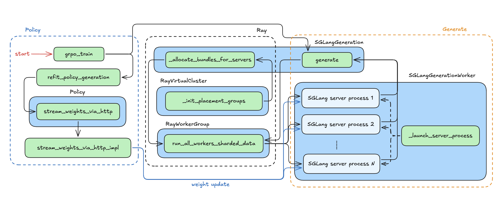
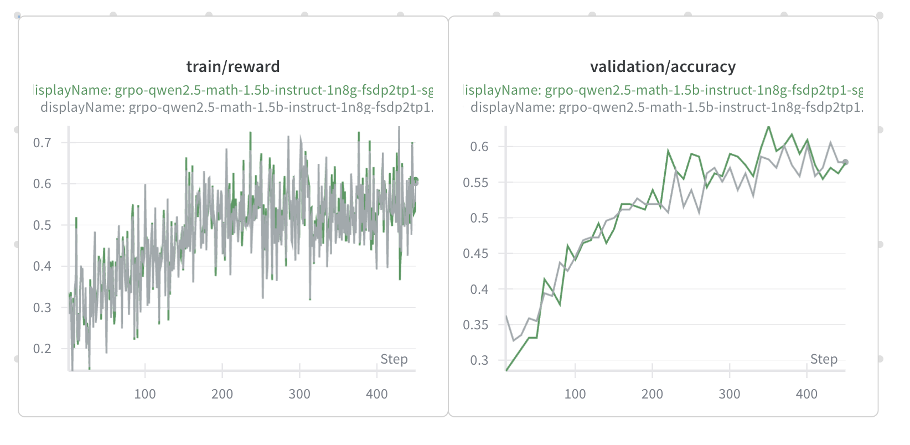

# SGLang × NeMo RL: A Unified High-Performance RL Inference Backend (CN)

> English version: [readme-en.md](readme-en.md)

> **TL;DR**
>
> 我们在 NeMo RL 里新增了 **SGLang generation backend**，目前已经打通完整链路（启动、生成、权重热更新、关闭）。

---

## 技术背景

为增强 NeMo-RL 与快速增长的 SGLang 强化学习社区之间的兼容性，我们将 SGLang 集成为 NeMo-RL 官方支持的高性能 rollout 推理后端。

SGLang 凭借其庞大且持续增长的 RL 用户群体以及在工业界的成熟应用，将为 NeMo 生态系统带来了不可替代的价值。通过将 SGLang 纳入 NeMo-RL 并对两者的 RL 系统进行协同设计，我们将从以下几个方面显著提升 NeMo 生态系统的能力：

1. 吸引大规模的 SGLang 开发者与研究者社区，扩展 NeMo-RL 的用户基础与技术影响力；
2. 利用 SGLang 高吞吐的数据采集能力提升训练效率，并通过与 SGLang 关键合作伙伴的协作，确保 NeMo-RL 始终处于该领域的前沿。

---

## 架构设计

我们把 SGLang 当成一个独立的推理服务来用。流程很简单：Ray 负责资源分配和 server 切分，每个 server 固定用一组 GPU；生成请求按 server 数量切分后 dispatch；权重更新走 HTTP 接口，把 IPC handler 发到对应 server 完成热更新。其架构如图所示：

<p align="center">
  
</p>

使用 SGLang backend 生成的 reward 曲线与原 backend 相符：

<p align="center">
  
</p>

---

## 关键实现

**SGLangGeneration**

- 计算 `gpus_per_server` 和 `num_servers`，构造 `DP×TP` 的 NamedSharding。
- 按 `DP` 维切分 batch，并由 worker 组执行 generate。
- 支持获取 server URL 与 GPU UUID，用于权重热更新路由。

**SGLangGenerationWorker**

- 仅 model owner 启动 server，其余 worker 用作资源占位。
- 启动方式：独立进程 + 健康检查 `/health_generate`。
- 生成时异步并发请求，使用 `AsyncLoopThread` + `aiohttp`。
- 支持 `cache flush` 与 `shutdown`。

**权重热更新（refit）**

- 训练端通过 IPC handler 收集 tensor，并按 GPU UUID 映射到对应 server。相关原理可以见 [Awesome-ML-SYS-Tutorial: RL System Design](https://github.com/zhaochenyang20/Awesome-ML-SYS-Tutorial/blob/main/rlhf/sys-design/readme-1.md)。
- 使用 SGLang 的 `/update_weights_from_tensor` API 来进行权重更新。
- 为减少依赖，相关序列化工具从 SGLang 复制到 `sglang_copied_utils`。

---

## 使用方法

### 依赖安装

```bash
git clone git@github.com:NVIDIA-NeMo/RL.git nemo-rl --recursive
cd nemo-rl
uv venv
uv sync --extra sglang
```

### 配置示例

可以直接用或者参考 `examples/configs/recipes/llm/grpo-qwen2.5-math-1.5b-instruct-1n8g-fsdp2tp1-sglang.yaml`。

Run a GRPO recipe with SGLang:

```bash
uv run examples/run_grpo_math.py \
  --config examples/configs/recipes/llm/grpo-qwen2.5-math-1.5b-instruct-1n8g-fsdp2tp1-sglang.yaml
```

### 迁移路径

从其他 rollout backend 配置切换仅需改 `backend` 与 `sglang_cfg`，模型路径默认沿用 `policy.model_name`。

**最小配置示例**

```yaml
policy:
  generation:
    backend: "sglang"
    sglang_cfg:
      model_path: ${policy.model_name}
      gpus_per_server: 1
      context_length: 512
      mem_fraction_static: 0.5
      skip_server_warmup: true
```

> **Note:** `gpus_per_server` 控制单个 SGLang server 使用的 GPU 数量；server 总数由可用 GPU 自动推导。

---

## Future Roadmap

- **Worker Sleep / Awake:** 增加 worker group 的休眠与唤醒机制，以提升不同训练阶段间的资源利用效率。
- **Disaggregated Mode:** 在现有 colocated 基础上支持 disaggregated 部署，引入跨节点的权重同步与更灵活的资源调度逻辑。
- **Distributed / Megatron Weight Update:** 将当前基于 FSDP tensor 的权重更新扩展为支持 Megatron 和分布式 state 的同步路径。
- **Generation Features:** 完善生成接口，稳定支持 logprob 返回、复杂 sampling 参数、上下文截断与多样本 batch。
