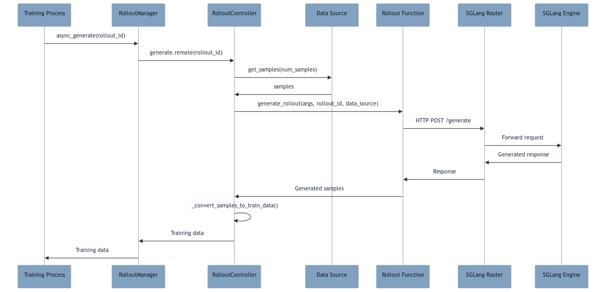
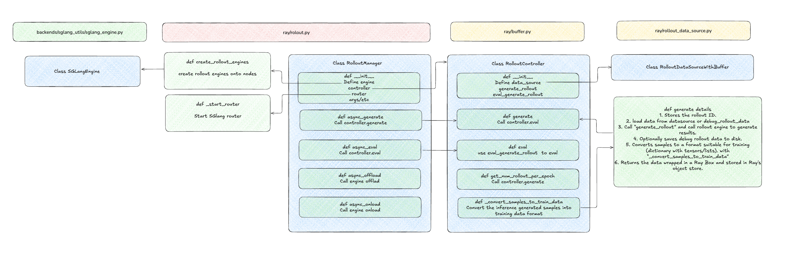
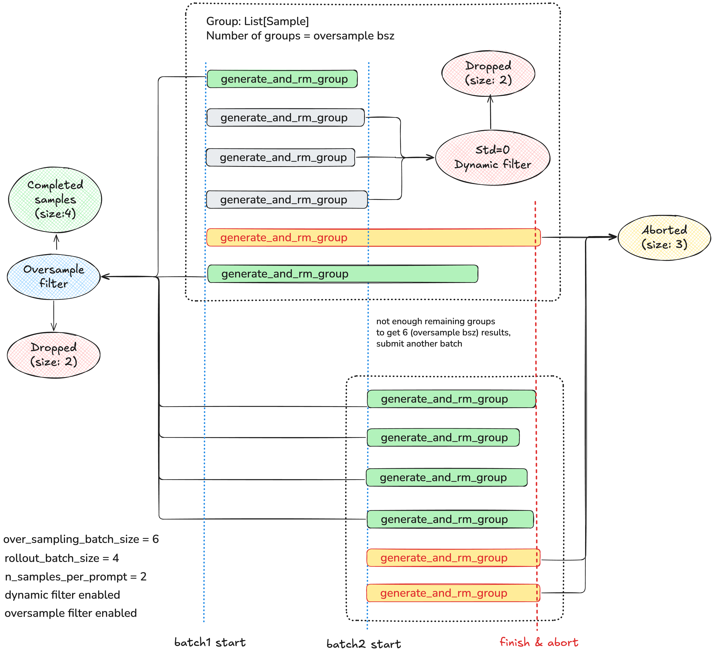

# A Brief Code Walkthrough of slime

slime 是极度优雅简洁的 RL 框架，在易用性和性能上都做出了巨大的优化。基于 SGLang 和 Megatron LM 作为唯一后端，slime 强力支持了 MOE 模型的训练和极为自由的采样逻辑。

正值 slime 发布 0.1.0 版本之际，我们在这篇文档中快速学习以 partial rollout 为代表的 slime 核心代码，具体基于 commit [261ecee](https://github.com/THUDM/slime/tree/261ecee700b30429ba2cf4d4c27e3fc7ae0a12c7)。

Acknowlegment: 

Mao Cheng @ Meta, Zhuoran Yin @ CMU, Ji Li @ Ant Group, Yixuan Zhang @ UoA, Yusheng Su @ AMD, Zhuohao Li @ Alibaba, Yuzhen Zhou @ CMU, Jiajun Li @ CMU, Biao He @ LinkedIn, Huapeng Zhou @ UW, Chengxi Li @ CMU, Chengxing Xie @Zhipu, Zilin Zhu @ Zhipu, Chenyang Zhao @ LMSYS

## 核心架构

slime 采用分离式架构，将 RLHF 训练流程分解为三个独立协作的模块：

- Training (Megatron): 负责主训练流程，支持多种并行策略；具体实现在[`slime/backends/megatron_utils/`](https://github.com/THUDM/slime/tree/261ecee700b30429ba2cf4d4c27e3fc7ae0a12c7/slime/backends/megatron_utils/)。
  
- Rollout (SGLang): 生成新数据（含 reward/verifier），基于 SGLang 的采样逻辑；具体实现在[`slime/ray/rollout.py`](https://github.com/THUDM/slime/tree/261ecee700b30429ba2cf4d4c27e3fc7ae0a12c7/slime/ray/rollout.py)。
  
- Data Buffer: 管理数据流和自定义生成逻辑，可以说是 slime 最匠心独运的模块；具体实现在[`slime/ray/buffer.py`](https://github.com/THUDM/slime/tree/261ecee700b30429ba2cf4d4c27e3fc7ae0a12c7/slime/ray/buffer.py)。

<div style="text-align: center;">
  
</div>

基于前卫的设计，slime 的自由灵活让人非常清爽：

1. 资源调度自由：支持 co-locate 与 dis-aggregate 两种部署策略；在 rollout 和 training 上各自支持 DP/TP/PP/EP；具体实现见 [`slime/ray/placement_group.py`](https://github.com/THUDM/slime/tree/261ecee700b30429ba2cf4d4c27e3fc7ae0a12c7/slime/ray/placement_group.py)

2. 训练方式自由：支持同步训练和异步训练两种模式；具体实现见 [`slime/train.py`](https://github.com/THUDM/slime/tree/261ecee700b30429ba2cf4d4c27e3fc7ae0a12c7/train.py) 和 [`slime/train_async.py`](https://github.com/THUDM/slime/tree/261ecee700b30429ba2cf4d4c27e3fc7ae0a12c7/train_async.py)；注意，后者需要在 dis-aggregate 架构下，使用 `rollout_manager.async_generate` 和 `actor_model.async_train` 进行训推分离的异步训练，rollout 始终领先 train 一个 step，也即 one-step off-policy；

3. 采样方式自由：支持用户自定义复杂的采样流程，包括[多轮工具调用](https://github.com/THUDM/slime/tree/main/examples/search-r1)、奖励模型集成、自定义验证器等；具体实现见 [`slime_plugins/rollout_buffer/`](https://github.com/THUDM/slime/tree/261ecee700b30429ba2cf4d4c27e3fc7ae0a12c7/slime_plugins/rollout_buffer/)。

4. 模型支持自由：支持 Dense 和 MoE 模型；具体脚本可参考 [`slime/scripts/run-qwen3-4B.sh`](https://github.com/THUDM/slime/tree/261ecee700b30429ba2cf4d4c27e3fc7ae0a12c7/scripts/run-qwen3-4B.sh) 和 [`slime/scripts/run-deepseek-r1.sh`](https://github.com/THUDM/slime/tree/261ecee700b30429ba2cf4d4c27e3fc7ae0a12c7/scripts/run-deepseek-r1.sh)。


## 代码结构

```bash
slime/
├── slime/                          # 核心框架代码
│   ├── ray/                        # Ray 分布式组件
│   │   ├── actor_group.py          # 训练 Actor 管理
│   │   ├── rollout.py              # 推理 Actor 管理
│   │   ├── buffer.py               # 数据缓冲区
│   │   └── placement_group.py      # 资源分配
│   ├── backends/                   # 后端引擎集成
│   │   ├── megatron_utils/         # Megatron 训练后端
│   │   └── sglang_utils/           # SGLang 推理后端
│   └── utils/                      # 工具函数
├── slime_plugins/                  # 插件和扩展
│   ├── rollout_buffer/             # 自定义生成插件
│   └── models/                     # 模型适配
├── scripts/                        # 参考启动脚本
│   └── models/                     # 各模型配置
├── examples/                       # 参考使用示例
├── docs/                           # 详细文档
├── train.py                        # 同步训练入口
└── train_async.py                  # 异步训练入口
```

具体来说：

- `scripts/`：用于启动 Ray 集群与提交训练作业；示例脚本会选择 `train.py` 或 `train_async.py`，比如：`slime/scripts/run-qwen3-4B.sh`、`slime/scripts/run-deepseek-r1.sh`。
- `train.py` / `train_async.py`：训练入口，创建 `PlacementGroup` 分配 GPU → 创建 `actor_group`（训练）与 `rollout_manager`（推理）→ 进入训练循环，同步模式逐步执行；异步模式通过 `rollout_manager.async_generate()` 与 `ray.get()` 交错以并行化。
- `slime/ray/`：分布式编排与资源管理，具体包括：`placement_group.py`：基于 Ray Placement Group 的 GPU 资源分配与打包，`actor_group.py`：训练 Actor 组管理，暴露 `async_init/async_train/async_update_weights` 等接口，`rollout.py`：Rollout Actor（SGLang 引擎容器）、推理服务路由、权重接收，`buffer.py`：数据缓冲、样本批次组织、与 Rollout/Training 的中间桥梁。
- `slime/backends/`：后端引擎适配，具体包括：`megatron_utils/`：训练后端（优化器、权重更新、与分布式通信集成），`sglang_utils/`：推理后端（包装 SGLang、批处理生成、引擎生命周期管理）。
- `slime_plugins/`：可插拔扩展，具体包括：`rollout_buffer/`：通过 HTTP/OpenAI 接口等外部联动的自定义轨迹生成器体系；`models/`：不同模型族的小适配层。
- `examples/`：一些复现其他工作的例子，比如 `examples/search-r1/` 展示多轮对话 + 工具调用的生成与训练串联方式。
- `docs/`：说明文档与用法指南，包含模型使用、SFT、AMD 等平台适配与调优手册。

### 串联关系

1. 脚本层（`scripts/`）：启动 Ray → 提交job → 选择 `train.py` 或 `train_async.py` 并传入参数

2. 入口层（`train*.py`）：`create_placement_groups(args)` 分配/映射 GPU；`create_actor_group(args, pgs["actor"])` 构建训练 Actor 组；`create_rollout_manager(args, pgs["rollout"])` 构建推理与数据生成管理器

3. 执行层（`ray/` + `backends/`）：训练：`actor_group.async_train(...)` → Megatron 优化/梯度计算；生成：`rollout_manager.async_generate(...)` → SGLang 批量推理；同步：`actor_group.async_update_weights()` → 将训练权重推送到推理引擎

4. 数据流（`buffer.py` + 插件）：`Buffer` 负责抽样/拼批/调用自定义生成（`slime_plugins/rollout_buffer/`）→ 返回训练可用样本

注意，虽然执行层的函数都带有 `async` 修饰，但是同步训练和异步训练都使用了同一套 `async_train, async_generate` 和 `async_update_weights` 接口。同步和异步训练的区别在于 `ray.get()` 的调用时机。通过以上链路，slime 将脚本 → 入口 → 分布式执行 → 数据/权重流自然地串起来，实现高效可扩展的 RL 后训练。

接下来，我们进入每部分的具体代码，对于架构图中的重要函数进行逐一解析。

## Ray Placement Group

本节详细说明 slime 在 Ray 上如何进行 GPU 资源编排：如何创建并重排 Placement Group（PG）以实现稳定的 GPU 排序，训练 Actor 与 Rollout Engine 如何在 PG 上调度，以及两种部署形态：colocate 与 dis-aggregate。为了方便叙述，介绍一些核心概念：

1. [`Ray Placement Group`](https://github.com/THUDM/slime/blob/261ecee700b30429ba2cf4d4c27e3fc7ae0a12c7/slime/ray/placement_group.py)：在集群中预留一组 bundle（每个包含 1 GPU + 1 CPU），并将后续 actor 固定绑定到这些 bundle 上，实现可控、稳定的资源放置。

2. [`RayTrainGroup`](https://github.com/THUDM/slime/tree/261ecee700b30429ba2cf4d4c27e3fc7ae0a12c7/slime/ray/actor_group.py)：训练侧 actor 的管理器；通过 [`_allocate_gpus_for_actor`](https://github.com/THUDM/slime/blob/261ecee700b30429ba2cf4d4c27e3fc7ae0a12c7/slime/ray/actor_group.py#L50) 来为每个 rank 创建训练 actor handler，得到 `self._actor_handlers`，随后并发在每个 rank 上进行 init / train / eval / save / update / offload。

3. [`RolloutManager`](https://github.com/THUDM/slime/tree/261ecee700b30429ba2cf4d4c27e3fc7ae0a12c7/slime/ray/rollout.py)：推理/数据编排器，负责创建 Rollout Engine, Data Buffer、Lock and Router；这部分内容见后续解析；


### 入口函数

入口位于 [`Ray Placement Group`](https://github.com/THUDM/slime/blob/261ecee700b30429ba2cf4d4c27e3fc7ae0a12c7/slime/ray/placement_group.py) 的 [`create_placement_groups`](https://github.com/THUDM/slime/blob/261ecee700b30429ba2cf4d4c27e3fc7ae0a12c7/slime/ray/placement_group.py#L71)：


- 计算本次训练所需的总 GPU 数 `num_gpus`。
- 创建一个包含 `num_gpus` 个 bundle 的 PG，每个 bundle 需要 `{"GPU": 1, "CPU": 1}`。
- 获得重排后的 bundle 索引列表，用于确保稳定的跨节点 / GPU 顺序。
- 根据 `rollout_offset` 将 PG 的索引划分给训练 Actor 与 Rollout。

<details> <summary> create_placement_groups 具体实现 </summary>

```python
def create_placement_groups(args):
    """Create placement groups for actor and rollout engines."""

    num_gpus = 0
    if args.debug_train_only:
        num_gpus = args.actor_num_nodes * args.actor_num_gpus_per_node
        rollout_offset = 0
    elif args.debug_rollout_only:
        num_gpus = args.rollout_num_gpus
        rollout_offset = 0
    elif args.colocate:
        num_gpus = args.actor_num_nodes * args.actor_num_gpus_per_node
        rollout_offset = 0
    else:
        num_gpus = args.actor_num_nodes * args.actor_num_gpus_per_node + args.rollout_num_gpus
        rollout_offset = args.actor_num_nodes * args.actor_num_gpus_per_node

    print(f"Creating placement group with {num_gpus} GPUs...")
    pg, actor_pg_reordered_bundle_indices = _create_placement_group(num_gpus)

    rollout_pg_reordered_bundle_indices = actor_pg_reordered_bundle_indices[rollout_offset:]

    return {
        "actor": (pg, actor_pg_reordered_bundle_indices),
        "rollout": (pg, rollout_pg_reordered_bundle_indices),
    }
```
</details>

### Bundle 重排

创建 PG 后，slime 用一个临时 `InfoActor` 在每个 bundle 上获取该 bundle 实际分配到的 `(Node IP, GPU ID)`，随后按 node IP 与 GPU ID 进行重排：

1. 优先尝试将 `node_identifier` 解析成 IPv4 地址，转成 4 个整型并据此排序；
2. 若不是 IP，则尝试 DNS 解析；还不行则退化为按主机名字符的 ASCII 序列排序；
3. 同节点内再按 `gpu_id` 升序排序。

这样可以获得跨多机的稳定 bundle 顺序，避免由于映射不稳定造成的调度错配。

<details> <summary> InfoActor and sort_key 具体实现</summary>

```python
@ray.remote(num_gpus=1)
class InfoActor:
    def get_ip_and_gpu_id(self):
        return ray.util.get_node_ip_address(), ray.get_gpu_ids()[0]

def sort_key(x):
    index, node_identifier, gpu_id = x
    # Sort by node IP number and then by GPU ID
    try:
        # try to parse it as an IP address.
        ip_address = node_identifier
        node_ip_parts = list(map(int, ip_address.split(".")))
    except ValueError:
        # Try to resolve the hostname to an IP address.
        try:
            ip_address = socket.gethostbyname(node_identifier)
            node_ip_parts = list(map(int, ip_address.split(".")))
        except (socket.gaierror, TypeError):
            # Instead, we convert each character of the original identifier string
            # to its ASCII value. This provides a stable and consistent numerical
            # representation that allows for sorting.
            node_ip_parts = [ord(c) for c in node_identifier]

    return (node_ip_parts, gpu_id)
```
</details>

### Colocate vs Dis-aggregate

再熟悉不过的内容了。

colocate 下，训练 Actor 与 Rollout 引擎交替共用同一批 GPU 资源，此时 `num_gpus = actor_num_nodes * actor_num_gpus_per_node`，`rollout_offset = 0`。Rollout 和 Actor 完全共用 bundle；适用于小规模训练。

dis-aggregate 下，训练 Actor 与 Rollout 引擎使用各自独立的 GPU 池（例如训练占 6 卡，rollout 占 2 卡），此时 `num_gpus = actor_num_nodes * actor_num_gpus_per_node + rollout_num_gpus`，`rollout_offset = actor_num_nodes * actor_num_gpus_per_node`。Rollout 和 Actor 使用不同的 bundle；适用于大规模训练；在这种情况下可以进行 async-train。

### 端口分配与多机一致性

在多节点/多卡下，`create_rollout_engines` 会通过 `RayActor._get_current_node_ip_and_free_port` 在目标节点上寻找一段连续可用端口，并将 Node 0 的 `dist_init_addr` 扩散到同一引擎的其他节点，以保证跨机的进程组一致性。

<details> <summary> RayActor._get_current_node_ip_and_free_port 具体实现</summary>

```python
def _get_current_node_ip_and_free_port(start_port=10000, consecutive=1):
    address = ray._private.services.get_node_ip_address()
    address = address.strip("[]")
    port = start_port
    while not all(is_port_available(port + i) for i in range(consecutive)):
        port += 1
    return address, port
```
</details>

## Data Source with/without Buffer

这一部分应该是最喜闻乐见的，因为大多数算法从业者理应改好 data buffer，就可以自由使用 slime。[`slime/ray/rollout_data_source.py`](https://github.com/THUDM/slime/tree/261ecee700b30429ba2cf4d4c27e3fc7ae0a12c7/slime/ray/rollout_data_source.py) 是 rollout 系统的数据源管理模块，负责为 rollout engine 提供训练数据。该文件定义了两个核心类：`RolloutDataSource` 和 `RolloutDataSourceWithBuffer`。

下图做的无比清晰，介绍了整个数据的获取流程，Data Source 可以是 `RolloutDataSource` 或 `RolloutDataSourceWithBuffer`。

<div style="text-align: center;">
  
</div>

### RolloutDataSource

1. 初始化：

```python
class RolloutDataSource:
    def __init__(self, args):
        self.args = args
        self.epoch_id = 0          # 当前epoch ID
        self.sample_index = 0      # 全局样本索引
        self.sample_offset = 0     # 在当前 epoch 中的偏移量
        self.metadata = {}         # 元数据存储
        self.dataset = None        # 数据集对象
```

我们来看看具体的初始化逻辑，注意到，默认情况下，`rollout_global_dataset=True`，此时基于启动参数中的 `--prompt-data` 加载真实数据集，否则 `dataset=None`，可以自行维护 dataset。

<details>
<summary>初始化逻辑</summary>

```python
class RolloutDataSource:
    def __init__(self, args):
        self.args = args

        self.epoch_id = 0
        self.sample_index = 0
        self.sample_offset = 0
        self.metadata = {}

        if args.rollout_global_dataset:
            tokenizer = AutoTokenizer.from_pretrained(args.hf_checkpoint, trust_remote_code=True)

            if (d := args.dump_details) is not None:
                tokenizer.save_pretrained(Path(d) / "tokenizer")

            self.dataset = Dataset(
                args.prompt_data,
                tokenizer=tokenizer,
                max_length=args.rollout_max_prompt_len,
                prompt_key=args.input_key,
                label_key=args.label_key,
                metadata_key=args.metadata_key,
                tool_key=args.tool_key,
                apply_chat_template=args.apply_chat_template,
                seed=args.rollout_seed,
            )
            if self.args.rollout_shuffle:
                self.dataset.shuffle(self.epoch_id)
        else:
            self.dataset = None
```
</details>

2. [`get_samples()`](https://github.com/THUDM/slime/blob/261ecee700b30429ba2cf4d4c27e3fc7ae0a12c7/slime/ray/rollout_data_source.py#L46) 与 [`Sample`](https://github.com/THUDM/slime/blob/261ecee700b30429ba2cf4d4c27e3fc7ae0a12c7/slime/utils/types.py#L9)：

从数据集中获取指定数量的样本：

1. 自动处理 epoch 边界，支持数据集 shuffle；
2. 每个 prompt 生成 `n_samples_per_prompt` 个样本，用于 GRPO；
3. 维护 `sample_offset, epoch_id, sample_index`；
4. 使用深拷贝避免数据污染；
5. 取出的 samples 格式为 `list[list[Sample]]`；

<details>
<summary>Sample 类实现与 get_samples 方法</summary>

```python
class Sample:
    """The sample generated"""

    index: Optional[int] = None
    # prompt
    prompt: Union[str, list[dict[str, str]]] = ""
    tokens: list[int] = field(default_factory=list)
    # response
    response: str = ""
    response_length: int = 0
    label: Optional[str] = None
    reward: Optional[Union[float, dict[str, Any]]] = None
    loss_mask: Optional[list[int]] = None

    class Status(Enum):
        PENDING = "pending"
        COMPLETED = "completed"
        TRUNCATED = "truncated"
        ABORTED = "aborted"

    status: Status = Status.PENDING
    metadata: dict = field(default_factory=dict)

    def to_dict(self):
        value = self.__dict__.copy()
        value["status"] = self.status.value
        return value

    @staticmethod
    def from_dict(data: dict):
        data["status"] = Sample.Status(data["status"])
        return Sample(**data)

    def get_reward_value(self, args) -> float:
        return self.reward if not args.reward_key else self.reward[args.reward_key]
```

```python
def get_samples(self, num_samples):
    samples = []
    
    if self.dataset is not None:
        # 分支1：使用真实数据集
        if self.sample_offset + num_samples <= len(self.dataset):
            # 情况 1：当前 epoch 还有足够数据
            prompt_samples = self.dataset.samples[self.sample_offset : self.sample_offset + num_samples]
            self.sample_offset += num_samples
        else:
            # 情况 2：当前 epoch 数据不足，需要进入下一个 epoch
            prompt_samples = self.dataset.samples[self.sample_offset :]  # 取完当前 epoch 剩余数据
            num_samples -= len(prompt_samples)
            self.epoch_id += 1  # 进入下一个 epoch
            
            # 重新 shuffle 数据集
            if self.args.rollout_shuffle:
                self.dataset.shuffle(self.epoch_id)
            
            # 从新 epoch 取剩余所需数据
            prompt_samples += self.dataset.samples[:num_samples]
            self.sample_offset = num_samples
        
        # 为每个 prompt 创建多个样本（n_samples_per_prompt）
        for prompt_sample in prompt_samples:
            group = []
            for _ in range(self.args.n_samples_per_prompt):
                sample = copy.deepcopy(prompt_sample)  # 深拷贝避免修改原始数据，并维护 index
                sample.index = self.sample_index
                self.sample_index += 1
                group.append(sample)
            samples.append(group)
    else:
        # 分支2：不使用真实数据集，创建空样本
        for _ in range(num_samples):
            group = []
            for _ in range(self.args.n_samples_per_prompt):
                sample = Sample(index=self.sample_index)
                self.sample_index += 1
                group.append(sample)
            samples.append(group)
    
    return samples
```
</details>

3. [`save()`](https://github.com/THUDM/slime/blob/261ecee700b30429ba2cf4d4c27e3fc7ae0a12c7/slime/ray/rollout_data_source.py#L86) 和 [`load()`](https://github.com/THUDM/slime/blob/261ecee700b30429ba2cf4d4c27e3fc7ae0a12c7/slime/ray/rollout_data_source.py#L100)：

保存 `RolloutDataSource` 状态到文件；load 则用于训练中断后，从文件加载状态，确保数据顺序一致性。

<details>
<summary>save 和 load 方法</summary>

```python
def save(self, rollout_id):
    if not self.args.rollout_global_dataset:
        return  # 不使用真实数据集时不需要保存
    
    state_dict = {
        "sample_offset": self.sample_offset,  # 当前 epoch 中的偏移量
        "epoch_id": self.epoch_id,            # 当前 epoch ID
        "sample_index": self.sample_index,    # 全局样本索引
        "metadata": self.metadata,            # 元数据
    }
    
    # 保存到指定路径
    path = os.path.join(self.args.save, f"rollout/global_dataset_state_dict_{rollout_id}.pt")
    os.makedirs(os.path.dirname(path), exist_ok=True)
    torch.save(state_dict, path)
```

```python
def load(self, rollout_id=None):
    if not self.args.rollout_global_dataset:
        return  # 不使用真实数据集时不需要加载
    
    if self.args.load is None:
        return  # 没有指定加载路径时不需要加载
    
    path = os.path.join(self.args.load, f"rollout/global_dataset_state_dict_{rollout_id}.pt")
    if not os.path.exists(path):
        print(f"Checkpoint {path} does not exist.")
        return
    
    # 加载状态
    state_dict = torch.load(path)
    self.sample_offset = state_dict.get("sample_offset", 0)
    self.epoch_id = state_dict.get("epoch_id", 0)
    self.sample_index = state_dict.get("sample_index", 0)
    self.metadata = state_dict.get("metadata", {})
    
    # 重新 shuffle 数据集
    if self.args.rollout_global_dataset and self.args.rollout_shuffle:
        self.dataset.shuffle(self.epoch_id)
```
</details>


### [`RolloutDataSourceWithBuffer`](https://github.com/THUDM/slime/blob/261ecee700b30429ba2cf4d4c27e3fc7ae0a12c7/slime/ray/rollout_data_source.py#L124)

带缓冲的数据类，继承自 `RolloutDataSource`，增加了数据缓冲功能，支持为了 partial rollout 而设计的数据重用策略。

1. 初始化：完全继承了 `RolloutDataSource` 的初始化逻辑，并额外初始化了 `buffer_filter` 方法和空的 `buffer` 列表。

<details>
<summary>RolloutDataSourceWithBuffer初始化</summary>

```python
class RolloutDataSourceWithBuffer(RolloutDataSource):
    def __init__(self, args):
        super().__init__(args)
        self.buffer = []  # 数据缓冲区
        
        # 设置 buffer 过滤器
        if self.args.buffer_filter_path is None:
            self.buffer_filter = pop_first  # 默认：先进先出
        else:
            self.buffer_filter = load_function(self.args.buffer_filter_path)  # 自定义过滤器
```
</details>

2. [`get_samples()`](https://github.com/THUDM/slime/blob/261ecee700b30429ba2cf4d4c27e3fc7ae0a12c7/slime/ray/rollout_data_source.py#L133C9-L133C20)

写的实在太清楚了，优先从 buffer 获取数据，buffer 不足时从原始数据集补充。

<details>
<summary>get_samples 方法</summary>

```python
def get_samples(self, num_samples: int) -> list[list[Sample]]:
    # 1. 首先从 buffer 中获取样本组
    samples = self._get_samples_from_buffer(num_samples)
    num_samples -= len(samples)
    
    # 2. 如果 buffer 不够，从原始数据集获取剩余样本组
    if num_samples > 0:
        samples += super().get_samples(num_samples=num_samples)
    
    return samples
```

```python
def _get_samples_from_buffer(self, num_samples: int) -> list[list[Sample]]:
    if len(self.buffer) == 0 or num_samples == 0:
        return []  # buffer 为空或不需要样本
    
    # 使用 buffer 过滤器获取样本组
    samples = self.buffer_filter(self.args, None, self.buffer, num_samples)
    return samples
```

</details>

3. [`add_samples()`](https://github.com/THUDM/slime/blob/261ecee700b30429ba2cf4d4c27e3fc7ae0a12c7/slime/ray/rollout_data_source.py#L154C9-L154C20)

向 buffer 添加样本组。注意，`RolloutDataSource` 是不支持添加样本的；此处添加的是样本组，也即 partial rollout 是一整个 prompt 的所有 requests 同时写入 buffer，不会出现 prompt 的不同 requests 在不同的 step 被用于训练的情况。

<details>
<summary>add_samples 方法</summary>

```python
def add_samples(self, samples: list[list[Sample]]):
    if not samples:
        return
    
    # 验证输入格式，确保输入是 list[list[Sample]] 格式
    assert isinstance(samples, list), f"samples must be a list, got {type(samples)}"
    assert isinstance(samples[0], list), f"the elements of samples must be list, got {type(samples[0])}"
    
    # 验证每个 group 的大小
    for i in range(0, len(samples)):
        assert (
            len(samples[i]) == self.args.n_samples_per_prompt
        ), f"the length of the elements of samples must be equal to n_samples_per_prompt, got {len(samples[i])} != {self.args.n_samples_per_prompt}"
        group = samples[i]
        self.buffer.append(group)  # 添加到 buffer
```
</details>

3. [`pop_first()`](https://github.com/THUDM/slime/blob/261ecee700b30429ba2cf4d4c27e3fc7ae0a12c7/slime/ray/rollout_data_source.py#L181)

默认的 buffer 过滤器，实现先进先出（FIFO）的数据获取策略。

<details>
<summary>pop_first 方法</summary>

```python
def pop_first(args, rollout_id, buffer: list[list[Sample]], num_samples: int) -> list[list[Sample]]:
    num_to_pop = min(len(buffer), num_samples)  # 取 buffer 长度和需求量的较小值
    samples = buffer[:num_to_pop]               # 获取前 num_to_pop 个样本
    del buffer[:num_to_pop]                     # 从 buffer 中删除这些样本
    return samples
```
</details>

4. 最终的数据调用链：

```bash
RolloutController.generate()
    ↓
RolloutDataSourceWithBuffer.get_samples()
    ↓
_get_samples_from_buffer() + super().get_samples()
    ↓
返回 list[list[Sample]]
```

5. 自定义 Buffer 过滤器：

<details>
<summary>自定义 Buffer 过滤器示例</summary>

```python
# 定义自定义过滤器
def custom_buffer_filter(args, rollout_id, buffer, num_samples):
    # 按reward排序，取reward最高的样本
    sorted_buffer = sorted(buffer, key=lambda x: x[0].reward, reverse=True)
    return sorted_buffer[:num_samples]

# 在args中设置
args.buffer_filter_path = "path.to.custom_buffer_filter"
```
</details>

写的真清楚，非常好扩展。

## Rollout Control

rollout 主要由两个 class control：

- `slime/ray/rollout.py`：`class RolloutManager` 管理 rollout 引擎和 router 的生命周期;
- `slime/ray/buffer.py`：`class RolloutController` 处理 rollout 生成的数据并转换为训练数据；

<div style="text-align: center;">
  
</div>

### [`RolloutManager`](https://github.com/THUDM/slime/blob/261ecee700b30429ba2cf4d4c27e3fc7ae0a12c7/slime/ray/rollout.py#L149)

RolloutManager 是 rollout 系统的主控制器，负责协调 Router，Controller 和 Engines 之间的交互。

1. 初始化：初始化 Router，Controller，Engines 池，并创建锁；

<details>
<summary>RolloutManager 初始化</summary>

```python
class RolloutManager:
    def __init__(self, args, pg, wandb_run_id):
        self.args = args
        
        # 1. 启动 Router
        _start_router(args)
        
        # 2. 创建 Controller
        self.controller = RolloutController.options(
            num_cpus=1,
            num_gpus=0,
        ).remote(args, wandb_run_id=wandb_run_id)

        # 3. 创建 Engines 池
        self.all_rollout_engines = create_rollout_engines(args, pg)
        
        # 4. 多节点配置：如果 sglang engine 需要跨越多个 node，则只向着每个 engine 的 node-0 发送请求
        nodes_per_engine = max(1, args.rollout_num_gpus_per_engine // args.rollout_num_gpus_per_node)
        self.rollout_engines = self.all_rollout_engines[::nodes_per_engine]
        
        # 5. 创建锁
        # 训练进程需要向所有 rollout engines 广播新的权重
        # 同时 rollout engines 可能正在处理推理请求
        # 如果广播和推理同时进行，可能导致通信死锁
        self.rollout_engine_lock = Lock.options(
            num_cpus=1,
            num_gpus=0,
        ).remote()
```
</details>

2. `async_generate(), async_eval(), async_offload(), async_onload()`：

这四个函数都是直接向下调用 Controller 或者 Engines 的对应函数，之后再解析。

3. [`create_rollout_engines`](https://github.com/THUDM/slime/blob/261ecee700b30429ba2cf4d4c27e3fc7ae0a12c7/slime/ray/rollout.py#L15)

创建 SGLang engines：

<details>
<summary>create_rollout_engines 实现</summary>

```python
def create_rollout_engines(args, pg):
    if args.debug_train_only:
        return []

    # 计算引擎配置
    num_gpu_per_engine = min(args.rollout_num_gpus_per_engine, args.rollout_num_gpus_per_node)
    num_engines = args.rollout_num_gpus // num_gpu_per_engine

    # 创建 Ray Actor
    RolloutRayActor = ray.remote(SGLangEngine)
    
    rollout_engines = []
    for i in range(num_engines):
        num_gpus = 0.2
        num_cpus = num_gpus

        # 设置调度策略
        scheduling_strategy = PlacementGroupSchedulingStrategy(
            placement_group=pg,
            placement_group_capture_child_tasks=True,
            placement_group_bundle_index=reordered_bundle_indices[i * num_gpu_per_engine],
        )

        # 创建引擎
        rollout_engines.append(
            RolloutRayActor.options(
                num_cpus=num_cpus,
                num_gpus=num_gpus,
                scheduling_strategy=scheduling_strategy,
                runtime_env={"env_vars": {name: "1" for name in NOSET_VISIBLE_DEVICES_ENV_VARS_LIST}},
            ).remote(args, rank=i)
        )

    # 端口分配和初始化
    # ... 端口分配逻辑 ...
    
    # 初始化所有引擎
    init_handles = [engine.init.remote(**ports) for engine, ports in zip(rollout_engines, addr_and_ports)]
    # 等待所有引擎初始化完成
    ray.get(init_handles)

    return rollout_engines
```
</details>

4. [`_start_router`](https://github.com/THUDM/slime/blob/261ecee700b30429ba2cf4d4c27e3fc7ae0a12c7/slime/ray/rollout.py#L114)

启动 SGLang router，提供负载均衡服务：

<details>
<summary>_start_router 实现</summary>

```python
def _start_router(args):
    if args.sglang_router_ip is not None:
        return  # 已经有了外部 Router

    from sglang_router.launch_router import RouterArgs

    # 自动分配 IP 和端口
    args.sglang_router_ip = get_host_info()[1]
    args.sglang_router_port = find_available_port(random.randint(3000, 4000))

    # 配置 Router 参数
    router_args = RouterArgs(
        host=args.sglang_router_ip,
        port=args.sglang_router_port,
        balance_abs_threshold=0,
    )

    # 设置日志级别和超时
    if hasattr(router_args, "log_level"):
        router_args.log_level = "warn"
    if hasattr(router_args, "request_timeout_secs"):
        router_args.request_timeout_secs = args.sglang_router_request_timeout_secs

    # 启动 Router 进程
    process = multiprocessing.Process(
        target=run_router,
        args=(router_args,),
    )
    process.daemon = True
    process.start()
    
    # 等待启动完成
    time.sleep(3)
    assert process.is_alive()
```
</details>

注意，对于 sgl router 而言，我们本身可以同时启动 router 和 engine，而 slime 中是先分开启动了 engine 和 router，之后再让 engine 通过 `add_worker` 向 router 注册。

### [`RolloutController`](https://github.com/THUDM/slime/blob/261ecee700b30429ba2cf4d4c27e3fc7ae0a12c7/slime/ray/buffer.py#L21)

RolloutController 是 rollout 系统的真正执行者，负责数据生成、转换和管理。

1. 初始化：创建数据源，动态加载 rollout 函数。

<details>
<summary>RolloutController 初始化</summary>

```python
@ray.remote
class RolloutController:
    def __init__(self, args, wandb_run_id):
        self.args = args
        init_wandb_secondary(args, wandb_run_id)

        # 创建数据源
        self.data_source = RolloutDataSourceWithBuffer(args)

        # 动态加载 rollout 函数
        self.generate_rollout = load_function(self.args.rollout_function_path)
        self.eval_generate_rollout = load_function(self.args.eval_function_path)
        
        print(f"import {self.args.rollout_function_path} as generate_rollout function.")
        print(f"import {self.args.eval_function_path} as eval_generate_rollout function.")
```
</details>

2. [`generate()`](https://github.com/THUDM/slime/blob/261ecee700b30429ba2cf4d4c27e3fc7ae0a12c7/slime/ray/buffer.py#L42)


调用 rollout 函数进行采样随后转换为训练数据格式：

<details>
<summary>generate 方法实现</summary>

```python
def generate(self, rollout_id):
    self.rollout_id = rollout_id

    # 1. 调试模式：从磁盘加载数据
    if self.args.load_debug_rollout_data:
        data = torch.load(
            open(self.args.load_debug_rollout_data.format(rollout_id=rollout_id), "rb"),
        )["samples"]
        data = [Sample.from_dict(sample) for sample in data]
    else:
        # 2. 正常模式：调用 rollout 函数生成数据
        data = self.generate_rollout(self.args, rollout_id, self.data_source, evaluation=False)
        
        # 3. 扁平化数据（如果是嵌套列表）
        if isinstance(data[0], list):
            data = sum(data, [])

    # 4. 可选：保存调试数据
    if (path_template := self.args.save_debug_rollout_data) is not None:
        path = Path(path_template.format(rollout_id=self.rollout_id))
        print(f"Save debug rollout data to {path}")
        path.parent.mkdir(parents=True, exist_ok=True)
        torch.save(
            dict(
                rollout_id=self.rollout_id,
                samples=[sample.to_dict() for sample in data],
            ),
            path,
        )
    
    # 5. 转换为训练数据格式
    data = self._convert_samples_to_train_data(data)
    
    # 6. 包装并返回
    return Box(ray.put(data))
```
</details>

3. [`eval()`](https://github.com/THUDM/slime/blob/261ecee700b30429ba2cf4d4c27e3fc7ae0a12c7/slime/ray/buffer.py#L74)

调用 eval rollout 函数进行采样随后进行评分：

<details>
<summary>eval 方法实现</summary>

```python
def eval(self, rollout_id):
    if self.args.debug_train_only:
        return  # 调试模式不生成评估数据

    # 调用评估rollout函数
    data = self.eval_generate_rollout(self.args, rollout_id, self.data_source, evaluation=True)
    
    # 记录评估数据
    log_eval_data(rollout_id, self.args, data)
```
</details>

4. [`_convert_samples_to_train_data`](https://github.com/THUDM/slime/blob/261ecee700b30429ba2cf4d4c27e3fc7ae0a12c7/slime/ray/buffer.py#L105)

将生成的 Sample 对象转换为训练所需的字典格式：

<details>
<summary>_convert_samples_to_train_data 实现</summary>

```python
def _convert_samples_to_train_data(self, samples: Union[list[Sample], list[list[Sample]]]):
    """
    Convert inference generated samples to training data.
    """
    # 基础训练数据
    train_data = {
        "tokens": [sample.tokens for sample in samples], # prompt + response 的 token ids
        "response_lengths": [sample.response_length for sample in samples], # response 的 token 长度
        "rewards": [sample.get_reward_value(self.args) for sample in samples], # 奖励值
        "truncated": [1 if sample.status == Sample.Status.TRUNCATED else 0 for sample in samples], # 是否被截断的标志
        "sample_indices": [sample.index for sample in samples], # 样本索引
    }

    # 处理 loss mask
    loss_masks = []
    for sample in samples:
        # 如果没有提供 loss_mask，创建默认的
        if sample.loss_mask is None:
            sample.loss_mask = [1] * sample.response_length
        
        # 验证 loss_mask 长度
        assert (
            len(sample.loss_mask) == sample.response_length
        ), f"loss mask length {len(sample.loss_mask)} != response length {sample.response_length}"
        loss_masks.append(sample.loss_mask)
    train_data["loss_masks"] = loss_masks

    # 处理 raw reward
    if samples[0].metadata and "raw_reward" in samples[0].metadata:
        train_data["raw_reward"] = [sample.metadata["raw_reward"] for sample in samples]

    # 处理 round_number（用于 rollout buffer）
    if samples[0].metadata and "round_number" in samples[0].metadata:
        train_data["round_number"] = [sample.metadata["round_number"] for sample in samples]
    
    return train_data
```
</details>

### [`log_eval_data`](https://github.com/THUDM/slime/blob/261ecee700b30429ba2cf4d4c27e3fc7ae0a12c7/slime/ray/buffer.py#L163)

记录评估数据到 wandb 和控制台：

<details>
<summary>log_eval_data 实现</summary>

```python
def log_eval_data(rollout_id, args, data):
    log_dict = {}
    for key in data.keys():
        rewards = data[key]["rewards"]
        log_dict[f"eval/{key}"] = sum(rewards) / len(rewards)
        
        if "truncated" in data[key]:
            truncated = data[key]["truncated"]
            log_dict[f"eval/{key}-truncated_ratio"] = sum(truncated) / len(truncated)

    print(f"eval {rollout_id}: {log_dict}")
    
    if args.use_wandb:
        log_dict["eval/step"] = (
            rollout_id
            if not args.wandb_always_use_train_step
            else rollout_id * args.rollout_batch_size * args.n_samples_per_prompt // args.global_batch_size
        )
        wandb.log(log_dict)
```
</details>

### 默认的 rollout 函数

注意，到此为止，我们还是没有解析过默认的 rollout funciton 和 eval funciton。我们在这里看看默认的 rollout 函数：

<details>
<summary>默认的 rollout 函数</summary>

```python
def generate_rollout(args, rollout_id, data_buffer, evaluation=False):
    """An example to implement the generate_rollout function for an rule based rm rollout generation.

    Args:
        args: the whole args
        rollout_id: int, the id of the rollout, used for deterministic data generation
        data_buffer: the data buffer to store the generated samples
        evaluation: bool, whether the rollout is for evaluation or not

    Returns:
        list[list[Sample]]: a list of list of samples generated by the rollout
    """
    completed_samples, aborted_samples = generate_abortable_samples(
        args, rollout_id, data_buffer.get_samples, evaluation=evaluation
    )
    data_buffer.add_samples(aborted_samples)
    return completed_samples


def generate_abortable_samples(args, rollout_id, data_source, evaluation=False):
    assert args.rollout_global_dataset
    if evaluation:
        return run(eval_rollout(args, rollout_id))
    return run(generate_rollout_async(args, rollout_id, data_source))
```
</details>

写的还是一如既往的简洁，我们继续顺着 `run` 函数向下观察：

<details>
<summary>run 函数具体实现</summary>

```python
def run(coro):
    """Run a coroutine in the background event loop."""
    return get_async_loop().run(coro)
```
</details>

简洁到让我惊讶的程度，实际上传入给 `run` 的 `coro` 是一个 `coroutine`（协程）对象。 在上文中，传入的 `coro` 是 `generate_rollout_async(args, rollout_id, data_source)`。当执行 `run(generate_rollout_async(args, rollout_id, data_source))` 时：

1. `run()` 函数接收 `generate_rollout_async(args, rollout_id, data_source)` 协程对象；
2. `get_async_loop()` 获取或创建后台事件循环线程；
3. `async_loop.run(coro)` 调用 `AsyncLoopThread.run()` 方法；
4. `asyncio.run_coroutine_threadsafe(coro, self.loop)` 将协程提交到后台线程的事件循环中；
5. `.result()` 阻塞等待协程执行完成并返回结果；

相关的代码如下：

<details>
<summary>协程提交的相关逻辑</summary>

1. `run(coro)` 函数本身

```python
def run(coro):
    """Run a coroutine in the background event loop."""
    return get_async_loop().run(coro)
```

2. `get_async_loop()` 创建后台事件循环

```python
def get_async_loop():
    global async_loop
    if async_loop is None:
        async_loop = AsyncLoopThread()  # 创建一个后台线程运行事件循环
    return async_loop
```

3. `AsyncLoopThread` 类

```python
class AsyncLoopThread:
    def __init__(self):
        self.loop = asyncio.new_event_loop()  # 创建新的事件循环
        self._thread = threading.Thread(target=self._start_loop, daemon=True)  # 创建后台线程
        self._thread.start()  # 启动线程

    def _start_loop(self):
        asyncio.set_event_loop(self.loop)  # 在新线程中设置事件循环
        self.loop.run_forever()  # 让事件循环一直运行

    def run(self, coro):
        # 将协程提交到后台事件循环并等待结果
        return asyncio.run_coroutine_threadsafe(coro, self.loop).result()
```

</details>

## SGLang Rollout

我们继续向下研究，默认的 [`generate_rollout_async`](https://github.com/THUDM/slime/blob/261ecee700b30429ba2cf4d4c27e3fc7ae0a12c7/slime/rollout/sglang_rollout.py#L235) 是直接定义在 [`sglang_rollout.py`](https://github.com/THUDM/slime/blob/261ecee700b30429ba2cf4d4c27e3fc7ae0a12c7/slime/rollout/sglang_rollout.py) 中。

```
Router → SGLang Server 1/2 → TP0/TP1/TP2/TP3 → 样本生成 → 奖励评估
```

模块结构：

```
slime/rollout/
├── __init__.py
├── sglang_rollout.py      # 基于 SGLang 的异步样本生成
├── sft_rollout.py         # SFT 训练样本处理
├── filter_hub/            # 样本过滤器
│   ├── dynamic_sampling_filters.py
│   └── over_sampling_filters.py
└── rm_hub/                # 奖励模型集合
    ├── __init__.py
    ├── deepscaler.py
    ├── f1.py
    ├── math_utils.py
    └── math_dapo_utils.py
```

核心组件详解：

### RL Rollout

[SGLang Rollout](https://github.com/THUDM/slime/blob/261ecee700b30429ba2cf4d4c27e3fc7ae0a12c7/slime/rollout/sglang_rollout.py) 负责为 RL 训练采集实际样本。使用 `asyncio` 实现并发样本生成；`GenerateState` 单例类管理全局生成状态；支持在生成过程中中断和恢复；支持批量生成和奖励模型评估。

**[`GenerateState`](https://github.com/THUDM/slime/blob/261ecee700b30429ba2cf4d4c27e3fc7ae0a12c7/slime/rollout/sglang_rollout.py#L18)**

`GenerateState` 是全局生成状态管理器：管理 `Group: List[Sample]` 的生成状态；控制 `generate_and_rm_group` 任务的提交；维护 `semaphore`, `sampling_params`, `args` 等。

<details>
<summary>GenerateState 具体实现</summary>

```python
class GenerateState(metaclass=SingletonMeta):
    def __init__(self, args):
        self.args = args
        self.tokenizer = AutoTokenizer.from_pretrained(args.hf_checkpoint, trust_remote_code=True)
        # 这个 semaphore 控制的是 router 上的最大流量，防止 router 崩溃
        self.semaphore = asyncio.Semaphore(args.sglang_server_concurrency * args.rollout_num_gpus // args.rollout_num_gpus_per_engine)
        self.sampling_params = dict(
            temperature=args.rollout_temperature,
            top_p=args.rollout_top_p,
            top_k=args.rollout_top_k,
            max_new_tokens=args.rollout_max_response_len,
            stop=args.rollout_stop,
            stop_token_ids=args.rollout_stop_token_ids,
            skip_special_tokens=args.rollout_skip_special_tokens,
            no_stop_trim=True,
            spaces_between_special_tokens=False,
        )
        self.reset()

    def reset(self):
        self.remaining_batch_size = 0
        self.pendings = set()
        self.aborted = False

    def submit_generate_tasks(self, samples: list[list[Sample]]):
        for group in samples:
            self.pendings.add(
                asyncio.create_task(
                    # generate_and_rm_group 是一个 GRPO 组，组内是一个 prompt 的多个 requests
                    generate_and_rm_group(
                        self.args,
                        group,
                        sampling_params=self.sampling_params.copy(),
                        evaluation=False,
                    )
                )
            )
        self.remaining_batch_size += len(samples)
```

</details>

**[`generate_rollout_async`](https://github.com/THUDM/slime/blob/261ecee700b30429ba2cf4d4c27e3fc7ae0a12c7/slime/rollout/sglang_rollout.py#L235)**

`generate_rollout_async` 这是异步样本生成的主函数，在前文也有提到，被作为协程对象传入到 `run` 函数中。这个函数坦诚说写的还有提升空间：

1. 初始化 `dynamic_filter` 和 `over_sampling_filter`，`dynamic_filter` 就是 DAPO 中提到的策略，将 reward std 为 0 的整个组从 data 中丢弃；但是，`over_sampling_filter` 其实在 slime 中是不会默认用到的；slime 虽然会默认开启 over sample（设置 `over_sample_batch_size` 大于 `rollout_batch_size`），但是不会默认打开 `over_sampling_filter`；我们先不看开启 `over_sampling_filter` 的情况，此时 `target_data_size` 就等于 `rollout_batch_size` 而小于 `over_sample_batch_size`；
2. 进入 while 主循环，等待 `data` 中得到 `target_data_size`(`rollout_batch_size`) 个 group 才退出；
3. 进入提交 group 给 router 的循环，检测当前的 `remaining_batch_size` 是否小于 `target_data_size`，如果小于，则提交 `over_sample_batch_size` 个 group 给 router；注意，第一次进入这个循环时，`remaining_batch_size` 是 0，因为还没开始提交 group；所以一定会 submit `over_sample_batch_size` 个 group 给 router；然后 `remaining_batch_size` 会加上 `over_sample_batch_size`；
4. 提交完 group 后，等待任意一个 group 结束，也即整个 group 的所有 requests 都 rollout 结束了；
5. 如果开启了 `dynamic_filter`，则对完成的 group 应用 `dynamic_filter`；如果 `dynamic_filter` 返回 False，则减掉一个 `remaining_batch_size`，不会加入 `data` 中；
6. 如此以来，不断往 `data` 中添加 group，直到 `data` 中得到 `target_data_size` 个 group 为止；或者，被 filter 掉的 group 太多了，`remaining_batch_size` 小于了 `target_data_size`，则还要再提交 `over_sample_batch_size` 个 group 给 router；
7. 直到采样到 `data` 中得到 `target_data_size` 个 group 为止，退出 while 主循环；
8. 注意到，我们提交的 groups 的数目至少是一个 `over_sample_batch_size`，而 `target_data_size` 可能小于 `over_sample_batch_size`，所以需要 abort 掉未完成 groups 剩下的 requests；

如果我们开启 `over_sampling_filter`，则 `target_data_size` 就等于 `over_sample_batch_size`，等待 `over_sample_batch_size` 个 group 完成 rollout 才退出循环，中间可能还会被 `dynamic_filter` 过滤掉一些 group，还得继续提交更多组 group 给 router；循环退出后，我们拿到了 `over_sample_batch_size` 个 group，然后应用 `over_sampling_filter` 过滤掉一些 group（比如把 reward std 排名倒数的 group 丢弃），然后拿去训练。

如果您看懂了上方的逻辑，可以来看看这个例子。我们设置 `over_sample_batch_size` 为 6，`rollout_batch_size` 为 4，开启 `dynamic_filter` 和 `over_sampling_filter`。

图片中间的上部分是第一次提交的 `over_sample_batch_size` 个 group 给 router，6 个 group 的所有 requests 同时开始 rollout。随后我们发现中间三组的 reward std 为 0，被 `dynamic_filter` 过滤掉了，此时 `remaining_batch_size` 变为 3，小于了 `target_data_size`（此时等于 `over_sample_batch_size = 6`），所以需要再提交一组 `over_sample_batch_size` 个 group 给 router。

此时，注意到图片中间下方的 6 个 group，当前 4 个 group 采样结束且没有被 dynamic filter 过滤掉，`data` 里面连带着上方的 2 个 groups，一共就有了 6 个 group，达到了 `target_data_size`，所以退出循环，把图中橙色的 3 组还没有 rollout 结束的 abort 掉。随后进入图片的最左边，`data` 中的 6 个 groups 应用 `over_sampling_filter` 过滤掉 2 个 group，最后得到 4 个 group 拿去训练。

<div style="text-align: center;">
  
</div>


<details>
<summary>generate_rollout_async 函数</summary>

```python
async def generate_rollout_async(args, rollout_id: int, data_source) -> list[list[Sample]]:
    """An example to implement the generate_rollout function for an rule based rm rollout generation.

    Args:
        args: the whole args
        rollout_id: int, the id of the rollout, used for deterministic data generation
        data_source: the data source to fetch

    Returns:
        list[list[Sample]]: a list of samples generated by the rollout, the length of the list is exactly the same as the `rollout_batch_size`
    """
    assert args.rollout_global_dataset

    state = GenerateState(args)

    # instantiate data filters
    # dynamic filter 就是 DAPO 的策略，一个组内 reward 的 std 是 0 就全删了
    dynamic_filter = (
        load_function(args.dynamic_sampling_filter_path) if args.dynamic_sampling_filter_path is not None else None
    )
    over_sampling_filter = (
        load_function(args.over_sampling_filter_path) if args.over_sampling_filter_path is not None else None
    )

    # target_data_size is the total number of valid samples to get
    # 默认情况下，over sample filter 是不开的，但是 over_sample_batch_size 会比 rollout_batch_size 大
    # 一次性发送 over_sample_batch_size 个 requests，等到 rollout_batch_size(target_data_size) 个 group
    # 返回了就退出循环，剩下的 requests 会 abort 掉
    target_data_size = args.over_sampling_batch_size if over_sampling_filter is not None else args.rollout_batch_size

    data = []
    do_print = True
    pbar = tqdm(total=target_data_size * args.n_samples_per_prompt, desc="Rollout generation")
    while len(data) < target_data_size:
        while state.remaining_batch_size < target_data_size:
            # get samples from the buffer and submit the generation requests.
            samples = data_source(args.over_sampling_batch_size)
            state.submit_generate_tasks(samples)

        # wait for the generation to finish
        # 整个 group 的所有 requests 都 rollout 结束了，才返回
        done, state.pendings = await asyncio.wait(state.pendings, return_when=asyncio.FIRST_COMPLETED)
        for task in done:
            group: list[Sample] = task.result()

            if do_print:
                print(
                    f"First rollout sample: {[group[0].prompt + group[0].response]}, label: {group[0].label}, reward: {group[0].reward}",
                    flush=True,
                )
                do_print = False

            assert len(group) == args.n_samples_per_prompt
            if dynamic_filter is not None and not dynamic_filter(args, group):
                # 如果被 dynamic_filter 过滤掉了，就减掉一个 remaining_batch_size，不会加入 data 中
                state.remaining_batch_size -= 1
                continue

            # add the samples to the data
            # NOTE: here we have not stored all the unused samples back to the data buffer.
            if len(data) < target_data_size:
                data.append(group)
                pbar.update(args.n_samples_per_prompt)

    pbar.close()
    print(
        f"Finish rollout: {[data[-1][0].prompt + data[-1][0].response]}, label: {data[-1][0].label}, reward: {data[-1][0].reward}",
        flush=True,
    )

    # 因为 over_sampling_batch_size 一定是大于 rollout_batch_size 
    #如果等待 rollout_batch_size 个 groups 就退出循环
    # 则需要 abort 掉未完成 groups 剩下的 requests
    aborted_samples = await abort(args, rollout_id)

    if over_sampling_filter is not None:
        data = over_sampling_filter(args, data)[: args.rollout_batch_size]

    assert len(data) == args.rollout_batch_size, f"Got {len(data)} samples, expected {args.rollout_batch_size}"
    data = sorted(data, key=lambda group: group[0].index)

    # reset the global state to prevent effects on the next rollout or eval.
    state.reset()
    return data, aborted_samples
```
</details>


**[`generate_and_rm_group`](https://github.com/THUDM/slime/blob/261ecee700b30429ba2cf4d4c27e3fc7ae0a12c7/slime/rollout/sglang_rollout.py#L178)**

对样本组的每个 request 执行 `generate_and_rm` 操作。

<details>
<summary>generate_and_rm_group 相关实现</summary>

1. `generate_and_rm_group` 函数

```python
async def generate_and_rm_group(args, group: list[Sample], sampling_params: dict, evaluation=False) -> list[Sample]:
    """对样本组进行生成和奖励模型评估"""
    state = GenerateState(args)

    if state.aborted:
        return group

    # 并发生成所有样本
    group = await asyncio.gather(
        *[generate_and_rm(args, sample, sampling_params.copy(), evaluation=evaluation) for sample in group]
    )

    # 对于需要整个组的奖励模型，在这里进行评估
    if not state.aborted and args.group_rm:
        rewards = await batched_async_rm(args, group)
        for sample, reward in zip(group, rewards):
            sample.reward = reward

    return group
```

2. `generate_and_rm` 函数

```python
async def generate_and_rm(args, sample: Sample, sampling_params: dict, evaluation=False) -> Sample:
    """单个样本的生成和奖励模型评估"""
    # 对于已有响应的样本，检查是否完成
    if sample.status == Sample.Status.COMPLETED or sample.status == Sample.Status.TRUNCATED:
        if not args.group_rm:
            assert sample.reward is not None
        return sample

    state = GenerateState(args)

    # 生成
    async with state.semaphore:
        if state.aborted:
            sample.status = Sample.Status.ABORTED
            return sample

        if args.custom_generate_function_path is not None:
            custom_generate_func = load_function(args.custom_generate_function_path)
            sample = await custom_generate_func(args, sample, sampling_params)
        else:
            sample = await generate(args, sample, sampling_params)

    if sample.status == Sample.Status.ABORTED:
        return sample

    # 对于需要整个组的奖励模型，不在这里评估
    if args.group_rm:
        return sample

    # 评估奖励
    sample.reward = await async_rm(args, sample)
    return sample
```

3. `abort` 函数

```python
async def abort(args, rollout_id: int):
    """中断生成过程"""
    aborted_samples = []
    state = GenerateState(args)
    state.aborted = True
    
    # 中断所有请求
    response = await get(f"http://{args.sglang_router_ip}:{args.sglang_router_port}/list_workers")
    for url in response["urls"]:
        await post(f"{url}/abort_request", {"abort_all": True})

    # 收集部分完成的样本
    while state.pendings:
        done, state.pendings = await asyncio.wait(state.pendings, return_when=asyncio.FIRST_COMPLETED)
        for task in done:
            group = task.result()
            aborted_samples.append(group)

    return aborted_samples
```
</details>

### SFT Rollout (`sft_rollout.py`)

专门用于监督微调（SFT）的样本处理模块：使用 tokenizer 对样本进行分词，生成用于训练的损失掩码，计算响应部分的长度。

<details>

```python
def generate_rollout(args, rollout_id, data_buffer, evaluation=False):
    # 获取样本
    samples = data_buffer.get_samples(args.rollout_batch_size)
    
    for sample in samples:
        # 生成损失掩码
        token_ids, loss_mask = MASK_GENERATOR.get_loss_mask(messages)
        response_length = MASK_GENERATOR.get_response_lengths([loss_mask])[0]
        
        # 设置样本属性
        sample.tokens = token_ids
        sample.response_length = response_length
        sample.reward = 0
        sample.loss_mask = loss_mask[-response_length:]
    
    return samples
```
</details>

### `filter_hub/`

用于实现动态过滤（dynamic sampling filter）和过采样过滤（over sampling filter）机制，确保样本质量。

1. dynamic sampling filters

过滤掉 reward std 为 0 的样本组（删除全 0/1 样本组）

<details>
<summary>dynamic sampling filters 实现</summary>

```python
def check_reward_nonzero_std(args, samples: list[Sample], **kwargs):
    """
    检查样本组的奖励标准差是否大于0
    
    Args:
        args: 全局参数
        samples: 样本列表
        **kwargs: 额外参数
    
    Returns:
        bool: 如果标准差大于0返回True，否则返回False
    """
    rewards = [sample.get_reward_value(args) for sample in samples]
    return torch.tensor(rewards, dtype=torch.float).std() > 0.0
```
</details>

2. over sampling filters

按奖励标准差对样本组进行排序，优先选择方差大的样本组，默认不打开

<details>
<summary>over sampling filters 实现</summary>

```python
def sort_by_reward_std(args, samples: list[list[Sample]], **kwargs) -> list[list[Sample]]:
    """
    按奖励标准差对样本组进行排序
    
    Args:
        args: 全局参数
        samples: 样本组列表
        **kwargs: 额外参数
    
    Returns:
        list[list[Sample]]: 按标准差降序排序的样本组
    """
    samples_with_std = []
    for group in samples:
        rewards = [item.reward for item in group]
        std = torch.tensor(rewards, dtype=torch.float).std()
        samples_with_std.append((group, std))
    
    # 按标准差降序排序（python sort是稳定的）
    samples_with_std.sort(key=lambda x: x[1], reverse=True)
    return [item[0] for item in samples_with_std]
```
</details>

### 奖励模型集合 (`rm_hub/`)

对生成样本的评估机制，支持多种评估方式：

- DeepScaler: 基于规则的奖励模型
- DAPO/Math: 数学问题评估模型
- F1: F1分数计算模型
- Remote RM: 远程奖励模型接口

1. `async_rm`

根据配置的奖励模型类型评估单个样本。

<details>
<summary>async_rm 实现</summary>

```python
async def async_rm(args, sample: Sample, **kwargs):
    """
    异步评估单个样本的奖励
    
    Args:
        args: 全局参数
        sample: 待评估的样本
        **kwargs: 额外参数
    
    Returns:
        float: 奖励值
    """
    if args.custom_rm_path is not None:
        rm_function = load_function(args.custom_rm_path)
        return await rm_function(args, sample, **kwargs)

    rm_type = args.rm_type
    response = sample.response
    label = sample.label
    
    # 处理特殊前缀
    if rm_type.startswith("boxed_"):
        response = extract_boxed_answer(response) or ""
        rm_type = rm_type[len("boxed_"):]

    # 根据类型选择奖励模型
    if rm_type == "remote_rm":
        return await remote_rm(args, sample)
    elif rm_type == "deepscaler":
        return get_deepscaler_rule_based_reward(response, label)
    elif rm_type == "dapo":
        return compute_score_dapo(response, label)
    elif rm_type == "math":
        return 1 if grade_answer_verl(response, label) else 0
    elif rm_type == "f1":
        return f1_score(response, label)[0]
    else:
        raise NotImplementedError(f"Rule-based RM for {rm_type} is not implemented.")
```
</details>

2. `batched_async_rm`

批量评估多个样本的奖励，提高评估效率。

<details>
<summary>batched_async_rm 实现</summary>


```python
async def batched_async_rm(args, samples: list[Sample], **kwargs) -> list[Union[int, float]]:
    """
    批量异步评估多个样本的奖励
    
    Args:
        args: 全局参数
        samples: 样本列表
        **kwargs: 额外参数
    
    Returns:
        list[Union[int, float]]: 奖励值列表
    """
    if args.custom_rm_path is not None:
        rm_function = load_function(args.custom_rm_path)
        return await rm_function(args, samples, **kwargs)
    
    tasks = [async_rm(args, sample, **kwargs) for sample in samples]
    rewards = await asyncio.gather(*tasks)
    return rewards
```