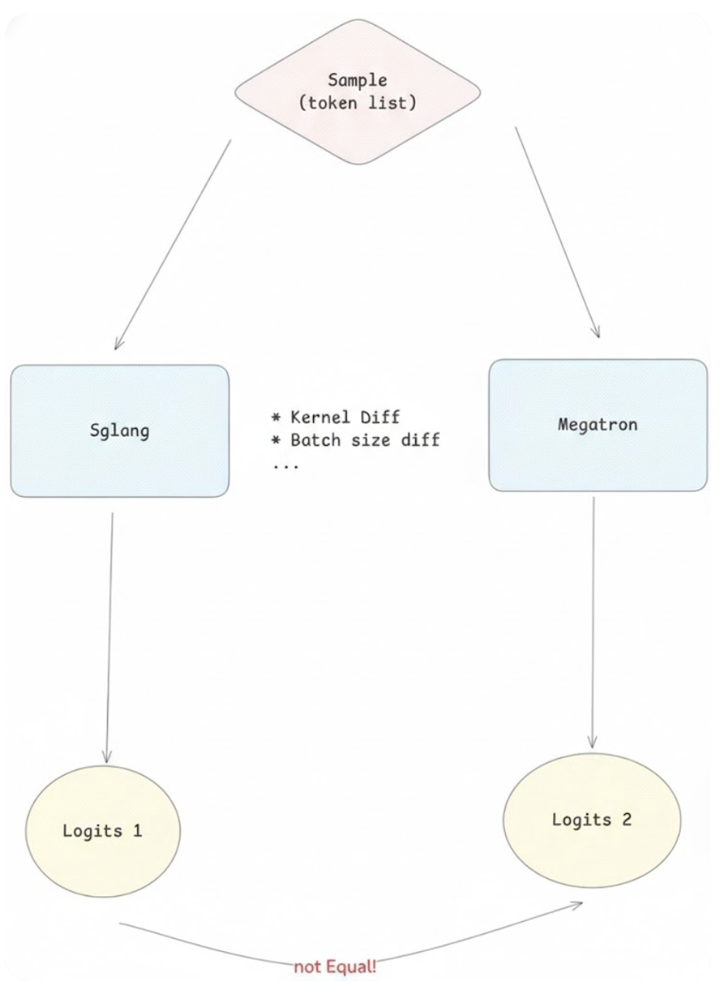
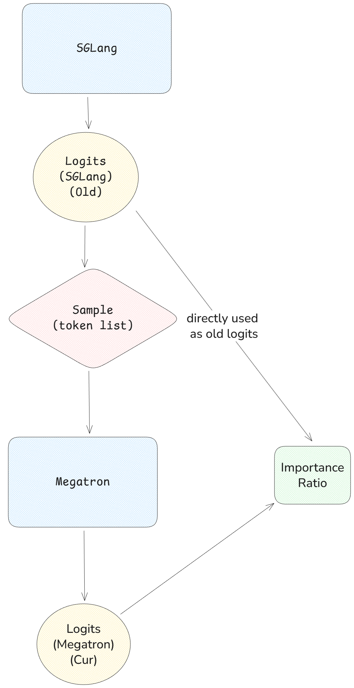
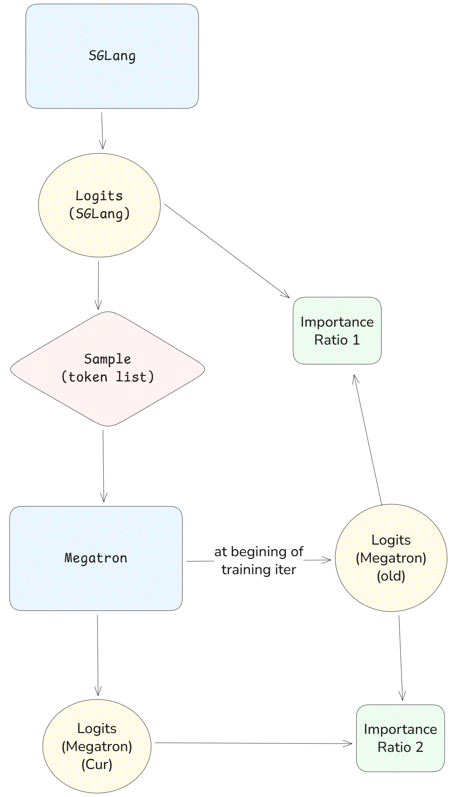
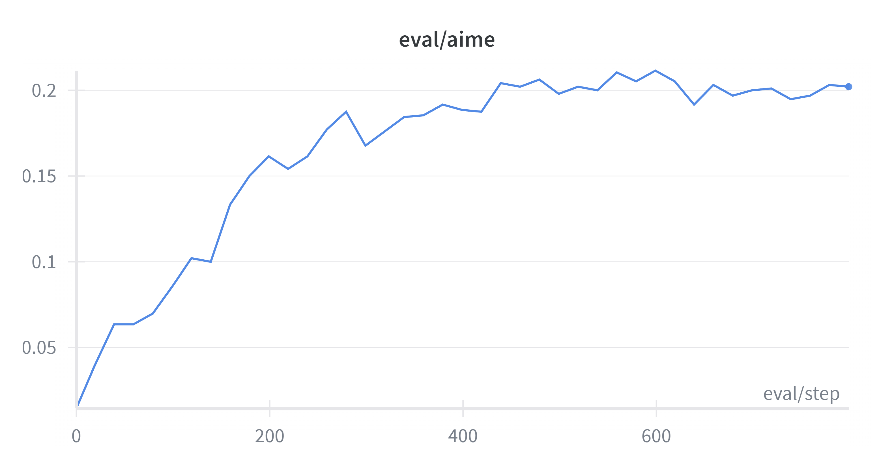
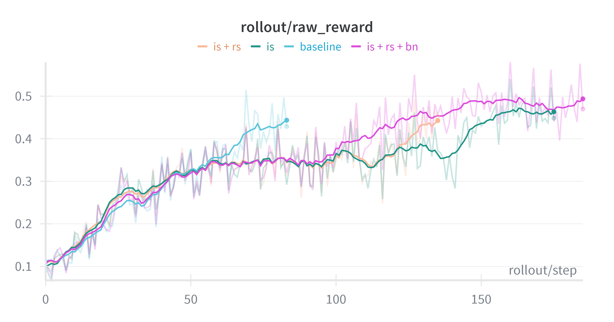
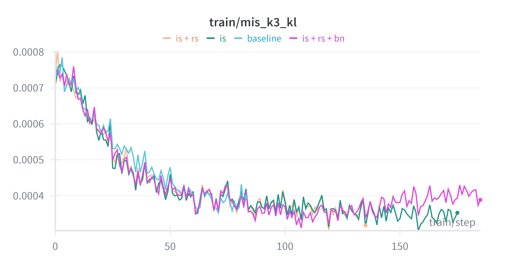
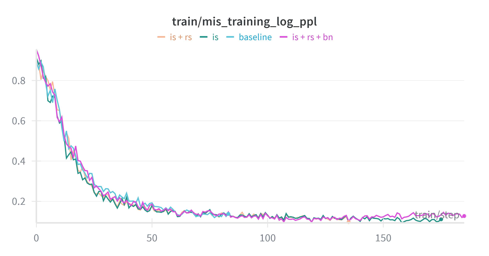
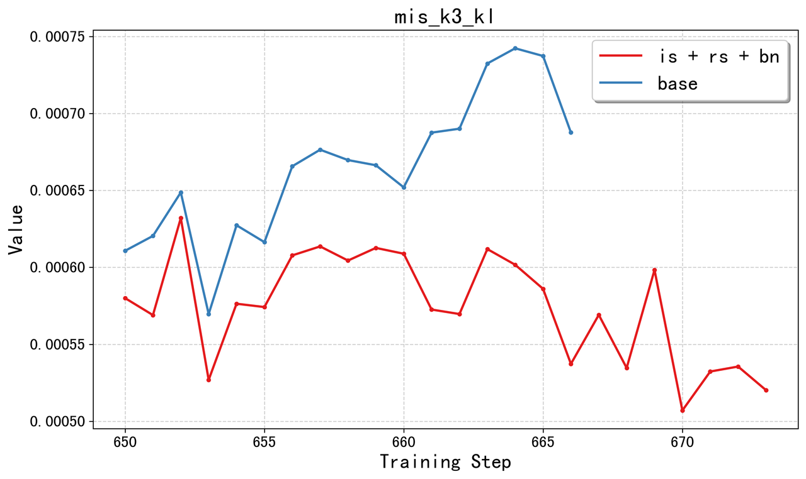

# 让速度与精度同在：全面解决 RL 中的训推不一致问题

> TL;DR：我们系统性研究了 LLM-RL 中的“训练-推理不匹配"问题——一种由 Rollout 引擎与训练引擎之间的数值不一致所导致的、可能威胁训练稳定性的现象。我们介绍了 slime 框架中实现的两种全面解决方案：Truly On Policy 训练（通过后端对齐实现比特级精度）和算法缓解（通过 TIS/MIS 进行修正）。尽管 slime 在实践中表现出色且稳定，我们仍然为更广泛的 RL 社区提供这些强大的工具，以确保正确性和效率。

大家好，SGLang RL Team 近期已经在 slime 上进行了多项 RL 训练稳定性与加速的探索与工作，包括：

- [完美对齐 SGLang 与 FSDP 的精度](https://github.com/THUDM/slime/tree/main/examples/true_on_policy)：实现了 Rollout 与 Training 过程 **KL 散度严格为零**，达成了完美的训推一致。

- [将 Speculative Decoding 引入 RL 采样流程](https://github.com/zhaochenyang20/Awesome-ML-SYS-Tutorial/blob/main/rlhf/slime/spec/readme-en.md)：在 batch size 合适的情况下，显著提升了采样速度。

- [在 RL 中完全使用 FP8 进行采样（Rollout）和训练（Training）](https://github.com/THUDM/slime/tree/main/examples/low_precision)：缓解了量化误差导致的训推不一致性，提升了 RL 训练的效率、资源消耗和吞吐量。

- [为 slime 新增 FSDP2作为灵活的训练后端](https://lmsys.org/blog/2025-12-03-miles-fsdp/)：为 slime 添加了 FSDP2 作为训练后端以支持架构灵活的前沿模型，并与 Megatron 完成分数对齐。

我们在本文中进一步对上述第一篇工作进行展开讨论，分享我们在实践过程中对训推不一致问题的理解，以及我们提出的解决方案。

训练-推理不匹配是指 Rollout（推理）引擎与训练引擎之间存在的数值不一致。即使使用相同的模型权重，这些引擎也经常为相同的 Token 序列产生不同的对数概率。在本文中，我们分析了这种差异的根本原因，并介绍了 slime 的双重方法解决方案。

对于追求绝对正确性的用户，我们提供了 [Truly On Policy 模式](https://github.com/THUDM/slime/blob/main/examples/true_on_policy/README.md)，实现了 SGLang 与 FSDP 之间的比特级对齐。对于更看重吞吐量的用户，我们提供了算法缓解策略，如[掩码重要性采样（MIS）](https://richardli.xyz/rl-collapse-3)和[截断式重要性采样（TIS）](https://fengyao.notion.site/off-policy-rl#279721e3f6c48092bbe2fcfe0e9c6b33)。我们的实验表明，MIS 能有效抑制训练后期的不匹配增长，同时保持高性能，使其成为 RL 实践者的稳健默认选择。

## 什么是训推不一致？

<div align="center">
  
</div>

训推不一致指的是 Rollout（推理）引擎与训练引擎之间存在的数值不一致性。即使两个引擎使用完全相同的模型权重，针对相同的 Token 序列，它们计算出的对数概率也可能存在细微差异。这种差异源于基础设施层面的变化，例如不同的 CUDA 算子、批次大小、专家选择逻辑以及归约顺序（参见 Thinking Machine Lab 的[博客](https://thinkingmachines.ai/blog/defeating-nondeterminism-in-llm-inference/)）。

> 虽然广泛声称训练-推理不匹配可能引发 RL 崩溃，但我们在实践中并未遇到此问题，即使在像 GLM 4.6 这样的前沿模型的 post-training 阶段也是如此。

为了量化这种差异，我们使用 K3 KL 散度（详见[参考文献 8](http://joschu.net/blog/kl-approx.html)）。在 Dense 模型中，K3 KL 通常在 $10^{-5}$ 到 $10^{-3}$ 之间；而在混合专家（MoE）模型中，K3 KL 通常在 $10^{-3}$ 到 $10^{-1}$ 之间。尽管这种不匹配通常很小，但从技术上讲，它引入了异策略（off-policy）效应：用于采样的策略与用于损失计算的策略并不严格相同。在复杂场景中，例如多轮 Agent 任务，现有文献表明这些微小的差异可能会随时间累积，可能破坏训练稳定性或导致崩溃（例如[博客 1](https://richardli.xyz/rl-collapse)和[博客 2](https://thinkingmachines.ai/blog/defeating-nondeterminism-in-llm-inference/)）。

slime 将这种不匹配视为 RL 系统设计中不可忽视的一个方面。用户可以选择彻底消除它以确保正确性，或者采取缓解措施以兼顾效率。

⚠️ 注：slime 在各种规模的任务中，即便存在训推不一致，其稳定性都相当出色。我们花费了大量时间和算力来寻找能够让 slime 因为训推不一致而崩溃的任务，但未能成功。如果您知道任何开源 RL 任务因不匹配而在单节点上可复现地崩溃，请随时联系我们。

## 为什么训练和推理结果会不同？

原因多种多样，我们倾向于认为根本原因是浮点加法不满足结合律。例如，当批次较小时，算子可能会使用分割归约（Split-reduction）优化，这种优化会根据输入大小改变归约顺序。由于浮点运算不满足结合律，不同的累加顺序会引入数值差异。每个 Tensor Core 指令在内部执行归约时，顺序也可能不同（参考：Thinking Machine Lab 的[博客](https://thinkingmachines.ai/blog/defeating-nondeterminism-in-llm-inference/)）。

因此，即使在 SGLang 中，使用不同的批次大小对同一样本进行多次推理，也可能产生略微不同的数值输出。此外，Rollout 和 Training 在 RL 中的负载特征截然不同：Rollout 是decode process, 一次生成一个 Token，涉及的有效矩阵计算极小；而 Training 则是 prefill process, 大批量处理完整序列。这种矩阵形状的巨大差异导致框架之间选择不同的 GPU 算子，进一步放大了 Rollout 与 Training 之间的不匹配。

## 如何缓解不匹配

鉴于训推不一致的存在及其成因，我们提出两种解决方案：

1.  **Truly On Policy**：我们将 Rollout 和 Training 之间的每一个算子后端都进行对齐，确保 Rollout 的对数概率与 Training 的对数概率在比特级上完全一致。这实现了训推 KL = 0，从而提供 100% 真正的同策略（Truly On Policy）行为。
2.  **算法修正**：强制在 Rollout 和 Training 中使用完全对齐的算子会对效率产生一定影响。因此，我们将 Rollout 的对数概率视为权威的行为策略，并使用重要性采样或拒绝采样来进行异策略 Rollout 修正。

我们为社区提供这些选项，并尽力使 RL 训练更加稳定和可调试。

## 完美的 Truly On Policy 训练

正如前文所述，彻底消除不匹配的关键在于对齐 Rollout 和 Training 之间的所有算子后端——确保 Rollout 和 Training 中的每一个操作在比特级上相等。为了实现这一目标，我们对模型各组件使用的算子进行了精挑细选。

具体来说，我们使用了**批次无关（Batch-invariant）算子**：这是实现真正同策略的先决条件。我们采用了 Thinking Machines 提供的算子实现，涵盖了 RMSNorm、Matmul 以及其他常用算子（如 log_softmax 和 mean）。

在此基础上，我们还加入了以下实现与优化：

-   **FlashAttention-3**：我们在训练和推理中均使用 Flash Attention 3 后端，因为它在 Prefill 和 Decode 操作之间能保持比特级一致，且相比 Triton 版本效率比较高。它同时也支持 Radix Cache。
-   **DeepGEMM**：我们使用 DeepGEMM 的快速矩阵乘法作为确定性后端，效率更高。对于不同的输入大小，DeepGEMM 会使用固定的归约顺序和 Tensor Core 指令，不受形状变化的影响。
-   **Torch.compile()**：为了在启用 Truly On Policy 模式时提升效率，我们使用 `torch.compile` 来避免大量细碎算子的开销。部分操作（例如 RoPE）也经过编译加速。
-   **数值对齐**：为了简化问题，我们还对齐了两个系统间的数值操作细节，例如算子数据类型（dtype）、具体的算子实现等。

【TODO：补充 tom 之前 Truly On Policy 的实验结果，其实对着 https://github.com/THUDM/slime/tree/main/examples/true_on_policy，贴上图，总结实验效果就好了】

## 缓解训推不一致的修正算法

<div align="center">
  
</div>

感谢来自社区的研究者们提供了扎实的算法方案。在介绍这些方案之前，让我们先从算法角度看看为什么这种不匹配至关重要。

原始 PPO 算法的公式如下，其中 $\pi_\theta$ 表示当前正在优化并用于计算训练损失的策略，而 $\pi_{\text{old}}$ 表示生成 Rollout 数据的行为策略，即当前更新步骤之前的模型动作概率。

$$\mathcal{L}_{\text{PPO}}(\theta)
= - \mathbb{E}_{x \sim \mathcal{D}} \mathbb{E}_{y \sim \pi_{\textcolor{red}{\text{old}}}} \left[
  \sum_{t=0}^{|y|-1}
  \min \left(
    \frac{\pi_\theta(y_t \mid x, y_{<t})}{\pi_{\textcolor{red}{\text{old}}}(y_t \mid x, y_{<t})} A_t,
    \text{clip}\left(
      \frac{\pi_\theta(y_t \mid x, y_{<t})}{\pi_{\textcolor{red}{\text{old}}}(y_t \mid x, y_{<t})},
      1 - \epsilon,
      1 + \epsilon
    \right) A_t
  \right)
\right]$$

当 SGLang 和 Megatron 的输出不完全匹配时，这就是带有训练-推理不匹配问题的基础 PPO 算法。在这个公式中，用于采样的策略来自 SGLang，而用于计算损失的策略来自 Megatron。这种不匹配使得 PPO 损失变成了一种不正确的重要性采样形式：

$$\mathcal{L}_{\text{PPO}}(\theta)
= - \mathbb{E}_{x \sim \mathcal{D}} \mathbb{E}_{y \sim \pi_{\textcolor{red}{\text{SGLang}}}} \left[
  \sum_{t=0}^{|y|-1}
  \min \left(
    \frac{\pi_\theta(y_t \mid x, y_{<t})}{\pi_{\textcolor{blue}{\text{Megatron}}}(y_t \mid x, y_{<t})} A_t,
    \text{clip}\left(
      \frac{\pi_\theta(y_t \mid x, y_{<t})}{\pi_{\textcolor{blue}{\text{Megatron}}}(y_t \mid x, y_{<t})},
      1 - \epsilon,
      1 + \epsilon
    \right) A_t
  \right)
\right]$$

### By-Passing Old Log-Prob in PPO Importance Sampling

<div align="center">
  
</div>

为了实现算法上的正确性，我们可以直接使用 Rollout 引擎输出的对数概率作为离线 PPO 重要性采样中的“旧策略（Old Policy）”，而不是使用 Training 引擎重新计算出的对数概率。这样，公式就回归到了正确的数学形式：

$$\mathcal{L}_{\text{PPO}}(\theta)
= - \mathbb{E}_{x \sim \mathcal{D}} \mathbb{E}_{y \sim \pi_{\textcolor{red}{\text{SGLang}}}} \left[
  \sum_{t=0}^{|y|-1}
  \min \left(
    \frac{\pi_\theta(y_t \mid x, y_{<t})}{\pi_{\textcolor{red}{\text{SGLang}}}(y_t \mid x, y_{<t})} A_t,
    \text{clip}\left(
      \frac{\pi_\theta(y_t \mid x, y_{<t})}{\pi_{\textcolor{red}{\text{SGLang}}}(y_t \mid x, y_{<t})},
      1 - \epsilon,
      1 + \epsilon
    \right) A_t
  \right)
\right]$$

通过这种方式，我们可以跳过在 Training 引擎上的 log_prob 重计算步骤——这能节省所有生成轨迹的一次前向传播（Forward Pass）计算量。

### Decoupled PPO Importance Sampling

<div align="center">
  
</div>

然而，部分研究者希望将“训推不匹配的重要性采样”与“通用的重要性采样”解耦。Decoupled PPO 通过分离两个角色来实现批次无关（Batch-independent）的 PPO：**近端策略（Proximal Policy）**（作为 PPO 裁剪的锚点，控制更新幅度）和**行为策略（Behavior Policy）**（用于重要性采样中的异策略修正）。因此，该模式涉及三个角色：目标策略 $\pi_\theta$、近端策略 $\pi_{\textcolor{blue}{\text{old}}}$ 以及行为策略 $\pi_{\textcolor{red}{\text{SGLang}}}$。其中，$\pi_{\textcolor{blue}{\text{old}}}$ 是在每个训练步开始时使用 Training 引擎重新计算（re-forward pass）得到的，详见参考文献 6 和 7。总公式如下：

$$\mathcal{L}_{\text{PPO-decoupled}}(\theta)
= - \mathbb{E}_{x \sim \mathcal{D}} \mathbb{E}_{y \sim \pi_{\textcolor{red}{\text{SGLang}}}} \left[
  \sum_{t=0}^{|y|-1}
  \frac{\pi_{\textcolor{blue}{\text{old}}}(y_t \mid x, y_{<t})}{\pi_{\textcolor{red}{\text{SGLang}}}(y_t \mid x, y_{<t})}
  \min \left(
    \frac{\pi_\theta(y_t \mid x, y_{<t})}{\pi_{\textcolor{blue}{\text{old}}}(y_t \mid x, y_{<t})} A_t,
    \mathrm{clip}\left(
      \frac{\pi_\theta(y_t \mid x, y_{<t})}{\pi_{\textcolor{blue}{\text{old}}}(y_t \mid x, y_{<t})},
      1 - \epsilon,
      1 + \epsilon
    \right) A_t
  \right)
\right]$$

其中第一个 Importance Ratio $\frac{\pi_{\text{old}}(y|x)}{\pi_{\text{SGLang}}(y|x)}$ 自然地充当了一个动态学习率缩放项。当 Rollout 分布偏离近端策略时，该比率会缩小有效更新幅度（类似于 Trust Region 控制）。这直接关联到后文提到的平滑策略，旨在防止由 Rollout-Training 不匹配引发过大的更新。

### Batch Normalization & Bias-Variance Trade-off

虽然第一个 Importance Ratio 已经起到了 Token 级自适应学习率控制器的作用，但这种控制在批次（Batch）层面仍是随机的：从行为策略较匹配的区域采样出的批次往往会放大有效步长，而稀有或不匹配的样本则会急剧缩小步长。

因此，我们强烈建议在使用 Sequence Level IS 或 Geometric Level IS 时启用 `--tis-batch-normalize`（自归一化重要性采样）。这项技术解决了异策略训练中的两个关键问题：学习率稳定性和偏差-方差权衡。

在标准重要性采样中，每个批次的平均 Importance Ratio 可能会因采样数据在行为策略下是“高概率”还是“低概率”而剧烈波动，导致有效学习率震荡，破坏训练稳定性。对权重进行自归一化（使其均值始终为 1）可以保持更新步长的一致性，并大幅降低批次间的方差。由于这种归一化已经抑制了方差，我们可以放宽 Clip 或 Mask 的阈值，从而减少它们引入的偏差。随着批次增大，仅靠自归一化就能使估计器既稳定又近乎无偏，无需依赖激进的截断操作。

### Masked Importance Sampling

除了基于裁剪的重要性采样外，我们还提供了**掩码（Masking）**和**拒绝采样（Rejection Sampling, RS）**，作为应对训推不匹配的更强力保障。当 Rollout 引擎为某个采样 Token 分配的概率极低时，Importance Ratio 可能会增长到不安全的数量级（例如 1e12）。即使经过裁剪，这类情况仍可能向训练中注入错误的梯度。RS 通过在比率超过预设信任阈值时直接丢弃这些 Token（必要时甚至丢弃整个序列）来彻底规避此问题，防止有害更新生效。

这种机制强制执行了一个更有原则的信任域（Trust Region）：如果采样的行为偏离近端策略太远，我们干脆不从该样本中学习。这保证了所有有效的训练数据都与假设的 Rollout 分布保持一致，并在不匹配变得极端时保护优化过程免于崩溃。

然而，纯粹的拒绝采样可能会减少可用数据量并增加方差，尤其是在不匹配程度中等时。因此，我们在 MIS 中将 RS 与重要性采样（IS）相结合：IS 负责对大多数 Token 进行数学修正，而 RS 仅在差异严重时充当“安全阀”。在我们的实验中，这种混合方法在训练后期不匹配激增时提供了稳定的性能，提高了鲁棒性，且未牺牲学习效率。

> 更多细节请参阅[此处](https://richardli.xyz/rl-collapse-3)。

## 实验

在介绍实验之前，有必要讨论为什么训练-推理不匹配直到最近才成为广泛讨论的话题。很长一段时间，RL 社区都没有获取到*正确的* Rollout 引擎对数概率（log probs）——具体来说，是应用各种采样参数后实际采样 Token 对应的对数概率。历史上，许多流程错误地使用了 Rollout 引擎的原始（在 sampling parameters 作用前的）对数概率。这一缺失使得不匹配问题在 RL 训练中悄然存在，直到最近才被系统地发现和研究。

即便如此，为了获得用于最终实际采样的 log probs，意味着不允许对模型输出进行任何后处理（Post-processing），否则采样得到的 sequence 可能会出现某些 token 没有对应 log probs 的情况。遗憾的是，许多现有的 Agent 基线确实依赖一些轻量级的后处理，如修剪、移除前缀或补全部分响应。这些操作在经典 Agent 示例中很常见，但它们会使 Importance Sampling 无法正确进行。例如：

例如：
- Search-R1 在响应中执行后处理：[链接](https://github.com/PeterGriffinJin/Search-R1/blob/main/search_r1/llm_agent/generation.py#L54)
- Retool 也是如此：[链接](https://github.com/THUDM/slime/blob/main/examples/retool/generate_with_retool.py#L147)

目前，我们尚未理解为何这些 Agent 任务必须依赖此类后处理。幸运的是，完全移除后处理并直接使用模型的原始输出，仍然能获得与原始基线相似的reward。因此，我们的实验中直接移除了对 rollout sequence 的后处理。

⚠️ 也有研究者建议，如果需要对 rollout sequence 进行后处理，则可以对后处理过的 sequence 在 rollout engine 侧进行 re-forward pass，从而获得正确的 log probs。但是，这个开销非常显著，且我们认为直接去除后处理对于强大的 base model 仍旧适用。


### 不匹配现象的存在

由于有限的时间和资源，我们选择使用 GRPO 而非 PPO 来演示 IS 的行为。我们首先确认，随着训练的进行，即便训练不崩溃，Rollout Engine 和 Training Engine 的 log probs 间的 K3 KL 也可能会增加。我们的实验设置如下：

- 训练数据集：[Dapo](https://huggingface.co/datasets/aaabiao/dapo_filter)
- 评估数据集：aime 24 + aime 25
- 基座模型：Qwen3-4b-base ([链接](https://huggingface.co/Qwen/Qwen3-4B-Base))
- 算法：REINFORCE (Williams et al. 1992)

<div align="center">
  
</div>

<p align="center">
  
  
</p>

可以看到，在训练初期，随着模型学习且 Perplexity 下降，K3 KL 实际上下降了。但在 600 步之后，尽管训练和评估奖励保持稳定并未下降，K3 KL 指标却开始急剧上升，表明训练和 Rollout 之间的不匹配确实存在并且在训练后期会加大。

### IS 不会损害 Performance

>  完整的 wandb log 参考[此处](https://wandb.ai/ch271828n-team/slime-dapo/reports/IS-Has-No-Harm--VmlldzoxNTE3NTM3MQ?accessToken=vbaw93cjkyi8d6iul7gzvccehf2ugff1cicfcmlaxjv88n875i0ip1ixqfr42s9b)。

我们在实验中，验证了启用 TIS/MIS（包括几种常用配置）并不会降低性能或破坏训练稳定性。为了证明这一点，我们在训练开始时启用了不同的 IS 相关选项，并将其与未进行 IS 修正的基线进行了对比。
我们评估了以下四种配置：

1.  Baseline（基线）
2.  Token-level Importance Sampling (IS)
3.  Token-level IS + Masking/Rejection Sampling (RS) [即 MIS]
4.  Token-level IS + Masking/Rejection Sampling (RS) + Batch Normalization (BN) [仍旧是 MIS]

在所有设置中，我们均观察到了稳定的训练曲线。所有四种配置都成功复现了约 100 步后的 Response Length 增加现象，这表明启用 IS 不会对学习动态产生负面影响。此外，在所有实验中，当 response length 开始增加后，reward 也开始提升；在此之前，reward 一直停滞在 0.32 左右。基于这些结果，我们建议将 IS 作为默认配置启用，因为它在不牺牲性能的前提下提供了 mismatch 修正。

<div align="center">
  
  
</div>
<p align="center">
    <em>左图: Response Length      右图：Train Reward（经 moving average 平滑）。</em>
</p>


我们还检查了这些运行的 K3 KL 散度。我们观察到，在所有设置下，随着训练困惑度（PPL）的下降，训练与推理的不匹配（由 K3 KL 衡量）也在减小，这与我们上面的长基线运行结果一致。

<div align="center">
  
  
</div>
<p align="center">
    <em>左图：K3 KL 散度。右图：训练困惑度（PPL）。</em>
</p>

### IS 可以抑制 KL 增长

为了测试 MIS (IS + RS + BN) 是否有效，我们从第 650 步继续训练，结果如下。可以看到，对于 Base Run（基线运行），KL 继续增加；但使用了 MIS 后，增长趋势被成功抑制并开始下降。

<div align="center">
  
</div>

⚠️：由于在学术界资源有限，目前我们的实验主要在小规模 dense model 上展开，得出的结论可能与大规模 MOE training 的结果有一定区别。请期待我们后续博客中与更多工业界伙伴的合作。

## 使用指南

如果想要了解更多细节，我们提供了完整的指南和可运行的示例：

- **True On-Policy (FSDP)**：[链接](https://github.com/THUDM/slime/tree/main/examples/true_on_policy)
- **算法不匹配修正 (Megatron)**：[链接](https://github.com/THUDM/slime/tree/main/examples/train_infer_mismatch_helper)

如果您的目标是完全消除训推不匹配，我们推荐使用 **Truly On Policy** 解决方案，我们接下来也会做出更多关于 Truly On Policy 的探索。如果您倾向于在缓解不匹配的同时保持高性能，像 [MIS](https://richardli.xyz/rl-collapse-3) 这样的**算法修正**是一个轻量级且有效的选择。

以下是可用选项的简要概述。

### True On Policy

要开启 True On Policy 模式，需要在启动脚本中添加以下参数：

```bash
CUSTOM_ARGS=(
    --true-on-policy-mode
)
```

### 算法缓解（Algorithmic Mitigation）

请参阅 [此链接](https://github.com/THUDM/slime/blob/main/examples/train_infer_mismatch_helper/README.md) 获取每个attribute的详细完整解释。

Slime 提供了一个全面的配置系统，允许用户灵活平衡偏差（Bias）与方差（Variance）。要开启重要性采样，必须在启动脚本中添加以下属性：

```bash
CUSTOM_ARGS=(
   --use-tis
   --custom-config-path examples/train_infer_mismatch_helper/mis.yaml
   --custom-tis-function-path examples.train_infer_mismatch_helper.mis.compute_mis_weights_with_cp
)
```

然后，您可以在 [此文件](https://github.com/THUDM/slime/blob/main/examples/train_infer_mismatch_helper/mis.yaml) 中调整详细配置。

<details>
<summary>IS 配置详解</summary>


简单来说，您可以从四个关键维度配置修正策略：

1. 计算层级（Calculation Levels）

决定如何将重要性权重从 Token 聚合到序列。
- **Token Level（Token 级）**
  - 为每个 Token 独立计算权重。
  - 特点：计算简单，但在数学上是有偏的（biased）。适用于大多数通用场景。
- **Sequence Level（序列级）**
  - 序列权重是所有 Token 权重的乘积。
  - 特点：数学上无偏，但面临极大的方差。仅建议在不匹配非常小或批次很大时使用。
- **Geometric Level（几何级）**
  - 使用所有 Token 权重的几何平均值作为序列权重。
  - 特点：一种折衷方案。它保留了序列级信息，同时避免了乘积方法的数值不稳定性，在偏差和方差之间取得平衡。对于长上下文任务，它还提供了一定的长度不变性（length-invariant）属性。

2. 重要性权重约束与信任域（Importance Weight Constraints & Trust Regions）

为了防止极端的重要性权重破坏训练稳定性并强制执行硬信任域，我们对权重施加特定约束。

- **IS Mode（重要性采样模式）**
  - `--tis-mode`：策略包括 `clip`（裁剪）或 `truncate`（截断）。这将约束重要性权重保持在 $[lower\_bound, upper\_bound]$ 范围内，以缓解高方差。

- **RS Mode（拒绝采样模式）**
  - `--use-rs`：RS 不裁剪权重，而是严格丢弃落在指定阈值之外的 Token 或序列。虽然这会减少有效样本量，但它确保梯度更新仅使用信任域内的数据计算（"梯度纯度"）。

- **Mask Mode（掩码模式）**
  - `--use-mask`：此模式对落在阈值之外的 Token 或序列在梯度更新时应用掩码。与 RS 不同，这保留了原始批次结构（和名义样本量），同时有效地将无效数据的梯度贡献置零。

[MIS](https://richardli.xyz/rl-collapse-3) 引入了不同层级的 IS 和 RS/掩码组合。

3. 否决机制（Veto Mechanism）

这是独立于 IS/RS 设置的底层安全网。
- **机制**：如果序列中包含任何在旧策略下概率低于否决阈值（例如 $p < 10^{-6}$）的 Token，则丢弃整个序列。
- **必要性**：防止“灾难性更新”。即使经过裁剪，分母中接近零概率的 Token 也可能引入数值不稳定性或破坏性梯度。

4. 自归一化（Self-Normalization）

`--tis-batch-normalize`：自归一化。在整个 Batch 范围内对重要性权重进行归一化，使其均值等于 1.0。这可以防止权重幅度导致训练步长不稳定。

</details>

## 更多关于不匹配解决的功能

在 slime 中，您还可以找到其他与不匹配相关的工具，例如：

- 来自 Deepseek V3.2 的无偏 KL 估计：[链接](https://github.com/THUDM/slime/pull/1004)
- Rollout 路由回放（Rollout Routing Replay）：[链接](https://github.com/THUDM/slime/pull/715)
- VLM 的 Truly On Policy 训练：[链接](https://github.com/THUDM/slime/tree/main/examples/true_on_policy_vlm)

任何不匹配解决工具都能在 slime 中找到！

## 致谢

字节跳动：Yingru Li, Jiacai Liu, Yuxuan Tong, Qian Liu, Hongyu Lu, Ziheng Jiang

SGLang RL Team: Changyi Yang, Chenxing Xie, Zilin Zhu, Ji Li, Yuzhen Zhou

RadixArk: Chenyang Zhao, Yueming Yuan, Jiajun Li, Banghua Zhu, Tom, Yusheng Su

我们真诚感谢 UCLA 的 Qiwei Di、Xuheng Li、Heyang Zhao 和 Quanquan Gu 老师，以及 Thinking Machines Lab 的 Liyuan Liu 和 Feng Yao 对我们的宝贵建议和讨论。

## 参考文献

1. When Speed Kills Stability: Demystifying RL collapse from the training-inference mismatch [blog](https://richardli.xyz/rl-collapse)
  - Part 1: Why Off-Policy Breaks RL — An SGA Analysis Framework [blog](https://richardli.xyz/rl-collapse-1)
  - Part 2: Applying the SGA Framework — Token v.s. Sequence-level Correction [blog](https://richardli.xyz/rl-collapse-2)
  - Part 3: Trust Region Optimization via Sequence Masking [blog](https://richardli.xyz/rl-collapse-3)
  - Mathematical Formulations of Rollout Correction Methods [docs](https://verl.readthedocs.io/en/latest/algo/rollout_corr_math.html)
2. Your Efficient RL Framework Secretly Brings You Off-Policy RL Training [blog](https://fengyao.notion.site/off-policy-rl#279721e3f6c48092bbe2fcfe0e9c6b33)
3. Simple statistical gradient-following algorithms for connectionist reinforcement learning. [link](https://link.springer.com/article/10.1007/BF00992696)
4. Defeating Nondeterminism in LLM Inference [blog](https://thinkingmachines.ai/blog/defeating-nondeterminism-in-llm-inference/)
5. Small Leak Can Sink a Great Ship—Boost RL Training on MoE with 𝑰𝒄𝒆𝑷𝒐𝒑! [blog](https://ringtech.notion.site/icepop)
6. Batch size-invariance for policy optimization [link](https://arxiv.org/abs/2110.00641)
7. AReaL: A Large-Scale Asynchronous Reinforcement Learning System for Language Reasoning [link](https://arxiv.org/abs/2505.24298)
8. [K3 KL-Definition](http://joschu.net/blog/kl-approx.html): $ k_3(x) = \frac{p(x)}{q(x)} - 1 - \log \frac{p(x)}{q(x)}$