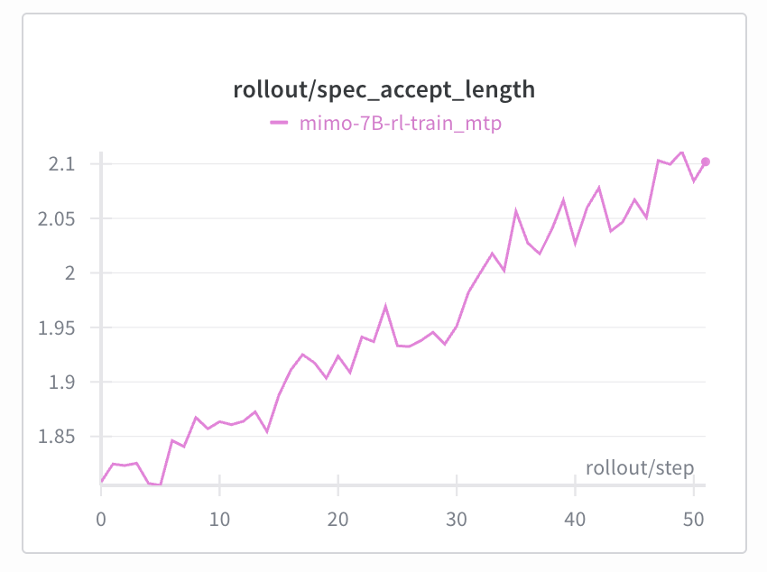
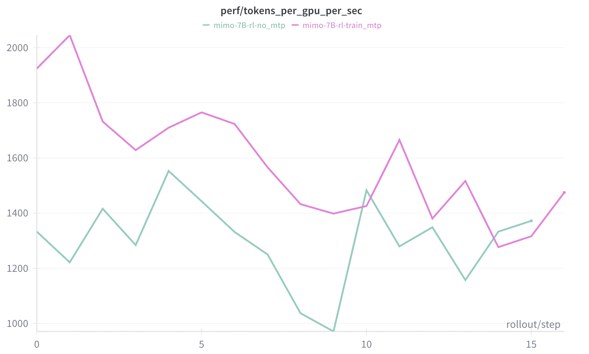
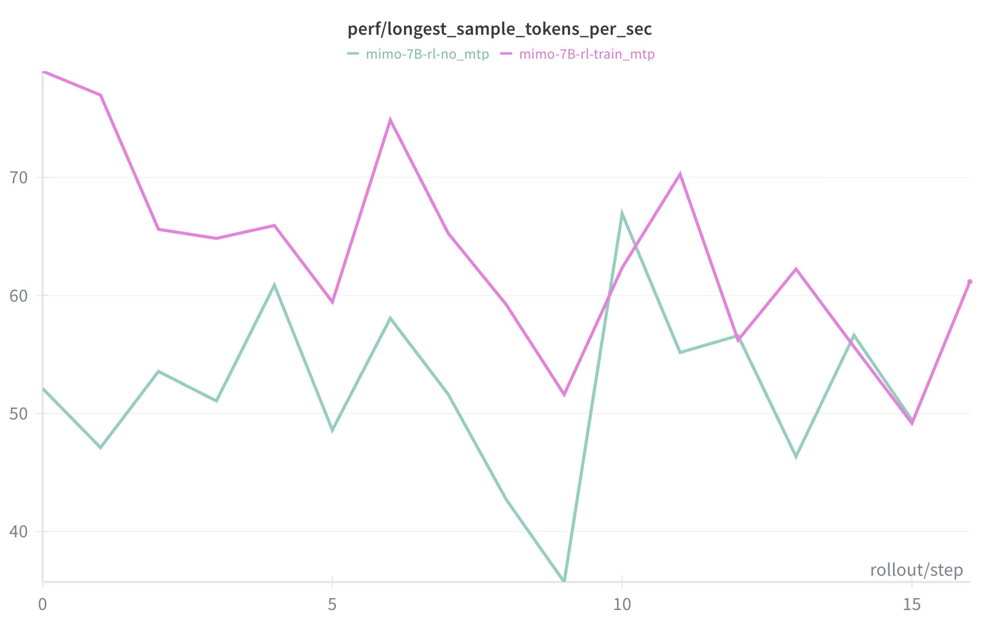

# Power Up Speculative Decoding In Reinforcement Learning

**TL;DR**

**We introduce speculative decoding into the RL sampling process, achieving a significant improvement in sampling speed under appropriate batch sizes. Furthermore, the draft model is also updated during the training process. Compared to freezing the draft model, the accepted length is consistently maintained at a high level, generating long-term stable positive gains.**

[slime/docs/zh/advanced/speculative-decoding.md at main · THUDM/slime](https://github.com/THUDM/slime/blob/main/docs/zh/advanced/speculative-decoding.md)

## Speculative Decoding in RL

Speculative Decoding is well-known as a clever inference acceleration technique. Specifically, during inference, instead of having the expensive Target Model decode token by token, a lightweight draft model first decodes and generates multiple tokens, which are then verified in batch by the large model. Tokens that pass verification are directly used as the final inference result, while failed tokens are resampled using the large model. Ideally, if all tokens generated by the draft model pass verification, the system can accept these k tokens at once, significantly improving inference efficiency. However, if the discrepancy between the draft model and the target model is too large, resulting in too few verified tokens, it might conversely have a negative effect.

Speculative Decoding, this double-edged sword, has already seen significant application in industrial-grade inference engines and also holds enticing potential in On-Policy RL. On one hand, speculative decoding can significantly accelerate the Rollout sampling process, and the sampled tokens are probabilistically identical to the target model. Additionally, the batch size during the rollout process is often not large, which naturally aligns with the batch size requirements of speculative decoding. Of course, all this is premised on the sampling probability difference between the draft model and the target model being within a reasonable range—if the policy difference between the two is too large, the acceptance rate of tokens predicted by the draft model will plummet.

This is the problem solved in this article—we introduce speculative decoding into the RL sampling process and synchronously update the draft model as training progresses, stably improving sampling speed.

## Online SFT for Draft Model

Megatron added support for EAGLE MTP SFT in [v0.12.0rc3](https://github.com/NVIDIA/Megatron-LM/releases/tag/v0.12.0rc3). Based on this, we consider performing online SFT on the draft model during the training process. Specifically, we add a new cross entropy loss (CE Loss) flow inside the Megatron backend, using the target model's hidden state and generated tokens as input to the MTP layer (i.e., the draft model), with the expectation that the MTP layer can accurately predict the next token that the target model will actually generate. When the target model's GPRO Loss calculation is complete and `backward()` is called, it triggers the backpropagation of both the target model's GPRO Loss and the MTP CE Loss simultaneously. The specific process is as follows:

### Constructing the Training Objective

To analyze our loss construction, let's first describe the training objective for the draft model. In a standard autoregressive model, our training objective is to use the input at time $t$ to predict the token at time $t+1$, i.e., `input(t) -> output(t+1)`. In contrast, mainstream speculative decoding uses eagle MTP as the draft model, and its prediction target is the token at time $t+2$, i.e., `Input(t) + Input(t+1) → Output(t+2)`.

Specifically, assume the target model outputs tokens `a, b, c`. Correspondingly, we have hidden states at three token positions, denoted as `h(a), h(b), h(c)`, and token embedding information at three positions, denoted as `e(a), e(b), e(c)`. The MTP layer's objective is to predict the token at time `c` given the target model's "thought" (hidden state) at time `a` and the input (embedding) at time `b`.

### Constructing the Training Input

Based on the analysis above, the MTP layer receives two inputs:

  * Target model's hidden state: Obtained directly from the target model's forward process.
  * Token embedding: Shift the tokens obtained from the target model to the left once (`roll_tensor`) and then pass them through the embedding layer.

Assume the target model's generated sequence is `[a, b, c, d, e]`:

```jsx
target_model_hidden_state = [h(a), h(b), h(c), h(d), h(e)]
rolled_tokens = roll_tensor([a, b, c, d, e], shift=-1) = [b, c, d, e, ❌]
token_embedding = e(rolled_tokens) = [e(b), e(c), e(d), e(e), ❌]
```

Next, the MTP inputs `token_embedding` and `target_model_hidden_state` and outputs `draft_hidden_state`. The `draft_hidden_state` is passed through the lm head (shared with the target model) to get the log probs for each token. At this point, we expect the MTP's output to be `[c, d, e, ❌, ❌]`, which is the result of shifting `rolled_tokens` to the left once more. This is used as the labels to calculate the CE loss.

### Constructing the Training Flow

```jsx
draft_hidden_state = mtp(concat([token_embedding, target_model_hidden_state]))
mtp_logits = shared_output_layer(draft_hidden_state)

labels = roll_tensor(rolled_tokens, shift=-1) = [c, d, e, ❌, ❌]
mtp_loss = cross_entropy(labels, mtp_logits)
```

As mentioned earlier, we add a new SFT CE Loss flow in Megatron. After Megatron returns the target model's log probs, the GRPO Loss is calculated, and then backward is called, triggering the backward pass for both the GRPO Loss and the CE Loss.

To prevent conflicts between the two losses, we detach the hidden state passed from the main model to the MTP, as well as the lm head and embedding shared by the main model and the MTP.

<div align="center">
  
</div>

## Implementation Results

We conducted tests on an H200 cluster based on the Mimo-7B-RL model, using the DAPO-Math-17k dataset, with max response length = 24k.

Experimental Group: Enabled MTP layer for speculative decoding and trained the MTP layer.

Baseline: Did not enable speculative decoding.

The results are as follows:

| | Experimental Group | Baseline |
| :--- | :--- | :--- |
| Rollout Throughput (tokens/s) | 1580 | 1300 |
| Long-tail Efficiency (tokens/s) | 62 | 52 |
| Training Time (s) | 148 | 138 |

1.  After enabling MTP training, the accept length steadily increased, and the mtp loss decreased. Rollout performance improved by about 20% compared to the baseline.

<div align="center">
  
</div>

<div align="center">
  
</div>

<div align="center">
  
</div>

<div align="center">
  
</div>

1.  In terms of training time: Due to the additional training of the mtp layer, there was a certain increase in training overhead. However, compared to the time saved in sampling, there was still a significant overall speed benefit.

<div align="center">
  
</div>

1.  In terms of training effectiveness: As theoretically expected, introducing speculative decoding during the sampling process does not affect the main model's sampling and training effectiveness, as shown in the figure below:

<div align="center">
  
</div>

## Appendix: Engineering Practices

### Sequence Packing

In a naive training pipeline, the input sequence has dimensions `[bs, seq]`. Since different sequences have varying lengths, they must be padded to the longest sequence in the `seq` dimension, which causes each sample to waste a certain amount of memory. To achieve optimal training throughput, we flatten a batch to `bs = 1`. Specifically, we use sequence packing in the `seq` dimension to concatenate sequences before inputting them into Megatron.

Although Megatron supports MTP SFT, it does not yet support MTP training in sequence packing scenarios. To support Megatron's MTP, we implemented the `roll_tensor` function for MTP, which shifts the input sequence one position to the left and sets the end to 0. Handling context parallelism is crucial here.

Without sequence packing, Megatron's implementation of `roll_tensor` is as follows:

  * When CP = 1, it calls the naive `roll_tensor`, using `torch.roll` to shift the entire sequence one position to the left and setting the end to 0.
  * When CP \> 1:
      * First, a naive `roll_tensor` is performed inside each CP chunk. (In the diagram below: Input → Roll each tensor individually)
      * The left chunk of each rank sends its tail element to the left chunk of the previous rank. (In the diagram below, bottom part of Handle boundaries: 12 → 8 → 4 → 0)
      * The right chunk of each rank sends its tail element to the right chunk of the next rank. (In the diagram below, bottom part of Handle boundaries: 28 → 24 → 20 → 16)
      * `rank = 0` and `rank = n-1` need to be handled separately as boundaries.

<div align="center">
  
</div>

In slime, CP splitting is performed *before* sequence packing:

1.  First, each sequence is padded, split according to CP rules, and concatenated across ranks (to get aligned CP blocks on each rank).
2.  Then, within each rank, sequence packing is applied to multiple sequences, concatenating them into a continuous tensor.

Therefore, in the sequence packing scenario, the original `roll_tensor` logic can be almost directly reused: just execute `roll_tensor` for each sequence separately.

### Loss mask processing

The loss mask involves two issues:

1.  How the loss mask is passed to Megatron

    We just mentioned that MTP training adds a new MTP CE Loss Flow, and the CE loss is calculated within Megatron. Originally (without MTP), slime only needed to call Megatron to compute logits, so it didn't need to consider the loss mask within Megatron. But now, the MTP CE Loss must be calculated in Megatron—which requires a loss mask.

    Therefore, we need to process the original loss mask: pad the prompt part, split it according to CP rules, pad the end to align with input ids, and then pass it to Megatron. The `slice_with_cp()` API in slime can be directly reused for CP splitting.

<div align="center">
  
</div>

1.  The intersection problem of the loss mask

    First, the CE loss mask must align with the shifted labels, so it needs to be shifted twice. If the input loss mask is `[1, 0, 1, 1, 0]`, after two shifts, it should be `[1, 1, 0, ❌, ❌]`.

    However, in training, we already assume that `[b, c, d, e, ❌]` is generated from `[a, b, c, d, e]`, and then we predict `[c, d, e, ❌, ❌]` based on `[Ha, Hb, Hc, Hd, He]` and `[Eb, Ec, Ed, Ee, ❌]`, as shown in the figure. But if the mask for b is 0, then b is definitely not a token the model needs to generate, b could not have been generated from a, and it's even more impossible for the MTP to generate c based on Ha and Eb.

<div align="center">
  
</div>

```
Therefore, to perform MTP at position t, we need the "intermediate token" at t+1 to be valid, and we also need the "target token" at t+2 to be valid, but we don't need to care if t is valid (because t is not involved in the calculation);

So, we take the intersection of the two shifted masks. We need to combine the once-shifted loss mask `[0, 1, 1, 0, ❌]` and the twice-shifted mask `[1, 1, 0, ❌, ❌]` to get `[0, 1, 0, ❌, ❌]`.
```

```jsx
loss_mask_1 = roll_tensor(loss_mask, shift=-1)
loss_mask_2 = roll_tensor(loss_mask_1, shift=-1)
mtp_loss_mask = loss_mask_2 * loss_mask_1
```

```
The final state is as follows:
```

<div align="center">
  
</div>

### Mimo-7B-RL Model Support

Megatron's default MTP input concatenation is `[target_token_embed, hidden_state]`, which works for DeepSeek and GLM. However, when testing the feature, due to limited computing resources and for rapid validation, we used the Mimo-7B-RL small model (possibly the only small model with MTP). Unfortunately, we found that when training Mimo directly with Megatron, the loss was particularly high.

We finally discovered that Mimo's MTP input format is `[hidden_state, target_token_embed]`, the complete opposite of DeepSeek and GLM. After finding the cause, the solution was very direct: swap the parameter values of the first and second halves of `eh_proj` before Megatron checkpoint conversion and before Megatron updates weights to SGLang.

## Acknowledgements

Thanks to @Zilin Zhu @Shenggui Li @Tom for their technical guidance

Thanks to @Chenyang Zhao @Mao Cheng for the complete rewrite of this blog

Thanks to @Yuzhen Zhou @Mao Cheng @Ruiguo Yang @Ji Li @Qiaolin Yu @Kangrui Du @Jin Pan @Xinyuan Tong for their collaborative development.