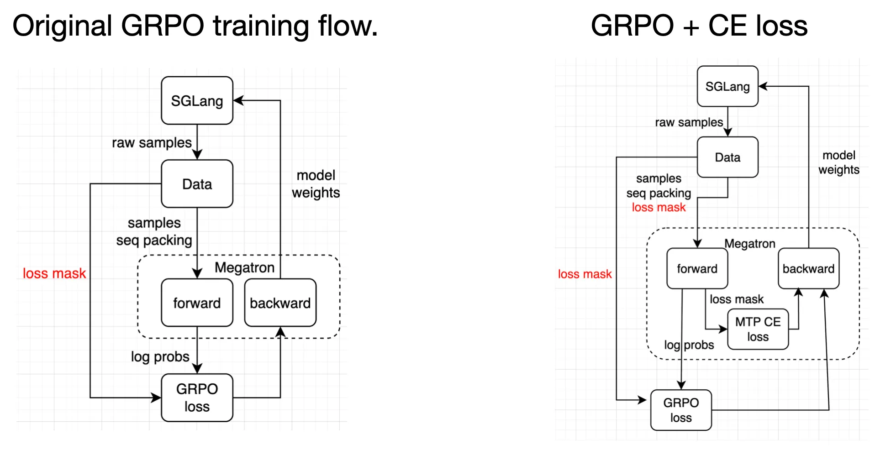
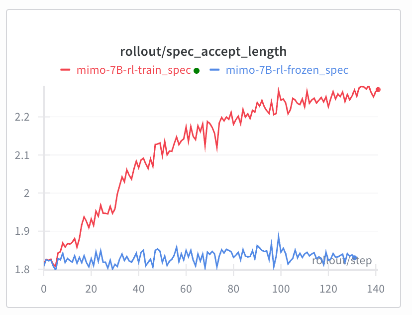
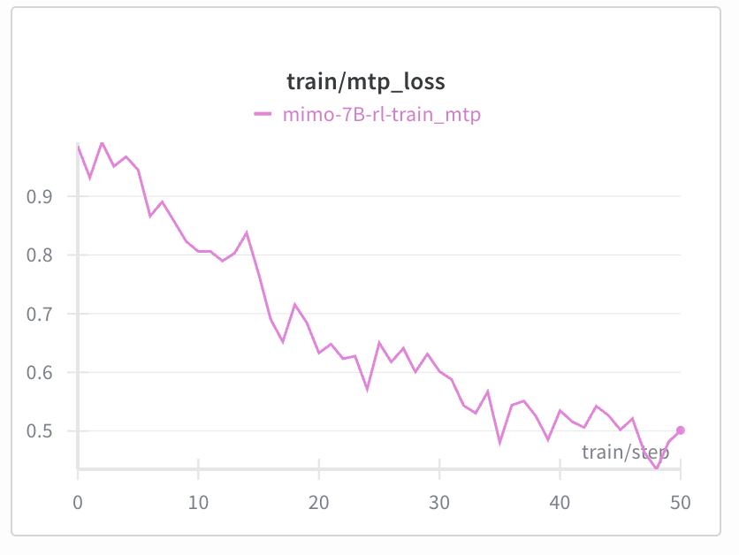
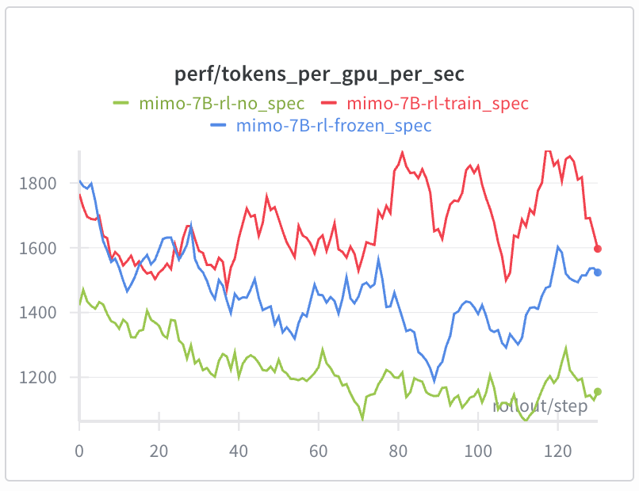
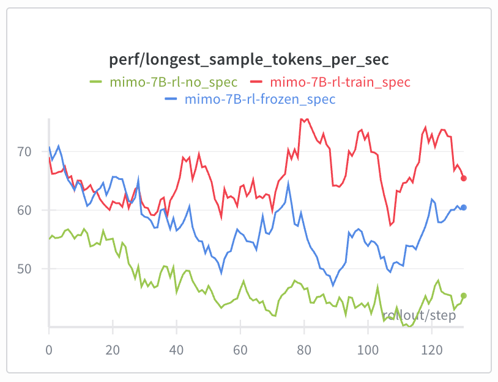
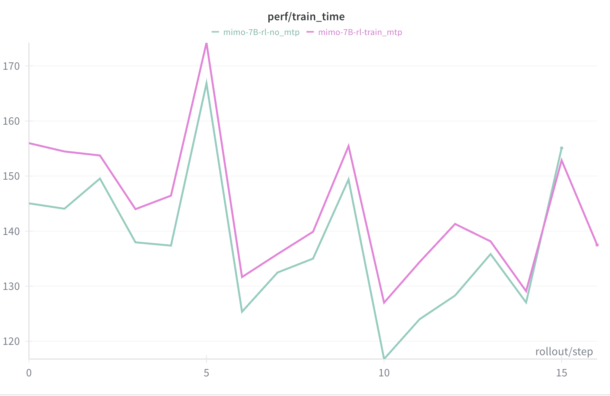
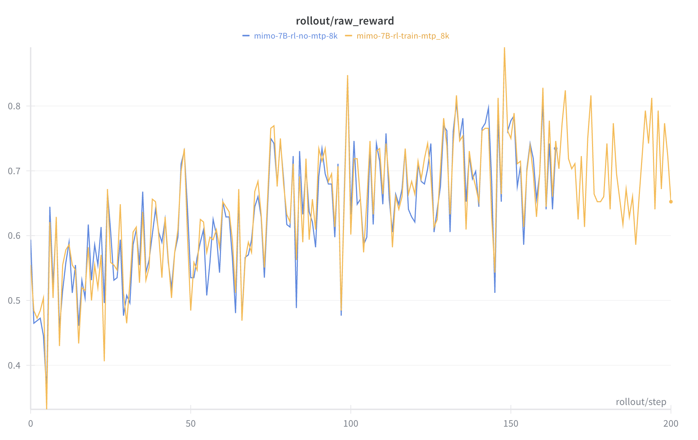
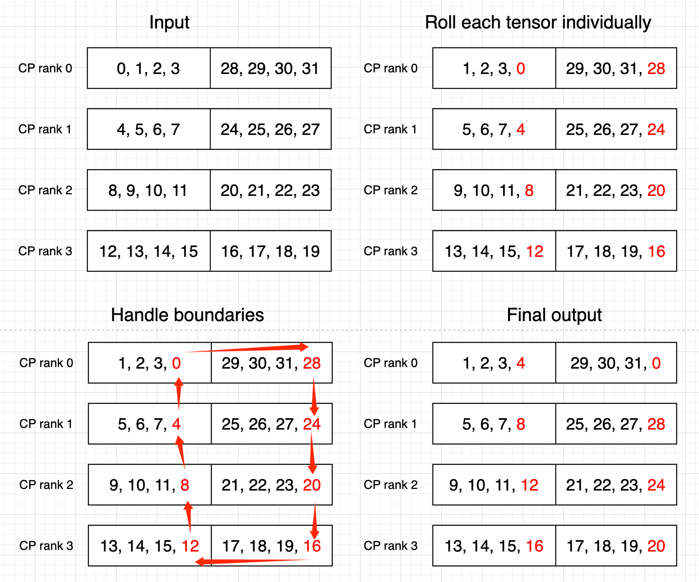
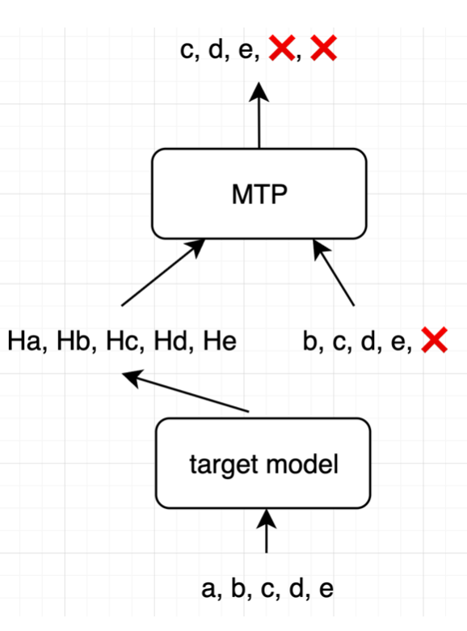
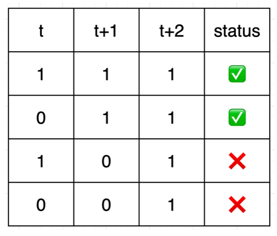

# Power Up Speculative Decoding In Reinforcement Learning

**TL;DR**

**我们将 speculative decoding 引入到了 RL 的采样流程中，在 batch size 合适的情况下，采样速度得到了显著提升；并且，draft model 也会在训练过程中更新。相较于冻结 draft model 的做法，accepted length 持续维持在较高水平，产生长期稳定的正收益。**


[slime/docs/zh/advanced/speculative-decoding.md at main · THUDM/slime](https://github.com/THUDM/slime/blob/main/docs/zh/advanced/speculative-decoding.md)

## Speculative Decoding in RL

Speculative Decoding 大名远扬，它是一种巧妙的推理加速技术。具体来说，推理过程中不再让昂贵的 Target Model 逐个 token 进行 decode，而是先由一个轻量级的 draft model 先进行 decode，生成多个 token 后，再由大模型进行批量验证。验证通过的 token 直接作为最终的推理结果，而验证失败的 token 重新用大模型进行采样。理想情况下，如果 draft model 生成的 token 都通过验证，系统就能一次性接受这 k 个 token，显著提高了推理效率。然而，如果 draft model 和 target model 的差异过大，能通过验证的 token 过少，反而可能会产生负面效果。

Speculative Decoding 这把双刃剑在工业级的推理引擎上已经得到了显著的应用，在 On-Policy RL 中也有着诱人的潜力。一方面，speculative decoding 能显著加速 Rollout 采样过程，并且采样得到的 token 在概率上和 target model 是完全一致的；此外，长尾轨迹会显著拉低 RL rollout 过程中的有效并发度，难以打满硬件的计算瓶颈，而这天然地适应了 speculative decoding 的应用场景。当然，这一切的前提是 draft model 和 target model 的采样概率差异在合理范围内——如果两者策略差异过大，draft model 推测出的 token 接受率会暴跌。

这就是本文解决的问题——我们将 speculative decoding 引入到了 RL 的采样流程中，并且随着训练的进行同步更新 draft model，稳定提高了采样速度。

目前已经合入 slime 主干，一键使用，[参考文档](https://github.com/THUDM/slime/blob/main/docs/zh/advanced/speculative-decoding.md)

## Online SFT for Draft Model

Megatron 在 [v0.12.0rc3](https://github.com/NVIDIA/Megatron-LM/releases/tag/v0.12.0rc3) 中支持了 EAGLE MTP 的 SFT，基于此，我们考虑在训练过程中对 draft model 进行 online SFT。具体来说，我们在 Megatron backend 内部增加了一条新的 cross entropy loss（CE Loss），使用 target model 的 hidden state 和 generated token 作为 MTP 层（也即 draft model）的输入，以期望 MTP 层能准确预测出 target model 真正会生成的下一个 token。当 target model 的 GPRO Loss 计算完成并调用 `backward()` 时，同时触发 target model 的 GPRO Loss 和的 MTP CE Loss 的反向传播。具体流程如下：

### 构造训练目标

为了分析我们对于 loss 的构造，我们首先来描述 draft model 的训练目标。和标准的 autoregressive model 中，我们的训练目标是用 $t$ 时刻的输入来预测 $t+1$ 时刻的 token，也即 `input(t) -> output(t+1)`。与此不同的是，主流的 speculative decoding 采用 eagle MTP 作为 draft model，其预测目标是 $t+2$ 时刻的 token，也即 `Input(t) + Input(t+1) → Output(t+2)`。

具体来说，假设 target model 输出的 token 为 `a, b, c`，对应我们有三个 token 位置上的 hidden state，记为 `h(a), h(b), h(c)`，还有三个位置上的 token embedding 信息，记为 `e(a), e(b), e(c)`。MTP layer 的目标是在给定 target model 在 `a` 时刻的思考（hidden state）和 `b` 时刻的输入（embedding）后，推测出 `c` 时刻的 token。

### 构造训练输入

基于以上分析，MTP layer 获得两个输入：

- target model  的 hidden state：直接从 target model 的 forward 过程中获取。
- token embedding：将 target model 得到的 tokens 向左平移一次（`roll_tensor`），再通过 embedding layer 即可。

假设 target model 的生成序列为 `[a, b, c, d, e]`：

```jsx
target_model_hidden_state = [h(a), h(b), h(c), h(d), h(e)]
rolled_tokens = roll_tensor([a, b, c, d, e], shift=-1) = [b, c, d, e, ❌]
token_embedding = e(rolled_tokens) = [e(b), e(c), e(d), e(e), ❌]
```

接着，MTP 输入 `token_embedding` 和 `target_model_hidden_state`，输出 `draft_hidden_state`。将 `draft_hidden_state` 通过与 target model 共享的 lm head，得到每个 token 的 log probs。此时，我们期望 MTP 的输出是 `[c, d, e, ❌, ❌]` ，也就是 `rolled_tokens` 再次向左平移一次的结果，将它作为 labels 计算 CE loss。

### 构造训练流

```jsx
draft_hidden_state = mtp(concat([token_embedding, target_model_hidden_state]))
mtp_logits = shared_output_layer(draft_hidden_state)

labels = roll_tensor(rolled_tokens, shift=-1) = [c, d, e, ❌, ❌]
mtp_loss = cross_entropy(labels, mtp_logits)
```

如前文所述，我们在 Megatron 中增加一条新的 SFT CE Loss flow；Megatron 将 target model 的  log probs 返回后计算 GRPO Loss，随后调用 backward，同时触发 GRPO Loss 和 CE Loss 的 backward。

为了防止两种 loss 的冲突，我们 detach 了主模型传给 MTP 的 hidden state，以及主模型和 MTP 共享的 lm head 和 embedding。

<div align="center">
  
</div>

## 实现效果

我们在 H200 集群上基于 Mimo-7B-RL 模型进行测试，所用数据集为 DAPO-Math-17k，max response length = 24k。

实验组：启用 MTP 层进行 speculative decoding，并且对 MTP 层进行训练

baseline 1：启用 MTP 层进行 speculative decoding 推理，但不训练 MTP 层

baseline 2：不启用 speculative decoding

得到的效果如下：

|  | 实验组 Online SFT spec | baseline 1 Frozen spec | baseline 2 No spec |
| --- | --- | --- | --- |
| rollout 吞吐 (tokens/s) | 1667 | 1464 | 1219 |
| 长尾效率 (tokens/s) | 65 | 57 | 47 |
| 训练耗时 (s) | 148 | 143 | 141 |

1. 开启对 MTP 的训练后，accept length 稳步上涨，mtp loss 下降。

<div align="center">
  
</div>

<div align="center">
  
</div>

2. rollout 性能，训练 spec 对比不开启 spec 整体有 35% 左右的提升，对比冻结 spec 有 14% 的提升。这一差距在训练后期愈发明显，训练 spec 对比冻结 spec 效率提升达到 25%。

<div align="center">
  
</div>

<div align="center">
  
</div>

3. 在训练时间上：由于额外训练了 mtp layer，增加了极少量的训练消耗；但是相比采样节省的时间，整体速度仍然有显著收益。

<div align="center">
  
</div>

4. 训练效果上：如理论预期一样，采样过程中引入 speculative decoding 并不会影响主模型的采样和训练效果，如下图所示：

<div align="center">
  
</div>

## 附录：工程实践

### Sequence Packing

在朴素的训练流程中，输入序列是 `[bs, seq]` 维度。不同序列长短不一，所以必须在 `seq` 维度补齐到最长序列，这导致每条 sample 实际上浪费了一定显存。为了达到最优的训练吞吐，我们将一个 batch 拍扁成 `bs = 1`，具体来说，在 `seq` 维度用 sequence packing 拼接再输入 Megatron。

Megatron 虽然支持了 MTP SFT，但至今没有支持 sequence packing 场景的 MTP 训练。为了支持 Megatron 的 MTP，我们实现了对 MTP 的 `roll_tensor` 函数，将输入序列向左平移一位，并将尾部置 0。此时 context parallelism 的处理非常关键。

在没有 sequence packing 的情况下，Megatron 关于 `roll_tensor` 的实现如下：

- CP = 1 时调用朴素的 `roll_tensor` ，基于 `torch.roll` 将序列整体左移一位，末尾置 0
- CP > 1：
    - 首先，每个 CP chunk 内部都进行一次朴素的 `roll_tensor` ；（下图中 Input → Roll each tensor individually）
    - 每个 rank 的左侧 chunk 将尾元素发送给前一个 rank 的左侧 chunk；（下图中 Handle boundaries 的下侧，12 → 8 → 4 → 0）
    - 每个 rank 的右侧 chunk 将尾元素发送给后一个 rank 的右侧 chunk；（下图中 Handle boundaries 的下侧，28 → 24 → 20 → 16）
    - `rank = 0` 和 `rank = n-1` 作为边界需要单独处理。

<div align="center">
  
</div>

在 slime 中，CP 切分是先于 sequence packing 进行的：

1. 先按 CP 的规则将每条序列补齐、切分并完成跨 rank 的拼接（得到各 rank 上对齐的 CP 分块）。
2. 再在每个 rank 内对多条序列做 sequence packing，把它们拼成连续张量。

因此，在开启 sequence packing 的场景里，原有的 `roll_tensor` 的逻辑几乎可以直接沿用：对每条序列分别执行一次 `roll_tensor` 即可。

### Loss mask 处理

loss mask 涉及到两个问题：

1. loss mask 如何传递到 Megatron

刚刚我们提到 MTP training 新增了一条 MTP CE Loss Flow，而 CE loss 是在 Megatron 里算的。slime 原来（不考虑 MTP 时）只需要调用 Megatron 算 logits，因此不需要在 Megatron 中考虑 loss mask。而现在要在 Megatron 里算 MTP 的 CE Loss ——**这是需要 loss mask 的**。

因此，我们要处理一下原本的 loss mask：补齐 prompt 部分，按照 CP 规则切分，padding 末尾跟 input ids 对齐，再传给 Megatron。做 CP 切分可以直接沿用 slime 里的 `slice_with_cp()` API。

<div align="center">
  
</div>

2. loss mask 的交集问题

首先，CE 的 loss mask 要跟 labels 的平移对齐，要转两次。如果输入的 loss mask 是 `[1, 0, 1, 1, 0]` ，那么转两次后应该是 `[1, 1, 0, ❌, ❌]` 。

但我们在训练中已经 assume 了 `[b, c, d, e, ❌]` 是 `[a, b, c, d, e]` 生成的，然后根据 `[Ha, Hb, Hc, Hd, He]` 和 `[Eb, Ec, Ed, Ee, ❌]` 去预测 `[c, d, e, ❌, ❌]`，如图。但如果 b 的 mask 是 0，那么 b 一定不是模型需要生成的 token，b 不可能是由 a 生成的，**更不可能让 MTP 根据 Ha 和 Eb 生成 c**。

<div align="center">
  
</div>

因此，在 t 位置做 MTP，需要 t+1 这个“中间 token”有效，也需要 t+2 这个“目标 token”有效，但并不需要关心 t 是否有效（因为 t 没参与计算）；

所以是取两次平移后的交集。我们要把 loss mask 转一次的情况 `[0, 1, 1, 0, ❌]` 和转两次的情况 `[1, 1, 0, ❌, ❌]` 并起来，，得到 `[0, 1, 0, ❌, ❌]` 。

```jsx
loss_mask_1 = roll_tensor(loss_mask, shift=-1)
loss_mask_2 = roll_tensor(loss_mask_1, shift=-1)
mtp_loss_mask = loss_mask_2 * loss_mask_1
```

最终状态如下：

<div align="center">
  
</div>

### 截断 lm_head 和 embedding

在 MTP 训练中，我们希望复用主模型的 LM Head 和 Embedding，但又不想让 MTP 的辅助 loss 去更新这两层参数——只应该由主 LM loss 来驱动。同时，MTP 输出的 hidden states 仍需要正常反向传播，否则 MTP 层本身学不到东西。为了解决这个问题，我们显式把 MTP 分支和主模型参数的梯度路径切开，只保留对 MTP 自己那部分参数的更新。工程实现上，我们具体做了三件事：

1. 切断流向主模型和 Embedding 层的梯度：

```jsx
decoder_input = embedding(input_ids=input_ids, position_ids=position_ids)
decoder_input = decoder_input.detach()
hidden_states = make_viewless_tensor(inp=hidden_states, requires_grad=True, keep_graph=False)
```

这里先正常做一次 embedding，然后立刻对 `decoder_input` 做 `detach()`。前向数值不变，还是用主模型的 embedding。但从 MTP loss 往回反传时，梯度不会再传回 embedding 权重，embedding 在 MTP 分支上是只读的常量。`hidden_states` 也是一样的效果，只是额外处理了 view 场景。

2. 切断流向 LM Head 的梯度

```jsx
for mtp_layer_number in range(self.config.mtp_num_layers):
    # 1. 拿到 output_layer 所有参数并 detach
    output_layer_params = {
        k: v.detach() for k, v in self.output_layer.named_parameters()
    }
    # 2. 拿到所有 buffer（例如 LayerNorm 的 running stats）
    output_layer_buffers = dict(self.output_layer.named_buffers())

    # 3. 用 functional_call 以“纯函数”的方式调用 output_layer
    mtp_logits, _ = torch.func.functional_call(
        self.output_layer,
        {**output_layer_params, **output_layer_buffers},
        (hidden_states_list[mtp_layer_number + 1],),
        {
            # tied embedding 也要 detach，避免被 MTP loss 更新
            "weight": output_weight.detach() if output_weight else None,
            "runtime_gather_output": runtime_gather_output,
        },
    )
```

这里的关键点有三个：

1. 仅在参数层面 `detach()`，而不是输出层面 `detach()` 。`output_layer_params` 和 `output_weight` 都被 `detach()` 了一次。计算图在 LM Head 参数那里被“截断”了，MTP loss 对 `self.output_layer` 的参数梯度是0 。
2. 用 `torch.func.functional_call` 做“函数式调用“。`functional_call(module, params_and_buffers, args, kwargs)` 的语义可以理解为：
    
    > 把一个 nn.Module 当成形如 f(params, buffers, inputs) 的纯函数，这次调用显式传入一份参数字典，而不是用模块内部挂着的那一份。
    > 
    
    这有两个好处：
    
    - 我们不会修改 `self.output_layer` 本身的参数对象，也不会动它的 `requires_grad` 状态。主 LM loss 仍然可以正常更新同一个 LM Head
    - 在 MTP 这条分支上，我们临时“换成”一份 `detach()` 过的参数视图，只影响这一次前向
3. 切断 tied embedding，避免被 MTP loss 更新

### Mimo-7B-RL 模型支持

Megatron default 的 MTP input concat 是 `[target_token_embed, hidden_state]`，这适用于 deepseek 和 GLM。但测试 feature 时由于计算资源有限并且为了快速验证，我们采用了 Mimo-7B-RL 这个小模型（可能是唯一带 mtp 的小模型）。可惜我们发觉，直接用 Megatron 训练 Mimo，loss 特别高。

最后发觉，Mimo MTP 输入的格式是 `[hidden_state, target_token_embed]`，完全相反于 DeepSeek 和  GLM。找到原因后，解决方法非常直接，在 Megatron checkpoint 转换以及 Megatron 向 SGLang 做权重更新之前，交换 `eh_proj` 前半块和后半块的参数值。

## 致谢

感谢 @Zilin Zhu @Shenggui Li @Tom 的技术指导

感谢 @Chenyang Zhao @Mao Cheng 对本 blog 的彻底重写

感谢 @Yuzhen Zhou @Mao Cheng @Ruiguo Yang @Ji Li @Qiaolin Yu @Kangrui Du @Jin Pan @Xinyuan Tong  的协作开发。
