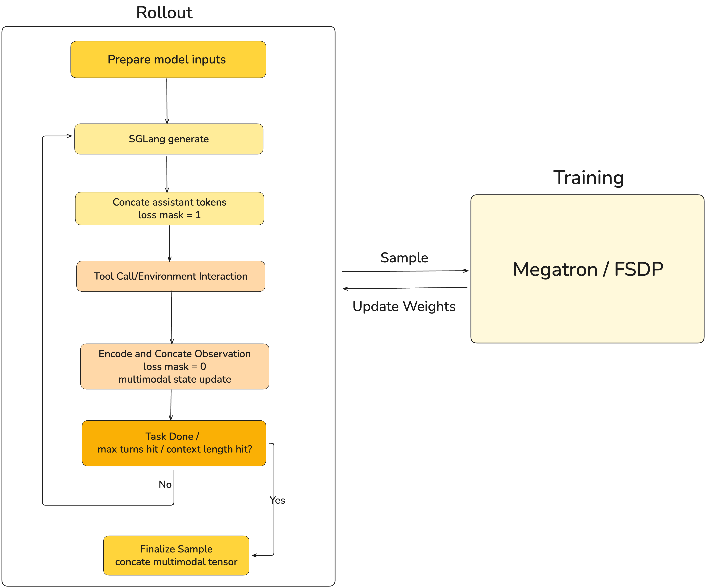
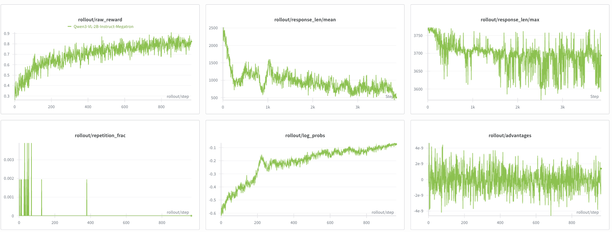
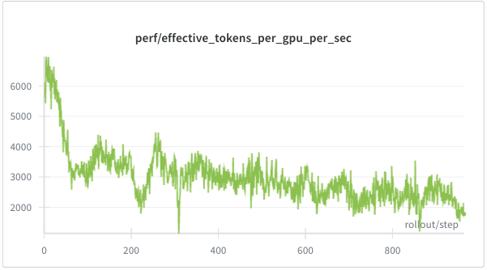
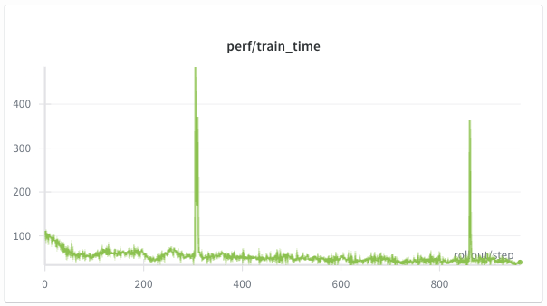
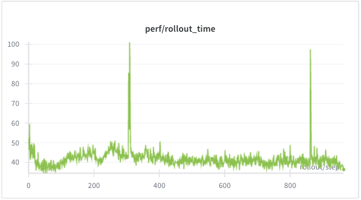
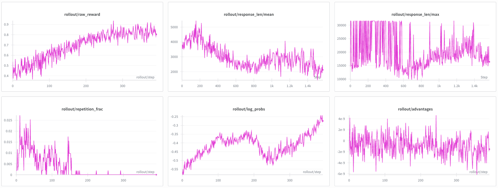
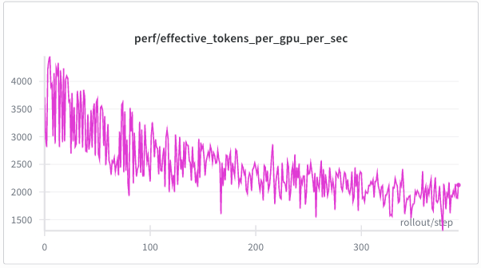
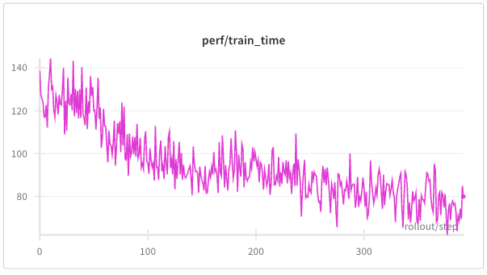
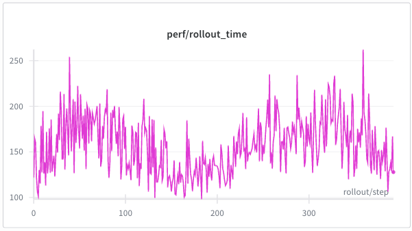

# One Rollout to Rule Them All: Seamless Multi-Turn RL for LLM and VLM

> 💡 **TL;DR:**  We've unified LLM and VLM training in slime. With our decoupled design, you can now write a single custom `rollout` function to enable multi-turn reinforcement learning (Agentic Multi-turn RL) for VLMs, and it's just like you would do for LLMs.

Recently, the SGLang RL team has made significant progress in RL training stability, efficiency, and application scenarios, including:

- **INT4 QAT End-to-End Training**: We implemented a complete QAT INT4 closed-loop solution from training to inference and provided a detailed [technical recipe](https://github.com/zhaochenyang20/Awesome-ML-SYS-Tutorial/blob/main/rlhf/slime/int4/readme-en.md), significantly improving rollout efficiency and stability.
- **Unified Multi-Turn VLM/LLM Training**: We provided an implementation for the VLM multi-turn sampling paradigm [blog](https://github.com/zhaochenyang20/Awesome-ML-SYS-Tutorial/blob/main/rlhf/slime/vlm-multi-turn/readme.md). Developers only need to write a customized `rollout` function to easily start multi-turn RL for VLM, just like training LLM.
- **Rollout Router Replay**: We implemented the **[Rollout Router Replay](https://github.com/THUDM/slime/blob/58525eb986c66a271aa31077e17b8afebe704b4f/tests/test_qwen3_30B_A3B_r3.py#L79)** mechanism, significantly improving RL stability for MoE models during RL training.
- **FP8 End-to-End Training**: We successfully implemented **[end-to-end FP8 training and sampling](https://lmsys.org/blog/2025-11-25-fp8-rl/)** in RL scenarios, further unlocking hardware performance.
- **Speculative Decoding**: We successfully implemented **[speculative decoding](https://thudm.github.io/slime/advanced/speculative-decoding.html)** in RL scenarios, significantly improving rollout efficiency.

In this sense, we further share the design of unifying VLM and LLM multi-turn RL training paradigms, hoping to provide a first-principles-based multi-turn RL solution for the community.

Thanks to the SGLang RL team, Amazon AGI SF Lab, and the slime & Miles community for their contributions. Thanks to [Verda Cloud](https://www.linkedin.com/company/verda-cloud/) for providing computing resources for this work.

## Introduction

Unlike traditional single-turn rollout, Agentic VLMs involves continuous interaction. Instead of generating a "final answer", the model acts as a decision-making role that evolves through an iterative cycle of executing actions and perceiving observations. In each turn, the model  interacts with the environment, and each round of feedback gives the model more information for its next move. This multi-turn interaction is how VLMs evolve into truly intelligent agents.

Take Computer Use Agents or embodied intelligence scenarios as examples, the model isn't just an isolated chatbot. It's a thinking machine deeply embedded in the environment. It needs to "read the room": output actions that change the environment (UI state, physical movement, etc.), capture observations in real-time (often as images), and reason through complex problems in continuously rolling long contexts.

This is exactly what slime, together with the Miles community, is tackling in VLM Agentic Training. Thanks to the elegant design we built during the LLM Multi-turn Training phase, you can simply pass your VLM Agent interaction logic through the `--rollout-function-path` parameter. This seamlessly connects the full pipeline: "autonomous generation → environmental interaction → multimodal observation feedback → iterative reasoning". Our design philosophy for Agentic Multi-Turn RL stays consistent: extreme decoupling. Rollout logic isn't tied to any specific dataset format or interaction protocol. How the environment parses actions, executes tools, or provides observations—that's all up to you. This gives you complete freedom to evolve your agents however you want.

## Core Design

As we keep saying, from first principles, multi-turn training really just needs you to define **sampling and interaction logic**.

Take slime's LLM Multi-Turn Training (like [Search-R1](https://github.com/THUDM/slime/blob/cd4a8efc6f8e33364a474cfa70875779ed0a673f/examples/search-r1/generate_with_search.py))—it uses custom sampling (the `generate` function) where the model generates action instructions based on the current context each round, captures environmental observations in real-time, and incrementally injects them into the context. This continues until the model decides to return a conclusion or hits the context length limit. Once we have the complete trajectory, we use loss masks to distinguish between the model's action instructions and the environmental feedback.

VLM multi-turn sampling isn't fundamentally different from LLM's—you just need to maintain and concatenate multimodal context information each round. We explicitly decouple the environment from rollout, so things like "how the environment parses actions" are completely independent of sampling and training. This makes everything more reusable and extensible.

### Multi-Turn Interaction Iteration Logic

1. **Initialize Task**: Extract the `prompt` and multimodal inputs from `Sample`, do the first-round encoding, and initialize `sample.tokens`, `image_data`, `multimodal_train_inputs_buffer`, etc. This sets up the context for the multi-turn loop.

2. **Model Generation**: The model generates actions for this round, we append them to the context, and set the loss mask position to 1.

3. **Environment Processes Action**: We pass the model output to the environment, which returns an observation (might include multimodal content).

4. **Append Observation to Context**: We encode the observation as input for the next round.

- Get clean `prompt_ids` (see [Engineering Appendix](https://www.notion.so/2e1ab71c210b8096bcb1ce296737fd90?pvs=21)), append to context, and set the `loss_mask` position to 0.
- For VLMs, observations might include new multimodal content, so we need to maintain concatenation of multi-turn multimodal data. This means keeping two chains in sync:
    - Rollout's `image_data`: encode and append new images each round.
    - Training-side `multimodal_train_inputs`: merge the tensors the processor produces each round.

5. **Termination Conditions**: The loop stops when any of these conditions are met:

- **max_turn**: We hit the `max_turns` limit. Once reached, we stop regardless of whether the task is done.
- **token budget**: To avoid overly long sampling, we maintain a token budget. Each generation or observation append uses up some budget. When it's exhausted, we stop early and mark it as TRUNCATED to stay within context/generation limits.
- **env done**: The environment returns `done=True` in `env.step()`, meaning the task is complete or can't continue. Rollout stops immediately.
    



```python
# Pseudocode: custom multi-turn rollout.generate 

async def generate(args, sample, sampling_params):
    # 0) Init: load custom variable like envrionment path and max_turn 
    env = load_env_module(args.rollout_interaction_env_path).build_env(sample=sample, args=args)
    max_turns = args.max_turns  # injected via --custom-config-path (YAML) :contentReference[oaicite:0]{index=0}
    
    # 1) Encode initial prompt and multimodal inputs 
    sample.tokens, image_data, mm_train_buffer = init_from_prompt(sample, state)

    # 2) Turn loop: actor -> env -> append observation -> repeat
    for _ in range(max_turns):

        # (a) Actor generation (assistant tokens)
        response_text, new_tokens, new_logprobs, finish_reason = sglang_generate(
            url=url, input_ids=sample.tokens, sampling_params=sampling_params, image_data=image_data
        )
        append(sample, new_tokens, new_logprobs, loss_mask_val=1)

        # (b) Env step (returns next observation; may include multimodal payload)
        observation, done, _ = env.step(response_text)
        if done:
            break

        # (c) Process and append observation tokens
        user_msg = env.format_observation(observation)
        obs_ids, obs_image_data, obs_mm_inputs, obs_mm_train = encode_observation_delta(
            user_msg, tokenizer=state.tokenizer, processor=state.processor, tools=sample.metadata.get("tools")
        )
        append(sample, obs_ids, [0.0] * len(obs_ids), loss_mask_val=0) 

        # (d) Multimodal state update
        image_data += obs_image_data                       # inference-side image_data
        if obs_mm_train:
            mm_train_buffer.append(obs_mm_train)           # training-side image_data
				
    return sample
```

### Environment Interface

We've defined some common interfaces for the environment (`BaseInteractionEnv`) that you can use:

- `reset()`: Clear the environment's internal state
- `step(response_text: str) -> (observation: dict, done: bool, info: dict)`: Receive model output, return observation and whether it's finished
- `format_observation(observation: dict) -> dict`: Convert observation into a chat message to be appended in the next round. If observation contains `multi_modal_data`, images will be put into message content.

## Experimental Results

We tested our design by running Agentic Multi-Turn GRPO Training on `Qwen3-VL-2B-Instruct` using the [geo3k multimodal dataset](https://huggingface.co/datasets/VeraIsHere/geo3k_imgurl_processed), with Megatron-LM as the training backend (check out the [training script](https://github.com/THUDM/slime/blob/main/examples/geo3k_vlm_multi_turn/run_geo3k_vlm_multi_turn.py) for details). Here's what we found:

<div style="display: flex; gap: 10px; width: 100%; margin: 20px 0;">
  
  
  
</div>


The raw reward keeps rising and converges nicely, showing the actor model is learning effectively. The repetition fraction drops quickly—no issues with useless language repetition. The model's average response length gets significantly shorter over time, meaning it's learning more efficient reasoning strategies.

To really stress-test the performance and stability, we cranked up `--rollout-max-response-len` from 4096 in the [default script](https://github.com/THUDM/slime/blob/main/examples/geo3k_vlm_multi_turn/run_geo3k_vlm_multi_turn.py) to 32000, and bumped `max_turns` from 3 to 20. Here's what happened:



The raw reward still rises steadily and converges. Other metrics follow almost the same trends as with shorter contexts and fewer turns.

<div style="display: flex; gap: 10px; width: 100%; margin: 20px 0;">
  
  
  
</div>


Performance-wise, both training and sampling times go up compared to shorter contexts and fewer turns, and the sampling-to-training time ratio increases significantly—exactly what you'd expect. Just a heads up: if you set the context length or number of turns too high, you might hit OOM. Tune these parameters based on your hardware and use case.

## Future Work

As the demand for multimodal agentic AI training grows, we need our VLM multi-turn RL to be more scalable and easier to debug.

- **More Robust Turn Control and Retry Mechanism**
    
    Right now, the turn loop uses `for turn_idx in range(max_turns)`, which works fine when the environment is stable and the interaction logic is simple. But when you connect to more complex environments (like OS execution), things can fail—timeouts, action parsing errors, occasional service hiccups, you name it. We're thinking about adding retry logic: switch to a `while` loop that only advances the turn after successfully completing a valid interaction, with a failure budget (like `max_env_retries_per_turn`). We'd retry the current turn via `env.reset()` when recoverable, but avoid infinite loops and runaway runtime costs.
    
- **Using Various Async Training Methods in Multi-Turn Sampling to Improve Performance**
    
    As we saw in the [experimental results](https://www.notion.so/One-Rollout-to-Rule-Them-All-Seamless-Multi-Turn-RL-for-LLM-and-VLM-2e1ab71c210b8055b51de78b637e39b1?pvs=21), multi-turn sampling means different samples can have wildly different turn counts and lengths. A few extremely long samples can create a long-tail effect that bottlenecks overall throughput. slime already supports partial rollout, but we haven't fully adapted and tested it with VLM multi-turn sampling yet—that's on the roadmap.
    
- **Supporting More Complex Interaction Feedback Like LLM-as-judge**
    
    The Geo3K example environment is a minimal rule-based implementation that's great for validating the pipeline. But many multi-turn scenarios will want an LLM to provide feedback, grading, or evaluation each round (LLM-as-judge). Since rollout and env are decoupled, adding an LLM judge doesn't require touching the rollout main loop—just implement your own env and swap it in via `rollout_interaction_env_path`. That said, as interaction logic gets more complex, the current Base env class might be too bare-bones. We could beef up the environment interface with more capabilities down the road.
    
- **More Complete Logging and Turn-Level Metrics**
    
    We need more fine-grained metrics going forward: distribution of actual turn counts, truncation reason breakdowns, env retry counts and types, etc. Right now, logging is mostly at the trajectory level, but when you're tuning parameters or debugging, you often need turn-level details. So we're planning to add per-turn logging support.
    
## Acknowledgements

Xiaole Guo, Nan Jiang, Zilin Zhu, Jin Pan, Jiajun Li, Yuzhe Zhou, Chengxing Xie, Yueming Yuan, Chenyang Zhao


<details>
<summary><h2>Engineering Appendix</h2></summary>

### Observation Tokens Encoding: Dummy Messages + Delta Tokens

In multi-turn rollout, the environment returns an observation each round. We need to encode it into `prompt_ids` and append it to `sample.tokens` so the next generation can "see" the environmental feedback. You might think: just call `tokenizer.apply_chat_template([message], tools=...)` directly on the observation. But here's the catch: **chat templates automatically insert system prompts and tool usage instructions** (if `tools` isn't empty), like this:

```python
<|im start]>system
You are a helpful assistant that can use tools to get information for
the user.
# Tools
You may call one or more functions to assist with the user query.You are provided with function signatures within <tools></tools> XMLtags:
<tools>
...
```

If we do this every round, we'll keep appending the same system/tool preamble to the context, which causes two problems:

- The context balloons with repeated content (wasting your token budget).
- Even though these observation tokens are masked with `loss_mask=0` during training, they still take up context slots, which can mess with behavior distribution and stability.

To fix this, we use a common trick: use fixed `DUMMY_MESSAGES` as a template base, figure out how many tokens that takes, then only grab the incremental tokens (delta tokens) from the observation. Here's how it works:

1. First apply chat template to `DUMMY_MESSAGES` alone, getting `dummy_prompt` (contains system/tool preamble, but not this round's observation).
2. Then apply chat template to `DUMMY_MESSAGES + [message]`, getting `formatted_prompt` (contains the same system/tool preamble + this round's observation).
3. Use `trim_length = len(encode(dummy_prompt))` to get the prefix length to trim; directly slice after encoding `formatted_prompt`:
    
    `prompt_ids = prompt_ids[trim_length:]`
    
    This way, we only append **clean observation tokens** to the context, without repeatedly stuffing the system/tool preamble every round.
    

In pseudocode:

```python
dummy = apply_chat_template(DUMMY_MESSAGES, tools=tools, add_generation_prompt=False)
full  = apply_chat_template(DUMMY_MESSAGES + [obs_msg], tools=tools, add_generation_prompt=True)

trim = len(encode(dummy))
obs_ids = encode(full)[trim:]   # delta tokens only
```

### Handling Multi-Turn `multimodal_train_inputs` Encoding

In multi-turn rollout, when encoding observations each round, if you're using a VLM processor, it produces `multimodal_train_inputs` for training (a dict where values are usually `torch.Tensor`—think image features, etc.). The problem: **these are fragmented tensors produced per round, but training wants one big concatenated tensor**.

Our strategy: buffer everything first, then do one `torch.cat` per key.

It's a two-step process:

1. **Collect to buffer round by round**
    
    Every time `_encode_observation_for_generation(...)` produces `obs_multimodal_train_inputs`, instead of concatenating right away, we just:
    
    `multimodal_train_inputs_buffer.append(obs_multimodal_train_inputs)`
    
2. **Merge uniformly at the end**
    
    Call `_merge_multimodal_train_inputs(multimodal_train_inputs_buffer)` in `_finalize_sample(...)`:
    
- First aggregate each round's dict by key into `values_by_key[key] = [t0, t1, ...]`
- For each key, **do only once** `torch.cat(values, dim=0)` to get the final tensor

This way, each key's tensor only gets one big allocation and one linear copy. Compared to concatenating every round, this avoids repeated large memory allocations and copies (remember, `torch.cat` allocates a new output tensor and copies everything each time). It also reduces fragmentation and avoids the memory spikes from briefly holding both old and new tensors during each round's `cat`. Bottom line: we drop copy/allocation overhead from O(n²) to O(n), and peak memory stays much more stable—way less likely to OOM.

</details>

