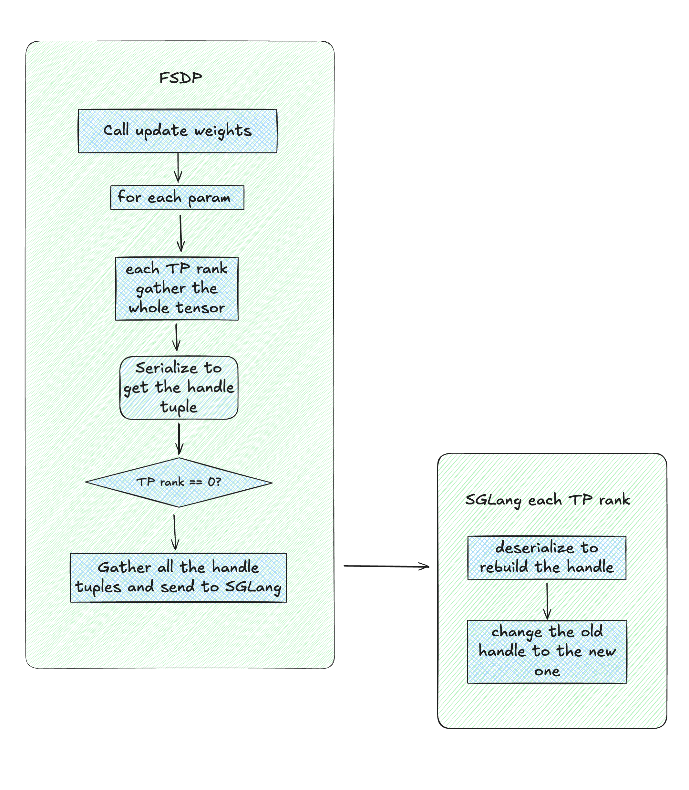

# RL 系统深思：深入理解权重更新机制

因为工作需要，最近终于得空能够再次深入去学习思考主流 RL 框架的系统设计。我们希望能够通过一系列文档分享我们的思考，也希望能够得到大家的反馈，和志同道合的朋友一同打造更好的开源 RLHF 框架。我们将这系列文章称为 RL 系统深思。本文是这系列的第一篇，重点讨论各类权重更新机制。本文首先分析 verl 这种 co-locate 策略下的权重更新方式，也是我自己第一次从头到尾理解了基于 handle tuple 重建 tensor 来实现的权重更新。接着，我们会剖析 slime 框架下的权重更新模式，重点分析其独出心裁的桶更新策略。最后，我们横向对比三种权重更新方式，浅浅分享我个人的一些想法，欢迎大家批评指正。

照理，感谢参与本文档讨论和撰写的所有朋友们：

zhuoran yin（CMU），changyi yang（CMU），ji li（蚂蚁），chengxi li（CMU），biao he（Linkedin），junrong lin（Qwen），Shan Yu（UCLA），Xinyuan Tong（chenyang 的小吗喽），chenyang zhao（Amazon）

排名按照微信群的成员顺序 😂

## verl 当中 co-locate 策略的权重更新

从逻辑上，在 co-locate 策略下的权重更新都是类似的，我们以 FSDP training backend 为例，给出一个简化而通用的更新流程，核心就是这样一个[代码片段](https://github.com/volcengine/verl/blob/0508af25b66e839772fba8e79d97896bf0d843d3/verl/workers/sharding_manager/fsdp_sglang.py#L160)：

```python
def _preprocess_tensor_for_update_weights(tensor: torch.Tensor):
    if isinstance(tensor, DTensor):
        return tensor.full_tensor()
    return tensor

async def update_weights(self, params):
    named_tensors = [(k, v) for k, v in params.items()]
    load_format = None
    for tensor_index, (name, tensor) in enumerate(named_tensors):
        serialized_tensor = MultiprocessingSerializer.serialize(_preprocess_tensor_for_update_weights(tensor))

        if self.device_mesh["infer_tp"].get_local_rank() == 0:
            gathered_serialized_tensors = [None for _ in range(self.device_mesh["infer_tp"].mesh.size()[0])]
        else:
            gathered_serialized_tensors = None
        dist.gather_object(
            obj=serialized_tensor,
            object_gather_list=gathered_serialized_tensors,
            dst=self.device_mesh["infer_tp"].mesh.tolist()[0],
            group=self.device_mesh["infer_tp"].get_group(),
        )

        if self.device_mesh["infer_tp"].get_local_rank() == 0:
            await self.inference_engine.update_weights_from_tensor(
                named_tensors=[
                    (
                        name,
                        LocalSerializedTensor(values=gathered_serialized_tensors),
                    )
                ],
                load_format=load_format,
                flush_cache=tensor_index == len(named_tensors) - 1,
            )
```

参数是逐个进行聚合并且更新的，更新完一个参数后 release 一个，然后继续循环。我们以单个参数为例。假设这个参数的 size 是 `[1024, 1024]`，FSDP 的 TP size 是 4，而 SGLang 的 TP size 是 2。因此在更新参数开始前， 每个 rank 上在 FSDP engine 内有 `[256, 1024]` 大小的 tensor，而 SGLang engine 有 `[512, 1024]` 大小的 tensor。

1. 权重导出：每个 rank 调用 `_preprocess_tensor_for_update_weights()` 将当前参数的完整 tensor 进行聚合，实际上把分散在各个 GPU 上的参数分片都聚合到了每个 rank 上，每个 rank 上都有一份当前参数的完整 tensor。此时，这个 parameter 会有三份，前两份是 FSDP 和 SGLang 本身就有的 `[512, 1024]` 和 `[256, 1024]`，第三份是为了聚合而单独开辟的 `[1024, 1024]` 大小的 tensor。
2. tensor 序列化：调用 `MultiprocessingSerializer.serialize()`，将每个 rank 上聚合到的参数序列化，得到序列化后的 handle tuple，称为 `serialized_tensor`。注意，虽然序列化传入的参数是聚合得到的那个 `[1024, 1024]` 的 tensor，但是实际上返回的只有被序列化的 handle tuple。handle tuple 近似于指向 tensor 实际存储的指针，存放了虚拟地址，stripe，size 等等信息，以及后续在 SGLang engine 侧重建 tensor 需要共享的 CUDA IPC handler。
3. 聚合 handle tuple 到 FSDP TP 0：虽然每个 rank 上都聚合了当前参数的完整 tensor，但是只有 tp 0 通过 `gather_object` 收集了所有 rank 的 handle tuple。
4. 跨进程传递：FSDP TP rank 0 将收集到的 handle tuple 列表打包为 `LocalSerializedTensor` 对象用于后续重建。接着，通过跨进程通信传递给 SGLang Engine。这里传递的只有序列化后的 handle tuple，而非实际数据。
5. SGLang Engine 重建 tensor：SGLang 的每个 TP rank 调用 `_unwrap_tensor()`，顺着 `LocalSerializedTensor.get -> MultiprocessingSerializer.deserialize` 向下调用，反序列化恢复了在 FSDP 侧聚合得到的完整 tensor 的 handle tuple。接着，构造新的 python tensor 对象，将刚刚恢复的 handle tuple 作为新的 Python tensor 对象的 handle tuple。新的 tensor 对象和 FSDP 侧聚合得到的完整 tensor 共享了 handle tuple，也共享了一切 meta data，必然指向了同一块显存，完成了所谓的 tensor 重建过程。
6. SGLang engine load weights：重建后的 tensor 传递给 `ModelRunner.load_weights`，将原本这个 parameter 的 tensor 更换为新的 tensor，完成整个参数更新过程。

由此以来，其实在任意一个 TP 上，只是临时创建了一个 `[1024, 1024]` 的 tensor，然后原本的 handler 被更换后，这个 `[1024, 1024]` 的 tensor 所不用的那一半会被 release 掉，原本 SGLang engine 里面的 handler 指向的旧的 tensor 会被释放掉，并没有显存泄露。


<div style="text-align: center;">
  
</div>

### 权重导出

权重导出和 handle tuple 序列化在同一行完成：

```python
def _preprocess_tensor_for_update_weights(tensor: torch.Tensor):
    if isinstance(tensor, DTensor):
        return tensor.full_tensor()
    return tensor

serialized_tensor = MultiprocessingSerializer.serialize(_preprocess_tensor_for_update_weights(tensor))
```

在将训练阶段结束后，首先使用 FSDP `state_dict` 导出权重。一般而言，`state_dict` 是一个 `param name -> tensor` 的 dict，而 FSDP 中的 `state_dict` 的值取决于 `StateDictType` 的模式。FSDP 内置了三种模式：`FULL_STATE_DICT`、`SHARDED_STATE_DICT` 以及 `LOCAL_STATE_DICT`。我们分别来看看这三种模式假设有一个 4-rank FSDP 训练，参数形状为 `[1024, 1024]`，每个 rank 负责 1/4 的参数：

1. `FULL_STATE_DICT`

```python
# 每个 rank 都得到完整的参数
{
    'layer1.weight': tensor([1024, 1024]),  # 完整张量，每个 rank 都相同
    'layer1.bias': tensor([1024]),          # 完整张量，每个 rank 都相同
    # ... 所有参数都是完整的
}
```

2. `LOCAL_STATE_DICT`  

```python
# 每个 rank 只得到自己负责的分片
{
    'layer1.weight': tensor([256, 1024]),  # 当前 rank 的分片 (1/4)
    'layer1.bias': tensor([256]),          # 当前 rank 的分片 (1/4)
    # ... 只有当前 rank 负责的参数分片
}
```

3. `SHARDED_STATE_DICT`

```python
# 每个 rank 得到包含元信息的分片对象
{
    'layer1.weight': ShardedTensor {
        metadata: {
            "world_size": 4,           # 总分片数
            "rank": 1,                 # 当前分片索引 (0-3)
            "shape": [1024, 1024],     # 完整张量的形状
            "dtype": torch.float16,    # 数据类型
        },
        local_shard: tensor([256, 1024]),  # 当前 rank 的分片数据
    },
    'layer1.bias': ShardedTensor {
        metadata: { "world_size": 4, "rank": 1, "shape": [1024], "dtype": torch.float16 },
        local_shard: tensor([256]),    # 当前 rank 的分片数据
    }
}
```

其中 `FULL_STATE_DICT` 是最朴素的实现方式。`LOCAL_STATE_DICT` 只保存当前 rank 所存储的部分，没有切片信息，而 `SHARDED_STATE_DICT` 在 `LOCAL_STATE_DICT` 基础上，额外存有当前 rank 负责的参数分片和切片信息。通过 `full_tensor()` 就可以将 `SHARDED_STATE_DICT` 状态下的 tensor 聚合起来：

```python
if isinstance(tensor, DTensor):
    return tensor.full_tensor()
```

### tensor 序列化

序列化由 `MultiprocessingSerializer.serialize` 完成，如同前文所说，序列化一个 tensor 实际上得到的返回值是序列化后的 handler，或者更严谨的说法是 handler tuple。我们来看看序列化最后层层向下调用的 `reduce_tensor()` 函数的返回值：

```python
 return (
            rebuild_cuda_tensor, # 重建函数
            (
                type(tensor), # tensor 类型
                tensor.size(), # tensor 大小
                tensor.stride(), # tensor 步长
                tensor_offset,  # tensor 在 storage 中的偏移量
                type(storage), # storage 类型
                tensor.dtype, # tensor 数据类型
                device, # tensor 设备
                handle,  # identifier which CUDA allocation is the storage in.
                storage_size_bytes,  # storage 大小
                storage_offset_bytes,  # storage 在 CUDA allocation 中的偏移量
                tensor.requires_grad, # tensor 是否需要梯度
                ref_counter_handle, # 引用计数器 handle
                ref_counter_offset, # 引用计数器偏移量
                event_handle, # 事件 handle
                event_sync_required, # 事件同步是否需要
            ),
        )
```

可见，对一个 CUDA Tensor 调用 `reduce_tensor`，实际上返回的是一个 Python Tuple，包含了重建 Tensor 所需的一切，而绝不包含实际存储的数据本身。接着，这个 handler tuple 通过进程间通信（比如 zmq）传递给接收方。接收方拿到的自然也不是数据本身，而是一组可以帮助重新找到（重建）这个 tensor 的 handler，我们在后文中会以 handler tuple 来指代。

### 聚合 handler

注意到，在聚合 tensor 并且序列化的过程中，从未指定不同 tp 的区别，可见对于当前正在更新的参数，每个 tp 上都会额外申请一片显存空间，聚合得到完整的 tensor，并且序列化得到其 handler tuple。考虑到单个参数并不大，这种做法仍旧安全。接着，每个 tp 都得到 handle tuple 后，将 handle tuple 也进行聚合：

```python
if self.device_mesh["infer_tp"].get_local_rank() == 0:
    gathered_serialized_tensors = [None for _ in range(self.device_mesh["infer_tp"].mesh.size()[0])]
else:
    gathered_serialized_tensors = None
dist.gather_object(
    obj=serialized_tensor,
    object_gather_list=gathered_serialized_tensors,
    dst=self.device_mesh["infer_tp"].mesh.tolist()[0],
    group=self.device_mesh["infer_tp"].get_group(),
)
```

这里使用 `dist.gather_object` 来聚合所有 TP rank 的 handler tuple。与 `all_gather` 不同，`gather_object` 是一个单向聚合操作：

- 所有 TP rank 都参与发送：每个 rank 都调用 `dist.gather_object` 发送自己的 `serialized_tensor`
- 只有目标 rank 接收：只有 `dst` 指定的 rank（这里是 TP rank 0）会接收到完整的 handler tuple 列表
- 其他 rank 不接收：非目标 rank 的 `gathered_serialized_tensors` 保持为 `None`

这样设计的好处是：后续只需要 TP rank 0 将收集到的所有 handler tuple 传递给 SGLang Engine，避免了每个 rank 都持有完整 handler tuple 列表的内存浪费。

### SGLang 完成 tensor 重建

下一步，将聚合好的 handler tuple  list 传递给 SGLang Engine，并且调用 `update_weights_from_tensor` 接口。

```python
if self.device_mesh["infer_tp"].get_local_rank() == 0:
    await self.inference_engine.update_weights_from_tensor(
        named_tensors=[
            (
                name,
                LocalSerializedTensor(values=gathered_serialized_tensors),
            )
        ],
        load_format=load_format, # 实际上传入的是 None
        flush_cache=tensor_index == len(named_tensors) - 1,
    )
```

接着，代码来到 SGLang 一侧，我们查看 [ModelRunner.update_weights_from_tensor](https://github.com/sgl-project/sglang/blob/392e441ad17c78b68638f2d959fcf592d19b4834/python/sglang/srt/model_executor/model_runner.py#L774) 的源码。注意到，对于 SGLang 而言，`ModelRunner` 是一个非常底层的类了，再往上是有 TpModelManger 的。也就是说，这个 `update_weights_from_tensor` 实际上是 SGLang 的每个 TP rank 都会调用。具体的 SGLang 架构可以参考此图：

<div style="text-align: center;">
  
</div>

我们还是回到主线上，研究下 SGLang 底层在每个 TP rank 上执行的 `update_weights_from_tensor` 接口：

```python
def update_weights_from_tensor(
    self,
    named_tensors: List[Tuple[str, Union[torch.Tensor, "LocalSerializedTensor"]]],
    load_format: Optional[str] = None,
):
    named_tensors = [
        (name, _unwrap_tensor(tensor, tp_rank=self.tp_rank))
        for name, tensor in named_tensors
    ]
    if load_format == "direct":
        _model_load_weights_direct(self.model, named_tensors)
    elif load_format in self.server_args.custom_weight_loader:
        custom_loader = dynamic_import(load_format)
        custom_loader(self.model, named_tensors)
    elif load_format is None:
        self.model.load_weights(named_tensors)
    else:
        raise NotImplementedError(f"Unknown load_format={load_format}")
    return True, "Success"


def _unwrap_tensor(tensor, tp_rank):
    if isinstance(tensor, LocalSerializedTensor):
        monkey_patch_torch_reductions()
        tensor = tensor.get(tp_rank)
    return tensor.to(torch.cuda.current_device())


@dataclass
class LocalSerializedTensor:
    """torch.Tensor that gets serialized by MultiprocessingSerializer (which only serializes a pointer and not the data).
    The i-th element in the list corresponds to i-th rank's GPU."""

    values: List[bytes]

    def get(self, rank: int):
        return MultiprocessingSerializer.deserialize(self.values[rank])
```

每个 tp rank 调用 `_unwrap_tensor` 接口，在 `tensor.get(tp_rank)` 一步中，顺着 `LocalSerializedTensor.get -> MultiprocessingSerializer.deserialize` 向下调用，反序列化恢复了在 FSDP 侧聚合得到的完整 tensor 的 handler tuple。接着，构造新的 python tensor 对象，将刚刚恢复的 handler tuple 作为新的 Python tensor 对象的 handle tuple。这样一来，通过共享 handle 的机制，新的 tensor 对象和 FSDP 侧聚合得到的完整 tensor 共享了一切 meta data，自然也指向了同一块显存，完成了所谓的 tensor 重建过程。重建结束后，这个新的 tensor 对象被传递给 `ModelRunner.load_weights`，在 SGLang 底层把原本的 tensor 更换掉即可。

## slime 中的权重同步策略

有了前文对 `update_weights_from_tensor` 的理解，我们进一步分析 slime 在 co-locate 策略下的权重同步策略。slime 是一套同时支持 dis-aggregate 和 co-locate 策略的轻量级框架。在技术选型上，slime 选择了 Ray 作为通信框架，Training Backend 选择 Megatron，Rollout Backend 选择 SGLang。出于设计和技术选型的精简，整个 slime 的代码非常清爽。我们后续会有更多分享。这里先顺着上文继续分享 slime 在 co-locate 策略下的权重同步策略。

在 co-locate 策略下，rollout engine 和 training engine 需要不断 offload 与 upload，来互相让出显存。SGLang 通过 torch memory savor 进行 offload 管理，而 Megatron 通过 CuMemAllocator 进行 offload 管理。从逻辑上，Rollout 结束后，通过 mem savor 直接 release 掉物理占用，然后启动 megatron 进行训练。训练结束后，将 megatron 的 model weights 和 optimizer 全都 offload 到 CPU 上，然后将 SGLang 的 model weights 还有 KV cache upload 到 GPU 上。

这时候就很有意思了。为了接下来的参数更新，slime 会分桶将 megatron 的 model weights upload 到 GPU 上，然后和 verl 中的操作类似，聚合得到完整的 tensor，然后序列化得到 handle tuple，然后传递 handle tuple 给 rollout engine，调用 `update_weights_from_tensor` 接口完成参数更新。

有一个问题非常值得分享：为什么 slime 需要先将 megatron 的 model weights offload 掉再 upload 上来，直接保留在 GPU 上不行吗？

答案在于 slime 对权重更新的处理更为精细。具体来说，为了避免超大规模 MOE model 直接整个 model weights upload 到 GPU 上和 SGLang 并存导致 OOM，slime 对 params 进行了分桶更新。每次只更新桶内的一小部分参数。如果采用和 verl 类似的方法，将整个 FSDP 的参数保留在 GPU 上，对于非常大的模型，除非 tp 开的很大，还是很容易 OOM 的。在此基础上，我们可以发现，slime 的 update weights 阶段其实显存占用几乎只有 SGLang 的 CUDA Graph，model weights 和 KV cache，megatron upload 上来的参数占用显存很少。所以理论上 slime 不需要我们在 verl 里面做的那套复杂的 [mutli-stage wake up](https://hebiao064.github.io/rl-memory-management) 机制，也可以设置 SGLang 的 mem static fraction 在一个很高的水平。不过可惜，由于 megatron 的 offload 没有那么完美，目前的 mem static 还有改进空间。我们 LMSYS 也在和 slime 团队通力合作，展开优化。

好了，有了这些基础，我们来速览 slime 在 co-locate 策略下具体的权重更新：

1. 建立通讯组：为了在更新权重时能够聚合 handle tuple，在启动 slime 时就会建立一个包含所有 rollout engine 和 training engine 的 process group，也即 `_ipc_gather_group`，并设定通信后端为 `nccl`。
2. 清空 kv cache: rollout engine 更新参数后，所有先前的 kv cache 无法继续使用。故而在 rollout engine 更新参数前，先向所有 rollout engine 发送 flush cache 来清除 radix tree，确保旧的 kv cache 不影响新一轮的 rollout。
3. 权重聚合: 构造分桶，然后将桶内的 megatron model weights 从 CPU upload 到 GPU。接着，先在 PP/EP 组内做 `broadcast`，在 PP/EP 维度保证每个 rank 拥有完整参数，再通过 `dist.all_gather` + `torch.cat` 完成 TP 层面的聚合，得到完整的 tensor。verl 主要是维护只有 TP 层面的参数，可以通过 `full_tensor` 直接将这一维度的 `DTensor` 聚合成 tensor。在 slime 中，存在不同切分方式的多维度并行，所以不能简单地用 `full_tensor`，需要手动聚合。
4. tensor 序列化并聚合 handle tuple: 与 verl 一样，使用 `MultiprocessingSerializer.serialize` 进行序列化，得到 handle tuple；接着，通过 `dist.gather()` 完成 handle tuple 的聚合。
5. 传递 handler tuples 并重建参数完成更新: 这里和前文非常类似了，将聚合的 handler tuple 传递给 SGLang Engines，然后在 SGLang 侧反序列化，重建参数，然后调用 `ModelRunner.load_weights` 完成参数更新。

以下列举一些相关代码便于理解：

<details>
<summary>slime 权重更新代码</summary>

```python
def update_weights_from_tensor(self):
    pp_size = mpu.get_pipeline_model_parallel_world_size()
    ep_size = mpu.get_expert_model_parallel_world_size()
    rank = dist.get_rank()
    if rank == 0:
        ray.get([engine.reset_prefix_cache.remote() for engine in self.rollout_engines])
    dist.barrier()
    for param_infos in self.param_info_buckets:
        # init params:
        params = []
        for info in param_infos:
            if dist.get_rank() == info.src_rank:
                params.append(
                    torch.nn.Parameter(self.params_dict[info.name].to(device=torch.cuda.current_device()))
                )
            else:
                params.append(torch.empty(info.shape, dtype=info.dtype, device=torch.cuda.current_device()))

        # broadcast params across pp ranks
        if pp_size > 1:
            handles = []
            for info, param in zip(param_infos, params):
                if info.src_rank in dist.get_process_group_ranks(mpu.get_pipeline_model_parallel_group()):
                    handles.append(
                        torch.distributed.broadcast(
                            param, src=info.src_rank, group=mpu.get_pipeline_model_parallel_group(), async_op=True
                        )
                    )
            for handle in handles:
                handle.wait()

        # broadcast params across ep ranks
        if ep_size > 1:
            handles = []
            for info, param in zip(param_infos, params):
                if ".experts." in info.name:
                    src_rank = (
                        info.src_rank
                        if info.src_rank in dist.get_process_group_ranks(mpu.get_expert_model_parallel_group())
                        else rank
                    )
                    handles.append(
                        torch.distributed.broadcast(
                            param, src=src_rank, group=mpu.get_expert_model_parallel_group(), async_op=True
                        )
                    )
            for handle in handles:
                handle.wait()

        converted_named_tensors = []
        for info, param in zip(param_infos, params):
            # set tp attrs
            for key, value in info.attrs.items():
                setattr(param, key, value)
            # gather param
            param = update_weight_utils.all_gather_param(info.name, param)
            param = update_weight_utils.remove_padding(info.name, param, self.vocab_size)
            converted_named_tensors.extend(
                update_weight_utils.convert_to_hf(
                    self.args, self.model_name, info.name, param, self.quantization_config
                )
            )
        self._update_converted_params_from_tensor(converted_named_tensors)
        
def all_gather_param(name, param):
    if "expert_bias" in name:
        return param

    assert hasattr(param, "tensor_model_parallel"), f"{name} does not have tensor_model_parallel attribute"
    if not param.tensor_model_parallel:
        # if mpu.get_tensor_model_parallel_world_size() == 1:
        return param.data

    if ".experts." in name:
        tp_size = mpu.get_expert_tensor_parallel_world_size()
        tp_group = mpu.get_expert_tensor_parallel_group()
    else:
        tp_size = mpu.get_tensor_model_parallel_world_size()
        tp_group = mpu.get_tensor_model_parallel_group()

    param_partitions = [torch.empty_like(param.data) for _ in range(tp_size)]
    dist.all_gather(param_partitions, param.data, group=tp_group)
    partition_dim = param.partition_dim
    assert param.partition_stride == 1, "partition_stride != 1 is not supported"
    # TODO: here we did an extra copy during concat, maybe merge this with convert_to_hf is better?
    # TODO: check only GLU is used.
    if "linear_fc1.weight" in name:
        param_partitions = [p.chunk(2, dim=0) for p in param_partitions]
        param_partitions = [p[0] for p in param_partitions] + [p[1] for p in param_partitions]
    # this is bug in megatron's grouped moe.
    if "linear_fc2.weight" in name:
        if partition_dim == 0:
            partition_dim = 1
    param = torch.cat(param_partitions, dim=partition_dim)
    return param

def _update_converted_params_from_tensor(self, converted_named_tensors):
    ipc_handle = MultiprocessingSerializer.serialize(converted_named_tensors, output_str=True)
    ipc_handles = (
        [None] * dist.get_world_size(self._ipc_gather_group) if self._ipc_gather_src == dist.get_rank() else None
    )
    dist.gather_object(
        ipc_handle,
        object_gather_list=ipc_handles,
        dst=self._ipc_gather_src,
        group=self._ipc_gather_group,
    )

    if dist.get_rank() == self._ipc_gather_src:
        ref = self._ipc_engine.update_weights_from_tensor.remote(
            ipc_handles=ipc_handles,
        )
        ray.get(ref)

    converted_named_tensors.clear()
    torch.cuda.empty_cache()
```

</details>

## 三种权重更新方式的对比

最后，我们对比三种权重更新方式。知易行难，我个人的 RL 系统开发就是从权重更新接口开始的。RL 系统无非就是需要把 inference engine 接进去，每次做一系列推理，然后训练完了更新权重就行了；可是其中的心酸滋味，自然只有真的打磨过，才能体会。我在这里梳理三种权重更新的接口，本质上也是在梳理两种：

1. `update_weights_from_disk`：这是最简单的接口，在保证 engine 运行的情况下，直接从磁盘读取权重，然后层层向下调用 `ModelRunner.load_weights` 接口更新权重。实际使用上，在 RL 过程中每次完成 target policy 的更新，将 target policy 存下来，然后再调用 `update_weights_from_disk` 接口更新即可。听上去效率不高，毕竟要将权重写入下层存储，然后再读取上来，整体速度由下层存储的 I/O 效率决定。然而，倘若下层存储的读写速度足够快，或者 SGLang Engine 能够高效并行地去读取磁盘，未必这是个不能采用的方案。此外，在写入下层存储的时候，顺带也完成了 checkpoint 的写入。用其他的接口来更新权重，checkpoint 的管理还需要有另一套异步逻辑。最后，我认为 `update_weights_from_disk` 是最能够满足 rollout 动态扩缩容需求的接口。倘若在训练过程中，发现 Rollout 慢的出奇，使用 `update_weights_from_distributed` 方案的话，为了进行扩缩容，得先将已有的通讯组暂停，然后加入新的 Rollout Engine，重新建立通讯组，这个过程的工程复杂程度可想而知。如果使用 `update_weights_from_disk` 接口，直接在 Rollout Engine 上层的 DP router 上加入一个新的 Rollout Engine，然后所有 Rollout Engine 从同一个 checkpoint 上读取权重用于更新即可。`update_weights_from_disk` 在 co-locate 和 disaggregate 策略下都能使用，但是支持 co-locate 策略的框架基本都采用了 `update_weights_from_tensor`。在主流框架中，AReaL 选择了 `update_weights_from_disk`。


2. `update_weights_from_distributed`：这是我实现的接口，在逻辑上和 `update_weights_from_tensor` 类似，但是 from distributed 是通过 nccl 或者 IB 在不同资源组之间通讯，只能用于 disaggregated 策略。具体来说，在 Training Engine 和 Rollout Engine 分离放置在两个不同的资源组的时，将二者建立一个统一的通讯组。每次 training engine 更新完权重后，将分离的权重逐个 parameter 聚合在 Training Engine 的 TP 0 上，然后从 Training Engine 的 TP 0 传递到 Rollout Engine 的每个 TP 上。Rollout Engine 的每个 TP 再自己 shard 取出需要的部分，然后参数 load 了即可。

3. `update_weights_from_tensor`：其实和 `update_weights_from_distributed` 类似，逻辑上都要走一次聚合，但是如同我们前文的分析，`update_weights_from_tensor` 是只做 handle tuple 序列化传递，不传递实际数据的。from tensor 主要的麻烦是 co-locate 策略常常为了 rollout engine 的严苛 SPMD，对 rollout engine 的侵入性很强。在 MOE 上的很多优化都没法启用，比如经典的 DeepSeek DP Attention，而这在 dis-aggregate 策略下是天然支持的。
