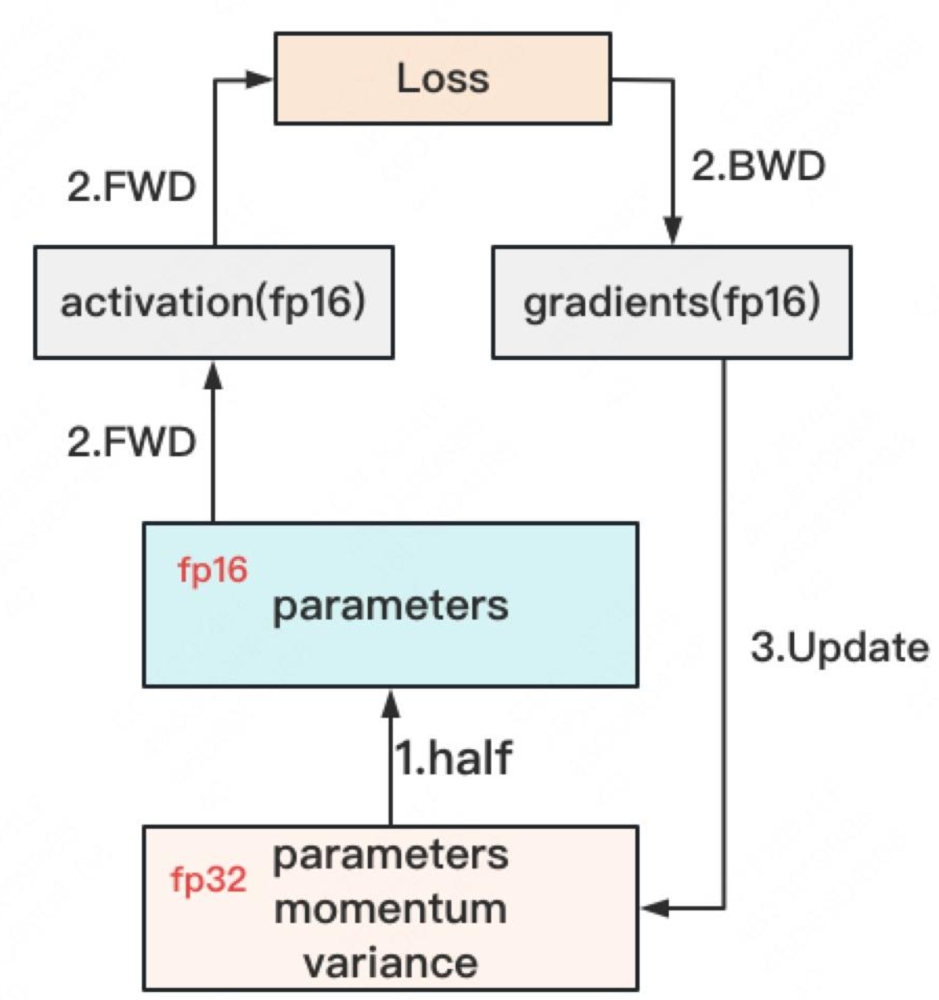

# RL System Deep Dive: FSDP Training Backend

Readers familiar with this series will know that most of our articles focus on the RL system's rollout engine, with less discussion on the training backend. This article will provide a brief analysis of the popular DeepSpeed AutoTP, FSDP, and Megatron-LM training backends. While torchtitan was also a highly anticipated training backend, I've heard that its author has left and it's no longer maintained, so I won't discuss it here. This article will focus solely on the principles and implementation of FSDP, as well as an analysis of verl's FSDP usage.

**Acknowledge:**

Qiujiang Chen (SUSTech), Zhuoran Yin & Changyi Yang (CMU), Chenyang Zhao (Amazon), and the original articles by Mengyuan.

## DP, DDP, and DeepSpeed Zero

Mengyuan's articles, [Data Parallelism Part 1](https://zhuanlan.zhihu.com/p/617133971) and [Data Parallelism Part 2](https://zhuanlan.zhihu.com/p/618865052), explain this section very clearly. I highly recommend reading the originals, as I learned a great deal from them.

Here, I'll summarize some points from [Data Parallelism Part 1](https://zhuanlan.zhihu.com/p/617133971) that particularly resonated with me:

1.  The most naive DP can be optimized asynchronously: workers don't need to wait for the weights server to fully transmit the weights. Instead, a portion of workers can be updated at a time, while others continue to compute gradients using older parameters.

2.  **Communication volume of all-reduce, reduce-scatter, and all-gather:** This was the most insightful part for me. First, all-reduce, when implemented in a ring fashion, can actually be divided into two phases: reduce-scatter and all-gather. These two phases are extensively used in the three stages of DeepSpeed. The original article's diagrams clearly illustrate the desired effect of reduce-scatter and all-gather, starting from each worker having a complete list that needs to be aggregated, as well as the specific communication volume. We can approximate the communication volume for both steps as $\\phi$, where $\\phi$ is the size of the list that needs to be aggregated on each worker. Often, articles discussing communication volume will specify the storage size occupied by the communication, but here we are only discussing the amount of data.

Next, from the second article, [Data Parallelism Part 2](https://zhuanlan.zhihu.com/p/618865052):

1.  Mixed-precision training with master and replica weights often follows this process:

<div style="text-align: center;">
  
</div>

When referring to **optimizer states**, some people include the fp32 master model weights, while others only consider the fp32 momentum and variance. However, these three parts clearly occupy significant GPU memory. For a model of size X B, these three parts will consume 12X of GPU memory.

Furthermore, the **FP16 model weights** (the blue part in the image above) are always cast from the master weights; they are never directly updated using fp16 gradients.

Finally, **activations** are a relatively large variable and generally not considered in GPU memory calculations. This is because activation memory consumption depends not only on model size but also on batch size. Additionally, activations do not need to be stored and can be recomputed during the backward pass.

2.  Although **KV cache** is central to inference, we rarely consider it during training:

- The essence of LLM training is to update model weights through backpropagation and gradient descent. This means we need to compute the gradient of the loss function with respect to every parameter in the model. Introducing a KV cache makes the computation graph of the Attention mechanism much more complex. The optimizer would need to track which K and V values were read from the cache, which were currently computed, and how they combined to affect subsequent computations. This would make the implementation of the chain rule extremely complex, as it would need to ensure that gradients correctly trace back to the original source of all participating K and V values, whether they were cached or newly computed.
- Introducing a KV cache would introduce additional, obviously significant, GPU memory overhead.
- The KV cache becomes completely invalidated every time the model's parameters are updated.

3.  **Three stages of Zero:**

With the background of mixed-precision training, we can now outline the three stages of Zero. I really appreciate the narrative logic in Mengyuan's original article, but I also provided her with some feedback and caught a few bugs. The most critical issue is that the model weights relied upon during forward and backward passes are always cast from the master parameters stored within the optimizer; they are never directly updated with gradients. The optimizations corresponding to the three Zero stages can be summarized as:

1.  **Stage 1:** Shards the entire **optimizer** (optimizer states and fp32 master weights), retaining only the gradients and fp16 replica parameters. The benefits are obvious: the entire optimizer, stored in fp32, is the most memory-consuming part. After sharding, in each training iteration, after a normal forward pass to get the loss and a backward pass to get the gradients, assuming there are N DP workers and the model has X parameters; the optimizer only stores 1/N of the parameters and the optimizer states required to update these parameters. Therefore, the **gradients** only need a single **reduce-scatter** to get the gradients needed to update their own 1/N parameters. In contrast, with DDP, gradients require an all-reduce. Thus, Stage 1 actually saves a significant amount of communication volume for gradients, approximating X. After the optimizer updates the master weights, it casts them down to the fp16 replica weights it manages, and an **all-gather** can then retrieve the entire fp16 replica weights.

2.  **Stage 2:** Shards the **optimizer and gradients**. After forward and backward passes, full gradients are obtained. Each DP worker only manages 1/N of the gradients, so another **reduce-scatter** is performed, and the excess gradients are discarded. The remaining part is consistent with Stage 1. Analyzing it this way, even the communication volume is consistent. This makes DeepSpeed Stage 2 sound like a perfect design, not only reducing memory compared to Stage 1 but also without increasing communication volume. However, the situation changes when gradient accumulation is enabled. To store the gradients that need to be accumulated in each round, a **reduce-scatter** must be performed on the gradients on all DP workers after each backward pass to accumulate the portion of gradients they manage, and then discard the rest. If gradients not managed by oneself are directly discarded, gradient accumulation cannot be completed. Therefore, the communication volume in Stage 2, when gradient accumulation is enabled, is actually greater than in Stage 1.

3.  **Stage 3:** Further shards all parts completely, including the **optimizer, gradients, and fp16 replica weights**. In this case, during the forward pass, the replica weights need to be **all-gathered**. During the backward pass, weights also need to be **all-gathered**, and after obtaining the complete gradients, a **reduce-scatter** is performed to keep the locally managed gradients. After these gradients update the locally managed optimizer, the master weights are cast down to fp16 replica weights. The communication volume further increases compared to Stage 2.

In summary, Zero is a typical example of trading communication for memory, and as the stages increase, the communication volume grows. Furthermore, although Zero also splits model weights, we can see that during forward and backward passes, the dependent model weights need to be fully aggregated through **all-gather** before computation can proceed. So, this is still a DP approach. In contrast, TP directly performs the forward pass and then aggregates partial activations. This is also where the name FSDP, **Fully Sharded Data Parallel**, comes from.

## Zero and FSDP

FSDP heavily inherits the philosophy of Zero, but it is more aggressive than Zero, defaulting to a Stage 3 strategy where all sharding possibilities are exploited.

1.  **Layer-wise** or even **parameter group-wise** sharding.
2.  **Activate on demand:** During the forward pass, when a certain layer needs to be computed, it only all-gathers the parameters for that layer. Once the computation is complete, that layer is discarded. A similar process occurs during the backward pass. This differs from Zero Stage 3, which all-gathers the complete FP16 weights every time.
3.  During the backward pass, FSDP, once the gradients for a specific layer are computed, immediately performs a **reduce-scatter** operation to synchronize and accumulate these sharded gradients, rather than waiting for all gradients to be computed before a global reduce-scatter.
4.  **Activation Checkpointing:** While not exclusive to FSDP, FSDP is often used in conjunction with activation checkpointing (`torch.utils.checkpoint`). Activation checkpointing saves memory by recomputing activations during the backward pass instead of storing them during the forward pass.

Finally, FSDP is a PyTorch native feature, and from what I know, there are fewer complaints about it compared to DeepSpeed.

## FSDP1 vs. FSDP2

Let's examine the limitations of FSDP1 with an example: assume a Layer containing 3 `Linear` layers, sharded across 2 GPUs using FSDP.

In FSDP1, each module is represented as a single `FlatParameter`. This `FlatParameter` is a massive one-dimensional tensor containing a flattened representation of all parameters in that module, and then this flattened tensor is sharded across different ranks.

<div style="text-align: center;">
  
</div>

This design leads to a significant problem: when all parameters are merged into one huge `FlatParameter`, some metadata cannot be managed effectively. Since `FlatParameter` is a single, homogeneous object, retaining independent metadata for each original parameter requires complex and cumbersome methods. To optimize this situation, compared to FSDP1, FSDP2 introduces `DTensor` (Distributed Tensor) for parameter management. `DTensor` is a distributed version of `torch.Tensor` that supports sharding along specified dimensions across multiple ranks and natively carries all metadata about the original tensor, such as its `dtype`, `requires_grad`, specific sharding method, and `placement types`.

As shown below, in FSDP2, the parameters of each `Linear` layer are individually represented as a `DTensor` and sharded across two GPUs along dimension 0:

<div style="text-align: center;">
  
</div>

This **per-parameter sharding** approach is more intuitive and efficient. It avoids the cumbersome process in FSDP1 where parameters are first flattened, concatenated into a large tensor, then globally sharded, and finally require inferring which fragments each process holds and how to reconstruct the original structure.

In addition, FSDP2 further improves usability, scalability, and functionality while maintaining comparable throughput to FSDP1:

1.  **Simplified Implementation:** Parameters are converted to independent `DTensor`s. This design eliminates the complex logic in FSDP1 of flattening all parameters into a large `FlatParameter`, avoiding parameter concatenation and managing internal offsets.
2.  **Native Support for Partial Parameter Freezing:** FSDP2's native support for `DTensor`s allows fine-tuning methods like LoRA to work out-of-the-box, without requiring additional complex wrappers or modifications.
3.  **Optimized Checkpoint Management:** It defaults to using `SHARDED_STATE_DICT` for storing checkpoints, where each rank only saves a portion of the model parameters and metadata. It also supports directly reading sharded `state_dict`s for model loading. Therefore, when storing checkpoints, there's no need to all-gather first, which improves storage efficiency. Additionally, FSDP2 supports asynchronous checkpoint saving, where parameters are first copied to the CPU, allowing the main training thread to continue running while read/write processes write data to disk, reducing I/O blocking.
4.  **Stable Memory Management:** FSDP2 no longer relies on `torch.Tensor.record_stream`, a mechanism that sometimes led to non-deterministic behavior. Instead, it achieves stable and predictable memory behavior through lower-level CUDA multi-stream synchronization. This improvement reduces training interruptions or performance fluctuations caused by memory management issues, thereby indirectly increasing the total effective training time.
5.  **Overlap of Communication and Computation:** FSDP2 defaults to using the `BACKWARD_PRE` option, which needed manual configuration in FSDP1, and provides implicit prefetching to better overlap all-gather communication and computation. This optimization more effectively hides communication latency, improves GPU utilization, and thus theoretically increases training throughput.
6.  **Better Compatibility:** FSDP2 has higher compatibility with mixed precision types like FP8 and 2D/3D parallelism strategies.

## FSDP's Theoretical Peak and Initialization

This section is based on the [FSDP original paper](https://arxiv.org/pdf/2304.11277) and discusses the case of Stage 3 FSDP1.

<div style="text-align: center;">
  
</div>

First, FSDP divides parameters into many **units**. For example, in MHA, an attention layer and an FFN layer typically form a Transformer block and can be treated as a unit. A unit is the smallest granularity unit for FSDP to manage parameters.

During forward and backward propagation, FSDP only materializes/gathers the parameters and gradients of a single unit. Apart from this unit, all other parameters and gradients remain sharded. Once the computation is complete, they are immediately discarded (de-materialized). Therefore, the peak memory on a single GPU for FSDP can be calculated as:

```python
GPU Peak Memory = ShardModelSize + ShardOptimizerSize + ShardGradientSize + MAX(fullyMaterializedFSDPUnit)
```

When initializing a model with DDP, PyTorch fully instantiates (materializes) the entire model on a single GPU, allocating all parameters in memory at once. However, for FSDP, this one-time full loading approach is not feasible because the entire model may not fit into the memory of a single GPU. FSDP solves this problem through **Deferred Initialization**. FSDP first initializes all tensors on a special "fake device." In this stage, tensors do not allocate any actual physical storage. Instead, the system only records the construction logic of each tensor and the operations involved (e.g., tensor shape, data type, initialization method, etc.). Only when the tensor is explicitly moved to the GPU will the previously recorded construction operations be replayed, beginning to allocate physical memory and completing its true construction and numerical initialization. Furthermore, to maximize memory savings, each GPU only needs to initialize the portion of parameter shards it is locally responsible for. However, since model initialization functions can contain complex logic and it's impossible to precisely determine if the user has dependencies on unsharded tensors (which might lead to needing to temporarily aggregate some parameters during the initialization phase), FSDP's actual strategy is:

1.  **Fake Init:** The model is constructed on a fake device, only recording the construction logic of all tensors, without allocating physical memory. It is then divided into multiple FSDP units.
2.  **Materialize Single Unit:** Each time a unit is moved to the actual GPU, the construction logic of all tensors within this unit is replayed, thus fully instantiating the complete parameters of this unit.
3.  **Shard Single Unit:** Immediately afterward, this instantiated unit is sharded, distributing its parameters to different GPUs.

The above strategies might fail when there are dependencies between different FSDP units, in which case tensors cannot be correctly constructed through replay. FSDP provides two alternative strategies:

1.  **Initialize unsharded model directly on a single GPU:** Although the model might not be trainable on a single card, it might be possible to initialize it on a single card. Therefore, the model can be initialized on a single card before sharding.
2.  **Initialize unsharded model on the CPU:** Because CPU memory is often much larger than GPU memory. Afterward, each unit is transferred to a single GPU unit by unit, and then sharding is performed. However, initializing the model can become very time-consuming.

## FSDP in verl

verl uses FSDP1 by default and supports FSDP2 very smoothly, requiring only the following settings:

```bash
actor_rollout_ref.ref.strategy=fsdp2
actor_rollout_ref.actor.strategy=fsdp2
critic.strategy=fsdp2
reward_model.strategy=fsdp2
```

Additionally, FSDP2's CPU offloading is compatible with gradient accumulation. It can be enabled by setting `actor_rollout_ref.actor.fsdp_config.offload_policy=True`.

Here's a specific implementation example from verl, the code can be found in [fsdp\_workers.py](https://github.com/volcengine/verl/blob/ab11fff33dcaa2409e388ce2f19aff440a5b703f/verl/workers/fsdp_workers.py#L377):

For FSDP1, it directly calls `torch.distributed.fsdp.FullyShardedDataParallel` to wrap the `actor_module` (a loaded Hugging Face model), returning a new FSDP object to manage distributed training. It also supports fine-grained configuration of FSDP1, such as `cpu_offload`, `auto_wrap_policy`, `sharding_strategy` (defaults to Zero3), `mixed_precision`, and `forward_prefetch`. Furthermore, for the reference policy, CPU offload is forced to save memory; however, for the actor, offload is forced off as enabling it can lead to incorrect gradient accumulation results and timing issues with the synchronization mechanism.

```python
from torch.distributed.fsdp import FullyShardedDataParallel as FSDP

# We force reference policy to use CPUOffload to save memory.
# We force turn off CPUOffload for actor because it causes incorrect results when using grad accumulation
cpu_offload = None if role == "actor" else CPUOffload(offload_params=True)
fsdp_strategy = self.config.actor.strategy
if fsdp_strategy == "fsdp":
    actor_module_fsdp = FSDP(
        actor_module,
        cpu_offload=cpu_offload,
        param_init_fn=init_fn,
        use_orig_params=False,
        auto_wrap_policy=auto_wrap_policy,
        device_id=get_device_id(),
        sharding_strategy=sharding_strategy,  # zero3
        mixed_precision=mixed_precision,
        sync_module_states=True,
        device_mesh=self.device_mesh,
        forward_prefetch=self.config.actor.fsdp_config.forward_prefetch,
    )
```

FSDP2's implementation appears more complex than FSDP1:

1.  **In-place Modification:** FSDP2 no longer creates a new wrapper object; instead, it directly modifies the original `actor_module` through `apply_fsdp2`. After the `apply_fsdp2` call, the internal parameters of `actor_module` have already become DTensors and have been sharded according to the FSDP2 strategy.
2.  Since `apply_fsdp2` changes the sharding method of parameters, a specific process is required to load weights. First, the complete `state_dict` of the original model is saved (`full_state = actor_module.state_dict()`). Next, `apply_fsdp2` is used to modify `actor_module` in-place, making its parameters DTensors and sharded. At this point, the parameter structure of `actor_module` has changed, but the parameter values have not yet been correctly loaded. Finally, the `fsdp2_load_full_state_dict` function is used to load the previously saved `full_state` back into the `actor_module` that has been processed by FSDP2.
3.  **CPU Offload Compatibility with Gradient Accumulation:** Unlike FSDP1, by setting `fsdp_config.offload_policy=True`, FSDP2 allows the actor model to safely enable CPU Offload without affecting the correctness of gradient accumulation. This resolves the timing issues present in FSDP1, making FSDP2 more advantageous in memory-constrained scenarios that require gradient accumulation.

```python
from verl.utils.fsdp_utils import apply_fsdp2, fsdp2_load_full_state_dict

elif fsdp_strategy == "fsdp2":
    assert CPUOffloadPolicy is not None, "PyTorch version >= 2.4 is required for using fully_shard API (FSDP2)"
    mp_policy = MixedPrecisionPolicy(
        param_dtype=param_dtype, reduce_dtype=reduce_dtype, cast_forward_inputs=True
    )
    if role == "actor" and fsdp_config.offload_policy:
        cpu_offload = CPUOffloadPolicy(pin_memory=True)
        self._is_offload_param = False
        self._is_offload_optimizer = False
    else:
        cpu_offload = None if role == "actor" else CPUOffloadPolicy(pin_memory=True)

    fsdp_kwargs = {
        "mesh": fsdp_mesh,
        "mp_policy": mp_policy,
        "offload_policy": cpu_offload,
        "reshard_after_forward": fsdp_config.reshard_after_forward,
    }
    full_state = actor_module.state_dict()
    apply_fsdp2(actor_module, fsdp_kwargs, fsdp_config)
    fsdp2_load_full_state_dict(actor_module, full_state, fsdp_mesh, cpu_offload)
    actor_module_fsdp = actor_module
```
