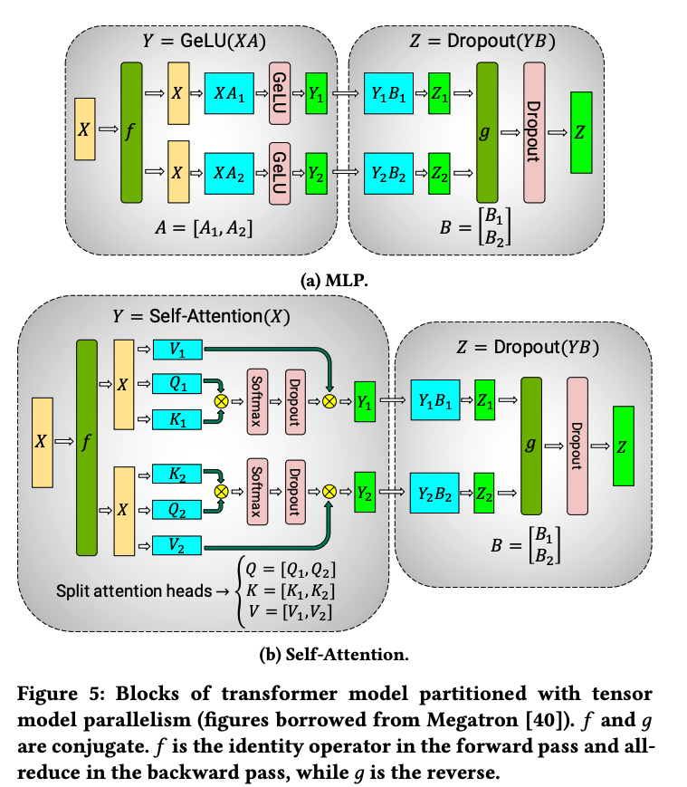
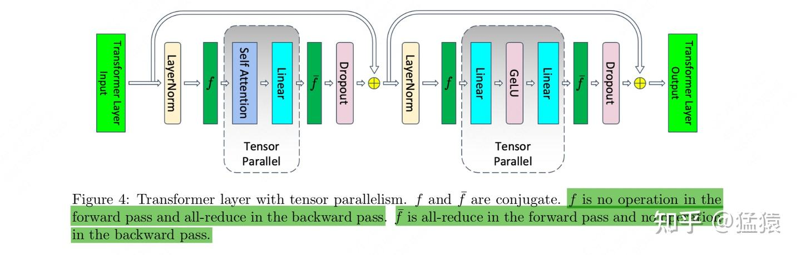
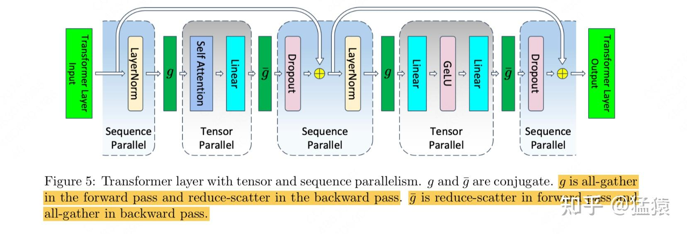
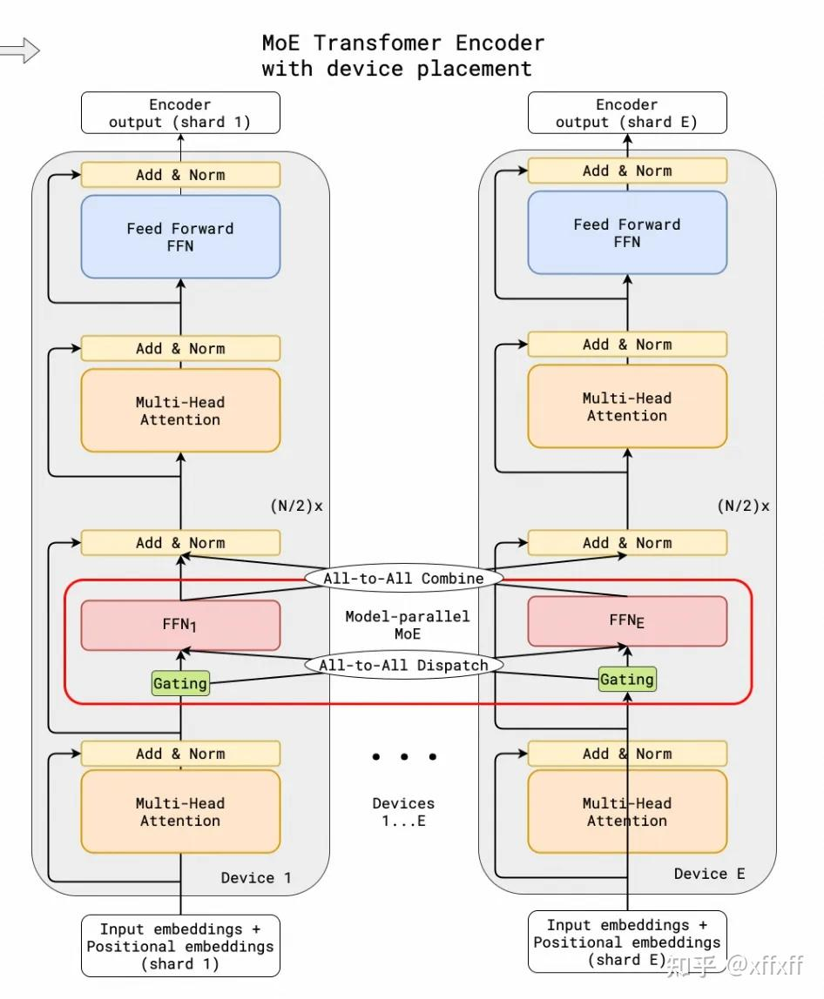
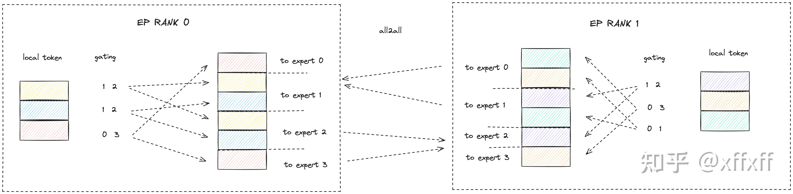

# Megatron

> 人人都恐惧他，但是没人能离开他。——《The Godfather》

人如其名，Megatron 犹如威震天一样，力量惊人但又难以驾驭。没人能逃出 Megatron 的五指山，在本文中，我们对 Megatron 的基本特性浅尝辄止，重点分析 Megatron 在 RL 框架中的使用。

历史上的 Megatron 由三篇文章构成，讲述了 Megatron 发展的三个阶段分别的重要 feature。然而，Megatron 的 feature 相比这些论文所讲述的自然早已丰富了许多，就连 Megatron 都演化出了若干多版本：Megatron，Megatron—Core，M—Bridge 以及 Nemotron。

- [Tensor parallelism](https://arxiv.org/pdf/1909.08053)
- [3D 并行](https://arxiv.org/pdf/2104.04473)
- [activation recomputation](https://arxiv.org/pdf/2205.05198)

我们来介绍一些 Megatron 的重要特性。

## 3D 并行

Megatron 为了支持在数千 GPU 上的巨大规模训练，实现了 3D 并行的融合：

1. Tensor Parallelism（TP）


2. Pipeline Parallelism（PP）

将模型的不同层切分为多个 stage，每个 GPU 或 GPU group 负责一部分层，借助流水线调度执行多个 micro-batch，提升计算利用率。使用 `--pipeline-model-parallel-size` 配置，同时可启用 interleaved virtual pipeline（交替虚拟流水线）进一步提升 overlap 能力。

3. Data Parallelism（DP）

在多个 worker 上复制模型副本、分发不同样本，通过 gradient all-reduce 同步梯度。Megatron 的 DP 也支持 ZeRO-like distributed optimizer，使用 `--use-distributed-optimizer`、`--overlap-grad-reduce` 等控制是否采用 ZeRO。

## Megatron-Core

在 Megatron-LM 的基础上，NVIDIA 推出了 Megatron-Core。和 trt-llm 一样，Megatron-Core 拥有最强的性能和广为诟病的易用性。在实际经验上，100B 以下的 dense 模型，FSDP 仍旧能打；而 100B 以上模型以及 MOE，Megatron 是独一份的。从 NV 最初的实验来看，在一定程度 sacling up 后，Megatron-Core 竟然能展现出超线性的扩展能力，MFU 从最小模型的 41% 提升至最大模型的 47%，令人着迷。这其实是可以理解的，虽然更大的训练规模意味着更高强度的网络通讯，然而 GEMM（矩阵乘法操作）能够分到更大的计算需求。扩大 GEMM size，算术强度和执行效率更高，整体硬件利用率也有可能增大。

Megatron-Core 进一步支持了如下的功能：

1. Context Parallelism（CP）

在 token 序列维度上进一步切分模型，适用于长上下文训练任务（如 Mamba、Llama 3 128k token）。

2. MoE，EP

支持 Token-Level MoE 路由、专家负载均衡、GroupedGEMM 和 Token Drop 等优化机制。

3. Checkpoint 格式转换

支持 legacy/core/llama_mixtral 等多种模型格式互转，并通过 `torch.dist` 实现跨 TP/PP 维度的 checkpoint 加载与转换。

4. 模块化 API 设计

Megatron-Core 提供基于模块化构建的 `GPTModel`、`TransformerConfig` 等组件，一定程度上优化了原本的与模型耦合痛点。~~然而还是很严重~~

| 功能项                                     | MCore MoE     | DeepSpeed       |
|------------------------------------------|----------------|------------------|
| **架构 (Arch)**                           |                |                  |
| Token dropless MoE (dMoE)               | 支持           | 不支持           |
| Token drop MoE                          | 即将支持       | 部分支持（Top-1/2） |
|                                          |                |                  |
| **MoE 路由器 (MoE Router)**              |                |                  |
| Top-K                                   | 支持           | 部分支持（Top-1/2） |
|                                          |                |                  |
| **MoE 负载均衡 (MoE Load balancing)**     |                |                  |
| Z-loss                                  | 支持           | 不支持           |
| Load balancing loss                     | 支持           | 支持             |
| Sinkhorn                                | 支持           | 不支持           |
|                                          |                |                  |
| **并行方式 (Parallelism)**               |                |                  |
| EP（Expert Parallel）                   | 支持           | 支持             |
| TP & SP（张量并行 + 序列并行）           | 支持           | 部分支持（仅 TP） |
| DP（数据并行）                           | 支持           | 支持             |
| PP（流水线并行）                         | 支持           | 不支持           |
| CP（上下文并行）                         | 即将支持       | 不支持           |
| 复杂混合并行支持（如 TP+EP+DP+PP）        | 支持           | 不支持           |
| 分布式 MoE 优化器                        | 支持           | 不支持           |
|                                          |                |                  |
| **训练工具 (Training Utils)**            |                |                  |
| ZeRO-3                                   | 支持           | 支持             |
| 通用 Checkpoint 转换工具（支持 HF 格式） | 支持           | 不支持           |
| MoE 分布式 checkpoint                    | 支持           | 不支持           |
|                                          |                |                  |
| **内核融合 (Kernel Fusion)**             |                |                  |
| GroupedGEMM                              | 支持           | 不支持           |
| Token (un)permutation                    | 支持           | 不支持           |
| Sinkhorn                                 | 支持           | 不支持           |
|                                          |                |                  |
| **训练精度 (Training Dtype)**            |                |                  |
| BF16                                     | 支持           | 支持             |
| FP16                                     | 支持           | 支持             |

## 3D 并行

### TP

将单层 Transformer 内部的线性层参数在维度上切分（如 MLP 权重、注意力头），分布到多个 GPU 上执行，从而避免单卡参数爆炸。Megatron 默认通过 `--tensor-model-parallel-size` 启用 TP，执行过程中配合 all-gather、reduce-scatter 进行跨 GPU 通信。在 TP 中，每个 GPU 仅保留一个 tensor 的一部分，仅当某些算子需要完整的张量时才触发聚合操作，否则只需要去聚合经过这层张量后的 activation。

比较有意思的是，我们知道 FSDP 也有类似 TP 的切分机制，但是 FSDP 在进行 forwarding 计算时需要将整个 weights 进行聚合，而 TP 则不需要。在此，我们花费一定篇章，通过问答的形式来讨论 TP，FSDP1 和 FSDP2 的区别，不感兴趣的读者可以自行跳过。

* **问题 1：** TP、FSDP1 和 FSDP2 在核心设计思想上有什么根本区别？

TP 为计算而生，而 FSDP 为存储而生。

TP 的设计哲学是为计算而切分 (Shard for Computation)。TP 的目标是将单个过于庞大的数学运算（如`Y = XW`）分解到多个 GPU 上协同完成。它的所有设计，如按行/列切分权重，都严格遵循数学定律，以保证计算的并行化，它的着眼点在单个算子层面。我们将在后文看到 TP 是如何通过交替切分的方法，巧妙维持了数学意义上的正确性。这里需要强调的是，为了保证数学上的严格正确性，TP 对模型的侵入性是非常强的。

FSDP1 (Legacy FSDP, 源自 FairScale) 的哲学是为存储而切分 (Shard for Storage)。它的目标是解决单个 GPU 无法存下整个模型参数的问题。它通过将一个模块的所有参数扁平化（Flatten）成一个连续的巨大张量（`FlatParameter`），然后对这个巨大张量进行切分，从而将存储压力分摊到所有 GPU 上。它的着眼点在模型模块层面，但操作方式比较粗犷，不过这样也使得 FSDP 的代码实现更加简单，对模型的侵入性较小。

FSDP2 (Native FSDP, PyTorch 原生) 的哲学与 FSDP1 一脉相承，依然是为存储而切分。但它在实现策略上进行了精细化演进。它摒弃了 `FlatParameter` 的整体打包方式，转而对模块内的每一个参数（Per-Parameter）进行独立切分。这使得它的操作粒度更细，灵活性和效率更高。它的着眼点在单个参数层面。不过，FSDP1 和 FSDP2 相同，为了获取每个模块的完整参数，都需要进行多次 AllGather 通信，导致通信开销较大。

* **问题 2：** 以一个 4 层 MLP 为例，这三者在参数切分的具体实现上有何不同？

差异非常明显，体现在切分的结构性、粒度和方式上。我们假设四层的参数为分别为 `W1, W2, W3, W4`：

TP 会进行结构化切分。交替地对权重进行有数学意义的切分。`W1`: 按**列**切分 $\rightarrow W_1 = [W_{1,0} | W_{1,1} | W_{1,2} | W_{1,3}]$，`W2`: 按**行**切分 $\rightarrow W_2 = \begin{bmatrix} W_{2,0} \\ W_{2,1} \\ W_{2,2} \\ W_{2,3} \end{bmatrix}$，`W3`, `W4` ... 以此类推。

FSDP1 (Legacy) 会进行粗粒度扁平化切分。它会执行以下操作：将 `W1, W2, W3, W4` 在内存中拼接成一个长条，然后视为一个单一的 `FlatParameter`，然后平均切成 4 份。所以，GPU 0 可能持有 `W1` 的后半段和 `W2` 的前半段。

FSDP2 (Native) 会进行细粒度独立切分。它会对每个参数进行独立操作。`W1`张量被切成 4 片，每个GPU持有 1/4。`W2`张量被切成 4 片，每个GPU持有 1/4。`W3`和`W4`同理。所以，GPU 0 精确地持有 `W1` 的第 0 片、`W2` 的第 0 片、`W3` 的第 0 片...

* **问题 3：** 为何 TP 可以“先算后聚”，而 FSDP 必须“先聚后算”？FSDP1 和 FSDP2 的“聚”有何不同？

这由它们各自的切分方式是否支持直接计算所决定。

TP “先算后聚”的切分遵循数学法则，使得计算可以直接在分片上进行。例如列并行中，$Y = XW = X[W_0|W_1] = [XW_0|XW_1]$。GPU 0计算$XW_0$，GPU 1计算$XW_1$，它们的结果天然就是最终输出$Y$的两个分片。这里的“聚”指的是在行并行层中通过`All-Reduce`聚合部分结果，但计算确实是发生在分片上的。

FSDP “先聚后算”的切分纯粹为了存储，分片不具备直接计算的数学意义。例如，GPU 0只持有 $W_1$ 的 1/4 行，它无法仅凭这些数据和输入 $X$ 计算出任何有意义的结果。因此，它必须在计算前，通过 `All-Gather` 通信，临时在本地凑齐完整的 $W_1$。

即便如此，FSDP2 的聚合仍旧比起 FSDP1 更加细致。举例来说，当 `Linear1` 需要计算时，FSDP1 会触发对包含 `W1, W2, W3, W4` 的整个 `FlatParameter` 的 `All-Gather`。这会导致不必要的通信（计算 `W1` 却聚合了 `W2,W3,W4`）和更高的内存峰值。而 FSDP2 只会触发对 `W1` 这单个参数的 `All-Gather`。通信更精准、数据量更小，并且更容易与计算进行流水线重叠（Overlap），隐藏通信延迟。

**问题 4：** TP 交替使用列并行与行并行的意义何在？

通过交替行并行和列并行，TP 构建一个高效、低通信的计算闭环。具体来说，我们可以参照此图，在下图的 FFN 层中，A 矩阵进行列切分得到 $\rightarrow [A_{1} | A_{2}]$，而后各自通过 GeLU，得到 $\rightarrow [Y_{1} | Y_{2}]$ 两个分片，不需要进行任何聚合。然后，B 矩阵进行行切分得到 $\begin{bmatrix} B_{1} \\ B_{2} \end{bmatrix}$，并且 Y 矩阵和 B 矩阵直接相乘：$\rightarrow [Y_{1} | Y_{2}] \times \begin{bmatrix} B_{1} \\ B_{2} \end{bmatrix} = \rightarrow [Y_{1}B_{1} | Y_{2}B_{2}]$。到这一步，都没有进行任何聚合。

接着，在进行 dropout 之前，$\rightarrow Y_{1}B_{1} | Y_{2}B_{2}$ 需要进行一次 `All-Reduce` 得到完整张量，用于 dropout。经过 dropout 后，得到最终结果 $Z$，全过程只有一次聚合，得到了数学意义上严格一致的最终结果，接下来的层如此进行即可。

<div style="text-align: center;">
  
</div>

通过列 -> 行 -> 列 -> ...的交替，前一层的输出（无论是分片还是完整）恰好是后一层所期望的输入格式。这个设计巧妙地将层间通信的需求，从多次昂贵的 `All-Gather`（用于还原完整的激活值），转化为一次更高效的 `All-Reduce`（用于聚合部分结果）。

反过来，如果只使用列切分，则每列的输出都需要进行一次 `All-Gather` 得到完整张量，而后才能进行后续计算。

**问题 5：** 综合来看，TP、FSDP1 和 FSDP2 各有哪些优劣？

这三者代表了技术的不同阶段和不同取向，它们的优劣势非常鲜明。

| 对比维度 | TP | FSDP1 | FSDP2 |
| :--- | :--- | :--- | :--- |
| **核心思想** | 为**计算**而切分 | 为**存储**而切分 | 为**存储**而切分（精细化） |
| **代码侵入性** | **高**，需重写模型层 | **中**，包装器，但 `FlatParameter` 有副作用 | **极低**，纯包装器，对模型代码透明 |
| **切分粒度** | 算子级（行/列） | 模块级（整个模块压成一块） | 参数级（逐个参数） |
| **通信内容** | 激活值 (Activations) | 完整的 `FlatParameter` | 单个 `Parameter` |
| **通信效率** | 高效，`All-Reduce` 为主 | **较低**，通信冗余 | **中等**，按需通信，易于重叠 |
| **显存压力** | **最低**（权重和激活值都分片） | **最高**（`FlatParameter` 的聚合开销非常大） | **中等**（需聚合单个参数） |
| **组合性** | **差**，自身逻辑复杂 | **差**，`FlatParameter` 机制不易组合 | **极强**，可与 TP/PP 等无缝嵌套 |
| **适用场景** | 单 GPU 无法承载的巨型层 | **（已过时）** 通用模型内存优化 | **（主流）** 通用模型内存优化，大规模集群扩展 |


三者的最佳选择不是三选一，而是融合，将 TP 和 FSDP2 的混合使用：在节点内部 (Intra-Node)，对模型中最大的几个层使用 TP；在整个集群范围 (Inter-Node)，用 FSDP2 将这个经过TP改造的模型再包裹一层，实现高效的数据并行扩展。


【TODO】

1. TP 需要的中间计算结果的聚合和 FSDP 需要的参数的聚合有什么区别？

简单来说，TP 是分片计算 + 聚合结果，而 FSDP 是聚合参数 + 计算。

TP 的聚合是对中间计算结果的聚合。各 GPU 持有不同的参数分片（如 `W1_part1, W1_part2`），独立计算各自的部分结果（如 `Y_part1, Y_part2`），然后通过 AllReduce 聚合这些部分结果得到完整的层输出或梯度。这种聚合发生在每层的前向和反向传播过程中，目的是将分布式计算的部分结果组装成完整的 activation 或梯度继续传播。参数本身始终保持分片状态，各 GPU 只需维护和更新自己负责的参数片段。

FSDP 本质上还是 DP，FSDP 的聚合是对分片参数的聚合。各 GPU 平时只存储模型参数的一个分片，在计算时临时通过 AllGather 重构完整的参数矩阵进行计算，计算完毕后立即释放完整参数以节省内存。这种聚合的目的是获得完整参数进行标准的神经网络计算，聚合频率更高（每层计算前都需要），通信的是参数本身而非计算结果。

1. 在一个 TP group 里，为了保证数据一致性，只有一个进程会从磁盘加载模型参数，其余进程通过广播操作获取相同的数据，从而确保组内参数一致性。

【这是真的么？大家都加载不会快些么？】

是真的 可以看看https://github.com/volcengine/verl/blob/fcb1e191b758cadd3f45bb9d3ee815d979f4a1ec/verl/models/mcore/loader.py#L85
rank0: 加载完整参数 -> 按TP策略切分 -> 广播分片，猜测是因为这样的分发效率可能比并发读要高


2. TP 在执行期间涉及频繁的数据通信。为了提升计算效率，实际部署时应尽可能将同一个 TP group 的进程安排在同一台机器内，利用 NVLink 降低通信延迟。
3. 由于参数被分块计算，每个进程仅生成输出的一部分状态。当这些中间结果需要作为后续层的输入或输出时，需要进行通讯并合并结果。


我们来简单看看 Megatron 实现的两个 TP block：

<details>
<summary>
MLP 的 TP 实现
</summary>

```python
class ColumnParallelLinear(torch.nn.Module):

    def __init__(
        self,
        input_size,
        output_size,
        *,
        ...

    ):
        super(ColumnParallelLinear, self).__init__()
        world_size = get_tensor_model_parallel_world_size()
        rank = get_tensor_model_parallel_rank()
        self.output_size_per_partition = divide(output_size, world_size)

        # 1. 参数分片
        # 原本权重是 [input_size, output_size]，现在每个GPU只存储 [input_size, output_size/N]
        self.weight = Parameter(
                    torch.empty(
                        self.output_size_per_partition, # 输出特征分片，减少单卡参数
                        self.input_size,
                        device=torch.cuda.current_device(),
                        dtype=config.params_dtype,
                    )
                )

        
    def forward(
        self,
        input_: torch.Tensor,
        weight: Optional[torch.Tensor] = None,
        runtime_gather_output: Optional[bool] = None,
    ):
        # Step1: 复制输入到所有GPU
        input_parallel = copy_to_tensor_model_parallel_region(input_)
        # Step2: 各GPU独立计算部分结果
        output_parallel = self._forward_impl(
            input=input_parallel,
            weight=weight,
            bias=bias,
            ...
            ),
        )
        # Step3: 根据需要决定是否聚合结果
        if gather_output:
            assert not self.sequence_parallel
            output = gather_from_tensor_model_parallel_region(output_parallel)
        else:
            output = output_parallel
```
</details>

【卧槽，这段代码在讲啥】

上面一段TP中列切分线性层，把一个大的权重矩阵"竖着切开"分给多个GPU。

下面一段是多头注意力的TP切分，把不同的注意力头分配到不同的GPU上并行计算。其实这两段算是对mengyuan老师文化最那个的一点代码补充

> 对三个参数矩阵Q，K，V，按照“列切割”，每个头放到一块GPU上，做并行计算。对线性层B，按照“行切割”。切割的方式和MLP层基本一致，其forward与backward原理也一致。

<details>
<summary>
Attention Head 的 TP 实现 
</summary>

```python
class ParallelAttention(MegatronModule):
...

    def forward(self, hidden_states, attention_mask,
                encoder_output=None, inference_params=None,
                rotary_pos_emb=None):

        ...

        if self.attention_type == AttnType.self_attn:
          
            # qkv 全连接层输出 [sq, b, h]
            mixed_x_layer, _ = self.query_key_value(hidden_states)

            # [sq, b, hp] --> [sq, b, ng, (np/ng + 2) * hn]
            # [句长， 批大小， 维度] --> [句长, 批大小, 注意力头[分片],  头维度]
            # num_query_groups_per_partition 把头按张量并行进行分片， num_attention_heads/word_size

            new_tensor_shape = mixed_x_layer.size()[:-1] + (
                 # 注意头大小已经按张量大小进行分片
                self.num_query_groups_per_partition,
                (
                    (self.num_attention_heads_per_partition // self.num_query_groups_per_partition + 2)
                    * self.hidden_size_per_attention_head
                ),
            )
            mixed_x_layer = mixed_x_layer.view(*new_tensor_shape)

            # [sq, b, ng, (np/ng + 2) * hn] --> [sq, b, ng, np/ng * hn], [sq, b, ng, hn], [sq, b, ng, hn]
            # 将QKV进行分割, 按最后一个维度进行分割
            (query_layer, key_layer, value_layer) = torch.split(
                mixed_x_layer,
                [
                    (
                        self.num_attention_heads_per_partition // self.num_query_groups_per_partition
                        * self.hidden_size_per_attention_head
                    ),
                    self.hidden_size_per_attention_head,
                    self.hidden_size_per_attention_head
                ],
                dim=3)

            # [sq, b, ng, np/ng * hn] -> [sq, b, np, hn] 
            query_layer = query_layer.view(query_layer.size(0),
                                           query_layer.size(1), -1, self.hidden_size_per_attention_head)
```

</details>

### PP

【 TODO：找一篇文章放在这里；比较 pp 和 tp 的区别，然后讨论为什么训练的时候更倾向于通讯量更小的 pp】

流水线并行就比较通俗易懂。一个模型的各层会在多个GPU上做切分。一个 batch 的数据被分割成较小的 micro batches，并在这些微批上进行流水线式执行。

PP 的数据通信量相对较少，只有 PP Group 内相邻的进程间进行通信（比较 TP 要在整个 TP 组内都进行通讯），故相邻的两个进程之间通信量较少，可将 PP group，安排到不同节点，而优先安排 TP 在同一个节点上。

流水线并行是序列化的计算过程，通信类型是 P2P 通信，单词通信数据量较少但是比较频繁，而且因为流水线的特点，会产生流水线 bubble。

**普通流水线并行**

在普通流水线（FThenB）中，模型被拆分成多个阶段（stage），每个 GPU 负责其中的一部分层。数据则被拆分成若干个微批次，每个微批依次经过不同的阶段。比如：


前向传播和反向传播是串行执行的，即前向传播完成后才开始反向传播。这样会导致 GPU 之间的资源利用率不高，因为在前向传播阶段，反向传播阶段的 GPU 会处于空闲状态。而且由于前向传播和反向传播是串行执行的，会导致反向传播需要的中间变量无法释放，从而导致显存占用过高，甚至 OOM。

【没懂，为什么“在前向传播阶段，反向传播阶段的 GPU 会处于空闲状态”。】

这里我理解的是所有micro batch前向传播完，才会开始反向传播，所以前向传播结束的GPU会较长时间处于空闲状态。可以与下面的1F1B对比一下。

**1F1B**

为了解决 FThenB 的问题，引入了 1F1B 调度策略。1F1B 的全称是 1 Forward 1 Backward，即一边前向传播，一边反向传播


在 1F1B 中，前向传播和反向传播交替进行，因此在计算一个微批次的反向传播时，前向传播结果可以立刻释放。这种交替执行的模式减少了显存占用。

**Interleaved Pipelining**

普通流水线并行虽然在一定程度上提升了并行计算的效率，但当模型参数继续增大时，依然存在问题：某些 GPU 可能在等待其他阶段完成时会闲置。为了进一步优化这一点，Megatron-LM 提出了交错流水线并行，它在普通流水线的基础上引入了更细粒度的模型分块

将模型进一步划分为多个小块（num_model_chunks），每个小块都有自己的微批微批和小块交替执行，让每个 GPU 在同一时刻可以处理不同层的计算：


### SP

还是建议看[这篇文章](https://zhuanlan.zhihu.com/p/4083427292)

序列并行是 Megatron-LM 中一项重要的优化技术，旨在进一步减少训练长序列模型时的显存占用，特别是激活值的显存。它与 TP 协同工作，通常在 TP Group组内部署。
megatron sp的核心思想是借鉴tp把模型权重切分到多卡上的方式，把激活值也切分到各张卡上。

我们先来看仅有tp的情况 

<div style="text-align: center;">
  
</div>

相比于tp，tp+sp保持了原始tp并行模块不变，只是针对Attn和MLP的输入/输出部分做了sp（序列并行处理）。

<div style="text-align: center;">
  
</div>

对于已经有tp的部分，激活值天生就是切开保存的，所以我们需要通过SP优化的是图中layernorm和dropout部分。这些操作在序列维度上是独立的。比如 Layer Normalization，对每个 token 的 embedding 独立进行归一化，以及 Dropout，独立地对每个元素应用 dropout。

对于这些操作，我们不需要在每个 GPU 上都拥有完整的序列数据。序列并行利用了这一点，将输入张量的序列维度 (sequence length) 切分到张量并行组内的各个 GPU 上。

序列并行是在一个已经定义好的张量并行组（TP group）内进行的。假设 TP group 的大小为 `tp_size`。一个典型的输入张量到 Transformer 层的形状可能是 `(sequence_length, batch_size, hidden_size)`。在进行序列并行时，这个张量的 `sequence_length` 维度会被切分成 `tp_size` 份。 每个 TP rank（TP 组内的 GPU）只处理序列的一部分，即 `(sequence_length / tp_size, batch_size, hidden_size)`。

在 Transformer 块中，那些在序列维度上独立的操作（如上面提到的 LayerNorm, Dropout, element-wise operations）就可以直接在切分后的序列数据上并行执行。例如，对于 LayerNorm，每个 GPU 只对自己持有的 `sequence_length / tp_size` 这么长的序列片段进行 LayerNorm 即可。

然而，attention 是序列依赖的。计算 Query, Key, Value 矩阵乘法时，每个 Query 需要与序列中的所有 Key 进行交互。因此，在计算 attn 之前，必须将各个 GPU 上切分的序列片段 all-gather 起来，恢复成完整的序列。 在自注意力计算完成之后，如果后续的操作可以进行序列并行，那么注意力机制的输出需要再次被切分。

在前向传播中，这通常是一个简单的切片 (slice) 操作，每个 GPU 取出属于自己的那部分序列。 在反向传播中，对应的操作通常是 Reduce-Scatter。梯度的计算会先在完整序列上进行，然后通过 Reduce-Scatter 将梯度分发并累加到各个 GPU 对应的序列片段上。

【SP 和 CP 只有训练才会使用？]
根据我对sp cp原理的理解在推理时也是能用的 但是我对megatron推理调研不多，实际应用上是否支持还不太确定

### CP

https://zhuanlan.zhihu.com/p/5502876106

megatron 还支持了 context parallelism。CP 和 SP 很接近，然而 SP 只针对 Layernorm 和 Dropout 在 sequence 维度上进行切分，CP 则是对所有的input 输入在 sequence 维度上进行切分，可以看成是增强版 SP, 在原来的基础上进行局部优化。开启 CP 就会覆盖 SP 的效果。除了 Attention 模块以外，Layernorm、Dropout 在 CP 时和 SP 一样处理。

Attention 计算过程中每个 token 的 Q 要跟同一个 sequence 中其他 token 的 K 和 V 一同计算。所以启动 CP 后，在计算 Attention 前要通过all-gather 拿到所有 token 的 K 和 V，在反向计算时对应需要通过 reduce_scatter 分发 gradient 梯度。

为了减少显存占用，在前向时每个 gpu 只用保存一部分 KV 块，反向时通过 all-gather 通信拿到所有的 KV 数据。

【这里的 KV 并不是 KV cache，而只是前向传播计算出的 KV？可能也是留存的 KV，但是目的不是在其他 sequence 的计算中复用？】


通过 CP 可以更好解决 long context 训练的 OOM 问题，每个 GPU 只用处理一部分的 sequence, 同时减少 CP 倍的通信和计算，但保持 TP 不变，同时 activation 也会减少 CP 倍。CP 优化的性能参考如下图，在 Megatron 中通过指定 `--context-parallel-size` 可以进行使用 `world_size = CP * PP * DP * TP`。


【CP 可以减少通讯量么？】TODO


### EP

在并行化方面，Megatron-Core 还支持专家并行。

Expert Parallelism 的逻辑如下图所示，每个 EP rank 上只包含一部分 expert，而每个 EP rank 上的 token（即 token 对应的 hidden state） 会根据 gating 结果分发到其他 EP rank 上的 expert。这个过程通过 all-to-all 通信完成。

<div style="text-align: center;">
  
</div>

以 4 个 expert、2 个 EP rank 和 topk=2 为例 ，下图中每个 EP rank 上有 3 个 token：

<div style="text-align: center;">
  
</div>


EP rank 0 的 token 分配如下：
Token 1 → Expert 1 和 Expert 2
Token 2 → Expert 1 和 Expert 2
Token 3 → Expert 0 和 Expert 3
在 all-to-all 通信前，需要对 local token 按照 gating 结果进行 permute/group，将发往同一 expert 的 token 分组。随后，这些 token 通过 all-to-all 通信发送到对应的 expert rank。

在 local experts 上计算结束后需要发送原本的 ep rank，是一个 all-to-all 的逆过程，对应上图中的 all-to-all combine，通信量和 all-to-all dispatch 一致。


### 组合

结合多种并行技术会导致复杂的相互作用。如何组合并行技术，以便在确保训练正确性的同时，在给定的 batch size 下最大限度地提高大型模型的训练吞吐量是永恒的核心。

Megatron-LM 提出了 PTD-P，利用跨多 GPU 服务器的流水线并行、多 GPU 服务器内的张量并行和数据并行的组合，在同一服务器和跨服务器的 GPU 之间具有高带宽链接的优化集群环境中训练具有万亿参数的模型，并且容易扩展：


### 通信方式总结

- TP：forward使用一次all-reduce，反向传播再使用一次all-reduce；
- PP：前后阶段通过 Send/Recv 传递激活和梯度；通信量小，通常跨节点部署（Infiniband）。
- DDP：每层反向后通过 all-reduce 同步梯度；适合横向扩展增加吞吐。
- FSDP：前向和反向使用 all-gather 聚合参数，然后 reduce-scatter 聚合 gradient。
- SP：前向和反向各使用一次 all-gather + reduce-scatter，与单纯使用TP的通讯量一致。
- EP：前向和反向使用 all-to-all dispatch 将tokens根据路由结果分发到对应expert所在的GPU，all-to-all combine 将expert计算结果收集回原GPU。

【TODO  CP 】

在考虑如何设置并行group时，我们采用的顺序是tp-cp-ep-dp-pp，我们认为越靠前的并行组，通讯量越大，所以尽量安排在一台机器内。tp-cp-ep-dp-pp是megatron代码默认的顺序，我们当然可以根据实际情况做修改，但前提就是要考虑通讯量。


## Megatron 源码阅读

[megatron code walk through](https://space.keter.top/docs/high_performance/Megatron%E6%BA%90%E7%A0%81%E9%98%85%E8%AF%BB/pretrain_process)

【速速概括此文 TODO】

## RL 框架中对 Megatron 的使用

1. slime

[slime](https://github.com/THUDM/slime/blob/main/README_zh.md) 使用 megatron 作为目前唯一的 training backend。按照 zilin 的观点，后续希望加入 FSDP 以支持学术圈使用。Megatron debug 实在是太痛苦了。

2. AreaL

AreaL 原生支持 megatron backend，SGLang RL Group 的成员目前也在 AreaL 上支持了 DeepSpeed-AutoTP。

3. verl

verl 目前选用了 Megatron-Core。

【检查这段】

## 后端选型

由于 Megatron 易用性堪称狂野，是否选用 Megatron 是务必要考量的事情。按照一位我敬佩的前辈的观点，倘若选择 deepspeed 或者 FSDP 相比 Megatron 损失的训练效率就在 20% 以内，应该毫不犹豫选择更易用的框架；FSDP 和 deepspeed 对比也是同理。

个人认为，在如下情况下理应选择 Megatron：模型数量少，长期只维护少数闭源 LLM，可投入时间写 LayerSpec 和权重映射；追求极限的性能，需要 3D 并行（TP × PP × ZeRO-DP）、Flash-Attn、FP8 等最高硬件利用率；距大规模的模型和集群 GPU； 有专业 AI Infra engineer 维护。与之相对，选择其他框架的场景：模型多或者频繁魔改结构，重写 Megatron 适配成本太高；训练规模较小，可以用 PyTorch FSDP 直接包装模型；跨节点带宽有限 Lacking NVLink，TP 效益降低。

【zero 和 TP 的通讯应该是一个量级？甚至 zero 更高？】

ZeRO通信量更高，尤其是对于参数量较大的模型，Zero每层都需要all-gather参数 + reduce-scatter梯度，TP通信量相对固定，只在特定操作点进行运算结果的all-reduce通信。


## verl 中的 Megatron 实现

正如前文所述，Megatron 中的模型跟框架无法解耦，需要手动切割模型并且适配，兼容性很恐怖。我们可以来具体看下 verl 中对 megatron 的接入：


1. 模型管理: `registry.py` 提供统一的模型注册和管理；
2. 配置转换: `config_converter.py` 处理不同模型的配置转换；
3. 模型创建: `model_initializer.py` 负责模型初始化；
4. 前向传播: `model_forward.py` 定义模型推理逻辑；
5. 权重处理: `weight_converter.py` 和 `saver.py` 处理权重转换和保存；
6. 模型加载: `loader.py` 负责权重加载；
7. 工具支持: `util.py` 提供序列处理工具；

为了在 Megatron 中支持一个模型，需要的步骤大致如下：

1. 使用 mcore 的 `GPTModel` 构建 HuggingFace 模型：将 HuggingFace 的 config 转换为 mcore 的 `TransformerConfig`；例如把 LLaMA/Qwen 的配置（层数、维度、注意力头数等）转成 mcore 认可的字段格式。用这一 `TransformerConfig` 初始化 mcore 的 GPTModel。将 HuggingFace 的权重加载进 GPTModel 中，注意权重格式转换和维度 reshape。
2. 将 mcore 模型权重转换成 HuggingFace 格式用来 rollout；解决 mcore 和 HuggingFace 权重结构/命名上的差异，比如 `transformer.layers.0.attn.query.weight` 和 `model.layers.0.q_proj.weight`。在线做权重 resharding 给 rollout engine，考虑到 mcore 的复杂并行，需要动态处理切片方式、通信策略、加载顺序等。

我们具体看看代码。构建一个 megatron training model 的流程从 megatron_worker.py 中的 `ActorRolloutRefWorker` 开始,也即 `ActorRolloutRefWorker.build_model_optimizer`：

1.加载 config：首先 `build_model_optimizer` 会调用 `verl/single_controller/base/megatron/worker.py` 中的 `MegatronWorker._init_hf_config_and_tf_config`：先读取预训练模型中的 hf config 再调用 `registry.hf_to_mcore_config`，根据注册表中的相应转换函数将 hf 的 model cofig 转换成 megatron 所需要的 config (`megatron.core.transformer.TransformerConfig`，即 `tfconfig`) 格式。 在这一部分获得了 `hfconfig` 与转化后的 `tfconfig`。
2. 加载模型：`get_model` 是分布式训练中构建模型主流程的调度器，它根据当前进程的并行位置，调用 `model_provider_func` 多次去构造每个子模块。
它负责根据 `pre_process` 和 `post_process` 位置、模型类型、MoE/VLM 等特性，实际返回当前 rank 应该持有的子模型结构。
3. 加载权重：模型初始化后调用 [load_mcore_dist_weights](https://github.com/volcengine/verl/blob/281ecd4cc167afe676dcbaf1612009b5b81555c1/verl/utils/model.py#L536) 使用 `megatron.core.dist_checkpointing` 加载 Megatron 的分布式权重。若使用 HuggingFace 格式的权重，还可通过 `load_megatron_gptmodel_weights` 加载，它会进一步调用 `_load_hf_model` 加载 HF 权重 

【TODO】