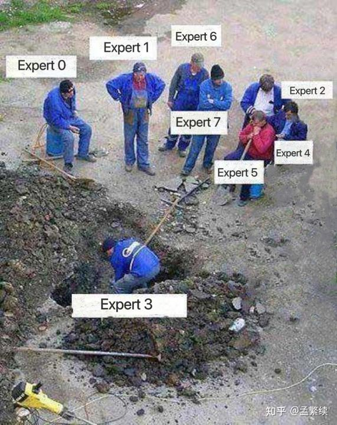

# Deep Dive into DeepSeek MoE with Classic Secondary Development of EP on FSDP

Lately, I've been researching how to develop Tensor Parallelism (TP) and Expert Parallelism (EP) on top of FSDP. This requirement sounds pretty wild. In fact, FSDP itself only supports DeepSpeed Zero-style Data Parallelism (DP). Any other parallel strategies—TP, PP, EP—have no official implementation and require secondary development. As far as I know, waves of engineers at major tech companies have been working one after another, conducting extensive secondary development based on HuggingFace Transformers and FSDP, hoping to patch the performance gaps of native Transformers and FSDP on MoE models. Thanks to the relentless efforts of these big shots; there’s really a certain aesthetic of [sacrificing oneself] for the open-source community 😂. The above constitutes the background for this article. Recently, friends from the SGLang RL group and I dipped our toes into EP and analyzed how some classic open-source frameworks handle secondary development for FSDP.

【Thanks to Xinyi Song and Zhuoran Yin for their contributions to this article. For the sake of Sam Altman's seaside mansion, let's work the employees a bit harder.】

## DeepSeek MoE

In a Dense model, all parameters in every layer participate in the calculation of every Token. The MoE architecture, however, splits the originally massive Feed-Forward Network (FFN) into multiple smaller, structurally identical independent units, called Experts. MoE further introduces a Sparse Activation mechanism: for every input Token, only a small fraction of experts (e.g., Top-k) are selected to participate in the calculation. This allows the model to drastically expand its total parameter count while keeping the computational load (FLOPs) basically constant. In a sense, it achieves both a higher ceiling for model capability and lower computational overhead. Beyond these basic introductions, I strongly recommend readers check out the original [DeepSeek MOE](https://arxiv.org/abs/2401.06066) paper, which introduces some novel MoE optimizations:

1. In any forward process, each layer has a small number of **shared experts** that are always activated. In a sense, these shared experts store "common knowledge."
2. Compared to "traditional MoE" prior to DeepSeek MoE, the experts are split much more finely. For example, where one FFN layer was previously split into 8 experts, it is now split into 64 experts (and even 256 experts in DeepSeek V3).

There is another thing about this paper that left a deep impression on me: how to make a fair comparison between MoE and Dense models. This is interesting because we obviously can't compare Llama 3.1 405B with DeepSeek V3 and claim DeepSeek crushes Llama, therefore MoE is better than Dense. That doesn't make sense because the variable gap between the two is far more than just MoE vs. Dense. To strictly control variables and compare the architectural pros and cons of MoE and Dense, you have to start right from pretraining with rigorous controls—similar to Zhu Zeyuan's "Physics of Language Model"—to obtain the most rigorous scientific conclusions. Regrettably, in academia, it is very difficult to have the opportunity to control variables starting from pretraining. This is also why I generally tend to remain skeptical about various academic debates on which is superior among Diffusion LLM, Dense Model, MoE, and Hybrid Model.

Returning to the DeepSeek MoE paper itself, I really like this article because, to compare various architectures, they controlled variables starting from the number of pretraining tokens. They proposed that for an MoE model with total parameters $X$ and activated parameters $Y$, its performance can be higher than a Dense model with total parameters $Y$, while its computational cost is lower than a Dense model with total parameters $X$. There is even the possibility that its performance approaches or surpasses a Dense model with total parameters $X$. Note that this article was published in early 2024. Two years have passed since then, and this was essentially the opening work of this MoE-dominated era.

Of course, if the MoE model isn't trained well, and some experts are never activated during inference, you end up with this awkward situation shown below:

<div style="text-align: center;">

</div>

In such cases, you could even choose to prune those experts that are never used. The total parameter count drops, but the capability doesn't degrade—looks like we can publish another ACL paper.

## Expert Parallelism

Let's review the naive MoE forward process:

1. **Gate (Routing) Calculation:** The input Token passes through a Gate network to calculate the relevance score between the Token and each expert.
2. **Expert Selection:** The Gate selects the experts that need to participate based on the scores.
3. **Token Dispatch:** Tokens are sent to the selected experts.
4. **Expert Parallel Computation:** The selected experts independently complete the matrix multiplication operations.
5. **Result Combination:** The outputs of various experts are weighted and summed according to the Gate weights, then passed to the next layer.

Without EP, every GPU must store the full weights of all experts for that layer. For MoE models with parameters easily reaching hundreds of billions (e.g., hundreds of experts), a single card's VRAM simply cannot handle it. Therefore, the core logic of EP is to split the Experts collection along the 0-th dimension (expert dimension), letting different Ranks maintain different subsets of experts. Since experts are physically isolated on different graphics cards, the logical distribution originally done by the gate becomes a physical distribution that truly crosses GPU ranks:

1. **Dispatch (All-to-All)**
In the training phase, although the Transformer is auto-regressive, the Causal Mask enables parallel Forward for the full sequence. At this point, each Rank holds a large number of Tokens simultaneously, and each token holds gate scores for different experts. Consequently, the Gate algorithm runs independently on each Rank, calculating the target experts and their corresponding Ranks required by the local Tokens. Since every Rank has Tokens that need to be sent to other Ranks, and simultaneously needs to receive Tokens sent from all other Ranks, this constitutes a typical All-to-All communication. This completes the **Distributed Transpose** process, reorganizing the data distribution from "aligned by sequence position" to "aligned by expert index."
2. **Expert Compute**
Each Rank executes the calculation (FFN) for the experts it holds locally in parallel. Expert calculations between different Ranks are completely independent and require no communication synchronization. However, the computational efficiency at this moment depends heavily on the routing distribution. If a massive amount of Tokens flood to the same expert (**Hotspot Expert**), it leads to severe **Load Imbalance**, where Ranks that compute slowly will drag down the synchronization speed of the entire cluster.
3. **Combine (All-to-All)**
After computation is complete, the local results output by the experts (Expert Latents) need to be sent back via All-to-All communication. Each expert Rank sends the computation results back to the Rank where the Token originally started. This ensures the physical distribution of data is restored to the state it was in before entering the MoE layer, facilitating subsequent weighted summation (Combine), residual connections, and parallel computation for the next Attention layer.

Note that although in the Decoding phase of inference, only one Token is processed at a time, during the Training and Pre-filling phases, high-throughput parallel computing makes All-to-All the most effective and commonly used communication abstraction. Therefore, we generally consider EP to require two All-to-All communications.

## EP vs TP

To reduce the VRAM load on a single rank, TP (Tensor Parallelism) is also a common solution. Why do we need EP if we have TP? For MoE, what is the difference between the two? This question bothered me for a while. Thinking about it now, although TP can also split expert weights (distributing parameters of each expert to different ranks)...

### Communication Volume

Let's try to analyze the pros and cons of TP and EP from the perspective of communication. We define the following variables:

* $N$: Number of GPUs in the parallel group (TP group or EP group size).
* $B \times L$: Total Token count (Batch Size $\times$ Sequence Length).
* $H$: Hidden Size (Vector dimension of each Token).
* $k$: MoE Top-$k$ activation count (Number of experts selected per Token).
* $S = B \times L \times H$: Total activation size of the input data for that layer.

We calculate the data volume sent by each GPU based on the mainstream Ring All-Reduce and Standard Exchange All-to-All:

**TP** splits the FFN matrix of each expert. After passing through an expert layer, an All-Reduce is required after $W_{down}$. Under the Ring algorithm, the communication volume per card is $2 \times \frac{N-1}{N} \times S$, i.e., $\text{Comm}_{TP} \approx 2S$. Note that TP's communication volume is completely unrelated to $k$ (number of activated experts). Even if you only activate 1 expert, TP stubbornly synchronizes the full activation values.

**EP** performs an explicit split in the expert dimension. During the Dispatch phase, the data volume initially held by each Rank is only $S/N$. Since each Token needs to be distributed to $k$ experts, the average data volume sent per card is $k \times (S/N)$. Counting the return trip in the Combine phase, the single card communication volume is $\text{Comm}_{EP} = 2 \times \frac{N-1}{N} \times \frac{kS}{N} \approx \frac{2k}{N}S$.

In large-scale parallelism, when $N$ is large (e.g., $N=64$ or $256$), as long as $k < N$ (DeepSeek activates $k=8$ per layer, while total experts are $256$), the byte count for EP communication per card is actually far less than TP.

Although EP's communication volume looks smaller, EP encounters more severe communication bottlenecks:

1. TP usually stays within the NVLink domain of a single 8-card machine, where bandwidth starts at 900GB/s; whereas EP often has to cross nodes via RDMA, where bandwidth is typically only 50GB/s ~ 100GB/s. The bandwidth differs by an order of magnitude.
2. All-to-All is essentially  small connections. In a large-scale cluster, the handshake overhead, long-tail latency, and wait times caused by **Load Imbalance** might be even larger than the actual communication time.

### Computational Efficiency

Although using DeepSeek MoE as an example where $k=16$, EP and TP each have their issues with communication, EP has an overwhelming advantage in operator efficiency and **Hardware Utilization (MFU)**.

The core logic of TP is "slicing horizontally" or "slicing vertically." In an MoE scenario, the parameter size of a single expert is usually small. If TP is used, the already small $H \times \text{Hidden\_Size}$ matrix of each expert gets further sliced into $1/N$. This results in extremely "tall and skinny" matrix multiplications (GEMM) being executed on the GPU. For NVIDIA Tensor Cores, dimensions that are too small cannot fully fill the computation pipeline, causing actual compute utilization to plummet. This is actually a major reason why TP generally isn't done across machines: inter-machine communication is far slower than intra-machine, which is a disaster for TP's nearly constant communication volume; furthermore, slicing TP across more machines makes the shape on each rank even skinnier, causing GEMM efficiency to drop drastically.

EP, on the other hand, preserves the integrity of the expert matrix. Although Tokens need to be moved across cards, once they arrive at the target GPU, they face a complete matrix with a regular shape sufficient to trigger high-efficiency compute kernels. For DeepSeek's **Fine-grained Experts** design, each expert is extremely tiny. If you were to apply TP on top of that, computational efficiency would degenerate to an unbearable level.

Moreover, for DeepSeek MoE, choosing EP involves more infra innovations. First, shared experts are isolated and do not need to participate in EP communication. Second is the extreme communication hiding brought by **DeepEP** for large $k$:

1. DeepSeek implemented extreme overlap of computation and communication (**Stream-K**). When the first batch of Tokens from Dispatch arrives at the GPU, the compute kernel starts immediately, rather than waiting for all data for the 16 experts to arrive.
2. RDMA Direct Drive: DeepEP bypasses the traditional NCCL protocol stack, using PTX-level optimizations to achieve low-latency cross-node data exchange. Under the massive throughput generated by $k=16$, DeepEP can still maintain extremely high bandwidth utilization, making "communication time" almost completely masked by "computation time."

Based on this, for mainstream MoE models, we compare TP and EP as follows:

| Dimension | TP Scheme | EP Scheme (DeepSeek example) |
| --- | --- | --- |
| Communication Volume (Bytes) | Fixed ($\approx 2S$) | Scales with $k/N$ ($\approx 2kS/N$) |
| Communication Latency | Extremely High (High-frequency All-Reduce sync locks) | Controllable (Coarse-grained All-to-All async masking) |
| Compute Efficiency (MFU) | Low (Matrix slicing leads to unsaturated operators) | High (Complete operators, easy for hardware acceleration) |
| Cluster Scalability | Limited to single-machine NVLink domain | Supports ten-thousand-card cluster RDMA scaling |

Of course, thinking about it in hindsight, the reason MoE considers EP superior to TP is really due to the wave of "small and many" MoE designs led by DeepSeek MoE. Because individual experts are small, if TP slices them even finer, the GEMM efficiency on each rank crashes; whereas in the era of GShard's "big and few" MoE designs, individual experts were large, so even after TP slicing, GEMM efficiency on each rank could be guaranteed. That's why TP was the mainstream for MoE in that era. In the end, EP is also a new parallel strategy driven by algorithms.

### ETP

Having discussed so much about the differences between EP and TP, we can see that for MoE models, EP is indeed the better choice. However, if you've paid attention to the command for launching DeepSeek R1 with SGLang, you might be a bit surprised; for example, in the SGLang cookbook from January 1, 2026, we can turn on both EP and TP for DeepSeek R1 simultaneously, resulting in the following launch command:

```bash
python3 -m sglang.launch_server \
  --model-path deepseek-ai/DeepSeek-R1-0528 \
  --tp 8 \
  --ep 8 \
  --enable-symm-mem # Optional: improves performance, but may be unstable

```

This is a bit puzzling—how are TP and EP enabled simultaneously?

Actually, from our discussion above, you might realize that after EP physically distributes different experts to different ranks, these experts can *still* undergo TP. For example, EP 2 TP 4: first divide all experts into two groups (e.g., cards 0~3 handle the first 1/2 of the experts). Then, a single expert is further split across the 4 ranks within the group. This strategy does exist, and there's a term for it called **ETP** (Expert Tensor Parallelism)—do EP first, then do TP for each expert.

Regrettably, this strategy hasn't been widely adopted in the open-source community. Currently, in the SGLang command above, TP 8 and EP 8 mean that experts will be distributed to 8 ranks (EP); meanwhile, for non-MoE parts, like linear layers, they are distributed to 8 ranks following TP. It does not execute the ETP mode.

⚠️ Finally, a small ad for the SGLang cookbook. The previous [SGLang documentation](https://docs.sglang.io/) was written vertically by feature (e.g., analyzing EP, TP, DPA, and other parallel strategies), but it was hard to systematically know which parallel strategies to combine horizontally to achieve the optimal configuration for a given LLM. Now we have the [SGLang cookbook](https://cookbook.sglang.io/docs/intro), written based on the dimension of models, richly and detailedly expanding on various configuration combinations for mainstream models.

## Classic FSDP Secondary Development: EP

Returning to the painful starting point of this article, the SGLang RL team discussed multiple times over a period whether to further support EP on top of the FSDP already supported by slime. As I mentioned:

> This requirement sounds pretty wild. In fact, FSDP itself only supports DeepSpeed Zero-style DP. Any other parallel strategies—TP, PP, EP—have no official implementation and require secondary development. As far as I know, waves of engineers at major tech companies have been working one after another... hoping to patch the performance gaps... Thanks to the relentless efforts of these big shots...

Here, we only share our research process. We studied EP implementations based on FSDP from other open-source projects in the community and are sharing them here.

Let's first look at the forward and backward flow with EP:

| forward | backward |
| --- | --- |
| gate<br><br>All-to-All Dispatch<br><br>expert compute (FSDP2)<br><br>all gather<br><br>Expert FFN compute<br><br><br><br>release<br><br>All-to-All Return<br><br>merge | gate<br><br>All-to-All Combine<br><br>expert compute (FSDP2)<br><br>all gather<br><br>Expert FFN compute<br><br>reduce-scatter<br><br>release<br><br>All-to-All Return<br><br>merge |

Actually, there isn't a significant difference; it just adds the EP all-to-all communication. Note that the Reduce-Scatter in Backward is a standard FSDP action and is unrelated to EP. The calculated full gradients need to be aggregated (Reduce) within the DP group and re-sliced (Scatter) back to each Rank, mathematically completing the gradient averaging (Reduce) and distribution (Scatter). In the MoE EP scenario, a corresponding FSDP-level Reduce-Scatter only occurs if the experts are further sliced by FSDP. The experts themselves do not need gradient aggregation within the EP group; each optimizes its own gradients.

Scanning through major frameworks, the optimizations everyone generally implements are:

1. **EP splits dim 0 (experts), while FSDP splits dim 1 (hidden size).** (See VeOmni)
2. **Prefetch:** When calculating layer `n`, gather the parameters for layer `n+1` in advance. With just FSDP, prefetch is straightforward. But because EP has communication before computation starts, some manual operations are needed to ensure prefetch for both forward and backward passes. (See VeOmni)
3. **DeepEP:** Having suffered from NCCL for too long, using RDMA direct drive. (See Automodel)
4. **EPLB:** Solving expert computation load imbalance through expert redundancy.
5. **Fused MoE:** Actually not closely related to EP, but when a single GPU is responsible for multiple experts, use a Fused MoE kernel to accelerate the computation of these experts.

There is a series of excellent articles to reference for the technology behind this:

[Deepseek's All-to-all Communication: DeepEP Code Interpretation](https://www.cnblogs.com/CQzhangyu/p/18741625)

[A Humble Opinion: Why is DeepEP Fast?](https://zhuanlan.zhihu.com/p/28867733102)

[DeepSeek AI Infra(3) - DeepEP Principle and Code Analysis](https://zhuanlan.zhihu.com/p/27777601573)

[MoE Parallel Load Balancing: Deep Analysis and Visualization of EPLB](https://zhuanlan.zhihu.com/p/29963005584)

## Implementation Comparison

Here we compare three highlight projects in the community: [VeOmni](https://github.com/ByteDance-Seed/VeOmni), [TorchTitan](https://github.com/pytorch/torchtitan), and [Automodel](https://github.com/NVIDIA-NeMo/Automodel). They all perform EP first, and then apply FSDP to each block after EP.

### VeOmni

The code structure we studied is as follows:

```text
VeOmni/veomni/
├── distributed/
│   ├── parallel_state.py       ← Global parallel state (ep_fsdp_device_mesh, ep_size)
│   ├── parallel_plan.py        ← EP splitting plan (ParallelPlan.apply())
│   ├── torch_parallelize.py    ← EP + FSDP integration entry
│   │   ├── parallelize_model_fsdp2()  ← Main entry
│   │   └── Manual prefetch configuration
│   ├── fsdp/
│   │   ├── clip_grad_norm.py   ← FSDP1 EP-aware gradient clipping
│   │   └── extension.py        ← Checkpoint extension
│   └── fsdp2/
│       └── clip_grad_norm.py   ← FSDP2 EP-aware gradient clipping
├── models/
│   └── transformers/
│       └── qwen3_moe/
│           └── parallel_plan.py  ← Model-specific EP parameter definition
└── sequence_parallel/
    ├── async_ulysses.py        ← Async sequence parallel (unrelated to EP)
    └── ulysses.py              ← Standard Ulysses

```

The entire logic is quite clear; it's an EP + FSDP structure. For experts, apply EP first, splitting on the 0-th dimension (expert), and then FSDP. Non-expert parts just follow standard FSDP. There's an interesting point here: note that the `fully_shard` adopted by FSDP is an implicit split (some call it dynamic logical splitting), hoping to be an imperceptible parallel optimization to the upper layers. Taking a group of experts with `shape=[128, H, I]` as an example, before the model's forward pass begins, FSDP internally secretly initiates an all-gather to temporarily piece together the fragments on 8 cards back into a complete `[128, H, I]`. To the upper layer, it still looks like a complete Tensor; there's no need to worry about distributed communication. EP, however, is an explicit split, or static physical split. A group of experts originally `shape=[128, H, I]` physically becomes `[32, H, I]` on each Rank. The model code must perceive this change; for instance, the MoE layer code must know, "I only have 32 experts on this machine," and calculate based on this quantity.

```text
Applies EP (when enabled) + FSDP2 parallel strategy to the model.

Flow:
1. Apply EP: Expert tensors [128,H,I] -> [32,H,I] local tensors per EP rank
2. Apply FSDP2 to expert modules: Shard expert tensors along dim-1 (hidden dim)
3. Apply FSDP2 to regular modules: Standard dim-0 sharding
4. Result: Expert params [32, H/fsdp_size, I], regular params use standard FSDP2

```

Below is an excerpt of the key function `parallelize_model_fsdp2` from this implementation, [full code here](https://github.com/ByteDance-Seed/VeOmni/blob/3bd8e6e48c2d741b2b8b4898f90645145bf4287b/veomni/distributed/torch_parallelize.py#L228):

```python
def parallelize_model_fsdp2(model, enable_mixed_precision=True, basic_modules=None, **kwargs):
    # [1] Experts 128 -> 32 (EP)
    if parallel_state.ep_enabled:
        parallel_plan = model.get_parallel_plan()
        parallel_plan.apply(model, parallel_state.ep_fsdp_device_mesh)
        experts_map = parallel_plan.get_fsdp_no_shard_info(model)

    # [2. Loop Sharding] Slice every layer from inside out
    layer_pairs = []
    for layer_fqn, layer_mod in decoder_blocks:
        experts_mod = next((exp_mod for exp_fqn, exp_mod in experts_map.items() if ...), None)
        layer_mod._fsdp_modules = []

        if experts_mod:
            fully_shard(experts_mod, **expert_fsdp_kwargs) # Slice experts
            layer_mod._fsdp_modules.append(experts_mod)
        
        fully_shard(layer_mod, **fsdp_kwargs) # Slice whole layer
        layer_mod._fsdp_modules.append(layer_mod)
        layer_pairs.append(layer_mod)

    # [3. Slice root model]
    fully_shard(model, **fsdp_kwargs)

    # [4. Configure prefetch]
    # Forward
    for cur, nxt in zip(layer_pairs, layer_pairs[1:] + [None]):
        if nxt:
            cur.set_modules_to_forward_prefetch(list(reversed(nxt._fsdp_modules)))

    # Backward
    rev_blocks = list(reversed(layer_pairs))
    for cur, prev in zip(rev_blocks, rev_blocks[1:] + [None]):
        if prev:
            cur.set_modules_to_backward_prefetch(list(reversed(prev._fsdp_modules)))

    return model

```

Having discussed the splitting logic, let's consider the communication logic. The complexity of All-to-All communication is not low; relevant communication code can be found [here](https://github.com/ByteDance-Seed/VeOmni/blob/e4e431d0/veomni/distributed/moe/moe_layer.py):

1. **Preprocess:** Before transmitting heavy data, exchange metadata via all_gather to calculate Input Splits and Output Splits;
2. **Dispatch:** Permute locally based on routing indices, use `dist.all_to_all` to complete transmission, and Sort again after receiving data;
3. **Combine:** After calculation is complete, perform reverse communication and Unpermute operations to restore Tokens to their original sequence order;

```python
def preprocess(expert_mask, num_experts, ep_group):
    # expert_mask: [Batch, Tokens, Num_Experts] (which tokens go to which experts)
    
    # 1. Calculate token count to send from local to each rank (Input Splits)
    ep_size = ep_group.size()
    num_local_tokens_per_expert = expert_mask.sum(dim=(1, 2)) 
    input_splits = num_local_tokens_per_expert.reshape(ep_size, -1).sum(dim=1).tolist()

    # 2. dist.all_gather: Collect num_local_tokens_per_expert from all cards
    num_global_tokens_per_expert = torch.zeros(...)
    dist.all_gather_into_tensor(num_global_tokens_per_expert, num_local_tokens_per_expert, group=ep_group)

    # 3. Calculate how many tokens local will receive from each rank (Output Splits)
    rank = dist.get_rank(ep_group)
    my_experts_range = slice(rank * num_local_experts, (rank + 1) * num_local_experts)
    tokens_sent_to_me = num_global_tokens_per_expert[:, my_experts_range]
    output_splits = tokens_sent_to_me.sum(dim=1).tolist()

    return input_splits, output_splits, tokens_sent_to_me

def token_pre_all2all(hidden_states, expert_mask, input_splits, output_splits, ...):
    # 1. Local reordering (Permute)
    # local_permuted: [Token1_to_Exp1, Token2_to_Exp1, ..., TokenN_to_Exp99]
    local_permuted, _ = permute(hidden_states, expert_mask.sum(dim=1))

    # 2. All-to-All
    # Send: input_splits, Receive: output_splits
    global_permuted = all_to_all(ep_group, local_permuted, output_splits, input_splits)

    # 3. Sort by Expert
    global_permuted = sort_chunks_by_idxs(global_permuted, ...)

    return global_permuted # Ready to feed into Group GEMM

def tokens_post_all2all(expert_outputs, input_splits, output_splits, ...):
    # 1. Computed data is arranged by Expert; must reorder by source Rank to return
    expert_outputs = sort_chunks_by_idxs(expert_outputs, ...)

    # 2. All-to-All Return
    unpermute_outputs = all_to_all(ep_group, expert_outputs, input_splits, output_splits)

    # 3. Unpermute
    final_output = unpermute(unpermute_outputs, ...)

    return final_output

```

### Automodel

The code structure we studied is as follows. What's pretty mind-boggling is that this repo currently still only has 200+ stars...

```text
Automodel/nemo_automodel/
├── components/
│   ├── distributed/
│   │   └── fsdp2.py            ← FSDP2Manager (moe_mesh definition)
│   └── moe/
│       ├── parallelizer.py     ← EP + FSDP integration entry
│       │   ├── ExpertParallel      ← EP Class Definition
│       │   ├── apply_ep()          ← EP Split
│       │   ├── apply_fsdp()        ← FSDP Split
│       │   └── parallelize_model() ← Main Entry
│       ├── layers.py           ← MoE Layer Implementation
│       ├── fsdp_mixin.py       ← MoE FSDP Sync Mixin (PP related)
│       └── megatron/
│           ├── token_dispatcher.py  ← Token Dispatcher (_DeepepManager)
│           ├── fused_a2a.py         ← DeepEP Wrapper (FusedDispatch/Combine)
│           └── moe_utils.py         ← permute/unpermute utilities

```

Automodel's use of DeepEP is noteworthy. Automodel integrates DeepEP via `_DeepepManager`, utilizing Fused Dispatch/Combine operators to replace NCCL All-to-All: `token_dispatcher.py -> MoEFlexTokenDispatcher -> _DeepepManager -> fused_dispatch`.

**DeepepManager from token_dispatcher.py**

A stateful communication context manager that encapsulates the interaction between the DeepEP library and the upper-layer model logic. In the dispatch phase, DeepEP's backend returns a handle object containing communication layout information. In the combine phase, `self.handle` is retrieved directly and passed to the backend.

```python
# token_dispatcher.py Lines 90-191

class _DeepepManager(_DispatchManager):
    """DeepEP backend for token dispatch/combine"""

    def __init__(self, group, router_topk, num_experts, num_local_experts, ...):
        self.group = group
        self.num_experts = num_experts
        self.num_local_experts = num_local_experts  # number of experts in this EP group

        if fused_dispatch is None:
            raise ImportError("DeepEP is not installed.")

    def setup_metadata(self, num_local_tokens, probs):
        """Process routing map"""
        probs = probs.reshape(num_local_tokens, self.num_experts)
        self.token_probs, self.token_indices = torch.topk(probs, self.router_topk, dim=-1)

    def dispatch(self, hidden_states, async_finish=False, allocate_on_comm_stream=False):
        """Dispatch tokens to experts"""
        # DeepEP requires float32
        self.token_probs = self.token_probs.float()

        # Call DeepEP's fused_dispatch
        (hidden_states, dispatched_indices, dispatched_probs,
         num_tokens_per_expert, handle) = fused_dispatch(
            hidden_states,
            self.token_indices,
            self.token_probs,
            self.num_experts,
            self.group,
            async_finish=async_finish,
        )
        self.handle = handle  # Save for combine
        return hidden_states

    def combine(self, hidden_states, async_finish=False, allocate_on_comm_stream=False):
        """Combine expert outputs"""
        hidden_states, _ = fused_combine(
            hidden_states,
            self.group,
            self.handle,  # Use handle saved during dispatch
            async_finish=async_finish,
        )
        self.handle = None
        return hidden_states

```

**FusedDispatch from fused_a2a.py**

```python
# fused_a2a.py Lines 80-148

class FusedDispatch(torch.autograd.Function):
    @staticmethod
    def forward(ctx, x, token_indices, token_probs, num_experts, group, async_finish, ...):
        # Get DeepEP Buffer
        buffer = get_buffer(group, get_hidden_bytes(x))

        # Calculate dispatch layout
        (num_tokens_per_rank, num_tokens_per_rdma_rank,
         num_tokens_per_expert, is_token_in_rank, event) = buffer.get_dispatch_layout(
            token_indices, num_experts, ...
        )

        # Call DeepEP core dispatch
        (recv_x, recv_token_indices, recv_token_probs,
         num_recv_tokens_per_expert_list, handle, after_event) = buffer.dispatch(
            x,
            topk_idx=token_indices,
            topk_weights=token_probs,  # Must be float32
            num_tokens_per_rank=num_tokens_per_rank,
            ...
            async_finish=async_finish,
        )

        # Async sync
        if async_finish:
            after_event.current_stream_wait()

        ctx.handle = handle  # Save for backward
        return recv_x, recv_token_indices, recv_token_probs, tokens_per_expert, handle

    @staticmethod
    def backward(ctx, ...):
        # backward calls combine
        grad_x, grad_token_probs, after_event = buffer.combine(
            grad_output.contiguous(),
            ctx.handle,
            ...
        )
        return grad_x, ...

```

### TorchTitan

```text
torchtitan/
├── distributed/
│   ├── expert_parallel.py      ← Core! EP Class Definition
│   ├── parallel_dims.py        ← Device Mesh Management
│   └── deepep.py               ← DeepEP Wrapper (Optional)
├── models/
│   ├── moe/
│   │   ├── moe.py              ← MoE Layer Implementation
│   │   └── moe_deepep.py       ← DeepEP MoE Variant
│   └── llama4/infra/
│       └── parallelize.py      ← EP + FSDP Integration Entry

```

The full logic can be seen [here](https://github.com/pytorch/torchtitan/blob/7e4ab85998576c68902603058adada28fb0ed226/torchtitan/models/llama4/infra/parallelize.py#L494). TorchTitan implements full-link pre-fetch:

1. **MoE-Aware Prefetch:** Most frameworks might only prefetch the next layer Block, but TorchTitan explicitly prefetches the next layer Block *and* its internal Experts (`[next_transformer_block, next_transformer_block.moe.experts]`) during forward propagation;
2. **Maximum Computation Coverage:** From the initial Embedding layer to the final Output layer, and even during the backward propagation (Backward) process, there is corresponding `set_modules_to_backward_prefetch` logic. This air-tight prefetching maximizes the masking of communication by computation.

**Parallelize from parallelize.py**

```python
for layer_id, transformer_block in model.layers.items():
    if transformer_block.moe_enabled and ep_degree > 1:
        fsdp_mod_ep_config = fsdp_config.copy()
        fsdp_mod_ep_config["mesh"] = edp_mesh
        _experts_shard_placement_fn = None
        assert edp_mesh is not None
        assert hasattr(transformer_block, "moe")
        if (
            edp_mesh["efsdp"].size() * ep_degree
            > transformer_block.moe.experts.num_experts
        ):
            _experts_shard_placement_fn = lambda param: Shard(1)

        fully_shard(
            transformer_block.moe.experts,
            **fsdp_mod_ep_config,
            reshard_after_forward=reshard_after_forward,
            shard_placement_fn=_experts_shard_placement_fn,
        )
   
        transformer_block.moe.experts.set_gradient_divide_factor(
            gradient_divide_factor,
        )

    fully_shard(
        transformer_block,
        **fsdp_config,
        reshard_after_forward=reshard_after_forward,
    )

```

**Prefetch from parallelize.py**

```python
transformer_blocks = list(model.layers.values())
next_transformer_blocks = transformer_blocks[1:] + [None]

# pyrefly: ignore [bad-argument-type]
if model.tok_embeddings is not None and len(model.layers) > 0:
    # pyrefly: ignore [missing-attribute]
    model.tok_embeddings.set_modules_to_forward_prefetch([transformer_blocks[0]])

for transformer_block, next_transformer_block in zip(
    transformer_blocks, next_transformer_blocks
):
    if next_transformer_block is not None:
        # pyrefly: ignore [missing-attribute]
        if next_transformer_block.moe_enabled:
            # pyrefly: ignore [missing-attribute]
            transformer_block.set_modules_to_forward_prefetch(
                # pyrefly: ignore [missing-attribute]
                [next_transformer_block, next_transformer_block.moe.experts]
            )
        else:
            # pyrefly: ignore [missing-attribute]
            transformer_block.set_modules_to_forward_prefetch(
                [next_transformer_block]
            )
    elif model.norm is not None and model.output is not None:
        # pyrefly: ignore [missing-attribute]
        transformer_block.set_modules_to_forward_prefetch(
            [model.norm, model.output]
        )

# backward
# pyrefly: ignore [not-callable]
reversed_transformer_blocks = list(reversed(model.layers.values()))
prev_transformer_blocks = reversed_transformer_blocks[1:] + [None]

# pyrefly: ignore [bad-argument-type]
if model.norm is not None and model.output is not None and len(model.layers) > 0:
    # pyrefly: ignore [missing-attribute]
    model.output.set_modules_to_backward_prefetch([reversed_transformer_blocks[0]])

for transformer_block, prev_transformer_block in zip(
    reversed_transformer_blocks, prev_transformer_blocks
):
    if prev_transformer_block is not None:
        # pyrefly: ignore [missing-attribute]
        if prev_transformer_block.moe_enabled:
            # pyrefly: ignore [missing-attribute]
            transformer_block.set_modules_to_backward_prefetch(
                # pyrefly: ignore [missing-attribute]
                [prev_transformer_block, prev_transformer_block.moe.experts]
            )
        else:
            # pyrefly: ignore [missing-attribute]
            transformer_block.set_modules_to_backward_prefetch(
                [prev_transformer_block]
            )
    elif model.tok_embeddings is not None:
        # pyrefly: ignore [missing-attribute]
        transformer_block.set_modules_to_backward_prefetch([model.tok_embeddings])

```