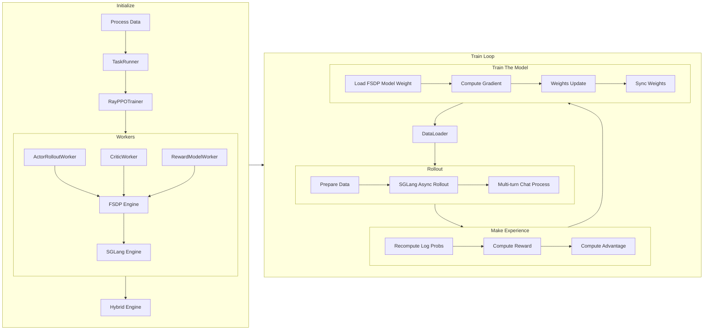

# A Deep Dive into verl Source Code: Rollout

In [Part 1](readme.md), we introduced the initialization process of verl. In this part, we will further explore the rollout process of verl.



## Data Loading and Preprocessing

verl implements data processing through `DataProto` and `RLHFDataset`. Specifically, in [`main_ppo.py`](https://github.com/volcengine/verl/blob/76f63cffa5081564d8fea93a1cb3ce8bd5bdcc39/verl/trainer/main_ppo.py#L193), we observe this function:

<details>
<summary>Source code of create_rl_dataset</summary>

```python
def create_rl_dataset(data_paths, data_config, tokenizer, processor):
    """Create a dataset.

    Arguments:
        data_paths: List of paths to data files.
        data_config: The data config.
        tokenizer (Tokenizer): The tokenizer.
        processor (Processor): The processor.

    Returns:
        dataset (Dataset): The dataset.
    """
    from torch.utils.data import Dataset

    from verl.utils.dataset.rl_dataset import RLHFDataset

    # Check if a custom dataset class is specified in the data configuration
    # and if the path to the custom class is provided
    if "custom_cls" in data_config and data_config.custom_cls.get("path", None) is not None:
        from verl.utils.import_utils import load_extern_type

        # Dynamically load the custom dataset class
        dataset_cls = load_extern_type(data_config.custom_cls.path, data_config.custom_cls.name)
        # Verify that the custom dataset class inherits from torch.utils.data.Dataset
        if not issubclass(dataset_cls, Dataset):
            raise TypeError(f"The custom dataset class '{data_config.custom_cls.name}' from '{data_config.custom_cls.path}' must inherit from torch.utils.data.Dataset")
    else:
        # Use the default RLHFDataset class if no custom class is specified
        dataset_cls = RLHFDataset
    print(f"Using dataset class: {dataset_cls.__name__}")

    # Instantiate the dataset using the determined dataset class
    dataset = dataset_cls(
        data_files=data_paths,
        tokenizer=tokenizer,
        processor=processor,
        config=data_config,
    )

    return dataset
```

</details>

This is quite typical; it creates an instance of `RLHFDataset` and returns it. The specific implementation of [`RLHFDataset`](https://github.com/volcengine/verl/blob/76f63cffa5081564d8fea93a1cb3ce8bd5bdcc39/verl/utils/dataset/rl_dataset.py#68) is as follows:

<details>
<summary>Implementation of RLHFDataset</summary>

```python
class RLHFDataset(Dataset):
    """
    Load and preprocess RLHF data from Parquet files.

    - Caches files locally.
    - Reads into a HuggingFace Dataset and tokenizes prompts.
    - Optionally handles images/videos via a ProcessorMixin.
    - Filters prompts over a max length.
    - Supports resuming from checkpoints.

    Args:
        data_files (str or list): Path(s) to Parquet file(s).
        tokenizer (PreTrainedTokenizer): For the tokenization of text to token IDs.
        config (DictConfig): Options like cache_dir, prompt_key, max_prompt_length, truncation, etc.
        processor (ProcessorMixin, optional): Multimodal preprocessor for images/videos.
    """

    def __init__(
        self,
        data_files: Union[str, List[str]],
        tokenizer: PreTrainedTokenizer,
        config: DictConfig,
        processor: Optional[ProcessorMixin] = None,
    ):
        if not isinstance(data_files, (List, ListConfig)):
            data_files = [data_files]

        self.data_files = copy.deepcopy(data_files)
        self.original_data_files = copy.deepcopy(data_files)  # use for resume
        self.tokenizer = tokenizer
        self.processor = processor
        self.config = config

        self.cache_dir = os.path.expanduser(config.get("cache_dir", "~/.cache/verl/rlhf"))
        self.prompt_key = config.get("prompt_key", "prompt")
        self.image_key = config.get("image_key", "images")
        self.video_key = config.get("video_key", "videos")
        self.max_prompt_length = config.get("max_prompt_length", 1024)
        self.return_raw_chat = config.get("return_raw_chat", False)
        self.return_full_prompt = config.get("return_full_prompt", False)
        self.truncation = config.get("truncation", "error")
        self.filter_overlong_prompts = config.get("filter_overlong_prompts", True)

        self.num_workers = config.get("filter_overlong_prompts_workers", max(1, os.cpu_count() // 4))
        self.num_workers = min(self.num_workers, os.cpu_count())
        self.use_shm = config.get("use_shm", False)
        self.chat_template_func = config.get("chat_template_func", None)
        self.need_tools_kwargs = config.get("need_tools_kwargs", False)
        self.filter_prompts = config.get("filter_prompts", True)
        self.serialize_dataset = False
        self._download()
        self._read_files_and_tokenize()

    def _download(self, use_origin_parquet=False):
        from verl.utils.fs import copy_to_local

        data_files = self.data_files if not use_origin_parquet else self.original_data_files
        for i, parquet_file in enumerate(data_files):
            self.data_files[i] = copy_to_local(src=parquet_file, cache_dir=self.cache_dir, use_shm=self.use_shm)

    def _read_files_and_tokenize(self):
        dataframes = []
        for parquet_file in self.data_files:
            # read parquet files and cache
            dataframe = datasets.load_dataset("parquet", data_files=parquet_file)["train"]
            dataframes.append(dataframe)
        self.dataframe: datasets.Dataset = datasets.concatenate_datasets(dataframes)

        print(f"dataset len: {len(self.dataframe)}")

        # filter out too long prompts
        if self.filter_overlong_prompts:
            tokenizer = self.tokenizer
            processor = self.processor
            prompt_key = self.prompt_key
            image_key = self.image_key
            video_key = self.video_key

            if processor is not None:
                from verl.utils.dataset.vision_utils import process_image, process_video

                def doc2len(doc) -> int:
                    messages = self._build_messages(doc)
                    raw_prompt = self.processor.apply_chat_template(messages, add_generation_prompt=True, tokenize=False)
                    images = [process_image(image) for image in messages.pop(image_key)] if image_key in messages else None
                    videos = [process_video(video) for video in messages.pop(video_key)] if video_key in messages else None

                    return len(processor(text=[raw_prompt], images=images, videos=videos)["input_ids"][0])

            else:

                def doc2len(doc) -> int:
                    return len(tokenizer.apply_chat_template(doc[prompt_key], add_generation_prompt=True))

            self.dataframe = self.dataframe.filter(
                lambda doc: doc2len(doc) <= self.max_prompt_length,
                num_proc=self.num_workers,
                desc=f"Filtering prompts longer than {self.max_prompt_length} tokens",
            )

            print(f"filter dataset len: {len(self.dataframe)}")

    def resume_dataset_state(self):
        self.serialize_dataset = not hasattr(self, "original_data_files")
        # resume dataframe if not it's serialized in data.pt
        if not self.serialize_dataset:
            self._download(use_origin_parquet=True)  # download and resume from original parquet files
            self._read_files_and_tokenize()
        else:
            print(r"old dataloader ckpt file is used, please train from scratch for better ckpt performance")

    def __len__(self):
        return len(self.dataframe)

    def _build_messages(self, example: dict):
        messages: list = example.pop(self.prompt_key)

        if self.image_key in example or self.video_key in example:
            for message in messages:
                content = message["content"]
                content_list = []
                segments = re.split("(<image>|<video>)", content)
                segments = [item for item in segments if item != ""]
                for segment in segments:
                    if segment == "<image>":
                        content_list.append({"type": "image"})
                    elif segment == "<video>":
                        content_list.append({"type": "video"})
                    else:
                        content_list.append({"type": "text", "text": segment})

                message["content"] = content_list

        return messages

    def __getitem__(self, item):
        """
        Note that we also return the raw_input_ids so that it can be combined with other chat template
        """
        row_dict: dict = self.dataframe[item]
        messages = self._build_messages(row_dict)
        model_inputs = {}

        if self.processor is not None:
            from verl.utils.dataset.vision_utils import process_image, process_video

            raw_prompt = self.processor.apply_chat_template(messages, add_generation_prompt=True, tokenize=False)
            multi_modal_data = {}

            images = None
            if self.image_key in row_dict and row_dict.get(self.image_key, None) is not None:
                images = [process_image(image) for image in row_dict.pop(self.image_key)]
                multi_modal_data["image"] = images

            videos = None
            if self.video_key in row_dict and row_dict.get(self.video_key, None) is not None:
                videos = [process_video(video) for video in row_dict.pop(self.video_key)]
                multi_modal_data["video"] = [video.numpy() for video in videos]

            model_inputs = self.processor(text=[raw_prompt], images=images, videos=videos, return_tensors="pt")

            input_ids = model_inputs.pop("input_ids")
            attention_mask = model_inputs.pop("attention_mask")

            if "second_per_grid_ts" in model_inputs:
                model_inputs.pop("second_per_grid_ts")

            # There's a trap here, multi_modal_inputs has to be a dict, not BatchFeature
            row_dict["multi_modal_data"] = multi_modal_data
            row_dict["multi_modal_inputs"] = dict(model_inputs)

            # second_per_grid_ts isn't used for training, just for mrope
            row_dict["multi_modal_inputs"].pop("second_per_grid_ts", None)

        else:
            raw_prompt = self.tokenizer.apply_chat_template(messages, add_generation_prompt=True, tokenize=False)
            model_inputs = self.tokenizer(raw_prompt, return_tensors="pt", add_special_tokens=False)
            input_ids = model_inputs.pop("input_ids")
            attention_mask = model_inputs.pop("attention_mask")

        input_ids, attention_mask = verl_F.postprocess_data(
            input_ids=input_ids,
            attention_mask=attention_mask,
            max_length=self.max_prompt_length,
            pad_token_id=self.tokenizer.pad_token_id,
            left_pad=True,
            truncation=self.truncation,
        )

        if self.processor is not None and "Qwen2VLImageProcessor" in self.processor.image_processor.__class__.__name__:
            from verl.models.transformers.qwen2_vl import get_rope_index

            position_ids = [
                get_rope_index(
                    self.processor,
                    input_ids=input_ids[0],
                    image_grid_thw=model_inputs.get("image_grid_thw"),
                    video_grid_thw=model_inputs.get("video_grid_thw"),
                    second_per_grid_ts=model_inputs.get("second_per_grid_ts"),
                    attention_mask=attention_mask[0],
                )
            ]  # (1, 3, seq_len)

        else:
            position_ids = compute_position_id_with_mask(attention_mask)

        row_dict["input_ids"] = input_ids[0]
        row_dict["attention_mask"] = attention_mask[0]
        row_dict["position_ids"] = position_ids[0]

        raw_prompt_ids = self.tokenizer.encode(raw_prompt, add_special_tokens=False)
        if len(raw_prompt_ids) > self.max_prompt_length:
            if self.truncation == "left":
                raw_prompt_ids = raw_prompt_ids[-self.max_prompt_length :]
            elif self.truncation == "right":
                raw_prompt_ids = raw_prompt_ids[: self.max_prompt_length]
            elif self.truncation == "middle":
                left_half = self.max_prompt_length // 2
                right_half = self.max_prompt_length - left_half
                raw_prompt_ids = raw_prompt_ids[:left_half] + raw_prompt_ids[-right_half:]
            elif self.truncation == "error":
                raise RuntimeError(f"Prompt length {len(raw_prompt_ids)} is longer than {self.max_prompt_length}.")

        row_dict["raw_prompt_ids"] = raw_prompt_ids
        # encode prompts without chat template
        if self.return_raw_chat:
            row_dict["raw_prompt"] = messages

        # get prompts with chat template
        if self.return_full_prompt:
            row_dict["full_prompts"] = raw_prompt  # array of strings

        # add index for each prompt
        index = row_dict.get("extra_info", {}).get("index", 0)
        tools_kwargs = row_dict.get("extra_info", {}).get("tools_kwargs", {})
        need_tools_kwargs = row_dict.get("extra_info", {}).get("need_tools_kwargs", self.need_tools_kwargs)
        if need_tools_kwargs and not tools_kwargs:
            logger.warning("tools_kwargs is empty for index {}, data source: {}", index, row_dict["data_source"])
        row_dict["index"] = index
        row_dict["tools_kwargs"] = tools_kwargs
        return row_dict

    def __getstate__(self):
        if not self.serialize_dataset:
            state = self.__dict__.copy()

            if "dataframe" in state:
                del state["dataframe"]
            return state

        return self.__dict__.copy()
```

</details>

The most important parameter here is `tools_kwargs`, which is used to provide configuration parameters for different tools. Its structure is as follows:

```python
tools_kwargs = {
    "tool_name": {
        "create_kwargs": {...},      # Parameters when the tool is created
        "execute_kwargs": {...},     # Parameters when the tool is executed (optional)
        "calc_reward_kwargs": {...}, # Parameters when calculating rewards (optional)
        "release_kwargs": {...},     # Parameters when releasing resources (optional)
    }
}
```

For example, the `tools_kwargs` for Search-R1 are as follows:

```python
tools_kwargs = {
    "search-r1": {
        "create_kwargs": {
            "ground_truth": ground_truth,
            "question": question, 
            "data_source": data_source_tagged
        }
    }
}
```

We will leave the specifics of how these parameters call a tool for a later section.

## Training Entry Point [`RayPPOTrainer.fit()`](https://github.com/volcengine/verl/blob/76f63cffa5081564d8fea93a1cb3ce8bd5bdcc39/verl/trainer/ppo/ray_trainer.py#L903)

1.  Creates a tracking logger, sets the global step, loads checkpoints, and performs validation before training.
2.  Uses tqdm to create a progress bar, displaying the training progress and setting the initial step.
3.  Iterates through the configured total number of epochs and the data loader, updating multiple steps per train batch.
4.  Separates the data used for rollout (`input_ids`, `attention_mask`, `position_ids`, etc.) from the batch, keeping other data for subsequent processing.
5.  Calls `ActorRolloutWorker` to generate sequences and records the generation time.
6.  Handles REMAX baseline (if used): generates deterministic baseline sequences, calculates baseline rewards, used for the REMAX advantage estimator.
7.  Assigns a unique ID to each sample, repeats data to align multiple samples, computes the response mask, and optionally performs batch balancing.
8.  Computes token-level reward scores using the reward model or a custom reward function based on the configuration, supporting synchronous and asynchronous computation.
9.  Uses megatron to recompute the log probabilities of the behavior policy based on the policy before training starts (for importance sampling), and also calculates entropy values. (The reason was explained in [part 1](https://www.google.com/search?q=./readme.md%23actorrolloutrefworker__init__)).
10. Computes log probs using the reference policy for KL divergence calculation.
11. Computes state values using the Critic network for advantage function estimation.
12. Computes the advantage function based on the configured advantage estimator (GAE, GRPO, REMAX, etc.), supporting KL penalty.
13. Updates the Critic network parameters using the calculated advantage function.
14. After Critic preheating is complete, updates the Actor network parameters using the PPO loss function.
15. Saves the generated sequences, inputs, outputs, and scores to the specified directory.
16. Performs validation according to the configured frequency, calculates validation metrics, and records them.
17. Saves model checkpoints according to the configured frequency.
18. Collects training metrics, timing metrics, and throughput metrics, and records them in the logging system.
19. Updates the progress bar, increments the global step, and ends training when the total training steps are reached.
20. Enables/disables profiling at specific steps according to the configuration for debugging and optimization.

<details>
<summary>Source code of RayPPOTrainer.fit()</summary>

```python
def fit(self):
    """
    The training loop of PPO.
    The driver process only need to call the compute functions of the worker group through RPC
    to construct the PPO dataflow.
    The light-weight advantage computation is done on the driver process.
    """
    from omegaconf import OmegaConf

    from verl.utils.tracking import Tracking

    logger = Tracking(
        project_name=self.config.trainer.project_name,
        experiment_name=self.config.trainer.experiment_name,
        default_backend=self.config.trainer.logger,
        config=OmegaConf.to_container(self.config, resolve=True),
    )

    self.global_steps = 0

    # load checkpoint before doing anything
    self._load_checkpoint()

    # perform validation before training
    # currently, we only support validation using the reward_function.
    if self.val_reward_fn is not None and self.config.trainer.get("val_before_train", True):
        val_metrics = self._validate()
        assert val_metrics, f"{val_metrics=}"
        pprint(f"Initial validation metrics: {val_metrics}")
        logger.log(data=val_metrics, step=self.global_steps)
        if self.config.trainer.get("val_only", False):
            return

    # add tqdm
    progress_bar = tqdm(total=self.total_training_steps, initial=self.global_steps, desc="Training Progress")

    # we start from step 1
    self.global_steps += 1
    last_val_metrics = None

    for epoch in range(self.config.trainer.total_epochs):
        for batch_dict in self.train_dataloader:
            do_profile = self.global_steps in self.config.trainer.profile_steps if self.config.trainer.profile_steps is not None else False
            if do_profile:
                self.actor_rollout_wg.start_profile()
                if self.use_reference_policy:
                    self.ref_policy_wg.start_profile()
                if self.use_critic:
                    self.critic_wg.start_profile()
                if self.use_rm:
                    self.rm_wg.start_profile()

            metrics = {}
            timing_raw = {}
            batch: DataProto = DataProto.from_single_dict(batch_dict)

            # pop those keys for generation
            batch_keys_to_pop = ["input_ids", "attention_mask", "position_ids"]
            non_tensor_batch_keys_to_pop = ["raw_prompt_ids"]
            if "multi_modal_data" in batch.non_tensor_batch:
                non_tensor_batch_keys_to_pop.append("multi_modal_data")
            if "raw_prompt" in batch.non_tensor_batch:
                non_tensor_batch_keys_to_pop.append("raw_prompt")
            if "tools_kwargs" in batch.non_tensor_batch:
                non_tensor_batch_keys_to_pop.append("tools_kwargs")
            gen_batch = batch.pop(
                batch_keys=batch_keys_to_pop,
                non_tensor_batch_keys=non_tensor_batch_keys_to_pop,
            )

            is_last_step = self.global_steps >= self.total_training_steps

            with marked_timer("step", timing_raw):
                # generate a batch
                with marked_timer("gen", timing_raw, color="red"):
                    if not self.async_rollout_mode:
                        gen_batch_output = self.actor_rollout_wg.generate_sequences(gen_batch)
                    else:
                        self.async_rollout_manager.wake_up()
                        gen_batch_output = self.async_rollout_manager.generate_sequences(gen_batch)
                        self.async_rollout_manager.sleep()
                    timing_raw.update(gen_batch_output.meta_info["timing"])
                    gen_batch_output.meta_info.pop("timing", None)

                if self.config.algorithm.adv_estimator == AdvantageEstimator.REMAX:
                    with marked_timer("gen_max", timing_raw, color="purple"):
                        gen_baseline_batch = deepcopy(gen_batch)
                        gen_baseline_batch.meta_info["do_sample"] = False
                       gen_baseline_output = self.actor_rollout_wg.generate_sequences(gen_baseline_batch)

                        batch = batch.union(gen_baseline_output)
                        reward_baseline_tensor = self.reward_fn(batch)
                        reward_baseline_tensor = reward_baseline_tensor.sum(dim=-1)

                        batch.pop(batch_keys=list(gen_baseline_output.batch.keys()))

                        batch.batch["reward_baselines"] = reward_baseline_tensor

                        del gen_baseline_batch, gen_baseline_output

                batch.non_tensor_batch["uid"] = np.array([str(uuid.uuid4()) for _ in range(len(batch.batch))], dtype=object)
                # repeat to align with repeated responses in rollout
                batch = batch.repeat(repeat_times=self.config.actor_rollout_ref.rollout.n, interleave=True)
                batch = batch.union(gen_batch_output)

                batch.batch["response_mask"] = compute_response_mask(batch)
                # Balance the number of valid tokens across DP ranks.
                # NOTE: This usually changes the order of data in the `batch`,
                # which won't affect the advantage calculation (since it's based on uid),
                # but might affect the loss calculation (due to the change of mini-batching).
                # TODO: Decouple the DP balancing and mini-batching.
                if self.config.trainer.balance_batch:
                    self._balance_batch(batch, metrics=metrics)

                # compute global_valid tokens
                batch.meta_info["global_token_num"] = torch.sum(batch.batch["attention_mask"], dim=-1).tolist()

                with marked_timer("reward", timing_raw, color="yellow"):
                    # compute reward model score
                    if self.use_rm:
                        reward_tensor = self.rm_wg.compute_rm_score(batch)
                        batch = batch.union(reward_tensor)

                    if self.config.reward_model.launch_reward_fn_async:
                        future_reward = compute_reward_async.remote(batch, self.config, self.tokenizer)
                    else:
                        reward_tensor, reward_extra_infos_dict = compute_reward(batch, self.reward_fn)

                # recompute old_log_probs
                with marked_timer("old_log_prob", timing_raw, color="blue"):
                    old_log_prob = self.actor_rollout_wg.compute_log_prob(batch)
                    entropys = old_log_prob.batch["entropys"]
                    response_masks = batch.batch["response_mask"]
                    loss_agg_mode = self.config.actor_rollout_ref.actor.loss_agg_mode
                    entropy_agg = agg_loss(loss_mat=entropys, loss_mask=response_masks, loss_agg_mode=loss_agg_mode)
                    old_log_prob_metrics = {"actor/entropy": entropy_agg.detach().item()}
                    metrics.update(old_log_prob_metrics)
                    old_log_prob.batch.pop("entropys")
                    batch = batch.union(old_log_prob)

                    if "rollout_log_probs" in batch.batch.keys():
                        # TODO: we may want to add diff of probs too.
                        rollout_old_log_probs = batch.batch["rollout_log_probs"]
                        actor_old_log_probs = batch.batch["old_log_probs"]
                        attention_mask = batch.batch["attention_mask"]
                        responses = batch.batch["responses"]
                        response_length = responses.size(1)
                        response_mask = attention_mask[:, -response_length:]

                        rollout_probs = torch.exp(rollout_old_log_probs)
                        actor_probs = torch.exp(actor_old_log_probs)
                        rollout_probs_diff = torch.abs(rollout_probs - actor_probs)
                        rollout_probs_diff = torch.masked_select(rollout_probs_diff, response_mask.bool())
                        rollout_probs_diff_max = torch.max(rollout_probs_diff)
                        rollout_probs_diff_mean = torch.mean(rollout_probs_diff)
                        rollout_probs_diff_std = torch.std(rollout_probs_diff)
                        metrics.update(
                            {
                                "training/rollout_probs_diff_max": rollout_probs_diff_max.detach().item(),
                                "training/rollout_probs_diff_mean": rollout_probs_diff_mean.detach().item(),
                                "training/rollout_probs_diff_std": rollout_probs_diff_std.detach().item(),
                            }
                        )

                if self.use_reference_policy:
                    # compute reference log_prob
                    with marked_timer("ref", timing_raw, color="olive"):
                        if not self.ref_in_actor:
                            ref_log_prob = self.ref_policy_wg.compute_ref_log_prob(batch)
                        else:
                            ref_log_prob = self.actor_rollout_wg.compute_ref_log_prob(batch)
                        batch = batch.union(ref_log_prob)

                # compute values
                if self.use_critic:
                    with marked_timer("values", timing_raw, color="cyan"):
                        values = self.critic_wg.compute_values(batch)
                        batch = batch.union(values)

                with marked_timer("adv", timing_raw, color="brown"):
                    # we combine with rule-based rm
                    reward_extra_infos_dict: dict[str, list]
                    if self.config.reward_model.launch_reward_fn_async:
                        reward_tensor, reward_extra_infos_dict = ray.get(future_reward)
                    batch.batch["token_level_scores"] = reward_tensor

                    if reward_extra_infos_dict:
                        batch.non_tensor_batch.update({k: np.array(v) for k, v in reward_extra_infos_dict.items()})

                    # compute rewards. apply_kl_penalty if available
                    if self.config.algorithm.use_kl_in_reward:
                        batch, kl_metrics = apply_kl_penalty(batch, kl_ctrl=self.kl_ctrl_in_reward, kl_penalty=self.config.algorithm.kl_penalty)
                        metrics.update(kl_metrics)
                    else:
                        batch.batch["token_level_rewards"] = batch.batch["token_level_scores"]

                    # compute advantages, executed on the driver process

                    norm_adv_by_std_in_grpo = self.config.algorithm.get("norm_adv_by_std_in_grpo", True)  # GRPO adv normalization factor

                    batch = compute_advantage(
                        batch,
                        adv_estimator=self.config.algorithm.adv_estimator,
                        gamma=self.config.algorithm.gamma,
                        lam=self.config.algorithm.lam,
                        num_repeat=self.config.actor_rollout_ref.rollout.n,
                        norm_adv_by_std_in_grpo=norm_adv_by_std_in_grpo,
                        multi_turn=self.config.actor_rollout_ref.rollout.multi_turn.enable,
                        config=self.config.algorithm,
                    )

                # update critic
                if self.use_critic:
                    with marked_timer("update_critic", timing_raw, color="pink"):
                        critic_output = self.critic_wg.update_critic(batch)
                    critic_output_metrics = reduce_metrics(critic_output.meta_info["metrics"])
                    metrics.update(critic_output_metrics)

                # implement critic warmup
                if self.config.trainer.critic_warmup <= self.global_steps:
                    # update actor
                    with marked_timer("update_actor", timing_raw, color="red"):
                        batch.meta_info["multi_turn"] = self.config.actor_rollout_ref.rollout.multi_turn.enable
                        actor_output = self.actor_rollout_wg.update_actor(batch)
                    actor_output_metrics = reduce_metrics(actor_output.meta_info["metrics"])
                    metrics.update(actor_output_metrics)

                # Log rollout generations if enabled
                rollout_data_dir = self.config.trainer.get("rollout_data_dir", None)
                if rollout_data_dir:
                    with marked_timer("dump_rollout_generations", timing_raw, color="green"):
                        print(batch.batch.keys())
                        inputs = self.tokenizer.batch_decode(batch.batch["prompts"], skip_special_tokens=True)
                        outputs = self.tokenizer.batch_decode(batch.batch["responses"], skip_special_tokens=True)
                        scores = batch.batch["token_level_scores"].sum(-1).cpu().tolist()
                        self._dump_generations(
                            inputs=inputs,
                            outputs=outputs,
                            scores=scores,
                            reward_extra_infos_dict=reward_extra_infos_dict,
                            dump_path=rollout_data_dir,
                        )

                # validate
                if self.val_reward_fn is not None and self.config.trainer.test_freq > 0 and (is_last_step or self.global_steps % self.config.trainer.test_freq == 0):
                    with marked_timer("testing", timing_raw, color="green"):
                        val_metrics: dict = self._validate()
                        if is_last_step:
                            last_val_metrics = val_metrics
                    metrics.update(val_metrics)

                if self.config.trainer.save_freq > 0 and (is_last_step or self.global_steps % self.config.trainer.save_freq == 0):
                    with marked_timer("save_checkpoint", timing_raw, color="green"):
                        self._save_checkpoint()

            # training metrics
            metrics.update(
                {
                    "training/global_step": self.global_steps,
                    "training/epoch": epoch,
                }
            )
            # collect metrics
            metrics.update(compute_data_metrics(batch=batch, use_critic=self.use_critic))
            metrics.update(compute_timing_metrics(batch=batch, timing_raw=timing_raw))
            # TODO: implement actual tflpo and theoretical tflpo
            n_gpus = self.resource_pool_manager.get_n_gpus()
            metrics.update(compute_throughout_metrics(batch=batch, timing_raw=timing_raw, n_gpus=n_gpus))

            # TODO: make a canonical logger that supports various backend
            logger.log(data=metrics, step=self.global_steps)

            progress_bar.update(1)
            self.global_steps += 1

            if do_profile:
                self.actor_rollout_wg.stop_profile()
                if self.use_reference_policy:
                    self.ref_policy_wg.stop_profile()
                if self.use_critic:
                    self.critic_wg.stop_profile()
                if self.use_rm:
                    self.rm_wg.stop_profile()

            if is_last_step:
                pprint(f"Final validation metrics: {last_val_metrics}")
                progress_bar.close()
                return
```

</details>

## What Exactly Are We Asynchronously Doing?

Here, a core question worth sharing is, for SGLang, or for current RL, what exactly is this async that we talk about every day? Like the separation of PD, async also has many levels:

1.  Async RL refers to a system where training rollout is separated. Rollout is only interrupted when updating weights; otherwise, it always rollouts, even if the target policy is being updated by the training engine. Examples in this regard are [AreaL](https://github.com/inclusionAI/AReaL) and [SLIME](https://github.com/THUDM/slime).

2.  Async Rollout specifically refers to, during the rollout process, splitting a batch of requests into individual requests and then calling `SGLangEngine.generate()` for each one.

At first glance, this might not seem special and might even appear slower. However, considering the issue of tool calls, this becomes very serious. If we feed an entire batch of requests as a single batch to SGLang, it might seem faster, after all, it's better for SGLang's scheduler to group batches. However, an entire batch goes in, and an entire batch comes out. The requests in these batches are returned simultaneously and simultaneously parsed to check for tool call parameters, then requests are sent to the tool. In this way, the entire tool call process is likely to become congested. Moreover, if we consider adding multiple tools (although not currently implemented), using a state machine to manage the tool call state of each request would become a nightmare, especially since some requests might call tools multiple times across multiple turns. Therefore, to facilitate the management of the state machine for each request's tool call and to make tool scheduling more even, SGLang has adopted an Async Rollout strategy, i.e., splitting a batch of requests into individual requests and then asynchronously calling `SGLangEngine.generate()` for each. This allows each request to manage its own state machine, making it easier to maintain and more efficient for tool calls.

Understanding this layer, we can look at the code implementation:

<details>
<summary>Source code of generate_sequences</summary>

```python

@GPUMemoryLogger(role="sglang rollout", logger=logger)
@torch.no_grad()
def generate_sequences(self, prompts: DataProto, **kwargs) -> DataProto:
    if self.config.multi_turn.enable:
        return self._req_level_generate_sequences(prompts, **kwargs)
    return self._batch_level_generate_sequences(prompts, **kwargs)

```

</details>

Here, it is explicitly pointed out that if multi-turn training is used, the batch of requests will be split into individual requests, calling `_req_level_generate_sequences`; while single-turn RL that does not involve tool calls will still group batches and send them directly.

We only observe a part of the source code of `_req_level_generate_sequences`:

<details>
<summary>Partial source code of _req_level_generate_sequences</summary>

```python
@GPUMemoryLogger(role="sglang rollout", logger=logger)
@torch.no_grad()
def _req_level_generate_sequences(self, prompts: DataProto, **kwargs) -> DataProto:
    # Async rollout with tools support
    do_sample = prompts.meta_info.get("do_sample", True)
    is_validate = prompts.meta_info.get("validate", False)
    tgt_device = prompts.batch["input_ids"].device
    if self._tp_rank == 0:
        req_list = self._preprocess_prompt_to_async_rollout_requests(
            prompts,
            n=1 if is_validate else self.config.n,
        )
        loop = asyncio.get_event_loop()
        output_req_list = loop.run_until_complete(
            asyncio.gather(
                *[self._async_rollout_a_request(req, do_sample, is_validate, **kwargs) for req in req_list],
            )
        )
        sorted_output_req_list = sorted(output_req_list, key=lambda x: (x.batch_data_id, x.rollout_offset))
    else:
        sorted_output_req_list = None
```

</details>

Now, `asyncio.gather(*[self._async_rollout_a_request(req, do_sample, is_validate, **kwargs) for req in req_list],)` becomes incredibly clear.

## Data Flow Management

Let's continue to understand the `RayPPOTrainer.fit()` function, starting with data flow management. I believe the two most important classes here are `DataProto` and `RLHFDataset`.

### `DataProto`

`DataProto` is verl's data exchange protocol, defined in [`protocol.py`](https://github.com/volcengine/verl/blob/76f63cffa5081564d8fea93a1cb3ce8bd5bdcc39/verl/protocol.py#L202):

```python
@dataclass
class DataProto:
    """
    A DataProto is a data structure that aims to provide a standard protocol for data exchange between functions.
    It contains a batch (TensorDict) and a meta_info (Dict). The batch is a TensorDict [https://pytorch.org/tensordict/](https://pytorch.org/tensordict/).
    TensorDict allows you to manipulate a dictionary of Tensors like a single Tensor. Ideally, the tensors with the
    same batch size should be put inside batch.
    """

    batch: TensorDict = None
    non_tensor_batch: Dict = field(default_factory=dict)
    meta_info: Dict = field(default_factory=dict)
```

`DataProto` provides a standardized data exchange protocol based on PyTorch's TensorDict, supporting batch operations on tensors while also handling non-tensor data such as NumPy arrays through the `non_tensor_batch` dictionary. `meta_info` stores additional metadata. The supported operations are quite basic, typically including data creation, slicing, selection, merging, renaming, repeating, padding, chunking, and data collection and distribution in distributed environments. Additionally, `DataProto` ensures consistency during data separation and merging through data validation with `check_consistency()`.

### `RLHFDataset`

[`RLHFDataset`](https://www.google.com/search?q=\(https://github.com/volcengine/verl/blob/76f63cffa5081564d8fea93a1cb3ce8bd5bdcc39/verl/utils/dataset/rl_dataset.py%23L68\)) is the dataset class in verl used for RLHF data loading, inheriting from `datasets.Dataset`. It mainly processes data in Parquet files, including data download, tokenization, filtering, and preprocessing.

<details>
<summary>Source code of RLHFDataset</summary>

```python
class RLHFDataset(Dataset):
    """
    Load and preprocess RLHF data from Parquet files.

    - Caches files locally.
    - Reads into a HuggingFace Dataset and tokenizes prompts.
    - Optionally handles images/videos via a ProcessorMixin.
    - Filters prompts over a max length.
    - Supports resuming from checkpoints.

    Args:
        data_files (str or list): Path(s) to Parquet file(s).
        tokenizer (PreTrainedTokenizer): For the tokenization of text to token IDs.
        config (DictConfig): Options like cache_dir, prompt_key, max_prompt_length, truncation, etc.
        processor (ProcessorMixin, optional): Multimodal preprocessor for images/videos.
    """

    def __init__(
        self,
        data_files: Union[str, List[str]],
        tokenizer: PreTrainedTokenizer,
        config: DictConfig,
        processor: Optional[ProcessorMixin] = None,
    ):
        if not isinstance(data_files, (List, ListConfig)):
            data_files = [data_files]

        self.data_files = copy.deepcopy(data_files)
        self.original_data_files = copy.deepcopy(data_files)  # use for resume
        self.tokenizer = tokenizer
        self.processor = processor
        self.config = config

        self.cache_dir = os.path.expanduser(config.get("cache_dir", "~/.cache/verl/rlhf"))
        self.prompt_key = config.get("prompt_key", "prompt")
        self.image_key = config.get("image_key", "images")
        self.video_key = config.get("video_key", "videos")
        self.max_prompt_length = config.get("max_prompt_length", 1024)
        self.return_raw_chat = config.get("return_raw_chat", False)
        self.return_full_prompt = config.get("return_full_prompt", False)
        self.truncation = config.get("truncation", "error")
        self.filter_overlong_prompts = config.get("filter_overlong_prompts", True)

        self.num_workers = config.get("filter_overlong_prompts_workers", max(1, os.cpu_count() // 4))
        self.num_workers = min(self.num_workers, os.cpu_count())
        self.use_shm = config.get("use_shm", False)
        self.chat_template_func = config.get("chat_template_func", None)
        self.need_tools_kwargs = config.get("need_tools_kwargs", False)
        self.filter_prompts = config.get("filter_prompts", True)
        self.serialize_dataset = False
        self._download()
        self._read_files_and_tokenize()
```

</details>

With `DataProto` and `RLHFDataset` in place, let's observe the data flow:

```text
A: Parquet Files --> B: RLHFDataset --> C: DataLoader + collate_fn --> D: DataProto Raw Data --> E: pop Extract Generation Data --> F: Rollout Generation --> G: union Merge Data --> H: Reward Calculation --> I: Advantage Calculation --> J: Recompute log_probs --> K: Compute Reference log_probs --> L: Compute Value Function --> M1: Update Critic --> M2: Update Actor --> N: Return Training Metrics
```

In fact, only the first three steps do not involve `DataProto`; all other steps use `DataProto` for data exchange. The specific data flow for each step is as follows:

<details>
<summary>Detailed Analysis of Data Flow</summary>

A: `Parquet` Files

```python
data_files = "~/data/rlhf/gsm8k/train.parquet"
```

B: RLHFDataset

```python
dataset = RLHFDataset(
    data_files=data_files,
    tokenizer=tokenizer,
    config=config,
    processor=processor
)
```

C: DataLoader + collate\_fn

```python
dataloader = DataLoader(
    dataset=dataset,
    batch_size=16,
    shuffle=True,
    drop_last=True,
    collate_fn=collate_fn
)
```

D: `DataProto` Raw Data

```python
batch_dict = next(iter(dataloader))  # Returns a dict
batch: DataProto = DataProto.from_single_dict(batch_dict)
```

E: `pop` Extract Generation Data

```python
gen_batch = batch.pop(batch_keys=["input_ids", "attention_mask", "position_ids"])
```

F: `Rollout` Generation

```python
gen_batch_output = self.actor_rollout_wg.generate_sequences(gen_batch)
```

G: `union` Merge Data

```python
batch = batch.union(gen_batch_output)
```

H: Reward Calculation

```python
rewards = self.reward_fn(batch)
batch.batch["token_level_rewards"] = rewards
```

I: Advantage Calculation

```python
batch = compute_advantage(batch, adv_estimator=self.config.algorithm.adv_estimator)
```

J: Recompute `log_probs`

```python
old_log_prob = self.actor_rollout_wg.compute_log_prob(batch)
batch = batch.union(old_log_prob)
```

K: Compute `log_probs` of the reference model

```python
if self.use_reference_policy:
    ref_log_prob = self.ref_policy_wg.compute_ref_log_prob(batch)
    batch = batch.union(ref_log_prob)
```

L: Compute value function

```python
if self.use_critic:
    values = self.critic_wg.compute_values(batch)
    batch = batch.union(values)
```

M1: Update critic

```python
if self.use_critic:
    critic_output = self.critic_wg.update_critic(batch)
    critic_output_metrics = reduce_metrics(critic_output.meta_info["metrics"])
    metrics.update(critic_output_metrics)
```

M2: Update actor

```python
actor_output = self.actor_rollout_wg.update_actor(batch)
```

N: Return Training Metrics

```python
actor_output_metrics = reduce_metrics(actor_output.meta_info["metrics"])
metrics.update(actor_output_metrics)
logger.log(data=metrics, step=self.global_steps)
```

</details>

## Rollout

In Part 1, we already covered several key functions of SGLang:

1.  [`ActorRolloutRefWorker._build_rollout()`](https://github.com/zhaochenyang20/Awesome-ML-SYS-Tutorial/blob/main/rlhf/verl/multi-turn/code-walk-through/readme.md#actorrolloutrefworker_build_rollout)
2.  [`SGLangRollout.__init__()`](https://www.google.com/search?q=https://github.com/zhaochenyang20/Awesome-ML-SYS-Tutorial/blob/main/rlhf/verl/multi-turn/code-walk-through/readme.md%23sglangrollout__init__)
3.  [`SGLangRollout.AsyncEngine`](https://github.com/zhaochenyang20/Awesome-ML-SYS-Tutorial/blob/main/rlhf/verl/multi-turn/code-walk-through/readme.md#sglangrolloutasyncengine)
4.  [`SGLangRollout._init_inference_engine()`](https://github.com/zhaochenyang20/Awesome-ML-SYS-Tutorial/blob/main/rlhf/verl/multi-turn/code-walk-through/readme.md#sglangrollout_init_inference_engine)

Additionally, we introduced SGLang's special implementation of `_req_level_generate_sequences` for multi-turn scenarios in ["What Exactly Are We Asynchronously Doing?"](https://www.google.com/search?q=%23what-exactly-are-we-asynchronously-doing). We will now continue to analyze SGLang rollout's handling of multi-turn interactions, including state machines and tool calls.

### [`_req_level_generate_sequences`](https://github.com/volcengine/verl/blob/76f63cffa5081564d8fea93a1cb3ce8bd5bdcc39/verl/workers/rollout/sglang_rollout/sglang_rollout.py#L853)

Continuing the discussion from above, let's take a look at the source code:

1.  If the current rank is tp rank 0, it preprocesses an entire batch of prompts into individual asynchronous requests and executes these requests concurrently to generate sequences. The return order of the rollout is random, so it needs to reorder the return values according to the batch ID and the offset within the batch.
2.  If it is not tp rank 0, the output request list is set to `None`. This is actually the embodiment of the [mock SPMD mentioned earlier](https://github.com/zhaochenyang20/Awesome-ML-SYS-Tutorial/blob/main/rlhf/verl/multi-turn/code-walk-through/readme.md#sglangrollout_init_inference_engine).
3.  Uses distributed communication to broadcast the sorted request list generated by tp rank 0 to all other ranks.
4.  Extracts prompt IDs, response IDs, attention masks, position IDs, loss masks, original messages, and reward scores.
5.  Fills the prompt IDs and response IDs with padding tokens to make their lengths consistent.
6.  Concatenates the filled prompt and response IDs, attention masks, etc., along the last dimension to form complete sequence data.
7.  Stores the processed prompts and responses into a `TensorDict` object and sets the batch size.
8.  Encapsulates the `TensorDict` containing the batched tensor data and the dictionary containing the original messages and reward scores into a `DataProto` object and returns it.

There's a rather interesting point here. Notice that in step 2, we emphasized that SGLang is not strictly SPMD, but in step 3, we still broadcast the response obtained by tp 0 to all ranks. However, to ensure that the training loop outside SGLang still receives an SPMD-like return result, we need each tp rank to construct and return the same batch. This requires broadcasting to allow other tp ranks to obtain the calculation results of tp 0. This leads to some computational redundancy, but compared to the overhead of inference itself, it is still manageable.

<details>
<summary>Source code of _req_level_generate_sequences</summary>

```python
@GPUMemoryLogger(role="sglang rollout", logger=logger)
    @torch.no_grad()
    def _req_level_generate_sequences(self, prompts: DataProto, **kwargs) -> DataProto:

        do_sample = prompts.meta_info.get("do_sample", True)
        is_validate = prompts.meta_info.get("validate", False)
        tgt_device = prompts.batch["input_ids"].device
        if self._tp_rank == 0:
            req_list = self._preprocess_prompt_to_async_rollout_requests(
                prompts,
                n=1 if is_validate else self.config.n, 
            )
            loop = asyncio.get_event_loop()
            output_req_list = loop.run_until_complete(
                asyncio.gather(
                    *[self._async_rollout_a_request(req, do_sample, is_validate, **kwargs) for req in req_list],
                )
            )
            sorted_output_req_list = sorted(output_req_list, key=lambda x: (x.batch_data_id, x.rollout_offset))
        else:
            sorted_output_req_list = None

        dist.barrier()
        [sorted_output_req_list] = broadcast_pyobj(
            data=[sorted_output_req_list],
            rank=self._rank,
            dist_group=self._device_mesh_cpu["tp"].get_group(),
            src=self._device_mesh_cpu["tp"].mesh[0].item(),
            force_cpu_device=False,
        )

        prompt_ids, response_ids = [], []
        prompt_attention_mask, response_attention_mask = [], []
        prompt_position_ids, response_position_ids = [], []
        prompt_loss_mask, response_loss_mask = [], []
        messages = []
        reward_scores = []
        for req in sorted_output_req_list:
            assert req.state == AsyncRolloutRequestStateEnum.COMPLETED, f"Request {req.request_id} is not completed"
            assert len(req.input_ids) == len(req.attention_mask) == len(req.position_ids) == len(req.loss_mask), f"""Request {req.request_id} has different length of
                {len(req.input_ids)=}, {len(req.attention_mask)=}, {len(req.position_ids)=}, {len(req.loss_mask)=}"""
            error_message_lines = [
                f"""Request {req.request_id} has input_ids length {len(req.input_ids)}
                    greater than max_model_len {self.config.max_model_len}""",
                f"Decoded input_ids: {self.tokenizer.decode(req.input_ids)}",
                f"Decoded prompt_ids: {self.tokenizer.decode(req.prompt_ids)}",
                f"Decoded response_ids: {self.tokenizer.decode(req.response_ids)}",
                f"Messages: {req.messages}",
                f"Max model length: {req.max_model_len}",
            ]
            error_message = "\n".join(error_message_lines)
            assert len(req.input_ids) <= self.config.max_model_len, error_message

            prompt_ids.append(torch.tensor(req.prompt_ids, dtype=torch.int, device=tgt_device))
            response_ids.append(torch.tensor(req.response_ids, dtype=torch.int, device=tgt_device))
            if len(req.response_ids) > self.config.response_length:
                logger.warning(
                    f"""{req.request_id=} has response_ids length {len(req.response_ids)}
                    greater than max_response_len {self.config.response_length},\n{req=}"""
                )
            prompt_attention_mask.append(torch.tensor(req.prompt_attention_mask, dtype=torch.int, device=tgt_device))
            response_attention_mask.append(torch.tensor(req.response_attention_mask, dtype=torch.int, device=tgt_device))
            prompt_position_ids.append(torch.tensor(req.prompt_position_ids, dtype=torch.int, device=tgt_device))
            response_position_ids.append(torch.tensor(req.response_position_ids, dtype=torch.int, device=tgt_device))
            prompt_loss_mask.append(torch.tensor(req.prompt_loss_mask, dtype=torch.int, device=tgt_device))
            response_loss_mask.append(torch.tensor(req.response_loss_mask, dtype=torch.int, device=tgt_device))
            messages.append({"messages": req.messages})
            reward_scores.append(req.reward_scores)

        prompt_ids = pad_sequence(
            prompt_ids,
            batch_first=True,
            padding_value=self.pad_token_id,
            padding_side="left",
        )
        if prompt_ids.shape[1] < self.config.prompt_length:
            prompt_ids = pad_sequence_to_length(prompt_ids, self.config.prompt_length, self.pad_token_id, left_pad=True)
        response_ids = pad_sequence(response_ids, batch_first=True, padding_value=self.pad_token_id)
        if response_ids.shape[1] < self.config.response_length:
            response_ids = pad_sequence_to_length(response_ids, self.config.response_length, self.pad_token_id)
        prompt_attention_mask = pad_sequence(
            prompt_attention_mask,
            batch_first=True,
            padding_value=0,
            padding_side="left",
        )
        if prompt_attention_mask.shape[1] < self.config.prompt_length:
            prompt_attention_mask = pad_sequence_to_length(prompt_attention_mask, self.config.prompt_length, 0, left_pad=True)
        response_attention_mask = pad_sequence(response_attention_mask, batch_first=True, padding_value=0)
        if response_attention_mask.shape[1] < self.config.response_length:
            response_attention_mask = pad_sequence_to_length(response_attention_mask, self.config.response_length, 0)
        prompt_position_ids = pad_sequence(prompt_position_ids, batch_first=True, padding_value=0, padding_side="left")
        if prompt_position_ids.shape[1] < self.config.prompt_length:
            prompt_position_ids = pad_sequence_to_length(prompt_position_ids, self.config.prompt_length, 0, left_pad=True)
        response_length = response_ids.size(1)
        delta_position_id = torch.arange(1, response_length + 1, device=response_ids.device)
        delta_position_id = delta_position_id.unsqueeze(0).repeat(len(sorted_output_req_list), 1)
        response_position_ids = prompt_position_ids[:, -1:] + delta_position_id
        prompt_loss_mask = pad_sequence(prompt_loss_mask, batch_first=True, padding_value=0, padding_side="left")
        if prompt_loss_mask.shape[1] < self.config.prompt_length:
            prompt_loss_mask = pad_sequence_to_length(prompt_loss_mask, self.config.prompt_length, 0, left_pad=True)
        response_loss_mask = pad_sequence(response_loss_mask, batch_first=True, padding_value=0)
        if response_loss_mask.shape[1] < self.config.response_length:
            response_loss_mask = pad_sequence_to_length(response_loss_mask, self.config.response_length, 0)

        input_ids = torch.cat((prompt_ids, response_ids), dim=-1)
        attention_mask = torch.cat((prompt_attention_mask, response_attention_mask), dim=-1)
        position_ids = torch.cat((prompt_position_ids, response_position_ids), dim=-1)
        loss_mask = torch.cat((prompt_loss_mask, response_loss_mask), dim=-1)

        batch = TensorDict(
            {
                "prompts": prompt_ids,
                "responses": response_ids,
                "input_ids": input_ids,
                "attention_mask": attention_mask,
                "position_ids": position_ids,
                "loss_mask": loss_mask,
            },
            batch_size=len(sorted_output_req_list),
        )

        if self.config.free_cache_engine and self._engine is not None and self._tp_rank == 0:
            loop = asyncio.get_event_loop()
            loop.run_until_complete(self._engine.flush_cache())

        return DataProto(
            batch=batch,
            non_tensor_batch={
                "messages": np.array(messages),
                "reward_scores": np.array(reward_scores),
            },
        )
```

</details>

Clearly, the core of `_req_level_generate_sequences` lies in these two functions:

1.  `_preprocess_prompt_to_async_rollout_requests`
2.  `_async_rollout_a_request`

Let's break them down.

### [`_preprocess_prompt_to_async_rollout_requests`](https://github.com/volcengine/verl/blob/76f63cffa5081564d8fea93a1cb3ce8bd5bdcc39/verl/workers/rollout/sglang_rollout/sglang_rollout.py#L987)

1.  Unfolds the prompts. It first unpacks each prompt in the batch, and the inner loop generates `n` different sequences for each prompt. Each generated request has a unique `batch_data_id` and `rollout_offset` identifier.
2.  When tools are configured, `_input_ids` and `_attention_mask` are set to `None` because tool calls require dynamic input construction. If tools are not configured, the `_pre_process_inputs` function processes the preprocessed token IDs, removing left padding.
3.  Each request object contains metadata such as state management, tool configuration, sequence length limits, and tokenizer configuration, providing complete information for subsequent asynchronous processing.

<details>
<summary>Source code of _preprocess_prompt_to_async_rollout_requests</summary>

```python
def _preprocess_prompt_to_async_rollout_requests(self, prompts: DataProto, n: int) -> list[AsyncRolloutRequest]:
    assert "raw_prompt" in prompts.non_tensor_batch, "need data.return_raw_chat=True, due to no official way do parse_messages"
    req_list = []
    for data_idx, raw_prompt in enumerate(prompts.non_tensor_batch["raw_prompt"]):
        for rollout_offset in range(n):
            if self._tool_schemas:
                _tools_kwargs = prompts.non_tensor_batch["tools_kwargs"][data_idx]
                _tool_schemas = [self._tool_map[k].get_openai_tool_schema() for k in _tools_kwargs.keys()]
                _input_ids = None
                _attention_mask = None
            else:
                _input_ids = _pre_process_inputs(self.pad_token_id, prompts.batch["input_ids"][data_idx])
                _attention_mask = _pre_process_inputs(0, prompts.batch["attention_mask"][data_idx])
                _tools_kwargs = {}
                _tool_schemas = None

            req = AsyncRolloutRequest(
                batch_data_id=data_idx,
                rollout_offset=rollout_offset,
                request_id=str(uuid4()),
                state=AsyncRolloutRequestStateEnum.PENDING,
                messages=raw_prompt.tolist(),
                tool_schemas=_tool_schemas,
                tools_kwargs=_tools_kwargs,
                input_ids=_input_ids,
                response_ids=[],
                attention_mask=_attention_mask,
                response_attention_mask=[],
                response_position_ids=[],
                response_loss_mask=[],
                reward_scores={},
                max_prompt_len=self.config.prompt_length,
                max_response_len=self.config.response_length,
                max_model_len=min(self.config.max_model_len, self.config.prompt_length + self.config.response_length),
                use_inference_chat_template=self.config.multi_turn.use_inference_chat_template,
                enable_tokenization_sanity_check=self.config.multi_turn.enable_tokenization_sanity_check,
                tokenizer=self.tokenizer,
            )

            error_message = f"Request {req.request_id} has mismatched lengths: input_ids={len(req.input_ids)}, attention_mask={len(req.attention_mask)}, position_ids={len(req.position_ids)}, loss_mask={len(req.loss_mask)}"
            assert len(req.input_ids) == len(req.attention_mask) == len(req.position_ids) == len(req.loss_mask), error_message

            req_list.append(req)

    return req_list
```

</details>

The important thing here is the entire `AsyncRolloutRequest`, or rather, our entire state machine schema for managing tool calling [schema](https://github.com/volcengine/verl/blob/76f63cffa5081564d8fea93a1cb3ce8bd5bdcc39/verl/workers/rollout/schemas.py).

### Schema State Machine

These state machines are quite abstract, and their usage will only become truly clear when interacting with SGLang rollout. However, let's list them out first.

1.  [`FinishReasonTypeEnum`](https://github.com/volcengine/verl/blob/76f63cffa5081564d8fea93a1cb3ce8bd5bdcc39/verl/workers/rollout/schemas.py#L33)

  - `LENGTH`: Reached maximum length limit
  - `STOP`: Normal stop (e.g., generation of EOS token)
  - `TOOL_CALL`: Detected a tool call

2.  [`Message`](https://github.com/volcengine/verl/blob/76f63cffa5081564d8fea93a1cb3ce8bd5bdcc39/verl/workers/rollout/schemas.py#L52)

  - `role`: Message role (user/assistant/tool)
  - `content`: Message content
  - `tool_calls`: Optional list of tool calls, each tool call containing `name` and `args` fields

The current implementation only supports calling a single tool, but there are many modders who could even create a tool manager.

3.  [`AsyncRolloutRequestStateEnum`](https://github.com/volcengine/verl/blob/76f63cffa5081564d8fea93a1cb3ce8bd5bdcc39/verl/workers/rollout/schemas.py#L58)

  - `PENDING`: Waiting to be processed
  - `RUNNING`: Currently running
  - `TOOL_CALLING`: Currently calling a tool
  - `COMPLETED`: Completed
  - `FAILED`: Failed

4.  [`AsyncRolloutRequest`](https://github.com/volcengine/verl/blob/76f63cffa5081564d8fea93a1cb3ce8bd5bdcc39/verl/workers/rollout/schemas.py#L68)

  - `initialize_request`: Validates required fields (messages, max\_prompt\_len, tokenizer), processes messages using the tokenizer's chat\_template, initializes all sequence-related fields (input\_ids, attention\_mask, position\_ids, loss\_mask), and computes positional information for the generation prompt.
  - `_update_input_ids`: Incrementally updates sequence information, automatically calculates new position\_ids, and maintains data consistency validation.
  - `get_generation_prompt_ids`: Determines whether to use the chat\_template during inference based on configuration, and dynamically adds the generation prompt to the input sequence.
  - `add_assistant_message`: Adds the assistant's reply to the message history and updates the input sequence to include the new reply content, supporting tool call information.
  - `add_tool_response_messages`: Adds the tool's response to the message history and updates the input sequence without marking it as part of the loss calculation.
  - `finalize`: Completes request processing, performs tokenization consistency checks, cleans up the generation prompt, and truncates the output sequence to a reasonable length.
  - `truncate_output_ids`: Ensures that all sequence lengths do not exceed the limit, handling input\_ids, attention\_mask, position\_ids, and loss\_mask separately.

### [`_async_rollout_a_request`](https://github.com/volcengine/verl/blob/76f63cffa5081564d8fea93a1cb3ce8bd5bdcc39/verl/workers/rollout/sglang_rollout/sglang_rollout.py#L681)

The documentation is very detailed, making it easy to get lost in the middle. However, let's get back to the main thread. Previously, after constructing `AsyncRolloutRequest` through `_preprocess_prompt_to_async_rollout_requests`, it is returned to `_req_level_generate_sequences`, and then further processed by `_async_rollout_a_request` according to the state of `AsyncRolloutRequest` to complete the rollout.

1.  A `while` loop is used to handle multi-turn conversations. The loop's upper limit is controlled by `self.config.multi_turn.max_turns`, or the request returns `FinishReasonTypeEnum.STOP`.
2.  Inside the loop, the function performs different operations based on the current state of `_req` (`AsyncRolloutRequestStateEnum`) (this logic is indeed very complex):
        - `PENDING` state: If the request is in the `PENDING` state, it calls `self._handle_pending_state(_req)` for initialization and then updates the state to `RUNNING`.
        - `TOOL_CALLING` state: Checks the tool call information in the last message (`_req.messages[-1].tool_calls`). Parses the tool call information and executes each tool call concurrently through `asyncio.gather`. The execution logic of the tools is encapsulated in `self._tool_map` and called by the tool's name. After the tool call returns, it uses `_req.add_tool_response_messages` to add the tool's response to the message history. It iterates through each tool call and its result, updating the request's metric information through `_req.update_metrics`. It checks whether the current input sequence length exceeds the model's maximum length limit. If it does, it sets `finish_reason_type` to `STOP` and breaks out of the loop. Finally, it updates the request state back to `RUNNING` for the next round of generation.
        - `RUNNING` state: The SGLang engine needs to perform the rollout. It checks whether the length of the current prompt plus the length of generating one token will exceed the model's context length. It calls `self._handle_engine_call` to actually call the SGLang engine; after obtaining the output, it converts the finish reason from a string to `FinishReasonTypeEnum` and increments the current number of conversation turns `current_turns`. If the finish reason is reaching the maximum length limit (`LENGTH`), it adds the generated content to the message history and ends the loop. If it has not reached the maximum length, it determines whether the content generated by the SGLang engine contains a tool call by using `self._function_call_parser` to parse the generated content. If a tool call is detected, it sets `finish_reason_type` to `TOOL_CALL` and updates the request state to `TOOL_CALLING`. Then, it uses `self._function_call_parser.parse_non_stream` to parse the tool call and convert it to `OpenAIFunctionToolCall`. If a valid tool call exists, it adds the tool call information to the message history through `_req.add_assistant_message`. Otherwise, it only adds the generated content, sets `finish_reason_type` to `STOP`, sets the request state to `COMPLETED`, and ends the loop. If the generated content does not contain a tool call, it directly adds the generated content to the message history through `_req.add_assistant_message` and ends the loop.
3.  If the loop reaches the `self.config.multi_turn.max_turns` limit, it sets `finish_reason_type` to `STOP`.
4.  After the conversation loop ends, it calculates the rewards for each tool that was called. It iterates through each tool in `_req.tools_kwargs`, calls the tool's `calc_reward` method to calculate the reward, and the `release` method to release the resources occupied by the tool. The calculation results are stored in `tool_reward_scores` as a dictionary.
5.  It calls the `_req.finalize` method to complete the final processing of the request, including performing tokenization consistency checks, cleaning up the generation prompt, and truncating the output sequence to a reasonable length. `tool_reward_scores` and the final `finish_reason_type` are passed to the `finalize` method. Finally, the function returns the processed `AsyncRolloutRequest` object `_req`.

<details>
<summary>Source code of _async_rollout_a_request</summary>

```python
async def _async_rollout_a_request(
    self,
    req: AsyncRolloutRequest,
    do_sample: bool = True,
    is_validate: bool = False,
    **kwargs,
) -> AsyncRolloutRequest:
    assert self._tp_rank == 0, "only the master process can call this function"
    _req = deepcopy(req)
    finish_reason_type = None
    output = None

    current_turns = 0
    while current_turns < self.config.multi_turn.max_turns:
        if _req.state == AsyncRolloutRequestStateEnum.PENDING:
            await self._handle_pending_state(_req)
            _req.state = AsyncRolloutRequestStateEnum.RUNNING
        elif _req.state == AsyncRolloutRequestStateEnum.TOOL_CALLING:
            if _req.messages[-1].tool_calls is not None:
                parsed_tool_calls = _req.messages[-1].tool_calls
                tool_call_results = await asyncio.gather(
                    *[
                        self._tool_map[tool_call.function.name].execute(
                            _req.request_id,
                            tool_call.function.arguments,
                            **_req.tools_kwargs[tool_call.function.name].get("execute_kwargs", {}),
                        )
                        for tool_call in parsed_tool_calls
                    ]
                )
                _req.add_tool_response_messages(self.tokenizer, [resp for resp, _, _ in tool_call_results])
                for tool_call, (resp, reward, metrics) in zip(parsed_tool_calls, tool_call_results):
                    _req.update_metrics(metrics, tool_call.function.name)
                if len(_req.input_ids) >= self.config.max_model_len:
                    finish_reason_type = FinishReasonTypeEnum.STOP
                    break
                _req.state = AsyncRolloutRequestStateEnum.RUNNING
            else:
                raise ValueError(f"Unexpected tool calling last message state: {_req.messages[-1]}")
        elif _req.state == AsyncRolloutRequestStateEnum.RUNNING:
            # Only continue the conversation if the prompt length is not greater than max_model_len - 1,
            # since SGLang raises an error when max_new_tokens + 1 is greater to max_model_len (the extra token accounts for the EOS token).
            if len(_req.get_generation_prompt_ids(self.tokenizer)) + 1 >= self.config.max_model_len:
                finish_reason_type = FinishReasonTypeEnum.LENGTH
                break
            output = await self._handle_engine_call(_req, do_sample, is_validate, **kwargs)
            content = output["text"]
            finish_reason_type = FinishReasonTypeEnum.from_str(output["meta_info"]["finish_reason"]["type"])
            current_turns += 1
            if finish_reason_type == FinishReasonTypeEnum.LENGTH:
                _req.add_assistant_message(self.tokenizer, content)
                break
            else:
                if self._function_call_parser and self._function_call_parser.has_tool_call(content):
                    finish_reason_type = FinishReasonTypeEnum.TOOL_CALL
                    _req.state = AsyncRolloutRequestStateEnum.TOOL_CALLING
                    try:
                        normed_content, tool_calls = self._function_call_parser.parse_non_stream(content)
                    except JSONDecodeError:
                        normed_content = content
                        tool_calls = []
                    except AttributeError:
                        normed_content = content
                        tool_calls = []
                    parsed_tool_calls = []
                    for tool_call in tool_calls:
                        function, has_decode_error = OpenAIFunctionCallSchema.from_openai_function_parsed_schema(
                            OpenAIFunctionParsedSchema(  
                              name=tool_call.name,
                                arguments=tool_call.parameters,
                            )
                        )
                        # Drop the tool call if its arguments has decode error
                        if has_decode_error:
                            continue
                        parsed_tool_calls.append(
                            OpenAIFunctionToolCall(
                                id=str(tool_call.tool_index),
                                function=function,
                            )
                        )
                    if len(parsed_tool_calls) > 0:
                        _req.add_assistant_message(self.tokenizer, normed_content, tool_calls=parsed_tool_calls)
                    else:
                        _req.add_assistant_message(self.tokenizer, content)
                        finish_reason_type = FinishReasonTypeEnum.STOP
                        _req.state = AsyncRolloutRequestStateEnum.COMPLETED
                        break
                else:
                    _req.add_assistant_message(self.tokenizer, content)
                    break

    if current_turns >= self.config.multi_turn.max_turns:
        finish_reason_type = FinishReasonTypeEnum.STOP

    # Calculate the reward for each tool
    async def calc_reward_and_release_fn(name: str, tool: BaseTool):
        reward = await tool.calc_reward(_req.request_id, **_req.tools_kwargs[name].get("calc_reward_kwargs", {}))
        await tool.release(_req.request_id, **_req.tools_kwargs[name].get("release_kwargs", {}))
        return name, reward

    tool_reward_tasks = []
    for name in _req.tools_kwargs.keys():
        tool = self._tool_map[name]
        tool_reward_tasks.append(calc_reward_and_release_fn(name, tool))
    tool_reward_scores = await asyncio.gather(*tool_reward_tasks)
    tool_reward_scores = dict(tool_reward_scores)
    _req.finalize(self.tokenizer, tool_reward_scores, finish_reason_type)

    return _req
```

</details>

### Pop and Union

After a deep and arduous exploration, we have finally completed the understanding of Rollout. Now let's go back to `RayPPOTrainer.fit()`. Let's examine the implementation logic of the rollout part:

```python
with marked_timer("step", timing_raw):
    # generate a batch
    with marked_timer("gen", timing_raw, color="red"):
        if not self.async_rollout_mode:
            gen_batch_output = self.actor_rollout_wg.generate_sequences(gen_batch)
        else:
            self.async_rollout_manager.wake_up()
            gen_batch_output = self.async_rollout_manager.generate_sequences(gen_batch)
            self.async_rollout_manager.sleep()
        timing_raw.update(gen_batch_output.meta_info["timing"])
        gen_batch_output.meta_info.pop("timing", None)

    if self.config.algorithm.adv_estimator == AdvantageEstimator.REMAX:
        with marked_timer("gen_max", timing_raw, color="purple"):
            gen_baseline_batch = deepcopy(gen_batch)
            gen_baseline_batch.meta_info["do_sample"] = False
            gen_baseline_output = self.actor_rollout_wg.generate_sequences(gen_baseline_batch)

            batch = batch.union(gen_baseline_output)
            reward_baseline_tensor = self.reward_fn(batch)
            reward_baseline_tensor = reward_baseline_tensor.sum(dim=-1)

            batch.pop(batch_keys=list(gen_baseline_output.batch.keys()))

            batch.batch["reward_baselines"] = reward_baseline_tensor

            del gen_baseline_batch, gen_baseline_output

    batch.non_tensor_batch["uid"] = np.array([str(uuid.uuid4()) for _ in range(len(batch.batch))], dtype=object)
    # repeat to align with repeated responses in rollout
    batch = batch.repeat(repeat_times=self.config.actor_rollout_ref.rollout.n, interleave=True)
    batch = batch.union(gen_batch_output)
```

It is worth mentioning that I only understood, after writing the code myself, that in VERL, what is sent to the rollout engine is not the entire complete batch read from the dataset, but the `gen_batch` constructed by pop. Pop is an in-place operation, so after it's done, the keys in the batch are naturally gone. Therefore, if you want to keep some needed keys before and after the pop, you have to plan ahead. For example, if I want to re-union `gen_batch` and `batch` using uid, I have to [repeatedly add uid](https://github.com/volcengine/verl/pull/2258)。
