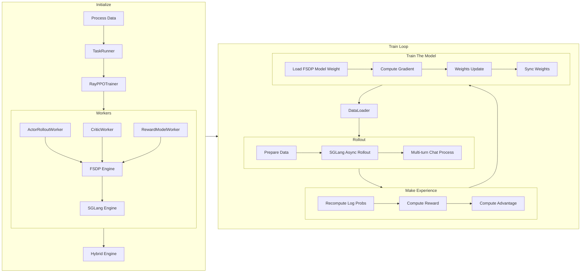

# 深入浅出理解 verl 源码 part 2

在 [Part 1](readme.md) 中，我们介绍了 verl 的初始化过程，我们进一步介绍 verl 的训练过程。

在 GRPO 中，单个 step 包含四个阶段：load data -> rollout -> make experience -> update model。区别于前一节的详述，本节会使用伪代码结合源码的方式进行阐述。



## 数据加载与预处理

verl 通过 `DataProto` 和 `RLHFDataset` 来实现数据处理。具体来说，在 [`main_ppo.py`](https://github.com/volcengine/verl/blob/76f63cffa5081564d8fea93a1cb3ce8bd5bdcc39/verl/trainer/main_ppo.py#L193) 中，我们观察这个函数：

<details>
<summary>create_rl_dataset 源码</summary>

```python
def create_rl_dataset(data_paths, data_config, tokenizer, processor):
    """Create a dataset.

    Arguments:
        data_paths: List of paths to data files.
        data_config: The data config.
        tokenizer (Tokenizer): The tokenizer.
        processor (Processor): The processor.

    Returns:
        dataset (Dataset): The dataset.
    """
    from torch.utils.data import Dataset

    from verl.utils.dataset.rl_dataset import RLHFDataset

    # Check if a custom dataset class is specified in the data configuration
    # and if the path to the custom class is provided
    if "custom_cls" in data_config and data_config.custom_cls.get("path", None) is not None:
        from verl.utils.import_utils import load_extern_type

        # Dynamically load the custom dataset class
        dataset_cls = load_extern_type(data_config.custom_cls.path, data_config.custom_cls.name)
        # Verify that the custom dataset class inherits from torch.utils.data.Dataset
        if not issubclass(dataset_cls, Dataset):
            raise TypeError(f"The custom dataset class '{data_config.custom_cls.name}' from '{data_config.custom_cls.path}' must inherit from torch.utils.data.Dataset")
    else:
        # Use the default RLHFDataset class if no custom class is specified
        dataset_cls = RLHFDataset
    print(f"Using dataset class: {dataset_cls.__name__}")

    # Instantiate the dataset using the determined dataset class
    dataset = dataset_cls(
        data_files=data_paths,
        tokenizer=tokenizer,
        processor=processor,
        config=data_config,
    )

    return dataset
```

</details>

非常典型，创造一个了 `RLHFDataset` 实例，并返回。而具体的 [`RLHFDataset`](https://github.com/volcengine/verl/blob/76f63cffa5081564d8fea93a1cb3ce8bd5bdcc39/verl/utils/dataset/rl_dataset.py#68) 实现如下：

<details>
<summary>RLHFDataset 实现</summary>

```python
class RLHFDataset(Dataset):
    """
    Load and preprocess RLHF data from Parquet files.

    - Caches files locally.
    - Reads into a HuggingFace Dataset and tokenizes prompts.
    - Optionally handles images/videos via a ProcessorMixin.
    - Filters prompts over a max length.
    - Supports resuming from checkpoints.

    Args:
        data_files (str or list): Path(s) to Parquet file(s).
        tokenizer (PreTrainedTokenizer): For the tokenization of text to token IDs.
        config (DictConfig): Options like cache_dir, prompt_key, max_prompt_length, truncation, etc.
        processor (ProcessorMixin, optional): Multimodal preprocessor for images/videos.
    """

    def __init__(
        self,
        data_files: Union[str, List[str]],
        tokenizer: PreTrainedTokenizer,
        config: DictConfig,
        processor: Optional[ProcessorMixin] = None,
    ):
        if not isinstance(data_files, (List, ListConfig)):
            data_files = [data_files]

        self.data_files = copy.deepcopy(data_files)
        self.original_data_files = copy.deepcopy(data_files)  # use for resume
        self.tokenizer = tokenizer
        self.processor = processor
        self.config = config

        self.cache_dir = os.path.expanduser(config.get("cache_dir", "~/.cache/verl/rlhf"))
        self.prompt_key = config.get("prompt_key", "prompt")
        self.image_key = config.get("image_key", "images")
        self.video_key = config.get("video_key", "videos")
        self.max_prompt_length = config.get("max_prompt_length", 1024)
        self.return_raw_chat = config.get("return_raw_chat", False)
        self.return_full_prompt = config.get("return_full_prompt", False)
        self.truncation = config.get("truncation", "error")
        self.filter_overlong_prompts = config.get("filter_overlong_prompts", True)

        self.num_workers = config.get("filter_overlong_prompts_workers", max(1, os.cpu_count() // 4))
        self.num_workers = min(self.num_workers, os.cpu_count())
        self.use_shm = config.get("use_shm", False)
        self.chat_template_func = config.get("chat_template_func", None)
        self.need_tools_kwargs = config.get("need_tools_kwargs", False)
        self.filter_prompts = config.get("filter_prompts", True)
        self.serialize_dataset = False
        self._download()
        self._read_files_and_tokenize()

    def _download(self, use_origin_parquet=False):
        from verl.utils.fs import copy_to_local

        data_files = self.data_files if not use_origin_parquet else self.original_data_files
        for i, parquet_file in enumerate(data_files):
            self.data_files[i] = copy_to_local(src=parquet_file, cache_dir=self.cache_dir, use_shm=self.use_shm)

    def _read_files_and_tokenize(self):
        dataframes = []
        for parquet_file in self.data_files:
            # read parquet files and cache
            dataframe = datasets.load_dataset("parquet", data_files=parquet_file)["train"]
            dataframes.append(dataframe)
        self.dataframe: datasets.Dataset = datasets.concatenate_datasets(dataframes)

        print(f"dataset len: {len(self.dataframe)}")

        # filter out too long prompts
        if self.filter_overlong_prompts:
            tokenizer = self.tokenizer
            processor = self.processor
            prompt_key = self.prompt_key
            image_key = self.image_key
            video_key = self.video_key

            if processor is not None:
                from verl.utils.dataset.vision_utils import process_image, process_video

                def doc2len(doc) -> int:
                    messages = self._build_messages(doc)
                    raw_prompt = self.processor.apply_chat_template(messages, add_generation_prompt=True, tokenize=False)
                    images = [process_image(image) for image in messages.pop(image_key)] if image_key in messages else None
                    videos = [process_video(video) for video in messages.pop(video_key)] if video_key in messages else None

                    return len(processor(text=[raw_prompt], images=images, videos=videos)["input_ids"][0])

            else:

                def doc2len(doc) -> int:
                    return len(tokenizer.apply_chat_template(doc[prompt_key], add_generation_prompt=True))

            self.dataframe = self.dataframe.filter(
                lambda doc: doc2len(doc) <= self.max_prompt_length,
                num_proc=self.num_workers,
                desc=f"Filtering prompts longer than {self.max_prompt_length} tokens",
            )

            print(f"filter dataset len: {len(self.dataframe)}")

    def resume_dataset_state(self):
        self.serialize_dataset = not hasattr(self, "original_data_files")
        # resume dataframe if not it's serialized in data.pt
        if not self.serialize_dataset:
            self._download(use_origin_parquet=True)  # download and resume from original parquet files
            self._read_files_and_tokenize()
        else:
            print(r"old dataloader ckpt file is used, please train from scratch for better ckpt performance")

    def __len__(self):
        return len(self.dataframe)

    def _build_messages(self, example: dict):
        messages: list = example.pop(self.prompt_key)

        if self.image_key in example or self.video_key in example:
            for message in messages:
                content = message["content"]
                content_list = []
                segments = re.split("(<image>|<video>)", content)
                segments = [item for item in segments if item != ""]
                for segment in segments:
                    if segment == "<image>":
                        content_list.append({"type": "image"})
                    elif segment == "<video>":
                        content_list.append({"type": "video"})
                    else:
                        content_list.append({"type": "text", "text": segment})

                message["content"] = content_list

        return messages

    def __getitem__(self, item):
        """
        Note that we also return the raw_input_ids so that it can be combined with other chat template
        """
        row_dict: dict = self.dataframe[item]
        messages = self._build_messages(row_dict)
        model_inputs = {}

        if self.processor is not None:
            from verl.utils.dataset.vision_utils import process_image, process_video

            raw_prompt = self.processor.apply_chat_template(messages, add_generation_prompt=True, tokenize=False)
            multi_modal_data = {}

            images = None
            if self.image_key in row_dict and row_dict.get(self.image_key, None) is not None:
                images = [process_image(image) for image in row_dict.pop(self.image_key)]
                multi_modal_data["image"] = images

            videos = None
            if self.video_key in row_dict and row_dict.get(self.video_key, None) is not None:
                videos = [process_video(video) for video in row_dict.pop(self.video_key)]
                multi_modal_data["video"] = [video.numpy() for video in videos]

            model_inputs = self.processor(text=[raw_prompt], images=images, videos=videos, return_tensors="pt")

            input_ids = model_inputs.pop("input_ids")
            attention_mask = model_inputs.pop("attention_mask")

            if "second_per_grid_ts" in model_inputs:
                model_inputs.pop("second_per_grid_ts")

            # There's a trap here, multi_modal_inputs has to be a dict, not BatchFeature
            row_dict["multi_modal_data"] = multi_modal_data
            row_dict["multi_modal_inputs"] = dict(model_inputs)

            # second_per_grid_ts isn't used for training, just for mrope
            row_dict["multi_modal_inputs"].pop("second_per_grid_ts", None)

        else:
            raw_prompt = self.tokenizer.apply_chat_template(messages, add_generation_prompt=True, tokenize=False)
            model_inputs = self.tokenizer(raw_prompt, return_tensors="pt", add_special_tokens=False)
            input_ids = model_inputs.pop("input_ids")
            attention_mask = model_inputs.pop("attention_mask")

        input_ids, attention_mask = verl_F.postprocess_data(
            input_ids=input_ids,
            attention_mask=attention_mask,
            max_length=self.max_prompt_length,
            pad_token_id=self.tokenizer.pad_token_id,
            left_pad=True,
            truncation=self.truncation,
        )

        if self.processor is not None and "Qwen2VLImageProcessor" in self.processor.image_processor.__class__.__name__:
            from verl.models.transformers.qwen2_vl import get_rope_index

            position_ids = [
                get_rope_index(
                    self.processor,
                    input_ids=input_ids[0],
                    image_grid_thw=model_inputs.get("image_grid_thw"),
                    video_grid_thw=model_inputs.get("video_grid_thw"),
                    second_per_grid_ts=model_inputs.get("second_per_grid_ts"),
                    attention_mask=attention_mask[0],
                )
            ]  # (1, 3, seq_len)

        else:
            position_ids = compute_position_id_with_mask(attention_mask)

        row_dict["input_ids"] = input_ids[0]
        row_dict["attention_mask"] = attention_mask[0]
        row_dict["position_ids"] = position_ids[0]

        raw_prompt_ids = self.tokenizer.encode(raw_prompt, add_special_tokens=False)
        if len(raw_prompt_ids) > self.max_prompt_length:
            if self.truncation == "left":
                raw_prompt_ids = raw_prompt_ids[-self.max_prompt_length :]
            elif self.truncation == "right":
                raw_prompt_ids = raw_prompt_ids[: self.max_prompt_length]
            elif self.truncation == "middle":
                left_half = self.max_prompt_length // 2
                right_half = self.max_prompt_length - left_half
                raw_prompt_ids = raw_prompt_ids[:left_half] + raw_prompt_ids[-right_half:]
            elif self.truncation == "error":
                raise RuntimeError(f"Prompt length {len(raw_prompt_ids)} is longer than {self.max_prompt_length}.")

        row_dict["raw_prompt_ids"] = raw_prompt_ids
        # encode prompts without chat template
        if self.return_raw_chat:
            row_dict["raw_prompt"] = messages

        # get prompts with chat template
        if self.return_full_prompt:
            row_dict["full_prompts"] = raw_prompt  # array of strings

        # add index for each prompt
        index = row_dict.get("extra_info", {}).get("index", 0)
        tools_kwargs = row_dict.get("extra_info", {}).get("tools_kwargs", {})
        need_tools_kwargs = row_dict.get("extra_info", {}).get("need_tools_kwargs", self.need_tools_kwargs)
        if need_tools_kwargs and not tools_kwargs:
            logger.warning("tools_kwargs is empty for index {}, data source: {}", index, row_dict["data_source"])
        row_dict["index"] = index
        row_dict["tools_kwargs"] = tools_kwargs
        return row_dict

    def __getstate__(self):
        if not self.serialize_dataset:
            state = self.__dict__.copy()

            if "dataframe" in state:
                del state["dataframe"]
            return state

        return self.__dict__.copy()

```

</details>

1. 支持从远程存储下载 Parquet 文件到本地缓存，支持共享内存加速文件访问，自动管理文件路径，支持检查点恢复。
2. 使用 HuggingFace `datasets` 库读取 Parquet 文件，支持多个数据文件的合并，自动处理数据格式转换。
3. 根据最大长度过滤过长的 prompts，支持多进程并行处理，可配置的过滤策略。
4. 支持图像和视频的多模态输入，解析 `<image>` 和 `<video>` 标签，将多模态内容转换为结构化格式。
5. 添加 chat template 来格式化对话，将文本转换为 token IDs，生成 attn mask 和 position ids。
6. padding 到指定长度，支持多种截断策略（left, right, middle, error），生成位置编码。
7. 支持训练中断后的恢复，可以从原始文件重新构建数据集，兼容序列化/反序列化。
8. 返回包含以下关键字段的字典：`input_ids`, `attention_mask`, `position_ids`, `raw_prompt_ids`, `multi_modal_data`, `multi_modal_inputs`, `index`, `tools_kwargs`。

这里最重要的一个参数是 `tools_kwargs`，用于为不同的 tools 提供配置参数。它的结构如下：

```python
tools_kwargs = {
    "tool_name": {
        "create_kwargs": {...},      # 工具创建时的参数
        "execute_kwargs": {...},     # 工具执行时的参数（可选）
        "calc_reward_kwargs": {...}, # 计算奖励时的参数（可选）
        "release_kwargs": {...},     # 释放资源时的参数（可选）
    }
}
```

比如 Search-R1 的 `tools_kwargs` 如下：

```python
tools_kwargs = {
    "search-r1": {
        "create_kwargs": {
            "ground_truth": ground_truth,
            "question": question, 
            "data_source": data_source_tagged
        }
    }
}
```

具体这些参数是如何调用了一个 tool，我们会留在后续部分继续介绍。

## 训练入口 [`RayPPOTrainer.fit()`](https://github.com/volcengine/verl/blob/76f63cffa5081564d8fea93a1cb3ce8bd5bdcc39/verl/trainer/ppo/ray_trainer.py#L903)

1. 创建 Tracking 日志记录器，设置全局步数，加载检查点，并在训练前进行验证。
2. 使用 tqdm 创建进度条，显示训练进度，并设置初始步数。
3. 遍历配置的总 epoch 数和数据加载器，每个 train batch 更新多步。
4. 从 batch 中分离出用于 rollout 的数据（`input_ids`, `attention_mask`, `position_ids` 等），保留其他数据用于后续处理。
5. 调用 `ActorRolloutWorker` 生成序列，并记录生成时间。
6. 处理 REMAX 基线（如果使用）：生成确定性基线序列，计算基线奖励，用于 REMAX 优势估计器。
7. 为每个样本分配唯一 ID，重复数据以对齐多次采样，计算响应掩码，并可选地进行批次平衡。
8. 根据配置使用奖励模型或自定义奖励函数计算 token 级别的奖励分数，支持同步和异步计算。
9. 使用 megatron 基于训练开始前的 policy 重新计算 behaviour policy 的 log probabilities，用于重要性采样，同时计算熵值。（原因在 [part 1](./readme.md#actorrolloutrefworker__init__) 讲过）
10. 使用 reference policy 计算 log probs，用于 KL 散度计算。
11. 使用 Critic 网络计算状态价值，用于优势函数估计。
12. 根据配置的优势估计器（GAE、GRPO、REMAX 等）计算优势函数，支持 KL 惩罚。
13. 使用计算出的优势函数更新 Critic 网络参数。
14. 在 Critic 预热完成后，使用 PPO 损失函数更新 Actor 网络参数。
15. 将生成的序列、输入、输出和分数保存到指定目录。
16. 根据配置的频率执行验证，计算验证指标并记录。
17. 根据配置的频率保存模型检查点。
18. 收集训练指标、时序指标和吞吐量指标，并记录到日志系统。
19. 更新进度条，递增全局步数，并在达到总训练步数时结束训练。
20. 根据配置在特定步数启用/禁用性能分析，用于调试和优化。

<details>
<summary>RayPPOTrainer.fit() 源码</summary>

```python
def fit(self):
    """
    The training loop of PPO.
    The driver process only need to call the compute functions of the worker group through RPC
    to construct the PPO dataflow.
    The light-weight advantage computation is done on the driver process.
    """
    from omegaconf import OmegaConf

    from verl.utils.tracking import Tracking

    logger = Tracking(
        project_name=self.config.trainer.project_name,
        experiment_name=self.config.trainer.experiment_name,
        default_backend=self.config.trainer.logger,
        config=OmegaConf.to_container(self.config, resolve=True),
    )

    self.global_steps = 0

    # load checkpoint before doing anything
    self._load_checkpoint()

    # perform validation before training
    # currently, we only support validation using the reward_function.
    if self.val_reward_fn is not None and self.config.trainer.get("val_before_train", True):
        val_metrics = self._validate()
        assert val_metrics, f"{val_metrics=}"
        pprint(f"Initial validation metrics: {val_metrics}")
        logger.log(data=val_metrics, step=self.global_steps)
        if self.config.trainer.get("val_only", False):
            return

    # add tqdm
    progress_bar = tqdm(total=self.total_training_steps, initial=self.global_steps, desc="Training Progress")

    # we start from step 1
    self.global_steps += 1
    last_val_metrics = None

    for epoch in range(self.config.trainer.total_epochs):
        for batch_dict in self.train_dataloader:
            do_profile = self.global_steps in self.config.trainer.profile_steps if self.config.trainer.profile_steps is not None else False
            if do_profile:
                self.actor_rollout_wg.start_profile()
                if self.use_reference_policy:
                    self.ref_policy_wg.start_profile()
                if self.use_critic:
                    self.critic_wg.start_profile()
                if self.use_rm:
                    self.rm_wg.start_profile()

            metrics = {}
            timing_raw = {}
            batch: DataProto = DataProto.from_single_dict(batch_dict)

            # pop those keys for generation
            batch_keys_to_pop = ["input_ids", "attention_mask", "position_ids"]
            non_tensor_batch_keys_to_pop = ["raw_prompt_ids"]
            if "multi_modal_data" in batch.non_tensor_batch:
                non_tensor_batch_keys_to_pop.append("multi_modal_data")
            if "raw_prompt" in batch.non_tensor_batch:
                non_tensor_batch_keys_to_pop.append("raw_prompt")
            if "tools_kwargs" in batch.non_tensor_batch:
                non_tensor_batch_keys_to_pop.append("tools_kwargs")
            gen_batch = batch.pop(
                batch_keys=batch_keys_to_pop,
                non_tensor_batch_keys=non_tensor_batch_keys_to_pop,
            )

            is_last_step = self.global_steps >= self.total_training_steps

            with marked_timer("step", timing_raw):
                # generate a batch
                with marked_timer("gen", timing_raw, color="red"):
                    if not self.async_rollout_mode:
                        gen_batch_output = self.actor_rollout_wg.generate_sequences(gen_batch)
                    else:
                        self.async_rollout_manager.wake_up()
                        gen_batch_output = self.async_rollout_manager.generate_sequences(gen_batch)
                        self.async_rollout_manager.sleep()
                    timing_raw.update(gen_batch_output.meta_info["timing"])
                    gen_batch_output.meta_info.pop("timing", None)

                if self.config.algorithm.adv_estimator == AdvantageEstimator.REMAX:
                    with marked_timer("gen_max", timing_raw, color="purple"):
                        gen_baseline_batch = deepcopy(gen_batch)
                        gen_baseline_batch.meta_info["do_sample"] = False
                        gen_baseline_output = self.actor_rollout_wg.generate_sequences(gen_baseline_batch)

                        batch = batch.union(gen_baseline_output)
                        reward_baseline_tensor = self.reward_fn(batch)
                        reward_baseline_tensor = reward_baseline_tensor.sum(dim=-1)

                        batch.pop(batch_keys=list(gen_baseline_output.batch.keys()))

                        batch.batch["reward_baselines"] = reward_baseline_tensor

                        del gen_baseline_batch, gen_baseline_output

                batch.non_tensor_batch["uid"] = np.array([str(uuid.uuid4()) for _ in range(len(batch.batch))], dtype=object)
                # repeat to align with repeated responses in rollout
                batch = batch.repeat(repeat_times=self.config.actor_rollout_ref.rollout.n, interleave=True)
                batch = batch.union(gen_batch_output)

                batch.batch["response_mask"] = compute_response_mask(batch)
                # Balance the number of valid tokens across DP ranks.
                # NOTE: This usually changes the order of data in the `batch`,
                # which won't affect the advantage calculation (since it's based on uid),
                # but might affect the loss calculation (due to the change of mini-batching).
                # TODO: Decouple the DP balancing and mini-batching.
                if self.config.trainer.balance_batch:
                    self._balance_batch(batch, metrics=metrics)

                # compute global_valid tokens
                batch.meta_info["global_token_num"] = torch.sum(batch.batch["attention_mask"], dim=-1).tolist()

                with marked_timer("reward", timing_raw, color="yellow"):
                    # compute reward model score
                    if self.use_rm:
                        reward_tensor = self.rm_wg.compute_rm_score(batch)
                        batch = batch.union(reward_tensor)

                    if self.config.reward_model.launch_reward_fn_async:
                        future_reward = compute_reward_async.remote(batch, self.config, self.tokenizer)
                    else:
                        reward_tensor, reward_extra_infos_dict = compute_reward(batch, self.reward_fn)

                # recompute old_log_probs
                with marked_timer("old_log_prob", timing_raw, color="blue"):
                    old_log_prob = self.actor_rollout_wg.compute_log_prob(batch)
                    entropys = old_log_prob.batch["entropys"]
                    response_masks = batch.batch["response_mask"]
                    loss_agg_mode = self.config.actor_rollout_ref.actor.loss_agg_mode
                    entropy_agg = agg_loss(loss_mat=entropys, loss_mask=response_masks, loss_agg_mode=loss_agg_mode)
                    old_log_prob_metrics = {"actor/entropy": entropy_agg.detach().item()}
                    metrics.update(old_log_prob_metrics)
                    old_log_prob.batch.pop("entropys")
                    batch = batch.union(old_log_prob)

                    if "rollout_log_probs" in batch.batch.keys():
                        # TODO: we may want to add diff of probs too.
                        rollout_old_log_probs = batch.batch["rollout_log_probs"]
                        actor_old_log_probs = batch.batch["old_log_probs"]
                        attention_mask = batch.batch["attention_mask"]
                        responses = batch.batch["responses"]
                        response_length = responses.size(1)
                        response_mask = attention_mask[:, -response_length:]

                        rollout_probs = torch.exp(rollout_old_log_probs)
                        actor_probs = torch.exp(actor_old_log_probs)
                        rollout_probs_diff = torch.abs(rollout_probs - actor_probs)
                        rollout_probs_diff = torch.masked_select(rollout_probs_diff, response_mask.bool())
                        rollout_probs_diff_max = torch.max(rollout_probs_diff)
                        rollout_probs_diff_mean = torch.mean(rollout_probs_diff)
                        rollout_probs_diff_std = torch.std(rollout_probs_diff)
                        metrics.update(
                            {
                                "training/rollout_probs_diff_max": rollout_probs_diff_max.detach().item(),
                                "training/rollout_probs_diff_mean": rollout_probs_diff_mean.detach().item(),
                                "training/rollout_probs_diff_std": rollout_probs_diff_std.detach().item(),
                            }
                        )

                if self.use_reference_policy:
                    # compute reference log_prob
                    with marked_timer("ref", timing_raw, color="olive"):
                        if not self.ref_in_actor:
                            ref_log_prob = self.ref_policy_wg.compute_ref_log_prob(batch)
                        else:
                            ref_log_prob = self.actor_rollout_wg.compute_ref_log_prob(batch)
                        batch = batch.union(ref_log_prob)

                # compute values
                if self.use_critic:
                    with marked_timer("values", timing_raw, color="cyan"):
                        values = self.critic_wg.compute_values(batch)
                        batch = batch.union(values)

                with marked_timer("adv", timing_raw, color="brown"):
                    # we combine with rule-based rm
                    reward_extra_infos_dict: dict[str, list]
                    if self.config.reward_model.launch_reward_fn_async:
                        reward_tensor, reward_extra_infos_dict = ray.get(future_reward)
                    batch.batch["token_level_scores"] = reward_tensor

                    if reward_extra_infos_dict:
                        batch.non_tensor_batch.update({k: np.array(v) for k, v in reward_extra_infos_dict.items()})

                    # compute rewards. apply_kl_penalty if available
                    if self.config.algorithm.use_kl_in_reward:
                        batch, kl_metrics = apply_kl_penalty(batch, kl_ctrl=self.kl_ctrl_in_reward, kl_penalty=self.config.algorithm.kl_penalty)
                        metrics.update(kl_metrics)
                    else:
                        batch.batch["token_level_rewards"] = batch.batch["token_level_scores"]

                    # compute advantages, executed on the driver process

                    norm_adv_by_std_in_grpo = self.config.algorithm.get("norm_adv_by_std_in_grpo", True)  # GRPO adv normalization factor

                    batch = compute_advantage(
                        batch,
                        adv_estimator=self.config.algorithm.adv_estimator,
                        gamma=self.config.algorithm.gamma,
                        lam=self.config.algorithm.lam,
                        num_repeat=self.config.actor_rollout_ref.rollout.n,
                        norm_adv_by_std_in_grpo=norm_adv_by_std_in_grpo,
                        multi_turn=self.config.actor_rollout_ref.rollout.multi_turn.enable,
                        config=self.config.algorithm,
                    )

                # update critic
                if self.use_critic:
                    with marked_timer("update_critic", timing_raw, color="pink"):
                        critic_output = self.critic_wg.update_critic(batch)
                    critic_output_metrics = reduce_metrics(critic_output.meta_info["metrics"])
                    metrics.update(critic_output_metrics)

                # implement critic warmup
                if self.config.trainer.critic_warmup <= self.global_steps:
                    # update actor
                    with marked_timer("update_actor", timing_raw, color="red"):
                        batch.meta_info["multi_turn"] = self.config.actor_rollout_ref.rollout.multi_turn.enable
                        actor_output = self.actor_rollout_wg.update_actor(batch)
                    actor_output_metrics = reduce_metrics(actor_output.meta_info["metrics"])
                    metrics.update(actor_output_metrics)

                # Log rollout generations if enabled
                rollout_data_dir = self.config.trainer.get("rollout_data_dir", None)
                if rollout_data_dir:
                    with marked_timer("dump_rollout_generations", timing_raw, color="green"):
                        print(batch.batch.keys())
                        inputs = self.tokenizer.batch_decode(batch.batch["prompts"], skip_special_tokens=True)
                        outputs = self.tokenizer.batch_decode(batch.batch["responses"], skip_special_tokens=True)
                        scores = batch.batch["token_level_scores"].sum(-1).cpu().tolist()
                        self._dump_generations(
                            inputs=inputs,
                            outputs=outputs,
                            scores=scores,
                            reward_extra_infos_dict=reward_extra_infos_dict,
                            dump_path=rollout_data_dir,
                        )

                # validate
                if self.val_reward_fn is not None and self.config.trainer.test_freq > 0 and (is_last_step or self.global_steps % self.config.trainer.test_freq == 0):
                    with marked_timer("testing", timing_raw, color="green"):
                        val_metrics: dict = self._validate()
                        if is_last_step:
                            last_val_metrics = val_metrics
                    metrics.update(val_metrics)

                if self.config.trainer.save_freq > 0 and (is_last_step or self.global_steps % self.config.trainer.save_freq == 0):
                    with marked_timer("save_checkpoint", timing_raw, color="green"):
                        self._save_checkpoint()

            # training metrics
            metrics.update(
                {
                    "training/global_step": self.global_steps,
                    "training/epoch": epoch,
                }
            )
            # collect metrics
            metrics.update(compute_data_metrics(batch=batch, use_critic=self.use_critic))
            metrics.update(compute_timing_metrics(batch=batch, timing_raw=timing_raw))
            # TODO: implement actual tflpo and theoretical tflpo
            n_gpus = self.resource_pool_manager.get_n_gpus()
            metrics.update(compute_throughout_metrics(batch=batch, timing_raw=timing_raw, n_gpus=n_gpus))

            # TODO: make a canonical logger that supports various backend
            logger.log(data=metrics, step=self.global_steps)

            progress_bar.update(1)
            self.global_steps += 1

            if do_profile:
                self.actor_rollout_wg.stop_profile()
                if self.use_reference_policy:
                    self.ref_policy_wg.stop_profile()
                if self.use_critic:
                    self.critic_wg.stop_profile()
                if self.use_rm:
                    self.rm_wg.stop_profile()

            if is_last_step:
                pprint(f"Final validation metrics: {last_val_metrics}")
                progress_bar.close()
                return
```

</details>

## 我们究竟在异步什么？

这里很值得分享一个核心问题，对 SGLang 而言，或者对现在的 RL 而言，我们每天说来说去的 async 究竟是什么意思？和 PD 分离一样，async 也有非常多的层面：

1. Async RL 代表的是在 training rollout 分离的系统上，rollout 只在 update weights 的时候被打断，其余时刻永远 rollout，哪怕 target policy 正在被 training engine 更新。这方面是 [AreaL](https://github.com/inclusionAI/AReaL) 和 [SLIME](https://github.com/THUDM/slime)。

2. Async Rollout 这个词是特指在 rollout 的时候，把一个 batch requests 拆为单个 request，然后逐个调用 `SGLangEngine.generate()`。

乍一听，这没有什么特别的，似乎还会更慢些。但是考虑到 tool call 的问题，这就非常严肃了。假设我们把一整个 batch 的 requests 作为一个 batch 塞给 sglang 似乎还要快些，毕竟对 SGLang 的 scheduler 而言，更好组 batch。但是，一整个 batch 进去，得一整个 batch 出来。这些 batch 里面的 requests 同时返回，同时被 paser 解析查看是否有 tool call 的 parameter，然后发送请求给 tool。如此以来，整个 tool 的调用大概率会拥堵，甚至在我们考虑到如果要加入多个 tool（虽然目前没有）的话，用一个状态机去管理每个 request 的 tool call 状态会成一场噩梦，何况有的 requests 会在多轮里面多次调用 tool。因此，为了方便管理每个 request tool call 的状态机和让 tool 被调度的更加均匀。SGLang 采取了 Async Rollout 策略，也即把一个 batch 的 requests 拆为单个 request，然后逐个异步调用 `SGLangEngine.generate()`。这样每个 reqeuest 自己管理自己的状态机，方便维护并且 tool call 效率更高。

理解了这一层，我们可以来看看代码实现：

<details>
<summary>generate_sequences 源码</summary>

```python

@GPUMemoryLogger(role="sglang rollout", logger=logger)
@torch.no_grad()
def generate_sequences(self, prompts: DataProto, **kwargs) -> DataProto:
    if self.config.multi_turn.enable:
        return self._req_level_generate_sequences(prompts, **kwargs)
    return self._batch_level_generate_sequences(prompts, **kwargs)

```
</details>

这里明确指出，如果是用了 mutli-turn 训练，则将 batch 的 requests 拆为单个 request，调用 `_req_level_generate_sequences`；而不调用 tool 的单轮 RL，仍旧组 batch 直接发送。

我们只观察 `_req_level_generate_sequences` 的部分源码：

<details>
<summary>_req_level_generate_sequences 部分源码</summary>


```python
@GPUMemoryLogger(role="sglang rollout", logger=logger)
@torch.no_grad()
def _req_level_generate_sequences(self, prompts: DataProto, **kwargs) -> DataProto:
    # Async rollout with tools support
    do_sample = prompts.meta_info.get("do_sample", True)
    is_validate = prompts.meta_info.get("validate", False)
    tgt_device = prompts.batch["input_ids"].device
    if self._tp_rank == 0:
        req_list = self._preprocess_prompt_to_async_rollout_requests(
            prompts,
            n=1 if is_validate else self.config.n,
        )
        loop = asyncio.get_event_loop()
        output_req_list = loop.run_until_complete(
            asyncio.gather(
                *[self._async_rollout_a_request(req, do_sample, is_validate, **kwargs) for req in req_list],
            )
        )
        sorted_output_req_list = sorted(output_req_list, key=lambda x: (x.batch_data_id, x.rollout_offset))
    else:
        sorted_output_req_list = None
```

</details>

现在来看，`asyncio.gather(*[self._async_rollout_a_request(req, do_sample, is_validate, **kwargs) for req in req_list],)` 就显得无比清晰了。

## 数据流管理

我们继续去理解 `RayPPOTrainer.fit()` 函数，从数据流管理开始。这里我认为最重要的两个类是 `DataProto` 和 `RLHFDataset`。

### `DataProto`

`DataProto` 是 verl 的数据交换协议，定义在 [`protocol.py`](https://github.com/volcengine/verl/blob/76f63cffa5081564d8fea93a1cb3ce8bd5bdcc39/verl/protocol.py#L202)：

```python
@dataclass
class DataProto:
    """
    A DataProto is a data structure that aims to provide a standard protocol for data exchange between functions.
    It contains a batch (TensorDict) and a meta_info (Dict). The batch is a TensorDict https://pytorch.org/tensordict/.
    TensorDict allows you to manipulate a dictionary of Tensors like a single Tensor. Ideally, the tensors with the
    same batch size should be put inside batch.
    """

    batch: TensorDict = None
    non_tensor_batch: Dict = field(default_factory=dict)
    meta_info: Dict = field(default_factory=dict)
```

`DataProto` 提供标准化的数据交换协议，基于 PyTorch 的 TensorDict，支持张量的批量操作，同时通过 `non_tensor_batch` 字典来处理 NumPy 数组等非张量数据。`meta_info` 存储额外的元信息。本身支持的操作挺基础的，典型的比如数据创建、切片、选择、合并、重命名、重复、填充、分块、以及分布式环境下的数据集合与分发。除此之外，`DataProto` 还通过数据验证 `check_consistency()` 确保在数据分离和合并过程的一致性。

### `RLHFDataset`

[`RLHFDataset`]((https://github.com/volcengine/verl/blob/76f63cffa5081564d8fea93a1cb3ce8bd5bdcc39/verl/utils/dataset/rl_dataset.py#L68)) 是 verl 中用于 RLHF 数据加载的数据集类，继承自 `datasets.Dataset`，主要用于处理 Parquet 文件中的数据，包括数据下载、tokenize、过滤、预处理等。

<details>
<summary>RLHFDataset 源码</summary>

```python
class RLHFDataset(Dataset):
    """
    Load and preprocess RLHF data from Parquet files.

    - Caches files locally.
    - Reads into a HuggingFace Dataset and tokenizes prompts.
    - Optionally handles images/videos via a ProcessorMixin.
    - Filters prompts over a max length.
    - Supports resuming from checkpoints.

    Args:
        data_files (str or list): Path(s) to Parquet file(s).
        tokenizer (PreTrainedTokenizer): For the tokenization of text to token IDs.
        config (DictConfig): Options like cache_dir, prompt_key, max_prompt_length, truncation, etc.
        processor (ProcessorMixin, optional): Multimodal preprocessor for images/videos.
    """

    def __init__(
        self,
        data_files: Union[str, List[str]],
        tokenizer: PreTrainedTokenizer,
        config: DictConfig,
        processor: Optional[ProcessorMixin] = None,
    ):
        if not isinstance(data_files, (List, ListConfig)):
            data_files = [data_files]

        self.data_files = copy.deepcopy(data_files)
        self.original_data_files = copy.deepcopy(data_files)  # use for resume
        self.tokenizer = tokenizer
        self.processor = processor
        self.config = config

        self.cache_dir = os.path.expanduser(config.get("cache_dir", "~/.cache/verl/rlhf"))
        self.prompt_key = config.get("prompt_key", "prompt")
        self.image_key = config.get("image_key", "images")
        self.video_key = config.get("video_key", "videos")
        self.max_prompt_length = config.get("max_prompt_length", 1024)
        self.return_raw_chat = config.get("return_raw_chat", False)
        self.return_full_prompt = config.get("return_full_prompt", False)
        self.truncation = config.get("truncation", "error")
        self.filter_overlong_prompts = config.get("filter_overlong_prompts", True)

        self.num_workers = config.get("filter_overlong_prompts_workers", max(1, os.cpu_count() // 4))
        self.num_workers = min(self.num_workers, os.cpu_count())
        self.use_shm = config.get("use_shm", False)
        self.chat_template_func = config.get("chat_template_func", None)
        self.need_tools_kwargs = config.get("need_tools_kwargs", False)
        self.filter_prompts = config.get("filter_prompts", True)
        self.serialize_dataset = False
        self._download()
        self._read_files_and_tokenize()
```

</details>

有了 `DataProto` 和 `RLHFDataset` 后，我们来观察数据流：

```text
A：Parquet 文件 --> B：RLHFDataset --> C：DataLoader + collate_fn --> D：DataProto 原始数据 --> E：pop 提取生成数据 --> F：Rollout 生成 --> G：union 合并数据 --> H：奖励计算 --> I：优势计算 --> J：重新计算 log_probs --> K：计算参考 log_probs --> L：计算价值函数 --> M1：更新 critic --> M2：更新 actor --> N：返回训练指标
```

事实上，只有最初的三步不是 `DataProto`，其他都是通过 `DataProto` 进行数据交换的。具体每步的数据流向如下：

<details>
<summary>数据流详细分析</summary>

A：`Parquet` 文件

```python
data_files = "~/data/rlhf/gsm8k/train.parquet"
```

B：RLHFDataset

```python
dataset = RLHFDataset(
    data_files=data_files,
    tokenizer=tokenizer,
    config=config,
    processor=processor
)
```

C：DataLoader + collate_fn

```python
dataloader = DataLoader(
    dataset=dataset,
    batch_size=16,
    shuffle=True,
    drop_last=True,
    collate_fn=collate_fn
)
```

D：`DataProto` 原始数据

```python
batch_dict = next(iter(dataloader))  # 返回 dict
batch: DataProto = DataProto.from_single_dict(batch_dict)
```

E：`pop` 提取生成数据

```python
gen_batch = batch.pop(batch_keys=["input_ids", "attention_mask", "position_ids"])
```

F：`Rollout` 生成

```python
gen_batch_output = self.actor_rollout_wg.generate_sequences(gen_batch)
```

G：`union` 合并数据

```python
batch = batch.union(gen_batch_output)
```

H：奖励计算

```python
rewards = self.reward_fn(batch)
batch.batch["token_level_rewards"] = rewards
```

I：优势计算

```python
batch = compute_advantage(batch, adv_estimator=self.config.algorithm.adv_estimator)
```

J：重新计算 `log_probs`

```python
old_log_prob = self.actor_rollout_wg.compute_log_prob(batch)
batch = batch.union(old_log_prob)
```

K：计算 reference model 的 `log_probs`

```python
if self.use_reference_policy:
    ref_log_prob = self.ref_policy_wg.compute_ref_log_prob(batch)
    batch = batch.union(ref_log_prob)
```

L：计算 value function

```python
if self.use_critic:
    values = self.critic_wg.compute_values(batch)
    batch = batch.union(values)
```

M1：更新 critic

```python
if self.use_critic:
    critic_output = self.critic_wg.update_critic(batch)
    critic_output_metrics = reduce_metrics(critic_output.meta_info["metrics"])
    metrics.update(critic_output_metrics)
```

M2：更新 actor

```python
actor_output = self.actor_rollout_wg.update_actor(batch)
```

N：返回训练指标

```python
actor_output_metrics = reduce_metrics(actor_output.meta_info["metrics"])
metrics.update(actor_output_metrics)
logger.log(data=metrics, step=self.global_steps)
```

</details>

## Rollout

在 part 1 已经讲过了 SGLang 的几个关键函数：

1. [`ActorRolloutRefWorker._build_rollout()`](https://github.com/zhaochenyang20/Awesome-ML-SYS-Tutorial/blob/main/rlhf/verl/multi-turn/code-walk-through/readme.md#actorrolloutrefworker_build_rollout)
2. [`SGLangRollout.__init__()`](https://github.com/zhaochenyang20/Awesome-ML-SYS-Tutorial/blob/main/rlhf/verl/multi-turn/code-walk-through/readme.md#sglangrollout__init__)
3. [`SGLangRollout.AsyncEngine`](https://github.com/zhaochenyang20/Awesome-ML-SYS-Tutorial/blob/main/rlhf/verl/multi-turn/code-walk-through/readme.md#sglangrolloutasyncengine)
4. [`SGLangRollout._init_inference_engine()`](https://github.com/zhaochenyang20/Awesome-ML-SYS-Tutorial/blob/main/rlhf/verl/multi-turn/code-walk-through/readme.md#sglangrollout_init_inference_engine)

此外，我们还介绍了在[“我们究竟在异步什么？“](#我们究竟在异步什么)里面介绍了 SGLang 对 multi-turn 场景下的 `_req_level_generate_sequences` 的特殊实现。我们接着继续分析 SGLang rollout 对 multi-turn 的处理，包括状态机和 tool 调用。

### [`_req_level_generate_sequences`](https://github.com/volcengine/verl/blob/76f63cffa5081564d8fea93a1cb3ce8bd5bdcc39/verl/workers/rollout/sglang_rollout/sglang_rollout.py#L853)

接着上文的讨论，我们继续来看看源代码。

1. 如果当前是 tp rank 0，则将一整个 batch 的 prompts 预处理成单个异步请求，并并发执行这些请求以生成序列。rollout 的返回顺序是乱序的，因此需要按照 batch ID 和在 batch 内的 offset 来对返回值重新排序。
2. 如果不是 tp rank 0，则将输出请求列表设置为 `None`。这里其实也是之前提到过的 [mock SPMD 的体现](https://github.com/zhaochenyang20/Awesome-ML-SYS-Tutorial/blob/main/rlhf/verl/multi-turn/code-walk-through/readme.md#sglangrollout_init_inference_engine)。
3. 使用分布式通信，将 tp rank 0 生成的排序后的请求列表广播给所有其他 rank。
4. 提取 prompt IDs、response IDs、attention masks、position IDs、loss masks、原始消息和 reward scores。
5. 使用 padding token 对 prompt IDs 和 response IDs 进行填充，使其长度一致。
6. 将填充后的 prompt 和 response 的 IDs、attention masks 等在最后一个维度上进行拼接，形成完整的序列数据。
7. 将处理后的 prompts 和 responses 存储到 `TensorDict` 对象中，并设置批次大小。
8. 将包含批次化张量数据的 `TensorDict` 和包含原始消息及奖励分数的字典封装到 `DataProto` 对象中并返回。

这里有个比较有趣的地方，注意到 2 中我们强调了，SGLang 并不是严格的 SPMD，但是 3 中，我们仍旧将 tp 0 得到的 response broadcast 给了所有 rank。但是，为了保持 SGLang 外部的训练循环仍旧得到的是一个 SPMD 的返回结果，我们需要让每个 tp randk 都构造并返回相同的 batch，这就需要通过 broadcast 让其他 tp rank 获得 tp 0 的计算结果。这导致了一定的计算冗余，但是相比推理本身的开销，仍旧是可以负担的。

<details>
<summary>_req_level_generate_sequences 源码</summary>

```python
@GPUMemoryLogger(role="sglang rollout", logger=logger)
    @torch.no_grad()
    def _req_level_generate_sequences(self, prompts: DataProto, **kwargs) -> DataProto:

        do_sample = prompts.meta_info.get("do_sample", True)
        is_validate = prompts.meta_info.get("validate", False)
        tgt_device = prompts.batch["input_ids"].device
        if self._tp_rank == 0:
            req_list = self._preprocess_prompt_to_async_rollout_requests(
                prompts,
                n=1 if is_validate else self.config.n, 
            )
            loop = asyncio.get_event_loop()
            output_req_list = loop.run_until_complete(
                asyncio.gather(
                    *[self._async_rollout_a_request(req, do_sample, is_validate, **kwargs) for req in req_list],
                )
            )
            sorted_output_req_list = sorted(output_req_list, key=lambda x: (x.batch_data_id, x.rollout_offset))
        else:
            sorted_output_req_list = None

        dist.barrier()
        [sorted_output_req_list] = broadcast_pyobj(
            data=[sorted_output_req_list],
            rank=self._rank,
            dist_group=self._device_mesh_cpu["tp"].get_group(),
            src=self._device_mesh_cpu["tp"].mesh[0].item(),
            force_cpu_device=False,
        )

        prompt_ids, response_ids = [], []
        prompt_attention_mask, response_attention_mask = [], []
        prompt_position_ids, response_position_ids = [], []
        prompt_loss_mask, response_loss_mask = [], []
        messages = []
        reward_scores = []
        for req in sorted_output_req_list:
            assert req.state == AsyncRolloutRequestStateEnum.COMPLETED, f"Request {req.request_id} is not completed"
            assert len(req.input_ids) == len(req.attention_mask) == len(req.position_ids) == len(req.loss_mask), f"""Request {req.request_id} has different length of
                {len(req.input_ids)=}, {len(req.attention_mask)=}, {len(req.position_ids)=}, {len(req.loss_mask)=}"""
            error_message_lines = [
                f"""Request {req.request_id} has input_ids length {len(req.input_ids)}
                    greater than max_model_len {self.config.max_model_len}""",
                f"Decoded input_ids: {self.tokenizer.decode(req.input_ids)}",
                f"Decoded prompt_ids: {self.tokenizer.decode(req.prompt_ids)}",
                f"Decoded response_ids: {self.tokenizer.decode(req.response_ids)}",
                f"Messages: {req.messages}",
                f"Max model length: {req.max_model_len}",
            ]
            error_message = "\n".join(error_message_lines)
            assert len(req.input_ids) <= self.config.max_model_len, error_message

            prompt_ids.append(torch.tensor(req.prompt_ids, dtype=torch.int, device=tgt_device))
            response_ids.append(torch.tensor(req.response_ids, dtype=torch.int, device=tgt_device))
            if len(req.response_ids) > self.config.response_length:
                logger.warning(
                    f"""{req.request_id=} has response_ids length {len(req.response_ids)}
                    greater than max_response_len {self.config.response_length},\n{req=}"""
                )
            prompt_attention_mask.append(torch.tensor(req.prompt_attention_mask, dtype=torch.int, device=tgt_device))
            response_attention_mask.append(torch.tensor(req.response_attention_mask, dtype=torch.int, device=tgt_device))
            prompt_position_ids.append(torch.tensor(req.prompt_position_ids, dtype=torch.int, device=tgt_device))
            response_position_ids.append(torch.tensor(req.response_position_ids, dtype=torch.int, device=tgt_device))
            prompt_loss_mask.append(torch.tensor(req.prompt_loss_mask, dtype=torch.int, device=tgt_device))
            response_loss_mask.append(torch.tensor(req.response_loss_mask, dtype=torch.int, device=tgt_device))
            messages.append({"messages": req.messages})
            reward_scores.append(req.reward_scores)

        prompt_ids = pad_sequence(
            prompt_ids,
            batch_first=True,
            padding_value=self.pad_token_id,
            padding_side="left",
        )
        if prompt_ids.shape[1] < self.config.prompt_length:
            prompt_ids = pad_sequence_to_length(prompt_ids, self.config.prompt_length, self.pad_token_id, left_pad=True)
        response_ids = pad_sequence(response_ids, batch_first=True, padding_value=self.pad_token_id)
        if response_ids.shape[1] < self.config.response_length:
            response_ids = pad_sequence_to_length(response_ids, self.config.response_length, self.pad_token_id)
        prompt_attention_mask = pad_sequence(
            prompt_attention_mask,
            batch_first=True,
            padding_value=0,
            padding_side="left",
        )
        if prompt_attention_mask.shape[1] < self.config.prompt_length:
            prompt_attention_mask = pad_sequence_to_length(prompt_attention_mask, self.config.prompt_length, 0, left_pad=True)
        response_attention_mask = pad_sequence(response_attention_mask, batch_first=True, padding_value=0)
        if response_attention_mask.shape[1] < self.config.response_length:
            response_attention_mask = pad_sequence_to_length(response_attention_mask, self.config.response_length, 0)
        prompt_position_ids = pad_sequence(prompt_position_ids, batch_first=True, padding_value=0, padding_side="left")
        if prompt_position_ids.shape[1] < self.config.prompt_length:
            prompt_position_ids = pad_sequence_to_length(prompt_position_ids, self.config.prompt_length, 0, left_pad=True)
        response_length = response_ids.size(1)
        delta_position_id = torch.arange(1, response_length + 1, device=response_ids.device)
        delta_position_id = delta_position_id.unsqueeze(0).repeat(len(sorted_output_req_list), 1)
        response_position_ids = prompt_position_ids[:, -1:] + delta_position_id
        prompt_loss_mask = pad_sequence(prompt_loss_mask, batch_first=True, padding_value=0, padding_side="left")
        if prompt_loss_mask.shape[1] < self.config.prompt_length:
            prompt_loss_mask = pad_sequence_to_length(prompt_loss_mask, self.config.prompt_length, 0, left_pad=True)
        response_loss_mask = pad_sequence(response_loss_mask, batch_first=True, padding_value=0)
        if response_loss_mask.shape[1] < self.config.response_length:
            response_loss_mask = pad_sequence_to_length(response_loss_mask, self.config.response_length, 0)

        input_ids = torch.cat((prompt_ids, response_ids), dim=-1)
        attention_mask = torch.cat((prompt_attention_mask, response_attention_mask), dim=-1)
        position_ids = torch.cat((prompt_position_ids, response_position_ids), dim=-1)
        loss_mask = torch.cat((prompt_loss_mask, response_loss_mask), dim=-1)

        batch = TensorDict(
            {
                "prompts": prompt_ids,
                "responses": response_ids,
                "input_ids": input_ids,
                "attention_mask": attention_mask,
                "position_ids": position_ids,
                "loss_mask": loss_mask,
            },
            batch_size=len(sorted_output_req_list),
        )

        if self.config.free_cache_engine and self._engine is not None and self._tp_rank == 0:
            loop = asyncio.get_event_loop()
            loop.run_until_complete(self._engine.flush_cache())

        return DataProto(
            batch=batch,
            non_tensor_batch={
                "messages": np.array(messages),
                "reward_scores": np.array(reward_scores),
            },
        )
```

</details>

显然，`_req_level_generate_sequences` 的核心在于这两个函数：

1. `_preprocess_prompt_to_async_rollout_requests`
2. `_async_rollout_a_request`

我们分别展开。

### [`_preprocess_prompt_to_async_rollout_requests`](https://github.com/volcengine/verl/blob/76f63cffa5081564d8fea93a1cb3ce8bd5bdcc39/verl/workers/rollout/sglang_rollout/sglang_rollout.py#L987)

1. 将 prompts 展开，首先拆开 batch 中的每个 prompt，内层循环为每个 prompt 生成 `n` 个不同的序列。每个生成的请求都有唯一的 `batch_data_id` 和 `rollout_offset` 标识。
2. 当配置了工具时，`_input_ids` 和 `_attention_mask` 被设为 `None`，因为工具调用需要动态构建输入。而没有配置工具的话，使用 `_pre_process_inputs` 函数处理预处理的 token IDs，去除左填充。
3. 每个请求对象包含状态管理、工具配置、序列长度限制、tokenizer 配置等元数据，为后续的异步处理提供完整信息。

<details>
<summary>_preprocess_prompt_to_async_rollout_requests 源码</summary>

```python
def _preprocess_prompt_to_async_rollout_requests(self, prompts: DataProto, n: int) -> list[AsyncRolloutRequest]:
    assert "raw_prompt" in prompts.non_tensor_batch, "need data.return_raw_chat=True, due to no official way do parse_messages"
    req_list = []
    for data_idx, raw_prompt in enumerate(prompts.non_tensor_batch["raw_prompt"]):
        for rollout_offset in range(n):
            if self._tool_schemas:
                _tools_kwargs = prompts.non_tensor_batch["tools_kwargs"][data_idx]
                _tool_schemas = [self._tool_map[k].get_openai_tool_schema() for k in _tools_kwargs.keys()]
                _input_ids = None
                _attention_mask = None
            else:
                _input_ids = _pre_process_inputs(self.pad_token_id, prompts.batch["input_ids"][data_idx])
                _attention_mask = _pre_process_inputs(0, prompts.batch["attention_mask"][data_idx])
                _tools_kwargs = {}
                _tool_schemas = None

            req = AsyncRolloutRequest(
                batch_data_id=data_idx,
                rollout_offset=rollout_offset,
                request_id=str(uuid4()),
                state=AsyncRolloutRequestStateEnum.PENDING,
                messages=raw_prompt.tolist(),
                tool_schemas=_tool_schemas,
                tools_kwargs=_tools_kwargs,
                input_ids=_input_ids,
                response_ids=[],
                attention_mask=_attention_mask,
                response_attention_mask=[],
                response_position_ids=[],
                response_loss_mask=[],
                reward_scores={},
                max_prompt_len=self.config.prompt_length,
                max_response_len=self.config.response_length,
                max_model_len=min(self.config.max_model_len, self.config.prompt_length + self.config.response_length),
                use_inference_chat_template=self.config.multi_turn.use_inference_chat_template,
                enable_tokenization_sanity_check=self.config.multi_turn.enable_tokenization_sanity_check,
                tokenizer=self.tokenizer,
            )

            error_message = f"Request {req.request_id} has mismatched lengths: input_ids={len(req.input_ids)}, attention_mask={len(req.attention_mask)}, position_ids={len(req.position_ids)}, loss_mask={len(req.loss_mask)}"
            assert len(req.input_ids) == len(req.attention_mask) == len(req.position_ids) == len(req.loss_mask), error_message

            req_list.append(req)

    return req_list
```

</details>

这里其实重要的在于整个 `AsyncRolloutRequest`，或者说我们用于管理 tool calling 的整个状态机 [schema](https://github.com/volcengine/verl/blob/76f63cffa5081564d8fea93a1cb3ce8bd5bdcc39/verl/workers/rollout/schemas.py)。

### schema 状态机

这些状态机挺抽象的，需要到了和 SGLang rollout 的交互部分才能真的理解到用法，不过我们还是先列举出来。

1. [`FinishReasonTypeEnum`](https://github.com/volcengine/verl/blob/76f63cffa5081564d8fea93a1cb3ce8bd5bdcc39/verl/workers/rollout/schemas.py#L33)

- `LENGTH`：达到最大长度限制
- `STOP`：正常停止（如生成 EOS token）
- `TOOL_CALL`：检测到工具调用

2. [`Message`](https://github.com/volcengine/verl/blob/76f63cffa5081564d8fea93a1cb3ce8bd5bdcc39/verl/workers/rollout/schemas.py#L52)

- `role`：消息角色（user/assistant/tool）
- `content`：消息内容
- `tool_calls`：可选的工具调用列表，每个工具调用包含 `name` 和 `args` 字段

目前的实现只支持单个工具的调用，但是魔改玩家太多了，甚至可以做一个 tool manager。

3. [`AsyncRolloutRequestStateEnum`](https://github.com/volcengine/verl/blob/76f63cffa5081564d8fea93a1cb3ce8bd5bdcc39/verl/workers/rollout/schemas.py#L58)

- `PENDING`：等待处理
- `RUNNING`：正在运行
- `TOOL_CALLING`：正在调用工具
- `COMPLETED`：已完成
- `FAILED`：失败

4. [`AsyncRolloutRequest`](https://github.com/volcengine/verl/blob/76f63cffa5081564d8fea93a1cb3ce8bd5bdcc39/verl/workers/rollout/schemas.py#L68)

- `initialize_request`：验证必需字段（messages、max_prompt_len、tokenizer），使用 tokenizer 的 chat_template 处理消息，初始化所有序列相关字段（input_ids、attention_mask、position_ids、loss_mask），计算生成提示的位置信息
- `_update_input_ids`：以增量方式更新序列信息，自动计算新的 position_ids，维护数据一致性验证
- `get_generation_prompt_ids`：根据配置决定是否使用推理时的 chat_template，动态添加生成提示到输入序列
- `add_assistant_message`：添加助手回复到消息历史，更新输入序列以包含新的回复内容，支持工具调用信息
- `add_tool_response_messages`：添加工具响应到消息历史，更新输入序列但不标记为损失计算部分
- `finalize`：完成请求处理，执行 tokenization 一致性检查，清理生成提示，截断输出序列到合理长度
- `truncate_output_ids`：确保所有序列长度不超过限制，分别处理 input_ids、attention_mask、position_ids、loss_mask

### [`_async_rollout_a_request`](https://github.com/volcengine/verl/blob/76f63cffa5081564d8fea93a1cb3ce8bd5bdcc39/verl/workers/rollout/sglang_rollout/sglang_rollout.py#L681)

文档写的很详尽了，容易 lost in the middle。不过，我们回到主线，先前通过 `_preprocess_prompt_to_async_rollout_requests` 构造了 `AsyncRolloutRequest` 后，返回给 `_req_level_generate_sequences`，接着进一步通过 `_async_rollout_a_request` 根据 `AsyncRolloutRequest` 的状态来 rollout 到底。

1. 通过一个 `while` 循环来处理多轮对话，循环次数上限由 `self.config.multi_turn.max_turns` 控制，或者 requests 返回 `FinishReasonTypeEnum.STOP`。
2. 在循环内部，函数根据 `_req` 的当前状态 (`AsyncRolloutRequestStateEnum`) 执行不同的操作（这块儿逻辑确实很复杂）：
    - `PENDING` 状态：如果请求处于 `PENDING` 状态，则调用 `self._handle_pending_state(_req)` 初始化，然后将状态更新为 `RUNNING`。
    - `TOOL_CALLING` 状态：检查最后一条消息的工具调用信息 (`_req.messages[-1].tool_calls`)。解析工具调用信息，并通过 `asyncio.gather` 并发地执行每个工具调用。工具的执行逻辑封装在 `self._tool_map` 中，通过工具的名称进行调用。在 tool call 返回后，通过 `_req.add_tool_response_messages` 将工具的响应添加到消息历史中。遍历每个工具调用及其结果，通过 `_req.update_metrics` 更新请求的指标信息。检查当前输入序列长度是否超过模型最大长度限制，如果超过，则设置 `finish_reason_type` 为 `STOP` 并跳出循环。最后，将请求状态更新回 `RUNNING`，以便进行下一轮的生成。
    - `RUNNING` 状态：SGLang engine 需要进行 rollout。检查当前 prompt 的长度加上生成一个 token 的长度是否会超过 model context length。调用 `self._handle_engine_call` 来实际调用 SGLang engine；得到输出后，将 finish reason 从字符串转换为 `FinishReasonTypeEnum`，并递增当前对话轮数 `current_turns`。如果完成原因是达到最大长度限制 (`LENGTH`)，则将生成的内容添加到消息历史中，并结束循环。如果没有到达最大长度，则判断 SGLang engine 生成的内容是否包含工具调用，通过 `self._function_call_parser` 来解析生成的内容。如果检测到工具调用，则将 `finish_reason_type` 设置为 `TOOL_CALL`，并将请求状态更新为 `TOOL_CALLING`。然后，使用 `self._function_call_parser.parse_non_stream` 解析出工具调用，转换为 `OpenAIFunctionToolCall`。如果存在有效的工具调用，则通过 `_req.add_assistant_message` 将工具调用信息添加到消息历史中。否则，只添加生成的内容，并将 `finish_reason_type` 设置为 `STOP`，请求状态设置为 `COMPLETED`，并结束循环。如果生成的内容不包含工具调用，则直接通过 `_req.add_assistant_message` 将生成的内容添加到消息历史中，并结束循环。
4. 如果循环达到 `self.config.multi_turn.max_turns` 上限，则将 `finish_reason_type` 设置为 `STOP`。
5. 在对话循环结束后，为每个调用的工具计算奖励。遍历 `_req.tools_kwargs` 中的每个工具，调用工具的 `calc_reward` 方法来计算奖励，以及 `release` 方法来释放工具占用的·资源。计算结果以字典形式存储在 `tool_reward_scores` 中。
6. 调用 `_req.finalize` 方法，完成请求的最终处理，包括执行 tokenization 一致性检查、清理生成提示、截断输出序列到合理长度等。`tool_reward_scores` 和最终的 `finish_reason_type` 会传递给 `finalize` 方法。最后，函数最终返回处理完成的 `AsyncRolloutRequest` 对象 `_req`。

<details>
<summary>_async_rollout_a_request 源码</summary>

```python
async def _async_rollout_a_request(
    self,
    req: AsyncRolloutRequest,
    do_sample: bool = True,
    is_validate: bool = False,
    **kwargs,
) -> AsyncRolloutRequest:
    assert self._tp_rank == 0, "only the master process can call this function"
    _req = deepcopy(req)
    finish_reason_type = None
    output = None

    current_turns = 0
    while current_turns < self.config.multi_turn.max_turns:
        if _req.state == AsyncRolloutRequestStateEnum.PENDING:
            await self._handle_pending_state(_req)
            _req.state = AsyncRolloutRequestStateEnum.RUNNING
        elif _req.state == AsyncRolloutRequestStateEnum.TOOL_CALLING:
            if _req.messages[-1].tool_calls is not None:
                parsed_tool_calls = _req.messages[-1].tool_calls
                tool_call_results = await asyncio.gather(
                    *[
                        self._tool_map[tool_call.function.name].execute(
                            _req.request_id,
                            tool_call.function.arguments,
                            **_req.tools_kwargs[tool_call.function.name].get("execute_kwargs", {}),
                        )
                        for tool_call in parsed_tool_calls
                    ]
                )
                _req.add_tool_response_messages(self.tokenizer, [resp for resp, _, _ in tool_call_results])
                for tool_call, (resp, reward, metrics) in zip(parsed_tool_calls, tool_call_results):
                    _req.update_metrics(metrics, tool_call.function.name)
                if len(_req.input_ids) >= self.config.max_model_len:
                    finish_reason_type = FinishReasonTypeEnum.STOP
                    break
                _req.state = AsyncRolloutRequestStateEnum.RUNNING
            else:
                raise ValueError(f"Unexpected tool calling last message state: {_req.messages[-1]}")
        elif _req.state == AsyncRolloutRequestStateEnum.RUNNING:
            # Only continue the conversation if the prompt length is not greater than max_model_len - 1,
            # since SGLang raises an error when max_new_tokens + 1 is greater to max_model_len (the extra token accounts for the EOS token).
            if len(_req.get_generation_prompt_ids(self.tokenizer)) + 1 >= self.config.max_model_len:
                finish_reason_type = FinishReasonTypeEnum.LENGTH
                break
            output = await self._handle_engine_call(_req, do_sample, is_validate, **kwargs)
            content = output["text"]
            finish_reason_type = FinishReasonTypeEnum.from_str(output["meta_info"]["finish_reason"]["type"])
            current_turns += 1
            if finish_reason_type == FinishReasonTypeEnum.LENGTH:
                _req.add_assistant_message(self.tokenizer, content)
                break
            else:
                if self._function_call_parser and self._function_call_parser.has_tool_call(content):
                    finish_reason_type = FinishReasonTypeEnum.TOOL_CALL
                    _req.state = AsyncRolloutRequestStateEnum.TOOL_CALLING
                    try:
                        normed_content, tool_calls = self._function_call_parser.parse_non_stream(content)
                    except JSONDecodeError:
                        normed_content = content
                        tool_calls = []
                    except AttributeError:
                        normed_content = content
                        tool_calls = []
                    parsed_tool_calls = []
                    for tool_call in tool_calls:
                        function, has_decode_error = OpenAIFunctionCallSchema.from_openai_function_parsed_schema(
                            OpenAIFunctionParsedSchema(
                                name=tool_call.name,
                                arguments=tool_call.parameters,
                            )
                        )
                        # Drop the tool call if its arguments has decode error
                        if has_decode_error:
                            continue
                        parsed_tool_calls.append(
                            OpenAIFunctionToolCall(
                                id=str(tool_call.tool_index),
                                function=function,
                            )
                        )
                    if len(parsed_tool_calls) > 0:
                        _req.add_assistant_message(self.tokenizer, normed_content, tool_calls=parsed_tool_calls)
                    else:
                        _req.add_assistant_message(self.tokenizer, content)
                        finish_reason_type = FinishReasonTypeEnum.STOP
                        _req.state = AsyncRolloutRequestStateEnum.COMPLETED
                        break
                else:
                    _req.add_assistant_message(self.tokenizer, content)
                    break

    if current_turns >= self.config.multi_turn.max_turns:
        finish_reason_type = FinishReasonTypeEnum.STOP

    # Calculate the reward for each tool
    async def calc_reward_and_release_fn(name: str, tool: BaseTool):
        reward = await tool.calc_reward(_req.request_id, **_req.tools_kwargs[name].get("calc_reward_kwargs", {}))
        await tool.release(_req.request_id, **_req.tools_kwargs[name].get("release_kwargs", {}))
        return name, reward

    tool_reward_tasks = []
    for name in _req.tools_kwargs.keys():
        tool = self._tool_map[name]
        tool_reward_tasks.append(calc_reward_and_release_fn(name, tool))
    tool_reward_scores = await asyncio.gather(*tool_reward_tasks)
    tool_reward_scores = dict(tool_reward_scores)
    _req.finalize(self.tokenizer, tool_reward_scores, finish_reason_type)

    return _req
```

</details>

### pop and union

经过艰难深挖，我们终于完成了 Rollout 的理解，现在回到 `RayPPOTrainer.fit()` 上。我们来看看 rollout 部分的实现逻辑：

```python
with marked_timer("step", timing_raw):
    # generate a batch
    with marked_timer("gen", timing_raw, color="red"):
        if not self.async_rollout_mode:
            gen_batch_output = self.actor_rollout_wg.generate_sequences(gen_batch)
        else:
            self.async_rollout_manager.wake_up()
            gen_batch_output = self.async_rollout_manager.generate_sequences(gen_batch)
            self.async_rollout_manager.sleep()
        timing_raw.update(gen_batch_output.meta_info["timing"])
        gen_batch_output.meta_info.pop("timing", None)

    if self.config.algorithm.adv_estimator == AdvantageEstimator.REMAX:
        with marked_timer("gen_max", timing_raw, color="purple"):
            gen_baseline_batch = deepcopy(gen_batch)
            gen_baseline_batch.meta_info["do_sample"] = False
            gen_baseline_output = self.actor_rollout_wg.generate_sequences(gen_baseline_batch)

            batch = batch.union(gen_baseline_output)
            reward_baseline_tensor = self.reward_fn(batch)
            reward_baseline_tensor = reward_baseline_tensor.sum(dim=-1)

            batch.pop(batch_keys=list(gen_baseline_output.batch.keys()))

            batch.batch["reward_baselines"] = reward_baseline_tensor

            del gen_baseline_batch, gen_baseline_output

    batch.non_tensor_batch["uid"] = np.array([str(uuid.uuid4()) for _ in range(len(batch.batch))], dtype=object)
    # repeat to align with repeated responses in rollout
    batch = batch.repeat(repeat_times=self.config.actor_rollout_ref.rollout.n, interleave=True)
    batch = batch.union(gen_batch_output)
```

值得一提的是，我自己写了代码才理解到在 verl 当中，发给 rollout engine 的并不是整个完整的从 dataset 读取的 batch，而是通过 pop 构造的 `gen_batch`。pop 是一个就地操作，完成后 batch 里面的 key 当然就没了。为此，如果想让 pop 前后都有一些需要的 key，得留一手考虑。比如说，我希望通过 uid 来把 `gen_batch` 和 `batch` 重新 union 起来，得[反复添加 uid](https://github.com/volcengine/verl/pull/2258)。


