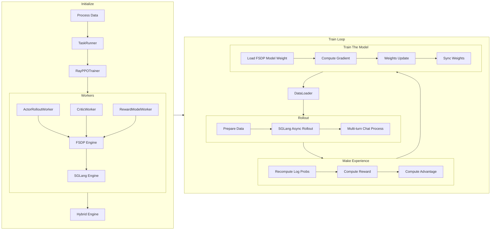

# 深入浅出理解 verl 源码 part 2

在 [Part 1](readme.md) 中，我们介绍了 verl 的初始化过程，我们进一步介绍 verl 的训练过程。

在 GRPO 中，单个 step 包含四个阶段：load data -> rollout -> make experience -> update model。区别于前一节的详述，本节会使用伪代码结合源码的方式进行阐述。



## 数据加载与预处理

verl 通过 `DataProto` 和 `RLHFDataset` 来实现数据处理。具体来说，在 [`main_ppo.py`](https://github.com/volcengine/verl/blob/76f63cffa5081564d8fea93a1cb3ce8bd5bdcc39/verl/trainer/main_ppo.py#L193) 中，我们观察这个函数：

<details>
<summary>create_rl_dataset 源码</summary>

```python
def create_rl_dataset(data_paths, data_config, tokenizer, processor):
    """Create a dataset.

    Arguments:
        data_paths: List of paths to data files.
        data_config: The data config.
        tokenizer (Tokenizer): The tokenizer.
        processor (Processor): The processor.

    Returns:
        dataset (Dataset): The dataset.
    """
    from torch.utils.data import Dataset

    from verl.utils.dataset.rl_dataset import RLHFDataset

    # Check if a custom dataset class is specified in the data configuration
    # and if the path to the custom class is provided
    if "custom_cls" in data_config and data_config.custom_cls.get("path", None) is not None:
        from verl.utils.import_utils import load_extern_type

        # Dynamically load the custom dataset class
        dataset_cls = load_extern_type(data_config.custom_cls.path, data_config.custom_cls.name)
        # Verify that the custom dataset class inherits from torch.utils.data.Dataset
        if not issubclass(dataset_cls, Dataset):
            raise TypeError(f"The custom dataset class '{data_config.custom_cls.name}' from '{data_config.custom_cls.path}' must inherit from torch.utils.data.Dataset")
    else:
        # Use the default RLHFDataset class if no custom class is specified
        dataset_cls = RLHFDataset
    print(f"Using dataset class: {dataset_cls.__name__}")

    # Instantiate the dataset using the determined dataset class
    dataset = dataset_cls(
        data_files=data_paths,
        tokenizer=tokenizer,
        processor=processor,
        config=data_config,
    )

    return dataset
```

</details>

非常典型，创造一个了 `RLHFDataset` 实例，并返回。而具体的 [`RLHFDataset`](https://github.com/volcengine/verl/blob/76f63cffa5081564d8fea93a1cb3ce8bd5bdcc39/verl/utils/dataset/rl_dataset.py#68) 实现如下：

<details>
<summary>RLHFDataset 实现</summary>

```python
class RLHFDataset(Dataset):
    """
    Load and preprocess RLHF data from Parquet files.

    - Caches files locally.
    - Reads into a HuggingFace Dataset and tokenizes prompts.
    - Optionally handles images/videos via a ProcessorMixin.
    - Filters prompts over a max length.
    - Supports resuming from checkpoints.

    Args:
        data_files (str or list): Path(s) to Parquet file(s).
        tokenizer (PreTrainedTokenizer): For the tokenization of text to token IDs.
        config (DictConfig): Options like cache_dir, prompt_key, max_prompt_length, truncation, etc.
        processor (ProcessorMixin, optional): Multimodal preprocessor for images/videos.
    """

    def __init__(
        self,
        data_files: Union[str, List[str]],
        tokenizer: PreTrainedTokenizer,
        config: DictConfig,
        processor: Optional[ProcessorMixin] = None,
    ):
        if not isinstance(data_files, (List, ListConfig)):
            data_files = [data_files]

        self.data_files = copy.deepcopy(data_files)
        self.original_data_files = copy.deepcopy(data_files)  # use for resume
        self.tokenizer = tokenizer
        self.processor = processor
        self.config = config

        self.cache_dir = os.path.expanduser(config.get("cache_dir", "~/.cache/verl/rlhf"))
        self.prompt_key = config.get("prompt_key", "prompt")
        self.image_key = config.get("image_key", "images")
        self.video_key = config.get("video_key", "videos")
        self.max_prompt_length = config.get("max_prompt_length", 1024)
        self.return_raw_chat = config.get("return_raw_chat", False)
        self.return_full_prompt = config.get("return_full_prompt", False)
        self.truncation = config.get("truncation", "error")
        self.filter_overlong_prompts = config.get("filter_overlong_prompts", True)

        self.num_workers = config.get("filter_overlong_prompts_workers", max(1, os.cpu_count() // 4))
        self.num_workers = min(self.num_workers, os.cpu_count())
        self.use_shm = config.get("use_shm", False)
        self.chat_template_func = config.get("chat_template_func", None)
        self.need_tools_kwargs = config.get("need_tools_kwargs", False)
        self.filter_prompts = config.get("filter_prompts", True)
        self.serialize_dataset = False
        self._download()
        self._read_files_and_tokenize()

    def _download(self, use_origin_parquet=False):
        from verl.utils.fs import copy_to_local

        data_files = self.data_files if not use_origin_parquet else self.original_data_files
        for i, parquet_file in enumerate(data_files):
            self.data_files[i] = copy_to_local(src=parquet_file, cache_dir=self.cache_dir, use_shm=self.use_shm)

    def _read_files_and_tokenize(self):
        dataframes = []
        for parquet_file in self.data_files:
            # read parquet files and cache
            dataframe = datasets.load_dataset("parquet", data_files=parquet_file)["train"]
            dataframes.append(dataframe)
        self.dataframe: datasets.Dataset = datasets.concatenate_datasets(dataframes)

        print(f"dataset len: {len(self.dataframe)}")

        # filter out too long prompts
        if self.filter_overlong_prompts:
            tokenizer = self.tokenizer
            processor = self.processor
            prompt_key = self.prompt_key
            image_key = self.image_key
            video_key = self.video_key

            if processor is not None:
                from verl.utils.dataset.vision_utils import process_image, process_video

                def doc2len(doc) -> int:
                    messages = self._build_messages(doc)
                    raw_prompt = self.processor.apply_chat_template(messages, add_generation_prompt=True, tokenize=False)
                    images = [process_image(image) for image in messages.pop(image_key)] if image_key in messages else None
                    videos = [process_video(video) for video in messages.pop(video_key)] if video_key in messages else None

                    return len(processor(text=[raw_prompt], images=images, videos=videos)["input_ids"][0])

            else:

                def doc2len(doc) -> int:
                    return len(tokenizer.apply_chat_template(doc[prompt_key], add_generation_prompt=True))

            self.dataframe = self.dataframe.filter(
                lambda doc: doc2len(doc) <= self.max_prompt_length,
                num_proc=self.num_workers,
                desc=f"Filtering prompts longer than {self.max_prompt_length} tokens",
            )

            print(f"filter dataset len: {len(self.dataframe)}")

    def resume_dataset_state(self):
        self.serialize_dataset = not hasattr(self, "original_data_files")
        # resume dataframe if not it's serialized in data.pt
        if not self.serialize_dataset:
            self._download(use_origin_parquet=True)  # download and resume from original parquet files
            self._read_files_and_tokenize()
        else:
            print(r"old dataloader ckpt file is used, please train from scratch for better ckpt performance")

    def __len__(self):
        return len(self.dataframe)

    def _build_messages(self, example: dict):
        messages: list = example.pop(self.prompt_key)

        if self.image_key in example or self.video_key in example:
            for message in messages:
                content = message["content"]
                content_list = []
                segments = re.split("(<image>|<video>)", content)
                segments = [item for item in segments if item != ""]
                for segment in segments:
                    if segment == "<image>":
                        content_list.append({"type": "image"})
                    elif segment == "<video>":
                        content_list.append({"type": "video"})
                    else:
                        content_list.append({"type": "text", "text": segment})

                message["content"] = content_list

        return messages

    def __getitem__(self, item):
        """
        Note that we also return the raw_input_ids so that it can be combined with other chat template
        """
        row_dict: dict = self.dataframe[item]
        messages = self._build_messages(row_dict)
        model_inputs = {}

        if self.processor is not None:
            from verl.utils.dataset.vision_utils import process_image, process_video

            raw_prompt = self.processor.apply_chat_template(messages, add_generation_prompt=True, tokenize=False)
            multi_modal_data = {}

            images = None
            if self.image_key in row_dict and row_dict.get(self.image_key, None) is not None:
                images = [process_image(image) for image in row_dict.pop(self.image_key)]
                multi_modal_data["image"] = images

            videos = None
            if self.video_key in row_dict and row_dict.get(self.video_key, None) is not None:
                videos = [process_video(video) for video in row_dict.pop(self.video_key)]
                multi_modal_data["video"] = [video.numpy() for video in videos]

            model_inputs = self.processor(text=[raw_prompt], images=images, videos=videos, return_tensors="pt")

            input_ids = model_inputs.pop("input_ids")
            attention_mask = model_inputs.pop("attention_mask")

            if "second_per_grid_ts" in model_inputs:
                model_inputs.pop("second_per_grid_ts")

            # There's a trap here, multi_modal_inputs has to be a dict, not BatchFeature
            row_dict["multi_modal_data"] = multi_modal_data
            row_dict["multi_modal_inputs"] = dict(model_inputs)

            # second_per_grid_ts isn't used for training, just for mrope
            row_dict["multi_modal_inputs"].pop("second_per_grid_ts", None)

        else:
            raw_prompt = self.tokenizer.apply_chat_template(messages, add_generation_prompt=True, tokenize=False)
            model_inputs = self.tokenizer(raw_prompt, return_tensors="pt", add_special_tokens=False)
            input_ids = model_inputs.pop("input_ids")
            attention_mask = model_inputs.pop("attention_mask")

        input_ids, attention_mask = verl_F.postprocess_data(
            input_ids=input_ids,
            attention_mask=attention_mask,
            max_length=self.max_prompt_length,
            pad_token_id=self.tokenizer.pad_token_id,
            left_pad=True,
            truncation=self.truncation,
        )

        if self.processor is not None and "Qwen2VLImageProcessor" in self.processor.image_processor.__class__.__name__:
            from verl.models.transformers.qwen2_vl import get_rope_index

            position_ids = [
                get_rope_index(
                    self.processor,
                    input_ids=input_ids[0],
                    image_grid_thw=model_inputs.get("image_grid_thw"),
                    video_grid_thw=model_inputs.get("video_grid_thw"),
                    second_per_grid_ts=model_inputs.get("second_per_grid_ts"),
                    attention_mask=attention_mask[0],
                )
            ]  # (1, 3, seq_len)

        else:
            position_ids = compute_position_id_with_mask(attention_mask)

        row_dict["input_ids"] = input_ids[0]
        row_dict["attention_mask"] = attention_mask[0]
        row_dict["position_ids"] = position_ids[0]

        raw_prompt_ids = self.tokenizer.encode(raw_prompt, add_special_tokens=False)
        if len(raw_prompt_ids) > self.max_prompt_length:
            if self.truncation == "left":
                raw_prompt_ids = raw_prompt_ids[-self.max_prompt_length :]
            elif self.truncation == "right":
                raw_prompt_ids = raw_prompt_ids[: self.max_prompt_length]
            elif self.truncation == "middle":
                left_half = self.max_prompt_length // 2
                right_half = self.max_prompt_length - left_half
                raw_prompt_ids = raw_prompt_ids[:left_half] + raw_prompt_ids[-right_half:]
            elif self.truncation == "error":
                raise RuntimeError(f"Prompt length {len(raw_prompt_ids)} is longer than {self.max_prompt_length}.")

        row_dict["raw_prompt_ids"] = raw_prompt_ids
        # encode prompts without chat template
        if self.return_raw_chat:
            row_dict["raw_prompt"] = messages

        # get prompts with chat template
        if self.return_full_prompt:
            row_dict["full_prompts"] = raw_prompt  # array of strings

        # add index for each prompt
        index = row_dict.get("extra_info", {}).get("index", 0)
        tools_kwargs = row_dict.get("extra_info", {}).get("tools_kwargs", {})
        need_tools_kwargs = row_dict.get("extra_info", {}).get("need_tools_kwargs", self.need_tools_kwargs)
        if need_tools_kwargs and not tools_kwargs:
            logger.warning("tools_kwargs is empty for index {}, data source: {}", index, row_dict["data_source"])
        row_dict["index"] = index
        row_dict["tools_kwargs"] = tools_kwargs
        return row_dict

    def __getstate__(self):
        if not self.serialize_dataset:
            state = self.__dict__.copy()

            if "dataframe" in state:
                del state["dataframe"]
            return state

        return self.__dict__.copy()

```

</details>

1. 支持从远程存储下载 Parquet 文件到本地缓存，支持共享内存加速文件访问，自动管理文件路径，支持检查点恢复。
2. 使用 HuggingFace `datasets` 库读取 Parquet 文件，支持多个数据文件的合并，自动处理数据格式转换。
3. 根据最大长度过滤过长的 prompts，支持多进程并行处理，可配置的过滤策略。
4. 支持图像和视频的多模态输入，解析 `<image>` 和 `<video>` 标签，将多模态内容转换为结构化格式。
5. 添加 chat template 来格式化对话，将文本转换为 token IDs，生成 attn mask 和 position ids。
6. padding 到指定长度，支持多种截断策略（left, right, middle, error），生成位置编码。
7. 支持训练中断后的恢复，可以从原始文件重新构建数据集，兼容序列化/反序列化。
8. 返回包含以下关键字段的字典：`input_ids`, `attention_mask`, `position_ids`, `raw_prompt_ids`, `multi_modal_data`, `multi_modal_inputs`, `index`, `tools_kwargs`。

这里最重要的一个参数是 `tools_kwargs`，用于为不同的 tools 提供配置参数。它的结构如下：

```python
tools_kwargs = {
    "tool_name": {
        "create_kwargs": {...},      # 工具创建时的参数
        "execute_kwargs": {...},     # 工具执行时的参数（可选）
        "calc_reward_kwargs": {...}, # 计算奖励时的参数（可选）
        "release_kwargs": {...},     # 释放资源时的参数（可选）
    }
}
```

比如 Search-R1 的 `tools_kwargs` 如下：

```python
tools_kwargs = {
    "search-r1": {
        "create_kwargs": {
            "ground_truth": ground_truth,
            "question": question, 
            "data_source": data_source_tagged
        }
    }
}
```

具体这些参数是如何调用了一个 tool，我们会留在后续部分继续介绍。

## 训练入口 [`RayPPOTrainer.fit()`](https://github.com/volcengine/verl/blob/76f63cffa5081564d8fea93a1cb3ce8bd5bdcc39/verl/trainer/ppo/ray_trainer.py#L903)

1. 创建 Tracking 日志记录器，设置全局步数，加载检查点，并在训练前进行验证。
2. 使用 tqdm 创建进度条，显示训练进度，并设置初始步数。
3. 遍历配置的总 epoch 数和数据加载器，每个 train batch 更新多步。
4. 从 batch 中分离出用于 rollout 的数据（`input_ids`, `attention_mask`, `position_ids` 等），保留其他数据用于后续处理。
5. 调用 `ActorRolloutWorker` 生成序列，并记录生成时间。
6. 处理 REMAX 基线（如果使用）：生成确定性基线序列，计算基线奖励，用于 REMAX 优势估计器。
7. 为每个样本分配唯一 ID，重复数据以对齐多次采样，计算响应掩码，并可选地进行批次平衡。
8. 根据配置使用奖励模型或自定义奖励函数计算 token 级别的奖励分数，支持同步和异步计算。
9. 使用 megatron 基于训练开始前的 policy 重新计算 behaviour policy 的 log probabilities，用于重要性采样，同时计算熵值。（原因在 [part 1](./readme.md#actorrolloutrefworker__init__) 讲过）
10. 使用 reference policy 计算 log probs，用于 KL 散度计算。
11. 使用 Critic 网络计算状态价值，用于优势函数估计。
12. 根据配置的优势估计器（GAE、GRPO、REMAX 等）计算优势函数，支持 KL 惩罚。
13. 使用计算出的优势函数更新 Critic 网络参数。
14. 在 Critic 预热完成后，使用 PPO 损失函数更新 Actor 网络参数。
15. 将生成的序列、输入、输出和分数保存到指定目录。
16. 根据配置的频率执行验证，计算验证指标并记录。
17. 根据配置的频率保存模型检查点。
18. 收集训练指标、时序指标和吞吐量指标，并记录到日志系统。
19. 更新进度条，递增全局步数，并在达到总训练步数时结束训练。
20. 根据配置在特定步数启用/禁用性能分析，用于调试和优化。

<details>
<summary>RayPPOTrainer.fit() 源码</summary>

```python
def fit(self):
    """
    The training loop of PPO.
    The driver process only need to call the compute functions of the worker group through RPC
    to construct the PPO dataflow.
    The light-weight advantage computation is done on the driver process.
    """
    from omegaconf import OmegaConf

    from verl.utils.tracking import Tracking

    logger = Tracking(
        project_name=self.config.trainer.project_name,
        experiment_name=self.config.trainer.experiment_name,
        default_backend=self.config.trainer.logger,
        config=OmegaConf.to_container(self.config, resolve=True),
    )

    self.global_steps = 0

    # load checkpoint before doing anything
    self._load_checkpoint()

    # perform validation before training
    # currently, we only support validation using the reward_function.
    if self.val_reward_fn is not None and self.config.trainer.get("val_before_train", True):
        val_metrics = self._validate()
        assert val_metrics, f"{val_metrics=}"
        pprint(f"Initial validation metrics: {val_metrics}")
        logger.log(data=val_metrics, step=self.global_steps)
        if self.config.trainer.get("val_only", False):
            return

    # add tqdm
    progress_bar = tqdm(total=self.total_training_steps, initial=self.global_steps, desc="Training Progress")

    # we start from step 1
    self.global_steps += 1
    last_val_metrics = None

    for epoch in range(self.config.trainer.total_epochs):
        for batch_dict in self.train_dataloader:
            do_profile = self.global_steps in self.config.trainer.profile_steps if self.config.trainer.profile_steps is not None else False
            if do_profile:
                self.actor_rollout_wg.start_profile()
                if self.use_reference_policy:
                    self.ref_policy_wg.start_profile()
                if self.use_critic:
                    self.critic_wg.start_profile()
                if self.use_rm:
                    self.rm_wg.start_profile()

            metrics = {}
            timing_raw = {}
            batch: DataProto = DataProto.from_single_dict(batch_dict)

            # pop those keys for generation
            batch_keys_to_pop = ["input_ids", "attention_mask", "position_ids"]
            non_tensor_batch_keys_to_pop = ["raw_prompt_ids"]
            if "multi_modal_data" in batch.non_tensor_batch:
                non_tensor_batch_keys_to_pop.append("multi_modal_data")
            if "raw_prompt" in batch.non_tensor_batch:
                non_tensor_batch_keys_to_pop.append("raw_prompt")
            if "tools_kwargs" in batch.non_tensor_batch:
                non_tensor_batch_keys_to_pop.append("tools_kwargs")
            gen_batch = batch.pop(
                batch_keys=batch_keys_to_pop,
                non_tensor_batch_keys=non_tensor_batch_keys_to_pop,
            )

            is_last_step = self.global_steps >= self.total_training_steps

            with marked_timer("step", timing_raw):
                # generate a batch
                with marked_timer("gen", timing_raw, color="red"):
                    if not self.async_rollout_mode:
                        gen_batch_output = self.actor_rollout_wg.generate_sequences(gen_batch)
                    else:
                        self.async_rollout_manager.wake_up()
                        gen_batch_output = self.async_rollout_manager.generate_sequences(gen_batch)
                        self.async_rollout_manager.sleep()
                    timing_raw.update(gen_batch_output.meta_info["timing"])
                    gen_batch_output.meta_info.pop("timing", None)

                if self.config.algorithm.adv_estimator == AdvantageEstimator.REMAX:
                    with marked_timer("gen_max", timing_raw, color="purple"):
                        gen_baseline_batch = deepcopy(gen_batch)
                        gen_baseline_batch.meta_info["do_sample"] = False
                        gen_baseline_output = self.actor_rollout_wg.generate_sequences(gen_baseline_batch)

                        batch = batch.union(gen_baseline_output)
                        reward_baseline_tensor = self.reward_fn(batch)
                        reward_baseline_tensor = reward_baseline_tensor.sum(dim=-1)

                        batch.pop(batch_keys=list(gen_baseline_output.batch.keys()))

                        batch.batch["reward_baselines"] = reward_baseline_tensor

                        del gen_baseline_batch, gen_baseline_output

                batch.non_tensor_batch["uid"] = np.array([str(uuid.uuid4()) for _ in range(len(batch.batch))], dtype=object)
                # repeat to align with repeated responses in rollout
                batch = batch.repeat(repeat_times=self.config.actor_rollout_ref.rollout.n, interleave=True)
                batch = batch.union(gen_batch_output)

                batch.batch["response_mask"] = compute_response_mask(batch)
                # Balance the number of valid tokens across DP ranks.
                # NOTE: This usually changes the order of data in the `batch`,
                # which won't affect the advantage calculation (since it's based on uid),
                # but might affect the loss calculation (due to the change of mini-batching).
                # TODO: Decouple the DP balancing and mini-batching.
                if self.config.trainer.balance_batch:
                    self._balance_batch(batch, metrics=metrics)

                # compute global_valid tokens
                batch.meta_info["global_token_num"] = torch.sum(batch.batch["attention_mask"], dim=-1).tolist()

                with marked_timer("reward", timing_raw, color="yellow"):
                    # compute reward model score
                    if self.use_rm:
                        reward_tensor = self.rm_wg.compute_rm_score(batch)
                        batch = batch.union(reward_tensor)

                    if self.config.reward_model.launch_reward_fn_async:
                        future_reward = compute_reward_async.remote(batch, self.config, self.tokenizer)
                    else:
                        reward_tensor, reward_extra_infos_dict = compute_reward(batch, self.reward_fn)

                # recompute old_log_probs
                with marked_timer("old_log_prob", timing_raw, color="blue"):
                    old_log_prob = self.actor_rollout_wg.compute_log_prob(batch)
                    entropys = old_log_prob.batch["entropys"]
                    response_masks = batch.batch["response_mask"]
                    loss_agg_mode = self.config.actor_rollout_ref.actor.loss_agg_mode
                    entropy_agg = agg_loss(loss_mat=entropys, loss_mask=response_masks, loss_agg_mode=loss_agg_mode)
                    old_log_prob_metrics = {"actor/entropy": entropy_agg.detach().item()}
                    metrics.update(old_log_prob_metrics)
                    old_log_prob.batch.pop("entropys")
                    batch = batch.union(old_log_prob)

                    if "rollout_log_probs" in batch.batch.keys():
                        # TODO: we may want to add diff of probs too.
                        rollout_old_log_probs = batch.batch["rollout_log_probs"]
                        actor_old_log_probs = batch.batch["old_log_probs"]
                        attention_mask = batch.batch["attention_mask"]
                        responses = batch.batch["responses"]
                        response_length = responses.size(1)
                        response_mask = attention_mask[:, -response_length:]

                        rollout_probs = torch.exp(rollout_old_log_probs)
                        actor_probs = torch.exp(actor_old_log_probs)
                        rollout_probs_diff = torch.abs(rollout_probs - actor_probs)
                        rollout_probs_diff = torch.masked_select(rollout_probs_diff, response_mask.bool())
                        rollout_probs_diff_max = torch.max(rollout_probs_diff)
                        rollout_probs_diff_mean = torch.mean(rollout_probs_diff)
                        rollout_probs_diff_std = torch.std(rollout_probs_diff)
                        metrics.update(
                            {
                                "training/rollout_probs_diff_max": rollout_probs_diff_max.detach().item(),
                                "training/rollout_probs_diff_mean": rollout_probs_diff_mean.detach().item(),
                                "training/rollout_probs_diff_std": rollout_probs_diff_std.detach().item(),
                            }
                        )

                if self.use_reference_policy:
                    # compute reference log_prob
                    with marked_timer("ref", timing_raw, color="olive"):
                        if not self.ref_in_actor:
                            ref_log_prob = self.ref_policy_wg.compute_ref_log_prob(batch)
                        else:
                            ref_log_prob = self.actor_rollout_wg.compute_ref_log_prob(batch)
                        batch = batch.union(ref_log_prob)

                # compute values
                if self.use_critic:
                    with marked_timer("values", timing_raw, color="cyan"):
                        values = self.critic_wg.compute_values(batch)
                        batch = batch.union(values)

                with marked_timer("adv", timing_raw, color="brown"):
                    # we combine with rule-based rm
                    reward_extra_infos_dict: dict[str, list]
                    if self.config.reward_model.launch_reward_fn_async:
                        reward_tensor, reward_extra_infos_dict = ray.get(future_reward)
                    batch.batch["token_level_scores"] = reward_tensor

                    if reward_extra_infos_dict:
                        batch.non_tensor_batch.update({k: np.array(v) for k, v in reward_extra_infos_dict.items()})

                    # compute rewards. apply_kl_penalty if available
                    if self.config.algorithm.use_kl_in_reward:
                        batch, kl_metrics = apply_kl_penalty(batch, kl_ctrl=self.kl_ctrl_in_reward, kl_penalty=self.config.algorithm.kl_penalty)
                        metrics.update(kl_metrics)
                    else:
                        batch.batch["token_level_rewards"] = batch.batch["token_level_scores"]

                    # compute advantages, executed on the driver process

                    norm_adv_by_std_in_grpo = self.config.algorithm.get("norm_adv_by_std_in_grpo", True)  # GRPO adv normalization factor

                    batch = compute_advantage(
                        batch,
                        adv_estimator=self.config.algorithm.adv_estimator,
                        gamma=self.config.algorithm.gamma,
                        lam=self.config.algorithm.lam,
                        num_repeat=self.config.actor_rollout_ref.rollout.n,
                        norm_adv_by_std_in_grpo=norm_adv_by_std_in_grpo,
                        multi_turn=self.config.actor_rollout_ref.rollout.multi_turn.enable,
                        config=self.config.algorithm,
                    )

                # update critic
                if self.use_critic:
                    with marked_timer("update_critic", timing_raw, color="pink"):
                        critic_output = self.critic_wg.update_critic(batch)
                    critic_output_metrics = reduce_metrics(critic_output.meta_info["metrics"])
                    metrics.update(critic_output_metrics)

                # implement critic warmup
                if self.config.trainer.critic_warmup <= self.global_steps:
                    # update actor
                    with marked_timer("update_actor", timing_raw, color="red"):
                        batch.meta_info["multi_turn"] = self.config.actor_rollout_ref.rollout.multi_turn.enable
                        actor_output = self.actor_rollout_wg.update_actor(batch)
                    actor_output_metrics = reduce_metrics(actor_output.meta_info["metrics"])
                    metrics.update(actor_output_metrics)

                # Log rollout generations if enabled
                rollout_data_dir = self.config.trainer.get("rollout_data_dir", None)
                if rollout_data_dir:
                    with marked_timer("dump_rollout_generations", timing_raw, color="green"):
                        print(batch.batch.keys())
                        inputs = self.tokenizer.batch_decode(batch.batch["prompts"], skip_special_tokens=True)
                        outputs = self.tokenizer.batch_decode(batch.batch["responses"], skip_special_tokens=True)
                        scores = batch.batch["token_level_scores"].sum(-1).cpu().tolist()
                        self._dump_generations(
                            inputs=inputs,
                            outputs=outputs,
                            scores=scores,
                            reward_extra_infos_dict=reward_extra_infos_dict,
                            dump_path=rollout_data_dir,
                        )

                # validate
                if self.val_reward_fn is not None and self.config.trainer.test_freq > 0 and (is_last_step or self.global_steps % self.config.trainer.test_freq == 0):
                    with marked_timer("testing", timing_raw, color="green"):
                        val_metrics: dict = self._validate()
                        if is_last_step:
                            last_val_metrics = val_metrics
                    metrics.update(val_metrics)

                if self.config.trainer.save_freq > 0 and (is_last_step or self.global_steps % self.config.trainer.save_freq == 0):
                    with marked_timer("save_checkpoint", timing_raw, color="green"):
                        self._save_checkpoint()

            # training metrics
            metrics.update(
                {
                    "training/global_step": self.global_steps,
                    "training/epoch": epoch,
                }
            )
            # collect metrics
            metrics.update(compute_data_metrics(batch=batch, use_critic=self.use_critic))
            metrics.update(compute_timing_metrics(batch=batch, timing_raw=timing_raw))
            # TODO: implement actual tflpo and theoretical tflpo
            n_gpus = self.resource_pool_manager.get_n_gpus()
            metrics.update(compute_throughout_metrics(batch=batch, timing_raw=timing_raw, n_gpus=n_gpus))

            # TODO: make a canonical logger that supports various backend
            logger.log(data=metrics, step=self.global_steps)

            progress_bar.update(1)
            self.global_steps += 1

            if do_profile:
                self.actor_rollout_wg.stop_profile()
                if self.use_reference_policy:
                    self.ref_policy_wg.stop_profile()
                if self.use_critic:
                    self.critic_wg.stop_profile()
                if self.use_rm:
                    self.rm_wg.stop_profile()

            if is_last_step:
                pprint(f"Final validation metrics: {last_val_metrics}")
                progress_bar.close()
                return
```

</details>

## 我们究竟在异步什么？

这里很值得分享一个核心问题，对 SGLang 而言，或者对现在的 RL 而言，我们每天说来说去的 async 究竟是什么意思？和 PD 分离一样，async 也有非常多的层面：

1. Async RL 代表的是在 training rollout 分离的系统上，rollout 只在 update weights 的时候被打断，其余时刻永远 rollout，哪怕 target policy 正在被 training engine 更新。这方面是 [AreaL](https://github.com/inclusionAI/AReaL) 和 [SLIME](https://github.com/THUDM/slime)。

2. Async Rollout 这个词是特指在 rollout 的时候，把一个 batch requests 拆为单个 request，然后逐个调用 `SGLangEngine.generate()`。

乍一听，这没有什么特别的，似乎还会更慢些。但是考虑到 tool call 的问题，这就非常严肃了。假设我们把一整个 batch 的 requests 作为一个 batch 塞给 sglang 似乎还要快些，毕竟对 SGLang 的 scheduler 而言，更好组 batch。但是，一整个 batch 进去，得一整个 batch 出来。这些 batch 里面的 requests 同时返回，同时被 paser 解析查看是否有 tool call 的 parameter，然后发送请求给 tool。如此以来，整个 tool 的调用大概率会拥堵，甚至在我们考虑到如果要加入多个 tool（虽然目前没有）的话，用一个状态机去管理每个 request 的 tool call 状态会成一场噩梦，何况有的 requests 会在多轮里面多次调用 tool。因此，为了方便管理每个 request tool call 的状态机和让 tool 被调度的更加均匀。SGLang 采取了 Async Rollout 策略，也即把一个 batch 的 requests 拆为单个 request，然后逐个异步调用 `SGLangEngine.generate()`。这样每个 reqeuest 自己管理自己的状态机，方便维护并且 tool call 效率更高。

理解了这一层，我们可以来看看代码实现：

<details>
<summary>generate_sequences 源码</summary>

```python

@GPUMemoryLogger(role="sglang rollout", logger=logger)
@torch.no_grad()
def generate_sequences(self, prompts: DataProto, **kwargs) -> DataProto:
    if self.config.multi_turn.enable:
        return self._req_level_generate_sequences(prompts, **kwargs)
    return self._batch_level_generate_sequences(prompts, **kwargs)

```
</details>

这里明确指出，如果是用了 mutli-turn 训练，则将 batch 的 requests 拆为单个 request，调用 `_req_level_generate_sequences`；而不调用 tool 的单轮 RL，仍旧组 batch 直接发送。

我们只观察 `_req_level_generate_sequences` 的部分源码：

<details>
<summary>_req_level_generate_sequences 部分源码</summary>


```python
@GPUMemoryLogger(role="sglang rollout", logger=logger)
@torch.no_grad()
def _req_level_generate_sequences(self, prompts: DataProto, **kwargs) -> DataProto:
    # Async rollout with tools support
    do_sample = prompts.meta_info.get("do_sample", True)
    is_validate = prompts.meta_info.get("validate", False)
    tgt_device = prompts.batch["input_ids"].device
    if self._tp_rank == 0:
        req_list = self._preprocess_prompt_to_async_rollout_requests(
            prompts,
            n=1 if is_validate else self.config.n,
        )
        loop = asyncio.get_event_loop()
        output_req_list = loop.run_until_complete(
            asyncio.gather(
                *[self._async_rollout_a_request(req, do_sample, is_validate, **kwargs) for req in req_list],
            )
        )
        sorted_output_req_list = sorted(output_req_list, key=lambda x: (x.batch_data_id, x.rollout_offset))
    else:
        sorted_output_req_list = None
```

</details>

现在来看，`asyncio.gather(*[self._async_rollout_a_request(req, do_sample, is_validate, **kwargs) for req in req_list],)` 就显得无比清晰了。

## 数据流管理

我们继续去理解 `RayPPOTrainer.fit()` 函数，从数据流管理开始。这里我认为最重要的两个类是 `DataProto` 和 `RLHFDataset`。

### `DataProto`

`DataProto` 是 verl 的数据交换协议，定义在 [`protocol.py`](https://github.com/volcengine/verl/blob/76f63cffa5081564d8fea93a1cb3ce8bd5bdcc39/verl/protocol.py#L202)：

```python
@dataclass
class DataProto:
    """
    A DataProto is a data structure that aims to provide a standard protocol for data exchange between functions.
    It contains a batch (TensorDict) and a meta_info (Dict). The batch is a TensorDict https://pytorch.org/tensordict/.
    TensorDict allows you to manipulate a dictionary of Tensors like a single Tensor. Ideally, the tensors with the
    same batch size should be put inside batch.
    """

    batch: TensorDict = None
    non_tensor_batch: Dict = field(default_factory=dict)
    meta_info: Dict = field(default_factory=dict)
```

`DataProto` 提供标准化的数据交换协议，基于 PyTorch 的 TensorDict，支持张量的批量操作，同时通过 `non_tensor_batch` 字典来处理 NumPy 数组等非张量数据。`meta_info` 存储额外的元信息。本身支持的操作挺基础的，典型的比如数据创建、切片、选择、合并、重命名、重复、填充、分块、以及分布式环境下的数据集合与分发。除此之外，`DataProto` 还通过数据验证 `check_consistency()` 确保在数据分离和合并过程的一致性。

### `RLHFDataset`

[`RLHFDataset`]((https://github.com/volcengine/verl/blob/76f63cffa5081564d8fea93a1cb3ce8bd5bdcc39/verl/utils/dataset/rl_dataset.py#L68)) 是 verl 中用于 RLHF 数据加载的数据集类，继承自 `datasets.Dataset`，主要用于处理 Parquet 文件中的数据，包括数据下载、tokenize、过滤、预处理等。

<details>
<summary>RLHFDataset 源码</summary>

```python
class RLHFDataset(Dataset):
    """
    Load and preprocess RLHF data from Parquet files.

    - Caches files locally.
    - Reads into a HuggingFace Dataset and tokenizes prompts.
    - Optionally handles images/videos via a ProcessorMixin.
    - Filters prompts over a max length.
    - Supports resuming from checkpoints.

    Args:
        data_files (str or list): Path(s) to Parquet file(s).
        tokenizer (PreTrainedTokenizer): For the tokenization of text to token IDs.
        config (DictConfig): Options like cache_dir, prompt_key, max_prompt_length, truncation, etc.
        processor (ProcessorMixin, optional): Multimodal preprocessor for images/videos.
    """

    def __init__(
        self,
        data_files: Union[str, List[str]],
        tokenizer: PreTrainedTokenizer,
        config: DictConfig,
        processor: Optional[ProcessorMixin] = None,
    ):
        if not isinstance(data_files, (List, ListConfig)):
            data_files = [data_files]

        self.data_files = copy.deepcopy(data_files)
        self.original_data_files = copy.deepcopy(data_files)  # use for resume
        self.tokenizer = tokenizer
        self.processor = processor
        self.config = config

        self.cache_dir = os.path.expanduser(config.get("cache_dir", "~/.cache/verl/rlhf"))
        self.prompt_key = config.get("prompt_key", "prompt")
        self.image_key = config.get("image_key", "images")
        self.video_key = config.get("video_key", "videos")
        self.max_prompt_length = config.get("max_prompt_length", 1024)
        self.return_raw_chat = config.get("return_raw_chat", False)
        self.return_full_prompt = config.get("return_full_prompt", False)
        self.truncation = config.get("truncation", "error")
        self.filter_overlong_prompts = config.get("filter_overlong_prompts", True)

        self.num_workers = config.get("filter_overlong_prompts_workers", max(1, os.cpu_count() // 4))
        self.num_workers = min(self.num_workers, os.cpu_count())
        self.use_shm = config.get("use_shm", False)
        self.chat_template_func = config.get("chat_template_func", None)
        self.need_tools_kwargs = config.get("need_tools_kwargs", False)
        self.filter_prompts = config.get("filter_prompts", True)
        self.serialize_dataset = False
        self._download()
        self._read_files_and_tokenize()
```

</details>

有了 `DataProto` 和 `RLHFDataset` 后，我们来观察数据流：

```text
A：Parquet 文件 --> B：RLHFDataset --> C：DataLoader + collate_fn --> D：DataProto 原始数据 --> E：pop 提取生成数据 --> F：Rollout 生成 --> G：union 合并数据 --> H：奖励计算 --> I：优势计算 --> J：重新计算 log_probs --> K：计算参考 log_probs --> L：计算价值函数 --> M1：更新 critic --> M2：更新 actor --> N：返回训练指标
```

事实上，只有最初的三步不是 `DataProto`，其他都是通过 `DataProto` 进行数据交换的。具体每步的数据流向如下：

<details>
<summary>数据流详细分析</summary>

A：`Parquet` 文件

```python
data_files = "~/data/rlhf/gsm8k/train.parquet"
```

B：RLHFDataset

```python
dataset = RLHFDataset(
    data_files=data_files,
    tokenizer=tokenizer,
    config=config,
    processor=processor
)
```

C：DataLoader + collate_fn

```python
dataloader = DataLoader(
    dataset=dataset,
    batch_size=16,
    shuffle=True,
    drop_last=True,
    collate_fn=collate_fn
)
```

D：`DataProto` 原始数据

```python
batch_dict = next(iter(dataloader))  # 返回 dict
batch: DataProto = DataProto.from_single_dict(batch_dict)
```

E：`pop` 提取生成数据

```python
gen_batch = batch.pop(batch_keys=["input_ids", "attention_mask", "position_ids"])
```

F：`Rollout` 生成

```python
gen_batch_output = self.actor_rollout_wg.generate_sequences(gen_batch)
```

G：`union` 合并数据

```python
batch = batch.union(gen_batch_output)
```

H：奖励计算

```python
rewards = self.reward_fn(batch)
batch.batch["token_level_rewards"] = rewards
```

I：优势计算

```python
batch = compute_advantage(batch, adv_estimator=self.config.algorithm.adv_estimator)
```

J：重新计算 `log_probs`

```python
old_log_prob = self.actor_rollout_wg.compute_log_prob(batch)
batch = batch.union(old_log_prob)
```

K：计算 reference model 的 `log_probs`

```python
if self.use_reference_policy:
    ref_log_prob = self.ref_policy_wg.compute_ref_log_prob(batch)
    batch = batch.union(ref_log_prob)
```

L：计算 value function

```python
if self.use_critic:
    values = self.critic_wg.compute_values(batch)
    batch = batch.union(values)
```

M1：更新 critic

```python
if self.use_critic:
    critic_output = self.critic_wg.update_critic(batch)
    critic_output_metrics = reduce_metrics(critic_output.meta_info["metrics"])
    metrics.update(critic_output_metrics)
```

M2：更新 actor

```python
actor_output = self.actor_rollout_wg.update_actor(batch)
```

N：返回训练指标

```python
actor_output_metrics = reduce_metrics(actor_output.meta_info["metrics"])
metrics.update(actor_output_metrics)
logger.log(data=metrics, step=self.global_steps)
```

</details>

## `AsyncRolloutRequest` 异步请求

### [`SGLangRollout._initialize_tools()`](https://github.com/volcengine/verl/blob/e67ee86f8b94bfa141da95402a254966733cba08/verl/workers/rollout/sglang_rollout/sglang_rollout.py#L394)

`SGLangRollout._initialize_tools()` 函数用于初始化 Multi-turn 对话中的工具。

1. 如果没有工具配置路径，则返回空列表和字典。
2. 从配置文件加载工具并初始化工具列表。
3. 创建 OpenAI 格式的工具 schema 和工具名称到工具对象的映射。
4. 根据 Tokenizer 类型确定工具调用解析器。
5. 为 SGLang 创建 `Tool` 对象。
6. 实例化 `FunctionCallParser`。

<details>
<summary>SGLangRollout._initialize_tools 部分源码</summary>

```python
from sglang.function_calling.function_call_parser import FunctionCallParser
from sglang.utils.general import initialize_tools_from_config
from sglang.tools.tool import Tool
from omegaconf import OmegaConf

@registry.register(SGLangRollout)
    def _initialize_tools(self, config, tokenizer):
        """Initialize tools from configuration.

        Args:
            config: Configuration object containing tool-related settings,
                    specifically `config.multi_turn.tool_config_path`.
            tokenizer: The tokenizer instance used for parsing tool calls from
                       the model's generated text.

        Returns:
            tuple: A tuple containing:
                - tool_schemas (list[dict]): OpenAI-formatted JSON schemas
                  defining each tool's capabilities.
                - tool_map (dict[str, BaseTool]): A dictionary mapping tool
                  names to their executable `BaseTool` objects.
                - tool_call_parser_type (str): The identifier for the specific
                  parser type (e.g., 'json_mode', 'tool_code') used to extract
                  tool calls.
                - sgl_tools (list[sglang.srt.openai_api.protocol.Tool]): Tool
                  definitions optimized for SGLang's internal engine.
                - function_call_parser (sglang.srt.function_call_parser.FunctionCallParser):
                  The active parser instance responsible for extracting
                  structured tool calls from model outputs.
        """
        if config.multi_turn.tool_config_path is None:
            return [], {}, None, [], None

        tools_config_file = config.multi_turn.tool_config_path
        tool_list = initialize_tools_from_config(tools_config_file)

        logger.info(f"Initialize tools from configuration.: tool_list: {tool_list}")
        tool_schemas = [tool.get_openai_tool_schema().model_dump() for tool in tool_list]
        tool_map = {tool.name: tool for tool in tool_list}
        tool_call_parser_type = get_tool_call_parser_type(tokenizer)
        sgl_tools = [Tool.model_validate(tool_schema) for tool_schema in tool_schemas]
        function_call_parser = FunctionCallParser(
            sgl_tools,
            tool_call_parser_type,
        )

        return (
            tool_schemas,
            tool_map,
            tool_call_parser_type,
            sgl_tools,
            function_call_parser,
        )
```

</details>


**文件**: `verl/workers/rollout/schemas.py`

`AsyncRolloutRequest`是多轮对话中的核心数据结构，管理单个对话请求的完整生命周期。

**核心属性**：
```python
class AsyncRolloutRequest(BaseModel):
    """异步rollout请求的数据模型"""
    
    # 基础标识
    batch_data_id: int = 0          # 批次中的数据索引
    rollout_offset: int = 0         # 同一数据的多次采样偏移
    request_id: str                 # 唯一请求ID
    state: AsyncRolloutRequestStateEnum  # 请求状态
    
    # 对话内容
    messages: List[Message]         # 对话消息列表
    tool_schemas: Optional[List[OpenAIFunctionToolSchema]] = None  # 工具模式
    tools_kwargs: Dict[str, Any] = {}  # 工具参数
    
    # Token序列
    input_ids: List[int]            # 完整输入token序列
    prompt_ids: List[int]           # 提示部分token序列
    response_ids: List[int]         # 响应部分token序列
    
    # 掩码和位置信息
    attention_mask: List[int]       # 注意力掩码
    position_ids: List[int]         # 位置ID
    loss_mask: List[int]            # 损失计算掩码
    
    # 奖励和指标
    reward_scores: Dict[str, float] # 工具奖励分数
    metrics: Dict[str, List[Any]]   # 性能指标
    
    # 配置参数
    max_prompt_len: int             # 最大提示长度
    max_response_len: int = 8192    # 最大响应长度
    max_model_len: int = 32768      # 最大模型长度
```

**状态管理**：
```python
class AsyncRolloutRequestStateEnum(str, Enum):
    """异步rollout请求的状态枚举"""
    PENDING = "pending"      # 等待处理
    RUNNING = "running"      # 正在运行
    COMPLETED = "completed"  # 已完成
    FAILED = "failed"        # 失败
    TOOL_CALLING = "tool_calling"  # 工具调用中
```

**关键方法**：

**`add_assistant_message()` - 添加助手消息**：
```python
def add_assistant_message(self, tokenizer: PreTrainedTokenizer, content: str, 
                         tool_calls: Optional[List[ToolCall]] = None) -> None:
    """添加助手的回复消息
    
    Args:
        tokenizer: 分词器
        content: 文本内容
        tool_calls: 工具调用列表（可选）
    """
    # 创建助手消息
    assistant_message = Message(
        role="assistant",
        content=content,
        tool_calls=tool_calls,
    )
    self.messages.append(assistant_message)
    
    # 计算新消息的token
    if tool_calls is not None:
        # 包含工具调用的消息
        content = tokenizer.apply_chat_template(
            [*BASE_CHAT_HISTORY, *self.messages[-2:]],  # 用户消息 + 助手消息
            tools=[tool.model_dump() for tool in self.tool_schemas],
            add_generation_prompt=False,
            tokenize=False
        )
    else:
        # 普通文本消息
        content = tokenizer.apply_chat_template(
            [*BASE_CHAT_HISTORY, *self.messages[-2:]],
            tools=None,
            add_generation_prompt=False,
            tokenize=False
        )
    
    # 计算新增的token
    content_ids = tokenizer.encode(
        content[self.base_conv_wo_gen_prompt_end_pos:],
        add_special_tokens=False
    )
    
    # 更新输入序列
    self._update_input_ids(content_ids, attention_mask=True, loss_mask=True)
```

**`add_tool_response_messages()` - 添加工具响应**：
```python
def add_tool_response_messages(self, tokenizer: PreTrainedTokenizer, 
                              contents: list[str]) -> None:
    """添加工具响应消息
    
    Args:
        tokenizer: 分词器
        contents: 工具响应内容列表
    """
    if not contents:
        return
    
    # 添加工具响应消息
    self.messages.extend([
        Message(role="tool", content=content) 
        for content in contents
    ])
    
    # 计算工具响应的token
    content = tokenizer.apply_chat_template(
        [*BASE_CHAT_HISTORY, *self.messages[-len(contents):]],
        tools=[tool.model_dump() for tool in self.tool_schemas],
        add_generation_prompt=False,
        tokenize=False
    )
    content_ids = tokenizer.encode(
        content[self.base_conv_wo_gen_prompt_end_pos:],
        add_special_tokens=False
    )
    
    # 更新输入序列（工具响应不参与损失计算）
    self._update_input_ids(content_ids, attention_mask=True, loss_mask=False)
```

#### 2.2.5 `_req_level_generate_sequences()` 请求级生成

**多轮对话的核心实现**：
```python
def _req_level_generate_sequences(self, prompts: DataProto, **kwargs) -> DataProto:
    """请求级序列生成 - 适用于多轮对话和工具调用
    
    核心特点：
    1. 每个对话独立处理，支持不同的轮数
    2. 支持工具调用和异步执行
    3. 动态长度管理，避免等待最慢的对话
    4. 完整的对话状态跟踪
    """
    # 1. 预处理：将批处理数据转换为独立请求
    if self._tp_rank == 0:
        req_list = self._preprocess_prompt_to_async_rollout_requests(
            prompts,
            n=1 if is_validate else self.config.n,  # 验证时只生成1个候选，训练时生成n个
        )
        
        # 2. 并发处理所有请求
        loop = asyncio.get_event_loop()
        output_req_list = loop.run_until_complete(
            asyncio.gather(*[
                self._async_rollout_a_request(req, do_sample, is_validate, **kwargs) 
                for req in req_list
            ])
        ) # 最后生成候选的response list
        
def _batch_level_generate_sequences(self, prompts: DataProto, **kwargs) -> DataProto:
    """批量生成序列"""
    
    # 获取输入数据
    idx = prompts.batch["input_ids"]
    attention_mask = prompts.batch["attention_mask"]
    position_ids = prompts.batch["position_ids"]
    eos_token_id = prompts.meta_info["eos_token_id"]
    
    batch_size = idx.size(0)
    
    # 处理非张量数据
    non_tensor_batch = prompts.non_tensor_batch
    if "raw_prompt_ids" not in non_tensor_batch:
        non_tensor_batch["raw_prompt_ids"] = [self._pre_process_inputs(idx[i]) for i in range(batch_size)]
    
    # 准备输入数据
    sglang_inputs = [{"prompt_token_ids": raw_prompt_ids} for raw_prompt_ids in non_tensor_batch["raw_prompt_ids"]]
    
    # 调用生成引擎
    output = self._engine.async_generate(input_ids=sglang_inputs, **kwargs)
    
    # 处理生成的输出
    batched_output_token_ids, batched_logprobs = self._post_process_outputs(output)
    
    # 拼接生成的输出与原始输入
    response = torch.cat([idx, batched_output_token_ids], dim=-1)
    
    # 更新注意力掩码和位置编码
    response_attention_mask = self.get_response_mask(response, eos_token_id)
    attention_mask = torch.cat([attention_mask, response_attention_mask], dim=-1)
    position_ids = self.update_position_ids(position_ids, response)
    
    # 返回生成的批次数据
    batch = TensorDict({
        "prompts": idx,
        "responses": response,
        "input_ids": response,
        "attention_mask": attention_mask,
        "position_ids": position_ids
    }, batch_size=batch_size)
    
    return DataProto(batch=batch, non_tensor_batch=non_tensor_batch)

```

**并发处理的优势：**
- **资源利用率高**: 不需要等待最慢的请求
- **支持复杂交互**: 每个对话可以有不同的工具调用序列
- **内存效率**: 避免为所有可能的轮数预分配内存

### 2.3 经验处理阶段 (Make Experience)

序列生成完成后，进入经验处理阶段。这一阶段将生成的序列转换为强化学习算法所需的训练数据，包括重新计算概率、计算奖励、评估参考策略等关键步骤。

**什么是Experience？**
在强化学习中，experience指的是智能体与环境交互产生的数据，包括状态、动作、奖励、下一状态等。在LLM训练中，experience包括输入prompt、生成的response、获得的reward，以及用于策略更新的各种概率和优势值。

**重新计算 log_prob**
这是对应的重新计算log_prob代码，在 `verl/trainer/ppo/ray_trainer.py:995-1030`：

**为什么要重新计算log_prob？**
在生成阶段，我们得到的log_prob是用于采样的，不够精确（通常是fp16/bf16），这是因为在rollout我们的目标是"快"，快速生成old_log_prob。而在训练阶段，我们需要更精确的概率计算用于PPO等RL算法，如果ratio = exp(new_log_prob - old_log_prob)差别太大，就会导致clip和KL约束失真，从而破坏训练的稳定性。此外，生成和训练可能使用不同的数值精度或计算图，重新计算确保一致性。

```python
# 重新计算 old_log_probs - 这是PPO算法的关键输入
with _timer("old_log_prob", timing_raw):
    # 使用当前策略重新计算生成序列的概率
    # 这个概率将作为PPO中的"old policy"概率
    old_log_prob = self.actor_rollout_wg.compute_log_prob(batch)
    batch = batch.union(old_log_prob)  # 将结果合并到batch中
```

**Reward compute**
veRL 支持灵活的奖励计算策略，可以结合 model-based reward 和 rule-based reward，适应不同类型的任务需求。对应的代码，在 `verl/trainer/ppo/ray_trainer.py:980-993`。

```python
with _timer("reward", timing_raw):
    # 方式1：奖励模型计算（可选）- 使用训练好的奖励模型评估响应质量
    if self.use_rm:
        reward_tensor = self.rm_wg.compute_rm_score(batch)
        batch = batch.union(reward_tensor)
    
    # 方式2：规则/函数奖励计算 - 使用任务特定的评估函数
    if self.config.reward_model.launch_reward_fn_async:
        # 异步计算：适合耗时的奖励函数（如代码执行、数学验证）
        future_reward = compute_reward_async.remote(batch, self.config, self.tokenizer)
    else:
        # 同步计算：适合简单快速的奖励函数
        reward_tensor, reward_extra_infos_dict = compute_reward(batch, self.reward_fn)
```

veRL提供了多种reward计算方式，可以根据任务需求灵活选择：

1. **内置Reward函数**

veRL内置了多种预定义的reward函数，支持常见的数据集和任务类型：

#### 数学推理任务
```python
# 在配置中指定数据源
data:
  reward_fn_key: "data_source"  # 用于标识数据源类型的键

# 支持的数据源包括：
# - "openai/gsm8k": GSM8K数学问题
# - "hendrycks_math": 数学推理数据集
# - "hiyouga/geometry3k": 几何问题
```

#### 代码生成任务
```python
# 代码执行reward
data:
  reward_fn_key: "data_source"
  
# 支持的数据源：
# - "mbpp": Python代码执行
# - "humaneval": HumanEval代码评估
```

#### 多模态任务
```python
# 视觉-语言任务
data:
  reward_fn_key: "data_source"
  
# 支持的数据源：
# - "llava_v1_5_mix": LLaVA多模态对话
```

* **自定义Reward函数**

veRL支持完全自定义的reward函数，这是最灵活的方式：

#### 配置文件设置
```yaml
# 在配置文件中指定自定义reward函数
custom_reward_function:
  # 自定义reward函数文件的路径
  path: "/path/to/your/custom_reward.py"
  
  # reward函数在文件中的名称（默认为compute_score）
  name: "my_custom_reward"
  
  # 传递给reward函数的额外参数
  reward_kwargs:
    threshold: 0.8
    penalty_factor: 0.5
```

#### 自定义Reward函数实现

**基本格式**：
```python
# /path/to/your/custom_reward.py
def my_custom_reward(data_source, solution_str, ground_truth, extra_info=None, **kwargs):
    """
    自定义reward函数
    
    Args:
        data_source (str): 数据源标识符
        solution_str (str): 模型生成的响应文本
        ground_truth (str): 标准答案
        extra_info (dict, optional): 额外的信息
        **kwargs: 从配置文件中传递的额外参数
    
    Returns:
        float: reward分数 (0.0-1.0)
    """
    # 你的reward计算逻辑
    score = compute_custom_score(solution_str, ground_truth)
    return score
```

**复杂Reward函数示例**：
```python
def advanced_reward_function(data_source, solution_str, ground_truth, extra_info=None, 
                           threshold=0.8, penalty_factor=0.5):
    """
    高级自定义reward函数示例
    
    功能：
    1. 基础准确性评分
    2. 格式规范性检查
    3. 逻辑一致性验证
    4. 可配置的惩罚机制
    """
    
    # 1. 基础准确性评分
    accuracy_score = compute_accuracy(solution_str, ground_truth)
    
    # 2. 格式规范性检查
    format_score = check_format_correctness(solution_str, data_source)
    
    # 3. 逻辑一致性验证
    logic_score = verify_logic_consistency(solution_str, extra_info)
    
    # 4. 综合评分
    final_score = (accuracy_score * 0.6 + 
                   format_score * 0.2 + 
                   logic_score * 0.2)
    
    # 5. 应用惩罚机制
    if final_score < threshold:
        final_score *= penalty_factor
    
    return final_score

def compute_accuracy(solution, ground_truth):
    """计算答案准确性"""
    # 实现你的准确性计算逻辑
    if solution.strip().lower() == ground_truth.strip().lower():
        return 1.0
    return 0.0

def check_format_correctness(solution, data_source):
    """检查格式正确性"""
    if data_source == "openai/gsm8k":
        # GSM8K特定的格式检查
        if "\\boxed" in solution:
            return 1.0
        return 0.5
    return 1.0

def verify_logic_consistency(solution, extra_info):
    """验证逻辑一致性"""
    # 实现逻辑一致性检查
    return 1.0
```

**返回字典格式的Reward函数**：
```python
def detailed_reward_function(data_source, solution_str, ground_truth, extra_info=None):
    """
    返回详细信息的reward函数
    
    Returns:
        dict: 包含多个评分维度的字典
    """
    accuracy = compute_accuracy(solution_str, ground_truth)
    format_score = check_format(solution_str)
    logic_score = check_logic(solution_str)
    
    return {
        "score": accuracy * 0.7 + format_score * 0.2 + logic_score * 0.1,
        "accuracy": accuracy,
        "format_score": format_score,
        "logic_score": logic_score,
        "detailed_feedback": generate_feedback(solution_str, ground_truth)
    }
```

* **Reward Manager类型**

veRL提供了多种Reward Manager来处理不同的计算需求：

#### NaiveRewardManager（默认）
```yaml
reward_model:
  reward_manager: "naive"  # 默认的reward管理器
```

#### BatchRewardManager
```yaml
reward_model:
  reward_manager: "batch"  # 批处理reward管理器
```

#### PrimeRewardManager
```yaml
reward_model:
  reward_manager: "prime"  # Prime算法专用reward管理器
```

#### DAPORewardManager
```yaml
reward_model:
  reward_manager: "dapo"  # DAPO算法专用reward管理器
```

* **异步Reward计算**

对于耗时的reward计算（如代码执行、数学验证），veRL支持异步计算：

```yaml
reward_model:
  # 启用异步reward计算
  launch_reward_fn_async: True
  
  # 沙箱融合配置（用于代码执行等）
  sandbox_fusion:
    url: "http://localhost:8000"  # 沙箱服务URL
    max_concurrent: 64  # 最大并发数
```

**异步Reward函数示例**：
```python
def async_code_execution_reward(data_source, solution_str, ground_truth, extra_info=None):
    """
    异步代码执行reward函数
    
    适用于需要执行代码验证的任务
    """
    import asyncio
    import aiohttp
    
    async def execute_code(code):
        async with aiohttp.ClientSession() as session:
            async with session.post(
                "http://localhost:8000/execute",
                json={"code": code, "test_cases": extra_info.get("test_cases", [])}
            ) as response:
                result = await response.json()
                return result["passed_tests"] / result["total_tests"]
    
    # 提取代码部分
    code = extract_code_from_solution(solution_str)
    
    # 异步执行代码
    loop = asyncio.get_event_loop()
    score = loop.run_until_complete(execute_code(code))
    
    return score
```

* **混合Reward策略**

veRL支持结合多种reward来源的混合策略：

```python
def hybrid_reward_function(data_source, solution_str, ground_truth, extra_info=None):
    """
    混合reward函数示例
    
    结合：
    1. 规则基础评分
    2. 模型评分（如果可用）
    3. 人工标注评分（如果可用）
    """
    
    # 1. 规则基础评分
    rule_score = compute_rule_based_score(solution_str, ground_truth)
    
    # 2. 模型评分（从extra_info中获取）
    model_score = extra_info.get("model_score", 0.0)
    
    # 3. 人工标注评分（从extra_info中获取）
    human_score = extra_info.get("human_score", 0.0)
    
    # 4. 加权组合
    weights = {
        "rule": 0.4,
        "model": 0.4,
        "human": 0.2
    }
    
    final_score = (rule_score * weights["rule"] + 
                   model_score * weights["model"] + 
                   human_score * weights["human"])
    
    return final_score
```

* **Reward函数调试和监控**

#### 调试输出
```python
def debug_reward_function(data_source, solution_str, ground_truth, extra_info=None):
    """带调试信息的reward函数"""
    
    print(f"[DEBUG] Data source: {data_source}")
    print(f"[DEBUG] Solution: {solution_str}")
    print(f"[DEBUG] Ground truth: {ground_truth}")
    print(f"[DEBUG] Extra info: {extra_info}")
    
    score = compute_score(solution_str, ground_truth)
    print(f"[DEBUG] Computed score: {score}")
    
    return score
```

#### 性能监控
```python
import time

def monitored_reward_function(data_source, solution_str, ground_truth, extra_info=None):
    """带性能监控的reward函数"""
    
    start_time = time.time()
    
    # 执行reward计算
    score = compute_complex_reward(solution_str, ground_truth)
    
    end_time = time.time()
    computation_time = end_time - start_time
    
    # 记录性能指标
    print(f"[PERF] Reward computation time: {computation_time:.4f}s")
    
    return score
```

* **Reward最佳实践**

#### 配置管理
```yaml
# 推荐的项目结构
project/
├── configs/
│   ├── reward_functions/
│   │   ├── math_reward.py
│   │   ├── code_reward.py
│   │   └── custom_reward.py
│   └── training_config.yaml
├── scripts/
│   └── run_training.sh
└── README.md
```

#### 错误处理
```python
def robust_reward_function(data_source, solution_str, ground_truth, extra_info=None):
    """健壮的reward函数，包含错误处理"""
    
    try:
        # 输入验证
        if not solution_str or not ground_truth:
            print(f"[WARNING] Invalid input: solution='{solution_str}', ground_truth='{ground_truth}'")
            return 0.0
        
        # 执行reward计算
        score = compute_score(solution_str, ground_truth)
        
        # 输出验证
        if not isinstance(score, (int, float)) or score < 0 or score > 1:
            print(f"[WARNING] Invalid score: {score}")
            return 0.0
        
        return score
        
    except Exception as e:
        print(f"[ERROR] Reward computation failed: {e}")
        return 0.0  # 返回默认分数
```

#### 测试验证
```python
def test_reward_function():
    """测试reward函数"""
    
    # 测试用例
    test_cases = [
        {
            "data_source": "openai/gsm8k",
            "solution": "The answer is \\boxed{42}",
            "ground_truth": "42",
            "expected_score": 1.0
        },
        {
            "data_source": "openai/gsm8k", 
            "solution": "The answer is 42",
            "ground_truth": "42",
            "expected_score": 0.5  # 格式不正确
        }
    ]
    
    for i, test_case in enumerate(test_cases):
        score = my_custom_reward(**test_case)
        assert abs(score - test_case["expected_score"]) < 0.01, \
            f"Test case {i} failed: expected {test_case['expected_score']}, got {score}"
    
    print("All tests passed!")
```

通过以上方式，你可以根据具体任务需求灵活选择和实现reward函数，充分利用veRL提供的reward计算框架。

**奖励设计的考虑：**
- **模型奖励**: 通用但可能有偏差，适合对话、摘要等主观任务
- **规则奖励**: 准确但覆盖有限，适合数学、代码等客观任务
- **混合奖励**: 结合两者优势，在实际应用中很常见

**reference策略评估**
这是对应的reference策略评估代码，在 `verl/trainer/ppo/ray_trainer.py:1031-1038`：

**为什么需要参考策略？**
参考策略（Reference Policy）通常是训练前的原始模型，用于计算KL散度约束，防止新策略偏离原始行为太远。这在RLHF中特别重要，确保模型在获得高奖励的同时保持合理的语言行为。

```python
if self.use_reference_policy:
    with _timer("ref", timing_raw):
        if not self.ref_in_actor:
            # 独立的参考策略模型 - 需要额外的GPU内存，但更精确
            ref_log_prob = self.ref_policy_wg.compute_ref_log_prob(batch) # 计算reference model的log_prob
        else:
            # 使用Actor中的LoRA基模型作为参考 - 内存高效，适合LoRA微调
            ref_log_prob = self.actor_rollout_wg.compute_ref_log_prob(batch)
        batch = batch.union(ref_log_prob)
```


**Advantage函数计算**
Advantage函数衡量某个动作相对于平均水平的好坏程度。正值表示该动作比平均好，负值表示比平均差。这是策略梯度算法的核心，帮助模型学习更好的行为。这是对应的advantage函数计算代码，在 `verl/trainer/ppo/ray_trainer.py:1062-1076`：

```python
batch = compute_advantage(
    batch,
    adv_estimator=self.config.algorithm.adv_estimator,    # 优势估计方法：GAE、GRPO等
    gamma=self.config.algorithm.gamma,                    # 折扣因子：未来奖励的权重
    lam=self.config.algorithm.lam,                        # GAE参数：偏差vs方差的权衡
    num_repeat=self.config.actor_rollout_ref.rollout.n,   # 每个prompt的采样数
    norm_adv_by_std_in_grpo=norm_adv_by_std_in_grpo,     # GRPO特殊归一化
    multi_turn=self.config.actor_rollout_ref.rollout.multi_turn.enable, # 多轮对话支持
    config=self.config.algorithm,
)
```

**不同优势估计方法：**
- **GAE**: 使用价值函数估计，偏差小但需要额外的Critic网络
- **GRPO**: 使用群组统计，无需价值函数，适合数学推理任务
- **REINFORCE**: 直接使用奖励，简单但方差大

### 2.4 模型更新阶段 (Train)

经验处理完成后，进入最终的模型更新阶段。这一阶段使用收集到的经验数据来改进策略，是强化学习训练的核心环节。

**训练阶段的设计理念：**
veRL 采用分阶段训练策略。在训练初期，可以只训练 Critic 来稳定价值估计，然后再开始 Actor 训练。这种预热策略在复杂任务中特别有效。

#### 2.4.1 Critic 更新 (仅GAE算法)

**为什么需要Critic？**
Critic网络负责估计状态价值，这个估计的准确性直接影响优势函数的质量。通过独立更新Critic，可以使用更多的训练步骤和不同的学习率，提高价值估计的准确性。

**主控制流程**
这是对应的Critic更新代码，在 `verl/trainer/ppo/ray_trainer.py:1078-1083`：

```python
if self.use_critic:  # 只有GAE算法需要Critic
    with _timer("update_critic", timing_raw):
        # Critic更新使用回归损失，目标是准确预测累积奖励
        critic_output = self.critic_wg.update_critic(batch)
    critic_output_metrics = reduce_metrics(critic_output.meta_info["metrics"])
    metrics.update(critic_output_metrics)
```

**Critic训练细节：**
- **损失函数**: 通常使用MSE回归损失
- **目标值**: 实际获得的累积奖励
- **更新频率**: 可能比Actor更频繁，以提高估计准确性

#### 2.4.2 Actor 更新

**Critic wa### 2.2 Rollout

数据准备完成后，进入序列生成阶段。这是RL训练中的"环境交互"环节，让当前策略生成响应序列，为后续的经验收集提供基础数据。veRL的rollout系统采用了模块化设计，通过`BaseRollout`抽象基类统一接口，支持多种推理后端（SGLang、vLLM、HF等），同时使用`DataProto`作为统一的数据容器确保数据一致性。我们以SGLang作为backend

#### 2.2.1 核心类架构

veRL的rollout系统采用了模块化设计，主要包含以下几个重要类：

**类层次结构：**
```
BaseRollout (抽象基类)
├── SGLangRollout (SGLang推理引擎)
├── HFRollout (HuggingFace推理引擎)
├── VLLMRollout (vLLM推理引擎)
└── NaiveRollout (简单推理引擎)
```

#### 2.2.2 `BaseRollout` 抽象基类

**文件**: `verl/workers/rollout/base.py`

```python
class BaseRollout(ABC):
    """Rollout系统的抽象基类，定义了所有rollout引擎必须实现的接口"""
    
    @abstractmethod
    def generate_sequences(self, prompts: DataProto) -> DataProto:
        """生成序列的核心抽象方法
        
        Args:
            prompts: 包含输入提示的DataProto对象
            
        Returns:
            DataProto: 包含生成序列的DataProto对象
        """
        pass
```

**设计理念：**
- **统一接口**：所有rollout引擎都实现相同的`generate_sequences`接口
- **可扩展性**：支持不同的推理后端（SGLang、vLLM、HF等）
- **数据一致性**：使用`DataProto`作为统一的数据容器

#### 2.2.3 `SGLangRollout` 核心实现

**文件**: `verl/workers/rollout/sglang_rollout/sglang_rollout.py`

`SGLangRollout`是veRL中最SGLang的rollout实现，支持高效的多轮对话和工具调用。其初始化流程包括工具系统初始化、分布式环境设置、推理引擎初始化和采样参数配置四个关键步骤。veRL现在在sglang_rollout下只需要看sglang_rollout这个类，async_sglang_server已经被deprecated了。

**SGLangRollout**：
`SGLangRollout`这个class是sync版本的SGLang Rollout Engine，注意到如果 enble 了 config.free_cache_engine，那么 SGLang engine的KV cache 在每次 generate_sequences 之后都会被释放掉。
这个class负责工具初始化、分布式环境初始化、推理引擎初始化，采样参数初始化，分别对应`_init_distributed_env`, `_init_inference_engine`, `_init_sampling_params`。

```python
class SGLangRollout(BaseRollout):
    def __init__(self, actor_module, config, tokenizer, model_hf_config, 
                 port=None, trust_remote_code=False, device_mesh=None, **kwargs):
        """Synchronized SGLang rollout engine.

        Args:
            actor_module: Huggingface model name or path to the model. The
                model should be supported by SGLang.
            config: A DictConfig object containing SGLang-specific operational
                parameters and rollout settings.
                Refer to https://docs.sglang.ai/backend/server_arguments.html
            processing_class: The tokenizer or processor instance compatible with the actor_module.
            model_hf_config: The Hugging Face model's configuration (e.g.,
                `transformers.PretrainedConfig`). It provides architectural
                details and hyperparameters like `max_position_embeddings`,
                used by SGLang for correct model initialization. This is
                the model's inherent design, not SGLang's runtime behavior.
            port: Optional port for multi-node initialization when nnodes > 1.
            trust_remote_code: Whether or not to allow for custom models
                defined on the Hub in their own modeling files.
            device_mesh: Optional `DeviceMesh` object for distributed setup.
            **kwargs: Additional keyword arguments, primarily `train_tp` for
                Megatron Backend integration to initialize hybrid engine
                process groups.
        """

    
        super().__init__()
        self.config = config
        self._device_mesh_cpu = device_mesh
        
        # 1. 工具系统初始化
        (self._tool_schemas, self._tool_map, self._tool_call_parser_type,
         self._sgl_tools, self._function_call_parser) = self._initialize_tools(config, tokenizer)
        
        # 2. 分布式环境初始化
        self._init_distributed_env(device_mesh_cpu=device_mesh, **kwargs)
        
        # 3. 推理引擎初始化
        self._init_inference_engine(trust_remote_code, actor_module, port)
        
        # 4. 采样参数初始化
        self._init_sampling_params(**kwargs)
```


**`generate_sequences()`**：

`generate_sequences()`是rollout的主函数，逻辑上只是为了针对是否multi-turn，采取req_level或是batch_level的rollout方法。
```python
def generate_sequences(self, prompts: DataProto, **kwargs) -> DataProto:
   
    if self.config.multi_turn.enable:
        return self._req_level_generate_sequences(prompts, **kwargs)
    else:
        return self._batch_level_generate_sequences(prompts, **kwargs)
```
SGLangRollout的multi-turn由`config.multi_turn_enable`来控制，对于开启multi-turn的对话，我们会在request级别进行管理，这是因为multi-turn多半伴随着其他信号的处理和接受（比如tool use），而对于single-turn的对话，我们直接进行批处理。

**`_batch_level_generate_sequences()` - 批处理生成**：
```python
def _batch_level_generate_sequences(self, prompts: DataProto, **kwargs) -> DataProto:
    """批处理级序列生成 - 适用于单轮对话
    
    核心步骤：
    1. 数据预处理：提取token IDs和图像数据
    2. 采样参数配置：根据验证/训练模式设置不同参数
    3. SGLang引擎调用：异步生成序列
    4. 结果后处理：构建完整的序列数据
    5. 内存管理：清理KV缓存
    """
    # 1. 数据预处理
    idx = prompts.batch["input_ids"]  # (bs, prompt_length)
    attention_mask = prompts.batch["attention_mask"]
    position_ids = prompts.batch["position_ids"]
    
    # 2. 多模态数据处理
    if "multi_modal_data" in prompts.non_tensor_batch:
        sglang_inputs = []
        for raw_prompt_ids, multi_modal_data in zip(
            prompts.non_tensor_batch.pop("raw_prompt_ids"),
            prompts.non_tensor_batch.pop("multi_modal_data"),
        ):
            sglang_inputs.append({
                "prompt_token_ids": raw_prompt_ids,
                "multi_modal_data": multi_modal_data,
                "image_data": multi_modal_data.get("image", None),
            })
    
    # 3. 采样参数配置
    do_sample = prompts.meta_info.get("do_sample", True)
    is_validate = prompts.meta_info.get("validate", False)
    
    if not do_sample:
        # 确定性生成（贪婪解码）
        kwargs = dict(
            n=1, temperature=0, top_p=1, top_k=-1,
            max_new_tokens=self.config.response_length,
        )
    elif is_validate:
        # 验证模式参数
        kwargs = dict(
            top_k=self.config.val_kwargs.top_k,
            top_p=self.config.val_kwargs.top_p,
            temperature=self.config.val_kwargs.temperature,
            n=1,
        )
    
    # 4. SGLang引擎调用
    with self.update_sampling_params(**kwargs):
        if self._tp_rank == 0:  # 只在主进程中调用引擎
            loop = asyncio.get_event_loop()
            output = loop.run_until_complete(
                self._engine.async_generate(
                    prompt=None,
                    sampling_params=self.sampling_params,
                    return_logprob=True,
                    input_ids=idx_list,
                    image_data=image_list,
                )
            )
        else:
            output = None
        
        # 5. 结果广播到所有TP rank
        [output] = broadcast_pyobj(
            data=[output],
            rank=self._rank,
            dist_group=self._device_mesh_cpu["tp"].get_group(),
            src=self._device_mesh_cpu["tp"].mesh[0].item(),
        )
    
    # 6. 结果后处理
    out = _post_process_outputs(self.tokenizer, output)
    response = out[0].to(idx.device)
    rollout_log_probs = out[1].to(idx.device)
    
    # 7. 序列构建
    seq = torch.cat([idx, response], dim=-1)
    response_length = response.size(1)
    
    # 8. 位置ID和注意力掩码更新
    delta_position_id = torch.arange(1, response_length + 1, device=position_ids.device)
    delta_position_id = delta_position_id.unsqueeze(0).repeat(batch_size, 1)
    response_position_ids = posit