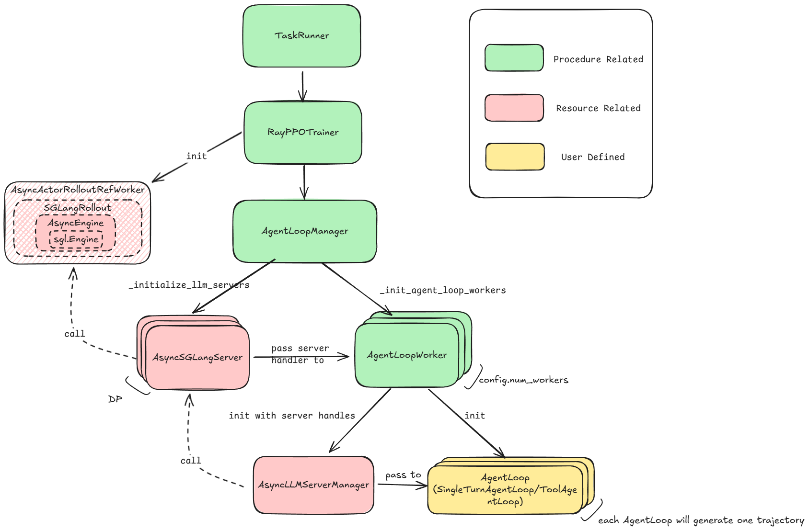

# AgentLoop 源码浅析

最近 RL sys 圈子的吴锡斌老师在 verl 上设计了将 rollout 与 tool 调用解耦的 AgentLoop，实现了自由灵活的 mutli-turn RL。在每个 AgentLoop 内部，rollout engine 只对外提供一个 token-in-token-out 的接口，而 tool 调用则通过 `ToolAgentLoop` 来实现。我个人比较喜欢这样解耦的设计，同时，AgentLoop 的代码结构也比较清晰。我个人学习了一次整个代码后，觉着 AgentLoop 的设计甚是不错，但是 `ActorRolloutRefWorker` 的历史包袱还是很重。

本文简单分析了 agent loop 的源码，并给出了一些自己的看法。

如果我们把整个 `ActorRolloutRefWorker` 当做一个 `sgl.Engine` 的话，AgentLoop 里面包装的两层 `AsyncSGLangServer` 和 `AsyncLLMServerManager`。`AsyncSGLangServer` 相当于在 `sgl.Engine` 上包装了 `fastapi` 成了 server，而 `AsyncLLMServerManager` 是在 server 上包了一层 router 做 load balance，相当于 sglang 的 router。这两层设计都是合理的，主要麻烦的是 `ActorRolloutRefWorker`，层层调用，最后一共经过 7 个 class 才调到 `sgl.Engine`，最近 verl 团队也在致力于对这块 worker class 的重构，敬请期待。最后，`AgentLoopManager`，`AgentLoopWorker` 和 `AgentLoop` 这三层，我觉得 `AgentLoopWorker` 可能未必有必要，其他两层挺合理的。

## Author

Changyi Yang(CMU), Huapeng Zhou(UW), Chenyang Zhao(LMSYS) 

## Related Resources 

**Script**

https://github.com/zhaochenyang20/Awesome-ML-SYS-Tutorial/blob/main/rlhf/verl/multi-turn/tool_examples/agent_loop.md

**Related  PR**

https://github.com/volcengine/verl/pull/2124

**Design Docs**

https://github.com/volcengine/verl/pull/2563

https://github.com/volcengine/verl/pull/A2598

**Commit we are looking at**

https://github.com/volcengine/verl/tree/c5b189a1af496d0bc68320cd1d5bd7a1f1e3638a

## 使用 AgentLoop

安装 verl-sglang 的最新版本：

```bash
cd ~
git clone https://github.com/volcengine/verl.git
cd verl

python -m uv pip install wheel setuptools
python3 -m uv pip install -e ".[sglang]" --prerelease=allow
python3 -m uv pip install -r ./requirements.txt --no-build-isolation
python3 -m uv pip install torch_memory_saver
```

具体实现自己的 agent loop（见下文分析），然后配置 config 文件：

```yaml
    actor_rollout_ref.rollout.mode=async \
    actor_rollout_ref.rollout.multi_turn.enable=true \
    actor_rollout_ref.rollout.name=sglang \
```

注意，不使用 `actor_rollout_ref.rollout.mode=async` 的话，会启用 SGLangRollout 本身管理的 mutli-turn 功能，在效果上和 AgentLoop 完全一致。

最后，在数据集构建过程中添加一个新的 `agent_name` 字段，比如我们在 `~/verl/examples/data_preprocess/gsm8k_multiturn_w_tool.py` 中追加 `"agent_name": "tool_agent"`：

```python
def make_map_fn(split):
        def process_fn(example, idx):
            question_raw = example.pop("question")

            question = question_raw + " " + instruction_following

            answer_raw = example.pop("answer")
            solution = extract_solution(answer_raw)
            data = {
                "data_source": data_source,
                # new column for agent loop
                "agent_name": "tool_agent",
                "prompt": [
                    {
                        #...
                    }
                ]
            }
            return data

        return process_fn

```

## 调用总览


`main_ppo.py -> RayPPOTrainer(fit)-> AgentLoopManager(async) -> AgentLoopWorker -> AsyncLLMServerManager -> AsyncSGLangServer -> AsyncActorRolloutRefWorker -> SGLangRollout -> AsyncEngine -> sgl.Engine`

- `TaskRunner` 启动训练，调用 `RayPPOTrainer.fit()`。
- `RayPPOTrainer` 管理训练流程，调用 `AgentLoopManager.generate_sequences()` 开始层层向下调用，同时初始化 `AsyncActorRolloutRefWorker`。
- `AgentLoopManager` 初始化  dp 个 `AsyncSGLangServer`，随后，初始化 `num_rollout_workers` 个 `AgentLoopWorker`。
- 接着，每个 `AgentLoopWorker` 根据 `agent_name` 从预先注册好的 `_agent_loop_registry` 初始化自身管理的 `train_batch_size / num_rollout_workers` 个 `AgentLoop` 实例，对于 GRPO，`train_batch_size` 需要乘以 group size。用户可以依照自身需求注册新的 `AgentLoop`，目前通过 `ToolAgentLoop` 来完全覆盖了 `SGLangRollout` 中基于 `_req_level_generate_sequences` 实现的 tool call 管理。也就是说， 先前的 multi-turn RL 的 tool 状态管理是在 `SGLangRollout` 内实现的，而 `AgentLoop` 将这层管理抽象了出来，`SGLangRollout` 只是向上包装为 `AsyncSGLangServer` 来完成 token-in-token-out。
- `AgentLoop` 初始化后，管理 tool 调用的各种状态，并且根据 policy 的返回情况，向下层层调用 `AsyncLLMServerManager` -> `AsyncSGLangServer` -> `AsyncActorRolloutRefWorker` -> `SGLangRollout` -> `AsyncEngine` -> `sgl.Engine`，得到模型输出。 返回输出后，`AgentLoop`生命周期结束。
- `AgentLoopWorker`收集所有`AgentLoop`的返回值，上交给`AgentLoopManager`，等待下一次调用。
- `AgentLoopManager`收集所有`AgentLoopWorker`的返回值，返回。



## AgentLoopManager

AgentLoop 的最顶层管理者，负责管理 AgentLoopWorker 以及 LLM servers 的生命周期。核心方法是`generate_sequences`：向下层层调用，得到 policy model 在给定的 agent loop 环境下的 trajectories。

### 核心 API

在 `RayPPOTrainer` 中被初始化：

```Python
if self.config.actor_rollout_ref.rollout.mode == "async":
    from verl.experimental.agent_loop import AgentLoopManager

    self.async_rollout_mode = True
    self.async_rollout_manager = AgentLoopManager(
        config=self.config,
        worker_group=self.actor_rollout_wg,
    )
```

具体的初始化非常简洁：

**`__init__`**

```Python
    def __init__(self, config: DictConfig, worker_group: RayWorkerGroup):
        """Initialize agent loop manager.

        Args:
            config (DictConfig): trainer config.
            worker_group (RayWorkerGroup): ActorRolloutRef worker group.
        """
        self.config = config
        self.worker_group = worker_group

        self._initialize_llm_servers()
        self._init_agent_loop_workers()

        # Initially we're in sleep mode.
        self.sleep()
```

- 传入 ActorRolloutRefWOrker 对应的 worker group，在`_initialize_llm_servers`里用来查找对应的 RolloutWorker；
- 初始化 llm server 和 agent loop workers；

**`_initialize_llm_servers`**

- 计算 dp size：`self.rollout_dp_size = self.worker_group.world_size // self.rollout_tp_size`
- 通过`async_server_class(rollout_backend=self.config.actor_rollout_ref.rollout.name)`获取服务器类，如 `Async``SGLang``Server`，作为和下层的 `sgl.Engine` 通信的转接层。
- 用 ray 初始化 dp size 个 server，为每个 dp rank 创建 server 实例。
- 通过`ray.get(server.get_server_address.remote())`获取并记录每个服务器的地址
- 调用`ray.get([server.init_engine.remote() for server in self.async_llm_servers])`；server 从 ray 通过前缀查询，在已经初始化好的 ray actor 中拿到自己对应的所有 SGLang engine。

```Python
def _initialize_llm_servers(self):
    # 计算 dp size
    self.rollout_tp_size = self.config.actor_rollout_ref.rollout.tensor_model_parallel_size
    self.rollout_dp_size = self.worker_group.world_size // self.rollout_tp_size

    # 获取 worker 信息用于节点亲和性调度
    register_center = ray.get_actor(f"{self.worker_group.name_prefix}_register_center")
    workers_info = ray.get(register_center.get_worker_info.remote())
    assert len(workers_info) == self.worker_group.world_size

    self.async_llm_servers = [None] * self.rollout_dp_size
    self.server_addresses = [None] * self.rollout_dp_size

    # 根据 config 拿到对应的 server, e.g., AsyncSGLangServer
    if self.config.actor_rollout_ref.rollout.agent.custom_async_server:
        server_class = async_server_class(
            rollout_backend=self.config.actor_rollout_ref.rollout.name,
            rollout_backend_module=self.config.actor_rollout_ref.rollout.agent.custom_async_server.path,
            rollout_backend_class=self.config.actor_rollout_ref.rollout.agent.custom_async_server.name,
        )
    else:
        server_class = async_server_class(rollout_backend=self.config.actor_rollout_ref.rollout.name)

    # 用 ray 初始化 dp rank 个 AsyncServer
    unready_dp_ranks = set(range(self.rollout_dp_size))
    while len(unready_dp_ranks) > 0:
        servers = {
            rollout_dp_rank: server_class.options(
                # 确保 AsyncServer 与对应的工作器在同一节点
                scheduling_strategy=ray.util.scheduling_strategies.NodeAffinitySchedulingStrategy(
                    node_id=workers_info[rollout_dp_rank * self.rollout_tp_size],
                    soft=False,
                ),
                name=f"async_llm_server_{rollout_dp_rank}",
            ).remote(self.config, self.rollout_dp_size, rollout_dp_rank, self.worker_group.name_prefix)
            for rollout_dp_rank in unready_dp_ranks
        }

        # 记录 server 地址
        for rollout_dp_rank, server in servers.items():
            try:
                address = ray.get(server.get_server_address.remote())
                self.server_addresses[rollout_dp_rank] = address
                self.async_llm_servers[rollout_dp_rank] = server
                unready_dp_ranks.remove(rollout_dp_rank)
            except Exception:
                ray.kill(server)
                print(f"rollout server {rollout_dp_rank} failed, maybe address already in use, restarting...")

        # 初始化 server，这个初始化是 server 从 ray 中拿到自己 dp 对应的所有 worker
        ray.get([server.init_engine.remote() for server in self.async_llm_servers])
```

**`_init_agent_loop_workers`**

在 ray 上初始化 `rollout.agent.num_workers` 个 `AgentLoopWorker`：

```Python
def _init_agent_loop_workers(self):
    self.agent_loop_workers = []
    for i in range(self.config.actor_rollout_ref.rollout.agent.num_workers):
        self.agent_loop_workers.append(
            AgentLoopWorker.options(
                name=f"agent_loop_worker_{i}",
            ).remote(self.config, self.async_llm_servers)
        )
```

**`generate_sequences`**

- 如果配置了`free_cache_engine`，先调用`self.wake_up()`
- `chunkes = prompts.chunk(len(self.agent_loop_workers))` 将输入批次按 AgentLoopWorker 数量分块。
- 每个 agentLoopWorker 处理自身的 chunk，通过`ray.get([worker.generate_sequences.remote(chunk) for ...])`并行执行并得到结果；
- 处理完成后调用`self.sleep()`让 server 进入睡眠状态以释放显存
- 计算生成序列和工具调用的性能指标
- 合并所有 `AgentLoopWorker` 的输出并返回

Code link [[here](https://github.com/volcengine/verl/blob/c5b189a1af496d0bc68320cd1d5bd7a1f1e3638a/verl/experimental/agent_loop/agent_loop.py#L486)]

```Python
def generate_sequences(self, prompts: DataProto) -> DataProto:
    if self.config.actor_rollout_ref.rollout.free_cache_engine:
        self.wake_up()  # 唤醒所有 LLM 服务器

    chunkes = prompts.chunk(len(self.agent_loop_workers))  # 按 worker 数量分块

    outputs = ray.get(
        [worker.generate_sequences.remote(chunk) for worker, chunk in zip(self.agent_loop_workers, chunkes)]
    )  # 并行分发到各个 AgentLoopWorker

    output = DataProto.concat(outputs)  # 聚合所有 worker 的输出

    if self.config.actor_rollout_ref.rollout.free_cache_engine:
        self.sleep()  # 让服务器进入睡眠状态，释放显存

    # 计算性能指标
    metrics = [output.meta_info["metrics"] for output in outputs]
    timing = self._performance_metrics(metrics, output)

    output.meta_info = {"timing": timing}
    return output
```

## AsyncSGLangServer

基于 SGLang 的异步服务器实现，继承自`AsyncServerBase`。作为 Ray 远程 actor 运行，负责将收到的请求转发给下层的 SGLang Engine。出于 SGLang 的设计，调用 `generate` 的时候只需要对 master worker（verl 的 inference tp 0）调用即可。

### 核心 API

**`init_engine`**

异步初始化 SGLang 引擎：

- 通过`ray.util.list_named_actors`查找所有匹配的 actors；
- 根据命名规则 `self.wg_prefix + "WorkerDict_"` 解析 actor 名称；
- 根据 dp_rank 和 tp_size 分配 actor，确定 master worker（tp rank 0）

```Python
async def init_engine(self):
    if self.workers:
        # avoid init twice
        return
    all_actors = ray.util.list_named_actors(all_namespaces=True)
    matched_actors = [
        actor for actor in all_actors if actor.get("name", None).startswith(self.wg_prefix + "WorkerDict_")
    ]

    gpu_per_node = len(set([actor["name"].split(":")[1] for actor in matched_actors]))
    # total gpu num
    assert len(matched_actors) == self._dp_size * self._tp_size

    for matched_actor in matched_actors:
        fields = matched_actor["name"].split(":")
        assert len(fields) == 2, f"invalid actor name: {matched_actor['name']}"
        pg_index, local_rank = int(fields[0].split("_")[-1]), int(fields[1])

        current_global_rank = gpu_per_node * pg_index + local_rank
        worker_dp_rank = current_global_rank // self._tp_size
        worker_tp_rank = current_global_rank % self._tp_size

        if worker_dp_rank == self._dp_rank:
            worker = ray.get_actor(**matched_actor)
            self.workers.append(worker)

            if worker_tp_rank == 0:
                self.master_worker = worker
```

**`chat_completion`**

处理 `chat_completion` 请求：

```Python
async def chat_completion(self, raw_request: Request):
    request = await raw_request.json()
    output_future = self.master_worker.chat_completion.remote(request)
    [outputs] = await asyncio.gather(output_future)
    return JSONResponse(outputs)
```

- 将请求转发给 master worker 处理
- 返回 JSON 格式的响应

**`generate`**

Token in token out 来获得 SGLang Engine 的 inference 结果：

```Python
async def generate(self, prompt_ids: List[int], sampling_params: Dict[str, Any], request_id: str) -> List[int]:
    return await self.master_worker.generate.remote(prompt_ids, sampling_params, request_id)
```

- 直接调用 master worker 的生成方法
- 支持自定义采样参数

## AsyncLLMServerManager

管理多个 OpenAI 兼容的 LLM 服务器 (例如 `AsyncSGLangServer`)，提供负载均衡和会话粘性功能。支持最少请求负载均衡算法，确保多轮对话发送到同一服务器以实现自动前缀缓存。可以认为就是简单的 router/load balancer 层。

**初始化**

- 配置服务器句柄列表，随机打乱顺序
- 初始化最少请求负载均衡器：`self.weighted_serveres = [[0, (hash(server), server)] for server in server_handles]`
- 创建 LRU 缓存：`self.request_id_to_server = LRUCache(maxsize=max_cache_size)`用于 request_id 到服务器的映射

```Python
def __init__(self, config: DictConfig, server_handles: List[ray.actor.ActorHandle], max_cache_size: int = 10000):
        """Initialize the AsyncLLMServerManager.

        Args:
            config (DictConfig): YAML config.
            server_handles (List[ray.actor.ActorHandle]): OpenAI compatible LLM server actor handles.
            max_cache_size (int, optional): max cache size for request_id to server mapping. Defaults to 10000.
        """
        self.config = config
        self.server_handles = server_handles
        random.shuffle(self.server_handles)

        # Least requests load balancing
        self.weighted_serveres = [[0, (hash(server), server)] for server in server_handles]
        heapq.heapify(self.weighted_serveres)

        # LRU cache to map request_id to server
        self.request_id_to_server = LRUCache(maxsize=max_cache_size)
```

**`_choose_server`**

```Python
def _choose_server(self, request_id: str) -> ray.actor.ActorHandle:
    if request_id in self.request_id_to_server:
        return self.request_id_to_server[request_id]  # 会话粘性
    
    server = self.weighted_serveres[0][1][1]  # 最少请求的服务器
    self.weighted_serveres[0][0] += 1  # 增加请求计数
    heapq.heapreplace(self.weighted_serveres, self.weighted_serveres[0])
    self.request_id_to_server[request_id] = server
    return server
```

- **会话粘性**：相同 `request_id` 发送给同一 `server`
- **最少请求**：新请求分配给当前负载最轻的 `server`
- **动态更新**：使用堆结构维护服务器负载状态

**`generate`**

```Python
@rollout_trace_op
async def generate(self, request_id, *, prompt_ids: List[int], sampling_params: Dict[str, Any]) -> List[int]:
    server = self._choose_server(request_id)
    output = await server.generate.remote(
        request_id=request_id,
        prompt_ids=prompt_ids,
        sampling_params=sampling_params,
    )
    return output
```

- 根据 `request_id` 选择 `server`
- 异步调用 server 的生成接口，token-in-token-out
- 支持性能追踪

## AgentLoopWorker

`AgentLoopWorker` 负责接收数据，向下发给具体的 `AgentLoop`。虽然名字是 worker，但是

1. 从 ray 的角度来说，`AgentLoopWorker` 是有状态的，是 ray actor，而不是 ray worker
2. 核心函数 `generate` 是层层套壳，调用其他类；例如 `single_turn_agent_loop` 和 `tool_agent_loop` 来 `generate`（当然这两个类的 `generate` 也是向下调用，下面会讲到）

**`__init__`**

```Python
@ray.remote
class AgentLoopWorker:
    """Agent loop worker takes a batch of messages and run each message in an agent loop."""

    def __init__(self, config: DictConfig, server_handles: list[ray.actor.ActorHandle]):
        """Initialize agent loop manager.

        Args:
            config (DictConfig): YAML config.
            server_handles (List[ray.actor.ActorHandle]): OpenAI compatible LLM server actor handles.
        """
        self.config = config
        self.server_manager = AsyncLLMServerManager(config, server_handles)

        model_path = config.actor_rollout_ref.model.path
        self.model_name = "/".join(model_path.split("/")[-2:])
        local_path = copy_to_local(config.actor_rollout_ref.model.path)
        self.tokenizer = hf_tokenizer(local_path, trust_remote_code=True)

        trace_config = self.config.actor_rollout_ref.rollout.get("trace", {})
        RolloutTraceConfig.init(
            self.config.trainer.project_name,
            self.config.trainer.experiment_name,
            trace_config.get("backend"),
            trace_config.get("token2text", False),
        )
```

- 上游传过来的 `config` 和 `server_handles` 作为参数来初始化 `AsyncLLMServerManager`，之后会把这个 `self.server_manager` 传给下游；
- 根据 `config` 的 `config`**`.`**`actor_rollout_ref`**`.`**`model`**`.`**`path` 设置 `model_path, local_path, tokenizer`
- 配置 `RolloutTraceConfig` 用于追踪 trajectories

**`generate_sequences`**

```Python
async def generate_sequences(self, batch: DataProto) -> DataProto:
    """Generate sequences from agent loop.

    Args:
        batch (DataProto): Input batch.

    Returns:
        DataProto: Output batch.
        - prompts: [bsz, prompt_length], prompt token ids from dataset.
        - responses: [bsz, response_length], output token ids include response tokens
          from LLM generation and observation tokens from tool_calls.
        - response_mask: [bsz, response_length], 1 for LLM generated tokens, 0 for observation/padding tokens.
        - input_ids: [bsz, prompt_length + response_length], whole sequence token ids, including prompt tokens
          and response tokens.
        - attention_mask: [bsz, prompt_length + response_length], 0 for padding tokens, 1 for other tokens.
        - position_ids: [bsz, prompt_length + response_length], incremental position ids.

        For multi-turn conversations:
        responses:     |<- LLM generation ->|<- tool_calls ->|<- LLM generation ->|<- padding ->|
        response_mask: | 1, 1, 1, ..., 1, 1 | 0, 0, .., 0, 0 | 1, 1, 1, ..., 1, 1 | 0, 0, ..., 0|
    """
    config = self.config.actor_rollout_ref.rollout
    sampling_params = dict(
        temperature=config.temperature,
        top_p=config.top_p,
        repetition_penalty=1.0,
    )

    # override sampling params for validation
    if batch.meta_info.get("validate", False):
        sampling_params["top_p"] = config.val_kwargs.top_p
        sampling_params["temperature"] = config.val_kwargs.temperature

    # by default, we assume it's a single turn agent
    if "agent_name" not in batch.non_tensor_batch:
        batch.non_tensor_batch["agent_name"] = np.array(["single_turn_agent"] * len(batch), dtype=object)

    tasks = []
    agent_names = batch.non_tensor_batch["agent_name"]
    raw_prompts = batch.non_tensor_batch["raw_prompt"]
    if "index" in batch.non_tensor_batch:
        index = batch.non_tensor_batch["index"]
    else:
        index = np.arange(len(raw_prompts))

    trajectory_info = await get_trajectory_info(
        batch.meta_info.get("global_steps", -1), index, batch.meta_info.get("validate", False)
    )

    for agent_name, messages, trajectory in zip(agent_names, raw_prompts, trajectory_info, strict=True):
        tasks.append(
            asyncio.create_task(self._run_agent_loop(agent_name, messages.tolist(), sampling_params, trajectory))
        )
    outputs = await asyncio.gather(*tasks)

    output = self._postprocess(outputs)
    return output
```

- 利用上游传来的 `config`，创建给下游使用的 `sampling_params`；对 validation batch 要用 validation 参数。
- 利用 batch 的 `meta_info`，获得 `agent_name, raw_prompts, index`。再用这个 `meta_info` 处理获得 `trajectory_info`；就是利用刚才的 index 来计算在每一个 step 每一个 prompt 被 rollout 的次数，然后存到一个 list 中获得整个 rollout 的 trace；
- 利用 `agent_names, raw_prompts, trajectory_info` 来并发执行 `_run_agent_loop`。
- 在 `_run_agent_loop` 函数内，就要进行相应 `agent_name` 的 `agent_loop` 实例化，以及调用 `agent_loop` 对应的 run 函数来 generate。
- 在 `_postprocess` 中，会根据前面计算出来的 output（被封装成了 `AgentLoopOutput` 格式）来进行后处理；padding，加入 mask，最后封装成一个 `DataProto` 返回。

```Python
async def _run_agent_loop(
    self,
    agent_name: str,
    messages: list[dict[str, Any]],
    sampling_params: dict[str, Any],
    trajectory: dict[str, Any],
) -> AgentLoopOutput:
    with rollout_trace_attr(
        step=trajectory["step"],
        sample_index=trajectory["sample_index"],
        rollout_n=trajectory["rollout_n"],
        validate=trajectory["validate"],
        name="agent_loop",
    ):
        assert agent_name in _agent_loop_registry, (
            f"Agent loop {agent_name} not registered, registered agent loops: {_agent_loop_registry.keys()}"
        )

        agent_loop_config = _agent_loop_registry[agent_name]
        agent_loop = hydra.utils.instantiate(
            config=agent_loop_config,
            trainer_config=_DummyConfig(config=self.config),
            server_manager=self.server_manager,
            tokenizer=self.tokenizer,
        )
        output = await agent_loop.run(messages, sampling_params)
        return output

def _postprocess(self, inputs: list[AgentLoopOutput]) -> DataProto:
    # NOTE: consistent with batch version of generate_sequences in vllm_rollout_spmd.py
    # prompts: left pad
    # responses: right pad
    # input_ids: prompt + response
    # attention_mask: [0,0,0,0,1,1,1,1, | 1,1,1,0,0,0,0,0]
    # position_ids:   [0,0,0,0,0,1,2,3, | 4,5,6,7,8,9,10,11]

    # prompts
    self.tokenizer.padding_side = "left"
    outputs = self.tokenizer.pad(
        [{"input_ids": input.prompt_ids} for input in inputs],
        padding="max_length",
        max_length=self.config.actor_rollout_ref.rollout.prompt_length,
        return_tensors="pt",
        return_attention_mask=True,
    )
    prompt_ids, prompt_attention_mask = outputs["input_ids"], outputs["attention_mask"]

    # responses
    self.tokenizer.padding_side = "right"
    outputs = self.tokenizer.pad(
        [{"input_ids": input.response_ids} for input in inputs],
        padding="max_length",
        max_length=self.config.actor_rollout_ref.rollout.response_length,
        return_tensors="pt",
        return_attention_mask=True,
    )
    response_ids, response_attention_mask = outputs["input_ids"], outputs["attention_mask"]

    # response_mask
    outputs = self.tokenizer.pad(
        [{"input_ids": input.response_mask} for input in inputs],
        padding="max_length",
        max_length=self.config.actor_rollout_ref.rollout.response_length,
        return_tensors="pt",
        return_attention_mask=False,
    )
    response_mask = outputs["input_ids"]
    assert response_ids.shape == response_mask.shape, (
        f"mismatch in response_ids and response_mask shape: {response_ids.shape} vs {response_mask.shape}"
    )
    response_mask = response_mask * response_attention_mask

    input_ids = torch.cat([prompt_ids, response_ids], dim=1)
    attention_mask = torch.cat([prompt_attention_mask, response_attention_mask], dim=1)
    position_ids = (attention_mask.cumsum(dim=1) - 1) * attention_mask

    batch = TensorDict(
        {
            "prompts": prompt_ids,  # [bsz, prompt_length]
            "responses": response_ids,  # [bsz, response_length]
            "response_mask": response_mask,  # [bsz, response_length]
            "input_ids": input_ids,  # [bsz, prompt_length + response_length]
            "attention_mask": attention_mask,  # [bsz, prompt_length + response_length]
            "position_ids": position_ids,  # [bsz, prompt_length + response_length]
        },
        batch_size=len(input_ids),
    )

    num_turns = np.array([input.num_turns for input in inputs], dtype=np.int32)
    metrics = [input.metrics.model_dump() for input in inputs]
    return DataProto(batch=batch, non_tensor_batch={"__num_turns__": num_turns}, meta_info={"metrics": metrics})
```

## AgentLoop

终于进入到了具体的 agent loop 当中，我们观察两种具体的 AgentLoop。

## SingleTurnAgentLoop

这个 `agent_loop` 是默认的单轮对话，处理简单的一问一答，不支持工具调用；最重要的自然是 `run` 函数：

1. 我们传入 `agent_loop`的 `messages` 其实是我们从 `batch` 里面获得的 `raw_prompt`，此处调用 `apply_chat_template`；
2. 调用 `server_manager` 里面的 `generate` 函数来计算 `response_ids`；
3. 计算 `response_mask`，并根据 `response_length` 截取，封装这些结果成 `AgentLoopOutput`，padding 在上层 `AgentLoopManager` 的 `_postprocess` 内做；

```Python
class SingleTurnAgentLoop(AgentLoopBase):
    """Naive agent loop that only do single turn chat completion."""

    def __init__(self, config, server_manager, tokenizer):
        super().__init__(config, server_manager, tokenizer)
        self.prompt_length = config.actor_rollout_ref.rollout.prompt_length
        self.response_length = config.actor_rollout_ref.rollout.response_length

    async def run(self, messages: list[dict[str, Any]], sampling_params: dict[str, Any]) -> AgentLoopOutput:
        metrics = {}
        request_id = uuid4().hex
        prompt_ids = await self.loop.run_in_executor(
            None, lambda: self.tokenizer.apply_chat_template(messages, add_generation_prompt=True, tokenize=True)
        )

        with simple_timer("generate_sequences", metrics):
            response_ids = await self.server_manager.generate(
                request_id=request_id, prompt_ids=prompt_ids, sampling_params=sampling_params
            )
        response_mask = [1] * len(response_ids)

        output = AgentLoopOutput(
            prompt_ids=prompt_ids,
            response_ids=response_ids[: self.response_length],
            response_mask=response_mask[: self.response_length],
            num_turns=2,
            metrics=metrics,
        )
        return output
```

## ToolAgentLoop

终于到了最核心的地方。`ToolAgentLoop` 支持多轮对话和工具调用。目前 `ToolAgentLoop` 可以完全覆盖 `SGLangRollout` 中基于 `_async_rollout_a_request` 实现的 [tool call 管理](https://github.com/zhaochenyang20/Awesome-ML-SYS-Tutorial/blob/main/rlhf/verl/multi-turn/code-walk-through/readme-2.md#_async_rollout_a_request)。但状态数量和转移关系更加简单。也就是说， 先前的 multi-turn RL 的 tool 状态管理是在 `SGLangRollout` 内实现的，而 `AgentLoop` 提前将这层管理抽象了出来。

**`init_class`**

下面只介绍一些关键参数的作用:

1. **`tool_response_truncate_side`：**控制工具响应内容过长时的截断方式。
   * `"left"`：从左侧截断，保留开头部分 + "...(truncated)"；
   * `"right"`：从右侧截断，保留结尾部分，前面加 "(truncated)..."；
   * 其他值：从中间截断，保留开头和结尾部分，中间加 "...(truncated)..."
2. **`tool_config_path`**：指定包含工具定义和配置信息的配置文件位置，用于初始化可用的工具列表，比如`verl/examples/sglang_multiturn/config/tool_config/gsm8k_tool_config.yaml`

```YAML
tools:
  - class_name: "verl.tools.gsm8k_tool.Gsm8kTool"
    config: 
      type: native
    tool_schema:
      type: "function"
      function:
        name: "calc_gsm8k_reward"
        description: "A tool for calculating the reward of gsm8k. (1.0 if parsed answer is correct, 0.0 if parsed answer is incorrect or not correctly parsed)"
        parameters:
          type: "object"
          properties:
            answer:
              type: "string"
              description: "The model's answer to the GSM8K math problem, must be a digits"
          required: ["answer"]
```

 **`tool_list`**,  **`tool_schemas`**：通过 `initialize_tools_from_config(tool_config_path)` 函数从配置文件中解析并创建工具实例。

 **`tool_parser`**：通过设置类似 `actor_rollout_ref.rollout.multi_turn.format=hermes`这样的参数， 可以获取对应的 `tool_parser`；比如 `HermesToolParser` 就是提取 `<tool_call></tool_call>` 之间的内容，返回对应的 `function_call`（`function_name` 和 `function_arguments`）, 还有除开 `tool_call` 内容以外的 `content`。

```Python
@classmethod
def init_class(cls, config, tokenizer):
    if cls._class_initialized:
        return
    cls._class_initialized = True
    print("Performing class-level ToolAgentLoop initialization")

    # Initialize tools from config file
    cls.tokenizer = tokenizer
    cls.max_user_turns = config.actor_rollout_ref.rollout.multi_turn.max_user_turns
    cls.max_assistant_turns = config.actor_rollout_ref.rollout.multi_turn.max_assistant_turns
    cls.max_parallel_calls = config.actor_rollout_ref.rollout.multi_turn.max_parallel_calls
    cls.max_tool_response_length = config.actor_rollout_ref.rollout.multi_turn.max_tool_response_length
    cls.tool_response_truncate_side = config.actor_rollout_ref.rollout.multi_turn.tool_response_truncate_side
    tool_config_path = config.actor_rollout_ref.rollout.multi_turn.tool_config_path
    tool_list = initialize_tools_from_config(tool_config_path) if tool_config_path else []
    cls.tools = {tool.name: tool for tool in tool_list}
    cls.tool_schemas = [tool.tool_schema.model_dump(exclude_unset=True, exclude_none=True) for tool in tool_list]
    cls.tool_parser = cls.get_tool_parser(config.actor_rollout_ref.rollout.multi_turn.format)
    print(f"Initialized tools: {cls.tools}")

    cls.prompt_length = config.actor_rollout_ref.rollout.prompt_length
    cls.response_length = config.actor_rollout_ref.rollout.response_length
    cls.system_prompt = tokenizer.apply_chat_template([{}], add_generation_prompt=False, tokenize=True)
```

**`run`**

- 和 `single_turn_agent_loop` 一样，对 prompts `apply_chat_template`；
- 初始化 `user_turns, assistant_turns`，进入 multi-turn 的 loop 循环，直到退出:
  - 向 `server_manager` 发送 `prompt_ids`，得到对应的 `response_ids`；将本轮返回的 `response_ids` append 到 `prompt_ids` 中，准备作为下一轮的输入，并且 `assistant_turns += 1`
  - 处理边界条件，比如 prompts 过长，没有 tool call 了，或者超出了 max turns；
  - 异步执行 `_call_tool`：从 response 中 extract 出 Function Call，接着 `tool`**`.`**`execute(instance_id`**`,`**` tool_args)` 获得相应的 `tool_response`, 然后截断返回即可。具体的 `_call_tool` 会在后文分析。
  - `tool_responses` 随后 `apply_chat_template` 得到 `tool_response_ids`，同样 append 到`prompt_ids` 内，然后 `user_turns += 1`，进入下一轮循环；
- 退出 tool agent loop 循环后，构造 `AgentLoopOutput` 注意 num_turns=user_turns+assistant_turns +1，因为 prompt 也算一次 user turn

```Python
@rollout_trace_op
async def run(self, messages: list[dict[str, Any]], sampling_params: dict[str, Any]) -> AgentLoopOutput:
    metrics = {}
    request_id = uuid4().hex
    prompt_ids = await self.loop.run_in_executor(
        None,
        lambda: self.tokenizer.apply_chat_template(
            messages, tools=self.tool_schemas, add_generation_prompt=True, tokenize=True
        ),
    )
    response_mask = []

    user_turns, assistant_turns = 0, 0
    while True:
        with simple_timer("generate_sequences", metrics):
            response_ids = await self.server_manager.generate(
                request_id=request_id, prompt_ids=prompt_ids, sampling_params=sampling_params
            )
        prompt_ids += response_ids
        response_mask += [1] * len(response_ids)
        assistant_turns += 1

        # reach max response length
        if len(response_mask) >= self.response_length:
            break

        # reach max assistant turns
        if self.max_assistant_turns and assistant_turns >= self.max_assistant_turns:
            break

        # reach max user turns
        if self.max_user_turns and user_turns >= self.max_user_turns:
            break

        # no tool calls
        tool_calls = await self.tool_parser.extract_tool_calls(response_ids)
        if not tool_calls:
            break

        # call tools
        tasks = []
        for tool_call in tool_calls[: self.max_parallel_calls]:
            tasks.append(self._call_tool(tool_call))
        with simple_timer("tool_calls", metrics):
            tool_responses = await asyncio.gather(*tasks)
        if any(isinstance(item, Exception) for item in tool_responses):
            break

        # append tool_response_ids
        tool_response_ids = await self.loop.run_in_executor(
            None,
            lambda messages=tool_responses: self.tokenizer.apply_chat_template(
                messages, add_generation_prompt=True, tokenize=True
            ),
        )
        tool_response_ids = tool_response_ids[len(self.system_prompt) :]

        # NOTE: last turn should not be user turn, or the EOS token reward
        # can't be propagated to previous token in GAE.
        if len(response_mask) + len(tool_response_ids) >= self.response_length:
            break

        prompt_ids += tool_response_ids
        response_mask += [0] * len(tool_response_ids)
        user_turns += 1

    response_ids = prompt_ids[-len(response_mask) :]
    prompt_ids = prompt_ids[: len(prompt_ids) - len(response_mask)]

    output = AgentLoopOutput(
        prompt_ids=prompt_ids,
        response_ids=response_ids[: self.response_length],
        response_mask=response_mask[: self.response_length],
        num_turns=user_turns + assistant_turns + 1,
        metrics=metrics,
    )
    return output
```

**`call_tool`**

基于 tool list 内的 tool 来调用工具，例如前面 config 中配置的 `calc_gsm8k_reward`，从 tool parser 得到 arguments 就可以代入运算得到相应的`tool_response`。如果 tool 调用成功，则会释放 tool 占用的资源,，最后`tool_response`根据 `tool_response_truncate_side` 来做相应的截断。

```Python
async def _call_tool(self, tool_call: FunctionCall) -> dict[str, str]:
    """Call tool and return tool response."""
    tool, instance_id = None, None
    try:
        # TODO: append malformed tool_call to the prompt: invalid function name or arguments
        tool_name = tool_call.name
        tool_args = json.loads(tool_call.arguments)
        tool = self.tools[tool_name]

        instance_id = await tool.create()
        tool_response, _, _ = await tool.execute(instance_id, tool_args)
    except Exception as e:
        logger.exception(f"Error when executing tool: {e}")
        return e
    finally:
        if tool and instance_id:
            await tool.release(instance_id)

    if len(tool_response) > self.max_tool_response_length:
        if self.tool_response_truncate_side == "left":
            tool_response = tool_response[: self.max_tool_response_length] + "...(truncated)"
        elif self.tool_response_truncate_side == "right":
            tool_response = "(truncated)..." + tool_response[-self.max_tool_response_length :]
        else:
            length = self.max_tool_response_length // 2
            tool_response = tool_response[:length] + "...(truncated)..." + tool_response[-length:]

    return {
        "role": "tool",
        "content": tool_response,
    }
```