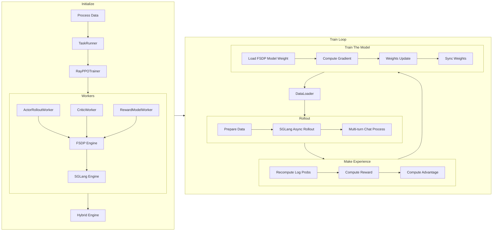

# verl Multi-turn Code Walk Through（Part 1）

承蒙社区厚爱，Agentic RL 如火如荼，我们 SGLang RL 小组的工作也在夜以继日。考虑到领域令人恐惧的发展速度，社区巨大的二次开发需求，我们选择以 verl 出发，分析其 end to end mutli-turn RL 训练的全过程。整体上，我们希望覆盖所有重要的 class 以及函数，更细粒度的代码不再展开。我们的写作风格希望能够 follow SGLang 的 code-walk-through：

[SGLang Code Walk Through](https://github.com/zhaochenyang20/Awesome-ML-SYS-Tutorial/blob/main/sglang/code-walk-through/readme-CN.md)

为了前后内容的一致性，我们基于 [76f63cffa5](https://github.com/volcengine/verl/commit/76f63cffa5081564d8fea93a1cb3ce8bd5bdcc39) 的 commit 进行分析。

感谢来自 Amazon，LinkedIn，阿里等公司和 SGLang RL 小组的朋友们的贡献。虽然本文以分析 verl 的代码为主，写完之后我们才意识到，系统设计问题是非常通用的。诸如“log probs 重计算”，“Rollout Engine 显存管理”等等系统设计，是各大 RL 框架都需要考虑的核心问题。我们希望本文对于开源社区理解 RL 框架系统设计能提供可迁移的经验 😂

如果您对我们的工作感兴趣，欢迎来联系我们参与一些工作～

特别致谢：zhuoran yin @ CMU，changyi yang @ CMU，zhuohao li @ 阿里，ji li @待业在家（🤣），biao he @ Linkedin 和 xinpeng wei & chenyang zhao @ Amazon。

--------------------------------

整个训练的示意图如下，我们会具体展开每个部分。



## **数据预处理**

以 [GSM8K](https://huggingface.co/datasets/openai/gsm8k) 为例，预处理脚本是 `examples/data_preprocess/gsm8k_multiturn_w_tool.py`。整个脚本只做了经典的 huggingface datasets mapping，核心逻辑如下：

1. 加载 openai/gsm8k 原始数据集（train/test）。
2. 对每条原始数据，生成带有工具调用要求的 prompt（比如在 user turn 强调模型可以调用 `calc_gsm8k_reward` 工具，每个qa至少调用一次）。
3. 同样对于每条原始数据，解析答案；将 ground truth 写入 extra_info 字段。
4. 存储为 parquet 文件，分别保留为 train.parquet 和 test.parquet，默认路径为 `~/data/gsm8k/`。

## 启动训练

一个典型的启动命令如下：

```bash
# now 用于生成实验启动的时间尾缀，避免重复启动实验时覆盖已有 wandb log

function now() {
    date '+%Y-%m-%d-%H-%M'
}

export CUDA_VISIBLE_DEVICES=0,1,2,3,4,5,6,7
nohup bash examples/sglang_multiturn/run_qwen2.5-3b_gsm8k_multiturn.sh \
    trainer.experiment_name=qwen2.5-3b_rm-gsm8k-sgl-multiturn-$now \
    > logs/gsm8k-$now.log 2>&1 &

```

## 脚本配置

verl 的各项参数实属复杂，我们会单独编写文档来分享对 verl 各类参数的理解。在这篇文档中，我们想要格外强调的是 verl 各类 config 的覆盖关系。verl 的配置文件利用 hydra 进行了**分层覆盖**的设计模式。

<details>

<summary>Hydra 简介</summary>

[**Hydra**](https://github.com/facebookresearch/hydra) 是一个由 Facebook Research 开发的 Python 框架，旨在**优雅地配置复杂的应用程序**。它特别适用于需要管理大量参数和进行多组实验的场景，例如机器学习项目。Hydra 的核心特点在于其**动态、分层和可组合的配置管理能力**。Hydra 的核心优势：

* **分层配置 (Hierarchical Configuration)**：可以将配置分解成多个小型、模块化的 YAML 文件，并以目录结构进行组织。这使得配置更加清晰、易于管理和复用。
* **配置组合 (Configuration Composition)**：Hydra 能够将这些独立的配置模块动态地组合起来，形成一个完整的配置对象。你可以通过在主配置文件中指定 `defaults` 列表来选择和组合不同的配置组件。
* **命令行覆盖 (Command-line Overrides)**：这是 Hydra 最强大的功能之一。你可以在运行应用程序时，直接通过命令行参数来覆盖配置中的任何值。这使得进行实验和快速迭代变得非常方便，无需修改配置文件本身。
* **多运行模式 (Multi-run)**：Hydra 允许你通过一个命令运行多个具有不同配置的实验。这对于超参数搜索和模型比较非常有用。
* **动态工作目录 (Dynamic Working Directory)**：每次运行应用程序时，Hydra 都会自动创建一个独立的工作目录，并将当前运行的配置和输出保存到该目录中，确保实验的可复现性。
* **对象实例化 (Object Instantiation)**：Hydra 可以直接从配置中实例化 Python 对象（类或函数），这大大简化了代码，使配置更具声明性。


Hydra 实现分层覆盖的主要机制是**组合 (Composition)** 和 **命令行覆盖 (Command-line Overrides)**。

1.  **分层配置的组织**：

通常会创建一个 `conf` 目录，并在其中组织配置。例如：

```yaml
.
├── my_app.py
└── conf
    ├── config.yaml
    ├── model
    │   ├── cnn.yaml
    │   └── rnn.yaml
    └── dataset
        ├── cifar10.yaml
        └── imagenet.yaml
```

`config.yaml` 是你的主配置文件。在 `model` 目录下，你可以定义不同的模型配置（如 `cnn.yaml`、`rnn.yaml`），在 `dataset` 目录下定义不同的数据集配置（如 `cifar10.yaml`、`imagenet.yaml`）。

2.  **`defaults` 列表进行组合**：

在 `config.yaml` 中，你可以使用特殊的 `defaults` 列表来指定默认加载哪些配置组件。

**`conf/config.yaml` 示例：**

```yaml
defaults:
    - model: cnn       # 默认加载 conf/model/cnn.yaml
    - dataset: cifar10 # 默认加载 conf/dataset/cifar10.yaml
    - _self_          # 确保当前文件中的其他配置项也被加载

# 其他应用级别的默认配置
learning_rate: 0.001
epochs: 10
```

当 Hydra 加载 `config.yaml` 时，它会根据 `defaults` 列表中的指示，自动将 `conf/model/cnn.yaml` 和 `conf/dataset/cifar10.yaml` 的内容合并到最终的配置对象中。

3.  **命令行覆盖**：

这是实现灵活覆盖的关键。你可以通过命令行参数来覆盖任何已加载的配置值，包括在 `defaults` 列表中指定的组件或其内部的任何参数。

* **覆盖整个配置组**：
要切换模型从 `cnn` 到 `rnn`，你可以在命令行中这样运行：

```bash
python my_app.py model=rnn
```

这将指示 Hydra 加载 `conf/model/rnn.yaml`，并用它来替换默认的 `cnn` 配置。

* **覆盖特定参数**：
你可以深入到配置的任何层级来覆盖特定的参数。例如，如果你想修改学习率或数据集的某个参数：

```bash
python my_app.py learning_rate=0.01 dataset.batch_size=64
```

这里，`learning_rate` 直接覆盖了 `config.yaml` 中的值，而 `dataset.batch_size` 则覆盖了 `conf/dataset/cifar10.yaml`（或者你通过 `dataset=imagenet` 指定的其他数据集配置文件）中的 `batch_size` 参数。

* **添加新参数 (使用 `+`)**：
如果你想添加一个在默认配置中不存在的新参数，可以使用 `+` 前缀：

```bash
python my_app.py +optimizer.name=AdamW
```

* **动态覆盖 (使用 `++`)**：
如果你希望修改一个已有字段，或者在原配置中没有该字段时自动创建它，可以使用 ++。这种方式适用于需要动态添加或覆盖配置项的场景，确保字段总是被设置为你指定的值，无论它是否已存在。

```bash
python my_app.py ++model.num_layers=10
```

Hydra 内部使用 [OmegaConf](https://www.google.com/search?q=https://omegaconf.readthedocs.io/en/2.3_latest/) 库来处理这些配置对象，它提供了强大的合并和解析功能，使得分层覆盖和值插值（例如，引用其他配置值或环境变量）变得非常容易。

</details>


回到 verl multi turn，在我们启动的 `run_qwen2.5-3b_gsm8k_multiturn.sh` 中，设置了：

```bash
PROJECT_DIR="$(pwd)"
CONFIG_PATH="$PROJECT_DIR/examples/sglang_multiturn/config"

python3 -m verl.trainer.main_ppo \
    --config-path="$CONFIG_PATH" \
    --config-name='gsm8k_multiturn_grpo' \
```

这意味着这次任务的默认 config 是 `CONFIG_PATH` 下的 `gsm8k_multiturn_grpo.yaml`，且接下来的参数会覆盖 `gsm8k_multiturn_grpo.yaml` 中的默认值。更进一步，我们来观察 `gsm8k_multiturn_grpo.yaml` 的内容：

```yaml
hydra:
  searchpath:
    - file://verl/trainer/config

defaults:
  - ppo_trainer
  - _self_

data:
  max_prompt_length: 1024
  max_response_length: 1024
  train_batch_size: 256
  return_raw_chat: True

actor_rollout_ref:
  hybrid_engine: True
  rollout:
    name: sglang
    multi_turn:
      enable: True
      max_turns: 5
      # tool_config_path: "./config/tool_config/gsm8k_tool_config.yaml"
```

这里 hydra 语法，会去 `verl/trainer/config` 目录下寻找 `ppo_trainer.yaml` 作为基础配置，并且覆盖。因此，启动 `run_qwen2.5-3b_gsm8k_multiturn.sh` 时，先加载 `gsm8k_multiturn_grpo.yaml` 作为基础配置并覆盖，然后加载 `ppo_trainer.yaml` 并覆盖。最终合并这三级配置，得到最终的 config。

最后，注意到在 `run_qwen2.5-3b_gsm8k_multiturn.sh` 的最后，我们，我们设置了 `actor_rollout_ref.rollout.multi_turn.tool_config_path="$PROJECT_DIR/examples/sglang_multiturn/config/tool_config/gsm8k_tool_config.yaml"`，这里指定 multi_turn 的 tool_config_path 为 `examples/sglang_multiturn/config/tool_config/gsm8k_tool_config.yaml`。这一文件仅仅配置了 gsm8k 的 tool 调用，并不会覆盖之前训练的 config。

## 训练主入口与初始化

### Ray Actor，Ray Task 和 Ray Worker

在介绍 verl 的训练主入口之前，我们先介绍 Ray 的一些核心概念。Ray 是一个统一计算框架，旨在实现简单地从单机到大型分布式集群的扩展，提供构建和运行分布式应用的底层基础设施和一组核心原语。Ray 通过以下功能实现这一目标：

1. **统一 API**：Ray 提供了一套简单易用的 Python API，将普通函数转换为分布式任务，将 Python 类转换为分布式服务，也即 Ray Actor。Ray Actor 内部持久存储的数据称为状态，可以在 Actor 的整个生命周期内被多次访问、修改和维护，而不会在每次方法调用结束后消失。
2. **弹性伸缩**：Ray 可以将应用从单个机器无缝扩展到拥有数千个节点的集群，并能根据需求自动扩缩容。
3. **容错性**：Ray 内置了容错机制，可以处理节点故障和任务失败，确保应用的健壮性。
4. **性能优化**：Ray 优化了分布式任务调度、内存管理和数据传输，以实现高效的并行计算。

Ray Task 和 Ray Actor 都是用于分布式计算的核心原语，但它们各自服务于不同的目的，主要区别在于**是否维护状态**。

Ray Task 是 Ray 中最基本的计算单元，代表一个无状态的远程函数。Ray Task 的每次执行都是独立的，不保留之前的任何信息。就像调用一个普通函数，执行完后就清除内部状态。我们调用一个 Ray Task 后，会立即返回得到一个 Ray ObjectRef，而不是实际的结果。主程序可以继续执行其他操作，而 Ray Task 则在后台并行运行。我们需要使用 `ray.get()` 来获取 Task 的实际结果。 Ray Task 非常适合并行执行大量独立、一次性的计算任务，譬如数据批处理、独立的模型推理等场景。

Ray Actor 是一种特殊的 Ray Task，正如前文所述，它是一个持续运行的、有自己的状态和方法的远程对象。当我们创建一个 Ray Actor 后，Ray 会在集群中的某个 **Ray Worker** 上启动一个专门的进程来托管这个对象。该进程会一直运行，直到被销毁。Actor 可以维护内部变量，并且这些变量在 Actor 的生命周期内是持久存在的。每次调用 Actor 的方法，都可以访问和修改这些状态。这与普通的 Ray Task 不同，普通 Task 执行完会清除内部状态。Ray Actor 支持并发请求，Ray 会负责将这些请求序列化执行，保证 Actor 内部状态的一致性和线程安全。我们可以通过 `@ray.remote` 装饰器将一个 Python 类转换为一个 Ray Actor 类，然后通过 `.remote()` 方法实例化一个远程 Actor。

最后，Ray Worker 是 Ray 集群中真正执行代码的工作单元。一个 Ray 集群通常由一个 Head Node 和多个 Worker Nodes 组成。每个节点上都会运行一个或多个 Ray Worker 进程。无论是普通的 Ray Task 还是 Ray Actor 的方法，最终都是由 Ray Worker 进程来执行的。每个 Ray Worker 都会被分配一定的计算资源（如 CPU、GPU）。当你提交一个 Ray Task 或创建一个 Ray Actor 时，Ray 的调度器会找到一个有足够资源的 Worker 来运行它。Worker 进程之间以及 Worker 进程与头节点之间会进行通信，以协调任务执行、传输数据和管理状态。一个 Ray Worker 通常就是一个独立的 Python 进程。对于普通的 Ray Task，Ray Worker 相当于函数解释器，执行完任务后可能会被复用去执行其他任务。而对于 Ray Actor，Ray 会启动一个专门的 Worker 进程来托管这个 Actor，这个 Worker 进程的生命周期与 Actor 的生命周期绑定。

### `run_ppo()` 和 `TaskRunner.run()`

有了 ray 的概念，我们回到整个 RL 训练流程的起点：`verl.trainer.main_ppo.py` 中的 [`run_ppo()`](https://github.com/volcengine/verl/blob/76f63cffa5081564d8fea93a1cb3ce8bd5bdcc39/verl/trainer/main_ppo.py#L35)，它负责初始化 Ray 集群，配置 CPU 资源和运行时环境变量，并创建远程 TaskRunner 实例。

```python
def run_ppo(config) -> None:
    # 初始化 Ray 集群，配置 CPU 资源和运行时环境变量
    ray.init(
        runtime_env={"env_vars": {...}},
        num_cpus=config.ray_init.num_cpus,
    )

    # 创建远程 TaskRunner 实例
    # TaskRunner 是 Ray 中的一个远程 actor，它将在 Ray 集群上异步执行主要的训练任务
    runner = TaskRunner.remote()
    # 异步执行远程任务 runner.run()，并等待其完成
    # 通过 ray.get() 阻塞直到远程任务执行完毕，确保整个初始化流程的顺序性
    ray.get(runner.run.remote(config))
```

### ActorRolloutRefWorker 和 RayWorkerGroup 的相互关系

[TaskRunner](https://github.com/volcengine/verl/blob/76f63cffa5081564d8fea93a1cb3ce8bd5bdcc39/verl/trainer/main_ppo.py#L64) 是 verl 中实现 PPO/GRPO 训练的核心组件，它通过将整个 RL 训练流程封装在一个独立的 Ray Actor 中，实现了任务的封装、资源隔离和分布式协调。为了解释清楚 `TaskRunner`，我们将 verl 当中最让人费解且最复杂的 `ActorRolloutRefWorker` 和 `RayWorkerGroup` 这两个类提前解释清楚。

我们先不讨论这两个类及其基类的具体意义，先讨论清楚其实例对象的创建过程。我们注意到这段 `TaskRunner` 的初始化中引入 `ActorRolloutRefWorker` 和 `RayWorkerGroup` 的相关代码：

<details>
<summary>TaskRunner 中引入 ActorRolloutRefWorker</summary>

```python
        # Define worker classes based on the actor strategy.
        if config.actor_rollout_ref.actor.strategy in ["fsdp", "fsdp2"]:
            assert config.critic.strategy in ["fsdp", "fsdp2"]
            from verl.single_controller.ray import RayWorkerGroup
            from verl.workers.fsdp_workers import ActorRolloutRefWorker, AsyncActorRolloutRefWorker, CriticWorker

            actor_rollout_cls = AsyncActorRolloutRefWorker if config.actor_rollout_ref.rollout.mode == "async" else ActorRolloutRefWorker
            ray_worker_group_cls = RayWorkerGroup

        elif config.actor_rollout_ref.actor.strategy == "megatron":
            assert config.actor_rollout_ref.actor.strategy == config.critic.strategy
            from verl.single_controller.ray.megatron import NVMegatronRayWorkerGroup
            from verl.workers.megatron_workers import ActorRolloutRefWorker, AsyncActorRolloutRefWorker, CriticWorker

            actor_rollout_cls = AsyncActorRolloutRefWorker if config.actor_rollout_ref.rollout.mode == "async" else ActorRolloutRefWorker
            ray_worker_group_cls = NVMegatronRayWorkerGroup

        else:
            raise NotImplementedError

        from verl.trainer.ppo.ray_trainer import ResourcePoolManager, Role

        # Map roles to their corresponding remote worker classes.
        role_worker_mapping = {
            Role.ActorRollout: ray.remote(actor_rollout_cls),
            Role.Critic: ray.remote(CriticWorker),
        }

        # Define the resource pool specification.
        # Map roles to the resource pool.
        global_pool_id = "global_pool"
        resource_pool_spec = {
            global_pool_id: [config.trainer.n_gpus_per_node] * config.trainer.nnodes,
        }
        mapping = {
            Role.ActorRollout: global_pool_id,
            Role.Critic: global_pool_id,
        }
```

</details>

可以观察到，在 `TaskRunner` 的初始化中，会根据各类配置引入对应的 `ActorRolloutRefWorker / AsyncActorRolloutRefWorker` 类以及 `RayWorkerGroup / NVMegatronRayWorkerGroup` 类。对于 SGLang 而言，不存在 `AsyncActorRolloutRefWorker`。`ActorRolloutRefWorker` 类直接通过 `ray.remote(ActorRolloutRefWorker)` 创建一个远程的 Ray Actor，将其包装成一个 Ray Actor 类。此时还还没有创建任何实例，也没有分配资源。那么，`ActorRolloutRefWorker` 类到底在哪儿实例化并分配资源的呢？

实际上，在 `main_ppo.py` 的 [172 行](https://github.com/volcengine/verl/blob/76f63cffa5081564d8fea93a1cb3ce8bd5bdcc39/verl/trainer/main_ppo.py#L172)，构造了 `RayPPOTrainer` 类，随后调用了 `RayPPOTrainer.init_workers()` 方法，我们进一步查看 `RayPPOTrainer.init_workers()` 方法的[相关代码](https://github.com/volcengine/verl/blob/76f63cffa5081564d8fea93a1cb3ce8bd5bdcc39/verl/trainer/ppo/ray_trainer.py#L715)，我们观察到，每一个 RL worker 类（比如 ActorRolloutRefWorker）都会创造一个 work group（verl 中的各种 wg 变量），随后调用每个 worker group 的 `init_model()` 方法，而这些 worker group 实际上都是 `RayWorkerGroup` 的实例。`RayWorkerGroup` 的核心作用是资源调度的核心中间层，统一了各种 RL worker（比如 ActorRolloutRefWorker、CriticWorker）的接口，进行统一管理：

```python

# RayWorkerGroup 实例，指定资源池 并规定角色和对应的类
wg_dict = self.ray_worker_group_cls(
    resource_pool=resource_pool,  # 只需要指定资源池
    ray_cls_with_init=worker_dict_cls,  # 一个包含数个worker的类 （e.g. actor_roll， critic, ref）
    device_name=self.device_name,
)

#通过.spawn()获取角色对Ray Actor实例的映射
wg_dict.spawn(prefix_set=class_dict.keys())


# 所有 worker 都通过相同的模式创建，我这里进行简化，实际上的代码比较繁琐
actor_rollout_wg = RayWorkerGroup(resource_pool, actor_rollout_cls)
critic_wg = RayWorkerGroup(resource_pool, critic_cls)
ref_policy_wg = RayWorkerGroup(resource_pool, ref_policy_cls)
```

<details>
<summary>各种 worker group 实际上的初始化</summary>

这部分代码在 [`ray_trainer.py`](https://github.com/volcengine/verl/blob/76f63cffa5081564d8fea93a1cb3ce8bd5bdcc39/verl/trainer/ppo/ray_trainer.py#L771) 中：

```python
# 1. 为每个角色（例如 actor_rollout、critic、ref）指定用哪个类初始化 worker，并且说明在哪个资源池里分配它们
    
self.resource_pool_manager.create_resource_pool()
self.resource_pool_to_cls = {pool: {} for pool in self.resource_pool_manager.resource_pool_dict.values()}
resource_pool = self.resource_pool_manager.get_resource_pool(Role.ActorRollout)
    actor_rollout_cls = RayClassWithInitArgs(
        cls=self.role_worker_mapping[Role.ActorRollout],
        config=self.config.actor_rollout_ref,
        role="actor_rollout",
    )
self.resource_pool_to_cls[resource_pool]["actor_rollout"] = actor_rollout_cls
    
# 2. 根据资源池和角色，批量创建多个 worker 实例（Ray Actor）并统一管理它们，赋予对应的职责
for resource_pool, class_dict in self.resource_pool_to_cls.items():
    worker_dict_cls = create_colocated_worker_cls(class_dict=class_dict)
    wg_dict = self.ray_worker_group_cls(resource_pool=resource_pool, ray_cls_with_init=worker_dict_cls, device_name=self.device_name, **wg_kwargs)
    spawn_wg = wg_dict.spawn(prefix_set=class_dict.keys())
    all_wg.update(spawn_wg)
    
# 3.调用 init_model() 完成模型加载
if self.use_critic:
    self.critic_wg = all_wg["critic"]
    self.critic_wg.init_model()

if self.use_reference_policy and not self.ref_in_actor:
    self.ref_policy_wg = all_wg["ref"]
    self.ref_policy_wg.init_model()

if self.use_rm:
    self.rm_wg = all_wg["rm"]
    self.rm_wg.init_model()

# we should create rollout at the end so that vllm can have a better estimation of kv cache memory
self.actor_rollout_wg = all_wg["actor_rollout"]
self.actor_rollout_wg.init_model()

# create async rollout manager and request scheduler
self.async_rollout_mode = False
if self.config.actor_rollout_ref.rollout.mode == "async":
    from verl.workers.rollout.async_server import AsyncLLMServerManager

    self.async_rollout_mode = True
    self.async_rollout_manager = AsyncLLMServerManager(
        config=self.config,
        worker_group=self.actor_rollout_wg,
    )
```

注意到 `ray_worker_group_cls` 就是 `RayWorkerGroup` 类，而 `worker_dict_cls` 就是 `ActorRolloutRefWorker` 类，所以我的简化是很合理的。

</details>

如此以来，`ActorRolloutRefWorker` 委托给 `RayWorkerGroup` 进行初始化。`RayWorkerGroup` 这个类就是专门用于资源调度的。通过其统一的 `_init_with_resource_pool` [方法](https://github.com/volcengine/verl/blob/76f63cffa5081564d8fea93a1cb3ce8bd5bdcc39/verl/single_controller/ray/base.py#L313)，为每个 GPU 创建一个 worker，最终实例化每种 RL worker 并分配资源。

```python
def _init_with_resource_pool(self, resource_pool, ray_cls_with_init, ...):
    # 从 Ray 申请 Placement Groups
    pgs = resource_pool.get_placement_groups(strategy=strategy, device_name=self.device_name)
    
    # 为每个 GPU 创建一个 worker
    for local_rank in range(local_world_size):
        worker = ray_cls_with_init(placement_group=pg, placement_group_bundle_idx=local_rank, ...)
        self._workers.append(worker)
```

读到这里，我们基本对 verl 有了一些感觉。注意到，在 verl 当中有两个带有 Worker 的 base class，一个就叫做 [`Worker`](https://github.com/volcengine/verl/blob/76f63cffa5081564d8fea93a1cb3ce8bd5bdcc39/verl/single_controller/base/worker.py#L77)，另一个叫做 [`WorkerGroup`](https://github.com/volcengine/verl/blob/76f63cffa5081564d8fea93a1cb3ce8bd5bdcc39/verl/single_controller/base/worker_group.py#L121)。`Worker` 是 RL 里面的逻辑类（比如 actor 和 critic）,实际管理 RL 的数据流，而 `WorkerGroup` 只用于分布式系统的资源调度。


此外，从 `actor_rollout_wg` 和 `ref_policy_wg` 的实例化当中，也能看出一些学问。在 `ActorRolloutRefWorker` 的设计当中，Actor Training，Actor Rollout 和 Reference model 是用同一个 worker class 进行管理的。但是，之后委托给 `RayWorkerGroup` 创建 worker group 并且调用资源的时候，Actor Training 和 Actor Rollout 是由同一组 `RayWorkerGroup` 进行资源管理的（这二者本来就要被放在同一个资源组上做 hybird engine），而 Reference Model 是由另一组 `RayWorkerGroup` 管理资源的。

最后，我去问了相关开发者，他们也认为把 Actor Rollout，Actor Training 和 Reference Model 放在同一个 worker 里是 bad design 😂，不用纠结这种设计是否有什么高瞻远瞩，完全没有。

### [`ActorRolloutRefWorker.__init__()`](https://github.com/volcengine/verl/blob/76f63cffa5081564d8fea93a1cb3ce8bd5bdcc39/verl/workers/fsdp_workers.py#L101)

如前文所说，`ActorRolloutRefWorker` 是 verl 中用于管理 Actor Training，Actor Rollout 和 Reference Model 的 worker class。我们具体来分析其逻辑上实现的功能。注意，本文档只分析 FSDP backend 下的实现，megatron 留作后文。

1. 调用 Worker 基类的构造函数，并保存配置。
2. 如果 PyTorch 分布式环境尚未初始化，则进行初始化，包括设置通信后端和进程组。
3. 为 FSDP 创建设备网格，用于模型参数的分片。
4. 如果启用 Ulysses 序列并行，则初始化其设备网格。
5. 根据传入的 `role` 参数设置 Worker 的具体角色（actor, rollout, ref）。
6. 根据 Worker 角色配置 profiler，用于性能分析。
7. 配置 parameter offload 和 optimizer offload。
8. 为 Actor，Rollout 和 Reference 分别 normalize batch size。

第 8 步中配置了非常多的 batch size；verl 的 batch size 参数满天飞，虽然我个人认为名字基本是准确的，但是由于名字太像了，一定要做出一些区分。事实上，参数分析我们有单独的文档，我先把一部分内容提前公布了。

1. `data.train_batch_size`：在一次完整的 PPO 迭代（从 rollout 到 train）中，从数据集中采样并用于生成 experience 的总样本数量，决定了每次 policy 更新所依据的数据量。
2. `actor_rollout_ref.actor.ppo_mini_batch_size`：这个参数的名字其实是准确的，因为 mini batch SGD 就是数据到达了一个 mini batch 就更新一次模型参数。在 verl 中，模型会在数据累积到一个 mini batch 后更新一次参数。
3. `actor_rollout_ref.actor.ppo_micro_batch_size_per_gpu`：这里其实是 gradient accumulation 的参数。由于一个 mini batch 的数据量可能仍然太大，无法一次性前向和反向传播，因此需要将其进一步拆分为 micro batch。每个 micro batch 会计算一次梯度并且累计，但是不会立刻更新模型参数。处理完整个 mini batch 后，才用累积的梯度进行一次参数更新。

此外，在 verl 中，由于 verl 强调 SPMD 策略，可以理解为每个 RL worker 所占据的每个 GPU 上希望进行完全一致的操作，所以 verl 会要求每个 GPU 的 micro batch size 相同。因此，verl 会检查 train batch size / gpu 是否整除 [(ref)](https://github.com/volcengine/verl/blob/e67ee86f8b94bfa141da95402a254966733cba08/verl/trainer/ppo/ray_trainer.py#L363)，如果不整除，则报错。这个设定其实完全没必要；对于 rollout 而言，SGLang 完全不需要发送的请求数量整除 DP 或者 TP size，更何况直接要整除 gpu 数量呢？但是，因为 verl 会用 all gather 从 rollout 的每个 worker 里收集数据，这就要求 rollout 的每个 worker 上分到的数据一致。更进一步，为了 SPMD，又要求 rollout 的每个 gpu 上分到的数据一致。最终，这就导致 verl 的 train batch size 必须整除 gpu 数量；在 GRPO 下是 real train batch size 需要整除 n gpus，等于 train batch size * sampling params 中的 n。

区分好 mini batch 和 micro batch 后，我也是最近才明白 PPO 中是如何维护 on policy 的。我之前一直以为我们都是在做严格 on policy 的训练，但是一个 train batch size 下有好几个 mini batch，似乎第一个 mini batch 结束之后，目标策略（target policy，被训练的 policy）和行为策略（behavior policy，用于在环境中采样的 policy）就不一致了。一次采样会训练很多个 mini batch，从第一个 mini batch 结束就不是 on policy 了。事实也是如此，我们注意到 PPO 的 loss function：

$$ L^{CLIP}(\theta) = \mathbb{E}_t \left[ \min(r_t(\theta) \hat{A}_t, \text{clip}(r_t(\theta), 1-\epsilon, 1+\epsilon) \hat{A}_t) \right] $$

其中的 $r_t(\theta) = \frac{\pi_\theta(a_t | s_t)}{\pi_{\theta_{old}}(a_t | s_t)}$，这是一个对优势函数的矫正比例，而 $\hat{A}_t$ 就是 advantage。对于 LLM 的 PPO 而言，$\pi_{\theta_{old}}(a_t | s_t)$ 代表着采样时 behavior policy 在给定 $s_t$ 时，选择 $a_t$ 的概率，而 $\pi_\theta(a_t | s_t)$ 就是 target policy 在训练中的每一步给定 $s_t$ 时，选择 $a_t$ 的概率。对 LLM 而言，`s_t` 是 prompt 前缀，而 `a_t` 仅仅是 prompt 后的那一个 token。这一概率其实就是 inference 得到的 log probs；我们将收集得到的 (prompt, action) 分别经过 target policy 和 behaviour policy 得到 log probs，然后二者 log probs 相减再取对数，就是矫正项的值。从而，即便第一个 mini batch 之后 target policy 就已经和 behaviour policy 不一致了，仍然可以通过 log probs 进行矫正，也即 importance sampling。

这样一来，又有了两个问题：log probs 应该如何得到？实际上每次采样时都是发送给 rollout 固定数量的 requests，如果每个 (prompt, action) 对都会计算一次 loss 的话，岂不是更长的 sequence 会计算更多次？

对于第一个问题，这又是经典的[精度问题](https://github.com/zhaochenyang20/Awesome-ML-SYS-Tutorial/blob/main/rlhf/verl/readme.md#introduction)。如同我在链接到的文章中所说的，rollout engine 目前只有采样得到的 token 能用，而得到的 log probs 以及 reward 精度都不够，不能用于训练。behaviour policy 和 target policy 为了做 importance sampling 所需的 log probs 都得用 training engine 重算。不过要算起来也不麻烦，在第一个 mini batch 启动前，这时候 target behaviour 是一致的，重算 log probs 并且存下来即可。

对于第二个问题，的确如此。一条很长的 prompt + answer 序列确实会产生非常多的 (prompt, action) 对，其中每个对都可以看作一个 (state, action) 对。而且理论上每个这样的 (prompt, action) 对都会参与 Loss 的计算。这确实可能导致长序列中的 token 会在 Loss 计算中占据更大的比例，让模型过度关注长序列的优化，而对短序列的优化不足。不过，verl 的 rollout engine 会自动对每个 (prompt, action) 对进行加权，从而让长序列和短序列的 token 在 Loss 计算中占据相同的权重。为了缓解这种情况，有很多相关方法：

<details>
<summary>样本加权方法</summary>

序列级别加权： 一种直接的方法是在计算 Loss 时，给来自不同序列的样本赋予不同的权重。例如，给每个完整序列一个固定的权重（比如 1），然后将这个权重均匀分配给该序列中的每个 (prompt, action) 对。这样，无论序列多长，它对总 Loss 的贡献都相同。如果一个序列有 N 个 token，那么每个 (prompt, action) 对的权重就是 1/N。

按长度分桶： 在数据收集后，可以根据序列长度对样本进行排序，并尝试将相似长度的序列放入同一个 mini-batch。这有助于提高计算效率，因为可以减少 padding，但对于解决 Loss 贡献不均衡的作用有限。

固定 Token 数量的批次： 最常见且有效的方法是构建批次时，不固定样本数量，而是固定批次中的总 token 数量。这样，一个 mini-batch 可能包含 4 条长序列，也可能包含 40 条短序列，确保每次更新时处理的总计算量和梯度来源的总 token 数是恒定的，从而缓解长短序列的不均衡问题。

Loss 归一化：在计算每个 mini-batch 的 Loss 时，可以将其除以该 mini-batch 中实际的 token 数量。这确保了 Loss 值不会仅仅因为批次中包含了更多 token 而增大，从而为不同大小的 mini-batches（如果不是按固定 token 数构建）提供一个公平的比较基础。

截断：设定一个 max_length 参数，限制模型生成的最大 token 数量。虽然这不直接解决已有长序列的权重问题，但可以防止生成过长的序列，从而限制极端不均衡的发生。

</details>

whatever，解释了这么多，顺着理解 verl 的框架进一步学习了 RL 算法和系统，这里其实和 multi-turn 都还没有关系，我们还是回到 `ActorRolloutRefWorker` 的源码上。

<details>
<summary> ActorRolloutRefWorker.__init__ 源码 </summary>

```python
def __init__(self, config: DictConfig, role: str):
        # 初始化 Worker 基类
        Worker.__init__(self)

        # 存储配置信息
        self.config = config
        import torch.distributed

        # 如果分布式环境尚未初始化，则进行初始化
        if not torch.distributed.is_initialized():
            rank = int(os.environ.get("RANK", 0))
            world_size = int(os.environ.get("WORLD_SIZE", 1))
            torch.distributed.init_process_group(backend=f"cpu:gloo,{get_device_name()}:{get_nccl_backend()}", rank=rank, world_size=world_size)

        # 为 FSDP 构建设备网格
        world_size = torch.distributed.get_world_size()
        self.device_mesh = create_device_mesh(world_size=world_size, fsdp_size=self.config.actor.fsdp_config.fsdp_size)

        # 为 Ulysses 序列并行构建设备网格
        self.ulysses_device_mesh = None
        self.ulysses_sequence_parallel_size = self.config.actor.get("ulysses_sequence_parallel_size", 1)
        dp = world_size // self.ulysses_sequence_parallel_size
        if self.ulysses_sequence_parallel_size > 1:
            self.ulysses_device_mesh = init_device_mesh(device_name, mesh_shape=(dp, self.ulysses_sequence_parallel_size), mesh_dim_names=["dp", "sp"])

        # 初始化 Ulysses 分片管理器
        self.ulysses_sharding_manager = FSDPUlyssesShardingManager(self.ulysses_device_mesh)
        # 获取 LoRA rank 和是否使用 LoRA 的标志
        self._lora_rank = self.config.model.get("lora_rank", 0)
        self._is_lora = self._lora_rank > 0

        # 设置 Worker 角色和相关标志
        self.role = role
        assert self.role in ["actor", "rollout", "ref", "actor_rollout", "actor_rollout_ref"]

        self._is_actor = self.role in ["actor", "actor_rollout", "actor_rollout_ref"]
        self._is_rollout = self.role in ["rollout", "actor_rollout", "actor_rollout_ref"]
        self._is_ref = self.role in ["ref", "actor_rollout_ref"]

        profiler_config: Optional[ProfilerConfig] = None
        # 根据角色获取性能分析配置
        if self._is_actor:
            profiler_config = omega_conf_to_dataclass(config.actor.get("profiler", {}), ProfilerConfig)
        if self._is_rollout:
            profiler_config = omega_conf_to_dataclass(config.rollout.get("profiler", {}), ProfilerConfig)
        if self._is_ref:
            profiler_config = omega_conf_to_dataclass(config.ref.get("profiler", {}), ProfilerConfig)

        # 初始化分布式性能分析器
        DistProfilerExtension.__init__(self, DistProfiler(rank=self.rank, config=profiler_config))

        # 设置参数和优化器卸载标志
        self._is_offload_param = False
        self._is_offload_optimizer = False
        if self._is_actor:
            self._is_offload_param = self.config.actor.fsdp_config.get("param_offload", False)
            self._is_offload_optimizer = self.config.actor.fsdp_config.get("optimizer_offload", False)
        elif self._is_ref:
            self._is_offload_param = self.config.ref.fsdp_config.get("param_offload", False)

        # 规范化 actor 相关配置
        if self._is_actor:
            self.config.actor.ppo_mini_batch_size *= self.config.rollout.n
            self.config.actor.ppo_mini_batch_size //= self.device_mesh.size() // self.ulysses_sequence_parallel_size
            assert self.config.actor.ppo_mini_batch_size > 0, f"ppo_mini_batch_size {self.config.actor.ppo_mini_batch_size} should be larger than 0 after normalization"
            # micro bsz
            if self.config.actor.ppo_micro_batch_size is not None:
                self.config.actor.ppo_micro_batch_size //= self.device_mesh.size() // self.ulysses_sequence_parallel_size
                self.config.actor.ppo_micro_batch_size_per_gpu = self.config.actor.ppo_micro_batch_size

            if self.config.actor.ppo_micro_batch_size_per_gpu is not None:
                assert self.config.actor.ppo_mini_batch_size % self.config.actor.ppo_micro_batch_size_per_gpu == 0, f"normalized ppo_mini_batch_size {self.config.actor.ppo_mini_batch_size} should be divisible by ppo_micro_batch_size_per_gpu {self.config.actor.ppo_micro_batch_size_per_gpu}"
                assert self.config.actor.ppo_mini_batch_size // self.config.actor.ppo_micro_batch_size_per_gpu > 0, f"normalized ppo_mini_batch_size {self.config.actor.ppo_mini_batch_size} should be larger than ppo_micro_batch_size_per_gpu {self.config.actor.ppo_micro_batch_size_per_gpu}"

        # 规范化 rollout 相关配置
        if self._is_rollout and self.config.rollout.log_prob_micro_batch_size is not None:
            self.config.rollout.log_prob_micro_batch_size //= self.device_mesh.size() // self.ulysses_sequence_parallel_size
            self.config.rollout.log_prob_micro_batch_size_per_gpu = self.config.rollout.log_prob_micro_batch_size
        # 规范化 ref 相关配置
        if self._is_ref and self.config.ref.log_prob_micro_batch_size is not None:
            self.config.ref.log_prob_micro_batch_size //= self.device_mesh.size() // self.ulysses_sequence_parallel_size
            self.config.ref.log_prob_micro_batch_size_per_gpu = self.config.ref.log_prob_micro_batch_size
```

</details>

### [`ActorRolloutRefWorker._build_model_optimizer()`](https://github.com/volcengine/verl/blob/e67ee86f8b94bfa141da95402a254966733cba08/verl/workers/fsdp_workers.py#L177)

这部分源码和类写的还是很直白的，不用太多解释：

1. 初始化 Hugging Face 配置，获取 Generation Config，并设置模型的数据类型（Actor 使用 fp32，Reference 使用 bf16）。
2. 使用 Hugging Face 的 `AutoModelForCausalLM` 或 `AutoModelForVision2Seq` 从预训练模型加载基础模型。
3. 应用各种优化技术，包括 Liger kernel、融合 kernel、梯度检查点、LoRA 等。
4. 根据配置选择 FSDP 或 FSDP2 策略，将模型封装到分布式训练框架中，支持参数分片和混合精度训练。
5. 如果当前 Worker 是 Actor 角色，则初始化 AdamW 优化器和学习率调度器。

<details>
<summary> ActorRolloutRefWorker._build_model_optimizer 源码 </summary>

```python
def _build_model_optimizer(
        self,
        model_path,
        fsdp_config,
        optim_config,
        override_model_config,
        use_remove_padding=False,
        use_fused_kernels=False,
        enable_gradient_checkpointing=False,
        trust_remote_code=False,
        use_liger=False,
        role="actor",
        enable_activation_offload=False,
    ):
        from torch import optim
        from torch.distributed.fsdp import CPUOffload, MixedPrecision
        from transformers import AutoConfig, AutoModelForCausalLM, AutoModelForVision2Seq
        from verl.utils.model import get_generation_config, print_model_size, update_model_config
        from verl.utils.torch_dtypes import PrecisionType

        assert role in ["actor", "ref"]

        log_gpu_memory_usage(f"Before init {role} from HF AutoModel", logger=logger)
        local_path = model_path

        self.tokenizer = hf_tokenizer(local_path, trust_remote_code=trust_remote_code)
        self.processor = hf_processor(local_path, trust_remote_code=trust_remote_code)

        torch_dtype = fsdp_config.get("model_dtype", None)
        if torch_dtype is None:
            torch_dtype = torch.float32 if self._is_actor else torch.bfloat16
        else:
            torch_dtype = PrecisionType.to_dtype(torch_dtype)

        actor_model_config = AutoConfig.from_pretrained(local_path, trust_remote_code=trust_remote_code, attn_implementation="flash_attention_2")

        if getattr(actor_model_config, "model_type", None) == "kimi_vl":
            actor_model_config.text_config.topk_method = "greedy"

        self.generation_config = get_generation_config(local_path, trust_remote_code=trust_remote_code)

        override_config_kwargs = {
            "bos_token_id": self.tokenizer.bos_token_id,
            "eos_token_id": self.tokenizer.eos_token_id,
            "pad_token_id": self.tokenizer.pad_token_id,
        }
        override_config_kwargs.update(override_model_config)
        update_model_config(actor_model_config, override_config_kwargs=override_config_kwargs)
        # 如果是 rank 0 进程，打印更新后的模型配置
        if self.rank == 0:
            print(f"Model config after override: {actor_model_config}")

        init_context = get_init_weight_context_manager(use_meta_tensor=not actor_model_config.tie_word_embeddings, mesh=self.device_mesh)

        with init_context(), warnings.catch_warnings():
            warnings.simplefilter("ignore")
            if type(actor_model_config) in AutoModelForVision2Seq._model_mapping.keys():
                actor_module_class = AutoModelForVision2Seq
            else:
                actor_module_class = AutoModelForCausalLM

            actor_module = actor_module_class.from_pretrained(
                pretrained_model_name_or_path=local_path,
                torch_dtype=torch_dtype,
                config=actor_model_config,
                trust_remote_code=trust_remote_code,
            )

            if use_liger:
                from liger_kernel.transformers.monkey_patch import _apply_liger_kernel_to_instance

                _apply_liger_kernel_to_instance(model=actor_module)

            fused_kernel_options = self.config.model.get("fused_kernel_options", None)
            fused_kernels_backend = fused_kernel_options.get("impl_backend", None) if fused_kernel_options is not None else None

            apply_monkey_patch(
                model=actor_module,
                use_remove_padding=use_remove_padding,
                ulysses_sp_size=self.ulysses_sequence_parallel_size,
                use_fused_kernels=use_fused_kernels,
                fused_kernels_backend=fused_kernels_backend,
            )

            actor_module.to(torch_dtype)

            if enable_gradient_checkpointing:
                actor_module.gradient_checkpointing_enable(gradient_checkpointing_kwargs={"use_reentrant": False})
            if self._is_lora:
                print("Applying LoRA to actor module")
                actor_module.enable_input_require_grads()
                lora_config = {"task_type": TaskType.CAUSAL_LM, "r": self.config.model.lora_rank, "lora_alpha": self.config.model.lora_alpha, "target_modules": convert_to_regular_types(self.config.model.target_modules), "bias": "none"}
                actor_module = get_peft_model(actor_module, LoraConfig(**lora_config))
        torch.distributed.barrier()

        if self.rank == 0:
            print_model_size(actor_module)

        log_gpu_memory_usage(f"After init {role} from HF AutoModel", logger=logger)

        mixed_precision_config = fsdp_config.get("mixed_precision", None)
        if mixed_precision_config is not None:
            param_dtype = PrecisionType.to_dtype(mixed_precision_config.get("param_dtype", "bf16"))
            reduce_dtype = PrecisionType.to_dtype(mixed_precision_config.get("reduce_dtype", "fp32"))
            buffer_dtype = PrecisionType.to_dtype(mixed_precision_config.get("buffer_dtype", "fp32"))
        else:
            param_dtype = torch.bfloat16
            reduce_dtype = torch.float32
            buffer_dtype = torch.float32

        mixed_precision = MixedPrecision(param_dtype=param_dtype, reduce_dtype=reduce_dtype, buffer_dtype=buffer_dtype)

        auto_wrap_policy = get_fsdp_wrap_policy(module=actor_module, config=fsdp_config.get("wrap_policy", None), is_lora=self.config.model.get("lora_rank", 0) > 0)

        # TODO(zhangchi.usc1992, shengguangming) fix me. Current, auto_wrap_policy causes HFRollout to hang in Gemma
        if self._is_rollout and self.config.rollout.name == "hf":
            auto_wrap_policy = None

        # 如果是 rank 0 进程，打印包装策略
        if self.rank == 0:
            print(f"wrap_policy: {auto_wrap_policy}")

        fsdp_mesh = self.device_mesh
        sharding_strategy = get_sharding_strategy(fsdp_mesh)

        # TODO: 添加 transformer 策略
        # 我们强制 reference policy 使用 CPUOffload 来节省内存
        # 我们强制关闭 actor 的 CPUOffload，因为它在使用 grad accumulation 时会导致不正确的结果
        cpu_offload = None if role == "actor" else CPUOffload(offload_params=True)
        # 根据配置的策略，将模型封装到 FSDP 中
        fsdp_strategy = self.config.actor.strategy
        if fsdp_strategy == "fsdp":
            actor_module_fsdp = FSDP(
                actor_module,
                cpu_offload=cpu_offload,
                param_init_fn=init_fn,
                use_orig_params=False,
                auto_wrap_policy=auto_wrap_policy,
                device_id=get_device_id(),
                sharding_strategy=sharding_strategy,  # zero3
                mixed_precision=mixed_precision,
                sync_module_states=True,
                device_mesh=self.device_mesh,
                forward_prefetch=self.config.actor.fsdp_config.forward_prefetch,
            )
        elif fsdp_strategy == "fsdp2":
            assert CPUOffloadPolicy is not None, "PyTorch version >= 2.4 is required for using fully_shard API (FSDP2)"
            mp_policy = MixedPrecisionPolicy(param_dtype=param_dtype, reduce_dtype=reduce_dtype, cast_forward_inputs=True)
            if role == "actor" and fsdp_config.offload_policy:
                cpu_offload = CPUOffloadPolicy(pin_memory=True)
                self._is_offload_param = False
                self._is_offload_optimizer = False
            else:
                cpu_offload = None if role == "actor" else CPUOffloadPolicy(pin_memory=True)

            fsdp_kwargs = {
                "mesh": fsdp_mesh,
                "mp_policy": mp_policy,
                "offload_policy": cpu_offload,
                "reshard_after_forward": fsdp_config.reshard_after_forward,
            }
            full_state = actor_module.state_dict()
            apply_fsdp2(actor_module, fsdp_kwargs, fsdp_config)
            fsdp2_load_full_state_dict(actor_module, full_state, fsdp_mesh, cpu_offload)
            actor_module_fsdp = actor_module
        else:
            raise NotImplementedError(f"not implement {fsdp_strategy}")

        # 如果启用了激活卸载，则启用它
        if enable_activation_offload:
            enable_activation_offloading(actor_module_fsdp, fsdp_strategy, enable_gradient_checkpointing)

        # 记录 FSDP 初始化之后的 GPU 内存使用情况
        log_gpu_memory_usage(f"After {role} FSDP init", logger=logger)

        # TODO: add more optimizer args into config
        if role == "actor" and optim_config is not None:
            from verl.utils.torch_functional import get_constant_schedule_with_warmup, get_cosine_schedule_with_warmup

            actor_optimizer = optim.AdamW(
                actor_module_fsdp.parameters(),
                lr=optim_config.lr,
                betas=optim_config.get("betas", (0.9, 0.999)),
                weight_decay=optim_config.get("weight_decay", 1e-2),
            )

            total_steps = optim_config.get("total_training_steps", 0)
            num_warmup_steps = int(optim_config.get("lr_warmup_steps", -1))
            warmup_style = optim_config.get("warmup_style", "constant")
            min_lr_ratio = optim_config.get("min_lr_ratio", 0.0)
            num_cycles = optim_config.get("num_cycles", 0.5)
            if num_warmup_steps < 0:
                num_warmup_steps_ratio = optim_config.get("lr_warmup_steps_ratio", 0.0)
                num_warmup_steps = int(num_warmup_steps_ratio * total_steps)

            if self.rank == 0:
                print(f"Total steps: {total_steps}, num_warmup_steps: {num_warmup_steps}")

            if warmup_style == "constant":
                actor_lr_scheduler = get_constant_schedule_with_warmup(optimizer=actor_optimizer, num_warmup_steps=num_warmup_steps)
            elif warmup_style == "cosine":
                actor_lr_scheduler = get_cosine_schedule_with_warmup(optimizer=actor_optimizer, num_warmup_steps=num_warmup_steps, num_training_steps=total_steps, min_lr_ratio=min_lr_ratio, num_cycles=num_cycles)
            else:
                raise NotImplementedError(f"Warmup style {warmup_style} is not supported")

            log_gpu_memory_usage(f"After {role} optimizer init", logger=logger)
        else:
            actor_optimizer = None
            actor_lr_scheduler = None

        return actor_module_fsdp, actor_optimizer, actor_lr_scheduler, actor_model_config
```

</details>

这里代码很直白。有一个点值得单独拎出来讲一下：仔细观察 `actor_module` 的 dtype，直觉告诉我，`actor_module` 的 dtype 应该是 bf16 的，而 gradient 和 optimizer 的 dtype 是 fp32 的。可是 `actor_module` 的 default dtype 被设为了 fp32，然后从 fp32 load 了模型。实际上这是因为 pytorch 的各种 optimizer 都是直接和 parameter 绑定的，用 bf16 的 parameter 初始化的 optimizer 也是 bf16。所以 model 先 load 了 fp32，然后初始化 optimizer 作为混合精度，最后把 model 转成 bf16。

### [`ActorRolloutRefWorker._build_rollout()`](https://github.com/volcengine/verl/blob/e67ee86f8b94bfa141da95402a254966733cba08/verl/workers/fsdp_workers.py#L394)

这是对我而言最清晰的地方，实际上也是最熟悉的。在这里终于引入了 SGLang：

1.  **设备网格创建**：为 Rollout 创建推理张量并行（`infer_tp`）设备网格。
2.  **SGLang Rollout 构建**：导入并实例化 `SGLangRollout` 和 `FSDPSGLangShardingManager`。`FSDPSGLangShardingManager` 负责在 FSDP 训练格式和 SGLang 推理格式之间转换模型权重。

<details>
<summary>ActorRolloutRefWorker._build_rollout 部分源码</summary>

```python
def _build_rollout(self, trust_remote_code=False):
    from torch.distributed.device_mesh import init_device_mesh

    infer_tp = self.config.rollout.tensor_model_parallel_size
    dp = self.world_size // infer_tp
    assert self.world_size % infer_tp == 0, f"rollout world_size: {self.world_size} is not divisible by infer_tp: {infer_tp}"
    rollout_device_mesh = init_device_mesh(device_name, mesh_shape=(dp, infer_tp), mesh_dim_names=["dp", "infer_tp"])
    rollout_name = self.config.rollout.name

    if rollout_name in ["sglang", "sglang_async"]:
        if rollout_name == "sglang_async":
            warnings.warn(
                "'sglang_async' has been deprecated and merged into 'sglang'. Please use 'sglang' going forward.",
                DeprecationWarning,
                stacklevel=2,
            )
        from verl.workers.rollout.sglang_rollout import SGLangRollout
        from verl.workers.sharding_manager.fsdp_sglang import FSDPSGLangShardingManager

        local_path = copy_to_local(self.config.model.path)
        log_gpu_memory_usage(f"Before building {rollout_name} rollout", logger=logger)
        rollout = SGLangRollout(
            actor_module=local_path,
            config=self.config.rollout,
            tokenizer=self.tokenizer,
            model_hf_config=self.actor_model_config,
            trust_remote_code=trust_remote_code,
        )
        log_gpu_memory_usage(f"After building {rollout_name} rollout", logger=logger)

        if torch.distributed.get_world_size() == 1:
            self.config.rollout.load_format = "dummy_hf"
        rollout_sharding_manager = FSDPSGLangShardingManager(
            module=self.actor_module_fsdp,
            inference_engine=rollout._engine,
            model_config=self.actor_model_config,
            full_params="hf" in self.config.rollout.load_format,
            device_mesh=rollout_device_mesh,
            offload_param=self._is_offload_param,
        )
        log_gpu_memory_usage("After building sharding manager", logger=logger)

    else:
        raise NotImplementedError(f"Rollout name: {self.config.rollout.name} is not supported")

    return rollout, rollout_sharding_manager
```

</details>

### [`SGLangRollout.__init__()`](https://github.com/volcengine/verl/blob/e67ee86f8b94bfa141da95402a254966733cba08/verl/workers/rollout/sglang_rollout/sglang_rollout.py#L208)

事已至此，再往下看一层 SGLang 具体的初始化：

1. 调用父类构造函数并设置配置和设备网格。
2. 通过 `_initialize_tools()` 初始化工具 schemas、map 和解析器，支持 Multi-turn 对话中的工具使用。
3. 初始化 SGLang 推理所需的分布式环境。
4. 通过 `_verify_config()` 验证模型配置。
5. 通过 `_init_inference_engine()` 初始化 SGLang 推理引擎。
6. 通过 `_init_sampling_params()` 初始化生成序列的采样参数。
7. 设置 Tokenizer 和 padding token ID。

<details>
<summary>SGLangRollout.__init__ 部分源码</summary>

```python
class SGLangRollout(BaseRollout):
    def __init__(
        self,
        actor_module: str,
        config: DictConfig,
        tokenizer,
        model_hf_config,
        port=None,
        trust_remote_code: bool = False,
        device_mesh: DeviceMesh | None = None,
        **kwargs,
    ):
        """Synchronized SGLang rollout engine.

        Args:
            actor_module: Huggingface model name or path to the model. The
                model should be supported by SGLang.
            config: A DictConfig object containing SGLang-specific operational
                parameters and rollout settings.
                Refer to https://docs.sglang.ai/backend/server_arguments.html
            tokenizer: The tokenizer instance compatible with the actor_module.
            model_hf_config: The Hugging Face model's configuration (e.g.,
                `transformers.PretrainedConfig`). It provides architectural
                details and hyperparameters like `max_position_embeddings`,
                used by SGLang for correct model initialization. This is
                the model's inherent design, not SGLang's runtime behavior.
            port: Optional port for multi-node initialization when nnodes > 1.
            trust_remote_code: Whether or not to allow for custom models
                defined on the Hub in their own modeling files.
            device_mesh: Optional `DeviceMesh` object for distributed setup.
            **kwargs: Additional keyword arguments, primarily `train_tp` for
                Megatron Backend integration to initialize hybrid engine
                process groups.
        """
        super().__init__()
        self.config = config
        self._device_mesh_cpu = device_mesh
        os.environ.setdefault("SGL_DISABLE_TP_MEMORY_INBALANCE_CHECK", "true")

        (
            self._tool_schemas,
            self._tool_map,
            self._tool_call_parser_type,
            self._sgl_tools,
            self._function_call_parser,
        ) = self._initialize_tools(config, tokenizer)
        self.interaction: dict[str, BaseInteraction] = self._intitalize_interaction(config)
        # If turn on `free_cache_engine`, SGLang engine's KV cache
        # will be freed after each `generate_sequences` call.
        assert not (not config.enforce_eager and config.free_cache_engine), "disable CUDA graph (enforce_eager = False) if free cache engine"

        logger.info(f"tool_schemas: {self._tool_schemas}, tool_map: {self._tool_map}, tool_call_parser_type: {self._tool_call_parser_type}, sgl_tools: {self._sgl_tools}, function_call_parser: {self._function_call_parser}")

        self._init_distributed_env(device_mesh_cpu=device_mesh, **kwargs)

        self._verify_config(model_hf_config=model_hf_config)
        # initialize the inference engine
        self._init_inference_engine(trust_remote_code, actor_module, port)

        self._init_sampling_params(**kwargs)

        self.tokenizer = tokenizer
        self.pad_token_id = tokenizer.pad_token_id
```

</details>

【TODO】 这部分挪到后面去解释。

### [`SGLangRollout._initialize_tools()`](https://github.com/volcengine/verl/blob/e67ee86f8b94bfa141da95402a254966733cba08/verl/workers/rollout/sglang_rollout/sglang_rollout.py#L394)

`SGLangRollout._initialize_tools()` 函数用于初始化 Multi-turn 对话中的工具。

1. 如果没有工具配置路径，则返回空列表和字典。
2. 从配置文件加载工具并初始化工具列表。
3. 创建 OpenAI 格式的工具 schema 和工具名称到工具对象的映射。
4. 根据 Tokenizer 类型确定工具调用解析器。
5. 为 SGLang 创建 `Tool` 对象。
6. 实例化 `FunctionCallParser`。

<details>
<summary>SGLangRollout._initialize_tools 部分源码</summary>

```python
from sglang.function_calling.function_call_parser import FunctionCallParser
from sglang.utils.general import initialize_tools_from_config
from sglang.tools.tool import Tool
from omegaconf import OmegaConf

@registry.register(SGLangRollout)
    def _initialize_tools(self, config, tokenizer):
        """Initialize tools from configuration.

        Args:
            config: Configuration object containing tool-related settings,
                    specifically `config.multi_turn.tool_config_path`.
            tokenizer: The tokenizer instance used for parsing tool calls from
                       the model's generated text.

        Returns:
            tuple: A tuple containing:
                - tool_schemas (list[dict]): OpenAI-formatted JSON schemas
                  defining each tool's capabilities.
                - tool_map (dict[str, BaseTool]): A dictionary mapping tool
                  names to their executable `BaseTool` objects.
                - tool_call_parser_type (str): The identifier for the specific
                  parser type (e.g., 'json_mode', 'tool_code') used to extract
                  tool calls.
                - sgl_tools (list[sglang.srt.openai_api.protocol.Tool]): Tool
                  definitions optimized for SGLang's internal engine.
                - function_call_parser (sglang.srt.function_call_parser.FunctionCallParser):
                  The active parser instance responsible for extracting
                  structured tool calls from model outputs.
        """
        if config.multi_turn.tool_config_path is None:
            return [], {}, None, [], None

        tools_config_file = config.multi_turn.tool_config_path
        tool_list = initialize_tools_from_config(tools_config_file)

        logger.info(f"Initialize tools from configuration.: tool_list: {tool_list}")
        tool_schemas = [tool.get_openai_tool_schema().model_dump() for tool in tool_list]
        tool_map = {tool.name: tool for tool in tool_list}
        tool_call_parser_type = get_tool_call_parser_type(tokenizer)
        sgl_tools = [Tool.model_validate(tool_schema) for tool_schema in tool_schemas]
        function_call_parser = FunctionCallParser(
            sgl_tools,
            tool_call_parser_type,
        )

        return (
            tool_schemas,
            tool_map,
            tool_call_parser_type,
            sgl_tools,
            function_call_parser,
        )
```

</details>

【TODO】挪到 part 2。

### [`SGLangRollout.AsyncEngine`](https://github.com/volcengine/verl/blob/e67ee86f8b94bfa141da95402a254966733cba08/verl/workers/rollout/sglang_rollout/sglang_rollout.py#L124)

关于 `SGLangRollout` 调用 tool 的部分，我们在下文的训练循环中再展开，这里先讨论完 SGLang 的初始化。为了调用 SGLang engine 的接口，verl 进行了一层封装，实现了我们对 SGLang 除开 rollout 之外的所有接口：

1. release and resume memory occupation：在训练时释放掉显存占用并在训练后恢复。
2. update weights from tensor：训练结束后更新模型权重。
3. flush cache：模型参数更新后刷新 KV cache，因为之前的 KV cache 已经失效了。

这里涉及到了非常深入的内存管理问题，读者对 SGLang engine 在 verl 里的显存管理感兴趣，欢迎阅读标哥的博客 [optimizing Memory Usage in verl](https://hebiao064.github.io/rl-memory-management)，写的非常深入浅出。

<details>
<summary>SGLangRollout 何时需要 flush cache</summary>

这一部分内容需要单独拎出来讲讲。SGLang engine 的 release 和 resume 需要保留 CUDA Graph，否则 rollout 效率会大幅降低。因此，我们基于 tom 的 [torch_memory_saver](https://github.com/fzyzcjy/torch_memory_saver) 实现了独立的显存管理。简单来说，我们有：

1. `pause`；保留 mem savor 作用域内指定 tensor 的 virtual address，但是将其 physical memory 释放回显存管理器。
2. `resume`；将先前 `pause` 的 tensor 重新申请一块 physical memory，并将其 virtual address 映射到新的 physical memory。

注意，整个 pause 和 resume 的过程中，tensor 的 virtual address 不会发生变化，只是这块 virtual address 映射到的 physical memory 改变了。因此，CUDA Graph 并没有失效，不变的 virtual address 让计算流仍旧可以正常执行。

verl 内的 `release_memory_occupation` 和 `resume_memory_occupation` 就是基于 `pause` 和 `resume` 实现的。听上去是个完美的故事，我们甚至实现了 [mutli-stage 的显存管理](https://github.com/fzyzcjy/torch_memory_saver/pull/20)，能够独立 release 和 resume kv cache 和 model weights。

不过，对于 kv cache 而言，在 kv cache 被 release 掉之后，实际上 kv cache 的 tensor 仍旧保留，只是其 virtual address 映射到的 physical memory 被释放了。与此同时，radix tree 仍旧索引着整个 kv cache。当 kv cache 被 resume 之后，一方面之前物理内存上之前的 kv cache 已经不复存在了，另一方面模型的参数也被更新。出于这两点，我们一定要使用 flush cache 接口来刷新 kv cache 的索引（radix tree）。

这里又有个非常有趣的设计。乍一想 kv cache 的管理这么麻烦，还要 flush，为什么不直接 delete kv cache 以及 delete model weights 再重新初始化呢？显然，这样没法利用已有的 cuda graph，非常消耗时间。保留 virtual address 不变但是更换 physical memory 的方案，让 verl 能够持续利用已建好的 cuda graph。

最后一个问题，一共要几次 flush cache 呢？我个人理解，在一整个 training engine 被 pause，resume 然后 update weights 的过程中，必须要有一次 flush cache 来刷新 kv cache 的索引，只是 verl 当中为了保险，刷新了很多次罢了。
</details>

<details>
<summary>SGLangRollout.AsyncEngine 源码</summary>

```python
class AsyncEngine(sglang.srt.entrypoints.engine.Engine):
    def __init__(self, **kwargs):
        super().__init__(**kwargs)
        # default to use dummy load format, which need to reload weights in first time
        self._need_reload = True

    async def release_memory_occupation(self):
        """Release GPU occupation temporarily."""
        obj = ReleaseMemoryOccupationReqInput()
        return await self.tokenizer_manager.release_memory_occupation(obj, None)

    async def resume_memory_occupation(self):
        return await self.tokenizer_manager.resume_memory_occupation(obj, None)

    async def update_weights_from_tensor(
        self,
        named_tensors: List[Tuple[str, torch.Tensor]],  # noqa: UP006
        load_format: Optional[str] = None,
        flush_cache: bool = True,
    ):
        """Update weights from distributed source. If there are going to be more updates, set `flush_cache` to be false
        to avoid duplicated cache cleaning operation."""
        obj = UpdateWeightsFromTensorReqInput(
            serialized_named_tensors=[MultiprocessingSerializer.serialize(named_tensors) for _ in range(self.server_args.tp_size)],
            load_format=load_format,
            flush_cache=flush_cache,
        )
        return await self.tokenizer_manager.update_weights_from_tensor(obj, None)

    async def flush_cache(self):
        return await self.tokenizer_manager.flush_cache()
```

</details>

### [`SGLangRollout._init_inference_engine()`](https://github.com/volcengine/verl/blob/e67ee86f8b94bfa141da95402a254966733cba08/verl/workers/rollout/sglang_rollout/sglang_rollout.py#L325)

`SGLangRollout._init_inference_engine()` 初始化了封装的 `AsyncEngine`。

<details>
<summary>SGLangRollout._init_inference_engine 源码</summary>

```python
def _init_inference_engine(self, trust_remote_code, actor_module, port):
    # initialize the inference engine
    nnodes = -(-self._tp_size // len(self.visible_devices_set))
    if nnodes > 1:
        ip = get_ip()
        port = get_open_port() if port is None else port
        [ip, port] = broadcast_pyobj(
            [ip, port],
            rank=self._rank,
            dist_group=self._device_mesh_cpu.get_group("tp"),
            src=self._device_mesh_cpu["tp"].mesh[0].item(),
            force_cpu_device=False,
        )
        dist_init_addr = f"[{ip}]:{port}" if is_ipv6(ip) else f"{ip}:{port}"
    else:
        dist_init_addr = None

    load_format = "dummy" if self.config.load_format.startswith("dummy") else self.config.load_format
    tp_size_per_node = self._tp_size // nnodes
    node_rank = self._tp_rank // tp_size_per_node
    first_rank_in_node = self._tp_rank % tp_size_per_node == 0

    if first_rank_in_node:
        rank = dist.get_rank()
        os.environ["SGLANG_BLOCK_NONZERO_RANK_CHILDREN"] = "0"
        self._engine = AsyncEngine(
            model_path=actor_module,
            dtype=self.config.dtype,
            mem_fraction_static=self.config.gpu_memory_utilization,
            enable_memory_saver=True,
            base_gpu_id=0,
            gpu_id_step=1,
            tp_size=self._tp_size,
            node_rank=node_rank,
            load_format=load_format,
            dist_init_addr=dist_init_addr,
            nnodes=nnodes,
            trust_remote_code=trust_remote_code,
            # NOTE(linjunrong): add rank to prevent SGLang generate same port inside PortArgs.init_new
            # when random.seed is being set during training
            port=30000 + rank,
            # NOTE(Chenyang): if you want to debug the SGLang engine output
            # please set the following parameters
            # Otherwise, it will make the engine run too slow
            # log_level="INFO",
            # log_requests=True,
            # log_requests_level=2,
            # max_running_requests=1,
        )
    else:
        self._engine = None

    self.sharding_manager = None
    self.is_sleep = True
```

</details>

这里最值得一提的是，SGLang engine 并没有严格实现 verl 所希望的 SPMD 模式（每个 GPU 上的进程完全一样），而是采用了 mock 的 SPMD。举例来说，假设 tp size = 4，按照 verl 的设计，应该要 4 张 GPU 上每个都运行一个相同的 SGLang engine。实际上的实现是在 GPU 0 上启动一个进程占据全部 GPU，而 GPU 1 2 3 上仅仅保留一个空进程 `None`。虽然 verl team 起初设定中认为严格的 SPMD 意义巨大，但实际使用中，我们认为 mock 的 SPMD 已经足够满足性能需求。

【TODO】 这么描述可能不严谨。

### [`TaskRunner.run()`](https://github.com/volcengine/verl/blob/76f63cffa5081564d8fea93a1cb3ce8bd5bdcc39/verl/trainer/main_ppo.py#L64)

往下走了这么多层，我们终于能够继续回到 `TaskRunner` 类。😭

【TODO】上文其实主要是 Actor Rollout，还没有具体说 Actor 的 training forward and backward。以及 Reference，reward 和 critic 的 training forward and backward。

1. 加载、解析和验证训练任务的配置（使用 `OmegaConf`），确保所有参数的正确性和一致性。
2. 将模型文件从远程路径复制到本地，确保所有 Worker 都可以访问。
3. 组件初始化：
    * 初始化 Tokenizer 和 Processor，用于文本和多模态数据的处理。
    * 根据配置中指定的 Actor 策略（如 `fsdp` 或 `megatron`），动态选择相应的 Worker 类（例如 `ActorRolloutRefWorker` 和 `CriticWorker`），并确定使用的 `RayWorkerGroup` 类型。
    * 定义 Ray 资源池的规格和角色到资源池的映射，用于 GPU 资源的分配和管理。
    * 加载用于训练和验证的奖励模型。
    * 创建训练和验证数据集，以及训练数据采样器。
4. 创建 `RayPPOTrainer` 实例，它是管理所有计算资源和训练流程的中央协调器。
5. 调用 `RayPPOTrainer` 的 `init_workers()` 方法，将配置的 Worker 类实例化到 Ray 集群的 GPU 上，为实际计算做准备。
6. 调用 `RayPPOTrainer` 的 `fit()` 方法，启动 PPO 训练循环。

<details>
<summary>TaskRunner.run 源码</summary>

```python
@ray.remote(num_cpus=1)
class TaskRunner:
    def run(self, config):

        from pprint import pprint
        from omegaconf import OmegaConf
        from verl.utils.fs import copy_to_local
        import socket
        import os

        print(f"TaskRunner hostname: {socket.gethostname()}, PID: {os.getpid()}")
        pprint(OmegaConf.to_container(config, resolve=True))
        OmegaConf.resolve(config)

        # 模型下载
        local_path = copy_to_local(config.actor_rollout_ref.model.path, use_shm=config.actor_rollout_ref.model.get("use_shm", False))

        # Tokenizer 和 Processor 初始化
        from verl.utils import hf_processor, hf_tokenizer
        trust_remote_code = config.data.get("trust_remote_code", False)
        tokenizer = hf_tokenizer(local_path, trust_remote_code=trust_remote_code)
        processor = hf_processor(local_path, trust_remote_code=trust_remote_code, use_fast=True)

        # Worker 类型选择
        if config.actor_rollout_ref.actor.strategy in ["fsdp", "fsdp2"]:
            from verl.single_controller.ray import RayWorkerGroup
            from verl.workers.fsdp_workers import ActorRolloutRefWorker, AsyncActorRolloutRefWorker, CriticWorker
            actor_rollout_cls = AsyncActorRolloutRefWorker if config.actor_rollout_ref.rollout.mode == "async" else ActorRolloutRefWorker
            ray_worker_group_cls = RayWorkerGroup
        elif config.actor_rollout_ref.actor.strategy == "megatron":
            assert config.actor_rollout_ref.actor.strategy == config.critic.strategy
            from verl.single_controller.ray.megatron import NVMegatronRayWorkerGroup
            from verl.workers.megatron_workers import ActorRolloutRefWorker, AsyncActorRolloutRefWorker, CriticWorker
            actor_rollout_cls = AsyncActorRolloutRefWorker if config.actor_rollout_ref.rollout.mode == "async" else ActorRolloutRefWorker
            ray_worker_group_cls = NVMegatronRayWorkerGroup
        else:
            raise NotImplementedError

        from verl.trainer.ppo.ray_trainer import ResourcePoolManager, Role

        # 角色到 Worker 类的映射
        role_worker_mapping = {
            Role.ActorRollout: ray.remote(actor_rollout_cls),
            Role.Critic: ray.remote(CriticWorker),
        }

        # 资源池规格和角色映射
        global_pool_id = "global_pool"
        resource_pool_spec = {
            global_pool_id: [config.trainer.n_gpus_per_node] * config.trainer.nnodes,
        }
        mapping = {
            Role.ActorRollout: global_pool_id,
            Role.Critic: global_pool_id,
        }

        # Reward Model Worker 的初始化
        if config.reward_model.enable:
            if config.reward_model.strategy in ["fsdp", "fsdp2"]:
                from verl.workers.fsdp_workers import RewardModelWorker
            elif config.reward_model.strategy == "megatron":
                from verl.workers.megatron_workers import RewardModelWorker
            else:
                raise NotImplementedError
            role_worker_mapping[Role.RewardModel] = ray.remote(RewardModelWorker)
            mapping[Role.RewardModel] = global_pool_id

        # Reference Policy Worker 的初始化
        if config.algorithm.use_kl_in_reward or config.actor_rollout_ref.actor.use_kl_loss:
            role_worker_mapping[Role.RefPolicy] = ray.remote(ActorRolloutRefWorker)
            mapping[Role.RefPolicy] = global_pool_id

        # 加载奖励管理器
        reward_fn = load_reward_manager(config, tokenizer, num_examine=0, **config.reward_model.get("reward_kwargs", {}))
        val_reward_fn = load_reward_manager(config, tokenizer, num_examine=1, **config.reward_model.get("reward_kwargs", {}))
        resource_pool_manager = ResourcePoolManager(resource_pool_spec=resource_pool_spec, mapping=mapping)

        from verl.utils.dataset.rl_dataset import collate_fn, create_rl_dataset, create_rl_sampler

        # 创建训练和验证数据集
        train_dataset = create_rl_dataset(config.data.train_files, config.data, tokenizer, processor)
        val_dataset = create_rl_dataset(config.data.val_files, config.data, tokenizer, processor)
        train_sampler = create_rl_sampler(config.data, train_dataset)

        # 初始化 PPO 训练器
        trainer = RayPPOTrainer(
            config=config,
            tokenizer=tokenizer,
            processor=processor,
            role_worker_mapping=role_worker_mapping,
            resource_pool_manager=resource_pool_manager,
            ray_worker_group_cls=ray_worker_group_cls,
            reward_fn=reward_fn,
            val_reward_fn=val_reward_fn,
            train_dataset=train_dataset,
            val_dataset=val_dataset,
            collate_fn=collate_fn,
            train_sampler=train_sampler,
            device_name=config.trainer.device,
        )
        # 初始化训练器的 Workers
        trainer.init_workers()
        # 启动训练过程
        trainer.fit()
```
</details>


### [`RayPPOTrainer.__init__()`](https://github.com/volcengine/verl/blob/76f63cffa5081564d8fea93a1cb3ce8bd5bdcc39/verl/trainer/ppo/ray_trainer.py#L277)

1. 保存传入的配置对象、tokenizer、processor、角色到 Worker 的映射、资源池管理器以及 WorkerGroup 类。
2. 根据配置启用或禁用 Critic、Reference Policy、Reward Model 和 Hybrid Engine 等功能组件。
3. 调用 `_validate_config()` 方法验证配置的合理性。
4. 存储训练和验证数据集、collate 函数和训练数据采样器。

<details>
<summary>RayPPOTrainer 源码</summary>

```python
class RayPPOTrainer:
    # TODO: support each role have individual ray_worker_group_cls,
    # i.e., support different backend of different role
    def __init__(
        self,
        config,
        tokenizer,
        role_worker_mapping: dict[Role, WorkerType],
        resource_pool_manager: ResourcePoolManager,
        ray_worker_group_cls: RayWorkerGroup = RayWorkerGroup,
        processor=None,
        reward_fn=None,
        val_reward_fn=None,
        train_dataset: Optional[Dataset] = None,
        val_dataset: Optional[Dataset] = None,
        collate_fn=None,
        train_sampler: Optional[Sampler] = None,
        device_name="cuda",
    ):
        """
        Initialize distributed PPO trainer with Ray backend.
        Note that this trainer runs on the driver process on a single CPU/GPU node.

        Args:
            config: Configuration object containing training parameters.
            tokenizer: Tokenizer used for encoding and decoding text.
            role_worker_mapping (dict[Role, WorkerType]): Mapping from roles to worker classes.
            resource_pool_manager (ResourcePoolManager): Manager for Ray resource pools.
            ray_worker_group_cls (RayWorkerGroup, optional): Class for Ray worker groups. Defaults to RayWorkerGroup.
            processor: Optional data processor, used for multimodal data.
            reward_fn: Function for computing rewards during training.
            val_reward_fn: Function for computing rewards during validation.
            train_dataset (Optional[Dataset], optional): Training dataset. Defaults to None.
            val_dataset (Optional[Dataset], optional): Validation dataset. Defaults to None.
            collate_fn: Function to collate data samples into batches.
            train_sampler (Optional[Sampler], optional): Sampler for the training dataset. Defaults to None.
            device_name (str, optional): Device name for training (e.g., "cuda", "cpu"). Defaults to "cuda".
        """

        # Store the tokenizer for text processing
        self.tokenizer = tokenizer
        self.processor = processor
        self.config = config
        self.reward_fn = reward_fn
        self.val_reward_fn = val_reward_fn

        self.hybrid_engine = config.actor_rollout_ref.hybrid_engine
        assert self.hybrid_engine, "Currently, only support hybrid engine"

        if self.hybrid_engine:
            assert Role.ActorRollout in role_worker_mapping, f"{role_worker_mapping.keys()=}"

        self.role_worker_mapping = role_worker_mapping
        self.resource_pool_manager = resource_pool_manager
        self.use_reference_policy = Role.RefPolicy in role_worker_mapping
        self.use_rm = Role.RewardModel in role_worker_mapping
        self.ray_worker_group_cls = ray_worker_group_cls
        self.device_name = device_name
        self.validation_generations_logger = ValidationGenerationsLogger()

        # if ref_in_actor is True, the reference policy will be actor without lora applied
        self.ref_in_actor = config.actor_rollout_ref.model.get("lora_rank", 0) > 0

        # define in-reward KL control
        # kl loss control currently not suppoorted
        if config.algorithm.use_kl_in_reward:
            self.kl_ctrl_in_reward = core_algos.get_kl_controller(config.algorithm.kl_ctrl)

        if self.config.algorithm.adv_estimator == AdvantageEstimator.GAE:
            self.use_critic = True
        elif self.config.algorithm.adv_estimator in [
            AdvantageEstimator.GRPO,
            AdvantageEstimator.GRPO_PASSK,
            AdvantageEstimator.REINFORCE_PLUS_PLUS,
            AdvantageEstimator.REMAX,
            AdvantageEstimator.RLOO,
            AdvantageEstimator.OPO,
            AdvantageEstimator.REINFORCE_PLUS_PLUS_BASELINE,
        ]:
            self.use_critic = False
        else:
            raise NotImplementedError

        self._validate_config()
        self._create_dataloader(train_dataset, val_dataset, collate_fn, train_sampler)
```

</details>

### [`RayPPOTrainer.init_workers()`](https://github.com/volcengine/verl/blob/76f63cffa5081564d8fea93a1cb3ce8bd5bdcc39/verl/trainer/ppo/ray_trainer.py#L715)

`init_workers()` 函数负责在 Ray 集群上实例化和初始化 ActorRollout、Critic、Reference Policy 和 Reward Model Workers。

1.  **创建资源池**：通过 `ResourcePoolManager` 创建 Ray 资源池。
2.  **初始化资源池到类的映射**：为每个资源池创建一个字典，用于存储不同角色 Worker 的 `RayClassWithInitArgs` 包装器。`RayClassWithInitArgs` 用于延迟初始化 Worker，存储了 Worker 的类和初始化参数。
3.  **创建不同角色的 Worker 的 `RayClassWithInitArgs` 实例**：根据配置启用情况，为 ActorRollout、Critic、Reference Policy 和 Reward Model 创建对应的 `RayClassWithInitArgs` 实例。
4.  **初始化 WorkerGroup**：遍历所有资源池，将同一资源池中的多个 Worker 类通过 `create_colocated_worker_cls` 组合成一个共置类，然后实例化 `RayWorkerGroup`。`RayWorkerGroup` 负责在多个 GPU 上启动多个 Worker 实例。最后调用 `spawn()` 方法在 Ray 中实际创建 Worker 实例。
5.  **初始化各个 Worker**：根据角色从创建的 WorkerGroup 字典中获取对应的 WorkerGroup，并调用其 `init_model()` 方法，按照依赖关系依次初始化不同的 Worker 模块。ActorRollout Worker 通常最后初始化以优化内存使用。

<details>
<summary>RayPPOTrainer.init_workers 源码</summary>

```python
    def init_workers(self):
        """Initialize distributed training workers using Ray backend.

        Creates:
        1. Ray resource pools from configuration
        2. Worker groups for each role (actor, critic, etc.)
        """
        self.resource_pool_manager.create_resource_pool()

        self.resource_pool_to_cls = {pool: {} for pool in self.resource_pool_manager.resource_pool_dict.values()}

        # create actor and rollout
        if self.hybrid_engine:
            resource_pool = self.resource_pool_manager.get_resource_pool(Role.ActorRollout)
            actor_rollout_cls = RayClassWithInitArgs(
                cls=self.role_worker_mapping[Role.ActorRollout],
                config=self.config.actor_rollout_ref,
                role="actor_rollout",
            )
            self.resource_pool_to_cls[resource_pool]["actor_rollout"] = actor_rollout_cls
        else:
            raise NotImplementedError

        # create critic
        if self.use_critic:
            resource_pool = self.resource_pool_manager.get_resource_pool(Role.Critic)
            critic_cls = RayClassWithInitArgs(cls=self.role_worker_mapping[Role.Critic], config=self.config.critic)
            self.resource_pool_to_cls[resource_pool]["critic"] = critic_cls

        # create reference policy if needed
        if self.use_reference_policy:
            resource_pool = self.resource_pool_manager.get_resource_pool(Role.RefPolicy)
            ref_policy_cls = RayClassWithInitArgs(self.role_worker_mapping[Role.RefPolicy], config=self.config.actor_rollout_ref, role="ref")
            self.resource_pool_to_cls[resource_pool]["ref"] = ref_policy_cls

        # create a reward model if reward_fn is None
        if self.use_rm:
            # we create a RM here
            resource_pool = self.resource_pool_manager.get_resource_pool(Role.RewardModel)
            rm_cls = RayClassWithInitArgs(self.role_worker_mapping[Role.RewardModel], config=self.config.reward_model)
            self.resource_pool_to_cls[resource_pool]["rm"] = rm_cls

        # initialize WorkerGroup
        # NOTE: if you want to use a different resource pool for each role, which can support different parallel size,
        # you should not use `create_colocated_worker_cls`.
        # Instead, directly pass different resource pool to different worker groups.
        # See https://github.com/volcengine/verl/blob/master/examples/ray/tutorial.ipynb for more information.
        all_wg = {}
        wg_kwargs = {}  # Setting up kwargs for RayWorkerGroup
        if OmegaConf.select(self.config.trainer, "ray_wait_register_center_timeout") is not None:
            wg_kwargs["ray_wait_register_center_timeout"] = self.config.trainer.ray_wait_register_center_timeout
        if OmegaConf.select(self.config.trainer, "profile_steps") is not None:
            wg_kwargs["profile_steps"] = OmegaConf.select(self.config.trainer, "profile_steps")
            assert OmegaConf.select(self.config.trainer, "worker_nsight_options") is not None, "worker_nsight_options must be set when profile_steps is set"
            wg_kwargs["worker_nsight_options"] = OmegaConf.to_container(OmegaConf.select(self.config.trainer, "worker_nsight_options"))

        for resource_pool, class_dict in self.resource_pool_to_cls.items():
            worker_dict_cls = create_colocated_worker_cls(class_dict=class_dict)
            wg_dict = self.ray_worker_group_cls(resource_pool=resource_pool, ray_cls_with_init=worker_dict_cls, device_name=self.device_name, **wg_kwargs)
            spawn_wg = wg_dict.spawn(prefix_set=class_dict.keys())
            all_wg.update(spawn_wg)

        if self.use_critic:
            self.critic_wg = all_wg["critic"]
            self.critic_wg.init_model()

        if self.use_reference_policy and not self.ref_in_actor:
            self.ref_policy_wg = all_wg["ref"]
            self.ref_policy_wg.init_model()

        if self.use_rm:
            self.rm_wg = all_wg["rm"]
            self.rm_wg.init_model()

        # we should create rollout at the end so that vllm can have a better estimation of kv cache memory
        self.actor_rollout_wg = all_wg["actor_rollout"]
        self.actor_rollout_wg.init_model()

        # create async rollout manager and request scheduler
        self.async_rollout_mode = False
        if self.config.actor_rollout_ref.rollout.mode == "async":
            from verl.workers.rollout.async_server import AsyncLLMServerManager

            self.async_rollout_mode = True
            self.async_rollout_manager = AsyncLLMServerManager(
                config=self.config,
                worker_group=self.actor_rollout_wg,
            )
```

<details>