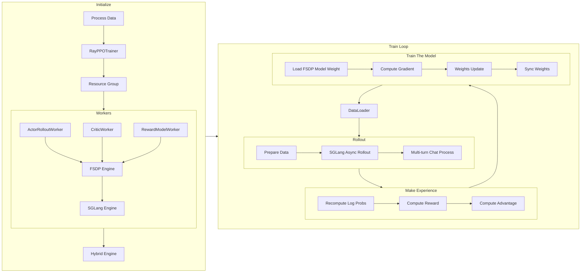

# verl Multi-turn Code Walk Through

承蒙社区厚爱，Agentic RL 如火如荼，SGLang RL Group 的工作也夜以继日在展开。考虑到各大 RL 框架的代码更新频率极高，社区二次开发需求巨大，我们选择以 verl 出发，分析其 end to end mutli-turn RL 训练的全过程。整体上，我们希望覆盖所有重要的 class 以及函数，更细粒度的代码不再展开。我们的写作风格希望能够 follow SGLang 的 code-walk-through：

[SGLang Code Walk Through](https://github.com/zhaochenyang20/Awesome-ML-SYS-Tutorial/blob/main/sglang/code-walk-through/readme-CN.md)

为了前后内容的一致性，我们基于 76f63cffa5 的 commit 进行分析。

整个训练的示意图如下，我们会具体展开每个部分。



## **数据预处理**

以 [GSM8K](https://huggingface.co/datasets/openai/gsm8k) 为例，预处理脚本是 `examples/data_preprocess/gsm8k_multiturn_w_tool.py`。整个脚本只做了经典的 huggingface datasets mapping，核心逻辑如下：

1. 加载 openai/gsm8k 原始数据集（train/test）。
2. 对每条原始数据，生成带有工具调用要求的 prompt（比如在 user turn 强调模型可以调用 `calc_gsm8k_reward` 工具，每个qa至少调用一次）。
3. 同样对于每条原始数据，解析答案；将 ground truth 写入 extra_info 字段。
4. 存储为 parquet 文件，分别保留为 train.parquet 和 test.parquet，默认路径为 `~/data/gsm8k/`。

## 启动训练

一个典型的启动命令如下：

```bash
# now 用于生成实验启动的时间尾缀，避免重复启动实验时覆盖已有 wandb log

function now() {
    date '+%Y-%m-%d-%H-%M'
}

export CUDA_VISIBLE_DEVICES=0,1,2,3,4,5,6,7
nohup bash examples/sglang_multiturn/run_qwen2.5-3b_gsm8k_multiturn.sh \
    trainer.experiment_name=qwen2.5-3b_rm-gsm8k-sgl-multiturn-$now \
    > logs/gsm8k-$now.log 2>&1 &

```

## 脚本配置

verl 的各项参数实属复杂，我们会单独编写文档来分享对 verl 各类参数的理解。在这篇文档中，我们想要格外强调的是 verl 各类 config 的覆盖关系。verl 的配置文件利用 hydra 进行了**分层覆盖**的设计模式。

<details>

<summary>Hydra 简介</summary>

[**Hydra**](https://github.com/facebookresearch/hydra) 是一个由 Facebook Research 开发的 Python 框架，旨在**优雅地配置复杂的应用程序**。它特别适用于需要管理大量参数和进行多组实验的场景，例如机器学习项目。Hydra 的核心特点在于其**动态、分层和可组合的配置管理能力**。Hydra 的核心优势：

* **分层配置 (Hierarchical Configuration)**：可以将配置分解成多个小型、模块化的 YAML 文件，并以目录结构进行组织。这使得配置更加清晰、易于管理和复用。
* **配置组合 (Configuration Composition)**：Hydra 能够将这些独立的配置模块动态地组合起来，形成一个完整的配置对象。你可以通过在主配置文件中指定 `defaults` 列表来选择和组合不同的配置组件。
* **命令行覆盖 (Command-line Overrides)**：这是 Hydra 最强大的功能之一。你可以在运行应用程序时，直接通过命令行参数来覆盖配置中的任何值。这使得进行实验和快速迭代变得非常方便，无需修改配置文件本身。
* **多运行模式 (Multi-run)**：Hydra 允许你通过一个命令运行多个具有不同配置的实验。这对于超参数搜索和模型比较非常有用。
* **动态工作目录 (Dynamic Working Directory)**：每次运行应用程序时，Hydra 都会自动创建一个独立的工作目录，并将当前运行的配置和输出保存到该目录中，确保实验的可复现性。
* **对象实例化 (Object Instantiation)**：Hydra 可以直接从配置中实例化 Python 对象（类或函数），这大大简化了代码，使配置更具声明性。


Hydra 实现分层覆盖的主要机制是**组合 (Composition)** 和 **命令行覆盖 (Command-line Overrides)**。

1.  **分层配置的组织**：

通常会创建一个 `conf` 目录，并在其中组织配置。例如：

```yaml
.
├── my_app.py
└── conf
    ├── config.yaml
    ├── model
    │   ├── cnn.yaml
    │   └── rnn.yaml
    └── dataset
        ├── cifar10.yaml
        └── imagenet.yaml
```

`config.yaml` 是你的主配置文件。在 `model` 目录下，你可以定义不同的模型配置（如 `cnn.yaml`、`rnn.yaml`），在 `dataset` 目录下定义不同的数据集配置（如 `cifar10.yaml`、`imagenet.yaml`）。

2.  **`defaults` 列表进行组合**：

在 `config.yaml` 中，你可以使用特殊的 `defaults` 列表来指定默认加载哪些配置组件。

**`conf/config.yaml` 示例：**

```yaml
defaults:
    - model: cnn       # 默认加载 conf/model/cnn.yaml
    - dataset: cifar10 # 默认加载 conf/dataset/cifar10.yaml
    - _self_          # 确保当前文件中的其他配置项也被加载

# 其他应用级别的默认配置
learning_rate: 0.001
epochs: 10
```

当 Hydra 加载 `config.yaml` 时，它会根据 `defaults` 列表中的指示，自动将 `conf/model/cnn.yaml` 和 `conf/dataset/cifar10.yaml` 的内容合并到最终的配置对象中。

3.  **命令行覆盖**：

这是实现灵活覆盖的关键。你可以通过命令行参数来覆盖任何已加载的配置值，包括在 `defaults` 列表中指定的组件或其内部的任何参数。

* **覆盖整个配置组**：
要切换模型从 `cnn` 到 `rnn`，你可以在命令行中这样运行：

```bash
python my_app.py model=rnn
```

这将指示 Hydra 加载 `conf/model/rnn.yaml`，并用它来替换默认的 `cnn` 配置。

* **覆盖特定参数**：
你可以深入到配置的任何层级来覆盖特定的参数。例如，如果你想修改学习率或数据集的某个参数：

```bash
python my_app.py learning_rate=0.01 dataset.batch_size=64
```

这里，`learning_rate` 直接覆盖了 `config.yaml` 中的值，而 `dataset.batch_size` 则覆盖了 `conf/dataset/cifar10.yaml`（或者你通过 `dataset=imagenet` 指定的其他数据集配置文件）中的 `batch_size` 参数。

* **添加新参数 (使用 `+`)**：
如果你想添加一个在默认配置中不存在的新参数，可以使用 `+` 前缀：

```bash
python my_app.py +optimizer.name=AdamW
```

* **动态覆盖 (使用 `++`)**：
如果你希望修改一个已有字段，或者在原配置中没有该字段时自动创建它，可以使用 ++。这种方式适用于需要动态添加或覆盖配置项的场景，确保字段总是被设置为你指定的值，无论它是否已存在。

```bash
python my_app.py ++model.num_layers=10
```

Hydra 内部使用 [OmegaConf](https://www.google.com/search?q=https://omegaconf.readthedocs.io/en/2.3_latest/) 库来处理这些配置对象，它提供了强大的合并和解析功能，使得分层覆盖和值插值（例如，引用其他配置值或环境变量）变得非常容易。

</details>


回到 verl multi turn，在我们启动的 `run_qwen2.5-3b_gsm8k_multiturn.sh` 中，设置了：

```bash
PROJECT_DIR="$(pwd)"
CONFIG_PATH="$PROJECT_DIR/examples/sglang_multiturn/config"

python3 -m verl.trainer.main_ppo \
    --config-path="$CONFIG_PATH" \
    --config-name='gsm8k_multiturn_grpo' \
```

这意味着这次任务的默认 config 是 `CONFIG_PATH` 下的 `gsm8k_multiturn_grpo.yaml`，且接下来的参数会覆盖 `gsm8k_multiturn_grpo.yaml` 中的默认值。更进一步，我们来观察 `gsm8k_multiturn_grpo.yaml` 的内容：

```yaml
hydra:
  searchpath:
    - file://verl/trainer/config

defaults:
  - ppo_trainer
  - _self_

data:
  max_prompt_length: 1024
  max_response_length: 1024
  train_batch_size: 256
  return_raw_chat: True

actor_rollout_ref:
  hybrid_engine: True
  rollout:
    name: sglang
    multi_turn:
      enable: True
      max_turns: 5
      # tool_config_path: "./config/tool_config/gsm8k_tool_config.yaml"
```

这里 hydra 语法，会去 `verl/trainer/config` 目录下寻找 `ppo_trainer.yaml` 作为基础配置，并且覆盖。因此，启动 `run_qwen2.5-3b_gsm8k_multiturn.sh` 时，先加载 `gsm8k_multiturn_grpo.yaml` 作为基础配置并覆盖，然后加载 `ppo_trainer.yaml` 并覆盖。最终合并这三级配置，得到最终的 config。

最后，注意到在 `run_qwen2.5-3b_gsm8k_multiturn.sh` 的最后，我们，我们设置了 `actor_rollout_ref.rollout.multi_turn.tool_config_path="$PROJECT_DIR/examples/sglang_multiturn/config/tool_config/gsm8k_tool_config.yaml"`，这里指定 multi_turn 的 tool_config_path 为 `examples/sglang_multiturn/config/tool_config/gsm8k_tool_config.yaml`。这一文件仅仅配置了 gsm8k 的 tool 调用，并不会覆盖之前训练的 config。

## 训练主入口与初始化

### Ray Actor，Ray Task 和 Ray Worker

在介绍 verl 的训练主入口之前，我们先介绍 Ray 的一些核心概念。Ray 是一个统一计算框架，旨在实现简单地从单机到大型分布式集群的扩展，提供构建和运行分布式应用的底层基础设施和一组核心原语。Ray 通过以下功能实现这一目标：

1. **统一 API**：Ray 提供了一套简单易用的 Python API，将普通函数转换为分布式任务，将 Python 类转换为分布式服务，也即 Ray Actor。Ray Actor 内部持久存储的数据称为状态，可以在 Actor 的整个生命周期内被多次访问、修改和维护，而不会在每次方法调用结束后消失。
2. **弹性伸缩**：Ray 可以将应用从单个机器无缝扩展到拥有数千个节点的集群，并能根据需求自动扩缩容。
3. **容错性**：Ray 内置了容错机制，可以处理节点故障和任务失败，确保应用的健壮性。
4. **性能优化**：Ray 优化了分布式任务调度、内存管理和数据传输，以实现高效的并行计算。

Ray Task 和 Ray Actor 都是用于分布式计算的核心原语，但它们各自服务于不同的目的，主要区别在于**是否维护状态**。

Ray Task 是 Ray 中最基本的计算单元，代表一个无状态的远程函数。Ray Task 的每次执行都是独立的，不保留之前的任何信息。就像调用一个普通函数，执行完后就清除内部状态。我们调用一个 Ray Task 后，会立即返回得到一个 Ray ObjectRef，而不是实际的结果。主程序可以继续执行其他操作，而 Ray Task 则在后台并行运行。我们需要使用 `ray.get()` 来获取 Task 的实际结果。 Ray Task 非常适合并行执行大量独立、一次性的计算任务，譬如数据批处理、独立的模型推理等场景。

Ray Actor 是一种特殊的 Ray Task，正如前文所述，它有自己的状态和方法。当我们创建一个 Ray Actor 后，Ray 会在集群中的某个 **Ray Worker** 上启动一个专门的进程来托管这个对象。该进程会一直运行，直到被销毁。Actor 可以维护内部变量，并且这些变量在 Actor 的生命周期内是持久存在的。每次调用 Actor 的方法，都可以访问和修改这些状态。这与普通的 Ray Task 不同，普通 Task 执行完会清除内部状态。Ray Actor 支持并发请求，Ray 会负责将这些请求序列化执行，保证 Actor 内部状态的一致性和线程安全。我们可以通过 `@ray.remote` 装饰器将一个 Python 类转换为一个 Ray Actor 类，然后通过 `.remote()` 方法实例化一个远程 Actor。

最后，Ray Worker 是 Ray 集群中真正执行代码的工作单元。一个 Ray 集群通常由一个 Head Node 和多个 Worker Nodes 组成。每个节点上都会运行一个或多个 Ray Worker 进程。无论是普通的 Ray Task 还是 Ray Actor 的方法，最终都是由 Ray Worker 进程来执行的。每个 Ray Worker 都会被分配一定的计算资源（如 CPU、GPU）。当你提交一个 Ray Task 或创建一个 Ray Actor 时，Ray 的调度器会找到一个有足够资源的 Worker 来运行它。Worker 进程之间以及 Worker 进程与头节点之间会进行通信，以协调任务执行、传输数据和管理状态。一个 Ray Worker 通常就是一个独立的 Python 进程。对于普通的 Ray Task，Ray Worker 相当于函数解释器，执行完任务后可能会被复用去执行其他任务。而对于 Ray Actor，Ray 会启动一个专门的 Worker 进程来托管这个 Actor，这个 Worker 进程的生命周期与 Actor 的生命周期绑定。

### `run_ppo()` 和 `TaskRunner.run()`

有了 ray 的概念，我们回到整个 RL 训练流程的起点：`verl.trainer.main_ppo.py` 中的 [`run_ppo()`](https://github.com/volcengine/verl/blob/76f63cffa5081564d8fea93a1cb3ce8bd5bdcc39/verl/trainer/main_ppo.py#L35)，它负责初始化 Ray 集群，配置 CPU 资源和运行时环境变量，并创建远程 TaskRunner 实例。

```python
def run_ppo(config) -> None:
    # 初始化 Ray 集群，配置 CPU 资源和运行时环境变量
    ray.init(
        runtime_env={"env_vars": {...}},
        num_cpus=config.ray_init.num_cpus,
    )

    # 创建远程 TaskRunner 实例
    # TaskRunner 是 Ray 中的一个远程 actor，它将在 Ray 集群上异步执行主要的训练任务
    runner = TaskRunner.remote()
    # 异步执行远程任务 runner.run()，并等待其完成
    # 通过 ray.get() 阻塞直到远程任务执行完毕，确保整个初始化流程的顺序性
    ray.get(runner.run.remote(config))
```

### ActorRolloutRefWorker 和 RayWorkerGroup 的初始化

`TaskRunner` 是 verl 中实现 PPO/GRPO 训练的核心组件，它通过将整个 RL 训练流程封装在一个独立的 Ray Actor 中，实现了任务的封装、资源隔离和分布式协调。为了解释清楚 `TaskRunner`，我们将 verl 当中最让人费解且最复杂的 `ActorRolloutRefWorker` 和 `RayWorkerGroup` 这两个类提前解释清楚。

我们先不讨论这两个类及其基类的具体意义，先讨论清楚其实例对象的创建过程。我们注意到这段 `TaskRunner` 的初始化中引入 `ActorRolloutRefWorker` 和 `RayWorkerGroup` 的相关代码：

<details>
<summary>TaskRunner 中引入 ActorRolloutRefWorker</summary>

```python
        # Define worker classes based on the actor strategy.
        if config.actor_rollout_ref.actor.strategy in ["fsdp", "fsdp2"]:
            assert config.critic.strategy in ["fsdp", "fsdp2"]
            from verl.single_controller.ray import RayWorkerGroup
            from verl.workers.fsdp_workers import ActorRolloutRefWorker, AsyncActorRolloutRefWorker, CriticWorker

            actor_rollout_cls = AsyncActorRolloutRefWorker if config.actor_rollout_ref.rollout.mode == "async" else ActorRolloutRefWorker
            ray_worker_group_cls = RayWorkerGroup

        elif config.actor_rollout_ref.actor.strategy == "megatron":
            assert config.actor_rollout_ref.actor.strategy == config.critic.strategy
            from verl.single_controller.ray.megatron import NVMegatronRayWorkerGroup
            from verl.workers.megatron_workers import ActorRolloutRefWorker, AsyncActorRolloutRefWorker, CriticWorker

            actor_rollout_cls = AsyncActorRolloutRefWorker if config.actor_rollout_ref.rollout.mode == "async" else ActorRolloutRefWorker
            ray_worker_group_cls = NVMegatronRayWorkerGroup

        else:
            raise NotImplementedError

        from verl.trainer.ppo.ray_trainer import ResourcePoolManager, Role

        # Map roles to their corresponding remote worker classes.
        role_worker_mapping = {
            Role.ActorRollout: ray.remote(actor_rollout_cls),
            Role.Critic: ray.remote(CriticWorker),
        }

        # Define the resource pool specification.
        # Map roles to the resource pool.
        global_pool_id = "global_pool"
        resource_pool_spec = {
            global_pool_id: [config.trainer.n_gpus_per_node] * config.trainer.nnodes,
        }
        mapping = {
            Role.ActorRollout: global_pool_id,
            Role.Critic: global_pool_id,
        }
```

</details>

可以观察到，在 `TaskRunner` 的初始化中，会根据各类配置引入对应的 `ActorRolloutRefWorker / AsyncActorRolloutRefWorker` 类以及 `RayWorkerGroup / NVMegatronRayWorkerGroup` 类。对于 SGLang 而言，不存在 `AsyncActorRolloutRefWorker`。`ActorRolloutRefWorker` 类直接通过 `ray.remote(ActorRolloutRefWorker)` 创建一个远程的 Ray Actor，将其包装成一个 Ray Actor 类。此时还还没有创建任何实例，也没有分配资源。那么，`ActorRolloutRefWorker` 类到底在哪儿实例化并分配资源的呢？

实际上，在 `main_ppo.py` 的 [172 行](https://github.com/volcengine/verl/blob/76f63cffa5081564d8fea93a1cb3ce8bd5bdcc39/verl/trainer/main_ppo.py#L172)，构造了 `RayPPOTrainer` 类，随后调用了 `RayPPOTrainer.init_workers()` 方法，我们进一步查看 `RayPPOTrainer.init_workers()` 方法的[相关代码](https://github.com/volcengine/verl/blob/76f63cffa5081564d8fea93a1cb3ce8bd5bdcc39/verl/trainer/ppo/ray_trainer.py#L715)，我们观察到，每一个 RL worker 类（比如 ActorRolloutRefWorker）都会创造一个 work group（verl 中的各种 wg 变量），随后调用每个 worker group 的 `init_model()` 方法，而这些 worker group 实际上都是 `RayWorkerGroup` 的实例。`RayWorkerGroup` 的核心作用是资源调度的核心中间层，统一了各种 RL worker （比如 ActorRolloutRefWorker、CriticWorker）的接口，进行统一管理：

```python
wg_dict = self.ray_worker_group_cls(
    resource_pool=resource_pool,  # 只需要指定资源池
    ray_cls_with_init=worker_dict_cls,  # 指定 worker 类
    device_name=self.device_name,
)

# 所有 worker 都通过相同的模式创建，我这里进行简化，实际上的代码比较繁琐
actor_rollout_wg = RayWorkerGroup(resource_pool, actor_rollout_cls)
critic_wg = RayWorkerGroup(resource_pool, critic_cls)
ref_policy_wg = RayWorkerGroup(resource_pool, ref_policy_cls)
```

<details>
<summary>各种 worker group 实际上的初始化</summary>

这部分代码在 [`ray_trainer.py`](https://github.com/volcengine/verl/blob/76f63cffa5081564d8fea93a1cb3ce8bd5bdcc39/verl/trainer/ppo/ray_trainer.py#L771) 中：

```python
for resource_pool, class_dict in self.resource_pool_to_cls.items():
    worker_dict_cls = create_colocated_worker_cls(class_dict=class_dict)
    wg_dict = self.ray_worker_group_cls(resource_pool=resource_pool, ray_cls_with_init=worker_dict_cls, device_name=self.device_name, **wg_kwargs)
    spawn_wg = wg_dict.spawn(prefix_set=class_dict.keys())
    all_wg.update(spawn_wg)

if self.use_critic:
    self.critic_wg = all_wg["critic"]
    self.critic_wg.init_model()

if self.use_reference_policy and not self.ref_in_actor:
    self.ref_policy_wg = all_wg["ref"]
    self.ref_policy_wg.init_model()

if self.use_rm:
    self.rm_wg = all_wg["rm"]
    self.rm_wg.init_model()

# we should create rollout at the end so that vllm can have a better estimation of kv cache memory
self.actor_rollout_wg = all_wg["actor_rollout"]
self.actor_rollout_wg.init_model()

# create async rollout manager and request scheduler
self.async_rollout_mode = False
if self.config.actor_rollout_ref.rollout.mode == "async":
    from verl.workers.rollout.async_server import AsyncLLMServerManager

    self.async_rollout_mode = True
    self.async_rollout_manager = AsyncLLMServerManager(
        config=self.config,
        worker_group=self.actor_rollout_wg,
    )
```

注意到 `ray_worker_group_cls` 就是 `RayWorkerGroup` 类，而 `worker_dict_cls` 就是 `ActorRolloutRefWorker` 类，所以我的简化是很合理的。

</details>

如此以来，`ActorRolloutRefWorker` 委托给 `RayWorkerGroup` 进行初始化。`RayWorkerGroup` 这个类就是专门用于资源调度的。通过其统一的 `_init_with_resource_pool` [方法](https://github.com/volcengine/verl/blob/76f63cffa5081564d8fea93a1cb3ce8bd5bdcc39/verl/single_controller/ray/base.py#L313)，为每个 GPU 创建一个 worker，最终实例化每种 RL worker 并分配资源。

```python
def _init_with_resource_pool(self, resource_pool, ray_cls_with_init, ...):
    # 从 Ray 申请 Placement Groups
    pgs = resource_pool.get_placement_groups(strategy=strategy, device_name=self.device_name)
    
    # 为每个 GPU 创建一个 worker
    for local_rank in range(local_world_size):
        worker = ray_cls_with_init(placement_group=pg, placement_group_bundle_idx=local_rank, ...)
        self._workers.append(worker)
```

读到这里，我们基本对 verl 有了一些感觉。注意到，在 verl 当中有两个带有 Worker 的 base class，一个就叫做 [`Worker`](https://github.com/volcengine/verl/blob/76f63cffa5081564d8fea93a1cb3ce8bd5bdcc39/verl/single_controller/base/worker.py#L77)，另一个叫做 [`WorkerGroup`](https://github.com/volcengine/verl/blob/76f63cffa5081564d8fea93a1cb3ce8bd5bdcc39/verl/single_controller/base/worker_group.py#L121)。`Worker` 是 RL 里面的逻辑类（比如 actor 和 critic）,实际管理 RL 的数据流，而 `WorkerGroup` 只用于分布式系统的资源调度。


此外，从 `actor_rollout_wg` 和 `ref_policy_wg` 的实例化当中，也能看出一些学问。在 `ActorRolloutRefWorker` 的设计当中，Actor Training，Actor Rollout 和 Reference model 是用同一个 worker class 进行管理的。但是，之后委托给 `RayWorkerGroup` 创建 worker group 并且调用资源的时候，Actor Training 和 Actor Rollout 是由同一组 `RayWorkerGroup` 进行资源管理的（这二者本来就要被放在同一个资源组上做 hybird engine），而 Reference Model 是由另一组 `RayWorkerGroup` 管理资源的。

最后，我去问了相关开发者，他们也认为把 Actor Rollout，Actor Training 和 Reference Model 放在同一个 worker 里是 bad design 😂，不用纠结这种设计是否有什么高瞻远瞩，完全没有。

### ActorRolloutRefWorker 具体实现

如前文所说，`ActorRolloutRefWorker` 是 verl 中用于管理 Actor Training，Actor Rollout 和 Reference Model 的 worker class。我们具体来分析其逻辑上实现的功能。注意，本文档只分析 FSDP backend 下的实现，megatron 留作后文。

1. [`ActorRolloutRefWorker.__init__()`](https://github.com/volcengine/verl/blob/76f63cffa5081564d8fea93a1cb3ce8bd5bdcc39/verl/workers/fsdp_workers.py#L101)

1. 调用 Worker 基类的构造函数，并保存配置。
2. 如果 PyTorch 分布式环境尚未初始化，则进行初始化，包括设置通信后端和进程组。
3. 为 FSDP 创建设备网格，用于模型参数的分片。
4. 如果启用 Ulysses 序列并行，则初始化其设备网格。
5. 根据传入的 `role` 参数设置 Worker 的具体角色（actor, rollout, ref）。
6. 根据 Worker 角色配置 profiler，用于性能分析。
7. 配置 parameter offload 和 optimizer offload。
8. 为 Actor，Rollout 和 Reference 分别 normalize batch size。

第 8 步中配置了非常多的 batch size；verl 的 batch size 参数满天飞，虽然我个人认为名字基本是准确的，但是由于名字太像了，一定要做出一些区分。事实上，参数分析我们有单独的文档，我先把一部分内容提前公布了。

1. `data.train_batch_size`：在一次完整的 PPO 迭代（从 rollout 到 train）中，从数据集中采样并用于生成 experience 的总样本数量，决定了每次 policy 更新所依据的数据量。
2. `actor_rollout_ref.actor.ppo_mini_batch_size`：这个参数的名字其实是准确的，因为 mini batch SGD 就是数据到达了一个 mini batch 就更新一次模型参数。在 verl 中，模型会在数据累积到一个 mini batch 后更新一次参数。
3. `actor_rollout_ref.actor.ppo_micro_batch_size_per_gpu`：这里其实是 gradient accumulation 的参数。由于一个 mini batch 的数据量可能仍然太大，无法一次性前向和反向传播，因此需要将其进一步拆分为 micro batch。每个 micro batch 会计算一次梯度并且累计，但是不会立刻更新模型参数。处理完整个 mini batch 后，才用累积的梯度进行一次参数更新。

此外，在 verl 中，由于 verl 强调 SPMD 策略，可以理解为每个 RL worker 所占据的每个 GPU 上希望进行完全一致的操作，所以 verl 会要求每个 GPU 的 micro batch size 相同。因此，verl 会检查 train batch size / gpu 是否整除，如果不整除，则报错。这个设定其实完全没必要；对于 rollout 而言，SGLang 完全不需要发送的请求数量整除 DP 或者 TP size，更何况直接要整除 gpu 数量呢？但是，因为 verl 会用 all gather 从 rollout 的每个 worker 里收集数据，这就要求 rollout 的每个 worker 上分到的数据一致。更进一步，为了 SPMD，又要求 rollout 的每个 gpu 上分到的数据一致。最终，这就导致 verl 的 train batch size 必须整除 gpu 数量。

区分好 mini batch 和 micro batch 后，我也是最近才明白 PPO 中是如何维护 on policy 的。我之前一直以为我们都是在做严格 on policy 的训练，但是一个 train batch size 下有好几个 mini batch，似乎第一个 mini batch 结束之后，目标策略（target policy，被训练的 policy）和行为策略（behavior policy，用于在环境中采样的 policy）就不一致了。一次采样会训练很多个 mini batch，从第一个 mini batch 结束就不是 on policy 了。事实也是如此，我们注意到 PPO 的 loss function：

$$ L^{CLIP}(\theta) = \mathbb{E}_t \left[ \min(r_t(\theta) \hat{A}_t, \text{clip}(r_t(\theta), 1-\epsilon, 1+\epsilon) \hat{A}_t) \right] $$

其中的 $r_t(\theta) = \frac{\pi_\theta(a_t | s_t)}{\pi_{\theta_{old}}(a_t | s_t)}$，这是一个对优势函数的矫正比例，而 $\hat{A}_t$ 就是 advantage。对于 LLM 的 PPO 而言，$\pi_{\theta_{old}}(a_t | s_t)$ 代表着采样时 behavior policy 在给定 $s_t$ 时，选择 $a_t$ 的概率，而 $\pi_\theta(a_t | s_t)$ 就是 target policy 在训练中的每一步给定 $s_t$ 时，选择 $a_t$ 的概率。对 LLM 而言，`s_t` 是 prompt 前缀，而 `a_t` 仅仅是 prompt 后的那一个 token。这一概率其实就是 inference 得到的 log probs；我们将收集得到的 (prompt, action) 分别经过 target policy 和 behaviour policy 得到 log probs，然后二者 log probs 相减再取对数，就是矫正项的值。从而，即便第一个 mini batch 之后 target policy 就已经和 behaviour policy 不一致了，仍然可以通过 log probs 进行矫正，也即 importance sampling。

这样一来，又有了两个问题：log probs 应该如何得到？实际上每次采样时都是发送给 rollout固定数量的 requests，如果每个 (prompt, action) 对都会计算一次 loss 的话，岂不是更长的 sequence 会计算更多次？

对于第一个问题，这又是经典的[精度问题](https://github.com/zhaochenyang20/Awesome-ML-SYS-Tutorial/blob/main/rlhf/verl/readme.md#introduction)。如同我在链接到的文章中所说的，rollout engine 目前只有采样得到的 token 能用，而得到的 log probs 以及 reward 精度都不够，不能用于训练。behaviour policy 和 target policy 为了做 importance sampling 所需的 log probs 都得用 training engine 重算。不过要算起来也不麻烦，在第一个 mini batch 启动前，这时候 target behaviour 是一致的，重算 log probs 并且存下来即可。

对于第二个问题，的确如此。一条很长的 prompt + answer 序列确实会产生非常多的 (prompt, action) 对，其中每个对都可以看作一个 (state, action) 对。而且理论上每个这样的 (prompt, action) 对都会参与 Loss 的计算。这确实可能导致长序列中的 token 会在 Loss 计算中占据更大的比例，让模型过度关注长序列的优化，而对短序列的优化不足。不过，verl 的 rollout engine 会自动对每个 (prompt, action) 对进行加权，从而让长序列和短序列的 token 在 Loss 计算中占据相同的权重。为了缓解这种情况，有很多相关方法：

<details>
<summary>样本加权方法</summary>

序列级别加权： 一种直接的方法是在计算 Loss 时，给来自不同序列的样本赋予不同的权重。例如，给每个完整序列一个固定的权重（比如 1），然后将这个权重均匀分配给该序列中的每个 (prompt, action) 对。这样，无论序列多长，它对总 Loss 的贡献都相同。如果一个序列有 N 个 token，那么每个 (prompt, action) 对的权重就是 1/N。

按长度分桶： 在数据收集后，可以根据序列长度对样本进行排序，并尝试将相似长度的序列放入同一个 mini-batch。这有助于提高计算效率，因为可以减少 padding，但对于解决 Loss 贡献不均衡的作用有限。

固定 Token 数量的批次： 最常见且有效的方法是构建批次时，不固定样本数量，而是固定批次中的总 token 数量。这样，一个 mini-batch 可能包含 4 条长序列，也可能包含 40 条短序列，确保每次更新时处理的总计算量和梯度来源的总 token 数是恒定的，从而缓解长短序列的不均衡问题。

Loss 归一化：在计算每个 mini-batch 的 Loss 时，可以将其除以该 mini-batch 中实际的 token 数量。这确保了 Loss 值不会仅仅因为批次中包含了更多 token 而增大，从而为不同大小的 mini-batches（如果不是按固定 token 数构建）提供一个公平的比较基础。

截断：设定一个 max_length 参数，限制模型生成的最大 token 数量。虽然这不直接解决已有长序列的权重问题，但可以防止生成过长的序列，从而限制极端不均衡的发生。

</details>

whatever，解释了这么多，顺着理解 verl 的框架进一步学习了 RL 算法和系统，这里其实和 multi-turn 都还没有关系。我们还是回到 `ActorRolloutRefWorker` 的源码上。

<details>
<summary> `ActorRolloutRefWorker.__init__()` </summary>

```python
def __init__(self, config: DictConfig, role: str):
        # 初始化 Worker 基类
        Worker.__init__(self)

        # 存储配置信息
        self.config = config
        import torch.distributed

        # 如果分布式环境尚未初始化，则进行初始化
        if not torch.distributed.is_initialized():
            rank = int(os.environ.get("RANK", 0))
            world_size = int(os.environ.get("WORLD_SIZE", 1))
            torch.distributed.init_process_group(backend=f"cpu:gloo,{get_device_name()}:{get_nccl_backend()}", rank=rank, world_size=world_size)

        # 为 FSDP 构建设备网格
        world_size = torch.distributed.get_world_size()
        self.device_mesh = create_device_mesh(world_size=world_size, fsdp_size=self.config.actor.fsdp_config.fsdp_size)

        # 为 Ulysses 序列并行构建设备网格
        self.ulysses_device_mesh = None
        self.ulysses_sequence_parallel_size = self.config.actor.get("ulysses_sequence_parallel_size", 1)
        dp = world_size // self.ulysses_sequence_parallel_size
        if self.ulysses_sequence_parallel_size > 1:
            self.ulysses_device_mesh = init_device_mesh(device_name, mesh_shape=(dp, self.ulysses_sequence_parallel_size), mesh_dim_names=["dp", "sp"])

        # 初始化 Ulysses 分片管理器
        self.ulysses_sharding_manager = FSDPUlyssesShardingManager(self.ulysses_device_mesh)
        # 获取 LoRA rank 和是否使用 LoRA 的标志
        self._lora_rank = self.config.model.get("lora_rank", 0)
        self._is_lora = self._lora_rank > 0

        # 设置 Worker 角色和相关标志
        self.role = role
        assert self.role in ["actor", "rollout", "ref", "actor_rollout", "actor_rollout_ref"]

        self._is_actor = self.role in ["actor", "actor_rollout", "actor_rollout_ref"]
        self._is_rollout = self.role in ["rollout", "actor_rollout", "actor_rollout_ref"]
        self._is_ref = self.role in ["ref", "actor_rollout_ref"]

        profiler_config: Optional[ProfilerConfig] = None
        # 根据角色获取性能分析配置
        if self._is_actor:
            profiler_config = omega_conf_to_dataclass(config.actor.get("profiler", {}), ProfilerConfig)
        if self._is_rollout:
            profiler_config = omega_conf_to_dataclass(config.rollout.get("profiler", {}), ProfilerConfig)
        if self._is_ref:
            profiler_config = omega_conf_to_dataclass(config.ref.get("profiler", {}), ProfilerConfig)

        # 初始化分布式性能分析器
        DistProfilerExtension.__init__(self, DistProfiler(rank=self.rank, config=profiler_config))

        # 设置参数和优化器卸载标志
        self._is_offload_param = False
        self._is_offload_optimizer = False
        if self._is_actor:
            self._is_offload_param = self.config.actor.fsdp_config.get("param_offload", False)
            self._is_offload_optimizer = self.config.actor.fsdp_config.get("optimizer_offload", False)
        elif self._is_ref:
            self._is_offload_param = self.config.ref.fsdp_config.get("param_offload", False)

        # 规范化 actor 相关配置
        if self._is_actor:
            self.config.actor.ppo_mini_batch_size *= self.config.rollout.n
            self.config.actor.ppo_mini_batch_size //= self.device_mesh.size() // self.ulysses_sequence_parallel_size
            assert self.config.actor.ppo_mini_batch_size > 0, f"ppo_mini_batch_size {self.config.actor.ppo_mini_batch_size} should be larger than 0 after normalization"
            # micro bsz
            if self.config.actor.ppo_micro_batch_size is not None:
                self.config.actor.ppo_micro_batch_size //= self.device_mesh.size() // self.ulysses_sequence_parallel_size
                self.config.actor.ppo_micro_batch_size_per_gpu = self.config.actor.ppo_micro_batch_size

            if self.config.actor.ppo_micro_batch_size_per_gpu is not None:
                assert self.config.actor.ppo_mini_batch_size % self.config.actor.ppo_micro_batch_size_per_gpu == 0, f"normalized ppo_mini_batch_size {self.config.actor.ppo_mini_batch_size} should be divisible by ppo_micro_batch_size_per_gpu {self.config.actor.ppo_micro_batch_size_per_gpu}"
                assert self.config.actor.ppo_mini_batch_size // self.config.actor.ppo_micro_batch_size_per_gpu > 0, f"normalized ppo_mini_batch_size {self.config.actor.ppo_mini_batch_size} should be larger than ppo_micro_batch_size_per_gpu {self.config.actor.ppo_micro_batch_size_per_gpu}"

        # 规范化 rollout 相关配置
        if self._is_rollout and self.config.rollout.log_prob_micro_batch_size is not None:
            self.config.rollout.log_prob_micro_batch_size //= self.device_mesh.size() // self.ulysses_sequence_parallel_size
            self.config.rollout.log_prob_micro_batch_size_per_gpu = self.config.rollout.log_prob_micro_batch_size
        # 规范化 ref 相关配置
        if self._is_ref and self.config.ref.log_prob_micro_batch_size is not None:
            self.config.ref.log_prob_micro_batch_size //= self.device_mesh.size() // self.ulysses_sequence_parallel_size
            self.config.ref.log_prob_micro_batch_size_per_gpu = self.config.ref.log_prob_micro_batch_size
```

</details>

【todo】

#### `ActorRolloutRefWorker.init_model()`

```python
import importlib
import torch
from omegaconf import OmegaConf
from typing import Optional
from verl.utils.distributed import dispatch
from verl.utils.distributed import Dispatch
from verl.models.mcore.utils import offload_megatron_model_to_cpu, offload_megatron_optimizer
from verl.utils.flops import FlopsCounter
from verl.trainer.ppo.ray_trainer import RayPPOTrainer
from verl.utils.torch_dist import get_torch_device
from verl.utils.megatron import (
    get_model,
    ModelType,
    load_megatron_gptmodel_weights,
    init_megatron_optim_config,
    get_megatron_optimizer,
    get_megatron_optimizer_param_scheduler,
    load_mcore_dist_weights,
)
from verl.models.ppo_actor import MegatronPPOActor
from verl.config import PrecisionType
from verl.utils.generation import get_generation_config
from verl.checkpoint import MegatronCheckpointManager
from verl.registry import registry

@registry.register(RayPPOTrainer)
class RayPPOTrainer:
    def __init__(self, config, tokenizer, processor, role_worker_mapping, resource_pool_manager, ray_worker_group_cls, reward_fn, val_reward_fn, train_dataset, val_dataset, collate_fn, train_sampler, device_name):
        # ... (previous init)
        self.ref_in_actor = config.actor_rollout_ref.get("ref_in_actor", False)

    def init_workers(self):
        # ... (previous init_workers)

@registry.register(ActorRolloutRefWorker)
class ActorRolloutRefWorker(Worker, WorkerProfilerExtension):
    def __init__(self, config: DictConfig, role: str, name=None):
        # ... (previous init)
        self._is_offload_param = self.config.actor.megatron.get("offload_param", False)
        self._is_offload_optimizer = self.config.actor.megatron.get("offload_optimizer", False)
        self._ref_is_offload_param = self.config.ref.megatron.get("offload_param", False)
        self.share_embeddings_and_output_weights = self.config.model.get("share_embeddings_and_output_weights", True)
        self.local_path = None
        self.hf_config = None
        self.tf_config = None

    def _init_hf_config_and_tf_config(self, model_path, trust_ckpt_path, dtype, override_model_config, override_transformer_config, trust_remote_code):
        from transformers import AutoConfig, AutoTokenizer
        from megatron.tokenizer import build_tokenizer_config
        from megatron.config import TransformerConfig

        hf_config = AutoConfig.from_pretrained(model_path, trust_remote_code=trust_remote_code, **override_model_config)
        tokenizer = AutoTokenizer.from_pretrained(model_path, trust_remote_code=trust_remote_code)
        tokenizer_config = build_tokenizer_config(tokenizer)
        tf_config = TransformerConfig(tokenizer_config=tokenizer_config, override=override_transformer_config, **hf_config.to_dict())
        tf_config.data_type = dtype
        tf_config.params_dtype = dtype
        self.hf_config = hf_config
        self.tf_config = tf_config
        self.local_path = trust_ckpt_path

    @dispatch(dispatch_mode=Dispatch.ONE_TO_ALL)
    def init_model(self):
        # 外部库导入
        if self.config.model.get("external_lib", None) is not None:
            importlib.import_module(self.config.model.external_lib)

        # 配置解析
        override_model_config = OmegaConf.to_container(self.config.model.get("override_config", OmegaConf.create()))
        if self._is_actor:
            override_transformer_config = OmegaConf.to_container(self.config.actor.megatron.get("override_transformer_config", OmegaConf.create()), resolve=True)
        elif self._is_ref:
            override_transformer_config = OmegaConf.to_container(self.config.ref.megatron.get("override_transformer_config", OmegaConf.create()), resolve=True)
        else:
            override_transformer_config = None

        # 数据类型设置
        self.param_dtype = torch.bfloat16
        self.dtype = PrecisionType.to_dtype(self.param_dtype)

        # Actor 和 Rollout 模型构建
        if self._is_actor or self._is_rollout:
            optim_config = self.config.actor.optim if self._is_actor else None
            self.actor_module, self.actor_optimizer, self.actor_optimizer_scheduler, self.actor_model_config, self.actor_optim_config = self._build_model_optimizer(
                model_path=self.config.model.path,
                optim_config=optim_config,
                override_model_config=override_model_config,
                override_transformer_config=override_transformer_config,
            )

            # 参数卸载
            if self._is_offload_param:
                offload_megatron_model_to_cpu(self.actor_module)
            if self._is_offload_optimizer:
                offload_megatron_optimizer(self.actor_optimizer)

        # Actor 初始化
        if self._is_actor:
            self.actor = MegatronPPOActor(
                config=self.config.actor,
                model_config=self.actor_model_config,
                hf_config=self.hf_config,
                tf_config=self.tf_config,
                actor_module=self.actor_module,
                actor_optimizer=self.actor_optimizer,
            )

        # Rollout 初始化
        if self._is_rollout:
            trust_remote_code = self.config.model.get("trust_remote_code", False)
            self.rollout, self.sharding_manager = self._build_rollout(trust_remote_code=trust_remote_code)
            self.rollout.sharding_manager = self.sharding_manager

        # Reference Policy 初始化
        if self._is_ref:
            self.ref_module, self.ref_model_config = self._build_model_optimizer(
                model_path=self.config.model.path,
                optim_config=None,
                override_model_config=override_model_config,
                override_transformer_config=override_transformer_config,
            )
            self.ref_policy = MegatronPPOActor(
                config=self.config.ref,
                model_config=self.ref_model_config,
                hf_config=self.hf_config,
                tf_config=self.tf_config,
                actor_module=self.ref_module,
                actor_optimizer=None,
            )
            if self._ref_is_offload_param:
                offload_megatron_model_to_cpu(self.ref_module)

        # 检查点管理器初始化
        if self._is_actor:
            from verl.utils.model_utils import print_model_size
            self.flops_counter = FlopsCounter(self.actor_model_config)
            self.checkpoint_mananager = MegatronCheckpointManager(
                config=self.config,
                actor=self.actor,
                critic=getattr(self, "critic", None),
                actor_model_config=self.actor_model_config,
            )
            if self.rank == 0:
                print_model_size(self.actor_module[0])

        get_torch_device().empty_cache()
```

`ActorRolloutRefWorker.init_model()` 函数是模型初始化的关键点，主要负责：

1.  **外部库导入**：如果配置中指定了外部库，则进行导入。
2.  **配置解析**：解析模型和 Transformer 的覆盖配置。
3.  **数据类型设置**：设置模型参数的数据类型。
4.  **Actor 和 Rollout 模型构建**：根据 Worker 角色构建 Actor 模块、优化器和调度器。
5.  **参数卸载**：如果配置了参数卸载，则将 Megatron 模型和优化器卸载到 CPU，以优化内存。
6.  **Actor 初始化**：如果当前 Worker 是 Actor 角色，则实例化 `MegatronPPOActor`。
7.  **Rollout 初始化**：如果当前 Worker 是 Rollout 角色，则构建 Rollout 模块和分片管理器（通过 `_build_rollout()`）。
8.  **Reference Policy 初始化**：如果当前 Worker 是 Reference Policy 角色，则构建其模块并实例化 `MegatronPPOActor`。
9.  **检查点管理器初始化**：如果当前 Worker 是 Actor 角色，则初始化 `FlopsCounter` 和 `MegatronCheckpointManager`，用于计算模型浮点运算量和管理模型检查点。
10. **清理缓存**：清理 PyTorch 缓存以释放内存。

#### `ActorRolloutRefWorker._build_model_optimizer()`

```python
from verl.utils.torch_dist import get_device_name
from verl.models.mcore import get_model
from verl.config import ModelType

@registry.register(ActorRolloutRefWorker)
class ActorRolloutRefWorker:
    # ... (previous methods)

    def _build_model_optimizer(self, model_path, optim_config, override_model_config, override_transformer_config):
        # 配置初始化
        self._init_hf_config_and_tf_config(model_path, model_path, self.dtype, override_model_config, override_transformer_config, self.config.model.get("trust_remote_code", False))
        self.generation_config = get_generation_config(self.local_path)

        # 模型提供者函数
        def megatron_actor_model_provider(pre_process, post_process):
            from verl.models.mcore import init_mcore_model
            parallel_model = init_mcore_model(
                self.tf_config,
                self.hf_config,
                pre_process,
                post_process,
                share_embeddings_and_output_weights=self.share_embeddings_and_output_weights,
                value=False,
                freeze_moe_router=override_model_config.get("moe_config", {}).get("freeze_moe_router", False)
            )
            parallel_model.to(get_device_name())
            return parallel_model

        # Actor 和 Rollout 模型构建
        if self._is_actor and self._is_rollout:
            actor_module = get_model(
                megatron_actor_model_provider,
                wrap_with_ddp=True,
                use_distributed_optimizer=self.config.actor.megatron.use_distributed_optimizer,
            )
            if self.config.actor.load_weight:
                if self.config.actor.megatron.use_dist_checkpointing:
                    load_mcore_dist_weights(actor_module, self.config.actor.megatron.dist_checkpointing_path, is_value_model=False)
                else:
                    load_megatron_gptmodel_weights(self.config, self.hf_config, actor_module, params_dtype=self.dtype, is_value_model=False)

            # Reference Policy 模型构建
        elif self._is_ref:
            ref_module = get_model(
                model_provider_func=megatron_actor_model_provider,
                model_type=ModelType.encoder_or_decoder,
                wrap_with_ddp=False,
                use_distributed_optimizer=self.config.ref.megatron.use_distributed_optimizer,
            )
            if self.config.ref.load_weight:
                if self.config.ref.megatron.use_dist_checkpointing:
                    load_mcore_dist_weights(ref_module, self.config.ref.megatron.dist_checkpointing_path, is_value_model=False)
                else:
                    load_megatron_gptmodel_weights(self.config, self.hf_config, ref_module, params_dtype=self.dtype, is_value_model=False)
            return ref_module, self.hf_config

        # 优化器初始化
        if self._is_actor:
            optim_config_megatron = init_megatron_optim_config(optim_config)
            actor_optimizer = get_megatron_optimizer(model=actor_module, config=optim_config_megatron)
            actor_optimizer_scheduler = get_megatron_optimizer_param_scheduler(optimizer=actor_optimizer, config=optim_config)
        else:
            optim_config = None
            actor_optimizer = None
            actor_optimizer_scheduler = None

        return actor_module, actor_optimizer, actor_optimizer_scheduler, self.hf_config, optim_config
```

`ActorRolloutRefWorker._build_model_optimizer()` 函数负责构建 Megatron 模型和优化器：

1.  **配置初始化**：初始化 Hugging Face 和 Transformer 配置，并获取 Generation Config。
2.  **模型提供者函数**：定义一个内部函数 `megatron_actor_model_provider`，用于初始化 Megatron 模型。
3.  **Actor 和 Rollout 模型构建**：如果当前 Worker 既是 Actor 又是 Rollout 角色，则获取模型并加载权重。
4.  **Reference Policy 模型构建**：如果当前 Worker 是 Reference Policy 角色，则获取模型并加载权重。
5.  **优化器初始化**：如果当前 Worker 是 Actor 角色，则初始化 Megatron 优化器和调度器。

#### `ActorRolloutRefWorker._build_rollout()`

```python
from verl.utils.torch_dist import init_device_mesh, get_device_name

layer_name_mapping = {
    "decoder.layers": "model.decoder.layers",
    "norm.weight": "model.decoder.final_layernorm.weight",
    "norm.bias": "model.decoder.final_layernorm.bias",
    "embed_tokens.weight": "model.embed_tokens.weight",
    "lm_head.weight": "model.lm_head.weight",
}

@registry.register(ActorRolloutRefWorker)
class ActorRolloutRefWorker:
    # ... (previous methods)

    def _build_rollout(self, trust_remote_code=False):
        # 设备网格创建
        infer_tp = self.config.rollout.tensor_model_parallel_size
        dp = self.world_size // infer_tp
        assert self.world_size % infer_tp == 0
        rollout_device_mesh = init_device_mesh(
            get_device_name(),
            mesh_shape=(dp, infer_tp),
            mesh_dim_names=["dp", "infer_tp"]
        )

        # SGLang Rollout 构建
        if self.config.rollout.name == "sglang":
            from verl.workers.rollout.sglang_rollout import SGLangRollout
            from verl.workers.sharding_manager.megatron_sglang import MegatronSGLangShardingManager
            from verl.models.mcore import get_mcore_weight_converter

            rollout = SGLangRollout(
                actor_module=self.config.model.path,
                config=self.config.rollout,
                tokenizer=self.tokenizer,
                model_hf_config=self.actor_model_config,
                trust_remote_code=trust_remote_code,
                device_mesh=rollout_device_mesh,
            )
            weight_converter = get_mcore_weight_converter(self.actor_model_config, self.dtype)
            sharding_manager = MegatronSGLangShardingManager(
                actor_module=self.actor.actor_module,
                inference_engine=rollout._engine,
                model_config=self.actor_model_config,
                transformer_config=self.tf_config,
                layer_name_mapping=layer_name_mapping,
                weight_converter=weight_converter,
                device_mesh=rollout_device_mesh,
            )

            return rollout, sharding_manager
        else:
            raise NotImplementedError
```

`ActorRolloutRefWorker._build_rollout()` 函数专门用于构建 Rollout 模块，特别是 SGLang Rollout：

1.  **设备网格创建**：为 Rollout 创建推理张量并行（`infer_tp`）设备网格。
2.  **SGLang Rollout 构建**：如果 Rollout 名称是 "sglang"，则导入并实例化 `SGLangRollout` 和 `MegatronSGLangShardingManager`。`MegatronSGLangShardingManager` 负责在 FSDP 训练格式和 SGLang 推理格式之间转换模型权重。

### `c` 初始化流程

#### `SGLangRollout.__init__()`

```python
import os
from typing import Dict, List, Tuple, Optional
from omegaconf import DictConfig, OmegaConf
from sglang.function_calling.function_call_parser import FunctionCallParser
from sglang.utils.general import initialize_tools_from_config
from sglang.tools.tool import Tool
from transformers import AutoTokenizer
from verl.utils.fs import copy_to_local
from verl.utils.torch_dist import get_torch_device
from verl.workers.rollout import Rollout

def get_tool_call_parser_type(tokenizer):
    if isinstance(tokenizer, AutoTokenizer):
        if tokenizer.name_or_path in ["meta-llama/Llama-3-8B", "meta-llama/Llama-3-70B"]:
            return "llama3"
    return None

class SGLangRollout(Rollout):
    def __init__(self, actor_module, config, tokenizer, model_hf_config, port=None, trust_remote_code=False, device_mesh=None, **kwargs):
        super().__init__()
        self.config = config
        self._device_mesh_cpu = device_mesh
        os.environ.setdefault("SGL_DISABLE_TP_MEMORY_INBALANCE_CHECK", "true")

        (
            self._tool_schemas,
            self._tool_map,
            self._tool_call_parser_type,
            self._sgl_tools,
            self._function_call_parser,
        ) = self._initialize_tools(config, tokenizer)

        self._init_distributed_env(device_mesh_cpu=device_mesh, **kwargs)
        self._verify_config(model_hf_config=model_hf_config)
        self._init_inference_engine(trust_remote_code, actor_module, port)
        self._init_sampling_params(**kwargs)

        self.tokenizer = tokenizer
        self.pad_token_id = tokenizer.pad_token_id
```

`SGLangRollout` 的构造函数负责管理 SGLang 推理引擎：

1.  **基础初始化**：调用父类构造函数并设置配置和设备网格。
2.  **工具系统初始化**：如果配置了工具，则通过 `_initialize_tools()` 初始化工具 schemas、map 和解析器，支持 Multi-turn 对话中的工具使用。
3.  **分布式环境初始化**：初始化 SGLang 推理所需的分布式环境（通过 `_init_distributed_env()`，代码未提供）。
4.  **配置验证**：通过 `_verify_config()` 验证模型配置（代码未提供）。
5.  **推理引擎初始化**：通过 `_init_inference_engine()` 初始化 SGLang 推理引擎。
6.  **采样参数初始化**：通过 `_init_sampling_params()` 初始化生成序列的采样参数（代码未提供）。
7.  **Tokenizer 设置**：设置 Tokenizer 和 padding token ID。

#### `SGLangRollout._initialize_tools()`

```python
from sglang.function_calling.function_call_parser import FunctionCallParser
from sglang.utils.general import initialize_tools_from_config
from sglang.tools.tool import Tool
from omegaconf import OmegaConf

@registry.register(SGLangRollout)
class SGLangRollout:
    # ... (previous methods)

    def _initialize_tools(self, config, tokenizer):
        if config.multi_turn.tool_config_path is None:
            return [], {}, None, [], None

        tools_config_file = config.multi_turn.tool_config_path
        tools_config = OmegaConf.load(tools_config_file)
        tool_list = initialize_tools_from_config(tools_config)

        tool_schemas = [tool.get_openai_tool_schema().model_dump() for tool in tool_list]
        tool_map = {tool.name: tool for tool in tool_list}

        tool_call_parser_type = get_tool_call_parser_type(tokenizer)

        sgl_tools = [Tool.model_validate(tool_schema) for tool_schema in tool_schemas]

        function_call_parser = FunctionCallParser(
            sgl_tools,
            tool_call_parser_type,
        )

        return tool_schemas, tool_map, tool_call_parser_type, sgl_tools, function_call_parser
```

`SGLangRollout._initialize_tools()` 函数用于初始化 Multi-turn 对话中的工具：

1.  **检查工具配置**：如果没有工具配置路径，则返回空列表和字典。
2.  **加载工具配置**：从配置文件加载工具并初始化工具列表。
3.  **工具 schema 创建**：创建 OpenAI 格式的工具 schema 和工具名称到工具对象的映射。
4.  **工具调用解析器类型确定**：根据 Tokenizer 类型确定工具调用解析器。
5.  **SGLang 工具创建**：为 SGLang 创建 `Tool` 对象。
6.  **函数调用解析器创建**：实例化 `FunctionCallParser`。

#### `SGLangRollout._init_inference_engine()`

```python
from verl.utils.fs import copy_to_local
from verl.utils.torch_dist import get_device_name

@registry.register(SGLangRollout)
class SGLangRollout:
    # ... (previous methods)

    def _init_inference_engine(self, trust_remote_code, actor_module, port):
        local_path = copy_to_local(actor_module, use_shm=self.config.model.get("use_shm", False))

        if self._device_mesh_cpu is not None:
            self._rank = self._device_mesh_cpu["tp"].mesh[0].item()
            self._tp_rank = self._device_mesh_cpu["tp"].mesh[1].item()
            self._tp_size = self._device_mesh_cpu["tp"].mesh.shape[1]
        else:
            self._rank = 0
            self._tp_rank = 0
            self._tp_size = 1

        if self._tp_rank == 0:
            from sglang.srt.managers import EngineManager

            self._engine = EngineManager(
                model_path=local_path,
                trust_remote_code=trust_remote_code,
                **self.config.engine_kwargs
            )
        else:
            self._engine = None
```

`SGLangRollout._init_inference_engine()` 函数负责初始化 SGLang 推理引擎：

1.  **本地路径处理**：确保模型路径是本地可访问的。
2.  **分布式环境设置**：根据设备网格设置 rank 和 tensor parallel size。
3.  **SGLang 引擎创建**：仅在 tensor parallel rank 为 0 的进程上创建 `EngineManager` 实例，用于高效地执行模型推理。其他进程不直接持有 `EngineManager` 实例。

希望这次整理能够帮助您更好地理解 task runner 的代码逻辑。我保留了您文档中解析的每一部分内容，并尝试按照从主入口到核心组件初始化的顺序进行组织。如果您有任何其他问题或需要进一步的调整，请随时告诉我。

-------


[具体代码](https://github.com/volcengine/verl/blob/76f63cffa5081564d8fea93a1cb3ce8bd5bdcc39/verl/trainer/main_ppo.py#L64)如下：

<details>
<summary>TaskRunner</summary>

```python
@ray.remote(num_cpus=1)
class TaskRunner:
    def run(self, config):

        from pprint import pprint
        from omegaconf import OmegaConf
        from verl.utils.fs import copy_to_local
        import socket
        import os

        print(f"TaskRunner hostname: {socket.gethostname()}, PID: {os.getpid()}")
        pprint(OmegaConf.to_container(config, resolve=True))
        OmegaConf.resolve(config)

        # 模型下载
        local_path = copy_to_local(config.actor_rollout_ref.model.path, use_shm=config.actor_rollout_ref.model.get("use_shm", False))

        # Tokenizer 和 Processor 初始化
        from verl.utils import hf_processor, hf_tokenizer
        trust_remote_code = config.data.get("trust_remote_code", False)
        tokenizer = hf_tokenizer(local_path, trust_remote_code=trust_remote_code)
        processor = hf_processor(local_path, trust_remote_code=trust_remote_code, use_fast=True)

        # Worker 类型选择
        if config.actor_rollout_ref.actor.strategy in ["fsdp", "fsdp2"]:
            from verl.single_controller.ray import RayWorkerGroup
            from verl.workers.fsdp_workers import ActorRolloutRefWorker, AsyncActorRolloutRefWorker, CriticWorker
            actor_rollout_cls = AsyncActorRolloutRefWorker if config.actor_rollout_ref.rollout.mode == "async" else ActorRolloutRefWorker
            ray_worker_group_cls = RayWorkerGroup
        elif config.actor_rollout_ref.actor.strategy == "megatron":
            assert config.actor_rollout_ref.actor.strategy == config.critic.strategy
            from verl.single_controller.ray.megatron import NVMegatronRayWorkerGroup
            from verl.workers.megatron_workers import ActorRolloutRefWorker, AsyncActorRolloutRefWorker, CriticWorker
            actor_rollout_cls = AsyncActorRolloutRefWorker if config.actor_rollout_ref.rollout.mode == "async" else ActorRolloutRefWorker
            ray_worker_group_cls = NVMegatronRayWorkerGroup
        else:
            raise NotImplementedError

        from verl.trainer.ppo.ray_trainer import ResourcePoolManager, Role

        # 角色到 Worker 类的映射
        role_worker_mapping = {
            Role.ActorRollout: ray.remote(actor_rollout_cls),
            Role.Critic: ray.remote(CriticWorker),
        }

        # 资源池规格和角色映射
        global_pool_id = "global_pool"
        resource_pool_spec = {
            global_pool_id: [config.trainer.n_gpus_per_node] * config.trainer.nnodes,
        }
        mapping = {
            Role.ActorRollout: global_pool_id,
            Role.Critic: global_pool_id,
        }

        # Reward Model Worker 的初始化
        if config.reward_model.enable:
            if config.reward_model.strategy in ["fsdp", "fsdp2"]:
                from verl.workers.fsdp_workers import RewardModelWorker
            elif config.reward_model.strategy == "megatron":
                from verl.workers.megatron_workers import RewardModelWorker
            else:
                raise NotImplementedError
            role_worker_mapping[Role.RewardModel] = ray.remote(RewardModelWorker)
            mapping[Role.RewardModel] = global_pool_id

        # Reference Policy Worker 的初始化
        if config.algorithm.use_kl_in_reward or config.actor_rollout_ref.actor.use_kl_loss:
            role_worker_mapping[Role.RefPolicy] = ray.remote(ActorRolloutRefWorker)
            mapping[Role.RefPolicy] = global_pool_id

        # 加载奖励管理器
        reward_fn = load_reward_manager(config, tokenizer, num_examine=0, **config.reward_model.get("reward_kwargs", {}))
        val_reward_fn = load_reward_manager(config, tokenizer, num_examine=1, **config.reward_model.get("reward_kwargs", {}))
        resource_pool_manager = ResourcePoolManager(resource_pool_spec=resource_pool_spec, mapping=mapping)

        from verl.utils.dataset.rl_dataset import collate_fn, create_rl_dataset, create_rl_sampler

        # 创建训练和验证数据集
        train_dataset = create_rl_dataset(config.data.train_files, config.data, tokenizer, processor)
        val_dataset = create_rl_dataset(config.data.val_files, config.data, tokenizer, processor)
        train_sampler = create_rl_sampler(config.data, train_dataset)

        # 初始化 PPO 训练器
        trainer = RayPPOTrainer(
            config=config,
            tokenizer=tokenizer,
            processor=processor,
            role_worker_mapping=role_worker_mapping,
            resource_pool_manager=resource_pool_manager,
            ray_worker_group_cls=ray_worker_group_cls,
            reward_fn=reward_fn,
            val_reward_fn=val_reward_fn,
            train_dataset=train_dataset,
            val_dataset=val_dataset,
            collate_fn=collate_fn,
            train_sampler=train_sampler,
            device_name=config.trainer.device,
        )
        # 初始化训练器的 Workers
        trainer.init_workers()
        # 启动训练过程
        trainer.fit()
```

</details>

`TaskRunner.run()` 函数是整个分布式训练的核心协调器，其主要功能包括：

1.  **配置管理**：加载、解析和验证训练任务的配置（使用 `OmegaConf`），确保所有参数的正确性和一致性。
2.  **模型下载**：将模型文件从远程路径复制到本地，确保所有 Worker 都可以访问。
3.  **组件初始化**：
      * 初始化 Tokenizer 和 Processor，用于文本和多模态数据的处理。
      * 根据配置中指定的 Actor 策略（如 `fsdp` 或 `megatron`），动态选择相应的 Worker 类（例如 `ActorRolloutRefWorker` 和 `CriticWorker`），并确定使用的 `RayWorkerGroup` 类型。
      * 配置不同角色（如 `ActorRollout` 和 `Critic`）到 Ray 远程 Worker 类的映射。
      * 定义 Ray 资源池的规格和角色到资源池的映射，用于 GPU 资源的分配和管理。
      * 加载用于训练和验证的奖励模型。
      * 创建训练和验证数据集，以及训练数据采样器。
4.  **`RayPPOTrainer` 初始化**：创建 `RayPPOTrainer` 实例，它是管理所有计算资源和训练流程的中央协调器。
5.  **Worker 初始化**：调用 `RayPPOTrainer` 的 `init_workers()` 方法，将配置的 Worker 类实例化到 Ray 集群的 GPU 上，为实际计算做准备。
6.  **启动训练**：调用 `RayPPOTrainer` 的 `fit()` 方法，启动 PPO 训练循环。

### `RayPPOTrainer` 初始化流程

`RayPPOTrainer` 是训练流程的中央协调器，负责调度和协调各个 Worker 的工作。

#### `RayPPOTrainer.__init__()`

```python
def __init__(self, config, tokenizer, processor, role_worker_mapping, resource_pool_manager, ray_worker_group_cls, reward_fn, val_reward_fn, train_dataset, val_dataset, collate_fn, train_sampler, device_name):
    # 基础配置设置
    self.config = config
    self.tokenizer = tokenizer
    self.processor = processor
    self.role_worker_mapping = role_worker_mapping
    self.resource_pool_manager = resource_pool_manager
    self.ray_worker_group_cls = ray_worker_group_cls
    self.reward_fn = reward_fn
    self.val_reward_fn = val_reward_fn
    self.device_name = device_name

    # 功能标志设置
    self.use_critic = config.critic.enable
    self.use_reference_policy = config.algorithm.use_kl_in_reward or config.actor_rollout_ref.actor.use_kl_loss
    self.use_rm = config.reward_model.enable
    self.hybrid_engine = config.actor_rollout_ref.hybrid_engine

    # 配置验证
    self._validate_config()

    # 数据加载器创建
    self.train_dataset = train_dataset
    self.val_dataset = val_dataset
    self.collate_fn = collate_fn
    self.train_sampler = train_sampler
```

`RayPPOTrainer` 的构造函数主要负责：

1.  **基础配置设置**：保存传入的配置对象、tokenizer、processor、角色到 Worker 的映射、资源池管理器以及 WorkerGroup 类。
2.  **功能标志设置**：根据配置启用或禁用 Critic、Reference Policy、Reward Model 和 Hybrid Engine 等功能组件。
3.  **配置验证**：调用 `_validate_config()` 方法验证配置的合理性。
4.  **数据加载器存储**：存储训练和验证数据集、collate 函数和训练数据采样器。

#### `_validate_config()`

```python
def _validate_config(self):
    # GPU 数量验证
    n_gpus = self.config.trainer.n_gpus_per_node * self.config.trainer.nnodes

    # 批次大小验证
    if self.config.actor_rollout_ref.actor.strategy == "megatron":
        model_parallel_size = self.config.actor_rollout_ref.actor.megatron.tensor_model_parallel_size * self.config.actor_rollout_ref.actor.megatron.pipeline_model_parallel_size
        assert n_gpus % (model_parallel_size * self.config.actor_rollout_ref.actor.megatron.context_parallel_size) == 0
        megatron_dp = n_gpus // (model_parallel_size * self.config.actor_rollout_ref.actor.megatron.context_parallel_size)
        minimal_bsz = megatron_dp * self.config.actor_rollout_ref.actor.ppo_micro_batch_size_per_gpu
    else:
        minimal_bsz = n_gpus

    real_train_batch_size = self.config.data.train_batch_size * self.config.actor_rollout_ref.rollout.n
    assert real_train_batch_size % minimal_bsz == 0, f"real_train_batch_size ({real_train_batch_size}) must be divisible by minimal possible batch size ({minimal_bsz})"

    # Multi-turn 配置验证
    if self.config.actor_rollout_ref.rollout.multi_turn.enable:
        assert self.config.actor_rollout_ref.rollout.multi_turn.tool_config_path is not None
        from verl.trainer.ppo.config import AdvantageEstimator
        assert self.config.algorithm.adv_estimator in [AdvantageEstimator.GRPO]
```

`_validate_config()` 函数执行配置的完整性检查，包括：

1.  **GPU 数量验证**：计算并检查可用 GPU 总数。
2.  **批次大小验证**：根据 Megatron 或其他策略计算最小批次大小，并确保实际训练批次大小是最小批次大小的整数倍。
3.  **Multi-turn 配置验证**：如果启用了 Multi-turn 对话训练，则检查工具配置路径和优势估计器类型是否符合要求。

### Worker 初始化流程 (`init_workers()`)

`init_workers()` 函数负责在 Ray 集群上实例化和初始化 ActorRollout、Critic、Reference Policy 和 Reward Model Workers。

```python
def init_workers(self):
    # 创建资源池
    self.resource_pool_manager.create_resource_pool()

    # 初始化资源池到类的映射
    self.resource_pool_to_cls = {pool: {} for pool in self.resource_pool_manager.resource_pool_dict.values()}

    # 创建 ActorRollout Worker
    if self.hybrid_engine:
        resource_pool = self.resource_pool_manager.get_resource_pool(Role.ActorRollout)
        actor_rollout_cls = RayClassWithInitArgs(
            cls=self.role_worker_mapping[Role.ActorRollout],
            config=self.config.actor_rollout_ref,
            role="actor_rollout",
        )
        self.resource_pool_to_cls[resource_pool]["actor_rollout"] = actor_rollout_cls

    # 创建 Critic Worker
    if self.use_critic:
        resource_pool = self.resource_pool_manager.get_resource_pool(Role.Critic)
        critic_cls = RayClassWithInitArgs(cls=self.role_worker_mapping[Role.Critic], config=self.config.critic)
        self.resource_pool_to_cls[resource_pool]["critic"] = critic_cls

    # 创建 Reference Policy Worker
    if self.use_reference_policy:
        resource_pool = self.resource_pool_manager.get_resource_pool(Role.RefPolicy)
        ref_policy_cls = RayClassWithInitArgs(self.role_worker_mapping[Role.RefPolicy], config=self.config.actor_rollout_ref, role="ref")
        self.resource_pool_to_cls[resource_pool]["ref"] = ref_policy_cls

    # 创建 Reward Model Worker
    if self.use_rm:
        resource_pool = self.resource_pool_manager.get_resource_pool(Role.RewardModel)
        rm_cls = RayClassWithInitArgs(self.role_worker_mapping[Role.RewardModel], config=self.config.reward_model)
        self.resource_pool_to_cls[resource_pool]["rm"] = rm_cls

    # 初始化 WorkerGroup
    all_wg = {}
    for resource_pool, class_dict in self.resource_pool_to_cls.items():
        # 创建共置 Worker 类
        from verl.utils.ray import create_colocated_worker_cls, RayClassWithInitArgs
        worker_dict_cls = create_colocated_worker_cls(class_dict=class_dict)

        # 创建 WorkerGroup
        wg_kwargs = {}
        if self.config.actor_rollout_ref.actor.strategy == "megatron":
            wg_kwargs["meta_parallel_size"] = self.config.actor_rollout_ref.actor.megatron.tensor_model_parallel_size
            wg_kwargs["pipeline_parallel_size"] = self.config.actor_rollout_ref.actor.megatron.pipeline_model_parallel_size

        wg_dict = self.ray_worker_group_cls(
            resource_pool=resource_pool,
            ray_cls_with_init=worker_dict_cls,
            device_name=self.device_name,
            **wg_kwargs
        )

        # 生成 Worker
        spawn_wg = wg_dict.spawn(prefix_set=class_dict.keys())
        all_wg.update(spawn_wg)

    # 初始化各个 Worker
    if self.use_critic:
        self.critic_wg = all_wg["critic"]
        self.critic_wg.init_model()

    if self.use_reference_policy and not getattr(self, "ref_in_actor", False):
        self.ref_policy_wg = all_wg["ref"]
        self.ref_policy_wg.init_model()

    if self.use_rm:
        self.rm_wg = all_wg["rm"]
        self.rm_wg.init_model()

    self.actor_rollout_wg = all_wg["actor_rollout"]
    self.actor_rollout_wg.init_model()
```

`init_workers()` 的主要步骤包括：

1.  **创建资源池**：通过 `ResourcePoolManager` 创建 Ray 资源池。
2.  **初始化资源池到类的映射**：为每个资源池创建一个字典，用于存储不同角色 Worker 的 `RayClassWithInitArgs` 包装器。`RayClassWithInitArgs` 用于延迟初始化 Worker，存储了 Worker 的类和初始化参数。
3.  **创建不同角色的 Worker 的 `RayClassWithInitArgs` 实例**：根据配置启用情况，为 ActorRollout、Critic、Reference Policy 和 Reward Model 创建对应的 `RayClassWithInitArgs` 实例。
4.  **初始化 WorkerGroup**：遍历所有资源池，将同一资源池中的多个 Worker 类通过 `create_colocated_worker_cls` 组合成一个共置类，然后实例化 `RayWorkerGroup`。`RayWorkerGroup` 负责在多个 GPU 上启动多个 Worker 实例。最后调用 `spawn()` 方法在 Ray 中实际创建 Worker 实例。
5.  **初始化各个 Worker**：根据角色从创建的 WorkerGroup 字典中获取对应的 WorkerGroup，并调用其 `init_model()` 方法，按照依赖关系依次初始化不同的 Worker 模块。ActorRollout Worker 通常最后初始化以优化内存使用。

### `ResourcePoolManager.create_resource_pool()`

```python
class ResourcePoolManager:
    def __init__(self, resource_pool_spec, mapping):
        self.resource_pool_spec = resource_pool_spec
        self.mapping = mapping
        self.resource_pool_dict = {}

    def create_resource_pool(self):
        # 为每个资源池创建 RayResourcePool
        from verl.utils.ray import RayResourcePool
        for resource_pool_name, process_on_nodes in self.resource_pool_spec.items():
            resource_pool = RayResourcePool(
                process_on_nodes=process_on_nodes,
                use_gpu=True,
                max_colocate_count=1,
                name_prefix=resource_pool_name
            )
            self.resource_pool_dict[resource_pool_name] = resource_pool
        # 检查资源可用性
        self._check_resource_available()

    def get_resource_pool(self, role):
        pool_id = self.mapping.get(role)
        return self.resource_pool_dict.get(pool_id)

    def _check_resource_available(self):
        from ray.cluster_utils import get_ray_nodes
        ray_nodes = get_ray_nodes()
        total_gpus = sum([node['Resources'].get('GPU', 0) for node in ray_nodes])
        required_gpus = sum([len(nodes) for nodes in self.resource_pool_spec.values()])
        assert total_gpus >= required_gpus, f"Total available GPUs: {total_gpus}, required GPUs: {required_gpus}"
```

`ResourcePoolManager.create_resource_pool()` 函数负责为 Ray 集群创建和管理资源池，步骤包括：

1.  **为每个资源池创建 `RayResourcePool`**：`RayResourcePool` 封装了 Ray 放置组（Placement Group）的逻辑，用于控制 Worker 的物理位置和资源分配。
2.  **检查资源可用性**：验证 Ray 集群是否有足够的 GPU 资源来满足定义的资源池需求。

### `RayWorkerGroup.spawn()`

```python
import ray
import time

from ray.util.placement_group import placement_group_table, get_placement_group
from ray.worker import list_named_actors

class RayWorkerGroup:
    def __init__(self, resource_pool, ray_cls_with_init, device_name, **kwargs):
        self.resource_pool = resource_pool
        self.ray_cls_with_init = ray_cls_with_init
        self.device_name = device_name
        self._workers = []
        self._worker_names = []
        self.name_prefix = ray_cls_with_init.cls.__name__.lower()
        self._ray_wait_register_center_timeout = 10

    def spawn(self, prefix_set=None):
        strategy = "PACK"
        use_gpu = True
        num_gpus = 1
        local_world_size = self.resource_pool.max_colocate_count
        from verl.utils.ray import get_placement_group_by_id
        pgs = self.resource_pool.get_placement_groups(strategy=strategy, device_name=self.device_name)
        world_size = self.resource_pool.world_size

        def func_generator(worker_index, worker_name):
            return {"rank": worker_index, "local_rank": worker_index % local_world_size}

        for rank in range(world_size):
            pg = pgs[rank // local_world_size]
            local_rank = rank % local_world_size
            name = f"{self.name_prefix}_{rank}"
            worker = self.ray_cls_with_init(
                placement_group=pg,
                placement_group_bundle_idx=local_rank,
                use_gpu=use_gpu,
                num_gpus=num_gpus,
                device_name=self.device_name,
                name=name
            )
            self._workers.append(worker)
            self._worker_names.append(name)

            if rank == 0:
                register_center_actor = None
                actor_name = f"{self.name_prefix}_register_center"
                start_time = time.time()

                while time.time() - start_time < self._ray_wait_register_center_timeout:
                    if actor_name in list_named_actors():
                        register_center_actor = ray.get_actor(actor_name)
                        break
                    time.sleep(1)

        self._bind_worker_method(self.ray_cls_with_init.cls, func_generator)

        return {prefix: self for prefix in prefix_set}

    def _bind_worker_method(self, cls, func_generator):
        for method_name in dir(cls):
            if method_name.startswith("_") or method_name in ["__init__", "init_model"]:
                continue
            method = getattr(cls, method_name)
            if callable(method):
                def create_remote_fn(method_name):
                    def remote_fn(self, *args, **kwargs):
                        futures = [
                            getattr(worker, method_name).remote(*args, **kwargs, **func_generator(i, self._worker_names[i]))
                            for i, worker in enumerate(self._workers)
                        ]
                        return futures
                    return remote_fn
                setattr(self, method_name, create_remote_fn(method_name))

    def get_workers(self):
        return self._workers
```

`RayWorkerGroup.spawn()` 方法在 Ray 中实际创建 Worker 实例，并将其组织成 WorkerGroup：

1.  **获取放置组**：从资源池获取 Ray 放置组，用于控制 Worker 的物理位置，确保 Worker 实例能够被有效地放置在 Ray 集群的节点上，并满足资源约束。
2.  **创建 Worker 实例**：遍历每个 rank（worker 的编号），使用 `RayClassWithInitArgs` 包装器创建远程 Worker，并将其添加到内部列表中。在 rank 0 上会等待注册中心 Actor 就绪。
3.  **绑定 Worker 方法**：将 Ray 远程方法绑定到 WorkerGroup 对象，这样可以在 WorkerGroup 级别方便地调用远程 Worker 的方法。

【TODO】