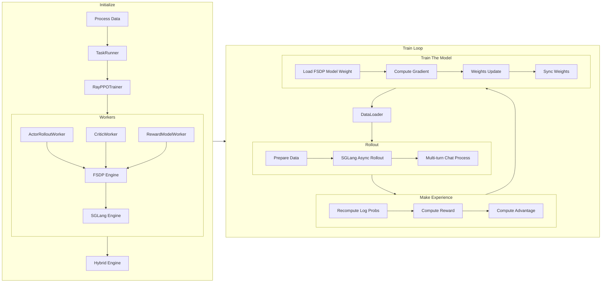

# verl Multi-turn Code Walk Through (Init)

We are grateful for the community's support, and the field of Agentic RL is flourishing. Our team at SGLang RL is also working intensively. Considering the rapid and formidable advancements in the field, along with the significant demand from the community for secondary development, we have chosen verl as our starting point to analyze its end-to-end multi-turn RL training process. Our aim is to cover all important classes and functions at a high level, without delving into more granular code details. We intend for our writing style to follow that of the SGLang code walk-through:

[SGLang Code Walk Through](https://github.com/zhaochenyang20/Awesome-ML-SYS-Tutorial/blob/main/sglang/code-walk-through/readme.md)

For the sake of consistency throughout the document, our analysis is based on commit [76f63cffa5](https://github.com/volcengine/verl/commit/76f63cffa5081564d8fea93a1cb3ce8bd5bdcc39).

We extend our gratitude to friends from Amazon, LinkedIn, Alibaba, and the SGLang RL team for their contributions. Although this article primarily focuses on analyzing the verl codebase, we realized upon completion that the system design issues discussed are highly generalizable. Core problems such as "log probs recomputation" and "Rollout Engine memory management" are essential considerations for all major RL frameworks. We hope this article can provide transferable insights for the open-source community in understanding RL framework system design. 😂

If you are interested in our work, please feel free to contact us to participate in some of our projects.

Special Thanks: zhuoran yin @ CMU, changyi yang @ CMU, zhuohao li @ Alibaba, ji li @ currently seeking employment (🤣), biao he @ Linkedin, and xinpeng wei & chenyang zhao @ Amazon.



## Data Preprocessing

Taking [GSM8K](https://huggingface.co/datasets/openai/gsm8k) as an example, the preprocessing script is `examples/data_preprocess/gsm8k_multiturn_w_tool.py`. The entire script performs standard Hugging Face Datasets mapping, with the core logic outlined below:

1.  Load the original openai/gsm8k dataset (train/test splits).
2.  For each original data entry, generate a prompt with tool invocation requirements (for example, emphasize in the user turn that the model can call the `calc_gsm8k_reward` tool, with each question-answer pair invoking it at least once).
3.  Also for each original data entry, parse the answer and write the ground truth to the `extra_info` field.
4.  Store the processed data as parquet files, retaining them as `train.parquet` and `test.parquet`, with the default storage path being `~/data/gsm8k/`.

Here is the English translation of that section:

## Starting Training

A typical startup command is as follows:

```bash
# now is used to generate a time suffix for the experiment launch, avoiding overwriting existing wandb logs when starting experiments repeatedly

function now() {
    date '+%Y-%m-%d-%H-%M'
}

export CUDA_VISIBLE_DEVICES=0,1,2,3,4,5,6,7
nohup bash examples/sglang_multiturn/run_qwen2.5-3b_gsm8k_multiturn.sh \
    trainer.experiment_name=qwen2.5-3b_rm-gsm8k-sgl-multiturn-$now \
    > logs/gsm8k-$now.log 2>&1 &
```

## Script Configuration

The various parameters of verl are indeed complex, and we will write separate documentation to share our understanding of them. In this document, we want to particularly emphasize the overriding relationship between different configuration files in verl. Verl's configuration files utilize the **layered overriding** design pattern provided by hydra.

<details>

<summary>Introduction to Hydra</summary>

[**Hydra**](https://github.com/facebookresearch/hydra) is a Python framework developed by Facebook Research, designed to **elegantly configure complex applications**. It is particularly suitable for scenarios requiring the management of numerous parameters and the execution of multiple sets of experiments, such as machine learning projects. Hydra's core features lie in its **dynamic, hierarchical, and composable configuration management capabilities**. Hydra's key advantages include:

  * **Hierarchical Configuration**: Configurations can be broken down into multiple small, modular YAML files and organized in a directory structure. This makes the configuration clearer, easier to manage, and reusable.
  * **Configuration Composition**: Hydra can dynamically combine these independent configuration modules to form a complete configuration object. You can specify a `defaults` list in the main configuration file to select and combine different configuration components.
  * **Command-line Overrides**: This is one of Hydra's most powerful features. You can directly override any value in the configuration using command-line arguments when running the application. This makes experimentation and rapid iteration very convenient, without needing to modify the configuration files themselves.
  * **Multi-run**: Hydra allows you to run multiple experiments with different configurations using a single command. This is very useful for hyperparameter search and model comparison.
  * **Dynamic Working Directory**: Each time the application runs, Hydra automatically creates an independent working directory and saves the current run's configuration and output to that directory, ensuring the reproducibility of experiments.
  * **Object Instantiation**: Hydra can directly instantiate Python objects (classes or functions) from the configuration, which greatly simplifies the code and makes the configuration more declarative.

The main mechanisms by which Hydra achieves layered overriding are **Composition** and **Command-line Overrides**.

1.  **Organization of Hierarchical Configuration**:

A `conf` directory is typically created to organize the configuration. For example:

```yaml
.
├── my_app.py
└── conf
    ├── config.yaml
    ├── model
    │   ├── cnn.yaml
    │   └── rnn.yaml
    └── dataset
        ├── cifar10.yaml
        └── imagenet.yaml
```

`config.yaml` is your main configuration file. In the `model` directory, you can define different model configurations (such as `cnn.yaml`, `rnn.yaml`), and in the `dataset` directory, you can define different dataset configurations (such as `cifar10.yaml`, `imagenet.yaml`).

2.  **Composition using the `defaults` List**:

In `config.yaml`, you can use a special `defaults` list to specify which configuration components to load by default.

**Example of `conf/config.yaml`**:

```yaml
defaults:
    - model: cnn       # Load conf/model/cnn.yaml by default
    - dataset: cifar10 # Load conf/dataset/cifar10.yaml by default
    - _self_          # Ensure other configuration items in the current file are also loaded

# Other application-level default configurations
learning_rate: 0.001
epochs: 10
```

When Hydra loads `config.yaml`, it automatically merges the contents of `conf/model/cnn.yaml` and `conf/dataset/cifar10.yaml` into the final configuration object based on the instructions in the `defaults` list.

3.  **Command-line Overrides**:

This is key to achieving flexible overriding. You can override any loaded configuration value, including components specified in the `defaults` list or any parameters within them, using command-line arguments.

* **Overriding Entire Configuration Groups**:
To switch the model from `cnn` to `rnn`, you can run the following command:

```bash
python my_app.py model=rnn
```

This will instruct Hydra to load `conf/model/rnn.yaml` and use it to replace the default `cnn` configuration.

* **Overriding Specific Parameters**:
You can delve into any level of the configuration to override specific parameters. For example, if you want to modify the learning rate or a parameter of the dataset:

```bash
python my_app.py learning_rate=0.01 dataset.batch_size=64
```

Here, `learning_rate` directly overrides the value in `config.yaml`, while `dataset.batch_size` overrides the `batch_size` parameter in `conf/dataset/cifar10.yaml` (or another dataset configuration file you specified via `dataset=imagenet`).

* **Adding New Parameters (using `+`)**:
If you want to add a new parameter that does not exist in the default configuration, you can use the `+` prefix:

```bash
python my_app.py +optimizer.name=AdamW
```

* **Dynamic Overrides (using `++`)**:
If you want to modify an existing field or automatically create it if it doesn't exist in the original configuration, you can use `++`. This approach is suitable for scenarios where you need to dynamically add or override configuration items, ensuring the field is always set to the value you specify, regardless of whether it already exists.

```bash
python my_app.py ++model.num_layers=10
```

Hydra internally uses the [OmegaConf](https://www.google.com/search?q=https://omegaconf.readthedocs.io/en/2.3_latest/) library to handle these configuration objects, which provides powerful merging and parsing capabilities, making layered overriding and value interpolation (e.g., referencing other configuration values or environment variables) very easy.

</details>

Returning to verl multi-turn, in the `run_qwen2.5-3b_gsm8k_multiturn.sh` script we launched, we set:

```bash
PROJECT_DIR="$(pwd)"
CONFIG_PATH="$PROJECT_DIR/examples/sglang_multiturn/config"

python3 -m verl.trainer.main_ppo \
    --config-path="$CONFIG_PATH" \
    --config-name='gsm8k_multiturn_grpo' \
```

This means that the default configuration for this task is `gsm8k_multiturn_grpo.yaml` located under `CONFIG_PATH`, and the subsequent parameters will override the default values in `gsm8k_multiturn_grpo.yaml`. Furthermore, let's examine the contents of `gsm8k_multiturn_grpo.yaml`:

```yaml
hydra:
  searchpath:
    - file://verl/trainer/config

defaults:
  - ppo_trainer
  - _self_

data:
  max_prompt_length: 1024
  max_response_length: 1024
  train_batch_size: 256
  return_raw_chat: True

actor_rollout_ref:
  hybrid_engine: True
  rollout:
    name: sglang
    multi_turn:
      enable: True
      max_turns: 5
      # tool_config_path: "./config/tool_config/gsm8k_tool_config.yaml"
```

Here, according to the hydra syntax, the system will look for `ppo_trainer.yaml` under the `verl/trainer/config` directory as the base configuration and override it. Therefore, when launching `run_qwen2.5-3b_gsm8k_multiturn.sh`, `gsm8k_multiturn_grpo.yaml` is first loaded as the base configuration and overridden, then `ppo_trainer.yaml` is loaded and further overrides the configuration. Finally, these three levels of configuration are merged to obtain the final configuration.

Finally, note that at the end of `run_qwen2.5-3b_gsm8k_multiturn.sh`, we set `actor_rollout_ref.rollout.multi_turn.tool_config_path="$PROJECT_DIR/examples/sglang_multiturn/config/tool_config/gsm8k_tool_config.yaml"`. This specifies the `tool_config_path` for multi-turn as `examples/sglang_multiturn/config/tool_config/gsm8k_tool_config.yaml`. This file only configures the tool calls for gsm8k and will not override the previously loaded training configurations.

## Training Main Entry Point and Initialization

### Ray Actor, Ray Task, and Ray Worker

Before introducing the main entry point for verl's training process, we will first explain some core concepts of Ray. Ray is a unified computing framework designed to enable simple scaling from a single machine to large distributed clusters. It provides the underlying infrastructure and a set of core primitives for building and running distributed applications. Ray achieves this goal through the following features:

1.  **Unified API**: Ray provides a simple and easy-to-use Python API that transforms ordinary functions into distributed tasks and Python classes into distributed services, also known as Ray Actors. Data persistently stored within a Ray Actor is called its state and can be accessed, modified, and maintained multiple times throughout the Actor's lifecycle, without disappearing after each method call.
2.  **Elastic Scaling**: Ray can seamlessly scale applications from a single machine to a cluster with thousands of nodes and can automatically scale up or down based on demand.
3.  **Fault Tolerance**: Ray has built-in fault tolerance mechanisms that can handle node failures and task failures, ensuring the robustness of applications.
4.  **Performance Optimization**: Ray optimizes distributed task scheduling, memory management, and data transfer to achieve efficient parallel computing.

Ray Task and Ray Actor are both core primitives used for distributed computation, but they each serve different purposes. The main difference lies in **whether they maintain state**.

A Ray Task is the most basic unit of computation in Ray, representing a stateless remote function. Each execution of a Ray Task is independent and does not retain any information from previous executions. It is like calling an ordinary function, where internal state is cleared after execution. When we invoke a Ray Task, we immediately receive a Ray ObjectRef, not the actual result. The main program can continue to execute other operations while the Ray Task runs in parallel in the background. We need to use `ray.get()` to retrieve the actual result of a Task. Ray Tasks are well-suited for parallel execution of a large number of independent, one-off computational tasks, such as data batch processing or independent model inference scenarios.

A Ray Actor is a special type of Ray Task that, as mentioned earlier, is a long-running remote object with its own state and methods. When we create a Ray Actor, Ray starts a dedicated process on a **Ray Worker** within the cluster to host this object. This process continues to run until it is destroyed. Actors can maintain internal variables that persist throughout their lifecycle. Each time an Actor's method is called, it can access and modify these states. This differs from ordinary Ray Tasks, which clear their internal state after execution. Ray Actors support concurrent requests, and Ray is responsible for serializing these requests to ensure the consistency and thread safety of the Actor's internal state. We can convert a Python class into a Ray Actor class using the `@ray.remote` decorator and then instantiate a remote Actor using the `.remote()` method.

Finally, a Ray Worker is the worker unit in a Ray cluster that actually executes the code. A Ray cluster typically consists of a Head Node and multiple Worker Nodes. Each node runs one or more Ray Worker processes. Both ordinary Ray Tasks and the methods of Ray Actors are ultimately executed by Ray Worker processes. Each Ray Worker is allocated a certain amount of computing resources (such as CPU and GPU). When you submit a Ray Task or create a Ray Actor, Ray's scheduler finds a Worker with sufficient resources to run it. Worker processes communicate with each other and with the head node to coordinate task execution, transfer data, and manage state. A Ray Worker is usually an independent Python process. For ordinary Ray Tasks, the Ray Worker acts as a function interpreter, and after completing a task, it may be reused to execute other tasks. For Ray Actors, Ray starts a dedicated Worker process to host the Actor, and the lifecycle of this Worker process is bound to the lifecycle of the Actor.

### `run_ppo()` and `TaskRunner.run()`

With an understanding of Ray's concepts, let's return to the starting point of the entire RL training process: [`run_ppo()`](https://github.com/volcengine/verl/blob/76f63cffa5081564d8fea93a1cb3ce8bd5bdcc39/verl/trainer/main_ppo.py#L35) in `verl.trainer.main_ppo.py`. This function is responsible for initializing the Ray cluster, configuring CPU resources and runtime environment variables, and creating a remote TaskRunner instance.

```python
def run_ppo(config) -> None:
    # Initialize the Ray cluster, configuring CPU resources and runtime environment variables
    ray.init(
        runtime_env={"env_vars": {...}},
        num_cpus=config.ray_init.num_cpus,
    )

    # Create a remote TaskRunner instance
    # TaskRunner is a remote actor in Ray that will asynchronously execute the main training tasks on the Ray cluster
    runner = TaskRunner.remote()
    # Asynchronously execute the remote task runner.run() and wait for it to complete
    # ray.get() blocks until the remote task is finished, ensuring the sequential order of the entire initialization process
    ray.get(runner.run.remote(config))
```

### Interrelation of ActorRolloutRefWorker and RayWorkerGroup

[TaskRunner](https://github.com/volcengine/verl/blob/76f63cffa5081564d8fea93a1cb3ce8bd5bdcc39/verl/trainer/main_ppo.py#L64) is the core component in verl for implementing PPO/GRPO training. By encapsulating the entire RL training process within an independent Ray Actor, it achieves task encapsulation, resource isolation, and distributed coordination. To clearly explain `TaskRunner`, we will first clarify the two most perplexing and complex classes in verl, `ActorRolloutRefWorker` and `RayWorkerGroup`, before discussing their specific significance and base classes.

Let's first focus on the creation process of their instance objects without delving into the specific meaning of these two classes and their base classes. We notice the following code related to the introduction of `ActorRolloutRefWorker` and `RayWorkerGroup` in the initialization of `TaskRunner`:

<details>
<summary>TaskRunner introduces ActorRolloutRefWorker</summary>

```python
# Define worker classes based on the actor strategy.
if config.actor_rollout_ref.actor.strategy in ["fsdp", "fsdp2"]:
    assert config.critic.strategy in ["fsdp", "fsdp2"]
    from verl.single_controller.ray import RayWorkerGroup
    from verl.workers.fsdp_workers import ActorRolloutRefWorker, AsyncActorRolloutRefWorker, CriticWorker

    actor_rollout_cls = AsyncActorRolloutRefWorker if config.actor_rollout_ref.rollout.mode == "async" else ActorRolloutRefWorker
    ray_worker_group_cls = RayWorkerGroup

elif config.actor_rollout_ref.actor.strategy == "megatron":
    assert config.actor_rollout_ref.actor.strategy == config.critic.strategy
    from verl.single_controller.ray.megatron import NVMegatronRayWorkerGroup
    from verl.workers.megatron_workers import ActorRolloutRefWorker, AsyncActorRolloutRefWorker, CriticWorker

    actor_rollout_cls = AsyncActorRolloutRefWorker if config.actor_rollout_ref.rollout.mode == "async" else ActorRolloutRefWorker
    ray_worker_group_cls = NVMegatronRayWorkerGroup

else:
    raise NotImplementedError

from verl.trainer.ppo.ray_trainer import ResourcePoolManager, Role

# Map roles to their corresponding remote worker classes.
role_worker_mapping = {
    Role.ActorRollout: ray.remote(actor_rollout_cls),
    Role.Critic: ray.remote(CriticWorker),
}

# Define the resource pool specification.
# Map roles to the resource pool.
global_pool_id = "global_pool"
resource_pool_spec = {
    global_pool_id: [config.trainer.n_gpus_per_node] * config.trainer.nnodes,
}
mapping = {
    Role.ActorRollout: global_pool_id,
    Role.Critic: global_pool_id,
}
```

</details>

It can be observed that during the initialization of `TaskRunner`, the corresponding `ActorRolloutRefWorker / AsyncActorRolloutRefWorker` classes and `RayWorkerGroup / NVMegatronRayWorkerGroup` classes are introduced based on various configurations. For SGLang, `AsyncActorRolloutRefWorker` does not exist. The `ActorRolloutRefWorker` class directly creates a remote Ray Actor using `ray.remote(ActorRolloutRefWorker)`, packaging it as a Ray Actor class. At this point, no instances have been created, and no resources have been allocated. So, where is the `ActorRolloutRefWorker` class actually instantiated and allocated resources?

In fact, on line 172 of `main_ppo.py`, the `RayPPOTrainer` class is constructed, and then the `RayPPOTrainer.init_workers()` method is called. Upon further examination of the relevant code in the `RayPPOTrainer.init_workers()` method, we observe that each RL worker class (such as `ActorRolloutRefWorker`) creates a work group (various `wg` variables in verl), and then calls the `init_model()` method of each worker group. These worker groups are actually instances of `RayWorkerGroup`. The core role of `RayWorkerGroup` is to serve as a central intermediate layer for resource scheduling, unifying the interfaces of various RL workers (such as `ActorRolloutRefWorker` and `CriticWorker`) for unified management:

```python
# RayWorkerGroup instance, specifying the resource pool and defining roles and corresponding classes
wg_dict = self.ray_worker_group_cls(
    resource_pool=resource_pool,  # Only the resource pool needs to be specified
    ray_cls_with_init=worker_dict_cls,  # A class containing several workers (e.g., actor_roll, critic, ref)
    device_name=self.device_name,
)

# Obtain a mapping of roles to Ray Actor instances through .spawn()
wg_dict.spawn(prefix_set=class_dict.keys())


# All workers are created through the same pattern; I am simplifying it here; the actual code is more complex
actor_rollout_wg = RayWorkerGroup(resource_pool, actor_rollout_cls)
critic_wg = RayWorkerGroup(resource_pool, critic_cls)
ref_policy_wg = RayWorkerGroup(resource_pool, ref_policy_cls)
```

This part of the code is in [`ray_trainer.py`](https://github.com/volcengine/verl/blob/76f63cffa5081564d8fea93a1cb3ce8bd5bdcc39/verl/trainer/ppo/ray_trainer.py#L771):

<details>
<summary>initialize WorkerGroup</summary>

```python
# 1. For each role (e.g., actor_rollout, critic, ref), specify which class to use for worker initialization and indicate in which resource pool to allocate them

self.resource_pool_manager.create_resource_pool()
self.resource_pool_to_cls = {pool: {} for pool in self.resource_pool_manager.resource_pool_dict.values()}
resource_pool = self.resource_pool_manager.get_resource_pool(Role.ActorRollout)
    actor_rollout_cls = RayClassWithInitArgs(
        cls=self.role_worker_mapping[Role.ActorRollout],
        config=self.config.actor_rollout_ref,
        role="actor_rollout",
    )
self.resource_pool_to_cls[resource_pool]["actor_rollout"] = actor_rollout_cls

# 2. Based on the resource pool and role, create multiple worker instances (Ray Actors) in batch and manage them uniformly, assigning corresponding responsibilities
for resource_pool, class_dict in self.resource_pool_to_cls.items():
    worker_dict_cls = create_colocated_worker_cls(class_dict=class_dict)
    wg_dict = self.ray_worker_group_cls(resource_pool=resource_pool, ray_cls_with_init=worker_dict_cls, device_name=self.device_name, **wg_kwargs)
    spawn_wg = wg_dict.spawn(prefix_set=class_dict.keys())
    all_wg.update(spawn_wg)

# 3. Call init_model() to complete model loading
if self.use_critic:
    self.critic_wg = all_wg["critic"]
    self.critic_wg.init_model()

if self.use_reference_policy and not self.ref_in_actor:
    self.ref_policy_wg = all_wg["ref"]
    self.ref_policy_wg.init_model()

if self.use_rm:
    self.rm_wg = all_wg["rm"]
    self.rm_wg.init_model()

# we should create rollout at the end so that vllm can have a better estimation of kv cache memory
self.actor_rollout_wg = all_wg["actor_rollout"]
self.actor_rollout_wg.init_model()

# create async rollout manager and request scheduler
self.async_rollout_mode = False
if self.config.actor_rollout_ref.rollout.mode == "async":
    from verl.workers.rollout.async_server import AsyncLLMServerManager

    self.async_rollout_mode = True
    self.async_rollout_manager = AsyncLLMServerManager(
        config=self.config,
        worker_group=self.actor_rollout_wg,
    )
```

Note that `ray_worker_group_cls` is indeed the `RayWorkerGroup` class, and `worker_dict_cls` is the `ActorRolloutRefWorker` class, so my simplification is quite reasonable.

</details>

Thus, `ActorRolloutRefWorker` delegates the initialization to `RayWorkerGroup`. The `RayWorkerGroup` class is specifically designed for resource scheduling. Through its unified `_init_with_resource_pool` [method](https://github.com/volcengine/verl/blob/76f63cffa5081564d8fea93a1cb3ce8bd5bdcc39/verl/single_controller/ray/base.py#L313), it requests Placement Groups from Ray and creates a worker for each GPU, eventually instantiating each type of RL worker and allocating resources.

```python
def _init_with_resource_pool(self, resource_pool, ray_cls_with_init, ...):
    # Request Placement Groups from Ray
    pgs = resource_pool.get_placement_groups(strategy=strategy, device_name=self.device_name)

    # Create a worker for each GPU
    for local_rank in range(local_world_size):
        worker = ray_cls_with_init(placement_group=pg, placement_group_bundle_idx=local_rank, ...)
        self._workers.append(worker)
```

Having read this far, we have a basic understanding of verl. Note that there are two base classes with "Worker" in their names in verl: one is called [`Worker`](https://github.com/volcengine/verl/blob/76f63cffa5081564d8fea93a1cb3ce8bd5bdcc39/verl/single_controller/base/worker.py#L77), and the other is called [`WorkerGroup`](https://github.com/volcengine/verl/blob/76f63cffa5081564d8fea93a1cb3ce8bd5bdcc39/verl/single_controller/base/worker_group.py#L121). `Worker` is a logical class in RL (such as actor and critic) that actually manages the RL data flow, while `WorkerGroup` is only used for resource scheduling in the distributed system.

Furthermore, some insights can be gleaned from the instantiation of `actor_rollout_wg` and `ref_policy_wg`. In the design of `ActorRolloutRefWorker`, Actor Training, Actor Rollout, and the Reference model are managed by the same worker class. However, when delegating to `RayWorkerGroup` to create worker groups and allocate resources, Actor Training and Actor Rollout are managed by the same set of `RayWorkerGroup` (as these two are intended to be placed on the same resource group for hybrid engine), while the Reference Model is managed by a different `RayWorkerGroup` for resource allocation.

Finally, I consulted with the relevant developers, and they also agreed that putting Actor Rollout, Actor Training, and the Reference Model in the same worker is a bad design 😂. There's no need to overthink whether there's any profound insight behind this design; there isn't.

### [`ActorRolloutRefWorker.__init__()`](https://github.com/volcengine/verl/blob/76f63cffa5081564d8fea93a1cb3ce8bd5bdcc39/verl/workers/fsdp_workers.py#L101)

As mentioned previously, `ActorRolloutRefWorker` is the worker class in verl used to manage Actor Training, Actor Rollout, and the Reference Model. We will now specifically analyze its logically implemented functions. Note that this document only analyzes the implementation under the FSDP backend; megatron will be covered in a subsequent section.

1.  Call the constructor of the base `Worker` class and save the configuration.
2.  If the PyTorch distributed environment has not been initialized, perform initialization, including setting up the communication backend and process group.
3.  Create a device mesh for FSDP, used for sharding model parameters.
4.  If Ulysses sequence parallelism is enabled, initialize its device mesh.
5.  Set the specific role of the Worker (actor, rollout, ref) based on the passed `role` parameter.
6.  Configure the profiler for performance analysis based on the Worker's role.
7.  Configure parameter offload and optimizer offload.
8.  Normalize the batch size for Actor, Rollout, and Reference respectively.

Step 8 configures a significant number of batch sizes; verl has batch size parameters scattered throughout the codebase. Although I personally believe the names are generally accurate, they are so similar that it is essential to make some distinctions. In fact, we have separate documentation for parameter analysis, and I will now release a portion of that content in advance.

1.  `data.train_batch_size`: The total number of samples sampled from the dataset and used to generate experience in a complete PPO iteration (from rollout to train), determining the amount of data on which each policy update is based.
2.  `actor_rollout_ref.actor.ppo_mini_batch_size`: This parameter name is actually accurate because mini-batch SGD updates model parameters once the data reaches a mini-batch size. In verl, the model updates its parameters once the data accumulates to a mini-batch.
3.  `actor_rollout_ref.actor.ppo_micro_batch_size_per_gpu`: This is actually the parameter for gradient accumulation. Since the amount of data in a mini-batch may still be too large for a single forward and backward pass, it needs to be further divided into micro-batches. Each micro-batch calculates gradients and accumulates them, but does not immediately update the model parameters. Only after processing the entire mini-batch is a parameter update performed using the accumulated gradients.

Additionally, in verl, because verl emphasizes the SPMD strategy, which can be understood as wanting to perform completely consistent operations on each GPU occupied by each RL worker, verl requires the micro-batch size to be the same for each GPU. Therefore, verl checks if the `train batch size / gpu` is divisible [(ref)](https://github.com/volcengine/verl/blob/e67ee86f8b94bfa141da95402a254966733cba08/verl/trainer/ppo/ray_trainer.py#L363), and raises an error if it is not. This setting is actually completely unnecessary; for rollout, SGLang absolutely does not require the number of requests sent to be divisible by DP or TP size, let alone directly by the number of GPUs. However, because verl uses all-gather to collect data from each worker in the rollout, this requires the data distributed to each rollout worker to be consistent. Furthermore, for the sake of SPMD, it is also required that the data distributed to each GPU in the rollout is consistent. Ultimately, this leads to the requirement that verl's train batch size must be divisible by the number of GPUs; under GRPO, the real train batch size needs to be divisible by n GPUs, which equals train batch size \* n from sampling params.

After clearly distinguishing between mini-batch and micro-batch, I recently understood how on-policy is maintained in PPO. I had previously thought that we were doing strictly on-policy training, but with multiple mini-batches within one train batch size, it seems that after the first mini-batch ends, the target policy (the policy being trained) and the behavior policy (the policy used for sampling in the environment) are no longer consistent. Multiple mini-batches are trained from one sampling, and it is no longer on-policy after the first mini-batch ends. This is indeed the case. We notice the PPO loss function:

$$ L^{CLIP}(\theta) = \mathbb{E}_t \left[ \min(r_t(\theta) \hat{A}_t, \text{clip}(r_t(\theta), 1-\epsilon, 1+\epsilon) \hat{A}_t) \right] $$

where $r_t(\theta) = \frac{\pi_\theta(a_t | s_t)}{\pi_{\theta_{old}}(a_t | s_t)}$ is a ratio for correcting the advantage function, and $\hat{A}_t$ is the advantage. For PPO with LLMs, $\pi_{\theta_{old}}(a_t | s_t)$ represents the probability of the behavior policy choosing action $a_t$ given state $s_t$ at the time of sampling, while $\pi_\theta(a_t | s_t)$ is the probability of the target policy choosing action $a_t$ given state $s_t$ at each step of training. For LLMs, $s_t$ is the prompt prefix, and $a_t$ is just the next token after the prompt. This probability is actually the log probs obtained from inference; we collect (prompt, action) pairs, pass them through both the target policy and the behavior policy to get log probs, then subtract the two log probs and exponentiate to get the value of the correction term, which is importance sampling.

This leads to two more questions: How should log probs be obtained? In practice, each sampling sends a fixed number of requests to the rollout. If the loss is calculated for each (prompt, action) pair, wouldn't longer sequences be calculated more times?

Regarding the first question, this is another classic [precision issue](https://github.com/zhaochenyang20/Awesome-ML-SYS-Tutorial/blob/main/rlhf/verl/readme.md#introduction). As I mentioned in the linked article, the rollout engine currently only has the sampled tokens available, and the precision of the obtained log probs and reward is insufficient for training. The log probs required for importance sampling by both the behavior policy and the target policy must be recalculated using the training engine. However, the calculation is not complicated. Before starting the first mini-batch, at which point the target behavior is consistent, recalculate the log probs and store them.

Regarding the second question, this is indeed the case. A very long prompt + answer sequence will indeed generate a large number of (prompt, action) pairs, each of which can be seen as a (state, action) pair. And theoretically, each such (prompt, action) pair will participate in the loss calculation. This may indeed lead to tokens in long sequences occupying a larger proportion in the loss calculation, causing the model to overemphasize the optimization of long sequences while insufficiently optimizing short sequences. However, verl's rollout engine automatically weights each (prompt, action) pair, thereby giving tokens from long and short sequences the same weight in the loss calculation. To alleviate this situation, there are many related methods:

<details>
<summary>Sample Weighting Methods</summary>

Sequence-level weighting: A direct approach is to assign different weights to samples from different sequences when calculating the loss. For example, give each complete sequence a fixed weight (e.g., 1), and then distribute this weight evenly to each (prompt, action) pair within that sequence. This way, regardless of the sequence length, its contribution to the total loss is the same. If a sequence has N tokens, then the weight of each (prompt, action) pair is 1/N.

Bucketing by Length: After data collection, samples can be sorted according to sequence length, and attempts can be made to put sequences of similar lengths into the same mini-batch. This helps improve computational efficiency by reducing padding, but its effect on resolving the imbalance in loss contribution is limited.

Batches with a Fixed Number of Tokens: The most common and effective method is to build batches by fixing the total number of tokens in the batch rather than fixing the number of samples. In this way, a mini-batch might contain 4 long sequences or 40 short sequences, ensuring that the total computation and the total number of tokens from which gradients are derived are constant for each update, thereby alleviating the imbalance problem between long and short sequences.

Loss Normalization: When calculating the loss for each mini-batch, it can be divided by the actual number of tokens in that mini-batch. This ensures that the loss value does not increase simply because the batch contains more tokens, providing a fair basis for comparison between mini-batches of different sizes (if not built with a fixed number of tokens).

Truncation: Set a `max_length` parameter to limit the maximum number of tokens the model can generate. Although this does not directly solve the weighting problem of existing long sequences, it can prevent the generation of excessively long sequences, thereby limiting the occurrence of extreme imbalances.

</details>

Whatever, after explaining so much, while following the understanding of verl's framework, I have further learned about RL algorithms and systems. This part is actually still unrelated to multi-turn. Let's go back to the source code of `ActorRolloutRefWorker`.

<details>
<summary> ActorRolloutRefWorker.__init__ source code </summary>

```python
def __init__(self, config: DictConfig, role: str):
        # Initialize Worker base class
        Worker.__init__(self)

        # Store configuration information
        self.config = config
        import torch.distributed

        # If the distributed environment has not been initialized, initialize it
        if not torch.distributed.is_initialized():
            rank = int(os.environ.get("RANK", 0))
            world_size = int(os.environ.get("WORLD_SIZE", 1))
            torch.distributed.init_process_group(backend=f"cpu:gloo,{get_device_name()}:{get_nccl_backend()}", rank=rank, world_size=world_size)

        # Build device mesh for FSDP
        world_size = torch.distributed.get_world_size()
        self.device_mesh = create_device_mesh(world_size=world_size, fsdp_size=self.config.actor.fsdp_config.fsdp_size)

        # Build device mesh for Ulysses sequence parallel
        self.ulysses_device_mesh = None
        self.ulysses_sequence_parallel_size = self.config.actor.get("ulysses_sequence_parallel_size", 1)
        dp = world_size // self.ulysses_sequence_parallel_size
        if self.ulysses_sequence_parallel_size > 1:
            self.ulysses_device_mesh = init_device_mesh(device_name, mesh_shape=(dp, self.ulysses_sequence_parallel_size), mesh_dim_names=["dp", "sp"])

        # Initialize Ulysses sharding manager
        self.ulysses_sharding_manager = FSDPUlyssesShardingManager(self.ulysses_device_mesh)
        # Get LoRA rank and whether to use LoRA
        self._lora_rank = self.config.model.get("lora_rank", 0)
        self._is_lora = self._lora_rank > 0

        # Set Worker role and related flags
        self.role = role
        assert self.role in ["actor", "rollout", "ref", "actor_rollout", "actor_rollout_ref"]

        self._is_actor = self.role in ["actor", "actor_rollout", "actor_rollout_ref"]
        self._is_rollout = self.role in ["rollout", "actor_rollout", "actor_rollout_ref"]
        self._is_ref = self.role in ["ref", "actor_rollout_ref"]

        profiler_config: Optional[ProfilerConfig] = None
        # Get profiler configuration based on role
        if self._is_actor:
            profiler_config = omega_conf_to_dataclass(config.actor.get("profiler", {}), ProfilerConfig)
        if self._is_rollout:
            profiler_config = omega_conf_to_dataclass(config.rollout.get("profiler", {}), ProfilerConfig)
        if self._is_ref:
            profiler_config = omega_conf_to_dataclass(config.ref.get("profiler", {}), ProfilerConfig)

        # Initialize distributed profiler
        DistProfilerExtension.__init__(self, DistProfiler(rank=self.rank, config=profiler_config))

        # Set parameter and optimizer offload flags
        self._is_offload_param = False
        self._is_offload_optimizer = False
        if self._is_actor:
            self._is_offload_param = self.config.actor.fsdp_config.get("param_offload", False)
            self._is_offload_optimizer = self.config.actor.fsdp_config.get("optimizer_offload", False)
        elif self._is_ref:
            self._is_offload_param = self.config.ref.fsdp_config.get("param_offload", False)

        # Normalize actor related configurations
        if self._is_actor:
            self.config.actor.ppo_mini_batch_size *= self.config.rollout.n
            self.config.actor.ppo_mini_batch_size //= self.device_mesh.size() // self.ulysses_sequence_parallel_size
            assert self.config.actor.ppo_mini_batch_size > 0, f"ppo_mini_batch_size {self.config.actor.ppo_mini_batch_size} should be larger than 0 after normalization"
            # micro bsz
            if self.config.actor.ppo_micro_batch_size is not None:
                self.config.actor.ppo_micro_batch_size //= self.device_mesh.size() // self.ulysses_sequence_parallel_size
                self.config.actor.ppo_micro_batch_size_per_gpu = self.config.actor.ppo_micro_batch_size

            if self.config.actor.ppo_micro_batch_size_per_gpu is not None:
                assert self.config.actor.ppo_mini_batch_size % self.config.actor.ppo_micro_batch_size_per_gpu == 0, f"normalized ppo_mini_batch_size {self.config.actor.ppo_mini_batch_size} should be divisible by ppo_micro_batch_size_per_gpu {self.config.actor.ppo_micro_batch_size_per_gpu}"
                assert self.config.actor.ppo_mini_batch_size // self.config.actor.ppo_micro_batch_size_per_gpu > 0, f"normalized ppo_mini_batch_size {self.config.actor.ppo_mini_batch_size} should be larger than ppo_micro_batch_size_per_gpu {self.config.actor.ppo_micro_batch_size_per_gpu}"

        # Normalize rollout related configurations
        if self._is_rollout and self.config.rollout.log_prob_micro_batch_size is not None:
            self.config.rollout.log_prob_micro_batch_size //= self.device_mesh.size() // self.ulysses_sequence_parallel_size
            self.config.rollout.log_prob_micro_batch_size_per_gpu = self.config.rollout.log_prob_micro_batch_size
        # Normalize ref related configurations
        if self._is_ref and self.config.ref.log_prob_micro_batch_size is not None:
            self.config.ref.log_prob_micro_batch_size //= self.device_mesh.size() // self.ulysses_sequence_parallel_size
            self.config.ref.log_prob_micro_batch_size_per_gpu = self.config.ref.log_prob_micro_batch_size
```

</details>

### [`ActorRolloutRefWorker._build_model_optimizer()`](https://github.com/volcengine/verl/blob/e67ee86f8b94bfa141da95402a254966733cba08/verl/workers/fsdp_workers.py#L177)

This part of the source code and class is written quite clearly and does not require much explanation:

1.  Initialize Hugging Face configurations, retrieve the Generation Config, and set the data type of the models (Actor uses fp32, Reference uses bf16).
2.  Load the base model from the pre-trained model using Hugging Face's `AutoModelForCausalLM` or `AutoModelForVision2Seq`.
3.  Apply various optimization techniques, including Liger kernel, fused kernel, gradient checkpointing, LoRA, etc.
4.  Select either FSDP or FSDP2 strategy based on the configuration to wrap the model into the distributed training framework, supporting parameter sharding and mixed-precision training.
5.  If the current Worker is an Actor role, initialize the AdamW optimizer and learning rate scheduler.

<details>
<summary> Source code of ActorRolloutRefWorker._build_model_optimizer </summary>

```python
def _build_model_optimizer(
        self,
        model_path,
        fsdp_config,
        optim_config,
        override_model_config,
        use_remove_padding=False,
        use_fused_kernels=False,
        enable_gradient_checkpointing=False,
        trust_remote_code=False,
        use_liger=False,
        role="actor",
        enable_activation_offload=False,
    ):
        from torch import optim
        from torch.distributed.fsdp import CPUOffload, MixedPrecision
        from transformers import AutoConfig, AutoModelForCausalLM, AutoModelForVision2Seq
        from verl.utils.model import get_generation_config, print_model_size, update_model_config
        from verl.utils.torch_dtypes import PrecisionType

        assert role in ["actor", "ref"]

        log_gpu_memory_usage(f"Before init {role} from HF AutoModel", logger=logger)
        local_path = model_path

        self.tokenizer = hf_tokenizer(local_path, trust_remote_code=trust_remote_code)
        self.processor = hf_processor(local_path, trust_remote_code=trust_remote_code)

        torch_dtype = fsdp_config.get("model_dtype", None)
        if torch_dtype is None:
            torch_dtype = torch.float32 if self._is_actor else torch.bfloat16
        else:
            torch_dtype = PrecisionType.to_dtype(torch_dtype)

        actor_model_config = AutoConfig.from_pretrained(local_path, trust_remote_code=trust_remote_code, attn_implementation="flash_attention_2")

        if getattr(actor_model_config, "model_type", None) == "kimi_vl":
            actor_model_config.text_config.topk_method = "greedy"

        self.generation_config = get_generation_config(local_path, trust_remote_code=trust_remote_code)

        override_config_kwargs = {
            "bos_token_id": self.tokenizer.bos_token_id,
            "eos_token_id": self.tokenizer.eos_token_id,
            "pad_token_id": self.tokenizer.pad_token_id,
        }
        override_config_kwargs.update(override_model_config)
        update_model_config(actor_model_config, override_config_kwargs=override_config_kwargs)
        # If it is the rank 0 process, print the updated model configuration
        if self.rank == 0:
            print(f"Model config after override: {actor_model_config}")

        init_context = get_init_weight_context_manager(use_meta_tensor=not actor_model_config.tie_word_embeddings, mesh=self.device_mesh)

        with init_context(), warnings.catch_warnings():
            warnings.simplefilter("ignore")
            if type(actor_model_config) in AutoModelForVision2Seq._model_mapping.keys():
                actor_module_class = AutoModelForVision2Seq
            else:
                actor_module_class = AutoModelForCausalLM

            actor_module = actor_module_class.from_pretrained(
                pretrained_model_name_or_path=local_path,
                torch_dtype=torch_dtype,
                config=actor_model_config,
                trust_remote_code=trust_remote_code,
            )

            if use_liger:
                from liger_kernel.transformers.monkey_patch import _apply_liger_kernel_to_instance

                _apply_liger_kernel_to_instance(model=actor_module)

            fused_kernel_options = self.config.model.get("fused_kernel_options", None)
            fused_kernels_backend = fused_kernel_options.get("impl_backend", None) if fused_kernel_options is not None else None

            apply_monkey_patch(
                model=actor_module,
                use_remove_padding=use_remove_padding,
                ulysses_sp_size=self.ulysses_sequence_parallel_size,
                use_fused_kernels=use_fused_kernels,
                fused_kernels_backend=fused_kernels_backend,
            )

            actor_module.to(torch_dtype)

            if enable_gradient_checkpointing:
                actor_module.gradient_checkpointing_enable(gradient_checkpointing_kwargs={"use_reentrant": False})
            if self._is_lora:
                print("Applying LoRA to actor module")
                actor_module.enable_input_require_grads()
                lora_config = {"task_type": TaskType.CAUSAL_LM, "r": self.config.model.lora_rank, "lora_alpha": self.config.model.lora_alpha, "target_modules": convert_to_regular_types(self.config.model.target_modules), "bias": "none"}
                actor_module = get_peft_model(actor_module, LoraConfig(**lora_config))
        torch.distributed.barrier()

        if self.rank == 0:
            print_model_size(actor_module)

        log_gpu_memory_usage(f"After init {role} from HF AutoModel", logger=logger)

        mixed_precision_config = fsdp_config.get("mixed_precision", None)
        if mixed_precision_config is not None:
            param_dtype = PrecisionType.to_dtype(mixed_precision_config.get("param_dtype", "bf16"))
            reduce_dtype = PrecisionType.to_dtype(mixed_precision_config.get("reduce_dtype", "fp32"))
            buffer_dtype = PrecisionType.to_dtype(mixed_precision_config.get("buffer_dtype", "fp32"))
        else:
            param_dtype = torch.bfloat16
            reduce_dtype = torch.float32
            buffer_dtype = torch.float32

        mixed_precision = MixedPrecision(param_dtype=param_dtype, reduce_dtype=reduce_dtype, buffer_dtype=buffer_dtype)

        auto_wrap_policy = get_fsdp_wrap_policy(module=actor_module, config=fsdp_config.get("wrap_policy", None), is_lora=self.config.model.get("lora_rank", 0) > 0)

        # TODO(zhangchi.usc1992, shengguangming) fix me. Current, auto_wrap_policy causes HFRollout to hang in Gemma
        if self._is_rollout and self.config.rollout.name == "hf":
            auto_wrap_policy = None

        # If it is the rank 0 process, print the wrapping strategy
        if self.rank == 0:
            print(f"wrap_policy: {auto_wrap_policy}")

        fsdp_mesh = self.device_mesh
        sharding_strategy = get_sharding_strategy(fsdp_mesh)

        # TODO: Add transformer strategies
        # We force the reference policy to use CPUOffload to save memory
        # We force disable CPUOffload for the actor because it leads to incorrect results when using grad accumulation
        cpu_offload = None if role == "actor" else CPUOffload(offload_params=True)
        # Wrap the model into FSDP based on the configured strategy
        fsdp_strategy = self.config.actor.strategy
        if fsdp_strategy == "fsdp":
            actor_module_fsdp = FSDP(
                actor_module,
                cpu_offload=cpu_offload,
                param_init_fn=init_fn,
                use_orig_params=False,
                auto_wrap_policy=auto_wrap_policy,
                device_id=get_device_id(),
                sharding_strategy=sharding_strategy,  # zero3
                mixed_precision=mixed_precision,
                sync_module_states=True,
                device_mesh=self.device_mesh,
                forward_prefetch=self.config.actor.fsdp_config.forward_prefetch,
            )
        elif fsdp_strategy == "fsdp2":
            assert CPUOffloadPolicy is not None, "PyTorch version >= 2.4 is required for using fully_shard API (FSDP2)"
            mp_policy = MixedPrecisionPolicy(param_dtype=param_dtype, reduce_dtype=reduce_dtype, cast_forward_inputs=True)
            if role == "actor" and fsdp_config.offload_policy:
                cpu_offload = CPUOffloadPolicy(pin_memory=True)
                self._is_offload_param = False
                self._is_offload_optimizer = False
            else:
                cpu_offload = None if role == "actor" else CPUOffloadPolicy(pin_memory=True)

            fsdp_kwargs = {
                "mesh": fsdp_mesh,
                "mp_policy": mp_policy,
                "offload_policy": cpu_offload,
                "reshard_after_forward": fsdp_config.reshard_after_forward,
            }
            full_state = actor_module.state_dict()
            apply_fsdp2(actor_module, fsdp_kwargs, fsdp_config)
            fsdp2_load_full_state_dict(actor_module, full_state, fsdp_mesh, cpu_offload)
            actor_module_fsdp = actor_module
        else:
            raise NotImplementedError(f"not implement {fsdp_strategy}")

        # If activation offload is enabled, then enable it
        if enable_activation_offload:
            enable_activation_offloading(actor_module_fsdp, fsdp_strategy, enable_gradient_checkpointing)

        # Log GPU memory usage after FSDP initialization
        log_gpu_memory_usage(f"After {role} FSDP init", logger=logger)

        # TODO: add more optimizer args into config
        if role == "actor" and optim_config is not None:
            from verl.utils.torch_functional import get_constant_schedule_with_warmup, get_cosine_schedule_with_warmup

            actor_optimizer = optim.AdamW(
                actor_module_fsdp.parameters(),
                lr=optim_config.lr,
                betas=optim_config.get("betas", (0.9, 0.999)),
                weight_decay=optim_config.get("weight_decay", 1e-2),
            )

            total_steps = optim_config.get("total_training_steps", 0)
            num_warmup_steps = int(optim_config.get("lr_warmup_steps", -1))
            warmup_style = optim_config.get("warmup_style", "constant")
            min_lr_ratio = optim_config.get("min_lr_ratio", 0.0)
            num_cycles = optim_config.get("num_cycles", 0.5)
            if num_warmup_steps < 0:
                num_warmup_steps_ratio = optim_config.get("lr_warmup_steps_ratio", 0.0)
                num_warmup_steps = int(num_warmup_steps_ratio * total_steps)

            if self.rank == 0:
                print(f"Total steps: {total_steps}, num_warmup_steps: {num_warmup_steps}")

            if warmup_style == "constant":
                actor_lr_scheduler = get_constant_schedule_with_warmup(optimizer=actor_optimizer, num_warmup_steps=num_warmup_steps)
            elif warmup_style == "cosine":
                actor_lr_scheduler = get_cosine_schedule_with_warmup(optimizer=actor_optimizer, num_warmup_steps=num_warmup_steps, num_training_steps=total_steps, min_lr_ratio=min_lr_ratio, num_cycles=num_cycles)
            else:
                raise NotImplementedError(f"Warmup style {warmup_style} is not supported")

            log_gpu_memory_usage(f"After {role} optimizer init", logger=logger)
        else:
            actor_optimizer = None
            actor_lr_scheduler = None

        return actor_module_fsdp, actor_optimizer, actor_lr_scheduler, actor_model_config
```

</details>

The code here is quite straightforward. One point is worth highlighting separately: carefully observing the dtype of `actor_module`, intuition tells me that the dtype of `actor_module` should be bf16, while the dtype of the gradient and optimizer is fp32. However, the default dtype of `actor_module` is set to fp32, and then the model is loaded from fp32. This is actually because various optimizers in PyTorch are directly bound to the parameters, and an optimizer initialized with bf16 parameters is also bf16. Therefore, the model is first loaded as fp32, then the optimizer is initialized for mixed precision, and finally the model is converted to bf16.

### [`ActorRolloutRefWorker._build_rollout()`](https://github.com/volcengine/verl/blob/e67ee86f8b94bfa141da95402a254966733cba08/verl/workers/fsdp_workers.py#L394)

This section is the clearest to me and, in fact, the most familiar. SGLang is finally introduced here:

1.  **Device Mesh Creation**: Creates an inference tensor parallelism (`infer_tp`) device mesh for the Rollout.
2.  **SGLang Rollout Construction**: Imports and instantiates `SGLangRollout` and `FSDPSGLangShardingManager`. `FSDPSGLangShardingManager` is responsible for converting model weights between the FSDP training format and the SGLang inference format.

<details>
<summary>Source code snippet for ActorRolloutRefWorker._build_rollout</summary>

```python
def _build_rollout(self, trust_remote_code=False):
    from torch.distributed.device_mesh import init_device_mesh

    infer_tp = self.config.rollout.tensor_model_parallel_size
    dp = self.world_size // infer_tp
    assert self.world_size % infer_tp == 0, f"rollout world_size: {self.world_size} is not divisible by infer_tp: {infer_tp}"
    rollout_device_mesh = init_device_mesh(device_name, mesh_shape=(dp, infer_tp), mesh_dim_names=["dp", "infer_tp"])
    rollout_name = self.config.rollout.name

    if rollout_name in ["sglang", "sglang_async"]:
        if rollout_name == "sglang_async":
            warnings.warn(
                "'sglang_async' has been deprecated and merged into 'sglang'. Please use 'sglang' going forward.",
                DeprecationWarning,
                stacklevel=2,
            )
        from verl.workers.rollout.sglang_rollout import SGLangRollout
        from verl.workers.sharding_manager.fsdp_sglang import FSDPSGLangShardingManager

        local_path = copy_to_local(self.config.model.path)
        log_gpu_memory_usage(f"Before building {rollout_name} rollout", logger=logger)
        rollout = SGLangRollout(
            actor_module=local_path,
            config=self.config.rollout,
            tokenizer=self.tokenizer,
            model_hf_config=self.actor_model_config,
            trust_remote_code=trust_remote_code,
        )
        log_gpu_memory_usage(f"After building {rollout_name} rollout", logger=logger)

        if torch.distributed.get_world_size() == 1:
            self.config.rollout.load_format = "dummy_hf"
        rollout_sharding_manager = FSDPSGLangShardingManager(
            module=self.actor_module_fsdp,
            inference_engine=rollout._engine,
            model_config=self.actor_model_config,
            full_params="hf" in self.config.rollout.load_format,
            device_mesh=rollout_device_mesh,
            offload_param=self._is_offload_param,
        )
        log_gpu_memory_usage("After building sharding manager", logger=logger)

    else:
        raise NotImplementedError(f"Rollout name: {self.config.rollout.name} is not supported")

    return rollout, rollout_sharding_manager
```

</details>

### [`SGLangRollout.__init__()`](https://github.com/volcengine/verl/blob/e67ee86f8b94bfa141da95402a254966733cba08/verl/workers/rollout/sglang_rollout/sglang_rollout.py#L208)

Having reached this point, let's examine the next layer, specifically the initialization of SGLang:

1.  Calls the parent class constructor and sets the configuration and device mesh.
2.  Initializes tool schemas, map, and parser via `_initialize_tools()` to support the utilization of tools in multi-turn dialogues.
3.  Initializes the distributed environment required for SGLang inference.
4.  Verifies the model configuration through `_verify_config()`.
5.  Initializes the SGLang inference engine via `_init_inference_engine()`.
6.  Initializes the sampling parameters for generating sequences through `_init_sampling_params()`.
7.  Sets the Tokenizer and padding token ID.

<details>
<summary>Source code snippet for SGLangRollout.**init**</summary>

```python
class SGLangRollout(BaseRollout):
    def __init__(
        self,
        actor_module: str,
        config: DictConfig,
        tokenizer,
        model_hf_config,
        port=None,
        trust_remote_code: bool = False,
        device_mesh: DeviceMesh | None = None,
        **kwargs,
    ):
        """Synchronized SGLang rollout engine.

        Args:
            actor_module: Huggingface model name or path to the model. The
                model should be supported by SGLang.
            config: A DictConfig object containing SGLang-specific operational
                parameters and rollout settings.
                Refer to https://docs.sglang.ai/backend/server_arguments.html
            tokenizer: The tokenizer instance compatible with the actor_module.
            model_hf_config: The Hugging Face model's configuration (e.g.,
                `transformers.PretrainedConfig`). It provides architectural
                details and hyperparameters like `max_position_embeddings`,
                used by SGLang for correct model initialization. This is
                the model's inherent design, not SGLang's runtime behavior.
            port: Optional port for multi-node initialization when nnodes > 1.
            trust_remote_code: Whether or not to allow for custom models
                defined on the Hub in their own modeling files.
            device_mesh: Optional `DeviceMesh` object for distributed setup.
            **kwargs: Additional keyword arguments, primarily `train_tp` for
                Megatron Backend integration to initialize hybrid engine
                process groups.
        """
        super().__init__()
        self.config = config
        self._device_mesh_cpu = device_mesh
        os.environ.setdefault("SGL_DISABLE_TP_MEMORY_INBALANCE_CHECK", "true")

        (
            self._tool_schemas,
            self._tool_map,
            self._tool_call_parser_type,
            self._sgl_tools,
            self._function_call_parser,
        ) = self._initialize_tools(config, tokenizer)
        self.interaction: dict[str, BaseInteraction] = self._intitalize_interaction(config)
        # If turn on `free_cache_engine`, SGLang engine's KV cache
        # will be freed after each `generate_sequences` call.
        assert not (not config.enforce_eager and config.free_cache_engine), "disable CUDA graph (enforce_eager = False) if free cache engine"

        logger.info(f"tool_schemas: {self._tool_schemas}, tool_map: {self._tool_map}, tool_call_parser_type: {self._tool_call_parser_type}, sgl_tools: {self._sgl_tools}, function_call_parser: {self._function_call_parser}")

        self._init_distributed_env(device_mesh_cpu=device_mesh, **kwargs)

        self._verify_config(model_hf_config=model_hf_config)
        # initialize the inference engine
        self._init_inference_engine(trust_remote_code, actor_module, port)

        self._init_sampling_params(**kwargs)

        self.tokenizer = tokenizer
        self.pad_token_id = tokenizer.pad_token_id
```

</details>

### [`SGLangRollout._initialize_tools()`](https://github.com/volcengine/verl/blob/e67ee86f8b94bfa141da95402a254966733cba08/verl/workers/rollout/sglang_rollout/sglang_rollout.py#L394)

The `SGLangRollout._initialize_tools()` function is used to initialize tools for Multi-turn conversations.

1.  Returns empty lists and dictionaries if no tool configuration path is specified.
2.  Loads tools from the configuration file and initializes the tool list.
3.  Creates OpenAI-formatted tool schemas and a mapping from tool names to their corresponding tool objects.
4.  Determines the tool call parser based on the Tokenizer type.
5.  Creates `Tool` objects for SGLang.
6.  Instantiates a `FunctionCallParser`.

<details>
<summary>Source code snippet for SGLangRollout._initialize_tools</summary>

```python
from sglang.function_calling.function_call_parser import FunctionCallParser
from sglang.utils.general import initialize_tools_from_config
from sglang.tools.tool import Tool
from omegaconf import OmegaConf

@registry.register(SGLangRollout)
    def _initialize_tools(self, config, tokenizer):
        """Initialize tools from configuration.

        Args:
            config: Configuration object containing tool-related settings,
                    specifically `config.multi_turn.tool_config_path`.
            tokenizer: The tokenizer instance used for parsing tool calls from
                       the model's generated text.

        Returns:
            tuple: A tuple containing:
                - tool_schemas (list[dict]): OpenAI-formatted JSON schemas
                  defining each tool's capabilities.
                - tool_map (dict[str, BaseTool]): A dictionary mapping tool
                  names to their executable `BaseTool` objects.
                - tool_call_parser_type (str): The identifier for the specific
                  parser type (e.g., 'json_mode', 'tool_code') used to extract
                  tool calls.
                - sgl_tools (list[sglang.srt.openai_api.protocol.Tool]): Tool
                  definitions optimized for SGLang's internal engine.
                - function_call_parser (sglang.srt.function_call_parser.FunctionCallParser):
                  The active parser instance responsible for extracting
                  structured tool calls from model outputs.
        """
        if config.multi_turn.tool_config_path is None:
            return [], {}, None, [], None

        tools_config_file = config.multi_turn.tool_config_path
        tool_list = initialize_tools_from_config(tools_config_file)

        logger.info(f"Initialize tools from configuration.: tool_list: {tool_list}")
        tool_schemas = [tool.get_openai_tool_schema().model_dump() for tool in tool_list]
        tool_map = {tool.name: tool for tool in tool_list}
        tool_call_parser_type = get_tool_call_parser_type(tokenizer)
        sgl_tools = [Tool.model_validate(tool_schema) for tool_schema in tool_schemas]
        function_call_parser = FunctionCallParser(
            sgl_tools,
            tool_call_parser_type,
        )

        return (
            tool_schemas,
            tool_map,
            tool_call_parser_type,
            sgl_tools,
            function_call_parser,
        )
```

</details>

### [`SGLangRollout.AsyncEngine`](https://github.com/volcengine/verl/blob/e67ee86f8b94bfa141da95402a254966733cba08/verl/workers/rollout/sglang_rollout/sglang_rollout.py#L124)

Regarding the part where `SGLangRollout` calls tools, we will elaborate on that in the training loop section below. Here, let's first finish discussing the initialization of SGLang. To invoke the SGLang engine's interface, `verl` has implemented a wrapper, providing us with all the interfaces to SGLang except for rollout:

1.  Release and resume memory occupation: Releases the GPU memory occupied during training and resumes it after training.
2.  Update weights from tensor: Updates the model weights after training is complete.
3.  Flush cache: Refreshes the KV cache after the model parameters are updated, as the previous KV cache has become invalid.

This involves very deep memory management issues. Readers interested in the SGLang engine's GPU memory management within `verl` are welcome to read 标哥's (Biao Ge's) blog post [optimizing Memory Usage in verl](https://hebiao064.github.io/rl-memory-management), which is written in a very insightful and easy-to-understand manner.

<details>
<summary>When does SGLangRollout need to flush cache?</summary>

This part needs to be explained separately. The release and resume of the SGLang engine need to preserve the CUDA Graph; otherwise, the rollout efficiency will be significantly reduced. Therefore, we implemented independent GPU memory management based on tom's [torch\_memory\_saver](https://github.com/fzyzcjy/torch_memory_saver). In simple terms, we have:

1.  `pause`: Retains the virtual address of the specified tensor within the mem saver scope but releases its physical memory back to the GPU memory manager.
2.  `resume`: Re-allocates a block of physical memory for the previously `paused` tensor and maps its virtual address to the new physical memory.

Note that throughout the entire pause and resume process, the tensor's virtual address does not change; only the physical memory to which this virtual address is mapped changes. Therefore, the CUDA Graph is not invalidated, and the unchanged virtual address allows the computational flow to continue to execute normally.

`release_memory_occupation` and `resume_memory_occupation` within `verl` are implemented based on `pause` and `resume`. This sounds like a perfect solution. We even implemented [multi-stage memory management](https://github.com/fzyzcjy/torch_memory_saver/pull/20), capable of independently releasing and resuming the KV cache and model weights.

However, for the KV cache, after it is released, the KV cache's tensor is actually still retained; only the physical memory to which its virtual address is mapped is released. At the same time, the radix tree still indexes the entire KV cache. When the KV cache is resumed, on the one hand, the previous KV cache on the physical memory no longer exists, and on the other hand, the model's parameters have also been updated. For these two reasons, we must use the `flush cache` interface to refresh the KV cache's index (radix tree).

Here, there's another very interesting design choice. At first glance, managing the KV cache in such a cumbersome way, even requiring a flush, might seem unnecessary. Why not simply delete the KV cache and delete the model weights and then re-initialize? Clearly, this approach would not be able to utilize the existing CUDA graph and would be very time-consuming. The solution of keeping the virtual address unchanged but replacing the physical memory allows `verl` to continue utilizing the pre-built CUDA graph.

One last question: how many times does the cache need to be flushed in total? My personal understanding is that during the entire process of a training engine being paused, resumed, and then having its weights updated, there must be at least one `flush cache` to refresh the KV cache's index. However, within `verl`, the cache is flushed multiple times for safety.

</details>

<details>
<summary>Source code for SGLangRollout.AsyncEngine</summary>

```python
class AsyncEngine(sglang.srt.entrypoints.engine.Engine):
    def __init__(self, **kwargs):
        super().__init__(**kwargs)
        # default to use dummy load format, which need to reload weights in first time
        self._need_reload = True

    async def release_memory_occupation(self):
        """Release GPU occupation temporarily."""
        obj = ReleaseMemoryOccupationReqInput()
        return await self.tokenizer_manager.release_memory_occupation(obj, None)

    async def resume_memory_occupation(self):
        return await self.tokenizer_manager.resume_memory_occupation(obj, None)

    async def update_weights_from_tensor(
        self,
        named_tensors: List[Tuple[str, torch.Tensor]],  # noqa: UP006
        load_format: Optional[str] = None,
        flush_cache: bool = True,
    ):
        """Update weights from distributed source. If there are going to be more updates, set `flush_cache` to be false
        to avoid duplicated cache cleaning operation."""
        obj = UpdateWeightsFromTensorReqInput(
            serialized_named_tensors=[MultiprocessingSerializer.serialize(named_tensors) for _ in range(self.server_args.tp_size)],
            load_format=load_format,
            flush_cache=flush_cache,
        )
        return await self.tokenizer_manager.update_weights_from_tensor(obj, None)

    async def flush_cache(self):
        return await self.tokenizer_manager.flush_cache()
```

</details>

### [`SGLangRollout._init_inference_engine()`](https://github.com/volcengine/verl/blob/e67ee86f8b94bfa141da95402a254966733cba08/verl/workers/rollout/sglang_rollout/sglang_rollout.py#L325)

`SGLangRollout._init_inference_engine()` initializes the wrapped `AsyncEngine`.

<details>
<summary>Source code for SGLangRollout._init_inference_engine</summary>

```python
def _init_inference_engine(self, trust_remote_code, actor_module, port):
    # initialize the inference engine
    nnodes = -(-self._tp_size // len(self.visible_devices_set))
    if nnodes > 1:
        ip = get_ip()
        port = get_open_port() if port is None else port
        [ip, port] = broadcast_pyobj(
            [ip, port],
            rank=self._rank,
            dist_group=self._device_mesh_cpu.get_group("tp"),
            src=self._device_mesh_cpu["tp"].mesh[0].item(),
            force_cpu_device=False,
        )
        dist_init_addr = f"[{ip}]:{port}" if is_ipv6(ip) else f"{ip}:{port}"
    else:
        dist_init_addr = None

    load_format = "dummy" if self.config.load_format.startswith("dummy") else self.config.load_format
    tp_size_per_node = self._tp_size // nnodes
    node_rank = self._tp_rank // tp_size_per_node
    first_rank_in_node = self._tp_rank % tp_size_per_node == 0

    if first_rank_in_node:
        rank = dist.get_rank()
        os.environ["SGLANG_BLOCK_NONZERO_RANK_CHILDREN"] = "0"
        self._engine = AsyncEngine(
            model_path=actor_module,
            dtype=self.config.dtype,
            mem_fraction_static=self.config.gpu_memory_utilization,
            enable_memory_saver=True,
            base_gpu_id=0,
            gpu_id_step=1,
            tp_size=self._tp_size,
            node_rank=node_rank,
            load_format=load_format,
            dist_init_addr=dist_init_addr,
            nnodes=nnodes,
            trust_remote_code=trust_remote_code,
            # NOTE(linjunrong): add rank to prevent SGLang generate same port inside PortArgs.init_new
            # when random.seed is being set during training
            port=30000 + rank,
            # NOTE(Chenyang): if you want to debug the SGLang engine output
            # please set the following parameters
            # Otherwise, it will make the engine run too slow
            # log_level="INFO",
            # log_requests=True,
            # log_requests_level=2,
            # max_running_requests=1,
        )
    else:
        self._engine = None

    self.sharding_manager = None
    self.is_sleep = True
```

</details>

The most noteworthy aspect here is that the SGLang engine does not strictly implement the SPMD model (Single Program, Multiple Data) as desired by `verl`, but rather employs a mock SPMD approach. For example, assuming a `tp size` of 4, according to `verl`'s design, an identical SGLang engine should run on each of the four GPUs. However, the actual implementation involves starting a single process on GPU 0 that occupies all the GPUs, while GPUs 1, 2, and 3 merely hold an empty process (`None`). Although the `verl` team initially considered strict SPMD to be of great significance, in practical use, we believe that mock SPMD is sufficient to meet performance requirements.

### [`TaskRunner.run()`](https://github.com/volcengine/verl/blob/76f63cffa5081564d8fea93a1cb3ce8bd5bdcc39/verl/trainer/main_ppo.py#L64)

Having navigated through so many layers, we can finally return to the `TaskRunner` class. 😭

1.  Loads, parses, and validates the configuration for the training task (using `OmegaConf`), ensuring the correctness and consistency of all parameters.
2.  Copies the model files from remote paths to the local environment, ensuring accessibility for all Workers.
3.  Component Initialization:
    * Initializes the Tokenizer and Processor for handling text and multimodal data.
    * Dynamically selects the appropriate Worker classes (e.g., `ActorRolloutRefWorker` and `CriticWorker`) based on the Actor policy specified in the configuration (such as `fsdp` or `megatron`) and determines the `RayWorkerGroup` type to be used.
    * Defines the specifications for the Ray resource pool and the mapping of roles to resource pools for the allocation and management of GPU resources.
    * Loads the reward models used for training and validation.
    * Creates the training and validation datasets, as well as the training data sampler.
4.  Creates an instance of `RayPPOTrainer`, which serves as the central coordinator for managing all computational resources and the training process.
5.  Calls the `init_workers()` method of `RayPPOTrainer` to instantiate the configured Worker classes on the GPUs of the Ray cluster, preparing for actual computation.
6.  Calls the `fit()` method of `RayPPOTrainer` to initiate the PPO training loop.

<details>
<summary>Source code for TaskRunner.run</summary>

```python
@ray.remote(num_cpus=1)
class TaskRunner:
    def run(self, config):

        from pprint import pprint
        from omegaconf import OmegaConf
        from verl.utils.fs import copy_to_local
        import socket
        import os

        print(f"TaskRunner hostname: {socket.gethostname()}, PID: {os.getpid()}")
        pprint(OmegaConf.to_container(config, resolve=True))
        OmegaConf.resolve(config)

        # Model download
        local_path = copy_to_local(config.actor_rollout_ref.model.path, use_shm=config.actor_rollout_ref.model.get("use_shm", False))

        # Tokenizer and Processor initialization
        from verl.utils import hf_processor, hf_tokenizer
        trust_remote_code = config.data.get("trust_remote_code", False)
        tokenizer = hf_tokenizer(local_path, trust_remote_code=trust_remote_code)
        processor = hf_processor(local_path, trust_remote_code=trust_remote_code, use_fast=True)

        # Worker type selection
        if config.actor_rollout_ref.actor.strategy in ["fsdp", "fsdp2"]:
            from verl.single_controller.ray import RayWorkerGroup
            from verl.workers.fsdp_workers import ActorRolloutRefWorker, AsyncActorRolloutRefWorker, CriticWorker
            actor_rollout_cls = AsyncActorRolloutRefWorker if config.actor_rollout_ref.rollout.mode == "async" else ActorRolloutRefWorker
            ray_worker_group_cls = RayWorkerGroup
        elif config.actor_rollout_ref.actor.strategy == "megatron":
            assert config.actor_rollout_ref.actor.strategy == config.critic.strategy
            from verl.single_controller.ray.megatron import NVMegatronRayWorkerGroup
            from verl.workers.megatron_workers import ActorRolloutRefWorker, AsyncActorRolloutRefWorker, CriticWorker
            actor_rollout_cls = AsyncActorRolloutRefWorker if config.actor_rollout_ref.rollout.mode == "async" else ActorRolloutRefWorker
            ray_worker_group_cls = NVMegatronRayWorkerGroup
        else:
            raise NotImplementedError

        from verl.trainer.ppo.ray_trainer import ResourcePoolManager, Role

        # Mapping of roles to Worker classes
        role_worker_mapping = {
            Role.ActorRollout: ray.remote(actor_rollout_cls),
            Role.Critic: ray.remote(CriticWorker),
        }

        # Resource pool specifications and role mapping
        global_pool_id = "global_pool"
        resource_pool_spec = {
            global_pool_id: [config.trainer.n_gpus_per_node] * config.trainer.nnodes,
        }
        mapping = {
            Role.ActorRollout: global_pool_id,
            Role.Critic: global_pool_id,
        }

        # Initialize Reward Model Worker
        if config.reward_model.enable:
            if config.reward_model.strategy in ["fsdp", "fsdp2"]:
                from verl.workers.fsdp_workers import RewardModelWorker
            elif config.reward_model.strategy == "megatron":
                from verl.workers.megatron_workers import RewardModelWorker
            else:
                raise NotImplementedError
            role_worker_mapping[Role.RewardModel] = ray.remote(RewardModelWorker)
            mapping[Role.RewardModel] = global_pool_id

        # Initialize Reference Policy Worker
        if config.algorithm.use_kl_in_reward or config.actor_rollout_ref.actor.use_kl_loss:
            role_worker_mapping[Role.RefPolicy] = ray.remote(ActorRolloutRefWorker)
            mapping[Role.RefPolicy] = global_pool_id

        # Load reward manager
        reward_fn = load_reward_manager(config, tokenizer, num_examine=0, **config.reward_model.get("reward_kwargs", {}))
        val_reward_fn = load_reward_manager(config, tokenizer, num_examine=1, **config.reward_model.get("reward_kwargs", {}))
        resource_pool_manager = ResourcePoolManager(resource_pool_spec=resource_pool_spec, mapping=mapping)

        from verl.utils.dataset.rl_dataset import collate_fn, create_rl_dataset, create_rl_sampler

        # Create training and validation datasets
        train_dataset = create_rl_dataset(config.data.train_files, config.data, tokenizer, processor)
        val_dataset = create_rl_dataset(config.data.val_files, config.data, tokenizer, processor)
        train_sampler = create_rl_sampler(config.data, train_dataset)

        # Initialize PPO trainer
        trainer = RayPPOTrainer(
            config=config,
            tokenizer=tokenizer,
            processor=processor,
            role_worker_mapping=role_worker_mapping,
            resource_pool_manager=resource_pool_manager,
            ray_worker_group_cls=ray_worker_group_cls,
            reward_fn=reward_fn,
            val_reward_fn=val_reward_fn,
            train_dataset=train_dataset,
            val_dataset=val_dataset,
            collate_fn=collate_fn,
            train_sampler=train_sampler,
            device_name=config.trainer.device,
        )
        # Initialize Workers of the trainer
        trainer.init_workers()
        # Start training process
        trainer.fit()
```

</details>

### [`RayPPOTrainer.__init__()`](https://github.com/volcengine/verl/blob/76f63cffa5081564d8fea93a1cb3ce8bd5bdcc39/verl/trainer/ppo/ray_trainer.py#L277)

1.  Saves the passed configuration object, tokenizer, processor, mapping from roles to Workers, resource pool manager, and WorkerGroup class.
2.  Enables or disables functional components such as Critic, Reference Policy, Reward Model, and Hybrid Engine based on the configuration.
3.  Calls the `_validate_config()` method to verify the rationality of the configuration.
4.  Stores the training and validation datasets, the collate function, and the training data sampler.

<details>
<summary>Source code for RayPPOTrainer</summary>

```python
class RayPPOTrainer:
    # TODO: support each role have individual ray_worker_group_cls,
    # i.e., support different backend of different role
    def __init__(
        self,
        config,
        tokenizer,
        role_worker_mapping: dict[Role, WorkerType],
        resource_pool_manager: ResourcePoolManager,
        ray_worker_group_cls: RayWorkerGroup = RayWorkerGroup,
        processor=None,
        reward_fn=None,
        val_reward_fn=None,
        train_dataset: Optional[Dataset] = None,
        val_dataset: Optional[Dataset] = None,
        collate_fn=None,
        train_sampler: Optional[Sampler] = None,
        device_name="cuda",
    ):
        """
        Initialize distributed PPO trainer with Ray backend.
        Note that this trainer runs on the driver process on a single CPU/GPU node.

        Args:
            config: Configuration object containing training parameters.
            tokenizer: Tokenizer used for encoding and decoding text.
            role_worker_mapping (dict[Role, WorkerType]): Mapping from roles to worker classes.
            resource_pool_manager (ResourcePoolManager): Manager for Ray resource pools.
            ray_worker_group_cls (RayWorkerGroup, optional): Class for Ray worker groups. Defaults to RayWorkerGroup.
            processor: Optional data processor, used for multimodal data.
            reward_fn: Function for computing rewards during training.
            val_reward_fn: Function for computing rewards during validation.
            train_dataset (Optional[Dataset], optional): Training dataset. Defaults to None.
            val_dataset (Optional[Dataset], optional): Validation dataset. Defaults to None.
            collate_fn: Function to collate data samples into batches.
            train_sampler (Optional[Sampler], optional): Sampler for the training dataset. Defaults to None.
            device_name (str, optional): Device name for training (e.g., "cuda", "cpu"). Defaults to "cuda".
        """

        # Store the tokenizer for text processing
        self.tokenizer = tokenizer
        self.processor = processor
        self.config = config
        self.reward_fn = reward_fn
        self.val_reward_fn = val_reward_fn

        self.hybrid_engine = config.actor_rollout_ref.hybrid_engine
        assert self.hybrid_engine, "Currently, only support hybrid engine"

        if self.hybrid_engine:
            assert Role.ActorRollout in role_worker_mapping, f"{role_worker_mapping.keys()=}"

        self.role_worker_mapping = role_worker_mapping
        self.resource_pool_manager = resource_pool_manager
        self.use_reference_policy = Role.RefPolicy in role_worker_mapping
        self.use_rm = Role.RewardModel in role_worker_mapping
        self.ray_worker_group_cls = ray_worker_group_cls
        self.device_name = device_name
        self.validation_generations_logger = ValidationGenerationsLogger()

        # if ref_in_actor is True, the reference policy will be actor without lora applied
        self.ref_in_actor = config.actor_rollout_ref.model.get("lora_rank", 0) > 0

        # define in-reward KL control
        # kl loss control currently not suppoorted
        if config.algorithm.use_kl_in_reward:
            self.kl_ctrl_in_reward = core_algos.get_kl_controller(config.algorithm.kl_ctrl)

        if self.config.algorithm.adv_estimator == AdvantageEstimator.GAE:
            self.use_critic = True
        elif self.config.algorithm.adv_estimator in [
            AdvantageEstimator.GRPO,
            AdvantageEstimator.GRPO_PASSK,
            AdvantageEstimator.REINFORCE_PLUS_PLUS,
            AdvantageEstimator.REMAX,
            AdvantageEstimator.RLOO,
            AdvantageEstimator.OPO,
            AdvantageEstimator.REINFORCE_PLUS_PLUS_BASELINE,
        ]:
            self.use_critic = False
        else:
            raise NotImplementedError

        self._validate_config()
        self._create_dataloader(train_dataset, val_dataset, collate_fn, train_sampler)
```

</details>

### [`RayPPOTrainer.init_workers()`](https://github.com/volcengine/verl/blob/76f63cffa5081564d8fea93a1cb3ce8bd5bdcc39/verl/trainer/ppo/ray_trainer.py#L715)

The `init_workers()` function is responsible for instantiating and initializing the ActorRollout, Critic, Reference Policy, and Reward Model Workers on the Ray cluster.

1.  **Creating Resource Pools**: Creates Ray resource pools using the `ResourcePoolManager`.
2.  **Initializing Resource Pool to Class Mapping**: Creates a dictionary for each resource pool to store `RayClassWithInitArgs` wrappers for different role Workers. `RayClassWithInitArgs` is used for the lazy initialization of Workers, storing the Worker's class and initialization arguments.
3.  **Creating RayClassWithInitArgs Instances for Different Role Workers**: Creates corresponding `RayClassWithInitArgs` instances for ActorRollout, Critic, Reference Policy, and Reward Model Workers based on the configuration's enabled features.
4.  **Initializing WorkerGroups**: Iterates through all resource pools, combining multiple Worker classes within the same resource pool into a colocated class using `create_colocated_worker_cls`, and then instantiates `RayWorkerGroup`. `RayWorkerGroup` is responsible for launching multiple Worker instances across multiple GPUs. Finally, it calls the `spawn()` method to actually create the Worker instances in Ray.
5.  **Initializing Individual Workers**: Retrieves the corresponding WorkerGroup from the created WorkerGroup dictionary based on the role and calls its `init_model()` method to initialize the different Worker modules in order of their dependencies. The ActorRollout Worker is typically initialized last to optimize memory usage.

<details>
<summary>Source code for RayPPOTrainer.init_workers</summary>

```python
    def init_workers(self):
        """Initialize distributed training workers using Ray backend.

        Creates:
        1. Ray resource pools from configuration
        2. Worker groups for each role (actor, critic, etc.)
        """
        self.resource_pool_manager.create_resource_pool()

        self.resource_pool_to_cls = {pool: {} for pool in self.resource_pool_manager.resource_pool_dict.values()}

        # create actor and rollout
        if self.hybrid_engine:
            resource_pool = self.resource_pool_manager.get_resource_pool(Role.ActorRollout)
            actor_rollout_cls = RayClassWithInitArgs(
                cls=self.role_worker_mapping[Role.ActorRollout],
                config=self.config.actor_rollout_ref,
                role="actor_rollout",
            )
            self.resource_pool_to_cls[resource_pool]["actor_rollout"] = actor_rollout_cls
        else:
            raise NotImplementedError

        # create critic
        if self.use_critic:
            resource_pool = self.resource_pool_manager.get_resource_pool(Role.Critic)
            critic_cls = RayClassWithInitArgs(cls=self.role_worker_mapping[Role.Critic], config=self.config.critic)
            self.resource_pool_to_cls[resource_pool]["critic"] = critic_cls

        # create reference policy if needed
        if self.use_reference_policy:
            resource_pool = self.resource_pool_manager.get_resource_pool(Role.RefPolicy)
            ref_policy_cls = RayClassWithInitArgs(self.role_worker_mapping[Role.RefPolicy], config=self.config.actor_rollout_ref, role="ref")
            self.resource_pool_to_cls[resource_pool]["ref"] = ref_policy_cls

        # create a reward model if reward_fn is None
        if self.use_rm:
            # we create a RM here
            resource_pool = self.resource_pool_manager.get_resource_pool(Role.RewardModel)
            rm_cls = RayClassWithInitArgs(self.role_worker_mapping[Role.RewardModel], config=self.config.reward_model)
            self.resource_pool_to_cls[resource_pool]["rm"] = rm_cls

        # initialize WorkerGroup
        # NOTE: if you want to use a different resource pool for each role, which can support different parallel size,
        # you should not use `create_colocated_worker_cls`.
        # Instead, directly pass different resource pool to different worker groups.
        # See https://github.com/volcengine/verl/blob/master/examples/ray/tutorial.ipynb for more information.
        all_wg = {}
        wg_kwargs = {}  # Setting up kwargs for RayWorkerGroup
        if OmegaConf.select(self.config.trainer, "ray_wait_register_center_timeout") is not None:
            wg_kwargs["ray_wait_register_center_timeout"] = self.config.trainer.ray_wait_register_center_timeout
        if OmegaConf.select(self.config.trainer, "profile_steps") is not None:
            wg_kwargs["profile_steps"] = OmegaConf.select(self.config.trainer, "profile_steps")
            assert OmegaConf.select(self.config.trainer, "worker_nsight_options") is not None, "worker_nsight_options must be set when profile_steps is set"
            wg_kwargs["worker_nsight_options"] = OmegaConf.to_container(OmegaConf.select(self.config.trainer, "worker_nsight_options"))

        for resource_pool, class_dict in self.resource_pool_to_cls.items():
            worker_dict_cls = create_colocated_worker_cls(class_dict=class_dict)
            wg_dict = self.ray_worker_group_cls(resource_pool=resource_pool, ray_cls_with_init=worker_dict_cls, device_name=self.device_name, **wg_kwargs)
            spawn_wg = wg_dict.spawn(prefix_set=class_dict.keys())
            all_wg.update(spawn_wg)

        if self.use_critic:
            self.critic_wg = all_wg["critic"]
            self.critic_wg.init_model()

        if self.use_reference_policy and not self.ref_in_actor:
            self.ref_policy_wg = all_wg["ref"]
            self.ref_policy_wg.init_model()

        if self.use_rm:
            self.rm_wg = all_wg["rm"]
            self.rm_wg.init_model()

        # we should create rollout at the end so that vllm can have a better estimation of kv cache memory
        self.actor_rollout_wg = all_wg["actor_rollout"]
        self.actor_rollout_wg.init_model()

        # create async rollout manager and request scheduler
        self.async_rollout_mode = False
        if self.config.actor_rollout_ref.rollout.mode == "async":
            from verl.workers.rollout.async_server import AsyncLLMServerManager

            self.async_rollout_mode = True
            self.async_rollout_manager = AsyncLLMServerManager(
                config=self.config,
                worker_group=self.actor_rollout_wg,
            )
```
<details>
