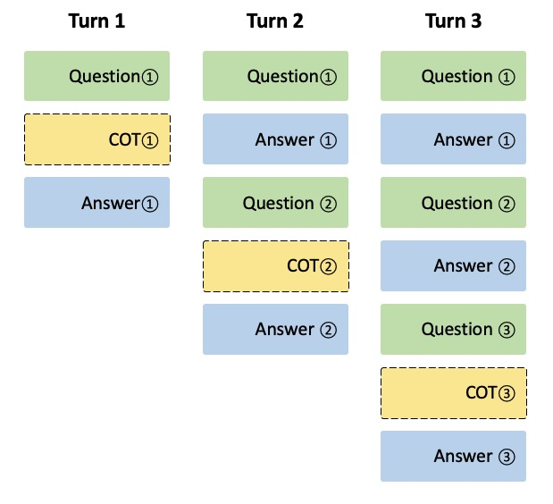

# 从 tokenizer 视角来分析 Agentic 多轮训练的复杂性

【感谢来自领英的 Yanbin Jiang 老师对 verl SGLang multi-turn RL 的重构。本文直接来自他的英文原文，由我代为翻译总结。】

我们最近花了两个星期为 verl 重构 mutli-turn RL 的 attention mask 以及 fast tokenizer。有趣的是，乍一想，我们可能都不会认为这是什么不平凡的事情，，但看似简单的重构最终却暗藏许多门道。通过多次迭代，我们最终得到了[一个解决方案](https://github.com/volcengine/verl/pull/1668)，它既健壮又灵活，可供 verl 用户使用。我们在此分享其中的一些心思。

## 看看简单的单轮情况

在单轮 LLM RL 中，每个训练用的 instance 都包含一个 prompt 作为输入（通常使用 chat template 从一组消息创建）和一个 LLM response（也即 RL 中由 actor 生成的标签）。这些元素被 tokenize 后，连接并填充以进行训练。

### 基本结构

让我们通过一个具体示例来了解该过程：

```python
messages = [
    {"role": "system", "content": "You are a helpful assistant."},
    {"role": "user", "content": "How are you?"}
]
response = "I'm good, thank you!"
```

### 消息格式化

为了准备训练，我们遵循一个两步过程：

1. **格式化提示**：使用分词器的聊天模板将消息转换为正确格式的提示字符串
2. **格式化响应**：将 EOS 标记附加到 assistant 的响应中，以便 LLM 学习何时停止

```python
from transformers import AutoTokenizer

tokenizer = AutoTokenizer.from_pretrained("Qwen/Qwen2.5-0.5B-Instruct", use_fast=True)

prompt_str = tokenizer.apply_chat_template(messages, tokenize=False, add_generation_prompt=True)
response_str = response + tokenizer.eos_token
```

这会生成：

```
# prompt string
<|im_start|>system
You are a helpful assistant.<|im_end|>
<|im_start|>user
How are you?<|im_end|>
<|im_start|>assistant

# response string
I'm good, thank you!<|im_end|>
```

### 从字符串到 Token ID

接下来，我们单独分词这些字符串，然后将它们连接起来形成一个序列。最后，我们将序列填充到所需的训练长度：

```python
# tokenize
prompt_token_ids = tokenizer.encode(prompt_str, add_special_tokens=False)
response_token_ids = tokenizer.encode(response_str, add_special_tokens=False)

# concatenate and pad
input_ids = prompt_token_ids + response_token_ids
input_ids = input_ids + [tokenizer.pad_token_id] * (max_length - len(input_ids))
```

### 创建训练用的 attention mask 和 loss mask

准备好 Token ID 后，我们需要生成两个关键 mask：

1. **attention mask** — 一个二进制 mask（0 和 1），指示模型应该关注哪些 token。被标为 0 的 token 在 forward pass 期间会被忽略。

2. **loss mask** — 指定对哪些 token 计算损失。由于我们只想从 assistant 的响应中学习，因此其他 token 设置为 `-100`（被损失函数忽略），而 assistant 的响应 token 则保留其原始 token id。

以下是实际操作：

```python
# 假设我们有一个 max_length 为 10 的模型
# 假设我们得到的 token_ids 如下：
prompt_token_ids = [1, 2, 3, 4, 5]
response_token_ids = [6, 7, 8]

# 分别创建 attention mask 和 loss mask
prompt_attn_mask = [1, 1, 1, 1, 1]
response_attn_mask = [1, 1, 1]
prompt_loss_mask = [-100, -100, -100, -100, -100]
response_loss_mask = [6, 7, 8]

# 连接和填充（假设填充 token 的 token id 为 151643）
input_ids = [1, 2, 3, 4, 5, 6, 7, 8, 151643, 151643]
attention_mask = [1, 1, 1, 1, 1, 1, 1, 1, 0, 0]
loss_mask = [-100, -100, -100, -100, -100, 6, 7, 8, -100, -100]
```

这种设置确保模型在训练期间只关注从 assistant 的响应中学习，而忽略 prompt 和填充。简单明了。但正如我们接下来将看到的，多轮对话使这种优雅的方法变得复杂。

## 多轮和多步：复杂情况

在深入挑战之前，让我们澄清两个重要概念：

- **多轮**：与单轮（一条 user message → 一个 assistant response）不同，多轮对话在单个训练示例中包含多轮 user-assistant 交互。
- **多步**：在收到 user message 后，assistant 可能需要执行多个步骤（通常是 tool call）来收集信息，然后才能提供最终 response。

这些模式对于训练 LLM Agents 至关重要，但它们显着增加了分词和掩码的复杂性。在 verl 中，我们支持多轮和多步回滚以实现复杂的 LLM Agents 训练。

### 核心挑战

我们仍然希望模型只从 assistant 的响应中学习，但在多轮多步设置中，这些 assistant 的响应散布在更长的对话历史记录中，其中包含 user message、system message 以及可能的 tool output。但这在 tokenization 和 attention mask 的创建上带来了一些挑战。

1. **多条交错消息**：我们现在有交替序列，例如：system prompt → user message → assistant response → user message → assistant response → tool output → assistant response → user message → assistant response，而不是简单的 system prompt -> user message -> assistant response 结构。

2. **难以准确定位**：现代的 chat template 将整个序列转换为一个连续的训练字符串，这使得跟踪每个 assistant response 的开始和结束位置变得困难。

这产生了一个根本问题：一旦分词将所有消息折叠成一个字符串，识别哪些 token 应该包含在损失中就变得具有挑战性，尤其是当 assistant response 可能出现在字符串中的多个、不可预测的位置时。

## 寻找解决方案

### 使用分词器的内置功能

众所周知，仅就 tokenzier 而言，HuggingFace 其实做的确实不错。在 Huggingface 的最初实现中，他们实际上提供了[`return_assistant_tokens_mask`](https://huggingface.co/docs/transformers/en/main_classes/tokenizer#transformers.PreTrainedTokenizer.apply_chat_template.return_assistant_tokens_mask)来返回 assistant token 的 mask。

乍一看，这似乎是完美的解决方案。tokenizer 可以自动识别哪些 token 属于 assistant message 并为我们创建 loss mask。然而，有一个问题：此功能仅在模型的 chat template 使用 `` 关键字明确标记 assistant message 时才有效。模板需要用特殊标记包装 assistant message，以便 tokenizer 确切知道要掩码哪些部分。

不幸的是，截至今天，很少有模型支持此功能。由于 verl 是一个需要支持各种模型的框架，我们不能依赖只适用于少数模型的解决方案。此限制排除了本可以是最优雅的方法。

### 模仿单轮分词

另一种方法是将多轮视为单轮：单独 tokenize 和 mask 每条消息，然后将它们连接起来。然而，这并不简单，因为 chat template 需要根据上下文添加不同的 token。比如，当单独 tokenize 消息时，模板可能会添加意想不到的 system message：

```python
messages = [
    {"role": "system", "content": "You are a helpful assistant."},
    {"role": "user", "content": "How are you?"}
]

# 一起分词
tokenizer.apply_chat_template(messages, tokenize=False)
# <|im_start|>system
# You are a helpful assistant.<|im_end|>
# <|im_start|>user
# How are you?<|im_end|>

# 单独分词 - 注意额外的系统消息！
tokenizer.apply_chat_template([messages[0]], tokenize=False)
tokenizer.apply_chat_template([messages[1]], tokenize=False)
# <|im_start|>system
# You are Qwen, created by Alibaba Cloud. You are a helpful assistant.<|im_end|>
# <|im_start|>user
# How are you?<|im_end|>
```

为了解决这个问题，verl 手动维护了主流模型的[格式配置](https://github.com/volcengine/verl/blob/fe23634116ab69cacc38e7570e3c0e344eb1c711/verl/workers/rollout/schemas.py#L96)。这些配置指定了 chat template 在消息周围添加的确切 token（如 `<|im_start|>system\n` 和 `<|im_end|>\n`）。

例如，在 Qwen 中处理 tool response 时：

```python
# 要添加的工具消息
messages = [
    {"role": "tool", "content": "1 + 1 = 2"},
    {"role": "tool", "content": "2 + 2 = 4"}
]

# 预期 Qwen 格式：
# <|im_start|>user
# <tool_response>
# 1 + 1 = 2
# </tool_response>
# <tool_response>
# 2 + 2 = 4
# </tool_response><|im_end|>

# 使用我们的格式配置，我们将对每个部分进行分词：
token_ids = (
    tokenizer.encode("<|im_start|>user") + # 来自格式配置
    tokenizer.encode("\n<tool_response>\n") + # 来自格式配置
    tokenizer.encode("1 + 1 = 2") +
    tokenizer.encode("\n</tool_response>") + # 来自格式配置
    tokenizer.encode("\n<tool_response>\n") + # 来自格式配置
    tokenizer.encode("2 + 2 = 4") +
    tokenizer.encode("\n</tool_response>") + # 来自格式配置
    tokenizer.encode("<|im_end|>") # 来自格式配置
)
```

由于我们单独分词每个部分，因此我们知道每个部分的长度并可以创建适当的掩码。

然而，这种方法有显著的缺点：

1. **可扩展性：高维护负担** - 我们必须手动维护每个模型的格式配置，并在聊天模板更改或发布新模型时更新它们。精确匹配聊天模板的行为（尤其是空格和换行符）容易出错。

2. **一致性：聚合导致的分词差异** - 单独分词部分会产生与分词整个字符串不同的 token id。相邻字符可能会以不同的方式融合到单个 token 中，比如两个连续的 \n 字符在一起时被分词为一个 token：

```python
# 一起分词
token_ids1 = [151644, 872, 198, 27, 14172, 9655, 1339, 16, 488, 220, 16, 284, 220, 17, 271, 522, 14172, 9655, 29, 151645]

# 单独分词
token_ids2 = [151644, 872, 198, 27, 14172, 9655, 397, 198, 16, 488, 220, 16, 284, 220, 17, 198, 198, 522, 14172, 9655, 29, 151645]

# 两者解码为相同的文本，但 Token ID 不同！
# 关键区别：两个连续的 \n 字符在一起时被分词为一个 Token
# <|im_start|>user\n<tool_response>\n\n1 + 1 = 2\n\n</tool_response><|im_end|>
```

### 带验证的增量分词

鉴于可扩展性和一致性问题，我们探索了一种完全依赖模型内置 chat template 的解决方案，从而无需在 verl 中手动格式化配置。

我们的主要思路是——要 tokenize 新消息，我们可以计算将 chat template 应用于不同数量消息的差异：

1. 将模板应用于前 `i` 条消息；
2. 将模板应用于前 `i+1` 条消息（包括新消息）；
3. 这两个结果之间的字符串差异正是模板格式化新消息的方式。

以下是它的工作原理：

```python
# 对于位置 i 处的助手消息
# add_generation_prompt=True 将 generation prompt 从我们的增量中排除
prev = tokenizer.apply_chat_template(messages[:i], add_generation_prompt=True, tokenize=False)
curr = tokenizer.apply_chat_template(messages[:i+1], add_generation_prompt=False, tokenize=False)

# 仅提取和分词新内容
delta = curr[len(prev):]
new_token_ids = tokenizer.encode(delta, add_special_tokens=False)

# 为新 Token 创建掩码
attention_mask = [1] * len(new_token_ids)
loss_mask = new_token_ids if messages[i]["role"] == "assistant" else [-100] * len(new_token_ids)
```

这种方法优雅地解决了维护问题——我们完全依赖模型的聊天模板。然而，它仍然单独分词子字符串，这在边缘情况下会产生不同的结果。为了捕获这些问题，我们添加了验证，将增量分词与完整分词进行比较。您可以在[此处](https://github.com/jybsuper/verl/tree/tokenization_revision0)查看原型实现。

### 仍旧存在问题

令人遗憾的是，我们发现这种方法会在推理模型中失效。这是由于推理模型对 think token 会有特殊的处理。具体来说，参考下图：

<div align="center"></div>

在第一轮对话中，我们发给 engine 的是 `system prompt -> user message 1`。然后 engine 会进行推理，得到 `system prompt -> user message 1 -> think token 1 -> assistant message 1`。然后，我们接着进行第二轮对话，输入 `user message 2`。直观来看，我们给 engine 的输入是 `system prompt -> user message 1 -> think token 1 -> assistant message 1 -> user message 2`。但是，think model 的 tokenizer 会在这种情况（think token 不是最后一条消息）下，自动把 think token 删去。engine 实际上得到的输入是 `system prompt -> user message 1 -> assistant message 1 -> user message 2`。

我们有如下的观察：

1. 这么做节省了显著的 context window，因为 think content 通常比较长；
2. 无论如何，模型返回给用户的输出只有一段 think content，在训练中也是只有最后一个 assistant message 之前会有一个 think content；
3. 这么做其实浪费了一定的 KV cache；会损失一段 think token + assistant message；

具体来说，可以看下面这个例子：

```python
messages = [
    {"role": "system", "content": "You are a helpful assistant."},
    {"role": "user", "content": "2 + 2 = ?"},
    {"role": "assistant", "content": "<think>user asked about a simple math question.</think> 2 + 2 = 4"},
    {"role": "user", "content": "Thank you!"}
]

tokenizer = AutoTokenizer.from_pretrained("Qwen/QwQ-32B", use_fast=True)

# 当 assistant message 是最后一条时：
prev = tokenizer.apply_chat_template(messages[:-1], add_generation_prompt=False, tokenize=False)
# ... <|im_start|>assistant\n<think>user asked about a simple math question.</think> 2 + 2 = 4<|im_end|>

# 当同一条 message 不是最后一条时，<think> 内容已删除：
curr = tokenizer.apply_chat_template(messages, add_generation_prompt=False, tokenize=False)
# ... <|im_start|>assistant\n2 + 2 = 4<|im_end|>
# <|im_start|>user
# Thank you!<|im_end|>
```

当推理内容不再是最后一条消息时，它就会消失，从而无法计算一致的增量。这种依赖位置的渲染影响了多个模型（QwQ-32B、Qwen3 系列），并从根本上破坏了增量方法。

### 最终解决方案：固定基础 tokenization

造成这种行为的一个可能原因是上下文优化：推理跟踪通常包含可能隐式反映在最终 response 中的信息。在推理过程中删除这种潜在冗余内容可以帮助更有效地利用模型的上下文窗口。虽然这种优化对于推理有意义，但对于训练却有问题。在训练期间，我们必须保留推理内容，以便模型学习：

- 何时在 response 之前进行推理；
- 如何生成高质量的推理链。

这造成了根本性的不匹配：模型附带的是推理优化的 chat template，而不是训练兼容的模板。

### 首次尝试：自动 chat template 替换

我们最初尝试通过自动将推理模板替换为训练兼容版本来解决此问题（[原型在此](https://github.com/jybsuper/verl/tree/tokenization_revision2)）。创建训练模板很简单——我们只是删除了剥离推理内容的逻辑。

然而，检测哪些模型需要替换被证明过于复杂。我们探索了几种识别方法：

1. **模型类型**不起作用——Qwen2.5 和 QwQ-32B 共享相同的类型（`qwen2`），但只有 QwQ 需要替换；
2. **模板哈希**很脆弱——微小的格式更改会为功能上相同的模板生成不同的哈希值；
3. **模型名称/路径匹配**不可靠——检查模型名称中是否包含“qwen3”或“QwQ”等子字符串可能最初有效，但用户在训练后可以将模型重命名为完全不同的名称，而模型仍然使用相同的 chat template。

最后，我们仍然需要为每个新模型发布手动创建训练模板——这不可扩展。

### 选择一个固定的基础对话

我们观察到 chat template 仅在两种情况下有条件地修改内容：

1. 在不存在默认 system message 时添加默认 system message；
2. 在某些条件下从 assistant message 中删除推理内容，例如当它们不是最后一条消息时。

我们的解决方案是完全避开这个问题。我们不使用所有先前的消息作为 tokenization 的基础，而是使用一个**固定的简短对话作为计算增量的基础**，该对话在整个处理过程中永不改变。具体来说：

```python
BASE_CONVERSATION = [
    {"role": "system", "content": "You are a helpful assistant."},
    {"role": "user", "content": "I am a user."}
]

# 计算任何新消息的增量
base = tokenizer.apply_chat_template(BASE_CONVERSATION, add_generation_prompt=False, tokenize=False)
with_new_message = tokenizer.apply_chat_template([*BASE_CONVERSATION, new_message], add_generation_prompt=False, tokenize=False)
delta = with_new_message[len(base):]
```

这优雅地避开了依赖位置的 tokenization 问题，因为：

- 放在最前面的系统消息会阻止模板添加默认值；
- 经过测试，我们发现主流模型都不会有条件地修改 system message 或 user message 内容，这是一个非常好的基础对话；
- 因为基础对话及其 tokenize 的方式都是固定的，所以整个对话过程中基本长度保持不变，这使得我们能够计算一致的增量。

您可以在[此处](https://github.com/volcengine/verl/commit/16662ceff4c90c0893dd2d249965bed94f2a5e1a)找到我们的完整实现。

### 通过验证提高鲁棒性

虽然这种方法适用于我们测试过的所有模型，但它依赖于一个假设：chat template 不会有条件地修改 system message 或 user message。为了防止未来的模型打破此假设，我们：

- 在每次回滚结束时运行验证检查，比较增量分词与完整分词；
- 如果检测到差异，立即警告用户。

这确保系统在默默地产生不正确结果之前大声失败。

## 后续步骤

虽然固定基础 tokenization 解决了我们当前的训练需求，但我们发现模型生命周期的不同阶段存在差异：

- **训练**：训练数据中保留完整的推理跟踪；
- **RL 回滚**：维护完整的推理跟踪；
- **生产推理**：推理优化的 chat template 删除推理内容以获得更好的延迟。

### 一致性挑战

理想情况下，模型输入在整个生命周期中应保持一致以获得最好的表现。然而，现实情况是，我们需要不同的 chat template 用于训练和推理。这种差异可能不会显著影响有能力的模型。然而，对于能力较弱的模型或具有挑战性的任务，这可能导致很大的问题。

### 当前缓解措施

在我们继续评估这种差异的全部影响的同时，verl 提供了一个标志，允许用户选择在 rollout 期间使用哪个 chat template：

- **训练模板（默认）**：保持训练和 rollout 阶段之间的一致性；
- **推理模板**：删除推理跟踪；

我们默认使用训练模板，因为我们认为训练和 rollout 之间的一致性比上下文优化更重要。

### 展望未来

我们正在积极寻找一种解决方案，以保证训练、rollout 和最终测试这三个阶段的一致性。请继续关注我们开发这种统一方法时的更新。