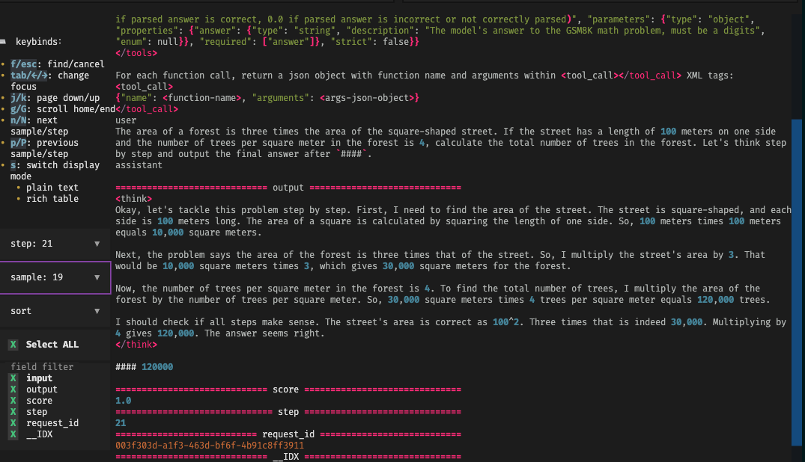
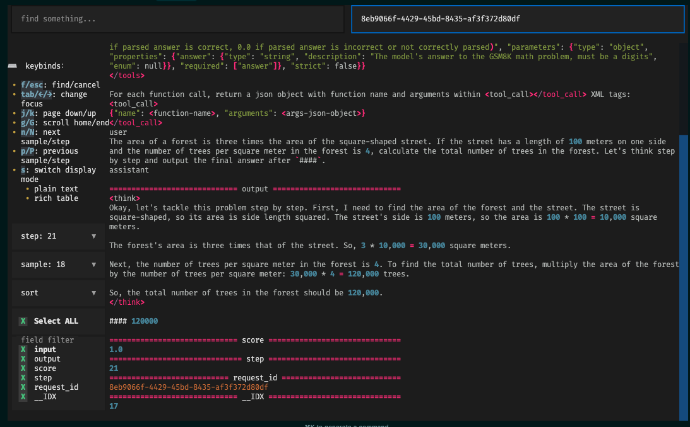

# Rollout Viewer TUI

感谢小红书的朋友们的贡献，我们开发了一套名为 TUI 的可视化工具。具体来说，我们实现了 `rollout_viewer.py`，它是一个基于 [Textual](https://textual.textualize.io/) 的交互式 JSONL 数据浏览工具，可以将 Rollout log 文件，在终端中以富文本形式展示，并支持分页、搜索、字段过滤等操作。

acknowledge：rui yang（小红书），chengxi li（CMU），Huapeng Zhou（UW），Chenyang Zhao（Amazon）

## 依赖环境

```python
pip install typer==0.16.0
pip install ujson==5.10.0
pip install textual==0.52.1
pip install aiofiles==24.1.0
```

## 配置

需要在配置中设置 rollout data（存储目录），比如：

```bash
trainer.rollout_data_dir=$HOME/data/gsm8k/rollout_data
```

注意，目前 TUI 不支持 agent loop，因为开启 `actor_rollout_ref.rollout.mode=async` 以启动 Agent Loop 后，request id 会无法获得。这会在后续版本解决。

## 运行方式

```bash
python rollout_viewer.py  <JSONL目录路径>
```
示例：

```bash
python rollout_viewer.py  ./data/rollouts
```

程序会异步加载该目录下所有后缀为 `.jsonl` 的文件。

## 数据格式要求

- 程序默认每个 `*.jsonl` 文件代表一个 step，文件名需要可以被 `int` 转换（例如 `0.jsonl`, `1.jsonl` …）。
- 文件内容为标准 JSON Lines，每一行对应一个 sample。
- 加载时会为每个 sample 自动添加字段 `__IDX`，表示其在当前文件中的行号。

数据 example 可以[参考这里](https://github.com/volcengine/verl/blob/152c599303dd4364aa8d581d405a84922dc8c713/docs/sglang_multiturn/sandbox_fusion.rst#e2e-tests)。

## Example

1. Select an exact step and sample, works well:



2. Select a right request_id to search, works well:


