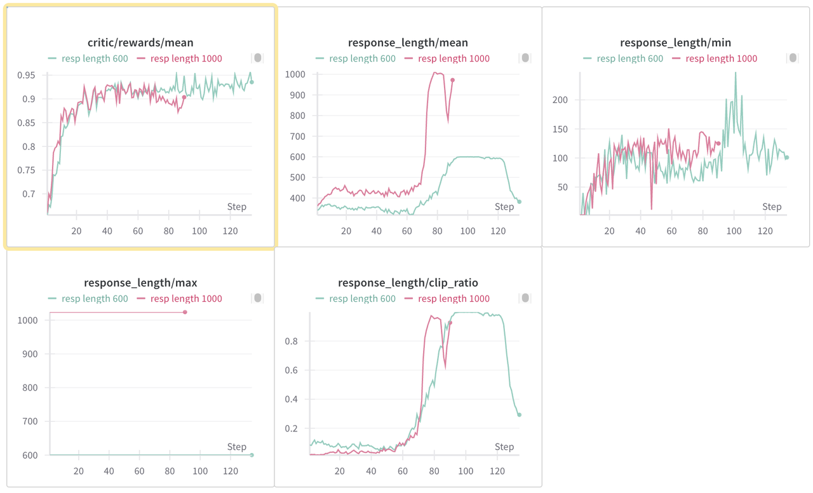
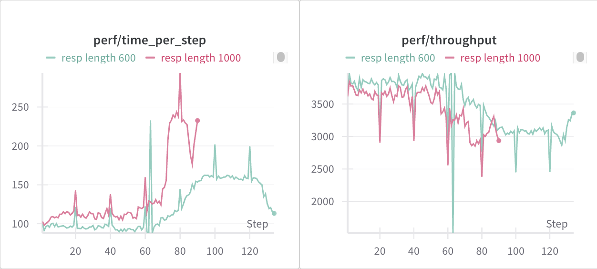

# 系统性分析 verl multi-turn training 的时间消耗

multi-turn training 系统本身极度复杂且资源消耗巨大。尽管本文不会直接提出优化 multi-turn training 的方案，但解决问题的第一步永远是最细粒度的找到问题本身。仅仅看到某个 step 的 rollout 出现了异常可能距离真正的问题还有一段距离，本文就旨在更细粒度找到真正的问题。

我们在此分享一套系统性的分析方法；wandb 只能够看到每个 training step 所消耗的时间，而我们的分析粒度远远超出这一层。基于我们的分析方式，能够具体观察到**每个 step 在 rollout 阶段的每个 rollout DP worker 的每个 req 的每个 turn 的每个 event 所消耗的时间。**

Acknowledgements: Zhuoran Yinn (CMU), Changyi Yang (CMU), Chengxi Li (CMU), Huapeng Zhou (UW), Hongyu Lu (TikTok), Chenyang Zeng (Amazon)

此外，verl 在 multi-turn 上也在进行 agent loop 等功能的测试，我们预计会对 multi-turn training 有稳定的加速，这部分内容会后续分享。

## Profile 原理

直观上，我们在 [sglang_rollout.py](https://github.com/PrinsYin/verl/blob/multiturn_profile_log/verl/workers/rollout/sglang_rollout/sglang_rollout.py) 中添加了不超过 50 行用于 profile 的代码，用于在每个 event 结束时记录时间戳。实际进行 profile 时，请读者将类似的逻辑添加到自己的工作流中，并运行您的训练。训练结束后，使用 [profile-multiturn-scripts](https://github.com/PrinsYin/verl/tree/multiturn_profile_log/profile-multiturn-scripts) 中的脚本进行分析。

具体来说，ray 的 log 会进行自动压缩等等优化，这加速了 ray 的 logging 速度，但是不同的 worker 不同的 req 不同的 turn 混在一起，导致我们很难找到真正速度较慢的那些 worker 和 req。我们的方法简单有效，通过强制同步的方式将每个 worker 在每个 step 的所有 req 写入到 `{step_id}/{worker_id}.jsonl` 中。然后，我们的[可视化脚本](https://github.com/PrinsYin/verl/tree/multiturn_profile_log/profile-multiturn-scripts)会读取相关数据，并进行可视化。

## 具体用法

在您的 `sglang_rollout.py` 中，定义 [`SGLangLogManager`](https://github.com/PrinsYin/verl/blob/f1c6ee60ae701789875b00616e45bd0ae5cb171c/verl/workers/rollout/sglang_rollout/sglang_rollout.py#L93)，用法非常简单。

<details>
<summary>SGLangLogManager</summary>

```python
# logging tool for sglang multi-turn rollout
class SGLangLogManager:
    def __init__(self):
        self.file_handles = {}
        atexit.register(self.close_all)
    
    def get_handle(self, log_path):
        if log_path not in self.file_handles:
            os.makedirs(os.path.dirname(log_path), exist_ok=True)
            self.file_handles[log_path] = open(log_path, 'a', buffering=1)
        return self.file_handles[log_path]
    
    def log(self, log_path, event, duration=None, extra=None, workid=None, step=None,**extra_keys):
        handle = self.get_handle(log_path)
        log_entry = {
            "timestamp": datetime.now().isoformat(),
            "event": event,
        }
        if duration is not None:
            log_entry["duration_sec"] = duration
        if extra is not None:
            log_entry["extra"] = extra
        if workid is not None:
            log_entry["workid"] = workid
        if step is not None:
            log_entry["step"] = step
        if extra_keys is not None:
            for key in extra_keys:
                log_entry[key] = extra_keys[key]
        ordered_keys = ["timestamp", "event", "duration_sec"] + [k for k in log_entry.keys() if k not in ("timestamp", "event", "duration_sec")]
        ordered_entry = {k: log_entry[k] for k in ordered_keys if k in log_entry}
        handle.write(json.dumps(ordered_entry) + '\n')
        handle.flush()
    
    def close_all(self):
        for handle in self.file_handles.values():
            handle.close()
```

</details>

随后，在 `SGLangRollout` 类中定义 [`log_manager`](https://github.com/PrinsYin/verl/blob/f1c6ee60ae701789875b00616e45bd0ae5cb171c/verl/workers/rollout/sglang_rollout/sglang_rollout.py#L330)，[`log_dir`](https://github.com/PrinsYin/verl/blob/f1c6ee60ae701789875b00616e45bd0ae5cb171c/verl/workers/rollout/sglang_rollout/sglang_rollout.py#L331) 和 [`step`](https://github.com/PrinsYin/verl/blob/f1c6ee60ae701789875b00616e45bd0ae5cb171c/verl/workers/rollout/sglang_rollout/sglang_rollout.py#L326)，并初始化：

<details>
<summary>SGLangRollout</summary>

```python
class SGLangRollout(BaseRollout):
    def __init__(
        self,
        actor_module: str,
        config: DictConfig,
        processing_class: Union[PreTrainedTokenizer, PreTrainedTokenizerFast, ProcessorMixin],
        model_hf_config,
        port=None,
        trust_remote_code: bool = False,
        device_mesh: DeviceMesh | None = None,
        **kwargs,
    ):
        """Synchronized SGLang rollout engine.

        Args:
            actor_module: Huggingface model name or path to the model. The
                model should be supported by SGLang.
            config: A DictConfig object containing SGLang-specific operational
                parameters and rollout settings.
                Refer to https://docs.sglang.ai/backend/server_arguments.html
            processing_class: The tokenizer or processor instance compatible with the actor_module.
            model_hf_config: The Hugging Face model's configuration (e.g.,
                `transformers.PretrainedConfig`). It provides architectural
                details and hyperparameters like `max_position_embeddings`,
                used by SGLang for correct model initialization. This is
                the model's inherent design, not SGLang's runtime behavior.
            port: Optional port for multi-node initialization when nnodes > 1.
            trust_remote_code: Whether or not to allow for custom models
                defined on the Hub in their own modeling files.
            device_mesh: Optional `DeviceMesh` object for distributed setup.
            **kwargs: Additional keyword arguments, primarily `train_tp` for
                Megatron Backend integration to initialize hybrid engine
                process groups.
        """
        super().__init__()
        self.step = 0
        self.config = config
        self._device_mesh_cpu = device_mesh
        os.environ.setdefault("SGL_DISABLE_TP_MEMORY_INBALANCE_CHECK", "true")
        # 添加的 log_manager
        self.log_manager = SGLangLogManager()
        # 添加的 log_dir，如果您的实验没有设置 EXPERIMENT_NAME，则默认使用 multiturn_log_dir
        self.log_dir = "logs/"+os.getenv("EXPERIMENT_NAME", "multiturn_log_dir")
```

</details>

在 `generate_sequences` 函数中添加 [`self.step += 1`](https://github.com/PrinsYin/verl/blob/f1c6ee60ae701789875b00616e45bd0ae5cb171c/verl/workers/rollout/sglang_rollout/sglang_rollout.py#L619)。

接着，在您希望 profile 的具体 event 的前后调用 `self.log_manager.log` 即可。比如:

<details>
<summary>engine_async_generate 的计时</summary>

```python
torch.cuda.synchronize()
generate_start_time = time.time()

### event 开始
if self._tp_rank == 0:
    loop = asyncio.get_event_loop()
    output = loop.run_until_complete(
        self._engine.async_generate(
            prompt=None,  # because we have already convert it to prompt token id
            sampling_params=request_sampling_params,
            return_logprob=True,
            input_ids=idx_list,
            image_data=image_list,
        )
    )
    torch.cuda.synchronize()
    generate_end_time = time.time()
    log_path = os.path.join(
        self.log_dir,
        f"step_{self.step}",
        f"worker_{self._rank}.jsonl"
    )

    ### event 结束

    self.log_manager.log(
        log_path,
        event="engine_async_generate",
        duration=generate_end_time - generate_start_time,
        workid=self._rank,
        step=self.step
    )
```

</details>

注意，在使用 `time.time()` 计时的时候，需要使用 `torch.cuda.synchronize()` 来确保 GPU 和 CPU 指令的同步。上方代码也展示了具体 log path 的定义：

```python
log_path = os.path.join(
    self.log_dir,
    f"step_{self.step}",
    f"worker_{self._rank}.jsonl"
)
```


我们在示例的 [sglang_rollout.py](https://github.com/PrinsYin/verl/blob/f1c6ee60ae701789875b00616e45bd0ae5cb171c/verl/workers/rollout/sglang_rollout/sglang_rollout.py) 中调用了 36 次 `self.log_manager.log`，进行了粒度极为细致的 profile。欢迎自行决定您想要 profile 的 event，发觉那些真正拖慢 multi-turn training 的 event，并对点优化。

## 已有的结论

接下来分享我们基于 [GSM8K 的 multi-turn training](https://github.com/PrinsYin/verl/blob/multiturn_profile_log/profile-multiturn-scripts/README.md#a-quick-reproduction-of-the-profile) 进行 profile 能够得到的可视化结果。相信各位读者能够基于我们的工具做出更加扎实的分析。

### 长尾效应

<div style="display: flex; align-items: center;">
  
  
</div>

1. 我们首先设置 rollout 的 max response length 为 1000，对所有 DP worker 在某个具体的 step 做出 reqs 的相对时间的 CDF 图（上方右图），观察到rollout 的长尾效应非常明显；在一个 step 的 reqs 的 rollout 过程中，80% 的 reqs 会在前 50% 的时间完成，剩下的都是在解决余下的长尾问题。
2. 我们接着结合 wandb 的可视化发现（上方左图的红色线），在 reward 稳定上升阶段，mean response length 不会发生显著变化，甚至会变低，一直维持在 500 上下。但是，任何一个 step 我们都发现 model 的 response length 最大值都是直接到了我们设置的 max rollout length。

基于对上方右图的观察，我们本来是打算做一个过采样策略，比如每一轮过采样 20% 的 reqs，指定数目的 reqs 收集进入 data buffer 后，过采样的且还没有完成 rollout 的数据直接就丢弃不管了。这个和 partial rollout 有些区别，partial rollout 是会把这些过采样但是没有完成的 reqs 存下来，下一 step 在上一 step 的基础上继续 rollout。

不过，进一步观察到看到左图的红色曲线后，我们选择了更直接的解决方案。不做过采样，直接把 max response length 往下调。比如，我们直接尝试把 max response length 调到 600，预期可以显著优化每个 step 的 rollout time，而且 reward 不该受到很大影响。**实际上，我们认为那些很长尾的 req 反而 reward 是不高的，毕竟 reward 崩溃之后 response length 就是猛增。**

很好的是，我们拿到了可观的结果，也就是上方左图的绿色线，一样好的收敛效果。并且，我们去观察 throughput 和具体每一 step 消耗的时间，发现 max length 为 600 稳定地比起 1000 更快。

<div align="center">
  
</div>

1. Response length min 没有受到影响；
2. Response length mean 在一开始会略微降低（因为那些 outlier 的 response length 从 1000 降低到了 600）；随着时间的推移，response length mean 稳定更低，但是 reward 却同样好，甚至在 80 steps 之后稳定更好。
3. Response length max 没有影响，一直都达到了最高的 length。这也是我们策略的核心——我们认为长尾的 req 严重拖慢了 rollout 速度，而且对 reward 没有正向贡献。直接降低 max response length 可以在提高 rollout 速度的同时维持 reward 不变。
4. 显然，time per step 稳定降低，而且在 response length 猛增之后相对优势更加显著。
5. 此外，perf/throughput 也稳定更高。

总体上，我们认为直接大规模削减 max response length，是一个非常行之有效的简单方案。实际上，我们进一步验证了 500 600 700 800，仍旧一样收敛很好。更夸张的是，我们直接将 max response length 降低到 400（注意 max length 为 1000 时，step 0 的 mean response length 就超过了 420），竟然最终的收敛效果一样的好。一方面，gsm8k 本身非常简单，本身就不需要那么多 tokens。另一方面，用 400 做 max 的话，第 0 步的 reward 显然是会受影响的，直接跌了 0.1。但是最后居然还是收敛到 0.95，而且中途 response length mean 都没有抵到过 400。不过从 600 压到 400 后，time per step 没有明显提升。

### 分析 Rollout 异常慢的 step 的具体某个 req

CDF 只是我们分析工具的基础用途，我们还可以进一步分析每个 worker 每个 event 的耗时。我们基于 max length 为 600 的情况，在 7 次重复实验中，发觉某一次实验的 step67 是一个严重的 peak，在 rollout 上花费了显著多的时间。


进一步查看 step 67 的每个 rollout worker，我们发觉：

<div style="display: flex; align-items: center;">
  
  
</div>

worker 0 的 rollout 花了非常久，而其他 7 个 worker 都被 barrier 到这里，等待 worker 0 结束。进一步看 worker 0 中的 reqs，注意到 worker 0 一共有 512 个 reqs（注意到我们启用了 [repeative sampling](https://github.com/volcengine/verl/pull/2258) 的 feature）：

```python
data.train_batch_size=256
actor_rollout_ref.rollout.n=16
```

我们进一步得到 worker 0 和其他 worker 的 CDF 图：

<div style="display: flex; align-items: center;">
  
  
</div>

我们发觉 worker 0 的 reqs CDF 非常奇怪，大概 400 条 reqs 在前 25s 返回，接着 150s 没有任何一条返回；然后剩下的 reqs 才返回。此外，175s 和 15s 的斜率是一致的，让人觉得中间的空白期 GPU 一直没有工作。我们观察到这样一次 peak 后接着进行了 6 次重复实验，但是再也没有出现过一样的情况。

我们接着从那 100 条异常的 reqs 里面去查找，有两个比较典型的 req：

<div style="display: flex; align-items: center;">
  
  
</div>

这两个都很异常：左图的 reward calculate 很慢；右图的 engine generate 很慢。我们进一步分析：

1. 为什么左图 reward cal 可以这么慢？我记得 gsm8k 的 reward cal 就是一个 string compare，纯 CPU 函数，不该这么慢的；这是个非常令人怀疑的地方；而且有个值得注意的地方：我不确定在 rollout 阶段的 cal 的 reward 有没有在训练阶段用上。

> rollout 阶段的计算 reward 是为了后面计算 e2e reward 有 tool calling 和 interaction reward。然后 reward_cal 占比高的原因，可能是因为 response 全量输入了，我们提了[一个 PR](https://github.com/volcengine/verl/pull/2568) 来只用 last turn 的 last 300 char 看看。

3. 为什么右图的 engine call 这么慢？

> 注意到基于我们的 profile 工具，我们其实可以具体拿到 turn 1 和 turn 2 的耗时。turn 1 的耗时非常正常，20s 就好了，但是 turn 2 花了 150s，而且观测到显著的 engine generation 远超正常。很遗憾，我们一开始没有同步采用 nsys 捕获此时的 GPU 行为。我们接着进行了 6 次重复实验，也没有出现过 peak。不过，不出现 peak 可能反而是好事吧 lol。

### Preprocess 耗时较长

我们接着来展示通过 profile 工具，我们能够得到哪些 insight。我们进一步分析每个 request 的耗时百分比。可以看到，只有三项比较显著的 event：

- `async_generate_duration` 真正的 rollout
- `preprocessing_duration` 预处理
- `barrier_wait_duration` 等待所有 worker rollout 结束准备


| Event | Avg % of Total Time |
|-------|---------------------|
| async_generate_duration | 74.05% |
| preprocessing_duration | 18.57% |
| barrier_wait_duration | 6.39% |
| broadcast_duration | 0.52% |
| data_extraction_duration | 0.35% |
| cache_flush_duration | 0.08% |
| padding_duration | 0.04% |
| sorting_duration | 0.00% |
| final_construction_duration | 0.00% |
| batch_construction_duration | 0.00% |
| concatenation_duration | 0.00% |


我们进一步分析了每个 event 在每个 step 的平均占比的曲线。我们发现，在 response length 增长的情况下 preprocess 的占比也下降。我们认为，preprocess 的耗时近乎常数，和 reponse length 关系不大。而且，preprocess 是和 step 状态无关的，可以在 dataset 构造的时候就做好。此外，agent loop 功能进一步优化了 preprocess 的耗时。我们会在之后的文章分析。

<div style="display: flex; align-items: center;">
  
</div>


### Turn 分析

我们最后对 turns 的分布进行分析：

<div style="display: flex; align-items: center;">
  
  
  
</div>

从左到右，分别是前 80 步的每个 step 中不同 turn 的平均 engine generation 耗时；拥有不同 turn 的 reqs 的平均耗时；以及每一步不同 turn 的 reqs 的平均占比。

直观感受其实真正在 engine generation 上的耗时都不多，而且绝大多数 reqs 都只有 1 个或者两个 turn。
