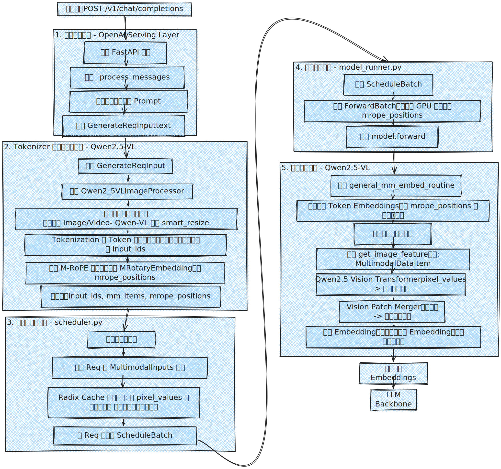

# SGLang 多模态请求生命周期：以 Qwen2.5-VL 为例的架构级深度解析

本文档以 `Qwen2.5-VL` 为参考模型，提供对 SGLang 框架内多模态请求处理流程的终极详细剖析，深入到关键函数、数据结构转换和并发模型层面，旨在为开发者提供白板级的清晰理解。

## 核心流程图

    

## 1. 服务与适配层 (`serving_chat.py`)

- **作用**：系统入口，将外部 OpenAI API 格式请求转换为 SGLang 内部数据结构。
- **输入**：原始 HTTP POST 请求。
- **输出**：`GenerateReqInput` 对象。
- **流程**：
    - `OpenAIServingChat` 接收请求，调用 `_process_messages` 应用聊天模板。
    - 文本和媒体占位符（如 `<|vision_start|>...<|vision_end|>`）被统一格式化。
    - 原始媒体数据（如 URL 或 Base64 编码）完整保存在 `GenerateReqInput.image_data` 字段。

## 2. Tokenizer 与多模态处理器 (`tokenizer_manager.py`, `qwen_vl.py`)

- **作用**：数据准备与模型适配的核心阶段。
- **输入**：`GenerateReqInput` 对象。
- **输出**：包含 `input_ids`、`mm_items`、`mrope_positions` 的字典。
- **关键流程**：
    1. **并发数据加载与预处理**  
       并发加载图像数据，并调用 Qwen-VL 特有的 `smart_resize` 对图像进行缩放，满足模型输入尺寸要求。
    2. **Token 化与即时扩展**  
       处理器将文本中的图片占位符直接替换为完整的特殊 Token 序列（如 `<|vision_start|>...<|image_pad|>...<|vision_end|>`），即 Token 扩展在 Tokenizer 阶段已完成。
    3. **计算 M-RoPE 位置编码**  
       生成扩展后的 `input_ids` 后，调用 `MRotaryEmbedding.get_rope_index`，依据输入 Token 和图像网格尺寸，计算精确的 `mrope_positions`，为后续文本与视觉特征融合提供基础。
    4. **最终组装**  
       将已扩展的 `input_ids`、包含 `pixel_values` 的 `MultimodalDataItem` 列表，以及 `mrope_positions` 一同打包，发送给调度器。

## 3. 调度器 (`scheduler.py`)

- **作用**：高效请求批处理与缓存管理。
- **输入**：包含 `input_ids`、`mm_items`、`mrope_positions` 的字典。
- **输出**：`ScheduleBatch` 对象。
- **流程**：
    1. 为每个请求创建 `Req` 与 `MultimodalInputs` 对象，跟踪状态。
    2. **Radix Cache 缓存优化**  
       调用 `pad_input_ids`，将 `input_ids` 中的 `<|image_pad|>` 等特殊 Token 替换为对应 `pixel_values` 的哈希值。该哈希值作为缓存关键标识，实现相同图片请求的高效前缀匹配与缓存命中，即使文本内容不同。

## 4. 模型执行与特征注入 (`model_runner.py`, `qwen2_5_vl.py`)

- **输入**：`ForwardBatch` 对象。
- **输出**：`logits`。
- **流程**：
    1. `ModelRunner` 创建的 `ForwardBatch`，包含 `input_ids` 及 `mrope_positions`。
    2. 调用 `model.forward()`，将 `mrope_positions` 作为关键参数传入。
    3. **双路径特征嵌入（M-RoPE 增强）**  
        - **文本路径**：`general_mm_embed_routine` 获取整个 `input_ids`（含 `<|vision_start|>` 等特殊 Token）的常规词嵌入，并用 `mrope_positions` 应用 RoPE（旋转位置编码），确保文本和视觉部分获得精确位置信息。
        - **媒体路径**：识别 `<|image_pad|>` 区域，调用 `get_image_feature`。`Qwen2.5_VisionTransformer` 将 `pixel_values` 转为高维视觉特征，`VisionPatchMerger` 对齐到语言模型嵌入维度。
    4. **精确注入**：视觉特征嵌入覆盖 `<|image_pad|>` Token 对应的词嵌入位置，构建融合文本与视觉信息的完整输入序列。

## 5. 推理生成与输出

- 融合后的输入序列送入模型 Transformer 层，后续流程与纯文本模型一致：生成 `logits`，采样输出 Token，最终解码为文本返回用户。

## 附录：流程图 Mermaid 源码

```mermaid
graph TD
    A["用户请求POST /v1/chat/completions Body: messages text, image_url"] --> B1

    subgraph S1 ["1. 服务与适配层 - OpenAI Serving Layer"]
        B1["接收 FastAPI 请求"]
        B2["调用 _process_messages"]
        B3["应用聊天模板生成 Prompt"]
        B4["构建 GenerateReqInputtext, image_data"]
        B1 --> B2 --> B3 --> B4
    end

    B4 --> C1

    subgraph S2 ["2. Tokenizer 与多模态处理器 - Qwen2.5-VL"]
        C1["接收 GenerateReqInput"]
        C2["调用 Qwen2_5VLImageProcessor"]
        C3["并发数据加载与预处理- 并发加载 Image/Video- Qwen-VL 特有 smart_resize"]
        C4["Tokenization 与 Token 扩展将图片占位符替换生成扩展后的 input_ids"]
        C5["计算 M-RoPE 位置编码调用 MRotaryEmbedding生成 mrope_positions"]
        C6["构建请求input_ids, mm_items, mrope_positions"]
        C1 --> C2 --> C3 --> C4 --> C5 --> C6
    end

    C6 --> D1

    subgraph S3 ["3. 调度与缓存优化 - scheduler.py"]
        D1["接收上阶段请求"]
        D2["创建 Req 与 MultimodalInputs 对象"]
        D3["Radix Cache 缓存优化1. 对 pixel_values 张量计算哈希2. 将哈希值作为唯一标识3. 实现高效前缀匹配"]
        D4["将 Req 添加到 ScheduleBatch"]
        D1 --> D2 --> D3 --> D4
    end

    D4 --> F1

    subgraph S4 ["4. 模型执行准备 - model_runner.py"]
        F1["接收 ScheduleBatch"]
        F2["创建 ForwardBatch准备低阶 GPU 张量包含 mrope_positions"]
        F3["调用 model.forward"]
        F1 --> F2 --> F3
    end

    F3 --> G1

    subgraph S5 ["5. 模型前向传播 - Qwen2.5-VL"]
        G1["调用 general_mm_embed_routine"]
        G2["获取文本 Token Embeddings使用 mrope_positions 进行位置编码"]
        G3["识别图像占位符区域"]
        G4["调用 get_image_feature输入: MultimodalDataItem"]
        G5["Qwen2.5 Vision Transformerpixel_values -> 高维视觉特征"]
        G6["Vision Patch Merger高维特征 -> 语言模型维度"]
        G7["注入 Embedding将投影后的视觉 Embedding覆盖到占位符区域"]
        G1 --> G2 --> G3 --> G4 --> G5 --> G6 --> G7
    end

    G7 --> H["合并后的 Embeddings"]
    H --> I["LLM Backbone"]
    I --> J["Logits"]
    J --> K["采样 -> 输出 Token"]
```

