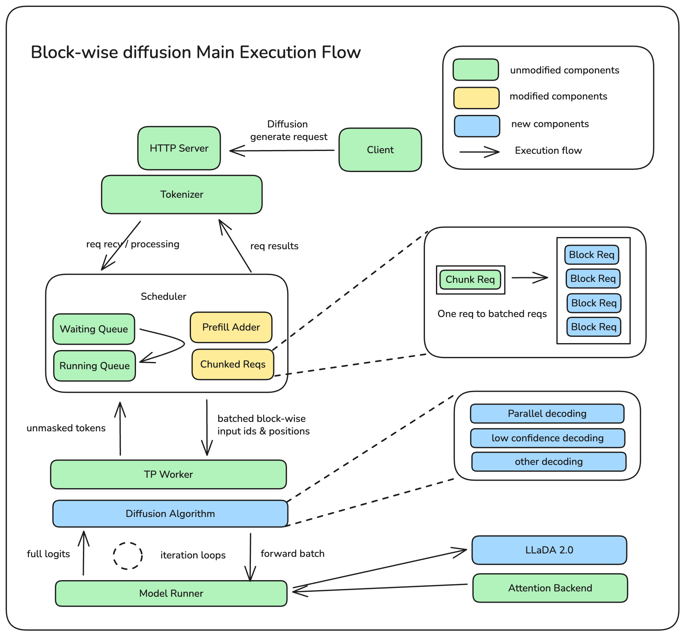

# 基于 SGLang Chunked-Prefill 支持 Block-Wise Diffusion LLM

## TL;DR

我们很高兴在 SGLang 中引入了扩散大语言模型（dLLM）框架的设计与实现。通过利用现有的分块预填充（Chunked-Prefill）机制，我们的系统实现了：

- **无缝集成**：内置 SGLang 框架，不改动核心架构。
- **性能继承**：该框架受益于 SGLang 现有的推理优化技术。
- **极高灵活性**：为用户定义和自定义扩散解码算法提供了充分的灵活性。

## 背景介绍


今年早些时候，[LLaDA](https://arxiv.org/pdf/2502.09992) 的发布引起了学术界和工业界的广泛关注。中国人民大学与蚂蚁集团的研究者们证明了 dLLM 独特的执行范式同样具有卓越的数据理解能力。此外，与自回归（Auto-Regressive, AR）模型相比，dLLM 在低延迟场景（如极端小 Batch Size）下能够实现更快的推理速度。

同时，随着 dLLM 参数规模的不断增长，我们也观察到了与 AR LLM 类似的 Scaling law。为了追求更强大的 dLLM，蚂蚁团队训练了拥有 100B 参数的 [LLaDA2.0-flash](https://huggingface.co/papers/2512.15745) 模型。在训练 LLaDA2.0-flash 的过程中，我们遇到了一系列严峻的 AI 基础设施工程挑战。其中最重要的挑战是模型评估和 RL 的效率与稳定性。

在 SGLang 支持 dLLM 之前，可用的 dLLM 推理引擎不足以支持大规模 dLLM 的评估和 RL 后训练需求。[Fast-dLLM](https://github.com/NVlabs/Fast-dLLM) 等框架是优秀的科研工具，更适合算法研究人员调试和验证各种扩散解码算法，但在提供生产级的服务能力（如 Batching、Scheduling、RL 生态集成和并行化）方面尚有欠缺。

相比之下，SGLang 作为当今最流行的 LLM 推理引擎，在工程能力、技术领先性和生态完整性方面具有显著优势：

1.  **生产规模**：已在数千家公司的推理服务中部署，提供成熟可靠的工程能力。
2.  **技术领先**：SGLang 自身集成了大量先进的推理优化技术，且社区不断涌现新的优化方案。
3.  **生态完整**：与 RL 后训练生态集成度极高，特别是在分布式权重 GPU P2P 更新等领域。

然而，在我们（蚂蚁集团 DeepXPU 与 SGLang dLLM 小组）的工作之前，SGLang 仅支持自回归计算范式，尚未适配 LLM 的扩散计算方法。因此，如何在不破坏现有架构的前提下，在 SGLang 框架内引入对 dLLM 的支持，也即：

1. 让 dLLM 受益于 SGLang 提供的所有优化优势。
2. 避免为了适配扩散的解码方式对 SGLang 框架进行大规模的修改。

## 方案设计

对于 dLLM 当前的发展趋势，我们发现了一些重要的 insights：

1.  由于全向注意力扩散（Bidirectional Attention Diffusion）计算成本巨大且 KV Cache 利用率低，主流 dLLM 正在转向**块扩散（Block Diffusion）**架构。
2.  块扩散的计算模式与 SGLang 现有的自回归过程中 **Chunked-Prefill（分块预填充）** 高度相似。

### 系统架构

我们当前的方案是利用 SGLang Chunked-Prefill 执行流来实现对 Block Diffusion LLM 的计算支持。这种方法使我们能够将 dLLM 无缝集成到 SGLang 生态中，无需更改核心框架，让 dLLM 直接从现有的推理优化技术中获益，避免重复造轮子。

<p align="center">
  
  <br>
</p>

如上图所示，我们对 SGLang 框架的修改非常克制，几乎未触及核心。SGLang 原有的 `generate request` 执行流保持不变。我们的实现主要侧重于利用和修改现有的 Chunked Prefill 机制，具体工作集中在两个关键组件：`prefill adder` 和 `chunked reqs`。

在 SGLang 中，Chunked Prefill 的最初目的是最大化 GPU 利用率。因此，单个块（Chunk）的大小通常设置得很大（根据 GPU 型号，序列长度在 2K 到 16K 之间）。当序列足够长时，它自然只处理一个请求，这就是目前 `prefill adder` 和 `chunked req` 的实现方式。

然而，dLLM 的解码过程不同：它在块（Block）级别分割序列长度。以 LLaDA2.0 为例，其块大小为 32 个 token。如果我们沿用 SGLang 之前每次只处理一个大请求的逻辑，GPU 性能显然会被浪费。因此，**Batching（批处理）**是一个必须解决的关键问题。为了实现高效的 Batching，我们修改了 `chunked reqs` 和 `prefill adder`，使其能够在单个计算周期内处理多个扩散块（Diffusion Blocks）。

此外，在实际解码执行层面，我们在 TP Worker 和 Model Runner 之间插入了一个扩散算法抽象层。

具体而言：
- 如果 Worker 识别出正在处理扩散模型，执行流将进入此专用分支。
- TP Worker 随后调用扩散算法的 `run` 函数。
- 该算法内部利用前向迭代循环持续驱动 Model Runner 进行推理计算，直到整个块（例如全部 32 个 token）解码完成。

### 注意力掩码 (Attention Mask)

<p align="center">
  
  <br>
</p>

在单次模型前向传递中，块扩散与分块预填充（Chunk Prefill）之间最大的区别在于对注意力掩码的处理。

- **块扩散** 利用块级因果掩码。
- **AR 模型的分块预填充** 使用传统的逐 token 因果掩码。

我们可以将块扩散视为对 SGLang 现有分块预填充机制的功能扩展。关于具体的注意力计算，单次前向传递涉及两个计算部分，其最终输出被拼接起来：

1.  **上下文查询 (Context Query)**：使用当前的 `Q_curr`（当前块的查询向量）对现有的 KV Cache 进行双向注意力计算。对于块扩散和分块预填充，此计算完全一致。目标是确保当前块能关注到所有历史信息。
2.  **块内查询 (Intra-Block Query)**：使用当前的 `Q_curr` 对其自身的 KV（即当前块内的键和值）进行前向计算。
    - **块扩散**在此步骤中使用双向注意力。
    - **分块预填充**在此步骤中必须使用因果掩码（Causal Mask）。

简单来说，如果我们将 `Q_curr` 部分的注意力掩码视为几何图形：
- 分块预填充（因果掩码）的计算对应于一个梯形（或三角形）掩码。
- 块扩散（双向注意力）的计算对应于一个矩形掩码。

## 效果展示

以下是 LLaDA2.0-flash-CAP (100B / BF16) 与 gpt-oss-120B (117B / MXFP4) 流式输出对比的动画。LLaDA2.0-flash-CAP 在 8 × H20 上使用 SGLang dLLM（TP8）运行，而 gpt-oss-120B 在相同硬件上使用 SGLang 标准 AR 流程运行。

两个模型都被要求用 10 种编程语言实现快速排序算法——这是一项比较适合 dLLM 的任务。如图所示，在这种场景下，LLaDA2.0-flash-CAP 实现了显著更高的吞吐量（935 tokens/s），而 gpt-oss-120B 为 263 tokens/s。

<p align="center">
  
  <br>
</p>

SGLang dLLM 与 SGLang 自回归模型一样支持流式输出：但它每次输出一个块（例如 32 个 token），而不是一个 token。

<p align="center">
  
  <br>
</p>

## 如何使用

### 启动命令示例

```shell
python3 -m sglang.launch_server \
  --model-path inclusionAI/LLaDA2.0-mini \ # 示例 HF/本地路径
  --dllm-algorithm LowConfidence \
  --dllm-algorithm-config ./config.yaml \ # 可选。若未设置则使用算法默认值。
  --host 0.0.0.0 \
  --port 30000

```

> 注意：使用 `--dllm-algorithm-config` 对所选的 `--dllm-algorithm` 进行高级配置。此功能实现了配置与代码的解耦，允许通过统一入口为用户定义算法灵活自定义参数。

### 客户端代码片段示例

与其他支持的模型一样，dLLM 可以通过 REST API 或离线引擎 API 使用。

使用 Curl 向运行中的服务器发送生成请求：

```bash
curl -X POST "[http://127.0.0.1:30000/generate](http://127.0.0.1:30000/generate)" \
     -H "Content-Type: application/json" \
     -d '{
        "text": [
            "<role>SYSTEM</role>detailed thinking off<|role_end|><role>HUMAN</role>写出从1到128的数字<|role_end|><role>ASSISTANT</role>",
            "<role>SYSTEM</role>detailed thinking off<|role_end|><role>HUMAN</role>简要介绍长城<|role_end|><role>ASSISTANT</role>"
        ],
        "stream": true,
        "sampling_params": {
            "temperature": 0,
            "max_new_tokens": 1024
        }
    }'

```

以下代码片段展示了如何使用离线引擎根据给定输入生成内容：

```python
import sglang as sgl

def main():
    llm = sgl.Engine(model_path="inclusionAI/LLaDA2.0-mini",
                     dllm_algorithm="LowConfidence",
                     max_running_requests=1,
                     trust_remote_code=True)

    prompts = [
        "<role>SYSTEM</role>detailed thinking off<|role_end|><role>HUMAN</role>简要介绍长城<|role_end|><role>ASSISTANT</role>"
    ]

    sampling_params = {
        "temperature": 0,
        "max_new_tokens": 1024,
    }

    outputs = llm.generate(prompts, sampling_params)
    print(outputs)

if __name__ == '__main__':
    main()

```

## 性能表现

<p align="center">

</p>

我们通过在广泛的标准评估任务上，将 LLaDA2.0-flash 与同等规模的先进自回归 (AR) 模型进行基准测试，评估了其任务效能。总体结果表明，LLaDA2.0 性能能够追平同尺寸的模型，而在吞吐上更有优势。

<p align="center">

</p>

该图表展示了 LLaDA2.0‑flash 的两个补充衡量指标：

* 在 12 个基准任务中，采用和不采用置信度感知并行 (Confidence‑Aware Parallel, CAP) 训练获得的平均分数和单次前向 token 数 (TPF)。
* LLaDA2.0‑flash 在 HumanEval、MBPP、GSM8K 和 CRUXEval 测试集上，与同等规模 AR 模型对比的推理速度 (tokens per second)。

所有数据均在一致的服务环境（SGLang + TP8 + H20）下收集，确保了扩散 LLM 与自回归基准模型之间的公平比较。

在使用 0.95 阈值解码器的情况下，LLaDA2.0-flash-CAP 达到了 500 TPS，显著优于标准的 LLaDA2.0-flash (383 TPS)，并且在小 Batch Size 下比 AR 基准（258 TPS 和 237 TPS）提升了 1.9 倍的速度。

## 发展路线图 (Roadmap)

### 已实现的重点功能

当前实现已完全支持以下关键服务功能：

* 块扩散 LLM 框架主逻辑
* KV Cache 支持
* LLaDA-2.0-mini/flash 模型集成
* 自定义解码算法支持
* 完整的流式 I/O 能力
* Batching 批处理支持（review中）
* 张量并行
* CUDA Graph

### 中长期路线图

[2025-Q4 与 2026-Q1 路线图](https://github.com/sgl-project/sglang/issues/14199)

[RFC: SGLang 中的块扩散大语言模型 (dLLM) 框架](https://github.com/sgl-project/sglang/issues/12766)

* 支持更多现有的系统优化技术
* 集成更多通用的扩散解码策略/算法（例如 [Fast-dLLM v2](https://arxiv.org/pdf/2509.26328)）
* 增加对非块的扩散 LLM 的兼容性（如 LLaDA & RND1）

## 参考文献

[LLaDA1 技术报告](https://arxiv.org/pdf/2502.09992)

[LLaDA2 技术报告](https://huggingface.co/papers/2512.15745)

[Fast-dLLM v2 技术报告](https://arxiv.org/pdf/2509.26328)

## 致谢

* **蚂蚁集团 DeepXPU 团队**: [李泽寰 (Zehuan Li)](https://github.com/Clawseven), [别体伟 (Tiwei Bie)](https://github.com/btw616), 江忠辉, 姚菁华, 高玉嵩, [龚明亮 (Mingliang Gong)](https://github.com/brightcoder01), 谈鉴锋
* **蚂蚁集团 inclusionAI 团队**: 陈琨, [黄泽楠 (Zenan Huang)](https://lccurious.github.io/), 刘琳, 陈福元, 杜仑, 郑达
* **SGLang dLLM 团队**: [姚锦炜 (Jinwei Yao)](https://kivi-yao.github.io/), [Mick Qian](https://github.com/mickqian), [尹良升 (Liangsheng Yin)](https://www.lsyin.me/), [BBuf](https://github.com/BBuf), 朱邦华, [赵晨阳 (Chenyang Zhao)](https://zhaochenyang20.github.io/Chayenne/)
* **NVIDIA Fast-dLLM 团队**: [吴成岳 (Chengyue Wu)](https://hills-code.github.io/), [张浩 (Hao Zhang)](https://research.nvidia.com/person/hao-zhang), [谢恩泽 (Enze Xie)](https://xieenze.github.io/), [韩松 (Song Han)](https://hanlab.mit.edu/songhan)


