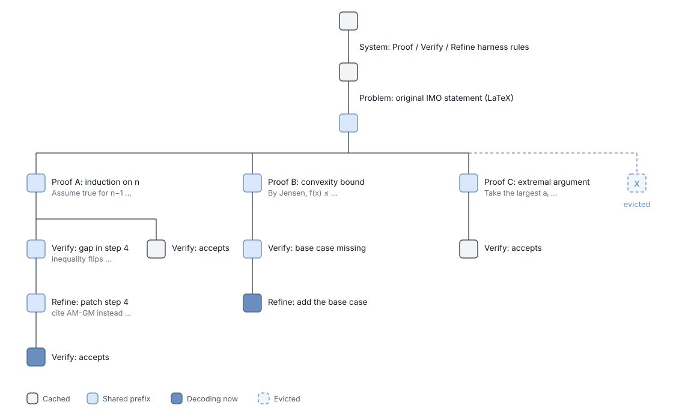

# dots3-note Preview：为了挑战 IMO，Infra 该做些什么？

推理这个词，存在两个不同的含义：一个是指为了完成高难度任务，LLM 需要收集环境反馈，进行深度推导，决定下一步行动，直到得出最终答案（Reasoning）；另外一部分则是我大多数时候的工作内容，对给定的 LLM 模型输入一段 prompt，得到模型的采样结果（inference）。比较好玩的是，很长一段时间，inference 对 Reasoning 是不太有感知的。具体来说，大概在 2024 年以前，reasoning 依赖的技术流派，诸如 chain of thought、tree of thought、recursive reasoning，按照现在的视角来看，其输出都是不够长的；而到了 2025 年 1 月，DeepSeek 公开了 long context reasoning 的秘密后，reasoning 的长度如同怪物般增长，也实质性给 inference 带来了压力。在这之后，如同大家见到的那样，SGLang 生态为了 long context reasoning 做出了许多新的技术设计，譬如为了 long context reasoning RL 需要支持 abort / partial rollout，为了存储恐怖的推理中间结果（rational）需要将 KV cache 一层一层向下存储...

2025 年 8 月，我在从家往返 SFO 的飞机上读完了 Kimi K1.5 的技术报告，写了这篇[Kimi K1.5: Long Context RL 的成功实践](../../rlhf/partial-rollout/readme.md)。一年半过去，long context 的量级竟然还能上升。K1.5/R1 时代，大家讨论的 reasoning，需要几分钟到几十分钟的 decode。而到了现在，2026 年的 8 月 14 日，小红书 dots studio 开源了成功挑战 IMO 赛题的 dots3-note Preview 模型。他们给出的推理开销是：ARC-AGI-3 规模的复杂任务需要 Agent 自主进行数千轮交互，完整运行时间可达 40 到 50 小时。

自然，这样的需求，对于 Infra 而言，带来了崭新的挑战。

## IMO 规模的数学问题解题思路

在 2025 年时，google OpenAI 等团队第一次公开挑战 IMO 赛题。让模型保证证明正确性，当时的主流做法是形式化验证：人工先把题面翻译成 Lean 一类的形式化语言，此后让模型在形式系统内求解，正确性由 lean 的完备性来保证。自然，真实世界里大量复杂问题是无法完整形式化的，这条路径的通用性较为受限。(当然，真实世界应该极少存在 IMO 问题 😂)

dots 这次则完全绕开了形式化，模型直接读取组委会提供的原始 LaTeX 输入，以 agentic 的方式端到端解题，结合自然语言推理并调用 Python 解释器完成解题（老实说我觉得如果真的是和人类选手掰腕子，调用 python 解释器似乎也不是完全合理）。既然失去了验证器这一层保障，证明的正确性只能由模型自己承担。dots 团队设计的 harness 为此拆成三个部分：Proof 生成候选证明，Verify 判断已有证明的正误并给出改进建议，Refine 针对 Verify 的意见继续修改；经过多轮并行推理、审查、修正与方案整合之后，形成最终提交评阅的证明。

这套 harness 的负载形状其实对 inference 反而是友好的，至少和 RadixTree 的目标非常契合：同一道题会派生出大量并行分支，而分支之间共享着系统提示、题面、乃至前若干版证明；Verify 环节要把一整份证明读进上下文才能产出一段 critique；Refine 环节又把 proof 和 critique 一起带上继续生成。换言之，这是一个树状展开、前缀高度共享、prefill 占比极高的负载。举一个不严谨的比方，这套 harness 是对 Tree of Thought 的现代复刻。

<div align="center">
  
</div>


## TEMPO：将自我评价纳入训练目标

Verify 如同我们所料见的一样，所有听上去用 prompt 就能控制的环境，经过训练后，效果都会有显著提升。为了强化模型具备评价自身方案的能力，dots 在 RL 阶段就把"评价当前状态"当作与"推进任务"并列的优化目标，方法叫 [TEMPO (Test-Time-Scaled Value Estimation with Macro-Step Policy Optimization)](https://studio.dots.ai/dots/tempo-blog.html)。

超长程 RL 有两点显著的困难。第一，反馈周期过长：最终奖励要等轨迹结束才能观测到，当一次 rollout 持续数十小时，任务本身的物理执行时间就构成了信号获取周期的下限。第二，信用分配困难：horizon 越长，早期决策与最终奖励之间隔着越来越长的行为链，也就更难判断哪些中间状态真正影响了结果。

一个自然的解决方向是，在轨迹尚未结束时提前估计当前状态的未来回报。无需等到最终结果出现，未完成的轨迹也能尽早产生训练信号，这正是 actor-critic 方案希望做到的事情。但传统 critic 的做法，是在模型上再外挂一个只输出分数的 value head：把当前状态输入给 value head，做一次 forward，得到标量估值就结束。value head 的单次预估实际上就是一次 forward，预估的计算量是固定的，当前模型的解题状态再难，预估也不会多想一步、多花一点算力。小红书团队指出，**当 actor 本身依赖 test-time scaling 才能解题时，估计它的中间状态同样是一个复杂推理问题**：critic 需要回顾交互历史、检查已经形成的假设、判断当前搜索方向是否可行、推演后续路径。因此，既然 actor 的能力可以随 test-time compute 增长，用于评价这些状态的 critic 也应具备同样的能力。

### macro-step

有了前文的铺垫，一个非常自然的想法是，将先前作为 critic 的简单 value head 更换为另一个生成模型，比如说用另一个体积更小的 reasoning LLM 来做 value head。如此一来，单次估值要生成一段较长的推理，可能还包含反思与工具调用，成本远高于 scalar head 的一次前向，因此它不可能像传统 critic 那样在每个 token 或每个动作之后密集运行。

TEMPO 的处理方式是把估值放在固定边界上，将连续 k 轮的模型—环境交互定义为一个 macro-step，估值只在终点做一次。作者给的理由是，在 Agent 任务中，有实际意义的状态变化通常发生在推理与工具调用完成、环境返回新观测之后，因此把多轮交互聚合起来，既给 actor 留出了完成一段完整探索的空间，也让 critic 能够在信息更充分的状态上估值。（PS：训练效率当然是另一个重要的考量 😂）

而 macro-step 除了是估值的边界之外，同时也是 rollout 与梯度更新的基本单位。GRPO 必须等待整条轨迹跑完、拿到最终奖励，才能算出 reward、做一次梯度更新；TEMPO 则在 macro-step 结束时就可以进行梯度更新，收集前一段内的环境奖励，加上 critic 对终点状态「后面还有多少 reward」的估值，来组成成这一段的完整 reward，不必等任务结束也能更新 actor。

| | 单次 rollout 长度 | 中间估值 | 覆盖完整 horizon 的方式 |
|---|---|---|---|
| GRPO | 完整 T 轮 | 无 | 每条轨迹都跑完 |
| PPO | 完整 T 轮 | scalar value head，沿途估计 | 每条轨迹都跑完 |
| TEMPO | 一个 macro-step，k 轮 | 生成式 critic，段末估一次 | 保存终点状态，跨多次更新逐步推进 |

对 Infra 而言，TEMPO 把一条 40 小时的轨迹拆成了若干个可以独立调度的段，每段都能立刻产出训练数据。这与 partial rollout 是同一条脉络上的东西，区别只在于 partial rollout 缓存的是未完成请求的生成状态，而 TEMPO 保存的是 actor 与环境的联合状态，且这样的联合状态是可以用作训练的。

### 生成式 critic 与特权信息

既然 critic 变成了一个会推理的模型，就得说清楚它到底读什么、写什么。critic 的输入是当前的 macro-step 终点状态，加上这一段乃至更早的交互记录；输出则是一整段推理，末尾附一个数值估计。它在这段推理里要回答的是三个问题：actor 目前已经摸清了环境的哪些规律，它正在尝试的方案是什么，以及还有哪些障碍没有解决。可以看出，这三个问题和一个人类 reviewer 拿到别人的实验记录后会问的问题几乎一样。

比较有意思的是，critic 还能读到 actor 完全看不到的东西，譬如环境的内部状态、隐藏规则、测试方案、乃至游戏源码。这些特权信息只进 critic 的上下文，绝不进 actor 的上下文，原因也很直白：一旦 actor 能读源码，它就不再需要探索了，整个训练目标会立刻退化成"抄答案"。而 critic 读源码则完全没有这个副作用，它本来就不负责解题，只负责判断 actor 的方向对不对，多一份 ground truth 只会让判断更准。

由此也能看出，"评价比生成更简单"这个假设在这里之所以成立，并不是因为评价这件事天生比生成简单，而是因为评价侧被允许使用生成侧拿不到的信息。换句话说，这个不对称不是能力上的不对称，是信息上的不对称，而这恰恰是 RL 里最好用的那种不对称：训练信号的质量可以高于 policy 本身的水平，模型才有可能被自己教会。

dots 团队给的"放置骑士"例子很能说明问题，游戏规则是棋盘上已有两枚预置棋子，actor 要再放六枚，要求任意两枚之间都不存在马步攻击关系，而规则事先并不告知，只能靠交互一点点试出来。他们从同一个 macro-step 起点采样了两条各 64 轮的轨迹，两条都没有拿到任何新的环境奖励，也就是说，如果只看环境反馈，这两条轨迹的价值应该是完全一样的。

但实际情况是，分支 A 从起始状态继承了一个错误假设，把"棋子之间存在攻击关系"当成了任务目标。这里值得注意的是，它对马步规则本身的理解完全正确，错的只是目标方向，于是它后续准备枚举的所有候选布局都要求盘面里存在攻击关系。critic 拿到游戏源码一对照就发现，这类布局根本不可能满足真实的完成条件，也就是说 actor 已经把全部五个正解都排除在了当前搜索空间之外，再跑多少轮都不会有结果。而分支 B 则回读了早期的交互记录，推翻了这个假设，转而去找"怎样保证棋子互不攻击"，并进一步发现同色格上的棋子不会形成马步攻击，据此写出的布局正是五个可行解之一。

于是两条轨迹的估值出现了显著差距，而这个差距完全不来自环境奖励。可见分支 A 犯的是"目标方向反了"这种整体性错误，它每一步的局部推理都自洽，唯有把整条轨迹放在一起、并且对照真实规则，才能看出问题出在哪里。这恰恰是一次固定算力的 forward 做不到的判断——value head 看到的是一个状态向量，它没有机会去"回读早期记录"，更没有机会去"对照源码验证"。

### critic 的训练

把 critic 换成生成模型之后，训练上出现了一个 value head 时代不存在的麻烦。value head 的训练是标准回归：给一个状态、给一个目标值，算 MSE，梯度直接落在 value head 那几层参数上，干净利落。但生成式 critic 输出的是一整段 token，其中只有末尾那个数字是有目标的，前面几千个 token 的推理过程没有任何监督信号。如果直接对末尾那个数字做回归，梯度基本只作用在最后几个 token 上，而我们真正想训的恰恰是前面那段推理，我们希望 critic 学会"怎么想"，而不是学会"蒙一个数"。

TEMPO 的解法是把价值拟合本身也变成一个 RL 问题，思路与 GRPO 完全一致。具体来说，先对同一个状态采 m 次独立估值，每次都是一整段推理加一个数字；然后按这个数字与目标值 V 的误差给每次采样一个 reward，误差越小 reward 越高；接着在这 m 个 reward 上做组内中心化，得到每条采样的 advantage；最后按 policy gradient 更新，梯度自然就落到了整段推理上。换句话说，critic 不是被"教"出正确答案的，而是被"奖励"出更好的思考方式的。

那么这里的目标值 V 又是从哪来的呢，TEMPO 用的是时序差分形式：对同一个起点采样 n 条 macro-step 轨迹，每条的回报由两部分组成，一部分是这一段里实际拿到的环境奖励，另一部分是 critic 对该段终点状态的估值，也就是"后面还能拿多少"；把这 n 条的回报取平均，就是这个起点的 value target。这里用 n 条取均值而不是单条，本质上是在做一次蒙特卡洛平滑，毕竟单条 macro-step 的回报方差不小。

还有一个容易被略过但相当关键的细节：估值误差要按当前状态尚可获得的回报跨度做归一化。举个具体的例子，假设一个任务总共 10 关，模型现在停在第 1 关，剩余回报空间是 9 关，那么估错 1 关只是 11% 的相对误差；而当模型已经推进到第 9 关，剩余空间只有 1 关，同样估错 1 关就是 100% 的相对误差。如果不做归一化，早期状态的绝对误差天然更大，梯度会被这些状态主导，模型在任务末期那些更精细的判断反而学不到。

最后还有一个 bootstrap 的问题，因为 TD target 里含有 critic 对终点状态的自估值，这就带来一个经典的鸡生蛋困境：训练初期 critic 什么都不会，它对终点状态的估值基本是噪声，而这个噪声会被当成目标的一部分去训前一个状态，前一个状态的估值又被当成目标去训更前一个状态，误差就沿着 macro-step 链条一路往回放大。TEMPO 的处理是先做一轮 value warm-up，离线采一批完整轨迹，直接按环境奖励算 Monte Carlo return，这个数字完全来自环境、不含任何 critic 的自估值，因此也就没有 bootstrap 误差；用它把 critic 训到大致靠谱之后，再切换到 TD 训练。

### actor 兼任 critic

到这里，一个很自然的疑问是：既然 critic 已经是一个会推理、会调工具的生成模型，那它是不是应该单独训一个模型？TEMPO 的答案是不需要，直接让 actor 兼任即可：执行 macro-step 时模型是 actor，到达段末边界之后，同一份权重换一套 prompt，就变成了 critic。

这么做的理由是两类任务所需的能力高度重叠，actor 要理解任务目标、跟踪环境变化、维护自己的假设、规划下一步动作，而 critic 要判断进展、识别哪些假设可能是错的、推演后面还有没有可行路径，这两件事需要的底层理解几乎是同一套。更重要的是，参数共享让两类训练信号可以互相迁移：actor 在交互中学到的环境理解和工具使用能力可以直接拿去估值，而 critic 在大量中间状态上练出来的"看出方向不对"的能力，会更新到同一组参数上，反过来让 actor 在行动时就更早地绕开死胡同。前面实验里"相同进度下步数更少"这个现象，大概率就来自这条回路。

对 Infra 而言这其实是个好消息，因为不用再多养一个 critic 模型，rollout engine 服务的仍然是同一份权重，只是请求分成了两类 prompt。当然坏消息是这两类请求的负载形状完全不同，actor 那一侧是长上下文加短输出的多轮交互，critic 那一侧是超长上下文加长输出的一次性推理，调度器要在同一个 batch 里兼顾这两种形状。

回到 IMO 那套 harness，Proof-Verify-Refine 之所以能拿满分，前提正在于此，因为模型并不是"一个会做事的 actor 加上一个会打分的 critic"拼出来的，而是同一个既会做事、又会评价自己的模型，Verify 环节做的事情本质上就是 critic 在训练里反复做的事情，只是评价对象从游戏状态换成了一份数学证明。

### macro-step 的策略梯度

这一节看上去是纯理论，但它回答的是一个相当实际的疑虑：TEMPO 每次只对一个 macro-step 做梯度更新，那它究竟还是不是在优化"整条轨迹的期望回报"这个原始目标？如果不是，那前面所有的设计都只是在优化某个替代目标，效果好也只能算撞上了。

dots 团队在附录里给了论证，思路是把完整轨迹按固定规则唯一地切分成 M 个连续的 macro-step，注意这个切分只是把同一组 state-action 对重新分组，并没有增删任何一项，因此完整轨迹的策略梯度可以原样按 macro-step 重新组织书写，整理之后得到的结论是：

> 在切分规则固定、macro-step 数 M 固定的前提下，完整轨迹的策略梯度等价于：均匀选取一个 macro-step，只计算这个 macro-step 的梯度，再乘以 M。

这个等价成立有一个前提，即被采样的 macro-step 以及它之前的那段前缀，都必须来自当前的 actor。而 TEMPO 的续跑机制恰好违反了这一点，因为被保存下来当作起点的前缀，是若干轮之前由旧版本 actor 生成的，起点的状态分布已经偏离了当前 actor 自己会走到的分布。dots 团队的处理是对前缀做重要性采样修正，也就是给这条样本乘上一个"新 policy 走到这个前缀的概率除以旧 policy 走到这个前缀的概率"的权重，把分布掰回来。

值得一提的是，K1.5 的 partial rollout 面对的其实是同一个问题：被缓存的那部分轨迹由旧 policy 生成，恢复之后用新 policy 续跑，严格来说已经不是 on-policy 了。当时 Kimi 的处理相对朴素，主要靠"偏离不大"的经验判断，而 TEMPO 把尺度推到了一条轨迹可能横跨十几次参数更新，偏离已经大到不能再用经验糊弄，也就必须给出正式的修正。

### 实验结果

dots 团队在 ARC-AGI-3 公开集上取了 25 个游戏，每个模型每个游戏跑 2 次，对比 TEMPO、从同一起点训练的 GRPO、以及未经 RL 的 base checkpoint。这里的 Score 同时衡量任务进度与动作效率，推进到更深的关卡得分更高，而在达到相同进度的前提下，用掉的环境交互越少得分越高。

在最多 2048 轮交互的预算下，GRPO 相比 base 有可观提升，说明短 rollout、不使用价值模型的 RL 本身就有收益；TEMPO 相比 base 提升 31.5%，在 GRPO 的基础上再提升 20.6%；而在把关卡通过率对齐之后，TEMPO 的 Score 仍然更高。最后这一条其实比第二条更有说服力，因为分数更高还可以用"探索得更多"来解释，但相同进度下用更少的步数就没法这么解释了，它说明模型确实更早地判断出了哪条路走不通，也就是 critic 那套判断能力真的泛化回了 actor 身上。

至于绝对位置，用官方评测代码的那套 harness 来看：

| 模型 | ARC-AGI-3（arcagi3 harness） | ARC-AGI-2 |
|---|---|---|
| dots3-note Preview | 6.9 | 81.4 |
| Claude Opus 4.8 | 1.5 | 72.1 |
| GPT-5.5 | 0.4 | 85.0 |

6.9 这个绝对值当然很低，但已经是次优的四倍多，而且需要注意的是，ARC-AGI-3 考察的是能否在陌生环境中自主学习，而 ARC-AGI-2 考察的是静态抽象推理，这是两种完全不同的能力，所以才会出现 dots3 在 ARC-AGI-2 上并不领先 GPT-5.5、在 ARC-AGI-3 上却拉开一个数量级这样的组合。

## 第二种形状：线性超长与测试时记忆

前面讲的 IMO 负载是树状的，深度有限而宽度极大，同一道题派生出的分支之间共享大量前缀。ARC-AGI-3 则是完全另一种形状：单条轨迹线性地跑几千轮，完整运行 40 到 50 小时，任务长度显著超过模型的上下文窗口。这两种形状对 Infra 的要求几乎是相反的，前者吃 prefill 和 prefix cache，后者吃 KV 容量和上下文管理，而后面整个 Infra 部分基本都是在处理后一种。

关于后一种形状，主 blog 里有一条观察值得单独拿出来：

> 只要任务长度显著超过模型的上下文长度，通过上述强化学习方法训练模型解决问题后，模型就能自行学会生成有助于未来决策的记忆。

也就是说，"写记忆"这个行为并没有被单独设计过奖励，它是被任务长度硬逼出来的。逻辑其实很朴素：上下文装不下整个任务，而完成任务又必须用到早期信息，那么能在有限上下文里活下来的策略，就只剩下"把关键结论压缩成短文本随身带着"这一种。blog 里给的 memory 片段先是提出假设：

```
Goal hypothesis: MERGE the two blues (overlap same cell).
Shortest path to overlap=10 moves, overlap at (1,5).
```

在若干轮验证之后，同一条记录变成了确认：

```
+- WIN CONDITION (CONFIRMED): MERGE the two blue tokens (get them to
   overlap/combine). When they merge, current_level advances (level solved).
```

坦诚说，在没有看到完整的 prompt 与 harness 设计之前，很难判断这里面有多少是模型自己长出来的、多少是 harness 的结构诱导出来的（毕竟一个带 `hypothesis` / `CONFIRMED` 字段的 memory 模板，写在 system prompt 里也完全说得通）。不过对 Infra 而言，这个机制的意义与它是不是"自发"其实无关，后面会看到，它直接决定了引擎能不能便宜地把历史扔掉。

## 上一代方案的边界

开篇提到的那些设计，无论是 abort、partial rollout，还是把 KV cache 一层层向下存储，其实都共享着一个从来没被写下来的隐含前提，即**一条轨迹的上下文始终装得进窗口**。partial rollout 缓存的是一条尚未跑完、但仍在窗口以内的序列；HiCache 把 KV 从 GPU 挪到 host 再挪到远端，挪的也是完整前缀的 KV，换回来之后直接接着用就行。换句话说，R1 那一代的 reasoning 再长，几十万 token 的 rational 也还在 context length 之内，工程上要解决的是"放不下显存"，而不是"放不下窗口"，前者是个存储层次问题，往下沉一层总有地方放。

而 40 到 50 小时、数千轮交互的 agent 直接击穿了这个前提，任务长度超过窗口之后，历史就必须被裁剪，而裁剪引发的问题与"显存不够"完全是另一类，后面会看到它连"往下沉一层"这条退路都没有。下面按三个层次展开：先算单请求的 KV 账，再看双几何给引擎带来的改动，最后处理超出窗口之后的 cache 失效。

## 一条 512K 请求要多少 KV

先看 [config.json](https://huggingface.co/dots-studio/dots3-note-prev/blob/main/config.json)，模型一共 46 层，其中 13 层 full attention、33 层 sliding window，节律基本是每四层一个 full。两类层虽然都是 MLA，几何却并不相同：

| | full 层（13 层） | SWA 层（33 层） |
|---|---|---|
| `kv_lora_rank` | 512 | 1024 |
| `qk_nope_head_dim` | 128 | 192 |
| `num_attention_heads` | 128 | 64 |
| `rope_theta` | 8e7 | 5e4 |
| sliding window | — | 513 |
| DSA indexer | 有，`index_topk=2048` | 无 |

MLA 之下，每 token 每层要存的 KV 字节数是 `(kv_lora_rank + qk_rope_head_dim) × dtype_size`，与 head 数完全无关，这是因为 MLA 落盘的是压缩后的 latent 向量，而把 latent 展开回每个 head 的 K 和 V 的那个矩阵是层的固定权重，每次前向现算，不进 cache。代入数字，BF16 下 full 层是 1152 字节，再加上 DSA index key 及其量化 scale 的 132 字节，合计 1284 字节，而 SWA 层是 2176 字节。可见，被称作便宜的 SWA 层每 token 反而更贵，它便宜在容量而不在宽度。把这两个数字和层数、序列长度乘开，一条打满 512K 的请求需要的 KV 是：

| 假想架构 | 单请求 KV | 相对 dots3 |
|---|---|---|
| 标准 MHA（128 head、head_dim 128） | 1472 GiB | 180x |
| 46 层全走 full MLA + DSA | 28.8 GiB | 3.5x |
| dots3 的 hybrid（13 full + 33 SWA） | 8.19 GiB | 1x |

其中 33 层 SWA 合计只有 40.6 MiB，而且是个常数，因为窗口 513 按 page 64 对齐到 576 个 token 之后，就与序列到底有多长彻底无关了；换算一下，8.19 GiB 里有 99.5% 都来自那 13 层 full。这张表基本上就是 512K 上下文何以可行的全部答案：标准 MHA 下单请求要 1.4 TiB，一张 H200 连一条都放不下；MLA 把宽度从"head 数的函数"变成"一个超参"，压到 28.8 GiB，仍然吃不消；再叠上 hybrid SWA，把 33 层的容量从"随序列增长"变成"常数 576 token"，才落到 8 GiB 这个可以工程化的量级。

顺着这个数字往下算并发，8 卡 H200 每卡 141 GiB，在 `--mem-fraction-static 0.87` 之下静态池约 122.7 GiB；BF16 权重 537 GiB 按 TP8/EP8 摊到每卡是 67.1 GiB；再给 CUDA graph 与 activation 留 8 到 12 GiB，剩下 43 到 47 GiB 归 KV。由于 recipe 开了 `--enable-dp-attention --dp-size 8`，attention 走的是数据并行，一条请求的 KV 完整落在某一个 rank 上而不切分，于是每卡大约能挂 5 条打满 512K 的请求，八个 rank 合计 43 到 46 条（这里的预留量是我拍的，实际取决于 `--cuda-graph-max-bs-decode` 与 chunked prefill 的 buffer，但量级不会差太多）。

43 条并发对应的是 `--max-running-requests 256` 这个设置，也就意味着实际负载中绝大多数请求远远没有打满窗口。对 IMO 那种树状负载而言这不成问题，分支虽多但每条都不长；而对 ARC-AGI-3 那种线性负载，这就是硬约束了，一台机器根本挂不住几百条 40 小时的轨迹，想扩并发只能扩机器。

## 双几何在引擎里的代价

上面那张几何对照表，对 SGLang 而言是个不小的麻烦，因为原有的 `SWAKVPool` 假设 full 层与 SWA 层共享同一套 KV 几何、仅仅是容量不同，所以内部两个池同类同参，只有 size 不一样；而 dots3 需要的是 full 侧走 `DSATokenToKVPool`、SWA 侧走 `MLATokenToKVPool`，且两侧的 `kv_lora_rank` 一个 512 一个 1024。对应到 [PR #33829](https://github.com/sgl-project/sglang/pull/33829)，一共有三处改动：

1. KV 池要能接受两组独立的 class 与 kwargs，见 [`_build_hybrid_mla_swa_kv_pool`](https://github.com/sgl-project/sglang/blob/4a4746c4a5d43a334abe368319f645634204a36e/python/sglang/srt/mem_cache/kv_cache_configurator.py#L1319)；
2. `pool_configurator` 里那行基于 `num_kv_heads × head_dim` 的 per-token 字节数公式，对 MLA 模型算出来的是个和真实占用毫无关系的数，需要按 `attention_arch` 分岔到 latent 公式，并把 DSA 的 index key 与量化 scale 显式计入；
3. attention backend 需要按 `layer.sliding_window_size` 逐层分派，full 层走 DSA 路径、SWA 层走窗口路径，见 [`DotsHybridAttnBackend`](https://github.com/sgl-project/sglang/blob/4a4746c4a5d43a334abe368319f645634204a36e/python/sglang/srt/layers/attention/dots_hybrid_backend.py#L35)。

MTP 那边还有一个连带问题，起因是 dots3 的 MTP 为全共享的一层，部署时 `--speculative-draft-model-path` 直接指向 target 自己，draft 模型是由同一份 config 改写出来的：引擎在派生 attention shape 之前，会把 `swa_*` 那套几何整体搬到无前缀的位置上（[`model_config.py#L602`](https://github.com/sgl-project/sglang/blob/4a4746c4a5d43a334abe368319f645634204a36e/python/sglang/srt/configs/model_config.py#L602)）。于是 draft 层实际上是一个 SWA 层，而原来的 pool configurator 把所有 EAGLE draft 层一律按 full attention 记账，结果是 draft 侧按 1284 字节乘 full 池容量超配了一大块，而这块超配又是从 target 的 KV 容量里挤出来的，两头都吃亏；修法则是在 spec 配置里记录有几层 draft 属于 SWA，让 configurator 分三类记账。值得注意的是，这个修改里并没有出现 `Dots3` 字符串，它修的是"draft 层的几何与容量是两个独立维度"这条通用事实，下一个 hybrid 模型进来就是现成的。关于 MTP 与 EAGLE 家族的更多讨论，可以参考[《slime 的 speculative decoding 支持》](../../rlhf/slime/spec/readme.md)。

## 超出窗口之后：裁剪与 cache 失效

blog 附录里 NL2repo 的评测配置，把长程 agentic 的上下文管理写得相当清楚：每个任务限 250 轮、10 小时，4 核 CPU、32 GB 内存，推理用 temperature 1.0、top-p 0.95、最大输出 49152 token、384K 上下文窗口。而其中最关键的是这一句：

> 当上下文超限时，裁掉较早的 reasoning 和过长的工具输入输出，但保留最新的 24 条消息以及完整的 tool-call / result 配对。

在还没触发裁剪的时候，agentic 负载对引擎其实相当友好。第 i 轮的 prompt 完整包含第 i-1 轮的 prompt，而 radix cache 是一棵前缀树，这种只往后长、不动前面的模式命中率接近 100%，每轮真正需要 prefill 的只有新增的那一小段，也就是工具返回加上模型这一轮的输出，量级在几千 token，所谓 agentic 负载看起来便宜，指的就是这个。

而一旦触发裁剪，情况不只是反转，还比"prefix cache 失效"要严重一个层次。裁掉较早的 reasoning，意味着序列中间被挖掉了一段，后面所有 token 的位置都要往前移；而 RoPE 编码的是绝对位置，**位置一变，被保留部分的 KV 本身就是错的**，它不是命中不了，而是根本不能用。所以裁剪必然伴随整个上下文的重新 prefill，任何层级的 cache 都救不了：HiCache 把 KV 挪到 host 或者远端在这里毫无意义，因为挪回来的是一批按旧位置编码好的 KV，位置对不上，拿回来也只能丢掉。

这也正是与上一代问题的分界线所在：R1 时代 KV 是存不下，答案是往下一层存储挪，挪到哪里它都还是有效的；而这里 KV 是失效，不是存不下，存储层次再深也没有用，只能重算。

这笔代价大致是可以估的，取 384K 窗口、每轮新增 3000 token（工具返回加模型输出，已经算保守）、裁剪后保留约 75%，那么首次触发大约在第 130 轮，此后每约 32 轮就要触发一次，每次需要重新 prefill 约 295K token；摊到每一轮上，平均 prefill 从 3000 token 升到约 12200 token，**是无裁剪情形的 4.1 倍**。这些假设当然都可以调，但结论的量级是稳定的：一条长轨迹的成本曲线并不是平的，而是一段廉价的增量 decode，被周期性的大规模重算反复打断；顺着这个结论往下，大概有三个方向值得想。

**其一，裁剪时不重编号位置。** 如果被保留 token 的 position id 维持原值、中间留出空洞，那么这些 token 的 KV 就仍然是有效的，重算的只有新增部分。从引擎的角度看这并不难做，SGLang 的 page table 本来就是按 block 任意 gather 的，positions 也是显式传进去的张量，让它跳号并不需要动核心数据结构。真正的障碍在模型侧：带空洞的 position id 对模型而言是 OOD 的，除非训练时就按这种方式构造过样本，否则效果无法保证。所以这是一个训练与 Infra 必须一起决定的接口，而不是引擎单方面能做的优化。

**其二，memory 机制降低了裁剪的代价。** 前面提到模型自发学会了把关键结论写进 memory，而从服务的角度看，memory 的价值并不止于"帮模型记住东西"，更在于它让"扔掉历史"这件事在语义上变得可以接受：关键信息已经被压缩成一段很短的文本，裁掉几十万 token 的原始交互并不会丢失决策依据。可见，训练侧长出来的这个能力，直接降低了推理侧的上下文管理成本，这是这份材料里我认为最值得注意的一处训练与 Infra 的耦合。

**其三，重算时 chunked prefill 的粒度是个全局问题。** recipe 里给的是 `--chunked-prefill-size 16384`，配合 `SGLANG_CHUNKED_PREFIX_CACHE_THRESHOLD=8192` 与 `SGLANG_MAX_KV_CHUNK_CAPACITY=8192`。295K token 的 prefill 如果不分块，会把同批次的 decode 请求饿死很久，而在一个只有四十几条并发的场景里，被饿死的恰恰是另外几十条同样已经跑了几十小时的轨迹，一次调度失误的代价被 wall-clock 放大了几个数量级。

## 重算的代价被架构削掉了大半

重算虽然躲不掉，但 dots3 的架构其实让它比想象中便宜不少。按 295K token 的重算来估算 attention 的打分量级，结果是这样：

| | 打分量（相对） | 占比 |
|---|---|---|
| 假想的 46 层全 dense | 7.6x | — |
| dots3 实际 | 1x | 100% |
| 　其中 33 层 SWA | | 1.7% |
| 　其中 13 层 DSA indexer | | 94.4% |
| 　其中 13 层 DSA 主 attention | | 3.9% |

道理不难看：33 层 SWA 的 attention 是 `O(L·W)` 而不是 `O(L²)`，而 W 只有 513，所以这 33 层在重算里几乎是白送的；13 层 full 的主 attention 又被 DSA 压到了 `O(L·topk)`，topk 为 2048，同样很便宜，两项叠加下来，整体比全 dense 省了 7.6 倍。

但真正有意思的是剩下那部分的构成：94.4% 的开销落在了 DSA 的 indexer 上。原因也很直接，indexer 要先用低维 head 对全部历史打一遍分，才谈得上从中选出 top-k，所以这一步仍然是 `O(L²)`，只不过用的是 64 头 128 维、比主 attention 的 128 头 192 维便宜约三倍而已。换句话说，**在长上下文重算这个场景里，DSA 从优化项变成了主要开销项**：它省掉的是主 attention 的二次项，自己却引入了一个新的二次项。若要为这类负载做 kernel 层面的优化，该动的显然是 indexer 的打分，而不是已经很便宜的主 attention。（需要说明，这一节与上一节的分析都是我从公开配置推出来的，dots 的 blog 并没有讨论裁剪对 cache 的影响，如果他们的实现对裁剪点做了特殊处理，结论会变。）

## 小 batch decode 与 MTP

前面算出的四十几条并发，直接决定了 decode 阶段的性质，即 **batch 小，decode 就是彻底的访存瓶颈**。每一步都要把 8 GiB 的 KV 完整读一遍，却只算四十几个 token 的 GEMM，算术强度低得可怜，Tensor Core 基本在陪跑。

而这恰恰是 MTP 收益最大的区间，因为投机采样的加速比在大 batch 下会被摊薄，因为那时 GEMM 已经吃满、瓶颈从访存转回算力，多验几个 token 是要额外付钱的；但在小 batch、访存受限的情况下，一次前向本来就要把 KV 全读一遍，顺手多验证几个 token 近乎白赚。recipe 里开的是 3 步 draft、4 个 draft token、eagle-topk 1，而 draft 模型就是 target 自己那一层全共享的 MTP，既不需要额外的 checkpoint，KV 也用 SWA 的几何与容量，量级只有几十 MiB，属于加了几乎不占地方的东西。

DSA 在 decode 阶段扮演的角色则与 prefill 时不同，decode 时 L 已经很大，主 attention 若不做稀疏化就得把全部历史读一遍，而 `index_topk=2048` 把这一步的读取量钉死在了常数，这对访存受限的 decode 是实打实的收益。至于那 33 层 SWA，本来就只看 513 个 token，topk 比整个窗口还大，再叠 DSA 不但没有收益，还要白白付出 indexer 的打分开销，所以模型只在 full 层挂 indexer 是对的。

## 稳定性与部署

一条要跑 40 到 50 小时的推理，对服务端最朴素的要求就是别崩、别卡死，[cookbook 脚本](https://github.com/sgl-project/sglang/blob/6ad3f2d8fdc8b0b0411746ef6f77f731b0339541/docs/cookbook/autoregressive/RedNote/Dots3-Note.mdx)里有几处设置很能说明问题。`--watchdog-timeout 1800` 与 `SGLANG_WARMUP_TIMEOUT=1800` 都是默认值的若干倍，原因前面已经算过，一次 295K token 的重算再叠上 DeepEP 的 all-to-all，单步耗时会远超常规负载，watchdog 卡太紧只会误杀正常请求。`--cuda-graph-backend-prefill disabled` 让 prefill 不进 graph，一方面变长 prefill 本就不适合 graph，另一方面该模型的 SWA 层在 prefill 走的是需要主机侧逐请求切序列尾巴的路径，本身也进不了 graph。`--cuda-graph-backend-decode full` 配 `--cuda-graph-max-bs-decode 32`，这个 32 与前面算出的 43 条并发恰好是同一量级，说明 graph 的覆盖范围是照着真实并发设的，而不是随手填的默认值。此外脚本还会按显存自动降级，低于 120 GiB 的卡如果不开 `--language-only`，就直接把 decode graph 关掉，因为 graph 显存与 KV 池抢的是同一块预算。

顺带一提，已合入的 cookbook 文档里明确写了 H100 跑不动 BF16 版本：8 卡合计 640 GiB，在 `--mem-fraction-static 0.87` 之下静态池约 557 GiB，而 BF16 权重本身就有 537 GiB，524288 上下文下压根没有可用的 KV 池，所以 H100 用户被直接指向 FP8。把一个不 work 的配置留在文档里、并且把账算给你看，这比悄悄删掉要有用得多。关于这类显存账的详细算法，可以参考[《当 SGLang OOM 的时候，究竟在 OOM 什么？》](../kvcache-code-walk-through/mem-fraction-static.md)。

## 训练侧：需要保存的不只是 KV

TEMPO 对 RL 系统提出的要求，与上面讨论的推理服务又是另一套。macro-step 的续跑机制要求引擎能保存并恢复 **actor 与环境的联合状态**，而这两半的难度完全不同。actor 那一半是熟悉的，rollout engine 把一个会话的完整交互历史 checkpoint 下来、下一轮从这里继续，partial rollout 早就处理过这类问题。环境那一半才是新东西：几千个并发的、各自带内部状态机的环境，要能被快照、被存储、被精确恢复到某个时刻，而且恢复出来的状态必须和保存时逐字节一致，否则 actor 续跑时看到的观测就和它当初的假设对不上了。ARC-AGI-3 这类游戏环境还算好办，而 dots 同期开源的 VibeLifeBench 那种带模拟时间线、22 个 mock 服务后端、288 个工具接口的环境，快照语义就复杂得多，光是"时间线走到哪一步"这件事就不是一个简单的序列化能覆盖的。

另一个材料里没有给出答案的问题则是方差控制，因为一条轨迹横跨十几次参数更新，意味着同一个任务的不同 macro-step 是由不同版本的 policy 生成的，而前面提到的那个重要性权重，其方差会随着版本差距增大而迅速增大，极端情况下少数几条样本的权重会主导整个 batch 的梯度。那么实践中究竟是限制一条轨迹最多跨多少次更新，还是对权重做 clip，抑或两者都有？这些才是真正落地时最难的部分，也是我最期待在技术报告里看到的内容。

## 结语

回到标题的问题上，为了挑战 IMO，或者更一般地说，为了支撑一条 40 到 50 小时的推理，Infra 需要做的事情大致可以归成三条。

第一是把 512K 上下文的 KV 从放不下变成放得下，而这一条主要由模型架构解决：MLA 把每 token 的宽度从 head 数的函数变成一个超参，hybrid SWA 又把 33 层的容量从随序列增长变成常数，两者叠加是 180 倍的差距。引擎要做的则是让两套不同的 latent 几何在 KV 池、显存记账、attention 分派这三个层面都各自正确，而这三处恰好是过去所有 hybrid SWA 模型都没有逼出来过的。

第二是接受并发只有四十几条这个事实，并围绕它重新调参。小 batch 意味着 decode 彻底访存受限，MTP 的收益因此被放大；也意味着一次几十万 token 的重算会拖住整台机器上其他所有长轨迹，chunked prefill 的粒度与 watchdog 的阈值都要按这个尺度重设，而不是沿用短请求时代的默认值。

第三是正视任务长度超出窗口之后的裁剪问题，而这并不是上一代"KV 存不下"的延续，那个问题的答案是把 KV 往下一层存储挪，而裁剪导致的是位置重编号之后 KV 直接失效，往哪挪都没用，只能重算。缓解方向目前看有两个，一是训练侧让模型学会写 memory，把扔掉历史的代价降下来，二是训练与推理一起约定不重编号位置，让引擎能保住被裁剪部分之后的 KV，其中前者 dots3 已经做到了，后者则还没有人做。

从 R1 到 dots3，一年半时间里 reasoning 对 inference 提出的要求变了两次，先是序列变长，答案是把 KV 往下沉；如今是任务长度超过窗口，而这一次的答案还没有定型。

## 参考资料

- [TEMPO: Test-Time-Scaled Value Estimation with Macro-Step Policy Optimization](https://studio.dots.ai/dots/tempo-blog.html)
- [dots 模型取得 IMO 2026 官方认证满分金牌成绩](https://studio.dots.ai/dots/imo-zh.html)
- [dots3-note Preview 官方 blog](https://studio.dots.ai/dots/dots3-zh.html)
- [VibeLifeBench](https://vibebench.github.io/VibeLifeBench_homepage/) 与 [VibeSearchBench](https://vibebench.github.io/VibeSearchBench.github.io/)
- [ARC-AGI-3 评测代码](https://github.com/harbor-framework/harbor/pull/2728)
- [HuggingFace: dots-studio/dots3-note-prev](https://huggingface.co/dots-studio/dots3-note-prev)、[GitHub](https://github.com/studio-dots-ai/dots3-note-prev)、[Transformers PR](https://github.com/huggingface/transformers/pull/47844)
- [SGLang PR #33829](https://github.com/sgl-project/sglang/pull/33829)
