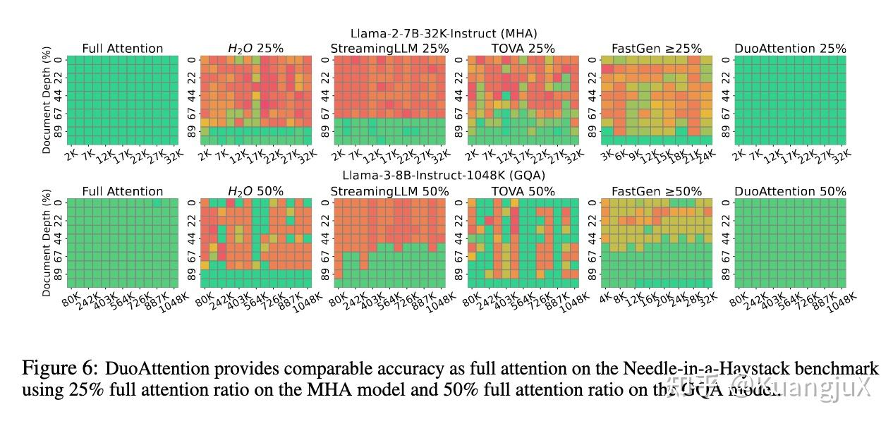
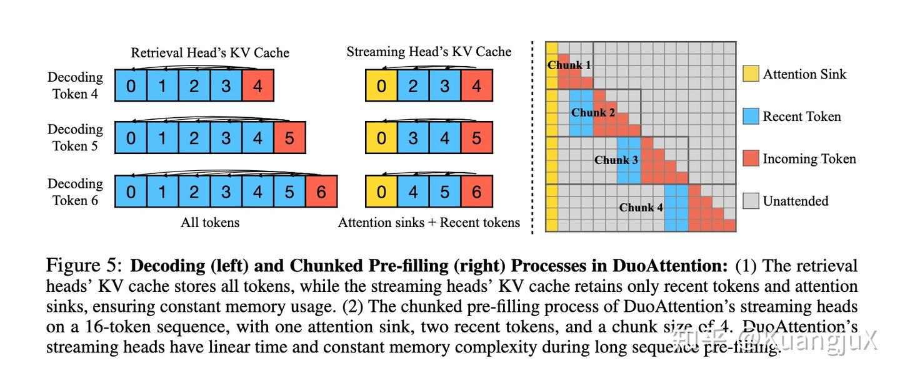
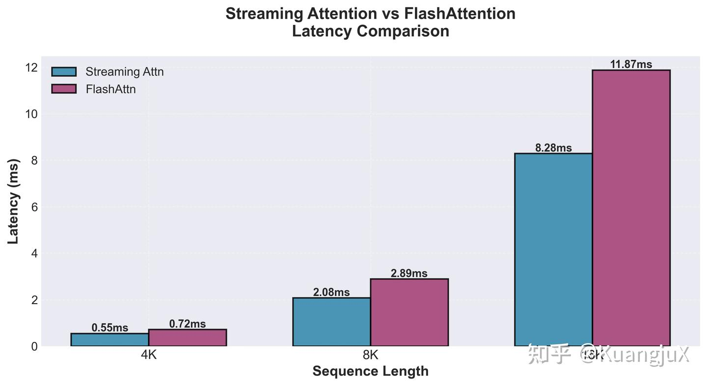

# Light-DuoAttention: 用 CuTeDSL 实现高效长上下文推理

## 引言：长上下文的挑战

想象一下，你正在使用一个大语言模型处理一份 100 页的技术文档，然后在文档的某个角落问它一个具体问题——这就是著名的"大海捞针"（Needle in a Haystack, NIAH）测试。对于现代 LLM 来说，处理这种长上下文场景既是机会也是挑战。

标准的 Attention 机制有一个众所周知的问题：它的计算复杂度是 O(n²)。当序列长度从 2k tokens 增长到 128k tokens 时，计算量会呈平方级增长，这对推理性能造成了巨大压力。

为了解决这个问题，MIT-Han-Lab 提出了一种名为 DuoAttention [1]的方法，其实在 DuoAttention 提出之前，MIT-Han-Lab 已经提出了一系列方法用于解决 Long Context Inference 推理的问题。

例如 StreamingLLM[2]发现了一种注意力汇聚（Attention Sink）的现象，少数初始词元无论其语义如何，都会持续获得相当一部分注意力分数。窗口注意力的失效正是由于移除了这些关键的注意力汇聚词元所致。StreamingLLM 通过在维护最新词元（recent tokens）的同时保留了注意力汇聚的 key-value 状态，从而可以在 training-free 的情况下在无限长度的序列上保持稳定的性能，同时将每个词元的计算复杂度降低到 O(1)。

另一个方案是 Quest[3]，与 StreamingLLM 不同，Quest 是一个动态的稀疏注意力方案，这意味着在运行时基于一些输入相关的函数自适应计算稀疏注意力掩码 M。同样，Quest 也是一种 training-free 的 key-value 选择方案。具体来说，Quest 将 KV Cache 分割成固定大小的页面，并追踪注意力的上下界，利用这些上下界来近似估计页面中可能的最高的注意力分数。在运行时仅加载估计注意力得分最高的 Top-K 个页面来执行稀疏注意力操作，从而显著降低内存消耗并加速注意力操作。由于页面得分与查询相关，因此如果新的查询重视某些词元，则之前不重要的词元也可以被重新召回，这使得 Quest 在注意力召回率方面超越了以往与查询无关的算法。

DuoAttention 是 StreamingLLM 的一个延续性工作，DuoAttention 认为 StreamingLLM 尽管性能很好，但是在长上下文的应用中通常会丢失准确性。同时也无法和 GQA[4]这些优化方法相配合。



**不同稀疏注意力方法在大海捞针测试中的准确率**

上图展示了 Full Attention，DuoAttention 与 StreamingLLM 等其他不同稀疏注意力方法在 Needle-in-a-Haystack 上的准确率测试。不过，与 StreamingLLM 不同，DuoAttention 是需要通过部分训练来获取参数。

## DuoAttention：混合注意力机制

### 核心思想

DuoAttention 的关键洞察是，LLM 能够被识别为两种类型的头，分别被称为检索头（Retrieval Heads）和流式头（Streaming Heads），检索头仅占一小部分，但需要对全部上下文进行处理；而流式头仅仅需要关注最近的词元（recent tokens）和注意力汇聚词元（attention sink）。DuoAttention 通过针对检索头和流式头的二分性，针对不同头使用不同的注意力，从而显著加速 LLM Inference 的 Prefill Decode 过程，并减少内存占用。



**DuoAttention 针对 Decode 和 Chunked Prefill 的处理流程**

DuoAttention 针对 Prefill 阶段和 Decode 阶段有不同的处理：

**Decode**：在 Decode 阶段，DuoAttention 为 LLM 的每一层分配两个 KV Cache，一个用于检索头，存储所有历史 KV；一个用于流式头，仅存储注意力汇聚和最近的词元，并保持大小恒定，当处理一个新词元的时候，Query，Key，Value 会沿着 Head 维度进行切分，分别计算检索头的完整注意力和流式头的流式注意力。最终按照 Head 维度连接起来得到输出投影。

**Prefill**：在 Prefill 阶段通过 Chunked Prefill 技术来降低内存峰值使用量，通过将一个长 prompt 使用一个固定大小的 chunks 来预填充 KV Cache。当 Chunked Prefill 计算出 Key-Value Pairs 的时候，流式头的 KV Cache 会立刻被修剪。在 Prefill 阶段，下一个传入词元块只会关注固定数量的上下文词元。设 n 为序列长度，c 表示分块大小，流式头的预填充复杂度从 O(n²) 优化到了 O(nc)，内存复杂度从 O(n²) 降低到 O(nc)。

除此之外，DuoAttention 需要通过训练来获得流式头和检索头的信息。DuoAttention 通过知识蒸馏进行训练，定义全注意力模型 M_teacher，定义使用 DuoAttention 的模型 M_student，通过 L2 范数来衡量两个模型输出的隐藏状态，两个模型差异越小，说明"学生"越像"老师"。DuoAttention 通过定义 L_distill 来表示该误差。

同时，DuoAttention 为了节省资源，通过引入一个门控值来决定哪些头开启全量计算，哪些可以简化。通过引入损失函数 L_sparse 通过 L1 正则化，"逼迫"模型在训练中尽可能将门控值变为 0。

最终 DuoAttention 通过总损失函数 L = L_distill + λ * L_sparse 来进行训练。通过调节 λ 的值来对训练目标进行选择，当 λ 小的时候，意味着更重要的目标是应当是准确度，当 λ 大的时候意味着牺牲一定准确度来维持稀疏性。

## Light-DuoAttention：用 CuTeDSL 实现

DuoAttention 本身 MIT-Han-Lab 官方有一个实现[5]，在这个实现中通过引入 Block-Sparse-Attention[6]中的 kernel 来实现 DuoAttention 的训练以及推理。然而当前的实现是在安培架构去实现的，因此我写了一个新仓库名为 Light-DuoAttention：

https://github.com/KuangjuX/light-duoattention

用来在 SM90 架构上实现了 Streaming Attention 和 DuoAttention，并在 H800 上进行了验证。最终将 light-duoattention 在 SGLang 中进行了支持，并使用 DuoAttention 官方为 LLama-3-8B 模型训练的参数进行验证，最终通过了一些测试验证了该算法的有效性。

首先说明，当前的 Light-DuoAttention 并不算一个极度优化的实现（当然我后续可能也会慢慢优化），所以可能并不适合在生产环境中使用。它更多地是帮助我从 Kernel 端到模型端去了解整个 SGLang 的流程，因此更多像一个实验性的项目。当前的 Light-DuoAttention 基于 FlashAttention 在 Hopper 中使用 CuTeDSL 的实现进行修改，接下来我将介绍整个 Light-DuoAttention 的项目以及它是如何在 SGLang 中运行的。

### 实现 Streaming Attention Kernel

首先，在正式实现 Kernel 之前我们需要使用 Pytorch 来创建一个引用实现，我们首先回顾一下 Streaming Attention，它包含两个关键组件：

1. **Sink Tokens（锚定 token）**：
   - 保留序列开头的 K 个 token（例如：前 32 或 128 个）
   - 这些 token 通常包含系统提示、指令等重要信息
   - 所有位置都能关注这些 sink tokens

2. **Recent Window（最近窗口）**：
   - 保留最近的 W 个 token（例如：最近 256 或 512 个）
   - 捕获局部上下文信息
   - 对于因果推理，使用滑动窗口

因此在 PyTorch 最重要的部分就是构建掩码，并将掩码应用到 Attention Score 中：

```python
beyond_causal = col_idx > row_idx
outside_window = torch.logical_and(
   col_idx < row_idx - (local_size - 1), col_idx >= sink_size
)
mask = torch.logical_or(beyond_causal, outside_window)
```

然而，FlashAttention3 并非如 PyTorch 一样是直接将掩码应用在注意力分数中，而是通过分块对 Q，K，V 进行计算，因此当我们应用掩码的时候，需要同时对块内掩码以及块间掩码进行考虑：

- **块内掩码**：针对块内掩码，我们需要修改 `mask.py` 找到当前线程所持有的寄存器在整个 Attention Score 中的绝对位置，并根据位置进行原地的掩码应用。

- **块间掩码**：针对块间掩码，我们需要修改 `block_info.py` 来获取能够应用 Attention Sink 和 Recent Tokens 的块。

一个简单的 `apply_streaming_mask` 实现如下：

```python
# Step 3: Apply masking rules using direct, absolute positions
should_mask = True

# Rule A: Is the key within the sink?
is_in_sink = k_pos < self.sink_size

# Rule B: Is the key within the sliding window?
is_in_window = True  # Default to true if no window size is specified
if cutlass.const_expr(self.window_size_left is not None):
    is_in_window = k_pos >= q_pos - self.window_size_left
    
# Rule C: Is the connection causal?
is_causal = k_pos <= q_pos 

# An element is NOT masked if it's causal AND (it's in the sink OR it's in the window)
if is_causal:
    if is_in_sink or is_in_window:
        should_mask = False

# Rule D: Padding mask (optional, based on sequence lengths)
if cutlass.const_expr(mask_seqlen):
    # Note: self.seqlen_q is the length of the current Q chunk, not total length
    # The q_pos check is implicitly handled by the launch grid.
    # We only need to check k_pos against the total key length.
    if k_pos >= self.seqlen_k:
        should_mask = True
        
# Step 4: Apply the mask if needed
if should_mask:
    acc_S[i] = -cutlass.Float32.inf
```

### 支持 Chunked Prefill

为了支持 Chunked Prefill，我们需要额外引入一个名为 `position_ids` 的变量，含义为当前 Query 中的位置编号。这是由于，当我们计算 Chunked Prefill 的时候，每次处理只能拿到 Query 的相对位置而不是绝对位置，这样当我们去计算要不要为 Attention Sink 支持，我们无法通过相对位置来判断当前结果是否在 Attention Sink 的区域内。因此，我们需要 `position_ids` 来去首先找到当前结果所在的绝对位置，随后再去进行掩码处理。

## 在 SGLang 中支持 DuoAttention

最后，我们需要在 SGLang 中支持 DuoAttention 并运行 LLama-3-8B 模型，当前我们使用 DuoAttention 代替了原生 SGLang 的 Prefill 阶段，原生 SGLang 的 Prefill 实现在 `FlashAttentionBackend` 中的 `forward_extend` 中，我们需要定义一个新的参数 `enable_duo_attn`，当开启这个参数的时候，我们执行 DuoAttention。我们需要从 Query，Key，Value 中对多头进行检索头和流式头的切片，并在最终进行连接（Concat）结果并获得最终结果。

这里值得注意的一点是，在原文中有提到：

> Before deployment, we preprocess the model by reordering the output channels of the Query, Key, and Value projection weights according to the attention head assignments. This reordering groups retrieval heads and streaming heads into two distinct, consecutive clusters, allowing for efficient slicing and concatenation operations when managing the KV cache for these two types of heads within a layer, rather than relying on scattering and gathering operations.

为了方便且高效地进行切片和连接操作，我们需要预先对 Query，Key，Value 以及 Output 进行重新排列，将流式头和检索头放到两个不同的连续簇中，这样就不需要进行 Scatter 以及 Gather 操作了。在 SGLang 中，我们将这个阶段放到 `ModelRunner` 中进行处理:

```python
for i, layer in enumerate(layers):
    attn = layer.self_attn
    
    # --- 1. Define Head Patterns and Indices ---
    # kv_pattern defines which KV head group is full (1) or streaming (0)
    kv_pattern = torch.tensor(full_attention_heads[i], device=device, dtype=torch.int)
    assert len(kv_pattern) == num_kv_heads, \
         f"Layer {i}: kv_pattern length mismatch"
    
    # Get the indices for full and streaming KV heads
    kv_full_indices = torch.where(kv_pattern == 1)[0]
    kv_stream_indices = torch.where(kv_pattern == 0)[0]
            
    # Expand the KV pattern to the Q heads
    q_head_pattern = torch.repeat_interleave(kv_pattern, repeats=gqa_group_size)
    q_full_indices = torch.where(q_head_pattern == 1)[0]
    q_stream_indices = torch.where(q_head_pattern == 0)[0]

    # --- 2. Reorder Q, K, V Projection Weights ---
    # For models with a combined QKV projection matrix (e.g., Llama)
    if hasattr(attn, 'qkv_proj'):
        qkv_weight = attn.qkv_proj.weight.data
        q_size = num_heads * head_dim
        k_size = num_kv_heads * head_dim
        v_size = num_kv_heads * head_dim

        # --- Reorder Q weights ---
        w_q = qkv_weight[:q_size, :]
        w_q_reshaped = w_q.view(num_heads, head_dim, hidden_size)
        w_q_reordered = torch.cat([
            w_q_reshaped[q_full_indices],
            w_q_reshaped[q_stream_indices]
        ], dim=0).view(q_size, hidden_size)

        # --- Reorder K weights ---
        w_k = qkv_weight[q_size : q_size + k_size, :]
        w_k_reshaped = w_k.view(num_kv_heads, head_dim, hidden_size)
        w_k_reordered = torch.cat([
            w_k_reshaped[kv_full_indices],
            w_k_reshaped[kv_stream_indices]
        ], dim=0).view(k_size, hidden_size)

        # --- Reorder V weights ---
        w_v = qkv_weight[q_size + k_size :, :]
        w_v_reshaped = w_v.view(num_kv_heads, head_dim, hidden_size)
        w_v_reordered = torch.cat([
            w_v_reshaped[kv_full_indices],
            w_v_reshaped[kv_stream_indices]
        ], dim=0).view(v_size, hidden_size)
                
        # Combine back into a single QKV weight
        new_qkv_weight = torch.cat([w_q_reordered, w_k_reordered, w_v_reordered], dim=0)
        attn.qkv_proj.weight.data = new_qkv_weight

    # --- 3. Reorder O Projection Weights ---
    o_weight = attn.o_proj.weight.data
    # Input to o_proj is concatenation of head outputs. We need to reorder the columns.
    o_weight_reshaped = o_weight.view(hidden_size, num_heads, head_dim)
    o_weight_reordered = torch.cat([
        o_weight_reshaped[:, q_full_indices, :],
        o_weight_reshaped[:, q_stream_indices, :]
    ], dim=1).view(hidden_size, q_size)
    attn.o_proj.weight.data = o_weight_reordered
```

## 实验与性能评估

在 Kernel 层面我们验证了 Streaming Attention 在各种情况下的正确性，包括 Chunked Prefill，Paged Attention 以及在 GQA 情况下的正确性。

在端到端模型推理层面，我们在 LLama-3-8B 上应用了 DuoAttention 训练出的参数并执行了 NIAH 测试，执行效果 DEMO 如最上所示。除此之外，我还在知识问答，英文翻译，创业写作等方式对 DuoAttention 进行测试，均取得了不错的效果。

除此之外，我们还将 Streaming Attention 与 FlashAttention 做了一个简单的性能评估，评估结果如下：



当前的实验配置为单卡 H800，sink_size=128, recent_token=256。

## 参考

[1] Xiao G, Tang J, Zuo J, et al. Duoattention: Efficient long-context llm inference with retrieval and streaming heads[J]. arXiv preprint arXiv:2410.10819, 2024.

[2] Xiao G, Tian Y, Chen B, et al. Efficient streaming language models with attention sinks[J]. arXiv preprint arXiv:2309.17453, 2023.

[3] Tang J, Zhao Y, Zhu K, et al. Quest: Query-aware sparsity for efficient long-context LLM inference[J]. arXiv preprint, 2024.

[4] Ainslie J, Lee-Thorp J, De Jong M, et al. Gqa: Training generalized multi-query transformer models from multi-head checkpoints[J]. arXiv preprint arXiv:2305.13245, 2023.

[5] https://github.com/mit-han-lab/duo-attention

[6] https://github.com/mit-han-lab/Block-Sparse-Attention
