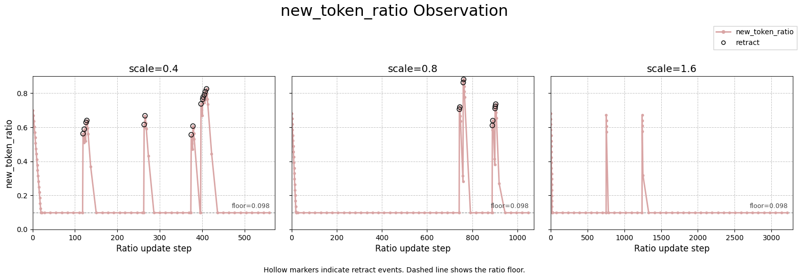

# MiniSGL in Practice

## 引言

25 年开始打鱼晒网式学习 SGLang，先尝试写了一个小 toy：[baby-sglang](https://github.com/baby-llm/baby-sglang)，随后给 Mini-SGLang 提了 3 个 PR，分别聚焦在[调度优化](https://github.com/sgl-project/mini-sglang/pull/97)、[E2E constrained decoding](https://github.com/sgl-project/mini-sglang/pull/118) 和 [新 model 接入](https://github.com/sgl-project/mini-sglang/pull/115)，也算是对 LLM 推理有了一些感悟和经验。
都说最好的学习方式是动手和输出，所以分享出来，希望对新入门的朋友有所帮助。

## Overview

Mini-SGLang 整体架构和 SGLang 早期版本保持一致，但代码十分优雅凝练。

<div style="text-align: center;">

</div>

不过 Code Agent 时代，泛泛而谈地解读代码逻辑已无太大必要，所以让我们直接看具体的某个 feature 在解决什么问题以及这个问题为什么存在。

## Schedule Policy

Mini-SGLang 的调度层写得非常简单，支持 overlap scheduling、prefill batch 优先、支持 chunked prefill，并通过估计剩余可用 KV cache 来决定新 request 是否准入。
这些都和 SGLang 保持一致。

但原始 Mini-SGLang 在估计 running batch 未来还需要多少 KV cache 时，默认每个 request 都会一直输出到 `max_tokens`。这个策略显然过于保守。

因此第一个 PR 的思路非常明确：基本复制 SGLang 的 `new_token_ratio` 策略: 用一个比例因子估计未来 token 数，decode 成功时逐步变乐观；如果过于乐观导致 OOM，就 retract 一些 running request，再把估计调保守一点。[sglang-scheduler](https://github.com/zhaochenyang20/Awesome-ML-SYS-Tutorial/tree/main/sglang/sglang-scheduler) 中将其类比 `Congestion Avoidance` 还挺贴切。

```python
# 对应代码：
# sglang@62c505a python/sglang/srt/managers/scheduler.py:2548 get_new_batch_prefill
# sglang@62c505a python/sglang/srt/managers/scheduler.py:2837 update_running_batch
# sglang@62c505a python/sglang/srt/managers/schedule_policy.py:425 PrefillAdder
# sglang@62c505a python/sglang/srt/managers/schedule_batch.py:2346 check_decode_mem / 2363 retract_decode
# sglang@62c505a python/sglang/srt/managers/scheduler_components/new_token_ratio_tracker.py:41

def schedule_one_iter():  # scheduler 主循环的一轮；这一轮要么跑 prefill/extend，要么跑 decode
    new_batch = get_new_batch_prefill()  # new_batch 是本轮准入的新 prefill batch；来自 waiting_queue
    if new_batch is not None:  # 只要本轮能 admit 新请求，SGLang 会优先跑 extend/prefill
        return run_extend(new_batch)  # run_extend 计算 prompt/chunk KV；完成后这些 req 会并入 running_batch
    running_batch = update_running_batch(running_batch)  # running_batch 是已经 prefill 完、正在 decode 的请求集合
    return run_decode(running_batch)  # run_decode 给 running_batch 中每个活跃请求生成下一步 token

def get_new_batch_prefill():  # 从 waiting_queue 中挑一批请求进入 prefill
    policy.calc_priority(waiting_queue, running_batch)  # waiting_queue 是未 prefill 的请求；policy 可能是 FCFS/priority/LOF
    adder = PrefillAdder(running_batch, new_token_ratio)  # adder 维护本轮剩余 KV 预算；new_token_ratio 是 running 未来输出比例
    for req in waiting_queue:  # req 是候选新请求；例如一个 prompt 还没进入模型的用户请求
        if adder.budget_state() != AddReqResult.CONTINUE:  # budget_state 检查 token budget、chunk budget、KV budget 是否还有余量
            break  # 当前预算已经不足，停止继续 admit waiting request
        res = adder.add_one_req(req)  # add_one_req 做准入检查；成功时写入 can_run_list 并更新 KV/token 预算
        if res != AddReqResult.CONTINUE:  # res 表示是否还能继续 admit；NO_TOKEN 代表 KV 预算不够，OTHER 代表请求数/chunk 等限制
            break  # 当前 req 或当前 batch 已到边界，停止继续扫描 waiting_queue
    can_run_list = adder.can_run_list  # can_run_list 是这轮真正执行 prefill 的请求集合
    if len(can_run_list) == 0:  # 没有任何请求通过准入时，本轮不会跑 prefill
        return None  # 返回 None 后 scheduler 会转去 update_running_batch / decode
    waiting_queue = [req for req in waiting_queue if req not in can_run_list]  # 已准入请求从 waiting_queue 删除，避免重复调度
    return ScheduleBatch.init_new(can_run_list)  # ScheduleBatch 会准备 extend metadata 并进入 forward

def update_running_batch(batch):  # decode 前检查 running batch 是否还能继续前进
    if batch.check_decode_mem():  # check_decode_mem 只检查下一步 decode 所需 KV 是否能分配
        new_token_ratio.decay_step()  # decode 成功后 ratio 下降，系统变得更乐观，后续 prefill 更容易准入
        return batch  # batch 不变，继续正常 decode
    retracted, ratio = batch.retract_decode()  # retracted 是被撤回的请求；ratio 是按剩余 batch 重新估计的新比例
    waiting_queue.prepend(retracted)  # 被撤回请求回到 waiting_queue，之后需要重新 prefill 或继续 chunk
    new_token_ratio.current = ratio  # ratio = (已生成 token + k * req 数) / max_new_tokens 总和
    return batch  # batch 已被 filter，只保留没有被撤回的 running req
```

vLLM 采用了一种不同的设计：先保 running decode，再用本轮 token budget admit waiting request，可以理解为 decode first + 被动撤回。

```python
# 对应代码：
# vLLM@470229c vllm/v1/core/sched/scheduler.py:393 running requests
# vLLM@470229c vllm/v1/core/sched/scheduler.py:586 waiting requests
# vLLM@470229c vllm/v1/core/kv_cache_manager.py:244 allocate_slots

token_budget = max_num_scheduled_tokens  # 本轮最多调度多少 token；decode 通常每个 req 1 token，prefill 可能是一个 chunk

for req in running:  # vLLM 先调度已经 running 的请求，避免 decode 被新 prefill 长时间饿死
    num_new_tokens = req.num_tokens_with_spec - req.num_computed_tokens  # 这个 req 还差多少 token 没算；decode 常见为 1，chunked prefill 可能更大
    num_new_tokens = min(num_new_tokens, token_budget, long_prefill_threshold)  # token_budget 是全局预算；long_prefill_threshold 用来切长 prefill
    blocks = kv_cache_manager.allocate_slots(req, num_new_tokens)  # 只为本轮要计算的 token 分配 KV block，而不是估计所有未来输出
    while blocks is None:  # KV block 不够
        victim = choose_preempt_request(running)  # FCFS 下通常 preempt running 队尾；priority 模式按优先级
        preempt(victim)  # victim 回到 waiting queue，释放 KV
        blocks = kv_cache_manager.allocate_slots(req, num_new_tokens)  # 释放后再试
    schedule(req, num_new_tokens)  # req 本轮被调度
    token_budget -= num_new_tokens  # 消耗本轮 token budget

for req in waiting:  # running 调完后，再尝试 admit waiting request
    cached = get_prefix_cache_hit(req)  # prefix cache 命中 token 数；命中部分不用重新算
    num_new_tokens = req.num_tokens - cached  # 新请求需要 prefill 的 token 数
    num_new_tokens = min(num_new_tokens, token_budget, long_prefill_threshold)  # 受本轮 token budget 和 chunk 阈值限制
    blocks = kv_cache_manager.allocate_slots(req, num_new_tokens, full_sequence_must_fit=reserve_full_isl)  # 按本轮 chunk 分配；可选要求整条序列能放下
    if blocks is None:  # waiting req 放不下
        break  # 停止 admit 新请求
    running.append(req)  # admit 成功后进入 running
    schedule(req, num_new_tokens)  # 本轮执行它的 prefill chunk
    token_budget -= num_new_tokens  # 更新本轮预算
```

调度策略是一个多目标联合优化问题，SGLang 显然偏向 TTFT，vLLM 则偏向 TPOT，具体在不同场景下哪种策略更优还需要系统地 benchmark。

将 SGLang 的逻辑迁移到 Mini-SGL 实现起来也不复杂，关键代码如下。

### new_token_ratio

[`python/minisgl/scheduler/decode.py`](https://github.com/YzXiao101/mini-sglang/blob/a115a17b2f84f0092b7a283efcf4534471eaaf3b/python/minisgl/scheduler/decode.py#L27-L71)

```python
def estimated_inflight_tokens(self, reqs: Iterable[Req]) -> int:
    reserved_size = 0
    for req in reqs:
        if req.sampling_params.ignore_eos:
            tail_est = req.remain_len
        else:
            tail_est = math.ceil(
                min(req.remain_len, self.clip_max_new_tokens) * self.new_token_ratio
            )
        reserved_size += alloc_delta(
            req.cached_len, req.extend_len + tail_est, self.page_size
        )
    return reserved_size

def on_decode_success(self) -> None:
    self.new_token_ratio = max(
        self.min_new_token_ratio,
        self.new_token_ratio - self.new_token_ratio_decay,
    )

def on_retract(self, reqs: Iterable[Req]) -> None:
    reqs = list(reqs)
    decoded_tokens = sum(len(req.input_ids) - req.prompt_len for req in reqs)
    total_tokens = sum(req.max_device_len - req.prompt_len for req in reqs)
    self.new_token_ratio = min(
        1.0,
        (decoded_tokens + self.retract_decode_steps * len(reqs)) / total_tokens,
    )
```

### Prefill Admission

[`python/minisgl/scheduler/prefill.py`](https://github.com/YzXiao101/mini-sglang/blob/a115a17b2f84f0092b7a283efcf4534471eaaf3b/python/minisgl/scheduler/prefill.py#L40-L185)

```python
def _get_required_size(self, req: PendingReq, cached_len: int, chunk_size: int) -> int:
    if cached_len + chunk_size < req.input_len:
        added_len = chunk_size
    elif req.sampling_params.ignore_eos:
        added_len = chunk_size + req.output_len
    else:
        added_len = chunk_size + min(req.output_len, self.clip_max_new_tokens)
    return alloc_delta(cached_len, added_len, self.cache_manager.page_size)

def _can_add_one(self, req: PendingReq, cached_len: int) -> int | None:
    chunk_size = min(self.token_budget, req.input_len - cached_len)
    required_size = self._get_required_size(req, cached_len, chunk_size)
    return (
        None
        if required_size + self.reserved_size > self.cache_manager.available_size
        else required_size
    )

adder = PrefillAdder(
    token_budget=prefill_budget,
    reserved_size=self.decode_manager.estimated_inflight_tokens,
    clip_max_new_tokens=self.decode_manager.clip_max_new_tokens,
    cache_manager=self.cache_manager,
    table_manager=self.table_manager,
)
```

Callout：这里 `reserved_size` 来自 running batch 的估计，但 pending req 的 `_get_required_size` 仍然按 `output_len` 或 `clip_max_new_tokens` 最保守地预留。

### Decode Retraction

[`python/minisgl/scheduler/decode.py`](https://github.com/YzXiao101/mini-sglang/blob/a115a17b2f84f0092b7a283efcf4534471eaaf3b/python/minisgl/scheduler/decode.py#L111-L156)

```python
if self._check_decode_mem(self.cache_manager.available_size):
    self.estimate_policy.on_decode_success()
    return Batch(reqs=list(self.running_reqs), phase="decode")

retracted_reqs = []
while not self._check_decode_mem(
    self.cache_manager.available_size,
    steps=self.estimate_policy.retract_decode_steps,
):
    req = min(
        self.running_reqs,
        key=lambda req: (len(req.input_ids) - req.prompt_len, -req.prompt_len, req.uid),
    )
    self.running_reqs.remove(req)
    req.is_retracted = True
    self.table_manager.free(req.table_idx)
    self.cache_manager.cache_req(req, finished=True)
    retracted_reqs.append(req)
prefill_manager.requeue_reqs(retracted_reqs)

batch = Batch(reqs=list(self.running_reqs), phase="decode")
self.estimate_policy.on_retract(batch.reqs)
return batch
```

### Benchmark

对 Mini-SGL 的 benchmark 代码稍作改造后，在 4090 单卡上跑 Qwen/Qwen3-0.6B benchmark 如下。


同时在不同负载下，`new_token_ratio` 随 ratio update step 的变化曲线如下。空心点表示发生 retract。



结果比较符合直觉
- wildchat 数据集里请求真实输出只占 `max_new_tokens` 预算的约 `32%`，原始 worst-case reserve 确实会造成大量 KV cache 浪费。
- new_token_ratio 策略的引入在不同负载下都改善了吞吐和 TTFT，但 TPOT 因为 prefill first 和 batch_size 增大有一定劣化。
- new_token_ratio 大多在前几十到数百次 ratio update 后收敛到 floor value；发生 retract 时会被临时拉高，然后再次 decay 到 floor。

当然上述结论都只是在一个固定数据集负载、小模型、单卡上浅尝辄止的结果。

## [WIP] E2E Constrained Decoding

## [WIP] Gemma 3 Integration