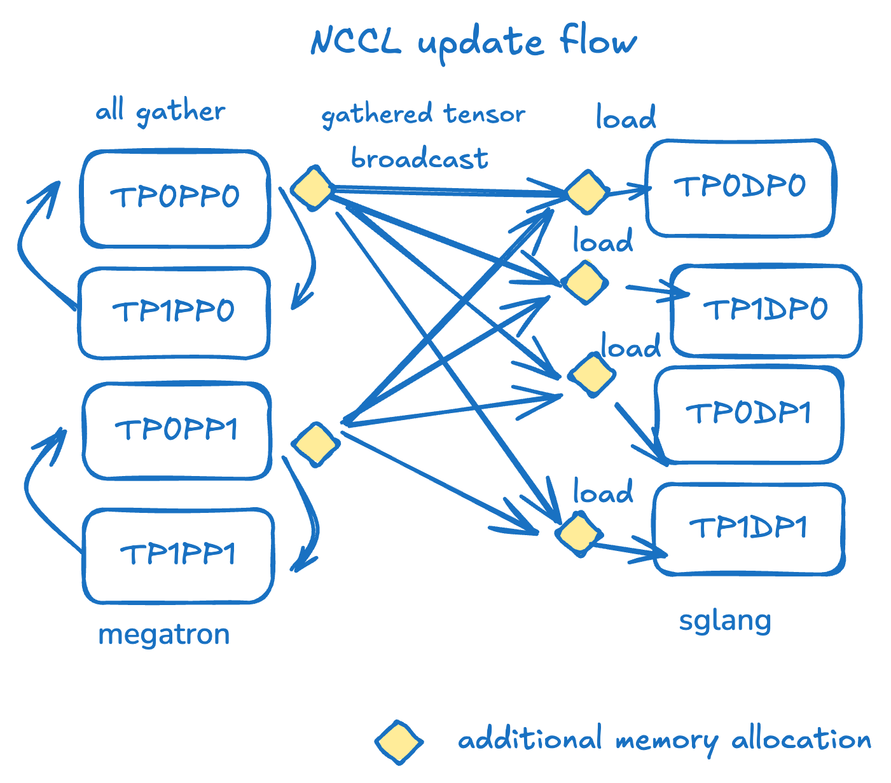
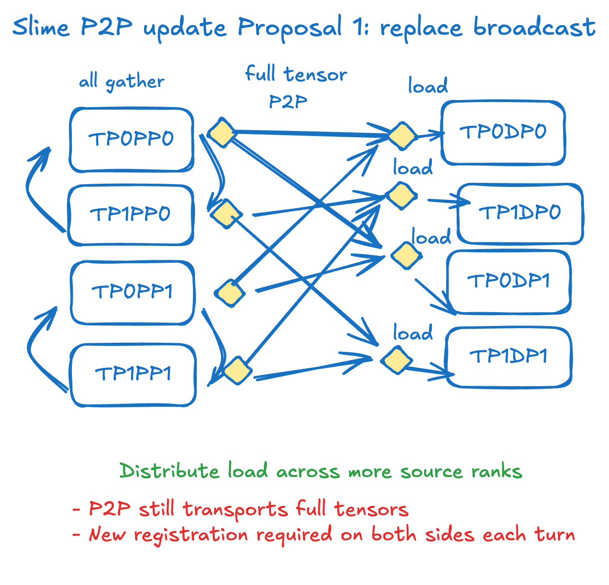
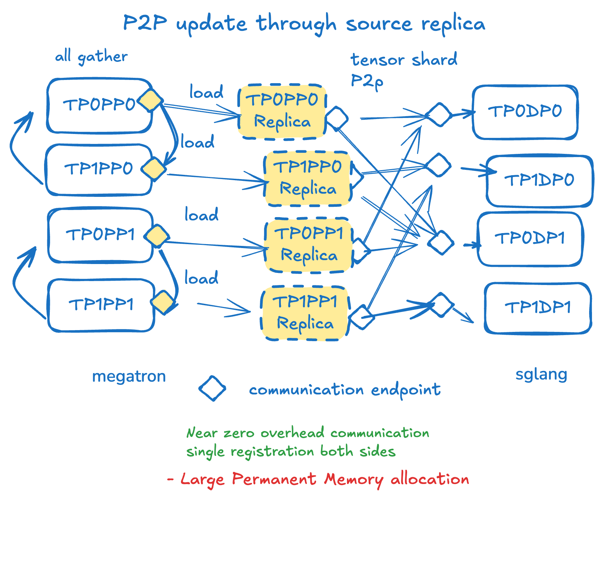
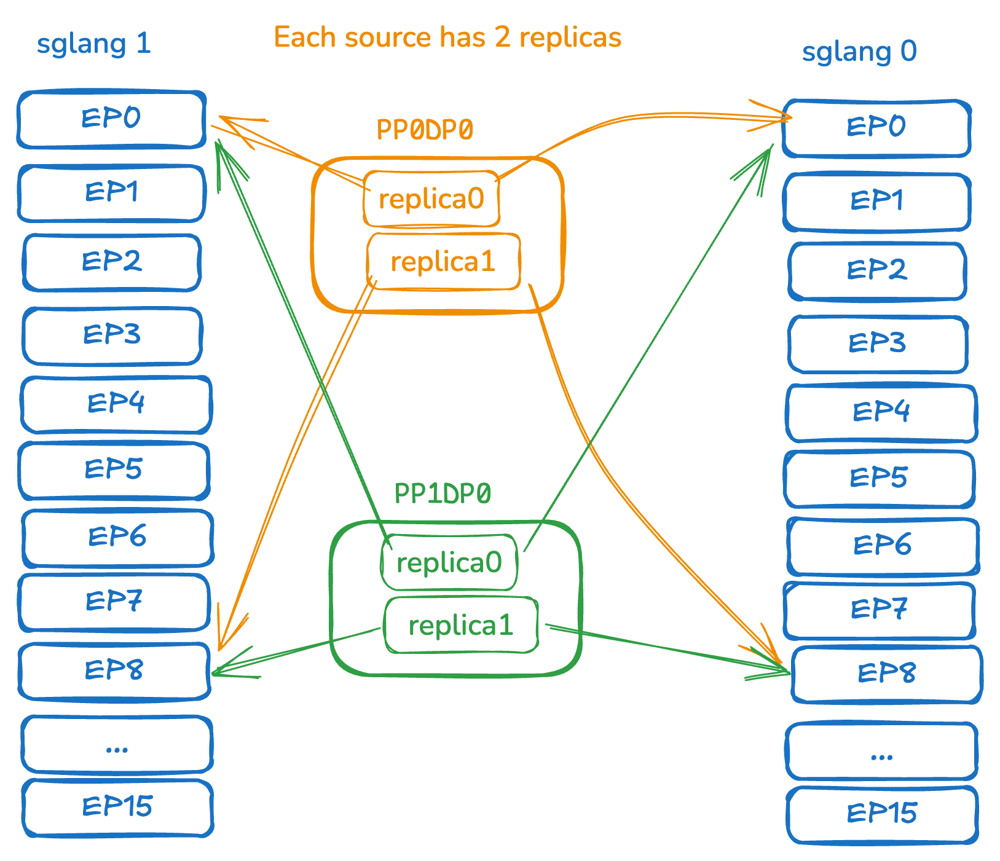
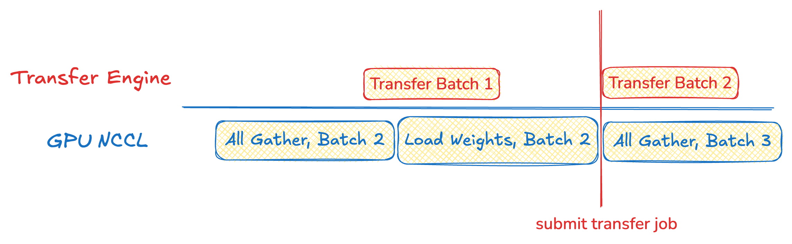
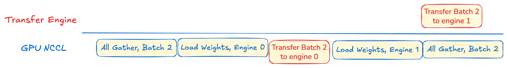
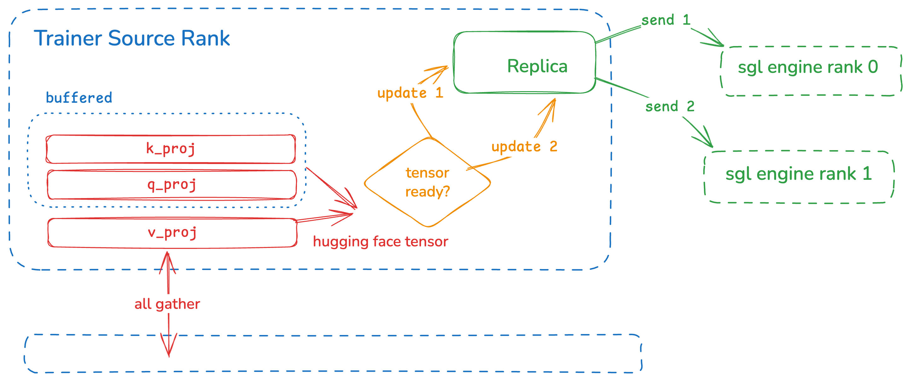

# Open-Source Instant Transfer of Trillion-Parameter Models Between Training and Inference
Written by: Jiadong Guo, Xin Ji, Letian Ruan

Last year I started working on RL infrastructure. The system at the time required going through disk to update inference parameters — as you can imagine, the update speed was abysmal. Inference units competed for disk bandwidth until other parts of the system crashed. That's when I read Lequn's "[Explorations in Cross-Machine Instant RL Model Parameter Updates](https://abcdabcd987.com/2025/09/07/rl-weight-transfer/)" and was blown away. Since I'm not great at building wheels from scratch (couldn't hand-roll a new RDMA communication library), I figured that mounting existing wheels and contributing to the open-source community was still making a difference.

Six months later, our final results show we can transfer a 512-GPU, 1T Kimi FP8 model in 7 seconds, and a 744B BF16 GLM5 model in 8.5 seconds on H100s with InfiniBand — roughly 7x faster than previous open-source solutions. We support all mainstream open-source models and parallelism configurations on both sides. Note that this 7 seconds includes the entire time from pausing the inference engine to resuming generation — the total RL training stall time. This post traces the six months of development and shares the various pitfalls we encountered. Core code and usage can be found in the [Miles implementation](https://github.com/radixark/miles/blob/main/miles/backends/megatron_utils/update_weight/update_weight_from_distributed/p2p.py), the [SGLang introduction](https://github.com/sgl-project/sglang/issues/17311), and the [sglang-miles implementation](https://github.com/sgl-project/sglang/pull/21278).

## Designing the Transfer Logic

[Lequn's system design](https://abcdabcd987.com/2025/09/07/rl-weight-transfer/) pursues ultimate performance — by implementing a new low-level RDMA transfer library, seeking optimal one-to-one weight-level mappings to adapt transfer strategies between FSDP and inference engines, supporting Qwen3 and Kimi. Our goal was to reuse existing low-level libraries as much as possible, support multiple training backends (Megatron/FSDP), and cover as many open-source models, parallelism, and quantization settings as possible. We were willing to accept some efficiency loss for this.

Back to the current open-source solution on slime/miles. The current UpdateWeightFromDistributed implementation relies on NCCL broadcast primitives formed between each PP group's head rank and all inference ranks. On the source side, all nodes first participate in TP and EP dimension all-gathers, producing aggregated weights at each PP rank's head rank. These weights are then converted to HF format. Subsequently, the head rank participates in the distributed update group, broadcasting complete HF weights to each engine rank via the update_weight_from_distributed API, where each local rank loads its corresponding shard via the load_weight API. This process repeats for each PP rank and runs in bucketed cycles to reduce GPU memory pressure.



As we can see, the current NCCL broadcast-based open-source solution has the following problems:

- **Redundancy:** The same data is sent repeatedly across the network.
- **Inactivity:** Most training-side ranks are idle during transfer, with only a few participating in broadcast.
- **Rigidity:** NCCL communication groups cannot be updated once defined, making it impossible to support newly added engines.

On the other hand, this update paradigm has its own advantages: by using HuggingFace full weights as the sole interface between training and inference, the specific parallelism modes on both sides can be fully abstracted away. In principle, it can support any model, parallelism design, and quantization operation.

At this point we thought of SGLang's recently supported [remote fork](https://www.lmsys.org/blog/2025-12-10-rfork/), a mechanism for remote weight loading. By reading the weight registration addresses of an existing inference engine, new inference engines can bypass disk reads for fast startup. Its transport layer uses [Transfer Engine](https://kvcache-ai.github.io/Mooncake/python-api-reference/transfer-engine.html) to support RDMA communication, with automatic network topology detection and transfer optimization. It's also one of the backends for SGLang's [PD disaggregation feature](https://www.lmsys.org/blog/2025-07-20-k2-large-scale-ep/). Memory/VRAM addresses registered with Transfer Engine can be directly transferred over the network via the RDMA protocol, bypassing kernel cache and CPU intermediaries. So the wheel already exists (RDMA communication library), and addresses can be obtained via [get_remote_instance_transfer_engine_info](https://github.com/sgl-project/sglang/blob/v0.5.10/python/sglang/srt/entrypoints/http_server.py#L1008) from SGLang — how do we mount this wheel?

## Design Proposal 1: Replace NCCL with RDMA



The simplest strategy is to replace the transfer strategy without changing any existing logic on either the training or inference side. During each bucketed transfer, after the all-gather, transfer the entire HuggingFace weights to the inference side. Since we're using P2P transfer, we can now leverage more training-side ranks for transfer, which appears to solve the inactivity and rigidity problems.

But this design doesn't solve redundancy, as we still need to transfer the full model weights to the inference side. Additionally, we learned that registering VRAM is an expensive operation that should be avoided as much as possible — but in this proposal, for every weight, on every transfer, we need to re-register and destroy address registrations. Is there a more elegant solution?

## Design Proposal 2: Build an Inference Engine Replica on the Training Side



If we reuse the remote instance weight info interface, we don't need to re-register inference-side weights. Correspondingly, we can also pre-allocate an inference engine model replica on the training side and register it. Since the weight format on both training and inference sides is now identical, we only need to transfer the weights the inference engine actually needs; we only need to register once; and if new engines join, modifications are very easy. This appears to solve all three problems — redundancy, inactivity, and rigidity!

To implement such an engine replica, we added an interface on SGLang to export the parallelism definition for each rank. It can be called directly:

```python
model_parallelism_info = engine.get_parallelism_config(rank)
with ParallelismContext(RankParallelismConfig.from_dict(model_parallelism_info)):
    model_replica = get_model(
        model_config=model_config,
        load_config=load_config,
        device_config=device_config,
    )
```

## Training-Inference Mapping

With the new design, we just need to add new P2P mapping relationships. The logic itself is simpler than Lequn's original design — since we created engine replicas, we don't need to consider weight-level transfer logic, only the mapping between training ranks and inference ranks.



Given: Every inference engine must receive all weights.

Find: How to satisfy this with the minimum number of engine replicas per training node?

Answer: Map each training rank to its target inference engine ranks. Use load-balanced round-robin assignment: the first few inference ranks get 1:1 mapping, remaining targets are distributed evenly.

**Exercise:** Suppose training pp=4, with 32 training ranks and 2 SGLang engine instances (16 ranks each). How many engine replicas does each training node need?

**Answer:** After all-gather, each rank in a PP group contains the complete aggregated weights for that specific PP rank. Each target rank needs to receive weights from every PP rank. Starting from pp_rank=0: we need to map 8 training ranks to all 32 target ranks.

1. Round-robin mapping: src_rank 0 -> tgt_rank 0, ..., src_rank 7 -> tgt_rank 7.
2. All existing sources have equal load. Another round of round-robin: src_rank 0 -> tgt_rank 8, ..., src_rank 7 -> tgt_rank 15.
3. Finally, note that tgt_rank 16 is equivalent to tgt_rank 0 (same tp rank from a different instance). Review existing assignments, add the equivalent engine rank to its existing source. This gives src_rank 0 -> [tgt_rank 0, 16]; [tgt_rank 8, 24] etc.
4. Similarly for all other pp ranks — src_rank 8 -> [tgt_rank 0, 16]; [tgt_rank 8, 24].

So each training node needs two replicas — on training rank 0, one replica sends to 0 and 16, the other sends to 1 and 17.

## Weight Mapping and Pipeline Updates

To enable bucketed pipeline updates, we also need to find the mapping between HuggingFace weights and SGLang weights. This part is tedious — essentially analyzing what each model does during SGLang's load_weight process, and when a SGLang weight is fully updated. Here we built a new class in SGLang: [ParameterMapper](https://github.com/sgl-project/sglang/pull/20907) to independently parse mapping relationships:

```python
sglang_name, shard_id, num_shards, expert_id, num_local_experts = parameter_mapper.map(hf_tensor)
```

Only when all num_shards and all num_local_experts are fully updated can we use Transfer Engine to send that SGLang weight.

Whenever a replica's weight update is complete, we submit the task to a ThreadPool, where Transfer Engine releases the GIL and handles the transfer. Thus on the main thread, we only need to do all-gather and load_weight:



In pseudocode:

```python
for hf_tensors in all_gather(self.bucketed_update()):

    ready_tensors = []

    for hf_tensor in hf_tensors:
        sglang_name, shard_id, num_shards, expert_id, num_local_experts = parameter_mapper.map(hf_tensor)
        ready_tensor.append(self.is_tensor_ready(sglang_name, shard_id, expert_id))

    for engine in local_engine_replicas:

        engine.load_weight(hf_tensors)

        for target_rank in self.get_target_ranks(engine):

            submit_transfer(ready_tensor, target_rank, self.thread_pool)
```

We use slime/miles' built-in check weight equal flag to verify that the transferred weights match the pre-prepared weights on disk one-to-one, proving correctness.

An interesting aside: initially we anticipated that P2P connections could be numerous in large-scale EP/TP scenarios, so we allocated independent Transfer Engine instances for each transfer thread, using an engine pool to distribute concurrent pressure under high load. However, subsequent experiments showed that Transfer Engine already has mature high-concurrency scheduling and connection reuse mechanisms — multiple transfer threads can share a single Transfer Engine. Converging to a single instance not only reduced redundant NIC hardware initialization overhead but also avoided the problem of memory regions registered by different Transfer Engine instances being unable to share across instances.

## First Victory: 235B

After getting it working on Qwen3-4B, we quickly succeeded with Qwen 235B — BF16, 64 GPUs to 64 GPUs, about 3.5 seconds, more than 3x faster than the original NCCL approach. But after discussions with the Miles maintainer, we realized this approach had a fatal flaw: the extra VRAM consumption would severely impact training efficiency — whether by forcing smaller batch sizes, enabling CPU offload, or checkpointing, it would significantly reduce training speed. We had to find a way to free this VRAM during training.

We began trying to move the engine replica to CPU during training, then move it back to GPU before transfer.

### VRAM Optimization Attempt 1: Torch Memory Saver

The first optimization idea was to use torch memory saver to keep virtual VRAM addresses (virtual addresses) unchanged, allowing the same address registrations to be reused. SGLang uses torch memory saver to implement offloading, allowing compiled CUDA graphs to reuse the same virtual addresses with different physical addresses.

Unfortunately, we discovered that Transfer Engine currently cannot directly support virtual addresses. The essence of RDMA transfer is bypassing OS kernel management — the GPU driver directly registers static mapping tables (Memory Translation Table) on NIC cards through the Linux kernel's peermem. Currently, peermem registration doesn't support the new CUDA memory management interface (VMM API). Modifying static NIC registrations (MTT) requires cumbersome hardware locks and dynamic address tracking to ensure correctness, which is why there's no widespread support. This is also why Miles can only partially support the VMM API, needing to fall back to cudaMalloc for VRAM allocation in weight transfer and DeepEP scenarios.

### VRAM Optimization Attempt 2: Pipeline Optimization

Another idea was to hide VRAM registration and deregistration operations outside EP/TP all-gathers through pipeline optimization. After multiple torch profiler runs, we found that VRAM registration events alone for the 235B model could take about 6 seconds, far exceeding the transfer itself — meaning this approach was also infeasible.

### VRAM Optimization Attempt 3: Don't Use VRAM

Suddenly we realized — why use VRAM as the transfer source at all? Transfer Engine supports both RAM and VRAM — we don't need to onload it back to GPU at all. After testing, we found that transfer efficiency itself was unaffected! The only performance impact is that weights after all-gather aggregation need a D2H transfer to CPU first. Moreover, since registration happens in RAM rather than VRAM and doesn't go through CUDA, registration time is also faster.

### Future VRAM Optimization: Huge Pages

From Professor Ma Teng, we learned that the fundamental reason for long GPU registration times is that the OS default page size (4KB) is too small, causing the registration of a typical model to require a massive number of pages, overloading Page Table Entries. Although GPU data flow doesn't go through the OS, RDMA registration (control flow) must go through the kernel driver. If registering 80GB of VRAM at the default 4KB granularity, it produces approximately 20 million page table entries — the CPU cycles required for the kernel to lock physical addresses and sync to the NIC MTT table cause second-level delays. Building a custom MemPool supporting Huge Pages for PyTorch to use could bring registration time within a reasonable range. In Professor Ma Teng's experiments, using 32MB page sizes compressed registration time to under 2 seconds. This is a future optimization direction to consider.

## Memory OOM!

In subsequent experiments, we tackled GLM4.5 (335B, 32B active), but hit memory OOM in the 64 → 64 GPU experiment. On the training side, we had TP=8, EP=8, PP=8, CP=2, ETP=1, 8 nodes; inference side TP=32, EP=32, DP_ATTN=4, 8 nodes; both sides BF16. How much memory does our current design consume?

**Answer:** The training side has 8 nodes with pp=8, meaning each node (ranks 0-8) needs to send weights to all inference-side ranks — each node must store an entire inference model's weights! In practice, because DP attention is enabled, non-expert weights need 4x storage: (340B + 15B*4) * (2 bytes/tensor) → each node occupies a full 800GB of memory. No wonder it OOMs immediately. Each rank needs 4 inference replicas, totaling 32 replicas, all stored on one node's memory. Typical H100 node memory ranges from 1-4TB — this consumption is unacceptable.

## Shared Replicas and Pipeline Updates

At this point we noticed that each rank in the SGLang engine fundamentally has a homogeneous model structure (except for the latest [EPD](https://www.lmsys.org/blog/2026-01-12-epd/)). That is, each rank's tensors have the same size and format, just different values. Therefore, we can have all engine replicas on each rank share the same physical memory (shared replica).

In implementation, we maintain each replica's weight loader (which automatically selects its needed shards), but share the physical memory. On each rank, we only need to maintain one copy of weights and one ParameterMapper.

```python
with ParallelismContext(parallelism_config):
    model = get_model(
        model_config=ModelConfig(model_path),
        load_config=load_config,
        device_config=DeviceConfig(device="cpu"),
    )

if first_engine_rank:
    for param in model.parameters():
        param.data = param.data.pin_memory()
    self._shared_params_dict = dict(model.named_parameters())
    self._shared_param_mapper = ParameterMapper.from_model(model)
else:
    for name, param in model.named_parameters():
        param.data = self._shared_params_dict[name]
```

Now we need to ensure transfer correctness. The same engine replica will be transferred to different target engines — we must guarantee the old transfer completes before loading new weights. We still reuse the previous ThreadPool, but before submitting tasks, we check whether we need to wait for completion before proceeding to the next all-gather and load_weight. Using our earlier example, training-side rank 0 uses two replicas to send to 4 target ranks:

src_rank 0 -> [tgt_rank 0, 16]; [tgt_rank 8, 24]

After the first group's weights are updated in memory (load_weight), we can synchronously submit transfer tasks for [0, 16] since their underlying weights are identical. But here we must wait for the transfer task to complete before updating the second replica, because both replicas share the same memory address. When sending [8, 24] with the second replica, no waiting is needed — we can proceed directly to the next all-gather step as before.



Completing the transfer of the first replica (Engine 0) is now a prerequisite for continuing the flow.

Another change involves handling weight shards, such as qkv proj. A replica only stores part of the HuggingFace weight information (selecting the corresponding tp, ep), so load_weight discards the rest. But due to weight sharding, we need ParameterMapper to know which weights are fully updated. If we perform load_weight too early, we directly lose information that's still needed. For example:

bucket 0: [q_proj, k_proj] → load_weight(tp=0); load_weight(tp=1) → qkv now only has tp=1 information, no transfer since ParameterMapper tells us the weight isn't ready

bucket 1: [v_proj] → load_weight(tp=0); → transferring qkv_proj errors! Because q and k have already been updated to tp=1 values in the previous step.

Therefore, we need to additionally maintain these HuggingFace weights themselves until the corresponding SGLang weight has collected all shards. Visualized:



The training side needs to additionally maintain not-yet-ready weights, update the replica, then send sequentially. send1 must complete before update2, but send2 doesn't block the next all-gather.

Finally, what's the efficiency cost of using shared replicas? We compared across model sizes — the result is that beyond multi-node (node > 8), the impact on transfer speed is minimal, within statistical error. A reasonable explanation is that in multi-node, multi-expert scenarios, compared to cross-machine all-gathering all expert weights, the transfer itself occupies very little time, making this a worthwhile optimization.

## Estimating Transfer Advantages

Looking back at our new design, we trade extra storage (engine replicas in RAM) for transfer efficiency. We quantify with this scenario:

Training side has M ranks, SGLang inference side has N target ranks; training rank pp_size is pp, target rank ep_size is ep; each engine rank has P parameters. We also allocate K as the bucketed all-gather memory buffer. Assuming the model contains only expert weights:

| Metric | NCCL Broadcast | RDMA P2P |
|--------|---------------|----------|
| Training-side ranks participating in transfer | pp | M |
| Parameters received per inference rank | ep x P | P |
| Source-side extra buffer (for all-gather) | K | K* + P |
| Target-side extra buffer | K | 0 |

The new P2P approach effectively solves the previous problems:

1. **Redundancy** → Only transfer parameters the model actually needs
2. **Inactivity** → All training-side ranks participate in transfer
3. **Flexibility** → P2P design; adding a new inference side only requires adding a target on the corresponding training side.

Why is the extra buffer K* for P2P? Because we need to additionally maintain HuggingFace shards that haven't been fully updated. In the theoretical worst case, we need to maintain 3*K (q, k, v); but in practice, they appear in model_parameters in order of model layers, so the extra memory usage is very limited. Our transfer paradigm is write-only — SGLang doesn't know its weights are being updated.

## Post-Quantization Processing and Complete Update Steps

In the GLM5 and Kimi K2 experiments, we encountered new complications — check weight equal passed, but logprobs didn't match; or FlashInfer weights were incorrect. After reading SGLang's load weight code for DeepSeek-series models, we found that typical loading has two parts:

- `load_weight()`: Read and load checkpoint weights into model parameters
- `post_load_weights()`: Various post-processing, mainly changing weight format (layout), precision (quantization), and hardware-specific optimizations. For example, DeepSeek's MLA generates new w_kc, w_vc weights.

The second part typically needs to run on GPU, and more troublingly, the weights generated by post-processing aren't included in model parameters, so they can't be checked by check weight equal.

But since the model weights themselves contain all the information, we can preserve this logic entirely and let it re-run on the inference side. In our implementation, we force skip post_load_weights on the training side and call it again on the inference side after weight updates via a new [SGLang API](https://github.com/sgl-project/sglang/pull/15245).

Our P2P update logic extensively reuses the existing UpdateWeightFromDistributed paradigm, only changing the bucketed update implementation for HF tensors after all-gather. The complete steps to implement on the training side are:

### Before Execution

| Step | Description |
|------|-------------|
| get_remote_instance_transfer_engine_info | Get inference-side weight registration info |
| get_parallelism_info | Get inference-side parallelism info (tp, pp, etc.) |
| build_transfer_plan | Get training-inference one-to-one mapping |
| create_engine_replica | Create training-side engine replicas |

### During Updates

| Step | Description |
|------|-------------|
| pause_and_register_engine | Call SGLang API to pause inference, register replica weight memory (first time) |
| update_weight (non-expert and expert) | Bucketed weight update, processing non-expert and expert separately |
| post_process_weights | Call SGLang API for weight post-processing |
| update_weight_version | Call SGLang API to update weight version |
| continue_generation | Call SGLang API to resume inference |

## Experimental Results

We tested transfer speeds of common open-source models on H100 8-GPU hosts with InfiniBand connections. These are averages of ten updates (excluding the first), and include the entire update flow described above.

| Model Family | Model Name | Total Params | Training Config | Inference Config | NCCL (ms) | RDMA (ms) | Comparison |
|-------------|-----------|-------------|----------------|-----------------|-----------|-----------|------------|
| GLM4 | GLM-Z1-9B-0414 | 9B | TP=2, PP=1, CP=2, EP=1, ETP=1, 1 node | TP=4, EP=1, 1 node | 694.6 | 707.1 | +1.8% |
| DeepSeek-V2 | Moonlight-16B-A3B | 16B(3B) | TP=2, PP=1, CP=1, EP=8, ETP=1, 1 node | TP=8, EP=8, 1 node | 1,482.0 | 1,073.3 | -27.6% |
| GLM4-MoE | GLM-4.7-9B-Flash | 30B(3B) | TP=4, PP=1, CP=1, EP=8, ETP=1, 1 node | TP=4, EP=4, 1 node | 2,508.6 | 4,229.0 | +68.6% |
| Qwen3-MoE | Qwen3-30B-A3B | 30B(3B) | TP=4, PP=1, CP=1, EP=8, ETP=1, 2 nodes | TP=8, EP=8, 2 nodes | 2,670.0 | 2,160.2 | -19.1% |
| GLM4-MoE | GLM-4.5-Air | 106B(12B) | TP=1, PP=4, CP=1, EP=8, ETP=1, 4 nodes | TP=8, EP=8, 4 nodes | 5,001.1 | 2,637.2 | -47.3% |
| Qwen3-MoE | Qwen3-235B-A22B | 235B(22B) | TP=4, PP=4, CP=2, EP=16, ETP=1, 8 nodes | TP=32, EP=32, 8 nodes | 10,753.6 | 3,162.0 | -70.6% |
| DeepSeek-V3p2 | GLM-5 | 744B(40B) | TP=4, PP=8, CP=2, EP=16, ETP=1, 16 nodes | TP=64, EP=64, 16 nodes | 58,301.5 | 8,479.7 | -85.5% |
| DeepSeek-V3 | Kimi-K2-fp8 64-block-quantized | 1T(64B) | TP=8, PP=8, CP=4, EP=32, ETP=1, 32 nodes | TP=32, EP=32, 32 nodes | 53,279.1 | 7,227.3 | -86.4% |

From this table, P2P transfer shows the most significant performance gains in large MoE (Mixture of Experts) architectures with high EP on the inference side. In the GLM4-MoE example's small-scale node configuration above, when EP is small, the overhead of locally loading weights into CPU inference engine replicas exceeds the gains from P2P transfer.

**Note:** Kimi-K2 special handling: Among all models, Kimi is the only one using FP8 block quant. We set training nodes = inference nodes = 32 to ensure sufficient memory. The original Kimi-K2 weights use block_quant for FP8 quantization with window size [128, 128], which triggers errors at sglang-tp-size = 32. To resolve this, we changed the window size to [64, 64] and updated all affected scale weights in the checkpoint accordingly.

Results chart. Interestingly, GLM5 at 32 nodes is even slower than Kimi — likely because Kimi uses FP8, so the total data volume is actually larger. From this table, our solution should continue to scale, and the sparser the model, the better the results. We welcome everyone to share their pain points and usage experiences — support for AMD GPUs will be added soon.

---

*Core code: [Miles P2P Implementation](https://github.com/radixark/miles/blob/main/miles/backends/megatron_utils/update_weight/update_weight_from_distributed/p2p.py) | [SGLang PR](https://github.com/sgl-project/sglang/pull/21278) | [SGLang Issue](https://github.com/sgl-project/sglang/issues/17311) | [Slime Documentation](https://github.com/THUDM/slime/blob/main/docs/zh/blogs/release_v0.1.0.md)*
