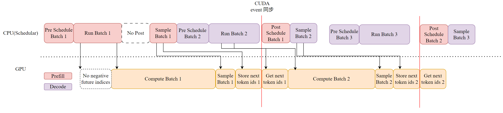

## Why Overlap?

运行实际调度算法仅占总体调度开销的一小部分。**大部分开销来自于模型输入的准备和模型输出的后处理**。具体而言，最大的开销来自于构建输入张量(**Pre Schedule**)、执行输出去标记化(**Post Schedule**)以及准备每个请求的元数据(**Pre Schedule**)[^overhead]

**构建模型输入张量和采样元数据方面的开销主要源于 Python**

使用**多步调度可以降低总体调度开销**，但也存在一些弊端。例如，在两次调度调用之间，即使某些请求提前完成，也无法将新的请求添加到批次中。

- **vLLM** 的 multi-step decode
- **SGLang** 的 speculative group execution

## Zero-Overhead Schedule(Overlap)

### 原理

在介绍原理之前我们需要回忆一下上面推理过程的 4 个大步骤，考虑哪些步骤可以进行 Overlap，减少 GPU Bubble，先放一张现在 Overlap 的流水线图



**Inference Overview**：

SGLang 的推理过程主要分为以下四个阶段：

1. **Pre schedule：**
   - 收集前端传入的请求，并将其放入等待队列。(`Scheduler::recv_request()` & `Scheduler::process_input_requests()`)
   - 从等待队列和 running_batch 中进行调度 (`Scheduler::get_batch_to_run()`)
     - Prefill 中涉及 Radix Tree 和最长前缀匹配（Longest Prefix Matching）算法。(`Req::init_next_round_input()`)
   - 为每个请求分配 Token 所需的内存资源。(`ScheduleBatch::prepare_for_extend()` & `ScheduleBatch::prepare_for_decode()`)
2. **Compute batch：**
   - 将 batch 发送到 GPU 上进行一步（即 Continue Batch 的一个 iter）推理(`Scheduler::run_batch()`)
3. **Sample：**
   - 根据模型输出的 Logit 进行采样，生成下一步的 Token。(`ModelRunner::sample()`)
   > 这里我们会应用 grammar 的 vocab mask 来确保采样的合法性，所以这里的采样会依赖模型的输出 Logits
4. **Post schedule：**
   - 在一步推理完成后，动态检查请求是否满足结束条件（Check Finish Condition）。(`Scheduler::process_batch_result()`)
   - 将已完成的请求从批次中移除，并送入 Detokenizer 处理，最终将结果返回给前端。

**Overlap Overview[^overlap]**：

Compute batch 和 Sample 这两个挨在一起的阶段是 GPU heavy 的，而 schedule 的两个阶段是 CPU heavy 的。当多个 batch 流水线化时，我们可以用 **GPU 的 Compute 和 Sample 来重叠上一个 batch 的 post scheduler 与当前 batch 的 pre scheduler**。

> Prefill 阶段的 Grammar Mask 通常基于 Prompt，不依赖上一次 Decode 的输出，所以这里直接 sample 即可

我们通过使用 CUDA Stream + FutureMap的方式来实现 overlap，具体来说：

- Run Batch 中将两个操作提交到 forward_stream 队列：一个是从 FutureMap **获取上一次 batch 的 next token**；一个用这个 token 作为 `input_id` 进行下一次计算
- Sample 中也把两个操作提交到 forward_stream 队列：一个是进行采样；一个是将**得到的 next token 写回 FutureMap**
  - 我们需要注意，采样依赖于在 Post Schedule 阶段准备的词汇表掩码（vocab mask）。因此，我们需要确保前一个批次的 Post Schedule 在执行当前批次的采样之前完成。
- 我们需要在 Post Schedule 处理数据前对 CPU 和 GPU 做一个同步，保证可以处理到 CPU 的 `next_token_ids`
  - 我们**在 Post Schedule 中进行同步操作**，确保后续的处理可以正常运行且不影响 GPU 的流水线工作
    ```python
    def process_batch_result_decode(
            self: Scheduler,
            batch: ScheduleBatch,
            result: GenerationBatchResult,
        ):
            if result.copy_done is not None:
                result.copy_done.synchronize()
            logits_output, next_token_ids, can_run_cuda_graph = (
                result.logits_output,
                result.next_token_ids,
                result.can_run_cuda_graph,
            )
      next_token_ids = next_token_ids.tolist()
      next_token_logprobs = logits_output.next_token_logprobs.tolist()
    ```


### 初始化 Overlap

- **forward_stream**：专门用于 GPU 前向计算，与默认流并行
- **copy_stream**：处理 GPU->CPU 数据传输
- **future_map**：管理异步计算结果，使用**负索引作为 future 标识符**
  - 上一个 batch 计算的 `output_id` 作为下一个 batch 的 `input_id`，通过存取 `future_map` 实现

```python
def init_overlap(self):
    if not self.enable_overlap:
        return
    self.forward_stream = torch.cuda.Stream()      # GPU前向计算流
    # Future映射管理异步结果
    self.future_map = FutureMap(max_running_requests, device, spec_algorithm)
    # batch 缓冲区（防止GPU张量被GC回收）
    self.batch_record_buf = [None] * 2
    self.batch_record_ct = 0
```

**FutureMap**：

- 存放在 GPU 上

- `future_ct`：当前环形计数器（指针），用于生成新的 future indices（并非“尚未完成的数量”）。
- `future_limit`：环形指针的模（用来做 `% self.future_limit`）。代码里用 `*3` 的因子来 **减小索引冲突概率**（防止 `future_ct` 快速回绕覆盖尚未写回的 slot）。
- `future_buffer_len`：实际缓冲区物理长度（`*5`），比 `future_limit` 更长以保证写入区间有足够空间（防止 slice 越界或回绕写入与读冲突）。

- 这两个因子（3 和 5）是工程经验值，用来增加安全裕量；你可以根据并发量和 outstanding futures 调整。

```python
class FutureMap:
    def __init__(
        self,
        max_running_requests: int,
    ):
        self.future_ct = 0
        # A factor of 3 is used to avoid collision in the circular buffer.
        self.future_limit = max_running_requests * 3
        # A factor of 5 is used to ensure the buffer is large enough.
        self.future_buffer_len = max_running_requests * 5
```
**工作流程**
1. 分配 (Alloc) - CPU 阶段
   - 执行`future_indices = self.future_map.alloc_future_indices(bs)`，得到一组负数索引（例如 [-1, -2, -3]），代表“未来的结果将存放在这里”。
   - 这些负数索引会被作为下一个 batch 的`input_ids`

2. 存储 (Store) - GPU 阶段 (Batch N)
     - 当 Batch N 在 GPU 上执行 Forward + Sample后，真实的 token ID 已经在 batch 的结果里面了。
     - 执行`self.future_map.store_to_map(future_indices, batch_result)`把 GPU 显存中刚刚生成的 `next_token_ids` 直接拷贝到 FutureMap 对应的缓冲区位置。
     - GPU 上完成，不需要回传给 CPU。
3. 解析 (Resolve) - GPU 阶段 (Batch N+1)
     - 当 Batch N+1 开始在 GPU 上执行 Forward 之前，它需要先把输入数据里的负数 token 换成batch 中真实的 token。
     - 执行 `self.future_map.resolve_future(model_worker_batch)`，将 `input_ids` 里的负数索引替换成 FutureMap 里对应位置的真实 token ID。
     - 因为 GPU 命令是顺序执行的，Batch N 的 Store 一定发生在 Batch N+1 的 Resolve 之前。

### Overlap 事件循环

```python
def event_loop_overlap(self):
    self.result_queue = deque()  # 存储(batch, result)对
    while True:
        # === Pre Schedule 2 ===
        recv_reqs = self.recv_requests()
        self.process_input_requests(recv_reqs)
        batch = self.get_next_batch_to_run()
        self.cur_batch = batch

        batch_result = None
        if batch:
            # === Launch Compute Batch 2 ===
            batch_result = self.run_batch(batch)  # 非阻塞启动
            self.result_queue.append((batch.copy(), batch_result))

        # === Post Schedule 1 ===
        # compute batch 2 与 post schedule 1 并行执行
        if self.last_batch:
            # 处理队列中的结果（此时GPU在并行计算当前批次）
            tmp_batch, tmp_result = self.result_queue.popleft()
            self.process_batch_result(tmp_batch, tmp_result)
        elif batch is None:
            self.self_check_during_idle()

        # === Launch Sample 2 ===
        self.launch_batch_sample_if_needed(batch_result) # update vocab mask
        self.last_batch = batch
```

### 与 normal event loop 的不同

- `Schedule::run_batch()`
  - `Schedule::record_batch_in_overlap()`：在两个 overlap 的 batch 中交替存储 model_worker_batch 引用，**避免在 overlap 的 forward 尚未结束时，CUDA kernel 访问野指针或已释放的显存**
  - `FutureMap::resolve_future()`：用**上一轮 batch sample 得到的真实 token 替换负索引的占位符**
- `TpModelWorker::forward_batch_generation()`，该函数仅仅将 `model_runner.sample` 函数 delay 执行，先返回 batch_result
- 增加了 `Scheduler::launch_batch_sample_if_needed()`：
  - 执行真正的 Sample 操作
    - 屏蔽非法 token，分配 vocab_mask 张量大小 [batch, vocab_size]
    - 移动 mask 到 CPU
  - 将得到的 `next_token_id` 存储到 FutureMap 的 `future_indices` 的对应位置
    - 为了下一次 batch 在 `run_batch` 中的 `resolve_future` 获取到真正的 token

### 依赖 & Solutions

**Sample 阶段的 vocab mask 依赖于上一轮的 Post Schedule 阶段**
- 通过 CPU 侧调度逻辑保证本轮 Sample 阶段在 上一轮 Post Schedule阶段之后执行

**Decode 阶段 Compute batch 阶段依赖于上一轮 batch 的 next token**
- 通过 FutureMap 作为桥梁，CPU先填充负索引占位符，GPU 侧在 Sample 阶段存储真实 token，在 Compute batch 阶段获取真实 token
- CUDA Stream 的顺序保证上一轮 Sample 一定在下一轮 Compute 之前完成，不会获取到错误的负数 "token"

```python
# previous batch output is negative indices
batch.output_ids = -self.future_map.alloc_future_indices(bs).indices
with self.forward_stream_ctx:
	self.forward_stream.wait_stream(self.default_stream)
	_batch_result = batch_result.delay_sample_func()
	assert _batch_result is batch_result
	# store token to negative indices
	self.future_map.store_to_map(batch_result.future_indices, batch_result)
	batch_result.copy_to_cpu()

# next batch input is output of previous batch
 with self.forward_stream_ctx:
	self.forward_stream.wait_stream(self.default_stream)
	# get token from negative indices
	self.future_map._resolve_future_token_ids(model_worker_batch.input_ids, self.token_ids_buf)
	batch_result = self.model_worker.forward_batch_generation(
		model_worker_batch
	)
```

### 与上一版 overlap 差异

- 将 update_vocab_mask 移动到 GPU 进行计算(**在 Sample 中进行**)，`vocab_mask` 也在 GPU 直接进行分配，不再进行传输
- 现在的 GPU 额外负责向 FutureMap 存储(after sample)以及获取(before compute) `next_token_ids`
  - FutureMap 也是完全存储在 GPU 上
- 对 GPU 调度由原来 CPU 进行 launch，变成直接将操作提交到 cuda stream，由 stream 自己来调度
- 对 sample 的同步，上一版使用 cuda event 进行同步，这里直接使用 **cuda stream 顺序限制来进行同步**


### 两个版本的优缺点

**CUDA stream 版本**：

- 执行效率更高：`vocab_mask` 和 `token_ids_buf` 无 CPU-GPU 传输；充分利用 GPU 内存带宽
- 延迟更低：`token_ids_buf` 直接在 GPU 上原地修改，不必反复传输
  - 与模型推理在同一设备上，便于流水线
- 非模型占用显存大：`token_ids_buf` 占用 GPU 显存，开销固定

**CPU launch 版本**：

- 只有在使用时才占用 GPU 内存
- 同步点增加：`vocab_mask` 会增加一次 CPU-GPU 同步
  - CPU-GPU 同步会破坏流水线

## Reference

[^overlap]: [Zero-Overhead Batch Scheduler](https://github.com/zhaochenyang20/Awesome-ML-SYS-Tutorial/blob/main/sglang/zero-overhead-scheduler/zero-overhead-batch-scheduler.md)
[^overhead]: [Can Scheduling Overhead Dominate LLM Inference Performance? A Study of CPU Scheduling Overhead on Two Popular LLM Inference Systems](https://mlsys.wuklab.io/posts/scheduling_overhead/)
[^code-walk]: [SGLang Code Walk Through](https://github.com/zhaochenyang20/Awesome-ML-SYS-Tutorial/blob/main/sglang/code-walk-through/readme-CN.md)
