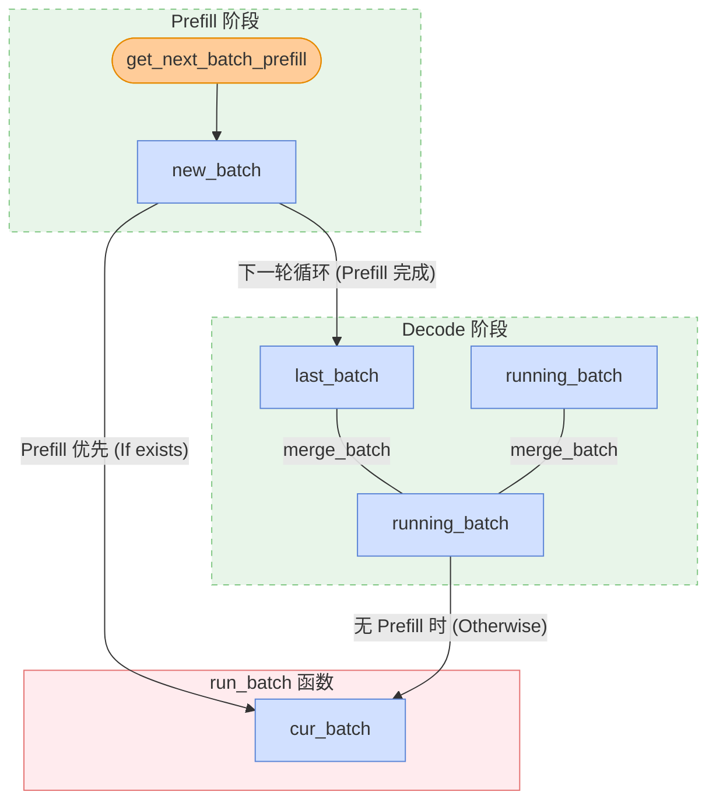

# 从 KV Cache 到 Zero Overhead Scheduling，一文读懂 SGLang 的调度巧思

想要系统性学习 SGLang Scheduler 的想法已经有一年了。大概在 24 年 11 月，当时我和几个朋友一起写了 [SGLang Code Walkthrough](https://github.com/zhaochenyang20/Awesome-ML-SYS-Tutorial/blob/main/sglang/code-walk-through/readme-CN.md)，但是当时止步于 KV Cache Management 和 Scheduler 分析，并未更进一步。从那时起，已经有了一整年，SGLang 项目也发生了翻天覆地的变化。但是，在我看来，Scheduling 算法本身早已收敛，最大的创新还是 24 年 12 月时，怜悯主力完成的 [zero-overhead batch scheduler](https://lmsys.org/blog/2024-12-04-sglang-v0-4/#zero-overhead-batch-scheduler)。此后，SGLang 很长时间的优化都是在 MOE 架构上。我自己也一直在忙着和诸多 RL framework 打交道，学习 SGLang KV Cache 和 Scheduler 的想法就一直搁置。但是，这个事情必然是悬在我心上的，否则经常看到在 SGLang 的各种技术讨论群里，大家聊的内容有许多我都毫不了解，让人产生了深深的技术焦虑。

更进一步，Junrong（Qwen RL Infra team 成员，也是 SGLang RL 老队友）有次给我说过，“现在感觉，很多时候 RL infra 的上限，其实取决于对 SGLang 和 Megatron 本身的理解程度”。他这话时常点醒我，对推理和训练系统本身的深刻认知，是推动 RL infra 发展的关键。事实也是如此，之前本人写了非常多 RL 系统深思，比如：

1. [深入浅出 DeepSeek MoE，EP 与 FSDP 经典二次开发](../../rlhf/sys-design/readme-4.md)
2. [RL 系统深思：深入理解权重更新机制](../../rlhf/sys-design/readme-1.md)
3. [RL 系统深思：FSDP 训练后端](../../rlhf/sys-design/readme-2.md)

这篇文章会 follow 以上三篇文章的思路，深入理解 SGLang 的调度系统，从 KV Cache 到 Overlapped Scheduling，一文读懂 SGLang 的调度巧思。

【感谢刘芷溢的 [SGLang Scheduler 技术变迁](https://zhuanlan.zhihu.com/p/1969077475129688722)原文】

考虑到 Scheduling 系统几乎是 SGLang 最复杂的中心组件，为了便于理解，这篇文章的写作思路有过多次改动。总体上我会先单独抽出几个重要的 class 和数据结构，接着再从整体上分析调度器的工作流程。

## Key Class and Data Structure

首先，回顾下 SGLang 的两个粗浅的架构图：


<div style="text-align: center;">

</div>

<div style="text-align: center;">

</div>

### Scheduler

Scheduler 通过如下的核心逻辑对象来管理所有的 active request：

1. `waiting_queue`：顾名思义，`waiting_queue` 是一个优先队列，用于存放所有的 active request。所有还没有完成 prefill 的 request 和在 decode 阶段被 retract 回来的 request 都会被放入队列中；每轮循环之前，如果队列不为空，Scheduler 会调用 `self.policy.calc_priority(self.waiting_queue)` 函数，根据预设的策略（如 first come first serve、最长前缀匹配等）对队列进行重新排序，然后通过 `PrefillAdder` 组成 `new_batch`。

只有当最后一个 chunk 处理完后，这个请求才会被认为“完成了 Prefill”，从而进入 Decode 阶段。在中间状态下，它既不在 waiting_queue（因为它已经开始跑了），也不在传统的 running_batch（因为它还没到 Decode），它是通过 self.chunked_req 这个单独的变量被 Scheduler 挂载的。

2. `new_batch`：即将进入 prefill/extend 阶段的 requests。考虑到 chunked prefill 的特性，如果一个请求非常长，超过了 `chunked_prefill_size`，它会被标记为 `self.chunked_req = True`，接着被特殊处理：只有当这个请求的所有 chunks 都 prefill 完成后，它才会真正被标记完成了 prefill，从而被合并到 `running_batch` 中参与 Decode。对于中间状态，它既不在 `waiting_queue`（因为它已经开始跑了），也不在传统的 `running_batch`（因为它还没到 Decode），它是通过 `self.chunked_req` 这个单独的变量被 Scheduler 挂载的。新请求完整的调度轨迹：`waiting_queue -> new_batch (当前轮) -> last_batch (下一轮开始时) -> running_batch (被合并)`；而已经在 decode 阶段的请求，其调度轨迹为：`running_batch -> cur_batch (当前轮) -> running_batch (下一轮开始时)`。

3. `running_batch`：即将进入 decode 阶段的 requests。当 GPU 显存（KV Cache Pool）碎片化严重或空间不足以支撑所有请求产生下一个 token 时，Scheduler 会通过  `retract_decode`  从  `running_batch`  中撤回某些 requests，将其返回到  `waiting_queue`。（PS：坦诚说 `running_batch` 和 `new_batch` 这两个命名至少在我看来，是有些误导性的。可能更准确的说法是 `prefill_batch` 和 `decode_batch`）

4. `cur_batch`：在 Scheduler 主循环 `run_batch` 函数中当前正在被处理的 requests。注意到 SGLang 是 prefill first 的，当不存在新的 prefill batch 时，才进入 decode 阶段。因此，当 `new_batch` 存在时，`cur_batch = new_batch`，否则 `cur_batch = running_batch`。

```python
def get_next_batch_to_run(self):
    # 核心细节：只有上一轮是 Prefill (Extend)，才需要合并到 Decode 队列
    if self.last_batch and self.last_batch.forward_mode.is_extend():
        self.running_batch.merge_batch(self.last_batch)
    
    # Prefill 优先策略
    new_batch = self.get_new_batch_prefill()
    if new_batch:
        return new_batch
    else:
        # 无 Prefill 时，更新并运行 Decode
    return self.update_running_batch(self.running_batch)
```



### Batch

`waiting_queue, new_batch, running_batch, cur_batch` 描述一个请求的控制逻辑。这里我们分析 Scheduler 中定义的四个和 Batch 相关的 class：`ScheduleBatch`、`ModelWorkerBatch`、`ForwardBatch` 以及 `GenerationBatchResult`，他们描述了在不同的硬件资源，实际被执行的数据结构。注意到，`waiting_queue, new_batch, running_batch, cur_batch` 本质上都是 `ScheduleBatch` 的实例。

1. **`ScheduleBatch`**

`ScheduleBatch` 由 Scheduler 管理，包含高级调度信息，大部分数据位于 CPU 上。

```python
class ScheduleBatch:
    reqs: List[Req]  # 请求列表
    req_to_token_pool: ReqToTokenPool  # 所有 requests 的所有 token 到 kv cache 的映射池
    token_to_kv_pool_allocator: BaseTokenToKVPoolAllocator  # KV cache 分配器
    tree_cache: BasePrefixCache  # 前缀缓存树
    forward_mode: ForwardMode  # 前向模式

    # 批处理相关
    input_ids: torch.Tensor  # 输入 token IDs
    seq_lens: torch.Tensor  # 所有 requests 的序列长度
    extend_lens: List[int]  # 扩展长度 (seq_len - prefix_len)
    prefix_lens: List[int]  # 所有 requests 的前缀长度
```

2. **`ModelWorkerBatch`**

`ModelWorkerBatch` 由 TpModelWorker 管理，只包含与 GPU 上模型 forward 相关的数据，它将从 CPU Scheduler 转换到 GPU ModelRunner。

```python
class ModelWorkerBatch:
    forward_mode: ForwardMode
    input_ids: torch.Tensor # 输入 token IDs
    req_pool_indices: torch.Tensor # 所有 requests 对应的 out_cache_loc 的索引
    seq_lens: torch.Tensor # 所有 requests 的序列长度
    out_cache_loc: torch.Tensor # 这个 batch 的所有 requests 新增的 KV cache slots 索引
```

3. **`ForwardBatch`**

`ForwardBatch` 由 ModelRunner 管理，只包含与 GPU 上模型 forward 相关的数据，包含最底层的 tensor 数据。

```python
class ForwardBatch:
    forward_mode: ForwardMode
    batch_size: int
    input_ids: torch.Tensor
    seq_lens: torch.Tensor
    positions: torch.Tensor  # 位置编码
```

4. **`GenerationBatchResult`**

`GenerationBatchResult` 顾名思义，是模型 forward 的输出结果。

```python
class GenerationBatchResult:
    logits_output: torch.Tensor # 模型 forward 完整的 logits 输出和相关信息
    next_token_ids: torch.Tensor # 经过采样的下一个 token 的 ID
    num_accepted_tokens: int # speculative decoding 中被接受的 token 数量
    next_draft_input: Optional[EagleDraftInput] # speculative decoding 的下一轮输入信息
    extend_input_len_per_req: List[int] # 每个请求的扩展输入长度
    extend_logprob_start_len_per_req: List[int] # 每个请求开始计算 logprob 的位置
    copy_done: torch.cuda.Event # GPU 到 CPU 数据传输完成的同步事件
    delay_sample_func: Optional[callable] # 延迟采样函数
    future_indices: Optional[FutureIndices] # Future 机制中的索引信息
```

在 `TpModelWorker::forward_batch_generation` 中，当 GPU 完成推理（Forward）并进行采样（Sample）后，它会将所有的输出打包为 `GenerationBatchResult`，并返回给 Scheduler。

```python
# TpModelWorker.py 示意代码
def forward_batch_generation(self, model_worker_batch):
    # 1. 运行模型前向
    logits_output = self.model_runner.forward(forward_batch)
    # 2. 采样得到 token
    next_token_ids = self.model_runner.sample(logits_output, forward_batch)
    
    # 3. 将所有结果打包返回
    return GenerationBatchResult(
        logits_output=logits_output,
        next_token_ids=next_token_ids,
        ...
    )
```

Scheduler 在主循环中拿到 `GenerationBatchResult` 后，会根据它携带的信息来更新每个 Request 的状态。这主要发生在 `process_batch_result` 函数中：

- 更新 Token: 将 `next_token_ids` 中的值追加到各个请求的 `output_ids` 中。
- 判断结束: 检查新生成的 token 是否是停止符（EOS），如果是，则将该请求从 `running_batch` 移除。
- 流式输出: 根据 `logits_output` 里的 logprob 信息，如果是流式输出请求，则调用 `stream_output` 将结果推送到前端。
- 释放资源: 如果请求完成，通知 Radix Cache 释放或缓存对应的 KV Cache。

注意到，后文会提及到 Zero Overhead Scheduling 时，也即将 CPU 调度与 GPU 计算进行重叠。在这种调度模式下，`GenerationBatchResult` 是实现异步非阻塞调度的关键：

- 延迟采样 (`delay_sample_func`): 在重叠模式下，GPU 前向计算完成后，并不会立即阻塞等待采样结果，而是先返回一个包含采样函数（sample function）的 `result`。Scheduler 可以利用 GPU 采样的空档去处理上一个 batch 的后处理。
- 同步令牌 (`copy_done`): 它携带了一个 CUDA Event。Scheduler 在真正需要访问 CPU 侧的 token ID 时（比如要把 token 发给用户），会调用 `result.copy_done.synchronize()`。这确保了 CPU 不会读到还没传输完成的脏数据。
- 占位符管理 (`future_indices`): 在重叠模式中，当前的输出是下一个 batch 的输入。`GenerationBatchResult` 记录了这些 token 在 GPU `FutureMap` 中的位置索引，让下一个 batch 的计算能直接从 GPU 显存中读取结果，而不需要经过 CPU 再传递一遍。

### KV Cache Management

Scheduling 本身涉及到 KV Cache 管理的部分不多，所以能够单独拎出来分析分析。非常有意思的是，在 SGLang 刚出的时候，由于 RadixCache 和 PagedAttention 的结合，SGLang 比起只用 PagedAttention 的 vLLM 而言，在 throughput 上有非常夸张的优势。彼时大概是 2024 年 8 月左右，也是我刚刚开始加入 SGLang 社区的时候。不过，那时候我心里有个固执的想法，我总是拿着 RadixCache 和 PagedAttention 做对标，认为这是同一个生态位的两种技术。甚至我当时还问过颖老板（Ying Sheng），结果她一直给我说这两个东西不矛盾。非常惭愧，从那之后，我也没有理解到二者的关系。虽然不理解也不妨碍我做 RL sys，到底还是心头一直好奇。这几天重新开始梳理 Scheduler，才想明白为什么 RadixCache 和 PagedAttention 是不矛盾的。到了 25 年初，RadixCache 和 PageAttention 这两项技术在 SGLang 和 vLLM 都是默认开启的，实现了类似操作系统中的“多级索引”。

实际上，Paged Attention 类似操作系统中的页表，解决了“逻辑缓存地址到物理存储地址”的映射问题；让逻辑上连续的 KV Cache 可以分布到物理上散乱的实际 VRAM 里，减少显存碎片；而 Radix Cache 则负责的是“缓存复用”的问题，前缀相同的 requests 能够复用一致的逻辑缓存地址，避免重复计算。


| 维度 | Paged Attention (寻址层) | Radix Cache (策略层) |
| :--- | :--- | :--- |
| 解决的问题 | 显存碎片。解决逻辑连续但物理离散的问题。 | 重复计算。解决多个请求之间 KV 数据的共享。 |
| OS 类比 | 页表 (Page Table)：将虚拟地址映射到物理页。 | 共享库/文件缓存：多个进程共用同一物理内存块。 |
| 关注点 | 关注“怎么存”：如何利用不连续的显存块。 | 关注“存什么”：哪些前缀是一样的，可以复用。 |
| 关系 | 没有分页，共享会因内存碎片而难以实施。 | 利用分页提供的灵活性，实现极致的复用。 |


有了这些认知，我们举一个三个 requests 的例子，来看看关键的数据结构 `RadixCache`、`req_to_token_pool` 和 `token_to_kv_pool`。假设系统正在处理以下三个共享部分前缀的请求：

```python

# 假设系统在 Request 1 进入前，就已经处理了 "A, "B" 这个序列，对应的物理 Slot Indices 为 [10, 11]。

- Request 1: ["A", "B", "C", "D"]
- Request 2: ["A", "B", "C", "F"]
- Request 3: ["A", "B", "G", "H"]
```

请求会经过如下三层缓存以完成调度与计算：

1. L1 Cache: RadixCache 逻辑层

RadixCache 是整个调度的入口，它负责维护逻辑 Token 序列与物理地址之间的长效映射关系。当一个新 Request 进入 Scheduler 时，首先会进入到 RadixCache 来查找是否存在已有的前缀。如果命中，RadixCache 会返回这部分前缀对应的物理 Slot Indices。比如 Request 1 进入时，由于 “A,B” 在 RadixCache 中已经存在，因此会返回 [10, 11]。同时，RadixCache 会给这些 Slot 加锁（`lock_ref += 1`），防止这些 Slot 被回收。RadixCache 是一棵 Radix Tree，每个节点（TreeNode）记录了一段 Token 序列及其对应的物理 Slot Indices。每个 TreeNode 存在引用计数 (lock_ref)；只要有请求正在使用某一段前缀，该节点就被“锁定”，防止在物理层被回收。当显存不足时，RadixCache 负责决定释放哪些不再被引用的“冷前缀”。


```python
class TreeNode:
    def __init__(self, token_ids, slot_indices):
        # 逻辑标识：从根节点到当前节点的路径所代表的 Token 序列
        self.key = token_ids       # 例如: ["A", "B", "C"]
        
        # 物理索引：从根节点到当前节点的路径所代表的 Token 序列在 token_to_kv_pool 中的物理 Slot Indices
        self.value = slot_indices  # 例如: [10, 11, 12]
        
        # 引用计数：当前有多少个正在运行的请求在使用这个节点
        self.lock_ref = 0          # lock_ref > 0 时，该节点及其物理槽位不可被驱逐
        
        # 树结构：子节点分支
        self.children = {}
        
        # 驱逐策略元数据：LRU 时间戳
        self.last_access_time = time.time()

class RadixCache:
    def match_prefix(self, token_ids):
        # 1. 在树中搜索最长前缀
        # 2. 命中后，增加该路径上所有节点的 lock_ref (锁定)
        # 3. 返回物理 Slot Indices，供 ReqToTokenPool 拼凑“页表”
        return matched_slot_indices

    def evict(self, num_slots_to_free):
        # 1. 扫描树中所有 lock_ref == 0 的叶子节点
        # 2. 按照 last_access_time 从旧到新排序 (LRU)
        # 3. 释放物理槽位并删除节点，直到凑齐足够的显存空间
        pass
```

2. L2 Cache: ReqToTokenPool 寻址层

`ReqToTokenPool` 是一个二维矩阵，行索引是请求 ID，列索引是 token 的位置，存储的是每个 token 的 KV Cache 的实际物理地址（location）。

Request 经过 RadixCache 后，会得到对应的物理 Slot Indices。接着，Scheduler 就会将这些物理 Slot Indices 写入到 `req_to_token_pool` 中该请求对应的行里。此外，对于私有部分，也即 Request 中 RadixCache 中没有命中的那部分 tokens，Scheduler 会申请新的物理 Slot，写入到 `req_to_token_pool` 中该该行的后续位置。还是以 Request 1 为例，在 radix cache 中，request 1 为 `"A, B"` 查询到的物理 Slot Indices 为 [10, 11]，而为私有的 `"C, D"` 申请到的物理 Slot Indices 为 `[12, 20]`。因此，`req_to_token_pool` 中 Request 1 对应的行就是 `[10, 11, 12. 20]`。

| 请求标识 (`req_pool_idx`) | Pos 0 | Pos 1 | Pos 2 | Pos 3 | 说明 (Radix Cache 决策结果) |
| :--- | :--- | :--- | :--- | :--- | :--- |
| **Request 1 (R1)** | **10** | **11** | **12** | **20** | 共享 ABC，私有 D |
| **Request 2 (R2)** | **10** | **11** | **12** | **25** | 共享 ABC，私有 F |
| **Request 3 (R3)** | **10** | **11** | **40** | **41** | 共享 AB，私有 GH |

实际上 `req_to_token_pool` 中的大小是 `[request_num, max_context_len]`：

```python
class ReqToTokenPool:
    def __init__(self, size: int, max_context_len: int, device: str, enable_memory_saver: bool):
        # 主要存储结构：[请求数量, 最大上下文长度]
        self.req_to_token = torch.zeros(
            (size, max_context_len),
            dtype=torch.int32,
            device=device
        )
        self.free_slots = list(range(size))  # 可用槽位列表
        self.size = size
        self.max_context_len = max_context_len
```

注意，当 GPU 完成了私有部分的 KV Cache 计算后，Scheduler 会调用 `radix_cache.insert()`，将这些 Request 私有的 Slot（如 R1 的 `[12, 20]`）及其对应的 Token（如 `[C, D]`）回填到树中。这样，原本属于 R1 私有的节点就变成了可共享的资源，使得后续的 Request 2 能够直接命中 `"A, B, C"` 前缀。

3. L3 Cache: TokenToKVPool 物理层

最后，我们来看三级物理索引 `token_to_kv_pool`，这是 GPU 显存中真正存放 KV Tensor 的地方。

经过了 L1 与 L2 cache 的逻辑与物理映射后，新 Request 的 KV Cache 完成了查找与分配。Scheduler 将这些 Requests 组成 batch，进入真正的 Forward 阶段。模型 forward 的过程中，GPU 算子会去 `req_to_token_pool` 里读取当前 batch 内每个 request 对应的物理 Slot Indices，接着在 `token_to_kv_pool` 中拿到对应的 KV Tensor。注意到，由于 Paged Attention 的存在，物理槽位完全不需要连续。以 Request 1 为例，在模型 Forward 时，GPU 算子只需要通过 `req_to_token_pool` 拿到物理索引序列 `[10, 11, 12, 20]`，接着在 `token_to_kv_pool` 中拿到对应的 KV Tensor。即使这些数字在物理上跨度极大（中间有大量空格或其他请求的数据），映射表也能把它们在逻辑上“缝合”成一个连续的 Tensor。

| 物理槽位 (Slot Index) | ... | **10** | **11** | **12** | ... | **20** | ... | **25** | ... | **40** | **41** | ... |
| :--- | :--- | :--- | :--- | :--- | :--- | :--- | :--- | :--- | :--- | :--- | :--- | :--- |
| **KV 数据内容** | 其他 token | **[A]** | **[B]** | **[C]** | 其他 token | **[D]** | 其他 token | **[F]** | 其他 token | **[G]** | **[H]** | 其他 token |
| **共享状态 (策略层)** | 未知 | R1 R2 R3 共享 | R1 R2 R3 共享 | R1 R2 共享 | 未知 | R1 私有 | 未知 | R2 私有 | 未知 | R3 私有 | R3 私有 | 未知 |


<div style="text-align: center;">

</div>


## Normal Scheduler

介绍了上述关键的数据结构和逻辑之后，我们来看一下 Normal Scheduler 的流程。单个 Request 的 Scheduler 流程可以分为以下几个阶段：

```text
Req → { Pre Schedule(CPU) → Compute Batch → Sample(GPU) → Post Schedule(CPU) } → { Pre Schedule(CPU) → ...
```

或者这样的伪代码：

```python
def event_loop_normal(self):
    """A normal scheduler loop."""
    while True:
        # 1. 接收请求并处理入队
        recv_reqs = self.recv_requests()
        self.process_input_requests(recv_reqs)
        
        # 2. 获取本轮执行批次 (Prefill 优先)
        batch = self.get_next_batch_to_run()
        self.cur_batch = batch
        
        if batch:
            # 3. 运行推理与采样
            result = self.run_batch(batch)
            # 4. 执行后处理（更新状态、流式输出、释放缓存）
            self.process_batch_result(batch, result)
        else:
            # 空闲时执行自检与重置
            self.self_check_during_idle()
            
        self.last_batch = batch
```

### Pre Schedule

1. 进入等待队列 (`Req → Waiting_queue`)

一共是两关键函数，`Schedule::recv_requests` 和 `Schedule::process_input_requests`。前者负责通过 zmq 从 tokenizer 获取 requests。后者负责对收到的请求进行解包，分发并构造为新的 `Req` 对象，并插入到 `waiting_queue` 中，将收到信号返回给 tokenizer。

```python
def recv_requests(self):
    """Receive requests from tokenizer manager."""
    return self.tokenizer_manager.recv_requests()

def process_input_requests(self, recv_reqs):
    """Process input requests."""
    for recv_req in recv_reqs:
        worker_id = recv_req.worker_id
        recv_req = recv_req.obj
        output = self._request_dispatcher(recv_req)
        self._add_request_to_queue(output)
        self.tokenizer_manager.send_response(worker_id, output)
```

2. Pre Schedule Prefill (`waiting_queue → new_batch`)

新的请求到达 `waiting_queue` 后，首先进入 Prefill 阶段。

- `PrefillAdder::get_new_batch_prefill`：选择合适的请求，构建 Prefill Batch。
- `Req::init_next_round_input()`：根据当前请求的 `input_ids` 在 RadixCache 中匹配，得到前缀长度。
- `ScheduleBatch::prepare_for_extend()`：分配 `req_pool_indices`，为 Request 在 `req_to_token_pool` 中申请行索引；计算 `new_slots_count`，从 `token_to_kv_pool` 中拨款申请新的物理 Slot；随后更新 `req_to_token_pool`，将匹配到的已有 Slot 与新申请的 Slot 拼接成该 Request 的专属槽位序列。

【 req_to_token_pool  在 slot 申请完之后就更新了，那 radix cache 多久被更新呢？】


3. Pre Schedule Decode (`running_batch → cur_batch`)

- `update_running_batch`：返回已经输出 EOS 的 Request 或者已经输出 Length Limit 的 Request。将上一轮完成 Prefill 的 `last_batch` 正式并入 `running_batch`。
- `retract_decode`：如果 GPU 显存池（KV Pool）剩余槽位不足以支撑当前所有请求产生下一个 token，调度器会强制撤回部分请求（通常是最近最少处理的），将其 KV 释放并重新打回 `waiting_queue`，准备在之后被重新 prefill。
- `ScheduleBatch::prepare_for_decode()`：在 `token_to_kv_pool` 中申请新的物理 Slot，并更新 `req_to_token_pool` 中的索引。注意，不同于 Prefill 的大块分配，Decode 每次只分配 `bs * 1` 个新的物理 Slot（`alloc_token_slots(bs * 1)`）。


### Compute Batch & Sample

GPU 执行 `Forward`，得到 logits 后进入采样，得到 `next_token_ids`：

```python
next_token_ids = self.sampler(
    logits_output,
    forward_batch.sampling_info,
    # Prefill 采样位置是序列末尾 (seq_lens - 1)
    # Decode 采样位置就是当前的 positions
    indices = (forward_batch.positions if is_decode else forward_batch.seq_lens - 1),
    ...
)
```

### Post Schedule

1. `result.copy_done.synchronize()`：同步等待，确保 CPU 读到的 `next_token_ids` 是准确传输完成的数据。
2. `req.output_ids.append(next_token_id)`：将 `next_token_id` 追加到 `req.output_ids`。
3. `tree_cache.cache_unfinished_req(req)`：更新 LRU 时间戳并锁定路径。
4. `tree_cache.cache_finished_req(req)`：该 request 的 radix cache 节点引用计数减一，确保后续可以被释放。
5. `stream_output()`：将结果推送给客户端。
6. `cache_unfinished_req(req)`：更新 Radix Cache （L1 Cache）的节点，确保后续可以被其他请求共享。

注意到，`token_to_kv_pool` （L3 Cache）和 `req_to_token_pool` （L2 Cache）的更新是在 Pre Schedule 阶段完成的，而 Radix Cache 的更新是在 Post Schedule 阶段完成的。如果在 Pre Schedule 就插入 Radix Cache，其他并发请求可能会命中这个正在计算中的前缀。只有等到计算完成（或者至少在 `process_batch_result` 里），我们才能确信这部分 KV 已经写入显存，可以安全地被其他请求共享。

## Overlap Scheduler：将调度开销隐藏在算子之后

Normal Scheduler 的工作流中，CPU 调度和 GPU 计算是串行的。然而，这种阻塞式的模式下，CPU 调度效率严重影响着整个系统性能的上限，倘若单步 Decode 仅需几毫秒，则 CPU 准备工作产生的微小延迟都会被放大为显著的 bubble。通过 profiling，我们进一步发现，CPU 侧运行核心调度算法（如优先级排序）的开销其实很小，真正的开销大头在于 Python 侧繁重的输入输出处理：

1. Pre Schedule: 构建复杂的输入张量、准备采样元数据（Sampling Info）、分发请求元数据。
2. Post Schedule: 执行输出的去标记化（Detokenization）、检查结束条件（EOS/Length）。

对于这种情况，我们有两个思路，一种是降低 CPU 调度的频率（减少调度次数），另一种是异步掩盖（将 CPU 的调度开销掩盖在 GPU 计算之内），这分别对应着两种技术流派，Multi-step Scheduling 与 Overlap Scheduling。为了解释清楚这两种技术流派，我们来分析一个细节，采样得到的 token 实际上是在哪一步进行的，换句话说，为什么 Sample 阶段其实是在 GPU 进行的？


乍一想，采样似乎不是一个简单的矩阵乘法运算，GPU 上的计算效率似乎不高。但是 logits 传输到 CPU 上再进行采样，会产生庞大的传输开销。假设 Batch Size 是 256，模型的词表大小（Vocabulary Size）是 128,000（Llama-3 的标准）。每一轮生成的 Logits 矩阵大小是 `[256, 128000]`，如果是 bf16（2 字节），那么一轮的数据量就是 $256 \times 128,000 \times 2 \approx 65 \text{ MB}$。如果在 CPU 上采样，必须在每一个 decode step 都通过 PCIe 把这 65 MB 的数据从 GPU 搬运到 CPU。虽然 PCIe 4.0 很快，但每秒搬运几百次 65 MB 产生的时间开销（Latency），可能比模型推理本身还要长。反过来，选择在 GPU 上采样，只需要运行一个极小的 Kernel（比如 Argmax 或者 Top-P 采样），从 128,000 个数里挑出 **1 个** Token ID。传回给 CPU 的数据仅仅是 batch size 个整数（Token IDs），大小不到 1 KB。考虑到这层后，在传统的推理框架中，采样实质上发生在 GPU 上。但 CPU 依然要等待采样结果回传（Synchronize），拿到了 Token ID 才能进行下一轮调度，这就是 Normal Scheduler 的做法。

有了采样事件的认知后，我们总结下 Scheduling 的四种事件和对应的计算位置：

| 事件 | 计算位置 |
| :--- | :--- |
| Pre Schedule | CPU Heavy |
| Compute Batch | GPU Heavy |
| Sample | GPU Heavy |
| Post Schedule | CPU Heavy |

### Multi-step Scheduling vs. Overlap Scheduling

**Multi-step Scheduling**

在 normal scheduler 中，每一轮生成 Token 都要负担一轮 Python 的调度成本，能否降低 CPU 调度的频率，比如生成多轮 token，再进行一次 CPU 调度？这就是 multi-step scheduling 的核心思想：Amortize（摊薄）。CPU 不再每生成一个 Token 就介入一次，而是一次性给 GPU 下达一个多轮指令，譬如当前 Batch 请连续跑 5 个步（Steps），再返回给 CPU，进行一次调度。具体而言，在 CPU 不介入的情况下，GPU 内部会运行一个固化的循环 Kernel，每一轮推理（Forward）结束后，GPU 直接在显存（VRAM）中进行采样，并将得到的 Token ID 直接填入下一轮的输入 Buffer。在这多步运行期间，生成的 Token 完全不回传给 Python。

这种 amortize 的策略虽然摊薄了 CPU 开销，却牺牲了推理系统的灵活性。首先，EOS 响应滞后；如果某个请求在第 2 步就输出了结束符（EOS），由于 CPU 正在“休眠”，GPU 会毫无察觉地继续跑完剩下的 3 步，造成显存和算力的空转。其次，无法满足调度调整，高优先级的请求（Preemption）必须等待整个 Multi-step 周期结束才能被加入队列。

**Overlap Scheduling**

与之相对的另一种调度优化方法是 Overlap Scheduling，它并不试图减少调度的频率，依然坚持单步调度，而是通过一种极其巧妙的重叠机制，把 CPU 的开销彻底隐藏在 GPU 的计算之内。但是，自回归推理中，第 $N+1$ 步必须依赖第 $N$ 步的输出 Token。如果 CPU 不等 GPU 采样完就去调度下一轮，它根本不知道输入 Token 是多少。

SGLang 引入了 `FutureMap` 机制，实现了一种预填充策略：

1. CPU 侧：符号化链接（Symbolic Linking）：当 CPU 准备 Batch N 的推理指令时，它会预先在 GPU 的 `FutureMap` 中预留（Reserve）一组物理槽位。尽管 Batch N 还没结束，CPU 已经知道 Batch N 产生的 Token，肯定会被分配到 FutureMap 的 X 号槽位。在 CPU 准备 Batch N+1 的输入张量时，通过符号引用，将 X 号槽位的地址直接填入 N+1 的输入位置。CPU 在数值尚未产生时，就已经在逻辑上完成了 Batch N (Output) -> Batch N+1 (Input) 的拓扑链接。

2. GPU 侧：延迟解析（Lazy Resolution）：Batch N+1 的指令被发射到 `forward_stream`。在它启动真正的推理算子前，会先跑一个极小的 Resolve Kernel。由于 `forward_stream` 是顺序执行（FIFO）的，Batch N 的采样算子（Sample）必然已经先于 N+1 完成了填充动作——即把真实的 Token ID 写入了 `FutureMap` 的第 X 号槽位。Resolve Kernel 此时只需根据索引，从显存的 `FutureMap[X]` 位置读出真实值，原地替换输入张量。

3. 通过这种预先链接的机制，CPU 可以在完全不触碰真实数据、不进行跨设备同步的前提下，不断向 GPU 发射后续的计算指令，从而实现 Overlap Scheduling。

分析完了原理，我们能够见到，当多个 batch 形成流水线时，我们可以用 GPU 的 Compute N+1 和 Sample N+1，去重叠上一个批次的 Post Schedule N 和当前批次的 Pre Schedule N+1。Overlap Scheduling 的调度策略仍旧是灵活的，支持细粒度的资源控制，支持完善的 EOS 响应，支持抢占。当然，代价是实现复杂，需要使用 CUDA Stream 和 Future 映射管理。

### Overlap 事件循环

经过所有的铺垫，我们最后看看在 `scheduler.py` 中，`event_loop_overlap` 是如何通过精心安排的指令发射顺序，保证 CPU 和 GPU 的最大并行的：

```python
def event_loop_overlap(self):
    self.result_queue = deque()  # 存储 (batch, result)
    while True:
        # 1. Pre Schedule (Batch N+1)
        recv_reqs = self.recv_requests()
        self.process_input_requests(recv_reqs)
        batch = self.get_next_batch_to_run() 

        if batch:
            # 2. Launch Compute Batch (Batch N+1) -> 非阻塞提交
            batch_result = self.run_batch(batch) 
            self.result_queue.append((batch.copy(), batch_result))

        # 3. Post Schedule (Batch N)
        # 真正实现 CPU (Post-Schedule N) 与 GPU (Compute N+1) 的并行
        if self.last_batch:
            tmp_batch, tmp_result = self.result_queue.popleft()
            # 同步等待 CPU 数据就绪，但不影响 GPU 正在跑的 Compute N+1
            self.process_batch_result(tmp_batch, tmp_result)

        # 4. Launch Sample (Batch N+1)
        # 在 Post-Schedule N 之后执行，确保了 N+1 依赖的 vocab mask 已更新
        self.launch_batch_sample_if_needed(batch_result)
        
        self.last_batch = batch
```