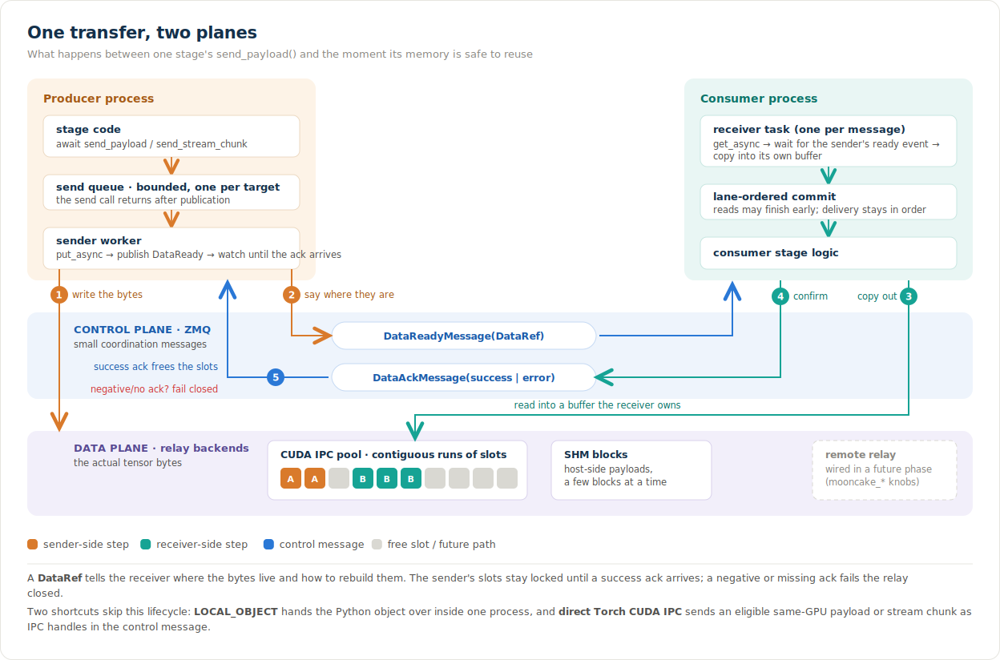
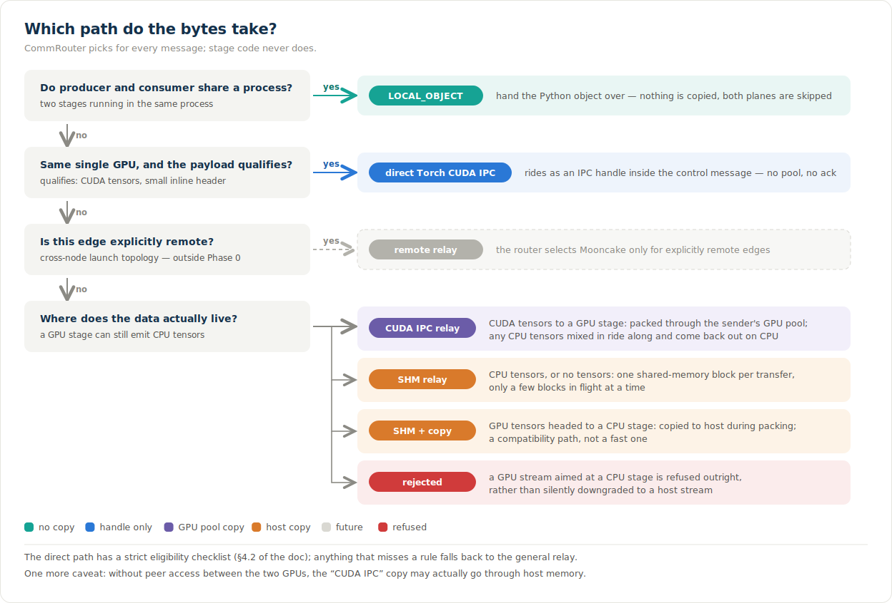
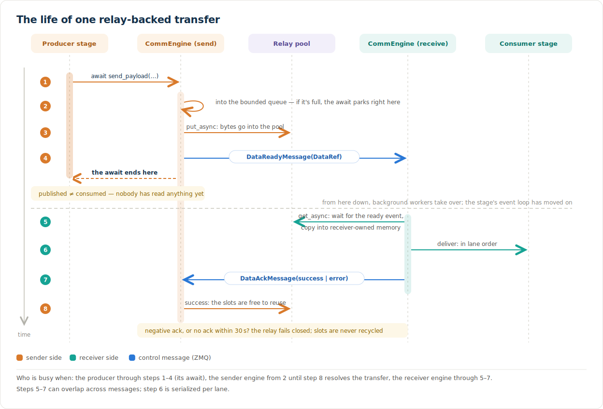

# CommEngine: A Unified Communication Primitive for Multi-Stage Inference

SGLang-Omni runs omni-modal models as multiple stages. Between those stages, tensors and payloads cross process and GPU boundaries, and eventually node boundaries. Alongside those tensors, the runtime moves object-like data for embedding handoff, KV-cache transfer, and distributed weight updates.

The communication layer has to move both efficiently without pushing transport lifetimes into stage code. In practice, model and stage authors should not have to manage CUDA IPC handles, shared-memory lifetime, remote buffer registration, or transport-specific acknowledgements.

Instead, a developer declares the computation graph and placement. The system derives the transport for each message from topology, payload layout, device placement, and backend capability.

## 1. Motivation and goals

A communication substrate for multi-stage inference should provide:

1. **Correct intra-node data movement.** GPU-to-GPU payloads should avoid unnecessary host round trips, receiver-side CUDA synchronization should not block the event loop, and backpressure must be explicit.
2. **Explicit topology and message identity.** Stages need process and device placement, while messages need stable identity: request ID, source stage, target stage, payload kind, and, for streaming data, lane and chunk identity. In Phase 0 the lane `(request_id, from_stage, to_stage)` is the stream identity. The system should be able to explain who talks to whom, which transport it selected, and why.
3. **Explicit completion, ownership, and backpressure.** Enqueuing a send, publishing a handle, materializing receiver-owned data, and reclaiming sender-owned memory are different events. The abstraction must preserve those lifecycle boundaries while keeping backend details out of stage code.
4. **An async stage-facing API.** Waiting for CUDA completion, receiver acknowledgement, or shared-memory cleanup must not block the stage's main event loop.
5. **One data-movement contract.** Normal payloads and streaming chunks should use the same typed reference and relay vocabulary, even when their packing and ordering rules differ.

## 2. Design at a glance

To meet those goals, stage code owns computation and logical routing. Once it selects a target, `CommEngine` takes over the movement lifecycle below stage orchestration and above transport-specific relay backends.



The figure follows one relay-backed transfer from producer to consumer. The control plane carries small coordination messages: `DataReadyMessage` on the way out and `DataAckMessage` on the way back. Meanwhile, the data plane carries the bytes until the receiver copies them into receiver-owned memory.

`DataRef` connects the two planes. It is a typed, versioned description of the data-plane object, not proof that the object has been consumed. Local dispatch takes a shorter route: `LOCAL_OBJECT` passes a Python reference directly through the local runtime and bypasses ZMQ.

### 2.1 Components

| Component | Primary file | Responsibility |
| --- | --- | --- |
| Stage runtime | `pipeline/stage/runtime.py` | Logical routing, fan-in, stream ordering, abort behavior, same-process dispatch, and same-GPU direct-IPC fast paths. |
| `CommEngine` | `comm/engine.py` | Per-target bounded send queues, sender workers, control-message publication, pending-transfer tracking, acknowledgements, and timeouts. |
| `CommRouter` | `comm/router.py` | Classifies locality and payload device, lazily constructs relays, and keeps backend selection out of model code. |
| `stage_io` | `comm/stage_io.py` | Extracts, packs, describes, materializes, and restores tensors for payload and streaming transfers. |
| `DataRef` | `comm/data_ref.py` | Versioned control-plane pointer containing logical layout, tensor metadata, and an opaque backend reference. |
| Relay backends | `relay/{cuda_ipc,shm,mooncake}.py` | Backend-specific allocation, copying, completion, credits, and resource lifetime. |
| Control messages | `proto/messages.py` | `DataReadyMessage` and `DataAckMessage`, including strict identity and success/error validation. |

### 2.2 Core invariants

- **Routing and movement are separate.** The stage chooses a logical target; the router chooses a physical mover.
- **A `DataRef` is descriptive, not a completion token.** It says where bytes live and how to reconstruct them.
- **Relay reads return receiver-owned data.** The general CUDA IPC and SHM paths copy out of sender-owned storage before acknowledging the transfer.
- **Published storage is not reused early.** Sender-owned relay storage remains live until a positive receiver acknowledgement completes the backend operation.
- **Transfer overlap does not relax logical ordering.** Reads may execute concurrently, but delivery into stage logic is committed in wire order for each `(request_id, from_stage)` lane.
- **Backend handles stay below the stage API.** CUDA handles, shared-memory names, events, and remote registration keys are backend metadata.

The same-GPU direct Torch CUDA IPC path is a deliberate fast-path exception to the general relay lifecycle. It places a serialized PyTorch CUDA IPC reference in the control message and delegates storage lifetime to PyTorch's IPC machinery; it does not allocate from the relay pool or use `DataAckMessage`.

Even with that division, the sender and receiver need a wire contract that does not expose backend handles to stage code.

## 3. The wire contract

`DataRef` is that contract for relay-backed transfers. It gives the sender and receiver a backend-neutral description, while stage code never sees backend handles.

### 3.1 `DataRef`

`DataRef` is serialized into `DataReadyMessage.data_ref`. Its top-level schema is backend-neutral:

```text
DataRef
├── kind                 stage_payload | stream_chunk | stream_metadata_tensor | ...
├── object_id            stable transfer identity
├── transport            cuda_ipc | shm | mooncake
├── layout               packed_tensors | raw_tensor | paged | bucketed | scatter
├── buffer
│   ├── transport        must agree with the selected relay
│   ├── length           number of bytes to materialize
│   └── info             opaque backend metadata
├── header               optional tensor-free payload header
├── tensors[]            path, shape, dtype, original device, offset, size
├── shape/dtype/offset   raw-tensor reconstruction fields
└── metadata_tensors[]   separate DataRefs for tensor-valued stream metadata
```

The parser rejects unknown versions and validates exact primitive types. Versioning gives the control plane a place to evolve without teaching stage code about individual backends.

The current payload header is a base64-encoded Python pickle of the tensor-free `StagePayload`. This assumes a trusted cluster and matching application code; it is not a safe deserialization boundary for untrusted senders. A future interoperable or mixed-version protocol should replace or tightly envelope this representation.

### 3.2 Message identity

Relay-backed object IDs are deterministic within a stage edge:

```text
payload:  {request_id}:payload:{from_stage}:{to_stage}
chunk:    {request_id}:stream:{from_stage}:{to_stage}:{chunk_id}
metadata: {chunk_object_id}:meta:{index}
```

`DataAckMessage` echoes the exact `object_id` and reverses the stage direction. Unknown, late, or duplicate acknowledgements are ignored, making acknowledgement handling idempotent after a timeout or shutdown.

`DataReadyMessage` also carries `request_id`, `from_stage`, and `to_stage`. Streaming chunks add a non-negative `chunk_id`; end-of-stream and error signals are control-only messages with no `data_ref`.

`DataRef` records the selected transfer, which means `CommRouter` first has to choose the path.

## 4. Transport selection

"Same node" is not enough information. Process colocation, GPU identity, actual tensor device, payload shape, and backend capability all change the best path and the lifetime contract.



### 4.1 Selection matrix

| Edge and payload | Current path | Notes |
| --- | --- | --- |
| Same process, safe single-target payload or isolated fan-out projection | Local object dispatch | Passes a Python object reference. The receiver must treat nested containers and tensor leaves as read-only for the full queue lifetime. |
| Same process, stream chunk | Local object dispatch | Preserves the original object and metadata by reference. |
| Different process, same single GPU, eligible CUDA payload | Direct Torch CUDA IPC | CUDA tensor leaves are serialized as IPC references; no relay-pool copy or explicit data ack. Can be disabled for full payloads. |
| Different process, same single GPU, eligible CUDA stream chunk | Direct Torch CUDA IPC | Strict eligibility: CUDA data, no CPU tensor metadata, and at most 64 KiB of inline CPU metadata. |
| Same node, GPU producer and GPU consumer, CUDA-bearing payload | CUDA IPC relay | Mixed CPU/CUDA payloads are packed into the CUDA relay buffer; tensor metadata restores CPU leaves to CPU at the receiver. |
| Same node, CPU/no-tensor payload or CPU stream chunk | SHM relay | Host-resident movement with bounded outstanding blocks. |
| CUDA-bearing payload sent to a CPU stage | SHM relay | An explicit compatibility path, not a GPU fast path; packing performs the required device-to-host copy. |
| CUDA stream chunk sent to a non-GPU target | Rejected | The stream contract does not silently reinterpret a GPU stream as a host stream. |
| Cross node | Future remote relay | The router has a Mooncake branch, but normal launch-time remote-edge topology is outside Phase 0. |

For streaming data, selection follows the actual chunk tensor device. Tensor-valued stream metadata is currently moved through the same selected relay as the chunk. Preserving an original CPU device for metadata tensors on a CUDA relay remains an open contract detail; unlike full payload tensor entries, raw metadata tensor refs do not currently carry an original-device field.

### 4.2 Direct same-GPU eligibility

The direct path removes the extra copy through a relay pool, but it is intentionally narrower than the general relay path:

- full payloads must contain at least one CUDA tensor;
- tensors in `StagePayload.request` are rejected;
- CUDA tensor leaves are extracted from `payload.data`, while the remaining pickled header must fit within 64 KiB;
- stream chunks must contain CUDA data, must not contain CPU tensors in data or metadata, and must keep inline CPU values within 64 KiB;
- tensor-parallel or ambiguous multi-GPU targets are not treated as a same-GPU direct target;
- a CUDA tensor already imported from another process can fall back to the relay path when re-export is unsafe.

## 5. Transfer protocols

Once `CommRouter` selects a relay-backed path, the protocol still has to define two boundaries: when the stage's await returns and when the sender can reuse its storage.

### 5.1 Relay-backed transfer lifecycle



The figure uses CUDA IPC slots to make the relay lifecycle concrete. Its acknowledgement timeout starts only after the `DataReadyMessage` has been published, which keeps control-plane publication time out of the receiver's 30-second window. SHM uses the same publication boundary, but a timeout unlinks the block and returns its credit instead of failing the relay closed.

### 5.2 Completion semantics

The two completion points remain separate at the stage API: a relay-backed send returns at publication, even though the sender cannot yet reuse its storage.

| Event | What it guarantees | What it does not guarantee |
| --- | --- | --- |
| Queue admission | The job is accepted by the bounded sender queue. | No buffer has necessarily been allocated. |
| `put_async()` returns | Backend metadata exists and the data operation has been issued. | The receiver has not necessarily opened or copied the data. |
| `send_payload()` / `send_stream_chunk()` returns | `DataReadyMessage` was sent and acknowledgement tracking was armed. | Receiver materialization, stage consumption, and sender-buffer reuse are not complete. |
| Receiver `read_*()` returns | A receiver-owned tensor or payload has been materialized. | Logical downstream computation has not necessarily started. |
| Successful `DataAckMessage` completes | The receiver has materialized the object, so the sender operation may complete and reclaim storage. | The consumer stage has not necessarily finished using its receiver-owned copy. |
| Stream done signal | No more chunks are expected from that producer for the logical stream. | It is not an acknowledgement for any specific data buffer. |

### 5.3 Normal payload packing

To give every relay the same unit of movement, `stage_io.write_payload()` packs the tensor leaves of a normal payload into one flat byte buffer. It recursively extracts tensors from `StagePayload.data`, replaces each tensor with a path placeholder, and then:

1. makes every tensor contiguous;
2. views it as bytes;
3. moves it to the selected relay device when needed;
4. inserts dtype-alignment padding;
5. concatenates the tensors into one flat `uint8` buffer; and
6. records `TensorMeta(path, shape, dtype, original_device, offset, size)`.

A tensor-free payload still sends a one-byte sentinel buffer so every relay sees a valid transfer object. On read, the receiver allocates a byte buffer of `DataRef.buffer.length`, waits for `get_async()`, reconstructs tensor views by offset and dtype, restores CPU tensor leaves to CPU, and reinserts them into the decoded header.

Above that flat byte tensor, the nested logical payload is preserved.

### 5.4 Streaming chunks and ordering

Streaming keeps the same `DataRef` vocabulary, but its packing and ordering rules differ. A stream chunk uses a raw-tensor `DataRef` and a monotonic `chunk_id` scoped to `(request_id, target_stage)`. Ordinary metadata stays inline. Tensor-valued metadata is extracted into additional raw-tensor refs and participates in the same sender acknowledgement as the main chunk.

The receiver schedules each `DataReadyMessage` as its own task, so independent relay reads and CUDA waits can overlap. Before data is handed to fan-in logic or the scheduler, the task waits for its predecessor in the `(request_id, from_stage)` lane. This separates two concerns:

```text
wire arrival:      chunk 0 ---- chunk 1 ---- chunk 2 ---- done
data movement:       [read 0-----------]
                          [read 1---]
                               [read 2------]
logical commit:           0 ---- 1 --------- 2 ---- done
```

The fast chunk is not allowed to overtake an earlier slow chunk, but it can finish its transport work while that earlier chunk is still in flight.

CUDA IPC and SHM follow this relay-backed lifecycle; the CUDA IPC path implements it with a bounded sender-owned GPU pool.

## 6. CUDA IPC relay

The general CUDA IPC path is a sender-owned, bounded GPU pool. It is an NVLink/P2P-capable path when the hardware topology and CUDA peer access support it; CUDA warns and may stage through host memory when peer access is unavailable, so "CUDA IPC" should not be read as an unconditional NVLink guarantee.

### 6.1 Pool layout and allocation

The pool is allocated lazily on first use and divided into fixed-size slots. A transfer consumes a contiguous run:

```text
pool_size = configured cuda_ipc_pool_size_mb
         or slot_size_mb × credits                 # legacy-derived default

num_slots(payload) = max(1, ceil(payload_bytes / slot_bytes))

Default: 1 GiB pool = 16,384 slots × 64 KiB

slot:    0   1   2   3   4   5   6   7   ...
state:  [A] [A] [.] [B] [B] [B] [.] [.] ...
        └ A: 2-slot transfer   └ B: 3-slot transfer
```

Allocation waits asynchronously until a sufficiently large contiguous run is available. This is real byte-capacity backpressure. It also means fragmentation matters: total free slots can be sufficient while the largest free run is too small. Trace events report free slots, largest free run, number of free runs, and allocation wait rounds so this condition is observable.

The `credits=2` setting no longer means "only two CUDA transfers" in the pooled implementation. When no explicit pool size is provided, it contributes to the default pool-size calculation (`512 MiB × 2 = 1 GiB`). SHM still interprets `credits` as a count of outstanding blocks.

### 6.2 Write and read path

On write, the relay:

1. acquires a contiguous slot range;
2. enqueues a non-blocking copy into the pool;
3. records an interprocess CUDA ready event;
4. exports the pool storage once per receiver identity and caches that export; and
5. returns metadata containing the pool ID, storage handle, byte offset, slot range, source device, and ready-event handle.

On read, the receiver:

1. imports or reuses the remote pool by `pool_id`;
2. validates the requested byte and slot range;
3. checks CUDA peer accessibility;
4. imports the ready event on the destination device;
5. enqueues `stream.wait_event(ready_event)` followed by a non-blocking copy into receiver-owned storage; and
6. records a local completion event.

If the completion event is already ready, `event.query()` completes the await immediately. Otherwise `event.synchronize()` runs in a bounded `ThreadPoolExecutor` rather than on the asyncio loop. The default executor has eight threads and can be tuned with `SGLANG_OMNI_CUDA_IPC_WAIT_THREADS`.

This is async from the stage loop's point of view, but it is not a native CUDA callback or completion queue. Executor queue time and event-loop resume time are traced separately, which makes thread-pool saturation measurable.

### 6.3 Reclamation and failure

After the receiver-side copy completes, the sender retains the source view, ready event, and slot allocation until a successful `DataAckMessage` arrives. Only then does it release the contiguous slot range.

On a negative acknowledgement or timeout, the CUDA relay fails closed. It does not immediately reuse a slot that a failed or partitioned receiver might still access; instead, it marks the relay failed so blocked and future puts fail rather than hang behind leaked capacity or risk corrupt reuse. Recovery currently requires rebuilding the relay/stage process.

## 7. Shared-memory relay

The SHM relay applies the same ownership lifecycle to the same-node host path. Each put acquires a semaphore credit, creates a right-sized `multiprocessing.shared_memory` block, copies the flattened CPU tensor into it, and publishes the block name and size.

The receiver opens the block, copies it into receiver-owned CPU storage, closes and unlinks it, then sends a data acknowledgement. The sender releases its semaphore credit when the acknowledgement completes its `ShmPutOperation`.

If the receiver does not consume a block before the timeout, the sender attempts to unlink it, reports a contextual timeout, and releases the credit. The default is two outstanding SHM blocks per stage relay. This is count-based backpressure, not byte-based backpressure: very different payload sizes consume the same one credit.

CUDA IPC bounds bytes in a pool. SHM bounds live blocks instead, which is why backpressure appears at more than one layer.

## 8. Backpressure and concurrency model

Backpressure exists at several layers and each protects a different resource:

| Layer | Mechanism | Scope | Release condition |
| --- | --- | --- | --- |
| Stage to `CommEngine` | Bounded asyncio send queue (internal default 1,024) | One queue per target stage | Sender worker removes the job. |
| CUDA IPC | Contiguous fixed-slot allocator | Bytes in one sender GPU pool | Successful ack and put-operation completion; failures fail the relay closed. |
| SHM | Async semaphore (`credits`, default 2) | Number of live shared-memory blocks | Ack/timeout completes the put operation. |
| Receiver completion | Bounded CUDA event-wait executor (default 8 threads) | Host-side waits for non-ready CUDA events | CUDA completion returns or times out. |
| Logical ordering | Per `(request_id, from_stage)` predecessor chain | Delivery into stage logic | Earlier message commits or fails. |

For each edge, the per-target sender worker prepares jobs and publishes control messages one at a time. Once published, however, transfers remain in flight under independent acknowledgement watchers. On the receiver side, tasks can overlap transport work, and only the commit into stage logic is serialized. This keeps CUDA completion off the main receive loop without changing the ordering guarantee.

## 9. Failure, abort, and shutdown semantics

When a request fails or is aborted, every pending transfer still has to terminate. In particular, the receiver cannot ignore a handle that has already been published.

| Failure | Required behavior in Phase 0 |
| --- | --- |
| Control publication fails | The sender future fails and the registered backend operation is failed; no successful send is reported. |
| Receiver materialization fails | Receiver sends `DataAckMessage(success=false, error=...)`, performs best-effort cleanup, and reports the request/stream failure. |
| Ack is late or duplicated | Sender ignores it if the pending transfer no longer exists. |
| Ack times out | SHM unlinks and returns credit; CUDA IPC fails the relay closed to prevent unsafe slot reuse. |
| Request is already aborted when data arrives | Receiver drains/imports the published data reference and acknowledges where applicable, then discards the materialized value. |
| Stage shuts down | Send workers and receive tasks are cancelled, pending transfers fail, and relay-global resources are closed. |

Draining already-published references is important. The CUDA IPC and SHM `cleanup(request_id)` hooks are currently limited, so a receiver cannot treat an abort as permission to ignore a published handle. It must consume or explicitly fail the transfer so the sender's lifecycle can terminate.

Because stage authors do not handle these failure and lifetime rules, their API stays focused on placement and ordinary payloads, while capacity remains an operational concern.

## 10. Intended developer surface

Transport is derived from placement and data. Configuration may tune capacity, but it does not select a backend:

```python
from sglang_omni.config.schema import CommConfig, StageConfig

stages = [
    StageConfig(
        name="encoder",
        factory="my_pipeline.create_encoder",
        gpu=0,
        next="thinker",
    ),
    StageConfig(
        name="thinker",
        factory="my_pipeline.create_thinker",
        gpu=1,
        stream_to=["talker"],
        next="talker",
        comm=CommConfig(
            cuda_ipc_slot_size_kb=64,
            cuda_ipc_pool_size_mb=1024,
        ),
    ),
    StageConfig(
        name="talker",
        factory="my_pipeline.create_talker",
        gpu=2,
        terminal=True,
    ),
]
```

Stage and model authors produce ordinary `StagePayload` objects and stream items. They do not write a transport name, CUDA IPC handle, shared-memory unlink, remote rkey/session exchange, or acknowledgement. Those belong to the communication substrate.

Capacity knobs are operational rather than semantic:

| Knob | Default | Meaning |
| --- | ---: | --- |
| `slot_size_mb` | 512 MiB | Legacy relay slot size and part of the default CUDA pool-size calculation. |
| `credits` | 2 | SHM outstanding-block count; also part of the legacy-derived CUDA pool size when no explicit pool is set. |
| `cuda_ipc_slot_size_kb` | 64 KiB | Allocation granularity for the CUDA IPC pool. |
| `cuda_ipc_pool_size_mb` | unset | Explicit CUDA IPC pool capacity; unset derives 1 GiB from the two legacy knobs. |
| `mooncake_*` | backend-specific | Reserved connection tuning for a future wired remote path. |
