# Understanding the Code Structure of SGLang Omni, Starting from Qwen3-Omni

This article does a complete code walkthrough of SGLang Omni — an omni-modal inference framework — starting from the requirements of Qwen3-Omni. The focus is not on explaining some class or function in isolation, but on following the lifecycle of a real request to understand why this system was designed the way it is, and what problem each of these designs is solving.

This document is based on commit [2489a10](https://github.com/sgl-project/sglang-omni/commit/2489a10) of [sglang-omni](https://github.com/sgl-project/sglang-omni). Subsequent iterations on benchmarking and tests do not affect the main framework structure discussed here, so they do not change the overall analysis.

The diagram below is an overall map of what this article covers: from locating the repository, the core architecture, and the request lifecycle, to the directory structure and typical usage scenarios. You can skim it first to build an overall impression, then read the following sections with this map in mind.

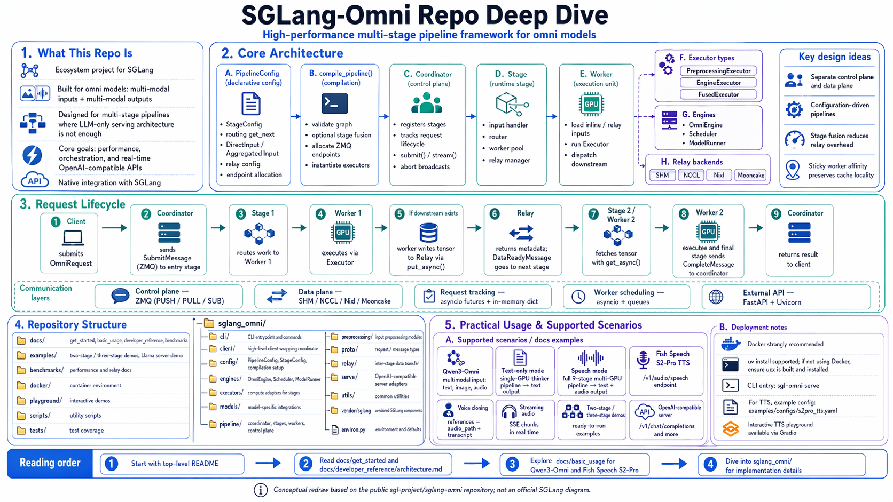

## Table of Contents

- [Introduction to the SGLang Omni Framework](#introduction-to-the-sglang-omni-framework)
- [Qwen3-Omni Model Architecture](#qwen3-omni-model-architecture)
- [Why It Can't Be Developed Directly Inside SGLang](#why-it-cant-be-developed-directly-inside-sglang)
  - [Why You Can't Run All Models Serially in a Single Process](#why-you-cant-run-all-models-serially-in-a-single-process)
  - [Why Split Into Multiple Stages Instead of Using One Big Loop](#why-split-into-multiple-stages-instead-of-using-one-big-loop)
- [SGLang Omni's Solution: A Multi-Process Async Producer-Consumer Pipeline](#sglang-omnis-solution-a-multi-process-async-producer-consumer-pipeline)
  - [Architecture Overview](#architecture-overview)
  - [Declarative Config → Runtime Compilation](#declarative-config--runtime-compilation)
- [Overall Pipeline Architecture](#overall-pipeline-architecture)
  - [Coordinator](#coordinator)
  - [Control Plane vs Data Plane](#control-plane-vs-data-plane)
  - [Control Plane](#control-plane)
  - [Stage](#stage)
  - [Worker](#worker)
  - [Executor](#executor)
- [The Full Request-Processing Flow](#the-full-request-processing-flow)
  - [Stage 1: Preprocessing](#stage-1-preprocessing)
  - [Stage 2-3: Image Encoder & Audio Encoder](#stage-2-3-image-encoder--audio-encoder)
  - [Stage 4: Aggregate](#stage-4-aggregate)
  - [Stage 5: Thinker (Main Model Inference)](#stage-5-thinker-main-model-inference)
  - [Stage 6: Decode (Output Decoding)](#stage-6-detokenize-output-decoding)
  - [Stage 7-9: Speech Pipeline](#stage-7-9-speech-pipeline)
- [OmniEngine: The Scheduling and Execution Engine](#omniengine-the-scheduling-and-execution-engine)
- [Core Data Structures](#core-data-structures)
- [Mechanisms in Depth](#mechanisms-in-depth)
  - [Streaming (stream_to)](#streaming-stream_to)
  - [The Feedback Loop (Talker ↔ Code Predictor)](#the-feedback-loop-talker--code-predictor)
  - [Abort Cleanup](#abort-cleanup)
  - [Multi-Process Deployment](#multi-process-deployment)
- [Key Design Patterns](#key-design-patterns)
- [Criticism and Reflection](#criticism-and-reflection)

---

## Introduction to the SGLang Omni Framework

Before diving into the modeling details of Qwen3-Omni, let's first put the SGLang Omni framework itself clearly on the table. It is not a simple serving shell that wraps an HTTP interface around a single model, but rather a Stage-based runtime targeting omni models. More concretely, it organizes the entire chain into a **multi-process async producer-consumer pipeline**: on the input side it supports multimodal content such as text, images, video, and audio; on the output side it can return either text or continue down the speech path to generate audio.

The most central idea of this framework is to split a request into multiple cooperating Stages, and let these Stages advance asynchronously as independent processes. Each Stage only cares about what its own step should do — for example preprocessing, encoding, aggregation, main-model inference, speech generation, or final decoding; upstream Stages produce incremental results, and downstream Stages consume them at their own pace. As a request flows between Stages, the corresponding `PipelineState` is continually enriched. The benefit of doing this is that the model's real compute graph is no longer forced into a single-line flow, but can naturally express fan-out, fan-in, streaming, and multi-terminal aggregation.

From a runtime perspective, SGLang Omni is composed mainly of three layers:

1. `Coordinator`: responsible for the request entry point, final-result aggregation, and abort broadcasting.
2. `Stage / Worker / Executor`: responsible for actually running each step of computation, and deciding where results should go next.
3. `Control Plane + Data Plane`: the former transmits control messages via ZMQ, the latter transmits the actual tensor data via shared memory, NCCL, or CUDA IPC.

To summarize in a more engineering-oriented sentence: what SGLang Omni does is, on top of the model computation itself, add a layer of runtime capable of carrying a multi-model DAG, cross-stage streaming communication, and heterogeneous deployment. The following sections will first use Qwen3-Omni to explain why such a runtime is necessary, and then further break down how it is implemented in code.

## Qwen3-Omni Model Architecture

For Qwen3-Omni's Thinker-Talker dual-model architecture, the per-frame inference flow of Talker / MTP / Code2Wav, and its comparison with Dual-AR models like Fish Audio S2 Pro, see the section "Thinker-Talker model inference, represented by Qwen3-Omni" in [transformers/omni/readme.md](../../transformers/omni/readme.md). That article leans more toward the model's compute flow; this article puts the emphasis on serving and system implementation, discussing what these model requirements actually mean at the engineering level.

## Why It Can't Be Developed Directly Inside SGLang

After understanding the model structure of Qwen3-Omni, a very natural question arises: **why not just build it directly inside SGLang?**

If answered purely on intuition, this question is easy to overstate. Mainline SGLang is actually not completely without audio or omni capabilities; on the contrary, it already supports quite a few audio inputs, multimodal understanding, and ASR models. But if you shift the perspective to the `srt` main runtime, its most mature abstraction is still closer to **"one main model, one main inference path"**:

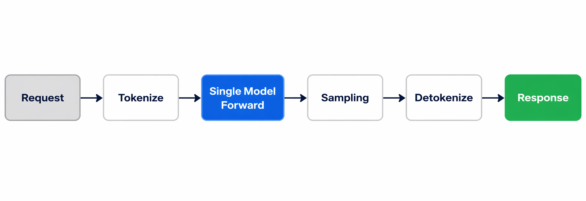


Whereas what Qwen3-Omni needs is a **multi-model collaborative system**:

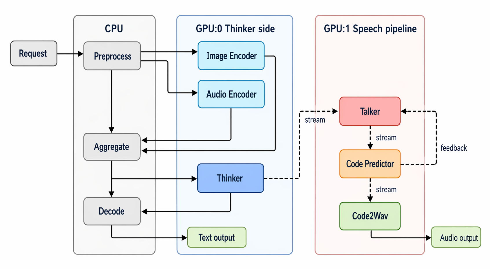

If we follow along with mainline SGLang's current code and docs, we find that the officially supported model list already puts Qwen3-ASR under [`/v1/audio/transcriptions`](https://github.com/sgl-project/sglang/blob/main/docs/supported_models/text_generation/multimodal_language_models.md#L54-L90) support, which shows that the audio transcription path was already within mainline's scope. But the same page also states clearly that Qwen3-Omni currently only supports Thinker [link](https://github.com/sgl-project/sglang/blob/main/docs/supported_models/text_generation/multimodal_language_models.md#L54-L55) — that is, the understanding half (text, image, audio, video understanding) has been wired in, but the speech generation corresponding to Talker has not. In other words, what mainline currently integrates is the understanding backbone of Omni, not the complete speech pipeline. SGLang already supports the understanding-oriented half of the Omni system, and also supports ASR and multimodal input, but the complete Qwen3-Omni has not yet been wired into the main runtime. To accommodate this latest model, the need for a brand-new framework becomes self-evident. Mainline SGLang is better at making single-backbone models, multimodal understanding, and high-throughput serving efficient and stable; whereas the complete Qwen3-Omni continues to push the problem toward dual-backbone collaboration, cross-model state flow, and heterogeneous scheduling.


| SGLang's assumptions | Qwen3-Omni's requirements                                                           | Conflict          |
| ---------- | ------------------------------------------------------------------------ | ----------- |
| Single model       | Multiple execution units collaborate, but the core pressure concentrates on the Thinker / Talker dual backbone                                   | More like multi-model temporal orchestration   |
| Unified deployment     | Modular deployment, or further discussion of Thinker / Talker co-GPU placement                        | Needs placement and resource coordination |
| Linear request flow      | The DAG topology is only surface appearance; what truly matters is causally-dependent temporal advancement                                           | The key is temporal orchestration, not static routing |
| Independent requests       | There are incremental dependencies between models (Thinker feeds Talker token by token) and bidirectional feedback (Talker ↔ Code Predictor)         | Needs cross-model streaming state coordination |
| Single output       | Dual-terminal output (text + speech), needs to wait for both paths to finish                                                   | Needs terminal-state aggregation      |
| Unified scheduling       | Thinker / Talker are heavy scheduling objects, while modules like Code Predictor only need lightweight execution                          | Needs layered heterogeneous scheduling    |


【TODO: A lot of these perceptions are wrong. First, SGLang of course supports vocoders, encoders, and so on; MTP is not a problem either — none of these are essential. I think the most essential problem is that Thinker and Talker are two models of almost equal size, and their placement is actually well worth thinking about; moreover, I have a strong feeling that if we can put Thinker and Talker on the same GPU, the KV cache size of each is a very interesting question — a 50/50 split is not necessarily optimal.】

Answer: Right, the focus here really shouldn't fall on component-level questions like "can SGLang support encoder / vocoder / MTP." The more central issue is how two decode backbones of roughly the same magnitude do placement, and how the corresponding KV cache, GPU memory, and bandwidth are partitioned. In other words, Qwen3-Omni truly pushes the problem from "single-model capability extension" to "dual-backbone resource coordination + cross-model temporal orchestration."

【The request flow is a very important problem; essentially, is the sequence diagram what matters most?】

【Streaming requests are also not a problem — SGLang of course supports streaming requests.】

【Two-path output is indeed a distinction.】

【For scheduling, Talker's scheduling should be far more important than Code Predictor's; I'd guess Talker's scheduling can be about the same as Thinker's.】

If we treat the table above as a checklist, the real question next is not "do these requirements exist" but "which are the core pressures that determine the system's shape." From this angle, the difficulty of Qwen3-Omni does not mainly lie in whether components like encoder, vocoder, or MTP can be supported, but in the fact that the serving problem has expanded from single-model inference into multi-model temporal coordination. What truly deserves careful discussion is how the two roughly-equal-magnitude models Thinker and Talker do placement, and how the incremental information flow between them is scheduled.

**1. Thinker / Talker placement and resource partitioning**: The most essential problem is not "there are many models," but how the two heavy decode backbones Thinker and Talker are placed. If they are deployed across GPUs, the problem falls on cross-device transfer and rhythm coordination; if they share a single GPU, the problem becomes GPU-memory partitioning, KV cache size, bandwidth contention, and the mutual impact on decode rhythm. What's truly hard here is resource coordination, not the simple two words "multi-model."

**2. Temporal transfer and cross-model incremental state**: fan-out / fan-in is only a description of static topology; what truly determines runtime complexity is the temporal diagram — when can Thinker's token be handed to Talker, when is aggregate finally ready, when must Talker wait for feedback. These all belong to temporal advancement with causal constraints. And client-facing streaming itself is nothing new — SGLang of course supports streaming requests. The truly new part is landing this temporal advancement onto the incremental state transfer between models and stages: Thinker produces token by token, Talker consumes incrementally, and when necessary it must also handle backpressure, caching, and recovery. So the difficulty is not "is there branching and merging" or "can it stream," but whether these branches, merges, and streaming states can be correctly orchestrated in time and safely passed across models.

**3. Feedback loop and execution resumption**: The bidirectional feedback between Talker and Code Predictor requires the system to support an execution mode of "generate one step -> pause -> wait for external result -> resume." This goes a step further than one-way streaming, because the runtime is not just moving data around — it must explicitly manage request state, pause points, and resume points.

**4. Dual-terminal aggregation and layered scheduling**: The dual output of text and speech is indeed a distinction, but it is more like a runtime / coordinator layer problem, and relatively direct; what truly deserves distinguishing is the scheduling hierarchy. Both Thinker and Talker are heavy scheduling objects that need continuous decode, KV cache maintenance, and rhythm control, whereas Code Predictor, Vocoder, and some encoders are more like lightweight execution units. That is, the system is not "every module needs a scheduler of the same level," but needs a layered, heterogeneous view of scheduling.

It must be emphasized that the conclusion here is not "these capabilities absolutely cannot be built into SGLang," but "if you want to fill in the complete Qwen3-Omni following the mainline `srt` approach, the workload will grow noticeably." The reason is also not that mainline capabilities are insufficient, but that the optimization goals differ: mainline SGLang currently focuses on single-backbone models, audio understanding, multimodal input, and high-throughput serving; whereas the complete Qwen3-Omni further requires Thinker / Talker placement, cross-model incremental state, feedback resumption, dual-terminal aggregation, and layered scheduling. Once all these requirements enter the main runtime, the scheduler gradually moves from single-model queue management toward general temporal orchestration — which is itself another class of systems problem.

【TODO: Partially agree. I'm rather picky about these things, not because I like nitpicking details, but because I want to reuse SGLang's existing abstractions to the greatest extent. Including that we might use SGLang entirely for the encode part. In short, I think one shouldn't overestimate the complexity of this task. Like RL systems, the simpler, the more powerful.】

Answer: This reminder also holds. A more accurate statement is not "we must rebuild a heavy new framework from scratch," but "we need to add a minimal, just-enough layer of runtime orchestration on top of existing SGLang abstractions." Encoders, single-model decode, and some streaming capabilities can all be reused directly; new complexity should be converged as much as possible onto Thinker / Talker coordination, the feedback loop, and terminal-state aggregation, rather than reinventing everything.

### Why You Can't Run All Models Serially in a Single Process

An intuitive question: **since SGLang doesn't work, why don't I just skip SGLang's scheduling and write a function that chains all the models together?**

```python
# Pseudocode: the most naive serial approach
def process_request(request):
    state = preprocess(request)              # CPU
    image_embeds = image_encoder(state)      # GPU
    audio_embeds = audio_encoder(state)      # GPU (only starts after image_encoder finishes)
    merged = aggregate(state, image_embeds, audio_embeds)  # CPU
    text_tokens = thinker(merged)            # GPU:0 (next step only after thinker fully finishes)
    text_result = decode(text_tokens)        # CPU
    codec_tokens = talker(text_tokens)       # GPU:1 (only starts after thinker fully finishes)
    codes = code_predictor(codec_tokens)     # GPU:1
    audio = code2wav(codes)                  # GPU:1
    return text_result, audio
```

This version can of course "run," but the system-level problems are actually quite direct — in short, there are three:

- **Parallelism gets flattened**: `image_encoder` and `audio_encoder` could originally run in parallel, but now they can only execute in line; CPU, GPU:0, and GPU:1 also frequently wait on each other, spending a lot of time idle.
- **No streaming**: Talker must wait until Thinker is completely done before it can start — this is the opposite of the incremental coordination that Qwen3-Omni truly needs. Suppose Thinker generates 100 tokens at 30ms each, and Talker takes 20ms per step; then in the serial case, the time-to-first-audio is roughly `3000ms + 20ms = 3020ms`; if changed to streaming parallelism, the time-to-first-audio approaches `30ms + 20ms = 50ms`.
- **Hard to maintain as the chain grows**: kneading CPU preprocessing, multi-path encoders, Thinker, Talker, Code Predictor, and Code2Wav into one big function means that later, once you add a bit more concurrency, fault tolerance, scaling, or cross-GPU coordination, the complexity spirals out of control.

So the problem here is not "can you write a serial function that gets it working," but that this style of writing inherently flattens both Qwen3-Omni's parallel structure and its streaming structure. It can serve as a functional validation, but it's hard to become a scalable serving solution.

### Why Split Into Multiple Stages Instead of Using One Big Loop

Going one step further, a very natural follow-up question is: **since the problem is linear serialization, if I use `asyncio` in a single process to bring up all these modules, is that enough?**

```python
# Pseudocode: single-process async approach
async def process_request(request):
    state = await preprocess(request)
    img_task = asyncio.create_task(image_encoder(state))
    aud_task = asyncio.create_task(audio_encoder(state))
    img_embeds, aud_embeds = await asyncio.gather(img_task, aud_task)  # parallel
    merged = aggregate(state, img_embeds, aud_embeds)
    # ... thinker streams output to talker ...
```

【TODO: So the core is trying to say, make it a multi-process async producer-consumer model?】

Answer: You could summarize it that way, but the keyword is not simply "multi-process," but "an async producer-consumer model that partitions device boundaries, scheduling boundaries, and lifecycle boundaries by stage." Multi-process is just the most natural current way to land it, not the sole goal; the real goal is to cleanly separate the resource management and temporal coordination of different models.

You can understand it this way, and this statement is actually already very close to the core. More precisely, what SGLang Omni wants to do is not "cram all models into one big loop and run them async," but split the entire chain into a **multi-process async producer-consumer model**: upstream Stages are responsible for producing intermediate state and incremental results, downstream Stages are responsible for consuming at their own pace, and the Coordinator is responsible for routing, aggregation, and lifecycle management.

This idea is certainly a step beyond pure serial, because it at least acknowledges the fact that "different stages can advance in parallel." But if you continue pushing down from the perspective of engineering realization and serving frameworks, you'll find that single-process async only pushes the problem back one layer — it doesn't truly solve the system boundary, resource boundary, and scheduling boundary. The core problems fall into the following categories:

**1. GPU memory isolation**

Thinker is on GPU:0, Talker is on GPU:1. If you manage multiple large models on multiple GPUs within the same process, the CUDA context, memory allocation, stream synchronization, and error propagation all get coupled to each other. After splitting them into independent processes, each process only maintains its own device view, the boundaries become much clearer, and resource interference is easier to control.

**2. Different scheduling policies**

Thinker needs continuous batching — it must manage KV cache, dynamic batch changes, and decode rhythm; Code Predictor is more like a lightweight step-by-step forward module, and its scheduling needs are of a completely different magnitude. If forced into one process, you either build an extremely complex unified scheduler that kneads all models into one abstraction, or each module writes its own local logic and it ultimately becomes a hard-to-maintain hybrid. After splitting into Stages, each stage can instead choose the executor and scheduling policy best suited to itself.

**3. Fault isolation**

In a production system, one model OOMing, hanging, or crashing locally should not drag the entire request chain down with it. After splitting into independent processes, faults are naturally confined within stage boundaries, and recovery strategies are more direct.

**4. Bottleneck optimization and on-demand trimming**

If the bottleneck is at Thinker, then you should support scaling and optimizing around Thinker alone; if some scenario doesn't need speech output, you should be able to directly cut talker_ar / code_predictor / code2wav. The value of Stage-ification is that you can both do local optimization around the bottleneck module and trim the pipeline by scenario, without rewriting the backbone framework.

**5. Communication efficiency**

There's a common misconception here: multi-process does not automatically equal "data is copied back and forth, communication must be heavy." The truly reasonable approach is to let what's transferred between Stages be mainly **metadata** — that is, "where the data is in shared memory or device memory"; while the truly large tensors travel over shared memory, CUDA IPC, or NCCL. After the control flow and data flow are separated this way, the communication cost of multi-process is not as exaggerated as intuition might suggest.

## SGLang Omni's Solution: A Multi-Process Async Producer-Consumer Pipeline

SGLang Omni's core idea can be summarized in one sentence: **try not to stuff Qwen3-Omni's complexity back inside SGLang, but add a dedicated orchestration layer on top of SGLang.** In this orchestration layer, a multimodal request is split into multiple Stages; these Stages run asynchronously as independent processes, exchange messages through the control plane and data plane, and overall form a producer-consumer-style pipeline.

### Architecture Overview

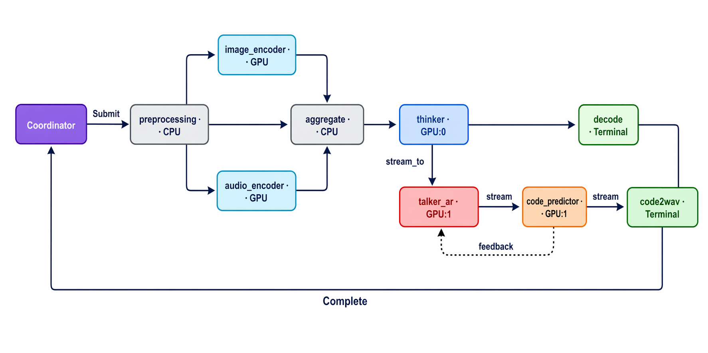


From the current code, this framework already serves more than just Qwen3-Omni — it has begun evolving toward a "reusable omni serving skeleton." At least at the interface level, it already supports the following two classes of models:


| Model             | # Stages                         | Speech architecture                                              | Characteristics                            |
| -------------- | ------------------------------- | ------------------------------------------------- | ----------------------------- |
| **Qwen3-Omni** | 9 (text+speech) / 6 (text-only) | RVQ codec (Talker AR → Code Predictor → Code2Wav) | Thinker-Talker separation, feedback loop |
| **Ming-Omni**  | 7 (text+speech) / 5 (text-only) | CFM flow matching (DiT + Aggregator + AudioVAE)   | Self-contained Talker, no feedback         |


Taking Qwen3-Omni with speech output as an example, the complete pipeline is split into **9 Stages**:


| Stage          | Position  | Device    | Role                                                           |
| -------------- | --- | ----- | ------------------------------------------------------------ |
| preprocessing  | Entry  | CPU   | Text tokenize, multimedia parsing                                            |
| image_encoder  | Encode  | GPU   | Vision Transformer encodes images/video                                   |
| audio_encoder  | Encode  | GPU   | Audio Mel spectrogram encoding                                                  |
| aggregate      | Aggregate  | CPU   | Merge text tokens with encoder outputs (fan-in)                                   |
| thinker        | Inference  | GPU:0 | MoE Transformer main model, generates text tokens (fan-out to decode + talker_ar) |
| decode         | Output  | CPU   | Text post-processing (Terminal)                                              |
| talker_ar      | Speech  | GPU:1 | Autoregressive generation of speech codec tokens                                         |
| code_predictor | Speech  | GPU:1 | RVQ multi-layer code prediction (bidirectional feedback)                                       |
| code2wav       | Speech  | GPU:1 | Vocoder synthesizes audio waveform (Terminal)                                     |


This Stage table is not a simple "one-by-one translation" of model components into engineering modules; rather, it lands the abstract pressures mentioned earlier, item by item, into the system structure: fan-in/fan-out corresponds to DAG routing, `stream_to` corresponds to cross-model streaming, `WAITING_FEEDBACK` corresponds to the feedback loop, and multi-Terminal aggregation is responsible for regathering the two terminal states of text and speech back into the same request result.

### Declarative Config → Runtime Compilation

A very representative design in this framework is: extracting the pipeline topology out of hardcoded logic and instead describing it with **declarative config**. That is, the framework does not presuppose "a request must go through which fixed steps," but delegates this to the model config layer:

```python
# sglang_omni/models/qwen3_omni/config.py
class Qwen3OmniSpeechPipelineConfig(PipelineConfig):
    entry_stage = "preprocessing"
    terminal_stages = ["decode", "code2wav"]
    gpu_placement = {"thinker": 0, "talker_ar": 1, "code_predictor": 1, "code2wav": 1}
    stages = [
        StageConfig(name="preprocessing", executor=..., get_next=preprocessing_next, ...),
        StageConfig(name="image_encoder",  executor=..., get_next=encoder_next, ...),
        StageConfig(name="audio_encoder",  executor=..., get_next=encoder_next, ...),
        StageConfig(name="mm_aggregate",   executor=..., get_next=aggregate_next,
                    input_handler=AggregatedInput(sources=["preprocessing", "image_encoder", "audio_encoder"])),
        StageConfig(name="thinker",        executor=..., get_next=thinker_next_speech,
                    stream_to=["talker_ar"]),          # streaming hidden states
        StageConfig(name="decode",         executor=..., get_next=None),   # Terminal
        StageConfig(name="talker_ar",      executor=..., get_next=talker_ar_next,
                    stream_to=["code_predictor"]),
        StageConfig(name="code_predictor", executor=..., get_next=code_predictor_next,
                    stream_to=["code2wav", "talker_ar"]),  # dual path: code2wav + feedback
        StageConfig(name="code2wav",       executor=..., get_next=None),   # Terminal
    ]
```

Then `compile_pipeline()` compiles it into a runnable object:

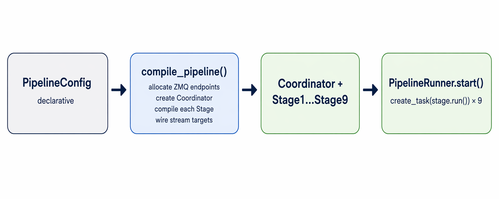


What this design truly wants to buy is that "model differences are expressed as much as possible in the config and executor, rather than in the framework backbone." Judging by the result, it at least achieves this goal to some extent: when **Ming-Omni** (Ming-flash-omni-2.0) was later added, even though the speech part had switched to a completely different CFM/DiT flow-matching route, the framework backbone was essentially unchanged — only a new `PipelineConfig` and corresponding executor were added.

Furthermore, the framework also introduces a **Config Variant** mechanism, allowing the same model to carve out different pipelines by scenario:

```python
# Qwen3-Omni's two variants
Variants = {
    "text": Qwen3OmniPipelineConfig,       # 6 stages, text-only output
    "speech": Qwen3OmniSpeechPipelineConfig, # 9 stages, text + speech
}
# Selected at startup: --variant speech
```

---

## Overall Pipeline Architecture

### Coordinator

The [Coordinator](https://github.com/sgl-project/sglang-omni/blob/main/sglang_omni/pipeline/coordinator.py) is the entry and exit of the entire pipeline (the code is only 395 lines), and it does only three things:

1. **Gatekeeper (request entry)**: wraps the user request as a `StagePayload`, sends a `SubmitMessage` to the entry Stage, then records "I've sent out this request_id." **It doesn't care about request content, and doesn't participate in intermediate routing.**
2. **Mailroom (completion aggregation)**: waits for the terminal Stages (`decode` and `code2wav`) to both report completion, then merges `partial_results` and returns them to the user. When only one terminal completes, it keeps waiting for the other.
3. **Broadcast station (Abort)**: when the user disconnects, it broadcasts to all Stages via PUB/SUB that "this request doesn't need to be done." Because it doesn't know which Stage the request is in, it broadcasts to everyone.

【TODO: Have we implemented this currently? This exit-queue mechanism should have to be implemented in every stage? And it must guard against the case where some stage can't stop and still has to pass to the next stage — like the encoder can't stop, it has to send to Thinker no matter what.】

Answer: What's currently implemented is per-request best-effort abort: the Coordinator broadcasts an `AbortMessage`, and each Stage, in `_on_abort()`, cleans up its local aggregation state, router bindings, relay, and stream queue, and notifies the executor to `abort(request_id)`. It is not a protocol with "exit-queue / graceful drain" semantics, so it does not guarantee that a half-run encoder will surely deliver its result steadily to Thinker. More precisely, the current semantics are "stop as soon as possible and let downstream stages discard this request," not "even upon abort, safely flush the in-flight result all the way to the end."

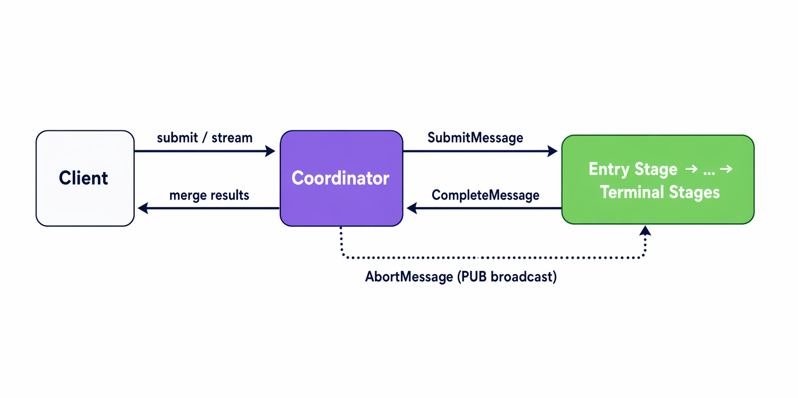


There's a very important boundary here: **the Coordinator is not responsible for intermediate routing between Stages.** The matter of "where should the result go after preprocessing finishes" is not centrally scheduled by the Coordinator, but decided by each Stage's own `get_next`. In other words, the Coordinator is more like a request entry and result gatherer, not a global workflow scheduler.

Key methods:

- `submit(request_id, request)` — submit a request and wait for completion
- `stream(request_id, request)` — submit a request and return results in a streaming fashion
- `run_completion_loop()` — background coroutine that continuously receives `CompleteMessage` / `StreamMessage`
- `abort(request_id)` — broadcast a cancellation signal

### Control Plane vs Data Plane

If we break down the inter-Stage collaboration further, we find that there are actually two completely different communication paths here, and the responsibilities each carries are very clear:

- **Control Plane (ZMQ)**: transmits only "notifications" — who sent it, who it's sent to, and where the data is in shared memory. Messages are tens of bytes, with microsecond-level latency.
- **Data Plane (Relay)**: transmits only "data" — tensors, model outputs, and other large blocks. Transmitted via shared memory / NCCL / CUDA IPC, essentially zero-copy.

The reason they must be split into two layers is that "notifications" and "data" are completely different in their communication characteristics. ZMQ suits small control messages but not moving large tensors; shared memory and CUDA IPC suit large-data transfer but are not suited to carrying complex routing notifications. Kneading the two together usually ends up doing neither well.

The Relay uses a **credit mechanism** to manage shared-memory slots. In essence it's a classic **semaphore**, used for producer-consumer flow control:

- Between upstream and downstream, a fixed number of shared-memory slots are pre-allocated (e.g. 2, each 64MB). A "credit" is "the number of currently-available empty slots."
- **Upstream wants to write data**: first take a credit (available slots -1), write tensor data into the corresponding slot, then send a `DataReadyMessage` via ZMQ to notify downstream.
- **Downstream finishes reading data**: release this credit (available slots +1), and upstream can then reuse this slot to keep writing.
- **When credits are exhausted** (e.g. both slots are full and downstream hasn't read yet): upstream blocks and waits, forming **backpressure**.

This is also why downstream, after receiving a `DataReadyMessage`, should read it out as fast as possible — to release the credit and let upstream keep sending, otherwise upstream gets stuck.

Why choose the credit mechanism over other schemes? Common alternatives include:

1. **Ring buffer**: a fixed-size circular buffer, with read and write each maintaining a pointer; when write catches up to read, it blocks. Essentially also a bounded queue, but it doesn't need explicit credit counting — it judges full/empty by pointer position.
2. **Drop without backpressure**: when upstream is full, it directly drops new data (or overwrites the oldest), suitable for real-time scenarios (e.g. video frames), but dropping tokens in an inference pipeline is obviously unacceptable.
3. **Dynamic allocation**: don't pre-allocate fixed slots; malloc a new block each time and free it when done. Flexible but with severe fragmentation, and high management cost in a shared-memory scenario.
4. **Unbounded queue**: unlimited capacity, upstream writes freely. Simple but has no flow control; if downstream slows down, memory blows up.

For the scenario of transmitting large tensors over cross-process shared memory, pre-allocated fixed slots + semaphore counting is the most natural choice — the memory block size is fixed, the count is controllable, there's zero fragmentation, and the implementation is simple.

### Control Plane

[ControlPlane](https://github.com/sgl-project/sglang-omni/blob/main/sglang_omni/pipeline/control_plane.py) implements inter-process communication based on ZMQ. It doesn't try to become a "big and comprehensive" messaging system; rather, it very restrainedly uses only two message patterns, each solving a different problem:

**PUSH/PULL (point-to-point)**: used for directed message passing between Stages, or between a Stage and the Coordinator. The receiver binds (fixed address, starts first), the sender connects (can join dynamically).

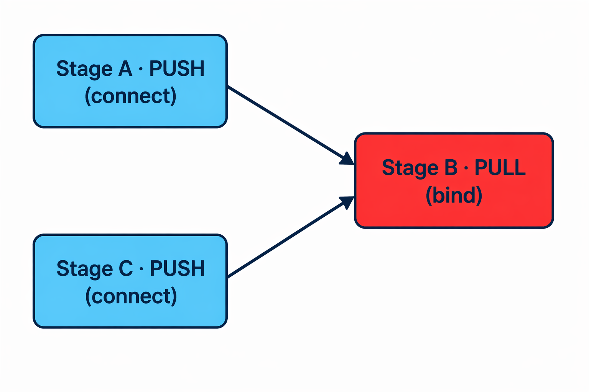

**PUB/SUB (broadcast)**: used for the Coordinator to broadcast abort signals to all Stages. The Coordinator's PUB socket binds, each Stage's SUB socket connects, and a single message is received by all Stages simultaneously.

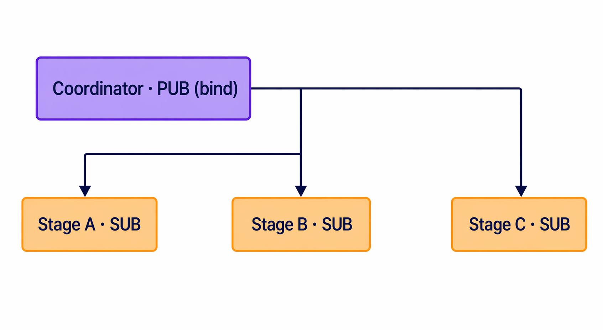

| Message type               | Pattern        | Direction                           | Purpose               |
| ------------------ | --------- | ---------------------------- | ---------------- |
| `SubmitMessage`    | PUSH/PULL | Coordinator → entry Stage       | Initial request submission           |
| `DataReadyMessage` | PUSH/PULL | Stage → Stage                | Data-ready notification (includes shared-memory metadata) |
| `CompleteMessage`  | PUSH/PULL | Terminal Stage → Coordinator | Request complete             |
| `StreamMessage`    | PUSH/PULL | Stage → Coordinator          | Streaming intermediate result           |
| `AbortMessage`     | PUB/SUB   | Coordinator → all Stages       | Request cancellation             |
| `ShutdownMessage`  | PUSH/PULL | Coordinator → Stage          | Shutdown signal             |


【TODO: What is this ShutdownMessage for, and what's the difference from abort?】

Answer: One is for a single request, the other is for overall shutdown.

At the code level, the Control Plane is split into two implementations, serving the Coordinator side and the Stage side respectively:

- `**CoordinatorControlPlane**`: the Coordinator side, managing the PUSH sockets to each Stage and the PULL socket that receives completions.
- `**StageControlPlane**`: the Stage side, providing `recv()` blocking receive and `send_to_stage()` / `send_complete()` routing functions.

### Stage

A [Stage](https://github.com/sgl-project/sglang-omni/blob/main/sglang_omni/pipeline/stage/runtime.py) represents one processing node in the pipeline. It is one of the most core runtime units of this system, because true "stage-ification" doesn't stay in the config file — it must become processes, queues, aggregators, and execution loops right here.

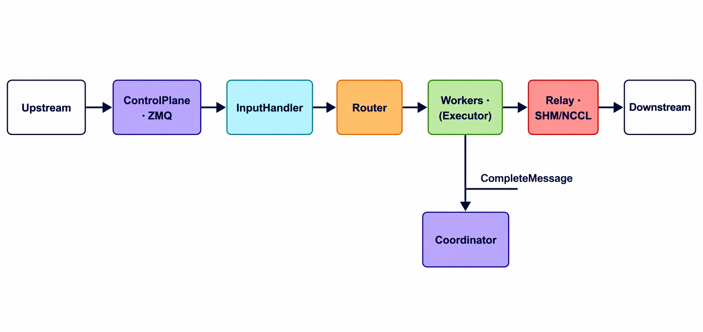


In terms of responsibilities, a Stage mainly does the following things:

1. **Message routing**: receives `SubmitMessage` or `DataReadyMessage`, and dispatches to an internal Worker.
2. **Input aggregation**: some Stages (like `aggregate`) need to wait until data from multiple upstream Stages has all arrived before starting processing, implemented using `AggregatedInputHandler`.
3. **Abort listening**: a background coroutine continuously listens for `AbortMessage`, and upon receiving one, cleans up all state for that request (router queue, shared-memory slot, StreamQueue, notifying the Executor to stop).
4. **Data routing**: for non-streaming data, the Stage, before the Worker processes it, reads out the complete payload via the DataPlane (SHM / CUDA IPC) and then delivers it to the Worker all at once; for streaming data, it uses a `StreamQueue` to continuously forward the incremental chunks arriving from upstream to the corresponding Worker, so downstream can consume while producing.

The concurrency model here is also worth calling out separately: although the coroutines `Stage.run()`, `abort_listener()`, and `worker.run()` are all asynchronous, they run on **the same event loop within the same Stage process**, cooperatively switching via `await`. True parallelism is not achieved by asyncio itself, but by multi-Stage multi-process deployment.

**[WorkerRouter](https://github.com/sgl-project/sglang-omni/blob/main/sglang_omni/pipeline/stage/router.py)** (only 48 lines) is responsible for assigning requests to Workers: it assigns new requests round-robin, but subsequent messages for the same `request_id` **always go to the same Worker** (sticky affinity). This is because Thinker/Talker's `EngineExecutor` has an internal KV cache, and if a request is dispatched to a different Worker it would fail to find the KV cache and error out. Currently most Stages have only 1 Worker (`num_workers=1`), in which case the Router is a pass-through.

Core execution loop `Stage.run()`:

```
while not shutdown:
    msg = control_plane.recv()           # await for message, doesn't block the event loop
    if SubmitMessage:
        input_handler.receive(msg)       # record input
        router.enqueue(work)             # dispatch to Worker
    elif DataReadyMessage:
        input_handler.receive(msg)       # aggregate input
        if all_inputs_ready:
            router.enqueue(work)         # dispatch once all ready
    elif StreamChunk:
        stream_queue.put(request_id, chunk)  # put into streaming queue
```

### Worker

A [Worker](https://github.com/sgl-project/sglang-omni/blob/main/sglang_omni/pipeline/worker/runtime.py) is the execution unit inside a Stage that actually does the work. The preceding Stage is more like a "runtime shell," responsible for receiving messages, doing aggregation, and managing routing; it's here at the Worker that a request is actually fed into the executor for computation.

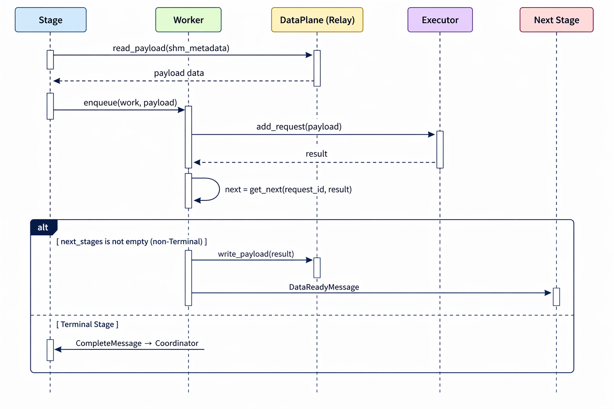


For streaming Stages, the Worker additionally attaches a `_stream_send_loop()` background task that continuously pushes the chunked results generated by the executor to downstream. It's precisely because of this layer that "ordinary completion-style Stages" and "streaming Stages" in the framework can share the same overall runtime shell.

**Same-GPU zero-copy optimization**: when the upstream and downstream Stages are on the same GPU (like `talker_ar` → `code_predictor`), CUDA IPC (`ForkingPickler`) is used to implement zero-copy tensor transfer, avoiding a round-trip through shared memory.

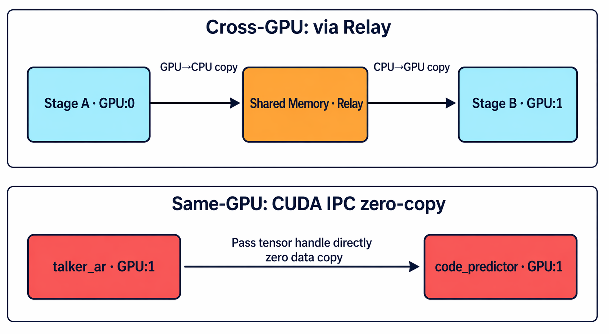


### Executor

The [Executor](https://github.com/sgl-project/sglang-omni/blob/main/sglang_omni/executors/interface.py) is the abstraction layer closest to the concrete computation. It defines a unified set of request-processing interfaces, freeing the upper-layer Stage from caring about "whether this stage internally does a single forward or a complete autoregressive engine":

```python
class Executor(ABC):
    async def add_request(payload: StagePayload) -> None    # submit request
    async def get_result() -> StagePayload                   # get result
    async def abort(request_id: str) -> None                 # cancel request
    def set_stream_fn(fn) -> None                            # set streaming callback
```

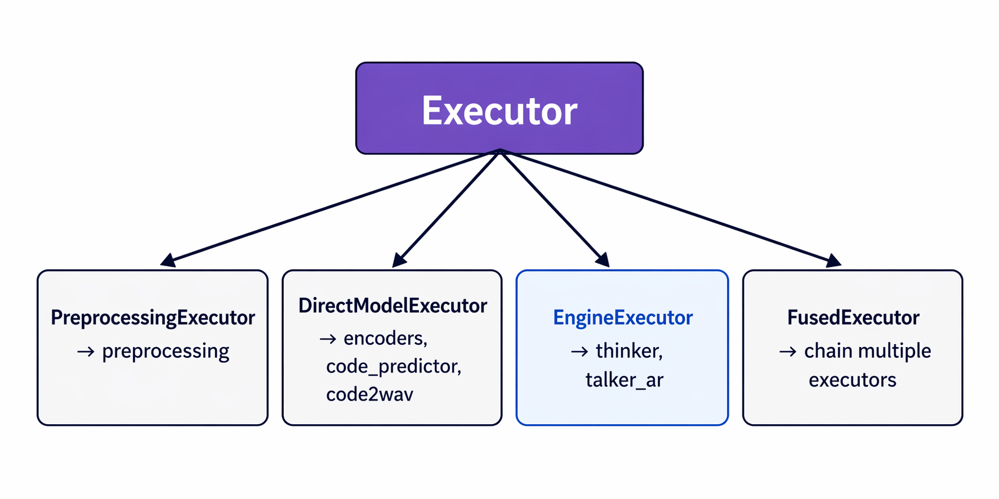


The reason Thinker must go through `EngineExecutor` while the image encoder only needs `DirectModelExecutor` is not "whether the model is big," but that their compute patterns are completely different. The former is an autoregressive system that needs to maintain request state, KV cache, and multi-step scheduling; the latter is closer to a one-shot operator — the request comes in, runs the forward, and it's done.

`FusedExecutor` can merge multiple Stages into the same process (Stage Fusion), with intermediate results passed directly in memory rather than going through shared memory, reducing IPC overhead.

---

## The Full Request-Processing Flow

The previous sections broke apart the component responsibilities; this section reassembles these components and walks through the actual lifecycle of a "text + image + audio" request, to see how the data passes through the entire pipeline step by step.

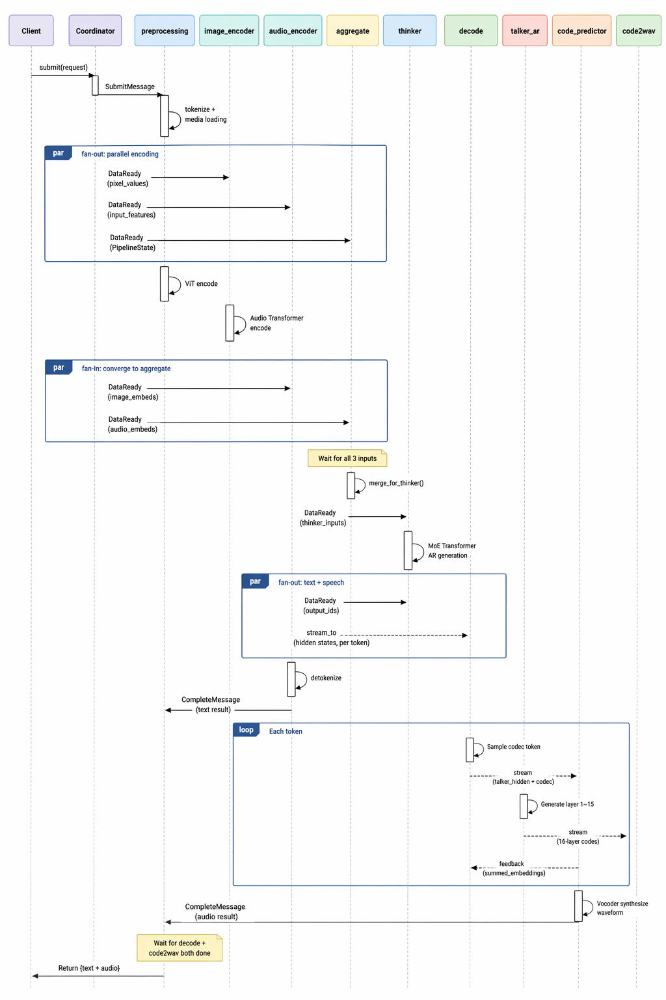

【TODO: This part above is really garbage — writing it this way is shameful; Jingwen's design would be much better. Let's wait for his concrete design #2 to come out; below a stage there should be at most two more layers.】

Answer: Yes, a bit too complicated, and it feels like it's overfitting Qwen3-Omni.

### Stage 1: Preprocessing

**Executor**: `PreprocessingExecutor`
**Device**: CPU
**Core class**: [Qwen3OmniPreprocessor](https://github.com/sgl-project/sglang-omni/blob/main/sglang_omni/models/qwen3_omni/components/preprocessor.py)

The preprocessing stage is responsible for turning the user's raw input into the tensors and metadata that the subsequent models can actually consume. What it does looks like "pre-processing," but it actually decides whether the entire downstream DAG can fan out smoothly:

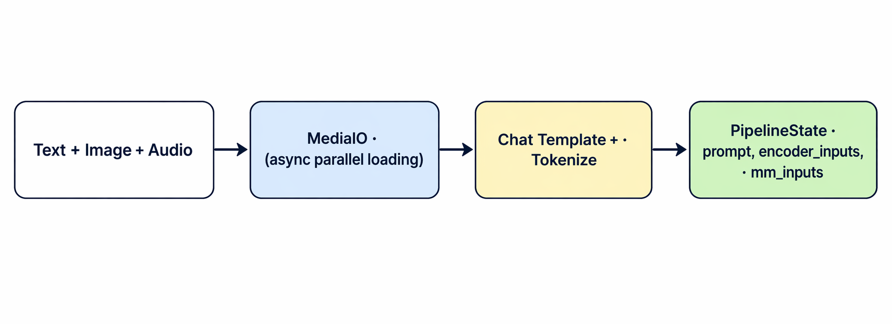


After preprocessing completes, the data flows simultaneously to the three Stages `image_encoder`, `audio_encoder`, and `aggregate`. In other words, true multi-path parallelism begins right here, not at the main-model stage.

### Stage 2-3: Image Encoder & Audio Encoder

**Device**: GPU

#### Image Encoder

**Core class**: [Qwen3OmniImageEncoder](https://github.com/sgl-project/sglang-omni/blob/main/sglang_omni/models/qwen3_omni/components/image_encoder.py)

- Based on a 27-layer Vision Transformer (ViT), patch_size=16, spatial_merge_size=2
- Input `pixel_values [B, C, H, W]`, output `image_embeds [n_tokens, 3584]`
- **Multi-scale features**: extracts features from intermediate layers via `deepstack_visual_indexes=[8, 16, 24]` (deepstack_visual_embeds), for later use by Thinker
- **Optimization**: `_optimize_patch_embed` rewrites Conv3d as Linear, gaining a 7-15x inference speedup

#### Audio Encoder

**Core class**: [Qwen3OmniAudioEncoder](https://github.com/sgl-project/sglang-omni/blob/main/sglang_omni/models/qwen3_omni/components/audio_encoder.py)

- Based on a 32-layer Transformer encoder, input is 128-dim Mel spectrogram features
- Input `input_features [B, n_mels, T]`, output `audio_embeds [n_tokens, 3584]`
- Supports 500-token chunk streaming processing

The two encoders advance independently of each other and each send their results to `aggregate`. Topologically, this step forms exactly the first half of the fan-in mentioned earlier: encode separately first, then reconverge at the aggregation point.

【TODO: I'm only familiar with RVQ for audio encoding 😂, used it as a black box.】

### Stage 4: Aggregate

**Device**: CPU
**Input aggregation**: `AggregatedInputHandler`

The Aggregate Stage is a very typical **fan-in** node. Its responsibility is not to do heavy computation, but to reconverge the inputs previously scattered across multiple branches into a unified input that Thinker can consume all at once:

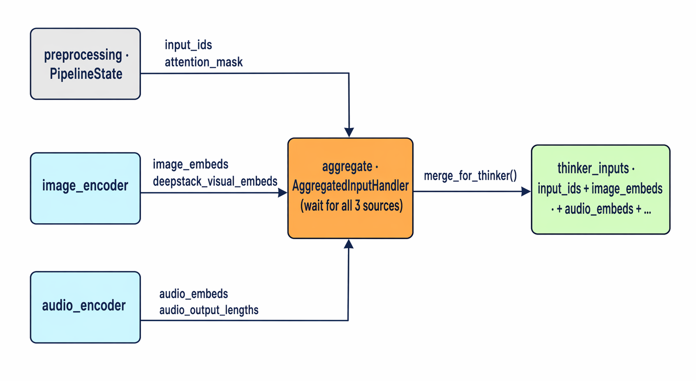


### Stage 5: Thinker (Main Model Inference)

**Executor**: `EngineExecutor` (wraps `OmniEngine`)
**Device**: GPU:0
**Core model**: [Qwen3OmniMoeThinkerTextModel](https://github.com/sgl-project/sglang-omni/blob/main/sglang_omni/models/qwen3_omni/thinker.py)

Thinker is the semantic center of the entire system. All the preceding encoding, aggregation, and routing work ultimately exists to organize the input into a form it can consume; and the later text output and speech pipeline both take its incremental results as their starting point.

#### Model Structure

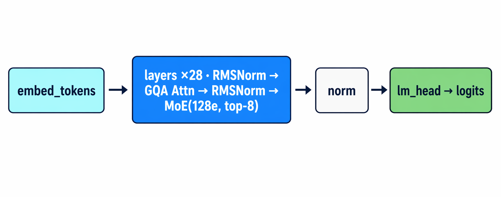


#### Forward Flow

1. **Token embedding**: `input_ids` → `embed_tokens` → `[seq_len, 2048]`
2. **Multimodal fusion**: inject encoder outputs at placeholder token positions via `masked_scatter`
  - Visual placeholder → `image_embeds` / `video_embeds`
  - Audio placeholder → `audio_embeds`
3. **28-layer Transformer**: RMSNorm → GQA Attention (28 heads, 4 kv heads) → RMSNorm → MoE → Residual
4. **Output**: hidden states → `lm_head` → logits → sampling → `output_ids`

**Optimizations**:

- `fused_qk_norm_rope` kernel: fuses QK Norm and RoPE into a single bfloat16 kernel (~3x speedup)
- YARN RoPE scaling: extends context from 8K to 32K
- RadixAttention: efficient KV cache management

#### Output Split (fan-out)

After Thinker finishes running, the request undergoes another fan-out. This is also the most critical branch in the entire chain, because the two terminal states of text and speech formally split apart right here:

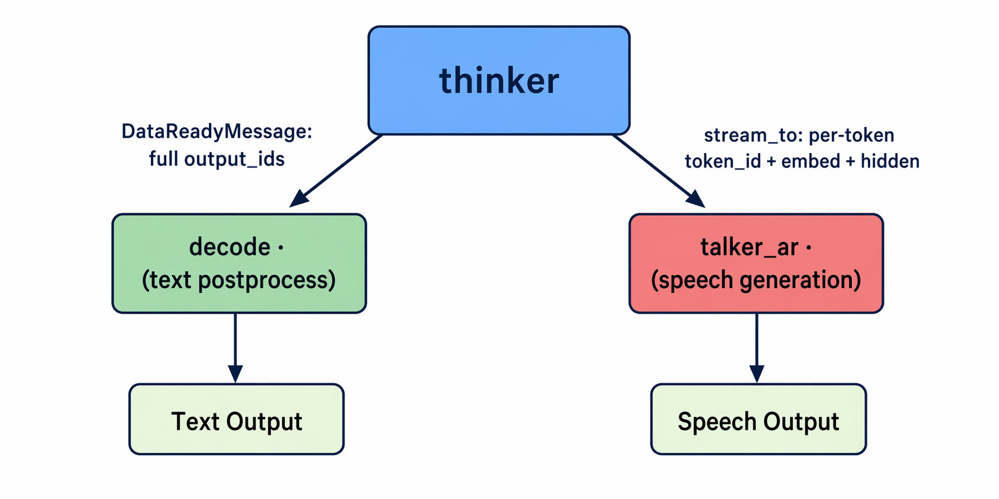


- **text branch** → `decode` Stage (text post-processing), transmits the complete result via `DataReadyMessage`
- **speech branch** → `talker_ar` Stage (speech generation), streams token by token via `stream_to`; the following three pieces of information are passed to Talker together:
  - `thinker_token_ids`: the token ids Thinker sampled
  - `thinker_embeds`: the token embeddings on the Thinker side
  - `thinker_hidden[layer_24]`: the hidden states of layer 24 (for Talker to do cross-modal alignment)


### Stage 6: Detokenize (Output Decoding)

**Device**: CPU (Terminal Stage)

The Decode stage is relatively direct: it restores Thinker's `output_ids` to text and organizes it into the final response. It is not itself a complex compute node, but it carries the responsibility of a Terminal Stage, so it participates in the final result aggregation.


  【TODO: This should be called detokenize, right — token ids go back to tokens as part of the streaming output.】

### Stage 7-9: Speech Pipeline

If the request has speech output enabled, then Thinker's result additionally enters a three-level speech pipeline. This branch is deployed entirely on GPU:1, responsible for progressively converting the incremental state on the text side into the final audio:

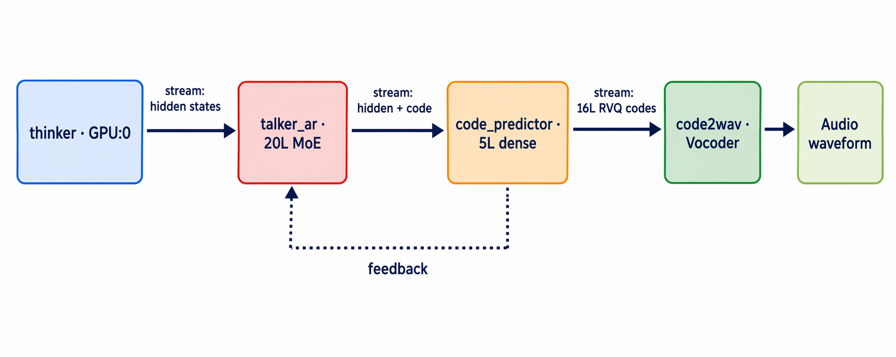


#### Stage 7: Talker AR

**Executor**: `EngineExecutor` (wraps `OmniEngine`)
**Core class**: [Qwen3OmniMoeTalkerTextModel](https://github.com/sgl-project/sglang-omni/blob/main/sglang_omni/models/qwen3_omni/talker.py)

Talker is a 20-layer MoE Transformer (128 experts, top-6 routing). Compared to Thinker, its responsibility is no longer "understand and decide what to say," but "catch the semantic increments Thinker provides and translate them stably into a speech codec stream."

**Prefill input construction** ([build_prefill_input](https://github.com/sgl-project/sglang-omni/blob/main/sglang_omni/models/qwen3_omni/components/talker_input.py)):

As mentioned earlier, Talker does not directly consume Thinker's logits, but consumes Thinker's **embeddings** and **hidden states**, and constructs its own prefill input from them:

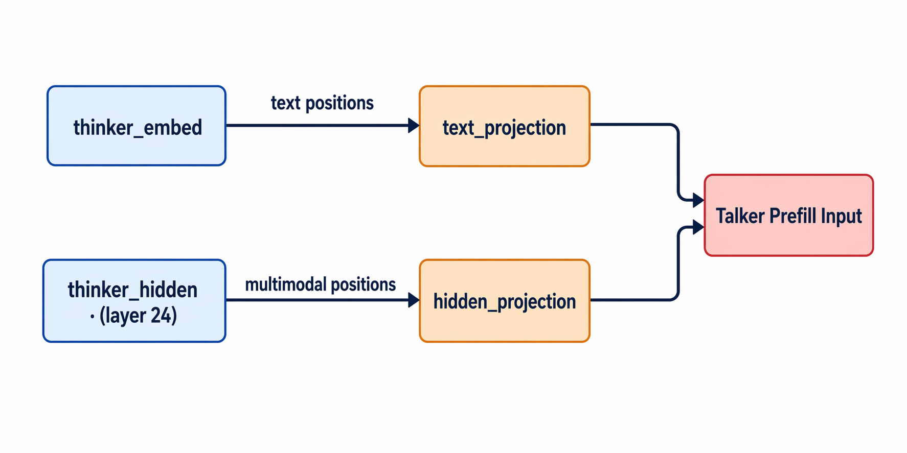


The most critical thing here is not how complex Talker itself is, but that there's a real feedback loop between it and the Code Predictor. Every time Talker spits out one step of a codec token, it cannot mindlessly keep going forward; it must wait for the Code Predictor to return the aggregated embedding, then take that as additional context for the next decode step.

#### Stage 8: Code Predictor

**Core class**: [_CodePredictorWrapper](https://github.com/sgl-project/sglang-omni/blob/main/sglang_omni/models/qwen3_omni/components/code_predictor_executor.py)

The Code Predictor is a 5-layer dense Transformer (hidden=1024, vocab=2048). It catches Talker's step-by-step output, and while filling in the remaining RVQ layers (MTP), it also feeds the feedback information back to Talker for its next-step output — like playing ping-pong with Talker:

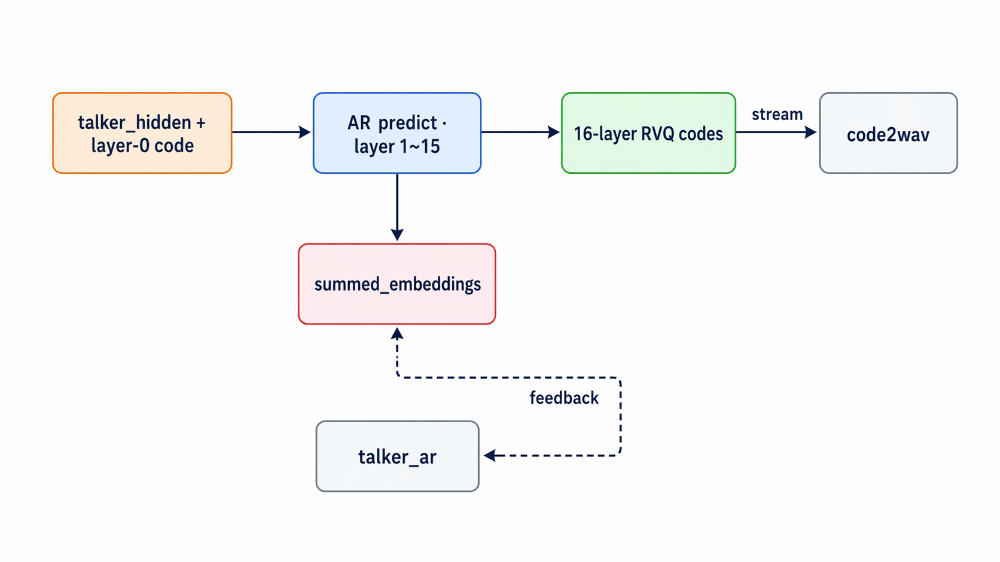

【TODO: Sloppy — didn't explain what this does. Of course, this whole part could actually be removed.】

#### Stage 9: Code2Wav

**Core class**: [_Code2WavStreamingExecutor](https://github.com/sgl-project/sglang-omni/blob/main/sglang_omni/models/qwen3_omni/components/code2wav_executor.py)

Code2Wav sits at the tail end of the speech chain, using HF's `Qwen3OmniMoeCode2Wav` (neural codec decoder / vocoder) to restore complete RVQ codes into actually-playable audio waveform:

1. Accumulate code chunks until reaching `stream_chunk_size`
2. `_decode_incremental()`: feed codes `[num_chunks, 16]` into the vocoder
3. Trim the left-context artifacts (`left_context_size`)
4. Stream out float32 audio chunks (24kHz)
5. Finally concatenate all audio chunks

---

## OmniEngine: The Scheduling and Execution Engine

[OmniEngine](https://github.com/sgl-project/sglang-omni/blob/main/sglang_omni/engines/omni/engine.py) is the execution engine behind Stages like Thinker and Talker AR that "need multi-step iterative advancement." Understanding it as a specialized small serving runtime is fairly accurate: in each loop iteration, the Scheduler first selects requests and forms a batch, then hands it to the ModelRunner for forward, and finally updates the request state based on the output and decides how the next round goes.

### Request Lifecycle

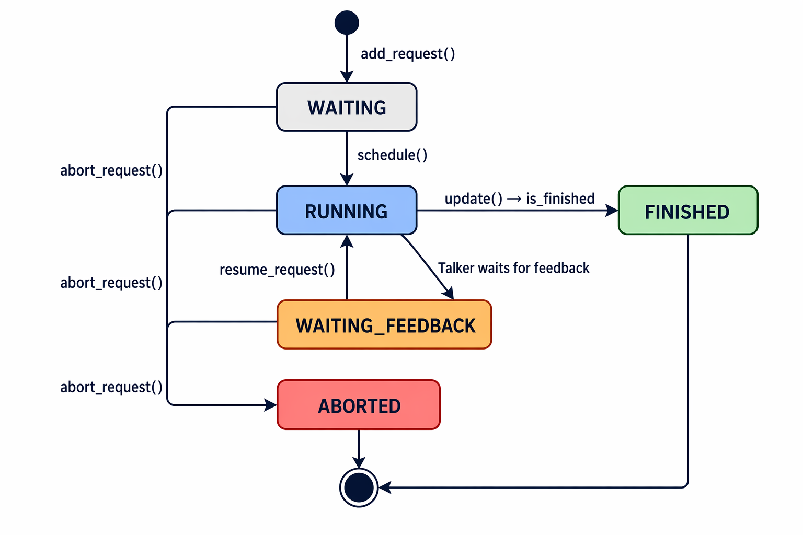


If we grab only the backbone, the responsibilities of the **[Scheduler](https://github.com/sgl-project/sglang-omni/blob/main/sglang_omni/engines/omni/scheduler.py)** can be roughly summarized as the following:

- `add_request(request_id, data)` — enqueue a request in the `WAITING` state
- `schedule()` — select requests and build a batch via `BatchPlanner`, returning `SchedulerOutput`
- `update(scheduler_output, model_output)` — update request state based on model output, with `IterationController` deciding whether it's finished
- `stream(request_id)` — return an async generator that yields intermediate output step by step

Correspondingly, the **[ModelRunner](https://github.com/sgl-project/sglang-omni/blob/main/sglang_omni/engines/omni/model_runner.py)** is closer to a stateless executor: it doesn't decide who should run or when a request finishes — it only takes an arranged batch of inputs, runs the forward to completion, and hands the result to the output processor to organize.

### Execution Modes

OmniEngine supports two execution modes. Their difference is not in algorithmic logic, but in **whether the current step's GPU execute** and **the previous step's CPU result processing** are overlapped. If you only look inside a single round, then `schedule()` and `execute()` are serial in both modes; what truly overlaps is `execute(N)` and `_process_pending_result(N-1)`.

#### Normal Mode vs Overlap Mode

If you want to understand this "CPU prepares the next round in advance, GPU keeps running the current round" pipelining more intuitively, you can directly look at the diagram LMSYS gave in the SGLang v0.4 blog:

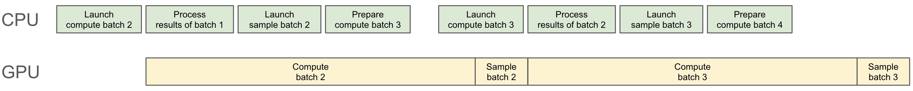

Source: [SGLang v0.4: Zero-Overhead Batch Scheduler, Cache-Aware Load Balancer, Faster Structured Outputs](https://www.lmsys.org/blog/2024-12-04-sglang-v0-4/)

This diagram depicts a general scheduler perspective: the CPU side alternates launch / process / prepare, while the GPU side continuously executes compute / sample. Putting it back into the OmniEngine context, you can approximately understand it as: while the GPU is running `execute(N)`, the CPU is processing the `_process_pending_result(N-1)` cached in the main thread from the previous round, and along the way preparing the scheduling for the next round.

In other words, what truly overlaps is not "all the actions in Step N," but only:

- `execute(N)` and `_process_pending_result(N-1)` overlap
- The GPU still runs only one batch per round, and does not run multiple `forward`s in parallel simultaneously
- `schedule(N)` still executes serially at the start of each round, so it's still on the main path

From the code, the key points of `_step_overlap()` are mainly four:

1. It uses `asyncio.run_in_executor()` to submit `model_runner.execute()` to a thread pool, so that the event-loop thread doesn't get blocked by the synchronous GPU call.
2. While `await execute_future`, the main thread processes the `_process_pending_result()` cached from the previous step; this step includes not just `scheduler.update()`, but also cache write-back, finish checks, and feedback checks.
3. When there are consecutive prefill batches, overlap is temporarily disabled, so as to hand out the first batch of prefill results faster and optimize TTFT.
4. At the factory layer, engines with a feedback loop (e.g. Talker AR) usually also disable overlap, because they need stricter synchronous stepping semantics.

### Runtime Protocol Interfaces

To let the same OmniEngine serve both Thinker and Talker, the code splits the scheduling logic further down into a set of Protocol interfaces:

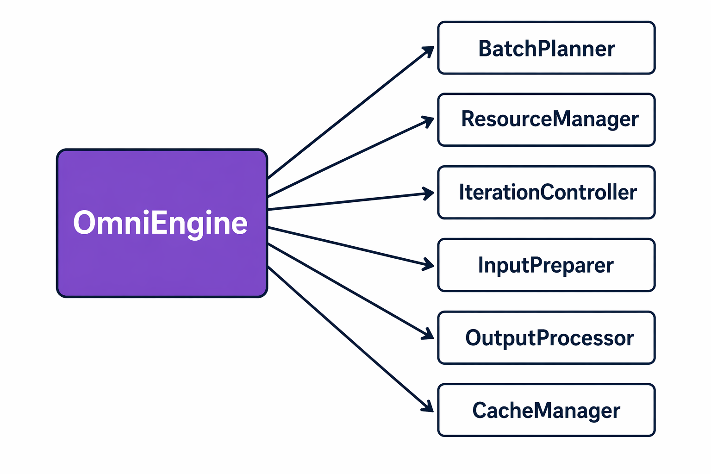


These interfaces are defined in [engines/omni/runtime/interfaces.py](https://github.com/sgl-project/sglang-omni/blob/main/sglang_omni/engines/omni/runtime/interfaces.py), and implemented separately by each concrete model. The design intent is very clear: the common engine keeps only the loop skeleton, and delegates the model-specific batch planning, input preparation, and output-update logic.

---

## Core Data Structures

### PipelineState

[PipelineState](https://github.com/sgl-project/sglang-omni/blob/main/sglang_omni/models/qwen3_omni/io.py) is the core state container that runs through the entire pipeline. It is not the input structure of some single stage, but more like "the engineering-side snapshot of the request at the current moment," continually enriched as the request advances:

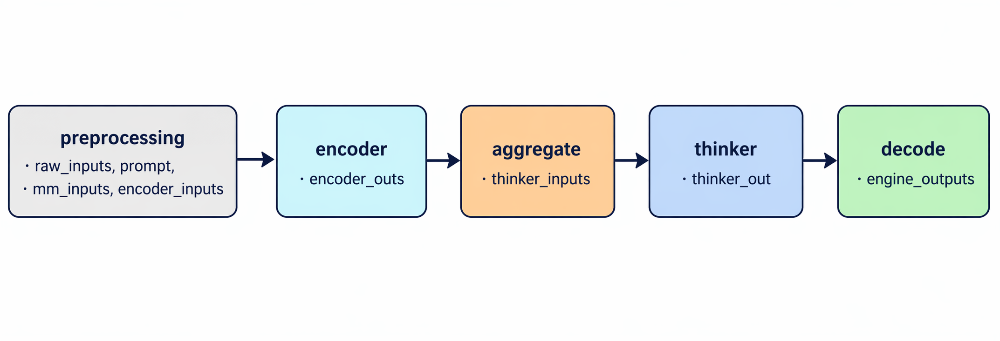


```python
@dataclass
class PipelineState:
    raw_inputs: Any                    # the user's raw input
    prompt: PromptInputs               # {input_ids, attention_mask, prompt_text}
    mm_inputs: dict[str, Any]          # {image: [...], audio: [...], video: [...]}
    encoder_inputs: dict[str, dict]    # {image_encoder: {...}, audio_encoder: {...}}
    encoder_outs: dict[str, Any]       # encoder outputs {image_embeds, audio_embeds, ...}
    thinker_inputs: dict[str, Any]     # merged thinker input
    thinker_out: ThinkerOutput         # {output_ids, step, is_final, extra_model_outputs}
    engine_outputs: dict[str, Any]     # final decode result
    stream_state: dict[str, Any]       # streaming output state tracking
```

### Scheduler-related Types

Compared to `PipelineState`, these types defined in [engines/omni/types.py](https://github.com/sgl-project/sglang-omni/blob/main/sglang_omni/engines/omni/types.py) lean more toward the engine's internal scheduling semantics:

- **SchedulerStatus**: request lifecycle state, with values `WAITING` / `RUNNING` / `WAITING_FEEDBACK` / `FINISHED` / `ABORTED`
- **SchedulerRequest**: the single-request container from the Scheduler's perspective. Its core fields are `request_id` and `status`; model-specific state is placed in `data`, and it additionally carries `error`, `arrival_time`, `finish_time`
- **SchedulerOutput**: the set of requests selected in a given step, along with the accompanying `batch_data` and `step_id`
- **RequestOutput**: the output of a single request in this step; besides `finished` and `finish_reason`, it also has model-specific `data` and an optional `extra`
- **ModelRunnerOutput**: the aggregated output of a batch, whose core is `outputs`, and which also retains `req_ids` and `req_id_to_index`

### Control Plane Messages

And the messages defined in [proto/messages.py](https://github.com/sgl-project/sglang-omni/blob/main/sglang_omni/proto/messages.py) are the concrete carriers of the control plane discussed earlier:

- **DataReadyMessage**: an upstream Stage notifying downstream that "the data is ready." The `shm_metadata` inside is essentially transfer metadata — not necessarily just a shared-memory location, but possibly other metadata used by the current relay backend; it additionally carries `chunk_id`, `is_done`, `error`
- **StreamMessage**: a Stage sending a streaming output chunk to the Coordinator, used to stream results back while generating
- **CompleteMessage**: a Terminal Stage reporting to the Coordinator that "this request is complete" or "this branch failed"
- **AbortMessage**: the Coordinator broadcasting to each Stage to cancel a given `request_id`

These messages are first converted to a dict, then serialized with msgpack, and transmitted between processes via ZMQ.

---

## Mechanisms in Depth

### Streaming (stream_to)

Most inter-Stage collaboration is "the previous one finishes computing, then the next picks up." But the relationship between Thinker and Talker is not like this — it's closer to a true incremental producer-consumer model: every time Thinker generates a token, it immediately pushes the corresponding hidden states out via `stream_fn`, rather than waiting for the entire text to fully finish.

- Thinker faster than Talker: the queue backs up a few tokens, and Talker consumes at its own pace
- Talker faster than Thinker: the queue empties, and Talker `await`s the next one
- Thinker finished but Talker still synthesizing: the end of `trailing_text_hidden` has `tts_eos_embed`, and once Talker consumes it, it knows the text has ended

When Talker starts up, if it finds several tokens already accumulated in the queue, it will first take out this batch all at once to do **prefill**, avoiding advancing token by token in small steps from the very beginning. Then it enters the decode phase, with the background `_bridge_inbound` coroutine continuously appending new tokens to `trailing_text_hidden`.

### The Feedback Loop (Talker ↔ Code Predictor)

Every time Talker generates a codec token, it sends it to the Code Predictor and actively enters `WAITING_FEEDBACK`; at this point the Scheduler will no longer select it. Once the Code Predictor returns `summed_embeddings`, OmniEngine restores the request to `WAITING`, and only then can the next round of scheduling continue advancing. This loop is one of the most complex, and most representative, state transitions in the entire system.

### Abort Cleanup

Abort cleanup is troublesome precisely because a request does not exist in only one place in the system. After the Coordinator broadcasts abort, each Stage's `_on_abort()` must simultaneously handle the router queue, the input aggregator's pending data, shared-memory slots, the `StreamQueue`, the executor's internal generation state, and blocked wait points on the Worker. Missing any one of these could leave dangling state or a resource leak.

### Multi-Process Deployment

In production deployment, this design ultimately lands on `MultiProcessPipelineRunner` ([mp_runner.py](https://github.com/sgl-project/sglang-omni/blob/main/sglang_omni/pipeline/mp_runner.py)): the main process is responsible for the Coordinator and the HTTP Server, while each Stage runs in its own independent subprocess, separately deserializing the config, compiling the Stage, and maintaining its own event loop. The most direct benefit of doing this is that it lands both resource boundaries and fault boundaries at the process level.

---

## Key Design Patterns

If we compress the implementation details above by one more layer, we can actually extract a few recurring classes of design patterns. They're not all necessarily elegant, but they basically explain why this framework grew into what it is now.

### 1. Declarative Config → Runtime Compilation

As described in the "Declarative Config → Runtime Compilation" section earlier, the pipeline defines a Stage DAG via `PipelineConfig`, which is then compiled by `compile_pipeline()` into executable instances. This is one of the most core extension mechanisms of the entire system, because it tries to compress "model differences" into the config and executor layers.

### 2. Stage Payload as State Container

`StagePayload` is not a "model input" in the narrow sense, but a **complete state snapshot** of the request at its current position in the pipeline. Each Stage is more like continually enriching this state, rather than consuming the previous stage's result and then discarding it.

### 3. Overlap Scheduling (GPU/CPU Pipelining)

OmniEngine's overlap mode uses `asyncio.run_in_executor()` to pipeline the GPU forward with the CPU state update, thereby improving throughput. It is not a model-level optimization, but a very engineering-oriented runtime optimization point.

### 4. Feedback Gating

The bidirectional communication between Talker AR and the Code Predictor is essentially made to work through explicit state gating:

- After generating each codec token, Talker pauses and waits for feedback
- Once the Code Predictor finishes processing, it returns `summed_embeddings` via the feedback channel
- OmniEngine's `_check_feedback()`, upon detecting the feedback, calls `resume_request()` to resume Talker's decoding

### 5. Multi-Terminal Completion Aggregation

A request can have multiple Terminal Stages simultaneously, such as the `decode` of the text branch and the `code2wav` of the speech branch. The Coordinator's task is not to eagerly return whichever branch's result comes first, but to wait until all terminal states have completed before merging them uniformly.

### 6. Same-GPU Zero-Copy

When adjacent Stages are on the same GPU (like `talker_ar` → `code_predictor` on GPU:1), the Worker uses CUDA IPC (`ForkingPickler`) to pass the tensor handle directly, thereby avoiding unnecessary GPU→CPU→GPU round-trip copies.

---

## Criticism and Reflection

After reading through the entire project, one hard-to-avoid feeling is: SGLang Omni clearly has a strong tendency toward **over-engineering**. 30,000 lines of code, 7 kinds of ABC interfaces, 6 kinds of Protocols, 4 kinds of Relay backends — this complexity is not light. The criticisms below are not from the angle of "nitpicking code-style flaws," but from the angle of system maintainability, raising questions about the code structure itself.

### 1. An Absurd Number of Abstraction Layers

If you fully unfold a request's path from entry to return, you see it pass through the following long string of abstraction layers:

```
Client → Coordinator → CoordinatorControlPlane → PushSocket
→ PullSocket → StageControlPlane → Stage → InputHandler → WorkerRouter
→ Worker → DataPlaneAdapter → Relay → Executor → EngineExecutor
→ OmniEngine → Scheduler → BatchPlanner → ModelRunner → InputPreparer
→ Model.forward() → OutputProcessor → ...return the same way back
```

This chain has **15+ layers of abstraction**. The problem isn't just "many layers," but that the core logic actually isn't that much: receive request, run model, send result. A large number of the intermediate layers exist only to wrap, forward, and adapt. More concretely, the three-layer split of `Router / Worker / Executor` inside a Stage does not form a particularly clear division of value.

- `DirectInput.receive()` just directly returns the input — what is the point of this layer's existence?
- `WorkerRouter` is basically a pass-through when `num_workers=1` (the realistic config of almost all Stages). What it truly does is only two things: allocate a queue for each Worker, and record a sticky affinity once per `request_id`. But if most Stages have no multiple Workers at all, this layer is more like an extension point that hasn't truly been used, rather than a scheduler in reality.
- More subtly, even if there really were multiple Workers, the current concurrency is not primarily provided by the Worker pool. After `Worker.run()` gets work, it directly `create_task()`s to process multiple requests concurrently, which shows that the true concurrency carrier is actually the tasks inside the Worker and the underlying engine, not the Router/Worker pooling model itself.
- The name `Worker` also downplays the responsibility it actually carries. It is not an "execution unit that only calls the executor," but more like a small runtime: read relay, merge payload, handle bootstrap stream, register result future, wait for executor, decide `next_stage`, send complete, do cleanup. The request lifecycle is chopped up across the two layers `Stage` and `Worker`, and the boundary is not clear.
- The `Executor` layer is not entirely without value — it at least tries to unify the two classes of compute patterns "one-shot forward" and "stateful engine"; but most implementations are so thin as to be almost ceremony. `PreprocessingExecutor` is basically just "call a function, then stuff the result back into a queue," `DirectModelExecutor` is essentially `request_builder -> model.forward() -> result_builder`, and `EngineExecutor` is also mainly adapting between `StagePayload` and engine I/O. Simple cases are over-wrapped, yet complex cases still can't be contained.
- What best shows the abstraction didn't hit the mark is actually two special cases: on one hand, a genuinely complex streaming / feedback case like `TalkerStreamingExecutor` ends up growing into a God Class anyway; on the other hand, the framework introduces `FusedExecutor` to try to sew the previously-split layers back into one process. Putting these two things together actually already shows that the current layering was cut too finely.

In other words, these three layers are not "completely useless," but they are now more like a set of intermediate layers patching each other's holes, rather than three abstractions with clear boundaries, each irreplaceable. What truly makes the system complex is not the model itself, but the runtime glue introduced additionally to maintain these hierarchical relationships.

### 2. try/except-Driven Development: Classic AI-Generated Code

Another very obvious problem with the whole project is that it's pervaded by the "wrap it in try/except first, don't let it crash" style. `worker/runtime.py` has **18 try/except blocks in 673 lines of code**, averaging one every 37 lines — this is no longer an individual habit, but a systematic coding style.

The most egregious examples:

```python
# relay/nixl.py:349 —— bare except, doesn't even write Exception
try:
    self.connection._nixl.deregister_memory(self.pool_handle)
except:
    pass
```

```python
# engine.py:216-226 —— nested exception, inner layer swallows it directly
except Exception as e:
    logger.exception(...)
    for request in scheduler_output.requests:
        try:
            self.scheduler.fail_request(request.request_id, e)
        except Exception:
            pass   # ← failure handling of failure handling, just pass
```

```python
# talker_executor.py:504-516 —— loading critical weights fails, substitute all zeros and keep running
except Exception:
    logger.exception("Failed to load thinker special token embeddings")
    thinker_rows = torch.zeros(...)  # ← the model will produce garbage, but the program won't crash!
```

```python
# runtime/cache.py:45-48 —— cache-key computation fails, return None, silently skip the cache
except Exception:
    return None
```

The problem with this style is that it uses "the program didn't crash" to mask the fact that "the program has already gone off the rails." A request might silently fail, a result might be empty or wrong, and the true root cause gets swallowed layer by layer, making the ultimate localization cost extremely high.

### 3. God Class: TalkerStreamingExecutor

`talker_executor.py` is probably the most typical God Class in the entire repository. **937 lines, 26 methods, one class carrying at least 5 completely different classes of responsibility**:


| Responsibility                        | Where it should be               |
| ------------------------- | ------------------ |
| Streaming reception of Thinker's tokens      | StreamReceiver     |
| Building prefill input             | PrefillBuilder     |
| Managing the feedback state machine           | FeedbackController |
| Loading Thinker's embedding weights | WeightLoader       |
| Sampling-parameter parsing                    | SamplingConfig     |


There are also 5 places with chained `getattr(..., None)` calls to access fields of `request.data`:

```python
bool(getattr(request.data, "thinker_chunks_done", False))
trailing = getattr(request.data, "trailing_text_hidden", None)
step_index = max(int(getattr(request.data, "generation_steps", 0)) - 1, 0)
thinker_done = bool(getattr(request.data, "thinker_chunks_done", True))
```

Worse, `request.data` has neither a clear schema nor a stable type constraint, and field names are basically hardcoded as strings. This way, renaming a field gives no static hint, and errors can only spread silently at runtime in the form of "the default value took effect."

### 4. Functions Over 200 Lines


| File                           | Function                          | Lines          |
| ---------------------------- | --------------------------- | ----------- |
| `relay/mooncake.py`          | `__init__()`                | 247         |
| `pipeline/worker/runtime.py` | `_process_request()` + streaming-related | 200+        |
| `pipeline/stage/runtime.py`  | `_handle_stream_chunk()`    | 80+ with 4 levels of nesting |


`mooncake.py`'s `__init__` is a full 247 lines — a constructor longer than many complete classes. Device parsing, memory-pool allocation, credit initialization, and listener-task creation are all crammed together, showing that the module boundaries have begun to lose their constraints.

### 5. Copy-Paste

```python
# preprocessing/video.py — completely identical logic in two methods
# load_bytes (lines 69-77):
if self.extract_audio:
    video, sample_fps = load_video_path(tmp_path, self.fps)
    audio = _extract_audio_from_path(tmp_path, self.audio_target_sr)
    return video, sample_fps, audio
else:
    video, sample_fps = load_video_path(tmp_path, self.fps)
    return video, sample_fps, None

# load_file (lines 91-98) — exactly the same, only the variable name changes from tmp_path to filepath
```

In `engine.py`, the `getattr`-chain logic that detects whether thread execution is used is **duplicated twice**, at lines 187-193 and lines 393-399, word for word.

### 6. import_string: Abuse of Runtime Reflection

```python
factory = import_string("sglang_omni.models.qwen3_omni.pipeline.stages.create_preprocessing_executor")
```

There are a total of 12 `import_string` calls in the project. The problem it brings is not "being a little dynamic doesn't matter," but that it defers to runtime all the dependency relationships that could have been expressed statically:

- The IDE can't jump to definitions or refactor — **changing a function name gives no error at all; you only find out at runtime**
- Type checking is entirely disabled; the type of `factory` is `Any`
- Just using Python's `from ... import ...` would do — declarative config doesn't have to use strings

### 7. Magic Numbers

```python
# talker_executor.py:478 —— what is 1024?
max(self._codec_vocab_size - 1024, 0)

# talker_executor.py:483 —— where does 4096 come from?
"max_new_tokens": int(params.get("talker_max_new_tokens", 4096))

# preprocessing/cache_key.py:29-30 —— why 8192?
head_size: int = 8192
tail_size: int = 8192
```

No constant definitions, no comments explaining the origin. When modifying, you can only search the whole text and pray you don't miss one.

### 8. 392 Occurrences of `is not None`

The whole project has **392 occurrences** of `is not None` checks, averaging one every 77 lines. This number alone is enough to show that object lifecycles and initialization boundaries have not been clearly modeled.

This shows that object lifecycle management has completely lost control: a field is set to `None` in `__init__`, assigned in some `async start()`, and checked before use in another method. If `start()` isn't called and you directly `recv()`, the result is a `RuntimeError("Socket not started")` — this pattern of "using None to represent uninitialized" should be replaced with the type system or a state enum.

### 9. Relay: 4 Backends, Each Written Its Own Way

The 4 Relay backends (shm, nccl, nixl, mooncake) add up to 1600+ lines. Even though they clearly share a large amount of credit management, slot allocation, and cleanup logic, they are nearly all written each in its own way. The `Relay` base class only provides interfaces, not truly reusable common implementations, so its abstraction value is very limited.

### 10. The Type System Is a Mere Formality

```python
# engines/omni/runtime/sglang_ar.py:545
def _inject_multimodal_embeds(
    self, forward_batch: Any, schedule_batch: Any
) -> tuple[torch.Tensor | None, list | None, torch.Tensor | None]:
```

Parameters are `Any`, and the return value is `list | None` — what's inside the list? Unknown. The whole project has a large amount of `Any` type annotations; annotated is the same as not annotated.

### 11. Dead Code

```python
# models/weight_loader.py:263-266
except Exception:
    # NOTE: This exception is added for the purpose of setting breakpoint to
    # debug weight loading issues.
    raise
```

An `except Exception: raise` — it catches and then re-raises as-is, whose sole purpose is "to make it convenient to set a breakpoint." This kind of debug-aid code should not be left in production code.

### 12. The Root Problem: The Cost of a General-Purpose Framework

SGLang Omni's design goal is clearly "general-purpose" — it hopes to support arbitrary models and arbitrary Stage DAGs. The addition of Ming-Omni does to some extent prove this generality is not entirely empty talk: the model changed, the speech structure changed, and the framework backbone can still catch it.

But "usable" doesn't equal "worth it." For this generality, the following were paid:

- 30,000+ lines of framework code (the dedicated implementations of the two models combined might only need 8,000 lines)
- 7 kinds of ABC interfaces + 6 kinds of Protocols (`BatchPlanner`, `ResourceManager`, `IterationController`, `InputPreparer`, `OutputProcessor`, `CacheManager` — most interfaces have only one or two implementations)
- 4 kinds of Relay backends (most people use only 1)
- A complete Scheduler/ModelRunner separation (equivalent to rewriting half of SGLang)
- Declarative config + runtime compilation + string reflection

The addition of Ming-Omni conversely exposes another problem: the new model's code (`models/ming_omni/`) has **3,800+ lines**, of which a large part is the implementation of the Talker model itself (the 1,282-line `modeling_ming_omni_talker.py`) — this code has nothing to do with the framework's "general abstractions"; it's purely model code. The part the framework truly helps with (pipeline config + stage connection) might account for only 200 lines. **30,000 lines of framework serving 200 lines of config code** — the input-output ratio is worth reflecting on.

But the real contradiction lies precisely here: **the complexity of the framework itself has already begun to approach or even exceed the complexity of the problem it's trying to solve.** When maintainers spend a lot of effort understanding 15 layers of abstraction, tracing runtime reflection, and troubleshooting exceptions swallowed by try/except, whether this "general-purpose framework" is saving cost or shifting cost is itself worth re-examining.

---

## Acknowledge

This document is compiled based on the SGLang Omni code. Thanks to the contributors of the SGLang community.
