# 从 Qwen3-Omni 出发理解 SGLang Omni 的代码结构

这篇文章从 Qwen3-Omni 的需求出发，对 SGLang Omni 这套全模态推理框架做一次完整的代码走读。关注点不是孤立地解释某个类或某个函数，而是顺着一个真实请求的生命周期，理解这套系统为什么会被设计成现在这样，以及这些设计分别在解决什么问题。

本文档基于 [sglang-omni](https://github.com/sgl-project/sglang-omni) 的 commit [2489a10](https://github.com/sgl-project/sglang-omni/commit/2489a10) 进行解读。后续 benchmarking 与 tests 上的迭代不影响本文讨论的主框架结构，因此不改变这里的整体分析。

## 目录

- [SGLang Omni 框架简介](#sglang-omni-框架简介)
- [Qwen3-Omni 模型架构](#qwen3-omni-模型架构)
- [为什么不能在 SGLang 里直接开发](#为什么不能在-sglang-里直接开发)
  - [为什么不能在一个进程里串行跑完所有模型](#为什么不能在一个进程里串行跑完所有模型)
  - [为什么要拆成多个 Stage，而不是用一个大循环](#为什么要拆成多个-stage而不是用一个大循环)
- [SGLang Omni 的解法：多进程异步的生产者-消费者流水线](#sglang-omni-的解法多进程异步的生产者-消费者流水线)
  - [架构总览](#架构总览)
  - [声明式配置 → 运行时编译](#声明式配置--运行时编译)
- [Pipeline 整体架构](#pipeline-整体架构)
  - [Coordinator](#coordinator)
  - [Control Plane vs Data Plane](#control-plane-vs-data-plane)
  - [Control Plane](#control-plane)
  - [Stage](#stage)
  - [Worker](#worker)
  - [Executor](#executor)
- [请求处理全流程](#请求处理全流程)
  - [Stage 1: Preprocessing（预处理）](#stage-1-preprocessing预处理)
  - [Stage 2-3: Image Encoder & Audio Encoder（编码器）](#stage-2-3-image-encoder--audio-encoder编码器)
  - [Stage 4: Aggregate（聚合）](#stage-4-aggregate聚合)
  - [Stage 5: Thinker（主模型推理）](#stage-5-thinker主模型推理)
  - [Stage 6: Decode（解码输出）](#stage-6-decode解码输出)
  - [Stage 7-9: Speech Pipeline（语音生成流水线）](#stage-7-9-speech-pipeline语音生成流水线)
- [OmniEngine: 调度与执行引擎](#omniengine-调度与执行引擎)
- [核心数据结构](#核心数据结构)
- [深入机制](#深入机制)
  - [流式传输（stream_to）](#流式传输stream_to)
  - [Feedback 环路（Talker ↔ Code Predictor）](#feedback-环路talker--code-predictor)
  - [Abort 清理](#abort-清理)
  - [多进程部署](#多进程部署)
- [关键设计模式](#关键设计模式)
- [批评与反思](#批评与反思)

---

## SGLang Omni 框架简介

在进入 Qwen3-Omni 的模型细节之前，先把 SGLang Omni 这套框架本身放在桌面上看清楚。它不是一个简单给单模型套 HTTP 接口的 serving 壳，而是一套面向 omni 模型的 Stage 化 runtime。更具体地说，它把整条链路组织成了一个**多进程异步的生产者-消费者流水线**：输入侧支持文本、图片、视频、音频等多模态内容，输出侧既可以返回文本，也可以继续走语音链路生成音频。

这套框架最核心的想法，是把一个请求拆成多个彼此协作的 Stage，并让这些 Stage 作为独立进程异步推进。每个 Stage 只关心自己那一步该做什么，例如预处理、编码、聚合、主模型推理、语音生成或最终解码；上游 Stage 产出增量结果，下游 Stage 按自己的节奏消费，请求在 Stage 之间流转时，对应的 `PipelineState` 会不断被补充和丰富。这样做的好处是，模型的真实计算图不再被强行压成单线流程，而是可以自然表达 fan-out、fan-in、流式传输和多终态聚合。

从运行时视角看，SGLang Omni 主要由三层东西组成：

1. `Coordinator`：负责请求入口、终态结果聚合，以及 abort 广播。
2. `Stage / Worker / Executor`：负责把每一步计算真正跑起来，并决定结果该继续送往哪里。
3. `Control Plane + Data Plane`：前者通过 ZMQ 传控制消息，后者通过共享内存、NCCL 或 CUDA IPC 传实际 tensor 数据。

如果用一句更工程化的话来概括，SGLang Omni 做的事情其实是：在模型计算本身之外，补出一层能承载多模型 DAG、跨阶段流式通信和异构部署的 runtime。后面的章节会先用 Qwen3-Omni 说明为什么这种 runtime 是必要的，再进一步拆解它在代码里是怎么落地的。

## Qwen3-Omni 模型架构

Qwen3-Omni 的 Thinker-Talker 双模型架构、Talker / MTP / Code2Wav 的逐帧推理流程，以及它与 Fish Audio S2 Pro 这类 Dual-AR 模型的对比，请参见 [transformers/omni/readme.md](../../transformers/omni/readme.md) 中“以 Qwen3-Omni 为代表的 Thinker-Talker 模型推理”一节。那篇文章更偏模型计算流程；本文则把重点放在 serving 与系统实现上，讨论这些模型需求在工程层面到底意味着什么。

## 为什么不能在 SGLang 里直接开发

理解完 Qwen3-Omni 的模型结构之后，一个非常自然的问题是：**为什么不直接在 SGLang 里把它做出来？**

这个问题如果只凭直觉回答，很容易说得过头。主线 SGLang 其实并不是完全没有 audio 或 omni 能力；相反，它已经支持了不少音频输入、多模态理解和 ASR 模型。但如果把视角放到 `srt` 这套主 runtime 上，它最成熟的抽象仍然更接近 **"一个主模型、一条主推理路径"**：

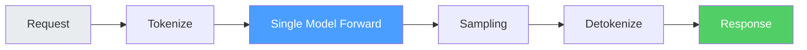


而 Qwen3-Omni 需要的是一个**多模型协同系统**：

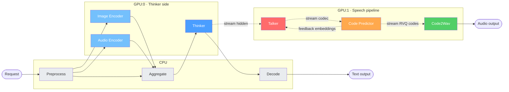

如果顺着主线 SGLang 现在的代码和文档往下看，我们会发现官方支持模型列表里已经把Qwen3-ASR放进 [ `/v1/audio/transcriptions`](https://github.com/sgl-project/sglang/blob/main/docs/supported_models/text_generation/multimodal_language_models.md#L54-L90)支持上了，说明 audio transcription 这条路径本来就在主线能力范围内；但是同一页也明确写着Qwen3-Omni 当前只支持 Thinker [link](https://github.com/sgl-project/sglang/blob/main/docs/supported_models/text_generation/multimodal_language_models.md#L54-L55)，也就是文本、图像、音频、视频理解这半边已经接进来了，但 Talker 对应的语音生成还没有。换句话说，主线现在接入的是 Omni 的理解主干，而不是完整的 speech pipeline。SGlang已经支持了 Omni 体系里偏 understanding 的一半，也支持了 ASR 和多模态输入，但完整 Qwen3-Omni 还没有被接进主 runtime。为了适应这个最新的模型, 有一个全新的框架的需求便呼之欲出。SGLang 主线更擅长把单主干模型、多模态理解和高吞吐 serving 做得高效稳定；而完整 Qwen3-Omni 会把问题继续推向双主干协同、跨模型状态流和异构调度。


| SGLang 的假设 | Qwen3-Omni 的需求                                                           | 冲突          |
| ---------- | ------------------------------------------------------------------------ | ----------- |
| 单一模型       | 多个执行单元协作，但核心压力集中在 Thinker / Talker 双主干                                   | 更像多模型时序编排   |
| 单一 GPU     | 多 GPU 异构部署，或进一步讨论 Thinker / Talker 同 GPU placement                        | 需要 placement 与资源协同 |
| 线性请求流      | DAG 拓扑只是表象，真正关键的是带因果依赖的时序推进                                           | 关键是时序编排而非静态路由 |
| 请求独立       | 模型间有增量依赖（Thinker 逐 token 喂给 Talker）和双向反馈（Talker ↔ Code Predictor）         | 需要跨模型流式状态协同 |
| 单一输出       | 双终端输出（文本 + 语音），需等两路都完成                                                   | 需要终态聚合      |
| 统一调度       | Thinker / Talker 是重调度对象，Code Predictor 等模块只需轻量执行                          | 需要分层异构调度    |


【TODO：这几个认知有很多错的，首先，sglang 当然支持 vocoder encoder 啥的，MTP 也不是问题，这些都不本质；我觉得最本质的问题是，Thinker 和 Talker 是两个几乎等同大小的模型，在 placement 上其实很值得思考；而且，我有个很强的感觉，如果我们能做到 thinker talker 放到同一个 GPU 上，二者各自的 KV cache 大小是个非常有趣的问题；不一定各占一半就是最优】

【请求流是个非常重要的问题，本质上是时序图很重要？】

【流式请求也不是问题，sglang 当然可以流式请求】

【两路输出确实是个区别】

【调度上，Talker 的调度应该远比起 code predictor 重要；我猜测 talker 的调度可以和 thinker 差不多】

如果把上面这张表当作一个 checklist，接下来真正要问的就不是“这些需求存不存在”，而是“哪些才是决定系统形态的核心压力”。从这个角度看，Qwen3-Omni 的难点并不主要在于 encoder、vocoder 或 MTP 这类组件能不能被支持，而在于 serving 问题已经从单模型推理扩展成了多模型时序协同。真正值得仔细讨论的，是 Thinker 和 Talker 这两个接近同量级模型如何做 placement，以及它们之间的增量信息流如何被调度。

**1. Thinker / Talker 的 placement 与资源切分**：最本质的问题不是“模型数量多”，而是 Thinker 和 Talker 这两个重型 decode 主干如何放置。如果它们跨 GPU 部署，问题会落在跨设备传输和节奏协同；如果它们共用一张 GPU，问题又会变成显存切分、KV cache 大小、带宽竞争以及 decode 节奏的相互影响。这里真正难的是资源协同，而不是简单的“多模型”三个字。

**2. 时序图而不只是 DAG**：fan-out / fan-in 只是静态拓扑的描述，真正决定运行时复杂度的是时序图。Thinker 的 token 什么时候可以交给 Talker，aggregate 什么时候才算 ready，Talker 什么时候必须等待 feedback，这些都属于带因果约束的时序推进问题。换句话说，难点不是“有没有分叉和汇聚”，而是这些分叉和汇聚在时间上如何被正确编排。

**3. 跨模型的增量状态传递**：单纯的 client-facing streaming 并不新鲜，SGLang 当然支持流式请求。真正新的地方在于模型和 stage 之间的增量状态传递：Thinker 逐 token 产出，Talker 增量消费，必要时还要处理背压、缓存和恢复。这不是“能不能 stream”的问题，而是“能不能把流式状态安全地跨模型传下去”的问题。

**4. Feedback 环路与执行恢复**：Talker 和 Code Predictor 之间的双向反馈，要求系统支持“生成一步 -> 暂停 -> 等外部结果 -> 恢复继续跑”的执行模式。这比单向流式传输更进一步，因为 runtime 不只是在搬数据，还要显式管理请求状态、暂停点和恢复点。

**5. 双终态聚合与分层调度**：文本和语音双输出确实是个区别，但它更像 runtime / coordinator 层的问题，相对直接；真正更值得区分的是调度层次。Thinker 和 Talker 都是需要持续 decode、维护 KV cache、控制节奏的重调度对象，而 Code Predictor、Vocoder、部分 encoder 更像轻量执行单元。也就是说，系统并不是“每个模块都需要同等级别的 scheduler”，而是需要一套分层的异构调度观。

需要强调的是，这里的结论不是“这些能力绝对不能做进 SGLang”，而是“如果想把完整 Qwen3-Omni 顺着主线 `srt` 的方式补进去，工作量会明显变大”。原因也不是主线能力不够，而是优化目标不同：SGLang 主线当前重点放在单主干模型、音频理解、多模态输入和高吞吐 serving；而完整 Qwen3-Omni 进一步要求 Thinker / Talker placement、跨模型增量状态、feedback 恢复、双终态聚合和分层调度。这些需求一旦都进入主 runtime，调度器就会从单模型队列管理逐渐走向通用时序编排，这本身就是另一类系统问题。

【TODO：部分同意。我对这些挑剔比较厉害，不是因为我喜欢死磕细节，而是我想最大程度复用 sglang 的已有抽象。包括我们可能把 encode 部分都会完全使用 sglang。in short，我认为不应过度高估这个任务的复杂度。和 RL 系统一样，越简洁的越有力。】

### 为什么不能在一个进程里串行跑完所有模型

一个直觉的问题：**既然 SGLang 不行，那我就不用 SGLang 的调度，写一个函数把所有模型串起来跑不就完了？**

```python
# 伪代码：最朴素的串行方案
def process_request(request):
    state = preprocess(request)              # CPU
    image_embeds = image_encoder(state)      # GPU
    audio_embeds = audio_encoder(state)      # GPU（等 image_encoder 跑完才开始）
    merged = aggregate(state, image_embeds, audio_embeds)  # CPU
    text_tokens = thinker(merged)            # GPU:0（thinker 全部跑完才到下一步）
    text_result = decode(text_tokens)        # CPU
    codec_tokens = talker(text_tokens)       # GPU:1（等 thinker 全部跑完才开始）
    codes = code_predictor(codec_tokens)     # GPU:1
    audio = code2wav(codes)                  # GPU:1
    return text_result, audio
```

这个版本当然“能跑”，但系统层面的问题其实很直接，简单来说就三条：

- **并行性被压平了**：`image_encoder` 和 `audio_encoder` 本来可以并行，现在却只能排队执行；CPU、GPU:0、GPU:1 也会经常彼此等待，很多时间都在空转。
- **没有流式**：Talker 必须等 Thinker 全部结束之后才能开始，这和 Qwen3-Omni 真正需要的增量协同是反着来的。假设 Thinker 生成 100 个 token、每个 token 30ms，Talker 每步 20ms，那么串行情况下首音延迟大约是 `3000ms + 20ms = 3020ms`；如果改成流式并行，首音延迟就接近 `30ms + 20ms = 50ms`。
- **链路一长就很难维护**：一个大函数里同时揉 CPU 预处理、多路 encoder、Thinker、Talker、Code Predictor 和 Code2Wav，后面只要再加一点并发、容错、扩缩容或跨 GPU 协调，复杂度就会迅速失控。

所以这里的问题不是“能不能写一个串行函数把它跑通”，而是这种写法天然把 Qwen3-Omni 的并行结构和流式结构都压扁了。它可以作为功能验证，但很难成为一个可扩展的 serving 方案。

### 为什么要拆成多个 Stage，而不是用一个大循环

再往前走一步，一个很自然的追问是：**既然问题出在线性串行，那我在一个进程里用 `asyncio` 把这些模块都调起来，是不是就够了？**

```python
# 伪代码：单进程异步方案
async def process_request(request):
    state = await preprocess(request)
    img_task = asyncio.create_task(image_encoder(state))
    aud_task = asyncio.create_task(audio_encoder(state))
    img_embeds, aud_embeds = await asyncio.gather(img_task, aud_task)  # 并行
    merged = aggregate(state, img_embeds, aud_embeds)
    # ... thinker 流式输出给 talker ...
```

【TODO：所以核心是想说，要做成多进程异步的生产消费者模型么？】

可以这么理解，而且这句话其实已经很接近核心了。更准确一点说，SGLang Omni 想做的不是“把所有模型塞进一个大循环里异步跑”，而是把整条链路拆成**多进程异步的生产者-消费者模型**：上游 Stage 负责产生中间状态和增量结果，下游 Stage 负责按自己的节奏消费，Coordinator 再负责路由、聚合和生命周期管理。

这个思路当然比纯串行更进一步，因为它至少承认了“不同阶段可以并行推进”这件事。但如果继续从工程落地和 serving framework 的视角往下推，会发现单进程异步仍然只是把问题向后推了一层，并没有真正解决系统边界、资源边界和调度边界。核心问题主要有下面几类：

**1. GPU 内存隔离**

Thinker 在 GPU:0，Talker 在 GPU:1。如果在同一个进程里同时管理多个 GPU 上的大模型，CUDA context、内存分配、stream 同步以及错误传播都会彼此耦合。把它们拆成独立进程之后，每个进程只维护自己的设备视角，边界会清楚很多，资源干扰也更容易控制。

**2. 调度策略不同**

Thinker 需要 continuous batching，要管理 KV cache、batch 动态变化和 decode 节奏；Code Predictor 则更像一个轻量的逐步 forward 模块，调度需求完全不是一个量级。如果硬放在一个进程里，要么做一个极其复杂的统一调度器，把所有模型都揉进同一套抽象；要么每个模块各写一套局部逻辑，最后变成一个很难维护的混合体。拆成 Stage 之后，反而可以让每个阶段选择最适合自己的 executor 和 scheduling policy。

**3. 故障隔离**

在生产系统里，一个模型 OOM、hang 住或者局部崩溃，不应该把整条请求链路一起拖死。拆成独立进程之后，故障会被天然限制在 stage 边界内，恢复策略也更直接。

**4. 灵活扩缩容**

如果瓶颈在 Thinker，就应该单独扩 Thinker；如果某个场景不需要语音输出，就应该直接裁掉 talker_ar / code_predictor / code2wav 这一支。Stage 化之后，这类扩缩容和 pipeline 裁剪都可以在配置层完成，而不需要回头重写主干框架。

**5. 通信效率**

这里还有一个常见误解：多进程并不自动等于“数据拷来拷去，通信一定很重”。真正合理的做法是让 Stage 之间传的主要是**元信息**，也就是“数据在共享内存或设备内存的哪里”；而真正的大 tensor 走共享内存、CUDA IPC 或 NCCL。这样控制流和数据流被拆开之后，多进程的通信成本并不会像直觉里那么夸张。

## SGLang Omni 的解法：多进程异步的生产者-消费者流水线

SGLang Omni 的核心思路可以概括成一句话：**尽量不把 Qwen3-Omni 的复杂性塞回 SGLang 内部，而是在 SGLang 之上补一层专门的编排层。** 在这层编排里，一个多模态请求会被拆成多个 Stage；这些 Stage 以独立进程异步运行，通过控制面和数据面交换消息，整体上形成一个生产者-消费者式的流水线。

### 架构总览

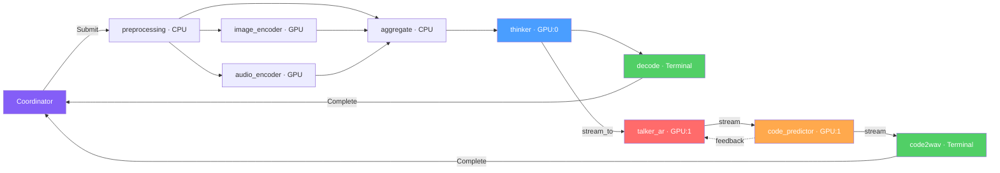


从当前代码看，这套框架已经不只服务 Qwen3-Omni，而是开始朝“可复用的 omni serving 骨架”演化。至少在接口层面，它已经支持下面两类模型：


| 模型             | Stage 数                         | 语音架构                                              | 特点                            |
| -------------- | ------------------------------- | ------------------------------------------------- | ----------------------------- |
| **Qwen3-Omni** | 9 (text+speech) / 6 (text-only) | RVQ codec (Talker AR → Code Predictor → Code2Wav) | Thinker-Talker 分离，feedback 环路 |
| **Ming-Omni**  | 7 (text+speech) / 5 (text-only) | CFM flow matching (DiT + Aggregator + AudioVAE)   | 自包含 Talker，无 feedback         |


如果以带语音输出的 Qwen3-Omni 为例，完整流水线会被拆成 **9 个 Stage**：


| Stage          | 位置  | 设备    | 作用                                                           |
| -------------- | --- | ----- | ------------------------------------------------------------ |
| preprocessing  | 入口  | CPU   | 文本 tokenize、多媒体解析                                            |
| image_encoder  | 编码  | GPU   | Vision Transformer 编码图片/视频                                   |
| audio_encoder  | 编码  | GPU   | 音频 Mel 频谱编码                                                  |
| aggregate      | 聚合  | CPU   | 合并文本 tokens 与编码器输出（fan-in）                                   |
| thinker        | 推理  | GPU:0 | MoE Transformer 主模型，生成文本 token（fan-out 到 decode + talker_ar） |
| decode         | 输出  | CPU   | 文本后处理（Terminal）                                              |
| talker_ar      | 语音  | GPU:1 | 语音 codec token 自回归生成                                         |
| code_predictor | 语音  | GPU:1 | RVQ 多层码预测（双向 feedback）                                       |
| code2wav       | 语音  | GPU:1 | Vocoder 合成音频波形（Terminal）                                     |


这张 Stage 表并不是简单把模型组件“逐个翻译”为工程模块，而是把前文那些抽象压力逐项落实到了系统结构里：fan-in/fan-out 对应 DAG 路由，`stream_to` 对应跨模型流式传输，`WAITING_FEEDBACK` 对应反馈环路，多 Terminal 聚合则负责把文本和语音两条终态重新收拢到同一个请求结果里。

### 声明式配置 → 运行时编译

这套框架里一个很有代表性的设计是：把流水线拓扑从硬编码逻辑里抽出来，改为用**声明式配置**描述。也就是说，框架不预设“一个请求必须经过哪些固定步骤”，而是把这件事下放给模型配置层：

```python
# sglang_omni/models/qwen3_omni/config.py
class Qwen3OmniSpeechPipelineConfig(PipelineConfig):
    entry_stage = "preprocessing"
    terminal_stages = ["decode", "code2wav"]
    gpu_placement = {"thinker": 0, "talker_ar": 1, "code_predictor": 1, "code2wav": 1}
    stages = [
        StageConfig(name="preprocessing", executor=..., get_next=preprocessing_next, ...),
        StageConfig(name="image_encoder",  executor=..., get_next=encoder_next, ...),
        StageConfig(name="audio_encoder",  executor=..., get_next=encoder_next, ...),
        StageConfig(name="mm_aggregate",   executor=..., get_next=aggregate_next,
                    input_handler=AggregatedInput(sources=["preprocessing", "image_encoder", "audio_encoder"])),
        StageConfig(name="thinker",        executor=..., get_next=thinker_next_speech,
                    stream_to=["talker_ar"]),          # 流式传输 hidden states
        StageConfig(name="decode",         executor=..., get_next=None),   # Terminal
        StageConfig(name="talker_ar",      executor=..., get_next=talker_ar_next,
                    stream_to=["code_predictor"]),
        StageConfig(name="code_predictor", executor=..., get_next=code_predictor_next,
                    stream_to=["code2wav", "talker_ar"]),  # 双路：code2wav + feedback
        StageConfig(name="code2wav",       executor=..., get_next=None),   # Terminal
    ]
```

然后由 `compile_pipeline()` 编译为可运行的对象：

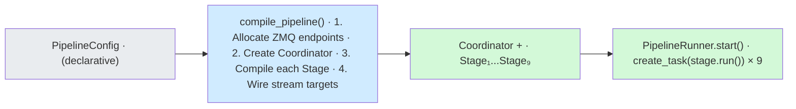


这套设计真正想换来的，是“模型差异尽量体现在配置和 executor 上，而不是体现在框架主干上”。从结果看，它至少在一定程度上达成了这个目标：后续加入 **Ming-Omni**（Ming-flash-omni-2.0）时，虽然语音部分已经换成了完全不同的 CFM/DiT flow matching 路线，但框架主干基本没有改动，只是增加了新的 `PipelineConfig` 和对应 executor。

进一步说，框架还引入了 **Config Variant** 机制，让同一个模型可以按场景切出不同流水线：

```python
# Qwen3-Omni 的两种变体
Variants = {
    "text": Qwen3OmniPipelineConfig,       # 6 stage, 纯文本输出
    "speech": Qwen3OmniSpeechPipelineConfig, # 9 stage, 文本 + 语音
}
# 启动时选择：--variant speech
```

---

## Pipeline 整体架构

### Coordinator

[Coordinator](https://github.com/sgl-project/sglang-omni/blob/main/sglang_omni/pipeline/coordinator.py) 是整个流水线的入口和出口（代码仅 395 行），只做三件事：

1. **门卫（请求进入）**：把用户请求封装为 `StagePayload`，发 `SubmitMessage` 给入口 Stage，然后记下 "这个 request_id 我发出去了"。**不关心请求内容，不参与中间流转。**
2. **收发室（完成聚合）**：等终点 Stage（`decode` 和 `code2wav`）都报告完成，合并 `partial_results` 返回给用户。只有一个终点完成时继续等另一个。
3. **广播站（Abort）**：用户断开连接时，通过 PUB/SUB 广播给所有 Stage "这个请求不用做了"。因为不知道请求在哪个 Stage，所以广播给所有人。

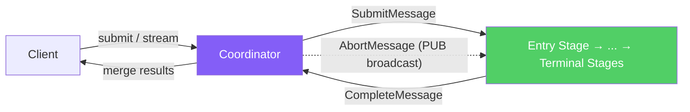


这里有一个边界非常重要：**Coordinator 不负责 Stage 之间的中间路由。** “preprocessing 结束后该把结果送去哪里”这件事，不由 Coordinator 统一调度，而是由每个 Stage 自己的 `get_next` 决定。换句话说，Coordinator 更像请求入口和结果汇聚器，而不是全局工作流调度器。

关键方法：

- `submit(request_id, request)` — 提交请求并等待完成
- `stream(request_id, request)` — 提交请求并流式返回
- `run_completion_loop()` — 后台协程，持续接收 `CompleteMessage` / `StreamMessage`
- `abort(request_id)` — 广播取消信号

### Control Plane vs Data Plane

如果把 Stage 间协作再往下拆，会发现这里其实有两条完全不同的通信路径，而且二者承担的职责非常明确：

- **控制面（Control Plane, ZMQ）**：只传"通知"——谁发的、发给谁、数据在共享内存哪个位置。消息几十字节，微秒级延迟。
- **数据面（Data Plane, Relay）**：只传"数据"——tensor、模型输出等大块数据。通过共享内存 / NCCL / CUDA IPC 传输，几乎零拷贝。

之所以必须拆成两层，是因为“通知”和“数据”在通信特征上完全不是一回事。ZMQ 适合小控制消息，不适合搬大 tensor；共享内存和 CUDA IPC 适合大数据传输，但不适合承担复杂的路由通知。把两者硬糅在一起，最后通常两边都做不好。

Relay 使用 **credit 机制**管理共享内存 slot：预分配 N 个 slot（比如 2 个 × 64MB），写满了就等下游读完释放。这也是为什么下游收到 `DataReadyMessage` 后要尽快读出来——释放 credit 让上游继续发。

### Control Plane

[ControlPlane](https://github.com/sgl-project/sglang-omni/blob/main/sglang_omni/pipeline/control_plane.py) 基于 ZMQ 实现进程间通信。它没有试图做成一个“大而全”的消息系统，而是非常克制地只使用了两种消息模式，各自解决不同的问题：

**PUSH/PULL（点对点）**：用于 Stage 之间和 Stage 与 Coordinator 之间的定向消息传递。接收方 bind（地址固定，先启动），发送方 connect（可动态加入）。

**PUB/SUB（广播）**：用于 Coordinator 向所有 Stage 广播 abort 信号。Coordinator 的 PUB socket bind，各 Stage 的 SUB socket connect，一条消息所有 Stage 同时收到。

**PUSH/PULL (point-to-point):**

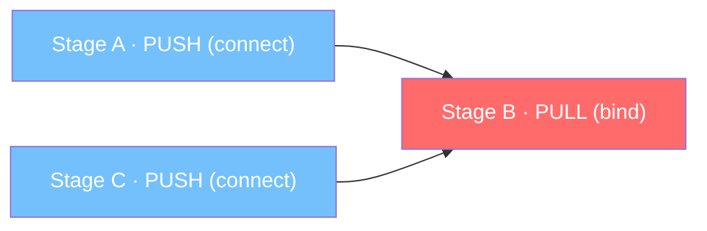


**PUB/SUB (broadcast):**

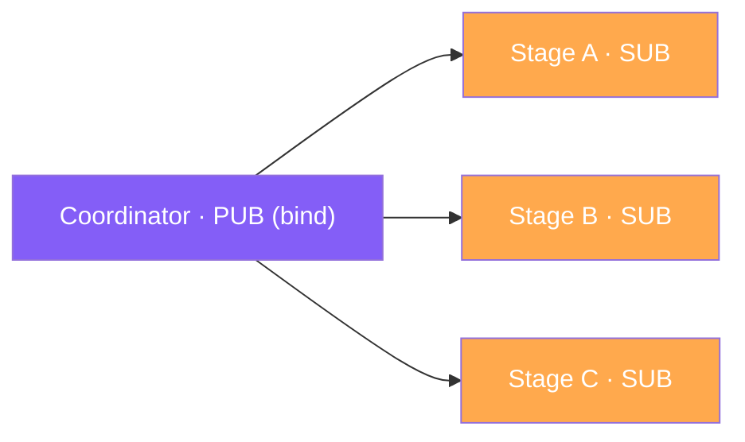


| 消息类型               | 模式        | 方向                           | 用途               |
| ------------------ | --------- | ---------------------------- | ---------------- |
| `SubmitMessage`    | PUSH/PULL | Coordinator → 入口 Stage       | 初始请求提交           |
| `DataReadyMessage` | PUSH/PULL | Stage → Stage                | 数据就绪通知（含共享内存元信息） |
| `CompleteMessage`  | PUSH/PULL | Terminal Stage → Coordinator | 请求完成             |
| `StreamMessage`    | PUSH/PULL | Stage → Coordinator          | 流式中间结果           |
| `AbortMessage`     | PUB/SUB   | Coordinator → 所有 Stage       | 请求取消             |
| `ShutdownMessage`  | PUSH/PULL | Coordinator → Stage          | 关闭信号             |


在代码层面，Control Plane 被拆成两个实现，分别服务于 Coordinator 端和 Stage 端：

- `**CoordinatorControlPlane**`：Coordinator 端，管理到各 Stage 的 PUSH socket 和接收 completion 的 PULL socket。
- `**StageControlPlane**`：Stage 端，提供 `recv()` 阻塞接收和 `send_to_stage()` / `send_complete()` 路由功能。

### Stage

[Stage](https://github.com/sgl-project/sglang-omni/blob/main/sglang_omni/pipeline/stage/runtime.py) 代表流水线中的一个处理节点。它是这套系统最核心的运行时单元之一，因为真正的“阶段化”并不是停留在配置文件里，而是要在这里变成进程、队列、聚合器和执行循环。

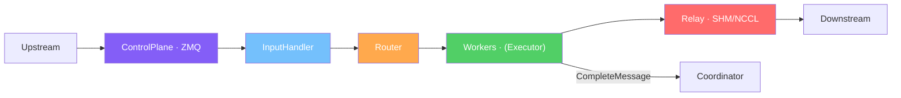


从职责上看，一个 Stage 主要做下面几件事：

1. **消息路由**：接收 `SubmitMessage` 或 `DataReadyMessage`，分派给内部 Worker。
2. **输入聚合**：部分 Stage（如 `aggregate`）需要等待多个上游 Stage 的数据全部到达后才能开始处理，使用 `AggregatedInputHandler` 实现。
3. **Abort 监听**：后台协程持续监听 `AbortMessage`，收到后清理该请求的所有状态（路由器队列、共享内存 slot、StreamQueue、通知 Executor 停止）。
4. **流式块路由**：通过 `StreamQueue` 将上游的流式数据块转发给对应 Worker。

这里的并发模型也值得单独强调一下：`Stage.run()`、`abort_listener()` 和 `worker.run()` 这几个协程虽然都是异步的，但它们运行在**同一个 Stage 进程内部的同一个 event loop** 上，依靠 `await` 协作切换。真正意义上的并行不是靠 asyncio 本身，而是靠多 Stage 多进程部署实现的。

**[WorkerRouter](https://github.com/sgl-project/sglang-omni/blob/main/sglang_omni/pipeline/stage/router.py)**（仅 48 行）负责将请求分配给 Worker：轮询分配新请求（round-robin），但同一个 `request_id` 的后续消息**永远发给同一个 Worker**（sticky affinity）。这是因为 Thinker/Talker 的 `EngineExecutor` 内部有 KV cache，请求被分到另一个 Worker 会因找不到 KV cache 而出错。目前大多数 Stage 只有 1 个 Worker（`num_workers=1`），此时 Router 是透传。

核心执行循环 `Stage.run()`:

```
while not shutdown:
    msg = control_plane.recv()           # await 等消息，不卡 event loop
    if SubmitMessage:
        input_handler.receive(msg)       # 记录输入
        router.enqueue(work)             # 分发给 Worker
    elif DataReadyMessage:
        input_handler.receive(msg)       # 聚合输入
        if all_inputs_ready:
            router.enqueue(work)         # 全部就绪后分发
    elif StreamChunk:
        stream_queue.put(request_id, chunk)  # 放入流式队列
```

### Worker

[Worker](https://github.com/sgl-project/sglang-omni/blob/main/sglang_omni/pipeline/worker/runtime.py) 是 Stage 内部真正干活的执行单元。前面的 Stage 更像“运行时外壳”，负责收消息、做聚合、管路由；到了 Worker 这里，请求才会被真正送进 executor 做计算。

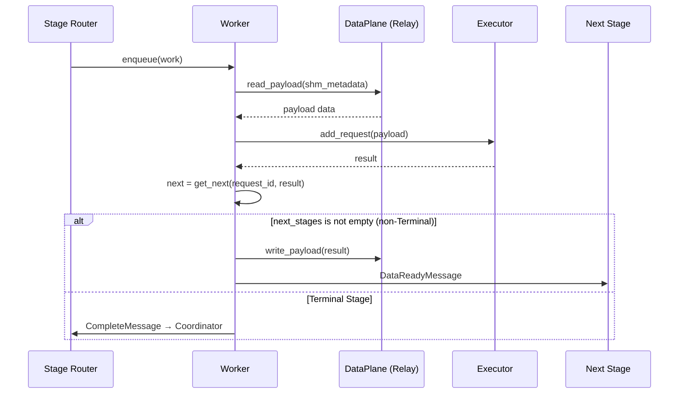


对于流式 Stage，Worker 还会额外挂一个 `_stream_send_loop()` 后台任务，把 executor 生成的块状结果持续推给下游。也正因为有了这一层，框架里“普通完成式 Stage”和“流式 Stage”才能共用同一套整体运行时壳子。

**同 GPU 零拷贝优化**：当上下游 Stage 在同一 GPU 上时（如 `talker_ar` → `code_predictor`），使用 CUDA IPC（`ForkingPickler`）实现 tensor 零拷贝传输，避免通过共享内存中转。

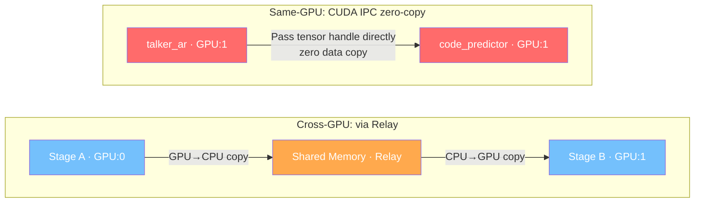


### Executor

[Executor](https://github.com/sgl-project/sglang-omni/blob/main/sglang_omni/executors/interface.py) 是最靠近具体计算的一层抽象，它定义了一组统一的请求处理接口，让上层 Stage 不必关心“这个阶段内部到底是单次 forward，还是一个完整的自回归引擎”：

```python
class Executor(ABC):
    async def add_request(payload: StagePayload) -> None    # 提交请求
    async def get_result() -> StagePayload                   # 获取结果
    async def abort(request_id: str) -> None                 # 取消请求
    def set_stream_fn(fn) -> None                            # 设置流式回调
```

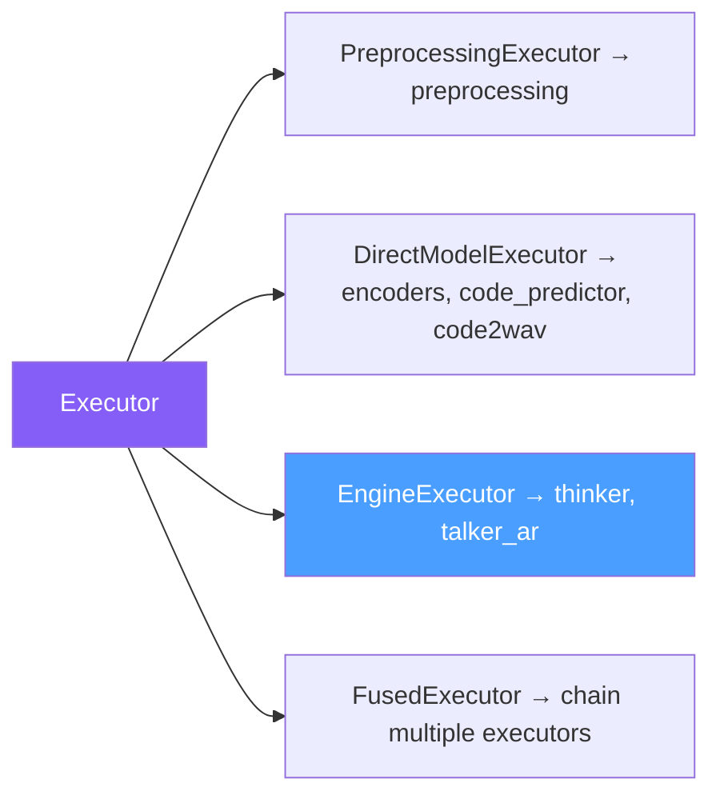


Thinker 之所以必须走 `EngineExecutor`，而 image encoder 只需要 `DirectModelExecutor`，关键不在于“模型大不大”，而在于它们的计算模式完全不同。前者是一个需要维护请求状态、KV cache 和多步调度的自回归系统；后者则更接近一次性算子，请求进来，跑完 forward 就结束。

`FusedExecutor` 可以把多个 Stage 合进同一个进程（Stage Fusion），中间结果在内存里直传而不走共享内存，减少 IPC 开销。

---

## 请求处理全流程

前面几节已经把组件职责拆开了；这一节把这些组件重新串起来，按一个“文本 + 图片 + 音频”请求的实际生命周期走一遍，看看数据是如何一步步穿过整个流水线的。

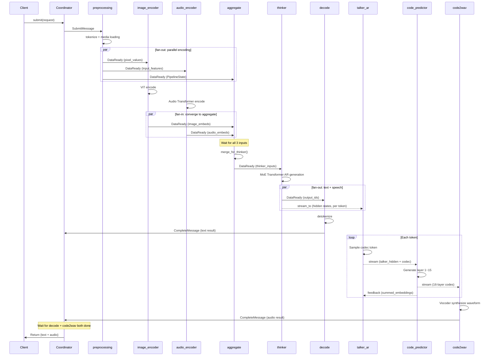


### Stage 1: Preprocessing（预处理）

**Executor**: `PreprocessingExecutor`
**设备**: CPU
**核心类**: [Qwen3OmniPreprocessor](https://github.com/sgl-project/sglang-omni/blob/main/sglang_omni/models/qwen3_omni/components/preprocessor.py)

预处理阶段负责把用户原始输入变成后续各个模型真正能消费的张量与元信息。这里做的事情看似“前处理”，但实际上决定了后面整个 DAG 能否顺利扇出：

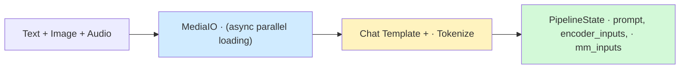


完成预处理之后，数据会同时流向 `image_encoder`、`audio_encoder` 和 `aggregate` 三个 Stage。也就是说，真正的多路并行从这里就已经开始了，而不是等到主模型阶段才出现。

### Stage 2-3: Image Encoder & Audio Encoder（编码器）

**设备**: GPU

#### Image Encoder

**核心类**: [Qwen3OmniImageEncoder](https://github.com/sgl-project/sglang-omni/blob/main/sglang_omni/models/qwen3_omni/components/image_encoder.py)

- 基于 27 层 Vision Transformer（ViT），patch_size=16，spatial_merge_size=2
- 输入 `pixel_values [B, C, H, W]`，输出 `image_embeds [n_tokens, 3584]`
- **多尺度特征**：通过 `deepstack_visual_indexes=[8, 16, 24]` 从中间层提取特征（deepstack_visual_embeds），供后续 Thinker 使用
- **优化**：`_optimize_patch_embed` 将 Conv3d 重写为 Linear，获得 7-15x 的推理加速

#### Audio Encoder

**核心类**: [Qwen3OmniAudioEncoder](https://github.com/sgl-project/sglang-omni/blob/main/sglang_omni/models/qwen3_omni/components/audio_encoder.py)

- 基于 32 层 Transformer 编码器，输入 128 维 Mel 频谱特征
- 输入 `input_features [B, n_mels, T]`，输出 `audio_embeds [n_tokens, 3584]`
- 支持 500-token chunk 流式处理

两个编码器彼此独立推进，分别把结果送到 `aggregate`。从拓扑上看，这一步正好构成前文 fan-in 的前半段：先分头编码，再在聚合点重新会合。

### Stage 4: Aggregate（聚合）

**设备**: CPU
**输入聚合**: `AggregatedInputHandler`

Aggregate Stage 是一个非常典型的 **fan-in** 节点。它的职责不是做重计算，而是把前面分散在多条支路上的输入重新收束成 Thinker 可以一次性消费的统一输入：

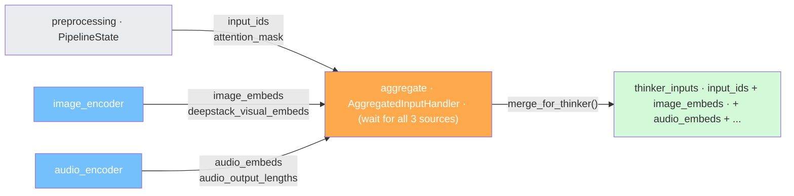


### Stage 5: Thinker（主模型推理）

**Executor**: `EngineExecutor`（包装 `OmniEngine`）
**设备**: GPU:0
**核心模型**: [Qwen3OmniMoeThinkerTextModel](https://github.com/sgl-project/sglang-omni/blob/main/sglang_omni/models/qwen3_omni/thinker.py)

Thinker 是整个系统的语义中心。前面所有编码、聚合和路由工作，最终都是为了把输入组织成它能消费的形式；而后面的文本输出与语音流水线，也都以它的增量结果为起点。

#### 模型结构

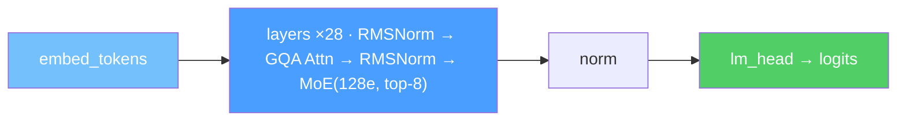


#### Forward 流程

1. **Token 嵌入**: `input_ids` → `embed_tokens` → `[seq_len, 2048]`
2. **多模态融合**: 在 placeholder token 位置通过 `masked_scatter` 注入编码器输出
  - 视觉 placeholder → `image_embeds` / `video_embeds`
  - 音频 placeholder → `audio_embeds`
3. **28 层 Transformer**：RMSNorm → GQA Attention (28 heads, 4 kv heads) → RMSNorm → MoE → Residual
4. **输出**: hidden states → `lm_head` → logits → sampling → `output_ids`

**优化**：

- `fused_qk_norm_rope` kernel：将 QK Norm 和 RoPE 融合为单个 bfloat16 kernel（约 3x 加速）
- YARN RoPE scaling：将上下文从 8K 扩展到 32K
- RadixAttention：高效 KV cache 管理

#### 输出分流（fan-out）

Thinker 跑完之后，请求会再次发生一次 fan-out。这里也是整条链路里最关键的一次分叉，因为文本和语音两个终态正是从这里正式分开：

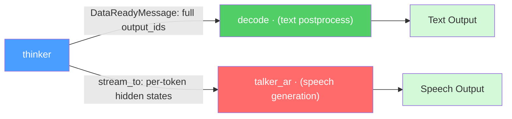


- **text 分支** → `decode` Stage（文本后处理），通过 `DataReadyMessage` 传输完整结果
- **speech 分支** → `talker_ar` Stage（语音生成），通过 `stream_to` 逐 token 流式传输：
  - `thinker_embeds`: token embeddings
  - `thinker_hidden[layer_24]`: 第 24 层的 hidden states（供 Talker 做跨模态对齐）

### Stage 6: Decode（解码输出）

**设备**: CPU（Terminal Stage）

Decode 阶段相对直接：把 Thinker 的 `output_ids` 还原为文本，并组织成最终响应。它本身不是复杂计算节点，但它承担了一个 Terminal Stage 的职责，因此会参与最终结果聚合。

### Stage 7-9: Speech Pipeline（语音生成流水线）

如果请求启用了语音输出，那么 Thinker 的结果还会额外进入一条三级语音流水线。这条支路整体部署在 GPU:1 上，负责把文本侧的增量状态逐步转换成最终音频：

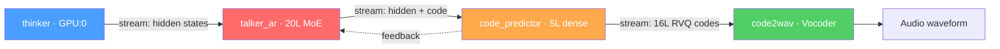


#### Stage 7: Talker AR

**Executor**: `EngineExecutor`（包装 `OmniEngine`）
**核心类**: [Qwen3OmniMoeTalkerTextModel](https://github.com/sgl-project/sglang-omni/blob/main/sglang_omni/models/qwen3_omni/talker.py)

Talker 是一个 20 层 MoE Transformer（128 experts, top-6 routing）。和 Thinker 相比，它的职责不再是“理解并决定说什么”，而是“接住 Thinker 给出的语义增量，把它稳定地翻译成语音 codec 流”。

**Prefill 输入构建**（[build_prefill_input](https://github.com/sgl-project/sglang-omni/blob/main/sglang_omni/models/qwen3_omni/components/talker_input.py)）：

如前文所述，Talker 并不直接消费 Thinker 的 logits，而是消费 Thinker 的 **embeddings** 与 **hidden states**，并据此构造自己的 prefill 输入：

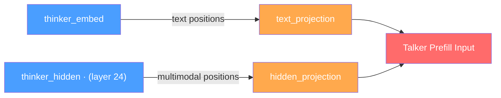


这里最关键的不是 Talker 本身有多复杂，而是它和 Code Predictor 之间存在一个真实的 feedback 闭环。Talker 每吐出一步 codec token，并不能无脑继续往前跑，而是要等 Code Predictor 返回聚合后的 embedding，再把它当作下一步解码的附加上下文。

#### Stage 8: Code Predictor

**核心类**: [_CodePredictorWrapper](https://github.com/sgl-project/sglang-omni/blob/main/sglang_omni/models/qwen3_omni/components/code_predictor_executor.py)

Code Predictor 是一个 5 层 dense Transformer（hidden=1024, vocab=2048）。它接住 Talker 的逐步输出，一边补齐剩余 RVQ 层，一边把反馈信息重新送回 Talker：

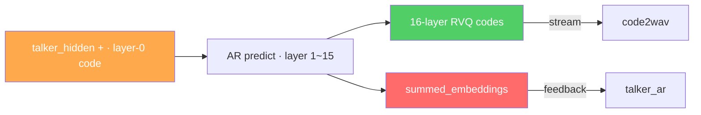


#### Stage 9: Code2Wav

**核心类**: [_Code2WavStreamingExecutor](https://github.com/sgl-project/sglang-omni/blob/main/sglang_omni/models/qwen3_omni/components/code2wav_executor.py)

Code2Wav 位于语音链路的末端，使用 HF 的 `Qwen3OmniMoeCode2Wav`（neural codec decoder / vocoder）把完整 RVQ codes 还原为真正可播放的音频波形：

1. 累积 code chunks 直到达到 `stream_chunk_size`
2. `_decode_incremental()`: 将 codes `[num_chunks, 16]` 输入 vocoder
3. 裁剪左侧上下文伪影（`left_context_size`）
4. 流式输出 float32 音频块（24kHz）
5. 最终拼接所有音频块

---

## OmniEngine: 调度与执行引擎

[OmniEngine](https://github.com/sgl-project/sglang-omni/blob/main/sglang_omni/engines/omni/engine.py) 是 Thinker 和 Talker AR 这类“需要多步迭代推进”的 Stage 背后的执行引擎。把它理解成一个特化版的小型 serving runtime 会比较准确：每一轮循环里，先由 Scheduler 选请求、组 batch，再交给 ModelRunner 做 forward，最后再根据输出更新请求状态并决定下一轮怎么走。

### 请求生命周期

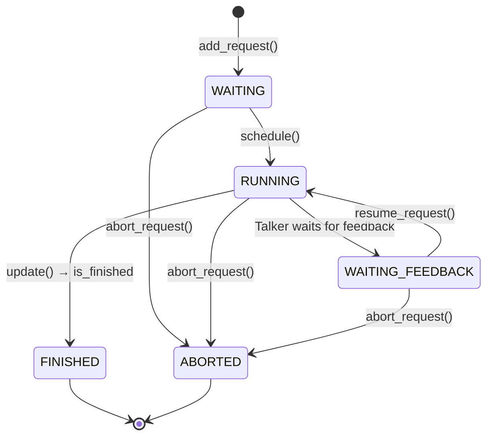


如果只抓主干，**[Scheduler](https://github.com/sgl-project/sglang-omni/blob/main/sglang_omni/engines/omni/scheduler.py)** 的职责大致可以概括成下面几件事：

- `add_request(request_id, data)` — 请求入队为 `WAITING` 状态
- `schedule()` — 通过 `BatchPlanner` 选择请求并构建 batch，返回 `SchedulerOutput`
- `update(scheduler_output, model_output)` — 根据模型输出更新请求状态，由 `IterationController` 判断是否完成
- `stream(request_id)` — 返回异步生成器，逐步 yield 中间输出

与之对应，**[ModelRunner](https://github.com/sgl-project/sglang-omni/blob/main/sglang_omni/engines/omni/model_runner.py)** 则更接近一个无状态执行器：它不决定谁该跑、也不决定请求何时结束，只负责拿到排好的一批输入，把 forward 跑完，再把结果交给输出处理器整理。

### 执行模式

OmniEngine 支持两种执行模式。它们的区别不在于算法逻辑，而在于**当前步的 GPU execute** 和 **上一步的 CPU 结果处理** 是否重叠执行。要注意，`schedule()` 在两种模式里都发生在每轮开头，本身并没有被 overlap 掉。

#### Normal 模式 vs Overlap 模式

下面这两张图里的 `t0 / t1 / t2 ...` 都只是抽象时间片，只表示先后关系，不表示真实耗时。CPU lane 表示 engine 线程里的 `schedule / update / _process_pending_result`，GPU lane 表示 `model_runner.execute()` 对应的 forward。

```text
Normal 模式

time  t0              t1                 t2           t3                t4                   t5
CPU   [schedule N] -> [wait execute N] -> [update N] -> [schedule N+1] -> [wait execute N+1] -> [update N+1]
GPU   [idle      ] -> [execute N     ] -> [idle    ] -> [idle        ] -> [execute N+1     ] -> [idle       ]
```

```text
Overlap 模式

time  t0              t1                 t2                 t3              t4                     t5                 t6              t7                     t8
CPU   [schedule 0] -> [wait execute 0] -> [buffer result 0] -> [schedule 1] -> [process result 0] -> [buffer result 1] -> [schedule 2] -> [process result 1] -> [buffer result 2 / drain]
GPU   [idle      ] -> [execute 0     ] -> [idle           ] -> [idle      ] -> [execute 1       ] -> [idle           ] -> [idle      ] -> [execute 2       ] -> [idle                    ]
```

换句话说，真正 overlap 的不是“Step N 里的所有动作”，而只是：

- `execute(N)` 和 `_process_pending_result(N-1)` 重叠
- GPU 上依然是一轮只跑一个 batch，并不会同时并行多个 `forward`
- `schedule(N)` 仍然在每轮开头串行执行，所以它还在主路径上

从代码看，`_step_overlap()` 的关键点主要有四个：

1. 它通过 `asyncio.run_in_executor()` 把 `model_runner.execute()` 提交到线程池里，这样 event loop 线程不会被同步的 GPU 调用卡住。
2. 在 `await execute_future` 的同时，主线程会处理上一步缓存下来的 `_process_pending_result()`；这一步里面不只是 `scheduler.update()`，还包括 cache 写回、finish 检查和 feedback 检查。
3. 连续 prefill batch 时会临时关闭 overlap，以便更快把第一批 prefill 的结果交出去，优化 TTFT。
4. 在工厂层，带 feedback 环路的引擎（例如 Talker AR）通常也会关闭 overlap，因为它们更需要严格的同步步进语义。

### Runtime Protocol 接口

为了让同一套 OmniEngine 同时服务 Thinker 和 Talker，代码把调度逻辑再往下拆成一组 Protocol 接口：

```mermaid
graph LR
    OE["OmniEngine"] --> BP["BatchPlanner"] & RM["ResourceManager"] & IC["IterationController"]
    OE --> IP["InputPreparer"] & OP["OutputProcessor"] & CM["CacheManager"]

    style OE fill:#845ef7,color:#fff
```


这些接口定义在 [engines/omni/runtime/interfaces.py](https://github.com/sgl-project/sglang-omni/blob/main/sglang_omni/engines/omni/runtime/interfaces.py)，由具体模型分别实现。设计意图很明确：公共引擎只保留循环骨架，而把模型特定的 batch 规划、输入准备和输出更新逻辑下放。

---

## 核心数据结构

### PipelineState

[PipelineState](https://github.com/sgl-project/sglang-omni/blob/main/sglang_omni/models/qwen3_omni/io.py) 是贯穿整条流水线的核心状态容器。它不是某个单独阶段的输入结构，而更像“请求在当前时刻的工程侧快照”，随着请求向前推进不断被补充：

```mermaid
graph LR
    Pre["preprocessing · raw_inputs, prompt, · mm_inputs, encoder_inputs"] --> Enc["encoder · encoder_outs"] --> Agg["aggregate · thinker_inputs"] --> Th["thinker · thinker_out"] --> Dec["decode · engine_outputs"]

    style Pre fill:#e9ecef,color:#333
    style Enc fill:#74c0fc,color:#fff
    style Agg fill:#ffa94d,color:#fff
    style Th fill:#4a9eff,color:#fff
    style Dec fill:#51cf66,color:#fff
```


```python
@dataclass
class PipelineState:
    raw_inputs: Any                    # 用户原始输入
    prompt: PromptInputs               # {input_ids, attention_mask, prompt_text}
    mm_inputs: dict[str, Any]          # {image: [...], audio: [...], video: [...]}
    encoder_inputs: dict[str, dict]    # {image_encoder: {...}, audio_encoder: {...}}
    encoder_outs: dict[str, Any]       # 编码器输出 {image_embeds, audio_embeds, ...}
    thinker_inputs: dict[str, Any]     # 合并后的 thinker 输入
    thinker_out: ThinkerOutput         # {output_ids, step, is_final, extra_model_outputs}
    engine_outputs: dict[str, Any]     # 最终解码结果
    stream_state: dict[str, Any]       # 流式输出状态追踪
```

### Scheduler 相关类型

和 `PipelineState` 相比，定义在 [engines/omni/types.py](https://github.com/sgl-project/sglang-omni/blob/main/sglang_omni/engines/omni/types.py) 的这些类型更偏向引擎内部调度语义：

- **SchedulerStatus**：请求生命周期状态，取值是 `WAITING` / `RUNNING` / `WAITING_FEEDBACK` / `FINISHED` / `ABORTED`
- **SchedulerRequest**：Scheduler 视角下的单请求容器。核心字段是 `request_id` 和 `status`；模型特定状态放在 `data` 里，另外还带 `error`、`arrival_time`、`finish_time`
- **SchedulerOutput**：某个 step 被选中的请求集合，以及配套的 `batch_data` 和 `step_id`
- **RequestOutput**：单个请求在这一步的输出，除了 `finished` 和 `finish_reason`，还有模型特定的 `data` 和可选的 `extra`
- **ModelRunnerOutput**：一个 batch 的聚合输出，核心是 `outputs`，另外还保留 `req_ids` 和 `req_id_to_index`

### Control Plane 消息

而定义在 [proto/messages.py](https://github.com/sgl-project/sglang-omni/blob/main/sglang_omni/proto/messages.py) 里的消息，则是前面控制面的具体载体：

- **DataReadyMessage**：上游 Stage 通知下游“数据已经准备好”。里面的 `shm_metadata` 本质上是传输元信息，不一定只是共享内存位置，也可能是当前 relay 后端使用的其他 metadata；另外还带 `chunk_id`、`is_done`、`error`
- **StreamMessage**：Stage 向 Coordinator 发送流式输出 chunk，用于边生成边回传
- **CompleteMessage**：Terminal Stage 向 Coordinator 报告“这个请求已经完成”或“这一支失败了”
- **AbortMessage**：Coordinator 向各 Stage 广播取消某个 `request_id`

这些消息会先转成 dict，再用 msgpack 序列化，通过 ZMQ 在进程之间传输。

---

## 深入机制

### 流式传输（stream_to）

大多数 Stage 之间的协作都是“前一个算完、后一个再接”。但 Thinker 和 Talker 之间不是这种关系，它们更接近一个真正的增量生产者-消费者模型：Thinker 每生成一个 token，就立刻通过 `stream_fn` 把对应 hidden states 推出去，而不是等整段文本全部结束。

- Thinker 比 Talker 快：队列积压几个 token，Talker 按自己节奏消费
- Talker 比 Thinker 快：队列空了，Talker `await` 等待下一个
- Thinker 结束了 Talker 还在合成：`trailing_text_hidden` 末尾有 `tts_eos_embed`，Talker 消费到它就知道文本结束

Talker 启动时如果发现队列里已经积累了多个 token，还会先把这部分一次性取出来做 **prefill**，避免一开始就逐 token 小步推进。之后再进入 decode 阶段，由后台 `_bridge_inbound` 协程持续把新 token 追加到 `trailing_text_hidden`。

### Feedback 环路（Talker ↔ Code Predictor）

Talker 每生成一个 codec token，就把它发给 Code Predictor，然后主动进入 `WAITING_FEEDBACK`；此时 Scheduler 不会再继续选它。等 Code Predictor 返回 `summed_embeddings` 后，OmniEngine 再把请求恢复到 `WAITING`，下一轮调度才能继续推进。这套闭环是整套系统里最复杂、也最有代表性的状态转换之一。

### Abort 清理

Abort 清理之所以麻烦，是因为一个请求在系统里并不只存在于一个地方。Coordinator 广播 abort 之后，每个 Stage 的 `_on_abort()` 都要同时处理路由器队列、输入聚合器 pending 数据、共享内存 slot、`StreamQueue`、executor 内部生成状态，以及 Worker 上被阻塞的等待点。漏掉任何一处，都可能留下悬空状态或资源泄漏。

### 多进程部署

在生产部署里，这套设计最终会落到 `MultiProcessPipelineRunner`（[mp_runner.py](https://github.com/sgl-project/sglang-omni/blob/main/sglang_omni/pipeline/mp_runner.py)）上：主进程负责 Coordinator 和 HTTP Server，各个 Stage 则各自运行在独立子进程中，分别反序列化配置、编译 Stage 并维护自己的 event loop。这样做最直接的好处就是把资源边界和故障边界都落到了进程级。

---

## 关键设计模式

如果把上面的实现细节再压缩一层，其实能抽出几类反复出现的设计模式。它们不一定都优雅，但基本解释了这套框架为什么会长成现在这个样子。

### 1. 声明式配置 → 运行时编译

如前文“声明式配置 → 运行时编译”一节所述，流水线通过 `PipelineConfig` 定义 Stage DAG，再由 `compile_pipeline()` 编译为可执行实例。这是整套系统最核心的扩展手段之一，因为它试图把“模型差异”压缩到配置与 executor 层。

### 2. Stage Payload 作为状态容器

`StagePayload` 不是狭义上的“模型输入”，而是请求在当前流水线位置的**完整状态快照**。各个 Stage 更像是在持续丰富这个状态，而不是消费完上一阶段的结果就把它丢掉。

### 3. Overlap 调度（GPU/CPU 流水线化）

OmniEngine 的 overlap 模式通过 `asyncio.run_in_executor()` 让 GPU forward 与 CPU 状态更新形成流水线，从而提升吞吐。它不是模型层面的优化，而是一个非常工程化的 runtime 优化点。

### 4. Feedback 门控

Talker AR 与 Code Predictor 之间的双向通信，本质上是通过显式状态门控做出来的：

- Talker 每生成一个 codec token 后暂停，等待 feedback
- Code Predictor 处理完毕后将 `summed_embeddings` 通过 feedback 通道返回
- OmniEngine 的 `_check_feedback()` 检测到 feedback 后调用 `resume_request()` 恢复 Talker 解码

### 5. 多 Terminal 完成聚合

一个请求可以同时有多个 Terminal Stage，例如文本分支的 `decode` 和语音分支的 `code2wav`。Coordinator 的任务不是抢先返回某一支结果，而是等待所有终态都完成之后再统一合并。

### 6. 同 GPU 零拷贝

当相邻 Stage 位于同一 GPU 时（如 `talker_ar` → `code_predictor` 在 GPU:1），Worker 会使用 CUDA IPC (`ForkingPickler`) 直接传递 tensor handle，从而避免不必要的 GPU→CPU→GPU 往返拷贝。

---

## 批评与反思

读完整个项目之后，一个很难回避的感受是：SGLang Omni 明显带有强烈的**过度工程化**倾向。30,000 行代码、7 种 ABC 接口、6 种 Protocol、4 种 Relay 后端，这个复杂度并不轻。下面这些批评不是站在“挑代码风格毛病”的角度，而是站在系统可维护性的角度，对代码结构本身提出质疑。

### 1. 荒谬的抽象层数

如果把一个请求从入口到返回的路径完整摊开，会看到它穿过了下面这一长串抽象层：

```
Client → Coordinator → CoordinatorControlPlane → PushSocket
→ PullSocket → StageControlPlane → Stage → InputHandler → WorkerRouter
→ Worker → DataPlaneAdapter → Relay → Executor → EngineExecutor
→ OmniEngine → Scheduler → BatchPlanner → ModelRunner → InputPreparer
→ Model.forward() → OutputProcessor → ...原路返回
```

这条链路里有 **15+ 层抽象**。问题并不只是“层数多”，而是核心逻辑其实没有那么多：收请求、跑模型、发结果。中间大量层都只是为了包装、转发和适配。

- `DirectInput.receive()` 就是直接返回输入——这一层存在的意义是什么？
- `WorkerRouter` 在 `num_workers=1`（几乎所有 Stage）时是纯粹的透传，48 行代码做了一个 `queue.put()` 的包装
- `DataPlaneAdapter` 包装 `Relay`，只加了一层 async——一个函数能解决的事，搞了一个类

### 2. try/except 驱动的开发：典型的 AI 生成代码

整个项目另一个很明显的问题，是弥漫着“先用 try/except 兜住，别让它崩”的写法。`worker/runtime.py` **673 行代码里有 18 个 try/except 块**，平均每 37 行一个，这已经不是个别习惯，而是一种系统性的编码风格。

最恶劣的例子：

```python
# relay/nixl.py:349 —— 裸 except，连 Exception 都不写
try:
    self.connection._nixl.deregister_memory(self.pool_handle)
except:
    pass
```

```python
# engine.py:216-226 —— 嵌套 exception，内层直接吞掉
except Exception as e:
    logger.exception(...)
    for request in scheduler_output.requests:
        try:
            self.scheduler.fail_request(request.request_id, e)
        except Exception:
            pass   # ← 失败的失败处理，直接 pass
```

```python
# talker_executor.py:504-516 —— 加载关键权重失败，用全零替代然后继续跑
except Exception:
    logger.exception("Failed to load thinker special token embeddings")
    thinker_rows = torch.zeros(...)  # ← 模型会产出垃圾，但程序不会崩溃！
```

```python
# runtime/cache.py:45-48 —— 缓存键计算失败，返回 None，静默跳过缓存
except Exception:
    return None
```

这种写法的问题在于，它用“程序没崩”掩盖了“程序已经跑偏”这件事。请求可能静默失败、结果可能是空的或错误的，而真正的根因被层层吞掉，最后定位成本极高。

### 3. God Class：TalkerStreamingExecutor

`talker_executor.py` 大概是整个仓库里最典型的 God Class。**937 行，26 个方法，一个类承担了至少 5 类完全不同的职责**：


| 职责                        | 应该在哪               |
| ------------------------- | ------------------ |
| 流式接收 Thinker 的 token      | StreamReceiver     |
| 构建 prefill 输入             | PrefillBuilder     |
| 管理 feedback 状态机           | FeedbackController |
| 加载 Thinker 的 embedding 权重 | WeightLoader       |
| 采样参数解析                    | SamplingConfig     |


其中还有 5 处 `getattr(..., None)` 链式调用来访问 `request.data` 的字段：

```python
bool(getattr(request.data, "thinker_chunks_done", False))
trailing = getattr(request.data, "trailing_text_hidden", None)
step_index = max(int(getattr(request.data, "generation_steps", 0)) - 1, 0)
thinker_done = bool(getattr(request.data, "thinker_chunks_done", True))
```

更糟的是，`request.data` 既没有明确 schema，也没有稳定类型约束，字段名基本靠字符串硬编码。这样一来，字段重命名时不会有任何静态提示，错误只能在运行时以“默认值生效”的方式悄悄扩散。

### 4. 200+ 行的函数


| 文件                           | 函数                          | 行数          |
| ---------------------------- | --------------------------- | ----------- |
| `relay/mooncake.py`          | `__init__()`                | 247         |
| `pipeline/worker/runtime.py` | `_process_request()` + 流式相关 | 200+        |
| `pipeline/stage/runtime.py`  | `_handle_stream_chunk()`    | 80+ 含 4 层嵌套 |


`mooncake.py` 的 `__init__` 足足有 247 行，一个构造函数比很多完整类都长。设备解析、内存池分配、credit 初始化、listener task 创建全塞在一起，说明模块边界已经开始失去约束。

### 5. 复制粘贴

```python
# preprocessing/video.py — 两个方法里完全一样的逻辑
# load_bytes (lines 69-77):
if self.extract_audio:
    video, sample_fps = load_video_path(tmp_path, self.fps)
    audio = _extract_audio_from_path(tmp_path, self.audio_target_sr)
    return video, sample_fps, audio
else:
    video, sample_fps = load_video_path(tmp_path, self.fps)
    return video, sample_fps, None

# load_file (lines 91-98) — 一模一样，只是变量名从 tmp_path 变成 filepath
```

`engine.py` 中 `getattr` 链检测是否使用线程执行的逻辑在 187-193 行和 393-399 行**重复了两次**，一字不差。

### 6. import_string：运行时反射的滥用

```python
factory = import_string("sglang_omni.models.qwen3_omni.pipeline.stages.create_preprocessing_executor")
```

项目里一共有 12 处 `import_string` 调用。它带来的问题不是“动态一点也没关系”，而是把本来可以静态表达的依赖关系全部推迟到了运行时：

- IDE 无法跳转、无法重构——**改了函数名不会有任何报错，运行时才发现**
- 类型检查全部失效，`factory` 的类型是 `Any`
- 直接用 Python 的 `from ... import ...` 就行，声明式配置不是非要用字符串

### 7. Magic Numbers

```python
# talker_executor.py:478 —— 1024 是什么？
max(self._codec_vocab_size - 1024, 0)

# talker_executor.py:483 —— 4096 从哪来的？
"max_new_tokens": int(params.get("talker_max_new_tokens", 4096))

# preprocessing/cache_key.py:29-30 —— 为什么是 8192？
head_size: int = 8192
tail_size: int = 8192
```

没有常量定义，没有注释说明来源。修改时只能全文搜索祈祷不漏。

### 8. 392 处 `is not None`

全项目有 **392 处** `is not None` 检查，平均每 77 行就会出现一次。这个数字本身就足够说明，对象生命周期和初始化边界并没有被清晰地建模出来。

这说明对象的生命周期管理彻底失控：字段在 `__init__` 中设为 `None`，在某个 `async start()` 中赋值，在另一个方法中用之前先检查。如果 `start()` 没被调用就直接 `recv()`，结果是一个 `RuntimeError("Socket not started")`——这种"用 None 表示未初始化"的模式应该用类型系统或状态枚举来替代。

### 9. Relay：4 个后端，各写各的

4 个 Relay 后端（shm, nccl, nixl, mooncake）加起来 1600+ 行。它们之间明明共享大量 credit 管理、slot 分配和 cleanup 逻辑，却几乎都是各写各的。`Relay` 基类只提供接口，不提供真正可复用的共通实现，抽象价值很有限。

### 10. 类型系统形同虚设

```python
# engines/omni/runtime/sglang_ar.py:545
def _inject_multimodal_embeds(
    self, forward_batch: Any, schedule_batch: Any
) -> tuple[torch.Tensor | None, list | None, torch.Tensor | None]:
```

参数是 `Any`，返回值是 `list | None`——list 里装的什么？不知道。全项目大量 `Any` 类型标注，有标注和没标注一样。

### 11. 无用代码

```python
# models/weight_loader.py:263-266
except Exception:
    # NOTE: This exception is added for the purpose of setting breakpoint to
    # debug weight loading issues.
    raise
```

一个 `except Exception: raise`——catch 了又原样抛出，唯一的作用是"方便打断点"。这种调试辅助代码不应该留在生产代码里。

### 12. 根本问题：通用框架的代价

SGLang Omni 的设计目标显然是“通用”——它希望支持任意模型、任意 Stage DAG。Ming-Omni 的加入确实在一定程度上证明了这套通用性不是完全空谈：模型换了，语音结构换了，框架主干依然还能接得住。

但"能用"不等于"值得"。为了这个通用性，付出了：

- 30,000+ 行框架代码（两个模型各自的专用实现可能加起来 8,000 行就够）
- 7 种 ABC 接口 + 6 种 Protocol（`BatchPlanner`, `ResourceManager`, `IterationController`, `InputPreparer`, `OutputProcessor`, `CacheManager`——大部分接口只有一两个实现）
- 4 种 Relay 后端（大部分人只用 1 种）
- 完整的 Scheduler/ModelRunner 分离（相当于重写了半个 SGLang）
- 声明式配置 + 运行时编译 + 字符串反射

Ming-Omni 的加入反而暴露了另一个问题：新模型的代码（`models/ming_omni/`）有 **3,800+ 行**，其中大量是 Talker 模型本身的实现（1,282 行的 `modeling_ming_omni_talker.py`）——这些代码跟框架的"通用抽象"毫无关系，就是纯粹的模型代码。框架真正帮到的部分（pipeline 配置 + stage 连接）可能只占 200 行。**30,000 行框架为 200 行配置代码服务**，投入产出比值得反思。

但真正的矛盾也恰恰在这里：**框架本身的复杂度，已经开始逼近甚至超过它想解决的问题复杂度。** 当维护者花大量精力去理解 15 层抽象、追踪运行时反射、排查被 try/except 吞掉的异常时，这个“通用框架”到底是在节省成本，还是在转移成本，本身就值得重新审视。

---

## Acknowledge

本文档基于 SGLang Omni 代码进行整理。感谢 SGLang 社区的贡献者们。
