# SGLang Omni Code Walkthrough from the view of Qwen3Omni

本文档从开发者视角对 SGLang Omni（全模态推理框架）进行代码走读，追踪一个多模态请求（文本 + 图片 + 音频）从提交到返回文本与语音结果的全过程。

## 目录

- [Qwen3-Omni 模型架构](#qwen3-omni-模型架构)
  - [Thinker-Talker 双模型架构](#thinker-talker-双模型架构)
  - [为什么要分成 Thinker 和 Talker](#为什么要分成-thinker-和-talker)
  - [Talker 不是传统 TTS](#talker-不是传统-tts)
  - [语音生成全流程：Talker AR → Code Predictor → Code2Wav](#语音生成全流程talker-ar--code-predictor--code2wav)
  - [Thinker 与 Talker 的逐 Token 对齐](#thinker-与-talker-的逐-token-对齐)
- [为什么不能在 SGLang 里直接开发](#为什么不能在-sglang-里直接开发)
  - [为什么不能在一个进程里串行跑完所有模型](#为什么不能在一个进程里串行跑完所有模型)
  - [为什么要拆成多个 Stage，而不是用一个大循环](#为什么要拆成多个-stage而不是用一个大循环)
- [SGLang Omni 的解法：多阶段异步流水线](#sglang-omni-的解法多阶段异步流水线)
  - [架构总览](#架构总览)
  - [声明式配置 → 运行时编译](#声明式配置--运行时编译)
- [Pipeline 整体架构](#pipeline-整体架构)
  - [Coordinator](#coordinator)
  - [Control Plane](#control-plane)
  - [Stage](#stage)
  - [Worker](#worker)
  - [Executor](#executor)
- [请求处理全流程](#请求处理全流程)
  - [Stage 1: Preprocessing（预处理）](#stage-1-preprocessing预处理)
  - [Stage 2-3: Image Encoder & Audio Encoder（编码器）](#stage-2-3-image-encoder--audio-encoder编码器)
  - [Stage 4: Aggregate（聚合）](#stage-4-aggregate聚合)
  - [Stage 5: Thinker（主模型推理）](#stage-5-thinker主模型推理)
  - [Stage 6: Decode（解码输出）](#stage-6-decode解码输出)
  - [Stage 7-9: Speech Pipeline（语音生成流水线）](#stage-7-9-speech-pipeline语音生成流水线)
- [OmniEngine: 调度与执行引擎](#omniengine-调度与执行引擎)
- [核心数据结构](#核心数据结构)
- [关键设计模式](#关键设计模式)

---

## Qwen3-Omni 模型架构

在深入 SGLang Omni 的工程实现之前，我们需要先理解 Qwen3-Omni 的模型架构——正是这个架构的复杂性催生了 SGLang Omni 的设计。

### Thinker-Talker 双模型架构

Qwen3-Omni 的核心设计是将"理解与推理"和"语音合成"拆分为两个独立模型：

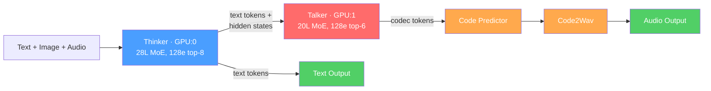


### 为什么要分成 Thinker 和 Talker

**1. 能力解耦**

思考和说话是两件本质不同的事。理解问题、组织回答需要强推理能力（大模型）；把文字变成自然语音需要声学建模能力（专用模型）。一个模型很难同时做好两件事。

**2. 流式输出——边想边说**

分开后可以实现 Thinker 生成一个文本 token，Talker 立即开始合成对应语音，大幅降低首音延迟：

```mermaid
gantt
    title Streaming: Thinker and Talker in parallel
    dateFormat X
    axisFormat %s

    section Thinker
    token₁      :t1, 0, 1
    token₂      :t2, 1, 2
    token₃      :t3, 2, 3
    token₄      :t4, 3, 4
    token₅      :t5, 4, 5

    section Talker
    speech₁       :s1, 0, 2
    speech₂       :s2, 1, 3
    speech₃       :s3, 2, 4
    speech₄       :s4, 3, 5
```


如果用一个模型同时生成文本和语音 token，就必须交替生成，延迟会很高。

**3. 复用预训练文本模型**

Thinker 本质就是已有的 Qwen3 文本模型，分开设计可以直接复用预训练好的强大文本模型，只需额外训练一个轻量的 Talker。

**4. 独立部署与资源分配**

Thinker 跑在 GPU:0，Talker 跑在 GPU:1，资源可以独立分配和扩展。

### Talker 不是传统 TTS

传统 TTS 是一个独立系统：输入完整文本字符串，输出语音，和 LLM 没有关系。

Qwen3-Omni 的 Talker 与 Thinker **深度耦合**——它的输入不只是文本 token，还包括 Thinker 的 **hidden states**（第 24 层的隐藏状态）。这意味着 Talker 能感知 Thinker 的"语义意图"，生成更自然、更符合语境的语音（语气、情感、停顿等）：

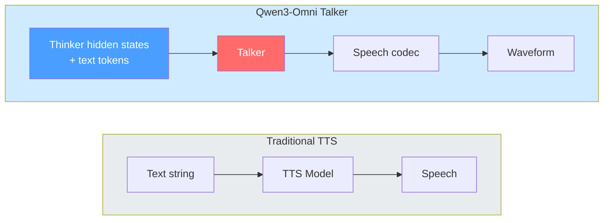


这也是为什么 Talker 必须和 Thinker 在同一个流水线里，而不能用外部 TTS 替代。

### 语音生成全流程：Talker AR → Code Predictor → Code2Wav

语音生成不是 Talker 一步完成的，而是一条三级流水线，且 Talker 和 Code Predictor 之间存在**双向通信**：

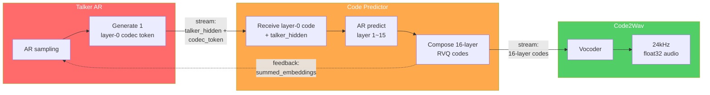


**Feedback 门控机制**：Talker 和 Code Predictor 之间存在**双向流式通信**。Talker 每生成一个 codec token 后暂停（进入 `WAITING_FEEDBACK` 状态），等待 Code Predictor 返回各层 codec embedding 的加权和，作为下一步解码的额外上下文。这确保了多层 RVQ codes 之间的一致性。

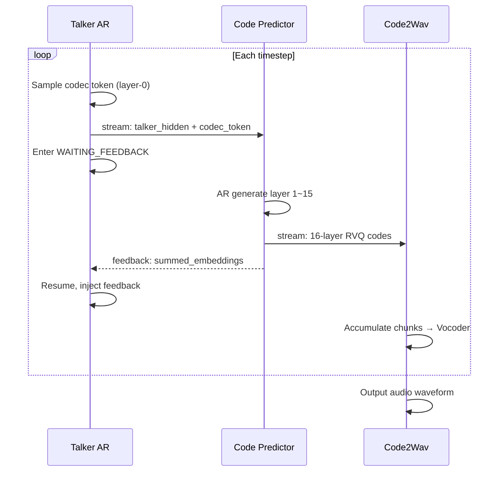


### Thinker 与 Talker 的逐 Token 对齐

Talker 的语音输出和 Thinker 的文本是 **token 级别一一对齐**的，通过 `trailing_text_hidden` 机制实现：

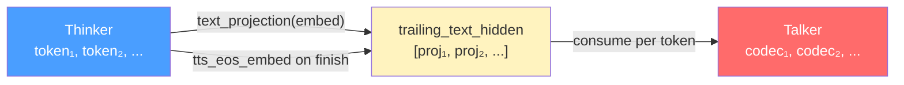


每收到 Thinker 的一个新 token，将其 embedding 通过 `text_projection` 投影后追加到 `trailing_text_hidden` 列表。Talker 内部的推理引擎通过门控反馈机制消费这个列表——每生成若干个 codec token，就从中取下一个 text token 的投影作为条件输入。当 Thinker 结束时，追加一个 `tts_eos_embed` 告诉 Talker 文本已结束。

---

## 为什么不能在 SGLang 里直接开发

了解了 Qwen3-Omni 的模型架构后，一个自然的问题是：**为什么不直接在 SGLang 里支持它？**

SGLang 是一个高性能的 LLM 推理引擎，但它的核心架构假设是 **"一个模型、一条推理路径"**：


而 Qwen3-Omni 需要的是一个**多模型协同系统**：

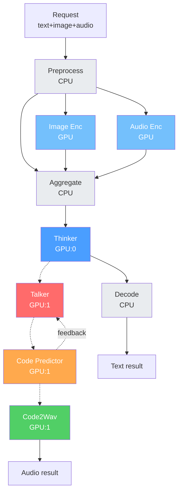


| SGLang 的假设 | Qwen3-Omni 的需求                                                           | 冲突          |
| ---------- | ------------------------------------------------------------------------ | ----------- |
| 单一模型       | 5+ 个独立模型（Thinker, Talker, Code Predictor, Image/Audio Encoder, Vocoder）  | 根本性不同       |
| 单一 GPU     | 多 GPU 异构部署（Thinker 在 GPU:0，Talker 在 GPU:1，编码器共享 GPU）                     | 需要跨 GPU 通信  |
| 线性请求流      | DAG 拓扑：fan-out（Thinker → decode + talker_ar）、fan-in（编码器 → aggregate）     | 需要复杂路由      |
| 请求独立       | 模型间有流式依赖（Thinker 逐 token 喂给 Talker）和双向反馈（Talker ↔ Code Predictor）        | 需要流式通道和反馈机制 |
| 单一输出       | 双终端输出（文本 + 语音），需等两路都完成                                                   | 需要完成聚合      |
| 统一调度       | 不同模型需要不同调度策略（Thinker 需要 continuous batching，Code Predictor 只需简单 forward） | 需要异构调度      |


具体来说，以下几个需求在 SGLang 中没有对应的抽象：

**1. 多模型编排**：SGLang 的 Scheduler 管理的是一个模型的请求队列。Qwen3-Omni 需要同时运行多个模型，每个模型有自己的调度器，且模型之间有数据依赖。

**2. 跨模型流式传输**：Thinker 生成一个 token 后，其 hidden states 需要**实时流式**传给 Talker。SGLang 没有模型间的流式数据通道。

**3. 反馈环路**：Talker 和 Code Predictor 之间存在双向通信——Talker 发出 codec token，Code Predictor 处理后返回 feedback，Talker 才能继续。这种"请求暂停等待外部输入"的模式在 SGLang 的调度器中不存在。

**4. 异构计算图**：预处理在 CPU，编码器在 GPU，且 image_encoder 和 audio_encoder 需要并行执行后汇聚结果。SGLang 没有 fan-in/fan-out 的路由机制。

**5. 多终端完成**：一个请求同时产出文本和语音两个结果，需要等两个终端 Stage 都完成后才能返回。SGLang 的请求生命周期是"一次完成"。

要在 SGLang 里硬塞这些功能，意味着要重写调度器、添加进程间通信、实现请求路由……基本上等于在 SGLang 内部重新造一个编排框架，既破坏 SGLang 的简洁性，也无法很好地支持未来其他多模态模型。

### 为什么不能在一个进程里串行跑完所有模型

一个直觉的问题：**既然 SGLang 不行，那我就不用 SGLang 的调度，写一个函数把所有模型串起来跑不就完了？**

```python
# 伪代码：最朴素的串行方案
def process_request(request):
    state = preprocess(request)              # CPU
    image_embeds = image_encoder(state)      # GPU
    audio_embeds = audio_encoder(state)      # GPU（等 image_encoder 跑完才开始）
    merged = aggregate(state, image_embeds, audio_embeds)  # CPU
    text_tokens = thinker(merged)            # GPU:0（thinker 全部跑完才到下一步）
    text_result = decode(text_tokens)        # CPU
    codec_tokens = talker(text_tokens)       # GPU:1（等 thinker 全部跑完才开始）
    codes = code_predictor(codec_tokens)     # GPU:1
    audio = code2wav(codes)                  # GPU:1
    return text_result, audio
```

这样写能跑，但有**三个致命问题**：

**问题 1：设备idle浪费严重**

串行执行意味着任意时刻只有一个设备在工作，其余全部idle：

```mermaid
gantt
    title Sequential: Low device utilization
    dateFormat X
    axisFormat %s

    section CPU
    preprocess       :a1, 0, 2
    idle              :crit, a2, 2, 12
    aggregate        :a3, 12, 13
    idle              :crit, a4, 13, 16
    decode           :a5, 16, 17
    idle              :crit, a6, 17, 25

    section GPU (Encoder)
    idle              :crit, b1, 0, 2
    image_encoder    :b2, 2, 7
    audio_encoder    :b3, 7, 12
    idle              :crit, b4, 12, 25

    section GPU:0 (Thinker)
    idle              :crit, c1, 0, 13
    thinker          :c2, 13, 16
    idle              :crit, c3, 16, 25

    section GPU:1 (Speech)
    idle              :crit, d1, 0, 17
    talker_ar        :d2, 17, 20
    code_predictor   :d3, 20, 22
    code2wav         :d4, 22, 25
```


总时间 25 个单位，但每个设备大部分时间都在idle。

**问题 2：image_encoder 和 audio_encoder 无法并行**

串行方案中 audio_encoder 必须等 image_encoder 跑完才开始，但这两个编码器之间**没有任何数据依赖**，完全可以同时跑。

**问题 3：没有流式 —— Thinker 必须全部跑完 Talker 才能开始**

这是最大的问题。串行方案中 Talker 要等 Thinker 生成**所有** token 后才开始语音合成。但实际上 Thinker 每生成一个 token，Talker 就可以立刻开始合成对应的语音。

假设 Thinker 生成 100 个 token，每个 token 需要 30ms，Talker 每个 token 合成需要 20ms：

- **串行**：首音延迟 = Thinker 全部完成 (3000ms) + Talker 第一步 (20ms) = **3020ms**
- **流式并行**：首音延迟 = Thinker 第一个 token (30ms) + Talker 第一步 (20ms) = **50ms** —— 快了 **60 倍**

### 为什么要拆成多个 Stage，而不是用一个大循环

另一个问题：**既然知道要并行，那我在一个进程里用 asyncio 调度多个模型不就行了？**

```python
# 伪代码：单进程异步方案
async def process_request(request):
    state = await preprocess(request)
    img_task = asyncio.create_task(image_encoder(state))
    aud_task = asyncio.create_task(audio_encoder(state))
    img_embeds, aud_embeds = await asyncio.gather(img_task, aud_task)  # 并行
    merged = aggregate(state, img_embeds, aud_embeds)
    # ... thinker 流式输出给 talker ...
```

看起来解决了并行的问题，但**无法扩展**：

**1. GPU 内存隔离**

Thinker 在 GPU:0，Talker 在 GPU:1。同一个进程里管理多个 GPU 的模型，CUDA context、内存分配、stream 同步都会互相干扰。拆成独立进程后，每个进程只管自己的 GPU，互不影响。

**2. 调度策略不同**

Thinker 需要 continuous batching（多个请求共享 KV cache，动态组 batch），这需要一个复杂的 Scheduler。Code Predictor 只需要简单的 forward。如果放在一个进程里，要么用一个 Scheduler 适配所有模型（过度复杂），要么每个模型各写一套调度逻辑（一团乱麻）。拆成 Stage 后，每个 Stage 的 Executor 类型可以不同。

**3. 故障隔离**

一个模型 OOM 或崩溃不应该拖垮整个系统。拆成独立进程后，一个 Stage 挂了可以单独重启。

**4. 灵活扩缩容**

如果 Thinker 是瓶颈，可以单独给它加更多 GPU 或 worker，而不影响其他 Stage。如果不需要语音，直接去掉 talker_ar / code_predictor / code2wav 三个 Stage（用不同的 PipelineConfig），框架代码一行不改。

**5. 通信效率**

Stage 之间传输的是**元信息**（"数据在共享内存的哪个位置"），而不是数据本身。大 tensor 通过共享内存 / NCCL / CUDA IPC 传输，几乎零拷贝。控制消息通过 ZMQ 传输，延迟在微秒级。

总结对比：

**Sequential (single process):**

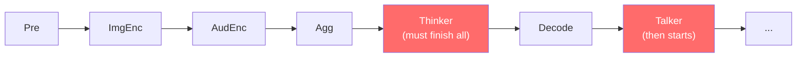

**Multi-Stage async pipeline:**

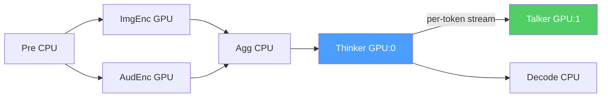


---

## SGLang Omni 的解法：多阶段异步流水线

SGLang Omni 的核心思想是：**不改 SGLang，而是在 SGLang 之上建一层编排层**。将一个多模态请求拆分为多个处理阶段（Stage），每个阶段作为独立的异步任务运行，通过 ZMQ 控制面和共享内存数据面进行通信。

### 架构总览

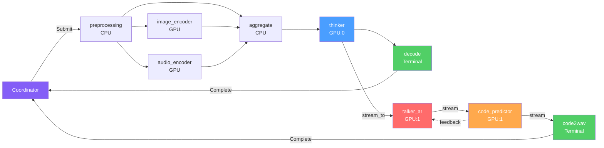


以 Qwen3-Omni（含语音输出）为例，完整流水线包含 **9 个 Stage**：


| Stage          | 位置  | 设备    | 作用                                                           |
| -------------- | --- | ----- | ------------------------------------------------------------ |
| preprocessing  | 入口  | CPU   | 文本 tokenize、多媒体解析                                            |
| image_encoder  | 编码  | GPU   | Vision Transformer 编码图片/视频                                   |
| audio_encoder  | 编码  | GPU   | 音频 Mel 频谱编码                                                  |
| aggregate      | 聚合  | CPU   | 合并文本 tokens 与编码器输出（fan-in）                                   |
| thinker        | 推理  | GPU:0 | MoE Transformer 主模型，生成文本 token（fan-out 到 decode + talker_ar） |
| decode         | 输出  | CPU   | 文本后处理（Terminal）                                              |
| talker_ar      | 语音  | GPU:1 | 语音 codec token 自回归生成                                         |
| code_predictor | 语音  | GPU:1 | RVQ 多层码预测（双向 feedback）                                       |
| code2wav       | 语音  | GPU:1 | Vocoder 合成音频波形（Terminal）                                     |


这一架构精准对应了 Qwen3-Omni 模型的每一个需求：fan-in/fan-out 解决了 DAG 路由，stream_to 解决了跨模型流式传输，WAITING_FEEDBACK 解决了反馈环路，多 Terminal 聚合解决了双输出。

### 声明式配置 → 运行时编译

SGLang Omni 的一个核心设计是将流水线拓扑从代码中抽出，用**声明式配置**描述：

```python
# sglang_omni/models/qwen3_omni/config.py
class Qwen3OmniSpeechPipelineConfig(PipelineConfig):
    entry_stage = "preprocessing"
    terminal_stages = ["decode", "code2wav"]
    gpu_placement = {"thinker": 0, "talker_ar": 1, "code_predictor": 1, "code2wav": 1}
    stages = [
        StageConfig(name="preprocessing", executor=..., get_next=preprocessing_next, ...),
        StageConfig(name="image_encoder",  executor=..., get_next=encoder_next, ...),
        StageConfig(name="audio_encoder",  executor=..., get_next=encoder_next, ...),
        StageConfig(name="mm_aggregate",   executor=..., get_next=aggregate_next,
                    input_handler=AggregatedInput(sources=["preprocessing", "image_encoder", "audio_encoder"])),
        StageConfig(name="thinker",        executor=..., get_next=thinker_next_speech,
                    stream_to=["talker_ar"]),          # 流式传输 hidden states
        StageConfig(name="decode",         executor=..., get_next=None),   # Terminal
        StageConfig(name="talker_ar",      executor=..., get_next=talker_ar_next,
                    stream_to=["code_predictor"]),
        StageConfig(name="code_predictor", executor=..., get_next=code_predictor_next,
                    stream_to=["code2wav", "talker_ar"]),  # 双路：code2wav + feedback
        StageConfig(name="code2wav",       executor=..., get_next=None),   # Terminal
    ]
```

然后由 `compile_pipeline()` 编译为可运行的对象：

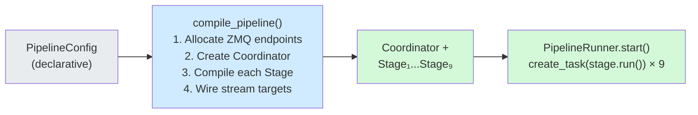


这种设计意味着：如果未来要支持另一个多模态模型（比如不需要语音的纯视觉模型），只需写一个新的 `PipelineConfig` 配置 6 个 Stage，不需要改任何框架代码。

---

## Pipeline 整体架构

### Coordinator

[Coordinator](https://github.com/sgl-project/sglang-omni/blob/main/sglang_omni/pipeline/coordinator.py) 是整个流水线的入口和出口，负责：

1. **请求提交**：接收用户请求，封装为 `StagePayload`，通过 `CoordinatorControlPlane.submit_to_stage()` 发送 `SubmitMessage` 到入口 Stage（preprocessing）。
2. **完成聚合**：流水线可能有多个 Terminal Stage（如 `decode` 和 `code2wav`），Coordinator 等待所有 Terminal Stage 完成后，合并 `partial_results` 并返回给调用方。
3. **Abort 广播**：通过 PUB/SUB 模式向所有 Stage 广播 `AbortMessage`。
4. **流式输出**：通过 `stream()` 方法逐步 yield 中间结果。

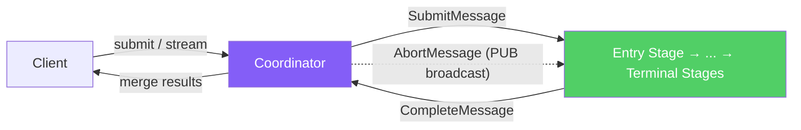


关键方法：

- `submit(request_id, request)` — 提交请求并等待完成
- `stream(request_id, request)` — 提交请求并流式返回
- `run_completion_loop()` — 后台协程，持续接收 `CompleteMessage` / `StreamMessage`
- `abort(request_id)` — 广播取消信号

### Control Plane

[ControlPlane](https://github.com/sgl-project/sglang-omni/blob/main/sglang_omni/pipeline/control_plane.py) 基于 ZMQ 实现进程间通信，使用两种消息模式：

**PUSH/PULL（点对点）**：用于 Stage 之间和 Stage 与 Coordinator 之间的定向消息传递。接收方 bind（地址固定，先启动），发送方 connect（可动态加入）。

**PUB/SUB（广播）**：用于 Coordinator 向所有 Stage 广播 abort 信号。Coordinator 的 PUB socket bind，各 Stage 的 SUB socket connect，一条消息所有 Stage 同时收到。

**PUSH/PULL (point-to-point):**

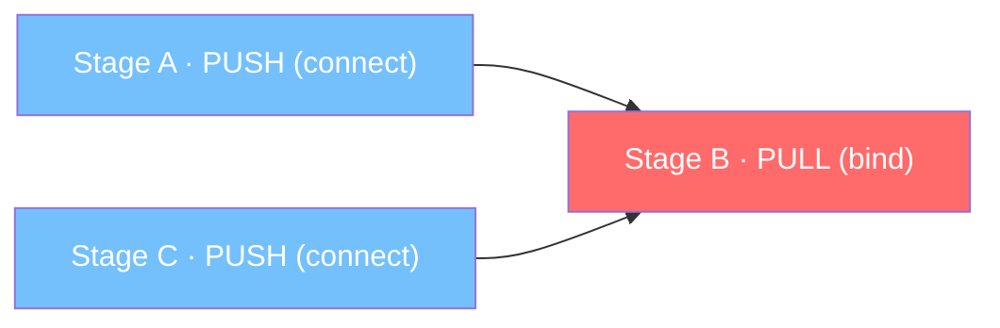

**PUB/SUB (broadcast):**

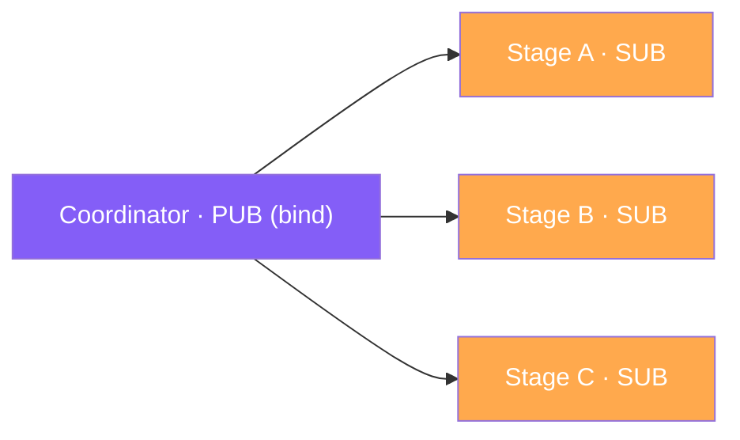


| 消息类型               | 模式        | 方向                           | 用途               |
| ------------------ | --------- | ---------------------------- | ---------------- |
| `SubmitMessage`    | PUSH/PULL | Coordinator → 入口 Stage       | 初始请求提交           |
| `DataReadyMessage` | PUSH/PULL | Stage → Stage                | 数据就绪通知（含共享内存元信息） |
| `CompleteMessage`  | PUSH/PULL | Terminal Stage → Coordinator | 请求完成             |
| `StreamMessage`    | PUSH/PULL | Stage → Coordinator          | 流式中间结果           |
| `AbortMessage`     | PUB/SUB   | Coordinator → 所有 Stage       | 请求取消             |
| `ShutdownMessage`  | PUSH/PULL | Coordinator → Stage          | 关闭信号             |


Control Plane 分为两个实现：

- `**CoordinatorControlPlane**`：Coordinator 端，管理到各 Stage 的 PUSH socket 和接收 completion 的 PULL socket。
- `**StageControlPlane**`：Stage 端，提供 `recv()` 阻塞接收和 `send_to_stage()` / `send_complete()` 路由功能。

### Stage

[Stage](https://github.com/sgl-project/sglang-omni/blob/main/sglang_omni/pipeline/stage/runtime.py) 代表流水线中的一个处理节点，每个 Stage 运行在独立进程中。

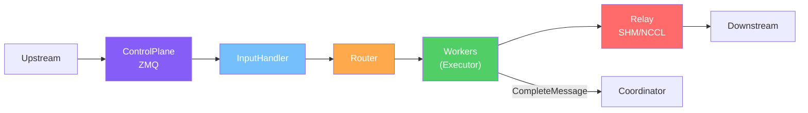


Stage 的核心职责：

1. **消息路由**：接收 `SubmitMessage` 或 `DataReadyMessage`，分派给内部 Worker。
2. **输入聚合**：部分 Stage（如 `aggregate`）需要等待多个上游 Stage 的数据全部到达后才能开始处理，使用 `AggregatedInputHandler` 实现。
3. **Abort 监听**：后台协程持续监听 `AbortMessage`，收到后取消正在处理的请求。
4. **流式块路由**：通过 `StreamQueue` 将上游的流式数据块转发给对应 Worker。

核心执行循环 `Stage.run()`:

```
while not shutdown:
    msg = control_plane.recv()           # 阻塞等待消息
    if SubmitMessage:
        input_handler.receive(msg)       # 记录输入
        router.enqueue(work)             # 分发给 Worker
    elif DataReadyMessage:
        input_handler.receive(msg)       # 聚合输入
        if all_inputs_ready:
            router.enqueue(work)         # 全部就绪后分发
    elif StreamChunk:
        stream_queue.put(request_id, chunk)  # 放入流式队列
```

### Worker

[Worker](https://github.com/sgl-project/sglang-omni/blob/main/sglang_omni/pipeline/worker/runtime.py) 是 Stage 内部的实际处理单元，负责调用 Executor 执行计算。

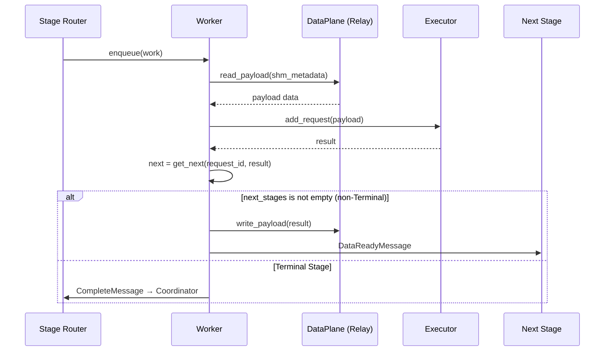


对于流式 Stage，Worker 额外运行 `_stream_send_loop()` 后台任务，将 Executor 产出的流式块通过 `DataPlaneAdapter` 写入共享内存，并发送 `DataReadyMessage` 通知下游。

**同 GPU 零拷贝优化**：当上下游 Stage 在同一 GPU 上时（如 `talker_ar` → `code_predictor`），使用 CUDA IPC（`ForkingPickler`）实现 tensor 零拷贝传输，避免通过共享内存中转。

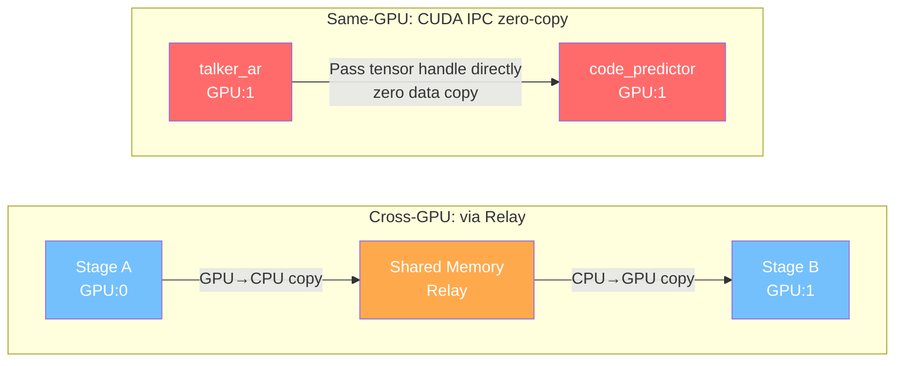


### Executor

[Executor](https://github.com/sgl-project/sglang-omni/blob/main/sglang_omni/executors/interface.py) 是抽象执行接口，定义了统一的请求处理 API：

```python
class Executor(ABC):
    async def add_request(payload: StagePayload) -> None    # 提交请求
    async def get_result() -> StagePayload                   # 获取结果
    async def abort(request_id: str) -> None                 # 取消请求
    def set_stream_fn(fn) -> None                            # 设置流式回调
```

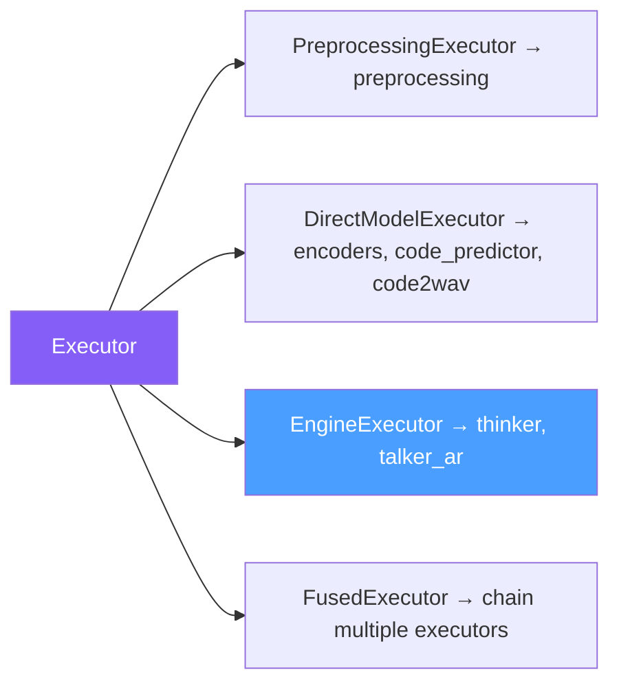


---

## 请求处理全流程

以一个包含图片和音频的多模态请求为例，追踪其完整生命周期：

```mermaid
sequenceDiagram
    participant C as Client
    participant CO as Coordinator
    participant Pre as preprocessing
    participant IE as image_encoder
    participant AE as audio_encoder
    participant Agg as aggregate
    participant Th as thinker
    participant Dec as decode
    participant Tk as talker_ar
    participant CP as code_predictor
    participant CW as code2wav

    C->>CO: submit(request)
    CO->>Pre: SubmitMessage

    Pre->>Pre: tokenize + media loading
    par fan-out: parallel encoding
        Pre->>IE: DataReady (pixel_values)
        Pre->>AE: DataReady (input_features)
        Pre->>Agg: DataReady (PipelineState)
    end

    IE->>IE: ViT encode
    AE->>AE: Audio Transformer encode

    par fan-in: converge to aggregate
        IE->>Agg: DataReady (image_embeds)
        AE->>Agg: DataReady (audio_embeds)
    end

    Note over Agg: Wait for all 3 inputs
    Agg->>Agg: merge_for_thinker()
    Agg->>Th: DataReady (thinker_inputs)

    Th->>Th: MoE Transformer AR generation
    par fan-out: text + speech
        Th->>Dec: DataReady (output_ids)
        Th-->>Tk: stream_to (hidden states, per token)
    end

    Dec->>Dec: detokenize
    Dec->>CO: CompleteMessage (text result)

    loop Each token
        Tk->>Tk: Sample codec token
        Tk-->>CP: stream (talker_hidden + codec)
        CP->>CP: Generate layer 1~15
        CP-->>CW: stream (16-layer codes)
        CP-->>Tk: feedback (summed_embeddings)
    end

    CW->>CW: Vocoder synthesize waveform
    CW->>CO: CompleteMessage (audio result)

    Note over CO: Wait for decode + code2wav both done
    CO->>C: Return {text + audio}
```


### Stage 1: Preprocessing（预处理）

**Executor**: `PreprocessingExecutor`
**设备**: CPU
**核心类**: [Qwen3OmniPreprocessor](https://github.com/sgl-project/sglang-omni/blob/main/sglang_omni/models/qwen3_omni/components/preprocessor.py)

预处理阶段将原始用户输入转化为模型可消费的格式：

```mermaid
graph LR
    Input["Text + Image + Audio"] --> Media["MediaIO<br/>(async parallel loading)"] --> Token["Chat Template +<br/>Tokenize"] --> Out["PipelineState<br/>prompt, encoder_inputs,<br/>mm_inputs"]

    style Media fill:#d0ebff,color:#333
    style Token fill:#fff3bf,color:#333
    style Out fill:#d3f9d8,color:#333
```


预处理完成后，数据同时路由到 `image_encoder`、`audio_encoder` 和 `aggregate` 三个 Stage（fan-out，并行执行）。

### Stage 2-3: Image Encoder & Audio Encoder（编码器）

**设备**: GPU

#### Image Encoder

**核心类**: [Qwen3OmniImageEncoder](https://github.com/sgl-project/sglang-omni/blob/main/sglang_omni/models/qwen3_omni/components/image_encoder.py)

- 基于 27 层 Vision Transformer（ViT），patch_size=16，spatial_merge_size=2
- 输入 `pixel_values [B, C, H, W]`，输出 `image_embeds [n_tokens, 3584]`
- **多尺度特征**：通过 `deepstack_visual_indexes=[8, 16, 24]` 从中间层提取特征（deepstack_visual_embeds），供后续 Thinker 使用
- **优化**：`_optimize_patch_embed` 将 Conv3d 重写为 Linear，获得 7-15x 的推理加速

#### Audio Encoder

**核心类**: [Qwen3OmniAudioEncoder](https://github.com/sgl-project/sglang-omni/blob/main/sglang_omni/models/qwen3_omni/components/audio_encoder.py)

- 基于 32 层 Transformer 编码器，输入 128 维 Mel 频谱特征
- 输入 `input_features [B, n_mels, T]`，输出 `audio_embeds [n_tokens, 3584]`
- 支持 500-token chunk 流式处理

两个编码器独立运行（fan-in 的前半段），结果分别通过 `DataReadyMessage` 发送到 `aggregate` Stage。

### Stage 4: Aggregate（聚合）

**设备**: CPU
**输入聚合**: `AggregatedInputHandler`

Aggregate Stage 是一个典型的 **fan-in** 节点——等待三路输入全部到达：

```mermaid
graph LR
    Pre["preprocessing<br/>PipelineState"] --> |"input_ids<br/>attention_mask"| Agg
    IE["image_encoder"] --> |"image_embeds<br/>deepstack_visual_embeds"| Agg
    AE["audio_encoder"] --> |"audio_embeds<br/>audio_output_lengths"| Agg

    Agg["aggregate<br/>AggregatedInputHandler<br/>(wait for all 3 sources)"]

    Agg --> |"merge_for_thinker()"| Out["thinker_inputs<br/>input_ids + image_embeds<br/>+ audio_embeds + ..."]

    style Agg fill:#ffa94d,color:#fff
    style Out fill:#d3f9d8,color:#333
    style Pre fill:#e9ecef,color:#333
    style IE fill:#74c0fc,color:#fff
    style AE fill:#74c0fc,color:#fff
```


### Stage 5: Thinker（主模型推理）

**Executor**: `EngineExecutor`（包装 `OmniEngine`）
**设备**: GPU:0
**核心模型**: [Qwen3OmniMoeThinkerTextModel](https://github.com/sgl-project/sglang-omni/blob/main/sglang_omni/models/qwen3_omni/thinker.py)

Thinker 是整个系统的核心——一个 28 层 MoE Transformer，负责理解多模态输入并生成文本。

#### 模型结构

```mermaid
graph LR
    EMB["embed_tokens"] --> Layer["layers ×28<br/>RMSNorm → GQA Attn → RMSNorm → MoE(128e, top-8)"] --> NORM["norm"] --> LM["lm_head → logits"]

    style EMB fill:#74c0fc,color:#fff
    style Layer fill:#4a9eff,color:#fff
    style LM fill:#51cf66,color:#fff
```


#### Forward 流程

1. **Token 嵌入**: `input_ids` → `embed_tokens` → `[seq_len, 2048]`
2. **多模态融合**: 在 placeholder token 位置通过 `masked_scatter` 注入编码器输出
  - 视觉 placeholder → `image_embeds` / `video_embeds`
  - 音频 placeholder → `audio_embeds`
3. **28 层 Transformer**：RMSNorm → GQA Attention (28 heads, 4 kv heads) → RMSNorm → MoE → Residual
4. **输出**: hidden states → `lm_head` → logits → sampling → `output_ids`

**优化**：

- `fused_qk_norm_rope` kernel：将 QK Norm 和 RoPE 融合为单个 bfloat16 kernel（约 3x 加速）
- YARN RoPE scaling：将上下文从 8K 扩展到 32K
- RadixAttention：高效 KV cache 管理

#### 输出分流（fan-out）

Thinker 输出后进行 fan-out（由 `thinker_next_speech` 路由函数决定）：

```mermaid
graph LR
    Th["thinker"]

    Th --> |"DataReadyMessage<br/>full output_ids"| Dec["decode<br/>(text postprocess)"]
    Th --> |"stream_to<br/>per-token hidden states"| Tk["talker_ar<br/>(speech generation)"]

    Dec --> TextOut["Text Output"]
    Tk --> SpeechOut["Speech Output"]

    style Th fill:#4a9eff,color:#fff
    style Dec fill:#51cf66,color:#fff
    style Tk fill:#ff6b6b,color:#fff
    style TextOut fill:#d3f9d8,color:#333
    style SpeechOut fill:#d3f9d8,color:#333
```


- **text 分支** → `decode` Stage（文本后处理），通过 `DataReadyMessage` 传输完整结果
- **speech 分支** → `talker_ar` Stage（语音生成），通过 `stream_to` 逐 token 流式传输：
  - `thinker_embeds`: token embeddings
  - `thinker_hidden[layer_24]`: 第 24 层的 hidden states（供 Talker 做跨模态对齐）

### Stage 6: Decode（解码输出）

**设备**: CPU（Terminal Stage）

将 Thinker 的 `output_ids` 解码为文本，构建最终的文本响应。支持流式文本输出。

### Stage 7-9: Speech Pipeline（语音生成流水线）

当启用语音输出时，Thinker 的输出额外流入三级语音流水线，全部部署在 GPU:1 上。

```mermaid
graph LR
    Thinker["thinker<br/>GPU:0"] -- "stream: hidden states" --> TA["talker_ar<br/>20L MoE"] -- "stream: hidden + code" --> CP["code_predictor<br/>5L dense"] -- "stream: 16L RVQ codes" --> CW["code2wav<br/>Vocoder"]
    CP -. "feedback" .-> TA
    CW --> Audio["Audio waveform"]

    style Thinker fill:#4a9eff,color:#fff
    style TA fill:#ff6b6b,color:#fff
    style CP fill:#ffa94d,color:#fff
    style CW fill:#51cf66,color:#fff
```


#### Stage 7: Talker AR

**Executor**: `EngineExecutor`（包装 `OmniEngine`）
**核心类**: [Qwen3OmniMoeTalkerTextModel](https://github.com/sgl-project/sglang-omni/blob/main/sglang_omni/models/qwen3_omni/talker.py)

Talker 是一个 20 层 MoE Transformer（128 experts, top-6 routing），与 Thinker 的关键区别是额外包含 **Shared Expert**（每层一个固定的 dense MLP，与 routed experts 并行执行后门控组合）。

**Prefill 输入构建**（[build_prefill_input](https://github.com/sgl-project/sglang-omni/blob/main/sglang_omni/models/qwen3_omni/components/talker_input.py)）：

如前文所述，Talker 不直接使用 Thinker 的 logits，而是使用 Thinker 的 **embeddings** 和 **hidden states** 作为 prefill：

```mermaid
graph LR
    TE["thinker_embed"] -- "text positions" --> TP["text_projection"]
    TH["thinker_hidden<br/>(layer 24)"] -- "multimodal positions" --> HP["hidden_projection"]
    TP & HP --> Prefill["Talker Prefill Input"]

    style TE fill:#4a9eff,color:#fff
    style TH fill:#4a9eff,color:#fff
    style TP fill:#ffa94d,color:#fff
    style HP fill:#ffa94d,color:#fff
    style Prefill fill:#ff6b6b,color:#fff
```


**Feedback 机制**：Talker 与 Code Predictor 之间存在双向流式通信。Talker 发出 codec token 后进入 `WAITING_FEEDBACK` 状态，等待 Code Predictor 返回各层 codec embedding 的加权和，作为下一步解码的额外上下文。

#### Stage 8: Code Predictor

**核心类**: [_CodePredictorWrapper](https://github.com/sgl-project/sglang-omni/blob/main/sglang_omni/models/qwen3_omni/components/code_predictor_executor.py)

Code Predictor 是一个 5 层 dense Transformer（hidden=1024, vocab=2048），接收 Talker 的每一步输出：

```mermaid
graph LR
    Input["talker_hidden +<br/>layer-0 code"] --> AR["AR predict<br/>layer 1~15"] --> Codes["16-layer RVQ codes"]
    AR --> Sum["summed_embeddings"]
    Codes --> |"stream"| C2W["code2wav"]
    Sum --> |"feedback"| Talker["talker_ar"]

    style Input fill:#ffa94d,color:#fff
    style Codes fill:#51cf66,color:#fff
    style Sum fill:#ff6b6b,color:#fff
```


#### Stage 9: Code2Wav

**核心类**: [_Code2WavStreamingExecutor](https://github.com/sgl-project/sglang-omni/blob/main/sglang_omni/models/qwen3_omni/components/code2wav_executor.py)

Code2Wav 使用 HF 的 `Qwen3OmniMoeCode2Wav`（neural codec decoder / vocoder）将 RVQ codes 合成为音频波形：

1. 累积 code chunks 直到达到 `stream_chunk_size`
2. `_decode_incremental()`: 将 codes `[num_chunks, 16]` 输入 vocoder
3. 裁剪左侧上下文伪影（`left_context_size`）
4. 流式输出 float32 音频块（24kHz）
5. 最终拼接所有音频块

---

## OmniEngine: 调度与执行引擎

[OmniEngine](https://github.com/sgl-project/sglang-omni/blob/main/sglang_omni/engines/omni/engine.py) 是 Thinker 和 Talker AR 的执行引擎，将 Scheduler（请求生命周期管理）和 ModelRunner（无状态模型执行）统一在一起。

### 请求生命周期

```mermaid
stateDiagram-v2
    [*] --> WAITING: add_request()

    WAITING --> RUNNING: schedule()
    RUNNING --> FINISHED: update() → is_finished
    RUNNING --> WAITING_FEEDBACK: Talker waits for feedback
    WAITING_FEEDBACK --> RUNNING: resume_request()

    WAITING --> ABORTED: abort_request()
    RUNNING --> ABORTED: abort_request()
    WAITING_FEEDBACK --> ABORTED: abort_request()

    FINISHED --> [*]
    ABORTED --> [*]
```


`**[Scheduler](https://github.com/sgl-project/sglang-omni/blob/main/sglang_omni/engines/omni/scheduler.py)**` 的核心方法：

- `add_request(request_id, data)` — 请求入队为 `WAITING` 状态
- `schedule()` — 通过 `BatchPlanner` 选择请求并构建 batch，返回 `SchedulerOutput`
- `update(scheduler_output, model_output)` — 根据模型输出更新请求状态，由 `IterationController` 判断是否完成
- `stream(request_id)` — 返回异步生成器，逐步 yield 中间输出

`**[ModelRunner](https://github.com/sgl-project/sglang-omni/blob/main/sglang_omni/engines/omni/model_runner.py)**` 是无状态执行器，`execute(scheduler_output)` 调用模型 forward 并通过 `OutputProcessor` 转换输出。

### 执行模式

OmniEngine 支持两种执行模式：

#### Normal 模式 vs Overlap 模式

```mermaid
gantt
    title Normal mode: Sequential
    dateFormat X
    axisFormat %s

    section Step N
    schedule()   :s1, 0, 1
    execute() GPU forward :s2, 1, 4
    update()  :s3, 4, 5

    section Step N+1
    schedule()   :s4, 5, 6
    execute() GPU forward :s5, 6, 9
    update()  :s6, 9, 10
```


```mermaid
gantt
    title Overlap mode: GPU/CPU pipelining
    dateFormat X
    axisFormat %s

    section GPU
    forward(Step N)   :g1, 0, 3
    forward(Step N+1) :g2, 3, 6
    forward(Step N+2) :g3, 6, 9

    section CPU
    (idle)            :c0, 0, 3
    update(Step N)    :c1, 3, 4
    update(Step N+1)  :c2, 6, 7
```


关键实现：

1. `_step_overlap()` 通过 `asyncio.run_in_executor()` 将 GPU forward 提交到线程池
2. 在等待 GPU 的同时，CPU 处理上一步的 `_process_pending_result()`
3. 启发式策略：连续 prefill 时禁用 overlap（优化 TTFT）

### Runtime Protocol 接口

OmniEngine 通过一组 Protocol 接口实现模型无关的调度逻辑：

```mermaid
graph LR
    OE["OmniEngine"] --> BP["BatchPlanner"] & RM["ResourceManager"] & IC["IterationController"]
    OE --> IP["InputPreparer"] & OP["OutputProcessor"] & CM["CacheManager"]

    style OE fill:#845ef7,color:#fff
```


这些接口定义在 [engines/omni/runtime/interfaces.py](https://github.com/sgl-project/sglang-omni/blob/main/sglang_omni/engines/omni/runtime/interfaces.py)，由具体模型实现。

---

## 核心数据结构

### PipelineState

[PipelineState](https://github.com/sgl-project/sglang-omni/blob/main/sglang_omni/models/qwen3_omni/io.py) 是贯穿整个流水线的状态容器，每个 Stage 在其基础上丰富数据：

```mermaid
graph LR
    Pre["preprocessing<br/>raw_inputs, prompt,<br/>mm_inputs, encoder_inputs"] --> Enc["encoder<br/>encoder_outs"] --> Agg["aggregate<br/>thinker_inputs"] --> Th["thinker<br/>thinker_out"] --> Dec["decode<br/>engine_outputs"]

    style Pre fill:#e9ecef,color:#333
    style Enc fill:#74c0fc,color:#fff
    style Agg fill:#ffa94d,color:#fff
    style Th fill:#4a9eff,color:#fff
    style Dec fill:#51cf66,color:#fff
```


```python
@dataclass
class PipelineState:
    raw_inputs: Any                    # 用户原始输入
    prompt: PromptInputs               # {input_ids, attention_mask, prompt_text}
    mm_inputs: dict[str, Any]          # {image: [...], audio: [...], video: [...]}
    encoder_inputs: dict[str, dict]    # {image_encoder: {...}, audio_encoder: {...}}
    encoder_outs: dict[str, Any]       # 编码器输出 {image_embeds, audio_embeds, ...}
    thinker_inputs: dict[str, Any]     # 合并后的 thinker 输入
    thinker_out: ThinkerOutput         # {output_ids, step, is_final, extra_model_outputs}
    engine_outputs: dict[str, Any]     # 最终解码结果
    stream_state: dict[str, Any]       # 流式输出状态追踪
```

### Scheduler 相关类型

定义在 [engines/omni/types.py](https://github.com/sgl-project/sglang-omni/blob/main/sglang_omni/engines/omni/types.py)：

- `**SchedulerStatus**` 枚举: `WAITING` / `RUNNING` / `WAITING_FEEDBACK` / `FINISHED` / `ABORTED`
- `**SchedulerRequest**`: 包含 `request_id`、`status`、`data`（模型特定的 opaque 数据）、时间戳
- `**SchedulerOutput**`: 包含选中的 requests 列表、`batch_data`、`step_id`
- `**RequestOutput**`: 单个请求的输出，包含 `finished` 标志和 `finish_reason`（"stop" / "length" / "abort"）
- `**ModelRunnerOutput**`: 一个 batch 的输出，`Dict[request_id → RequestOutput]`

### Control Plane 消息

定义在 [proto/messages.py](https://github.com/sgl-project/sglang-omni/blob/main/sglang_omni/proto/messages.py)：

- `**DataReadyMessage**`: 包含 `request_id`、`from_stage`、`to_stage`、`shm_metadata`（共享内存位置）、`chunk_id`（流式序号）、`is_done`、`error`
- `**CompleteMessage**`: 包含 `request_id`、`from_stage`、`success`、`result`、`error`
- `**AbortMessage**`: 仅包含 `request_id`

消息序列化使用 msgpack，跨进程传输使用 ZMQ。

---

## 关键设计模式

### 1. 声明式配置 → 运行时编译

如前文"声明式配置 → 运行时编译"一节所述，流水线通过 `PipelineConfig` 声明式定义 Stage DAG，由 `compile_pipeline()` 编译为可执行实例。这使得支持新模型只需要编写新配置，不需要修改框架代码。

### 2. Stage Payload 作为状态容器

`StagePayload` 不是简单的"模型输入"，而是请求在当前流水线位置的**完整状态快照**。每个 Stage 丰富状态而非消费状态——后续 Stage 始终可以访问前序 Stage 写入的所有字段。

### 3. Overlap 调度（GPU/CPU 流水线化）

OmniEngine 的 overlap 模式通过 `asyncio.run_in_executor()` 实现 GPU 计算与 CPU 状态更新的并行，显著提升吞吐量。启发式策略在连续 prefill 场景下禁用 overlap 以优化首 token 延迟（TTFT）。

### 4. Feedback 门控

Talker AR 与 Code Predictor 之间的双向通信通过 `WAITING_FEEDBACK` 状态和 `StreamQueue` 实现：

- Talker 每生成一个 codec token 后暂停，等待 feedback
- Code Predictor 处理完毕后将 `summed_embeddings` 通过 feedback 通道返回
- OmniEngine 的 `_check_feedback()` 检测到 feedback 后调用 `resume_request()` 恢复 Talker 解码

### 5. 多 Terminal 完成聚合

一个请求可以有多个 Terminal Stage（如文本的 `decode` + 语音的 `code2wav`）。Coordinator 等待所有 Terminal Stage 的 `CompleteMessage` 到达后，合并 `partial_results` 再返回调用方。

### 6. 同 GPU 零拷贝

当相邻 Stage 在同一 GPU 时（如 `talker_ar` → `code_predictor` 在 GPU:1），Worker 使用 CUDA IPC (`ForkingPickler`) 直接传递 tensor handle，避免 GPU→CPU→GPU 的拷贝开销。

---

## Acknowledge

本文档基于 SGLang Omni 代码进行整理。感谢 SGLang 社区的贡献者们。