# 从性能阈值到测量契约：SGLang-Omni CI 基建的演进

## SGLang-Omni的CI策略：性能只进不退

SGLang-Omni 的 CI 最初只是一个正确性门禁，我们关注的问题包括：模型能加载吗？请求能成功吗？正确性指标比如WER 和 CER 在容差范围内吗？生成的音频通过相似度检查了吗？后来随着功能的完善，逐渐加上了吞吐量门禁、延迟门禁、RTF 门禁、流式性能检查，以及 ASR、TTS、Omni 各流水线的模型级性能门禁。

当执行SGLang-Omni 项目 [V1 重构](https://github.com/sgl-project/sglang-omni/issues/188)时，我们制定了一条极为严苛的 CI 策略：性能和正确性只进不退。

具体来说，假设 Qwen3-ASR 在 Seed-TTS 逆转录这个任务上，在 commit A 跑出了 108 requests/s 的成绩，那么之后的每一个 commit 都只能把这个数字推向更高，不能出现任何回退，正确性也不能有任何损失。这个要求听上去很直觉，但要让 CI 真正抓住每一次回退，却远没有看起来那么简单。

举一个例子。假设 commit A 的 Qwen3-ASR 吞吐是 108 req/s，到了 commit B 提升到了 130 req/s，再到 commit C 又小幅回退到 120 req/s。如果我们在 commit B 没有及时把 CI 阈值从 108 更新到 130，那么 commit C 虽然相比 B 退步了 10 req/s，却仍然高于旧阈值 108，CI 不会报红。这次性能的回退就这样悄悄溜过去了。

为了堵住这个缺口，我们的做法其实很简单：每当一个 PR 带来了性能提升，我们会立刻在同样的环境下重复跑 5 次基准测试，然后取 5 次中的最低值作为新的 CI 阈值。我们把这个过程叫做 **calibration**。

回到上面的例子，如果 commit B 在合入时就做了 calibration，把阈值从 108 提升到了——比如说 5 次最低值 126——那么 commit C 的 120 就低于 126 这个阈值，CI 立刻会报红，回退无处可藏。 这个流程听上去很简单，但在实际操作中对开发者的要求相当高：每一个性能有提升的 PR 都需要做 calibration，每次都是 5 轮完整的基准测试。这很痛苦，但我们一贯的观点是——宁愿苦一苦开发者，也要让用户享受到最好的框架。

## 为什么同一个 Commit 会产生不同的性能数字

听起来这个机制非常好，但真正的问题是：calibration 拿到的数字可信吗？如果要保证性能和正确性只进不退，那么一个前提就是我们的测量是准确的。

[Issue #1296](https://github.com/sgl-project/sglang-omni/issues/1296) 暴露了这个问题，我们发现Fun-ASR 的 CI 性能突然崩塌了。我们此前做过一轮严格的 5 次 calibration，在 SGLang 0.5.16 版本升级之后建立了 128–139 req/s 的基线。然而仅仅两天之后，同一个 commit 的 CI 只跑出了 92 req/s 左右。[PR #1295](https://github.com/sgl-project/sglang-omni/pull/1295) 做了一轮 12 次的重新 calibration，结果在 87 到 36 req/s 之间剧烈波动，分布明显是双峰的。所有这些测量来自同一个环境-—同一个 commit、同一份依赖、同一个虚拟环境、同一块 GPU、同一个基准脚本——但是吞吐量的极差接近 4 倍。

这里必须解释一下我们当时的 CI 物理环境。我们的 CI 跑在一台 8 卡 H100 机器上。当时的策略是：留出两张卡给开发者做日常开发和调试，剩下六张卡用来跑 CI。GPU 的分区是做了的——Lane A 对应 GPU 0–1，Lane B 对应 GPU 2–3，Lane C 对应 GPU 4–5，每个基准测试跑在自己的 GPU 分区里，分区之间互不重叠。

但是 [Issue #1308](https://github.com/sgl-project/sglang-omni/issues/1308) 指出了真正的问题所在：GPU 分区了，CPU 没分区。开发者在做开发调试的时候，会使用同一台机器上的 CPU 资源，而 CI 的基准测试也在用同一台机器的 CPU。这导致同一个模型、同一个 commit、同一份环境跑出来的吞吐量的差异完全取决于此刻 CPU 上还有什么其他工作在跑。这对于calibration来说也相同。

语音模型对 CPU 的敏感度远高于典型的 LLM decode 循环，像Fun-ASR 这类流水线包含大量的 CPU 侧工作：音频预处理、tokenization、数据编排。它们的 GPU kernel 都很短，短到主机侧的调度抖动足以体现在端到端吞吐量里。[PR #1321](https://github.com/sgl-project/sglang-omni/pull/1321) 用一个受控实验证实了这一点。在人工 CPU 负载下，未绑核的基准测试吞吐量几乎减半。把基准测试进程绑定到一组保留的 CPU 核上之后，性能基本恢复。

## 从 CPU 绑核到测量契约

发现这个变量和控制住它是两件完全不同的事：Issue #1308 更深层的贡献不是诊断本身，而是对问题的重新定义。它明确区分了四种此前被 CI 混为一谈的情况：真正的模型性能回退、正常的基准测试方差、主机 CPU 争用、以及一次无效的基础设施测量。这四种情况本质上是完全不同的事件，需要完全不同的应对方式——真正的回退应该阻断 PR，正常方差应该被容差带吸收，CPU 争用应该通过资源控制来缓解，而一次无效的测量根本就不应该产生性能判定。

从 #1308 中涌现出来的核心思想可以用一句话概括：问题不在于阈值设错了，而在于我们在判定测量本身是否有效之前就在产出性能结论了。评估的流程需要改变：

  

一个基准测试结果不仅仅是一个数字。它还需要附带证据，表明产出这个数字的环境是合格的。为了把这个"契约"转化为代码，我们做了一系列 PR，每一个都是因为发现上一个修复仍然不完整。这些工作围绕三个主题展开：

**CPU 布局。** PR #1321 把基准测试进程绑定到了 `OMNI_CI_CPUSET`——一组为性能测量保留的 CPU 核。[PR #1388](https://github.com/sgl-project/sglang-omni/pull/1388) 发现 runner 进程有 `OMNI_CI_CPUSET`，但 ASR、TTS 和 Qwen3-Omni 的 CI 容器在 runner 内部启动后并没有继承这个绑核设置。PR #1388 把这个契约传播到了容器边界之内。

**测量可比性。** [PR #1405](https://github.com/sgl-project/sglang-omni/pull/1405) 解决了一个更微妙的缺口：CI 的运行已经绑到了指定的 CPU 核上，但产出阈值的 calibration 却是在不同的条件下跑的。如果 calibration 环境与 CI 运行环境不一致，阈值就没有严格的可比性。PR #1405 强制了 calibration 条件的一致性。[PR #1417](https://github.com/sgl-project/sglang-omni/pull/1417) 进一步收紧，加上了 CPU lane 大小验证、繁忙 lane 预检查以及 calibration 环境有效性作为前置条件。

**测量有效性。** 即使把基准测试绑定到了指定的 CPU 核上，其他进程仍然可以"飘"到这些核上来——绑核只控制了"你的进程在哪里跑"，并不控制"别的进程不能来"。[PR #1415](https://github.com/sgl-project/sglang-omni/pull/1415) 加入了对基准测试所绑 CPU 核上外来 CPU 活动的检测，一旦发现污染就拒绝该次测量。[PR #1423](https://github.com/sgl-project/sglang-omni/pull/1423) 把粗粒度的污染信号升级为按 CPU 的争用核算。

至此，CI 性能门禁拥有了固定的 CPU 预算、calibration 一致性、以及外来 CPU 活动的主动检测。

## 为什么仅仅隔离基准测试还不够

CPU 隔离修复了测量有效性，但暴露出了第二个问题：资源无效性仍然表现为测试失败。

[Issue #1437](https://github.com/sgl-project/sglang-omni/issues/1437) 通过 [PR #1397](https://github.com/sgl-project/sglang-omni/pull/1397) 中的 TTS 流式基准测试具体地呈现了这个问题。cpuset 正在忙，cpu污染检测器拒绝了这次测量，导致这个stage的ci在不断重试。但是于此同时 cpuset 仍然在忙，所以这个环境监测会直接导致很多PR会直接出发三次retry的上线，从而直接fail CI。这显然是不合理的，一个红的ci应该说明这个PR出了问题，而不是因为环境监测不合格。

为了解决这个问题，Issue #1437 命名了这个区别：`TEST_FAIL ≠ INFRA_INVALID`。一个因为代码退步而失败的基准测试和一个因为 CPU 资源未被尊重而无法运行的基准测试，是本质上不同的事件。它们需要不同的重试预算、不同的升级路径、不同的判定结论。

然后 [PR #1461](https://github.com/sgl-project/sglang-omni/pull/1461) 揭露了一个更深层的问题。此前我们的心智模型一直是：基准测试是没问题的，噪声来自其他共享主机的工作负载。这个PR发现，CI 自身的非基准测试工作——单元测试 pytest、依赖安装、环境验证、模型下载、清理——全都保留着全机 CPU 亲和性。一个并发的 pytest 进程被观察到平均消耗了约 7.2 个 CPU 核，漂移进了 calibration lane。同样的机制解释了 [PR #1379](https://github.com/sgl-project/sglang-omni/pull/1379) 在相邻性能 lane 上观察到的外来 CPU 峰值。PR #1461 把 CPU 绑核扩展到了单元测试、setup 阶段、依赖和模型准备、cleanup、runner 进程树以及系统守护进程的约束。但这一轮扩展提出了一个追加多少绑核都无法回答的问题：如果这台机器上的每一个 CPU 密集型进程最终都需要被考虑隔离，那么隔离的边界到底应该画在哪里？关于这一序列的完整技术细节，可以参考[这篇文章](https://github.com/zhaochenyang20/Awesome-ML-SYS-Tutorial/blob/main/sglang/sglang-omni/cpu-first-class-citizen-zh.md)。

  

## 为什么我们最终迁移到了CI专用机器

这个问题的最终解决答案是改变物理边界：与其在共享主机内部构建一个越来越精密的隔离机制，每一层隔离都暴露出新的问题，然后每一次修复都增加调度契约的复杂度和脆弱性，不如把 CI 搬到专用的机器上。具体来说，我们放弃了"留两张卡做开发、剩下六张卡做 CI"的分割策略，把整台 H100 机器的全部八张卡都用于 CI。开发者的调试工作不再和 CI 共享同一台物理主机的 CPU。这从根本上消除了此前所有 CPU 争用问题的来源。

从 #1296 到 #1461 的整个序列逐步教会了我们同一个事实：在共享主机上做性能 CI，需要控制的边界远大于基准测试进程本身。隔离的边界在每一步都在扩张——从基准测试进程（#1321）到容器（#1388）再到 CPU lane（#1405–#1423）再到整个 CI 工作负载（#1461）——每次扩张时面临的问题都是：新的边界够宽了吗？专用机器是沿着这条逻辑走到尽头时的必然结论：边界变成了机器本身。 每一个 PR 都参与构建了做出这个决定所需的认知。没有 #1296，我们不会发现这个现象。没有 #1308，我们不会定义这个问题。没有 #1321 到 #1423，我们不会理解隔离边界的形状。没有 #1437，我们不会看到严格隔离带来的调度复杂性。没有 #1461，我们不会知道 CI 自身就是污染源。这条链路并没有产出最终的机制——它产出了让正确机制变得显而易见的认知清晰度。

## 如果没有专用机器

现实是并不是每个团队都有条件把一台完整的机器/集群专门用于 CI。事实上在我们决定迁移到专用机器之前，我们就在共享主机上构建了一套可工作的性能 CI。如果我们重新经历一次这个过程，但没有专用机器这个选项，我们可能会这样设计。

首先最核心的原则不变：不要在环境未被验证的情况下产出性能判定。

第一层是时间隔离。如果无法在空间上独占 CPU，就在时间上独占它。把性能基准测试安排在机器负载最低的时段——深夜或凌晨——并且在开始测量之前检查主机 CPU 利用率，如果当前负载超过阈值就排队等待或推迟执行，而不是顶着噪声跑出一个不可信的数字。这比 cpuset 粗糙得多，但它至少回答了"现在这台机器适不适合做性能测量"这个问题。

第二层是统计缓冲。既然无法完全消除环境噪声，就增加测量的重复次数来降低噪声对判定的影响。把 calibration 的重复次数从 5 次提高到比如 10 次，CI 验证时也跑多次取中位数而非单次比较。更重要的是设定一个合理的容差带——如果 CI 单次测量在阈值的 5% 范围内，不立刻判定为回退，而是触发一次完整的多轮验证。这样做会显著拉长 CI 时间，但在缺乏物理隔离的环境下，用统计鲁棒性换取判定可靠性是合理的取舍。

第三层是 TEST_FAIL ≠ INFRA_INVALID 的真正落地。在共享主机上，基础设施争用导致的无效测量是常态而非异常。CI 的判定结果至少应该有三种状态：PASS、FAIL、INVALID。INVALID 不消耗失败重试预算，不阻断 PR，不触发开发者排查——它只意味着"这次测量没有信息量，请稍后重试"。同时 CI 应该记录每次 INVALID 的原因（CPU 利用率过高、cpuset 被侵占、校准环境不匹配），让团队可以追踪基础设施层面的健康度。

第四层是分离正确性门禁和性能门禁的执行策略。正确性测试（模型加载、WER/CER 达标、音频相似度）对 CPU 噪声远没有性能测试那么敏感，可以随时跑、并行跑。性能测试则应该串行执行、独占资源窗口、并且只在环境验证通过后才跑。这意味着 CI pipeline 的结构不是一条直线跑到底，而是在正确性阶段完成后切入一个有准入条件的性能测量阶段。两个阶段可以在不同的时间、甚至不同的触发条件下运行——比如正确性门禁在每个 push 上跑，性能门禁只在合入 main 的 PR 上跑，或者在每天固定的低负载时段批量跑。

如果共享环境下性能 CI 的结论始终不够可靠，那么诚实地缩小 CI 的性能覆盖面，远好过维持一个产出结论与噪声无法区分的全面性能门禁。比如让 CI 只对少数几个最关键的模型 / 任务做性能回归检测，其余的性能验证留给合入前的人工 benchmark，并把人工 benchmark 的流程标准化（同样的脚本、同样的 warmup、同样的样本量、同样的 CPU 条件要求）。一个小而可信的性能 CI 比一个大而嘈杂的性能 CI 有价值得多——后者不仅无法抓住真正的回退，还会因为频繁的误报消耗团队对 CI 红灯的信任。

## 经验总结和未来的展望

这一序列工作留下了三条经验，它们的适用范围超出了我们最终采用的具体基础设施方案。

**CI的可观测性去要加强。** 目前我们的 CI 会在每个stage工作后打印相关的log并上传到github保存7天，但是对于这些数据的利用率还不够。我们正在建立 CI 的可观测性研究，希望实现长期对于 CI 健康的持久性观测，快速发现问题并及时介入。

**性能结果需要一份测量契约。** Calibration 和 CI 必须在可比的资源条件下运行，被污染的测量不应该产出性能判定。一个看起来严谨、实际上产出结论与噪声无法区分的性能 CI 是完全可能存在的，只要测量环境本身未被定义。Issue #1308 提出的"先测量环境、再测量模型"的流程是对此的修正。

**CI 应该区分模型失败和基础设施无效。** 即使在专用机器上，Issue #1437 的这个抽象仍然有价值。`TEST_FAIL ≠ INFRA_INVALID`——基础设施争用不应该消耗基准测试失败的重试预算，一个成熟的 CI 不应该只回答"这是红的"，而应该回答"这是红的，因为……"。这个区分在测试面扩展到超出单机承载能力的那一刻就会再次变得重要。

展望未来，SGLang-Omni CI 的下一个前沿是信号质量。一个只改了 ASR 的变更不应该日常性地触发一个无关的 TTS 性能门禁的失败。路径感知、模型感知的 CI——让 diff 决定哪些测试是相关的——能够让每一个红灯都对应一个开发者真正需要回答的问题。同样地，CI 和性能基准测试本质上都是评估：它们问的问题不同（"这个 PR 回退了吗？"vs."这个优化有效吗？"），但应该共享相同的工作负载、CPU 契约、GPU 拓扑、warmup、缓存条件、指标和溯源信息。
