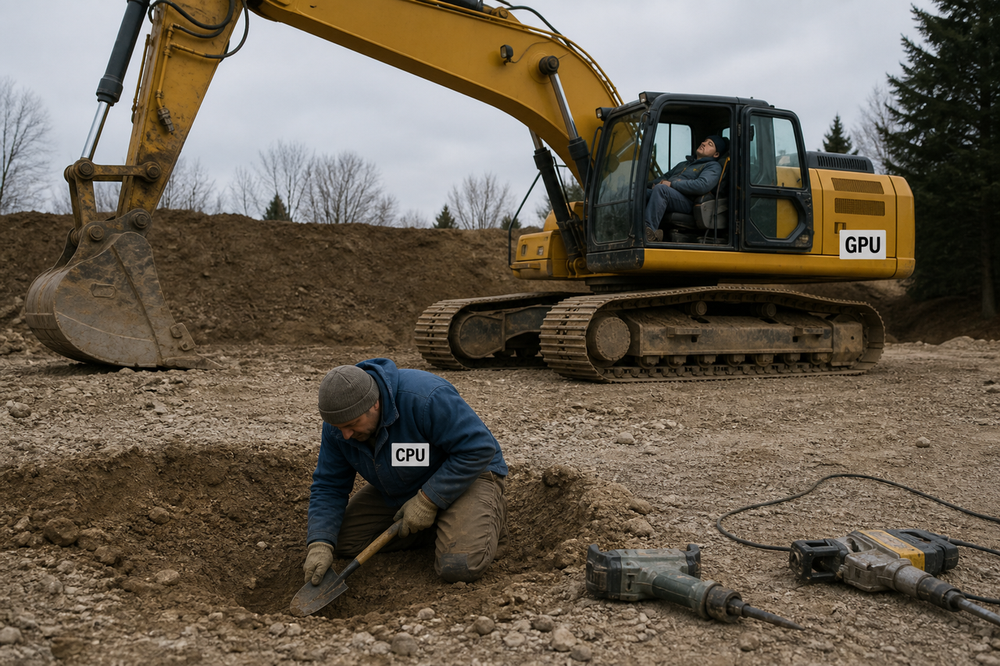
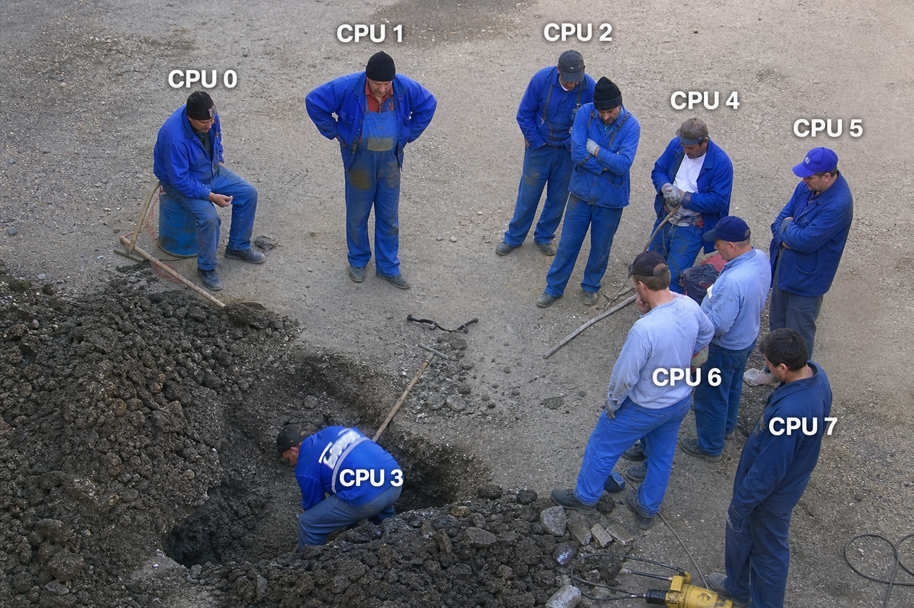
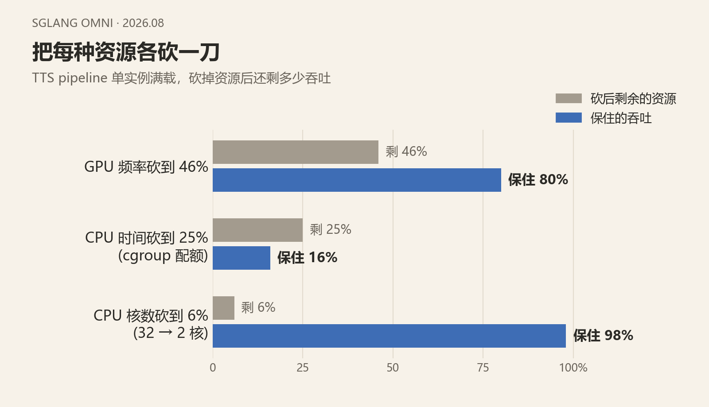
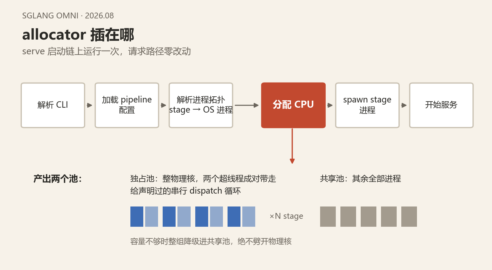

# CPU启示录：重新审视 CPU 资源作为语音模型 Serving 过程的一等公民

不知不觉到了8月，感觉时间过得飞快。似乎很长时间没写文章了。我们最近做了很多的重构来保持我们的系统的可维护性，然后SGL版本也进行了升级。但是在这次升级以后，我们又发现了一些非常有意思的现象，让我们对语音模型的本质和特性又有了更深的认知。

## 再次从CI出发

不得不感叹CI确实是一个系统的风向仪，在上次CI机器的更换中，我们发现了语音模型的CPU host bounded特性，从而带出了DP+MPS/IPC等一系列优化。而这次更进一步，我们又从CI中发现了新的问题和优化。在更新SGL版本后，因为性能的大幅提升，我们给 CI 做了一轮严格的性能校准。Fun-ASR 的吞吐下限定在 128 到 139 req/s。但是令人意外的是，校准合入没几天CI 就开始大面积报吞吐不达标。同一个 commit，CI 只跑出约 92 req/s。后来重新校准 12 轮，低的一轮只有 36 req/s。代码依赖、GPU 和压测脚本全都相同，跨轮吞吐差了接近 4 倍。这是非常令人震惊的。如晨阳一直所说，“任何反常的现象背后，要么是很严重的 bug，要么就是很本质的优化点”。我当然不会放过这个机会:)

### 唯一的变量：CPU 负载

于是对这个问题展开了调查。当时大概怀疑有几个可能性：1.难道是校准本身做错了? 要不然为什么会一直无法复现？2.是flashinfer 或其它依赖悄悄升级了，导致了性能回退？3. 是机器环境本身发生了一些变化？我把 #1260 当时用的 venv 和容器镜像找了出来，和现在的环境比对发现完全一致，flashinfer 一直是同一个版本，原始五轮的数字在旧环境里甚至能逐位复现。机器本身也没有问题。

鉴于workload的host bound特性，我怀疑这些问题也许和CPU资源有关。于是我决定做一些实验：保持所有条件相同，只改变这台机器的 CPU 负载。结果非常有意思，随着CPU负载的增加，吞吐一直在掉落，负载最重时只剩约 27 req/s，GPU 利用率只剩个位数。于是我回去核对时间线，发现#1260 那五轮校准恰好全部落在 CI 的空闲窗口，当时只有个位数的job；从第二天起，同一台机器每小时要起 13 到 27 个 job。问题在主机 CPU 上：显存有 `mem_fraction_static` 这样的预算机制，GPU算力有 MPS，CPU 却没有任何管控。

同时发现flashinfer JIT 编译造成了非常大的CPU负担。旧流程下 CI 冷启动会触发一次整机重编译：上百个 nvcc 同时跑，镜像里的预热缓存对不上产物又写在容器里，容器一退出下次还得再编。我在 #1343 验证期间实测过：一场这样的编译，能把同机的 ASR 服务从 122 qps 打到 41。这个问题后来通过把编译产物添加到CI镜像解决。但是问题仍未被彻底解决，不管在CI还是生产环境。在此之前，我们先进行一个简要的回顾。

## 简单回顾

一个请求进到 omni 语音 pipeline，大致是：音频进来，CPU host 侧把请求拆开，然后在 stage 之间调度。重复把很小的 kernel 派发给 GPU，然后马上回到 host 准备下一步。特点是每个请求都很短，同时并发很高，单步 kernel 往往只有几微秒，大量时间花在 stage 间调度和请求构建上。

跑传统 LLM serving 时，瓶颈几乎总在 GPU，CPU 这边的开销小到可以忽略。语音模型不是这样。[#907](https://github.com/sgl-project/sglang-omni/issues/907) 在 H100 上把 ASR 做成了双边因果实验：GPU 大约九成时间在空转，小幅限制 CPU后，吞吐掉大约七成；大幅降 GPU 频率，吞吐几乎不动。

## 进一步的实验

之前的实验只告诉我们吞吐会随CPU负载下降，但是没有回答为什么。Linux 默认允许任何进程跑在任何核上；机器上的任务一多，调度器就会把不同进程的线程放到同一批核上，它们互相抢执行单元、抢 cache、抢功耗预算，这就是争用。它不需要机器满载才发生：只要两个吃 CPU 的进程碰巧落在同一个物理核上，互相拖慢就开始了。前面吞吐从 139 掉到 27 的曲线，就是争用的宏观表现。

为了看清它的微观机制，我做了两组独立的实验，分别回答两个问题：这个服务到底依赖 CPU 的哪一维资源？争用通过什么途径造成伤害？每组实验按同一个格式讲：目标、内容、启示。

### 单纯增加核数没有用，重点是确保CPU资源不被争用

**实验目标。**CPU 资源不是一个数，它至少有三个维度：核的数量、每秒能用的 CPU 时间（cgroup 配额管的就是它）、每个周期的快慢（频率）。一个非常自然的反应可能是，CPU 不够，那我们就加核！但在加之前得先搞清楚：我们的服务到底吃的是哪一维。这组实验做在 Higgs TTS 上，它是我们 host-bound 特征最典型的模型（上一篇同卡 DP + MPS 的主角），适合拿来做解剖；出事的 ASR 在后两组实验里回归。

**实验内容。**对同一条 pipeline，每次只限制一种资源，看吞吐掉多少：核数从 32 限到 2，吞吐几乎不动；CPU 时间用 cgroup quota 限到 25%，吞吐只剩 16%；GPU 频率限到一半，吞吐只掉 20%。

**实验启示。**一个服务器进程动辄几百个线程，看起来非常牛逼，但在我们的场景下这几百个线程加起来只吃大约一个核：这段工作是串行的，串行链吃不满多核，所以加核修不好它。真正的出路有两条。一是把单条链变成多条，用多进程、多副本真正用上更多的核，同卡 DP + MPS 和多进程 router 走的就是这条路。二是保住它每秒那一小块 CPU 时间，不被机器上别的任务抢走，这就是接下来绑核和 allocator 走的路。两条路互补，而且第一条以第二条为前提：副本开得越多，越怕互相抢。

### 争用让每个请求更耗 CPU

**实验目标。**之前的实验证明了一件事：机器上有别的活，我们就变慢，也就是我们的 CPU 被争用了。但它只给出宏观现象，没有回答变慢具体是怎么发生的。候选解释有两种。

一种是**CPU核不够分**，线程经常等不到核；如果是这样，每个请求需要的 CPU 毫秒数不变，变长的只是等待，而等待会被 PSI 记录下来（PSI 是 Linux 内核的压力指标，统计有多少时间存在任务因抢不到 CPU 而被迫等待）。另一种是**线程随时有核可用，但是发生了征用导致线程无法利用资源**。每毫秒能干的活变少，完成同一个请求需要占用核的毫秒数就变多。区分很简单：看 PSI 和每请求 CPU 毫秒数各自怎么变。排队可以靠扩容缓解，征用只能靠隔离出固定的CPU资源，所以必须分清是哪一种。

**实验内容。** Fun-ASR同样的请求负载跑两遍：一遍独占自己的核区，一遍和一组吃满 CPU 的干扰进程共享核区。结果：共享的那一遍，PSI 全程接近零，说明几乎没有任务在等核；但每个请求占用核的毫秒数从 56 涨到 83，多了约 1.5 倍。（数据在 [#1296](https://github.com/sgl-project/sglang-omni/issues/1296) 和 [#1308](https://github.com/sgl-project/sglang-omni/issues/1308)。）

**实验启示。**争用让CPU变慢而不是让任务排队，所以扩容解决不了争用，只有对CPU资源进行隔离才能。

## CI上的修复

于是我做了下面几件事来修复CI：

1. 把性能测试进程绑到每条 GPU lane 预留的 cpuset 上。同等负载下，不绑核大约保住 55%，绑核大约保住 92%。
2. 对CPU争用情况进行检测，在calibration时每轮采样核区上的外来 CPU 占用，检测到占用时进行重跑。
3. 把单测、环境准备脚本和 runner 进程树全部绑进各自核区。

这几步给 CI 补上了固定的 CPU 预算，对齐的校准口径，同时了也确保了干净的calibration。CI问题基本上得到了解决。CI 可以把隔离收得很紧，情况允许时可以给它一台独立机器。生产主机做不到这一点。同卡 DP 和多模型混部本身就是提高利用率的手段：一张 H100 上跑 Higgs DP3，是官方推荐配置。一张卡几个replica，旁边再放别的模型。CI 里修掉的争用，在生产环境里仍然非常可能会发生。

## 一次不成功的探索：把 CI 的隔离做成生产能用的机制

### 手写 taskset 不够

当时我的判断是：CI 里修掉的争用，生产里大概率还会出现，下一步是把同一套隔离迁到生产。迁之前先看生产环境实际是怎样的。我对一台共享 GPU 主机做过一次分析：几万个 Python 任务里，97% 没有绑任何核，可以跑在全机任意核上。手动管理 CPU 核心在 serving 侧的实际采用率接近零。

即便使用 `taskset`，也无法覆盖服务器上的完整拓扑：它只能约束本进程，管不住同机的其它任务；还容易把同一个物理核的两个超线程分给两个进程，造成争用。DP + MPS，以及后续的 Stage Level DP，需要按 stage、按副本细粒度分核，手动划分做不到。

### 收益主要来自把所有进程纳入同一份 plan

在同一张卡上跑 Qwen3-ASR 的两个 DP 副本，机器上另放一组占满 CPU 的干扰任务，比较三种做法：

| 条件 | Qwen3-ASR qps（两轮） |
|-|-|
| default，今天的现状，不做任何cpu资源管控 | 107 / 115 |
| 为DP2的两个副本锁定好固定CPU核，不对其他任务进行限制 | 110 到 128 |
| 为DP2的两个副本锁定好固定CPU核，并且对其他任务进行限制 | 280 / 278 |

只约束本进程，收益只有 10% 到 15%；对同机负载一并约束，吞吐是 2.5 倍。这组对照说明：要拿到隔离的收益，必须有一份覆盖全机的 plan，由 serving flag 统一执行。为了补上这个缺口，我做了一个能感知拓扑的 CPU allocator（[PR #1463](https://github.com/sgl-project/sglang-omni/pull/1463)）。

### 怎么分核：以 Fun-ASR 为例

各模型的 host 开销差别很大，不能一刀切。profile 显示 host 时间的大头是 stage 间调度和请求构建（Fun-ASR 约 45 ms，Qwen3-ASR 约 35 ms，音频预处理只占个位数百分比），编排时间占比越高的模型对争用越敏感。Fun-ASR 饱和时，ASR 的 host 编排大约使用 4.2 核（pre-LM encoder + scheduler），配置里向上取整，声明 5 个独占物理核。allocator 读到声明后，从 sysfs 里认出物理核和超线程配对，把这 5 个物理核连同核上的两个超线程一起划走，让 ASR 独占。serve 进程树里其余进程进入共享池。没声明的模型即使开了 flag 也不会生效。

容量不够时走显式的降级阶梯：宁可一组副本全部降进共享池，也不把物理核拆开、或只让其中某个副本失去独占。绑核必须在每个 stage 进程启动之前完成，并且设在负责 spawn 的线程上，否则 torch 在 import 期间拉起的线程会先散落到别处。

### 默认关闭，只在启动时跑一次

serve 的启动顺序是：解析 CLI → 加载 pipeline 配置 → 解析进程拓扑（stage 映射到 OS 进程）→ 分配 CPU → spawn stage 进程 → 开始服务。allocator 只在「拓扑已知、进程尚未拉起」这一点上运行一次，产出每个进程的 CPU 集合和一份可审计的 plan，然后退出。请求路径完全不动，默认关闭，行为没有变化。

## 有争用时，隔离确实有效

### 六个模型、三档负载

PR #1463 在 1× H200、每模型一条 16 物理核 lane 上，用闭式循环做了 A-B-A-B。表里的倍数是 allocator 打开 / 关闭；最后一列是打开时相对自己空载的保留率。

| 模型 | 空载 | 中等负载 | 重负载 | 重负载保留率 |
|-|-|-|-|-|
| Fun-ASR | 1.00× | 1.04× | 3.54× | 98% |
| Qwen3-ASR | 0.99× | 1.00× | 2.50× | 98% |
| Higgs TTS | 1.01× | 1.22× | 1.63× | 92% 到 97% |
| MOSS-TTS-Local | 1.01× | 1.10× | 1.44× | 约 100% |
| Fish S2-Pro | 1.00× | 1.15× | 2.18× | 98% |
| dots.tts | 0.99× | 1.11× | 1.88× | 96% |

空载时倍数贴着 1.00，allocator 没有额外开销。越过争用阈值后，开了 allocator 的一侧吞吐还在，没开的一侧会掉下来。掉得最狠的是 Fun-ASR，六个模型里最快的那个。

同卡 DP、CUDA Graph 和这个 allocator，用的是同一份 CPU 预算。前两件把 GPU 空闲用起来、把 host 工作变短；allocator 保证这段工作不被挤掉。

到这里链条已经闭环：CI 证明隔离有效，对照实验证明收益来自统一管控，六个模型的验证说明有争用时它确实兜得住。缺的是最后一块：生产形态下的数据。

## 生产形态下的对照

这组对照保持生产里更常见的形态：同卡 DP + MPS，机器上没有外部 CPU 负载。唯一变量是 allocator 关还是开 static。

- 场景：单机 DP，同时开启 MPS
- 外部 CPU 负载：无
- 并发：3、6、12、24、48、96
- 唯一变量：allocator off（baseline）vs static
- 对照：每档并发 3 次配对，共 18 个点；下表按并发汇总

| 并发 | baseline req/s | static req/s | 配对变化 |
|-|-|-|-|
| 3 | 36.398 | 36.809 | +1.26% |
| 6 | 69.604 | 69.337 | -0.39% |
| 12 | 118.453 | 116.789 | -1.42% |
| 24 | 177.795 | 180.382 | +1.49% |
| 48 | 200.867 | 211.556 | +5.34% |
| 96 | 100.997 | 97.025 | -3.68% |

18 个配对点不加权平均 +0.43%。各档变化在 -3.68% 到 +5.34% 之间，没有稳定的正向趋势。

## 原因分析

### 两次实验测的不是同一件事

前面 Qwen3-ASR 那组对照里，对同机负载一并约束，吞吐提升是 2.5 倍；紧接着这组生产形态实验，开关 static allocator 只有 +0.43%。两次实验看上去结论相反，但测的其实不是同一件事，关键差别在于有没有外部 CPU 争用。

第一组实验：同一张卡上跑 Qwen3-ASR 的两个 DP 副本，机器上另有一组占满 CPU 的干扰任务。只约束 serving 进程本身，收益只有 10% 到 15%；把干扰任务也约束住，吞吐才到 2.5 倍。收益主要来自把外部争用挡在 serving 进程树之外。

第二组实验：同卡 DP + MPS，机器上没有外部 CPU 负载。变量是 server 内部关不关 static allocator，也就是 stage 之间怎么划分核心。没有外部争用时，这个变量几乎不影响吞吐。

因此，隔离的收益来自限制外部进程占用 CPU，而不是 serving 内部 stage 之间如何划分核心。

### 设想没有错，错在环境假设

成也萧何，败也萧何。这个设想和这些实验本身都是有效的：在有争用的机器上，统一管控就是 2.5 倍。问题出在环境假设上，CI 和生产有一点根本性的不同。CI 的机器是共享的：每小时几十个 job，动辄一次整机重编译，争用是常态。生产恰恰相反：一台机器上就那几个服务，每个模型的 host 编排满打满算只用两到五个核，核从来不是稀缺资源。为高争用环境设计的保护，搬到没有争用的环境里，自然测不出收益。

### static allocator 的结构性限制

第二组实验几乎没有变化，不只是因为机器上没有干扰任务。即便打开 static allocator，也很难成为稳定的生产方案：

1. warmup 完成后，对 CPU 敏感的进程数量有限，占用的核也有限，server 内部不易形成持续争用。可用核充足时，OS 调度已经够用。
2. 可用核不足时，static allocator 无法划出足够的独占核，退化为共享池，隔离不生效。
3. 可用核充足但划分策略不当，反而可能降低性能，实现中发现的 corner case 也较多。

生产侧真正要防的是外部争用：为整个 server 划出独占且充足的 CPU，避免被同机其他任务抢占。框架内的 stage 级隔离解决不了这件事，因此暂不把 allocator 引入生产。

## 接下来要做的

这次探索也让我们对CPU资源的利用和优化有了更深刻的了解，对于我们的场景来说，我们目前认为有以下几点：

1. **把串行拆开，用上多核。**单条 host 链吃不满一个核，多开几条链才用得上多核。同卡 DP + MPS 已经验证过这条路，Stage Level DP 是它的下一步。
2. **让每个环节变快。**编排是每个请求都要付的固定成本（Fun-ASR 约 45 ms，Qwen3-ASR 约 35 ms），把它降下来，吞吐和抗争用能力同时受益。
3. **外部争用放在部署层防。**CI 的教训依然成立：真正打垮服务的是同机的外部任务。要解决这个问题需要从容器部署和任务管理的角度出发，估算好CPU负载，确保CPU环境的干净，而不是依赖框架内的细粒度管控。