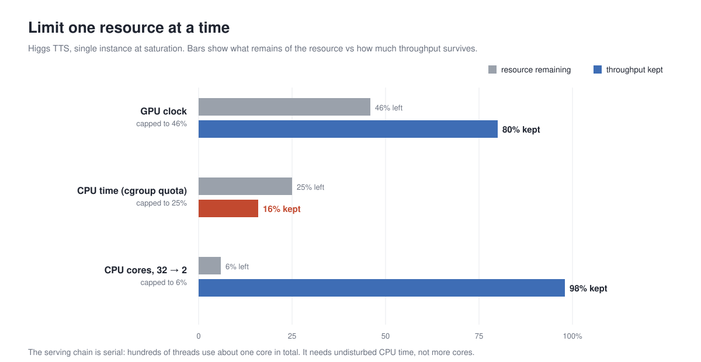
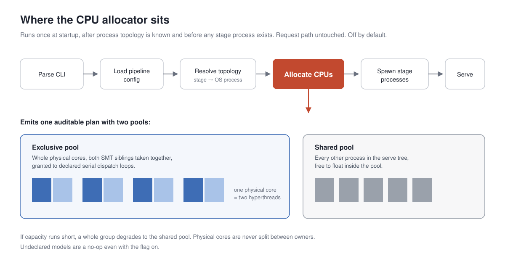

# 重新审视 CPU 资源作为语音模型 Serving 过程的一等公民

从 2023 年 SGLang 项目启动开始，我们一直对于 long context inference 有非常大的投入。最初的时候，我们讨论的 long context 可能是类似于 Llama 3.1 这种 16K 或者 32K 的上下文长度。而后，到了 2025 年 1 月，DeepSeek R1 的出现，将 context length 以及对 context 的真实需求，推向了新的高度。而到了今年，coding agent 的爆发，让 context length 的需求进一步猛增，在之前我们团队的播客当中，也分享过 K3 和 DeepSeek V4 这样的 1M context window 的恐怖模型。

PS：欢迎收听播客[《详解 Kimi K3：强到冲击 Anthropic 估值的模型什么样？》](https://mp.weixin.qq.com/s/KydWDORAkByannmR9jt5ZQ)与[《详解DeepSeekV4：Infra巨鲸、百万上下文走进现实、极致效率优化》](https://www.xiaoyuzhoufm.com/episode/69f2e8ef0694c843e7cd91b6?s=eyJ1IjogIjYyNDkxYjY4ZWRjZTY3MTA0YTk0MzljNSJ9)

做 long context 的 inference，我们采用的方法有非常多，这里不再详细展开，但是欢迎大家阅读我们的相关博客。但是今天讨论的主题和 long context 并无关系，反而我们是想要来分享因为长期工作内容而带来的一些思维误区。具体来说，我们绝大多数的时间都在优化 GPU 效率，特别是 long context 下，需要做恐怖的 long prefill 和 long decoding。这导致我们对于 ASR/TTS 这种短请求，高频率的推理场景产生了先入为主的优化目标，对着 GPU Runtime 做疯狂优化，反而忽略在推理过程中同样至关重要的 CPU 计算资源。基于此，本文将会回顾 SGLang Omni 项目组在 CI 运行过程中发现的 CPU 瓶颈，以及我们做出的相应实验观察和最终的优化成果，希望能够引起大家对 CPU 资源的重新审视。

## CI 运行过程中的 CPU 瓶颈

在 SGLang Omni 项目的 [V1 重构](https://github.com/sgl-project/sglang-omni/issues/188)之初，我们就制定了极为严苛的 CI 策略。简单来说，我们的 CI 要求性能和正确性都只进不退。举个具体的例子，假设 Qwen3 ASR 在 Seed TTS 逆转录这个任务上，在 commit A 拿到了 108 requests per second 的成绩，那么在 commit A 之后的所有 commit 只能把这个成绩推向更好的高度，不能发生任何回退，且正确性不能有任何损失。这个事情听上去非常的 trivial，但是如何让我们的 CI 抓住每一次可能的回退呢？举一个例子，假设在 commit A，Qwen3 ASR 就拿到了 108 requests per second，然后到了 commit B，拿到了 130 requests per second，然后下一个 commit C 略微降低了性能，让 Qwen3 ASR 回到了 120 requests per second 这个水平。如果我们不再 commit B，就将 CI 的 threshold 升级到 130，却还是出于惯性保留着 commit A 108 的这个 threshold，那么 commit B 到 commit C 出现的性能回退，我们是很难自动察觉到的。为此，我们的办法其实很简单，在每一个 commit 产生了性能提升之后，我们会立刻进行 5 次重复，然后取 5 次重复的最低值作为更新之后的 CI threshold。我们将这个过程称为 calibration。因此，回到我之前举的 A B C 这个例子，如果 B 就已经将 C 的 threshold 提升到 130，那么 calibration 就能够把 threshold 提上来，一定能够抓住 B 到 C 这个过程产生的回退。这个过程听上去非常简单，但实际上要求每一个性能有提高的 PR 都要做 calibration，是对开发者而言非常痛苦的一件事情。不过我们一贯的观点都是认为，宁愿苦一苦开发者，也要让我们的用户享受到最好的框架。至于具体的 calibration 如何进行，可以参考我们的 calibration skills `.claude/skills/tune-ci-thresholds`。

考虑到我们 CI 的如此设定，基本上，我们的 CI 能够敏锐地抓到主要模型在我们关注任务上面的精确回退。反过来，如果出现了回退，也能够第一时间引起我们团队的警觉，并且研究回退原因。这里就有一个非常有趣的例子，在 2 个月之前，我们将 CI 从 H20 迁移到 H100，就发生了性能超出预期的回退（参考 [Issue 907](https://github.com/sgl-project/sglang-omni/issues/907)）。可以说，对 CI 近乎病态的执着，让我们能够对性能有最为直接的观测。

同样的，对 CPU 问题的发觉也来自于一次 CI 回退。具体来说，在 [PR 1183](https://github.com/sgl-project/sglang-omni/pull/1183) 更新 SGL 版本后，我们给 CI 做了一轮全量 calibration。Fun-ASR 的 throughput threshold 从 128 提升到了 139 req/s。但是接下来几天，CI 就开始大面积出现 throughput 不达标，而这些 PR 看上去对 ASR 本身没有任何影响。更夸张的情况是，同一个 commit，某个 run 只跑出约 92 req/s。而后，我们连续重新测试该 PR 的 CI 12 轮，最低的一轮只有 36 req/s。代码依赖、GPU 和压测脚本全都相同，跨轮吞吐差了接近 4 倍。

一贯以来，我们对自身的要求都是：任何反常的现象，要么是我们的认知不够，要么是出现了奇怪的 bug。如果现在不解决，一定会在将来导致更大的问题。观察到 CI 不同的 run 之间出现如此夸张的吞吐差距后，我们下定决心要来研究原因。

1. calibration 本身机制出现了问题；
2. flashinfer 或其它依赖悄悄升级了，导致了性能回退；
3. 某一个 PR 让 Runtime 性能变得极为不稳定，性能 variance 被严重放大；

鉴于我们在 [Issue 907](https://github.com/sgl-project/sglang-omni/issues/907) 中的发现 workload 的 host bound 性质，我们怀疑这些问题也许和 CPU 资源有关，于是做一些简单的控制变量实验。保持所有条件相同，只改变这台机器的 CPU 负载。结果非常有意思，随着 CPU 用于处理其他进程的负载增加，ASR 进程的吞吐一直在下降，负载最重时只剩约 27 req/s，GPU 利用率只剩个位数。于是我们回去核对机器，发现 #1260 那五轮校准恰好全部落在 CI 的空闲窗口，当时只有个位数的 job；从第二天起，同一台机器每小时要起 13 到 27 个 job。

> note：注意到，为了控制 calibration 和 CI 的环境一致，实际上我们会在最终执行 CI 的机器上面来完成 calibration。换句话来说，calibration 其实和 CI 是一体两面的。calibration 的作用仅仅在于忠实地执行 5 次 CI，并且取性能和正确性的最差成绩作为 threshold。至于 CI 本身，事实上也是在 end to end 测一些我们关注的 performance 的性能表现和正确性。CI 也只是在忠实地运行我们的 Benchmark evaluation 系统，换句话说，我们建立了一套 Benchmark evaluation CI test calibration 的三级流水线，而且三者能够复用的组件是非常多的。

最终的结论是，ASR CI 出现严重下滑的根本原因在于主机 CPU 资源的波动：显存有 `mem_fraction_static` 这样的预算机制，GPU 算力会被 CI 的 scheduling 自动分配，但是 CPU 却没有任何管理机制。同时我们发现 flashinfer JIT 编译造成了非常大的 CPU 负担。旧流程下 CI 冷启动会触发一次整机重编译，我们在 #1343 验证期间实测过，一次这样的编译，能把同机的 ASR 服务从 122 qps 打到 41。这个问题后来通过把编译产物添加到 CI 镜像解决。

### 语音模型 serving 的 CPU 开销

为了进一步描述这一问题，我们对语音模型的推理过程进行简化。一个请求进入到 SGLang Omni 的 serving stack 后， CPU host 侧把请求拆解，并在我们设计的多个 stage 之间调度。这些 stage 大多数是 GPU 计算，host/CPU 反复将计算任务派发给 GPU，得到结果后，马上回传到 host 准备下一步。每个请求都很短，同时并发很高，单步 kernel 往往只有几微秒，大量时间花在 stage 间调度和请求构建上。

正如我们在文章开头提到的，区别于 LLM 依赖的 long decoding、long prefill workload，语音模型本身对 CPU 的依赖是更强的。[#907](https://github.com/sgl-project/sglang-omni/issues/907) 在 H100 上做了一个不严谨的 profiling，其中 GPU 大约九成时间在空转，小幅限制 CPU 后，吞吐掉大约七成；大幅降 GPU 频率，吞吐几乎不动。（PS：现在我们的 runtime fusion 做的当然比起 Issue 907 的时候好，自然不存在如此夸张的空转了）

### 为什么 CPU 影响如此之大？

之前的实验只告诉我们吞吐会随 CPU 负载增大而下降，但是没有回答为什么。实际上，Linux 默认允许任何进程跑在任何 CPU 核上；机器上的任务一多，调度器就会把不同进程的线程放到同一批核上，它们互相抢执行单元、抢 cache、抢功耗预算，这就是争用。它不需要机器满载才发生：只要两个吃 CPU 的进程碰巧落在同一个物理核上，互相拖慢就开始了。前文吞吐从 139 掉到 27 的例子，就是争用的宏观表现。

为了看清它的微观机制，我们做了两组独立的实验，来分析两个问题：这个服务到底依赖 CPU 的哪一维资源，争用通过什么途径造成伤害？

### CPU 资源争用的发生机制

CPU 资源至少有三个维度：核的数量、每秒能用的 CPU 时间（通过 cgroup 配额进行管理）、每个周期的快慢（频率）。一个非常自然的反应可能是，CPU 不够，那我们就加核，显然这是只考虑了 CPU 资源最显而易见的维度。对 Higgs TTS 这条 pipeline，我们每次只限制一种资源，观察对吞吐的影响。核数从 32 限到 2，吞吐几乎不动；CPU 时间用 cgroup quota 限到 25%，吞吐只剩 16%；GPU 频率限到一半，吞吐只掉 20%。

一个服务器进程动辄几百个线程，看起来非常恐怖，但在我们的场景下，这几百个线程加起来只占据大约一个核，且这些线程可能是串行的，所以增加核数很难线性的提高处理效率。直观的解决方案有两种，一是把单条链变成多条，用多进程、多副本真正用上更多的核，同卡 DP + MPS 和多进程 router 走的就是这条路。第二，尝试保护服务器进程每秒内的 CPU 时间，不被机器上别的任务抢占，这就是接下来绑核和 allocator 的思路。并且注意到，如果我们高强度采用第一种方案，那么副本越多，进程越多，彼此之间对同一核的抢占则会更加严重。

### 争用让每个请求更耗 CPU

第一个实验证明，争用对产生冲突的进程都带来性能影响，我们进一步思考这种影响发生的原因：

一种可能是 CPU 核不够分，线程经常等不到核；如果是这样，每个请求需要的 CPU 毫秒数不变，变长的只是等待时间，而等待会被 PSI 记录下来（PSI 是 Linux 内核的压力指标，统计有多少时间存在任务因抢不到 CPU 而被迫等待）。另一种可能是线程随时有核可用，但是发生了争用导致线程频繁进行切换，资源无法完全利用。每毫秒能干的活变少，完成同一个请求需要占用核的毫秒数就变多。区分很简单，看 PSI 和每请求 CPU 毫秒数各自怎么变。排队可以靠扩容缓解，后者需要隔离出固定的 CPU 资源。

我们同样进行实验，对 Fun-ASR 在同样的请求负载下进行比较：一遍独占自己的核区，一遍和一组吃满 CPU 的干扰进程共享核区。结果显示共享核区的实验组，PSI 全程接近零，说明几乎没有任务在等核；但每个请求占用核的毫秒数从 56 涨到 83，多了约 1.5 倍。相关数据纪录于 [#1296](https://github.com/sgl-project/sglang-omni/issues/1296) 和 [#1308](https://github.com/sgl-project/sglang-omni/issues/1308)。

争用让 CPU 可利用时间变少而不是让任务排队，所以扩容解决不了争用，我们选择对 CPU 资源通过 cgroup quota 进行隔离。

## 对 CI 上的 CPU 资源争用进行修复

我们做了下面几件事来修复 CI 上的 CPU 资源争用：

1. 把性能测试进程绑到每条 GPU lane 预留的 cpuset 上；
2. 对 CPU 争用情况进行检测，在 calibration 时每轮采样核区上的外来 CPU 占用，检测到占用时进行重跑；
3. 把单测、环境准备脚本和 runner 进程树全部绑进各自核区；
4. 调整机器使用策略。此前这台 H100 机器上留了两张卡做开发，其余六张卡跑 CI，开发任务和 CI 任务共享同一颗 host CPU，这本身就是争用的一个重要来源；最终我们把这台机器整机转为 CI 专用，开发工作迁到了其他机器上。

通过这种方式，我们成功给 CI 机器添加了 CPU 预算。简单来说，在我们的修改之前，只要 CI 机器检测到 GPU 资源足够，就会发起新的 CI 任务。修改过后，我们将 CPU 资源也同样纳入到了 CI 机器的考量范围。如果检测到 CPU 资源不足够的时候，即便 GPU 资源是足够的，也不会 launch 这一个 CI 任务。

即便如此，考虑到生产环境当中仍然可能会发生 CPU 争用的情况，我们希望在 SGLang Omni 上提前做一些 CPU 争用检测器，至少能够告诉用户 CPU 争用发生，用户应该合理的调整 CPU workload 来提高整体 SGLang Omni 的吞吐效率。

## 从手动绑核到 CPU allocator

CI 的问题到这里算是告一段落了。但 CI 的修复靠的是一套手工划定的核区，这种办法在 CI 这样固定的环境里够用，却推广不了。这一节讲我们怎么把 CPU 隔离沉淀成一个通用机制，以及它在争用环境下的效果。

### 优化复用

先看看手头机器上 CPU 管理的现状。以我们的共享开发机为例，这也是争用最典型的环境：几万个 Python 任务里，97% 没有绑任何核，可以跑在全机任意核上。手动管理 CPU 核心在 serving 侧的实际采用率接近零。即便用 `taskset`，也覆盖不了服务器的完整拓扑：它只能约束本进程，管不住同机的其它任务；还容易把同一个物理核的两个超线程分给两个进程，制造争用。DP + MPS，以及后续的 Stage Level DP，都需要按 stage 和副本细粒度分核，手动划分做不到。需要说明的是，这类共享机是开发环境，争用是常态；真正的生产部署通常是专机独占，这个区别在后文会成为整个故事的关键。

更关键的一组对照在这里。同一张卡上跑 Qwen3-ASR 的两个 DP 副本，机器上另放一组占满 CPU 的干扰任务，比较三种做法：

| 条件 | Qwen3-ASR qps（两轮） |
|---|---|
| default，今天的现状，不做任何 cpu 资源管控 | 107 / 115 |
| 为 DP2 的两个副本锁定好固定 CPU 核，不对其他任务进行限制 | 110 到 128 |
| 为 DP2 的两个副本锁定好固定 CPU 核，并且对其他任务进行限制 | 280 / 278 |

只约束本进程，收益只有 10% 到 15%；对同机负载一并约束，吞吐是 2.5 倍。这组对照说明：要拿到隔离的收益，必须有一份覆盖全机的 plan，由 serving flag 统一执行。为了补上这个缺口，我们做了一个能感知拓扑的 CPU allocator（[PR #1463](https://github.com/sgl-project/sglang-omni/pull/1463)）。

这里简单交代一句 allocator 是怎么工作的，后面分析反常现象时会用到。各模型的 host 开销差别很大，不能一刀切。profile 显示 host 时间的大头是 stage 间调度和请求构建（Fun-ASR 约 45 ms，Qwen3-ASR 约 35 ms，音频预处理只占个位数百分比），host 处理时间占比越高的模型对争用越敏感。Fun-ASR 饱和时，ASR 的 host 处理大约使用 4.2 核（pre-LM encoder + scheduler），配置里向上取整，声明 5 个独占物理核。allocator 读到声明后，从 sysfs 里认出物理核和超线程配对，把这 5 个物理核连同核上的两个超线程一起划走，让 ASR 独占，serve 进程树里其余进程进入共享池。没声明的模型即使开了 flag 也不会生效。

容量不够时走显式的降级阶梯：宁可一组副本全部降进共享池，也不把物理核拆开、或只让其中某个副本失去独占。绑核必须在每个 stage 进程启动之前完成，并且设在负责 spawn 的线程上，否则 torch 在 import 期间拉起的线程会先散落到别处。allocator 只在启动链上跑一次，请求路径完全不动，默认关闭。

### 争用环境下的效果验证

更多的实验可以证明 CPU allocator 在争用存在时的确有效，而且效果显著。PR #1463 在 1× H200、每模型一条 16 物理核 lane 上，把 allocator 开和关交替着各测几轮（A-B-A-B），抵消机器状态随时间的漂移。表里"空载 / 中等负载 / 重负载"这三列，都是同一个比值：这一档负载下，allocator 打开时的吞吐，除以关闭时的吞吐。

| 模型 | 空载 | 中等负载 | 重负载 | 重负载保留率 |
|---|---|---|---|---|
| Fun-ASR | 1.00× | 1.04× | 3.54× | 98% |
| Qwen3-ASR | 0.99× | 1.00× | 2.50× | 98% |
| Higgs TTS | 1.01× | 1.22× | 1.63× | 92% 到 97% |
| MOSS-TTS-Local | 1.01× | 1.10× | 1.44× | 约 100% |
| Fish S2-Pro | 1.00× | 1.15× | 2.18× | 98% |
| dots.tts | 0.99× | 1.11× | 1.88× | 96% |

拿 Fun-ASR 来说，重载列写着 3.54×，意思是争用严重的时候，开 allocator 的一侧跑出来的吞吐，是没开那一侧的 3.54 倍。最后一列是另一个口径，专门回答"有保护的服务自己会不会也掉"：重载时，开 allocator 的一侧，相对于它自己空载时的吞吐还能保住多少。Fun-ASR 是 98%，也就是说争用再狠，开了 allocator 它也几乎不掉，而没开的那一侧已经掉下去一大截了。

空载那列都贴着 1.00×，说明没有争用的时候，开不开 allocator 吞吐一样，它本身不拖后腿，也就是零开销。越过争用阈值后，开了的一侧吞吐还在，没开的一侧往下掉。掉得最狠的是 Fun-ASR，六个模型里最快的那个。同卡 DP、CUDA Graph 和这个 allocator，用的是同一份 CPU 预算。前两件把 GPU 空闲用起来、把 host 工作变短；allocator 保证这段工作不被挤掉。

到这里链条已经闭环：CI 证明隔离有效，对照实验证明收益来自统一管控，六个模型的验证说明有争用时它确实可以保障应有的吞吐。现在我们缺的是最后一块：生产形态下的数据。

## 生产形态下，收益消失了

既然隔离在争用环境下如此有效，我们自然期待生产端也有不错的收益，于是把同一套隔离搬进生产形态实测：同卡 DP + MPS，机器上没有外部 CPU 负载，唯一变量是 allocator 关还是开 static。结果恰恰相反，收益几乎归零，这也是整个探索里最让我们意外的部分。

- 场景：单机 DP，同时开启 MPS
- 外部 CPU 负载：无
- 并发：3、6、12、24、48、96
- 唯一变量：allocator off（baseline）vs static
- 对照：每档并发 3 次配对，共 18 个点；下表按并发汇总

| 并发 | baseline req/s | static req/s | 配对变化 |
|---|---|---|---|
| 3 | 36.398 | 36.809 | +1.26% |
| 6 | 69.604 | 69.337 | -0.39% |
| 12 | 118.453 | 116.789 | -1.42% |
| 24 | 177.795 | 180.382 | +1.49% |
| 48 | 200.867 | 211.556 | +5.34% |
| 96 | 100.997 | 97.025 | -3.68% |

18 个配对点不加权平均 +0.43%。各档变化在 -3.68% 到 +5.34% 之间，没有稳定的正向趋势。前面重负载下能到 3.54 倍的设计，在生产形态收益几乎归零。

## 原因不在实验，而在环境假设

冷静分析之后，我们发现关键差别在于环境内是否存在外部 CPU 争用。

第一组实验里，机器上另有一组占满 CPU 的干扰任务，收益主要来自把外部争用挡在 serving 进程树之外。第二组实验里，机器上没有外部 CPU 负载，变量只剩 server 内部关不关 static allocator，也就是 stage 之间怎么划分核心。没有外部争用时，这个变量几乎不影响吞吐。所以结论很明确：隔离的收益来自限制外部进程占用 CPU，而不是 serving 内部 stage 之间如何划分核心。

成也萧何，败也萧何。这个设想和这些实验本身都是有效的：在有争用的机器上，统一管控就是 2.5 倍。问题出在环境假设上。CI 的机器是共享的：每小时几十个 job，动辄一次整机重编译，争用是常态。生产恰恰相反：一台机器上就那几个服务，每个模型的 host 处理满打满算只用两到五个核，即使我们大幅度使用 DP 等技术进行并行部署，也只会用掉 20-30 个核心，而一台服务器 CPU 有上百核因此 CPU 不是稀缺资源。为高争用环境设计的保护，搬到没有争用的环境里，自然测不出收益。

第二组模拟生产实验几乎没有收益，不只是因为机器上没有干扰任务。即便打开 static allocator，它也很难成为稳定的生产方案：

1. warmup 完成后，对 CPU 敏感的进程数量有限，占用的核也有限，server 内部不易形成持续争用。可用核充足时，OS 调度已经够用。
2. 可用核不足时，static allocator 无法划出足够的独占核，退化为共享池，隔离不生效。
3. 可用核充足但划分策略不当，反而可能降低性能，实现中发现的 corner case 也较多。

换句话说，static allocator 解决的是 stage 内部怎么分核。生产真正要防的是外部争用，也就是为整个 server 划出独占且充足的 CPU，避免被同机其他任务抢占。框架内的 stage 级隔离解决不了这件事，所以它的复杂性在生产里没有收益，我们暂不把 allocator 引入生产。

## In the End

这次探索没有白做，它让我们对 CPU 资源的理解更进了一步：争用是环境的产物，不是模型的问题。基于这一点，接下来我们会做三件事：

1. **使用多进程，充分利用多核。** 单条 host 链吃不满一个核，多开几条进程才能用上更多的核。DP 和 MPS 的组合方案已经验证过这一点，同时我们也在做更细粒度的 DP：Stage Replica。
2. **优化每个环节，充分利用单核。** 每个请求都要付一笔固定的 host 处理成本：stage 间调度、请求构建、kernel launch（Fun-ASR 约 45 ms，Qwen3-ASR 约 35 ms）。其中 kernel launch 我们已经用 CUDA Graph 压掉了大头，接下来轮到调度和请求构建。把这笔成本降下来，吞吐和抗争用能力同时受益。
3. **部署时避免外部争用。** CI 的教训依然成立：真正打垮服务的是同机的外部任务。要解决这个问题需要从容器部署和任务管理的角度出发，估算好 CPU 负载，避免任务间互相争用 CPU，而不是依赖框架内的细粒度管控。

这次的经历也让我们更加深刻地意识到语音 serving 的吞吐，并不只是 GPU 说了算。CPU 一直在一个被忽视的角落，决定每一次调度、每一次请求构建能不能准点完成，只是对于做惯了 long context serving 的我们，养成了"对着 GPU 疯狂优化"的惯性，从而忽视了一个同样对吞吐起着决定性作用的资源。这也提醒我们做任何优化都要因地制宜，从任务和环境的本质出发，找到根本性的限制性因素并加以利用，从而解决系统上遇到的问题。在下次优化语音 serving 盯着 GPU 调优的时候，希望我们还有读到这里的你，都能记得回头看一眼 CPU，看看它有没有成为那个决定系统性能的瓶颈。在此也衷心感谢 Chenyang, Kaige, Yuhao, Huapeng, Ratish，孙哥，Yueying 老师对本文和这一系列 effort 的支持和建议。
