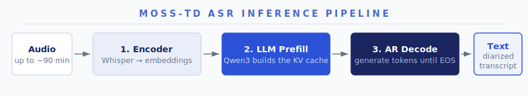
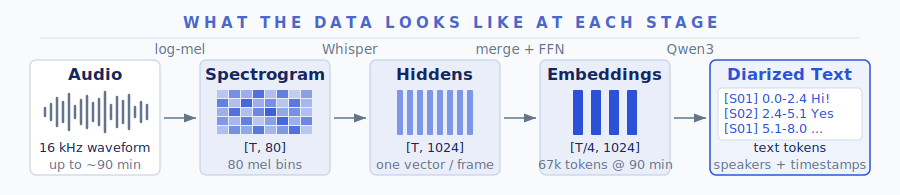
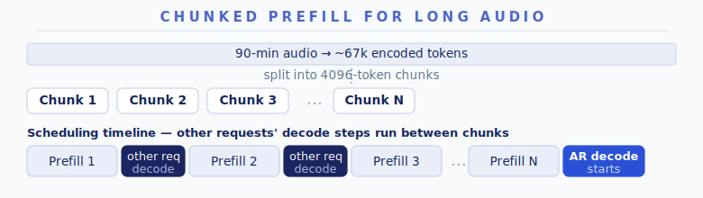
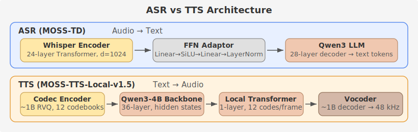
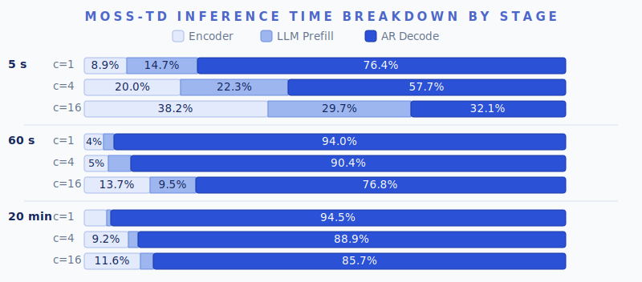
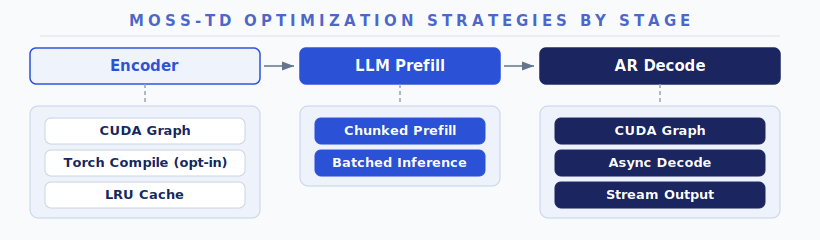
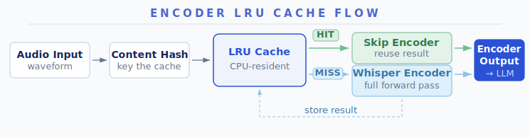
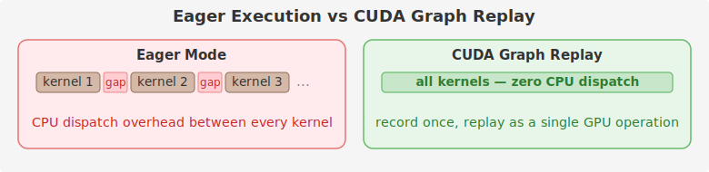
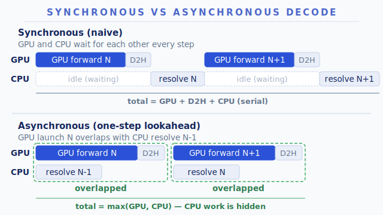

# Optimizing ASR Models to Transcribe 90-Minute Multi-Speaker Audio

[MOSS-Transcribe-Diarize](https://huggingface.co/OpenMOSS-Team/MOSS-Transcribe-Diarize) (MOSS-TD for short) does more than speech-to-text: it labels who spoke and when in complex conversation scenarios, on audio up to ~90 minutes long. 

The community recently collaborated to bring MOSS-TD to [SGLang-Omni](https://github.com/sgl-project/sglang-omni), covering model support, correctness fixes, and performance optimization. The result: a single H100 turns a 38-minute multi-speaker meeting into a speaker-labeled, timestamped transcript in ~49 seconds — the whole meeting is transcribed faster than you could listen to its first minute. Batch 16 meetings at once, and the same GPU chews through 97.5 seconds of audio per wall-clock second. This post records all the engineering behind these numbers, and our technical experiences.

------

## ASR Model Primer

ASR (Automatic Speech Recognition) converts audio input into text output: **input is audio waveform, output is text.**

MOSS-TD follows the Audio LLM paradigm — a Whisper encoder produces continuous embeddings, which are projected by an FFN adaptor into a decoder-only LLM that autoregressively generates the transcript with speaker labels and timestamps.



*Figure 1. MOSS-TD inference pipeline: Whisper encoder → FFN adaptor → Qwen3 LLM prefill → AR decode → text with speaker labels and timestamps.*



*Figure 2. Data shapes along the pipeline: 16 kHz waveform → log-mel spectrogram `[T, 80]` → encoder hidden states `[T, 1024]` → LLM embeddings `[T/4, 1024]` (12.5 tokens/s, ~67k tokens for 90 min) → diarized text.*

The pipeline has three stages:

1. **Encoder.** Waveform → log-mel spectrogram (80 bins) → 24-layer Whisper Transformer → 4× Time Merge (concatenate every 4 frames) → FFN adaptor (Linear→SiLU→Linear→LayerNorm, 4096→1024). The output is a sequence of continuous float vectors in the LLM's embedding space.

2. **LLM Prefill.** The audio embeddings replace placeholder tokens in the prompt. Qwen3 processes the prompt to build the KV cache — in one forward pass for short audio, or split into 4096-token chunks for long audio (see Chunked Prefill below).

3. **AR Decode.** Qwen3 generates text tokens one at a time — transcript with speaker labels `[S01]`/`[S02]` and timestamps — until EOS.

| Component    | Spec                                           |
| ------------ | ---------------------------------------------- |
| Architecture | `MossTranscribeDiarizeForConditionalGeneration` |
| Audio Encoder | Whisper encoder (24 layers, d_model=1024)      |
| Adapter      | FFN: Linear→SiLU→Linear→LayerNorm, 4096→1024 |
| Text Decoder | Qwen3 (28 layers, hidden=1024, GQA 16/8)      |
| Output       | Speaker-labeled transcript with start/end timestamps |
| Endpoint     | `/v1/audio/transcriptions`                     |

### Chunked Prefill for Long Audio

For long audio (up to ~90 minutes), the encoded token sequence can reach tens of thousands of tokens. Prefilling such a sequence in one forward pass would occupy the GPU for seconds and spike activation memory. And since decode and prefill share one scheduler loop, every other request's decode would stall for that whole stretch. **Chunked Prefill** splits the sequence into 4096-token chunks, processing one per scheduling step and interleaving decode steps for other requests between chunks. The trade-off: the long request's own prefill finishes slightly later (more scheduling rounds), in exchange for bounded decode stalls and smooth streaming for everyone else. Stream output is suppressed during chunked prefill to avoid emitting intermediate states as if they were transcript output.



*Figure 3. Chunked prefill splits a long token sequence into 4096-token chunks, interleaving other requests' decode steps between chunks to keep the GPU busy.*

### ASR vs TTS

ASR and TTS share much of the same serving infrastructure in SGLang-Omni — both use `OmniScheduler`, share CUDA Graph / KV cache management / continuous batching, and both are LLM-backboned autoregressive models (the backbone choice varies by model; MOSS-TD and MOSS-TTS happen to both use Qwen3). The real differences lie in what they encode, what they generate, and how their pipelines are organized:

| Dimension         | ASR (MOSS-TD)                                | TTS (Higgs / MOSS-TTS)                      |
| ----------------- | -------------------------------------------- | -------------------------------------------- |
| Audio representation | Continuous features (mel → encoder hidden states) | Discrete codec tokens (RVQ multi-codebook)  |
| Data flow         | Audio → text                                 | Text → audio                                 |
| Audio decoder / Vocoder | Not needed — output is plain text            | Vocoder required to reconstruct waveform     |
| Typical input length | Very long (MOSS-TD supports ~90 min)       | Short (reference voice: a few seconds)       |
| Pipeline stages   | Single stage (encoder + LLM)                 | Multi-stage (encoder → AR engine → vocoder)  |
| Streaming         | Stream text output (incremental transcript)  | Stream audio output + streaming vocoder      |



*Figure 4. ASR vs TTS architecture. ASR: Whisper encoder → FFN adaptor → Qwen3 decoder, which generates text directly. TTS (MOSS-TTS-Local-v1.5): codec encoder → Qwen3-4B backbone → local transformer → vocoder.*

ASR does not need a vocoder at all — it simply generates text. But ASR inputs can be much longer than TTS inputs, shifting the optimization focus toward the AR decode loop and long-sequence memory management. For the full TTS optimization story, see [Optimizing TTS Inference](tts-optimization.md).

------

## Where Time Is Spent: Profiling

Before optimizing, we profiled on a single H100 (CUDA Graph, bf16) to find the bottlenecks:



*Figure 5. Inference time breakdown by stage. AR Decode dominates at low concurrency; encoder share rises at high concurrency with short audio.*

| Audio Length | Concurrency | Encoder | LLM Prefill | AR Decode |
| -----------: | ----------: | ------: | ----------: | --------: |
| 5 s          | 1           | 8.9%    | 14.7%       | 76.4%     |
| 5 s          | 4           | 20.0%   | 22.3%       | 57.7%     |
| 5 s          | 16          | 38.2%   | 29.7%       | 32.1%     |
| 60 s         | 1           | 4.0%    | 2.1%        | 94.0%     |
| 60 s         | 4           | 5.0%    | 4.6%        | 90.4%     |
| 60 s         | 16          | 13.7%   | 9.5%        | 76.8%     |
| 20 min       | 1           | 4.7%    | 0.8%        | 94.5%     |
| 20 min       | 4           | 9.2%    | 1.9%        | 88.9%     |
| 20 min       | 16          | 11.6%   | 2.6%        | 85.7%     |

Two takeaways:

- At c=1 with long audio, AR Decode takes 94%+ of total time — the leverage is almost entirely in the decode loop.
- At c=16 with short audio, encoder + prefill together account for 68%, making encoder-side optimizations worthwhile.

------

## Optimization Strategies

Our optimization stack reuses the core infrastructure built for TTS, with ASR-specific adaptations. If you have read [the TTS optimization blog](tts-optimization.md), you will recognize the same ideas — CUDA Graph, async decode, encoder caching — applied to a simpler pipeline (no vocoder, no multi-codebook generation).



*Figure 6. Optimization strategies mapped to pipeline stages. Encoder gets CUDA Graph + Torch Compile + LRU cache; decode gets CUDA Graph + async decode + stream output.*

### Encoder

**CUDA Graph.** The Whisper encoder works on fixed 30-second windows: input audio is split into 30 s chunks (the last one padded to 30 s), and each chunk goes through one encoder forward. Since every chunk has the same shape, the only variable is how many chunks a request carries — so the encoder is bucketed by chunk count (default up to 8 chunks, covering ~4 min of audio), and each bucket captures a CUDA graph, eliminating per-call kernel launch overhead.

**Torch Compile** (opt-in). An opt-in setting replaces the encoder CUDA graph with `torch.compile(self.whisper_encoder, dynamic=False)`, which adds kernel fusion. The default compile mode is used on purpose: `mode="reduce-overhead"` owns its own internal CUDA graphs, and they corrupt memory when they run alongside the decode CUDA graphs in the same process. Torch Compile trades slower cold start (one-time per-bucket compilation) for kernel fusion gains at steady state. Prefer it for encoder-bound, high-concurrency short-audio workloads.

**LRU Cache.** The Whisper encoder forward is deterministic for identical input — same waveform always produces the same embeddings. We cache encoder outputs on CPU (max 64 entries, 4 GB), keyed by a content hash of the input waveform. On a hit, the stored tensor is transferred back to GPU asynchronously and the encoder is skipped entirely.



*Figure 7. LRU cache flow: content-hash the waveform, check the cache. On a hit, skip the encoder entirely and transfer cached embeddings back to GPU. On a miss, run the encoder and store the result.*

Unlike TTS where the same reference voice is reused across many prompts (high hit rate), ASR inputs are typically unique in production. The cache is most useful during request retries, A/B testing with different decode parameters, and development iteration. Being honest about limited hit rate in production is more useful than pretending the cache always helps.

### AR Decode

**CUDA Graph.** The LLM decode step pads batch size to predefined buckets (1, 2, 4, 8, ...) and replays a captured CUDA graph, eliminating kernel launch overhead on every token. The mechanism is the same as for TTS decode — see [CUDA Graph in the TTS blog](tts-optimization.md#cuda-graph) for the full discussion of static-path challenges, fixed-address shadow buffers, and gather/scatter patterns.



*Figure 8. Eager mode dispatches each kernel individually with CPU gaps in between; CUDA Graph records the sequence once and replays it as a single GPU operation.*

**Async Decode.** Same one-step lookahead as TTS: launch the current decode step's GPU work, then resolve the previous step's host-side work (D2H copy, finish detection, result dispatch) in parallel. Falls back to synchronous mode at batch size 1, where the host-side work is too small to justify the overlap. Two alternating pinned host buffers prevent read/write races between the GPU's async D2H write and the CPU's read.

This brings a solid qps gain at high concurrency. The work also fixed a KV slot leak caused by lookahead overrun. For the full mechanism — launch/resolve event loop, ping-pong buffers, lookahead guard — see [Asynchronous Decode + Lookahead in the TTS blog](tts-optimization.md#asynchronous-decode--lookahead).



*Figure 9. Synchronous decode wastes GPU cycles waiting for CPU resolve. Async decode overlaps GPU forward N with CPU resolve N-1 via ping-pong pinned buffers, hiding the CPU work entirely.*

**Stream Output.** During AR decode, transcript text is emitted incrementally via SSE so that users see partial results as they are generated rather than waiting for the full sequence. Three mechanisms control when to emit:

1. **Rate limiting** (default 50 ms): tokens accumulate in a per-request buffer and flush only when enough time has elapsed. The first token goes out immediately; EOS always triggers a flush.
2. **Chunked prefill suppression**: all emission is suppressed during chunked prefill to prevent intermediate states from being misinterpreted as transcript.
3. **Incomplete UTF-8 handling**: if the accumulated tokens end with the Unicode replacement character (an incomplete multi-byte sequence split across token boundaries), emission is held until the next token completes the sequence.

### Batched Inference

Encoder-side mel alignment and LLM-side sequence packing allow multiple requests to be processed together more efficiently. On the encoder side, mel spectrograms of different lengths are aligned for batched Whisper forward passes. On the LLM side, multiple requests' token sequences are packed into the same batch for prefill and decode, making better use of GPU compute under concurrency.

------

## Benchmark Results

We benchmark MOSS-TD on two private multi-speaker datasets that bracket the input-length spectrum:

- **Movies** (`movies800times`): short-sequence dataset, 800 dialog clips (~12 s each).
- **AISHELL-4 Long** (`aishell4_long`): long-sequence dataset, 20 long-form meeting recordings (~38 min each).

Both datasets are currently under private license — contact the MOSS team for access.

Key metrics: **RTF** (Real-Time Factor) is processing time divided by input audio duration — `<1` means faster than real time. **audio_s/s** is total audio seconds processed per wall-clock second, which measures how much batching delivers real throughput gains.

**Environment:** 1× H100 80GB, colocate single-GPU. MOSS-Transcribe-Diarize, bf16, CUDA Graph, greedy decoding. Server pinned at `max_running_requests = cuda_graph_max_bs = 16`, `mem_fraction_static = 0.80`. Movies speed points are the mean of 3 runs; AISHELL-4 Long is a single run per point (each request is a ~38 min meeting). Accuracy is measured once at c=16 (concurrency-independent under greedy decoding).

### Movies — short multi-speaker dialog (N=800)

| Concurrency | Throughput (req/s) | RTF mean | audio_s/s | Latency mean (s) | Latency p95 (s) |
|---:|---:|---:|---:|---:|---:|
| 1  | 4.55  | 0.022 | 52.7  | 0.219 | 0.500 |
| 2  | 8.40  | 0.024 | 97.2  | 0.238 | 0.544 |
| 4  | 14.96 | 0.027 | 173.2 | 0.267 | 0.610 |
| 8  | 24.90 | 0.033 | 288.1 | 0.321 | 0.714 |
| 16 | 32.79 | 0.043 | 379.5 | 0.422 | 0.935 |

From c=1 to c=16, throughput and audio_s/s both scale **~7.2×** (4.6 → 32.8 req/s; 53 → 379 audio_s/s) while RTF stays far below 1 (0.022 → 0.043, i.e. **~23–45× faster than real time**) and mean latency stays sub-second. Short-audio ASR becomes encoder- and prefill-bound as batches fill, so per-request RTF drifts up, but aggregate throughput keeps climbing.

### AISHELL-4 Long — long-form meetings (N=20, ~38 min each)

| Concurrency | Throughput (req/s) | RTF mean | audio_s/s | Latency mean (s) | Latency p95 (s) |
|---:|---:|---:|---:|---:|---:|
| 1  | 0.021 | 0.021 | 47.0 | 48.7  | 71.1  |
| 2  | 0.030 | 0.028 | 69.7 | 64.9  | 78.5  |
| 4  | 0.034 | 0.048 | 77.7 | 110.2 | 142.7 |
| 8  | 0.037 | 0.081 | 85.4 | 184.8 | 239.2 |
| 16 | 0.043 | 0.127 | 97.5 | 291.0 | 374.5 |

Each request is a ~38 min meeting dominated by the AR decode loop, so req/s is low by design and **RTF is the meaningful speed metric**. A single stream already transcribes a 38 min meeting in **~49 s** (RTF 0.021, ~47× faster than real time). Pushing concurrency to 16 **more than doubles** aggregate audio_s/s (47 → 97.5) and req/s (0.021 → 0.043); per-request latency and RTF grow with batch contention but stay ~8× faster than real time (RTF 0.127). This is the long-audio batching trade-off: aggregate throughput up, single-request latency up.

### Accuracy

Measured at c=16 with greedy decoding. **CER** is character error rate; **cpCER** is concatenated-minimum-permutation CER (speaker-attributed); **Δ CER** is the cpCER − CER gap attributable to speaker assignment; **DER** is the speaker-timestamp diarization error rate.

| Dataset | Samples | CER (%) | cpCER (%) | Δ CER (%) | Speaker-timestamp DER (%) |
|---|---:|---:|---:|---:|---:|
| Movies | 800 | 5.92  | 13.12 | 7.20 | 21.20 |
| AISHELL-4 Long | 20  | 13.76 | 15.07 | 1.31 | 10.25 |

### Reproducing the Benchmarks

The [`benchmark_asr_transcribe_diarize`](https://github.com/sgl-project/sglang-omni/blob/main/benchmarks/eval/benchmark_asr_transcribe_diarize.py) driver runs the whole pipeline — it launches a single-GPU server, sends the dataset, and writes speed metrics to `<output-dir>/transcribe_diarize_speed_results.json`:

```bash
python -m benchmarks.eval.benchmark_asr_transcribe_diarize \
  --dataset movies800times --max-concurrency 16 \
  --mem-fraction-static 0.80 \
  --output-dir results/moss_transcribe_diarize_movies800times

python -m benchmarks.eval.benchmark_asr_transcribe_diarize \
  --dataset aishell4_long --max-concurrency 16 \
  --mem-fraction-static 0.80 \
  --output-dir results/moss_transcribe_diarize_aishell4_long
```

The tables above sweep client concurrency ∈ {1, 2, 4, 8, 16} against one warm server pinned at `max_running_requests = cuda_graph_max_bs = 16`, isolating the effect of batching.

------

## Model Usage

See the [MOSS-TD cookbook](https://sgl-project.github.io/sglang-omni/cookbook/moss_transcribe_diarize.html) for deployment and usage instructions.

------

## What's Next

Several optimization efforts are still in progress:

- **Streaming audio input**: accept audio as it arrives and transcribe incrementally, instead of waiting for the full clip to upload
- **Piecewise prefill CUDA Graph**: capture chunked prefill as a CUDA graph
- **Tensor parallelism**: TP integration for multi-GPU deployment, targeting the potential demand for very long audio files — their KV cache can outgrow a single GPU's memory

------

## Acknowledgments

Thanks for the joint effort of the OpenMOSS team and SGLang-Omni team.

**MOSS Team:** Donghua Yu, Zhengyuan Lin, Hanfu Chen, Yiyang Zhang, Yang Gao, Zhaoye Fei, Qinyuan Cheng, Shimin Li, Xipeng Qiu.

**SGLang-Omni Team:** Yijiang Tian, Xinli Jing, Xiangrui Ke, Zhihao Guo, Ruoyi Zhang, Lifan Shen, Jintao Qu, Xuxiang Tian, Kaige Li, Ratish P, Haoguang Cai, Zijie Xia, Chenchen Hong, Xuesong Ye, Jingwen Gu, Jiaxin Deng, Jiaxuan Luo, Xinyu Lu, Hao Jin, Chenyang Zhao, Yichi Zhang.

## Learn More

- **Model:** [OpenMOSS-Team/MOSS-Transcribe-Diarize](https://huggingface.co/OpenMOSS-Team/MOSS-Transcribe-Diarize)
- **Serving framework:** [SGLang-Omni on GitHub](https://github.com/sgl-project/sglang-omni)
- **Cookbook:** [MOSS-TD in SGLang-Omni](https://sgl-project.github.io/sglang-omni/cookbook/moss_transcribe_diarize.html)
- **ASR optimization roadmap:** [tracking issue on GitHub](https://github.com/sgl-project/sglang-omni/issues/924)
- **TTS optimization blog:** [Optimizing TTS Inference](tts-optimization.md)
- **Encoder skew analysis:** [The Root Cause of RL Training-Serving Skew](moss-tts-local-batch-encoder-skew.md)
