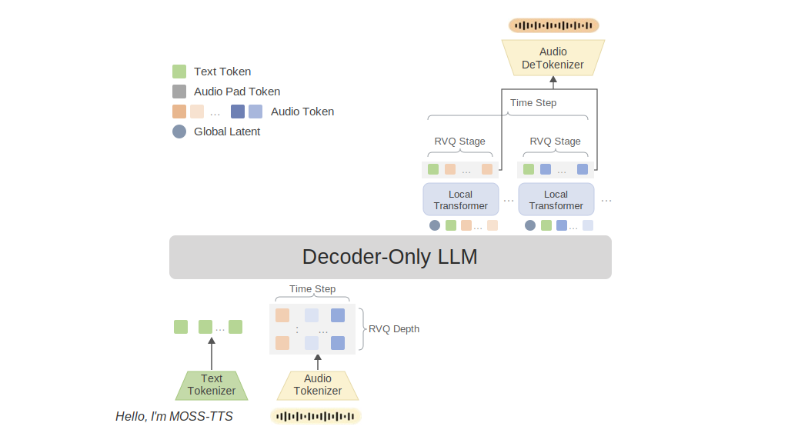
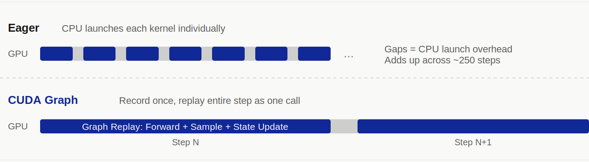

# SGLang-Omni 上的 MOSS-TTS Local Transformer v1.5：服务原生流式 48 kHz 语音

MOSI、OpenMOSS Team 与 SGLang-Omni Team

我们与 [MOSI](https://mosi.cn/) 和 [OpenMOSS Team](https://openmoss.ai/) 一起，在 **SGLang-Omni** 上发布 **MOSS-TTS-Local-Transformer-v1.5** 的端到端 serving 支持。

MOSS-TTS-Local-Transformer-v1.5 是一个开放 TTS 模型，面向 48 kHz 立体声语音、zero-shot voice cloning、长文本合成、多语言生成、时长控制和原生流式输出。Demo script 里调用这个模型很直接。高质量服务化更难：一个请求会经过参考音频编码、Qwen3-4B 自回归 backbone、帧内 12 codebook 采样循环，以及带状态的 codec decoder。

SGLang-Omni 将 MOSS-TTS-Local-Transformer-v1.5 服务为三阶段流水线。本文主要讨论这层映射：阶段边界在哪里，哪些部分需要模型专用 hook，以及模型在负载下运行后暴露出了哪些瓶颈。

## MOSS-TTS-Local-Transformer-v1.5 模型

MOSS-TTS-Local-Transformer-v1.5 是 MOSS-TTS v1.5 系列的第二个旗舰模型。它沿用 Audio Tokenizer + LLM 自回归路线，同时使用更重的音频 codec，以及 Global Transformer + Local Transformer 的生成路径。

它支持 direct TTS、continuation、zero-shot voice cloning、时长控制、`[pause 3.2s]` 这类显式停顿标记，以及最长 10 分钟的长文本生成。模型覆盖 31 种主要语言，训练数据规模约 400 万小时多语言语音。



在音频边界，MOSS 使用 **MOSS-Audio-Tokenizer-v2**，这是一个 encoder 和 decoder 合计约 2B 参数的神经音频 tokenizer。它以 12.5 Hz 运行，支持 0.125 kbps 到 4 kbps 的可变码率压缩，重建 48 kHz 立体声音频，并通过 residual vector quantization (RVQ) 表示语音。

生成核心使用 **Qwen3-4B backbone**。Global transformer 逐帧推进序列。每一帧中，一层 local transformer 先产生 stop/continue 决策，再依次采样 12 个 RVQ codebook；每个采样出的 code 会回填到上下文中，再用于下一个 codebook 的采样。

Serving 可见的 token layout 是 `[T, 13]`：一个文本/控制 channel 和 12 个音频 codebook channel。文本位置在 channel 0 放文本 token，其余 channel 放音频 padding。音频位置在 channel 0 放 slot/control token，并在每个音频 codebook channel 放一个 RVQ code。从这个位置开始，MOSS 的 serving 形态已经偏离普通 next-token 模型：每个生成帧对应一整行 `[1, 13]` 数据，普通 next-token 模型每步只生成一个标量 token。

在公开模型级评测集上：

| Benchmark | WER (lower is better) | SIM (higher is better) |
|---|---:|---:|
| Seed-TTS-Eval | 5.10% | 69.23% |
| CV3-Eval | 7.48% | 61.59% |
| MiniMax Multilingual | 6.37% | 75.31% |
| X Voice | 20.48% | 63.00% |

这些是离线模型指标。后文的 serving benchmark 使用不同评测流水线，应作为端到端系统测量结果来解读。

MOSS-TTS-Local-Transformer-v1.5 在阿里云 PPU-ZW810 集群上以千卡规模训练。本文关注 serving 侧。

## 为什么 MOSS 需要多阶段 Serving Runtime

标准 LLM serving engine 围绕一个重复执行的模型循环构建。MOSS 的单个请求包含三类不同工作：

- **预处理和参考编码。** 文本会被 tokenize，参考音频会被加载，参考 waveform 会被编码成 RVQ code。
- **自回归 TTS engine。** Qwen3 backbone 和 local transformer 生成 `[1, 13]` 的帧行。
- **流式 vocoder。** 生成的 RVQ 行由带状态的 MOSS codec decoder 解码成 waveform chunk。

每个阶段的瓶颈不同。参考编码运行大型神经 codec encoder。自回归生成混合了常规 backbone decode 和一个很小但严格顺序执行的本地 codebook loop。Vocoder 是一个带状态的 decoder，需要在 chunk 之间保留流式状态。系统需要同时管理这三类工作，并控制某个阶段的 batching 或内存行为对其他阶段的影响。这正是 [**SGLang-Omni**](https://github.com/sgl-project/sglang-omni) 适合处理的负载：一个多阶段 generation pipeline，每个 stage 按自己的 compute pattern 调度，stage 之间通过低开销 channel 通信，GPU placement 和 memory budget 由 framework 统一管理。

## 用 SGLang-Omni 服务 MOSS

详细说明可参考 [SGLang-Omni MOSS-TTS-Local cookbook](https://sgl-project.github.io/sglang-omni/cookbook/moss_tts_local.html)。

### 安装并启动服务

```bash
docker pull lmsysorg/sglang-omni:dev
docker run -it --gpus all --shm-size 32g --ipc host --network host --privileged \
  lmsysorg/sglang-omni:dev /bin/zsh

git clone git@github.com:sgl-project/sglang-omni.git
cd sglang-omni
uv venv .venv -p 3.12
source .venv/bin/activate
uv pip install -v -e .

hf download OpenMOSS-Team/MOSS-TTS-Local-Transformer-v1.5

sgl-omni serve \
  --model-path OpenMOSS-Team/MOSS-TTS-Local-Transformer-v1.5 \
  --port 8000
```

SGLang-Omni 将 MOSS-TTS Local Transformer v1.5 服务为三阶段流水线：

```text
preprocessing -> tts_engine -> vocoder
```

**Preprocessing** 阶段解析 OpenAI-compatible request，构建多 channel prompt，并为 voice cloning 编码参考音频。**tts_engine** 阶段运行在 `OmniScheduler` 上，因此 MOSS 可以复用 SGLang 的 request batching 和 KV-cache 机制，同时携带模型专用的 `[T, 13]` 行。**vocoder** 阶段以流的形式消费生成行，并从持久 codec streaming session 返回音频 chunk。

复用的部分是 runtime 形态：stage lifecycle、scheduler interface、inter-stage routing、streaming outputs、process placement 和 stage-level resource accounting。MOSS 专用的部分更小，也更明确：如何构建多 channel prompt，如何运行帧内 codebook loop，以及如何把 MOSS codec 接成 streaming decoder。下一节只关注这些 MOSS 专用瓶颈和优化。

## 端到端优化 MOSS

Pipeline 功能打通后，我们优化 profiling 中暴露出的重复工作和 launch overhead。

| Area | Change | Main Benefit | Source |
|---|---|---|---|
| Model serving baseline | MOSS Local model、pipeline 和 API support | 建立三阶段 serving 路径 | [#728](https://github.com/sgl-project/sglang-omni/pull/728) |
| Reference encoding | Batched encoding、content-addressed LRU cache 和 single-flight deduplication | 避免对复用 speaker 重复运行 codec encoder | [#748](https://github.com/sgl-project/sglang-omni/pull/748), [#778](https://github.com/sgl-project/sglang-omni/pull/778), [#788](https://github.com/sgl-project/sglang-omni/pull/788) |
| AR engine | Decode-state pool、frame CUDA Graph support 和 GPU-native row hash | 让 decode state 保持稳定 GPU 地址，并去掉逐帧 host hashing | [#745](https://github.com/sgl-project/sglang-omni/pull/745) |
| AR engine | Frame launch-state pooling 和 async decode plumbing | 降低 launch 准备开销，并修正 decode-step ownership 问题 | [#759](https://github.com/sgl-project/sglang-omni/pull/759), [#758](https://github.com/sgl-project/sglang-omni/pull/758) |
| AR engine | Compiled seeded sampler | 融合热采样路径，同时保留 per-request deterministic sampling | [#773](https://github.com/sgl-project/sglang-omni/pull/773) |
| Vocoder | Stateful streaming session、stream slots 和 coalesced chunk scheduling | 支持带 request 隔离的帧级音频流式输出 | [#753](https://github.com/sgl-project/sglang-omni/pull/753) |
| Vocoder | Stateful vocoder CUDA Graph | 加速短流式 decode step | [#798](https://github.com/sgl-project/sglang-omni/pull/798) |
| Cross-stage | Explicit colocated memory budgeting | 避免 codec 和 AR 的内存压力互相干扰 | [#810](https://github.com/sgl-project/sglang-omni/pull/810) |

### 参考音频编码

Voice cloning 常常在多个 prompt 中复用同一个 speaker。在 MOSS 中，这一点很关键，因为自回归生成开始前需要先运行大型 codec encoder 进行参考编码。


SGLang-Omni 将 batched reference encoding 与 content-addressed LRU cache 结合。重复参考音频按音频内容作为 key，因此被复制或重命名的文件仍然可以复用同一份编码后的 RVQ 结果。Single-flight 路径会合并同一 speaker 的并发 cache miss，避免 cold-cache burst 启动重复 codec encode。

在 2x H100、concurrency 16 的 SeedTTS English 评测中，将 reference cache 容量从 256 提升到 1024 后，throughput 提升 **32.0%**，mean latency 降低 **24.3%**。内存成本较小，因为编码后的 code tensor 很紧凑；更大的 cache 主要用于避免活跃 speaker working set 被淘汰。

### AR Engine

MOSS AR engine 有两层计算：Qwen3 backbone 和 local transformer 的 frame-decode loop。SGLang-Omni 用 CUDA Graph 捕获两者，但保持两条图路径分开，因为它们的结构和 ownership 不同。



Backbone graph 使用 SGLang 标准 CUDA Graph 路径执行 causal LM decode。MOSS 专用的 frame graph 捕获一个完整帧的 local transformer micro-loop：stop/continue 采样、12 个顺序 codebook projection、codebook feedback，以及用于下一帧的 feedback embedding 组装。这样可以移除这个小而强顺序 loop 中的 launch overhead。

为了支持 graph replay，MOSS 将 per-request decode state 保存在持久 GPU-side pool 中。Feedback embedding、sampling parameter、seed、counter 和 audio history 在各帧之间保持稳定地址。SGLang-Omni 还将 generated-row radix hash 移到 GPU 上，避免逐帧 CPU hash 和 D2H synchronization。

每帧 13 次采样操作使用 seeded GPU sampler。我们只 compile 这条采样路径，不 compile backbone 或 local transformer。在 SeedTTS English、concurrency 16 下，这个窄范围优化在不改变更大模型执行路径的情况下，使 throughput 提升 **12.3%**，mean latency 降低 **11.1%**，mean RTF 降低 **10.5%**。

### Streaming Vocoder

Vocoder 阶段把生成的 RVQ frame 转成音频 chunk。由于 MOSS-Audio-Tokenizer-v2 支持 stateful streaming decode，SGLang-Omni 在 vocoder executor 内保留持久 codec streaming session。

Scheduler 管理 stream slot、offline fallback slot、chunk threshold 和 coalesced decode step。第一个 chunk 可以使用较小 threshold 来降低 time to first audio，后续 chunk 使用更大的 window 提升 throughput。当多个请求都累积了足够 pending frame 时，scheduler 会在一次 codec call 中合并解码。

短流式 chunk 的 launch 占比高，因此 SGLang-Omni 为常见 vocoder frame count 捕获 CUDA Graph。实现中将 codec state buffer 保持在稳定地址，并原地更新，从而允许 graph 在流式 step 之间 replay。

短流式 chunk 上的加速最明显：

| Frames per Step | Eager | CUDA Graph | Speedup |
|---:|---:|---:|---:|
| 4 | 66.3 ms | 30.1 ms | 2.20x |
| 5 | 65.8 ms | 30.7 ms | 2.14x |
| 8 | 65.6 ms | 34.0 ms | 1.93x |
| 13 | 65.4 ms | 40.4 ms | 1.62x |
| 25 | 74.8 ms | 58.3 ms | 1.28x |
| 100 | 222.9 ms | 215.3 ms | 1.04x |

当 frame count 未被捕获或内存紧张时，graph path 会 fallback 到 eager decode。Streaming/non-streaming consistency check 覆盖这条路径。

### 内存预算

在默认 MOSS Local 配置中，preprocessing、自回归生成和 vocoder 执行可以 colocate 在同一张 GPU 上。这个紧凑布局便于部署，但 AR engine 和 codec runtime 的 allocation pattern 不同。SGLang-Omni 因此为 AR engine 提供显式 colocated memory contract，并为 codec runtime allocation 和 streaming state 预留 headroom。

在单卡 colocated configuration、concurrency 8 下，显式 codec memory budgeting 使 throughput 提升 **8.9%**，mean RTF 降低 **8.4%**。更重要的是，它让内存压力下的部署行为更可预测。

## 性能

我们在包含 1088 个 sample 的 SeedTTS English 集上评估优化后的 serving 路径。下表结果来自启用 vocoder CUDA Graph 后的完整 CI evaluation，使用 2x GPU 和 client concurrency 16。ASR scoring 使用 Qwen3-ASR-1.7B，speaker similarity 使用 WavLM-Large finetune。

| Mode | Completed / Failed | Throughput | Audio Throughput | Mean Latency | Mean RTF | WER |
|---|---:|---:|---:|---:|---:|---:|
| Non-streaming | 1088 / 0 | 5.976 req/s | 26.303 audio s/s | 2.669 s | 0.644 | 1.75% |
| Streaming | 1088 / 0 | 2.909 req/s | 12.804 audio s/s | 5.474 s | 1.322 | 2.14% |

Non-streaming 达到 **5.976 req/s**，mean RTF 为 **0.644**。Streaming 会增量输出音频 chunk；在 concurrency 16 下，平均 inter-chunk interval 为 **0.109 s**，每个请求平均输出 **8.82** 个 chunk。Streaming throughput 更低是符合预期的：vocoder 会以更小 chunk 更频繁运行，并与 AR engine 共享 GPU 时间。

同一次 CI run 中，质量指标在两种模式之间保持接近：non-streaming WER 为 **1.75%**，streaming WER 为 **2.14%**。Streaming/non-streaming artifact consistency check 也通过。

各个单项优化测量不应直接累加成一个 headline number，因为它们采集自不同硬件和并发设置。它们更适合作为 MOSS 时间开销分布的地图：reference cache 去除重复 encoder 工作，frame CUDA Graph 去除 local-loop launch overhead，sampler compilation 优化热采样路径，vocoder CUDA Graph 加速短流式 chunk，memory budgeting 稳定 colocated deployment。

## Roadmap

当前路径已经端到端可用，仍有几部分值得继续优化：

**Pool-native frame CUDA Graph.** 当前 frame-decode graph 已经使用持久 state pool，但 sampling parameters 和 generated rows 周围仍有一些 staging。更原生的 pool-to-pool graph path 可以简化 launch/resolve 边界。

**Adaptive streaming scheduling.** Streaming TTS 有真实的 latency-throughput trade-off。我们正在探索 load-aware chunk sizing、priority-aware slot scheduling 和更好的 coalescing policy，让低负载请求获得更快 first audio，让高负载部署恢复更多 throughput。

**Broader compilation coverage.** Codec encoder 和 Qwen3 backbone 仍有 targeted compilation experiment 的空间。我们会保持较窄的 compile scope，以避免 cold-start regression 和 output change。

**Wider benchmark coverage.** 当前测量聚焦 CI 中的 SeedTTS English。后续计划扩展到中文、多语言评测、长文本生成、多 speaker pool、不同 reference length 和更接近生产的 traffic mix。

## 加入我们

如果你对 TTS、omni model、streaming inference、CUDA Graph、scheduling、communication、model onboarding、benchmarking 或 production serving 感兴趣，欢迎贡献和讨论。

## 致谢

**SGLang-Omni** - **Jiaxin Deng**, Haoguang Cai, Shangming Cai, Yuhao Chen, Kangxiang Shao, Hao Jin, Yifei Gao, Jingwen Gu, Zhihao Guo, Chenchen Hong, Xinli Jing, Xiangrui Ke, Estella Liu, Xinyu Lu, Ratish Palanisamy, Mick Qian, Yijiang Tian, Zijie Xia, Xuesong Ye, Yue Yin, Gaokai Zhang, Xiaoyu Zhang, Chenyang Zhao, **Yichi Zhang**.

**MOSS-TTS Local Transformer v1.5** - Yitian Gong, Kuangwei Chen, Zhicheng Zhang, Botian Jiang, Yiyang Zhang, Kang Yu, Yang Gao, Xiaogui Yang, Qinyuan Chen, Zhaoye Fei, Shimin Li, Xipeng Qiu.

## 更多资料

- **Model:** [OpenMOSS-Team/MOSS-TTS-Local-Transformer-v1.5](https://huggingface.co/OpenMOSS-Team/MOSS-TTS-Local-Transformer-v1.5)
- **Serving framework:** [SGLang-Omni on GitHub](https://github.com/sgl-project/sglang-omni)
- **Documentation:** [SGLang-Omni docs](https://sgl-project.github.io/sglang-omni/)
- **MOSS-TTS-Local cookbook:** [MOSS-TTS-Local in SGLang-Omni](https://sgl-project.github.io/sglang-omni/cookbook/moss_tts_local.html)
- **MOSS optimization roadmap:** [#637](https://github.com/sgl-project/sglang-omni/issues/637)
- **Design background:** [SGLang-Omni: Redesigning the Inference Framework for Multi-Stage Generative Models](https://github.com/zhaochenyang20/Awesome-ML-SYS-Tutorial/blob/main/sglang/sglang-omni/why-sglang-omni-en.md)
