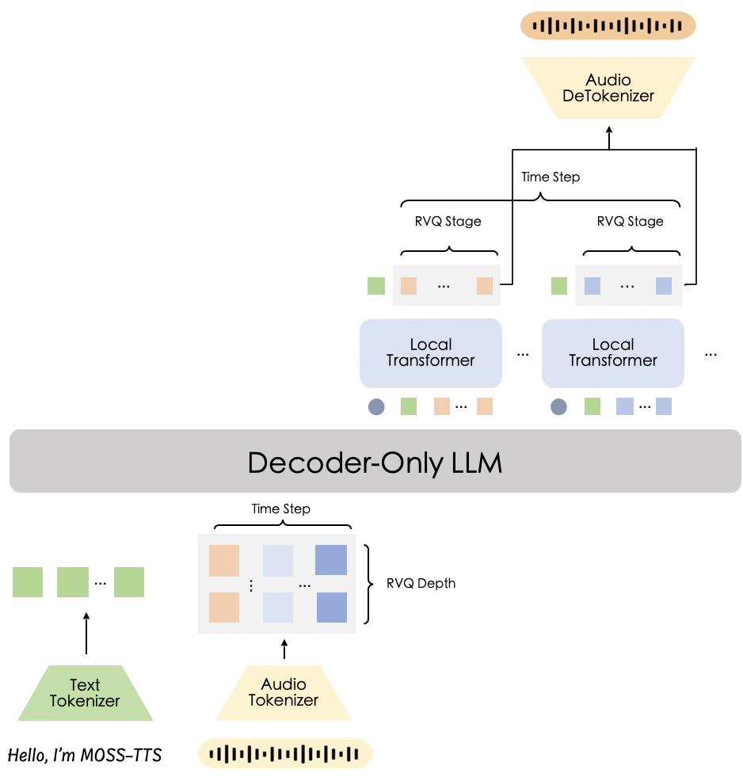
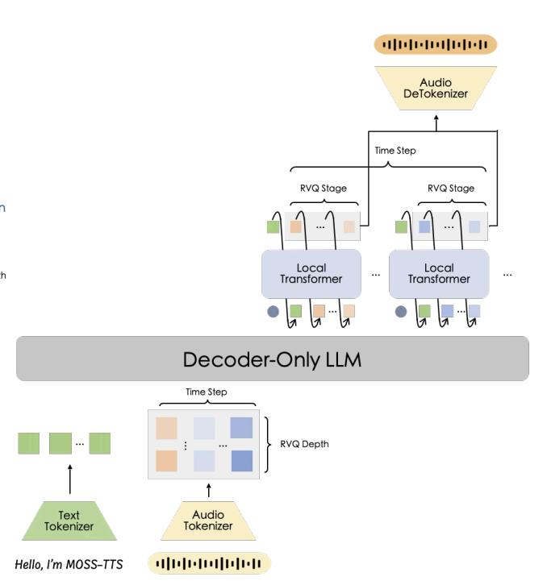
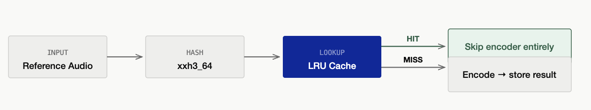
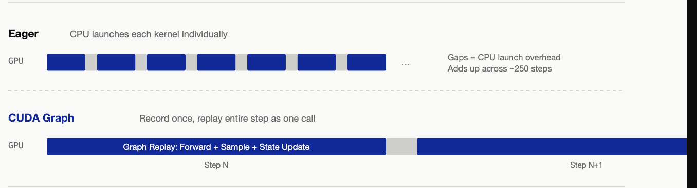

# MOSS-TTS Local Transformer v1.5 on SGLang-Omni: Streaming 48 kHz Speech and Voice Cloning

OpenMOSS Team, MOSI.AI & SGLang-Omni Team

Today we are announcing end-to-end serving for **MOSS-TTS Local Transformer v1.5** on **SGLang-Omni**, in collaboration with MOSI.AI, the OpenMOSS team, and the SGLang-Omni team. MOSS-TTS Local Transformer v1.5 is an open text-to-speech model for 48 kHz stereo generation, zero-shot voice cloning, multilingual speech, long-form synthesis, duration control, and native streaming.

For SGLang-Omni, serving MOSS is another example of why modern TTS systems no longer fit cleanly into a single autoregressive decode loop. A request moves through reference-audio encoding, multi-channel autoregressive frame generation, local codebook sampling, and a stateful streaming vocoder. Each stage has different batching, memory, and latency behavior, so we serve MOSS as a multi-stage pipeline rather than as a modified LLM endpoint.

## Meet MOSS-TTS Local Transformer v1.5

MOSS-TTS Local Transformer v1.5 is the second flagship model in the MOSS-TTS v1.5 family. It continues the Audio Tokenizer + LLM autoregressive paradigm, with upgrades to the audio codec, backbone architecture, training scale, and streaming generation path.

The model is built for speech generation where speaker identity, acoustic detail, and long-form stability matter. It supports direct text-to-speech generation, voice cloning from a short reference clip, continuation, duration control, explicit pause control such as `[pause 3.2s]`, and long-form generation up to 10 minutes. It covers 31 major world languages and was trained on roughly 4 million hours of multilingual speech data.



At the audio interface, MOSS-TTS Local Transformer v1.5 uses **MOSS-Audio-Tokenizer-v2**, a neural audio tokenizer with an encoder and decoder totaling about 2B parameters. The tokenizer runs at a 12.5 Hz frame rate, supports variable bitrate compression from 0.125 kbps to 4 kbps, reconstructs 48 kHz stereo audio, and represents speech with residual vector quantization (RVQ).

At the generation core, the model uses a **Qwen3-4B backbone** with a **Global Transformer + Local Transformer** architecture. The global transformer models text semantics, multilingual context, speaker identity, and prosody from the prompt and reference audio. The local transformer then expands each global frame into acoustic codes.

Each sequence position is a multi-channel row rather than a scalar token. The MOSS Local layout is `[T, 13]`: one text/control channel and 12 audio codebook channels. Text positions carry a text token in channel 0 and audio padding in the remaining channels. Audio-frame positions carry a slot/control token in channel 0 and one RVQ code from each of the 12 audio codebooks. This representation gives the model a unified autoregressive stream over text and audio, but it also makes serving more involved than standard next-token generation.

## Multilingual and Voice-Cloning Quality

On public evaluation sets, MOSS-TTS Local Transformer v1.5 achieves strong multilingual and voice-cloning quality:

| Benchmark | WER (lower is better) | SIM (higher is better) |
|---|---:|---:|
| Seed-TTS-Eval | 5.10% | 69.23% |
| CV3-Eval | 7.48% | 61.59% |
| MiniMax Multilingual | 6.37% | 75.31% |
| X Voice | 20.48% | 63.00% |

These are model-level offline evaluation results. The serving benchmarks later in this post use a different evaluation pipeline and should be read as end-to-end system measurements.

MOSS-TTS Local Transformer v1.5 was trained at thousand-card scale on Alibaba Cloud's PPU-ZW810 cluster. This post focuses on the serving work: how the model is mapped onto SGLang-Omni, which bottlenecks show up in the runtime, and what the current end-to-end performance looks like.

## Serving MOSS with SGLang-Omni

MOSS is served and optimized on SGLang-Omni. Unlike a standard LLM, its end-to-end path contains several heterogeneous stages: a codec encoder for reference audio, an autoregressive TTS engine for multi-channel frame rows, and a streaming vocoder that consumes generated RVQ rows and returns waveform chunks.

SGLang-Omni serves MOSS-TTS Local Transformer v1.5 as a three-stage pipeline:

```text
preprocessing -> tts_engine -> vocoder
```



The **preprocessing** stage parses the OpenAI-compatible speech request, prepares the multi-channel prompt, and encodes reference audio when voice cloning is used. The **tts_engine** stage is backed by `OmniScheduler`, preserving SGLang's continuous batching, KV cache management, RadixAttention, and CUDA Graph support while adapting the request format to MOSS's `[T, 13]` rows. The **vocoder** stage consumes generated rows as a stream and returns audio chunks from a persistent codec streaming session.

This stage boundary is useful because the bottlenecks are different. Reference encoding is a neural codec encoder. AR generation has a Qwen3 backbone plus a frame-local loop with 12 sequential codebook samples. The vocoder is a stateful decoder that must preserve streaming state across chunks. Keeping them as separate stages lets the runtime batch, cache, stream, and budget memory where each decision belongs.

For users, this is exposed through `/v1/audio/speech`, with support for synthesis, voice cloning, streaming PCM, duration control, pause markup, language hints, style instructions, seeds, and sampling parameters.

## Reusing Omni-Specific Optimizations

MOSS uses the same stage abstraction as other SGLang-Omni TTS and omni models. The model-specific work is in the prompt format, local codebook generation, codec integration, and sampling path; the runtime still handles routing, scheduling, streaming, placement, and stage-level resource isolation.

Several optimizations also follow patterns that are becoming common across SGLang-Omni:

**CUDA-Graph-friendly feedback runners.** The MOSS `tts_engine` has a repeated AR + multi-codebook feedback loop. The runtime keeps per-request state at stable GPU addresses so graph replay can cover both backbone decode and frame-local decoding.

**Streaming vocoder scheduling.** MOSS, Higgs, Qwen3-Omni, Fish Audio S2-Pro, and related models all need a similar audio lifecycle: initialize per-request state, accumulate incoming code chunks, emit audio as soon as enough context is available, flush on stream completion, and return a final payload to the client.

**Stage-level memory budgeting.** In colocated deployments, the AR engine and codec runtime share the same GPU. SGLang-Omni gives each GPU-backed stage an explicit memory contract so one stage does not silently consume memory needed by another.

## A Growing Multi-Stage Model Ecosystem

MOSS now joins the TTS and omni models already supported by SGLang-Omni:

| Model | Type | Notes |
|---|---|---|
| Higgs Audio v3 TTS | TTS | Voice cloning, streaming, 100 languages |
| Fish Audio S2-Pro | TTS | Voice cloning, streaming |
| Voxtral TTS | TTS | Named voices, streaming, 9 languages |
| Qwen3-TTS | TTS | Voice cloning, streaming, 10 languages |
| MOSS-TTS | TTS | 48 kHz stereo, voice cloning, streaming, 31 languages |
| Qwen3-Omni | Omni | Text/image/audio/video to text + audio |
| Ming-Omni | Omni | Streaming TTS |
| LLaDA2.0-Uni | Multimodal | Text + image understanding and generation |

These models differ in architecture and user-facing behavior, but they share the same serving problem: multiple heterogeneous stages need to be organized into one stable generation pipeline. Onboarding MOSS was therefore mostly about declaring the pipeline, adapting the request and decode path to MOSS's multi-channel rows, and adding model-specific hooks where the model actually needs them.

## Optimizing MOSS End-to-End

[TODO: Yichi xinyu please help to review this part]

Beyond the basic pipeline, we optimized the MOSS serving path end to end. The main pieces are:

**Preprocessing.** Batched reference encoding, content-addressed LRU caching, and single-flight handling for repeated speaker references.

**AR engine.** CUDA Graph capture for the Qwen3 backbone and the MOSS frame-decode loop, plus persistent GPU-side decode state for graph replay.

**Caching.** A GPU-native Radix row hash for generated multi-channel rows, avoiding per-frame CPU hashing and device-to-host synchronization.

**Sampling.** A compiled seeded sampler for the repeated per-frame text/control and audio-codebook sampling path.

**Vocoder.** Stateful streaming sessions, stream-slot management, coalesced decode steps, and CUDA Graph replay for short streaming chunks.

**Memory.** Explicit colocated memory budgeting so AR generation and codec runtime allocations do not compete unpredictably on one GPU.

### Reference Audio Encoding

Voice cloning workloads often reuse the same speakers across many prompts. In early serving runs, repeated references still paid the codec encoder cost when the file path changed, or when several concurrent requests missed the cache for the same speaker at the same time.



SGLang-Omni combines batched reference encoding with a content-addressed LRU cache. Concurrent references can be encoded together, and repeated references are keyed by audio content rather than by path, so copied or renamed files still reuse the same encoded RVQ result. A single-flight path also merges concurrent misses for the same speaker, preventing a cold-cache burst from launching duplicate codec encodes.

In SeedTTS English evaluation on 2x H100 at concurrency 16, increasing the reference cache capacity from 256 to 1024 entries improved throughput by **32.0%** and reduced mean latency by **24.3%**. The memory cost is modest because encoded code tensors are compact; the larger cache mainly prevents eviction of the active speaker working set.

### AR Engine

The MOSS AR engine has two levels of computation: the Qwen3 backbone and the local transformer frame-decode loop. SGLang-Omni captures both with CUDA Graphs, but keeps them separate because they have different structure and ownership.



The backbone graph uses SGLang's standard CUDA Graph path for causal LM decode. The MOSS-specific frame graph captures the local transformer micro-loop for a full frame, including stop/continue sampling, 12 sequential codebook projections, codebook feedback, and feedback embedding assembly for the next frame. This removes launch overhead from a small but highly sequential loop.

To make graph replay possible, MOSS keeps per-request decode state in a persistent GPU-side pool. Feedback embeddings, sampling parameters, seeds, counters, and audio history live at stable addresses across frames. SGLang-Omni also moves the generated-row radix hash to the GPU, avoiding a per-frame CPU hash and device-to-host synchronization.

The compile scope is intentionally narrow. Instead of compiling the full backbone or local transformer path, MOSS compiles the repeated seeded sampling path that runs for each frame. On SeedTTS English evaluation at concurrency 16, the compiled seeded sampler improved throughput by **12.3%**, reduced mean latency by **11.1%**, and reduced mean RTF by **10.5%**.

### Streaming Vocoder

The vocoder stage turns generated RVQ frames into audio chunks. Because MOSS-Audio-Tokenizer-v2 supports stateful streaming decode, SGLang-Omni keeps a persistent codec streaming session inside the vocoder executor.

The scheduler manages stream slots, an offline fallback slot, chunk thresholds, and coalesced decode steps. The first chunk can use a smaller threshold to reduce time to first audio, while later chunks can use larger windows to improve throughput. When several requests have enough pending frames, the scheduler decodes them together in one codec call.

Short streaming chunks are launch-bound rather than compute-bound: on each scheduler tick the codec decodes only a handful of frames, so the per-step cost is dominated by kernel launch overhead. SGLang-Omni captures the stateful codec decode for the common streaming frame counts into CUDA Graphs and replays them, collapsing that launch storm into a single replay. The win is largest at the smallest steps and fades as the step grows compute-bound:

| Frames per Step | Eager | CUDA Graph | Speedup |
|---:|---:|---:|---:|
| 4 | 66.3 ms | 30.1 ms | 2.20x |
| 5 | 65.8 ms | 30.7 ms | 2.14x |
| 8 | 65.6 ms | 34.0 ms | 1.93x |
| 13 | 65.4 ms | 40.4 ms | 1.62x |
| 25 | 74.8 ms | 58.3 ms | 1.28x |
| 100 | 222.9 ms | 215.3 ms | 1.04x |

Replay is bit-identical to eager decode, with zero max delta across all captured frame counts, because the streaming state buffers stay at fixed addresses and are updated in place. End to end, at concurrency 8 on a single colocated card, the graph cut the vocoder decode span by about **40%** and request latency by about **22%**; the end-to-end number is smaller because the vocoder is one stage of several. The path is default-on with a safe fallback to eager when a frame count is not captured or VRAM is tight, and the absolute times above are box-sensitive, so the speedup ratios travel better than the raw numbers.

### Memory Budgeting

Compact deployment is important for users who want the shortest path from model download to serving. In the default MOSS Local config, preprocessing, AR generation, and vocoder execution can be colocated on one GPU. SGLang-Omni therefore gives the AR engine an explicit colocated memory contract and reserves headroom for codec runtime allocations and streaming state.

In a single-card colocated configuration at concurrency 8, explicit codec memory budgeting improved throughput by **8.9%** and reduced mean RTF by **8.4%**. More importantly, it makes deployment behavior more predictable under memory pressure.

## Try It Yourself

Detailed instructions are available in the [SGLang-Omni MOSS-TTS-Local cookbook](https://sgl-project.github.io/sglang-omni/cookbook/moss_tts_local.html). The commands below show the shortest path from a clean container to a working speech endpoint.

### Install and Serve

```bash
docker pull lmsysorg/sglang-omni:dev
docker run -it --gpus all --shm-size 32g --ipc host --network host --privileged \
  lmsysorg/sglang-omni:dev /bin/zsh

git clone git@github.com:sgl-project/sglang-omni.git
cd sglang-omni
uv venv .venv -p 3.12
source .venv/bin/activate
uv pip install -v -e .

hf download OpenMOSS-Team/MOSS-TTS-Local-Transformer-v1.5

sgl-omni serve \
  --model-path OpenMOSS-Team/MOSS-TTS-Local-Transformer-v1.5 \
  --port 8000
```

The default server layout colocates the AR backbone and codec/vocoder on one GPU. A matching explicit config is also available at `examples/configs/moss_tts_local.yaml` for users who want to inspect or customize the pipeline topology.

### Zero-Shot Synthesis

MOSS-TTS Local can synthesize speech without a reference clip. The response is a WAV file by default:

```bash
curl -X POST http://localhost:8000/v1/audio/speech \
  -H "Content-Type: application/json" \
  -d '{"input": "SGLang-Omni is a great project for high-fidelity speech generation."}' \
  --output output.wav
```

### Voice Cloning

For voice cloning, provide a reference audio clip and its transcript. The `references` field accepts `audio_path` as a local path readable by the server, an HTTP(S) URL, or a base64 data URI. Supplying the transcript usually improves speaker similarity:

```bash
curl -X POST http://localhost:8000/v1/audio/speech \
  -H "Content-Type: application/json" \
  -d '{
    "input": "Get the trust fund to the bank early.",
    "references": [{
      "audio_path": "https://huggingface.co/datasets/zhaochenyang20/seed-tts-eval-mini/resolve/main/en/prompt-wavs/common_voice_en_10119832.wav",
      "text": "We asked over twenty different people, and they all said it was his."
    }]
  }' \
  --output output.wav
```

The shorthand fields `ref_audio` and `ref_text` are also accepted.

#### Python

```python
import requests

response = requests.post(
    "http://localhost:8000/v1/audio/speech",
    json={
        "input": "Get the trust fund to the bank early.",
        "ref_audio": "https://huggingface.co/datasets/zhaochenyang20/seed-tts-eval-mini/resolve/main/en/prompt-wavs/common_voice_en_10119832.wav",
        "ref_text": "We asked over twenty different people, and they all said it was his.",
    },
)
response.raise_for_status()

with open("output.wav", "wb") as output_file:
    output_file.write(response.content)
```

### Reference Audio Sources

Reference audio can be sent as a local file path, a URL, or an inline base64 data URI. Data URIs are useful when the client owns the audio bytes and does not want to expose a separate file server:

```python
import base64

import requests

reference_url = "https://huggingface.co/datasets/zhaochenyang20/seed-tts-eval-mini/resolve/main/en/prompt-wavs/common_voice_en_10119832.wav"
reference_response = requests.get(reference_url)
reference_response.raise_for_status()

reference_audio = (
    "data:audio/wav;base64,"
    + base64.b64encode(reference_response.content).decode("ascii")
)

response = requests.post(
    "http://localhost:8000/v1/audio/speech",
    json={
        "input": "SGLang-Omni is a great project!",
        "ref_audio": reference_audio,
        "ref_text": "We asked over twenty different people, and they all said it was his.",
    },
)
response.raise_for_status()

with open("output_data_uri.wav", "wb") as output_file:
    output_file.write(response.content)
```

The server caches and coalesces reference encodes. Reusing the same reference clip can skip codec re-encoding, which is especially useful for fixed speaker pools.

### Streaming

Set `"stream": true`, `"response_format": "pcm"`, and `"stream_format": "audio"` to receive raw 48 kHz mono PCM chunks as they are produced. Pipe the stream through `ffmpeg` when you want a playable WAV file:

```bash
curl -N -X POST http://localhost:8000/v1/audio/speech \
  -H "Content-Type: application/json" \
  -d '{
    "input": "Get the trust fund to the bank early.",
    "ref_audio": "https://huggingface.co/datasets/zhaochenyang20/seed-tts-eval-mini/resolve/main/en/prompt-wavs/common_voice_en_10119832.wav",
    "ref_text": "We asked over twenty different people, and they all said it was his.",
    "stream": true,
    "response_format": "pcm",
    "stream_format": "audio"
  }' \
  | ffmpeg -f s16le -ar 48000 -ac 1 -i pipe:0 output_stream.wav
```

### Duration Control

MOSS-TTS Local can condition on a target duration token count. The count is measured in codec frames; a larger count usually yields longer audio. You can set it with an inline `${token:N}` prefix or with the `token_count` field:

```bash
curl -X POST http://localhost:8000/v1/audio/speech \
  -H "Content-Type: application/json" \
  -d '{
    "input": "${token:150}A sentence with an explicit duration target.",
    "ref_audio": "https://huggingface.co/datasets/zhaochenyang20/seed-tts-eval-mini/resolve/main/en/prompt-wavs/common_voice_en_10119832.wav",
    "ref_text": "We asked over twenty different people, and they all said it was his."
  }' \
  --output output_duration_tokens.wav
```

The duration token count is a control hint rather than an exact wall-clock duration. It is useful for making generated clips shorter or longer while preserving the model's natural pacing.

### Pronunciation, Style, and Language Hints

Inline markup that the model understands is passed through unchanged. This includes pause markers such as `[pause 0.5s]`, as well as pronunciation controls such as Pinyin and IPA. The optional `language` field guides multilingual generation, and `instructions` carries a free-text style directive:

```bash
curl -X POST http://localhost:8000/v1/audio/speech \
  -H "Content-Type: application/json" \
  -d '{
    "input": "Today we are serving MOSS-TTS Local Transformer v1.5 on SGLang-Omni. [pause 0.5s] The model supports high-fidelity native streaming speech.",
    "ref_audio": "https://huggingface.co/datasets/zhaochenyang20/seed-tts-eval-mini/resolve/main/en/prompt-wavs/common_voice_en_10119832.wav",
    "ref_text": "We asked over twenty different people, and they all said it was his.",
    "language": "English",
    "instructions": "Use a natural conversational style."
  }' \
  --output output_markup.wav
```

### Generation Parameters

MOSS-TTS Local exposes the usual speech-generation controls through the OpenAI-compatible request body:

| Parameter | Notes |
|---|---|
| `input` | Text to synthesize; may include a `${token:N}` duration prefix and inline markup |
| `references` | Reference clips for cloning; each item has `audio_path` and `text` |
| `ref_audio` / `ref_text` | Shorthand for `references[0].audio_path` and `references[0].text` |
| `stream` | Set to `true` for streaming output |
| `response_format` | Use `pcm` with streaming raw chunks |
| `stream_format` | Set to `audio` when piping raw PCM bytes directly into an audio decoder |
| `language` | Optional target-language hint |
| `instructions` | Optional free-text style directive |
| `token_count` / `duration_tokens` | Target duration in codec frames |
| `max_new_tokens` | Maximum generated frames |
| `temperature`, `top_p`, `top_k` | Sampling controls; single values apply to both text and audio channels |
| `repetition_penalty` | Audio repetition penalty |
| `seed` | Non-negative integer for reproducible sampling on a fixed server configuration |

The model has separate text-channel and audio-channel sampling defaults. A single `temperature`, `top_p`, or `top_k` applies to both; channel-specific fields can be used when more control is needed.

## Benchmarking and Performance

**Non-streaming:**

| Concurrency | Throughput (qps) | RTF | Latency mean (s) |
|---:|---:|---:|---:|
| 2  | 2.974 | 0.157 | 0.676 |
| 4  | 4.870 | 0.192 | 0.821 |
| 8  | 6.111 | 0.310 | 1.306 |
| 16 | 6.144 | 0.623 | 2.593 |

**Streaming:**

| Concurrency | Throughput (qps) | RTF | Latency mean (s) | TTFP (ms) |
|---:|---:|---:|---:|---:|
| 2  | 2.256 | 0.206 | 0.888 | 261 |
| 4  | 2.649 | 0.356 | 1.509 | 726 |
| 8  | 2.633 | 0.726 | 3.033 | 2239 |
| 16 | 2.635 | 1.458 | 6.045 | 5227 |

To reproduce the serving benchmarks, start the server and run the benchmark client:

**1. Start the server:**

```bash
sgl-omni serve \
  --model-path OpenMOSS-Team/MOSS-TTS-Local-Transformer-v1.5 \
  --port 8000
```

**2. Run the benchmark** (against the running server):

```bash
# Non-streaming, concurrency 16
python -m benchmarks.eval.benchmark_tts_seedtts \
  --use-existing-server --generate-only \
  --base-url http://localhost:8000 \
  --model OpenMOSS-Team/MOSS-TTS-Local-Transformer-v1.5 \
  --ref-format references --lang en --token-count auto \
  --max-concurrency 16 \
  --output-dir results/moss_perf_nostream_c16

# Streaming, concurrency 16
python -m benchmarks.eval.benchmark_tts_seedtts \
  --use-existing-server --generate-only \
  --base-url http://localhost:8000 \
  --model OpenMOSS-Team/MOSS-TTS-Local-Transformer-v1.5 \
  --ref-format references --lang en --token-count auto \
  --max-concurrency 16 \
  --output-dir results/moss_perf_stream_c16 \
  --stream
```

## Roadmap

Serving MOSS end to end is an important step for SGLang-Omni, but there is still follow-up work on the serving path:

**Pool-native frame CUDA Graph.** The current frame-decode graph already uses persistent state pools, but some staging remains around sampling parameters and generated rows, and some sampling configurations still fall back to eager: setting `audio_repetition_penalty` above 1.0 forces the batch onto the eager path because that penalty is not yet captured in the graph. A more native pool-to-pool graph path can reduce device-side staging and extend graph coverage to more sampling configurations.

**Adaptive streaming scheduling.** Streaming TTS has a real latency-throughput trade-off. The next step is load-aware chunk sizing, priority-aware slot scheduling, and better coalescing, so low-load requests can receive fast first audio while high-load deployments recover more throughput.

**Wider compilation and graph coverage.** Several parts of the model zoo still run eager. We want to extend CUDA Graph and targeted compilation to more of them, including the MOSS codec encoder and backbone where the cold-start cost can be justified, and models such as LLaDA2.0-Uni that currently rely on eager execution.

**Reusable optimization templates across models.** The patterns behind these gains, launch-collapse via CUDA Graphs, batched and compiled hot paths, and cutting per-step CPU work and device-to-host synchronization, are not MOSS-specific. Profiling other TTS paths points to per-step CPU overhead and repeated host-device syncs as the next bottleneck to attack, and we are factoring these optimizations into shared templates so models such as Higgs can adopt them directly instead of re-deriving each one.

**Wider benchmark coverage.** Current measurements focus on SeedTTS English in CI. We plan to cover Chinese and multilingual evaluation, long-form generation, multiple speaker pools, varied reference lengths, additional quality metrics beyond WER and similarity, multi-GPU placement, and production-like traffic mixes.

**Broader model and modality coverage.** SGLang-Omni already serves the TTS and omni models listed above, and the next models on this path are on the image-generation side, including BAGEL, SenseNova, and Janus-Pro, extending the framework from speech and understanding into multimodal generation. Onboarding each one should be mostly stages, topology, memory contracts, and model-specific hooks, with a round of framework abstraction so that work keeps getting cheaper, and with productionization (playground, cookbook, and docs) for each model. The same path also covers ASR and audio understanding. Looking further out, we want the stage abstraction to reach across hardware backends beyond a single vendor.

## Join Us

SGLang-Omni is still moving quickly. We want it to become a general inference foundation for multi-stage generative models: new models should not need a serving stack from scratch, nor special-case logic scattered across a dozen files. They should be expressible as clear stages, topology declarations, and model-specific hooks, with scheduling, communication, memory management, and streaming handled by the framework.

If you are interested in TTS, omni models, streaming inference, CUDA Graphs, scheduling, communication, model onboarding, benchmarking, or production serving, we would love to work with you. Contributions, issues, discussions, and new model integrations are welcome.

## Acknowledgments

【Yichi：Please help to change】

**SGLang-Omni** - Haoguang Cai, Shangming Cai, Qiujiang Chen, Yuhao Chen, Jiaxin Deng, Wenyao Gao, Yifei Gao, Jingwen Gu, Yitong Guan, Zhihao Guo, Chenchen Hong, Hao Jin, Xinli Jing, Xiangrui Ke, Shenggui Li, Junrong Lin, Estella Liu, Xinyu Lu, Yuan Luo, Ratish Palanisamy, Mick Qian, JinTao Qu, Shuai Shi, Yijiang Tian, Chao Wang, Richard Wang, Shuwen Wang, Zijie Xia, Yuhao Yang, Xuesong Ye, Fan Yin, Yue Yin, Gaokai Zhang, Xiaoyu Zhang, Yichi Zhang, Chenyang Zhao.

**MOSS-TTS Local Transformer v1.5** - Yitian Gong, Kuangwei Chen, Zhicheng Zhang, Botian Jiang, Yiyang Zhang, Kang Yu, Yang Gao, Xiaogui Yang, Qinyuan Chen, Zhaoye Fei, Shimin Li, Xipeng Qiu.

## Learn More

- **Model:** [OpenMOSS-Team/MOSS-TTS-Local-Transformer-v1.5](https://huggingface.co/OpenMOSS-Team/MOSS-TTS-Local-Transformer-v1.5)
- **Serving framework:** [SGLang-Omni on GitHub](https://github.com/sgl-project/sglang-omni)
- **Documentation:** [SGLang-Omni docs](https://sgl-project.github.io/sglang-omni/)
- **MOSS-TTS Local cookbook:** [MOSS-TTS Local in SGLang-Omni](https://sgl-project.github.io/sglang-omni/cookbook/moss_tts_local.html)
- **MOSS optimization roadmap:** [#637](https://github.com/sgl-project/sglang-omni/issues/637)
- **Design background:** [SGLang-Omni: Redesigning the Inference Framework for Multi-Stage Generative Models](https://github.com/zhaochenyang20/Awesome-ML-SYS-Tutorial/blob/main/sglang/sglang-omni/why-sglang-omni-en.md)
