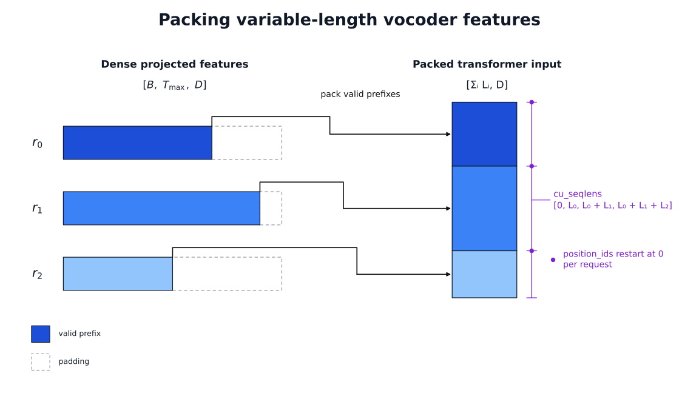
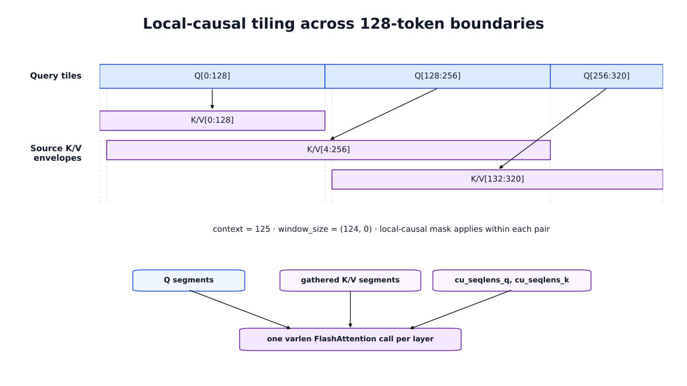
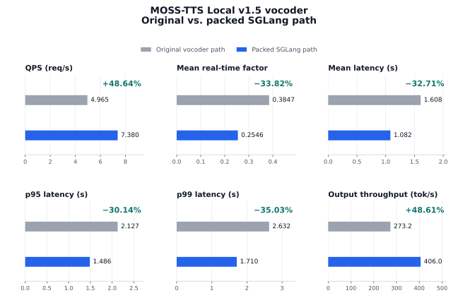

# How We Removed MOSS-TTS Local v1.5’s Transformer Vocoder Bottleneck in SGLang Omni

Once an autoregressive model has generated the audio codes, it is easy to assume that the expensive part of text-to-speech inference is over. That assumption did not hold for MOSS-TTS Local v1.5. Its audio tokenizer uses a large transformer decoder as the vocoder, so a non-streaming request still has substantial work left before those codes become a waveform.

When we profiled the non-streaming path in SGLang Omni, this final decoder had become the largest bottleneck. This article explains how the model's architecture creates that cost, why changing the attention backend alone was not enough, and how I adapted the vocoder's variable-length, local-causal attention to SGLang's packed execution path.

## What We Were Optimizing

MOSS-TTS Local v1.5 is a local text-to-speech model for native 48 kHz stereo generation, zero-shot voice cloning, synthesis across 31 languages, long-form generation, duration control, and explicit pauses. The source of its vocoder cost becomes clearer when a request is followed through all three stages of the pipeline.

A single request passes through three stages in SGLang Omni:

1. **Reference encoding.** Text is tokenized, and optional reference audio is converted into discrete residual-vector-quantization codes by MOSS-Audio-Tokenizer-v2. Those codes provide the voice-conditioning information for cloning.
2. **Autoregressive generation.** A 36-layer Qwen3-4B backbone processes the request one audio frame at a time. A one-layer local transformer then makes the continue/stop decision and samples 12 audio codebooks sequentially.
3. **Vocoder decoding.** The generated codec codes are converted into waveform audio by the decoder half of MOSS-Audio-Tokenizer-v2.

The autoregressive stage exposes its generated data as a `[T, 13]` representation. `T` is the number of audio frames. Each row contains one control channel and 12 residual-vector-quantization audio codes.

That distinction matters: a generated row is a complete audio frame, not one ordinary language-model token. The autoregressive engine produces a sequence of codec frames, but those frames are still compressed audio representations. The vocoder must process the complete sequence and reconstruct the final stereo waveform.

For non-streaming generation, the request is therefore not finished when autoregressive decoding stops. The full codec-decoder computation still runs afterward.

## What We Had Already Optimized

Before focusing on the non-streaming vocoder, we had already optimized the other parts of the pipeline.

Reference encoding gained batching and content-addressed caching, so repeated reference voices could avoid rerunning the roughly billion-parameter audio encoder. The autoregressive engine adopted SGLang scheduling and CUDA Graphs, which replay a captured sequence of GPU operations for repeated decode steps. Persistent GPU-side state reduced per-frame bookkeeping, while a GPU-side radix-hash lookup removed one synchronization point between the GPU and CPU.

The decode loop then gained one-step lookahead: the next GPU decode step could be launched while the host resolved the previous step. Frame-launch state was pooled to avoid rebuilding active-row state in Python, and the seeded tensor sampler was compiled within the CUDA Graph capture boundary. These changes cleaned up the repeated decode path without making a cumulative performance claim.

The streaming path followed a different optimization route. A persistent codec session allowed audio to be emitted incrementally, and CUDA Graphs accelerated the many small streaming decoder calls. Cross-stage memory budgeting then reserved enough GPU capacity for the codec instead of treating the autoregressive engine as the only resident model.

By the time we profiled the non-streaming path again, the obvious preprocessing and autoregressive hot paths were no longer naive. That made it possible for another stage to become dominant.

## Why MOSS's Vocoder Was Different

A common TTS serving assumption is that the autoregressive language-model backbone does most of the expensive work and that the final vocoder is a relatively light decoder.

That assumption fits Boson AI's Higgs Audio v3 TTS more closely. Like MOSS-TTS Local v1.5, Higgs Audio v3 uses a Qwen3-scale autoregressive backbone to generate audio codec tokens. Its waveform decoder, however, is a DAC-based convolutional network rather than another large standalone transformer model. MOSS deploys the decoder half of MOSS-Audio-Tokenizer-v2 as a separate, roughly billion-parameter model built from causal transformers with sliding-window attention.

That changes the optimization surface. The Higgs decoder is organized around convolution and upsampling; there is no transformer attention path to pack. In MOSS, waveform reconstruction itself contains deep local-attention stacks, so sequence layout, padding, and attention-kernel semantics directly affect vocoder performance.

The MOSS vocoder is therefore not a small projection at the end of the request. Its decoder alternates transformer stages with temporal upsampling stages. Starting with `L` codec frames, the transformer stages operate at six resolutions:

| Stage | Resolution | Layers | Hidden size | Heads | Context duration | Context tokens |
|---:|---:|---:|---:|---:|---:|---:|
| 1 | `L` | 32 | 1280 | 20 | 10 s | 125 |
| 2 | `2L` | 12 | 768 | 12 | 10 s | 250 |
| 3 | `4L` | 12 | 768 | 12 | 8 s | 400 |
| 4 | `8L` | 12 | 768 | 12 | 4 s | 400 |
| 5 | `16L` | 12 | 768 | 12 | 2 s | 400 |
| 6 | `32L` | 12 | 768 | 12 | 1 s | 400 |

The context duration becomes shorter as temporal resolution increases. In token space, the first stage attends over 125 positions, the second over 250, and the final four over 400. Attention therefore remains local: its score computation scales with sequence length times the bounded window instead of the square of the complete sequence length.

Five patch and upsampling stages double the temporal resolution between transformer stages. The six transformer stages contain:

```text
32 + 12 + 12 + 12 + 12 + 12 = 92 transformer layers
```

The amount of transformer work is easier to see by summing the sequence length processed by every layer:

```text
32L + 12(2L + 4L + 8L + 16L + 32L)
= 32L + 744L
= 776L
```

`776L` is a layer-token compute-volume count, not the number of user-visible tokens produced by the vocoder or an exact FLOP estimate. The first stage is wider than the remaining stages, their local windows differ, and projection and feed-forward cost are not weighted by this expression. What the count shows is that the decoder repeatedly runs transformer layers while the temporal resolution expands. After the sixth transformer stage, a final patch stage of size 240 converts the expanded features toward waveform samples.

That is why the vocoder can remain expensive after the autoregressive model has finished generating the codec frames.

## From the Profile to the Wrapper

We expected the autoregressive engine to dominate the remaining non-streaming time. Instead, the profile pointed to the transformer-heavy vocoder. Once we mapped that result back to the architecture, it made sense: the vocoder was running 92 transformer layers while expanding the sequence from `L` to `32L`. That gave me a clear implementation target—the attention inside those six transformer stages.

I did not need to replace the codec or retrain its weights. The temporal upsampling stages, learned projections, normalization, residual scaling, feed-forward blocks, and waveform path were not the bottleneck identified by the profile, so they could continue running exactly as before.

The change was limited to how data reached attention. A dense batch contains padding for every audio sequence shorter than the longest one. The wrapper removes those padded rows, packs the valid frames together while retaining each request's boundaries and positions, runs attention over that packed representation, and restores the result to the dense layout expected by the original codec.

The tokenizer already knew how to select an attention backend, but changing that setting alone could not prepare the packed inputs or reproduce MOSS's local attention rules. I therefore wrapped the complete path through each transformer stage after its input projection. Once Q, K, and V have been prepared, the wrapper sends them through SGLang's `flash_attn_varlen_func`; the learned MOSS layers around that call remain unchanged. The first part of the implementation is building that packed representation.

This does not route the vocoder through SGLang's LLM-serving stack. There is no token scheduler, language-model KV cache, or SGLang `ForwardBatch` in this path. The reusable unit sits lower in the stack: full-sequence variable-length attention over codec frames.

During non-streaming decode, the wrapped decoder is installed only around the full-sequence codec call, and the original decoder is restored afterward. If the SGLang kernel is unavailable, the tensor is not on CUDA, or the source configuration cannot use the BF16 fast path, the wrapper falls back to MOSS's original attention implementation.

## Packing Valid Frames

The projected transformer receives its features as a dense batch. After the original input projection, the tensor has shape:

```text
[batch, max_time, hidden]
```

Audio requests rarely have the same length, so `max_time` includes padding for every request shorter than the longest one. Those rows are not codec frames and do not need to pass through the transformer stack.

SGLang's varlen FlashAttention path expects a different representation. The implementation gathers only the valid prefixes and concatenates them into one tensor:

```text
[sum(input_lengths), hidden]
```

Alongside that packed tensor, the implementation builds `cu_seqlens`, an int32 cumulative-length array that tells the kernel where each request begins and ends. For three requests with lengths `L0`, `L1`, and `L2`, it is:

```text
[0, L0, L0 + L1, L0 + L1 + L2]
```

A position ID is also carried for every packed row. Packing joins the requests in memory, but it must not turn them into one long sequence: positions still restart at zero for each request.

After the transformer stack finishes, the valid rows are scattered back into `[batch, max_time, hidden]`, and that dense tensor is passed to the original output projection. For the common case of one request with no padding, the gather and scatter are skipped entirely in favor of a reshape.

The decoder carries `input_lengths` through the patch and upsampling stages alongside the feature tensor. When a patch stage doubles the temporal resolution, it updates those valid lengths before the next transformer stage. Packing therefore happens once at the entrance to each projected transformer stage using that stage's current `L`, `2L`, `4L`, `8L`, `16L`, or `32L` lengths; it is not one global packing operation based only on the original codec sequence.



Packing removes computation on padded frames and supplies each transformer layer with the sequence metadata required by SGLang's varlen kernel.

## Wrapping the Attention Path

Once the features are packed, the rest of each transformer layer still looks like MOSS.

The original fused input projection produces Q, K, and V. Each one is reshaped from the packed token dimension into:

```text
[total_valid_frames, num_heads, head_dim]
```

MOSS's rotary embedding is then applied to packed Q and K using the per-request position IDs. The rotated tensors keep their original dtype and go into SGLang's `flash_attn_varlen_func`. Its output is reshaped back to the model dimension and sent through the original output projection. The surrounding normalization, residual connection, layer scaling, and feed-forward network are unchanged.

At this point, the basic path is straightforward: pack the rows, run attention, and unpack the result. The subtle part is MOSS's local attention window.

## Translating Local-Causal Attention to FA3

MOSS uses a causal local window. In the original mask, a key is visible when:

```text
0 <= query_position - key_position < context
```

The current position is part of that context. Using the first stage's context of 125 as an example, each query can see itself and at most 124 earlier positions. FlashAttention describes the window by the number of keys to the left and right, so the equivalent arguments are:

```text
window_size = (context - 1, 0)
```

That `-1` is small but important. Passing `(context, 0)` would allow one extra key on the left.

There is a second detail specific to FA3. Its local-window behavior is tied to 128-token query tiles. When a packed sequence crosses one of those boundaries, treating the complete request as one ordinary varlen sequence does not reproduce the MOSS mask for every query.

This is solved by building a local-attention plan for the request. Each sequence is split into query tiles of at most 128 tokens. Every tile receives the source K/V interval that contains the history it may need, and the local-causal mask is then applied inside that query/KV pair.

For a 320-token sequence with a context of 125, the plan is:

```text
Q[0:128]     -> K/V[0:128]
Q[128:256]   -> K/V[4:256]
Q[256:320]   -> K/V[132:320]
```

The second K/V range begins at 4 because the first query in that tile is at position 128 and may look back 124 positions. The third begins at 132 for the same reason.

These ranges overlap, so the implementation builds separate cumulative lengths for the Q segments and the gathered K/V segments. If the required K/V layout is already contiguous, it is used directly. Otherwise, the required rows are gathered once into the layout the kernel expects.



The tiles do not become separate kernel launches. The Q segments, gathered K/V segments, `cu_seqlens_q`, and `cu_seqlens_k` are passed into one varlen FlashAttention call per layer. The plan itself is built once for the projected-transformer forward pass and reused across all layers, because their sequence geometry is identical.

The segmentation must reproduce MOSS's original attention mask even when FA3's tile boundaries differ from the model's sequence boundaries.

Packed Q and K use MOSS's interleaved RoPE with per-request position IDs. The cosine and sine tables are computed in FP32 for the required head dimension and maximum position, then indexed with the packed IDs before attention. Because sequence geometry is shared across the layers in a projected stage, one stage-level RoPE cache supplies every wrapped layer; shorter requests reuse it and longer requests grow it.

Correctness is checked below the task-metric level as well. The tests exercise local-causal tile construction, both contiguous and gathered K/V layouts, and cache reuse and growth. Long packed CUDA outputs are also compared with the dense SDPA reference. These checks target the sequence and mask semantics directly, which a corpus-level WER score cannot isolate.

## Benchmark and Quality Results

I expected the vocoder to get faster once its transformer attention moved onto the packed path. What surprised me was how much that focused change moved the end-to-end numbers. The published packed-path performance benchmark used the 1,088-sample SeedTTS generate-only workload on an H100 and completed all 1,088 requests. The performance benchmark and the final local-causal quality evaluation were separate runs, so they answer separate performance and quality questions.



QPS increased from 4.965 to 7.380, a 48.64% improvement, while serving output throughput—counting generated frame rows—increased from 273.2 to 406.0 per second. Mean latency fell from 1.608 seconds to 1.082 seconds, and the gain held at the tail: p95 fell by 30.14% and p99 by 35.03%.

Real-time factor is processing time divided by generated audio duration, so lower is better and a value below 1 means faster-than-real-time generation. Mean RTF fell from 0.3847 to 0.2546, a 33.82% reduction. These measurements cover the complete packed path; they do not separate the gain from removing padded work from the gain provided by the FA3 kernel itself.

The final full-sequence quality evaluation checked whether the optimized path still satisfied the serving criteria. Corpus WER was 2.02% over 1,088 samples against a maximum threshold of 3.21%. Speaker similarity was 65.1253 over 50 samples against a minimum of 63.7162, and UTMOS was 3.9664 over 1,088 samples against a minimum of 3.8363. Each result met its threshold.

In the end, the optimization did not require a new vocoder. The profile gave us a precise target: the projected transformer path. Once the valid frames were packed and MOSS's local attention was translated correctly, SGLang's varlen kernel could execute the expensive part much more efficiently. That narrow change was enough to increase end-to-end QPS by almost 49%.

## Contributing

Work on SGLang Omni's TTS stack spans model integration, neural audio codecs, scheduling, GPU kernels, and benchmarking. If any of these problems interest you, contributions and technical discussions are welcome in the [SGLang Omni repository](https://github.com/sgl-project/sglang-omni).

## Learn More

- **Model:** [OpenMOSS-Team/MOSS-TTS-Local-Transformer-v1.5](https://huggingface.co/OpenMOSS-Team/MOSS-TTS-Local-Transformer-v1.5)
- **Serving framework:** [SGLang Omni](https://github.com/sgl-project/sglang-omni)
- **Documentation:** [MOSS-TTS Local in SGLang Omni](https://sgl-project.github.io/sglang-omni/cookbook/moss_tts_local.html)
