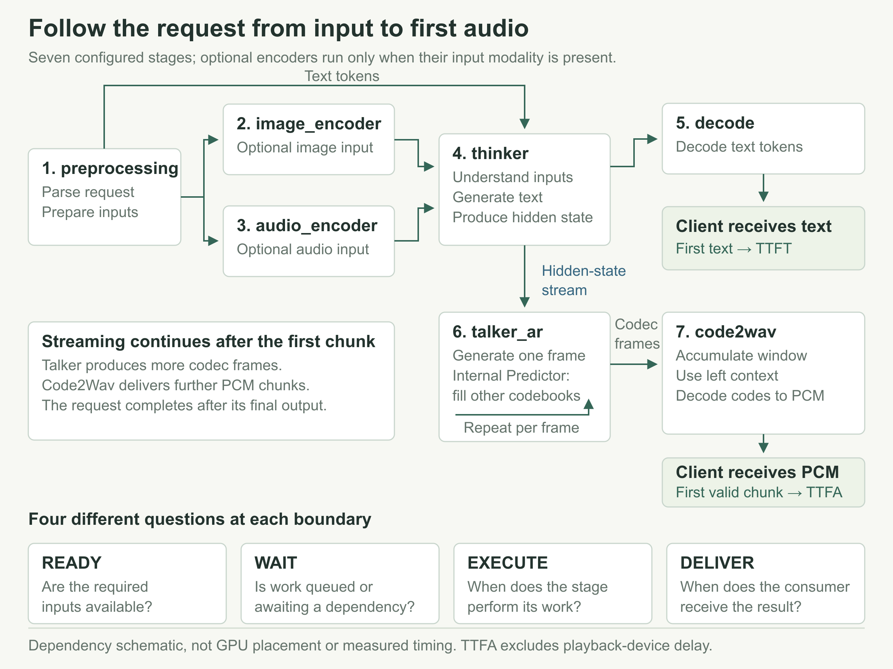
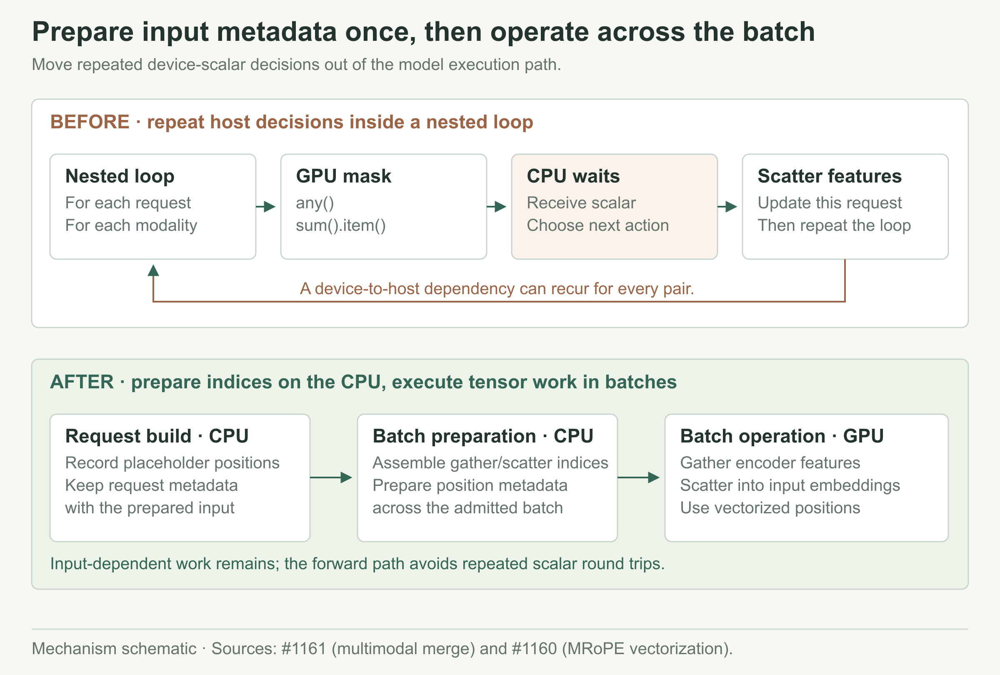
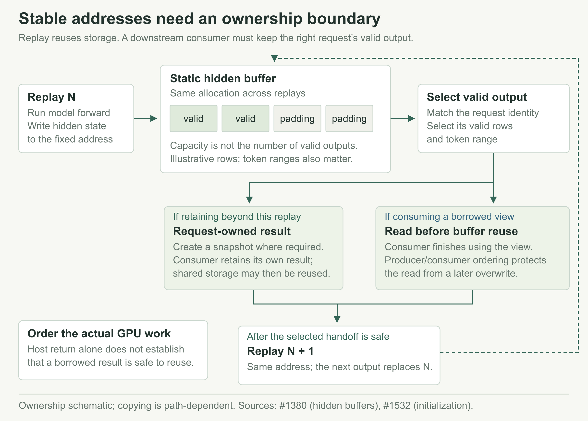
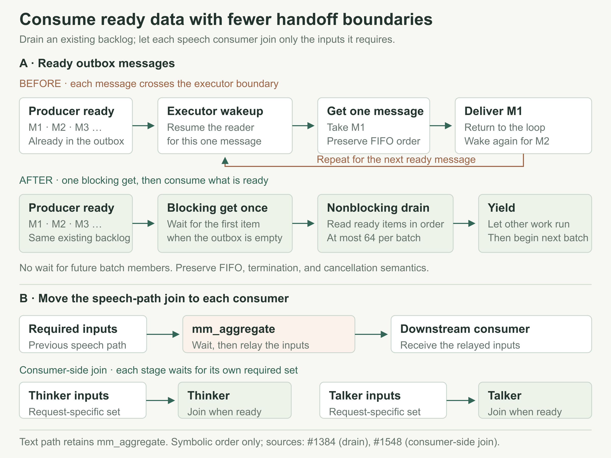
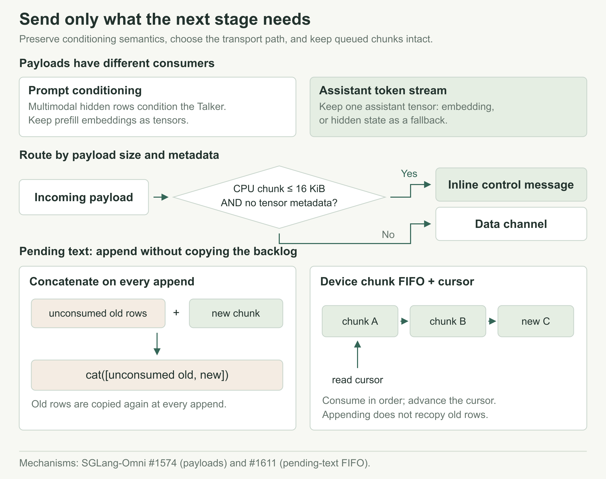
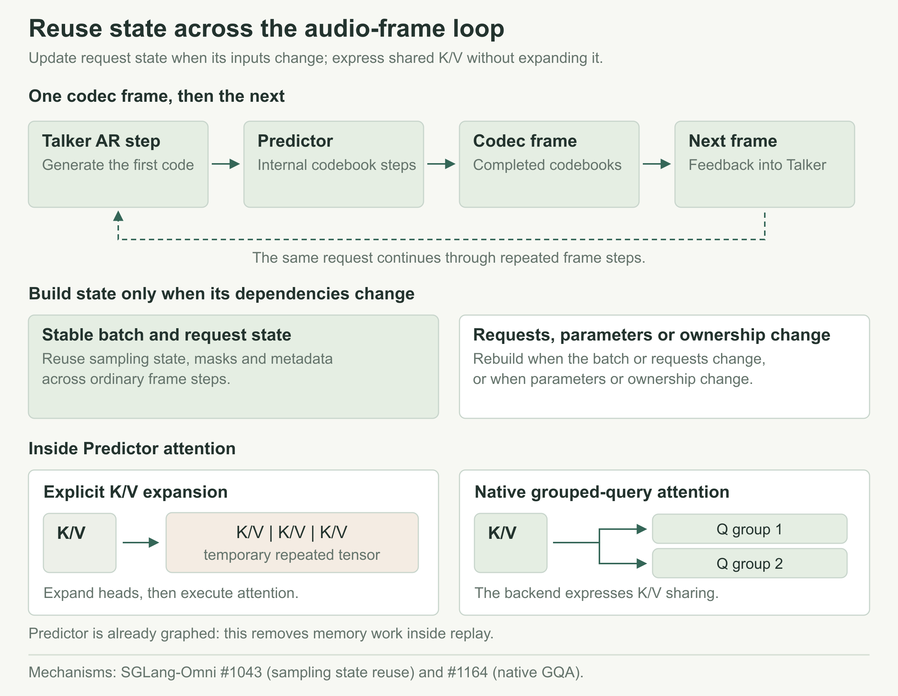
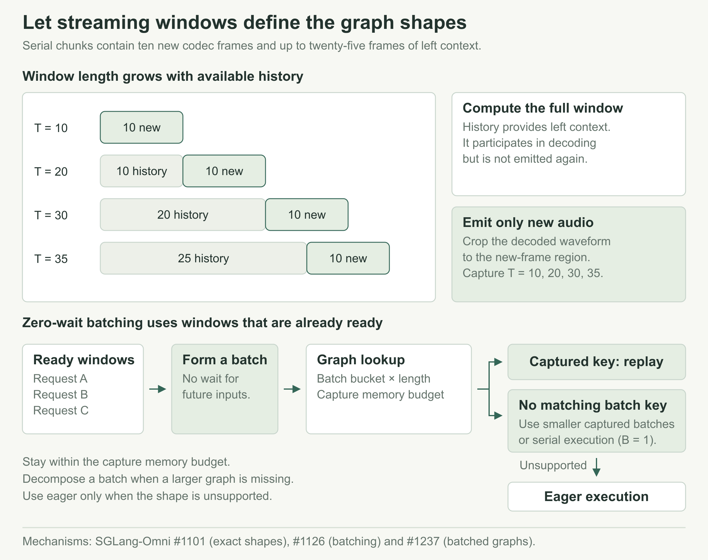
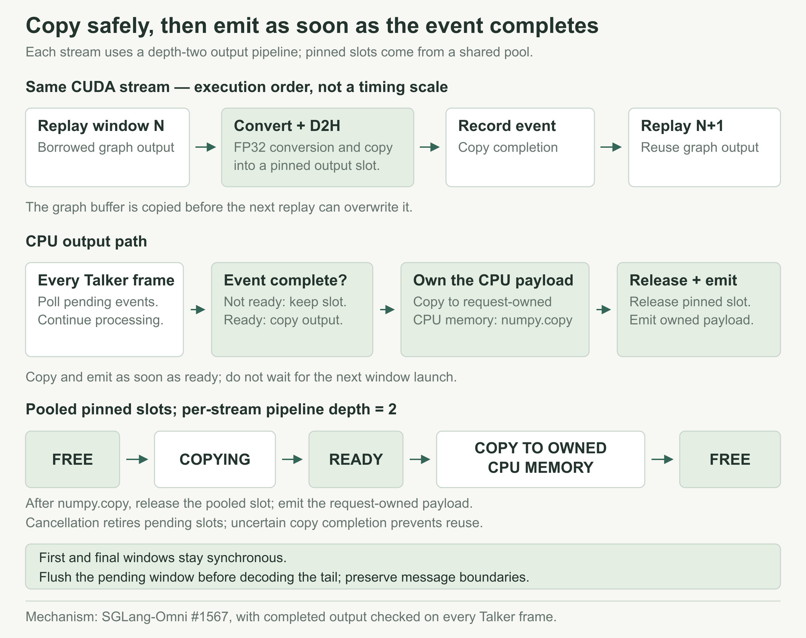

# 让 Qwen3-Omni 更快开口

用户问完一句话，屏幕上已经开始出字，耳机里却还是安静的。在这次的优化中如果想要让 Qwen3-Omni 更早开口，我们需要追着第一段声音穿过整条推理流水线：它在哪里算、在哪里等，又在哪里被一次同步或数据交接拖住。

普通文本生成在第一个 token 到达时，就开始向用户交付结果。语音生成还要把语义变成离散的音频编码，再把编码还原成波形。Thinker 算完一部分，Talker 才能继续；Talker 生成了一帧，Code2Wav 也未必已经攒够一个可解码窗口。阶段之间还有数据交接，计算已经完成的结果可能仍在队列里。

我们先把这笔时间账拆开。每个阶段算了多久，开算之前等了多久，算完的结果又花了多久才交给下游？分清这些，才知道该减少计算、调整执行粒度，还是去处理一次同步或交接。改完以后，再沿着同一条请求看，省下来的时间有没有传到用户这边。

下面按这条路径展开：从输入准备和消息传递，走到逐帧生成，再到波形解码。具体实现各有不同，做取舍时我们会反复问几个问题。哪些工作要等新输入来了才能做？哪些状态没变，可以接着用？下游到底需要什么，又要在什么时候拿到？

## 1. 沿着请求建立成本模型

### 1.1 一段声音经过哪些阶段

语音路径在配置里分成七个 stage：`preprocessing`、`image_encoder`、`audio_encoder`、`thinker`、`decode`、`talker_ar` 和 `code2wav`。图片与音频编码器按输入需要执行，Predictor 则在 Talker 内部。

输入先经过预处理和按需执行的编码器。Thinker 负责理解与文本生成，生成的文本沿 decode 路径返回，语音生成所需的状态则交给 Talker。接着，Talker 逐步生成 codec frame，内部的 Predictor 补齐其余 codebook。Code2Wav 拿到这些离散编码后，结合左侧历史生成连续波形。

*图 1：沿请求观察计算、等待与交付。箭头表示数据依赖；不同部署可以将阶段共置在一张 GPU 上，也可以分开部署。*

这些阶段可以交叠执行，但后一步仍得等前面提供它需要的数据。Talker 要等足够的输入，Code2Wav 要等合法窗口；数据到了，下游还可能因为资源繁忙继续排队。只测一个 `forward()`，这些等待就都漏掉了。

早期 short-prompt trace 中，GPU 计算约为 3.2–3.8 ms，prefill 到第一次输出却用了 76.3 ms，host 发出了约 2,400 次 CUDA API 调用。这组历史记录把调查方向引向 host dispatch、同步和等待。[原始记录](https://github.com/zhaochenyang20/Awesome-ML-SYS-Tutorial/blob/51fa3246427078066c72c2c117ff345ba260d4a5/sglang/sglang-omni/qwen3-omni-serving-optimization-zh.md)

### 1.2 先确定用户在等哪个事件

| 指标 | 观察的事件 | 用来判断什么 |
| --- | --- | --- |
| TTFT | 客户端收到第一段文本 | 用户多久能看到回答 |
| TTFA | 客户端收到首个经校验的非空 PCM 音频块 | 服务多久开始交付音频 |
| Inter-chunk gap | 相邻音频块的到达间隔 | 后续音频是否及时到达 |
| E2E latency | 请求到定义的完成事件 | 整条请求多久结束 |
| Request throughput | 完成请求数 / 测量窗口 | 服务持续处理请求的能力 |
| WER | 转写错误相对参考文本的比例 | 输出是否保留了要说的内容 |

这里测到的 TTFA 还没算真实播放器的缓冲和设备播放延迟。第一块 PCM 来得早，后续块也不一定跟得上。RTF 则是生成耗时除以音频时长，读这个数时，还得一起看完整输出有多长、质量怎么样。

具体怎么改，也得看要改善哪个指标。多等一些请求可以提高 batch 效率，却可能让首音更晚；把首窗缩小可以提前输出，后面的调度也会更频繁。E2E 有没有算进 WAV 和元数据落盘，同样会影响数字。下面的结果各自保留原始计时边界，不同实验中的百分比不能直接相加。后文用 C 表示并发请求数，例如 C16 表示并发为 16。

## 2. Thinker：把输入准备移出重复执行的路径

Thinker 的 Prefill 要处理输入序列和多模态位置，还要准备下游需要的 hidden state。每次请求的内容都不同，但不必把所有动态处理都留到模型执行时。这里先把动态信息整理好，再交给模型批量计算。

### 2.1 提前记录位置，一次完成整个 batch 的合并

旧的多模态 merge 按“请求 × 模态”遍历，在 GPU mask 上调用 `any()`、`sum().item()` 等操作。Python 要拿到 device 上的结果，才能决定下一步，这就可能让 CPU 停下来等 GPU。batch 里的请求多了，这类小同步也会跟着重复。

改动后，请求构造时就记录好 placeholder 位置，再为整个 batch 准备索引，用批量 tensor 操作把 encoder 输出放回正确位置。这些动态工作集中到了输入准备阶段，模型执行时不必反复询问 GPU“这一行有没有音频”。位置编码也做了类似处理，把逐项构造改成批量运算。[多模态 merge](https://github.com/sgl-project/sglang-omni/pull/1161) · [MRoPE](https://github.com/sgl-project/sglang-omni/pull/1160)

*图 2：先整理动态位置，再批量搬运数据。优化删除的是请求循环内的 device scalar 同步，encoder 输出仍须写到各自对应的 token 位置。*

在 8,192 个多模态 token 的组件测量中，单模态 merge 从 2.108 ms 降至 1.005 ms，交错 image/video 输入从 7.825 ms 降至 2.311 ms。批量路径也需要临时源缓冲，该测量约为 32 MiB。这是合并操作自身的结果，尚没有稳定的独立端到端 TTFT 胜幅。[组件测量](https://github.com/sgl-project/sglang-omni/pull/1161)

模型计算前就已经知道的信息，尽量在输入准备时整理好。这一做法也可以用到其他改动里：少做 host/device 往返，后续执行拿到的数据也更规整。

### 2.2 复用执行缓冲时，要一起定义结果的所有权

文本输出主要用到 logits，语音输出还得把选定层的 hidden state 交给 Talker。eager 每次执行可以产生新的输出 tensor；换成 CUDA Graph，输出地址就需要固定，后续 replay 还会复用同一块缓冲区。下游读取时必须分清这是谁的结果，以及什么时候可能被覆盖。

这里给 hidden state 分配静态缓冲区，forward 向固定地址写入，下游按本次请求的有效行与 token 范围读取。缓冲区要留多大，得和请求、graph 的上限一起算。初始化失败后，还要清理 capture 留下的状态，免得下一次执行继续用无效内容。[静态 hidden buffer](https://github.com/sgl-project/sglang-omni/pull/1380) · [初始化恢复](https://github.com/sgl-project/sglang-omni/pull/1532)

*图 3：地址稳定只解决重放条件。消费者仍要读取正确的请求范围，并在后续重放覆盖缓冲之前完成必要的数据交接。*

后面讲 Code2Wav 时，还会遇到这个问题。执行可以复用，每次输出的生命周期却要单独管好。两边一起考虑，后续的异步传递才有前提。

## 3. Pipeline：让就绪的数据尽快被消费

模型算完了，消息也未必马上交到下一个阶段。它可能在等 timer 或线程唤醒，也可能卡在额外中转或昂贵的传输初始化上。要处理这些等待，就得沿着消息的交接路径逐处看。

### 3.1 分开处理等待、kernel 提交与传输初始化

早期 Audio Encoder 路径上有三处固定开销。第一条消息到了，还要等约 50 ms；多层 eager forward 会发出大量小 kernel；传一个小 tensor，也可能花不少时间打开 CUDA IPC handle。

这几处开销分别处理。等待时间改为可配置，空闲路径可以直接处理已到达的请求；合适的 encoder shape 捕获成图，供重复执行时复用；小音频 payload 则走合适的 pooled relay，不必为小 tensor 付出过高的初始化成本。几十 MiB 的大 tensor 和几百 KiB 的小 tensor，不一定该走同一条传输路径。[等待策略](https://github.com/sgl-project/sglang-omni/pull/1564) · [Encoder graph 与传输](https://github.com/sgl-project/sglang-omni/pull/1628)

在历史单张 H200 共置测试中，这组改动使 C1 的 TTFT p50 从 171 ms 降至 74 ms，TTFA p50 从 297 ms 降至 208 ms，请求吞吐提高 16.1%。该 baseline 仍包含旧的 50 ms 等待，因此这个组合结果不能再与单独取消等待的收益相加，也不能解释为相对后续主干的纯增量。C8 的吞吐变化在噪声范围内，C32 约持平；质量检查中的 WER 样本数为 96，speaker similarity 落在 eager 的波动范围内。[实验记录](https://github.com/sgl-project/sglang-omni/pull/1628)

### 3.2 一次唤醒，处理已经到达的工作

旧 outbox 路径每取一条消息，就要在线程和 event-loop 之间交接一次。改动后，第一次读取仍然阻塞，拿到消息后再用非阻塞读取，把队列里已经到达的消息接着处理掉。每轮最多 64 条，然后让出执行机会。

这条路径不为未来消息增加等待。它把已 ready 的工作放到同一次唤醒中处理，同时保留顺序、结束与取消语义。在 H100 FP8 共置的 C16 SeedTTS 比较中，输出 token 吞吐从 100.42 提高到 104.88 tok/s，约增加 4.4%；TTFA p95 从 1.5665 s 降至 1.2991 s，约下降 17.1%。另一次确定性检查中，160 对请求的文本、token 数、chunk 数和 WAV hash 匹配。[Outbox drain](https://github.com/sgl-project/sglang-omni/pull/1384)

*图 4：减少已就绪数据的交接次数。批量 drain 处理队列中已有的消息；consumer-side join 则把等齐输入的责任交给实际消费者。*

还有一处中转可以直接去掉。历史语音路径里的 `mm_aggregate` 只负责等齐输入再转发，现在改由 Thinker 和 Talker 各自等齐需要的数据。请求从八个 stage 减为七个，汇合输入的工作交给了实际消费者。纯文本路径仍保留原来的汇合阶段。[Consumer-side join](https://github.com/sgl-project/sglang-omni/pull/1548)

输入还是得等齐，省掉的是中间那次转发。检查一个阶段能不能去掉时，可以先看它有没有改变数据或执行策略，再看这项工作能不能直接交给消费者。

### 3.3 只传会被读取的数据，追加时不重拷贝旧内容

要减少传输，先看下游到底会读哪些数据。生成的 assistant 文本流与 prompt 的多模态 hidden state 用途不同，生成文本流不必同时带着 embedding 和另一份辅助 hidden。这条路径就保留 embedding，缺失时再用 hidden fallback；prompt 的多模态 conditioning 仍按需要保留。[Thinker → Talker 数据路径](https://github.com/sgl-project/sglang-omni/pull/1574)

具体走哪条传输路径，也要看数据。不超过 16 KiB、metadata 不含 tensor 的小 CPU 流块，可以直接放进控制消息；较大的 tensor 继续走数据通道。Talker Prefill 则一路保留 tensor，省掉 `cpu().tolist()` 后又重新构造 tensor 的往返。

待消费文本队列也可以这样检查。旧实现每追加一批新行，都要把它和还没消费的旧行重新 `torch.cat`。backlog 越长，被反复复制的旧数据就越多。改成 device tensor chunk 队列后，用游标按 FIFO 顺序消费；追加时只放入新 chunk，旧 chunk 消费完再释放。[Pending-text queue](https://github.com/sgl-project/sglang-omni/pull/1611)

*图 5：传输字段由消费者决定，队列按 chunk 保存数据。游标记录消费位置，追加新内容不再重拷贝尚未消费的旧行。*

在 H100 FP8 共置比较中，每臂 4,200 个端到端请求全部成功。原有 31,120 次 queue cat 被移除，457.4 MiB 的旧行重拷贝消失；C16 的请求吞吐从 7.351 变为 7.428 req/s，约变化 1%，整体端到端结果接近持平。重复复制确实被移除，但不能据此把用户延迟描述为同幅度下降。[机制与端到端结果](https://github.com/sgl-project/sglang-omni/pull/1611)

## 4. Talker：逐帧循环只更新变化的状态

Thinker 的 Prefill 集中在请求开头，Talker 则要沿着整段语音反复跑自回归循环。它先生成一部分 codec 信息，内部 Predictor 再补齐其余 codebook；当前帧的结果又参与下一帧。一帧里多做一次同步，或者多一次无用 copy，这类开销就会跟着后续帧不断重复。

### 4.1 以状态变化作为重建条件

如果 batch 组成与采样参数没变，每帧重建 sampling state、mask 和 metadata，也不会得到新的信息。这里把这些状态留下来，跨 step 复用；请求加入或离开，或者参数、所有权变了，再显式更新。[Sampling state reuse](https://github.com/sgl-project/sglang-omni/pull/1043)

sampling state 每帧都要用，重建则等到依赖的状态变化时再做。请求离开后，旧状态也不能继续占用新请求的位置。

*图 6：Talker 的重复路径中，采样元数据按变化更新，attention 用 GQA 表达 K/V 的共享关系。两项改动都减少逐帧执行中的搬运或准备工作。*

Profile 中，每帧 pageable H2D 事件从 15.13 次降到 4.26 次，forward thread 的 stream synchronization 从 16.09 次降到 5.23 次。这些是事件次数，不能直接换算成节省的毫秒数；对应端到端变化仍接近重复运行的波动范围。[测量记录](https://github.com/sgl-project/sglang-omni/pull/1043)

### 4.2 让 backend 直接表达共享关系

Predictor 的 attention 里，也有不必生成的中间 tensor。旧路径先显式扩展 K/V head，再执行 attention。换成原生 GQA 后，backend 可以直接表达 K/V 的共享关系，少跑一些窄 copy kernel。[Native GQA](https://github.com/sgl-project/sglang-omni/pull/1164)

Predictor 已经在 CUDA Graph 内，这项改动减少的是 replay 内部的内存工作。CUDA Graph 复用了提交过程，图里仍然可能有多余的 tensor 扩展。要找到这部分成本，还得继续看一帧里面具体执行了什么。

这和前面的输入准备用的是同一个办法：先看计算依赖的值有没有变化，再决定哪些准备工作要重做。后续维护也可以沿用这个条件。每加一种状态，都要说清楚它依赖什么，以及哪些事件会让已有状态失效。

## 5. Code2Wav：按流式输出协议组织计算

Talker 逐帧产生 codec，到了 Code2Wav，就要按窗口生成波形了。一个窗口里有新帧，也可能带着左侧历史。在选执行 shape 之前，得先定下首窗什么时候发出，后续每次新增多少帧，以及哪些波形是这次要交付的。

### 5.1 用真实窗口长度选择执行形状

串行默认路径中，每个新 chunk 包含 10 帧，最多保留 25 帧左侧历史。随着上下文累积，正常窗口的典型输入长度为 `T=10/20/30/35`。

| 窗口 | 左侧历史 | 新帧 | 总输入长度 |
| --- | ---: | ---: | ---: |
| 首窗 | 0 | 10 | 10 |
| 第二窗 | 10 | 10 | 20 |
| 第三窗 | 20 | 10 | 30 |
| 后续完整窗口 | 25 | 10 | 35 |

历史帧也要参与当前窗口计算，但输出时要按边界裁剪，只交付新帧对应的波形。按这些真实长度捕获 CUDA Graph，可以减少 launch 成本，小窗口也不必按最大 shape 计算。[Exact-shape graph](https://github.com/sgl-project/sglang-omni/pull/1101)

*图 7：先用输出协议确定时间维长度，再按已就绪窗口选择 batch。图的覆盖范围同时受 shape 与显存预算约束。*

如果先定下一个更大的 batch 或更完整的图，再让请求等它，用户听到首音的时间就会被推迟。所以要先把合法窗口和交付时机定下来，再让执行方式配合这两个条件。

### 5.2 合并已经 ready 的窗口，并限制等待和显存

多个请求的窗口同时 ready 时，就可以用有界 batching 合起来执行，达到 batch 条件或等待期限就发出。zero-wait 配置只用当前已就绪的窗口组成 batch，不主动等后面的窗口。后续的 chunk-aligned graph 把合法窗口、batch bucket 和显存预算一起纳入调度规则。[有界 batching](https://github.com/sgl-project/sglang-omni/pull/1126) · [Chunk-aligned graphs](https://github.com/sgl-project/sglang-omni/pull/1237)

在 H100 的 Code2Wav 组件实验中，harness 模拟 Talker codec-frame 到达，每个请求包含 20 个窗口，进行三次重复。2% graph 显存预算下，zero-wait 配置在已测 C≥8 档位的组件吞吐提高约 11–15%，C1 约持平。该配置保留 `B=1/2/4` 与 `T=10/20/30/35` 的 12 个图，约占 634 MB；更大的 batch 超出预算时缩小执行批次。[组件实验](https://github.com/sgl-project/sglang-omni/pull/1237)

这项测量覆盖声码器组件，尚不能给出完整 Qwen3-Omni 的端到端加速比。实验显式启用了 batched 模式，默认仍为关闭；波形按容差对照，最坏 SNR 为 35.26 dB，检查零失败。更长等待和更大显存预算属于另外的配置，不能混入这组结果。

这里还要处理图没覆盖到、以及执行失败的情况。缺少较大 batch 的图时，调度器先拆成已有的小 batch，必要时退回串行；不支持的 shape 可以在 replay 前选择 eager。如果 replay 已经开始，执行中的错误就要保留下来，让后续请求按禁用状态选择回退路径。静默重跑同一请求，可能重复消费输出或掩盖状态损坏。

## 6. 计算完成后，继续追到结果交付

GPU 算完一个窗口，结果还要复制、裁剪和转换，再送到客户端。如果这些步骤长时间占着调度线程，其他已就绪工作也会等在后面。追到这里，输出处理也得和计算放在一起看。

### 6.1 让输出处理交叠，同时保留结果的所有权

在 CUDA 串行 Code2Wav 路径里，每条流都有一条深度为 2 的输出流水线。它从共享池取得 pinned 槽位，用 CUDA event 追踪异步复制，调度线程就可以继续处理其他工作。复制完成后的 CPU 输出处理可以与后续 GPU 计算交叠；首窗和最终尾窗仍保持同步。[Output overlap](https://github.com/sgl-project/sglang-omni/pull/1567)

一个窗口 replay 完成后，接下来的 FP32 转换、到槽位的异步 D2H 和 event 记录，都排在同一 CUDA stream 上。这个顺序保证下一次 replay 不会在这次 copy 完成前覆盖借用的 graph 输出。复制完成后，host 先把有效结果复制到独立的 CPU 内存，再释放槽位，随后发送这份独立结果。这样就把槽位复用和下游消费分开了。

*图 8：D2H 完成后先取得独立 CPU 副本，再释放共享槽位并交付结果。图中输出处理允许交叠，首窗与最终尾窗保留同步边界。*

每来一个 Talker frame，就检查一次 event；第一次查到完成，就输出对应结果。请求结束时，先把 pending window 作为独立消息发出，再解码最后的尾部，保留消息边界。

请求取消后，还在使用的槽位不能马上回收。abort 先把槽位放进 retired 队列，由 scheduler 查询完成状态后再回收；copy 或 event 记录失败时，则把槽位隔离，避免在完成状态未知时复用缓冲。后续公共 `PinnedTransferSlot` 也保留了这些所有权状态。[输出槽生命周期](https://github.com/sgl-project/sglang-omni/pull/1567) · [公共 transfer slot](https://github.com/sgl-project/sglang-omni/pull/1759)

已有 profile 支持调度线程占用下降，但不足以建立可靠的端到端加速结论。同输入的协议级对照检查了消息一致性；后续 transfer-slot 改动还做了 20 个确定性请求和 12 个 real-weight replay case 的 bitwise 对照。这些检查覆盖各自的输入和实现，不能扩写成完整服务的质量结论。

### 6.2 每次改动，都回到同一条请求

Thinker 的输入准备能提前多少，关系到执行路径能有多规整。Talker 则要先看状态变没变，再决定是否逐帧重建。到了 pipeline 和 Code2Wav，要先弄清楚消费者需要什么、什么时候需要，再安排数据传递和窗口。

具体用什么机制，就顺着这些问题来选。批量索引减少对 device 状态的反复查询；尚未消费的数据留在 FIFO 里；K/V 的共享关系交给 GQA 表达，提交过程则用 CUDA Graph 复用。选了这些机制，也要处理它们带来的约束。用了静态地址，就要明确所有权；合并执行要顾及首窗时机，增加图覆盖也要留出显存。

做完以后，还是要回到用户的请求上看结果。多模态 merge 的组件时间下降，尚没有稳定的独立 TTFT 胜幅；pending-text 队列消除了重复复制，端到端约持平；outbox drain 则在对应的历史配置下同时改善了输出 token 吞吐与首音尾延迟。把这些结果分开看，才知道接下来该继续缩短当前路径，还是去找别处的等待。

我们优化 Qwen3-Omni 时，就沿着这条请求路径反复测量、解释和修改。做完一次局部改动，先确认哪些工作确实被省掉，再测完整请求，看这些工作是否正好处在用户等待的路径上。
