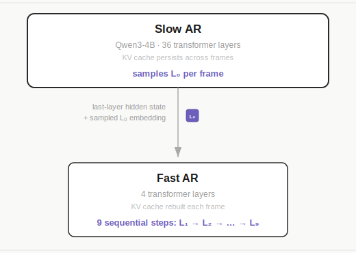
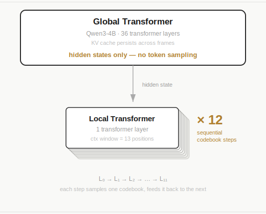
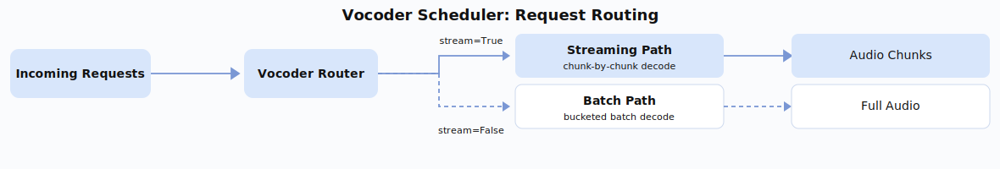
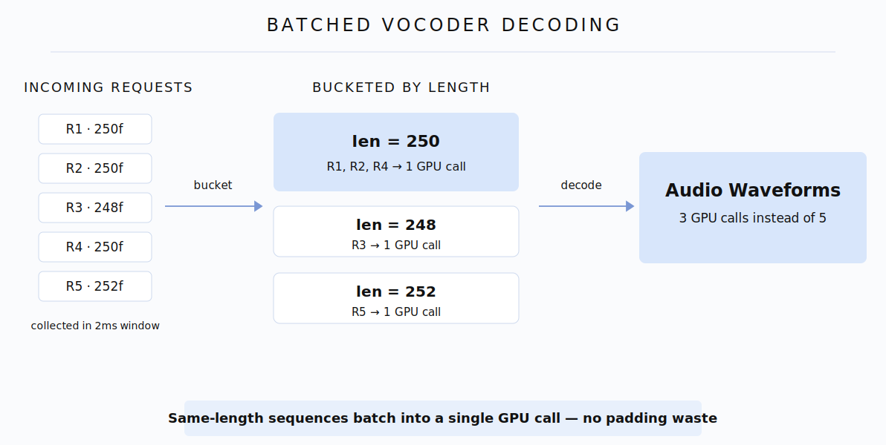
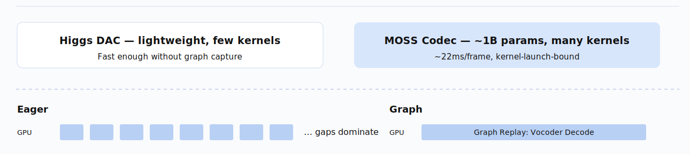
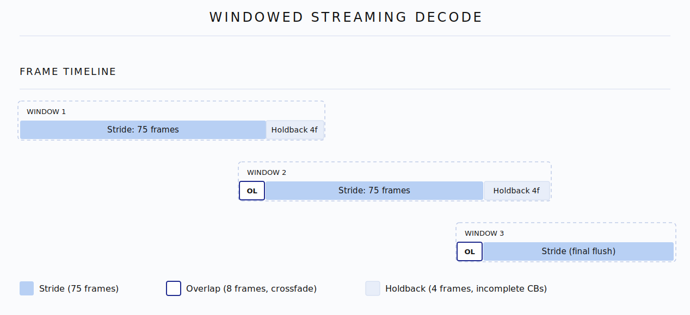

# 深入浅出 SGLang Omni 对 TTS 模型的优化思路

TTS（Text-to-Speech）模型将文字和参考音频转成自然的口语音频。当下最先进的 TTS 模型大多是 LLM-backbone 架构。自然，这个 LLM 的自回归 decode 吃掉了大部分计算。从这个角度看，优化 TTS 推理乍一看和优化 LLM 推理很像：两者都有 autoregressive decoding、KV cache、CUDA Graph、continuous batching。但实际上，TTS serving 远不止一条 text-token 的 decode loop。单个请求可能要经过 reference-audio 编码、多层 codec-token 生成、vocoder 解码、streaming 音频拼接。我们的优化经历表明，收益最大的几处优化，恰恰落在 LLM backbone 之外。


| 模型 | 模式 | 加速比（perf vs vanilla） |
|---|---|---|
| Higgs | streaming / non-streaming | ~1.9–2.5× |
| MOSS-TTS-Local-v1.5 | non-streaming | ~2.3–3.4× |
| MOSS-TTS-Local-v1.5 | streaming | ~2.6–3.4×（高并发下趋于平台）|

在本文中，我们拆解让 SGLang Omni TTS pipeline 的推理速度得到飞跃的诸多机制：分析我们遇到的 bottleneck，以及我们做出的架构权衡。本文聚焦于聚焦两个架构不径相同的 TTS 模型：来自 Boson AI 的 [Higgs](https://huggingface.co/bosonai/higgs-audio-v3-tts-4b)，以及来自 MOSI AI 的 [MOSS-TTS-Local-v1.5](https://huggingface.co/OpenMOSS-Team/MOSS-TTS-Local-Transformer-v1.5)。

## TTS 模型架构与相关概念

<div align="center">
  
  <p><em>图 1. SGLang-Omni 中的 TTS 推理 pipeline 总览。大致分为预处理、音频编码，自回归 codebook 生成，再到 vocoder 解码四个步骤。</em></p>
</div>

和只有一条 auto-regressive decoding loop 的 LLM 不同，TTS 推理可以拆成四个步骤：

### TTS 解码的四个步骤

1. **Preprocessing（CPU）：** 文本 tokenization 和 reference-audio 载入，纯 IO-bound，不涉及 GPU 计算。

2. **Audio Encoder（GPU）：** 自回归的 LLM 只能处理离散 token，没法直接输入连续的音频信息。audio encoder 把音频波形压成一段低帧率的离散 RVQ token 网格（shape `[T, N]`，`T` 是 codec 帧数，`N` 是 RVQ 层数，后面会展开）。这些 token 捕捉了 reference voice 的音色和韵律——也就是 TTS engine 要去模仿的「该怎么发声」的 conditioning 信号，从而让 TTS 模型能够通过离散的 codec token 接收音频输入。

3. **TTS Engine（GPU）：** 核心的自回归阶段。engine 生成的不是 text-token ID，而是 codec-token ID。不同模型 decode 出多层 codebook 网格的方式不一样。delay-pattern 类模型（如 Higgs 和 MOSS-TTS-v1.5）先在一张 step × codebook 网格里以延迟（错位）的方式生成；undelay 之后，对角线上的 codec token 才被对齐回 `[T, N]` 的 codec 帧，交给 vocoder。non-delayed 类模型（如 FishAudio S2 Pro 和 MOSS-TTS-Local-v1.5）则更直接地逐帧构造：一个较大的 backbone 负责提供每帧的时序上下文，一个较小的 inner module 负责填满每帧内部的 codebook 层。当然，codec token 生成阶段占据着绝大部分 GPU 时间，也是 model-specific 调度、CUDA Graph、async decode 尝试优化的阶段。

4. **Vocoder（GPU）：** vocoder 将生成出来的 codec token 映射回连续音频波形，和 audio encoder 恰好相反。逻辑上，单次调用 vocoder 的计算通常很轻，但在高并发下，多条 AR loop 可能同时结束、一堵塞在 vocoder 的队列中。不同 vocoder 的 streaming 行为也各不相同。

我们可以将 TTS 推理过程的数据流简化为**文本 + Reference Audio → RVQ 编码 → 多层 codec token 生成 → 音频波形**。在一些 TTS 系统里，audio encoding 和 vocoder decoding 可能是是同一个 audio tokenizer 模型的两个方向：encoder 是 audio-to-codec-token，vocoder 是 codec-token-to-audio。但其他 TTS 模型的 audio encoder 和 vocoder 则可能完全不同。

有了这些模糊的流程描述，我们进一步引入相关概念：

### Codec Token、Codebook 与 RVQ Layer

为了描述清楚 audio token 的 decode 过程，我们先需要引入一个简单的可视化对象：**step × codebook 网格**。横轴是自回归 decode step，纵轴是 codebook（也就是 RVQ 层），每个格子是某一步采样出的一个 codec token。BOC、EOC 之类的特殊格子标记的是帧边界，而非真正的音频内容。

<div align="center">
  
  <p><em>图 2. Non-delayed 的 step × codebook 网格。绿色格子是有效的 codec-token 采样，红色是 EOC，灰色是已结束的 slot。高亮的紫色竖列是一个 vocoder-ready 的帧：所有 codebook 描述的是同一个音频时间步。</em></p>
  
  <p><em>图 3. Delay-pattern 的 step × codebook 网格。蓝色格子是 BOC padding，绿色是有效采样，红色是 EOC，灰色是已结束的 slot。高亮的紫色对角线（而非竖列）在 undelay 之后才构成一个 vocoder-ready 的帧。</em></p>
</div>

**1. Codec token、codebook 与 RVQ layer。** 前面说过，text LLM 消费的是有限词表里的离散 token ID。TTS 需要给音频一套同样的接口：一个 **codec token** 就是一个整数 ID，代表一小片声音。一个 **codebook** 是某一层的静态词表——在 Higgs 里，每一层的 codebook 大约有 4,096 个候选 ID，每个 ID 映射到一个 embedding 向量。一个 **RVQ layer** 则是拥有这样一个 codebook 的一个残差量化层。Higgs 有 $N = 8$ 个 RVQ layer，所以每个对齐后的音频单元（帧）最终需要 8 个采样出的 ID，每层一个。要强调的是，4,096 是一层 codebook 的大小（候选 ID 的个数），不是生成序列的长度。在网格里，每个 codec token 是一个格子，每个 RVQ layer 是一行，而每行共享同一个 codebook。

**2. RVQ（Residual Vector Quantization）。** 怎么把音频波形编码成 codec token，本身就是一门艺术。当下流行的技术是 [Residual Vector Quantization (Zeghidour et al., 2021)](https://arxiv.org/abs/2107.03312)。对于一帧音频，把它编码成单个整数 ID，只能粗糙地近似音频信号。RVQ 把多个层残差量化器串起来：$L_0$ 先量化粗糙信号，$L_1$ 量化 $L_0$ 留下的残差，$L_2$ 量化 $L_1$ 还没补上的部分，以此类推。每一层捕捉越来越细的细节。我们一般认为 $L_0$ 编码比较粗糙的信息（pitch、rhythm、energy），更深的层编码音色和高频纹理。解码时把所有层的贡献相加，重建出音频。

由此可见，一帧音频可以被编码成一个 codec token 的列表，列表长度就是 RVQ 层数。我们习惯把它竖着放，所以一帧的 codec token shape 是 `[1, N]`。在 non-delayed 网格里，这一帧恰好是一个竖列：step $k$ 上所有 codebook 携带的都是同一个音频时间 $t=k$ 的 token。在 codec token 被 vocoder 解码为音频的过程中，一列 `[1, N]` 的 codec token 则可以被解码回单帧音频。**RVQ 的层级残差机制让生成同一帧不同层 codec token 的顺序变得重要**。

如果所有层在同一时刻独立采样，那么 `[1, N]` 个 token 只用一次 backbone forward 就一起生成了，这意味着高层根本看不到低层刚生成的 codec token。残差机制被破坏了，自然音质会下降。反过来，如果第一次 forward 只生成 $L_0$ 的 codec token，第二次 forward 生成 $L_1$，依此类推，质量会变好，但延迟大致随层数线性增长。每个多层 TTS 系统都得在这个 trade-off 之间权衡，而 **delay pattern** 就是 Higgs 采用的 codec-token 生成策略，下一节会细讲。与此同时，FishAudio S2 Pro 和 MOSS-TTS-Local-v1.5 则用另一条路绕开了延迟：把 backbone 和一个更轻的 inner module 分开——backbone 提供每帧的时序上下文，inner module 则完成余下的 codebook 层。具体分工各有不同——S2 Pro 的 backbone 自己采样 $L_0$（[Dual AR](https://github.com/zhaochenyang20/Awesome-ML-SYS-Tutorial/blob/main/transformers/omni/readme.md#以-fish-audio-s2-pro-为代表的-dual-ar-模型推理)），而 MOSS-TTS-Local 的 backbone 只产出 hidden states，把所有 codebook 采样都交给它的 local transformer。

**3. Global step 与 codec frame。** 我们多次用到「帧」这个词，基本上可以把它当作音频波形的一个单位。一段 10 秒、25 fps 的音频大约有 250 个这样对齐的 codec 帧。在 TTS 推理的语境里，帧和 step 大致等价：每个时间步最终产出一竖列 `[1, N]` 的 codec token（$\{L_0, L_1, \ldots, L_{N-1}\}$），随后被解码回单帧音频。粗略地说，Higgs 的每个 global step 里，LM backbone 前向一次、产出 logits，然后每个活跃的 RVQ layer 的 output head 各自从这份 logits 里、在自己 ~4,096 个候选的 codebook 上采样一个 ID。因此一个 global step 最多写入 8 个 ID。这就跟 LLM 用一个 LM head 从 logits 里采样一个 text token 是一回事——只不过在 Higgs 里，我们得用多个 head 才能凑齐一整帧，也就是 `[1, N]` 个 codec token。

传递给 vocoder 时，一个 codec 帧必须在 step × codebook 网格上排成一竖列 `[1, N]`，正如图 2 所示。但在原始的 step × codebook 网格上，帧的排布可以是不一样的。没有 delay pattern 时，一个 vocoder-ready 的 codec 帧 $k$ 恰好是原始网格的竖列 $\{L_0[k], L_1[k], \ldots, L_N[k]\}$。但有了 delay pattern，第 $i$ 层被平移了 $i$ 步，所以在生成过程中同一帧不再是一列，而落在一条对角线上：$\{L_0[k], L_1[k+1], \ldots, L_N[k+N]\}$，这就是图 3。经过 **undelay**，这条对角线被移回来，变成对齐后 `[T, N]` 网格的第 $k$ 行，也就是 vocoder-ready 的表示。

这些概念引出了 delay pattern 和 backbone + inner module 都要回答的核心问题：在每个 global step，到底应该让全部 $N$ 层立刻采样真实 ID，还是让每层都跑一次完整的 backbone 前向，又或者把时序上下文和每帧的 codebook 生成拆开？delay pattern 用错位激活来解决，backbone + inner module 则把 codebook loop 搬进一个更便宜的 inner model。

## Codebook 生成策略

到这里我们终于可以细讲 delay pattern 和 backbone + inner module 这两种 codebook 生成策略了。

先把四种生成不同 layer codebook token 的策略放在一起：

| 策略 | global step $s$ 时发生了什么 | 质量 / 速度 |
|----------|--------------------------------|-----------------|
| Parallel | 全部 $N$ 层同时从同一份 logits 采样真实 token | 快，但 $L_i$ 看不到 $L_{i-1}$ 刚发出的 token → RVQ 层级被破坏 |
| Sequential | 从 $L_0$ 到 $L_{N-1}$ 顺序填满一帧的整个 $[1, N]$ 列表 | 残差关系得以保留，但延迟大致放大 $N$ 倍 |
| Staggered（delay pattern）| 所有层在同一时刻采样各自的第 $s$ 个 codec token，但这些 token 属于不同的帧 | 近乎并行的速度，又有因果的跨层 conditioning |
| Backbone + inner module | 大 backbone 提供每帧时序上下文；小 inner module 填满每帧内部的 codebook 层 | 让帧保持竖列，同时把 codebook 级解码搬到更便宜的 inner model |

### Delay Pattern

delay pattern 是残差机制下 trade-off 的一个优雅解法。它沿着共享的 global-step 轴错开各层的激活：第 $i$ 层比第 $0$ 层晚 $i$ 步才开始真正采样，前 $i$ 个 slot 用 BOC 占位符填上。换句话说，delay pattern 下的一帧既不是竖的也不是横的，而是对角的、斜着的。如前所述，在 Higgs 的帧网格里它是 $\{L_0[k], L_1[k+1], \ldots, L_7[k+7]\}$。

错位的核心思想是，所有层共享同一条 global step 轴，也共享同一次 per-step backbone 前向。每一步，step × codebook 网格里的每个层 slot 都会被写入，但未激活的层拿到的是 BOC（Beginning-of-Code）占位符而非真实采样，激活的层则各自从自己的 codebook 里并行采出一个 ID。一旦第 $i$ 层在 global step $i$ 激活，之后每一步都会在它的第一个有效 token 之后再添一个有效 token。undelay 随后把这张网格里的对角线重新归并成对齐后 `[T, N]` 网格的竖列。

图 3 把整个生命周期压缩到 29 个 global step 来示意。实际推理过程中，网格简单地向右延伸：每步一次 backbone 前向产出一份 logits，8 个 codebook head 从这份 logits 采样，采出的 codec token 写回网格。这个过程一直持续到 $L_0$ 发出 EOC（end of codec）、wind-down 收尾为止。

注意，当第 $i$ 层在 global step $i$ 产出它的第一个有效 token 时，前面每一层 $L_j$（$j < i$）都已经在 global step $j$ 产出了它们的第一个有效 token。$L_{i-1}$ 在第 $i-1$ 步产出的 token 是可以在 $L_i$ 采样时作为条件的。backbone 的 KV cache 累积了 $0 \ldots i-1$ 步的历史，已经编码了前面各层有效 token 的历史。这恰恰是 RVQ 所要求的分层残差机制，而且绕开了 $N$ 次完全独立的 AR pass。接下来，wind-down 阶段与 ramp-up 对称，当 $L_0$ 在第 $T-8$ 步发出 EOC 时，更高的层还会再跑 $N-1$ 步才停（$L_1$ 在 $T-7$，$L_2$ 在 $T-6$，……）。

还有一种描述同一过程的方式，是把它看成一个四阶段状态机：Delay Stage（错位激活）、Active Stage（正常采样）、Wind Down（$L_0$ 命中 End-of-Codes token 时触发）、Finished。我个人不太喜欢这套术语——既然我们已经把 delay pattern 的原理讲清楚了，这些术语反而显得多余。

相比朴素的并行逐层生成，delay pattern 为得到 $T$ 个 codec 帧恰好多花了 $N$ 个额外的 AR step——这就是图里能看到的 ramp-up / wind-down 开销。对一次典型的 250 步生成来说，这大约是 ~3% 的开销。换来的是比朴素并行采样更好的音质，同时速度逼近并行、远快于完全顺序的逐层生成。

另外，delay pattern 并非 Higgs 独有，也不是唯一解。它在其他多 codebook 音频生成模型里已被广泛采用，比如 [MOSS-TTS-v1.5](https://huggingface.co/OpenMOSS-Team/MOSS-TTS-v1.5)。但 [MOSS-TTS-Local-Transformer-v1.5](https://huggingface.co/OpenMOSS-Team/MOSS-TTS-Local-Transformer-v1.5) 是一个不同的 checkpoint：和 FishAudio S2-Pro 一样，它用的是 non-delayed 架构——backbone 和一个更轻的 inner module 协作，把每帧填成一竖列，不需要 delay/undelay。

## Backbone + Inner Module

正如前文所述，这一类模型不是把一帧摊到对角线上，而是让每帧在 step × codebook 网格上保持一竖列。一个大 backbone 处理时序上下文，逐帧推进序列，而一个更小的 inner module 则填满每帧余下的 codebook 层，每帧生成出来就是 vocoder-ready 的。

当然，每帧里仍然有一个对 codebook 的内层循环。但这个循环跑在一个小得多的 module 里，而不是为每个 RVQ layer 调用一次完整的 backbone。这样既保住了残差层级，又不用付出 $N$ 倍的 backbone 成本。

在这一类里，两种具体设计的区别在于 $L_0$ 在哪里生成：

**Dual AR（FishAudio S2-Pro）。** backbone 本身就是个自回归模型，为每帧采样粗糙的 $L_0$ token。然后它把自己最后一层的 hidden state 连同采出的 $L_0$ embedding 一起传给一个独立的、更小的 AR 模型（即 "Fast AR"），由后者自回归地生成剩下的 codebook token $\{L_1, L_2, \ldots, L_{N-1}\}$。Fast AR 有自己的参数和架构（S2-Pro 里是 4 层），并且每帧重建一次 KV cache。这是真正意义上两个 AR 模型在分工做 codebook 生成：一个管语义层，一个管声学层。

<div align="center">
  
</div>

**Global + Local Transformer（MOSS-TTS-Local-v1.5）。** backbone 只产出 hidden states——它不采样任何 token。所有 codebook token（包括 $L_0$）都由一个轻量的 local transformer（MOSS 里是 1 层）生成。当前帧的 backbone hidden state 作为 local transformer 的初始输入；local transformer 随后顺序采出全部 $N$ 个 codebook token。这里不像 FishAudio S2 Pro 将 codebook 拆给两个模型，而是一个模型只负责时序上下文，而另一模型才实际生成每帧的全部 codec token。

<div align="center">
  
</div>

从 serving 视角看，两种设计共享同一套调度策略：每帧一次 backbone 前向、inner module 里一个顺序的 codebook 循环、没有 delay/undelay，而且这个 inner loop 可以被 capture 成 CUDA Graph。架构上的区别只在于 $L_0$ 在哪里被采样，在 backbone 里（Dual AR），或者和其他所有 codebook 一起在 inner module 里（Global + Local）。

总结一下，delay pattern 和 backbone + inner module 是规避 RVQ 机制带来的 trade off 的两种思路。delay pattern 把一帧摊到对角线、之后再 undelay。backbone + inner module 让每帧保持一竖列，把 codebook 级生成搬进一个更轻便的 inner model。

## 模型架构

做完这么多铺垫，我们终于可以进入具体的模型架构和优化了。

### Higgs Pipeline

<div align="center">
  
  <p><em>图 4. Higgs TTS pipeline，Qwen3 规模的 backbone 直接预测多 codebook 音频 token，DAC vocoder 重建波形音频。</em></p>
</div>

- **Preprocessing（CPU）：** 文本 tokenization 和 reference audio 载入，非常标准。
- **Audio Encoder（GPU）：** 使用 [HiggsAudioCodec](https://huggingface.co/bosonai/higgs-audio-v2-tokenizer)，一个带语义 encoder 分支的 DAC-based audio tokenizer。它同时提供两个方向：把 reference audio 编码成 RVQ token，以及把生成出的 token 解回波形。
- **TTS Engine（GPU Backbone）：** 核心自回归模型——一个 Qwen3-4B decoder。每个 global decode step 把上一步多层 token ID 做 embedding 求和成一个输入向量，跑一次 causal backbone 前向，再用 8 个 codebook head 为每个 RVQ layer 采一个候选 ID。
- **Vocoder（GPU）：** 用 DAC tokenizer 的解码方向，把生成出的 token 转回可听的波形。对 Higgs 来说，这一步不需要再部署一个独立的模型实例。

### MOSS Pipeline

<div align="center">
  
  <p><em>图 5. MOSS-TTS-Local pipeline，一次 backbone step 之后跟着一个在 RVQ 层上的 local-transformer 循环，再接 MOSS-Audio-Tokenizer-v2 vocoder。</em></p>
</div>

MOSS-TTS-Local-v1.5 用 local-transformer 架构来填更高层的 RVQ 层，整体沿用了和 Higgs 相同的四阶段 pipeline 结构。

- **Preprocessing（CPU）：** 文本 tokenization 和 reference audio 载入，典型的 TTS，纯 IO-bound。
- **Audio Encoder（GPU）：** 使用 MOSS-Audio-Tokenizer-v2，一个约 1B 参数的 audio tokenizer 模型。它的 encoder 方向把 reference audio 转成离散 RVQ token。MOSS-TTS-Local 用 12 个 RVQ layer 外加一个 text/control 通道，所以完整的网格布局是 `[T, 13]`。
- **TTS Engine（GPU Backbone + Local Transformer）：** Qwen3 backbone 每帧跑一次、产出一个 hidden state——它自己不采样任何 codec token。这个 hidden state 被喂进一个 1 层的 local transformer，由它顺序采出该帧的全部 13 个通道（一个 text/control 通道，加上 12 个 RVQ-layer codec token，包括 $L_0$）。这 13 个采样出的 codec token 的 embedding 随后被求和，作为 backbone 下一步的输入。这让 backbone 保持轻量，而 local transformer 的 per-frame 循环（1 次 backbone step + 12 次 local micro-step，共 13 次采样）反而可能成为延迟瓶颈（见 CUDA Graph 一节）。
- **Vocoder（GPU）：** 用 MOSS-Audio-Tokenizer-v2 的解码方向。逻辑上这是 audio encoder 的反向，但在 serving 里我们为 vocoder 解码单独部署一个 MOSS-Audio-Tokenizer-v2 实例，而不是复用 encoder 实例。和 Higgs 的 DAC vocoder 不同，它天生支持 streaming——支持逐帧解码，不需要 windowed chunking、overlap 或 crossfade。但这个额外的 ~1B 参数 vocoder 实例比 Higgs 的 DAC vocoder 重得多，如果不好好优化，会引入可观的开销。

### 优化构思

<div align="center">
  
  <p><em>图 6. Higgs 与 MOSS-TTS-Local 的架构对比，突出 backbone 角色、encoder/vocoder 权重、逐层生成策略、streaming 行为上的差异。</em></p>
</div>

如图所示，两个模型都用 Qwen3 规模的 backbone（~4B 参数），但在 encoder/vocoder 权重和逐层生成策略上差别很大。Higgs 是一个「重 backbone、轻 encoder 和 vocoder」的系统：它 DAC-based 的 audio tokenizer 很小，而且打包在 checkpoint 内部，所以 backbone 主导了总模型体量。MOSS 则是把一个同规模的 backbone 配上 MOSS-Audio-Tokenizer-v2 这个重得多的 ~1B 参数 audio tokenizer。更关键的是，MOSS 为 vocoder 解码单独部署了一个 MOSS-Audio-Tokenizer-v2 实例，所以 vocoder 侧的优化变得重要得多。另外，两者的 vocoder 在 streaming 属性上正好相反——Higgs 的 DAC vocoder 天生不支持 streaming（需要 windowed chunking 配 crossfade），而 MOSS 的 vocoder 开箱即支持逐帧 streaming。

> *benchmark 里有一个值得一提的观察（1× H100 80GB，Seed-TTS-Eval EN 全集）：MOSS streaming 在更高并发下的扩展性不如 Higgs。这里并发（`c`）指同时在途的请求数，`qps`（queries per second）衡量端到端吞吐。在 c=16 时，MOSS streaming 只到 6.5 qps，而 non-streaming 模式有 10.9 qps。具体根因仍在排查，缩小这个差距是我们正在推进的工作。*

这些差异直接塑造了我们的优化策略。在高层面上，两个模型共享同样的四个优化方向：(1) encoder caching，跳过重复的 reference-audio 编码；(2) CUDA Graph capture，消除 AR decode 里每步的 kernel launch 开销；(3) async CPU–GPU decode，把 D2H（Device-to-Host，即把 tensor 从 GPU 显存拷回 CPU 内存）同步和 GPU 计算重叠起来；(4) vocoder batching 与 streaming，降低 tail latency 和首音延迟。AR decode 期间，每一步都需要一次 D2H 拷贝来读出生成的 token，这会阻塞 GPU；async decode 把这次传输和下一步的 GPU 计算重叠，从而把延迟藏起来。两个模型都能从这四个方向受益，但它们的架构差异决定了最大的收益落在哪里。下面的每一条解释的是从架构角度看「为什么某个方向对其中一个模型更重要。

> **关于 D2H 的注解：** D2H（Device-to-Host）指把数据从 GPU 显存拷回 CPU 内存。AR decode 期间，每一步都必须 D2H 拷出采样到的 token ID，CPU 才能检查是否到达 end-of-sequence、并准备下一步的输入。这次同步会阻塞 GPU pipeline，直到传输完成。

- **Encoder caching 对 MOSS 更关键：** MOSS 的 ~1B 参数 audio tokenizer 让每次 reference encode 都比 Higgs 那个小巧的 DAC-based tokenizer 贵得多，所以每一次 cache 命中省下的计算也多得多。
- **AR decode 在 Higgs 里占的时间份额更大：** 虽然两个模型都用 Qwen3-4B backbone，但 MOSS 跑的是更重的 codec，而且每秒生成的帧数大约只有 Higgs 的一半（12.5 vs 25 fps），所以 AR decode 阶段在 MOSS 总延迟里占比更小。在 Higgs 里，AR decode 主导了整体推理时间，所以针对 AR 阶段的优化（比如对 backbone 前向做 CUDA Graph capture）带来的相对收益最大。
- **Kernel launch 开销对 MOSS 更要命：** MOSS 是顺序填 codebook 层——一次 backbone step 之后跟着 12 个 local-transformer micro-step——而不像 Higgs 的 delay pattern 那样并行解多个 codebook。这种顺序设计每帧产生多得多的小 kernel launch，于是 launch 开销不断累积，把整个 micro-loop（1 + 12 micro-step）capture 成 CUDA Graph 就变得至关重要。
- **Vocoder 优化对 MOSS 更重要：** MOSS 用一个独立的 ~1B 参数模型实例来做 vocoder 解码——比 Higgs 那个轻量 DAC vocoder 重得多的负载——所以我们专门给 MOSS vocoder 做了 CUDA Graph capture，削掉它每步的 launch 开销。
- **MOSS 的 encoder 和 vocoder 是不同的模型：** 和 Higgs 的 DAC tokenizer（基于 CNN）不同，[MOSS-Audio-Tokenizer-v2](https://huggingface.co/OpenMOSS-Team/MOSS-Audio-Tokenizer-v2) 是一个无 CNN、纯 causal-transformer 的架构。它用 patchify 层而非 CNN block 来改变帧率，并且所有层都用 sliding-window attention，从而保证严格的 streaming 支持。encoder（~1B）和 decoder（~1B）在架构上是两个权重不同的独立模型，发布时打包成一个 ~2B 的 checkpoint。MOSS-TTS-Local-v1.5 完整的权重拆分是 ~1B audio encoder + ~4B Qwen3 backbone + ~1B vocoder。纯 transformer 设计的一个实际 serving 优势是：它在整个计算过程中保持序列长度不变，这让 batched inference 的序列 packing 变得很直接——在高并发或长尾序列长度下降低开销。而基于 CNN 的 tokenizer 会在每个卷积 block padding 输入、改变序列长度，CNN block 越多，序列 packing 就越难。
- **Streaming 策略本质不同：** Higgs 需要 windowed chunking 配 stride/overlap/holdback 来绕开 DAC 不可 streaming 的 vocoder，而 MOSS 那个天生可 streaming 的 vocoder 把这一整套都省掉了，但在高并发下引入了 slot 管理的复杂度。

## 逐层优化

### Baseline：SGLang Scheduler 与 RadixCache

本文所有优化，都是在一个已经包含了 SGLang 核心 serving 基础设施的 baseline 之上测的：continuous batching、paged KV cache、用于 prefix sharing 的 RadixAttention，以及对 backbone 前向的 CUDA Graph 支持。这个 baseline 是我们把 TTS 模型逐步接到 SGLang-Omni 上的过程中搭起来的：FishAudio Dual AR 最先（commit `60c6e75`，2026-02-27），随后是 S2-Pro 的完整 scheduler 集成（commit `92dbd45`，2026-03-09），再是 PR #428 里的 Higgs TTS 支持（commit `4d6be58`，2026-05-17）。等到我们开始做下面这些优化时，Higgs 和 MOSS 都已经跑在这个带 RadixCache 的 scheduler 上了——所以这些基础设施特性不计入 benchmark 对比里的「优化」。

### 初步 profile 性能结果

我们在勉强把 MOSS 和 Higgs 跑起来、还没做任何进一步优化时，先 profile 了它们朴素的 pipeline。下面就是支撑上面那些架构预测的实测 per-stage 成本：

**Higgs：**

- **AR Decode 主导：** 一次典型的 10 秒语音请求要 250 个 decode step。每一步都涉及一次 backbone 前向、head 投影、采样、以及 D2H 同步。每步哪怕只有 0.1ms 的开销，端到端延迟就会被吹高近 25ms。
- **Encoder 重，但是静态的：** 单次编码 pass 要 50–100ms。但在生产中，用户经常在多个 prompt 上复用同一段 reference audio。
- **Vocoder 排队：** vocoder 本身很快（每次调用 ~10ms），但在高并发下，多条 AR 生成 loop 几乎同时结束，在 vocoder 阶段造成一个巨大的串行瓶颈。

**MOSS：**

- **Frame-local decode 主导：** 不是纯粹的 backbone AR step，每帧需要一次 global backbone 前向，加上一个 local transformer 的 micro-loop——后者带着 feedback embedding 顺序采出 12 个 RVQ code。eager（非 CUDA Graph）路径是 kernel-launch-bound 的，约 22ms/帧、与 batch size 无关，主要被每帧的 1 + 12 micro-step 和 13 次 seeded 采样吃掉。
- **Reference encoder 更重：** MOSS 的 ~1B 参数 codec 每次 reference encode 约 0.25 GPU-秒（对比 Higgs 的 50–100ms），让 audio encoding cache 更加关键。
- **Vocoder 更重，但天生可 streaming：** MOSS-Audio-Tokenizer-v2 的 decoder 支持逐帧 streaming，这把 streaming 的瓶颈从「windowed chunking 配 crossfade」（Higgs）挪到了「帧调度与 slot 管理」（MOSS）。

带着这些 bottleneck，我们的优化策略如下：

<div align="center">
  
  <p><em>图 7. 优化策略总览，把 profile 出来的 bottleneck 映射到 encoder caching、AR decode 优化、vocoder 优化、以及 streaming 专属的工作上。</em></p>
</div>

### Encoder LRU Caching

encoder 把一段 reference audio 片段转成 delayed codec token。生产中，用户频繁在很多 prompt 上复用同一个 reference voice（比如一个固定的旁白音色，但生成多段不同内容的音频）。每次编码 pass 要花 50–100ms 的 GPU 时间，而对相同输入音频，输出是确定性的。这就是一个教科书级的缓存机会。

<div align="center">
  
  <p><em>图 8. reference-audio 编码的 LRU cache 流程，当同一段 reference audio 被复用时，绕开重复的 GPU encoder 工作。</em></p>
</div>

为此，我们引入一个以音频波形内容为 key 的 LRU cache。命中时，encoder 阶段被整个跳过。对文本，SGLang 的 RadixCache 提供 prefix sharing——两个以相同 token 开头的 prompt 可以复用部分 KV cache。但音频缓存本质上不同：在时频域里没有有意义的 prefix 关系，所以我们用严格的 exact-match 查找。cache key 是输入音频的内容哈希：对 raw bytes/base64 输入用 `xxh3_64`。两段音频产生相同哈希就算命中，其余都是 miss。

cache 本身是一个以该内容哈希为 key、用 `OrderedDict` 实现的小 LRU（[`stage_cache.py`](https://github.com/sgl-project/sglang-omni/blob/1e268dd112baea8ae7d64df410e41143211846ea/sglang_omni/scheduling/stage_cache.py#L41-L116)）：

```python
class StageOutputCache:
    """Small in-memory LRU cache for non-AR stage outputs."""

    def get(self, key: str | None) -> Any | None:
        if key is None:
            return None
        entry = self._cache.get(str(key))
        if entry is None:
            return None
        self._cache.move_to_end(key)   # mark most-recently-used
        return entry.data

    def _evict_over_budget(self) -> None:
        while self.max_size is not None and len(self._cache) > self.max_size:
            _, entry = self._cache.popitem(last=False)   # drop least-recently-used
            self.current_bytes -= entry.size_bytes
            self.eviction_count += 1
```

这里有两个设计选择值得一提。第一，`get` 在每次命中时都调用 `move_to_end`，所以顺序追踪的是「最近使用」而非「插入顺序」——`popitem(last=False)` 的淘汰总是踢掉最冷的那个 reference voice。第二，cache 同时按条目数（`max_size`）和总字节数（`max_bytes`）做预算，因为一次缓存下来的 encode 是个 tensor 而不是 token 列表；用内容哈希做 key、再加一个字节预算，能防止一长串各不相同的旁白音色把 GPU/host 内存撑爆。这其实也正是下文「encoder batching」实验既诱人又危险的原因，它会改变**同一个 key** 对应的缓存值。

### Encoder Batching

在 Higgs 上，我们试过按长度分桶来做在线的 batched encoding。纸面上它确实提升了 raw 吞吐，但在生产中带来了新问题：GPU 利用率从平滑变成了断断续续的尖峰，和并发的 AR decode loop 产生了严重的资源争抢。我们最终把 batched encoding 挪到了离线（严格只用于离线推理场景），让在线编码保持隔离。

在 MOSS 上，更重的 ~1B encoder 理论上让 batching 更有吸引力——单次 encode 成本更大，意味着 batching 的摊薄应该盖过收集延迟。然而当我们想做更深的 batching 优化时，发现了两个问题。

第一，吞吐收益是假象。我们一开始在 MOSS 上看到的 23% 提升，后来发现是和同一个 commit 里 cache 容量的增加（256 → 1024 条目）混在了一起。在正确控制变量之后，batching 本身其实让吞吐**降低**了 0.8–4.4%。原因是：要 batch 不同长度的音频，必须把 reference 按长度分桶、再等够样本填满每个桶。实际上并发请求很少落进同一个桶，所以大多数「batch」其实只有 1 到 2 个，既要承担调度开销，又拿不到吞吐收益。

第二，batched encoding 产出的离散 token 和单条 encoding 不一样。具体地说，`encode(audio_A)` 和 `encode([audio_A, audio_B])[0]` 对同一段音频返回的 codec token 是不同的——大约 5.8% 的 token 会翻转。逻辑上这不该发生，但根因在于：改变 batch size 会改变底层 BF16 GEMM 的 M 维度，导致 cuBLAS 选了一个不同的 kernel、用了不同的浮点累加顺序。由此产生的 sub-ULP 漂移本来是看不见的，但 RVQ 的硬量化紧跟在 encoder 之后：对那些靠近 codebook 边界的帧，哪怕一个 bit 的扰动都足以让它 snap 到另一个 codeword，把离散 token 翻掉。这让 batched encoder caching 变得不安全，也引入了一种神经（相对于符号）tokenizer 独有的、新的训练-推理 skew 来源。详细分析见 [RL 训练-推理 skew 的根因在各类推理系统中普遍存在](moss-tts-local-batch-encoder-skew-zh.md)。

### CUDA Graph

既然 AR decode 是我们的主要 bottleneck，我们投入了大部分精力在优化 backbone 的 decode 上。在我们的实现里，分别用 CUDA Graph 和 CPU-GPU async decode 去消除 kernel launch 开销和同步停顿。如果你对 CUDA Graph 的 capture/replay 机制、多图复用、以及为了 capture 一个 Dual-AR TTS 模型所用的 persistent-buffer 技巧不熟，可以先看我们之前的文章：[再探 CUDA Graph：核心机制、多图复用以及 Dual AR 模型的统一覆盖优化](https://github.com/zhaochenyang20/Awesome-ML-SYS-Tutorial/blob/main/torch/cuda-graph/readme-2.md)。

<div align="center">
  
  <p><em>图 9. Eager 执行与 CUDA Graph replay 的对比，展示固定地址 buffer 和被 capture 的 kernel 如何降低每步的 launch 开销。</em></p>
</div>

TTS 模型由许多很小的 module 组成——sampling、codebook lookup、状态更新——每个 AR step 都会发起一长串小 kernel。eager 模式下，CPU 必须逐个 dispatch 每个 kernel，kernel 之间的 launch 开销在几百个 decode step 上累加起来。CUDA Graph 通过把整条 kernel 序列录制一次、再作为单个 GPU 侧操作 replay，来消除这一点，彻底去掉 per-kernel 的 CPU dispatch。

**静态路径的挑战。** CUDA Graph 录制一条固定的 kernel launch 序列，每次都 replay 完全相同的序列，所以执行路径必须完全静态——任何依赖运行时数据的 Python `if/else` 都会破坏录制。对 Higgs 来说，这意味着要把 delay pattern 状态机（追踪每个请求的 codebook offset、EOC 倒计时、done flag）从分支式 Python 逻辑改写成原地的 tensor 操作。对 MOSS 来说，frame-decode micro-loop（每帧 1 次 backbone step + 12 次 local-transformer step）同样得被压平成一张没有条件分支的 captured graph。

**固定地址的 shadow buffer。** CUDA Graph 在录制时用到的那些内存地址上 replay kernel。但 SGLang scheduler 会动态分配请求 slot——一个请求这一步可能在 slot 3，下一步随着请求到来和结束就到了 slot 7。为了弥合这个 gap，我们在 server 启动时预分配一组固定地址的 GPU buffer，shape 是 `[max_batch, ...]`——每一片 per-request decode 状态（delay 计数、EOC 倒计时、done flag、上一帧发出的 code、采样输出等等）各一个 buffer。这些 buffer 常驻在固定地址上，graph 每次 replay 都能安全引用。

**Gather → replay → scatter 与 D2H 合并。** 每个 AR decode step 之后，CPU 需要从 GPU 读回每个请求的输出（采出的 codec token、EOC flag、done 状态）。这套 D2H 传输模式经历了三个阶段的演进：

- **朴素 baseline（CUDA Graph 之前）：** 每个请求在 Python 循环里各自调用 `.item()` 或 `.cpu()` 读自己的输出——采样结果、EOC 检查、done flag 等等。batch size 为 $B$ 时，这每步产生 $O(B)$ 个 D2H 同步点，每一个都让 CPU 停下来等 GPU 完成。在 $B = 16$ 时，这意味着每步几十个 CUDA sync barrier。
- **CUDA Graph 之后（gather/scatter）：** graph 在 GPU 上 replay 整个 batched 前向和采样，执行期间零 D2H。replay 之前，runner 把活跃请求的状态从它们的 scheduler slot *gather* 进固定的 shadow buffer；replay 之后，再把更新后的状态 *scatter* 回去。由于 graph 在完整的 `max_batch` 维度上跑，未激活的 slot 会被 mask 掉。replay 之后用三个 batched 的 `.cpu()` 读回结果——一个采样 token、一个 EOC flag、一个 done 状态——把同步次数从 $O(B)$ 降到每步恒定的 3 次，与 batch size 无关。
- **D2H 合并之后：** 我们进一步把这三个输出 pack 进 GPU 上的单个连续 staging buffer（`_cg_collect_staging`，shape `[max_batch, num_codebooks + 2]`）。一次 `.cpu()` 调用传输整个 buffer；CPU 随后在本地切片，提取出 token、EOC、done——纯 host 侧索引，不再有任何 GPU 同步。这把每步的同步次数从 3 降到 1，也是下面 async overlap 调度的前提条件。

这些 shadow buffer 和合并后的 staging tensor 都在 server 启动时按 graph 的 max batch 一次性分配（[`higgs_tts/model.py`](https://github.com/sgl-project/sglang-omni/blob/1e268dd112baea8ae7d64df410e41143211846ea/sglang_omni/models/higgs_tts/model.py#L187-L193)）；那 `+ 2` 列正是和 `num_codebooks` 个 code 一起 pack 的两个完成标志：

```python
# higgs_tts/model.py — packs codes_BN | was_done | active_generation_done into one buffer
self._cg_codes_BN = torch.zeros(pool_size, num_codebooks, dtype=torch.long, device=cg_device)
self._cg_collect_staging = torch.zeros(pool_size, num_codebooks + 2, dtype=torch.long, device=cg_device)
```

scatter-then-pack 这一步是单个 GPU→GPU 的函数——它把每个请求的 sampler 状态写回 pool，再把三个结果 tensor 并排码进那一个 staging buffer（[`higgs_tts/model_runner.py`](https://github.com/sgl-project/sglang-omni/blob/1e268dd112baea8ae7d64df410e41143211846ea/sglang_omni/models/higgs_tts/model_runner.py#L244-L263)）：

```python
# _decode_pack_gpu: all GPU→GPU; returns the device staging buffer
staging = model._cg_collect_staging
staging[:n_real, :num_codebooks]     = model._cg_codes_BN[:n_real]
staging[:n_real, num_codebooks]      = model._cg_was_done[:n_real]
staging[:n_real, num_codebooks + 1]  = model._cg_active_generation_done[:n_real]
return staging
```

在同步路径里，runner 随后只做恰好一次阻塞的 `staging[:n_real].cpu()`（[`model_runner.py#L234-L235`](https://github.com/sgl-project/sglang-omni/blob/1e268dd112baea8ae7d64df410e41143211846ea/sglang_omni/models/higgs_tts/model_runner.py#L234-L235)）；async 路径则把它换成一次到 pinned host buffer 的 non-blocking 拷贝——这正是下一节得以成立的关键。

### Asynchronous Decode + Lookahead

朴素的 CPU–GPU 同步模式里，GPU 和 CPU 在同一条流程上推进，互相停下来等对方。我们发现这很低效：D2H 同步时间在几百个 AR decode step 上越堆越高。为了把剩下的 D2H 同步时间藏起来，我们想要一种让 GPU 和 CPU 同时干活、而不是互相等待的模式。

async decode 把每一步拆成两半——GPU 侧的 **launch** 和 CPU 侧的 **resolve**——两者错开一步运行。这个思路受到了 SGLang [overlap scheduler](https://github.com/zhaochenyang20/Awesome-ML-SYS-Tutorial/blob/main/sglang/scheduler/readme.md#overlap-scheduler将调度开销隐藏在算子之后) 的启发——后者在 LLM serving 里把 CPU 调度开销藏到 GPU 算子之后（也可参考 [SGLang v0.4 blog](https://lmsys.org/blog/2024-12-04-sglang-v0-4/)）。我们把同样的原则用到 TTS AR decode 上：把上一步的 CPU 侧结果处理，和当前步的 GPU 侧计算重叠起来。最终的时间线就是下面的图 10。

event loop 是这么实现的：每次迭代先 launch 当前步（enqueue GPU 工作 + async D2H + record event），再 resolve 上一步（check event、读 host buffer、处理结果）。当 batch size 掉到 2 以下时，它回退到同步执行，因为此时 async 的固定开销会大于重叠带来的收益。

<div align="center">
  
  <p><em>图 10. 异步 decode 时间线，step N 的 GPU launch 通过 ping-pong host buffer 与 step N-1 的 CPU resolve 重叠。</em></p>
</div>

**GPU launch（step N）：** replay CUDA Graph 之前，runner 把每个活跃请求的当前状态（delay 计数、上一帧发出的 code、done flag 等）从一个共享 pool gather 进 graph 的固定地址 buffer。graph 随后跑前向和采样，把更新后的状态写回 pool，并把这一步的输出（全部 8 个 codebook code 加完成标志）pack 进单个 staging tensor。这个 staging tensor 被异步拷到一个 pinned host buffer——GPU 不等这次拷贝完成。拷贝一 enqueue，紧接着就 record 一个 CUDA event，作为给 CPU 的「数据就绪」信号。

**CPU resolve（step N-1）：** 当 step N 在 GPU 上跑时，CPU 处理 step N-1 的结果。它（非阻塞地）check CUDA event 看 D2H 拷贝是否已经落地。常见情况下确实落地了——CPU 读 host buffer，做每个请求的记账：把 code 追加到各请求的输出、检测 end-of-generation、发出 streaming 音频块、移除已完成的请求。如果拷贝还没落地（罕见），CPU 就短暂阻塞直到落地。

**Ping-pong buffer：** 由于 GPU 在往一个 host buffer 写 step N 的结果，而 CPU 同时在读 step N-1 的结果，它们不能共用同一个 buffer。我们分配两个 pinned host buffer，每步交替使用。step N 时 GPU 写 buffer A、CPU 读 buffer B；step N+1 时角色对调。这避免了一个仅靠 CUDA stream ordering 无法防止的 data race——stream ordering 管的是 GPU 侧操作，但 CPU 对 pinned 内存的读取并不受 stream 同步约束。

整个 ping-pong 其实就是两个 pinned buffer 加一个交替的下标（[`model_runner/base.py`](https://github.com/sgl-project/sglang-omni/blob/1e268dd112baea8ae7d64df410e41143211846ea/sglang_omni/model_runner/base.py#L105-L129)）：

```python
def _next_host_staging(self, device_staging: torch.Tensor) -> torch.Tensor:
    """Return a pinned host staging buffer, ping-ponging between two buffers.
    Two are required: resolve(N) reads one while launch(N+1)'s async host copy
    writes the other — an overlap single-stream ordering does not protect."""
    if not self._host_staging_buffers:
        self._host_staging_buffers = [
            torch.empty(device_staging.shape, dtype=device_staging.dtype,
                        device="cpu", pin_memory=True)
            for _ in range(2)
        ]
    buf = self._host_staging_buffers[self._staging_slot]
    self._staging_slot ^= 1   # flip A/B every call
    return buf
```

launch/resolve 的拆分落在 base runner 里：`execute_launch`（enqueue 前向 + on-GPU 采样，然后 `event.record()`——从不等 GPU），以及 `execute_resolve`（先 `event.query()`，只有 miss 时才 `event.synchronize()`，再跑每个请求的 collect 循环）（[`base.py#L164-L256`](https://github.com/sgl-project/sglang-omni/blob/1e268dd112baea8ae7d64df410e41143211846ea/sglang_omni/model_runner/base.py#L164-L256)）。在途的 `_PendingStep` handle 由调用方（而非 `self`）持有，恰恰是因为 launch-first 的调度会让两步同时短暂在途：刚 launch 的 step N，和还没 resolve 的 step N-1。

**Lookahead guard：** 由于 launch 跑在 resolve 之前，一个在 step N-1 就（通过 EOC）结束的请求，在 step N 的 batch 里仍然存在——CPU 还没来得及把它移除。runner 在 launch 之前检查请求在 pool 里的 done flag 来识别这种情况，并把已结束的请求 route 到一个 dummy 的 padding 行。graph 仍然会在这些 slot 上跑（CUDA Graph 要求固定的 batch shape），但它们的输出在下一次 resolve 时被丢弃。这就避免了对已完成请求的重复计数。

因此，CPU 和 GPU 可以作为两个独立的 worker、通过一个共享的 ping-pong buffer 通信，从而获得更大的并行度。

**Torch Compile**

我们也评估过把 `torch.compile` 当作一条优化捷径。但既然我们手工的 CUDA Graph 迁移已经消除了绝大部分 kernel launch 开销，`torch.compile` 只带来很边际的吞吐提升。而且它在 model warmup 时引入了一个巨大的编译惩罚，严重拖累了我们的冷启动延迟。我们最终选择把它去掉——作为一个务实的工程权衡，宁要快速的系统初始化，也不要冗余的运行时优化。

### Vocoder：优化与 Windowed Streaming

codec token 一旦就绪，vocoder scheduler 会根据是否开启 streaming，把每个请求 route 到两条 decode 路径之一：一条逐块的 streaming 路径，用于低延迟地发出部分音频；一条分桶的 batch 路径，用于更高吞吐地整句解码。

<div align="center">
  
  <p><em>图 11. vocoder scheduler 的请求路由，把 streaming 请求分发到增量的 chunk decode，把 non-streaming 请求分发到分桶的 batch decode。</em></p>
</div>

**Batched Decoding**

<div align="center">
  
  <p><em>图 12. 分批的 vocoder 解码，把临近完成的请求收集到一起，避免在波形重建阶段产生串行的 tail latency。</em></p>
</div>

高并发下，多条 AR decode loop 几乎同时结束——它们一起进入 pipeline、生成长度相近的语音、同时冲向 vocoder 阶段。16 个并发请求、每个 vocode 要 ~15ms，排在最后的那个光等轮到自己就要 240ms——把一个本来很快的阶段变成了 tail-latency 杀手。

我们用一个短的收集窗口来 batch vocoder 调用（`max_batch_wait_ms=2` / `max_batch_size=4`，[`vocoder_scheduler.py#L43-L48`](https://github.com/sgl-project/sglang-omni/blob/1e268dd112baea8ae7d64df410e41143211846ea/sglang_omni/models/higgs_tts/vocoder_scheduler.py#L43-L48)）。解码前，每个请求的 delayed code 会被 un-delay（逆转 delay pattern），特殊 token（BOC/EOC）被 clamp 到合法的 codec 范围。为了不在 padding 上浪费计算，我们用分桶 batching——按长度把序列分组，让每个 batch 只含等长的项。长度相同的序列被堆叠起来、在一次 GPU 调用里解码；长度唯一的序列单独解码。这就消除了 tail-latency 问题：不再是 16 次串行的 vocoder 调用，而是几次 batched 调用。

**Vocoder CUDA Graph（仅 MOSS）**

<div align="center">
  
  <p><em>图 13. 针对 MOSS-TTS-Local 的 vocoder CUDA Graph 优化，更重的 MOSS-Audio-Tokenizer-v2 vocoder 从 captured replay 中获益。</em></p>
</div>

MOSS 的 vocoder 用一个独立的 ~1B 参数 MOSS-Audio-Tokenizer-v2 实例，每次 decode 调用发起的 kernel 远多于 Higgs 那个轻量 DAC vocoder。和 AR decode 一样，kernel launch 开销成了 bottleneck。Higgs 的 DAC vocoder 足够轻，不需要这个优化。

我们把 vocoder 的 decode 前向 capture 成 CUDA Graph，用的是和 AR CUDA Graph 一样的技术——预分配的固定地址 buffer、分桶的 batch size、graph replay。为了简洁这里不再赘述。

**Windowed Streaming（仅 Higgs）**

<div align="center">
  
  <p><em>图 14. Higgs 的 windowed streaming 解码，把 delayed codec token 累积进 stride 窗口，再做 vocoder 重建。</em></p>
</div>

不做 streaming 的话，用户在整条 AR decode loop 跑完之前什么都听不到——几百步的沉默。所以我们想把这个过程 stream 起来，把 TTFB（time to first byte）压到最低。但你不能像 LLM 那样，天真地把 code 序列切成块、各自独立解码：神经 audio tokenizer 会在每个拼接边界产生可闻的咔哒声，因为 vocoder 内部的卷积状态被打断了。更糟的是，delay pattern 意味着任何中途快照里靠后的那些行，高层 codebook 是不完整的——解码它们会注入噪声。

注意，那些天生支持 streaming 解码的 vocoder（比如 MOSS 的 MOSS-Audio-Tokenizer-v2 vocoder）会跨帧维持连续的 decoder 状态，所以没有拼接边界的 artifact——下面这一节只适用于不可 streaming 的 vocoder（如 Higgs 的 DAC vocoder）。

为了平滑地处理这条不可消除的延迟边界，我们为 streaming 窗口调了三个参数（它们的默认值在 Higgs streaming scheduler 上，[`vocoder_scheduler.py#L43-L61`](https://github.com/sgl-project/sglang-omni/blob/1e268dd112baea8ae7d64df410e41143211846ea/sglang_omni/models/higgs_tts/vocoder_scheduler.py#L43-L61)）：

- **Stride（75 帧）：** 累积大约 3 秒的 delayed code，再触发一次 vocoder decode step。
- **Overlap（8 帧）：** 回看上一个窗口，消除音频拼接时的接缝 artifact 和咔哒声。
- **Holdback（4 帧）：** 保留高层 codebook 仍不完整的尾部帧，防止在中途解码时注入噪声。

> **注：** 这些参数并不能完全消除边界 artifact，但能把它们压到几乎不可感知的程度：overlap + crossfade 压住咔哒声，holdback 避免解码不完整的帧。

三者在 `_decode_delta` 里汇合（[`vocoder_scheduler.py#L324-L390`](https://github.com/sgl-project/sglang-omni/blob/1e268dd112baea8ae7d64df410e41143211846ea/sglang_omni/models/higgs_tts/vocoder_scheduler.py#L324-L390)）：对一个非最终块，它只发到 `raw_total - holdback`，然后把下一个 decode 窗口的起点设在 `emitted_raw_frames - overlap`——所以被 hold 住的尾部和 overlap 的回看，都是从同一个运行中的 `emitted_raw_frames` 游标算出来的，而不是各自单独追踪。

做 streaming 时，我们累积 code 直到一个 stride 阈值（75 帧，~3 秒音频）再触发一次解码——把 kernel launch 开销摊到一个有意义的块上。解码时，我们回看上一段已解码区域 8 帧，把它们和新 token 一起重新解码，让 codec 在边界处看到连续的上下文。然后我们只取 delta（overlap 之后的新样本），用一条线性 fade-in/fade-out 包络，把它和上一块被 hold 住的尾部做 crossfade 混合——抹平拼接点上任何残余的幅度失配。

最后，4 帧的 holdback 保留那些因为 delay pattern 而高层 codebook 仍在填充的尾行。这些不完整的行只在最终 flush、整段序列都可用时才释放。

delay pattern 还带来一个不可消除的启动成本：vocoder 至少需要 N 行（N = codebook 数）才能逆转 pattern、产出第一帧音频。叠加上 stride，在我们实测的 RTF 下，实际 TTFB 落在 ~300–400ms——远低于 500ms 的对话阈值。

## Benchmark 结果

我们对 Higgs 和 MOSS-TTS-Local 都做了 benchmark，量化我们这些优化带来的加速。每个模型测两个 build：**vanilla**（关掉全部优化）vs **perf**（打开全部优化）。

**环境：** 1× H100 80GB，colocate 单 GPU。Seed-TTS-Eval EN 全集（N=1088）。每个数据点是 3 次运行的均值。

### Higgs TTS — Streaming（vanilla vs perf）

| 并发 | qps vanilla | qps perf | **加速比** | RTF van / perf | 平均延迟 (s) van / perf | TTFP (ms) van / perf |
|---:|---:|---:|:---:|---:|---:|---:|
| 2  | 1.286 | 2.908  | **2.26×** | 0.373 / 0.166 | 1.555 / 0.688 | 162 / 153 |
| 4  | 2.411 | 5.934  | **2.46×** | 0.393 / 0.163 | 1.658 / 0.673 | 166 / 109 |
| 8  | 4.313 | 9.856  | **2.29×** | 0.442 / 0.196 | 1.852 / 0.810 | 182 / 126 |
| 16 | 7.077 | 14.634 | **2.07×** | 0.533 / 0.261 | 2.247 / 1.088 | 214 / 176 |

优化在所有并发档位上都稳定带来 **~2.1–2.5×** 的吞吐提升，RTF 大致减半，首音延迟（TTFP）也下降了。

### Higgs TTS — Non-streaming（vanilla vs perf）

| 并发 | qps vanilla | qps perf | **加速比** | RTF van / perf | 平均延迟 (s) van / perf |
|---:|---:|---:|:---:|---:|---:|
| 2  | 1.412 | 2.941  | **2.08×** | 0.342 / 0.164 | 1.416 / 0.680 |
| 4  | 2.552 | 5.715  | **2.24×** | 0.372 / 0.166 | 1.568 / 0.699 |
| 8  | 4.426 | 10.077 | **2.28×** | 0.423 / 0.191 | 1.771 / 0.793 |
| 16 | 8.156 | 15.174 | **1.86×** | 0.464 / 0.245 | 1.937 / 1.028 |

### MOSS-TTS-Local-v1.5 — Streaming（vanilla vs perf）

| 并发 | qps vanilla | qps perf | **加速比** | RTF van / perf | 平均延迟 (s) van / perf | TTFP (ms) van / perf |
|---:|---:|---:|:---:|---:|---:|---:|
| 2  | 0.817 | 2.782  | **3.40×** | 0.561 / 0.165 | 2.448 / 0.719 | 257 / 67   |
| 4  | 1.444 | 3.933  | **2.72×** | 0.635 / 0.233 | 2.768 / 1.016 | 280 / 90   |
| 8  | 2.089 | 5.421  | **2.60×** | 0.887 / 0.338 | 3.848 / 1.472 | 626 / 146  |
| 16 | 2.516 | 6.535  | **2.60×** | 1.495 / 0.566 | 6.337 / 2.437 | 3452 / 1311 |

### MOSS-TTS-Local-v1.5 — Non-streaming（vanilla vs perf）

| 并发 | qps vanilla | qps perf | **加速比** | RTF van / perf | 平均延迟 (s) van / perf |
|---:|---:|---:|:---:|---:|---:|
| 2  | 0.968 | 2.606  | **2.69×** | 0.475 / 0.178 | 2.069 / 0.767 |
| 4  | 1.816 | 6.247  | **3.44×** | 0.504 / 0.148 | 2.200 / 0.640 |
| 8  | 3.017 | 9.651  | **3.20×** | 0.606 / 0.192 | 2.645 / 0.827 |
| 16 | 4.668 | 10.883 | **2.33×** | 0.781 / 0.347 | 3.406 / 1.465 |

### 复现 Benchmark

benchmark 用的是 [sglang-omni](https://github.com/sgl-project/sglang-omni) 仓库里的 [`benchmarks/eval/benchmark_tts_seedtts.py`](https://github.com/sgl-project/sglang-omni/blob/main/benchmarks/eval/benchmark_tts_seedtts.py)。

**1. 启动 server**（每个 server 实例一张 GPU，colocate 单卡）：

```bash
# Higgs — perf (all optimizations on, default config)
CUDA_VISIBLE_DEVICES=0 sgl-omni serve \
  --model-path bosonai/higgs-audio-v3-tts-4b \
  --port 8101 --allowed-local-media-path /tmp

# Higgs — vanilla (CUDA graph off, async decode off)
# Use a config with runtime_overrides:
#   tts_engine.enable_async_decode: false
#   tts_engine.server_args_overrides.disable_cuda_graph: true
CUDA_VISIBLE_DEVICES=1 sgl-omni serve \
  --model-path bosonai/higgs-audio-v3-tts-4b \
  --config higgs_vanilla.yaml \  # example config; adjust path to your own
  --port 8102 --allowed-local-media-path /tmp

# MOSS — perf (all optimizations on, default config)
CUDA_VISIBLE_DEVICES=2 sgl-omni serve \
  --model-path OpenMOSS-Team/MOSS-TTS-Local-Transformer-v1.5 \
  --port 8103 --allowed-local-media-path /tmp

# MOSS — vanilla (AR CUDA graph off, vocoder CUDA graph off, frame-sampler compile off)
# Use a config with:
#   cuda_graph: false  (disables vocoder CUDA graph)
#   tts_engine.server_args_overrides.disable_cuda_graph: true  (disables AR graph + frame graph)
CUDA_VISIBLE_DEVICES=3 sgl-omni serve \
  --model-path OpenMOSS-Team/MOSS-TTS-Local-Transformer-v1.5 \
  --config moss_local_vanilla.yaml \  # example config; adjust path to your own
  --port 8104 --allowed-local-media-path /tmp
```

**2. 运行 benchmark**（打到一个正在运行的 server 上）：

```bash
# Sweep concurrency {2,4,8,16}, 3 runs per point
MODEL=bosonai/higgs-audio-v3-tts-4b   # MOSS: OpenMOSS-Team/MOSS-TTS-Local-Transformer-v1.5
PORT=8101; LABEL=higgs_perf_stream
STREAM=--stream                        # non-streaming: leave empty
EXTRA=""                               # MOSS only: EXTRA="--token-count auto"

for c in 2 4 8 16; do
  for r in 1 2 3; do
    python -m benchmarks.eval.benchmark_tts_seedtts \
      --use-existing-server --generate-only \
      --base-url http://localhost:$PORT --model $MODEL \
      --ref-format references --lang en --max-concurrency $c \
      --output-dir results/${LABEL}_c${c}_r${r} $STREAM $EXTRA
  done
done
```

单次运行示例（Higgs perf streaming，c=4）：

```bash
python -m benchmarks.eval.benchmark_tts_seedtts \
  --use-existing-server --generate-only \
  --base-url http://localhost:8101 \
  --model bosonai/higgs-audio-v3-tts-4b \
  --ref-format references --lang en --max-concurrency 4 \
  --output-dir results/higgs_perf_stream_c4 --stream
```

结果在 `<output-dir>/speed_results.json` 的 `summary` 下：`throughput_qps`、`latency_mean_s`、`latency_p95_s`、`rtf_mean`。streaming 运行还会报 `audio_ttfp_mean_s`（首音时间）。把每个 `(label, concurrency)` 的 3 次运行求平均，就得到上面表里的值。

### 小结

- **Higgs（stream & non-stream）：** 两种模式下都稳定 **~1.9–2.5×** 加速。stream ≈ non-stream 吞吐——四个象限里最干净的一个胜利。
- **MOSS non-streaming：** 大部分档位 **~2.7–3.4×**，在最高并发（c=16）收窄到 ~2.3×。
- **MOSS streaming：** 低并发 **~3.4×**，随并发上升回落到 ~2.6×。提升 streaming 的扩展性还在 roadmap 上。

## 结语

最好的系统优化来自对理论的深入理解、对构建优雅系统的追求，以及整洁的工程权衡。

如果你对我们的项目感兴趣，欢迎来 [sglang-omni repo](https://github.com/sgl-project/sglang-omni) 上手试试，体验一下我们令人兴奋的性能。如果你有兴趣做贡献，随时欢迎来和开发团队讨论。

## 加入我们

SGLang-Omni 是一个开放的社区项目，而且还在飞速成长。跨节点的多 stage pipeline、更完整的 diffusion-stage 支持、端到端 RL 训练集成，都在推进中。如果多 stage 推理正是你觉得有挑战的问题，无论你来自计算机系统研究所还是半路出家，无论你专精 kernel 优化还是调度逻辑，我们正在积极招募贡献者。欢迎加入我们，搭一套真正工业级的 omni-serving stack：开个 PR、加入讨论，或者只是简单和大家打个招呼。

## 致谢

**SGLang-Omni** — Haoguang Cai, Shangming Cai, Qiujiang Chen, Yuhao Chen, Jiaxin Deng, Wenyao Gao, Yifei Gao, Jingwen Gu, Yitong Guan, Zhihao Guo, Chenchen Hong, Hao Jin, Xinli Jing, Xiangrui Ke, Shenggui Li, Junrong Lin, Estella Liu, Xinyu Lu, Yuan Luo, Ratish Palanisamy, Mick Qian, JinTao Qu, Shuai Shi, Yijiang Tian, Chao Wang, Richard Wang, Shuwen Wang, Zijie Xia, Yuhao Yang, Xuesong Ye, Fan Yin, Yue Yin, Gaokai Zhang, Xiaoyu Zhang, Yichi Zhang, Chenyang Zhao.

**Higgs Audio v3 TTS (Boson AI)** — Mu Li, Alex Smola, Lindsey Allen. Silin Meng, Ke Bai. Ruskin Raj Manku, Huapeng Zhou, Dongming Shen, Jonah Mackey, Erik Li, Weisu Yin, Yizhi Liu, Xinyu Wang, Hao Yu.

**MOSS-TTS Local-Transformer-v1.5 (MOSI.AI)** — Yitian Gong, Kuangwei Chen, Zhicheng Zhang, Botian Jiang, Yiyang Zhang, Kang Yu, Yang Gao, Xiaogui Yang, Qinyuan Chen, Zhaoye Fei, Shimin Li, Xipeng Qiu.

## 了解更多

- **模型（Higgs）：** [boson-sglang/higgs-audio-v3-generation-4B-base](https://huggingface.co/boson-sglang/higgs-audio-v3-generation-4B-base)
- **模型（MOSS）：** [OpenMOSS-Team/MOSS-TTS-Local-Transformer-v1.5](https://huggingface.co/OpenMOSS-Team/MOSS-TTS-Local-Transformer-v1.5)
- **Serving 框架：** [SGLang-Omni on GitHub](https://github.com/sgl-project/sglang-omni)
- **文档：** [SGLang-Omni docs](https://sgl-project.github.io/sglang-omni/) · [Higgs TTS cookbook](https://sgl-project.github.io/sglang-omni/cookbook/higgs_tts.html)
- **Higgs 优化 roadmap：** [#478](https://github.com/sgl-project/sglang-omni/issues/478)
- **MOSS 优化 roadmap：** [#637](https://github.com/sgl-project/sglang-omni/issues/637)
- **设计背景：** [SGLang-Omni：从 decode 计算特性出发，重新设计多 stage 生成模型的推理框架](https://github.com/zhaochenyang20/Awesome-ML-SYS-Tutorial/blob/main/sglang/sglang-omni/why-sglang-omni.md)
