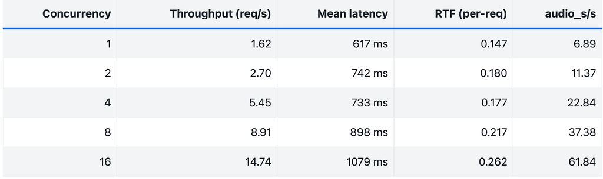

# Optimizing TTS Inference: Engineering Lessons from Profiling to Streaming in SGLang Omni

*Yichi Zhang — June 2026*

*Originally published on [Medium](https://medium.com/@yichizhang602/optimizing-tts-inference-engineering-lessons-from-profiling-to-streaming-in-sglang-omni-00d06e3fc78d)*

---

We recently launched SGLang-Omni, our full-modality, multi-stage LLM inference framework. In this blog, I want to share some developer's thought, and hope our design can shade more light on future TTS optimization work.

Optimizing Text-to-Speech (TTS) inference looks a lot like LLM optimization on paper, but the actual engineering bottlenecks are entirely different. Instead of just listing our optimizations, this post breaks down the mechanical sympathy required to make this pipeline fast — the bottlenecks we hit, the host-to-device pitfalls, and the architectural trade-offs we made along the way.

## The Higgs TTS Pipeline Under the Hood

To optimize the system, we first have to understand how data moves through the four stages of the Higgs pipeline:

- **Preprocessing (CPU):** Text tokenization and reference audio loading. This is purely IO-bound and handles no GPU compute.
- **Audio Encoder (GPU):** Uses HiggsAudioCodec (a DAC-like neural audio codec) to convert the reference audio waveform into discrete tokens. Output shape is `[T, 8]`, where T is the number of time steps and 8 represents parallel codebook tokens per step.
- **TTS Engine (GPU Backbone):** The core autoregressive (AR) model based on a Qwen3 LLM architecture. It generates the multi-codebook tokens step-by-step.
- **Vocoder (GPU):** A DAC Decoder that converts the generated tokens back into an audible waveform. It shares weights with the Encoder.

## Two Architectural Gotchas: Embeddings & The Delay Pattern

Higgs differs from standard LLMs in two major ways:

- **Fused Multi-Codebook Embedding:** Instead of maintaining eight independent embedding tables, Higgs concatenates them. We look up all codebooks in a single pass, outputting a tensor of shape `[B, N, V]` (Batch size, 8 Codebooks, Vocabulary size).
- **The Multi-Codebook Delay Pattern:** This is the trickiest part of the architecture. Higgs generates 8 tokens per AR step, but they have a strict hierarchy. Codebook 0 handles coarse structure (pitch, intonation), while Codebook 7 handles high-frequency textures. Generating them completely in parallel ruins audio quality; generating them sequentially ruins throughput.

To balance this, Higgs uses a Delay Pattern where Codebook i is delayed by i time steps relative to Codebook 0.

- Step 0: CB0 activates
- Step 1: CB0 → CB1 activate
- Step 2: CB0 → CB1 → CB2 activate
- … and so on.

This introduces a state machine with four phases: Delay Stage (staggered activation), Active Stage (normal sampling), Wind Down (triggered when CB0 hits the End-of-Character token), and Finished.

**The Catch:** Because we wanted to use CUDA Graphs later, this entire state machine had to be implemented via pure tensor operations (like `torch.where`). Zero host-side control flow allowed.

## Profiling

Before writing code, we profiled the naive pipeline and identified three core bottlenecks:

- **AR Decode Dominates:** A typical 10-second speech request requires 400 to 800 decode steps. Every single step involves a backbone forward pass, head projection, sampling, and Device-to-Host (D2H) synchronization. A tiny 0.1ms overhead per step inflates end-to-end latency by nearly 80ms.
- **The Encoder is Heavy but Static:** A single encoding pass takes 50–100ms. However, in production, users often reuse the same reference audio across multiple prompts.
- **Vocoder Queuing:** The vocoder is fast (~10ms per call), but under high concurrency, multiple AR generation loops finish at the exact same time, creating a massive serial bottleneck at the vocoder stage.

## 1. Encoder: Bypassing the Compute with LRU Caching

Since the fastest compute is the compute you don't do, we introduced an LRU Cache for the reference audio. If a user sends multiple prompts using the same reference voice, we skip the Encoder entirely and fetch the pre-computed delayed tokens instantly.

We also experimented with online batched encoding by bucketing incoming audio by length. While it improved raw throughput on paper, it created a new problem in production: GPU utilization shifted from smooth patterns to intermittent spikes, causing severe resource contention with the concurrent AR decode loops. We ultimately moved batched encoding offline (used strictly for bulk server warmups) and kept online encoding isolated.

## 2. AR Decode: Shaving Off Every Microsecond

Since AR decode is our primary bottleneck, we focused on eliminating kernel launch overhead and synchronization stalls.

### CUDA Graph Migration

Because each AR step launches a sequence of tiny kernels, the CPU launch overhead was killing performance. We captured the entire decode loop inside a CUDA Graph. To make this work, we had to eliminate all Python if-else branching in the model's forward path, rewriting the delay pattern state machine into in-place tensor operations with fixed memory addresses.

We will discuss further on how we use tensor to implement it and achieve GPU-CPU async decode in a later section of this blog.

### Merging D2H Synchronizations

Our baseline implementation performed three separate Device-to-Host (D2H) synchronizations per AR step to check tokens and states, creating repeated pipeline stalls. We optimized this by consolidating all intermediate data into a single staging tensor named `_cg_collect_staging`. Now, we execute exactly one combined transfer per step using the slice: `combined_cpu = staging[:n_real].cpu()`. This single change dramatically reduced pipeline latency.

### Asynchronous Decode + Lookahead

To hide the remaining D2H synchronization time, we implemented pipeline one-step overlapping. The GPU immediately kicks off the computation for step t+1 without waiting for the CPU to finish processing the sampling results from step t. This keeps the GPU fully utilized and completely masks the host transfer overhead.

The key insight is that the token causal chain can close entirely on the GPU, without waiting for the CPU, and that's why we will be able to compute t+1 step on GPU even without CPU's result on step t.

The overall timeline would be as shown in the picture:

On the GPU, the sampler pool `[max_bs+1, 8]` stores the most recent `last_codes` for each request; each request gets a row in the pool. And KV cache stores paged attention KV for decoding computation. CG active buffer stores the copy gathered from the sampler pool. And CG active buffer is a fixed address buffer so it is compatible with CUDA Graph.

On the CPU, it doesn't move codebook token to anywhere, it only reads from the host staging buffer which is copied from the CG active buffer through D2H copy. And CPU fill in three things: row table: `request_id → pool row index`; sampler params: `temperature, top_p, top_k`; Asynchronously handle last step's output: add more request / detect EOC and remove finished request → reflected in the next step's `cg_row_indices`, and in gather step, the CG active buffer will record `row_indices`. By this way, we make async updates possible.

Therefore, CPU and GPU can be each separated worker to give us more space for parallelization, they communicate through a shared ping-pong buffer. (ping-pong buffer means it's two buffer sections and one is read while the other one is written in one simultaneous step, and flip the role in next step) By this design, we will be able to achieve async decode.

### Torch Compile

We also evaluated `torch.compile` as a potential optimization shortcut. However, since our manual CUDA Graph migration had already eliminated the bulk of kernel launch overhead, `torch.compile` offered only marginal throughput improvements. Plus, it introduced a massive compilation penalty during model warmup, severely damaging our cold-start latency. We ultimately chose to remove it — as a pragmatic engineering trade-off favoring fast system initialization over redundant runtime optimizations.

## 3. Vocoder: Batched Decoding and Windowed Streaming

To prevent concurrent requests from blocking each other at the finish line, we implemented length-based bucketing for the vocoder, bundling sequences of similar lengths into execution batches to maximize GPU utilization.

To minimize Time to First Byte (TTFB), we built a windowed streaming mechanism. However, because of the architecture's delay pattern, the first N-1 steps are structurally incomplete. The vocoder physically requires at least N rows of delayed codes just to reverse the pattern and decode the very first audio frame.

To manage this irreducible latency boundary smoothly, we tuned three parameters for our streaming window:

- **Stride (75 frames):** Accumulates roughly 1 second of delayed codes before triggering a vocoder decode step.
- **Overlap (8 frames):** Looks back into the previous window to eliminate seam artifacts and clicks during audio stitching.
- **Holdback (4 frames):** Retains trailing frames where high-layer codebooks are still incomplete, preventing noise injection during mid-stream decodes.

## Benchmark

Referring directly to the data from the sglang-omni cookbook:

Throughput on Seed-TTS EN (full set, N=1088 per run). Client — max-concurrency sweep against a Higgs server (`max_running_requests=16`, bf16, CUDA Graph on). Each row is the mean of 3 runs. Hardware: 1× H100.

## Conclusion

Thank you for watching, hope this blog help you find some inspiration. We believe the best system optimizations don't come from blindly applying trendy techniques; they come from a deep understanding of the theory and clean engineering trade-offs.

## Join Us

SGLang-Omni is an open community project, and it is still growing fast. Cross-node multi-stage pipelines, fuller diffusion-stage support, and end-to-end RL training integration are all underway. If multi-stage inference is the kind of problem you find beautiful — whether you come from a systems background or arrive halfway, whether you specialize in kernel optimization or scheduling logic — **we are actively recruiting contributors**. Come build a truly industrial-grade omni-serving stack with us: open a PR, join the discussion, or say hi in the community channels linked below.

## Acknowledgments

**Higgs Audio v3 (Boson AI)** — Lead: Mu Li, Alex Smola, Lindsey Allen. Pre-train: Silin Meng, Ke Bai. Post-train: Ruskin Raj Manku, Huapeng Zhou. Data: Silin Meng, Dongming Shen. Evaluation: Jonah Mackey, Ke Bai, Ruskin Raj Manku. Inference: Huapeng Zhou, Silin Meng, Erik Li, Weisu Yin, Yizhi Liu. Release: Alex Chen, Ke Bai, Silin Meng.

**SGLang-Omni** — Haoguang Cai, shangming cai, Qiujiang Chen, Jiaxing Deng, Wenyao Gao, Yifei Gao, Jingwen Gu, yitong guan, Chenchen Hong, Hao Jin, Xinli Jing, Shenggui Li, Junrong Lin, Xinyu Lu, Yuan Luo, Ratish Palanisamy, Qian Mick, jinjiang qu, Shuai Shi, Chao Wang, Richard Wang, Suwen Wang, Zijie Xia, Yuhao Yang, Xuesong Ye, Fan Yin, Gaokai Zhang, Xiaoyu Zhang, Yichi Zhang, Chenyang Zhao

## Learn More

- **Model:** [boson-sglang/higgs-audio-v3-generation-4B-base](https://huggingface.co/boson-sglang/higgs-audio-v3-generation-4B-base)
- **Serving framework:** [SGLang-Omni on GitHub](https://github.com/sgl-project/sglang-omni)
- **Documentation:** [SGLang-Omni docs](https://sgl-project.github.io/sglang-omni/) · [Higgs TTS cookbook](https://sgl-project.github.io/sglang-omni/cookbook/higgs_tts.html)
- **Higgs optimization roadmap:** [#478](https://github.com/sgl-project/sglang-omni/issues/478)
- **Design background:** *SGLang-Omni: Redesigning the Inference Framework for Multi-Stage Generative Models*
