# Optimizing TTS Inference: Engineering Lessons from Profiling to Streaming in SGLang Omni

A TTS (Text-to-Speech) model converts written text into natural-sounding spoken audio. State-of-the-art TTS models often have a LLM backboned architecture, and of cause, this LLM autoregressive decoding takes most of the computation. In this sense, optimizing TTS inference looks similar to optimizing LLM inference at first glance: both have autoregressive decoding, KV cache, CUDA Graph, and continuous batching. But pratically speaking, TTS serving is not just one text-token decode loop. A request may go over reference-audio encoding, multi-layer codec-token generation, vocoder decoding, and streaming audio stitching. Many important wins indeed land outside the LLM backbone.

In this blog, we break down the mechanisms to make our TTS pipeline fast on [SGLang Omni](https://github.com/sgl-project/sglang-omni): the bottlenecks we hit, the host-to-device pitfalls, and the architectural trade-offs we made. We focus on two TTS models with distinct architectures: [Higgs](https://huggingface.co/bosonai/higgs-audio-v3-tts-4b) from Boson AI and [MOSS-TTS-Local-v1.5](https://huggingface.co/OpenMOSS-Team/MOSS-TTS-Local-Transformer-v1.5) from MOSI AI.


## TTS Pipeline and Prerequisites

<div align="center">
  
  <p><em>Figure 1. High-level TTS inference pipeline in SGLang-Omni, from preprocessing and audio encoding to autoregressive codebook generation and vocoder decoding.</em></p>
</div>

Unlike serving a chat LLM with a single autoregressive loop, TTS inference could be decomposed into four stages:

### TTS Decoding Stages

1. **Preprocessing (CPU):** Text tokenization and reference-audio loading, purely IO-bound and involves no GPU compute.

2. **Audio Encoder (GPU):** Autoregressive model can only process distinct tokens, not continuous values. The audio encoder compresses audio waves into a low-rate sequence of discrete RVQ token grids (shape `[T, N]`, where `T` is codec frames and `N` is RVQ layers, as discuss later). These tokens capture the timbre and prosody of the reference voice — the "how to sound" conditioning signal that the TTS engine will follow. You can found more details in [Codec Audio Encoding](https://github.com/zhaochenyang20/Awesome-ML-SYS-Tutorial/blob/main/transformers/omni/readme-en.md#codec-audio-encoding).

3. **TTS Engine (GPU):** The core autoregressive stage. The engine generates output speech as codec-token IDs rather than text-token IDs. Different models fill the multi-layer codec grid differently. Delay-pattern models such as Higgs and MOSS-TTS-v1.5 first generate in a delayed step × codebook grid; after undelay, diagonal groups become aligned back to `[T, N]` codec frames for the vocoder. Non-delayed dual-AR-style models such as FishAudio S2 Pro and MOSS-TTS-Local-v1.5 instead construct each frame more directly: a large AR backbone decodes the layer-0 token, and a smaller AR/local module fills the remaining RVQ layers. This codec-token generation stage takes most GPU time, and it is where model-specific scheduling, CUDA Graph, and async decode land.

4. **Vocoder (GPU):** The vocoder runs the reverse direction: it maps generated codec tokens back into a continuous audio waveform. Per-call compute is usually lightweight, but under high concurrency multiple AR loops can finish simultaneously and queue at the vocoder; streaming behavior also varies by vocoder's design.

A simplified data flow is: **Text + Reference Audio → RVQ encoding → multi-layer codec tokens generation → audio waveform**. In many TTS systems, audio encoding and vocoder decoding are two directions of the same audio tokenizer model: audio-to-codec-token for the encoder, and codec-token-to-audio for the vocoder. They are still separate logical roles in the serving pipeline, and, as we will see in MOSS, they may even be deployed as separate model instances. To further understand these stages, we need to introduce several essential concepts.

### Codec Token, Codebook, and RVQ Layer

To discuss multi-codebook generation clearly, we first need a simple visual object: the **step × codebook grid**. The horizontal axis is the autoregressive decode step, the vertical axis is the codebook or RVQ layer, and each cell is a sampled codec token at one step. Special cells such as BOC and EOC mark frame boundaries rather than real audio content.

<div align="center">
  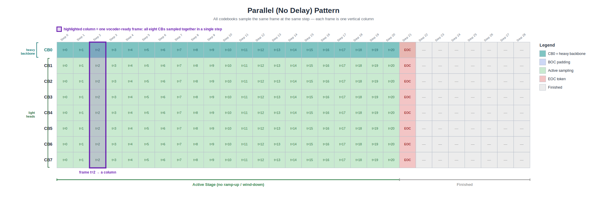
  <p><em>Figure 2. Non-delayed step × codebook grid. Green cells are active codec-token samples, red cells are EOC, and gray cells are finished slots. The highlighted purple column is one vocoder-ready frame: all codebooks describe the same audio time step.</em></p>
  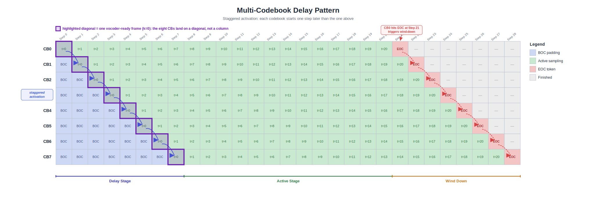
  <p><em>Figure 3. Delay-pattern step × codebook grid. Blue cells are BOC padding, green cells are active samples, red cells are EOC, and gray cells are finished slots. The highlighted purple diagonal, rather than a vertical column, forms one vocoder-ready frame after undelay.</em></p>
</div>


**1. Codec token, codebook, and RVQ layer.** As we said, text LLMs consume discrete token IDs from a finite vocabulary. TTS needs the same interface for audio: a **codec token** is an integer ID that represents a slice of sound. A **codebook** is the static vocabulary of one layer — in Higgs, each layer's codebook has roughly 4,096 possible IDs, each mapped to an embedding vector. An **RVQ layer** is the quantizer stage that owns one such codebook. Higgs has $N = 8$ RVQ layers, so each aligned audio unit (frame) ultimately needs 8 sampled IDs, one from each layer. Importantly, 4,096 is the number of candidates per layer, but the length of the layer could be rather longer. In the diagram, codec token is each grid cell, and RVQ layer is a line of grid cells. Each line has one shared codebook.

**2. RVQ (Residual Vector Quantization).** How to encoder audio waves into codec tokens is an art. The trending technique is [Residual Vector Quantization (Zeghidour et al., 2021)](https://arxiv.org/abs/2107.03312). For each frame of an audio, encode it into a single integer ID can only approximate the audio signal coarsely. RVQ stacks multiple quantizers in series: $L_0$ quantizes the framework/signal first, $L_1$ quantizes the residual error left by $L_0$, $L_2$ quantizes what $L_1$ still missed, and so on. Each layer captures progressively finer detail. We tend to assume that $L_0$ encode coarse structure (pitch, rhythm, energy), while deeper layers encode timbre and high-frequency texture. Decoding sums all layer contributions to reconstruct the audio.

In this sense, one frame of audio could be encoded into a list of codec tokens, and the length of the list is the number of RVQ layers. We tends to put it vertically, so the shape of the codec tokens for one frame is `[1, N]`. In a non-delayed grid, this frame is exactly one vertical column: all codebooks at step $k$ carry tokens for the same audio time $t=k$. In the backward process, a list of `[1, N]` codec tokens can be decoded back to a single frame of audio. Thus, the hierarchy residual mechanism makes the order of the generated codec tokens matters.

If all layers sample independently at the same time, `[1, N]` tokens are generated at the same time with only one forward pass, which means higher layers cannot adapt to what lower layers just emitted. The residual mechanism is broken, no ponder it will degrade the audio quality. On the other side, if we generate the codec token for $L_0$ in the first forward pass, then the codec token for $L_1$ in the second forward pass, and so on, quality improves but latency grows roughly with the number of layers. Every multi-layer TTS system has to navigate this trade-off, and the delay pattern is the codec token generation policy Higgs uses to do so. We will discuss it in the next section. Meanwhile, FishAudio S2 Pro and MOSS-TTS-Local-v1.5 use a [dual-AR-style architecture](https://github.com/zhaochenyang20/Awesome-ML-SYS-Tutorial/blob/main/transformers/omni/readme-en.md#dual-ar-model-inference-fish-audio-s2-pro) to solve this problem without delay: a large AR model produces the coarse $L_0$ token, and a smaller AR/local model fills the remaining codec layers for the same frame.

**3. Global step and codec frame.** We use the word frame several times, and can basically treat it as a unit of audio wave. A 10-second audio wave at 25 fps has roughly 250 such aligned codec frames. Frame and step are roughly equivalent to each other in the context of TTS inference, each timestep ultimately produces a vertical list of `[1, N]` codec tokens ($\{L_0, L_1, \ldots, L_{N-1}\}$), then get decoded back to a single frame of audio. Roughly speaking, in each global step for Higgs, the LM backbone forward once and get its logits, then each active RVQ layer's output head samples from the logits over its ~4096-entry codebook and get one ID. One global step therefore writes at most 8 IDs. It's just the same as LLM use an LM head to sample one text token from the logits. But in Higgs, we have to use multiple heads to complete the whole frame, `[1, N]` codec tokens.

In this sense, when passed to the vocoder, a codec frame has to be formed into a column of `[1, N]` on the step x codebook grid, as we have shown in Figure 2. But on the original step x codebook grid, frames could layed be different. Without delay pattern, a vocoder-ready codec frame $k$ is exactly the vertical column $\{L_0[k], L_1[k], \ldots, L_N[k]\}$ of the original grid. But with delay pattern, layer $i$ is shifted by $i$ steps, so the same frame is no longer a column during generation; it lands on a diagonal: $\{L_0[k], L_1[k+1], \ldots, L_N[k+N]\}$. That is what we show in Figure 3. After **undelay**, this diagonal is shifted back and becomes row $k$ of the aligned `[T, N]` grid, which is the vocoder-ready representation.

These concepts set up the core question that both delay pattern and Dual AR try to resolve: at each global step, should all $N$ layers sample real IDs immediately, should each layer get its own full backbone forward pass, or should we separate coarse-layer generation from fine-layer generation? Delay pattern answers this with staggered activation, while Dual AR answers it with a large AR model for $L_0$ and a smaller AR/local module for the remaining codebooks.

## Codebook Generation Strategies

We can finally explain in detail delay pattern and dual AR as two codebook generation strategies.

Let's put four scheduling strategies together:

| Strategy | What happens at global step $s$ | Quality / speed |
|----------|--------------------------------|-----------------|
| Parallel | All $N$ layers sample a real token simultaneously from the same logits | Fast, but $L_i$ cannot see what $L_{i-1}$ just emitted → poor RVQ hierarchy |
| Sequential | Finish the entire $[1, N]$ list of one frame sequentially by $L_0$ to $L_{N-1}$ | Preserves hierarchy, but latency scales roughly $N$ times |
| Staggered (delay pattern) | All layers sample their $s$-th codec token at the same time, but these tokens are used in different frames | Near-parallel speed with causal cross-layer conditioning |
| Dual AR / local transformer | A large AR model samples $L_0$ once per frame, then a smaller AR/local model fills the remaining layers for the same frame | Keeps the frame as a vertical column, while moving fine-layer decoding to a cheaper model |

### Delay Pattern

The delay pattern proposed an artistic solution to the trade-off under the residual mechanism. It staggers layer activation along the shared global-step axis: layer $i$ starts real sampling $i$ steps after layer $0$, with its first $i$ slots filled by BOC placeholders. In other words, the frame under the delay pattern is neither vertical nor horizontal, but diagonal or skewed. As we said, it's $\{L_0[k], L_1[k+1], \ldots, L_7[k+7]\}$ in the frame grid of Higgs.

The core idea of staggering: all layers share the same global step axis and the same per-step backbone forward. At each step, every layer slot in the step × codebook grid is written, but inactive layers receive a BOC (Beginning-of-Code) placeholder instead of a real sample, while active layers each draw one ID from their own codebook in parallel. Once layer $i$ activates at global step $i$, each subsequent step adds one more valid token along its first valid token. Undelay later regroups diagonals from this grid into columns of the aligned `[T, N]` grid.

The delay-pattern Figure 3 compresses the lifecycle into 29 global steps for illustration. In production, the grid simply extends horizontally: one backbone forward per step to get one logits, 8 codebook heads samples from the logits, and write the sampled codec tokens its grid. This process continues until $L_0$ emits EOC (end of codec) and wind-down finishes.

Note that when layer $i$ produces its first valid token at global step $i$, every preceding layer $L_j$ ($j < i$) has already produced its first valid token at global step $j$. $L_{i-1}$'s token from step $i-1$ is available for conditioning on. The backbone's KV cache, accumulated over steps $0 \ldots i-1$, already encodes the history of previous layers' valid tokens. This is exactly the causal hierarchy RVQ requires — without running $N$ fully separate AR passes. Wind-down mirrors ramp-up symmetrically: when $L_0$ emits EOC at step $T-8$, higher layers continue for another $N-1$ steps before stopping ($L_1$ at $T-7$, $L_2$ at $T-6$, ...).

Another way to describe the same process is as a four-phase state machine: Delay Stage (staggered activation), Active Stage (normal sampling), Wind Down (triggered when $L_0$ hits the End-of-Codes token), and Finished. I dislike these terminology, since we have already got the principles of the delay pattern clearly.

The trade-off of the delay pattern is it adds exactly $N$ extra AR steps to get $T$ codec frames compared with naive parallel layer generation, which is the ramp-up / wind-down overhead visible in the diagram. For a typical 250-step generation, this is a ~3% overhead. The exchange is better audio quality than naive parallel sampling, at near-parallel speed compared to fully sequential layer generation.

Also, the delay pattern is not unique to Higgs and it's not the only solution. Delay pattern has been widely adopted in other multi-codebook audio generation models, including [MOSS-TTS-v1.5](https://huggingface.co/OpenMOSS-Team/MOSS-TTS-v1.5). But [MOSS-TTS-Local-Transformer-v1.5](https://huggingface.co/OpenMOSS-Team/MOSS-TTS-Local-Transformer-v1.5) is a different checkpoint: like FishAudio S2-Pro, it follows a non-delayed dual-AR-style path where a slow AR backbone handles the coarse layer and a faster local module decodes the acoustic codebooks inside the same frame.

## Dual AR

As we said, dual AR chooses a different decomposition. Instead of letting the same backbone produce all codebook layers with a delay schedule, it separates the problem into a slow AR path and a fast AR path. The outer, heavier AR backbone predicts the coarse layer $L_0[k]$ for frame $k$; then a smaller AR module or local transformer sequentially fills $\{L_1[k], L_2[k], \ldots, L_{N-1}[k]\}$ for the same frame. This means a vocoder-ready frame remains a vertical column in the original step × codebook grid, so there is no need to undelay diagonals before vocoder decoding.

The trade-off of Dual AR is that each frame still contains an inner loop over codebooks. However, that loop runs inside a much smaller module, rather than calling the full backbone once per RVQ layer. This is why Dual AR can preserve the residual hierarchy without paying the full $N$-times backbone cost. In practice, models such as FishAudio S2-Pro and MOSS-TTS-Local-Transformer-v1.5 follow this family: the slow AR path handles the coarse semantic/acoustic layer, and the fast AR or local transformer handles the remaining acoustic codebooks inside the same frame.

So in summary, delay pattern and Dual AR are two different ways to avoid the same bad extremes: naive all-layer parallel sampling (fast but lower quality) and fully sequential heavy-backbone generation (higher quality but roughly $N$ times slower). Delay pattern keeps one shared backbone step and spreads a frame across a diagonal, then undelays it later. Dual AR keeps the frame as a vertical column, but moves fine-layer generation into a cheaper inner model.

## Model Architectures

After all those preparations, we can finally get to the detailed model architectures and optimizations.

### Higgs Pipeline

<div align="center">
  
  <p><em>Figure 4. Higgs TTS pipeline, where the Qwen3-scale backbone directly predicts multi-codebook audio tokens and the DAC vocoder reconstructs waveform audio.</em></p>
</div>

- **Preprocessing (CPU):** Text tokenization and reference audio loading as usual.
- **Audio Encoder (GPU):** Uses [HiggsAudioCodec](https://huggingface.co/bosonai/higgs-audio-v2-tokenizer), a DAC-based audio tokenizer with a semantic encoder branch. This tokenizer provides both directions: encoding reference audio into RVQ tokens and decoding generated tokens back to waveform.
- **TTS Engine (GPU Backbone):** The core autoregressive model — a Qwen3-4B decoder. Each global decode step embeds and sums the previous step's multi-layer token IDs into one input vector, runs one causal backbone forward pass, then uses 8 codebook heads to sample one candidate ID per RVQ layer.
- **Vocoder (GPU):** Uses the decode direction of the DAC tokenizer to convert generated tokens back into an audible waveform. For Higgs, this does not require deploying another large standalone model instance.

### MOSS Pipeline

<div align="center">
  
  <p><em>Figure 5. MOSS-TTS-Local pipeline, where a backbone step is followed by a local-transformer loop over RVQ layers and a MOSS-Audio-Tokenizer-v2 vocoder.</em></p>
</div>

MOSS-TTS-Local-v1.5 uses a local-transformer architecture to fill the higher level RVQ layers and shares the same high-level four-stage pipeline structure as Higgs.

- **Preprocessing (CPU):** Text tokenization and reference audio loading, typical TTS. Purely IO-bound.
- **Audio Encoder (GPU):** Uses MOSS-Audio-Tokenizer-v2, a ~1B-parameter audio tokenizer model. Its encoder direction converts reference audio into discrete RVQ tokens. MOSS-TTS-Local uses 12 RVQ layers plus one text/control channel, so the full grid layout is `[T, 13]`.
- **TTS Engine (GPU Backbone + Local Transformer):** The Qwen3 backbone runs once per step to get one logits and sample the $L_0$ codec token. After each backbone step, a 1-layer local transformer sequentially samples remaining 12 RVQ-layer codec tokens from the backbone's output. The 13 sampled embeddings are then summed back as the backbone's next-step input. This keeps the backbone lightweight, and the local transformer's 12-step sequential loop could be the latency bottleneck (see CUDA Graph section).
- **Vocoder (GPU):** Uses the decode direction of MOSS-Audio-Tokenizer-v2. Logically this is the reverse of the audio encoder, but in serving we deploy a separate MOSS-Audio-Tokenizer-v2 instance for vocoder decoding, rather than reusing the encoder instance. Unlike Higgs's DAC vocoder, it is natively streamable — supporting frame-by-frame decode, with no need for windowed chunking, overlap, or crossfade. However, this extra ~1B-parameter vocoder instance is much heavier than Higgs's DAC vocoder and introduces significant overhead if not properly optimized.

### Optimization Implications

<div align="center">
  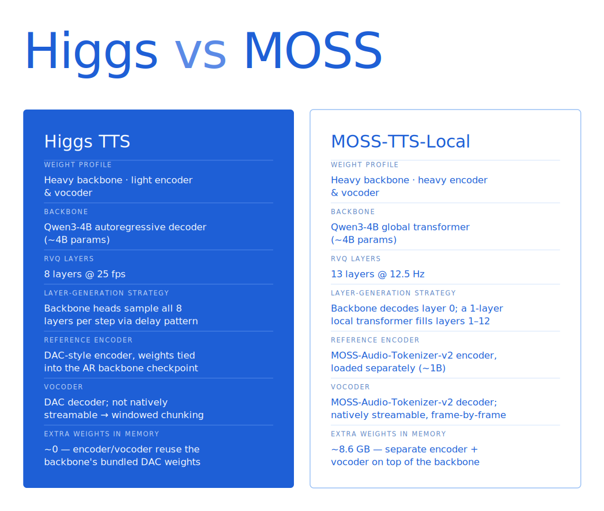
  <p><em>Figure 6. Architecture comparison between Higgs and MOSS-TTS-Local, highlighting differences in backbone role, encoder/vocoder weight, layer-generation strategy, and streaming behavior.</em></p>
</div>

As shown in the picture, both models use a Qwen3-scale backbone (~4B parameters), but differ significantly in encoder/vocoder weight and layer-generation strategy. Higgs is a "heavy backbone, light encoder and vocoder" system: its DAC-based audio tokenizer is small and bundled inside the checkpoint, so the backbone dominates total model size. MOSS pairs a similar-scale backbone with MOSS-Audio-Tokenizer-v2, a much heavier ~1B-parameter audio tokenizer. More importantly, MOSS deploys a separate MOSS-Audio-Tokenizer-v2 instance for vocoder decoding, so vocoder-side optimization becomes much more important. Also, their vocoders have opposite streaming properties — Higgs's DAC vocoder is not natively streamable (requiring windowed chunking with crossfade), whereas MOSS's vocoder supports frame-by-frame streaming out of the box.

One notable observation: MOSS streaming and non-streaming perform nearly identically at low concurrency (2.8 vs 2.6 qps at c=2 — streaming is even slightly faster), but streaming scales much worse: non-streaming reaches 10.9 qps at c=16 (4.2× over c=2), while streaming only reaches 6.5 qps (2.3× over c=2). This is a concurrency scaling bottleneck in the streaming vocoder path, not a per-request efficiency issue. The exact root cause is still under investigation — potential factors include streaming slot management overhead and suboptimal coalescing at high concurrency. Narrowing this gap is an active area of work.

Those differences directly shape our optimization strategy. At a high level, both models share the same four optimization directions: (1) encoder caching to skip redundant reference-audio encoding, (2) CUDA Graph capture to eliminate per-step kernel launch overhead in AR decode, (3) async CPU–GPU decode to overlap D2H synchronization with GPU compute, and (4) vocoder batching and streaming to reduce tail latency and time-to-first-audio. While both models benefit from all four, their architectural differences shift where the biggest wins land:

- **Encoder caching is more critical for MOSS:** Each MOSS encode costs ~250ms per reference (vs 50–100ms for Higgs) due to the ~1B-parameter audio tokenizer. This motivates a bigger cache for MOSS to amortize encoder time cost.
- **Kernel launch overhead matters more for MOSS:** Because the MOSS backbone is lighter, per-step compute is shorter, making kernel launch overhead a proportionally larger fraction of step time. This is why CUDA Graph capture of the frame-decode micro-loop (1 + 12 micro-steps) is essential for MOSS.
- **Batched encoding & AR stage optimization is more important for Higgs:** Since Higgs AR backbone is much heavier and takes most of the time, higher-concurrency batched processing can greatly increase throughput on Higgs.
- **Vocoder optimization is more important for MOSS:** MOSS serves vocoder decoding with a separate ~1B-parameter model instance, so the vocoder has a much heavier workload than Higgs. We therefore implemented CUDA Graph optimization specifically for MOSS vocoder to reduce each-step launch overhead.
- **MOSS encoder and vocoder are distinct models:** Unlike Higgs's lightweight DAC tokenizer, which uses a single model for both encoding and decoding directions, MOSS-Audio-Tokenizer-v2's encoder (~1B) and decoder (~1B) are architecturally separate models with different weights — often packaged together as a ~2B checkpoint but not shared. The full MOSS-TTS-Local-v1.5 weight breakdown is ~1B audio encoder + ~4B Qwen3 backbone + ~1B vocoder. Currently we deploy separate model instances for each; since both are transformer-based with their own KV caches, sharing a single set of weights would require managing separate KV cache address spaces for encoding vs decoding to avoid conflicts — a possible future optimization.
- **Streaming strategy is fundamentally different:** While Higgs needs windowed chunking with stride/overlap/holdback to work around DAC's non-streamable vocoder, MOSS's natively streamable vocoder eliminates this entirely, but introduces slot management complexity at high concurrency.

## Layer-by-Layer Optimizations

### Baseline: SGLang Scheduler and RadixCache

All optimizations in this blog are measured on top of a baseline that already includes SGLang's core serving infrastructure: continuous batching, paged KV cache, RadixAttention for prefix sharing, and CUDA Graph support for the backbone forward pass. This baseline was built up incrementally as we onboarded TTS models onto SGLang-Omni: FishAudio Dual AR was the first (commit `60c6e75`, 2026-02-27), followed by full scheduler integration for S2-Pro (commit `92dbd45`, 2026-03-09), and Higgs TTS support in PR #428 (commit `4d6be58`, 2026-05-17). By the time we began the optimization work described below, both Higgs and MOSS were already running on this scheduler with RadixCache — so these infrastructure features are not counted as optimizations in the benchmark comparisons.

### Where is the Time Actually Spent?

We profiled the naive pipeline of Moss and Higgs after barely support them before further optimizations:

**Higgs:**

- **AR Decode Dominates:** A typical 10-second speech request requires 250 decode steps. Every single step involves a backbone forward pass, head projection, sampling, and Device-to-Host (D2H) synchronization. A tiny 0.1ms overhead per step inflates end-to-end latency by nearly 25ms.
- **The Encoder is Heavy but Static:** A single encoding pass takes 50–100ms. However, in production, users often reuse the same reference audio across multiple prompts.
- **Vocoder Queuing:** The vocoder is fast (~10ms per call), but under high concurrency, multiple AR generation loops finish at the exact same time, creating a massive serial bottleneck at the vocoder stage.

**MOSS:**

- **Frame-local decode dominates:** Instead of pure backbone AR steps, each frame requires a global backbone forward pass plus a local transformer micro-loop that sequentially samples 12 RVQ codes with feedback embeddings. The eager (non-CUDA Graph) path is kernel-launch-bound at ~22ms/frame independent of batch size, dominated by the 1 + 12 micro-steps and 13 seeded sampling passes per frame.
- **The reference encoder is heavier:** MOSS's ~1B-parameter codec takes ~0.25 GPU-seconds per reference encode (vs 50–100ms for Higgs), making audio encoding cache even more critical.
- **Vocoder is heavier, but natively streamable:** The MOSS-Audio-Tokenizer-v2 decoder supports frame-by-frame streaming, which shifts the streaming bottleneck from "windowed chunking with crossfade" (Higgs) to "frame scheduling and slot management" (MOSS).

With those bottlenecks, our optimization strategies are as follows:

<div align="center">
  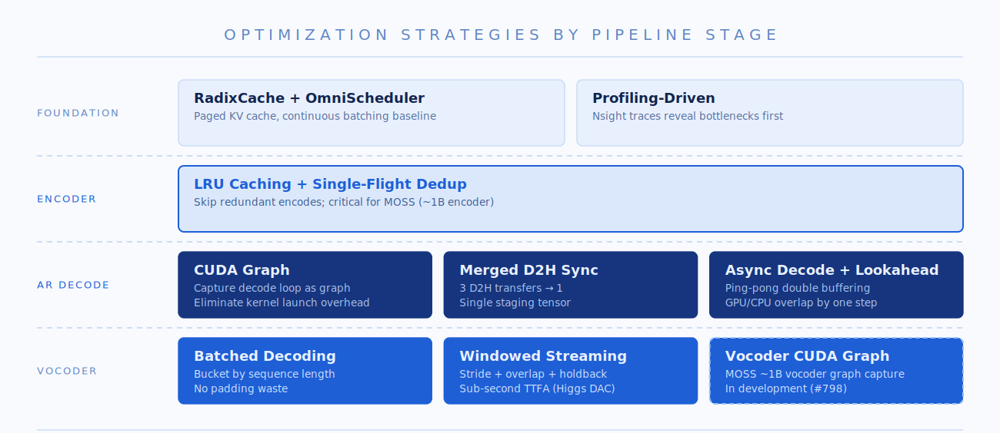
  <p><em>Figure 7. Optimization strategy overview, mapping the profiled bottlenecks to encoder caching, AR decode optimization, vocoder optimization, and streaming-specific work.</em></p>
</div>

### Encoder LRU Caching: Bypassing the Compute

The encoder converts a reference audio clip into delayed codec tokens. In production, users frequently reuse the same reference voice across many prompts (e.g., a fixed narrator voice but generate multiple audio contents). Each encoding pass costs 50–100ms of GPU time, but the output is deterministic for identical input audio. This makes it a textbook caching opportunity.

<div align="center">
  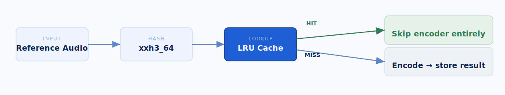
  <p><em>Figure 8. LRU cache flow for reference-audio encoding, bypassing repeated GPU encoder work when the same reference audio is reused.</em></p>
</div>

In this sense, we introduce an LRU cache keyed by the audio waveform content. On a cache hit, the encoder stage is skipped entirely. For text, SGLang's RadixCache enables prefix sharing — two prompts that start with the same tokens can reuse partial KV cache. However, audio caching is fundamentally different: there is no meaningful prefix relationship in the time-frequency domain, so we use strictly exact-match lookup. The cache key is a content hash of the input audio: `xxh3_64` for raw bytes/base64 input. Two audio clips that produce the same hash are a hit; everything else is a miss.

### Encoder Batching

On Higgs, we experimented with online batched encoding by bucketing incoming audio by length. While it improved raw throughput on paper, it created a new problem in production: GPU utilization shifted from smooth patterns to intermittent spikes, causing severe resource contention with the concurrent AR decode loops. We ultimately moved batched encoding offline (used strictly for offline inference scenarios) and kept online encoding isolated.

On MOSS, the heavier ~1B encoder makes batching more attractive in theory — the larger per-encode cost means batching amortization should outweigh collection delay. However, when we pursued deeper batching optimizations, we discovered two issues.

First, the throughput gain was illusory. An initial 23% improvement turned out to be confounded with a cache capacity increase (256 → 1024 entries) in the same commit. After properly controlling variables, batching alone actually hurt throughput by 0.8–4.4%. The reason: to batch audio of different lengths, we must bucket references into length groups and wait for enough samples to fill each bucket. In practice, concurrent requests rarely land in the same bucket, so most "batches" are size 1 or 2 with all the scheduling overhead and none of the throughput benefit.

Second, batched encoding produces different discrete tokens than single-item encoding. Concretely, `encode(audio_A)` and `encode([audio_A, audio_B])[0]` return different codec tokens for the same audio — about 5.8% of tokens flip. Logically this should not happen, but the root cause is that changing the batch size changes the M dimension of the underlying BF16 GEMM, which causes cuBLAS to select a different kernel with a different floating-point accumulation order. The resulting sub-ULP drift is normally invisible, but RVQ's hard quantization immediately follows the encoder: for frames near a codebook boundary, a one-bit perturbation is enough to snap to a different codeword, flipping the discrete token. This makes batched encoder caching unsafe and introduces a new source of train-serving skew unique to neural (as opposed to symbolic) tokenizers. For a detailed analysis, see [The Root Cause of RL Training-Serving Skew is Pervasive Across Inference Systems](moss-tts-local-batch-encoder-skew.md).


### CUDA Graph

Since AR decode is our primary bottleneck, we need to put the majority of work into optimizing this step. In our implementation, we focused on eliminating kernel launch overhead and synchronization stalls using CUDA Graph and CPU-GPU async decode, respectively.


<div align="center">
  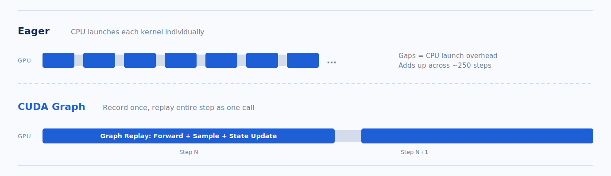
  <p><em>Figure 9. Eager execution versus CUDA Graph replay, showing how fixed-address buffers and captured kernels reduce per-step launch overhead.</em></p>
</div>

TTS models consist of many tiny modules — sampling, codebook lookup, state updates — and each AR step launches a long sequence of small kernels. In eager mode, the CPU must dispatch each kernel individually, and the launch overhead between kernels adds up across hundreds of decode steps. CUDA Graph eliminates this by recording the entire kernel sequence once and replaying it as a single GPU-side operation, removing per-kernel CPU dispatch entirely.

**The static-path challenge.** CUDA Graph records a fixed sequence of kernel launches and replays the exact same sequence every time, so the execution path must be fully static — any Python `if/else` that depends on runtime data breaks the recording. For Higgs, this meant rewriting the delay pattern state machine (which tracks per-request codebook offsets, EOC countdowns, and done flags) from branching Python logic into in-place tensor operations. For MOSS, the frame-decode micro-loop (1 backbone step + 12 local-transformer steps per frame) similarly had to be flattened into a single captured graph with no conditional branching.

**Fixed-address shadow buffers.** CUDA Graph replays kernels at the exact same memory addresses that were used during recording. But the SGLang scheduler dynamically assigns request slots — a request might be in slot 3 this step and slot 7 the next as requests arrive and finish. To bridge this gap, we pre-allocate a set of fixed-address GPU buffers shaped `[max_batch, ...]` at server start — one buffer for each piece of per-request decode state (delay counters, EOC countdowns, done flags, last emitted codes, sampled outputs, etc.). These buffers live at permanent addresses that the graph can safely reference on every replay.

**Gather → replay → scatter.** Before each graph replay, the runner *gathers* the active requests' state from whatever scheduler slots they currently occupy into the fixed shadow buffers (GPU-to-GPU copy). The graph then reads and updates these buffers in place. After replay, the runner *scatters* the updated state back to each request's actual slot in the scheduler pool. Because the graph always runs with the full `max_batch` dimension, inactive slots are simply masked out — the kernels execute on them but their results are never scattered back. Finally, the runner packs the step's outputs (codes + done flags) into a single contiguous staging buffer, enabling a single D2H transfer per step instead of one per request.

### Merging D2H Synchronizations

In the baseline implementation, each AR decode step performed three separate Device-to-Host (D2H) transfers: one to read the sampled codec tokens, one to check each request's end-of-chunk (EOC) flag, and one to read the done status. Each transfer calls `.cpu()` on a GPU tensor, which implicitly synchronizes the CUDA stream — the CPU blocks until all preceding GPU work finishes and the data lands in host memory. With three sync points per step and hundreds of steps per request, the cumulative stall time was significant.

We eliminated this by packing all three pieces of per-step output — sampled tokens, EOC flags, and done status — into a single contiguous staging buffer (`_cg_collect_staging`) during the CUDA Graph replay. At the end of each step, one `.cpu()` call transfers the entire buffer: `combined_cpu = staging[:n_real].cpu()`. The CPU then slices the result locally to extract tokens, EOC, and done — pure host-side indexing with no additional GPU synchronization. This reduces the sync count from 3× per step to 1×, cutting the per-step D2H stall by roughly two-thirds.

### Asynchronous Decode + Lookahead

The vanilla pattern of CPU–GPU synchronization is as shown in the picture below. GPU and CPU process in the same flow and will stop and wait for each other. We discovered this pattern is inefficient since the D2H sync time can stack up to very high during AR decoding. To hide the remaining D2H synchronization time, we want to discover a pattern to let GPU and CPU work simultaneously and not wait for each other.

The async decode splits each step into two halves — a GPU-side **launch** and a CPU-side **resolve** — that run one step apart:

This idea is inspired by SGLang's [overlap scheduler](https://github.com/zhaochenyang20/Awesome-ML-SYS-Tutorial/blob/main/sglang/scheduler/readme-en.md#overlap-scheduler-hiding-scheduling-overhead-behind-operators), which hides CPU scheduling overhead behind GPU operators in LLM serving (see also the [SGLang v0.4 blog](https://lmsys.org/blog/2024-12-04-sglang-v0-4/)). We apply the same principle to TTS AR decoding: overlap the CPU-side result processing of the previous step with the GPU-side computation of the current step.

The overall timeline would be as shown in the picture:

The event loop implements this as: each iteration launches the current step (enqueue GPU work + async D2H + record event), then resolves the previous step (check event, read host buffer, process results). When the batch size drops below 2, it falls back to synchronous execution, since the async fixed overhead will be larger than the performance gains from overlapping.

<div align="center">
  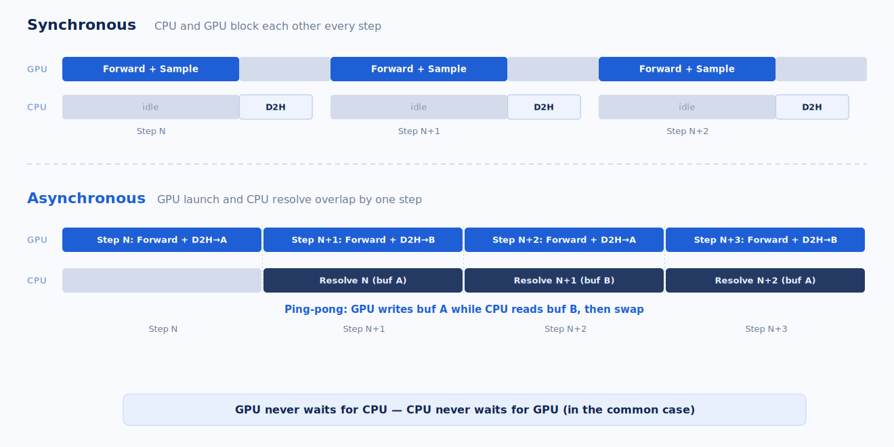
  <p><em>Figure 10. Asynchronous decode timeline, where GPU launch for step N overlaps with CPU resolve for step N-1 through ping-pong host buffers.</em></p>
</div>

**GPU launch (step N):** Before replaying the CUDA Graph, the runner gathers each active request's current state (delay counter, last emitted codes, done flag, etc.) from a shared pool into the graph's fixed-address buffers. The graph then runs the forward pass and sampling, writes updated state back to the pool, and packs the step's outputs (all 8 codebook codes plus completion flags) into a single staging tensor. This staging tensor is copied to a pinned host buffer asynchronously — the GPU does not wait for the copy to finish. A CUDA event is recorded right after the copy is enqueued, serving as a "data is ready" signal for the CPU.

**CPU resolve (step N-1):** While step N runs on the GPU, the CPU processes step N-1's results. It checks the CUDA event (non-blocking) to see if the D2H copy has landed. In the common case it has — the CPU reads the host buffer and runs per-request bookkeeping: appending codes to each request's output, detecting end-of-generation, emitting streaming audio chunks, and removing finished requests. If the copy hasn't landed yet (rare), the CPU blocks briefly until it does.

**The ping-pong buffer:** Since the GPU is writing step N's results to a host buffer while the CPU is simultaneously reading step N-1's results, they cannot share the same buffer. We allocate two pinned host buffers and alternate between them each step. At step N the GPU writes to buffer A while the CPU reads from buffer B; at step N+1 the roles flip. This avoids a data race that CUDA stream ordering alone cannot prevent — stream ordering governs GPU-side operations, but the CPU's read of pinned memory is not synchronized by the stream.

**Lookahead guard:** Because launch runs before resolve, a request that finished at step N-1 (via EOC) is still present in step N's batch — the CPU hasn't had a chance to remove it yet. The runner detects this by checking the request's done flag in the pool before launching, and routes finished requests to a dummy padding row. The graph still runs over these slots (CUDA Graph requires a fixed batch shape), but their outputs are discarded during the next resolve. This prevents double-counting finished requests.

Therefore, the CPU and GPU can act as separate workers to allow for greater parallelization, communicating through a shared ping-pong buffer.

**Torch Compile**

We also evaluated `torch.compile` as a potential optimization shortcut. However, since our manual CUDA Graph migration had already eliminated the bulk of kernel launch overhead, `torch.compile` offered only marginal throughput improvements. Plus, it introduced a massive compilation penalty during model warmup, severely damaging our cold-start latency. We ultimately chose to remove it—as a pragmatic engineering trade-off favoring fast system initialization over redundant runtime optimizations.

### Vocoder: Optimization and Windowed Streaming

**Batched Decoding**

<div align="center">
  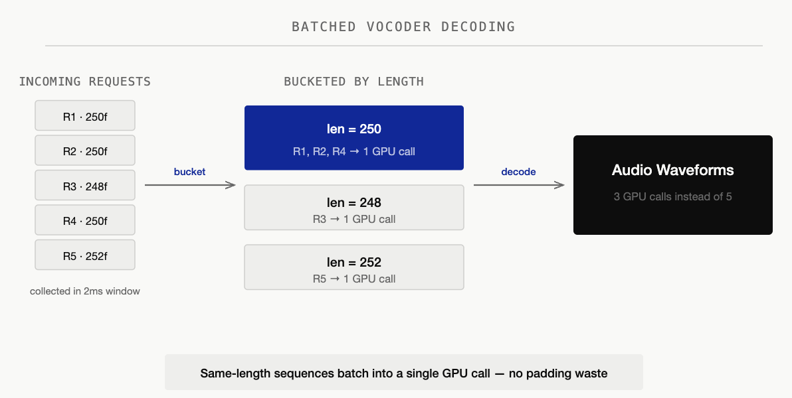
  <p><em>Figure 11. Batched vocoder decoding, collecting nearby completed requests to avoid serial tail latency at the waveform reconstruction stage.</em></p>
</div>

**Why:** Under high concurrency, multiple AR decode loops finish at nearly the same time — they enter the pipeline together, generate similar-length utterances, and race to the vocoder stage simultaneously. With 16 concurrent requests each taking ~15ms to vocode, the last request in line waits 240ms just for its turn — turning a fast stage into a tail-latency killer.

**How:** We batch vocoder calls using a short collection window (2ms / up to 4 requests). Before decoding, each request's delayed codes are un-delayed (reversing the delay pattern) and special tokens (BOC/EOC) are clamped to valid codec range. To avoid wasting compute on padding, we use bucketed batching — grouping sequences by length so that each batch contains only same-length items. Sequences that share a length are stacked and decoded in a single GPU call; sequences with unique lengths decode individually. This eliminates the tail-latency problem: instead of 16 serial vocoder calls, we issue a handful of batched calls.

**Vocoder CUDA Graph (MOSS Only)**

<div align="center">
  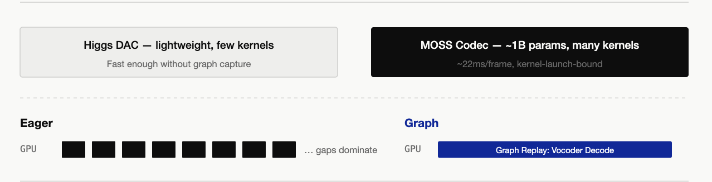
  <p><em>Figure 12. Vocoder CUDA Graph optimization for MOSS-TTS-Local, where the heavier MOSS-Audio-Tokenizer-v2 vocoder benefits from captured replay.</em></p>
</div>

**Why:** MOSS's vocoder uses a separate ~1B-parameter MOSS-Audio-Tokenizer-v2 instance, which launches far more kernels per decode call than Higgs's lightweight DAC vocoder. Just as with AR decode, kernel launch overhead becomes the bottleneck. Higgs's DAC vocoder is light enough that it does not need this optimization.

**How:** Capture the vocoder's decode forward pass as a CUDA Graph, using the same techniques as the AR CUDA Graph — pre-allocated fixed-address buffers, bucketed batch sizes, and graph replay. We won't repeat it here for conciseness.

**Windowed Streaming (Higgs Only)**

<div align="center">
  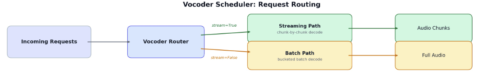
  <p><em>Figure 13. Vocoder request routing for streaming, deciding when generated code chunks should be decoded, overlapped, and emitted.</em></p>
</div>

**Why:** Without streaming, the user hears nothing until the entire AR decode loop completes — hundreds of steps of silence. So we want to stream the process to minimize TTFB (time to first byte). But you can't just naively chop the code sequence into chunks and decode each independently like LLM: neural audio tokenizers can produce audible clicks at every splice boundary because the vocoder's internal convolution state is disrupted. On top of that, the delay pattern means the trailing rows in any mid-stream snapshot have incomplete high-layer codebooks — decoding them injects noise.

Note: vocoders which natively support streaming decode (such as MOSS's MOSS-Audio-Tokenizer-v2 vocoder) maintain continuous decoder state across the frame, so there are no splice boundary artifacts — the following section only applies to non-streamable vocoders (e.g. Higgs's DAC vocoder).

**How:** To manage this irreducible latency boundary smoothly, we tuned three parameters for our streaming window:

- **Stride (75 frames):** Accumulates roughly 3 seconds of delayed codes before triggering a vocoder decode step.
- **Overlap (8 frames):** Looks back into the previous window to eliminate seam artifacts and clicks during audio stitching.
- **Holdback (4 frames):** Retains trailing frames where high-layer codebooks are still incomplete, preventing noise injection during mid-stream decodes.

<div align="center">
  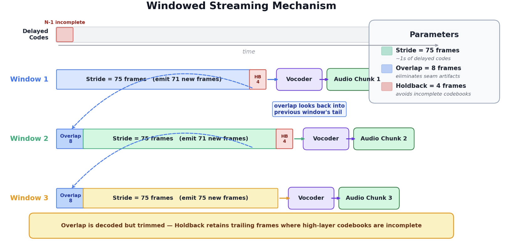
  <p><em>Figure 14. Windowed streaming details for Higgs, using stride, overlap, and holdback to reduce clicks and avoid decoding incomplete delayed rows.</em></p>
</div>

For streaming, we accumulate codes until a stride threshold (75 frames, ~1 second of audio) before triggering a decode — amortizing kernel launch overhead across a meaningful chunk. When decoding, we overlap by looking 8 frames back into the previously decoded region, re-decoding them jointly with new tokens so the codec sees continuous context across boundaries. We then extract only the delta (new samples past the overlap) and crossfade-blend it with the held-back tail of the previous chunk using a linear fade-in/fade-out envelope — smoothing any residual amplitude mismatch at the splice point.

Finally, a holdback of 4 frames retains the trailing rows where high-layer codebooks are still filling in due to the delay pattern. These incomplete rows are only released on the final flush when the full sequence is available.

The delay pattern also creates an irreducible startup cost: the vocoder needs at least N rows (N = number of codebooks) just to reverse the pattern and produce the first audio frame. Combined with the stride, the actual TTFB lands at ~300–400ms at our measured RTF — well under the 500ms conversational threshold.

## Benchmark Results

We benchmarked both Higgs and MOSS-TTS-Local to quantify the speedup from our optimizations. Each model is tested in two builds: **vanilla** (all optimizations off) vs **perf** (all optimizations on).

**Environment:** 1× H100 80GB, colocate single-GPU. Seed-TTS-Eval EN full set (N=1088). Each data point is the mean of 3 runs.

### Higgs TTS — Streaming (vanilla vs perf)

| Concurrency | qps vanilla | qps perf | **Speedup** | RTF van / perf | Latency mean (s) van / perf | TTFP (ms) van / perf |
|---:|---:|---:|:---:|---:|---:|---:|
| 2  | 1.286 | 2.908  | **2.26×** | 0.373 / 0.166 | 1.555 / 0.688 | 162 / 153 |
| 4  | 2.411 | 5.934  | **2.46×** | 0.393 / 0.163 | 1.658 / 0.673 | 166 / 109 |
| 8  | 4.313 | 9.856  | **2.29×** | 0.442 / 0.196 | 1.852 / 0.810 | 182 / 126 |
| 16 | 7.077 | 14.634 | **2.07×** | 0.533 / 0.261 | 2.247 / 1.088 | 214 / 176 |

Optimizations deliver a stable **~2.1–2.5×** throughput gain across all concurrency levels, with RTF roughly halved and first-audio latency (TTFP) also reduced.

### Higgs TTS — Non-streaming (vanilla vs perf)

| Concurrency | qps vanilla | qps perf | **Speedup** | RTF van / perf | Latency mean (s) van / perf |
|---:|---:|---:|:---:|---:|---:|
| 2  | 1.412 | 2.941  | **2.08×** | 0.342 / 0.164 | 1.416 / 0.680 |
| 4  | 2.552 | 5.715  | **2.24×** | 0.372 / 0.166 | 1.568 / 0.699 |
| 8  | 4.426 | 10.077 | **2.28×** | 0.423 / 0.191 | 1.771 / 0.793 |
| 16 | 8.156 | 15.174 | **1.86×** | 0.464 / 0.245 | 1.937 / 1.028 |

### MOSS-TTS-Local-v1.5 — Streaming (vanilla vs perf)

| Concurrency | qps vanilla | qps perf | **Speedup** | RTF van / perf | Latency mean (s) van / perf | TTFP (ms) van / perf |
|---:|---:|---:|:---:|---:|---:|---:|
| 2  | 0.817 | 2.782  | **3.40×** | 0.561 / 0.165 | 2.448 / 0.719 | 257 / 67   |
| 4  | 1.444 | 3.933  | **2.72×** | 0.635 / 0.233 | 2.768 / 1.016 | 280 / 90   |
| 8  | 2.089 | 5.421  | **2.60×** | 0.887 / 0.338 | 3.848 / 1.472 | 626 / 146  |
| 16 | 2.516 | 6.535  | **2.60×** | 1.495 / 0.566 | 6.337 / 2.437 | 3452 / 1311 |

### MOSS-TTS-Local-v1.5 — Non-streaming (vanilla vs perf)

| Concurrency | qps vanilla | qps perf | **Speedup** | RTF van / perf | Latency mean (s) van / perf |
|---:|---:|---:|:---:|---:|---:|
| 2  | 0.968 | 2.606  | **2.69×** | 0.475 / 0.178 | 2.069 / 0.767 |
| 4  | 1.816 | 6.247  | **3.44×** | 0.504 / 0.148 | 2.200 / 0.640 |
| 8  | 3.017 | 9.651  | **3.20×** | 0.606 / 0.192 | 2.645 / 0.827 |
| 16 | 4.668 | 10.883 | **2.33×** | 0.781 / 0.347 | 3.406 / 1.465 |

### Reproducing the Benchmarks

The benchmarks use [`benchmarks/eval/benchmark_tts_seedtts.py`](https://github.com/sgl-project/sglang-omni/blob/main/benchmarks/eval/benchmark_tts_seedtts.py) from the [sglang-omni](https://github.com/sgl-project/sglang-omni) repository.

**1. Start the server** (one GPU per server instance, colocate single-card):

```bash
# Higgs — perf (all optimizations on, default config)
CUDA_VISIBLE_DEVICES=0 sgl-omni serve \
  --model-path bosonai/higgs-audio-v3-tts-4b \
  --port 8101 --allowed-local-media-path /tmp

# Higgs — vanilla (CUDA graph off, async decode off)
# Use a config with runtime_overrides:
#   tts_engine.enable_async_decode: false
#   tts_engine.server_args_overrides.disable_cuda_graph: true
CUDA_VISIBLE_DEVICES=1 sgl-omni serve \
  --model-path bosonai/higgs-audio-v3-tts-4b \
  --config higgs_vanilla.yaml \
  --port 8102 --allowed-local-media-path /tmp

# MOSS — perf (all optimizations on, default config)
CUDA_VISIBLE_DEVICES=2 sgl-omni serve \
  --model-path OpenMOSS-Team/MOSS-TTS-Local-Transformer-v1.5 \
  --port 8103 --allowed-local-media-path /tmp

# MOSS — vanilla (AR CUDA graph off, vocoder CUDA graph off, frame-sampler compile off)
# Use a config with:
#   cuda_graph: false  (disables vocoder CUDA graph)
#   tts_engine.server_args_overrides.disable_cuda_graph: true  (disables AR graph + frame graph)
CUDA_VISIBLE_DEVICES=3 sgl-omni serve \
  --model-path OpenMOSS-Team/MOSS-TTS-Local-Transformer-v1.5 \
  --config moss_local_vanilla.yaml \
  --port 8104 --allowed-local-media-path /tmp
```

**2. Run the benchmark** (against a running server):

```bash
# Sweep concurrency {2,4,8,16}, 3 runs per point
MODEL=bosonai/higgs-audio-v3-tts-4b   # MOSS: OpenMOSS-Team/MOSS-TTS-Local-Transformer-v1.5
PORT=8101; LABEL=higgs_perf_stream
STREAM=--stream                        # non-streaming: leave empty
EXTRA=""                               # MOSS only: EXTRA="--token-count auto"

for c in 2 4 8 16; do
  for r in 1 2 3; do
    python -m benchmarks.eval.benchmark_tts_seedtts \
      --use-existing-server --generate-only \
      --base-url http://localhost:$PORT --model $MODEL \
      --ref-format references --lang en --max-concurrency $c \
      --output-dir results/${LABEL}_c${c}_r${r} $STREAM $EXTRA
  done
done
```

Single-run example (Higgs perf streaming, c=4):

```bash
python -m benchmarks.eval.benchmark_tts_seedtts \
  --use-existing-server --generate-only \
  --base-url http://localhost:8101 \
  --model bosonai/higgs-audio-v3-tts-4b \
  --ref-format references --lang en --max-concurrency 4 \
  --output-dir results/higgs_perf_stream_c4 --stream
```

Results are in `<output-dir>/speed_results.json` under `summary`: `throughput_qps`, `latency_mean_s`, `latency_p95_s`, `rtf_mean`. Streaming runs also report `audio_ttfp_mean_s` (time to first audio). Average the 3 runs per `(label, concurrency)` to get the table values above.

### Summary

- **Higgs (stream & non-stream):** Stable **~1.9–2.5×** speedup in both modes. Stream ≈ non-stream throughput — the cleanest win across all four quadrants.
- **MOSS non-streaming:** **~3× at low concurrency**, narrowing to ~1.3× at high concurrency.
- **MOSS streaming:** **~2.8× at low concurrency**, with throughput plateauing at higher concurrency. Improving streaming scalability is on the roadmap.

## Conclusion

The best system optimizations don't come from blindly applying trendy techniques; they come from a deep understanding of the theory, desire for building elegant systems, and clean engineering trade-offs.

If you are interested in our project, please go to [sglang-omni repo](https://github.com/sgl-project/sglang-omni) to give it a try, to experience the exhilarating performance. If you are interested in making a contribution, I'd love to talk, please don't hesitate to reach out.

## Join Us

SGLang-Omni is an open community project, and it is still growing fast. Cross-node multi-stage pipelines, fuller diffusion-stage support, and end-to-end RL training integration are all underway. If multi-stage inference is the kind of problem you find beautiful — whether you come from a systems background or arrive halfway, whether you specialize in kernel optimization or scheduling logic — **we are actively recruiting contributors**. Come build a truly industrial-grade omni-serving stack with us: open a PR, join the discussion, or say hi in the community channels linked below.

## Acknowledgments

**SGLang-Omni** — Haoguang Cai, Shangming Cai, Qiujiang Chen, Yuhao Chen, Jiaxin Deng, Wenyao Gao, Yifei Gao, Jingwen Gu, Yitong Guan, Zhihao Guo, Chenchen Hong, Hao Jin, Xinli Jing, Xiangrui Ke, Shenggui Li, Junrong Lin, Estella Liu, Xinyu Lu, Yuan Luo, Ratish Palanisamy, Mick Qian, JinTao Qu, Shuai Shi, Yijiang Tian, Chao Wang, Richard Wang, Shuwen Wang, Zijie Xia, Yuhao Yang, Xuesong Ye, Fan Yin, Yue Yin, Gaokai Zhang, Xiaoyu Zhang, Yichi Zhang, Chenyang Zhao.

**Higgs Audio v3 TTS (Boson AI)** — Mu Li, Alex Smola, Lindsey Allen. Silin Meng, Ke Bai. Ruskin Raj Manku, Huapeng Zhou, Dongming Shen, Jonah Mackey, Erik Li, Weisu Yin, Yizhi Liu, Xinyu Wang, Hao Yu.

**MOSS-TTS Local-Transformer-v1.5 (MOSI.AI)** — Yitian Gong, Kuangwei Chen, Zhicheng Zhang, Botian Jiang, Yiyang Zhang, Kang Yu, Yang Gao, Xiaogui Yang, Qinyuan Chen, Zhaoye Fei, Shimin Li, Xipeng Qiu.

## Learn More

- **Model (Higgs):** [boson-sglang/higgs-audio-v3-generation-4B-base](https://huggingface.co/boson-sglang/higgs-audio-v3-generation-4B-base)
- **Model (MOSS):** [OpenMOSS-Team/MOSS-TTS-Local-Transformer-v1.5](https://huggingface.co/OpenMOSS-Team/MOSS-TTS-Local-Transformer-v1.5)
- **Serving framework:** [SGLang-Omni on GitHub](https://github.com/sgl-project/sglang-omni)
- **Documentation:** [SGLang-Omni docs](https://sgl-project.github.io/sglang-omni/) · [Higgs TTS cookbook](https://sgl-project.github.io/sglang-omni/cookbook/higgs_tts.html)
- **Higgs optimization roadmap:** [#478](https://github.com/sgl-project/sglang-omni/issues/478)
- **MOSS optimization roadmap:** [#637](https://github.com/sgl-project/sglang-omni/issues/637)
- **Design background:** *SGLang-Omni: Redesigning the Inference Framework for Multi-Stage Generative Models*
