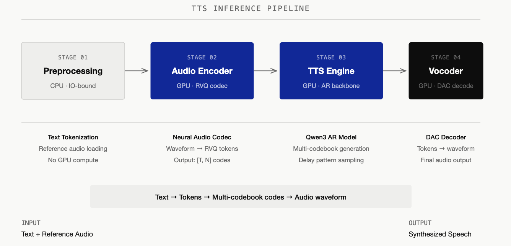
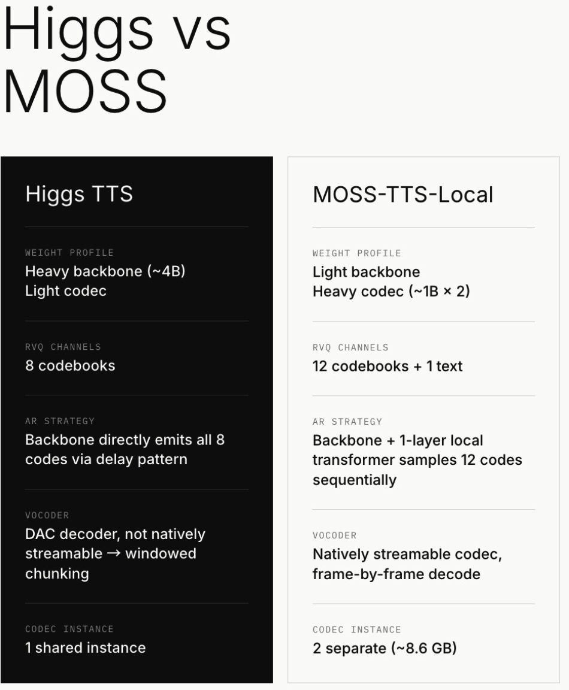

# Optimizing TTS Inference: Engineering Lessons from Profiling to Streaming in SGLang Omni

A TTS (Text-to-Speech) model converts written text into natural-sounding spoken audio. Optimizing TTS inference looks a lot like LLM optimization, but the actual engineering bottlenecks are quite different. For example, TTS has unique multi-stage architecture, which fits well in our SGLang Omni engine structure. In this blog, we break down the mechanical sympathy required to make TTS pipeline fast, with examples of the bottlenecks we hit, the host-to-device pitfalls, and the architectural trade-offs we made. Hope this blog can be a reference material and inspire our future TTS model support, and help all community members understand more on TTS model support & optimization.

【TODO：For example, TTS has unique multi-stage architecture, which fits well in our SGLang Omni engine structure. 这句话其实我觉得讲的不太好，因为作为一个不了解 SGLang Omni 的读者，我其实是不知道 stage 这个定义的。一段话上来就给了一个我甚至不知道的定义来说这个 optimization 不同。我觉得这个地方你举个例子，比如说我们要对 TTS 的很多优化都会在 audio encoder，还有 audio vocoder 上面，可能读者会觉得更加具体一些，因为 stage 这个定义本身就比较模糊。】

In this blog we are going to use two different TTS models with distinct architecture as examples. They are [Higgs](https://huggingface.co/bosonai/higgs-audio-v3-tts-4b) and [MOSS](https://huggingface.co/OpenMOSS-Team/MOSS-TTS-Local-Transformer-v1.5) developed by Boson AI and MOSI AI separately.


## The TTS Pipeline Under the Hood

<div align="center">
  
</div>

Unlike serving a chat LLM with a single autoregressive loop, we decompose TTS inference into four stages:

1. **Preprocessing (CPU):** Text tokenization and load reference-audio. This stage is purely IO-bound and involves no GPU compute — it prepares the inputs that downstream stages consume.

2. **Audio Encoder (GPU):** Raw waveform carries tens of thousands of samples per second, far too long for a Transformer to process directly. A neural audio codec compresses the reference clip into a low-rate sequence of discrete RVQ tokens (shape `[T, N]`, where T is time steps and N is the number of codebook layers). These tokens capture the timbre and prosody of the reference voice — the "how to sound" conditioning signal that the TTS engine will follow. Detailed process of audio encoder is discussed p[here](https://github.com/zhaochenyang20/Awesome-ML-SYS-Tutorial/blob/main/transformers/omni/readme-en.md#codec-audio-encoding).

3. **TTS Engine (GPU):** The core autoregressive stage. Like an LLM decoding text tokens, an AR backbone (typically Qwen3-based) generates output speech as multi-codebook codec tokens step-by-step, conditioned on the target text and the encoded reference. This is where most GPU time is spent — and where optimizations such as delay-pattern scheduling, CUDA Graph, and async decode lands.

4. **Vocoder (GPU):** The codec decoder inverts the generated tokens back into a continuous audio waveform. Per-call compute is usually lightweight, but under high concurrency multiple AR loops can finish simultaneously and queue at the vocoder; streaming behavior also varies by codec design.

A simplified data flow is: **Text + Reference Audio → RVQ tokens → multi-codebook codes → audio waveform**. The sections below walk through how Higgs and MOSS instantiate each stage, and where their architectural choices diverge.

### Higgs Pipeline

<div align="center">
  
</div>

To optimize the system, we first have to understand the computing process through four stages of the Higgs pipeline:

- **Preprocessing (CPU):** Text tokenization and reference audio loading. This is purely IO-bound and handles no GPU compute.
- **Audio Encoder (GPU):** Uses [HiggsAudioCodec](https://huggingface.co/bosonai/higgs-audio-v2-tokenizer), a neural audio codec based on the DAC (Descript Audio Codec) architecture with a semantic encoder branch. The encoder converts the reference audio waveform into discrete tokens via Residual Vector Quantization (RVQ), producing an output of shape `[T, 8]`, where T is the number of time steps and 8 represents parallel codebook tokens per step.
- **TTS Engine (GPU Backbone):** The core autoregressive (AR) model based on a Qwen3 LLM architecture. It generates the multi-codebook tokens step-by-step.
- **Vocoder (GPU):** A DAC decoder that converts the generated tokens back into an audible waveform.

### MOSS Pipeline

<div align="center">
  
</div>

MOSS-TTS-v1.5 (OpenMOSS) uses the `local transformer` architecture and shares the same four-stage pipeline structure — including the delay pattern — as Higgs. Below we describe each stage in the same format as Higgs, followed by a comparison of the two architectures.

- **Preprocessing (CPU):** Text tokenization and reference audio loading, same as Higgs. Purely IO-bound.
- **Audio Encoder (GPU):** Uses MOSS-Audio-Tokenizer-v2, a ~1B-parameter neural audio codec. The encoder converts reference audio into discrete RVQ tokens. MOSS-TTS-v1.5 uses 32 RVQ codebooks; the MOSS-TTS-Local variant uses 12. In addition to audio channels, MOSS includes one text/control channel, so the full token layout is `[T, 33]` (v1.5) or `[T, 13]` (Local).
- **TTS Engine (GPU Backbone + Local Transformer):** The Qwen3 backbone runs once per audio frame on a single vector (all 13 codebook embeddings summed), making it much cheaper per step than Higgs's backbone. After each backbone step, a 1-layer local transformer sequentially samples 12 codebook codes from the backbone's output (stop/continue decision, then code 0→11, each fed back to produce the next). The 12 code embeddings are summed back as the backbone's next-frame input. This keeps the backbone lightweight, but the local transformer's 12-step sequential loop is the latency bottleneck (see CUDA Graph section).
- **Vocoder (GPU):** The same MOSS-Audio-Tokenizer-v2 codec, but used as a decoder. Unlike Higgs's DAC decoder, it is natively streamable — supporting frame-by-frame decode, with no need for windowed chunking, overlap, or crossfade.

【TODO：这里其实交叉提到了 moss 和 moss Local 两个模型，但是我觉得你最好要 explicit 的给用户说，这其实是两个模型，虽然长得有点像。这个我其实建议你可以把 moss 相关的内容都删了，只写我们优化了 moss Local，这样的话你不用去解释那个 Local Transformer 有的有，有的没有。】

【TODO：我觉得这个地方要单独强调 local transformer 其实并不合理，或者说你应该在 Higgs 那个方向也说一下，Higgs 是不是也有类似的，就是用一个小的模型去 decode 余下的 codec 的情况。我一个感觉是，这里的 local transformer 写的其实并不是很清楚。就是你可以看 FishAudio S2 Pro 里面，这个模型的逻辑是 Codex 的第 0 层是那个 slow AR 出，然后剩下的 9 层是 fast AR 出。我感觉 local transformer 的思路应该和 Fish 是比较一致的，但是反过来 Higgs 其实不存在这种类似于 speculative decoding 那种策略。如果是这样子的话，建议写的更清楚一点。】

### Higgs and MOSS Architectural Differences & How They Drive Our Optimization Strategy

【作为一个标题，这个标题其实太长了，根本不应该有这么长的标题。】

<div align="center">
  
</div>

【这个图画的挺好的，然后我觉得这种黑白对比非常鲜明，但是我不太理解为什么 vs moss 要把 moss 换一行，因为 moss 其实明显放在同一行是更好看的。哦，嗯，我觉得可以具体去举一下这个 Higgs 和 moss 的 backbone 和 Codex 的大小，而且你也要提到下这个 Local Transformer 的大小，对吧？这挺关键的。然后我发觉这个，就是如果你在那个 codec instance 的 MoE 这边都写了 MoE 的占据大小，那么其实你在 Higgs 这边最好也写一下。】

As shown in the picture, both models share a similarly sized Qwen3 backbone (~4B params), but differ significantly in codec weight. Higgs is a "heavy backbone, light codec" system: its DAC-based codec is small and bundled inside the checkpoint, so the backbone dominates total model size. MOSS pairs the same-scale backbone with a much heavier codec (~1B-param MOSS-Audio-Tokenizer-v2), making it a "similar backbone, heavy codec" system. Later we will see, the unusually heavy codec brings extra optimization challenges on the codec side.

They also differ in how codebook tokens are generated: Higgs's backbone directly emits all 8 audio codebook tokens per step via the delay pattern, while MOSS's backbone only produces a hidden state, leaving a local transformer to sequentially sample 12 codes per frame. Finally, their vocoders have opposite streaming properties — Higgs's DAC decoder is not natively streamable (requiring windowed chunking with crossfade), whereas MOSS's codec supports frame-by-frame streaming out of the box.

【emits 这个词在全文出现了很多次，然后图里面也有。我个人感觉这个词不是很专业，要不要直接改成 decode？当然，你图里面最好也换一下。这个图可以画成 SVG，本来这个图也不复杂。】

【while MOSS's backbone only produces a hidden state, leaving a local transformer to sequentially sample 12 codes per frame. 这句话其实写的还算挺专业的，但是你那个图里面写 12 个 codec 加上一个 text，这个其实我觉得不是很合理，因为，怎么说呢，就是 backbone 生成的那一个 codec，其实它也不是 text token，它只是说里面包含 text embedding 信息，所以你最好不要在图里面直接写 12 codebooks 加 1 text，或者说是我理解错了。】

【我这里还有一点读了之后不是特别明白，就是 MOSS 是支持 native streaming 的，但是我们发现 MOSS 的 streaming 要比 Higgs 难做很多，这我就不太懂了。如果一个模型是 native streaming 的，为什么它的 streaming 反而性能比起 non-streaming 差了很多？而且我觉得优化起来其实也很麻烦。当然，这一点我觉得你最好要在文中体现出来，我觉得是一个很关键的讨论点。】

Those differences directly shapes our optimization strategy:

【对比一下二者的这个架构差异，然后导出来不同的模型有不同的优化侧重，我觉得是很好的。但是最好在你说明不同模型有不同侧重之前，你可以先说一下我们有什么 general 的思路，就先把这些思路都列出来，然后再说可能二者会有些不同会好一些。现在你直接就列了二者的不同，就是读者直接读下来是不知道有哪些 general 的优化思路的。】

- **Encoder caching is more critical for MOSS:** Each MOSS encode costs ~250ms per reference (vs 50–100ms for Higgs) due to the ~1B-param codec. This motivates a bigger cache for MOSS to amortize encoder time cost.
- **Kernel launch overhead matters more for MOSS:** Because the MOSS backbone is lighter, per-step compute is shorter, making kernel launch overhead a proportionally larger fraction of step time. This is why CUDA Graph capture of the frame-decode micro-loop (1 + 12 micro-steps) is essential for MOSS.
- **Batched encoding & AR stage optimization is more important for Higgs:** Since Higgs AR backbone is much heavier and takes most of the time, higher-concurrency batched processing can greatly increase throughput on Higgs.
- **Vocoder optimization is more important for MOSS:** We find out that the vocoder in MOSS has much heavier workload than Higgs, so we implemented CUDA Graph optimization specifically for MOSS vocoder to reduce each-step launch overhead.
- **Streaming strategy is fundamentally different:** While Higgs needs windowed chunking with stride/overlap/holdback to work around DAC's non-streamable decoder, MOSS's natively streamable codec eliminates this entirely, but introduces slot management complexity at high concurrency.

【我觉得这里在前面要明确的说明一点，就是这个 Higgs 的 codec 是可以做 encoding 也可以做 decoding 的，或者说它能够把音频转成 codec，又能把 codec 转成音频。但是 MoSS 不行，就其实你前面隐含的说明了这一点，但是反正我读第一句话说这个，因为 MoSS 的 codec 是 1B 左右，所以比起 Higgs 更慢。这里其实你得解释有一个 encode 的 codec，还有一个 decode 的 codec，对吧？】

【其实还有一个我觉得比较需要写出来一点，就是你要具体的把 moss 的 backbone 的大小也写出来，因为 Higgs 一看就是一个 Qwen3 嘛，就是 4B，但是 moss 我觉得读完前文是不太清楚的。】

### Know Before Dive In: the Codebook & RVQ

LLMs operate on text tokens — discrete symbols from a finite vocabulary. To apply the same autoregressive framework to audio, we need a way to turn a continuous waveform into a sequence of discrete tokens, and back. This is where neural audio codecs come in: models like SoundStream, EnCodec, and DAC learn to compress audio into compact token sequences that an LLM-style backbone can generate.

The core tokenization technique these codecs share is Residual Vector Quantization (RVQ) ([Zeghidour et al., 2021](https://arxiv.org/abs/2107.03312)). A single vector quantizer (one codebook) can only approximate the audio signal coarsely. RVQ improves on this by stacking multiple codebooks in series: the first codebook quantizes the signal, then the second codebook quantizes the residual error left by the first, the third quantizes what the second missed, and so on. Each layer captures progressively finer detail — CB0 encodes coarse structure (pitch, rhythm, energy), while deeper codebooks encode subtle textures and high-frequency harmonics. Decoding simply sums all codebook contributions to reconstruct the audio.

This layered structure is fundamental to TTS inference optimization. Because the codebooks form a strict hierarchy — each one refining the previous — generating them matters: producing all codebooks independently in parallel degrades quality (higher codebooks can't adapt to what lower ones emitted), while generating them fully sequentially multiplies latency by the number of codebooks. Every multi-codebook TTS system must navigate this trade-off, and the delay pattern (discussed next) is the most widely adopted solution.

The number of RVQ codebooks/channels is a practical trade-off between quality and inference cost. MOSS-TTS-v1.5 uses 32 RVQ channels, while Higgs uses 8. More channels increase delay-pattern sampling cost (more AR steps for ramp-up/wind-down, more tokens per step), but may also improve audio fidelity by capturing finer residual detail.

### Architectural Gotchas: The Delay Pattern (Higgs)

The delay pattern is a scheduling strategy for multi-codebook autoregressive generation, first introduced in Meta's [MusicGen (2023)](https://arxiv.org/abs/2306.05284). The core idea: instead of generating all codebooks in lockstep (which sacrifices quality) or sequentially (which sacrifices speed), stagger them so that each codebook starts in steps after CB0. This way, when CB_i samples at step t, it can condition on CB_{i-1}'s output from step t-1 — giving each layer causal access to its coarser neighbor without serializing the entire generation.

To balance this, Higgs uses a Delay Pattern where Codebook i is delayed by i time steps relative to Codebook 0.

- Step 0: CB0 activates
- Step 1: CB0 + CB1 activate
- Step 2: CB0 + CB1 + CB2 activate
- ... and so on.
- Step 7: CB0 + CB1 + … CB7 activate
- … decode for more steps until complete, and start winding-down
- Step n-8: CB0 hits EOC and stops; CB1 – CB7 remain active
- Step n-7: CB0 + CB1 hit EOC and stop; CB2 – CB7 remain active
- ... until the generation finishes

<div align="center">
  
</div>

This introduces a state machine with four phases: Delay Stage (staggered activation), Active Stage (normal sampling), Wind Down (triggered when CB0 hits the End-of-Codes token), and Finished. And here is a graph to show it more in detail.

The trade-off of the delay pattern is it adds exactly N-1 extra AR steps to every generation (7 steps for 8 codebooks) — which is the ramp-up and wind-down, as shown in the graph. For a typical 250-step generation, this is a ~3% overhead. The exchange is better audio quality, and fully parallel generation.

Because we need CUDA Graph compatibility (discussed in the optimization section), the entire delay pattern state machine is implemented as pure tensor operations. The key function is `batched_step_direct()` in `sampler.py`, which manages four state variables per request: `delay_count` (tracks ramp-up progress), `eoc_countdown` (wind-down timer, initialized to -1), `generation_done` (terminal flag), and `last_codes` (last emitted multi-codebook row). Each step uses `torch.where` to compute:

- a delay mask `cb_idx > delay_count` that forces not-yet-active codebooks to emit BOC tokens
- state transitions — incrementing `delay_count` during ramp-up, setting `eoc_countdown = N-2` when CB0 emits EOC, decrementing it during wind-down, and setting `generation_done` when the countdown hits zero.

All branching is expressed as tensor-level conditionals, making the function a single static compute graph that CUDA Graph can capture and replay.

So in summary, the delay pattern converts a naive 8-way parallel generation (fast but low quality) or 8-way sequential generation (high quality but 8× slower) into a staggered pipeline that is only N-1 steps longer than parallel, while preserving the causal codebook hierarchy that RVQ-based audio quality depends on.

Note: The delay pattern is not unique to Higgs — it has been widely adopted in other multi-codebook audio generation models, including Parler-TTS. Furthermore, other models supported by SGLang-Omni adopt different structures; for example, FishAudio S2-Pro decouples the RVQ codebook into Slow AR (semantic) and Fast AR (acoustic codebooks decoded sequentially per codebook).

## Stage 0 Support: RadixCache and SGLang Scheduler Backend

Before any of the optimizations discussed below, we first needed a working TTS serving baseline built on SGLang's infrastructure. The foundational work landed in commit `60c6e75` (2026-02-27), which introduced RadixCache support and `torch.compile` integration for the FishAudio DualAR architecture — the first TTS model served through the SGLang-Omni pipeline. The full SGLang scheduler integration (paged KV cache, RadixAttention, batch planning) followed in commit `92dbd45` (2026-03-09) for S2-Pro. Higgs TTS support was added later in PR #428 (commit `4d6be58`, 2026-05-17), bringing the Higgs Audio v3 model onto the same SGLang scheduler backend with a custom HiggsScheduler and model runner. This baseline — SGLang's continuous batching scheduler with RadixCache for KV reuse — is the starting point from which all subsequent optimizations in this blog are measured.

## Profiling: Where is the Time Actually Spent?

Before writing code, we profiled the naive pipeline and identified three core bottlenecks:

**Higgs:**

- **AR Decode Dominates:** A typical 10-second speech request requires 250 decode steps. Every single step involves a backbone forward pass, head projection, sampling, and Device-to-Host (D2H) synchronization. A tiny 0.1ms overhead per step inflates end-to-end latency by nearly 25ms.
- **The Encoder is Heavy but Static:** A single encoding pass takes 50–100ms. However, in production, users often reuse the same reference audio across multiple prompts.
- **Vocoder Queuing:** The vocoder is fast (~10ms per call), but under high concurrency, multiple AR generation loops finish at the exact same time, creating a massive serial bottleneck at the vocoder stage.

**MOSS:**

- **Frame-local decode dominates:** Instead of pure backbone AR steps, each frame requires a global backbone forward pass plus a local transformer micro-loop that sequentially samples 12 RVQ codes with feedback embeddings. The eager (non-graphed) path is kernel-launch-bound at ~22ms/frame independent of batch size — dominated by the 1 + 12 micro-steps and 13 seeded sampling passes per frame.
- **The reference encoder is heavier:** MOSS's ~1B-parameter codec takes ~0.25 GPU-seconds per reference encode (vs 50–100ms for Higgs), making caching even more critical.
- **Vocoder is heavier, but natively streamable:** The MOSS-Audio-Tokenizer-v2 decoder supports frame-by-frame streaming, which shifts the streaming bottleneck from "windowed chunking with crossfade" (Higgs) to "frame scheduling and slot management" (MOSS).

With those bottlenecks, we applied targeted optimization strategies. Here is a macro-level graph to show our strategies, and we will be discussing each strategy in the next section.

<div align="center">
  
</div>

## Layer-by-Layer Optimizations

### Encoder: Eliminating Redundant Work

#### LRU Caching: Bypassing the Compute

**Why:** The encoder converts a reference audio clip into delayed codec tokens. In production, users frequently reuse the same reference voice across many prompts (e.g., a fixed narrator voice for an audiobook). Each encoding pass costs 50–100ms of GPU time, but the output is deterministic for identical input audio. This makes it a textbook caching opportunity.

<div align="center">
  
</div>

**How:** We introduced an LRU cache keyed by the audio waveform content. On a cache hit, the encoder stage is skipped entirely.

For text, SGLang's RadixCache enables prefix sharing — two prompts that start with the same tokens can reuse partial KV cache. However, audio caching is fundamentally different: there is no meaningful prefix relationship in the time-frequency domain, so we use strictly exact-match lookup. The cache key is a content hash of the input audio: xxh3_64 for raw bytes/base64 input. Two audio clips that produce the same hash are a hit; everything else is a miss.

#### Batched Encoder (Higgs)

We also experimented with online batched encoding by bucketing incoming audio by length. While it improved raw throughput on paper, it created a new problem in production: GPU utilization shifted from smooth patterns to intermittent spikes, causing severe resource contention with the concurrent AR decode loops. We ultimately moved batched encoding offline (used strictly for bulk server warmups) and kept online encoding isolated.

#### Batched Encoder (MOSS)

For models with a heavier codec (e.g. MOSS, ~1B params, ~0.25 GPU-seconds per reference), online batched encoding pays off more — the heavier the encode, the more batching amortization outweighs the collection delay. MOSS therefore keeps online batching enabled in production.

### AR Decode: Shaving Off Every Microsecond

Since AR decode is our primary bottleneck, we need to put the majority of work into optimizing this step. In our implementation, we focused on eliminating kernel launch overhead and synchronization stalls using CUDA Graph and CPU-GPU async decode, respectively.

#### CUDA Graph Migration

<div align="center">
  
</div>

**Why:** Because each AR step launches a sequence of tiny kernels, the CPU launch overhead was killing performance. Therefore we captured the entire decode loop inside a CUDA Graph to eliminate those numerous small launch overheads.

**How:** However, CUDA Graph records a fixed sequence of kernel launches and replays it every time we reach the point, so the execution path must be static — any Python branch that depends on runtime data breaks the recording (for example, if/else statements). Therefore, if we wanted to use CUDA Graphs, to make this work, we had to eliminate all Python if-else branching in the model's forward path, rewriting the delay pattern state machine into in-place tensor operations with fixed memory addresses.

To make the path static, we pre-allocated fixed-address GPU buffers for every piece of per-request decode state — the delay counter, the EOC countdown, the `generation_done` flag, the last emitted codes, and the sampled-code output — all shaped `[max_batch, …]` and allocated once at startup. Each step overwrites these in place at the same addresses, so the graph replays without being rebuilt.

Around the captured graph, the runner copies the active rows' state from the request pool into these fixed "shadow" buffers before the step, lets the graph read and update them in place, then scatters the results back to the pool afterward — all GPU-to-GPU. Finally it packs the step's outputs (codes + done flags) into a single staging buffer so the whole step returns to the CPU in one copy, which is what lets us make that copy non-blocking next.

We will discuss further on how we achieve GPU-CPU async decode in a later section of this blog.

#### Merging D2H Synchronizations

**Why:** Our baseline implementation performed three separate Device-to-Host (D2H) synchronizations per AR step to check tokens and states, creating repeated pipeline stalls.

**How:** We optimized this by consolidating all intermediate data into a single staging tensor named `_cg_collect_staging`. Now, we execute exactly one combined transfer per step using the slice: `combined_cpu = staging[:n_real].cpu()`. This single change dramatically reduced pipeline latency.

#### Asynchronous Decode + Lookahead

**Why:** The vanilla pattern of CPU–GPU synchronization is as shown in the picture below. GPU and CPU process in the same flow and will stop and wait for each other. We discovered this pattern is inefficient since the D2H sync time can stack up to very high during AR decoding. To hide the remaining D2H synchronization time, we want to discover a pattern to let GPU and CPU work simultaneously and not wait for each other.

**How:** The async decode splits each step into two halves — a GPU-side **launch** and a CPU-side **resolve** — that run one step apart:

The overall timeline would be as shown in the picture:

The event loop implements this as: each iteration launches the current step (enqueue GPU work + async D2H + record event), then resolves the previous step (check event, read host buffer, process results). When the batch size drops below 2, it falls back to synchronous execution, since the async fixed overhead will be larger than the performance gains from overlapping.

<div align="center">
  
</div>

**GPU launch (step N):** Before replaying the CUDA Graph, the runner gathers each active request's current state (delay counter, last emitted codes, done flag, etc.) from a shared pool into the graph's fixed-address buffers. The graph then runs the forward pass and sampling, writes updated state back to the pool, and packs the step's outputs (all 8 codebook codes plus completion flags) into a single staging tensor. This staging tensor is copied to a pinned host buffer asynchronously — the GPU does not wait for the copy to finish. A CUDA event is recorded right after the copy is enqueued, serving as a "data is ready" signal for the CPU.

**CPU resolve (step N-1):** While step N runs on the GPU, the CPU processes step N-1's results. It checks the CUDA event (non-blocking) to see if the D2H copy has landed. In the common case it has — the CPU reads the host buffer and runs per-request bookkeeping: appending codes to each request's output, detecting end-of-generation, emitting streaming audio chunks, and removing finished requests. If the copy hasn't landed yet (rare), the CPU blocks briefly until it does.

**The ping-pong buffer:** Since the GPU is writing step N's results to a host buffer while the CPU is simultaneously reading step N-1's results, they cannot share the same buffer. We allocate two pinned host buffers and alternate between them each step. At step N the GPU writes to buffer A while the CPU reads from buffer B; at step N+1 the roles flip. This avoids a data race that CUDA stream ordering alone cannot prevent — stream ordering governs GPU-side operations, but the CPU's read of pinned memory is not synchronized by the stream.

**Lookahead guard:** Because launch runs before resolve, a request that finished at step N-1 (via EOC) is still present in step N's batch — the CPU hasn't had a chance to remove it yet. The runner detects this by checking the request's done flag in the pool before launching, and routes finished requests to a dummy padding row. The graph still runs over these slots (CUDA Graph requires a fixed batch shape), but their outputs are discarded during the next resolve. This prevents double-counting finished requests.

Therefore, the CPU and GPU can act as separate workers to allow for greater parallelization, communicating through a shared ping-pong buffer.

#### Torch Compile

We also evaluated `torch.compile` as a potential optimization shortcut. However, since our manual CUDA Graph migration had already eliminated the bulk of kernel launch overhead, `torch.compile` offered only marginal throughput improvements. Plus, it introduced a massive compilation penalty during model warmup, severely damaging our cold-start latency. We ultimately chose to remove it—as a pragmatic engineering trade-off favoring fast system initialization over redundant runtime optimizations.

### Vocoder: Optimization and Windowed Streaming

#### Batched Decoding

<div align="center">
  
</div>

**Why:** Under high concurrency, multiple AR decode loops finish at nearly the same time — they enter the pipeline together, generate similar-length utterances, and race to the vocoder stage simultaneously. With 16 concurrent requests each taking ~15ms to vocode, the last request in line waits 240ms just for its turn — turning a fast stage into a tail-latency killer.

**How:** We batch vocoder calls using a short collection window (2ms / up to 4 requests). Before decoding, each request's delayed codes are un-delayed (reversing the delay pattern) and special tokens (BOC/EOC) are clamped to valid codec range. To avoid wasting compute on padding, we use bucketed batching — grouping sequences by length so that each batch contains only same-length items. Sequences that share a length are stacked and decoded in a single GPU call; sequences with unique lengths decode individually. This eliminates the tail-latency problem: instead of 16 serial vocoder calls, we issue a handful of batched calls.

#### Vocoder CUDA Graph (MOSS Only)

<div align="center">
  
</div>

**Why:** MOSS's vocoder uses the ~1B-parameter MOSS-Audio-Tokenizer-v2 codec, which launches far more kernels per decode call than Higgs's lightweight DAC decoder. Just as with AR decode, kernel launch overhead becomes the bottleneck. Higgs's DAC decoder is light enough that it does not need this optimization.

**How:** Capture the vocoder's decode forward pass as a CUDA Graph, using the same techniques as the AR CUDA Graph — pre-allocated fixed-address buffers, bucketed batch sizes, and graph replay. We won't repeat it here for conciseness.

#### Windowed Streaming (Higgs Only)

<div align="center">
  
</div>

**Why:** Without streaming, the user hears nothing until the entire AR decode loop completes — hundreds of steps of silence. So we want to stream the process to minimize TTFB (time to first byte). But you can't just naively chop the code sequence into chunks and decode each independently like LLM: neural audio codecs produce audible clicks at every splice boundary because the codec's internal convolution state is disrupted. On top of that, the delay pattern means the trailing rows in any mid-stream snapshot have incomplete high-layer codebooks — decoding them injects noise.

Note: codecs which natively support streaming decode (such as MOSS's MOSS-Audio-Tokenizer-v2) maintain continuous decoder state across the frame, so there are no splice boundary artifacts — the following section only applies to non-streamable codecs (e.g. Higgs's DAC decoder).

**How:** To manage this irreducible latency boundary smoothly, we tuned three parameters for our streaming window:

- **Stride (75 frames):** Accumulates roughly 3 seconds of delayed codes before triggering a vocoder decode step.
- **Overlap (8 frames):** Looks back into the previous window to eliminate seam artifacts and clicks during audio stitching.
- **Holdback (4 frames):** Retains trailing frames where high-layer codebooks are still incomplete, preventing noise injection during mid-stream decodes.

<div align="center">
  
</div>

For streaming, we accumulate codes until a stride threshold (75 frames, ~1 second of audio) before triggering a decode — amortizing kernel launch overhead across a meaningful chunk. When decoding, we overlap by looking 8 frames back into the previously decoded region, re-decoding them jointly with new tokens so the codec sees continuous context across boundaries. We then extract only the delta (new samples past the overlap) and crossfade-blend it with the held-back tail of the previous chunk using a linear fade-in/fade-out envelope — smoothing any residual amplitude mismatch at the splice point.

Finally, a holdback of 4 frames retains the trailing rows where high-layer codebooks are still filling in due to the delay pattern. These incomplete rows are only released on the final flush when the full sequence is available.

The delay pattern also creates an irreducible startup cost: the vocoder needs at least N rows (N = number of codebooks) just to reverse the pattern and produce the first audio frame. Combined with the stride, the actual TTFB lands at ~300–400ms at our measured RTF — well under the 500ms conversational threshold.

## Benchmark Results

We benchmarked both Higgs and MOSS-TTS-Local to quantify the speedup from our optimizations. Each model is tested in two builds: **vanilla** (all optimizations off) vs **perf** (all optimizations on).

**Environment:** 1× H100 80GB, colocate single-GPU. Seed-TTS-Eval EN full set (N=1088). Each data point is the mean of 3 runs.

### Higgs TTS — Streaming (vanilla vs perf)

| Concurrency | qps vanilla | qps perf | **Speedup** | RTF van / perf | Latency mean (s) van / perf | TTFP (ms) van / perf |
|---:|---:|---:|:---:|---:|---:|---:|
| 2  | 1.286 | 2.908  | **2.26×** | 0.373 / 0.166 | 1.555 / 0.688 | 162 / 153 |
| 4  | 2.411 | 5.934  | **2.46×** | 0.393 / 0.163 | 1.658 / 0.673 | 166 / 109 |
| 8  | 4.313 | 9.856  | **2.29×** | 0.442 / 0.196 | 1.852 / 0.810 | 182 / 126 |
| 16 | 7.077 | 14.634 | **2.07×** | 0.533 / 0.261 | 2.247 / 1.088 | 214 / 176 |

Optimizations deliver a stable **~2.1–2.5×** throughput gain across all concurrency levels, with RTF roughly halved and first-audio latency (TTFP) also reduced.

### Higgs TTS — Non-streaming (vanilla vs perf)

| Concurrency | qps vanilla | qps perf | **Speedup** | RTF van / perf | Latency mean (s) van / perf |
|---:|---:|---:|:---:|---:|---:|
| 2  | 1.412 | 2.941  | **2.08×** | 0.342 / 0.164 | 1.416 / 0.680 |
| 4  | 2.552 | 5.715  | **2.24×** | 0.372 / 0.166 | 1.568 / 0.699 |
| 8  | 4.426 | 10.077 | **2.28×** | 0.423 / 0.191 | 1.771 / 0.793 |
| 16 | 8.156 | 15.174 | **1.86×** | 0.464 / 0.245 | 1.937 / 1.028 |

### MOSS-TTS-Local-v1.5 — Streaming (vanilla vs perf)

| Concurrency | qps vanilla | qps perf | **Speedup** | RTF van / perf | Latency mean (s) van / perf | TTFP (ms) van / perf |
|---:|---:|---:|:---:|---:|---:|---:|
| 2  | 0.817 | 2.256 | **2.76×** | 0.561 / 0.206 | 2.448 / 0.888 | 257 / 261 |
| 4  | 1.444 | 2.649 | **1.83×** | 0.635 / 0.356 | 2.768 / 1.509 | 280 / 726 |
| 8  | 2.089 | 2.633 | **1.26×** | 0.887 / 0.726 | 3.848 / 3.033 | 626 / 2239 |
| 16 | 2.516 | 2.635 | **1.05×** | 1.495 / 1.458 | 6.337 / 6.045 | 3452 / 5227 |

MOSS streaming throughput plateaus at ~2.6 qps from c=4 onward. Improving high-concurrency streaming scalability is on the roadmap for future work.

### MOSS-TTS-Local-v1.5 — Non-streaming (vanilla vs perf)

| Concurrency | qps vanilla | qps perf | **Speedup** | RTF van / perf | Latency mean (s) van / perf |
|---:|---:|---:|:---:|---:|---:|
| 2  | 0.968 | 2.974 | **3.07×** | 0.475 / 0.157 | 2.069 / 0.676 |
| 4  | 1.816 | 4.870 | **2.68×** | 0.504 / 0.192 | 2.200 / 0.821 |
| 8  | 3.017 | 6.111 | **2.03×** | 0.606 / 0.310 | 2.645 / 1.306 |
| 16 | 4.668 | 6.144 | **1.32×** | 0.781 / 0.623 | 3.406 / 2.593 |

### Reproducing the Benchmarks

The benchmarks use [`benchmarks/eval/benchmark_tts_seedtts.py`](https://github.com/sgl-project/sglang-omni/blob/main/benchmarks/eval/benchmark_tts_seedtts.py) from the [sglang-omni](https://github.com/sgl-project/sglang-omni) repository.

**1. Start the server** (one GPU per server instance, colocate single-card):

```bash
# Higgs — perf (all optimizations on, default config)
CUDA_VISIBLE_DEVICES=0 sgl-omni serve \
  --model-path bosonai/higgs-audio-v3-tts-4b \
  --port 8101 --allowed-local-media-path /tmp

# Higgs — vanilla (CUDA graph off, async decode off)
# Use a config with runtime_overrides:
#   tts_engine.enable_async_decode: false
#   tts_engine.server_args_overrides.disable_cuda_graph: true
CUDA_VISIBLE_DEVICES=1 sgl-omni serve \
  --model-path bosonai/higgs-audio-v3-tts-4b \
  --config higgs_vanilla.yaml \
  --port 8102 --allowed-local-media-path /tmp

# MOSS — perf (all optimizations on, default config)
CUDA_VISIBLE_DEVICES=2 sgl-omni serve \
  --model-path OpenMOSS-Team/MOSS-TTS-Local-Transformer-v1.5 \
  --port 8103 --allowed-local-media-path /tmp

# MOSS — vanilla (AR CUDA graph off, vocoder CUDA graph off, frame-sampler compile off)
# Use a config with:
#   cuda_graph: false  (disables vocoder CUDA graph)
#   tts_engine.server_args_overrides.disable_cuda_graph: true  (disables AR graph + frame graph)
CUDA_VISIBLE_DEVICES=3 sgl-omni serve \
  --model-path OpenMOSS-Team/MOSS-TTS-Local-Transformer-v1.5 \
  --config moss_local_vanilla.yaml \
  --port 8104 --allowed-local-media-path /tmp
```

**2. Run the benchmark** (against a running server):

```bash
# Sweep concurrency {2,4,8,16}, 3 runs per point
MODEL=bosonai/higgs-audio-v3-tts-4b   # MOSS: OpenMOSS-Team/MOSS-TTS-Local-Transformer-v1.5
PORT=8101; LABEL=higgs_perf_stream
STREAM=--stream                        # non-streaming: leave empty
EXTRA=""                               # MOSS only: EXTRA="--token-count auto"

for c in 2 4 8 16; do
  for r in 1 2 3; do
    python -m benchmarks.eval.benchmark_tts_seedtts \
      --use-existing-server --generate-only \
      --base-url http://localhost:$PORT --model $MODEL \
      --ref-format references --lang en --max-concurrency $c \
      --output-dir results/${LABEL}_c${c}_r${r} $STREAM $EXTRA
  done
done
```

Single-run example (Higgs perf streaming, c=4):

```bash
python -m benchmarks.eval.benchmark_tts_seedtts \
  --use-existing-server --generate-only \
  --base-url http://localhost:8101 \
  --model bosonai/higgs-audio-v3-tts-4b \
  --ref-format references --lang en --max-concurrency 4 \
  --output-dir results/higgs_perf_stream_c4 --stream
```

Results are in `<output-dir>/speed_results.json` under `summary`: `throughput_qps`, `latency_mean_s`, `latency_p95_s`, `rtf_mean`. Streaming runs also report `audio_ttfp_mean_s` (time to first audio). Average the 3 runs per `(label, concurrency)` to get the table values above.

### Summary

- **Higgs (stream & non-stream):** Stable **~1.9–2.5×** speedup in both modes. Stream ≈ non-stream throughput — the cleanest win across all four quadrants.
- **MOSS non-streaming:** **~3× at low concurrency**, narrowing to ~1.3× at high concurrency.
- **MOSS streaming:** **~2.8× at low concurrency**, with throughput plateauing at higher concurrency. Improving streaming scalability is on the roadmap.

## Conclusion

The best system optimizations don't come from blindly applying trendy techniques; they come from a deep understanding of the theory, desire for building elegant systems, and clean engineering trade-offs.

If you are interested in our project, please go to [sglang-omni repo](https://github.com/sgl-project/sglang-omni) to give it a try, to experience the exhilarating performance. If you are interested in making a contribution, I'd love to talk, please don't hesitate to reach out.

## Join Us

SGLang-Omni is an open community project, and it is still growing fast. Cross-node multi-stage pipelines, fuller diffusion-stage support, and end-to-end RL training integration are all underway. If multi-stage inference is the kind of problem you find beautiful — whether you come from a systems background or arrive halfway, whether you specialize in kernel optimization or scheduling logic — **we are actively recruiting contributors**. Come build a truly industrial-grade omni-serving stack with us: open a PR, join the discussion, or say hi in the community channels linked below.

## Acknowledgments

**SGLang-Omni** — Haoguang Cai, Shangming Cai, Qiujiang Chen, Yuhao Chen, Jiaxin Deng, Wenyao Gao, Yifei Gao, Jingwen Gu, Yitong Guan, Zhihao Guo, Chenchen Hong, Hao Jin, Xinli Jing, Xiangrui Ke, Shenggui Li, Junrong Lin, Estella Liu, Xinyu Lu, Yuan Luo, Ratish Palanisamy, Mick Qian, JinTao Qu, Shuai Shi, Yijiang Tian, Chao Wang, Richard Wang, Shuwen Wang, Zijie Xia, Yuhao Yang, Xuesong Ye, Fan Yin, Yue Yin, Gaokai Zhang, Xiaoyu Zhang, Yichi Zhang, Chenyang Zhao.

**Higgs Audio v3 TTS (Boson AI)** — Mu Li, Alex Smola, Lindsey Allen. Silin Meng, Ke Bai. Ruskin Raj Manku, Huapeng Zhou, Dongming Shen, Jonah Mackey, Erik Li, Weisu Yin, Yizhi Liu, Xinyu Wang, Hao Yu.

**MOSS-TTS Local-Transformer-v1.5 (MOSI.AI)** — Yitian Gong, Kuangwei Chen, Zhicheng Zhang, Botian Jiang, Yiyang Zhang, Kang Yu, Yang Gao, Xiaogui Yang, Qinyuan Chen, Zhaoye Fei, Shimin Li, Xipeng Qiu.

## Learn More

- **Model (Higgs):** [boson-sglang/higgs-audio-v3-generation-4B-base](https://huggingface.co/boson-sglang/higgs-audio-v3-generation-4B-base)
- **Model (MOSS):** [OpenMOSS-Team/MOSS-TTS-Local-Transformer-v1.5](https://huggingface.co/OpenMOSS-Team/MOSS-TTS-Local-Transformer-v1.5)
- **Serving framework:** [SGLang-Omni on GitHub](https://github.com/sgl-project/sglang-omni)
- **Documentation:** [SGLang-Omni docs](https://sgl-project.github.io/sglang-omni/) · [Higgs TTS cookbook](https://sgl-project.github.io/sglang-omni/cookbook/higgs_tts.html)
- **Higgs optimization roadmap:** [#478](https://github.com/sgl-project/sglang-omni/issues/478)
- **MOSS optimization roadmap:** [#637](https://github.com/sgl-project/sglang-omni/issues/637)
- **Design background:** *SGLang-Omni: Redesigning the Inference Framework for Multi-Stage Generative Models*
