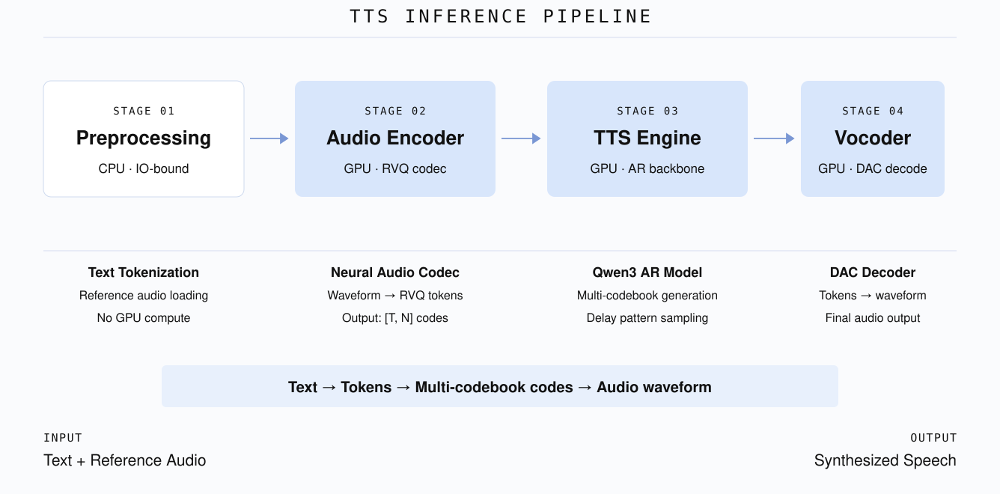
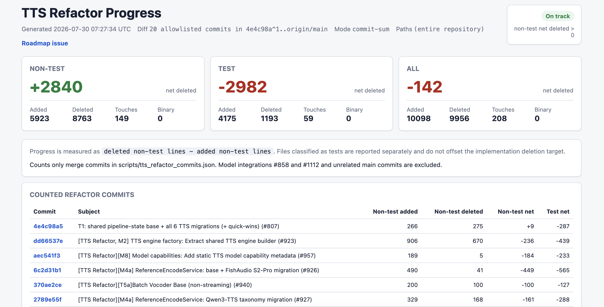
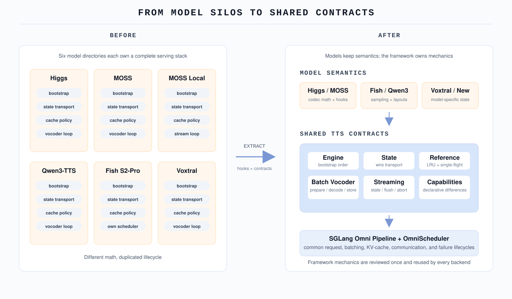
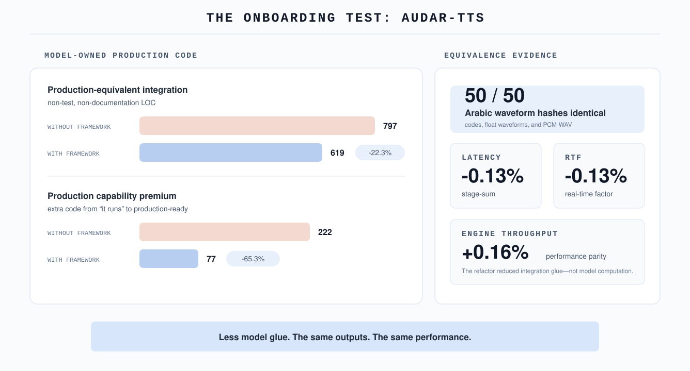

# 分久必合：SGLang Omni TTS Serving 重构

**一个通用的 Serving 框架，应该怎样管理复杂且差异很大的语音模型？** 这是我们设计 SGLang Omni 时反复讨论的问题。理想的接入方式很简单：

> **声明流水线拓扑，实现模型特定的计算，再把调度、通信和生命周期管理交给框架。**

重构前，TTS 离这个目标还有一段距离。模型贡献者实现完模型特有的生成逻辑后（文本和参考音频怎么变成 latent，又怎么解码成波形），还要在模型目录里维护 engine 启动、跨进程状态传输、参考音频缓存、vocoder 调度、流式请求状态和异常清理。接入一个模型，常常等于再搭一套 Serving 栈。

这次重构希望把分工拉回到一条清楚的边界上：

> **模型贡献者负责模型语义和 Hook，不再复制或修改框架的调度状态机。**

## 为什么有重构空间，又为什么有挑战

我们这段时间重点优化的 Higgs、MOSS-TTS、MOSS-TTS-Local、Qwen3-TTS、FishAudio S2-Pro 和 Voxtral-TTS，大体都沿着“参考音频编码 → 自回归生成声学表示 → vocoder 解码波形”这条路径工作。因此，调度、缓存、状态传输和请求生命周期有很大的复用空间。

问题在于，同一个阶段名下面可能是完全不同的模型语义：

| 模型 | 声学表示如何生成 | vocoder 与流式方式 | 对 Serving 的影响 |
| --- | --- | --- | --- |
| **Higgs** | 8 个 codebook 按 delay pattern 展开，每个 global step 共用一次 backbone 前向 | 轻量 DAC vocoder；原生不支持流式，需要 window、overlap 和 crossfade | Streaming 层要管理 window、holdback 和最终 flush |
| **MOSS-TTS-Local** | backbone 先产出 hidden state，再由 local transformer 顺序生成一帧中的 13 个通道 | 独立的约 1B causal-transformer vocoder；原生支持逐帧流式 | 需要持久 codec session、CUDA Graph slot 和跨请求合批 |
| **FishAudio S2-Pro** | Dual AR；backbone 生成 codebook 0，Fast AR 生成其余 codebook | 多 codebook 条件同时影响后续生成 | Token ID 只覆盖部分条件，KV Cache 还要识别额外的 embedding 输入 |

更完整的模型结构、delay pattern、Dual AR、Global + Local Transformer 和 vocoder 差异，可以参考 [TTS 性能优化实战](./tts-optimization-zh.md)。这些差异也解释了这次重构的难点：高层流程确实相似，但框架不能假设 codebook layout、Cache Key semantics 或 streaming state 也相同。

  
  
<em>图 1：典型的多阶段 TTS 推理流水线。阶段可以共用，阶段内部的模型语义仍由各模型负责。</em>

## 先看结果

截至 2026 年 7 月 30 日，纳入统计的 20 个重构 commit 在 **non-test 实现代码上净删除 2840 行**：新增 5923 行，删除 8763 行。与此同时，测试代码净增加了 2982 行，为框架公共接口和迁移前后的行为一致性保驾护航。

| 验证点 | 结果 |
| --- | --- |
| **六个重点维护的 TTS 后端** | 已迁移到框架公共接口，覆盖 engine 启动、状态传输、参考音频编码、batch/streaming vocoder、能力声明和调度。 |
| **实现代码进展** | 20 个 allowlisted commit 的 non-test 代码净删除 **2840 行**，统计口径和每个 commit 的明细可在 tracking 页面核对。 |
| **FishAudio 调度器迁移** | 删除 591 行的 `FishScheduler`；整个迁移 PR 净删除 **816 行**，精度和性能保持不变。 |
| **从 Demo 到生产所需的额外代码** | Audar-TTS 的生产级集成从 **797 行降到 619 行**；缓存、容错和生命周期安全等额外代码从 **222 行降到 77 行**。 |
| **新模型接入** | Ming-Omni-TTS、Audar-TTS 和 ZONOS2 沿用共享接口，没有再复制一套 engine、缓存或 streaming 状态机。 |

  
  
<em>图 2：2026 年 7 月 30 日的进展快照。最新统计见 <a href="https://luojiaxuan.github.io/sglang-omni/tts-refactor/">TTS Refactor Progress</a>。</em>

## 接一个模型，前后差在哪里

以一个同时支持参考音频和流式输出的模型为例，重构前后需要维护的内容大致如下：

| 模块 | 重构前 | 重构后模型侧需要实现的内容 |
| --- | --- | --- |
| Engine | 在模型目录中串起 checkpoint、server args、CUDA Graph、adapter 和 scheduler | 提供 checkpoint 解析、模型初始化和少量 builder Hook |
| 跨阶段状态 | 手写一对 `to_dict` / `from_dict`，新增字段时两边都要同步 | 声明字段及其 `wire(...)` 传输方式 |
| 参考音频 | 各自实现 Cache Key、LRU、same-key Single-flight、retry 和 error propagation | 提供输入归一化、identity key 和实际 encode |
| Batch vocoder | 自己写 scheduler loop、batch 组装和结果回填 | 实现 `prepare`、`decode batch`、`store` 三个 Hook |
| Streaming vocoder | 自己维护 request registry、chunk threshold、flush、abort、terminal ordering 和 failure isolation | 保留 codec session、cursor、CUDA Graph slot 和模型特定 decode plan |
| 调度与能力 | Fork scheduler，或者在共享代码中增加模型名分支 | 声明能力；模型侧保留 sampling、stop semantics 和 cache fingerprint |

少掉的 2840 行主要来自这类重复逻辑。模型算法没有被塞进同一个基类；真正变化的是职责划分：稳定的 control flow 由框架维护，模型只实现确实不同的部分。

## 重复的是 Serving 机制

六个后端的生成细节不同，生命周期里却反复出现同一组工作：

- engine 按相近的顺序解析 checkpoint、构建参数、准备 CUDA Graph 并组装 scheduler；
- 流水线状态都要跨进程传输；
- 参考音频都需要缓存、相同 Key 的并发合并和失败重试；
- vocoder 都要处理 batch、chunk、flush、abort 和 terminal result；
- 模型能力散落在各处，调度器只能靠条件分支猜测。

这些重复代码一直都看得见，真正费时间的是划边界。checkpoint 的特殊处理、codec session 和 codebook layout 确实属于模型；LRU eviction、Single-flight、terminal ordering 和 error propagation 则可以共享。整段函数直接复用会把模型语义一起带进框架，继续复制又会让六套实现越走越远。最后的拆法是把稳定的 control flow 留在框架中，把变化点收敛成 Hook、字段和 capability metadata。

  
  
<em>图 3：模型保留生成和 codec 语义，框架统一重复的 Serving 生命周期。</em>

我们用一句话描述这条边界：

> **框架维护可复用的机制，模型目录维护模型语义。**

接口设计时遵循三条规则：

1. **先和现有模型作者逐项确认差异。** 哪些流程稳定、哪些字段会变化、失败后由谁清理，都要在抽象前说清楚。
2. **共享代码不依赖模型名称。** 差异通过 Hook、能力声明或字段表达，避免 `if model == ...`。
3. **迁移完成就删除旧路径。** 最复杂的现有模型和后续新模型负责验证接口边界，生产代码中不保留两套生命周期。

## 一组简洁的 Serving 接口

我们最终得到的是几组可以独立采用的接口：

| 共享接口 | 框架负责 | 模型负责 |
| --- | --- | --- |
| [`TtsEngineBuilder`](https://github.com/sgl-project/sglang-omni/pull/923) | 固定的启动顺序、server args plumbing、deferred CUDA Graph setup 和 scheduler assembly | Checkpoint 解析、模型初始化和 compile policy |
| [`DeclarativeStateBase`](https://github.com/sgl-project/sglang-omni/pull/1050) | 根据字段声明生成 wire payload，并保证 tensor 的 dtype/shape 能够 round-trip | 声明有哪些状态，以及每个字段怎样传输 |
| [`ReferenceEncodeService`](https://github.com/sgl-project/sglang-omni/pull/926) | Byte-bounded LRU、same-key Single-flight、error propagation 和 retry | 输入归一化、identity key、encode 和 output dtype/device policy |
| [`BatchVocoderBase`](https://github.com/sgl-project/sglang-omni/pull/940) | Scheduler wiring 与 `prepare → decode batch → store` orchestration | 三个对应 Hook，以及 waveform 的生成和回填 |
| [`StreamingVocoderBase`](https://github.com/sgl-project/sglang-omni/pull/936) | Request registry、chunk/flush/terminal ordering、abort 和 failure isolation | Codec session、cursor、CUDA Graph slot 和 decode plan |
| [模型能力](https://github.com/sgl-project/sglang-omni/pull/957)与 [`OmniScheduler`](https://github.com/sgl-project/sglang-omni/pull/937) | Capability discovery，以及通用的 request、batch、KV Cache 和 finish lifecycle | Sampling、stop condition、cache fingerprint 和模型侧 buffer |

这些接口可以按需组合。一个模型可以采用 engine builder 而不用 streaming vocoder，也可以复用状态传输而保留自己的 codec。

## 三个容易被重构放大的 Bug

Fish 的 Cache Prefix 问题是在迁移中暴露的；另外两个是抽取 framework-level lifecycle 时提前补上的接口漏洞。它们的共同点是：模型目录里的隐含假设一旦进入公共 cache 或异步状态机，影响范围会立刻扩大。

### Token ID 相同，KV Prefix 仍可能不同

FishAudio S2-Pro 的参考音频包含多个 VQ codebook，只有 codebook 0 会变成 prompt token IDs，其余 codebook 作为 embedding 输入模型。于是，两段参考音频可能拥有完全相同的 Token ID，却携带不同的声学条件。

普通 Radix Cache 会把它们当作相同 Prefix。请求 B 复用请求 A 的 KV state 后，生成结果会混入错误的参考音频条件，而且 Token、Cache Hit 和调度日志看起来都正常。

迁移到 [`OmniScheduler`](https://github.com/sgl-project/sglang-omni/pull/937) 时，我们把所有参考 VQ codebook 的 fingerprint 写入 `Req.extra_key`。Cache Key 从此覆盖完整模型输入；embedding、adapter 或其他 side channel 只要会影响 KV state，就必须写进 Cache Key。

### Final 之后到达的 Chunk

流式流水线不能保证完成事件和所有 chunk 按同样的顺序抵达。假设 vocoder 已经发出 final result 并清理请求状态，网络中较慢的音频代码此时才到。简单的状态表会把这个未知 request ID 当成新请求，再创建一条流。

客户端可能在 final 之后继续收到音频。MOSS-TTS-Local 还会为这条“复活”的请求占住 codec session 或 CUDA Graph slot，因为它再也等不到第二个 `done`。

[`StreamingVocoderBase`](https://github.com/sgl-project/sglang-omni/pull/936) 因此保留 completed/aborted request 的 Tombstone。晚到的 chunk 会被直接丢弃，不能重新创建状态；Tombstone 按完成时间淘汰，避免刚结束的请求先被遗忘。

### 什么都没缓存，Key 依然会被卡死

[`ReferenceEncodeService`](https://github.com/sgl-project/sglang-omni/pull/926) 用 Single-flight 合并相同 Key 的并发请求：一个 Leader 执行 encode，Followers 等待同一个 Future。隐蔽的失败点出现在 encode 之后——源文件复检或写缓存仍可能抛异常。

如果异常路径没有完成 Future 并删除 In-flight Key，缓存里虽然没有坏值，这个 Key 却永远指向一个已经退出的 Leader。后续请求都会成为 Follower，等到超时后再次重演。

共享服务把 encode、revalidation 和 cache insertion 放进同一个 failure domain。任一步骤失败都会删除 In-flight Key，并把同一个 exception 返回给全部 Followers；Follower 自己 timeout 则不能清理仍在工作的 Leader。

## Fish 迁入 OmniScheduler 后暴露的两个边界

FishAudio S2-Pro 最初有一套 591 行的专属 scheduler，因为当时的共享 scheduler 还无法表达它的需求。[PR #937](https://github.com/sgl-project/sglang-omni/pull/937) 将 Fish 迁入 `OmniScheduler`，整个 PR 净删除 816 行代码，也暴露了两个此前没有统一校验的边界。

- **词表大小要覆盖 added vocabulary。** Fish 的 semantic token 位于 tokenizer 的新增词表中。共享 scheduler 会校验采样 Token ID，`Req.vocab_size` 因而必须来自完整 tokenizer，不能沿用较小的 base vocabulary。
- **请求进入 scheduler 前就要能装进上下文。** 共享 scheduler 会预检容量，Fish 需要根据剩余 context length 截断 generation budget，不能先接收一个必然放不下的请求，再依赖后续 stop condition。

专属实现可以绕过这些检查而继续运行。迁移让所有模型经过同一组边界校验，也迫使隐藏的模型假设变成显式字段。

## 手写状态传输的代价

多进程流水线中的状态传输很容易出现静默错误。重构前，每个模型都维护 `to_dict` 和 `from_dict`；新增字段时漏改其中一边，数据会在阶段之间消失。

[PR #1050](https://github.com/sgl-project/sglang-omni/pull/1050) 用 `DeclarativeStateBase` 和字段旁的 `wire(...)` 元数据替换了六组手写 serializer，共 313 行。迁移本身净删除 116 行 non-test 代码，并做了三层检查：

- 六个模型的 rich/default state 共 12 组对比，重构前后的 normalized wire dump 全部字节一致；
- round-trip test 覆盖每个传输字段；
- tensor payload 在同一个 codec 中记录 bytes、wire dtype 和 shape。

后来 Ming-Omni-TTS 需要传输 continuous acoustic latent，框架只增加了通用的 float32 wire policy，模型侧不再新写一组 encode/decode helpers。

## 通过接入新模型检验重构结果

旧模型迁移完成只能说明接口兼容已有代码。Ming-Omni-TTS、ZONOS2 和 Audar-TTS 的结构不在最初六个后端的设计范围内，更适合用来检查边界是否合理。

### Ming-Omni-TTS

Ming 的自回归 backbone 输出 hidden state，再由 FlowLoss/CFM tail 采样 continuous acoustic latent，最后交给 AudioVAE 解码。它保留自己的 latent feedback、tensor parallel 和 tail graph，同时复用了 engine builder、reference encode service、capability metadata、checkpoint resolution 和 typed state transport。

### ZONOS2

ZONOS2 组合了 MoE 自回归 backbone、speaker reference encoding、delayed DAC codebook 和流式波形解码。它采用共享的 engine、reference encode、streaming vocoder、能力和状态接口；MoE、DAC decode state、sampler、cache fingerprint 与文本归一化仍留在模型目录。

### Audar-TTS

Audar-TTS 同时保留了一份重构前实现和一份共享框架实现，因此可以做直接对照：

| 指标 | 不使用共享框架 | 使用共享框架 | 变化 |
| --- | ---: | ---: | ---: |
| 最小接入代码，non-test/non-doc LOC | 575 | 542 | −5.7% |
| 生产级接入代码 | 797 | 619 | −22.3% |
| **从 Demo 到生产所需的额外代码** | **222** | **77** | **−65.3%** |

28 组配对请求生成了相同的 285-code 序列和 24 kHz 波形；另一组 50 句阿拉伯语测试中，acoustic code、float waveform 和 PCM-WAV hash 全部一致。H100 上的 stage-sum latency 和 RTF 都变化 −0.13%，engine throughput 变化 +0.16%，处于测量波动范围内。

  
  
<em>图 4：模型侧的生产接入代码减少，输出和性能保持一致。</em>

这组数据衡量的是接入成本。Audar 的模型计算没有因为框架重构变快；贡献者少写了 cache、error handling 和 lifecycle glue code，生成结果和运行性能没有改变。

## 刻意保留在模型侧的逻辑

共享接口有明确边界，以下内容继续由模型维护：

- sampling、codec session、latent feedback、MoE、codebook layout 和波形后处理；
- 尚未证明存在共同瓶颈的优化，例如在线 batch reference encoding；
- 约束尚未收敛的资源池，例如各模型的 decode-state pool；
- 模型特有的 cache fingerprint、停止条件和文本归一化。

框架只抽取已经在多个模型中反复出现、边界也已经稳定的控制流。这样既能复用 Serving 基础设施，也不会为了统一接口掩盖真实的模型差异。

## 总结

这次重构的切入点是 Serving lifecycle：engine 怎样启动，state 怎样跨 stage 传输，reference audio 怎样缓存，vocoder 怎样结束一条 stream，scheduler 怎样读取 model capability。六个重点后端迁移后，non-test 实现代码净删除 2840 行，测试覆盖反而增加；Ming、ZONOS2 和 Audar 随后验证了这些接口能够服务于新的生成结构。

后续进展、统计口径和逐 commit 明细会继续更新在 [TTS Refactor Progress](https://luojiaxuan.github.io/sglang-omni/tts-refactor/)。

---

## 致谢

这次重构由 [SGLang Omni issue #985](https://github.com/sgl-project/sglang-omni/issues/985) 统一追踪。感谢所有在核心 Roadmap、直接关联的补充 PR，以及后来被替代但保留了设计贡献的探索 PR 中担任作者的贡献者（按 GitHub 用户名字母序）：

[@AkazaAkane](https://github.com/AkazaAkane)、[@GaokaiZhang](https://github.com/GaokaiZhang)、[@Hayden727](https://github.com/Hayden727)、[@keke0315](https://github.com/keke0315)、[@luojiaxuan](https://github.com/luojiaxuan)、[@MelodyyyYin](https://github.com/MelodyyyYin)、[@SandyLuXY](https://github.com/SandyLuXY)、[@XinhaoTheo](https://github.com/XinhaoTheo) 和 [@YzXiao101](https://github.com/YzXiao101)。

完整的 PR 历史、评审讨论、测试证据和被替代方案都保留在 issue #985 的关联记录中。
