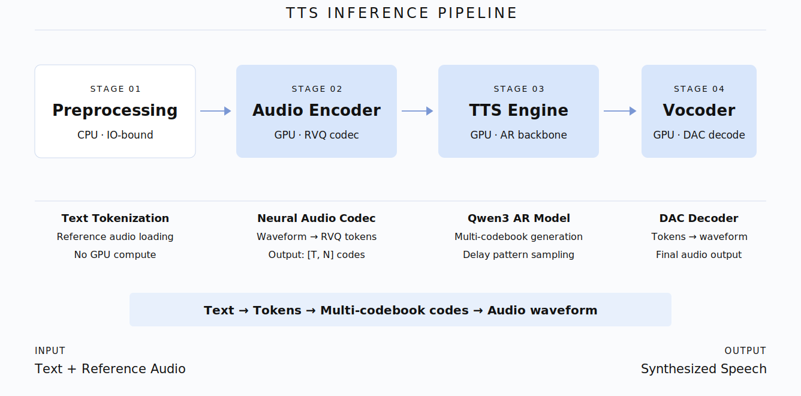

# When Duplication Reveals Structure: Rethinking What a TTS Serving Framework Should Own

At the end of [Why SGLang-Omni](./why-sglang-omni-en.md), we described an ideal for onboarding new models: *declare a topology, and leave the rest — scheduling, communication, memory management — to the framework.* This blog is about making that ideal real in the TTS subsystem — about extracting a shared serving framework from six algorithmically distinct TTS models that, despite sharing zero computation, had all independently built the same mechanical scaffolding.

Over four weeks, we refactored SGLang Omni's TTS subsystem. **[TODO @ Jiaxuan Xinyu: add the code deletion stats and figure from dashboard]** The six supported models at the time — [Higgs Audio v3](https://huggingface.co/bosonai/higgs-audio-v3-tts-4b), [MOSS-TTS](https://huggingface.co/OpenMOSS-Team/MOSS-TTS-Transformer-v1.5), [MOSS-TTS-Local](https://huggingface.co/OpenMOSS-Team/MOSS-TTS-Local-Transformer-v1.5), [Qwen3-TTS](https://huggingface.co/Qwen/Qwen3-TTS-0.6B), [FishAudio S2-Pro](https://huggingface.co/fishaudio/fish-speech-1.5), and [Voxtral-TTS](https://huggingface.co/mistralai/Voxtral-Mini-3B-2507) — each maintained their own serving lifecycle independently. The refactor consolidated the shared mechanical layers into a framework with explicit contracts, while preserving every model's computation untouched. The result was validated by three new models onboarded afterward — [Ming-Omni-TTS](https://huggingface.co/inclusionAI/Ming-omni-tts-16.8B-A3B), [Audar-TTS](https://github.com/sgl-project/sglang-omni/pull/1090), and [ZONOS2](https://huggingface.co/Zyphra/Zonos2-0.5B) — whose contributors wrote only model-specific computation, with the framework handling everything else.

Our litmus test: **a new model contributor should never need to copy or modify the framework's scheduling state machine — only understand the shared contract and implement their own hooks.**

---

## Multi-Stage TTS Inference

Unlike standard LLM serving with a single autoregressive loop, TTS inference in SGLang Omni is a *multi-stage pipeline* — each stage with distinct compute characteristics, memory profiles, and batching strategies. SGLang Omni orchestrates these stages so that model implementers can focus purely on the computation inside each one. For the full design rationale, see [Why SGLang-Omni](./why-sglang-omni-en.md); for stage-by-stage optimization details, see the [TTS optimization blog](./tts-optimization.md).

  
  
<em>Figure 1. High-level TTS inference pipeline in SGLang Omni.</em>

The refactor we describe here operates in the space *between* the scheduler and model directories — the serving mechanics that every model needs but no single model should own.

## The Boundary Principle

The refactor was guided by a single boundary principle:

> **Framework owns reusable mechanics. Model directories own model semantics.**

*Mechanics* are control flows invariant across all TTS models: the step ordering of engine bootstrap, the eviction policy for reference-audio caches, the state machine driving a streaming vocoder from chunk accumulation through decode to stream completion. *Semantics* are computations unique to each model: how a codec encodes audio, how a vocoder synthesizes waveforms, what data a pipeline state carries between stages.

With this lens, the pre-refactor state came into sharp focus. The six TTS models are algorithmically diverse — delay-pattern codebook generation, dual-AR architectures, local transformer designs — representing fundamentally different approaches to speech synthesis (detailed in the [TTS optimization blog](./tts-optimization.md)). From a computation standpoint, nothing meaningful can be merged across them. Yet from the framework standpoint, every model was independently maintaining the same mechanical scaffolding:

- **Engine bootstrap** (200–300 lines per model): checkpoint resolution, server args construction, CUDA Graph capture, scheduler assembly — all following the same invariant sequence, diverging only in model-specific overrides.
- **Pipeline state serialization**: six independent implementations with hundreds of lines total, of which only a small fraction per model expressed actual model semantics.
- **Reference-encode caching**: LRU eviction, single-flight deduplication, and failure handling — identical policies, reimplemented six times.
- **Vocoder scheduling**: batch or streaming lifecycle management, duplicated per model despite following the same state machine.

We call this pattern **mechanism duplication** — and it is harder to spot than logic duplication. When two functions compute different things but manage the same lifecycle, conventional dedup instincts do not fire. You have to shift perspective from *"what does this compute?"* to *"what control flow surrounds this computation?"* before the shared structure reveals itself.

The real cost was the invisible coupling. When OmniScheduler's interface changed, six files needed synchronized updates. When a new contributor faced six structurally similar but subtly different implementations, they could not distinguish intentional model semantics from accidental copy-paste drift.

The boundary principle implied three concrete design constraints:

- **No model-name conditionals in shared code.** Differences expressed through hooks, metadata, or declarative fields — never `if model == "xxx"`.
- **Migrate-or-delete.** No `enable_legacy` dual paths. Once migrated, old code is deleted in the same PR.
- **Hardest case validates API.** The shared hook surface must be proven on the most complex model first.

## Risk-Tiered Execution

Principles are easy to state. Safely migrating six models that real users depend on is where the work actually lives. We classified every change by behavioral risk, with escalating acceptance gates:

| Risk | What changes | Gate |
|---|---|---|
| **Green** | Pure structural extraction; runtime behavior identical | CPU contract tests |
| **Yellow** | Output-equivalent, but runtime code paths change | Accuracy gate |
| **Red** | Lifecycle semantics change | Accuracy + throughput/RTF performance gate |

The ordering was deliberate: green changes landed first, building stable contracts and test infrastructure. By the time we touched lifecycle semantics — streaming vocoders, scheduler migrations — the test harness had already proven itself on lower-risk modules. Each wave's output became the foundation the next wave stood on. The engine builder gave later modules a stable bootstrap contract. Pipeline state gave them a reliable serialization substrate. Capability metadata gave them a declarative way to express feature differences.

This gradient meant the riskiest changes were also the best-tested, since the infrastructure for testing them had already been shaken out by everything that came before.

## Design from the Hardest Case

Among the six models, two use streaming vocoders: Higgs and MOSS-TTS-Local. Higgs is straightforward — its vocoder simulates streaming through windowed chunking with overlap and crossfade. Simple cursor tracking, no persistent state across decode calls.

MOSS-TTS-Local is the hard case. It maintains a persistent causal-transformer session with KV cache spanning chunks. It manages per-request CUDA Graph slot allocation and deallocation. It coalesces multiple requests' chunks into a single decode step for throughput — requiring failure isolation so one request's error cannot poison others. And once stream metadata is written, it latches: no late modifications allowed.

The natural instinct is to start with the easy case and extend later. We rejected this explicitly. An API designed for Higgs's simplicity would break along four dimensions the moment MOSS-TTS-Local needed to express persistent sessions, graph slot lifecycle, cross-request coalescing, and contract latching. You would end up redesigning the API from scratch.

Instead, `StreamingVocoderBase` ([PR #936](https://github.com/sgl-project/sglang-omni/pull/936)) was designed starting from MOSS-TTS-Local — the base owns per-request state tracking, chunk accumulation with configurable thresholds, a four-step coalesced decode protocol (participant selection → plan → execution → failure isolation), and the stream-done termination sequence. Once MOSS-TTS-Local was fully expressed, migrating Higgs ([PR #939](https://github.com/sgl-project/sglang-omni/pull/939)) required only a subset of what the base offered.

The lesson generalizes: **when building a shared abstraction, validate on the hardest consumer first.** Simple consumers always fit into an API designed for the hard case. The reverse is almost never true — and the cost of discovering this late is a full API redesign with all consumers already coupled to the old surface.

## Migration as Audit: What Unification Reveals

FishAudio S2-Pro was among the earliest TTS models in SGLang Omni. At that time, OmniScheduler did not yet support Fish's scheduling requirements, so Fish shipped with its own bespoke scheduler. As OmniScheduler matured and became capable of expressing Fish's scheduling requirements, the migration became a natural next step.

[PR #937](https://github.com/sgl-project/sglang-omni/pull/937) migrated Fish to OmniScheduler and deleted the bespoke scheduler entirely (net −816 lines). The line count reduction was a side effect. The real value was what the migration *surfaced* — three places where the shared scheduler's stronger invariants caught latent correctness risks:

**1. Token-boundary safety.** OmniScheduler validates that sampled tokens fall within vocabulary bounds — a guard that the bespoke scheduler never enforced. Under the shared scheduler, Fish's extended vocabulary required correct boundary configuration, or every request would terminate immediately. The shared framework *enforces* a contract the old code simply never checked — meaning Fish now benefits from a safety invariant that protects all models uniformly.

**2. Cache correctness for multi-codebook prompts.** Fish encodes reference audio across multiple codebooks — two segments can share the same primary codebook sequence while differing in auxiliary codebooks. OmniScheduler's radix cache uses fingerprinting to prevent incorrect KV cache sharing. The bespoke scheduler never used radix caching at all, sidestepping the issue. Under the shared framework, the fingerprinting scheme correctly distinguishes these cases — enabling Fish to benefit from KV cache reuse without sacrificing correctness.

**3. Graceful resource management.** OmniScheduler pre-validates that requests can fit within memory budgets, rejecting oversized requests upfront with clear errors. The bespoke scheduler admitted all requests and relied on end-of-sequence tokens to eventually stop them — wasting GPU cycles on requests that could never complete. The shared framework turns a silent resource waste into an explicit, early signal.

The deeper insight: **independent implementations can appear "correct" by avoiding constraints rather than satisfying them.** The bespoke scheduler never ran into these issues because it never exercised those code paths. Migrating to a shared framework forces every invariant to be traversed by every model's traffic — turning implicit assumptions into explicit, enforced contracts. In this sense, migration is not just consolidation. It is an audit.

## Declarative State: Making Correctness Automatic

In SGLang Omni's multi-stage pipeline, state flows between stages as serialized payloads. Each TTS model defines its own pipeline state — the set of fields (tensors, scalars, metadata) that must survive the journey from one stage to the next. Before the refactor, each model hand-wrote its own serialization logic: a `to_dict` method to pack state for transport, and a `from_dict` method to unpack it on arrival.

The problem with hand-written serialization is not verbosity — it is *silent failure*. When a developer adds a new field to a pipeline state but forgets to update the serialization logic, the field exists in memory but vanishes during inter-stage transport. No error is raised. The downstream stage simply never sees the data. Debugging this requires tracing invisible data loss across process boundaries — one of the most time-consuming failure modes in distributed systems.

We addressed this by making pipeline state *declarative* ([PR #1050](https://github.com/sgl-project/sglang-omni/pull/1050)). Instead of hand-writing serialization, models declare each field's transport rule at the point of definition. The framework auto-derives serialization from these declarations. The structural guarantee: **if a field is defined, it is serialized. Forgetting is impossible.**

This also unified tensor transport across models. A typed tensor codec (exact bytes + dtype + shape) was promoted from a single model's local utility to a shared primitive — enabling all models (including later additions like Ming-Omni-TTS with float latents and ZONOS2 with keyed tensors) to transport arbitrary tensor data without reinventing the encoding. Validation confirmed byte-identical serialization output across all six state classes, with both rich payloads and default-only payloads.

## The Minimum Surface Principle

The boundary principle has a natural corollary that pushes in the opposite direction: if shared mechanics should live in the framework, then **a model directory should contain exactly the code its serving inference path consumes — nothing more.**

In practice, model directories had accumulated code that served broader purposes: vendored copies of upstream libraries (for historical compatibility), training-time utilities never called during inference, and general-purpose conversation formatters whose capabilities far exceeded what inference actually needed. None of this code was wrong — but it inflated the ownership surface, creating maintenance burden and making the true inference path harder to identify.

Three targeted PRs ([#1057](https://github.com/sgl-project/sglang-omni/pull/1057), [#1058](https://github.com/sgl-project/sglang-omni/pull/1058), [#1083](https://github.com/sgl-project/sglang-omni/pull/1083)) applied this principle — replacing vendored dependencies with pinned upstream references, narrowing general-purpose utilities to inference-only interfaces, and removing training-time model construction paths. Net result: 3,308 lines removed. More importantly, after this cleanup, reading a model directory tells you *exactly* what runs during inference — nothing extraneous, no dead code, no "maybe we'll need this later."

## Effortless Onboarding of New Models on the Shared Framework

The ultimate test of a framework refactor is not what it does for existing code — it is whether new models arrive faster, with less friction, and with production-grade behavior from day one.

Three models were onboarded after the refactor landed. [Ming-Omni-TTS](https://huggingface.co/inclusionAI/Ming-omni-tts-16.8B-A3B) and [ZONOS2](https://huggingface.co/Zyphra/Zonos2-0.5B) were built directly on shared surfaces, with their contributors focusing entirely on model-specific computation — the framework handled bootstrap, caching, state transport, and vocoder lifecycle automatically.

**[TODO @ Jiaxuan Xinyu: add LOC breakdown for Ming and ZONOS2 if data becomes available]**

The most rigorous validation came from **Audar-TTS**, which provided a controlled A/B comparison. The same model was implemented twice: once on a pre-refactor branch without shared surfaces (the control), and once on the post-refactor framework (the treatment).

| Metric | Without framework | With framework | Improvement |
|---|---:|---:|---:|
| Minimal integration (non-test LOC) | 575 | 542 | −5.7% |
| Production-equivalent (non-test LOC) | 797 | 619 | −22.3% |
| **Production capability premium** | **222** | **77** | **−65.3%** |

The *production capability premium* is the extra code needed to go from "it runs" to "it's production-ready" — reference caching, error handling, contract test coverage, lifecycle safety. That premium dropped from 222 lines to 77, because the framework now provides these capabilities for free. The model contributor writes the math; the framework supplies the production-grade machinery.

---

## Takeaways

Three lessons that extend beyond TTS, beyond SGLang Omni, to any system where multiple consumers share lifecycle patterns:

**Mechanism duplication hides in plain sight.** When functions compute different things but manage the same lifecycle, conventional dedup instincts do not fire. The trick is to shift the lens — from *what does this compute?* to *what control flow surrounds this computation?* — and suddenly the shared structure appears. Recognizing mechanism duplication is the first step toward a framework that earns its existence.

**Migration doubles as an audit.** Consolidating onto a shared framework does not just reduce code. It forces every invariant to be traversed by every model's traffic. Assumptions that independent implementations could silently avoid become contracts that the shared framework enforces for everyone. The three issues Fish's migration surfaced were not bugs — they were free safety invariants the framework now provides to all models.

**Design for the hardest case, deploy to the easiest.** If you prototype on the simplest consumer, you will redesign the API at every complexity increment. If you start from the most demanding consumer, every simpler one fits naturally. MOSS-TTS-Local's streaming requirements validated our vocoder API; Higgs needed only a subset.

---

**[TODO @ Xinyu Jiaxuan: add kudos]**
*Full design doc and PR tracker: [GitHub Issue #985](https://github.com/sgl-project/sglang-omni/issues/985).*
